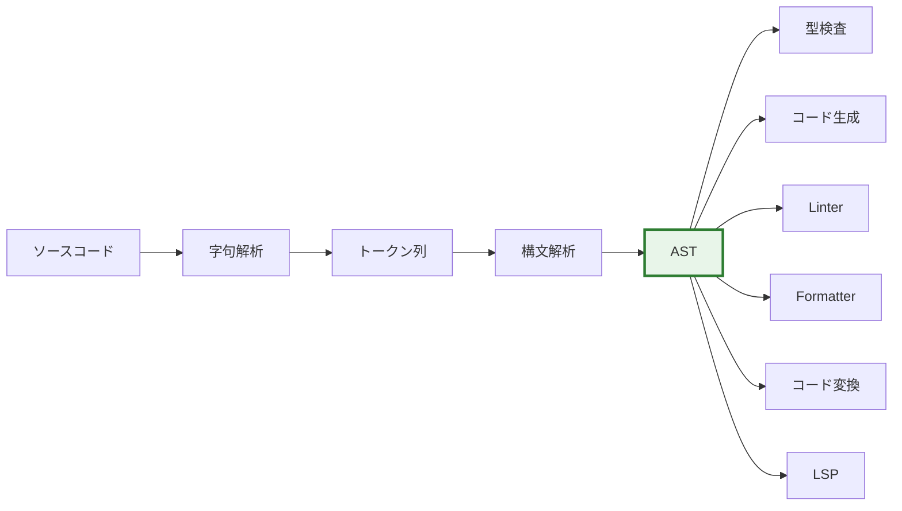
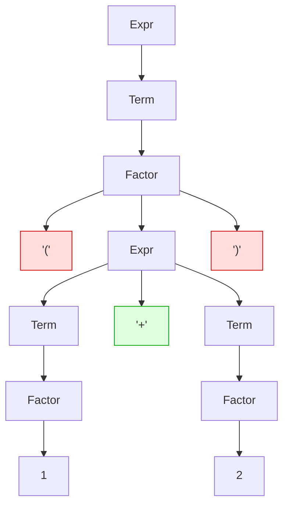
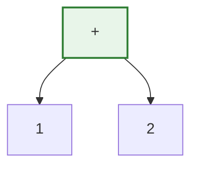
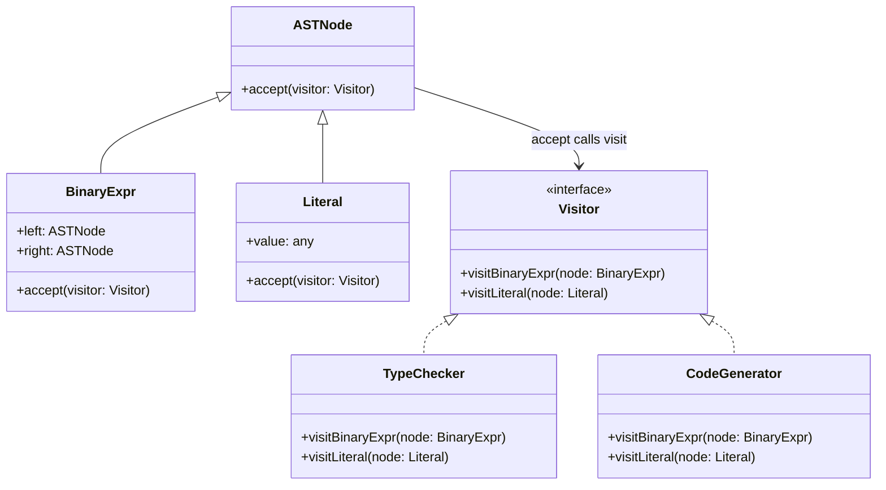
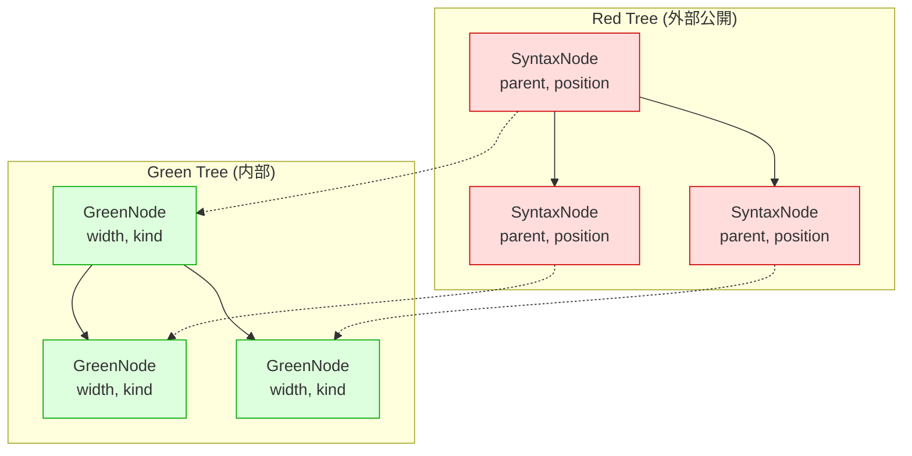
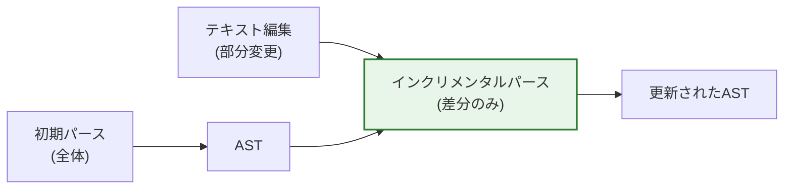
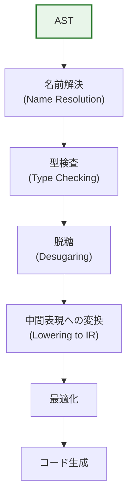
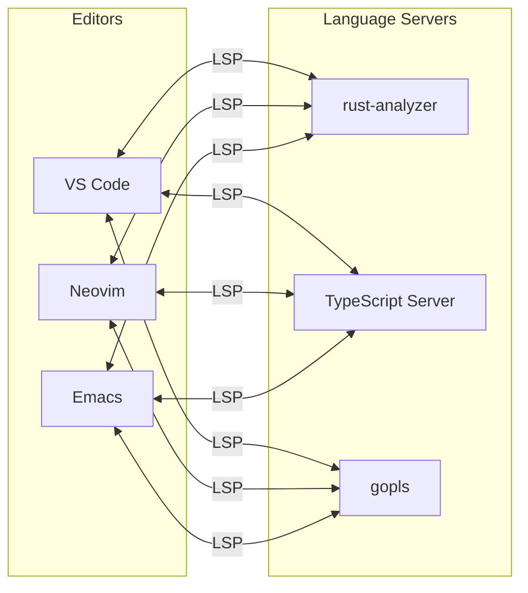
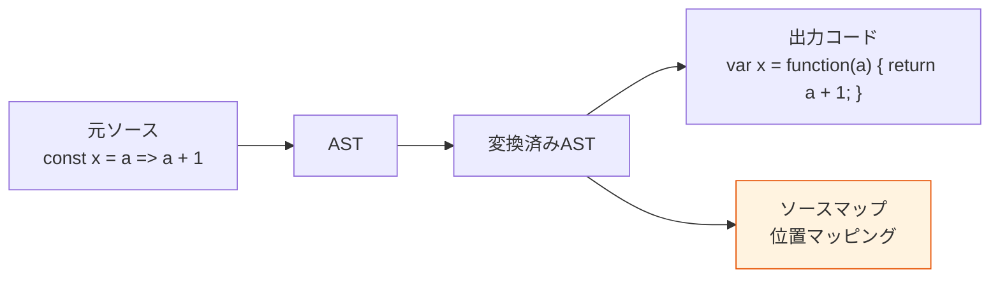
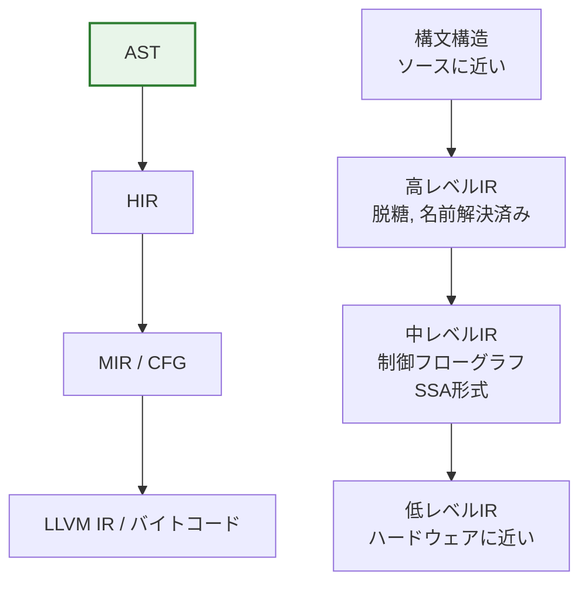

# 抽象構文木（AST）の設計と応用

## 1. はじめに：ASTとは何か

### 1.1 ソースコードから構造へ

コンパイラやインタプリタがソースコードを処理する際、テキストとして記述されたプログラムを、機械が操作しやすい構造化されたデータに変換する必要がある。この変換の結果得られる中核的なデータ構造が**抽象構文木（Abstract Syntax Tree, AST）**である。

ASTは、プログラムの構文的な構造を木（ツリー）として表現したものであり、ソースコードの**意味に関わる本質的な構造だけ**を抽出して保持する。括弧、セミコロン、カンマといった構文上の装飾（syntactic sugar）は、ASTの段階では取り除かれる。

```
ソースコード: x = 1 + 2 * 3

         =
        / \
       x   +
          / \
         1   *
            / \
           2   3
```

この例では、演算子の優先順位が木の構造として明示的に表現されている。`2 * 3` が `+` よりも先に計算されるべきことは、`*` ノードが `+` ノードの子として位置していることから自然に読み取れる。ソースコード上に括弧がなくても、木構造がその意味を正確に反映しているのである。

### 1.2 なぜASTが重要なのか

ASTが重要である理由は、プログラムの処理パイプラインにおける**中心的なハブ**としての役割にある。



ASTは単にコンパイラの内部表現として使われるだけではない。現代のソフトウェア開発エコシステムにおいて、ASTは以下のようなきわめて広範な用途を持つ。

- **コンパイラ/インタプリタ**：型検査、最適化、コード生成の入力
- **Linter（ESLint, clippy等）**：コード品質の検査
- **Formatter（Prettier, gofmt等）**：コードの自動整形
- **コード変換（Babel, jscodeshift等）**：ソースコードの自動変更
- **IDE機能（LSP）**：コード補完、リファクタリング、シンボル検索
- **ドキュメント生成**：コードからAPIドキュメントを抽出
- **セキュリティ解析**：脆弱性パターンの検出

つまり、ASTを理解することは、コンパイラの理論にとどまらず、現代の開発ツールチェーン全体を理解する鍵となる。

## 2. 具象構文木（CST）との違い

### 2.1 パースツリー（CST）とは

構文解析の結果として最初に得られるのは、文法規則をそのまま反映した**具象構文木（Concrete Syntax Tree, CST）**、あるいは**パースツリー（parse tree）**と呼ばれる木構造である。CSTは文法の生成規則に忠実であり、ソースコードのすべてのトークン——括弧、セミコロン、キーワードなど——を含む。

例として、式 `(1 + 2)` を考えよう。以下のような文法を仮定する。

```
Expr   → Term (('+' | '-') Term)*
Term   → Factor (('*' | '/') Factor)*
Factor → '(' Expr ')' | NUMBER
```

この文法に基づくCSTは、すべての中間ノード（非終端記号）と葉ノード（終端記号）を含む。



### 2.2 ASTへの変換

ASTでは、文法の中間ノード（`Expr`, `Term`, `Factor` など）や、意味に影響しない構文要素（括弧、セミコロン）を除去し、プログラムの本質的な構造だけを残す。



同じ式 `(1 + 2)` のASTは、たった3つのノードで表現される。括弧は演算子の結合順序を変えるために存在するが、木構造ではその順序が構造として表現されるため、括弧というトークン自体は不要になる。

### 2.3 CST vs AST：設計上のトレードオフ

| 観点 | CST | AST |
|------|-----|-----|
| 情報の忠実度 | ソースコードの完全な構造を保持 | 意味に関わる構造だけを保持 |
| ノード数 | 多い（文法規則の数に依存） | 少ない（意味的なノードのみ） |
| 空白・コメント | 保持可能 | 通常は保持しない |
| 用途 | Formatter、エラー回復、ソース再構築 | コンパイル、型検査、コード変換 |
| ラウンドトリップ | AST → ソースコードの完全な復元が可能 | 完全な復元は困難 |

重要な設計判断の一つが、**空白とコメントをどこに保持するか**である。純粋なASTではこれらは捨てられるが、Formatter やリファクタリングツールではソースコードを忠実に再構築する必要があるため、何らかの形で保持しなければならない。

近年のツールでは、ASTとCSTの中間的な表現を採用することが多い。たとえば、Roslyn（C#のコンパイラ基盤）は「syntax tree」と呼ぶ構造の中にトリビア（trivia）として空白やコメントを保持し、完全なラウンドトリップ（ソースコード → 構文木 → ソースコード）を可能にしている。

## 3. ASTのノード設計

### 3.1 ノードの基本構造

ASTの各ノードは、プログラムの構文的な要素を表す。典型的なノードは以下の情報を持つ。

- **ノード種別（node kind/type）**：このノードが表す構文要素の種類
- **子ノード**：このノードの構成要素
- **ソース位置情報（source location）**：元のソースコード中の行番号と列番号
- **付加情報**：型注釈、スコープ情報など（意味解析後に付与される）

TypeScript風の型定義で表現すると、以下のようになる。

```typescript
// Base interface for all AST nodes
interface Node {
  type: string;
  loc: SourceLocation;
}

interface SourceLocation {
  start: Position;
  end: Position;
}

interface Position {
  line: number;   // 1-indexed
  column: number; // 0-indexed
}
```

### 3.2 ノード型の設計パターン

ASTのノード型を定義する方法には、主に3つのパターンがある。

#### パターン1：クラス階層（Object-Oriented）

オブジェクト指向言語で最も自然なアプローチである。基底クラス `Node` を定義し、各構文要素をサブクラスとして実装する。

```java
// Base class for all AST nodes
abstract class ASTNode {
    SourceLocation location;
}

// Expression nodes
abstract class Expression extends ASTNode {}

class BinaryExpression extends Expression {
    Expression left;
    String operator;
    Expression right;
}

class NumberLiteral extends Expression {
    double value;
}

class Identifier extends Expression {
    String name;
}

// Statement nodes
abstract class Statement extends ASTNode {}

class IfStatement extends Statement {
    Expression condition;
    Statement consequent;
    Statement alternate; // nullable
}

class ReturnStatement extends Statement {
    Expression argument; // nullable
}
```

このパターンは直感的であるが、新しい操作を追加するたびにすべてのクラスを変更する必要がある（Expression Problem）。

#### パターン2：代数的データ型（Algebraic Data Types）

関数型言語や、Rust・Kotlin・Swiftのような代数的データ型を持つ言語では、判別共用体（tagged union）を用いたアプローチが自然である。

```rust
// Expression represented as an enum (sum type)
enum Expr {
    Binary {
        left: Box<Expr>,
        op: BinaryOp,
        right: Box<Expr>,
    },
    Unary {
        op: UnaryOp,
        operand: Box<Expr>,
    },
    Literal(Literal),
    Identifier(String),
    Call {
        callee: Box<Expr>,
        args: Vec<Expr>,
    },
}

enum BinaryOp {
    Add, Sub, Mul, Div, Eq, NotEq, Lt, Gt,
}

enum Literal {
    Integer(i64),
    Float(f64),
    Str(String),
    Bool(bool),
}

// Pattern matching enables exhaustive handling
fn eval(expr: &Expr) -> Value {
    match expr {
        Expr::Binary { left, op, right } => {
            let l = eval(left);
            let r = eval(right);
            apply_binary_op(op, l, r)
        }
        Expr::Literal(lit) => literal_to_value(lit),
        Expr::Identifier(name) => lookup(name),
        // ... compiler enforces all variants are handled
        _ => todo!(),
    }
}
```

代数的データ型の利点は、**網羅性検査（exhaustiveness check）**をコンパイラが保証してくれることである。新しいノード種別を追加した場合、それを処理していない `match` 式がすべてコンパイルエラーとして報告される。

#### パターン3：型付きタグ方式（Tagged Nodes）

JavaScript/TypeScriptのエコシステムで広く使われている方式で、すべてのノードがプレーンなオブジェクトであり、`type` フィールドで種別を区別する。

```typescript
// Discriminated union using 'type' field
type Expression =
  | BinaryExpression
  | UnaryExpression
  | Literal
  | Identifier
  | CallExpression;

interface BinaryExpression {
  type: "BinaryExpression";
  operator: "+" | "-" | "*" | "/";
  left: Expression;
  right: Expression;
}

interface Literal {
  type: "Literal";
  value: number | string | boolean | null;
  raw: string;
}

interface Identifier {
  type: "Identifier";
  name: string;
}
```

このパターンは、JSONとして直列化可能であり、ツール間でのASTの受け渡しが容易である。ESTree仕様（後述）はこのパターンを採用している。

### 3.3 ソース位置情報の設計

ソース位置情報は、エラーメッセージの生成、デバッグ情報、ソースマップの生成に不可欠である。位置情報の表現方法には主に2つのアプローチがある。

**行・列ペア方式**：

```typescript
interface SourceLocation {
  start: { line: number; column: number };
  end: { line: number; column: number };
}
```

**バイトオフセット方式**：

```rust
struct Span {
    start: usize, // byte offset from beginning of file
    end: usize,
}
```

バイトオフセット方式は、メモリ効率が高く（2つの整数だけ）、部分文字列の抽出が `O(1)` で行えるという利点がある。行番号が必要な場合は、ソースコードの改行位置を別途テーブルとして保持し、バイナリサーチで変換する。Rust のコンパイラ（rustc）やSwiftのコンパイラはこの方式を採用している。

## 4. Visitorパターン

### 4.1 AST走査の問題

ASTに対する操作——型検査、コード生成、最適化、Lintルールの適用——は、木を再帰的に走査しながら各ノードに対して処理を行う形をとる。素朴なアプローチとしては、各操作をノードクラスのメソッドとして実装することが考えられるが、これには大きな問題がある。

操作の数が増えるたびに、すべてのノードクラスにメソッドを追加しなければならない。型検査、コード生成、最適化、prettyprintなど、操作ごとにノードクラスが膨張していく。これはオブジェクト指向設計における「Expression Problem」の一例である。

### 4.2 Visitorパターンの仕組み

**Visitorパターン**は、GoFデザインパターンの一つであり、データ構造（ASTノード）と操作（走査・変換）を分離するための設計パターンである。



Javaによる典型的な実装を示す。

```java
// Visitor interface
interface ExprVisitor<T> {
    T visitBinaryExpr(BinaryExpr expr);
    T visitUnaryExpr(UnaryExpr expr);
    T visitLiteral(Literal expr);
    T visitIdentifier(Identifier expr);
}

// Each node has an accept method
abstract class Expr {
    abstract <T> T accept(ExprVisitor<T> visitor);
}

class BinaryExpr extends Expr {
    Expr left;
    String operator;
    Expr right;

    @Override
    <T> T accept(ExprVisitor<T> visitor) {
        return visitor.visitBinaryExpr(this);
    }
}

// A concrete visitor: expression evaluator
class Evaluator implements ExprVisitor<Double> {
    @Override
    public Double visitBinaryExpr(BinaryExpr expr) {
        double left = expr.left.accept(this);
        double right = expr.right.accept(this);
        return switch (expr.operator) {
            case "+" -> left + right;
            case "-" -> left - right;
            case "*" -> left * right;
            case "/" -> left / right;
            default -> throw new RuntimeException(
                "Unknown operator: " + expr.operator
            );
        };
    }

    @Override
    public Double visitLiteral(Literal expr) {
        return expr.value;
    }

    @Override
    public Double visitIdentifier(Identifier expr) {
        // look up variable in environment
        return environment.get(expr.name);
    }
}
```

新しい操作を追加する場合、新しいVisitorクラスを作るだけで済む。既存のノードクラスを変更する必要はない。

### 4.3 Visitorの変種

#### Listener パターン（Enter/Exit）

ANTLRが採用しているパターンで、各ノードの「入り口」と「出口」でコールバックが呼ばれる。

```java
interface ExprListener {
    void enterBinaryExpr(BinaryExpr expr);
    void exitBinaryExpr(BinaryExpr expr);
    void enterLiteral(Literal expr);
    void exitLiteral(Literal expr);
}
```

Visitorパターンと異なり、木の走査順序はフレームワーク側が制御する。ユーザーは走査の制御を気にする必要がないが、走査順序のカスタマイズが難しい。

#### 関数型アプローチ（パターンマッチ）

先に示したRustの `match` 式のように、代数的データ型に対するパターンマッチを用いるアプローチは、Visitorパターンの関数型的な対応物と見なせる。明示的なVisitorインターフェースを定義する必要がなく、コードがより簡潔になる。

### 4.4 AST変換：Transformer / Rewriter

ASTを走査するだけでなく、ASTを**変換**する場合は、Visitorの各メソッドが新しいノードを返すようにする。

```typescript
// AST transformer that replaces nodes
function transform(node: Expression, visitor: Transformer): Expression {
  switch (node.type) {
    case "BinaryExpression": {
      // Recursively transform children first (bottom-up)
      const left = transform(node.left, visitor);
      const right = transform(node.right, visitor);
      const newNode = { ...node, left, right };
      // Then let the visitor potentially replace this node
      return visitor.visitBinaryExpression?.(newNode) ?? newNode;
    }
    case "Literal":
      return visitor.visitLiteral?.(node) ?? node;
    // ...
  }
}
```

::: tip イミュータブルAST vs ミュータブルAST
多くの現代のツール（Babel、Roslyn、rustc等）は、ASTの変換において**イミュータブル（不変）**なアプローチを採用している。既存のノードを書き換えるのではなく、変更が必要なノードだけ新しいノードを作成し、変更のないサブツリーは共有する（構造共有: structural sharing）。これにより、変換前のASTが破壊されず、複数のパスが同じASTを安全に参照できる。
:::

## 5. 主要言語・ツールにおけるASTの実装

### 5.1 ESTree：JavaScriptのAST標準仕様

JavaScriptの世界では、**ESTree**仕様がAST表現のデファクトスタンダードとなっている。ESTreeはもともとFirefoxのJavaScriptエンジン（SpiderMonkey）のパーサが出力するAST形式をベースに、コミュニティによって標準化されたものである。

ESTreeの基本構造は以下の通りである。

```typescript
// ESTree node types (simplified)
interface Program {
  type: "Program";
  body: Statement[];
  sourceType: "script" | "module";
}

interface VariableDeclaration {
  type: "VariableDeclaration";
  declarations: VariableDeclarator[];
  kind: "var" | "let" | "const";
}

interface VariableDeclarator {
  type: "VariableDeclarator";
  id: Pattern;
  init: Expression | null;
}

interface FunctionDeclaration {
  type: "FunctionDeclaration";
  id: Identifier;
  params: Pattern[];
  body: BlockStatement;
  generator: boolean;
  async: boolean;
}
```

ESTree仕様に準拠するパーサは複数存在し、ツール間の相互運用性を実現している。

| パーサ | 実装言語 | 特徴 |
|--------|----------|------|
| Acorn | JavaScript | 軽量・高速、ESLintのデフォルト |
| Espree | JavaScript | AcornのフォークでESLint統合 |
| Babel Parser | JavaScript | JSX/TypeScript/Flow対応 |
| Esprima | JavaScript | 初期のESTree準拠パーサ |
| Oxc | Rust | 高速、ESTree互換のAST出力 |

ESTree仕様の重要な特徴は、ASTがプレーンなJSONオブジェクトとして表現されることである。これにより、異なるツール間でのASTの受け渡しが容易であり、ASTの永続化やデバッグも単純なJSONのシリアライズ/デシリアライズで実現できる。

### 5.2 Babel：JavaScriptのAST変換エンジン

**Babel**は、JavaScriptのトランスパイラとして最も広く使われているツールであり、その内部アーキテクチャはAST変換の典型例として教科書的である。

Babelの処理パイプラインは3つのフェーズからなる。


1. **Parse**：ソースコードをAST（Babel AST、ESTreeの拡張）に変換する
2. **Transform**：プラグインがVisitorパターンでASTを走査・変換する
3. **Generate**：変換済みASTからソースコードとソースマップを生成する

Babelプラグインの実装例を示す。以下は、アロー関数を通常の関数式に変換するプラグインの簡略版である。

```javascript
// Babel plugin: transform arrow functions to function expressions
module.exports = function () {
  return {
    visitor: {
      ArrowFunctionExpression(path) {
        // Convert () => expr to function() { return expr; }
        const { node } = path;

        // If body is an expression, wrap in return statement
        if (!node.body.type === "BlockStatement") {
          node.body = {
            type: "BlockStatement",
            body: [
              {
                type: "ReturnStatement",
                argument: node.body,
              },
            ],
          };
        }

        // Replace arrow function with function expression
        path.replaceWith({
          type: "FunctionExpression",
          id: null,
          params: node.params,
          body: node.body,
          generator: false,
          async: node.async,
        });
      },
    },
  };
};
```

Babelの `path` オブジェクトは、単なるノードの参照ではなく、親ノードへの参照、兄弟ノードの情報、スコープ情報、ノードの置換・削除・挿入などの操作メソッドを持つリッチなラッパーである。この設計により、プラグインの開発者はAST全体の整合性を気にすることなく、ローカルな変換に集中できる。

### 5.3 Roslyn：C#のコンパイラプラットフォーム

**Roslyn**（正式名称：.NET Compiler Platform）は、C#とVisual Basicのコンパイラであると同時に、コンパイラの内部データ構造（特にAST）を外部に公開するプラットフォームとして設計されている。

Roslynの設計における最も注目すべき特徴は以下の3点である。

#### イミュータブルな構文木

Roslynの構文木は完全にイミュータブルであり、スレッドセーフである。変更が必要な場合は、`With*` メソッドで新しいノードを作成する。

```csharp
// Roslyn: immutable syntax tree modification
var oldTree = CSharpSyntaxTree.ParseText("class C { void M() { } }");
var root = oldTree.GetRoot();

// Find the method declaration
var method = root.DescendantNodes()
    .OfType<MethodDeclarationSyntax>()
    .First();

// Create a new method with a different name (immutable update)
var newMethod = method.WithIdentifier(
    SyntaxFactory.Identifier("NewMethodName")
);

// Replace in the tree (returns a new tree)
var newRoot = root.ReplaceNode(method, newMethod);
```

#### トリビア（Trivia）による完全な再現性

Roslynは、空白、コメント、改行、プリプロセッサディレクティブなどを「トリビア」としてトークンに付随する形で保持する。これにより、構文木からソースコードを完全に再構築（ラウンドトリップ）できる。

```
Token: "int"
  Leading Trivia: [Whitespace("    ")]
  Trailing Trivia: [Whitespace(" ")]

Token: "x"
  Leading Trivia: []
  Trailing Trivia: []

Token: ";"
  Leading Trivia: []
  Trailing Trivia: [EndOfLine("\n")]
```

#### レッド・グリーン木（Red-Green Tree）

Roslynは内部的に2層の構文木を持つ。



- **グリーンツリー（Green Tree）**：イミュータブルで、親への参照を持たない。位置情報は相対的（幅のみ）。構造共有が可能であり、変更時に再利用できる。
- **レッドツリー（Red Tree）**：グリーンツリーのラッパーで、親への参照と絶対位置情報を持つ。オンデマンドで生成される（遅延評価）。

この2層構造により、大きなファイルの部分的な再パース時に、変更されていない部分のグリーンノードを再利用できるため、インクリメンタルな解析が効率的に行える。IDEにおけるリアルタイムの構文解析にはこの効率性が不可欠である。

### 5.4 rustcとSwift：型付きASTの例

#### rustc（Rust コンパイラ）

Rustコンパイラ（rustc）は、パーサから出力される初期AST（`rustc_ast`）と、名前解決・マクロ展開後のHIR（High-level Intermediate Representation）の2段階のAST構造を持つ。

```
ソースコード
    ↓ Parse
AST (rustc_ast)
    ↓ Macro expansion, name resolution
HIR (High-level IR)
    ↓ Type checking
THIR (Typed HIR)
    ↓ MIR lowering
MIR (Mid-level IR)
    ↓ Optimization, borrow checking
    ↓ Code generation
LLVM IR → Machine code
```

rustcのASTノードにはすべて `NodeId` が付与され、後続のフェーズで型情報やライフタイム情報を `NodeId` をキーとしたテーブルで管理する。この「ASTノード自体には型情報を持たせず、外部テーブルで管理する」というパターンは、コンパイラのフェーズを疎結合に保つ上で有効である。

#### Swift コンパイラ

Swiftコンパイラも同様に段階的なASTの変換を行う。特徴的なのは、**SwiftSyntax**ライブラリとして構文木のAPIがコンパイラの外部に公開されており、サードパーティのツール（Formatter、Linter、コード生成ツール）が直接利用できることである。

SwiftSyntaxもRoslynと同様に、完全忠実な構文木（すべてのトリビアを含む）を提供し、ラウンドトリップを保証している。

### 5.5 Tree-sitter：汎用インクリメンタルパーサ

**Tree-sitter**は、GitHubが開発したインクリメンタルパーサの生成系である。C言語で実装されたパースエンジンは、テキストの部分的な変更に対してASTを効率的に更新できる。



Tree-sitterの設計上の特徴は以下の通りである。

- **具象構文木（CST）を生成**：空白やコメントも含む完全なツリーを提供する
- **エラー回復（error recovery）**：構文エラーがあっても可能な限りパースを継続し、部分的に正しいASTを生成する
- **インクリメンタル更新**：テキストの変更範囲が小さければ、再パースも局所的に行われる
- **言語非依存**：文法定義（JavaScript DSLで記述）からパーサを自動生成する

Tree-sitterは主にエディタでのシンタックスハイライト、コード折りたたみ、構造的な選択操作に使用されている。Neovim、Helix、Zed、GitHub（コードナビゲーション機能）などが採用している。

## 6. ASTの応用

### 6.1 コンパイラにおけるAST

コンパイラにおいて、ASTは構文解析の出力であり、以降のすべてのフェーズの入力となる。



**名前解決**では、AST中の識別子がどの宣言を指すかを解決する。スコープの入れ子構造はASTの木構造と自然に対応するため、ASTを走査しながらスコープスタックを管理することで名前解決が実現できる。

**型検査**では、ASTの各ノードに型情報を付与する。`1 + "hello"` のような型エラーは、`BinaryExpression` ノードの左右の子ノードの型を比較することで検出される。

**脱糖（desugaring）**は、言語の構文糖衣を基本的な構文に変換するフェーズである。たとえば、`for...of` ループをイテレータプロトコルに基づくwhileループに変換するのは、ASTレベルでの木の書き換えとして実装される。

### 6.2 Linter におけるAST

Linterは、ASTを走査しながら「問題のあるパターン」を検出するツールである。ESLintを例にとると、各ルールはVisitorパターンで実装されている。

```javascript
// ESLint rule: disallow unused variables
module.exports = {
  create(context) {
    return {
      // Visitor method: called for every VariableDeclarator node
      VariableDeclarator(node) {
        const { id } = node;
        if (id.type === "Identifier") {
          const variable = context.getDeclaredVariables(node)[0];
          const references = variable.references;
          // Check if the variable is only written, never read
          const isUsed = references.some(
            (ref) => ref.isRead()
          );
          if (!isUsed) {
            context.report({
              node: id,
              message: `'${id.name}' is defined but never used.`,
            });
          }
        }
      },
    };
  },
};
```

Linterの本質は、ASTのパターンマッチングである。「`==` の代わりに `===` を使うべき」というルールは、`BinaryExpression` ノードの `operator` フィールドが `==` であることを検出すればよい。これは文字列の正規表現による検出よりもはるかに正確であり、コメント中の `==` を誤検出することもない。

### 6.3 Formatter におけるAST

Formatterは、ASTを入力として受け取り、一定のスタイルルールに従ってソースコードを再生成するツールである。

Formatterの中核的な課題は、**行幅の制約の中でコードをどのように折り返すか**という問題である。1970年代にDerek C. Oppen が提案したアルゴリズム（Oppen のアルゴリズム）や、Philip Wadler が提案した「prettier printer」アルゴリズムは、この問題に対する理論的な基礎を提供している。

Prettierの内部では以下のような処理が行われる。

```
ソースコード
    ↓ Parse (using parser such as Babel, TypeScript, etc.)
AST
    ↓ Print (AST → IR document)
IR (Intermediate Representation)
    ↓ Fit to line width
出力コード
```

PrettierのIRは「Doc」と呼ばれる中間表現であり、`group`, `indent`, `line`, `softline`, `hardline` などのプリミティブから構成される。ASTからDocへの変換がFormatterロジックの本体であり、Docから最終的なテキストへの変換はアルゴリズムが行幅に基づいて自動的に行う。

### 6.4 コード変換（Codemod）

大規模なコードベースにおけるAPIの移行や、非推奨パターンの一括修正には、ASTベースのコード変換（**codemod**）が用いられる。

JavaScriptエコシステムでは、**jscodeshift**がこの用途のデファクトスタンダードである。jscodeshiftはBabelのAST表現とrecastというコード生成ライブラリを組み合わせたもので、変更されたノードのみを再生成し、それ以外の部分は元のソースコードをそのまま保持する。

```javascript
// jscodeshift: rename deprecated API
// React.PropTypes.string → PropTypes.string
module.exports = function (fileInfo, api) {
  const j = api.jscodeshift;
  const root = j(fileInfo.source);

  // Find all React.PropTypes.xxx usages
  root
    .find(j.MemberExpression, {
      object: {
        type: "MemberExpression",
        object: { name: "React" },
        property: { name: "PropTypes" },
      },
    })
    .forEach((path) => {
      // Replace React.PropTypes.xxx with PropTypes.xxx
      const propType = path.node.property;
      path.replace(
        j.memberExpression(j.identifier("PropTypes"), propType)
      );
    });

  return root.toSource();
};
```

ASTベースのcodemodが正規表現による置換よりも優れている点は明白である。`React.PropTypes` が文字列リテラル内やコメント内に出現した場合を誤って変換することがなく、名前の衝突や複雑なネストも正しく処理できる。

### 6.5 セキュリティ解析

静的アプリケーションセキュリティテスト（SAST）ツールは、ASTを解析してセキュリティ上の脆弱性パターンを検出する。

```
// Dangerous pattern: SQL injection
query("SELECT * FROM users WHERE id = " + userId)

// AST analysis detects:
// CallExpression
//   callee: Identifier("query")
//   arguments:
//     BinaryExpression("+")
//       left: Literal(string)
//       right: Identifier("userId")  ← user input flows here
```

**テイント解析（taint analysis）**と呼ばれる手法では、ユーザー入力（テイントされたデータ）がASTを通じてどのように伝搬し、最終的にセキュリティ上危険な関数（シンク）に到達するかを追跡する。この解析はAST上のデータフローグラフとして表現される。

Semgrepなどのツールは、ASTのパターンマッチングをルール記述の基盤として使用しており、言語横断的なセキュリティルールの定義を可能にしている。

## 7. LSP（Language Server Protocol）とAST

### 7.1 LSPの背景

**Language Server Protocol（LSP）**は、Microsoftが2016年に提唱したプロトコルであり、IDEの言語サポート機能（コード補完、定義へのジャンプ、リファクタリングなど）を、エディタ本体から分離して言語サーバーとして実装するための標準的な通信規約である。

LSP以前は、各エディタが各言語のサポートを個別に実装する必要があり、M個のエディタ × N個の言語で M×N の実装が必要だった。LSPにより、これが M+N に削減される。



### 7.2 Language ServerとASTの関係

Language Serverの内部では、ASTが中核的なデータ構造として機能する。LSPが提供する主要な機能は、すべてAST上の操作として実装される。

| LSP機能 | AST上の操作 |
|---------|------------|
| コード補完（Completion） | カーソル位置のASTノードのコンテキストから候補を生成 |
| 定義へのジャンプ（Go to Definition） | 識別子ノードの名前解決結果を参照 |
| 参照の検索（Find References） | シンボルテーブルから該当識別子のすべての出現箇所を取得 |
| ホバー情報（Hover） | ノードに付与された型情報を表示 |
| リネーム（Rename） | 名前解決を利用してすべての出現箇所を同時に変更 |
| コードアクション（Code Actions） | ASTパターンに基づく自動修正の提案 |
| シンタックスハイライト（Semantic Tokens） | ASTノードの種別に基づく意味的な色分け |
| 折りたたみ（Folding Range） | ASTのブロック構造に基づく折りたたみ範囲の計算 |

### 7.3 インクリメンタルな解析の重要性

IDEの文脈では、ユーザーが1文字タイプするたびにAST全体を再構築するわけにはいかない。Language Serverは、テキストの変更差分を受け取り、ASTを**インクリメンタルに更新**する能力が求められる。

先述のTree-sitterやRoslynのレッド・グリーン木は、このインクリメンタルな更新を効率的に行うための設計である。

rust-analyzerは、**Salsa**フレームワーク（インクリメンタル計算フレームワーク）を用いて、ソースコードの変更に対してAST、名前解決、型検査の結果をインクリメンタルに再計算する。変更の影響を受けないモジュールの解析結果はキャッシュから再利用され、変更の影響を受ける部分だけが再計算される。

```
ファイルA変更
    ↓
ファイルAのAST再構築（インクリメンタル）
    ↓
ファイルAの名前解決再実行
    ↓
ファイルAの型検査再実行
    ↓
ファイルAに依存するファイルBの型検査再実行
    ↓
ファイルBに依存しない他のファイルは再計算不要
```

### 7.4 エラー回復とAST

IDEではソースコードが常に不完全な状態（入力途中）にあるため、パーサは構文エラーがあっても可能な限り解析を続行し、**部分的に正しいAST**を生成する能力が求められる。これを**エラー回復（error recovery）**と呼ぶ。

```
// User is typing...
fn foo() {
    let x = 1 +
    // ← cursor here, expression is incomplete
}
```

この段階でもパーサは `let` 文と不完全な式を認識し、AST上にエラーノードを挿入しつつ、それ以外の部分は正しく解析する。これにより、エラーのある行の前後でもコード補完やシンタックスハイライトが正常に機能する。

## 8. ASTとソースマップ

### 8.1 ソースマップの必要性

トランスパイラ（Babel、TypeScriptなど）やバンドラー（webpack、Viteなど）を使用すると、実際に実行されるコードはソースコードとは大きく異なる。デバッグ時にブレークポイントを設定したりスタックトレースを読むためには、実行コードの位置をソースコードの位置に逆変換する仕組みが必要である。これが**ソースマップ（source map）**である。

ソースマップの生成は、AST変換の過程で位置情報を追跡することで実現される。各ASTノードが保持するソース位置情報（`loc`/`span`）が、変換後のノードにも引き継がれ、コード生成時に「出力コードの位置 → 元ソースの位置」のマッピングが構築される。



### 8.2 位置情報の伝搬

AST変換においてソース位置情報を正しく伝搬するのは、見かけよりも複雑な問題である。一つの元ノードが複数のノードに分割される場合や、新しいノードが生成される場合、位置情報をどのように割り当てるかは慎重に設計する必要がある。

recast（jscodeshiftが内部で使用）は、この問題に対して「変更されたノードだけを再生成し、それ以外は元のソースコードをそのままコピーする」というアプローチを採用している。これにより、codemodを適用してもフォーマットの変更を最小限に抑えられる。

## 9. ASTの性能とメモリ効率

### 9.1 ノード数の爆発

実際のプログラムでは、ASTのノード数は想像以上に大きくなる。たとえば、TypeScriptコンパイラ自身のソースコード（約100万行）をパースすると、数百万のASTノードが生成される。このため、ASTのメモリ効率は現実的に重要な問題である。

### 9.2 メモリ最適化のテクニック

#### Arena アロケーション

多くのコンパイラは、ASTノードの割り当てに**アリーナアロケータ（arena allocator）**を使用する。アリーナは連続したメモリ領域から順次割り当てを行い、解放は一括で行われる。個別のノードの解放は不要であり、メモリ割り当てのオーバーヘッドが極めて小さい。

```rust
// Arena-based allocation in rustc
pub struct Arena<'tcx> {
    dropless: DroplessArena,
    // ...
}

// All AST nodes are allocated in the arena
// and freed together when the arena is dropped
let arena = Arena::default();
let node = arena.alloc(ExprKind::Binary { ... });
```

rustcでは、コンパイルの各フェーズがアリーナを持ち、フェーズが終了するとアリーナごと解放される。これにより、GC（ガベージコレクション）のオーバーヘッドなしに効率的なメモリ管理が実現されている。

#### インターニング（Interning）

ソースコード中の識別子（変数名、関数名など）は、同じ文字列が何度も出現する。**インターニング（interning）**は、同じ文字列を一度だけメモリに保持し、以降はポインタ（またはインデックス）で参照するテクニックである。

```rust
// String interning
struct Symbol(u32); // index into global string table

// "foo" appears 1000 times in source
// → stored once, referenced by Symbol(42) everywhere
```

これにより、文字列比較が整数比較に置き換わり、メモリ使用量も大幅に削減される。rustcの `Symbol` 型や、V8の `InternedString` がこのテクニックを採用している。

#### SyntaxNode のコンパクト表現

一部のパーサは、ポインタベースのツリーではなく、フラットな配列としてASTを格納する。rowan（rust-analyzerが使用するライブラリ、Roslynのグリーンツリーにインスパイアされた設計）は、ノードをフラットなイベントストリームとして格納し、必要に応じてツリー構造を再構成する。

```
// Flat representation (event stream)
[StartNode(FnDef), StartNode(Name), Token(Ident, "foo"), EndNode,
 StartNode(ParamList), Token(LParen), Token(RParen), EndNode,
 StartNode(Block), Token(LBrace), ... , Token(RBrace), EndNode,
 EndNode]
```

この表現は、メモリの局所性が高く（キャッシュフレンドリー）、割り当て回数が少ないという利点がある。

## 10. ASTの限界と補完的な表現

### 10.1 ASTの限界

ASTは構文的な構造を表現するためのものであり、以下のような情報はASTだけでは表現しきれない。

- **型情報**：`x + y` において `x` と `y` の型は何か
- **制御フロー**：プログラムの実行がどのような経路をたどりうるか
- **データフロー**：変数の値がどのように定義され、使用されるか
- **ライフタイムと所有権**：メモリの確保と解放のタイミング

これらの情報を表現するために、コンパイラはASTを基にしてさらに高度な中間表現を構築する。

### 10.2 後続の中間表現



- **HIR（High-level Intermediate Representation）**：ASTからシンタックスシュガーを除去し、名前解決を完了した表現。rustcでは、`for` ループが `loop` + `match` に展開される。
- **MIR（Mid-level Intermediate Representation）/ CFG（Control Flow Graph）**：プログラムを基本ブロックと制御フローのグラフとして表現する。ループ、条件分岐、関数呼び出しが明示的な辺（edge）として表現され、データフロー解析や最適化が容易になる。
- **SSA形式（Static Single Assignment）**：各変数が一度だけ定義される形式に変換する。これにより、データフロー解析が単純化され、多くの最適化が適用しやすくなる。

ASTはこの変換パイプラインの出発点であり、すべての後続表現はASTから導出される。

## 11. 実践：簡易ASTインタプリタの実装

ASTの概念を具体的に理解するために、簡単な算術式のインタプリタを実装してみよう。

```python
from dataclasses import dataclass
from typing import Union

# --- AST Node Definitions ---

@dataclass
class NumberLiteral:
    """Represents a numeric literal."""
    value: float

@dataclass
class BinaryExpr:
    """Represents a binary operation (e.g., 1 + 2)."""
    op: str
    left: "Expr"
    right: "Expr"

@dataclass
class UnaryExpr:
    """Represents a unary operation (e.g., -x)."""
    op: str
    operand: "Expr"

# Union type for all expression nodes
Expr = Union[NumberLiteral, BinaryExpr, UnaryExpr]


# --- Evaluator (Visitor-like pattern via pattern matching) ---

def evaluate(expr: Expr) -> float:
    """Evaluate an AST node to produce a numeric result."""
    match expr:
        case NumberLiteral(value):
            return value
        case BinaryExpr(op="+", left=l, right=r):
            return evaluate(l) + evaluate(r)
        case BinaryExpr(op="-", left=l, right=r):
            return evaluate(l) - evaluate(r)
        case BinaryExpr(op="*", left=l, right=r):
            return evaluate(l) * evaluate(r)
        case BinaryExpr(op="/", left=l, right=r):
            return evaluate(l) / evaluate(r)
        case UnaryExpr(op="-", operand=o):
            return -evaluate(o)
        case _:
            raise ValueError(f"Unknown expression: {expr}")


# --- Pretty Printer (another "visitor") ---

def pretty_print(expr: Expr, indent: int = 0) -> str:
    """Convert an AST node to a human-readable string representation."""
    prefix = "  " * indent
    match expr:
        case NumberLiteral(value):
            return f"{prefix}Number({value})"
        case BinaryExpr(op, left, right):
            lines = [
                f"{prefix}BinaryExpr({op})",
                pretty_print(left, indent + 1),
                pretty_print(right, indent + 1),
            ]
            return "\n".join(lines)
        case UnaryExpr(op, operand):
            lines = [
                f"{prefix}UnaryExpr({op})",
                pretty_print(operand, indent + 1),
            ]
            return "\n".join(lines)


# --- Example usage ---

# Represents: -(1 + 2) * 3
ast = BinaryExpr(
    op="*",
    left=UnaryExpr(
        op="-",
        operand=BinaryExpr(
            op="+",
            left=NumberLiteral(1),
            right=NumberLiteral(2),
        ),
    ),
    right=NumberLiteral(3),
)

print(pretty_print(ast))
# BinaryExpr(*)
#   UnaryExpr(-)
#     BinaryExpr(+)
#       Number(1)
#       Number(2)
#   Number(3)

print(f"Result: {evaluate(ast)}")
# Result: -9.0
```

この例では、ASTの定義（データ構造）と操作（`evaluate`, `pretty_print`）が完全に分離されている。新しい操作（コード生成、最適化など）を追加する場合、新しい関数を追加するだけでよく、ASTの定義を変更する必要はない。

## 12. まとめ

抽象構文木（AST）は、コンパイラの内部表現という出自を持ちながら、現代のソフトウェア開発エコシステムにおいて中心的な役割を担うデータ構造へと発展してきた。

本記事で見てきたように、ASTの設計と応用は以下のような広がりを持つ。

**設計の観点**では、CSTとASTの使い分け、ノード型の表現方法（クラス階層、代数的データ型、タグ付きオブジェクト）、Visitorパターンによる操作の分離、そしてイミュータブル性とメモリ効率のトレードオフが重要な設計判断となる。

**実装の観点**では、ESTree（JavaScript）、Roslyn（C#）、rustc（Rust）、SwiftSyntax（Swift）、Tree-sitter（汎用）など、各言語・ツールが独自のAST設計哲学を持ちながらも、共通の課題——インクリメンタルな更新、エラー回復、メモリ効率——に取り組んでいることがわかる。

**応用の観点**では、ASTはコンパイラにとどまらず、Linter、Formatter、コード変換（codemod）、セキュリティ解析、そしてLSPを通じたIDE機能に至るまで、開発ツールチェーン全体の基盤となっている。

Roslynのレッド・グリーン木やTree-sitterのインクリメンタルパーシングのような高度な技法は、「エディタでリアルタイムにコードを解析し、即座にフィードバックを返す」という現代の開発体験を実現するための技術的基盤である。ASTを理解することは、単にコンパイラの理論を学ぶことではなく、現代の開発ツールがどのように機能しているかを根本から理解することにつながる。

今後、AI支援コーディングやコード生成技術の発展により、ASTの重要性はさらに増すと考えられる。大規模言語モデル（LLM）が生成するコードの正しさを検証し、プログラムの意味的な構造を理解するために、ASTベースの解析は不可欠な技術基盤であり続けるだろう。
