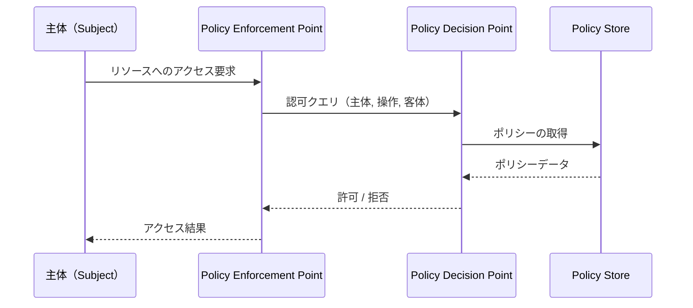
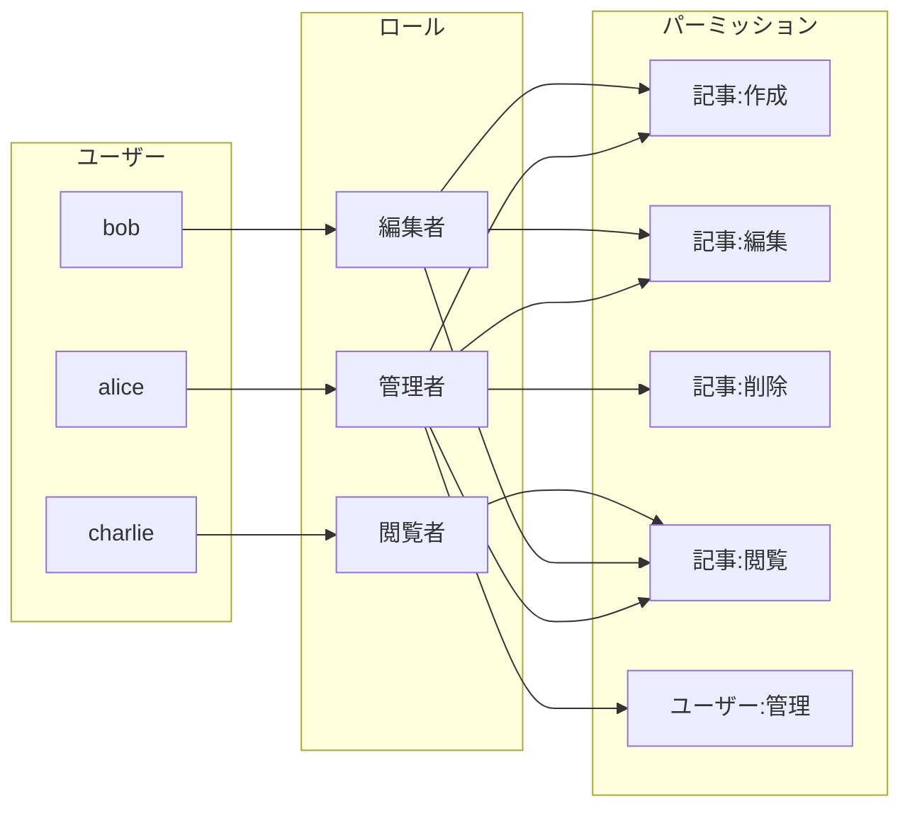
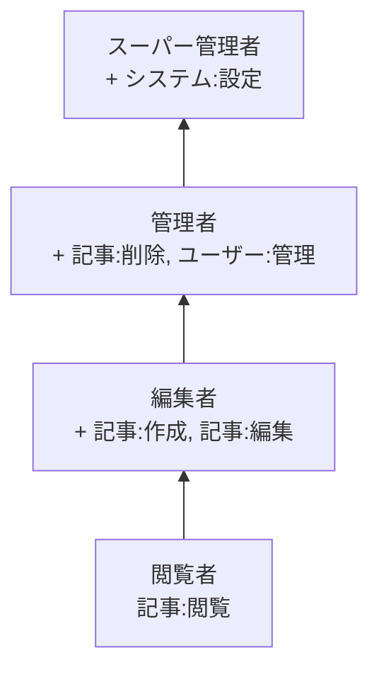
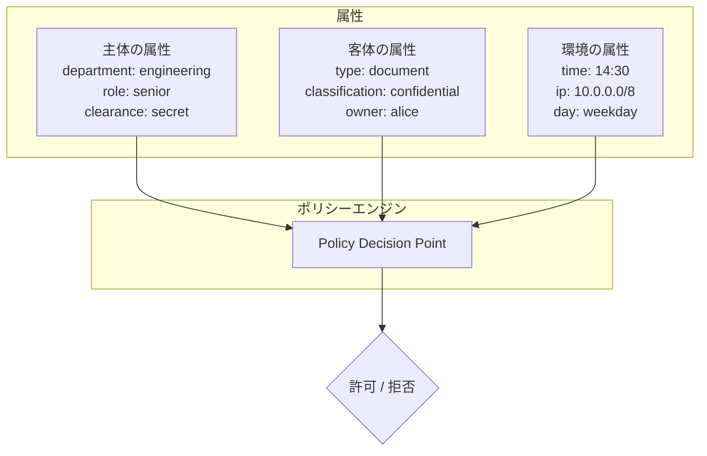
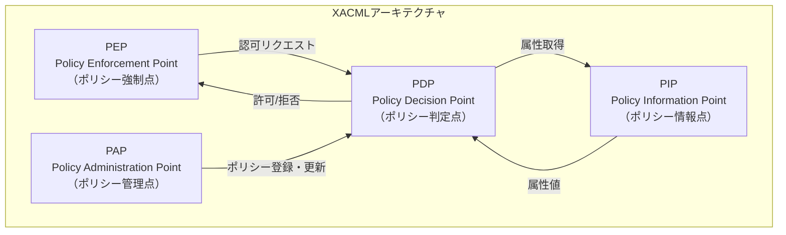
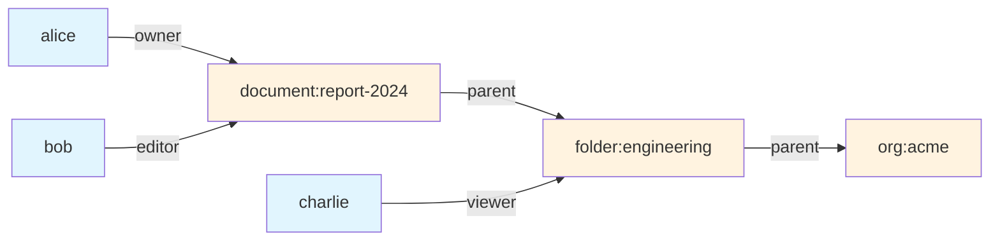
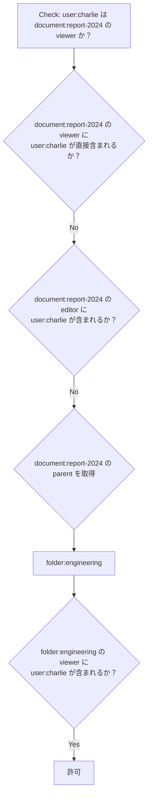
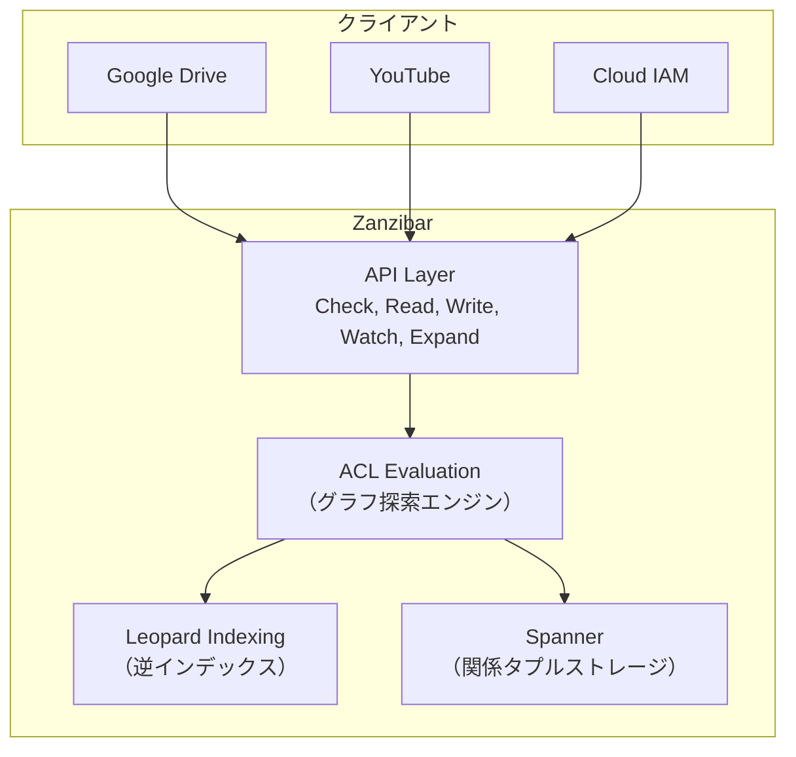
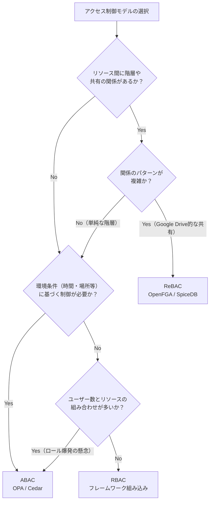
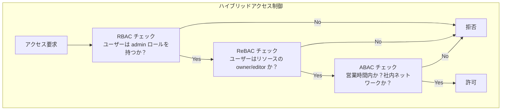

# RBAC, ABAC, ReBAC — アクセス制御モデル

## 1. アクセス制御の基本概念

### 1.1 なぜアクセス制御が必要なのか

あらゆる情報システムにおいて、「誰が」「何に対して」「何をできるか」を制御する仕組みは、セキュリティの根幹をなす。ユーザーが増え、リソースが複雑化し、組織がスケールするにつれて、アクセス制御は単なる認証の延長ではなく、独立したアーキテクチャ上の関心事となる。

認証（Authentication）が「あなたは誰か」を確認するプロセスであるのに対し、認可（Authorization）は「あなたは何をしてよいか」を判定するプロセスである。本記事が扱うのは後者、すなわち認可のモデルである。

### 1.2 アクセス制御の4要素

アクセス制御は、以下の4つの概念によって構成される。

```
+----------+         +----------+         +----------+
|  主体    |  操作   |  客体    |
| Subject  | ─────→  | Object   |
| (誰が)   | Action  | (何に)   |
+----------+ (何を)  +----------+
      │                    │
      └──── ポリシー ──────┘
            Policy
         (許可/拒否の判定規則)
```

**主体（Subject）**: アクセスを要求するエンティティ。ユーザー、サービスアカウント、プロセス、デバイスなど。

**客体（Object）**: アクセスの対象となるリソース。ファイル、データベースのレコード、API エンドポイント、ドキュメント、組織内のプロジェクトなど。

**操作（Action）**: 主体が客体に対して行おうとする行為。読み取り、書き込み、削除、実行、共有など。

**ポリシー（Policy）**: 主体が客体に対してある操作を実行できるかどうかを判定するルールの集合。アクセス制御モデルの違いは、このポリシーをどのように構造化し、表現するかの違いに帰着する。

### 1.3 アクセス制御判定の基本フロー

どのアクセス制御モデルにおいても、判定のフローは以下の共通パターンに従う。



**PEP（Policy Enforcement Point）**: ポリシーを強制する場所。APIゲートウェイ、ミドルウェア、データベースのアクセス層など。

**PDP（Policy Decision Point）**: ポリシーに基づいて許可/拒否を判定するエンジン。

**Policy Store**: ポリシーデータを保持するストレージ。

この分離は、XACML（eXtensible Access Control Markup Language）アーキテクチャで形式化されたものだが、その精神はあらゆるアクセス制御実装に通底している。

## 2. DACとMAC — アクセス制御の起源

### 2.1 DAC（任意アクセス制御）

**DAC（Discretionary Access Control）**は、UNIXのパーミッションモデルに代表されるアクセス制御方式である。「リソースの所有者がアクセス権を自由に設定できる」という原則に基づく。

```bash
# UNIX DAC example
-rwxr-xr-- 1 alice developers 4096 Mar 02 10:00 report.txt
# owner(alice): rwx, group(developers): r-x, others: r--
```

DACの本質は、**ACL（Access Control List）**にある。各リソースに対して、「誰が何をできるか」のリストを付与する。WindowsのNTFS ACL、POSIX ACLもこのモデルの拡張である。

```
ACLの構造：
  report.txt:
    alice   → read, write, execute
    bob     → read
    charlie → (no access)
```

DACの長所は理解しやすさと柔軟性にある。リソースの所有者が即座にアクセス権を変更でき、管理者の介入を必要としない。しかし、以下の根本的な問題を持つ。

- **権限の伝播が制御不能**: aliceがbobに読み取り権限を与え、bobがその内容を別のファイルにコピーしてcharlieに共有することを防げない
- **スケーラビリティの欠如**: ユーザー数 $\times$ リソース数のACLエントリが必要になり、管理が爆発的に複雑化する
- **一貫したポリシーの強制が困難**: 各所有者が独自に権限を設定するため、組織全体のセキュリティポリシーとの整合性を保証できない

### 2.2 MAC（強制アクセス制御）

**MAC（Mandatory Access Control）**は、DACの限界に対する回答として、軍事・政府機関のセキュリティ要件から生まれた。MACでは、**システム全体のセキュリティポリシーが個々のユーザーの判断に優先**する。リソースの所有者であっても、ポリシーに反するアクセス権の変更はできない。

MACの代表的なモデルに**Bell-LaPadulaモデル**がある。これは機密性を重視し、以下の2つのルールでアクセスを制御する。

- **No Read Up（Simple Security Property）**: 主体は自分のセキュリティレベルより高い客体を読み取れない
- **No Write Down（*-Property）**: 主体は自分のセキュリティレベルより低い客体に書き込めない

```
セキュリティレベル: Top Secret > Secret > Confidential > Unclassified

                          Top Secret
                        ┌─────────────┐
        ×読み取り不可    │  機密文書A   │    ○書き込み可
                        └─────────────┘
                              ↑
                              │
                          Secret
                        ┌─────────────┐
     Secret クリアランス │  文書B      │  ← 主体のレベル
     を持つユーザー      └─────────────┘
                              │
                              ↓
                          Confidential
                        ┌─────────────┐
        ○読み取り可      │  文書C      │    ×書き込み不可
                        └─────────────┘
```

MACの実装としては、SELinux（Security-Enhanced Linux）やAppArmorがある。これらはLinuxカーネルのLSM（Linux Security Modules）フレームワークを通じて、プロセスごとに詳細なアクセスポリシーを強制する。

MACは強力なセキュリティを提供するが、ポリシーの設計と管理が極めて複雑であり、一般的な業務アプリケーションには過剰な場合が多い。DACとMACの限界を踏まえて、より実用的なモデルとしてRBAC、ABAC、ReBACが発展してきた。

## 3. RBAC（ロールベースアクセス制御）

### 3.1 RBACの基本概念

**RBAC（Role-Based Access Control）**は、1992年にFerraioloとKuhnによって提案され、2004年にNIST標準（INCITS 359-2004）として策定されたアクセス制御モデルである。RBACの核心的なアイデアは、**ユーザーに直接権限を割り当てるのではなく、「ロール」という抽象レイヤーを挟む**ことにある。



この間接性がもたらすメリットは大きい。

- **管理の効率化**: 新しいユーザーにロールを割り当てるだけでよく、個別の権限設定が不要
- **ポリシーの一貫性**: ロールに紐づく権限を変更すれば、そのロールを持つすべてのユーザーに反映される
- **監査の容易さ**: 「このロールにはどの権限があるか」「このユーザーはどのロールを持つか」の2軸で権限状態を把握できる
- **最小権限の原則の支援**: 業務に必要な最小限のロールだけを割り当てることで、過剰な権限付与を防ぐ

### 3.2 NIST RBACモデルの4階層

NIST標準は、RBACを4つの階層に分類している。

**Core RBAC（基本RBAC）**: ユーザー、ロール、パーミッション、セッションの基本要素と、ユーザーとロールの多対多の関連を定義する。

**Hierarchical RBAC（階層RBAC）**: ロール間の継承関係を導入する。上位ロールは下位ロールの権限をすべて継承する。

**Static Separation of Duty（静的職務分離）**: 相互に排他的なロールの同時割り当てを禁止する。たとえば「経理担当」と「監査担当」を同一ユーザーに割り当てることを禁止し、不正を防止する。

**Dynamic Separation of Duty（動的職務分離）**: 同一セッション内で相互に排他的なロールの同時活性化を禁止する。ユーザーが両方のロールを持つことは許されるが、同時に有効化することはできない。

### 3.3 階層ロールの設計

階層RBACは、組織構造をロールの継承関係として表現する。



この図で、矢印の方向は権限の継承を表す。「編集者」は「閲覧者」の権限をすべて含み、さらに独自の権限が追加される。こうすることで、ロールの定義が冗長にならず、変更時の影響範囲も明確になる。

実際のシステムでの実装例を示す。

```python
class Role:
    def __init__(self, name, permissions=None, parent=None):
        self.name = name
        self._permissions = permissions or set()
        self.parent = parent

    @property
    def permissions(self):
        """Return all permissions including inherited ones."""
        perms = set(self._permissions)
        if self.parent:
            perms |= self.parent.permissions
        return perms

# Define role hierarchy
viewer = Role("viewer", {"article:read"})
editor = Role("editor", {"article:create", "article:edit"}, parent=viewer)
admin = Role("admin", {"article:delete", "user:manage"}, parent=editor)

def check_permission(user_roles, required_permission):
    """Check if any of the user's roles grant the required permission."""
    return any(
        required_permission in role.permissions
        for role in user_roles
    )
```

### 3.4 RBACの限界

RBACは広く普及し、多くのシステムの基盤となっているが、以下の場面で限界が露呈する。

**コンテキスト依存のアクセス制御**: 「営業時間内のみアクセス可能」「社内ネットワークからのみ」といった条件付きの制御が困難。ロールはユーザーの属性に基づかず、静的な割り当てだからである。

**きめ細かい権限制御**: 「自分が作成した記事だけ編集可能」というルールをRBACで表現するには、ユーザーごとにロールを動的に生成するか、アプリケーション層で追加のチェックを行う必要がある。

**ロール爆発（Role Explosion）**: 条件の組み合わせに対応しようとすると、ロールの数が爆発的に増加する。たとえば、3つの部門 × 4つのプロジェクト × 3つの権限レベル = 36個のロールが必要になる。組織やリソースが増えるほど、この問題は深刻化する。

```
ロール爆発の例:
  engineering-project-a-admin
  engineering-project-a-editor
  engineering-project-a-viewer
  engineering-project-b-admin
  engineering-project-b-editor
  engineering-project-b-viewer
  sales-project-a-admin
  sales-project-a-editor
  ...
  → 組み合わせが指数的に増大
```

## 4. ABAC（属性ベースアクセス制御）

### 4.1 ABACの基本概念

**ABAC（Attribute-Based Access Control）**は、RBACのロール爆発問題に対する解答として発展したモデルである。ABACでは、アクセス判定に**属性（Attribute）**を直接使用する。



ABACでは、アクセス判定に使用する属性を3つのカテゴリに分類する。

**主体の属性（Subject Attributes）**: ユーザーの部門、役職、クリアランスレベル、所属グループなど。

**客体の属性（Object Attributes）**: リソースの種類、機密度、所有者、作成日時など。

**環境の属性（Environment Attributes）**: アクセス時刻、ネットワーク位置、デバイスの種類、リスクスコアなど。

ABACの強みは、これらの属性を組み合わせた**論理式**としてポリシーを記述できる点にある。RBACでロール爆発が発生するケースも、ABACでは少数のポリシールールで表現可能である。

### 4.2 ポリシー記述の実例

ABACポリシーの記述には様々な形式があるが、ここでは擬似コードと代表的なポリシー言語の例を示す。

**擬似コードによるポリシー**:

```
RULE: "Engineering部門のメンバーは自部門のドキュメントを編集可能"
  CONDITION:
    subject.department == object.department AND
    subject.department == "engineering" AND
    action == "edit"
  EFFECT: PERMIT

RULE: "機密文書は営業時間内かつ社内ネットワークからのみアクセス可能"
  CONDITION:
    object.classification == "confidential" AND
    environment.time >= 09:00 AND
    environment.time <= 18:00 AND
    environment.ip IN "10.0.0.0/8"
  EFFECT: PERMIT

RULE: "ドキュメントの所有者は常にフルアクセス可能"
  CONDITION:
    subject.id == object.owner_id
  EFFECT: PERMIT
```

**OPA（Open Policy Agent）のRegoによるポリシー**:

```rego
package authz

# Default deny
default allow := false

# Owner can always access their own resources
allow if {
    input.subject.id == input.object.owner_id
}

# Engineering members can edit department documents during business hours
allow if {
    input.action == "edit"
    input.subject.department == "engineering"
    input.object.department == "engineering"
    time.clock(time.now_ns()) >= [9, 0, 0]
    time.clock(time.now_ns()) <= [18, 0, 0]
}

# Managers can approve requests from their department
allow if {
    input.action == "approve"
    input.subject.role == "manager"
    input.subject.department == input.object.department
}
```

### 4.3 XACMLアーキテクチャ

ABAC の標準仕様として最も影響力があるのが**XACML（eXtensible Access Control Markup Language）**である。OASIS が策定したXMLベースのポリシー言語であり、アクセス制御システムの参照アーキテクチャも定義している。



XACMLのポリシー構造はPolicySet > Policy > Rule の3階層であり、各レベルで結合アルゴリズム（combining algorithm）を指定できる。主な結合アルゴリズムは以下の通り。

- **deny-overrides**: 1つでもDenyがあればDeny
- **permit-overrides**: 1つでもPermitがあればPermit
- **first-applicable**: 最初にマッチしたルールの結果を採用
- **only-one-applicable**: 適用可能なポリシーが1つだけの場合にその結果を採用

### 4.4 ABACの長所と課題

**長所**:

- **表現力**: ロール、属性、環境条件を自由に組み合わせた細粒度のポリシーが記述可能
- **スケーラビリティ**: ロール爆発を回避し、少数のポリシーで多数のアクセスパターンをカバーできる
- **コンテキスト対応**: 時間、場所、デバイスなどの環境条件を判定に組み込める
- **動的**: ユーザーの属性が変わればアクセス権も自動的に変化する

**課題**:

- **ポリシーの複雑さ**: 論理式が複雑になると、ポリシーの正しさを検証しにくくなる
- **属性管理のオーバーヘッド**: 属性値を最新に保つためのインフラが必要
- **デバッグの困難さ**: アクセスが拒否されたとき、どのポリシーのどの条件が原因かを特定しにくい
- **パフォーマンス**: 属性の取得とポリシー評価のオーバーヘッドが発生する

## 5. ReBAC（関係ベースアクセス制御）

### 5.1 ReBACの基本概念

**ReBAC（Relationship-Based Access Control）**は、主体と客体の**関係（Relationship）**に基づいてアクセスを判定するモデルである。2010年代後半にGoogleの大規模システムで実用化され、Zanzibarの論文（2019年）によって広く知られるようになった。

ReBACの核心的な洞察は、「アクセス権限はグラフ上の関係として表現するのが最も自然」ということである。



この図で、Charlieは直接 `document:report-2024` への権限を持たないが、`folder:engineering` のviewerであり、そのフォルダが `document:report-2024` の親であるため、関係の**推移的な辿り**によってドキュメントの閲覧権限を導出できる。

ReBACでは、以下の2つの要素でアクセス制御を構成する。

**関係タプル（Relationship Tuple）**: 「誰が」「何に対して」「どのような関係を持つか」を表す三つ組。

```
user:alice  | owner  | document:report-2024
user:bob    | editor | document:report-2024
user:charlie| viewer | folder:engineering
document:report-2024 | parent | folder:engineering
folder:engineering   | parent | org:acme
```

**認可モデル（Authorization Model）**: 関係の定義と、どの関係がどのパーミッションを導出するかのルール。

### 5.2 認可モデルの設計

ReBACの認可モデルは、各リソースタイプに対してどのような関係が定義でき、それらがどのように権限を導出するかを宣言的に記述する。

```
type document
  relations
    define owner: [user]
    define editor: [user] or owner
    define viewer: [user] or editor or viewer from parent
    define parent: [folder]

type folder
  relations
    define owner: [user]
    define editor: [user] or owner
    define viewer: [user] or editor or viewer from parent
    define parent: [org]

type org
  relations
    define owner: [user]
    define member: [user] or owner
    define viewer: [user] or member
```

上記のモデルでは、以下のような権限の導出が可能になる。

1. `document:report-2024` の `owner` は `user:alice` → aliceはowner
2. `document:report-2024` の `editor` は `owner or [user]` → aliceはeditorでもある
3. `document:report-2024` の `viewer` は `editor or viewer from parent` → alice, bobはviewer。さらにparentが `folder:engineering` で、charlieはそのviewerなので、charlieもviewerとして導出される

この「viewer from parent」という表現が、ReBACの最も強力な特徴である。関係のグラフを辿ることで、明示的に宣言されていないアクセス権限を推論できる。

### 5.3 Check APIの仕組み

ReBACにおけるアクセス判定（Check）は、関係グラフ上の到達可能性問題に帰着する。



この探索は深さ優先探索または幅優先探索で実装でき、探索の深さに上限を設けることで無限ループを防止する。大規模システムでは、この探索をミリ秒単位で完了させるための最適化が重要になる。

## 6. Google Zanzibar — 惑星規模の認可システム

### 6.1 Zanzibarの背景

**Google Zanzibar**は、Googleが社内で運用する統一認可システムであり、2019年にUSENIX ATCで公開された論文「Zanzibar: Google's Consistent, Global Authorization System」で詳細が明らかになった。Zanzibar は Google Drive、YouTube、Cloud IAM、Google Maps など、Googleの主要サービスにおける数兆件のACLと毎秒数百万件の認可チェックを処理する。

Zanzibarが解決する課題は明確である。Googleのような巨大組織では、数十のサービスがそれぞれ独自の認可ロジックを持つことの非効率さと不整合が深刻な問題となっていた。Zanzibar は、ReBAC をベースにした統一的な認可サービスを提供することで、この問題を解決した。

### 6.2 Zanzibarのデータモデル

Zanzibar の中核は**関係タプル（Relation Tuple）**である。すべてのアクセス関係は以下の形式で表現される。

```
⟨object#relation@user⟩
```

具体例:

```
doc:readme#owner@user:10        # user:10 は doc:readme の owner
doc:readme#parent@folder:eng    # doc:readme の parent は folder:eng
folder:eng#viewer@user:20       # user:20 は folder:eng の viewer
group:eng#member@user:10        # user:10 は group:eng の member
folder:eng#viewer@group:eng#member  # group:eng の member は folder:eng の viewer
```

最後の例は**ユーザーセット（Userset）**と呼ばれ、個別のユーザーではなく「あるオブジェクトのある関係を持つ全ユーザー」をまとめて参照する。これにより、「グループのメンバー全員にフォルダの閲覧権限を付与する」といった表現が1つのタプルで可能になる。

### 6.3 Namespace Config（認可モデル）

Zanzibar では**Namespace Config**と呼ばれる設定で、各リソースタイプの関係と権限導出ルールを定義する。

```
name: "doc"
relation {
  name: "owner"
}
relation {
  name: "editor"
  userset_rewrite {
    union {
      child { _this {} }
      child { computed_userset { relation: "owner" } }
    }
  }
}
relation {
  name: "viewer"
  userset_rewrite {
    union {
      child { _this {} }
      child { computed_userset { relation: "editor" } }
      child {
        tuple_to_userset {
          tupleset { relation: "parent" }
          computed_userset { relation: "viewer" }
        }
      }
    }
  }
}
```

このモデルは以下を表現している。

- `editor` は、直接 editor として割り当てられたユーザー、または owner
- `viewer` は、直接 viewer として割り当てられたユーザー、editor、または **parent の viewer**（権限の継承）

`tuple_to_userset` は ReBAC における関係の推移的な辿りを実現する中核的な概念であり、「あるタプルで参照されるオブジェクトの、ある関係を持つユーザーセット」を意味する。

### 6.4 Zanzibarのアーキテクチャ



Zanzibar の主要API:

- **Check**: `user U は object O に対して relation R を持つか？` — 最も頻繁に使用される認可チェック
- **Read**: 特定のオブジェクトに関連するタプルを取得
- **Write**: タプルの追加・削除
- **Watch**: タプルの変更をストリーミングで監視
- **Expand**: あるオブジェクトのある関係を持つすべてのユーザーを展開

### 6.5 一貫性モデルとZookies

分散システムにおいて、「タプルを書き込んだ直後にCheckを実行したら、新しいタプルが反映されているか？」は重要な問題である。Zanzibar は**Zookie（Zanzibar cookie）**と呼ばれるトークンでこの問題を解決する。

Zookie は Google Spanner のタイムスタンプに基づくオパークなトークンであり、以下のような一貫性保証を提供する。

```
1. Write: doc:readme#editor@user:30 → Zookie Z1 が返される
2. Check(zookie=Z1): user:30 は doc:readme の viewer か？ → 必ず true

  Zookie Z1 は「この時点以降のスナップショットで評価せよ」を意味する
```

Zookieの設計は、Zanzibarが**New Enemy問題**に対処するための仕組みである。New Enemy問題とは、「ユーザーのアクセス権を剥奪した後も、古いスナップショットを使った評価によってアクセスが許可されてしまう」問題である。

```
New Enemy問題の例:
  t=1: user:alice は doc:secret の viewer
  t=2: admin が alice の viewer 権限を剥奪
  t=3: alice が Check を実行

  もし t=3 の Check が t=1 のスナップショットで評価されると、
  alice にアクセスが許可されてしまう

  → Zookie によって「少なくとも t=2 以降のスナップショットで評価」を保証
```

### 6.6 パフォーマンス最適化

Zanzibar は毎秒数百万件のCheck要求を処理するために、以下の最適化を行っている。

**Leopard Indexing System**: 関係グラフの逆インデックスを構築し、よくアクセスされるパスの探索結果をキャッシュする。グループメンバーシップの展開など、頻繁に参照される計算結果を事前に計算しておくことで、Check のレイテンシを大幅に削減する。

**リクエストの重複排除**: 同一の Check リクエストが短時間に多数到着した場合、最初のリクエストの結果を共有する。

**評価の打ち切り**: Check は `union`（OR）セマンティクスの場合、最初に true を返したブランチが見つかった時点で残りの評価を打ち切る。

**キャッシュ**: 各サーバーにローカルキャッシュを持ち、Spanner への読み取りを最小化する。キャッシュの鮮度は Zookie の仕組みで保証される。

論文によると、Zanzibar は95パーセンタイルのレイテンシが10ミリ秒未満、99パーセンタイルでも20ミリ秒未満を達成している。

## 7. オープンソース実装

### 7.1 OpenFGA

**OpenFGA**は、Zanzibar にインスパイアされたオープンソースの認可エンジンである。元々はAuth0（現Okta）によって開発され、現在はCNCF（Cloud Native Computing Foundation）のインキュベーティングプロジェクトとして開発が進んでいる。

OpenFGAの認可モデルはDSL（Domain-Specific Language）で記述する。

```
model
  schema 1.1

type user

type document
  relations
    define owner: [user]
    define editor: [user] or owner
    define viewer: [user] or editor or viewer from parent
    define parent: [folder]

type folder
  relations
    define owner: [user]
    define viewer: [user] or owner or viewer from parent
    define parent: [org]

type org
  relations
    define owner: [user]
    define member: [user] or owner
    define viewer: [user] or member
```

OpenFGA はgRPCとHTTP APIを提供し、以下の操作が可能である。

```bash
# Write a relationship tuple
curl -X POST http://localhost:8080/stores/{store_id}/write \
  -H "Content-Type: application/json" \
  -d '{
    "writes": {
      "tuple_keys": [
        {
          "user": "user:alice",
          "relation": "owner",
          "object": "document:report-2024"
        }
      ]
    }
  }'

# Check authorization
curl -X POST http://localhost:8080/stores/{store_id}/check \
  -H "Content-Type: application/json" \
  -d '{
    "tuple_key": {
      "user": "user:alice",
      "relation": "viewer",
      "object": "document:report-2024"
    }
  }'
# Response: { "allowed": true }
```

OpenFGAの特徴:

- **Playground**: ブラウザ上でモデルを設計・テストできるビジュアルツール
- **条件付きタプル（Conditions）**: タプルにJSONの条件を付与できる（ABAC的な機能の取り込み）
- **複数ストアのサポート**: マルチテナント対応
- **高い言語サポート**: Go, JavaScript, Python, Java, .NET 向けのSDKを提供

### 7.2 SpiceDB

**SpiceDB**は、Authzedが開発するZanzibarインスパイアの認可データベースである。SpiceDBはZanzibarの設計に忠実であり、特にスキーマ言語の表現力と一貫性の保証に注力している。

SpiceDBのスキーマ言語:

```
definition user {}

definition document {
    relation owner: user
    relation editor: user
    relation viewer: user
    relation parent: folder

    permission edit = owner + editor
    permission view = edit + viewer + parent->view
}

definition folder {
    relation owner: user
    relation viewer: user
    relation parent: org

    permission view = owner + viewer + parent->view
}

definition org {
    relation owner: user
    relation member: user

    permission view = owner + member
}
```

SpiceDB は `permission` と `relation` を明確に区別する。`relation` は直接書き込み可能な関係であり、`permission` は `relation` から導出される計算済みの権限である。`parent->view` という構文は、Zanzibar の `tuple_to_userset` に対応する。

SpiceDB の特徴:

- **ZedToken**: Zanzibar の Zookie に対応する一貫性トークン
- **Caveats**: 条件付きの権限チェック（「weekday かつ business hours のみ」など）
- **Schema Validation**: スキーマの変更が既存のデータと矛盾しないことを検証
- **Watch API**: 関係タプルの変更をストリーミングで監視

### 7.3 Ory Permissions（Keto）

**Ory Keto**（現 Ory Permissions）は、Ory社が開発するオープンソースの認可サービスである。Ory のアイデンティティ管理エコシステム（Kratos, Hydra, Oathkeeper）と統合して使用されることが多い。

Keto は Zanzibar の関係タプルモデルを採用しつつ、REST/gRPC APIを提供する。

### 7.4 OPA（Open Policy Agent）

**OPA（Open Policy Agent）**は、CNCFの卒業プロジェクトであり、汎用的なポリシーエンジンである。ReBAC専用ではなく、ABAC的なポリシーをRegoという独自言語で記述する。

```rego
package document.authz

import rego.v1

default allow := false

# Owner has full access
allow if {
    input.user == data.documents[input.document_id].owner
}

# Editor can read and write
allow if {
    input.action in ["read", "write"]
    input.user in data.documents[input.document_id].editors
}

# Viewer can only read
allow if {
    input.action == "read"
    input.user in data.documents[input.document_id].viewers
}
```

OPAはKubernetesのAdmission ControllerやEnvoyのExternal Authorizationなど、インフラストラクチャ層での利用が多く、アプリケーション層のきめ細かいReBAC的な認可にはOpenFGAやSpiceDBが適している。

## 8. 各モデルの比較

### 8.1 表現力

| 要件 | RBAC | ABAC | ReBAC |
|------|------|------|-------|
| ロールに基づく権限 | 得意 | 可能 | 可能 |
| 属性に基づく条件付きアクセス | 困難 | 得意 | Caveats等で部分対応 |
| リソース間の継承関係 | 困難 | 困難 | 得意 |
| 「自分のリソースだけ」 | 困難 | 可能 | 得意（owner関係） |
| 共有とコラボレーション | 困難 | 困難 | 得意 |
| 時間・場所の条件 | 不可 | 得意 | 条件付きタプルで部分対応 |

### 8.2 スケーラビリティ

| 観点 | RBAC | ABAC | ReBAC |
|------|------|------|-------|
| ユーザー数のスケール | ロール数に依存 | 属性評価コスト | グラフ探索コスト |
| リソース数のスケール | ロール爆発の危険 | ポリシー数に依存 | タプル数に比例 |
| ポリシー変更の影響範囲 | ロール単位 | ポリシールール単位 | 関係の局所的変更 |
| 判定のレイテンシ | 低い（ルックアップ） | 中程度（属性取得+評価） | 中程度（グラフ探索） |

### 8.3 管理コスト

| 観点 | RBAC | ABAC | ReBAC |
|------|------|------|-------|
| 初期導入の容易さ | 容易 | 中程度 | 中程度 |
| ポリシーの理解しやすさ | 直感的 | ルールが複雑化しやすい | グラフは直感的 |
| デバッグの容易さ | 容易 | 困難 | 中程度（グラフ可視化） |
| 監査対応 | ロール割り当ての一覧 | ポリシーの網羅的レビュー | 関係タプルの一覧 |

### 8.4 モデルの選択フローチャート



## 9. 実務での選択基準

### 9.1 シンプルなシステムにはRBAC

多くの業務アプリケーションでは、RBACで十分な場合が多い。以下のケースではRBACが最適解である。

- ユーザーの権限が「ロール」で明確に区分できる（管理者、編集者、閲覧者）
- リソース間の権限継承が不要
- ユーザー数とロールの組み合わせが管理可能な範囲
- フレームワークの組み込みRBAC機能で対応できる

Railsの`cancancan`、Spring Securityのロール機能、Djangoの`django-guardian`など、主要フレームワークはRBACのサポートを標準で備えている。

### 9.2 条件付きアクセスにはABAC

以下のケースではABACが適している。

- アクセス判定に環境条件（時間、場所、デバイス、リスクスコア）を組み込みたい
- コンプライアンス要件で「営業時間内のみ」「特定のネットワークからのみ」といった制約がある
- ユーザーの属性（部門、クリアランスレベル）に基づく動的なアクセス制御が必要
- 多数の属性の組み合わせに基づくきめ細かいポリシーが必要

OPA/Regoは汎用的なポリシーエンジンとして、KubernetesのAdmission ControllerからAPIゲートウェイまで幅広く利用されている。AWS Verified Permissions ではAmazon独自のCedarポリシー言語を使ったABAC/ReBACのハイブリッドが提供されている。

### 9.3 共有・コラボレーションにはReBAC

以下のケースではReBACが最適である。

- Google Drive、Notion、GitHubのような共有・コラボレーション機能
- リソース間にフォルダ階層やオーナーシップの関係がある
- 「このドキュメントをこの人に共有」という個別のアクセス権付与が頻繁に行われる
- 組織 > チーム > プロジェクト > リソースという多段階の権限継承が必要

### 9.4 ハイブリッドアプローチ

実際のシステムでは、単一のモデルで全てをカバーすることは稀であり、複数のモデルを組み合わせるハイブリッドアプローチが一般的である。



たとえば、以下のような組み合わせが考えられる。

1. **RBAC + ReBAC**: グローバルなロール（admin, user）はRBACで管理し、リソースレベルの共有はReBACで管理する
2. **ReBAC + ABAC**: 関係ベースの基本的なアクセス制御にABACの条件（時間、場所）を追加する
3. **RBAC + ABAC**: ロールに環境条件を付加する（「admin ロールだが営業時間外は読み取り専用」）

OpenFGAのConditionsやSpiceDBのCaveatsは、ReBAC にABAC的な条件を組み合わせるための機能である。これにより、単一のシステムでハイブリッドなアクセス制御を実現できる。

### 9.5 導入時の実践的な考慮点

**パフォーマンス**: 認可チェックはリクエストパスのクリティカルパスに入る。P99レイテンシの要件を明確にし、キャッシュ戦略を設計する。

**一貫性**: 権限の変更がいつ反映されるかの要件を整理する。即座に反映されなければならない場合（権限剥奪）と、多少の遅延が許容される場合（権限付与）で戦略を変える。

**監査ログ**: コンプライアンス要件に応じて、すべての認可判定（許可・拒否の両方）をログに記録する。

**テスト**: 認可ロジックは単体テストが書きやすい領域である。OpenFGAとSpiceDBの両方がテスト用のツールを提供している。

**段階的な移行**: 既存のRBACからReBACへの移行は一度に行わず、新機能から段階的に導入する。既存のロールベースのポリシーをReBACのタプルに変換し、並行運用して結果を比較する方法が推奨される。

## 10. まとめ

アクセス制御は、セキュリティの根幹であると同時に、アプリケーションアーキテクチャの中心的な設計判断である。

DACとMACから始まったアクセス制御の歴史は、RBACの「ロール」という抽象の導入によって実用性を高め、ABACの「属性」による柔軟な条件記述で表現力を拡張し、ReBACの「関係」によるグラフベースの権限モデルで共有・コラボレーション時代の要件に応えるに至った。

Google Zanzibarは、ReBACを惑星規模で実現した最初のシステムとして、認可アーキテクチャの在り方を決定的に変えた。OpenFGAやSpiceDBといったオープンソース実装により、Zanzibarの設計思想は一般のシステムにも利用可能になっている。

重要なのは、これらのモデルが互いに排他的ではないということである。実際のシステムでは、RBACのシンプルさ、ABACの柔軟性、ReBACの関係表現力を組み合わせたハイブリッドアプローチが最も実用的である。アクセス制御モデルの選択は、システムの要件、組織の成熟度、運用コストを総合的に勘案して判断すべきである。
