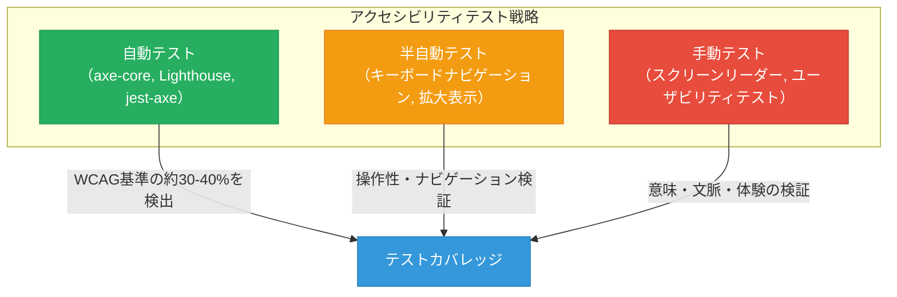
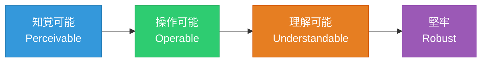
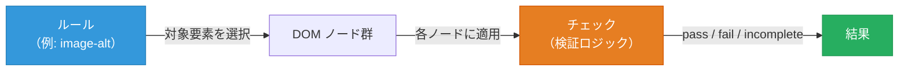
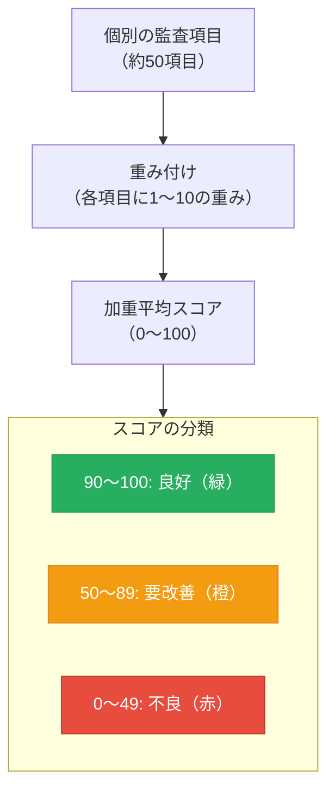
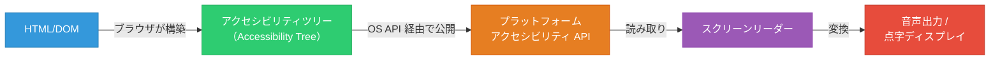
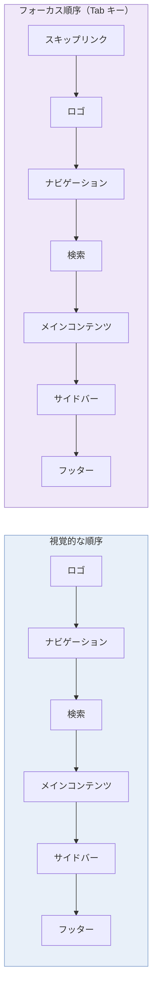
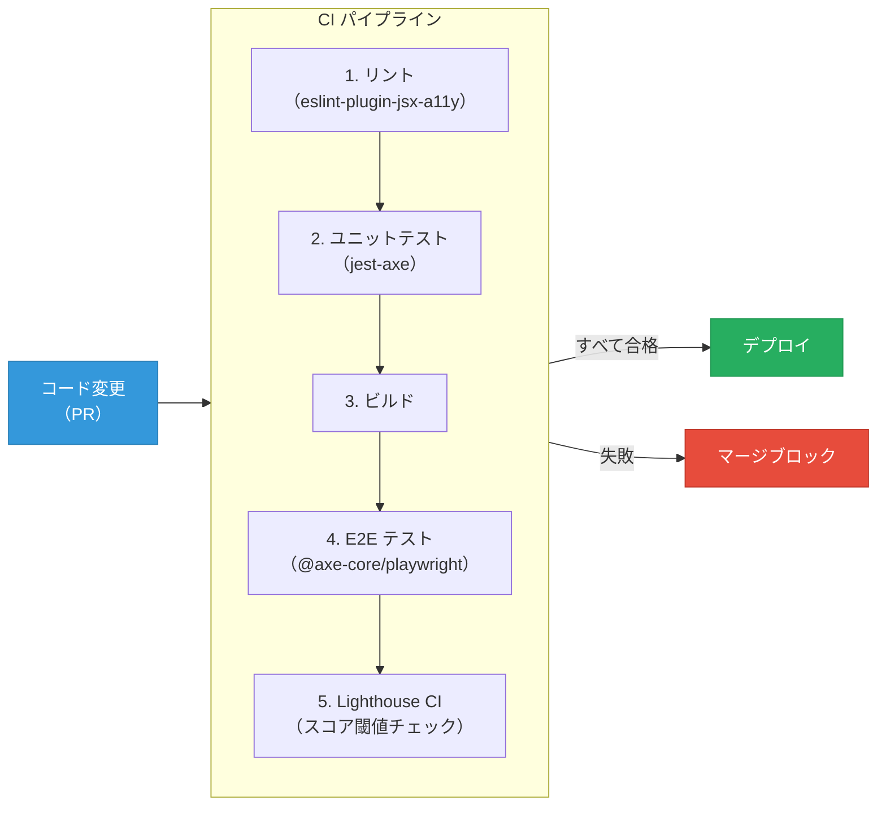
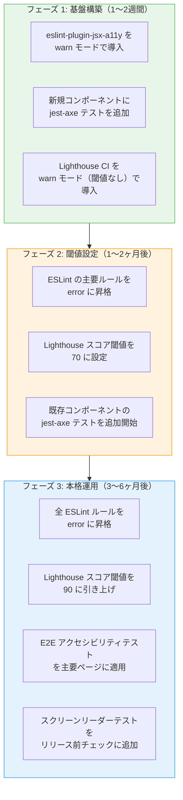
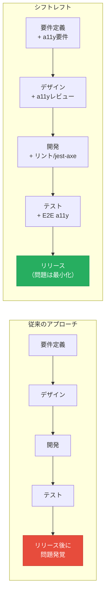
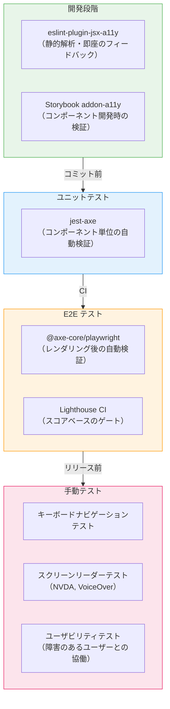

# アクセシビリティテスト

## 1. Web アクセシビリティの重要性

### 1.1 アクセシビリティとは何か

Web アクセシビリティ（Web Accessibility）とは、障害の有無や利用環境の違いにかかわらず、すべての人が Web コンテンツを知覚・理解・操作・利用できることを意味する。ここでいう「障害」は視覚障害、聴覚障害、運動機能障害、認知障害など多岐にわたるが、アクセシビリティの恩恵を受けるのは障害者だけではない。

一時的に片手が使えないユーザー、騒がしい環境で動画を視聴するユーザー、低速なネットワーク環境のユーザー、高齢者、母語が異なるユーザーなど、状況的な制約（Situational Disability）を抱えるすべての人がアクセシビリティの受益者である。WHO の推計によれば、世界人口の約16%（13億人以上）が何らかの障害を抱えており、これは無視できない規模のユーザー群である。

### 1.2 法的要件とビジネスインパクト

アクセシビリティは道徳的な義務であるだけでなく、多くの国で法的な要件でもある。米国では Americans with Disabilities Act（ADA）およびSection 508 が公共機関や連邦政府機関に対してアクセシビリティ準拠を義務付けている。欧州連合では European Accessibility Act（EAA）が2025年6月に施行され、民間企業を含む幅広い組織に準拠が求められるようになった。日本においても、2024年4月に改正された障害者差別解消法により、民間事業者にも合理的配慮の提供が法的義務となった。

法的リスクの面でも、アクセシビリティ訴訟は年々増加している。米国では2023年に4,600件以上のADA関連のWeb アクセシビリティ訴訟が提起された。企業にとってアクセシビリティ対応は、訴訟リスクの回避だけでなく、ユーザーベースの拡大、SEO の改善、ブランドイメージの向上にも直結する。

### 1.3 アクセシビリティテストの位置づけ

アクセシビリティを「実装する」ことと「テストする」ことは明確に区別すべきである。アクセシビリティの実装は、セマンティックな HTML の使用、ARIA 属性の適切な設定、色のコントラスト比の確保などを含む設計・開発段階の活動である。一方、アクセシビリティテストは、それらの実装が正しく行われているかを検証する品質保証活動である。

アクセシビリティテストは、自動テストと手動テストの組み合わせによって初めて効果を発揮する。自動テストは WCAG の技術的な基準の一部を高速かつ網羅的に検証できるが、「このコンテンツは意味的に理解しやすいか」「操作フローは直感的か」といった判断は人間にしかできない。両者の役割を理解し、適切に組み合わせることがアクセシビリティテスト戦略の核心である。



上図が示すように、自動テストだけでは WCAG 基準の30〜40%程度しかカバーできない。残りの60〜70%は半自動テストや手動テストによって補完する必要がある。この事実を踏まえた上で、それぞれの手法を深く理解していこう。

## 2. WCAG 2.1/2.2 の原則

### 2.1 WCAG の歴史と位置づけ

Web Content Accessibility Guidelines（WCAG）は、W3C の Web Accessibility Initiative（WAI）が策定する Web アクセシビリティの国際標準である。WCAG 1.0 が1999年に勧告され、2008年に WCAG 2.0、2018年に WCAG 2.1、そして2023年10月に WCAG 2.2 が W3C 勧告となった。

WCAG は ISO/IEC 40500:2012 としても国際標準化されており、多くの国の法規制が WCAG を直接的または間接的に参照している。現在、WCAG 2.1 の AA レベル準拠が事実上のグローバル標準となっているが、WCAG 2.2 への移行も徐々に進んでいる。

### 2.2 4つの原則（POUR）

WCAG は4つの基本原則の頭文字を取って POUR と呼ばれる枠組みに基づいている。



**知覚可能（Perceivable）**：情報やUIコンポーネントが、ユーザーが知覚できる方法で提示されなければならない。画像に代替テキストを付与する、動画に字幕を提供する、テキストと背景に十分なコントラスト比を確保するといった要件がこの原則に含まれる。ある感覚（たとえば視覚）に依存する情報は、別の感覚（たとえば聴覚やテキスト）でも取得できなければならないという考え方である。

**操作可能（Operable）**：UIコンポーネントやナビゲーションが操作可能でなければならない。すべての機能がキーボードだけで操作できること、ユーザーに十分な時間を与えること、発作を引き起こすようなコンテンツを避けることなどが求められる。マウスやタッチスクリーンに依存する操作は、必ずキーボードでも同等に行えなければならない。

**理解可能（Understandable）**：情報やUIの操作方法が理解可能でなければならない。テキストが読みやすいこと、Webページの挙動が予測可能であること、入力エラーの修正を支援することなどが含まれる。ユーザーが「次に何が起こるか」を予測でき、エラーが起きた場合にどう対処すればよいかを理解できなければならない。

**堅牢（Robust）**：コンテンツが多様な支援技術（Assistive Technology）を含むさまざまなユーザーエージェントによって確実に解釈できるよう、十分に堅牢でなければならない。正しいHTML構造、有効なARIA属性、標準準拠のマークアップが求められる。

### 2.3 適合レベル（A, AA, AAA）

WCAG の各達成基準（Success Criterion）は、3段階の適合レベルに分類される。

| レベル | 概要 | 例 |
|--------|------|-----|
| **A** | 最低限のアクセシビリティ。満たさないと重大な障壁となる | 画像の代替テキスト、キーボード操作可能性 |
| **AA** | 一般的な準拠目標。多くの法規制が要求するレベル | コントラスト比 4.5:1 以上、リサイズ可能なテキスト |
| **AAA** | 最高レベル。すべてのコンテンツでの達成は現実的ではない | コントラスト比 7:1 以上、手話通訳の提供 |

実務上、**AA レベルの準拠**が標準的な目標となる。AAA レベルはすべてのコンテンツに対して達成することが困難であり、WCAG 自身も「サイト全体の適合レベルとして AAA を必須要件にすることは推奨しない」と述べている。

### 2.4 WCAG 2.2 の新たな達成基準

WCAG 2.2 では、WCAG 2.1 に9つの新しい達成基準が追加された（ただし 4.1.1 Parsing は削除）。主要な追加基準を紹介する。

**2.4.11 Focus Not Obscured (Minimum)（AA）**：キーボードフォーカスを受け取ったコンポーネントが、他のコンテンツ（スティッキーヘッダー、Cookie バナー、モーダルなど）によって完全に隠されないこと。これはフロントエンド開発で非常に頻発する問題であり、テストの重要な観点である。

**2.4.12 Focus Not Obscured (Enhanced)（AAA）**：フォーカスされたコンポーネントが部分的にも隠されないことを求める、2.4.11のより厳格な版。

**2.4.13 Focus Appearance（AAA）**：キーボードフォーカスインジケーターが十分なサイズとコントラストを持つこと。

**2.5.7 Dragging Movements（AA）**：ドラッグ操作を必要とする機能には、ドラッグを使わない代替手段を提供すること。ドラッグ&ドロップ UI を多用する Web アプリケーションで特に重要な基準である。

**2.5.8 Target Size (Minimum)（AA）**：操作対象（ボタン、リンクなど）のサイズが少なくとも 24x24 CSS ピクセルであるか、十分な間隔があること。

**3.2.6 Consistent Help（A）**：ヘルプ手段（連絡先情報、チャットボットなど）が複数ページにわたって一貫した位置に配置されていること。

**3.3.7 Redundant Entry（A）**：同じプロセス内で以前に入力した情報の再入力を求めないこと。自動入力の提供または選択肢からの再利用を可能にすること。

**3.3.8 Accessible Authentication (Minimum)（AA）**：認知機能テスト（CAPTCHA のパズル、記憶を要求するパスワードなど）を唯一の認証手段としないこと。パスキーやパスワードマネージャなどの代替手段を利用可能にすること。

## 3. 自動テスト — axe-core と jest-axe

### 3.1 axe-core の概要と設計思想

axe-core は、Deque Systems が開発するオープンソースのアクセシビリティテストエンジンである。JavaScript で記述されており、ブラウザ環境および Node.js 環境で動作する。2015年の初版リリース以来、アクセシビリティ自動テストのデファクトスタンダードとして広く採用されている。

axe-core の設計思想は明確である。**誤検知（False Positive）をゼロにすること**を最優先としている。アクセシビリティの問題を「検出しすぎる」ツールは、開発者に対してノイズを生み、やがて無視されるようになる。axe-core は「報告する問題は確実に問題である」というポリシーを貫くことで、開発者の信頼を獲得している。

axe-core のルールエンジンは、WCAG の達成基準をプログラム的に検証可能なルール群に変換したものである。各ルールは以下の構造を持つ。



axe-core はルールの結果を3種類に分類する。

- **violations**：明確な違反。自動的に判定可能な問題
- **passes**：ルールに合格したノード
- **incomplete**：自動では判定できず、人間のレビューが必要な項目

この3分類は、自動テストの限界を正直に認める設計であり、axe-core が信頼される大きな理由の一つである。

### 3.2 axe-core の基本的な使い方

axe-core はブラウザ上で直接実行できる。

```javascript
// Install: npm install axe-core
import axe from 'axe-core';

// Run accessibility analysis on the entire page
axe.run(document).then(results => {
  // Log violations
  results.violations.forEach(violation => {
    console.log(`[${violation.impact}] ${violation.id}: ${violation.description}`);
    violation.nodes.forEach(node => {
      console.log(`  Target: ${node.target}`);
      console.log(`  HTML: ${node.html}`);
      console.log(`  Fix: ${node.failureSummary}`);
    });
  });
});
```

axe-core は特定のコンテキスト（DOM の一部分）に対してもスキャンを実行できる。コンポーネント単位のテストで特に有用である。

```javascript
// Scan only a specific section
axe.run(document.getElementById('main-content'), {
  runOnly: {
    type: 'tag',
    values: ['wcag2a', 'wcag2aa']
  }
}).then(results => {
  console.log(`Found ${results.violations.length} violations`);
});
```

`runOnly` オプションにより、特定の WCAG レベルや特定のルールカテゴリに絞ったテストが可能である。段階的にアクセシビリティ対応を進める場合に、まず A レベルのルールのみを適用し、次に AA レベルに拡張するといった戦略が取れる。

### 3.3 jest-axe — ユニットテストへの統合

jest-axe は、axe-core を Jest テストフレームワークと統合するためのラッパーライブラリである。`toHaveNoViolations` というカスタムマッチャーを提供し、コンポーネントのアクセシビリティを通常のユニットテストと同じワークフローで検証できる。

```javascript
// Install: npm install --save-dev jest-axe
import { axe, toHaveNoViolations } from 'jest-axe';

expect.extend(toHaveNoViolations);

describe('Button component', () => {
  it('should have no accessibility violations', async () => {
    // Render the component
    const container = document.createElement('div');
    container.innerHTML = `
      <button type="button" aria-label="Close dialog">
        <svg aria-hidden="true"><!-- icon --></svg>
      </button>
    `;
    document.body.appendChild(container);

    // Run axe analysis
    const results = await axe(container);

    // Assert no violations
    expect(results).toHaveNoViolations();

    document.body.removeChild(container);
  });
});
```

React コンポーネントの場合、React Testing Library と組み合わせるのが一般的である。

```tsx
import { render } from '@testing-library/react';
import { axe, toHaveNoViolations } from 'jest-axe';

expect.extend(toHaveNoViolations);

describe('LoginForm', () => {
  it('should be accessible', async () => {
    const { container } = render(
      <form aria-labelledby="login-heading">
        <h2 id="login-heading">Login</h2>
        <label htmlFor="email">Email</label>
        <input id="email" type="email" name="email" required />
        <label htmlFor="password">Password</label>
        <input id="password" type="password" name="password" required />
        <button type="submit">Sign in</button>
      </form>
    );

    const results = await axe(container);
    expect(results).toHaveNoViolations();
  });

  it('should fail for inaccessible form', async () => {
    const { container } = render(
      <form>
        {/* Missing labels - this will cause violations */}
        <input type="email" placeholder="Email" />
        <input type="password" placeholder="Password" />
        <div onClick={() => {}}>Sign in</div>
      </form>
    );

    const results = await axe(container);
    // Expect violations: missing labels, non-interactive element used as button
    expect(results.violations.length).toBeGreaterThan(0);
  });
});
```

### 3.4 axe-core のルールカテゴリとカスタマイズ

axe-core は90以上のルールを内蔵しており、これらはタグによって分類されている。

| タグ | 対応する基準 |
|------|-------------|
| `wcag2a` | WCAG 2.0 Level A |
| `wcag2aa` | WCAG 2.0 Level AA |
| `wcag21a` | WCAG 2.1 Level A |
| `wcag21aa` | WCAG 2.1 Level AA |
| `wcag22aa` | WCAG 2.2 Level AA |
| `best-practice` | WCAG には含まれないがベストプラクティスとされるルール |
| `section508` | Section 508 固有のルール |

実務上重要なのは、axe-core の設定をカスタマイズしてプロジェクト固有の要件に対応する方法である。

```javascript
// Custom axe configuration
const axeConfig = {
  rules: {
    // Disable a specific rule
    'color-contrast': { enabled: false },
    // Override rule impact level
    'region': { enabled: true }
  }
};

// Apply configuration
axe.configure(axeConfig);

// Or use with jest-axe
const results = await axe(container, {
  rules: {
    // Temporarily disable rules for known issues
    'color-contrast': { enabled: false }
  }
});
```

ただし、ルールの無効化は慎重に行うべきである。無効化する場合は必ず理由をコメントに残し、対応計画を立てるべきだ。「テストが通らないからルールを無効化する」というアプローチは、アクセシビリティ負債を積み上げるだけである。

### 3.5 @axe-core/playwright — E2E テストでの統合

Playwright を使った E2E テストにおいても、axe-core を統合できる。`@axe-core/playwright` パッケージは、Playwright のページコンテキスト上で axe-core を実行するための公式ラッパーである。

```typescript
import { test, expect } from '@playwright/test';
import AxeBuilder from '@axe-core/playwright';

test.describe('Homepage accessibility', () => {
  test('should have no critical violations', async ({ page }) => {
    await page.goto('https://example.com');

    const accessibilityScanResults = await new AxeBuilder({ page })
      .withTags(['wcag2a', 'wcag2aa', 'wcag21a', 'wcag21aa'])
      .analyze();

    expect(accessibilityScanResults.violations).toEqual([]);
  });

  test('should have no violations on login page', async ({ page }) => {
    await page.goto('https://example.com/login');

    const accessibilityScanResults = await new AxeBuilder({ page })
      .include('#login-form') // Scan specific area
      .exclude('#third-party-widget') // Exclude third-party content
      .analyze();

    expect(accessibilityScanResults.violations).toEqual([]);
  });
});
```

E2E テストでの axe-core 統合は、実際にレンダリングされた状態のページを検証するため、CSS によるコントラスト比の問題やレイアウトによるフォーカスの遮蔽など、ユニットテストでは検出しにくい問題を捕捉できる。

### 3.6 Storybook との統合

コンポーネントカタログとして Storybook を使用している場合、`@storybook/addon-a11y` を導入することで、各ストーリーに対してリアルタイムにアクセシビリティチェックを実行できる。このアドオンの内部では axe-core が使われている。

```javascript
// .storybook/main.js
export default {
  addons: [
    '@storybook/addon-a11y',
  ],
};
```

```tsx
// Button.stories.tsx
import type { Meta, StoryObj } from '@storybook/react';
import { Button } from './Button';

const meta: Meta<typeof Button> = {
  component: Button,
  parameters: {
    a11y: {
      config: {
        rules: [
          { id: 'color-contrast', enabled: true },
        ],
      },
    },
  },
};

export default meta;

export const Primary: StoryObj<typeof Button> = {
  args: {
    label: 'Click me',
    variant: 'primary',
  },
};

export const IconOnly: StoryObj<typeof Button> = {
  args: {
    icon: 'close',
    'aria-label': 'Close',
    variant: 'icon',
  },
};
```

Storybook でのアクセシビリティチェックは、開発者がコンポーネントを作成する段階でリアルタイムにフィードバックを得られる点で価値が高い。問題が CI で初めて発覚するよりも、開発中に発見して修正するほうが遥かに効率的である。

## 4. Lighthouse Accessibility

### 4.1 Lighthouse の概要

Lighthouse は Google が開発するオープンソースの Web ページ品質監査ツールである。パフォーマンス、アクセシビリティ、ベストプラクティス、SEO、PWA の5カテゴリについてスコアリングを行う。Chrome DevTools に内蔵されているほか、CLI ツールや Node.js API としても利用可能である。

Lighthouse のアクセシビリティ監査の内部では axe-core のルールセットが使用されている。つまり、Lighthouse のアクセシビリティスコアは axe-core の検出結果に基づいている。ただし、Lighthouse は axe-core の全ルールを使用しているわけではなく、独自の重み付けによってスコアを算出している。

### 4.2 スコアリングの仕組み

Lighthouse のアクセシビリティスコアは0〜100の範囲で算出される。スコアの算出には、各監査項目の重み（Weight）が使用される。



重要な注意点として、**Lighthouse のスコア100はアクセシビリティが完全であることを意味しない**。スコア100は「Lighthouse が自動的に検出できるすべての問題がない」ことを示すに過ぎない。先述の通り、自動テストでカバーできる WCAG 基準は全体の30〜40%程度であり、残りは手動テストでしか検証できない。スコア100に安心して手動テストを怠ることは、重大なアクセシビリティ問題を見逃す原因となる。

### 4.3 CLI での実行

Lighthouse は CLI から実行でき、CI/CD パイプラインに統合しやすい。

```bash
# Install Lighthouse CLI
npm install -g lighthouse

# Run accessibility audit
lighthouse https://example.com \
  --only-categories=accessibility \
  --output=json \
  --output-path=./lighthouse-a11y.json \
  --chrome-flags="--headless --no-sandbox"

# Run with specific settings
lighthouse https://example.com \
  --only-categories=accessibility \
  --output=html \
  --output-path=./report.html \
  --preset=desktop
```

### 4.4 Node.js API での活用

プログラム的に Lighthouse を実行し、結果を解析して閾値判定を行う方法。

```javascript
import lighthouse from 'lighthouse';
import * as chromeLauncher from 'chrome-launcher';

async function runAccessibilityAudit(url) {
  // Launch Chrome
  const chrome = await chromeLauncher.launch({
    chromeFlags: ['--headless', '--no-sandbox']
  });

  // Run Lighthouse
  const result = await lighthouse(url, {
    port: chrome.port,
    onlyCategories: ['accessibility'],
    output: 'json',
  });

  const score = result.lhr.categories.accessibility.score * 100;
  const audits = result.lhr.audits;

  // Collect failing audits
  const failures = Object.values(audits)
    .filter(audit =>
      audit.score !== null &&
      audit.score < 1 &&
      audit.details?.type === 'table'
    )
    .map(audit => ({
      id: audit.id,
      title: audit.title,
      score: audit.score,
      items: audit.details?.items?.length || 0,
    }));

  await chrome.kill();

  return { score, failures };
}

// Usage with threshold enforcement
const { score, failures } = await runAccessibilityAudit('https://example.com');

if (score < 90) {
  console.error(`Accessibility score ${score} is below threshold 90`);
  failures.forEach(f => {
    console.error(`  FAIL: ${f.title} (${f.items} issues)`);
  });
  process.exit(1);
}
```

### 4.5 Lighthouse CI

Lighthouse CI（LHCI）は、Lighthouse の結果を CI/CD パイプラインで継続的に監視するためのツールセットである。アクセシビリティスコアの閾値を設定し、閾値を下回った場合にビルドを失敗させることができる。

```json
// lighthouserc.json
{
  "ci": {
    "collect": {
      "url": [
        "http://localhost:3000/",
        "http://localhost:3000/login",
        "http://localhost:3000/dashboard"
      ],
      "numberOfRuns": 3
    },
    "assert": {
      "assertions": {
        "categories:accessibility": ["error", { "minScore": 0.9 }],
        "categories:performance": ["warn", { "minScore": 0.8 }]
      }
    },
    "upload": {
      "target": "temporary-public-storage"
    }
  }
}
```

```bash
# Install and run Lighthouse CI
npm install -g @lhci/cli

# Collect results
lhci autorun --config=lighthouserc.json
```

## 5. スクリーンリーダーテスト

### 5.1 スクリーンリーダーとは

スクリーンリーダーは、画面上のコンテンツを音声合成（Text-to-Speech）やブライユ点字ディスプレイを通じてユーザーに伝える支援技術（Assistive Technology）である。主要なスクリーンリーダーには以下がある。

| スクリーンリーダー | OS | 価格 | シェア |
|-------------------|-----|------|--------|
| NVDA | Windows | 無料（オープンソース） | 約30% |
| JAWS | Windows | 有料（年間ライセンス） | 約40% |
| VoiceOver | macOS / iOS | OS 標準搭載 | 約20% |
| TalkBack | Android | OS 標準搭載 | 約5% |
| Orca | Linux | 無料（オープンソース） | 約1% |

スクリーンリーダーのシェアは WebAIM の年次調査によるものであり、ユーザー層や地域によって大きく異なる。実務上は、少なくとも NVDA（Windows）と VoiceOver（macOS/iOS）の2つでテストすることが推奨される。

### 5.2 スクリーンリーダーの読み上げモデル

スクリーンリーダーがWebページを読み上げる仕組みを理解することは、効果的なテストのために不可欠である。



ブラウザは DOM を基にアクセシビリティツリー（Accessibility Tree）を構築する。アクセシビリティツリーは、各要素の**ロール**（役割）、**名前**（アクセシブルネーム）、**状態**（展開/折りたたみ、チェック/非チェックなど）、**値**を保持する。スクリーンリーダーはこのツリーを OS のアクセシビリティ API（Windows なら UI Automation / MSAA、macOS なら NSAccessibility）を通じて読み取り、ユーザーに伝達する。

この仕組みを理解すると、なぜ `<div onclick="...">` で作ったボタンがスクリーンリーダーで正しく認識されないかが明確になる。`<div>` にはボタンとしてのロールがなく、アクセシビリティツリー上でボタンとして公開されないからである。`<button>` を使えば、ブラウザが自動的に適切なロール、フォーカス可能性、キーボードインタラクションを提供する。

### 5.3 手動テストのチェックリスト

スクリーンリーダーテストは自動化が困難であり、基本的に手動で行う。以下は、最低限実施すべきテストシナリオのチェックリストである。

**ページ構造の検証**
- 見出し一覧（Heading List）で論理的な見出し階層が表示されるか
- ランドマーク（header, nav, main, footer）が正しく認識されるか
- ページタイトルが意味のある内容か

**フォームの検証**
- すべてのフォーム入力欄に適切なラベルが読み上げられるか
- 必須項目であることが伝達されるか（`aria-required="true"` または `required` 属性）
- エラーメッセージが発生時に通知されるか
- 入力の説明テキスト（`aria-describedby`）が読み上げられるか

**ナビゲーションの検証**
- リンクの目的がリンクテキストだけで理解できるか（「こちら」「詳細」だけのリンクを避ける）
- スキップリンク（Skip to main content）が機能するか
- パンくずリストが正しく読み上げられるか

**動的コンテンツの検証**
- モーダルダイアログが開いた時にフォーカスが移動するか
- モーダルが閉じた時にフォーカスがトリガー要素に戻るか
- ライブリージョン（`aria-live`）の更新が通知されるか
- トースト通知やアラートが読み上げられるか

### 5.4 VoiceOver での基本操作

macOS の VoiceOver を使ったテストの基本操作を紹介する。VoiceOver のモディファイアキーは `Control + Option`（以下 `VO` と表記）である。

| 操作 | キー | 用途 |
|------|------|------|
| VoiceOver 起動/終了 | `Cmd + F5` | VoiceOver の切り替え |
| 次の要素に移動 | `VO + →` | ページ内を順番に読み進める |
| 前の要素に移動 | `VO + ←` | 逆方向に移動 |
| 要素のアクティベート | `VO + Space` | ボタンのクリックなど |
| ローター表示 | `VO + U` | 見出し/リンク/フォーム一覧の表示 |
| 次の見出しに移動 | `VO + Cmd + H` | 見出し間のジャンプ |
| Web ローター設定 | `VO + U` → `←` / `→` | カテゴリの切り替え |

テストの際は、VoiceOver の音声ログ（Caption Panel）を表示して、読み上げ内容をテキストとして確認するとよい。`VO + F8` で VoiceOver ユーティリティを開き、「キャプションパネル」の「キャプションパネルを表示」にチェックを入れる。

### 5.5 NVDA での基本操作

Windows 環境では NVDA（NonVisual Desktop Access）が無料で利用できるスクリーンリーダーとして最も推奨される。NVDA のモディファイアキーはデフォルトで `Insert`（以下 `NVDA` と表記）である。

| 操作 | キー | 用途 |
|------|------|------|
| NVDA 起動 | `Ctrl + Alt + N` | NVDA の起動 |
| 次の要素に移動 | `↓` | ブラウズモードで順に読み進める |
| 前の要素に移動 | `↑` | 逆方向に移動 |
| 要素一覧表示 | `NVDA + F7` | 見出し/リンク/フォーム一覧 |
| 次の見出しに移動 | `H` | 見出し間のジャンプ |
| フォーカスモード切替 | `NVDA + Space` | ブラウズモード/フォーカスモード |
| 読み上げ停止 | `Ctrl` | 読み上げの停止 |

NVDA はブラウズモード（Browse Mode）とフォーカスモード（Focus Mode）の2つのモードを持つ。ブラウズモードではページ上を矢印キーで読み進めることができ、フォーカスモードでは通常のキー入力がフォーム要素などに送られる。テスト時にはこの切り替えの振る舞いが適切であるかも確認すべきポイントである。

## 6. キーボードナビゲーションテスト

### 6.1 なぜキーボードアクセシビリティが基盤なのか

キーボードナビゲーションは、アクセシビリティのすべてのレイヤーの基盤である。スクリーンリーダーユーザー、運動機能障害のあるユーザー（スイッチデバイスや音声入力を使用するユーザー）、そして効率を重視するパワーユーザーが、キーボード（またはキーボードに準ずるインターフェース）に依存している。

WCAG 2.1.1（Keyboard）は A レベルの達成基準であり、「コンテンツのすべての機能がキーボードインターフェースを通じて操作可能であること」を要求する。これはアクセシビリティの最も基本的な要件の一つであるにもかかわらず、最も頻繁に違反される基準でもある。

### 6.2 キーボードテストの基本操作

キーボードナビゲーションテストは特別なツールを必要としない。ブラウザと Tab キーさえあれば実行できる。

| キー | 動作 |
|------|------|
| `Tab` | 次のインタラクティブ要素にフォーカス移動 |
| `Shift + Tab` | 前のインタラクティブ要素にフォーカス移動 |
| `Enter` | リンクのアクティベート、ボタンのクリック |
| `Space` | ボタンのクリック、チェックボックスの切り替え |
| `Arrow Keys` | ラジオボタン、タブ、メニューアイテム間の移動 |
| `Escape` | モーダルやドロップダウンの閉じ |

### 6.3 チェックすべき項目

キーボードナビゲーションテストで確認すべき主要な項目を以下に列挙する。

**フォーカスの可視性**：フォーカスインジケーター（通常は青い枠線やアウトライン）が常に視認可能であること。`outline: none` や `outline: 0` を CSS で適用してフォーカスインジケーターを非表示にするのは、最もよく見られるアクセシビリティ上の問題の一つである。カスタムのフォーカススタイルを提供する場合は、デフォルトのフォーカスリングと同等以上の視認性を確保する必要がある。

```css
/* Bad: removes focus indicator entirely */
*:focus {
  outline: none;
}

/* Good: custom focus style with sufficient visibility */
*:focus-visible {
  outline: 3px solid #4A90D9;
  outline-offset: 2px;
}
```

`:focus-visible` 擬似クラスを使うことで、マウスクリック時にはフォーカスリングを表示せず、キーボードナビゲーション時にのみ表示するという挙動を実現できる。

**フォーカス順序の論理性**：Tab キーによるフォーカスの移動順序が、視覚的なレイアウトの論理的な順序と一致していること。CSS の `order` プロパティや `position: absolute` でレイアウトを変更した場合、視覚的な順序と DOM 順序（すなわちフォーカス順序）が乖離する可能性がある。



**フォーカストラップ**：モーダルダイアログが開いている場合、フォーカスがモーダル内に閉じ込められ（Focus Trap）、背後のページにフォーカスが移動しないこと。逆に、モーダルでないコンポーネント内にフォーカスが閉じ込められてしまう（Keyboard Trap）ことがないこと。

**タブインデックスの適切な使用**：`tabindex` 属性の使い方には注意が必要である。

```html
<!-- tabindex="0": makes element focusable in normal tab order -->
<div tabindex="0" role="button" aria-label="Custom action">
  Custom Button
</div>

<!-- tabindex="-1": focusable via JavaScript, but not via Tab key -->
<div id="modal-title" tabindex="-1">
  Modal Title
</div>

<!-- tabindex > 0: AVOID - disrupts natural tab order -->
<!-- This is almost always a mistake -->
<input tabindex="3" />
<input tabindex="1" />
<input tabindex="2" />
```

`tabindex` に正の値を設定することは、ほぼすべての場合においてアンチパターンである。正の `tabindex` はページ全体のフォーカス順序を破壊し、予測不可能なナビゲーション体験を生む。代わりに、DOM の順序を適切に構造化することでフォーカス順序を制御すべきである。

### 6.4 Playwright でのキーボードテストの自動化

キーボードナビゲーションのテストは部分的に自動化できる。

```typescript
import { test, expect } from '@playwright/test';

test.describe('Keyboard navigation', () => {
  test('should navigate through main elements in logical order', async ({ page }) => {
    await page.goto('https://example.com');

    // Tab through interactive elements and verify order
    const expectedOrder = [
      'Skip to main content', // Skip link
      'Logo',                 // Site logo link
      'Home',                 // Nav items
      'Products',
      'About',
      'Search',               // Search input
    ];

    for (const expectedLabel of expectedOrder) {
      await page.keyboard.press('Tab');
      const focused = page.locator(':focus');
      const name = await focused.getAttribute('aria-label')
        || await focused.innerText();
      expect(name.trim()).toContain(expectedLabel);
    }
  });

  test('should trap focus within modal dialog', async ({ page }) => {
    await page.goto('https://example.com');

    // Open modal
    await page.click('[data-testid="open-modal"]');

    // Verify focus moves to modal
    const modal = page.locator('[role="dialog"]');
    await expect(modal).toBeVisible();

    // Tab through all focusable elements in modal
    const focusableInModal = modal.locator(
      'button, [href], input, select, textarea, [tabindex]:not([tabindex="-1"])'
    );
    const count = await focusableInModal.count();

    // Tab count+1 times - focus should wrap within modal
    for (let i = 0; i < count + 1; i++) {
      await page.keyboard.press('Tab');
    }

    // Focus should still be within modal (focus trap working)
    const focusedElement = page.locator(':focus');
    await expect(focusedElement).toBeAttached();
    const isInModal = await focusedElement.evaluate(
      (el) => el.closest('[role="dialog"]') !== null
    );
    expect(isInModal).toBe(true);

    // Escape should close modal
    await page.keyboard.press('Escape');
    await expect(modal).not.toBeVisible();
  });

  test('focus indicator should be visible', async ({ page }) => {
    await page.goto('https://example.com');

    await page.keyboard.press('Tab');
    const focused = page.locator(':focus');

    // Verify focus indicator is visible
    const outlineStyle = await focused.evaluate((el) => {
      const styles = window.getComputedStyle(el);
      return {
        outline: styles.outline,
        outlineWidth: styles.outlineWidth,
        outlineStyle: styles.outlineStyle,
        boxShadow: styles.boxShadow,
      };
    });

    // Focus indicator should not be 'none' or '0px'
    const hasVisibleFocus =
      (outlineStyle.outlineStyle !== 'none' && outlineStyle.outlineWidth !== '0px') ||
      outlineStyle.boxShadow !== 'none';

    expect(hasVisibleFocus).toBe(true);
  });
});
```

## 7. CI/CD への統合

### 7.1 アクセシビリティテストの自動化パイプライン

アクセシビリティテストを CI/CD パイプラインに組み込むことで、アクセシビリティの回帰を早期に検出し、問題がプロダクション環境に到達するのを防ぐことができる。



### 7.2 eslint-plugin-jsx-a11y — 静的解析によるシフトレフト

アクセシビリティの問題は、可能な限り早い段階で検出すべきである。`eslint-plugin-jsx-a11y` は、JSX のコード上でアクセシビリティの問題を静的に検出するESLint プラグインである。実行時のレンダリング結果ではなくソースコードを分析するため、CI の最初のステップとして非常に高速に実行できる。

```javascript
// eslint.config.js (flat config)
import jsxA11y from 'eslint-plugin-jsx-a11y';

export default [
  {
    plugins: {
      'jsx-a11y': jsxA11y,
    },
    rules: {
      // Ensure images have alt text
      'jsx-a11y/alt-text': 'error',
      // Ensure anchor elements have content
      'jsx-a11y/anchor-has-content': 'error',
      // Ensure interactive elements are focusable
      'jsx-a11y/interactive-supports-focus': 'error',
      // Ensure labels are associated with controls
      'jsx-a11y/label-has-associated-control': 'error',
      // Ensure click handlers have key handlers
      'jsx-a11y/click-events-have-key-events': 'error',
      // Ensure non-interactive elements don't have handlers
      'jsx-a11y/no-noninteractive-element-interactions': 'warn',
      // Ensure no-static-element interactions
      'jsx-a11y/no-static-element-interactions': 'warn',
      // Ensure ARIA roles are valid
      'jsx-a11y/aria-role': 'error',
      // Ensure ARIA props are valid
      'jsx-a11y/aria-props': 'error',
    },
  },
];
```

検出できる問題の例を示す。

```tsx
// ESLint will flag these issues:

// Error: img elements must have an alt prop


// Error: anchor element should have content
<a href="/about"></a>

// Error: onClick handler without onKeyDown/onKeyUp
<div onClick={handleClick}>Click me</div>

// Error: Invalid ARIA role
<div role="buton">Submit</div>
```

`eslint-plugin-jsx-a11y` はソースコードの静的解析であるため、実行時にのみ判明する問題（CSS によるコントラスト比、動的に生成される ARIA 属性など）は検出できない。リント → ユニットテスト（jest-axe） → E2E テスト（axe-core/playwright）と段階的に検出範囲を広げていく戦略が有効である。

### 7.3 GitHub Actions でのワークフロー例

```yaml
# .github/workflows/accessibility.yml
name: Accessibility Tests

on:
  pull_request:
    branches: [main]

jobs:
  lint:
    runs-on: ubuntu-latest
    steps:
      - uses: actions/checkout@v4
      - uses: actions/setup-node@v4
        with:
          node-version: 20
          cache: 'npm'
      - run: npm ci
      - name: Run a11y lint rules
        run: npx eslint --no-error-on-unmatched-pattern 'src/**/*.{ts,tsx}'

  unit-test:
    runs-on: ubuntu-latest
    needs: lint
    steps:
      - uses: actions/checkout@v4
      - uses: actions/setup-node@v4
        with:
          node-version: 20
          cache: 'npm'
      - run: npm ci
      - name: Run unit tests with jest-axe
        run: npx jest --testPathPattern='a11y|accessibility'

  e2e-accessibility:
    runs-on: ubuntu-latest
    needs: unit-test
    steps:
      - uses: actions/checkout@v4
      - uses: actions/setup-node@v4
        with:
          node-version: 20
          cache: 'npm'
      - run: npm ci
      - name: Install Playwright browsers
        run: npx playwright install --with-deps chromium
      - name: Build application
        run: npm run build
      - name: Start server
        run: npm run start &
      - name: Wait for server
        run: npx wait-on http://localhost:3000
      - name: Run Playwright accessibility tests
        run: npx playwright test --project=accessibility
      - name: Upload test results
        if: always()
        uses: actions/upload-artifact@v4
        with:
          name: accessibility-report
          path: playwright-report/

  lighthouse:
    runs-on: ubuntu-latest
    needs: unit-test
    steps:
      - uses: actions/checkout@v4
      - uses: actions/setup-node@v4
        with:
          node-version: 20
          cache: 'npm'
      - run: npm ci
      - name: Build application
        run: npm run build
      - name: Run Lighthouse CI
        run: |
          npm install -g @lhci/cli
          lhci autorun
        env:
          LHCI_GITHUB_APP_TOKEN: ${{ secrets.LHCI_GITHUB_APP_TOKEN }}
```

### 7.4 段階的導入戦略

既存のプロジェクトにアクセシビリティテストを導入する場合、一度にすべてのルールを有効にするとテストが大量に失敗し、チームのモチベーションが低下する。段階的な導入戦略が現実的である。



フェーズ1では CI を「通知のみ」で導入し、チームがアクセシビリティの問題を認識できるようにする。フェーズ2で段階的に閾値を設定し、フェーズ3でアクセシビリティテストを本格的なゲートとして運用する。この漸進的なアプローチにより、既存コードベースの問題を一度に解決しようとするのではなく、新規コードの品質を担保しつつ既存の問題を計画的に改善できる。

## 8. ARIA 設計パターン — WAI-ARIA Authoring Practices

### 8.1 ARIA とは何か

WAI-ARIA（Web Accessibility Initiative - Accessible Rich Internet Applications）は、HTML のセマンティクスだけでは表現しきれないリッチなUIコンポーネントのアクセシビリティ情報を補完するための仕様である。ロール（`role`）、プロパティ（`aria-*`）、ステート（`aria-expanded`, `aria-checked` など）を HTML 要素に付与することで、支援技術に対して追加のセマンティクスを提供する。

ここで最も重要な原則を強調する。**ARIA の第一原則は「ネイティブ HTML 要素を使えるなら、ARIA を使わないこと」である。** `<button>` 要素は自動的にボタンのロール、フォーカス可能性、Enter/Space キーでのアクティベーションを提供する。`<div role="button" tabindex="0">` で同じことを実現するには、追加の JavaScript でキーボードイベントの処理やフォーカス管理を実装する必要がある。ネイティブ要素は無料で正しいアクセシビリティを提供するのであり、ARIA はネイティブ要素で表現できない場合の最後の手段である。

### 8.2 主要な ARIA 設計パターン

WAI-ARIA Authoring Practices Guide（APG）は、一般的な UI コンポーネントの ARIA パターンを文書化したものである。ここでは、実務でよく使われるパターンを解説する。

#### ダイアログ（Modal Dialog）

モーダルダイアログは、ユーザーの注意を特定のコンテンツに集中させるパターンである。アクセシビリティの観点では、最も実装を誤りやすいパターンの一つである。

```html
<!-- Trigger button -->
<button id="open-dialog" aria-haspopup="dialog">
  Delete Account
</button>

<!-- Modal dialog -->
<div
  role="dialog"
  aria-modal="true"
  aria-labelledby="dialog-title"
  aria-describedby="dialog-description"
>
  <h2 id="dialog-title">Confirm Account Deletion</h2>
  <p id="dialog-description">
    This action cannot be undone. All your data will be permanently deleted.
  </p>
  <div>
    <button id="confirm-delete">Delete</button>
    <button id="cancel-delete">Cancel</button>
  </div>
</div>
```

ダイアログが適切に動作するために必要な実装。

1. ダイアログが開いた時、フォーカスをダイアログ内の最初のインタラクティブ要素に移動する
2. Tab キーによるフォーカスをダイアログ内に閉じ込める（Focus Trap）
3. Escape キーでダイアログを閉じる
4. ダイアログが閉じた時、フォーカスをトリガー要素に戻す
5. `aria-modal="true"` により、背後のコンテンツが支援技術から隠される

```javascript
class ModalDialog {
  constructor(dialogElement, triggerElement) {
    this.dialog = dialogElement;
    this.trigger = triggerElement;
    this.focusableElements = this.dialog.querySelectorAll(
      'button, [href], input, select, textarea, [tabindex]:not([tabindex="-1"])'
    );
    this.firstFocusable = this.focusableElements[0];
    this.lastFocusable = this.focusableElements[this.focusableElements.length - 1];
  }

  open() {
    this.dialog.hidden = false;
    this.dialog.setAttribute('aria-modal', 'true');
    // Move focus to first focusable element
    this.firstFocusable.focus();
    // Add event listeners for focus trap and escape
    this.dialog.addEventListener('keydown', this.handleKeyDown.bind(this));
  }

  close() {
    this.dialog.hidden = true;
    this.dialog.removeAttribute('aria-modal');
    // Return focus to trigger element
    this.trigger.focus();
    this.dialog.removeEventListener('keydown', this.handleKeyDown.bind(this));
  }

  handleKeyDown(event) {
    if (event.key === 'Escape') {
      this.close();
      return;
    }

    if (event.key === 'Tab') {
      // Focus trap: wrap focus within dialog
      if (event.shiftKey) {
        if (document.activeElement === this.firstFocusable) {
          event.preventDefault();
          this.lastFocusable.focus();
        }
      } else {
        if (document.activeElement === this.lastFocusable) {
          event.preventDefault();
          this.firstFocusable.focus();
        }
      }
    }
  }
}
```

#### タブパネル（Tabs）

タブは、コンテンツを複数のパネルに分割して、一度に一つだけ表示するパターンである。

```html
<div>
  <!-- Tab list -->
  <div role="tablist" aria-label="Account settings">
    <button
      role="tab"
      id="tab-profile"
      aria-selected="true"
      aria-controls="panel-profile"
    >
      Profile
    </button>
    <button
      role="tab"
      id="tab-security"
      aria-selected="false"
      aria-controls="panel-security"
      tabindex="-1"
    >
      Security
    </button>
    <button
      role="tab"
      id="tab-billing"
      aria-selected="false"
      aria-controls="panel-billing"
      tabindex="-1"
    >
      Billing
    </button>
  </div>

  <!-- Tab panels -->
  <div role="tabpanel" id="panel-profile" aria-labelledby="tab-profile">
    <p>Profile settings content...</p>
  </div>
  <div role="tabpanel" id="panel-security" aria-labelledby="tab-security" hidden>
    <p>Security settings content...</p>
  </div>
  <div role="tabpanel" id="panel-billing" aria-labelledby="tab-billing" hidden>
    <p>Billing settings content...</p>
  </div>
</div>
```

タブのキーボードインタラクションの要件。

- Tab キーでタブリストに入り、アクティブなタブにフォーカスが当たる
- 左右矢印キーでタブ間を移動する（循環する）
- Tab キーでタブパネルのコンテンツに移動する
- 非アクティブなタブは `tabindex="-1"` を持ち、Tab キーの順序に含まれない

#### ライブリージョン（Live Region）

動的に更新されるコンテンツをスクリーンリーダーに通知するためのパターン。フォーム送信の結果、検索結果の更新、チャットメッセージの受信などで使用する。

```html
<!-- Polite: announces when the user is idle -->
<div aria-live="polite" aria-atomic="true" role="status">
  <!-- Dynamic content will be announced -->
</div>

<!-- Assertive: announces immediately, interrupting current speech -->
<div aria-live="assertive" role="alert">
  <!-- Urgent messages will be announced immediately -->
</div>
```

```javascript
// Example: announce form submission result
function handleSubmit(formData) {
  const statusRegion = document.querySelector('[role="status"]');

  try {
    await submitForm(formData);
    // Update live region - screen reader will announce this
    statusRegion.textContent = 'Form submitted successfully.';
  } catch (error) {
    // Use assertive for errors
    const alertRegion = document.querySelector('[role="alert"]');
    alertRegion.textContent = `Error: ${error.message}`;
  }
}
```

`aria-live="polite"` は、スクリーンリーダーが現在読み上げている内容を中断せず、次の適切なタイミングで通知する。`aria-live="assertive"` は即座に通知を割り込ませるため、エラーメッセージなど緊急性の高い情報にのみ使用すべきである。

### 8.3 ARIA パターンのテスト

ARIA パターンが正しく実装されているかを検証するテストの例。

```typescript
import { test, expect } from '@playwright/test';

test.describe('Tabs component ARIA pattern', () => {
  test.beforeEach(async ({ page }) => {
    await page.goto('/components/tabs');
  });

  test('should have correct ARIA roles and relationships', async ({ page }) => {
    // Verify tablist role
    const tablist = page.locator('[role="tablist"]');
    await expect(tablist).toBeVisible();
    await expect(tablist).toHaveAttribute('aria-label');

    // Verify tab roles
    const tabs = page.locator('[role="tab"]');
    const tabCount = await tabs.count();
    expect(tabCount).toBeGreaterThan(0);

    // Verify first tab is selected
    await expect(tabs.nth(0)).toHaveAttribute('aria-selected', 'true');

    // Verify aria-controls points to existing panel
    const controlsId = await tabs.nth(0).getAttribute('aria-controls');
    const panel = page.locator(`#${controlsId}`);
    await expect(panel).toHaveAttribute('role', 'tabpanel');
  });

  test('should navigate tabs with arrow keys', async ({ page }) => {
    // Focus first tab
    const firstTab = page.locator('[role="tab"]').nth(0);
    await firstTab.focus();

    // Press right arrow to move to next tab
    await page.keyboard.press('ArrowRight');
    const secondTab = page.locator('[role="tab"]').nth(1);
    await expect(secondTab).toBeFocused();

    // Press Enter to activate tab
    await page.keyboard.press('Enter');
    await expect(secondTab).toHaveAttribute('aria-selected', 'true');

    // Verify corresponding panel is visible
    const controlsId = await secondTab.getAttribute('aria-controls');
    const panel = page.locator(`#${controlsId}`);
    await expect(panel).toBeVisible();
  });
});

test.describe('Modal dialog ARIA pattern', () => {
  test('should manage focus correctly', async ({ page }) => {
    await page.goto('/components/modal');

    const trigger = page.locator('[data-testid="open-modal"]');
    await trigger.click();

    // Verify dialog is present
    const dialog = page.locator('[role="dialog"]');
    await expect(dialog).toBeVisible();
    await expect(dialog).toHaveAttribute('aria-modal', 'true');
    await expect(dialog).toHaveAttribute('aria-labelledby');

    // Verify focus is inside dialog
    const focused = page.locator(':focus');
    const isInDialog = await focused.evaluate(
      el => el.closest('[role="dialog"]') !== null
    );
    expect(isInDialog).toBe(true);

    // Close with Escape
    await page.keyboard.press('Escape');
    await expect(dialog).not.toBeVisible();

    // Verify focus returns to trigger
    await expect(trigger).toBeFocused();
  });
});
```

### 8.4 よくある ARIA の誤用

ARIA は強力なツールであるが、誤用すると逆にアクセシビリティを悪化させる。以下はよくある誤用パターンである。

**ロールの不一致**：要素の視覚的な見た目とARIAロールが一致しない場合、スクリーンリーダーユーザーを混乱させる。

```html
<!-- Bad: looks like a link, announced as a button -->
<a href="/products" role="button">View Products</a>

<!-- Good: use the appropriate element -->
<a href="/products">View Products</a>
```

**冗長な ARIA**：ネイティブ HTML 要素が既に提供しているセマンティクスを ARIA で重複して指定する。

```html
<!-- Bad: redundant ARIA -->
<button role="button">Submit</button>
<nav role="navigation">...</nav>
<input type="checkbox" role="checkbox" />

<!-- Good: native elements already have these roles -->
<button>Submit</button>
<nav>...</nav>
<input type="checkbox" />
```

**非表示コンテンツへの ARIA**：視覚的に非表示のコンテンツに ARIA 属性を設定しても、支援技術がそれにアクセスできるとは限らない。`display: none` や `visibility: hidden` で非表示にされた要素は、アクセシビリティツリーからも除外される。

```html
<!-- Bad: hidden from everyone, ARIA has no effect -->
<div style="display: none" aria-live="polite">
  Updated content
</div>

<!-- Good: visually hidden but accessible to screen readers -->
<div class="sr-only" aria-live="polite">
  Updated content
</div>
```

```css
/* Screen reader only class */
.sr-only {
  position: absolute;
  width: 1px;
  height: 1px;
  padding: 0;
  margin: -1px;
  overflow: hidden;
  clip: rect(0, 0, 0, 0);
  white-space: nowrap;
  border: 0;
}
```

## 9. アクセシビリティ文化の構築

### 9.1 ツールだけでは解決しない

ここまで axe-core、Lighthouse、スクリーンリーダーテスト、CI/CD 統合と、アクセシビリティテストのための技術的な手法を詳細に解説してきた。しかし、これらのツールを導入するだけではアクセシビリティは持続可能な形で改善されない。ツールは手段であり、組織文化がなければツールは形骸化する。

アクセシビリティの問題の多くは、開発の初期段階での設計判断に起因する。色のコントラスト比の不足はデザイン段階で生まれ、キーボード操作の欠如はコンポーネント設計段階で生まれ、スクリーンリーダーでの読み上げ順序の問題は HTML 構造設計段階で生まれる。テストはこれらの問題を検出する最後の防衛線であり、問題を生まないためにはプロセスの上流から対処する必要がある。

### 9.2 シフトレフト — 上流での品質組み込み

アクセシビリティにおけるシフトレフトとは、アクセシビリティの検討を開発プロセスの可能な限り早い段階に移動させることである。



具体的には、以下のようなプラクティスを開発プロセスの各段階に組み込む。

**要件定義段階**：ユーザーストーリーにアクセシビリティの受け入れ基準を含める。例：「このフォームはキーボードのみで操作でき、スクリーンリーダーで各入力欄のラベルが読み上げられること」。

**デザイン段階**：カラーパレットのコントラスト比チェック、フォーカスインジケーターのデザイン、タッチターゲットサイズの確認、見出し構造の設計をデザインレビューに含める。Figma プラグイン（Stark、Able など）を活用したデザイン段階でのチェックも有効である。

**開発段階**：ESLint ルールによるリアルタイムフィードバック、Storybook でのアクセシビリティパネル確認、コンポーネントごとの jest-axe テスト。

**コードレビュー段階**：アクセシビリティに関する観点をレビューチェックリストに含める。セマンティック HTML の使用、ARIA の適切性、キーボード操作の実装を確認する。

**テスト段階**：CI/CD パイプラインでの自動テスト、リリース前のスクリーンリーダーテスト、キーボードナビゲーションテスト。

### 9.3 チーム内での知識共有

アクセシビリティは特定の専門家だけの責務ではなく、チーム全体の責務である。以下のような取り組みが効果的である。

**アクセシビリティチャンピオン（Accessibility Champion）**：チーム内でアクセシビリティに特に関心を持つメンバーを「アクセシビリティチャンピオン」として指名する。チャンピオンは最新の WCAG 基準を把握し、チームメンバーへの助言を行い、デザインレビューやコードレビューでアクセシビリティの観点を提供する。ただし、チャンピオンの存在はアクセシビリティが「チャンピオンだけの仕事」になる免罪符ではない。

**定期的なスクリーンリーダー体験**：月に一度、チーム全員が30分間スクリーンリーダーだけで自社のプロダクトを操作する体験セッションを設ける。自分が作ったUIがスクリーンリーダーでどう体験されるかを身をもって知ることは、ドキュメントを読むよりも遥かに強い動機付けとなる。

**アクセシビリティバグバッシュ**：四半期に一度、チーム全員でアクセシビリティの問題を集中的に洗い出すイベントを開催する。自動テスト、スクリーンリーダーテスト、キーボードテストを組み合わせて、できるだけ多くの問題を発見・起票する。

**デザインシステムへのアクセシビリティの組み込み**：デザインシステムのコンポーネントが最初からアクセシビリティを担保していれば、各プロダクトチームが個別に対応する負担が大幅に減る。ボタン、フォーム入力、モーダル、タブ、ドロップダウンなどの基盤コンポーネントは、ARIA パターンの正しい実装、キーボード操作、フォーカス管理を内蔵すべきである。

### 9.4 アクセシビリティステートメント

組織のアクセシビリティへのコミットメントを対外的に表明するために、アクセシビリティステートメント（Accessibility Statement）をWebサイトに公開することが推奨される。ステートメントには以下の内容を含める。

- 準拠を目指す WCAG のバージョンとレベル（例：WCAG 2.1 AA）
- 現在の準拠状況（完全準拠、部分準拠、または非準拠）
- 既知のアクセシビリティ上の問題と改善予定
- ユーザーがアクセシビリティに関する問題を報告するための連絡先
- ステートメントの最終更新日

アクセシビリティステートメントは法的要件であると同時に、組織がアクセシビリティを真剣に受け止めていることの表明でもある。

### 9.5 メトリクスと継続的改善

アクセシビリティの進捗を可視化するために、以下のメトリクスを追跡することが有効である。

| メトリクス | 測定方法 | 目標 |
|-----------|----------|------|
| Lighthouse a11y スコア | Lighthouse CI で自動計測 | 90以上を維持 |
| axe-core violations 数 | CI/CD パイプラインで自動計測 | 0 violations |
| アクセシビリティ関連の Issue 数 | バグトラッカーで追跡 | トレンドが減少傾向 |
| WCAG 達成基準の準拠率 | 定期的な手動監査 | AA レベル100%準拠 |
| キーボード操作可能なページ割合 | 手動テスト | 100% |
| a11y テストカバレッジ | jest-axe テスト数 / コンポーネント数 | 80%以上 |

これらのメトリクスをダッシュボードで可視化し、定期的にチームで振り返ることで、アクセシビリティが「一度やって終わり」のタスクではなく、継続的に改善されるべき品質特性であることをチーム全体で共有できる。

## 10. まとめ — アクセシビリティテストの全体像

アクセシビリティテストは、単一のツールやテクニックで完結するものではない。本記事で解説した各手法の位置づけを改めて整理する。



自動テスト（axe-core、Lighthouse、eslint-plugin-jsx-a11y）は開発の高速なフィードバックループを提供し、明確な WCAG 違反を効率的に検出する。しかし、自動テストだけでは WCAG 基準の全体をカバーすることはできない。キーボードナビゲーションテストとスクリーンリーダーテストは、自動テストでは検出できない操作性と体験の問題を発見する。そして、障害のあるユーザーとのユーザビリティテストは、テストの最高水準であり、実際のユーザー体験に最も近い検証である。

アクセシビリティは「完了」するものではない。プロダクトが進化し続ける限り、アクセシビリティの検証も継続的に行わなければならない。自動テストをCI/CDに組み込み、手動テストを定期的に実施し、チーム全体でアクセシビリティを文化として根付かせることが、すべてのユーザーに開かれたWebを実現するための道筋である。
