# ACID特性とトランザクション — データベースの信頼性を支える基盤

## 1. トランザクションとは何か

### 1.1 直感的な理解

銀行口座の振込を考えてみよう。口座Aから口座Bへ10,000円を送金するとき、データベースでは少なくとも以下の2つの操作が必要になる。

1. 口座Aの残高を10,000円減らす
2. 口座Bの残高を10,000円増やす

この2つの操作は「分割してはならない一連の処理」である。操作1だけが実行されて操作2が実行されなければ、10,000円が消失する。操作2だけが実行されて操作1が実行されなければ、10,000円が憑き出す。どちらの状態も許容できない。

**トランザクション（Transaction）**とは、このように「全体としてひとまとまりの処理」として扱われるべきデータベース操作の論理的な単位である。トランザクションは「すべて成功するか、すべてなかったことにするか」のどちらかでなければならない。

```sql
-- transfer 10,000 yen from account A to account B
BEGIN TRANSACTION;
UPDATE accounts SET balance = balance - 10000 WHERE id = 'A';
UPDATE accounts SET balance = balance + 10000 WHERE id = 'B';
COMMIT;
```

### 1.2 歴史的背景 — Jim Grayの貢献

トランザクションの概念がデータベースの文脈で体系化されたのは1970年代のことである。**Jim Gray**は、トランザクション処理の理論と実装の両面において決定的な貢献を行った人物であり、1998年にチューリング賞を受賞している。

Grayは1976年の論文「Granularity of Locks and Degrees of Consistency in a Shared Data Base」において、ロックの粒度と一貫性の度合いを形式化した。さらに1981年の著書「The Transaction Concept: Virtues and Limitations」では、トランザクションが満たすべき性質として**ACID**という概念を明確に定義した。

ACID特性の名称自体は、1983年にTheo HaerderとAndreas Reuterが論文「Principles of Transaction-Oriented Database Recovery」で命名したものである。彼らはGrayらの成果を整理し、トランザクションの正しさを保証するための4つの性質として Atomicity、Consistency、Isolation、Durability を提示した。

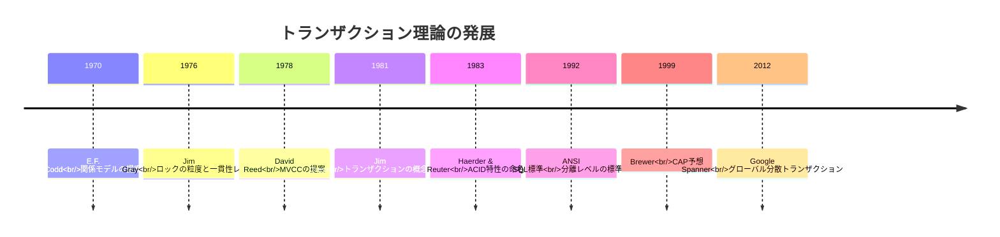

### 1.3 トランザクションの状態遷移

トランザクションは開始から終了まで、以下の状態を遷移する。

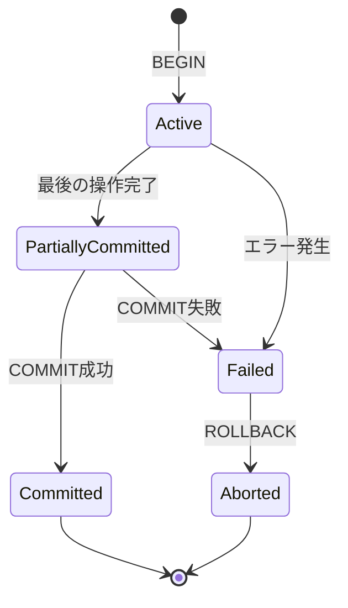

- **Active**: トランザクションが実行中で、読み書き操作を行っている状態
- **Partially Committed**: すべての操作が完了し、コミットを試みている状態
- **Committed**: コミットが完了し、変更が永続化された状態
- **Failed**: エラーが発生し、続行不可能な状態
- **Aborted**: ロールバックが完了し、すべての変更が取り消された状態

重要なのは、**Partially Committed から Committed への遷移**である。この遷移が完了するまでは、トランザクションの結果は確定していない。この遷移を確実に行うための仕組みが、後述する WAL（Write-Ahead Logging）である。

## 2. Atomicity（原子性）— All or Nothing

### 2.1 原子性の定義

**Atomicity（原子性）**とは、トランザクション内のすべての操作が「不可分な一体」として扱われることを保証する性質である。トランザクションは完全に実行されるか、まったく実行されなかったかのどちらかでなければならない。中途半端な状態でデータベースが残ることは許されない。

「原子」という名前は物理学の原子（atom = 分割不可能なもの）に由来する。実際にはトランザクション内の操作は複数のステップからなるが、外部から観測したとき、それらのステップが分割不可能な単一の操作であるかのように見える。

### 2.2 原子性が壊れると何が起きるか

原子性が保証されない場合に発生する問題を具体的に示す。

```
-- scenario: system crash during transfer
T1: UPDATE accounts SET balance = balance - 10000 WHERE id = 'A';
   ← balance of A: 100000 → 90000  (written to disk)
   ← SYSTEM CRASH HERE
T1: UPDATE accounts SET balance = balance + 10000 WHERE id = 'B';
   ← never executed
```

この状態でシステムが再起動すると、口座Aの残高は90,000円に減っているが、口座Bの残高は増えていない。10,000円が消失した状態でデータベースが復旧してしまう。原子性が保証されていれば、クラッシュ後の復旧時にT1の変更は自動的に取り消され、口座Aの残高は100,000円に戻る。

### 2.3 実現メカニズム — Undo ログと WAL

原子性を実現するための中核技術が**Undo ログ**である。データベースは変更を行う前に、「変更前の値」をログに記録する。トランザクションが中断された場合、Undo ログを使って変更を逆順に取り消す（ロールバック）。

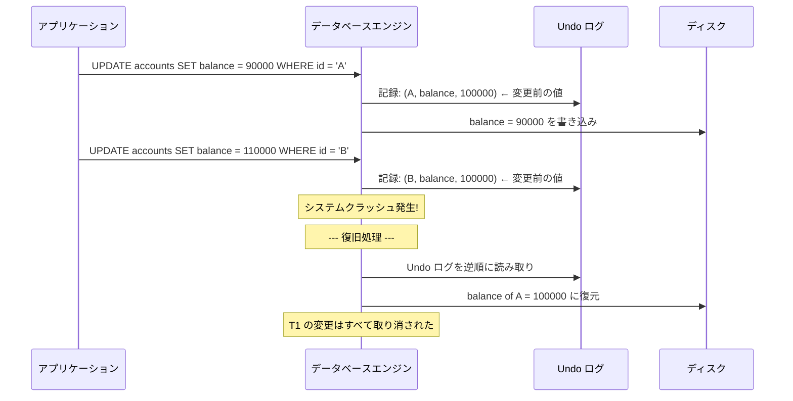

この Undo ログは、後述する **WAL（Write-Ahead Logging）** プロトコルの一部として管理される。WAL は「データを変更する前に、必ずログを先に書く」という原則であり、原子性と永続性の両方を支えている。

### 2.4 Shadow Paging — もう一つのアプローチ

Undo ログ以外にも原子性を実現する手法がある。**Shadow Paging** は、トランザクションの変更をデータベースの「影のコピー」に対して行い、コミット時にアトミックにポインタを切り替える方式である。

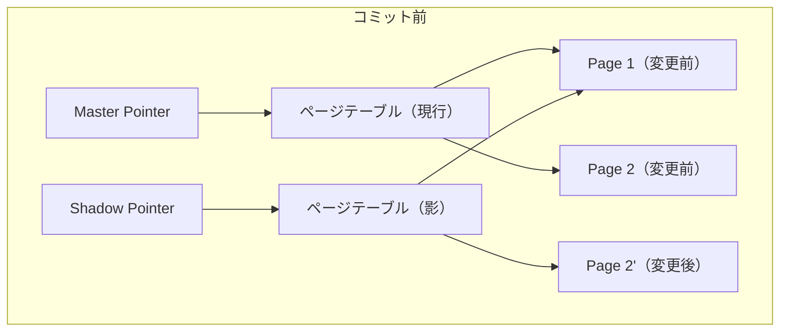

コミット時は Master Pointer を Shadow のページテーブルに向けるだけでよい。この切り替えはアトミックに行える（1つのポインタの更新）。SQLiteの旧バージョンではこの方式が使われていた。しかし、Shadow Paging はランダムI/Oが多くなりがちでパフォーマンスに劣るため、現代の高性能データベースでは WAL ベースのアプローチが主流である。

## 3. Consistency（一貫性）— 不変条件の維持

### 3.1 一貫性の定義

**Consistency（一貫性）**とは、トランザクションの実行前と実行後でデータベースが「正しい状態」を保つことを保証する性質である。ここでいう「正しい状態」とは、データベースに定義されたすべての**不変条件（Invariant）**が満たされている状態を指す。

不変条件の例を示す。

- **主キー制約**: 同じ主キーを持つレコードが2つ以上存在しない
- **外部キー制約**: 参照先のレコードが必ず存在する
- **CHECK制約**: 残高が負にならない（`balance >= 0`）
- **ビジネスルール**: 銀行システムにおいて、すべての口座の残高の合計が常に一定である

```sql
-- define invariant constraints
CREATE TABLE accounts (
    id VARCHAR(10) PRIMARY KEY,
    balance INTEGER NOT NULL CHECK (balance >= 0), -- balance must be non-negative
    CONSTRAINT total_balance_check ... -- application-level invariant
);
```

### 3.2 一貫性のユニークな位置づけ

ACIDの4特性の中で、**一貫性だけが他の3つと本質的に異なる**。原子性、分離性、永続性はデータベースエンジンが自動的に提供する「システムの性質」であるのに対し、一貫性は**アプリケーションとデータベースの協力**によって実現される性質である。

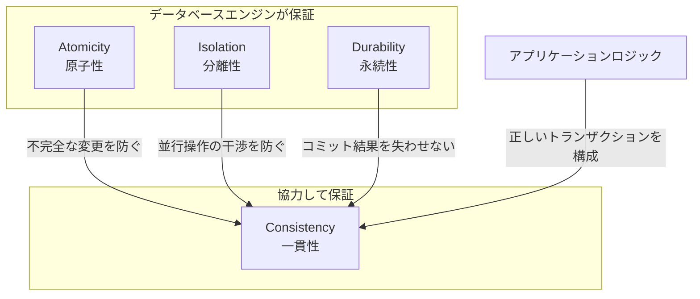

この図が示すように、一貫性は原子性・分離性・永続性の3つがすべて正しく機能した上で、アプリケーションが「正しいトランザクション」を発行することで初めて成立する。たとえば、データベースがいくら原子性を保証しても、アプリケーションが口座Aから引き落として口座Bに入金するのではなく口座Cに入金するようなバグがあれば、ビジネス上の一貫性は壊れる。

### 3.3 制約によるガードレール

データベースは宣言的な制約を通じて、一貫性の維持を支援する。

| 制約の種類 | 役割 | 例 |
|---|---|---|
| NOT NULL | カラムにNULL値を禁止 | `email VARCHAR(255) NOT NULL` |
| UNIQUE | 値の一意性を保証 | `UNIQUE (email)` |
| PRIMARY KEY | 行の一意識別子 | `PRIMARY KEY (id)` |
| FOREIGN KEY | 参照整合性を保証 | `REFERENCES users(id)` |
| CHECK | 任意の条件式を強制 | `CHECK (balance >= 0)` |
| TRIGGER | 変更時にカスタムロジックを実行 | 監査ログの自動記録 |

これらの制約はトランザクションのコミット時（あるいは各文の実行時）にチェックされる。制約に違反する変更が検出されると、トランザクションはアボートされ、原子性の仕組みによってすべての変更がロールバックされる。

### 3.4 一貫性に関する議論

Martin Kleppmannは著書「Designing Data-Intensive Applications」において、一貫性をACIDの「C」に含めることに疑問を呈している。彼の主張は以下のとおりである。

> Atomicity, Isolation, Durability はデータベースの性質であるが、Consistency はアプリケーションの性質である。アプリケーションが一貫性の条件を定義し、データベースはそれを維持する手助けをするに過ぎない。ACIDの「C」は、良い頭字語を作るために無理やり追加されたものだ。

この批判は一面では正しい。しかし、一貫性をACIDに含めることには実用的な意味がある。原子性と分離性が**なぜ必要なのか**を説明する際に、一貫性という上位概念があると理解が容易になる。原子性と分離性は、一貫性を維持するための**手段**として位置づけられるのである。

## 4. Isolation（分離性）— 同時実行制御との関係

### 4.1 分離性の定義

**Isolation（分離性）**とは、同時に実行される複数のトランザクションが互いに干渉しないことを保証する性質である。理想的には、各トランザクションは「自分だけがデータベースを使っている」かのように振る舞える。

分離性の最も厳格な定義は**直列化可能性（Serializability）**である。これは、複数のトランザクションが並行に実行された結果が、それらのトランザクションをある順番で逐次実行した場合の結果と等しくなることを意味する。

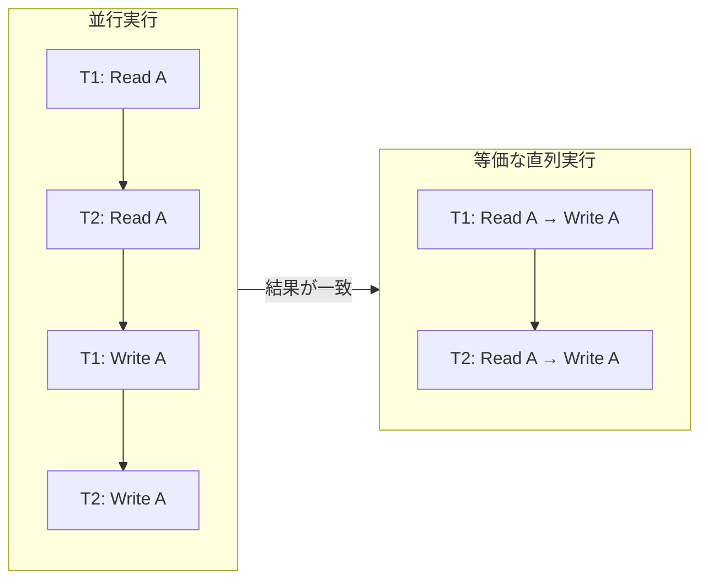

### 4.2 分離性の異常（Anomaly）

分離性が不完全な場合に発生する異常現象を理解することは、分離レベルを適切に選択する上で不可欠である。

#### Dirty Read（ダーティリード）

まだコミットされていないトランザクションの変更を、別のトランザクションが読み取ってしまう現象。

```
T1: UPDATE accounts SET balance = 50000 WHERE id = 'A';  -- committed value: 100000
T2: SELECT balance FROM accounts WHERE id = 'A';         -- reads 50000 (uncommitted!)
T1: ROLLBACK;                                            -- balance reverts to 100000
-- T2 has seen a value (50000) that never actually existed in the committed database
```

#### Non-Repeatable Read（ファジーリード）

同じトランザクション内で同じクエリを2回実行したとき、異なる結果が返ってくる現象。

```
T1: SELECT balance FROM accounts WHERE id = 'A';         -- reads 100000
T2: UPDATE accounts SET balance = 50000 WHERE id = 'A';
T2: COMMIT;
T1: SELECT balance FROM accounts WHERE id = 'A';         -- reads 50000 (different!)
```

#### Phantom Read（ファントムリード）

同じ検索条件で2回クエリを実行したとき、1回目には存在しなかった行が2回目に現れる（または1回目に存在した行が消える）現象。

```
T1: SELECT COUNT(*) FROM accounts WHERE balance > 50000; -- returns 5
T2: INSERT INTO accounts (id, balance) VALUES ('X', 80000);
T2: COMMIT;
T1: SELECT COUNT(*) FROM accounts WHERE balance > 50000; -- returns 6 (phantom!)
```

#### Write Skew（書き込みスキュー）

2つのトランザクションがそれぞれ別の行を読み取り、その結果に基づいてそれぞれ別の行を更新するが、組み合わせると不変条件が壊れる現象。

```
-- invariant: at least one doctor must be on call
-- current state: doctor A and doctor B are both on call

T1: SELECT COUNT(*) FROM on_call WHERE shift = 'night'; -- returns 2
T2: SELECT COUNT(*) FROM on_call WHERE shift = 'night'; -- returns 2
T1: UPDATE on_call SET on_duty = false WHERE doctor = 'A'; -- still 1 on call (B)
T2: UPDATE on_call SET on_duty = false WHERE doctor = 'B'; -- still 1 on call (A)
T1: COMMIT;
T2: COMMIT;
-- result: nobody is on call! invariant violated
```

### 4.3 SQL標準の分離レベル

ANSI SQL標準は4つの分離レベルを定義し、各レベルでどの異常が許容されるかを規定している。

| 分離レベル | Dirty Read | Non-Repeatable Read | Phantom Read |
|---|---|---|---|
| Read Uncommitted | 許容 | 許容 | 許容 |
| Read Committed | 防止 | 許容 | 許容 |
| Repeatable Read | 防止 | 防止 | 許容 |
| Serializable | 防止 | 防止 | 防止 |

::: warning SQL標準の分離レベルは不完全
ANSI SQL標準の分離レベル定義は1992年に策定されたものであり、いくつかの問題が指摘されている。1995年にBerenson、Bernstein、Gray らが発表した論文「A Critique of ANSI SQL Isolation Levels」では、SQL標準がカバーしていない異常（Write Skew など）の存在を指摘し、**Snapshot Isolation** という新しい分離レベルを提案した。
:::

### 4.4 Snapshot Isolation

**Snapshot Isolation（SI）**は、各トランザクションがデータベースのある時点の一貫したスナップショットを見るという分離レベルである。Oracleが「Serializable」として提供している実装は実際にはSIであり、PostgreSQLの「Repeatable Read」も実質的にはSIである。

SIの特徴は以下のとおりである。

- 各トランザクションは開始時点のスナップショットを取得する
- 読み取りはすべてこのスナップショットから行われる（一貫性読み取り）
- 書き込み時に**First-Committer-Wins** ルール（または **First-Updater-Wins** ルール）が適用される。同じ行を更新しようとする2つのトランザクションのうち、先にコミットした方が勝ち、後からコミットしようとした方はアボートされる

SIはSerializableよりも弱い。上述のWrite Skew異常を防ぐことができないためである。しかし、SIは実用上十分な一貫性を提供しつつ、Serializableよりもはるかに高い並行性能を実現するため、多くのデータベースで採用されている。

### 4.5 分離性の実現方式

分離性を実現するための主要なアプローチは3つある。

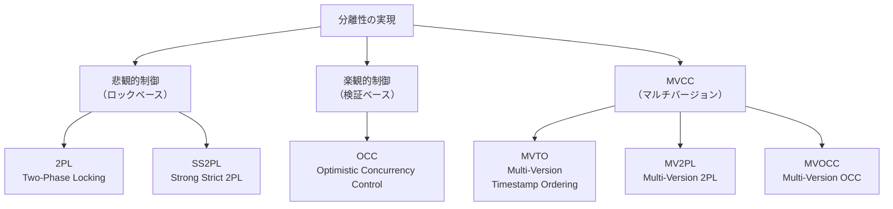

**2PL（Two-Phase Locking）**: トランザクションをロック取得フェーズとロック解放フェーズの2段階に分ける。直列化可能性を保証できるが、読み取りと書き込みが互いにブロックするためスループットが低下する。

**OCC（Optimistic Concurrency Control）**: トランザクションの実行中はロックを取得せず、コミット時に競合がないかを検証する。競合が検出された場合はアボートして再実行する。競合が少ないワークロードで効果的だが、競合が多いと再実行のコストが高くなる。

**MVCC（Multi-Version Concurrency Control）**: データの複数バージョンを保持し、読み取りトランザクションが古いバージョンを参照できるようにする。読み取りと書き込みが互いにブロックしないため、読み取りが多いワークロードで高い性能を発揮する。現代のほとんどのデータベースが採用している方式である。

## 5. Durability（永続性）— コミットされたデータは失われない

### 5.1 永続性の定義

**Durability（永続性）**とは、一度コミットされたトランザクションの結果がシステム障害後も失われないことを保証する性質である。電源障害、OS のクラッシュ、ハードウェア障害などが発生しても、コミットされたデータは復旧可能でなければならない。

永続性は一見単純に思えるが、実装は極めて難しい。その理由は、現代のコンピュータシステムにおけるメモリとストレージの階層構造にある。

### 5.2 揮発性と不揮発性の境界

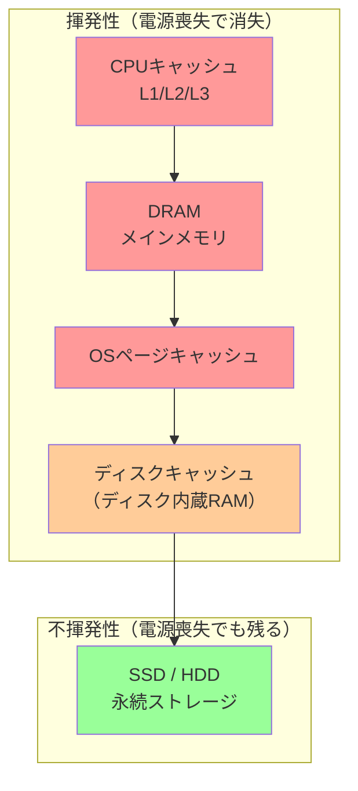

データベースがコミットを「完了した」とアプリケーションに応答するためには、変更がすべての揮発性レイヤーを通り抜けて不揮発性ストレージに到達していることが保証されなければならない。

### 5.3 WAL（Write-Ahead Logging）

**WAL（Write-Ahead Logging）**は永続性（および原子性）を実現するための最も広く採用されている技術である。その核心は驚くほど単純な1つの原則に集約される。

> **WAL プロトコル**: データページへの変更をディスクに書き込む前に、その変更に対応するログレコードを必ず先に永続ストレージに書き込まなければならない。

なぜこの順序が重要なのか。ログが先に書かれていれば、データページの書き込みの途中でクラッシュしても、ログを再生（Redo）することでデータを復旧できる。逆に、データだけが先に書かれてログが書かれていない状態でクラッシュすると、その変更がコミットされたものなのか、まだロールバックすべきものなのかを判別できなくなる。

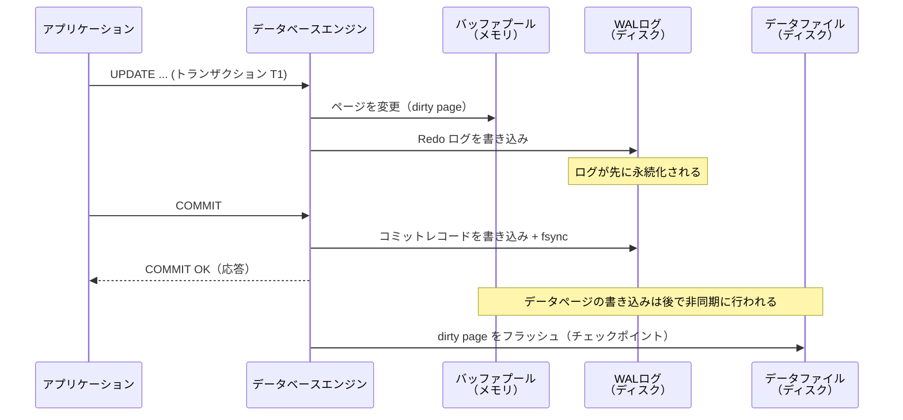

WAL の設計には2種類のログエントリが登場する。

- **Redo ログ**: 変更後の値を記録する。クラッシュ後の復旧時に、コミット済みだがデータファイルに反映されていない変更を再適用するために使う
- **Undo ログ**: 変更前の値を記録する。クラッシュ後の復旧時に、コミットされていないトランザクションの変更を取り消すために使う

多くのデータベースでは Redo と Undo の両方を含む **ARIES（Algorithm for Recovery and Isolation Exploiting Semantics）** アルゴリズムを採用している。ARIES は1992年にIBMの C. Mohan らによって提案された復旧アルゴリズムであり、以下の3フェーズで復旧を行う。

1. **Analysis（解析）**: WAL を先頭からスキャンし、クラッシュ時点でのダーティページとアクティブトランザクションを特定する
2. **Redo（再実行）**: コミット済みの変更をすべて再適用する（「歴史を繰り返す」方式）
3. **Undo（取り消し）**: コミットされていないトランザクションの変更を取り消す

### 5.4 fsync とその落とし穴

`fsync` システムコールは、カーネルのページキャッシュに滞留しているデータを物理ストレージに書き出すようOSに指示する。WAL のコミットレコードを書いた後に `fsync` を呼ぶことで、コミットされたトランザクションのログが確実に永続化される。

しかし、`fsync` にはいくつかの落とし穴が存在する。

::: danger fsync の注意点
- **パフォーマンスコスト**: `fsync` はディスクI/Oの完了を待つため、レイテンシが高い。特にHDDでは回転待ちが発生し、1回の `fsync` に数ミリ秒かかることがある
- **グループコミット**: 毎回の `fsync` のコストを軽減するため、複数のトランザクションのコミットレコードをまとめて1回の `fsync` で書き出す手法。PostgreSQL や MySQL で採用されている
- **ディスクキャッシュの問題**: 一部のストレージデバイスは `fsync` を受け取っても内蔵キャッシュのデータを実際にはフラッシュしないことがある。この場合、`fsync` が成功を返しても永続性は保証されない。データベースの運用では、ディスクの Write Cache を無効化するか、バッテリーバックアップ付きキャッシュを使うことが推奨される
:::

### 5.5 レプリケーションと永続性

単一サーバーの `fsync` だけでは、ディスク自体の物理的な故障には対処できない。そのため、多くの本番システムでは**レプリケーション**を併用して永続性を強化する。

| レプリケーション方式 | 永続性の保証 | レイテンシ |
|---|---|---|
| 非同期レプリケーション | コミット応答後にレプリカへ転送。レプリカ遅延中にプライマリが故障するとデータ喪失の可能性あり | 低い |
| 半同期レプリケーション | 少なくとも1つのレプリカがログを受信したことを確認してからコミット応答 | 中程度 |
| 同期レプリケーション | すべてのレプリカがログを永続化したことを確認してからコミット応答 | 高い |

PostgreSQL のストリーミングレプリケーションや MySQL の半同期レプリケーションは、`synchronous_commit` や `rpl_semi_sync_master_wait_for_slave_count` といったパラメータで永続性のレベルを調整できる。

## 6. ACIDの相互関係と誤解されやすい点

### 6.1 4つの特性は独立ではない

ACID の4つの特性は独立に存在するものではなく、相互に依存し合っている。

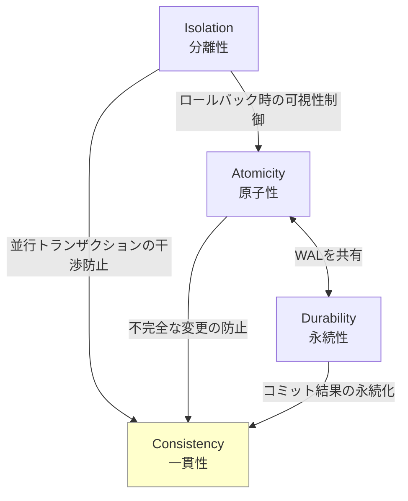

- **原子性と永続性は WAL を共有**している。WAL の Redo ログが永続性を、Undo ログが原子性を支える。両者は同じログインフラストラクチャの上に構築されている
- **一貫性は他の3つの結果**として成立する。原子性が不完全な変更を防ぎ、分離性が並行実行の干渉を防ぎ、永続性がコミット結果を保持する。これらが揃って初めて一貫性が維持される
- **分離性と原子性は互いに影響**する。トランザクションのロールバック時、ロールバック中の中間状態が他のトランザクションから見えてはならない（分離性の要件）

### 6.2 よくある誤解

#### 誤解1:「ACIDを満たしていれば絶対に安全」

ACID特性は正しさの**必要条件**であって十分条件ではない。ACID準拠のデータベースを使っていても、アプリケーションのロジックが誤っていれば一貫性は壊れる。また、分離レベルの選択を誤ると、想定外の異常が発生しうる。

#### 誤解2:「Serializableでないとデータが壊れる」

多くの実用的なアプリケーションでは、Read Committed や Snapshot Isolation で十分な正しさが得られる。Serializable は最も安全だが、性能コストが高い。重要なのは、アプリケーションの要件に基づいて**適切な分離レベルを選択する**ことである。

#### 誤解3:「永続性 = データは絶対に失われない」

永続性は「コミットされたトランザクションの結果が、その後のシステム障害によって失われない」ことを保証するが、**すべての障害**に対して保護するわけではない。データセンター全体の壊滅的な障害や、地理的に離れたレプリカすべてが同時に失われるような事態は、通常の永続性の保証の範囲外である。

#### 誤解4:「NoSQLはACIDを提供しない」

歴史的にはNoSQLデータベースの多くがACIDを犠牲にしてスケーラビリティを優先していたが、現代のNoSQLデータベースの中にはACIDトランザクションを提供するものがある。MongoDB 4.0以降はマルチドキュメントACIDトランザクションをサポートしているし、Google Cloud FirestoreもACIDトランザクションを提供している。

## 7. トランザクションの実装メカニズム

### 7.1 ARIES復旧アルゴリズムの詳細

前述した ARIES アルゴリズムについて、もう少し詳しく見ていこう。ARIES の設計原則は以下の3つである。

1. **WAL（Write-Ahead Logging）**: データページの変更前にログを書く
2. **Repeating History During Redo（Redo時に歴史を繰り返す）**: クラッシュ復旧時、コミットされたかどうかに関係なく、すべてのログレコードを再適用する
3. **Logging Changes During Undo（Undo時にも変更をログに記録する）**: Undo操作自体も**CLR（Compensation Log Record）**としてログに記録する。これにより、Undo中にクラッシュが再発しても、CLRを使って安全に復旧を再開できる

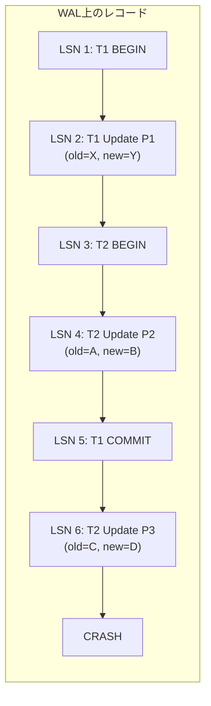

上の例では、クラッシュ時点でT1はコミット済み、T2は未コミットである。ARIES の復旧は以下の順序で行われる。

**Analysis フェーズ**: 最後のチェックポイントからログを順方向にスキャンし、以下を特定する。
- ダーティページテーブル: ディスクに反映されていない可能性のあるページの一覧
- アクティブトランザクションテーブル: クラッシュ時点で未コミットだったトランザクションの一覧（この例ではT2）

**Redo フェーズ**: ログを順方向にスキャンし、すべての変更を再適用する。T1の変更もT2の変更も等しく再適用する。これにより、クラッシュ直前の状態が正確に復元される。

**Undo フェーズ**: 未コミットトランザクション（T2）の変更を逆順に取り消す。LSN 6 の変更を取り消し（P3をDからCに戻す）、LSN 4 の変更を取り消す（P2をBからAに戻す）。各 Undo 操作は CLR としてログに記録される。

### 7.2 ロックマネージャ

トランザクションの分離性を実現するために、ロックベースのデータベースでは**ロックマネージャ**がロックの取得・解放・待機を管理する。

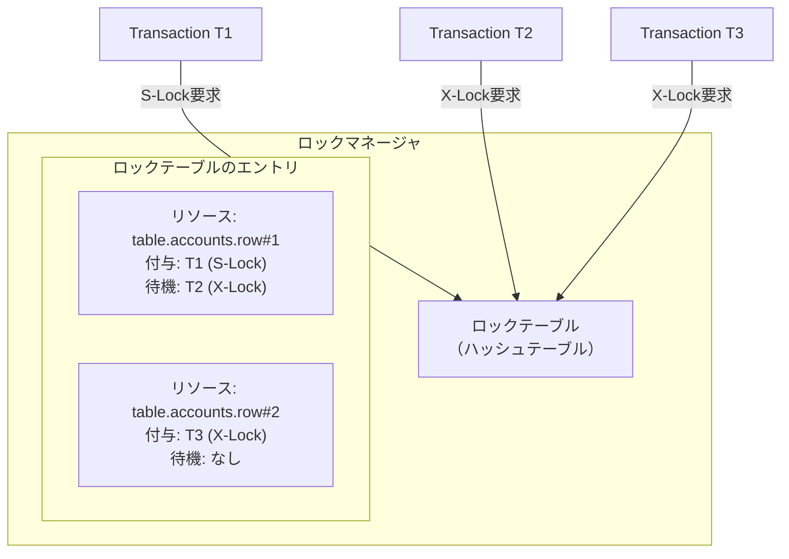

ロックの粒度は性能に大きく影響する。粒度が細かい（行レベル）ほど並行性が高まるが、ロックの管理コストが増加する。粒度が粗い（テーブルレベル）ほど管理が容易だが、並行性が制限される。

| ロック粒度 | 並行性 | オーバーヘッド | 用途 |
|---|---|---|---|
| データベースレベル | 最低 | 最小 | バックアップ、スキーマ変更 |
| テーブルレベル | 低 | 小 | DDL操作、バルク操作 |
| ページレベル | 中 | 中 | 一部のストレージエンジン |
| 行レベル | 高 | 大 | OLTP（InnoDB, PostgreSQL） |

### 7.3 デッドロック検出

複数のトランザクションがロックを互いに待ち合うと**デッドロック**が発生する。ロックマネージャはこれを検出し、いずれかのトランザクションを犠牲にする（アボートする）必要がある。

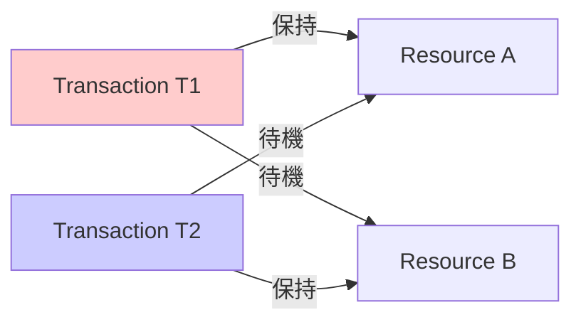

デッドロック検出には2つのアプローチがある。

**Wait-For Graph（待機グラフ）**: トランザクション間の待機関係をグラフとして表現し、そのグラフ内のサイクルを検出する。サイクルが見つかった場合、いずれかのトランザクションをアボートしてサイクルを解消する。犠牲トランザクションの選択には、実行時間が短いもの、変更量が少ないもの（ロールバックコストが低いもの）などの基準が使われる。

**タイムアウト**: 一定時間以上ロックを待機しているトランザクションを強制的にアボートする。実装が単純だが、タイムアウト値の設定が難しい（短すぎると不要なアボートが多発し、長すぎるとデッドロック解消が遅れる）。

## 8. ACIDとBASEの比較

### 8.1 BASEの登場背景

インターネットの急速な成長に伴い、単一サーバーのリレーショナルデータベースでは処理しきれないスケールのデータを扱う必要が生じた。Amazon、Google、Facebookといった企業は、ACIDの厳密な保証を一部緩和することで、水平スケーラビリティと可用性を確保するアプローチを模索した。

この文脈で提唱されたのが**BASE**特性である。

- **BA（Basically Available）**: 基本的に利用可能。部分的な障害が発生しても、システム全体が利用不能にはならない
- **S（Soft State）**: 柔らかい状態。システムの状態は時間の経過とともに変化しうる（外部からの入力がなくても、内部の同期処理によって状態が変わりうる）
- **E（Eventually Consistent）**: 結果整合性。一定の時間が経過すれば、すべてのレプリカが最終的に同じ値に収束する

### 8.2 ACIDとBASEの対比

| 特性 | ACID | BASE |
|---|---|---|
| 設計思想 | 厳密な正しさ | 柔軟な可用性 |
| 一貫性モデル | 強い一貫性 | 結果整合性 |
| スケーラビリティ | 垂直スケール中心 | 水平スケール向き |
| 可用性 | 一貫性を優先 | 可用性を優先 |
| 適用領域 | 金融、在庫管理 | SNS、分析、ログ |
| 代表的なシステム | PostgreSQL, MySQL | DynamoDB, Cassandra |

### 8.3 対立ではなくスペクトラム

ACIDとBASEは二項対立ではなく、スペクトラム（連続体）として理解すべきである。

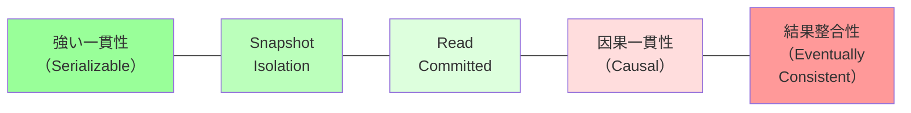

現実のシステムは、このスペクトラム上のどこかに位置する。重要なのは、アプリケーションの要件に基づいて**適切な位置を選択する**ことである。すべてのデータが同じ一貫性レベルを必要とするわけではない。1つのアプリケーション内でも、決済処理にはACIDを、タイムラインの表示には結果整合性を適用する、といった使い分けが一般的である。

## 9. 分散トランザクションとACID

### 9.1 分散環境におけるACIDの課題

単一サーバーでのACID実装は確立された技術であるが、データが複数のノードに分散されると事態は複雑になる。複数のノードにまたがるトランザクション（分散トランザクション）でACIDを保証するには、すべてのノードが「コミットするか、アボートするか」を合意しなければならない。

### 9.2 Two-Phase Commit（2PC）

**Two-Phase Commit（2PC）**は分散トランザクションを実現するための古典的なプロトコルである。1つの**コーディネーター**と複数の**参加者（Participant）**から構成される。

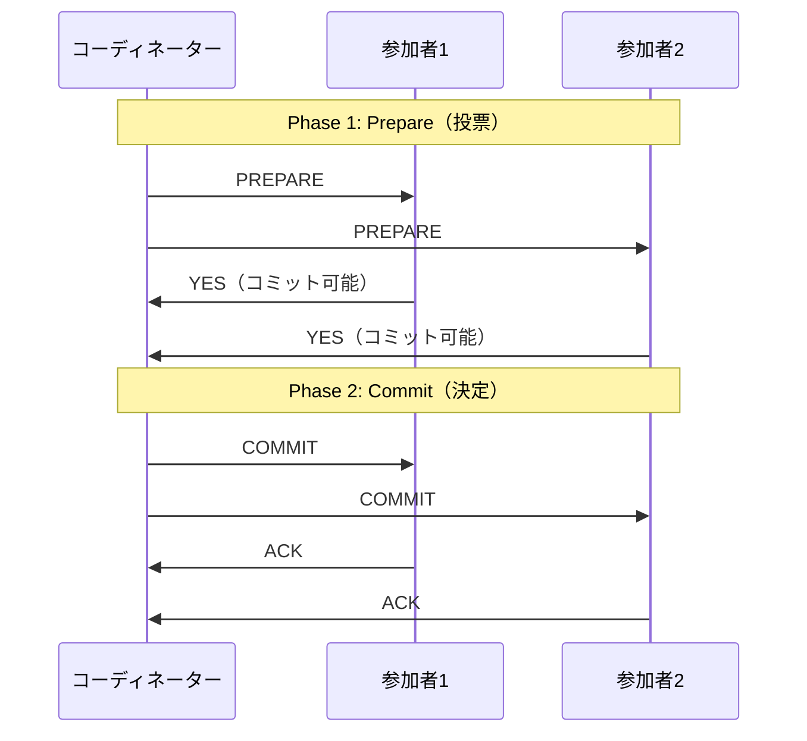

**Phase 1（Prepare / 投票フェーズ）**:
1. コーディネーターが全参加者に PREPARE メッセージを送信する
2. 各参加者はトランザクションをコミットできる状態かどうかを検証する
3. コミット可能であれば YES、不可能であれば NO を応答する
4. YES を応答した参加者は、コーディネーターの最終決定が届くまでコミットもアボートもできない（**不確実な状態**に入る）

**Phase 2（Commit / 決定フェーズ）**:
1. すべての参加者が YES を返した場合、コーディネーターは COMMIT を決定する
2. いずれかの参加者が NO を返した場合、コーディネーターは ABORT を決定する
3. コーディネーターは決定をすべての参加者に送信する

### 9.3 2PCの問題点

2PC にはいくつかの重大な問題がある。

**ブロッキング問題**: Phase 1 で YES を応答した参加者は、コーディネーターの最終決定が届くまで、ロックを保持したまま待機し続けなければならない。コーディネーターがクラッシュすると、参加者は無期限にブロックされる可能性がある。

**単一障害点**: コーディネーターが障害を起こすと、進行中の分散トランザクションが宙に浮く。参加者は独自にコミットもアボートもできない。

**パフォーマンス**: 2回のラウンドトリップと、各フェーズでの `fsync` が必要であるため、レイテンシが高い。

::: tip 3PCとPaxos Commit
2PCのブロッキング問題を解決するために**3PC（Three-Phase Commit）**が提案されたが、ネットワーク分断に対して脆弱であるため、実用上はあまり使われていない。より現代的なアプローチとして、PaxosやRaftなどのコンセンサスアルゴリズムをコミットプロトコルに組み込む手法がある。Google Spannerは**Paxosベースのレプリケーション**と**2PC**を組み合わせることで、グローバルスケールの分散ACIDトランザクションを実現している。
:::

### 9.4 Sagaパターン

マイクロサービスアーキテクチャでは、各サービスが独自のデータベースを持つため、従来の2PCを適用することが難しい。代わりに用いられるのが**Sagaパターン**である。

Sagaはトランザクションを一連の**ローカルトランザクション**に分解し、各ローカルトランザクションが成功するたびに次のローカルトランザクションをトリガーする。いずれかのローカルトランザクションが失敗した場合は、それまでに成功したローカルトランザクションの**補償トランザクション（Compensating Transaction）**を逆順に実行して変更を取り消す。

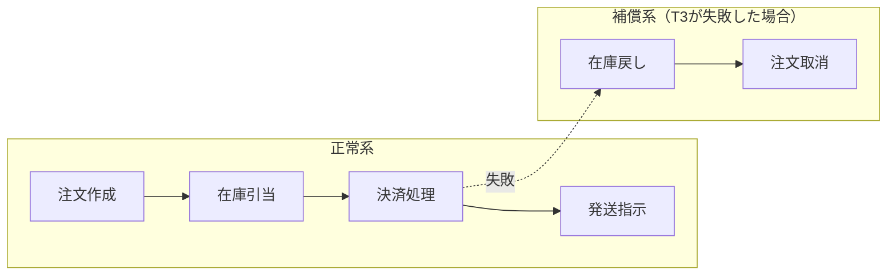

Sagaは厳密なACIDトランザクションではない。分離性が保証されないため、Saga実行中に中間状態が他のトランザクションから見える可能性がある。しかし、結果整合性を前提としたシステム設計においては実用的なアプローチである。

### 9.5 分散ACIDの進化

近年、分散環境でもACIDを妥協なく提供する「NewSQL」データベースが登場している。

| システム | 手法 | 特徴 |
|---|---|---|
| Google Spanner | TrueTime + 2PC + Paxos | GPSと原子時計による高精度タイムスタンプで外部一貫性を実現 |
| CockroachDB | HLC + 2PC + Raft | Hybrid Logical Clock。Spannerに近い設計をコモディティハードウェアで実現 |
| TiDB | Percolator + Raft | Google Percolatorモデルベース。分散MVCCトランザクション |
| YugabyteDB | HLC + 2PC + Raft | PostgreSQL互換のAPIで分散ACIDを提供 |

これらのシステムは、Spannerの先駆的な設計に影響を受けつつ、コンセンサスアルゴリズム（Paxos / Raft）とタイムスタンプ管理を巧みに組み合わせることで、分散環境でのACIDを実現している。

## 10. 現代のデータベースにおけるACID実装の実際

### 10.1 PostgreSQL

PostgreSQLはACID特性の実装において最も教科書的で透明性の高いアプローチを取るデータベースの1つである。

**原子性と永続性（WAL）**: PostgreSQLは WAL を使用して原子性と永続性を実現する。WAL ファイルは `pg_wal` ディレクトリに格納され、各 WAL レコードには LSN（Log Sequence Number）が割り振られる。コミット時には WAL のフラッシュが行われ、その後アプリケーションにコミット成功が通知される。

**分離性（MVCC）**: PostgreSQLは MVCCを採用しており、各行には `xmin`（作成トランザクションID）と `xmax`（削除/更新トランザクションID）が記録される。可視性判定はトランザクションの**スナップショット**に基づいて行われる。

```sql
-- check MVCC metadata in PostgreSQL
SELECT xmin, xmax, * FROM accounts WHERE id = 'A';
```

PostgreSQLの分離レベルと実際の動作の対応は以下のとおりである。

| SQL標準の名称 | PostgreSQLの実装 | 備考 |
|---|---|---|
| Read Uncommitted | Read Committed として動作 | Dirty Read を許容しない |
| Read Committed | 文ごとにスナップショットを取得 | デフォルト |
| Repeatable Read | Snapshot Isolation | Write Skew を防がない |
| Serializable | SSI（Serializable Snapshot Isolation） | 真の直列化可能性 |

PostgreSQLの **SSI（Serializable Snapshot Isolation）** は特筆に値する。2008年にCahill、Roehmらが提案したアルゴリズムであり、Snapshot Isolation の上に軽量な競合検出を追加することで、ロックベースの Serializable よりも高い並行性能で真の直列化可能性を実現する。

### 10.2 MySQL（InnoDB）

MySQL のデフォルトストレージエンジンである InnoDB もACID準拠を謳っている。

**原子性と永続性**: InnoDB は **Redo ログ** と **Undo ログ** を分離して管理する。Redo ログは循環バッファとして2つ以上のファイルに書き込まれ、Undo ログはシステムテーブルスペース内に格納される。コミット時には `innodb_flush_log_at_trx_commit` パラメータの設定に応じて、Redo ログのフラッシュ動作が変わる。

| 設定値 | 動作 | 永続性 | 性能 |
|---|---|---|---|
| 1（デフォルト） | 毎コミットで fsync | 完全な永続性 | 最も遅い |
| 2 | 毎コミットでOSキャッシュに書き出し、fsyncは毎秒 | OSクラッシュでは最大1秒分のデータを喪失 | 中程度 |
| 0 | ログの書き出しもfsyncも毎秒 | クラッシュで最大1秒分のデータを喪失 | 最も速い |

::: warning innodb_flush_log_at_trx_commit の選択
`innodb_flush_log_at_trx_commit = 1` のみが完全なACID永続性を保証する。値を 0 や 2 に設定するとパフォーマンスは向上するが、永続性が犠牲になる。金融系アプリケーションでは必ず 1 を使用すべきである。
:::

**分離性**: InnoDB もMVCCを採用している。デフォルトの分離レベルは **Repeatable Read** であり、Undo ログに保持された古いバージョンを使って一貫性読み取りを実現する。InnoDB の Repeatable Read は **Gap Lock（ギャップロック）** を使ってファントムリードも防止するため、SQL標準の Repeatable Read よりも強い保証を提供する。ただし、Write Skew は防がないため、真の Serializable ではない。

### 10.3 SQLite

SQLiteは組み込みデータベースでありながら、完全なACIDトランザクションをサポートする。

SQLiteの原子性と永続性は、**ジャーナルモード**の設定によって実装が異なる。

- **Rollback Journal**: トランザクション開始時にデータベースファイルのコピー（ジャーナル）を作成する。クラッシュ復旧時はジャーナルからデータを復元する。Shadow Paging に似たアプローチ
- **WAL（Write-Ahead Logging）モード**: PostgreSQL や InnoDB と同様のWALアプローチ。読み取りと書き込みが並行に実行できるため、WAL モードの方がパフォーマンスが高い

```sql
-- enable WAL mode in SQLite
PRAGMA journal_mode=WAL;
```

### 10.4 ACID実装のまとめ

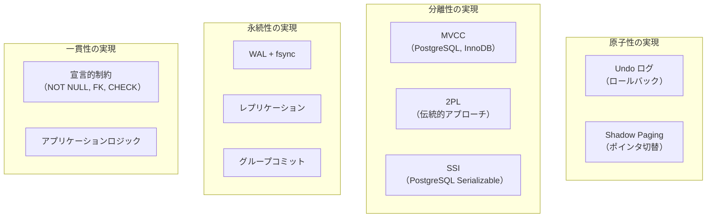

## 11. 実践的な考慮事項

### 11.1 分離レベルの選択指針

分離レベルの選択はアプリケーションの要件とワークロードの特性に依存する。以下のフローチャートが選択の参考になる。

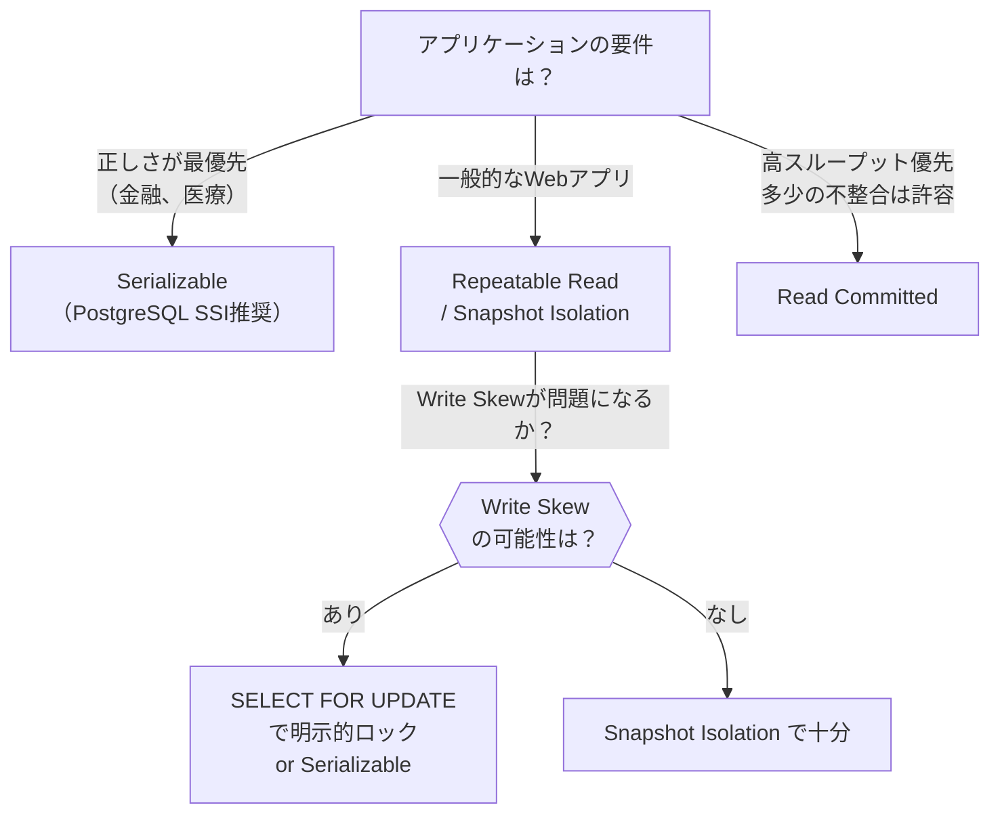

### 11.2 長時間トランザクションの問題

長時間実行されるトランザクションはデータベースに深刻な影響を与える。

- **ロック保持**: 長時間ロックが保持されると、他のトランザクションがブロックされてスループットが低下する
- **MVCC のバージョン膨張**: 長時間トランザクションのスナップショットが古いバージョンの回収を妨げ、ストレージが肥大化する（PostgreSQL の `VACUUM` の遅延、InnoDB の Undo ログの肥大化）
- **デッドロックのリスク**: トランザクションが長いほど、他のトランザクションとのロック競合の確率が高まる

```sql
-- anti-pattern: long-running transaction
BEGIN;
SELECT * FROM large_table; -- holds snapshot, prevents VACUUM
-- ... application does something for 30 minutes ...
UPDATE accounts SET balance = 100 WHERE id = 'A';
COMMIT; -- 30 minutes later
```

対策として、トランザクションはできる限り短く保つべきである。人間の操作をトランザクション内に含めてはならない。バッチ処理が必要な場合は、小さなトランザクションに分割することを検討する。

### 11.3 リトライとべき等性

トランザクションのアボート（デッドロック、Serialization Failure、タイムアウト）は正常な動作の一部であり、アプリケーションはリトライを適切に実装する必要がある。

```python
# retry logic with exponential backoff
def execute_with_retry(conn, operation, max_retries=3):
    for attempt in range(max_retries):
        try:
            with conn.begin():
                result = operation(conn)
                return result
        except SerializationError:
            if attempt == max_retries - 1:
                raise
            # exponential backoff with jitter
            wait_time = (2 ** attempt) + random.uniform(0, 1)
            time.sleep(wait_time)
```

リトライ時に注意すべきは**べき等性（Idempotency）**である。同じ操作を2回実行しても結果が変わらないように設計する必要がある。特に、コミットが成功したにもかかわらずネットワーク障害で応答を受け取れなかった場合、アプリケーションは「コミットが成功したかどうか」を判別できない。このようなケースに対応するには、各操作にユニークなIDを割り当て、重複実行を検出する仕組みが有効である。

## 12. まとめ

ACID特性はデータベースの信頼性を支える基盤であり、その理解は現代のソフトウェアエンジニアリングにおいて不可欠である。

**Atomicity（原子性）**はトランザクションの all-or-nothing を保証し、WAL の Undo ログによって実現される。**Consistency（一貫性）**は不変条件の維持を意味し、データベースの制約機構とアプリケーションロジックの協力によって成立する。**Isolation（分離性）**は並行トランザクションの干渉を防ぎ、MVCC やロックなどの同時実行制御方式によって実現される。**Durability（永続性）**はコミット結果の永続化を保証し、WAL の Redo ログと fsync によって実現される。

これら4つの特性は独立ではなく、WAL というインフラストラクチャを共有しつつ、一貫性という上位目標に向かって協調して機能している。

分散システムの時代において、ACID の保証範囲と限界を正しく理解し、アプリケーションの要件に応じて適切な一貫性レベルを選択できることが、信頼性の高いシステムを構築する鍵となる。厳密なACIDが必要な場面では Serializable や NewSQL データベースを選択し、高い可用性とスケーラビリティが優先される場面では結果整合性を受け入れる — この判断を正しく行うためには、ACID の各特性が何を保証し、何を保証しないのかを深く理解しておく必要がある。
