# アクターモデル — メッセージパッシングによる並行計算

## 1. 背景と動機 — 共有メモリの問題

並行プログラミングにおいて最も広く使われてきたモデルは、**共有メモリ** と **ロック** の組み合わせである。複数のスレッドが同じメモリ空間にアクセスし、mutex やセマフォといった同期プリミティブを使って排他制御を行う。このモデルは直感的に理解しやすく、多くのプログラミング言語やOSが直接サポートしている。

しかし、共有メモリとロックによる並行プログラミングには、本質的な困難さが伴う。

**デッドロック（Deadlock）**: 2つ以上のスレッドが互いに相手の保持するロックの解放を待ち合う状態である。デッドロックは非決定的に発生するため、テストで検出することが極めて難しい。プログラムの規模が大きくなるほど、ロックの獲得順序を全体的に管理することは現実的でなくなる。

**データ競合（Data Race）**: 2つ以上のスレッドが同時に同じメモリ位置にアクセスし、少なくとも1つが書き込みである場合に発生する。データ競合はメモリの破壊を引き起こし、未定義動作につながる。ロックの付け忘れや、ロックの粒度の設計ミスによって容易に発生する。

**優先度逆転（Priority Inversion）**: 低優先度のスレッドが保持するロックを高優先度のスレッドが待つことで、中間優先度のスレッドが先に実行され、高優先度のスレッドが不当に遅延する現象である。1997年のNASA Mars Pathfinder ミッションで実際に問題となった事例が有名である。

**スケーラビリティの限界**: ロックベースの同期は、マルチコア環境において深刻なスケーラビリティの問題を引き起こす。ロックの競合（contention）はコア数の増加に対して線形よりも悪い性能劣化をもたらす。Amdahlの法則が示す通り、シリアライズされた区間（クリティカルセクション）の割合が少しでもあると、並列化による高速化には上限が生じる。

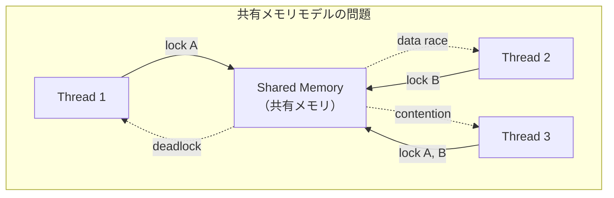

これらの問題は、プログラマの注意力や規律に依存した解決策しか存在しないという点で根本的である。ロックの正しい使用を**型システムやコンパイラが保証できない**（Rustのような一部の例外を除く）ため、バグはレビューやテストをすり抜けて本番環境で顕在化する。

### 1.1 Carl Hewitt の着想（1973年）

このような共有メモリの問題に対する根本的に異なるアプローチとして、**アクターモデル（Actor Model）** が提案された。1973年、MITの Carl Hewitt、Peter Bishop、Richard Steiger は論文 "A Universal Modular ACTOR Formalism for Artificial Intelligence" を発表し、計算の基本単位としてアクターという概念を導入した。

Hewitt のアイデアの核心は、**すべての計算をメッセージの交換として表現する** というものであった。物理学における粒子間の相互作用（力の伝達はすべて場を介したメッセージパッシングである）や、生物学における細胞間のシグナル伝達からインスピレーションを得ていたとされる。

アクターモデルの根本的な特徴は以下の通りである。

1. **共有状態が存在しない**: 各アクターは自分だけのプライベートな状態を持ち、他のアクターから直接アクセスされることはない
2. **非同期メッセージパッシング**: アクター間の通信はすべて非同期のメッセージ送信で行われる。送信者は受信者の処理完了を待たない
3. **逐次的なメッセージ処理**: 各アクターは受信したメッセージを一度に1つずつ処理する。これにより、アクター内部の状態に対するロックは不要になる

この設計により、ロック、デッドロック、データ競合といった問題がモデルの根本から排除される。並行性はアクター間の**メッセージの交換パターン**として表現され、各アクター内部は**完全にシーケンシャル**である。

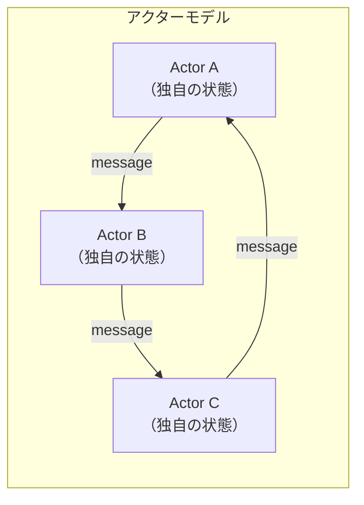

## 2. アクターモデルの基本概念

### 2.1 アクターとは何か

アクターモデルにおいて、**アクター（Actor）** は計算の基本単位である。オブジェクト指向プログラミングにおけるオブジェクトに似ているが、決定的に異なる点がある。オブジェクトはメソッド呼び出しという**同期的**な操作でやり取りするのに対し、アクターは**非同期メッセージ**でのみ通信する。

各アクターは以下の3つの要素を持つ。

1. **アドレス（Address）**: アクターを一意に識別する名前。メッセージの宛先として使用される。ネットワーク上のIPアドレスとポートに相当する概念である
2. **メールボックス（Mailbox）**: 受信したメッセージを一時的に保持するキュー。アクターが現在のメッセージを処理している間、新たに到着したメッセージはメールボックスに蓄積される
3. **振る舞い（Behavior）**: メッセージを受信したときにどのように処理するかを定義する関数。振る舞いは次のメッセージの処理方法を動的に変更できる

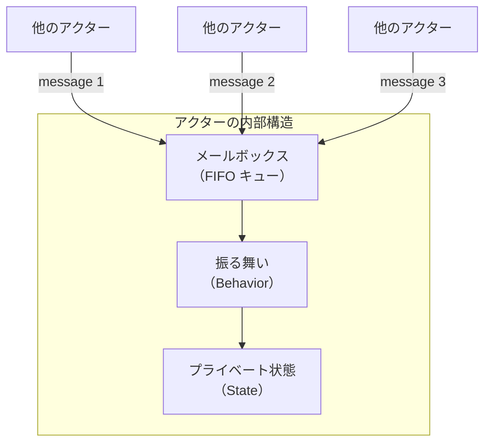

### 2.2 メッセージとメールボックス

アクター間の通信手段は**メッセージ（Message）** のみである。メッセージは不変（immutable）のデータであり、送信者から受信者へ**非同期**に配送される。

メッセージの重要な特性を整理する。

**非同期配送**: 送信者はメッセージを送った直後に次の処理に進む。受信者がメッセージを受け取ったかどうか、処理したかどうかは送信者にはわからない。これにより、送信者と受信者の間に時間的な依存関係が生じない。

**順序保証**: アクターモデルの理論では、同じ送信者から同じ受信者への2つのメッセージは送信順に到着することが保証される。ただし、異なる送信者からのメッセージの到着順序は不定である。

**不変性**: メッセージは送信後に変更されてはならない。これにより、送信者と受信者が同じデータを「共有」していても、データ競合が発生しない。

メールボックスは通常、**FIFO キュー**として実装される。アクターはメールボックスからメッセージを1つずつ取り出し、現在の振る舞いに従って処理する。メールボックスが空の場合、アクターはメッセージが到着するまで待機する。

### 2.3 振る舞い（Behavior）

アクターの**振る舞い**は、受信したメッセージに対するリアクションを定義する。これは関数として表現され、メッセージを受け取って以下の3つの操作（後述する基本操作）を任意に組み合わせて実行する。

振る舞いの特筆すべき点は、**動的に変更可能**であることだ。アクターは次のメッセージを処理する際の振る舞いを、現在のメッセージ処理の結果として指定できる。これは有限状態機械（FSM）を自然にモデル化できることを意味する。

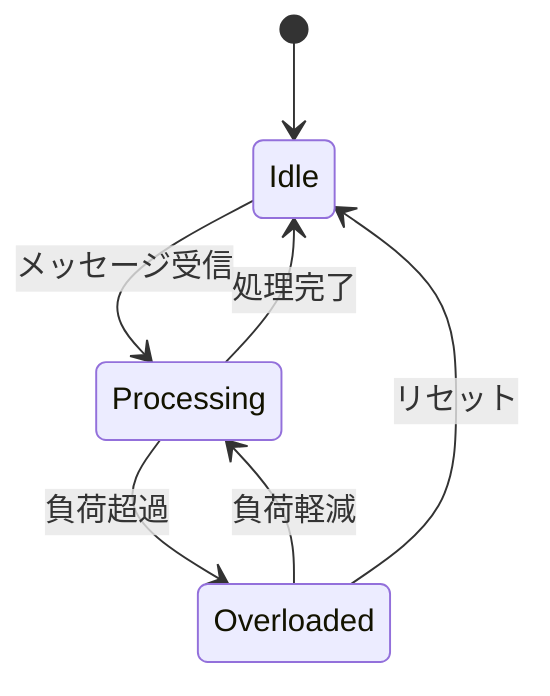

例えば、認証セッションを管理するアクターは、「未認証」状態では認証リクエストのみを受け付け、「認証済み」状態ではデータリクエストを処理するように振る舞いを切り替えることができる。

## 3. アクターの3つの基本操作

アクターがメッセージを処理する際に実行できる操作は、正確に3つに限定される。この制約こそがアクターモデルのシンプルさと表現力の源泉である。

### 3.1 send — メッセージの送信

他のアクターにメッセージを送信する操作である。宛先はアクターのアドレスで指定する。

```
send(targetAddress, message)
```

送信は**ファイア・アンド・フォーゲット（fire-and-forget）** であり、送信者は応答を待たない。応答が必要な場合は、メッセージの中に送信者自身のアドレスを含め、受信者がそのアドレスに返信メッセージを送る形をとる。

### 3.2 create — 新しいアクターの生成

新しいアクターを生成する操作である。生成時に、新しいアクターの初期振る舞い（behavior）を指定する。

```
newAddress = create(initialBehavior)
```

生成されたアクターは独立した実体として動作を開始し、メッセージの受信を待つ。アクターは**必要に応じて動的にアクターを生成**できるため、システムの構造は実行時に変化する。これはオブジェクト指向プログラミングにおけるオブジェクトの動的生成に相当する。

### 3.3 become — 振る舞いの変更

次のメッセージを処理する際の振る舞いを指定する操作である。

```
become(newBehavior)
```

become は**ローカル状態の変更**を代替する。たとえば、カウンターアクターが現在の値 `n` を持つとき、インクリメントメッセージを受信したら `become(counterBehavior(n + 1))` とすることで、次のメッセージ処理時にはカウンターの値が `n + 1` になっている。

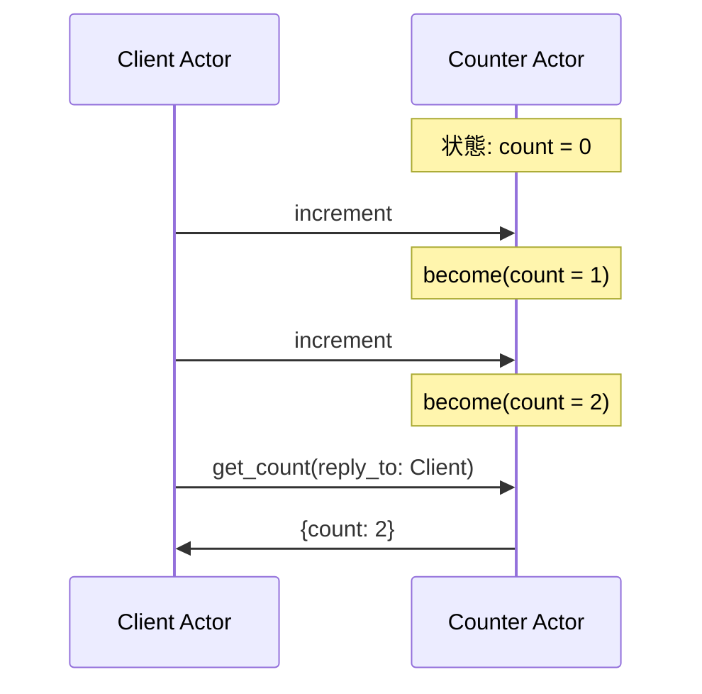

この3つの操作だけで、チューリング完全な計算を表現できることが証明されている。アクターモデルは、ラムダ計算やチューリングマシンと同等の計算能力を持つ**並行計算の数学的モデル**なのである。

## 4. Erlang/OTP の実装

アクターモデルを最も忠実に、かつ実用的に実装した言語が **Erlang** である。1986年、スウェーデンの通信機器メーカー Ericsson の Joe Armstrong、Robert Virding、Mike Williams らによって開発された。Erlang の設計目標は、電話交換機のソフトウェアに要求される**高い並行性**、**耐障害性**、**ホットコードスワップ**（無停止でのコード更新）を実現することであった。

### 4.1 Erlang のプロセス

Erlang において、アクターに対応する概念は**プロセス（process）** である。ここで重要なのは、Erlang のプロセスはOSのプロセスでもスレッドでもないという点である。Erlang のプロセスは **BEAM 仮想マシン** が管理する極めて軽量な実体であり、以下の特性を持つ。

**超軽量**: 1プロセスあたりのメモリ消費は約 **300バイト** から始まる。OSのスレッドが1〜8MBのスタックを確保するのに比べると、約3万分の1のメモリで済む。そのため、1つの BEAM VM 上で数十万から**数百万のプロセス**を同時に稼働させることが現実的である。

**プリエンプティブスケジューリング**: BEAM VMは独自のスケジューラを持ち、各プロセスにリダクション（reduction）と呼ばれる実行単位を割り当てる。デフォルトでは約4000リダクション（おおよそ4000回の関数呼び出しに相当）ごとにプロセスが切り替わる。これにより、1つのプロセスがCPUを独占することが防がれる。

**完全な隔離**: 各プロセスは独自のヒープとスタックを持ち、他のプロセスのメモリに直接アクセスする手段がない。GC（ガベージコレクション）もプロセスごとに独立して実行されるため、GCの停止時間が他のプロセスに影響を与えない。

```erlang
%% Spawn a new process that runs the loop function
Pid = spawn(fun() -> loop(0) end),

%% Send an increment message to the process
Pid ! {increment, self()},

%% Send a get_count message
Pid ! {get_count, self()},

%% Receive the response
receive
    {count, N} ->
        io:format("Count: ~p~n", [N])
end.
```

### 4.2 メッセージパッシングとパターンマッチ

Erlang のメッセージ送信は `!`（bang）演算子で行われる。受信は `receive` 式で行い、**パターンマッチング**によってメッセージを選択的に処理する。

```erlang
%% A counter process using pattern matching
loop(Count) ->
    receive
        {increment, _From} ->
            %% Process the increment message, then recurse with new state
            loop(Count + 1);
        {decrement, _From} ->
            loop(Count - 1);
        {get_count, From} ->
            %% Reply to the sender with the current count
            From ! {count, Count},
            loop(Count);
        stop ->
            %% Terminate the process
            ok
    end.
```

このコードには注目すべき点がいくつかある。

1. **再帰による状態管理**: `loop(Count + 1)` のように、再帰呼び出しの引数として新しい状態を渡す。これはアクターモデルにおける `become` 操作に相当する。Erlang では変数は不変（一度束縛したら再代入できない）なので、状態の変更は常に新しい値を引数とする再帰呼び出しで表現される
2. **パターンマッチによるメッセージの選択**: `receive` 式は、メールボックス内のメッセージを先頭から走査し、パターンにマッチする最初のメッセージを取り出す。マッチしないメッセージはメールボックスに残される（これは selective receive と呼ばれる）
3. **末尾再帰の最適化**: Erlang / BEAM は末尾再帰を最適化するため、`loop` 関数がスタックを消費し続けることはない。これにより、アクターは事実上無限にメッセージを処理し続けることができる

### 4.3 リンクとモニタ

Erlang のプロセスには、障害を検知し伝播させるための2つの仕組みがある。

**リンク（link）**: 2つのプロセスを双方向に接続する。一方のプロセスが異常終了すると、リンクされた相手プロセスにも終了シグナルが送られ、デフォルトでは相手も異常終了する。`spawn_link/1` でプロセスの生成とリンクの設定を同時に行うのが一般的である。

**モニタ（monitor）**: 一方のプロセスが他方のプロセスの終了を監視する**単方向**の仕組みである。監視対象のプロセスが終了すると、監視者のプロセスに `{'DOWN', Ref, process, Pid, Reason}` というメッセージが送られる。リンクと異なり、監視者自身は終了しない。

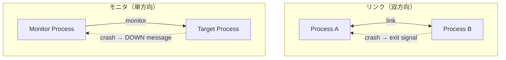

この仕組みは、後述する OTP の Supervisor Tree の基盤となっている。障害を「回避」するのではなく、「検知して回復する」という Erlang の哲学を支える根幹的な機能である。

## 5. OTP の設計パターン

**OTP（Open Telecom Platform）** は、Erlang に同梱されるフレームワーク・ライブラリ群であり、アクターモデルを活用した耐障害性の高いシステムを構築するための設計パターンを提供する。Erlang の真の力は言語仕様そのものよりも、OTP の設計パターンにあるといっても過言ではない。

### 5.1 GenServer — 汎用サーバープロセス

**GenServer**（Generic Server）は、クライアント-サーバーパターンを実装するための抽象化であり、最も広く使われる OTP ビヘイビアである。

GenServer を使用しない場合、プログラマは以下をすべて自分で実装する必要がある。

- メッセージの受信ループ
- 同期呼び出し（call）と非同期呼び出し（cast）のプロトコル
- タイムアウト処理
- エラーハンドリング
- 状態管理
- コードのホットスワップ対応

GenServer はこれらの共通パターンをフレームワークとして提供し、プログラマはコールバック関数の実装に集中できる。

```erlang
-module(counter_server).
-behaviour(gen_server).

%% API
-export([start_link/0, increment/1, get_count/1]).

%% gen_server callbacks
-export([init/1, handle_call/3, handle_cast/2]).

%% Start the server process
start_link() ->
    gen_server:start_link(?MODULE, 0, []).

%% Synchronous call: get the current count
get_count(Pid) ->
    gen_server:call(Pid, get_count).

%% Asynchronous cast: increment the counter
increment(Pid) ->
    gen_server:cast(Pid, increment).

%% Initialize with count = 0
init(InitialCount) ->
    {ok, InitialCount}.

%% Handle synchronous calls
handle_call(get_count, _From, Count) ->
    {reply, Count, Count}.

%% Handle asynchronous casts
handle_cast(increment, Count) ->
    {noreply, Count + 1}.
```

GenServer における `call` と `cast` の違いは重要である。

| 操作 | 同期/非同期 | 戻り値 | タイムアウト | 用途 |
|---|---|---|---|---|
| `call` | 同期 | あり | デフォルト5秒 | 状態の読み取り、確認が必要な操作 |
| `cast` | 非同期 | なし | なし | ファイア・アンド・フォーゲット |

### 5.2 Supervisor Tree — 障害回復の階層構造

**Supervisor** は、子プロセスの監視と再起動を担当する特殊なプロセスである。Supervisor は「何かが壊れたら、壊れた部分を再起動する」という **"Let it crash"（クラッシュさせろ）** 哲学を具現化したものである。

"Let it crash" とは、エラー処理を個々のプロセス内で防御的に行うのではなく、エラーが発生したプロセスをただクラッシュさせ、Supervisor がクリーンな状態で再起動するという戦略である。この戦略が有効なのは以下の理由による。

1. **予測不能なエラー**（ハードウェア障害、ネットワーク切断、データ破損など）に対して、防御的プログラミングですべてのケースを網羅することは不可能である
2. プロセスの再起動は、**既知の正常な状態への復帰**を保証する。複雑なエラー回復ロジックよりも、はるかに信頼性が高い
3. Erlang のプロセスは軽量であるため、再起動のコストが極めて低い

Supervisor には以下の再起動戦略がある。

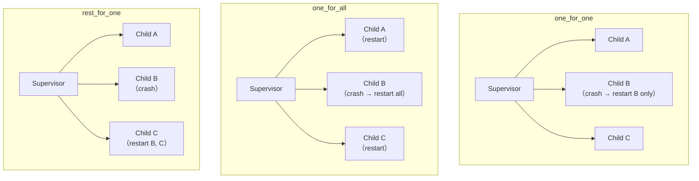

| 戦略 | 動作 | ユースケース |
|---|---|---|
| `one_for_one` | クラッシュした子プロセスのみ再起動 | 子プロセスが互いに独立している場合 |
| `one_for_all` | 1つがクラッシュしたら全子プロセスを再起動 | 子プロセスが密結合で、全体の整合性が必要な場合 |
| `rest_for_one` | クラッシュした子プロセスとそれ以降に起動された子プロセスを再起動 | 子プロセス間に依存順序がある場合 |

Supervisor 自体も Supervisor の子プロセスとなることができるため、**Supervisor Tree（監視木）** と呼ばれる階層構造を形成する。

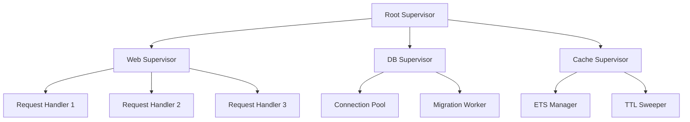

この階層構造により、障害の影響範囲が自然に限定される。例えば、キャッシュの TTL Sweeper がクラッシュしても、Cache Supervisor がそのプロセスだけを再起動し、Web や DB のサブシステムには一切影響しない。

### 5.3 Application — デプロイの単位

**Application** は、OTP における**デプロイとコード管理の単位**である。1つの Application は、関連する Supervisor Tree、設定、依存関係をまとめたパッケージであり、起動と停止を統一的に管理する。

Erlang / Elixir のシステムは、複数の Application が協調して動作する形をとる。各 Application は `start/2` と `stop/1` のコールバックを持ち、OTP がこれらを正しい順序で呼び出すことを保証する。

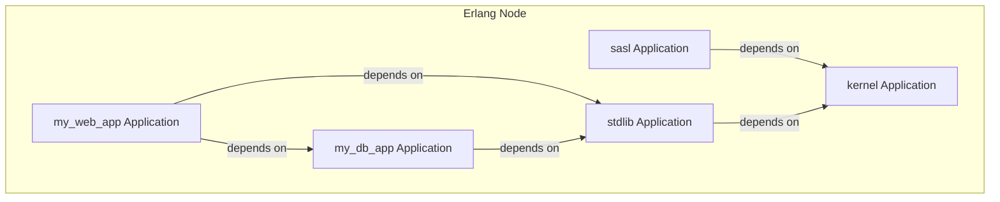

### 5.4 ホットコードスワップ

Erlang / OTP のもう1つの特徴的な機能が**ホットコードスワップ**である。システムを停止することなく、実行中のコードを新しいバージョンに置き換えることができる。

BEAM VMは同時に2つのバージョンのモジュールを保持できる。新しいバージョンのモジュールがロードされると、新しい関数呼び出しは新バージョンを参照するが、既に実行中のプロセスは旧バージョンのコードで処理を完了する。GenServerの `code_change/3` コールバックを実装することで、状態のマイグレーションも制御できる。

この機能は、Ericsson の電話交換機において「99.9999999%（ナイン・ナインズ）」の稼働率（年間約31ミリ秒のダウンタイム）を達成するために不可欠であった。

## 6. Akka — JVM上のアクター実装

**Akka** は、JVM（Java Virtual Machine）上でアクターモデルを実装するツールキットであり、2009年に Jonas Boner によって開始された。Scala で記述されているが、Java API も提供されている。Erlang/OTP の設計哲学から多大な影響を受けつつ、JVM エコシステムの利点（豊富なライブラリ、ツール、パフォーマンス）を活用できる。

> [!NOTE]
> 2022年にAkkaのライセンスがApache 2.0からBusiness Source License（BSL）に変更された。これにより、商用利用に制約が生じたため、コミュニティでは Apache Pekko（Apache Software Foundation への寄贈）というフォークが進められている。以下の説明はアクターモデルの実装としてのAkkaの設計に焦点を当てる。

### 6.1 Akka のアクターシステム

Akka では、すべてのアクターは **ActorSystem** の中に存在する。ActorSystem はアクターの生成、スケジューリング、メッセージのルーティングを管理する。

```scala
// Define an actor using Akka Typed API
object Counter {
  // Define message protocol
  sealed trait Command
  final case class Increment(replyTo: ActorRef[StatusReply[Done]]) extends Command
  final case class GetCount(replyTo: ActorRef[Int]) extends Command

  // Create the actor behavior
  def apply(): Behavior[Command] = counter(0)

  private def counter(count: Int): Behavior[Command] =
    Behaviors.receiveMessage {
      case Increment(replyTo) =>
        replyTo ! StatusReply.Ack
        counter(count + 1)
      case GetCount(replyTo) =>
        replyTo ! count
        Behaviors.same
    }
}
```

Akka Typed（Akka 2.6以降で推奨される API）では、アクターが受け付けるメッセージの型がコンパイル時に検査される。これにより、Erlangでは実行時にしか検出できない型の不一致を、コンパイル時に捕捉できる。

### 6.2 Dispatcher とスレッドプール

Akka のアクターはOSスレッドに直接対応していない。代わりに、**Dispatcher** がアクターの実行をスレッドプールにスケジューリングする。

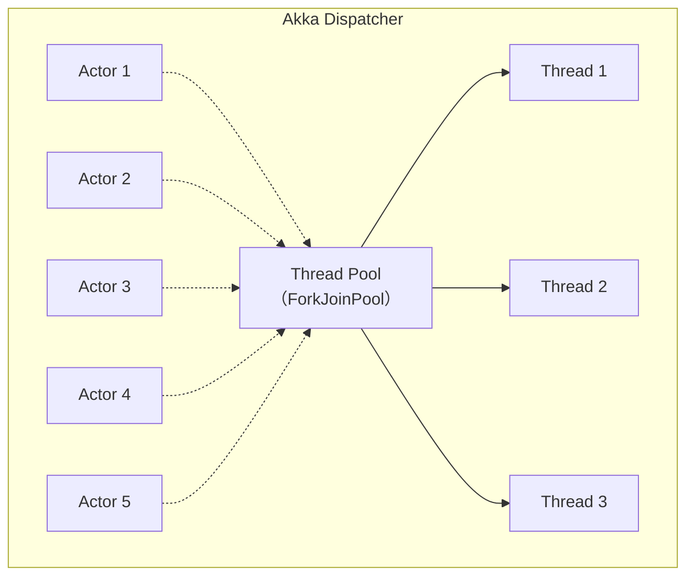

メッセージが到着すると、Dispatcher はアクターのメールボックスにメッセージを追加し、そのアクターの実行をスレッドプールに予約する。スレッドがアクターの処理を実行し、メッセージを処理し終わるか、一定数のメッセージを処理した後にスレッドを解放する。これにより、少数のスレッドで大量のアクターを効率的にスケジューリングできる。

Akka のデフォルト Dispatcher は `ForkJoinPool` をベースとしており、ワークスティーリングによって負荷の均等分散を図る。ブロッキングI/O を行うアクターには専用の Dispatcher を割り当てることが推奨される。

### 6.3 Akka の Supervision

Akka は Erlang/OTP の Supervisor 概念を継承しつつ、独自の拡張を加えている。Akka では、アクターの親が自動的にその子のSupervisorとなる。すべてのアクターは木構造の階層に組み込まれ、ルートには**ガーディアンアクター**が存在する。

```scala
// Define supervision strategy
object ParentActor {
  def apply(): Behavior[Command] =
    Behaviors.setup { context =>
      // Create a child actor with supervision
      val child = context.spawn(
        Behaviors.supervise(ChildActor())
          .onFailure[Exception](SupervisorStrategy.restart),
        "child-actor"
      )
      // Parent behavior...
      Behaviors.receiveMessage { msg =>
        child ! msg
        Behaviors.same
      }
    }
}
```

Akka の Supervision 戦略には以下がある。

| 戦略 | 動作 |
|---|---|
| `restart` | アクターを再起動し、メールボックスは保持する |
| `stop` | アクターを停止する |
| `resume` | 例外を無視して処理を続行する（Erlangにはない戦略） |

`resume` 戦略はErlangの "Let it crash" 哲学とは異なるアプローチであり、一時的なエラー（例えば一部のメッセージの処理に失敗するがアクターの状態自体は正常）に対して有用である。

### 6.4 Akka Streams と Akka HTTP

Akka エコシステムには、アクターモデルの上に構築された重要なモジュールが存在する。

**Akka Streams** は、Reactive Streams 仕様に準拠したストリーム処理ライブラリである。バックプレッシャー（下流の処理速度に応じて上流の送信速度を調整する仕組み）を自動的に管理する。アクターモデルのメッセージパッシングでは、受信者の処理能力を超えるメッセージが送信されるとメールボックスが溢れるリスクがあるが、Akka Streams はこの問題を解決する。

**Akka HTTP** は、Akka Streams をベースとした HTTP サーバー / クライアントライブラリであり、高い並行性を活かしたWebアプリケーションの構築に使用される。

## 7. 位置透過性と分散アクター

アクターモデルの本質的な利点の1つが **位置透過性（Location Transparency）** である。アクターへのメッセージ送信は、相手がローカルプロセスであってもリモートノード上のプロセスであっても、同一のインターフェースで行える。

### 7.1 Erlang の分散機能

Erlang は分散システムを言語レベルでサポートしている。複数の Erlang ノード（BEAM VMインスタンス）がクラスタを形成し、ノード間でのプロセス生成とメッセージ送信がローカルと同じ構文で行える。

```erlang
%% Connect to a remote node
net_adm:ping('node2@host2.example.com'),

%% Spawn a process on a remote node
RemotePid = spawn('node2@host2.example.com', fun() -> loop(0) end),

%% Send a message to the remote process (same syntax as local)
RemotePid ! {increment, self()}.
```

ローカルのメッセージ送信とリモートのメッセージ送信が全く同じ `!` 演算子で行えることに注目してほしい。これが位置透過性である。

しかし、位置透過性には注意すべき点がある。ローカルとリモートでは**信頼性特性が根本的に異なる**。ローカルのメッセージ送信はほぼ確実に成功するが、リモートのメッセージ送信はネットワーク障害により失われる可能性がある。この違いを無視した設計は、分散システムにおいて深刻な問題を引き起こす。Erlang はこの問題に対して、モニタとリンクのメカニズムでノードの切断を検知し、適切な復旧処理を行う手段を提供している。

### 7.2 Akka Cluster

Akka Cluster は、複数の JVM ノードでアクターシステムを構成する機能を提供する。ノードの参加・離脱を Gossip プロトコルで検知し、Consistent Hashing や Cluster Sharding によってアクターを分散配置する。

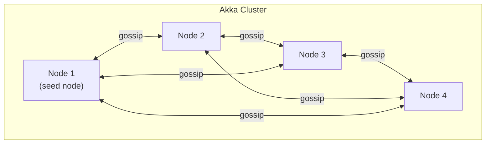

**Cluster Sharding** は、特定のエンティティ（例えばユーザーセッション、注文、デバイス）ごとに1つのアクターインスタンスがクラスタ全体で存在することを保証する機能である。エンティティIDに基づいてシャードが決定され、メッセージは自動的に適切なノードにルーティングされる。これは後述する Microsoft Orleans の Virtual Actor パターンに影響を与えた概念である。

### 7.3 分散環境における課題

分散アクターシステムには、ローカルにはない固有の課題がある。

**ネットワーク分断（Network Partition）**: クラスタがネットワーク障害により2つ以上のグループに分割された場合、各グループが独立して動作を続ける。Akka Cluster ではスプリットブレインリゾルバ（Split Brain Resolver）を用いて、少数派のノードをダウンさせることでクラスタの整合性を維持する戦略を取ることができる。

**メッセージの配信保証**: ネットワーク越しのメッセージ配信には3つの保証レベルがある。

| レベル | 意味 | デフォルト |
|---|---|---|
| At-most-once | メッセージは0回または1回配信される（ロスの可能性がある） | Erlang / Akka のデフォルト |
| At-least-once | メッセージは1回以上配信される（重複の可能性がある） | アプリケーション層で実装 |
| Exactly-once | メッセージは正確に1回配信される | 理論的に不可能（近似的に実現） |

Erlang と Akka はともにデフォルトでは **at-most-once** の配信保証を提供する。これはパフォーマンス上の理由であり、より強い保証が必要な場合はアプリケーション層でACK/再送のプロトコルを実装する必要がある。

## 8. アクターモデルの利点と欠点

### 8.1 利点

**ロックフリーな並行性**: アクター内部の状態はそのアクターのみがアクセスするため、mutex やセマフォによるロックが不要である。これにより、デッドロックやデータ競合がモデルの設計段階で排除される。

**スケーラビリティ**: アクターは軽量であり、1つのマシン上に数百万のアクターを配置できる。また、位置透過性により、アクターを複数のマシンに分散配置してもコードの変更が最小限で済む。

**耐障害性**: Supervisor Tree による障害の局所化と自動回復は、24時間365日の稼働が要求されるシステムにおいて極めて強力である。Ericsson の AXD 301 スイッチは、Erlang と OTP を用いて 99.9999999%（nine nines）の稼働率を達成した。

**カプセル化**: アクターは状態と振る舞いを完全にカプセル化する。外部からアクターの内部状態を直接操作する手段がないため、モジュール間の結合度が極めて低い。

**自然なモデリング**: 現実世界の多くのシステム（人間のコミュニケーション、組織の構造、電話交換網、IoTデバイスなど）は、独立したエンティティ間のメッセージ交換として自然にモデル化できる。

### 8.2 欠点

**メールボックスの過負荷**: アクターの処理速度を超える量のメッセージが送信された場合、メールボックスが際限なく成長し、メモリを圧迫する。これは「メールボックスオーバーフロー」と呼ばれ、バックプレッシャーの仕組みがアクターモデル自体には組み込まれていないことに起因する。

**デバッグの困難さ**: 非同期メッセージパッシングにより、処理の実行順序が非決定的になる。従来のデバッガでステップ実行しても、メッセージの到着順序やタイミングに依存するバグを再現することが難しい。

**メッセージプロトコルの管理**: アクター間のメッセージ形式は暗黙的な契約であり、特にErlangでは型システムによる検証がない（Dialyzerによる静的解析は可能だが、強制ではない）。大規模なシステムでは、メッセージの形式や意味を管理する負担が大きくなる。

**レイテンシのオーバーヘッド**: すべての通信がメッセージパッシングで行われるため、共有メモリモデルでの直接的なメモリアクセスに比べてレイテンシが増加する。特に、複数のアクター間で密結合な計算（行列演算やグラフ計算など）を行う場合、メッセージの直列化と逆直列化のオーバーヘッドが顕著になる。

**分散環境での順序保証の困難さ**: 3つ以上のアクターが関わる場合、メッセージの到着順序を全体的に保証することは困難である。因果的順序（causal ordering）を保証するには追加のメカニズムが必要になる。

### 8.3 アクターモデルが適するユースケース

| ユースケース | 理由 |
|---|---|
| テレコムシステム | 大量の同時接続、高い稼働率要件 |
| IoTデバイス管理 | 各デバイスを1アクターとしてモデル化 |
| リアルタイムチャット | ユーザーセッションごとのアクター |
| オンラインゲーム | ゲームエンティティごとのアクター |
| 金融トレーディング | 低レイテンシ、高並行性 |
| ストリーム処理 | パイプライン型のデータ処理 |

## 9. 他の並行モデルとの比較

### 9.1 CSP（Communicating Sequential Processes）

**CSP（Communicating Sequential Processes）** は、1978年に Tony Hoare が提案した並行計算のモデルであり、Go言語の goroutine と channel の理論的基盤である。

アクターモデルと CSP は「メッセージパッシングによる並行性」という共通の哲学を持つが、重要な違いがある。

| 特性 | アクターモデル | CSP |
|---|---|---|
| 通信の対象 | アクター（名前付きエンティティ） | チャネル（名前付きの通信路） |
| 通信の方式 | 非同期（送信者はブロックしない） | 同期（送信者と受信者が同時に準備完了する必要がある） |
| アイデンティティ | アクターは一意のアドレスを持つ | プロセスは匿名（チャネルが名前を持つ） |
| 動的性 | アクターは動的に生成・破棄 | チャネルのトポロジは比較的静的 |
| 分散 | 位置透過性を前提とした設計 | ローカル並行性に焦点 |

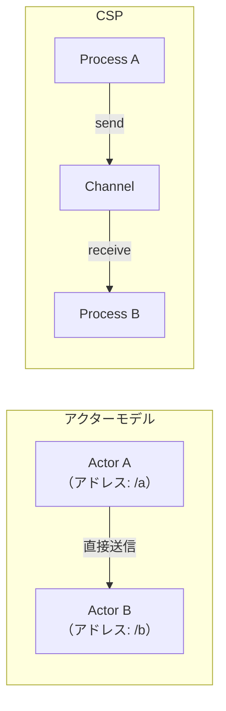

CSP の同期通信は、送信者と受信者の間で**ランデブー（rendezvous）** が成立する必要がある。これにより、バックプレッシャーが自然に実現されるという利点がある（送信者は受信者が準備できるまでブロックする）。一方、デッドロックのリスクが増加するという欠点もある。

Go言語のチャネルはバッファ付きも可能であるため、純粋なCSPよりも柔軟性が高い。バッファ付きチャネルは、アクターモデルのメールボックスに近づく。

### 9.2 STM（Software Transactional Memory）

**STM（Software Transactional Memory）** は、データベースのトランザクションの概念を共有メモリに適用したモデルである。Haskell の STM 実装が有名であり、Clojure も STM を言語レベルでサポートしている。

STM では、共有変数への読み書きを**トランザクション**として実行する。トランザクション内の操作は原子的に行われ、競合が検出された場合は自動的にリトライされる。

| 特性 | アクターモデル | STM |
|---|---|---|
| メモリモデル | 共有なし | 共有メモリ（楽観的並行制御） |
| 構成可能性 | メッセージプロトコルの設計が必要 | トランザクションを自由に合成可能 |
| デッドロック | 発生しない | 発生しない（リトライベース） |
| 適合する問題 | 独立したエンティティの並行動作 | 共有データ構造への並行アクセス |
| オーバーヘッド | メッセージの直列化 | トランザクションのリトライ |

STM の最大の利点は**構成可能性（composability）** である。2つのSTMトランザクションを合成して1つの原子的な操作として実行できる。アクターモデルでは、複数のアクターにまたがる原子的な操作を実現するには、分散トランザクションプロトコル（2PC等）を自分で実装する必要がある。

一方、STM は共有メモリを前提とするため、分散環境への拡張が困難である。アクターモデルは位置透過性を持つため、単一マシンから分散システムへの移行が比較的容易である。

### 9.3 3つのモデルの使い分け

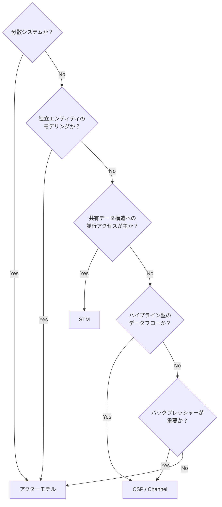

これらのモデルは排他的ではなく、同一のシステム内で組み合わせることもある。例えば、Akka Streams はアクターモデルの上にバックプレッシャー付きのストリーム処理（CSPに近い同期的なフロー制御）を構築している。

## 10. 現代の応用

### 10.1 Elixir と Phoenix

**Elixir** は、2011年に José Valim によって作られた、BEAM VM上で動作するプログラミング言語である。Erlang のすべての能力（軽量プロセス、OTP、分散機能）を継承しつつ、Ruby に影響を受けたモダンな構文、強力なマクロシステム、ミックスイン的な振る舞い定義（Protocol）を追加している。

**Phoenix Framework** は、Elixir の Web フレームワークであり、アクターモデルの恩恵を直接活用した機能を提供する。

**Phoenix Channels** は、WebSocket ベースのリアルタイム通信機能であり、各クライアント接続が1つの Erlang プロセスに対応する。100万同時接続のベンチマークで、1台のサーバーで全接続を処理できることが実証されている（WhatsApp は Erlang を用いて1台のサーバーで200万の同時接続を達成した事例がある）。

**Phoenix LiveView** は、サーバーサイドレンダリングとWebSocketを組み合わせ、JavaScript を書かずにリアルタイムなUIを構築する革新的なアプローチである。各ユーザーセッションがサーバー上の1つのプロセス（アクター）として存在し、UIの状態をサーバー側で管理する。これが実用的なのは、Erlang プロセスが極めて軽量であり、プロセスごとにGCが独立しているため、全体的な停止時間（stop-the-world GC）が発生しないからである。

```elixir
defmodule CounterLive do
  use Phoenix.LiveView

  # Initialize the LiveView state
  def mount(_params, _session, socket) do
    {:ok, assign(socket, count: 0)}
  end

  # Handle the "increment" event from the browser
  def handle_event("increment", _params, socket) do
    {:noreply, update(socket, :count, &(&1 + 1))}
  end

  # Render the HTML template
  def render(assigns) do
    ~H"""
    <div>
      <h1>Count: <%= @count %></h1>
      <button phx-click="increment">+1</button>
    </div>
    """
  end
end
```

### 10.2 Microsoft Orleans

**Microsoft Orleans** は、.NET 環境向けの分散アクターフレームワークであり、**Virtual Actor** パターンを導入した。2014年に Microsoft Research によって開発され、Halo 4 のバックエンドサービスで実戦投入された。

従来のアクターモデル（Erlang、Akka）では、アクターのライフサイクルを明示的に管理する必要がある。アクターの生成、配置、破棄はプログラマの責務である。Orleans の Virtual Actor（Orleans では **Grain** と呼ばれる）は、この管理をランタイムに委譲する。

**Virtual Actor の特徴**:

1. **常に存在する**: Virtual Actor は論理的に常に存在する。明示的に生成する必要がなく、最初のメッセージが送信されたときに自動的にアクティベートされる
2. **自動配置**: ランタイムがクラスタ内のどのノードにアクターを配置するかを自動的に決定する
3. **自動非活性化**: 一定時間メッセージを受信しなかったアクターは自動的にメモリから退避され、再度メッセージが来たときに復元される
4. **単一アクティベーション保証**: 同じIDのGrainはクラスタ全体で最大1つのインスタンスしかアクティブにならないことが保証される

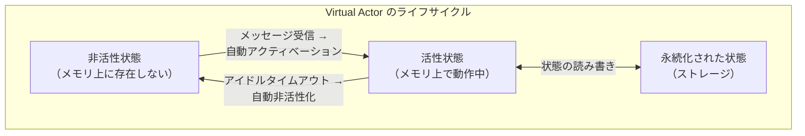

このアプローチにより、アクターのライフサイクル管理という複雑さが大幅に軽減される。プログラマはアクターのビジネスロジックに集中でき、スケーリングやフェイルオーバーはランタイムが自動的に処理する。

### 10.3 その他の現代的な応用

**Proto.Actor** は、Go、C#、Kotlin、Java をサポートするクロスプラットフォームのアクターフレームワークである。Akka の設計から影響を受けつつ、gRPC をトランスポート層として採用し、言語間でのアクター通信を可能にしている。

**Dapr（Distributed Application Runtime）** は、Microsoft が開発したランタイムであり、アクターモデルをサイドカーパターンで提供する。アプリケーションは任意の言語で記述でき、Dapr ランタイムが Virtual Actor の管理を担当する。Kubernetes 上での動作を前提としており、クラウドネイティブなアクターモデルの実装として注目されている。

**Lunatic** は、WebAssembly ベースの軽量ランタイムであり、Erlang の BEAM VM に触発された設計を持つ。Rust や AssemblyScript で書かれたプログラムを、Erlang プロセスのような軽量タスクとして実行できる。WebAssembly のサンドボックスによって、プロセス間の完全な隔離が保証される。

### 10.4 アクターモデルの進化の方向性

アクターモデルは1973年の提案以来、半世紀にわたって発展を続けている。現在の主要なトレンドをまとめる。

**型安全性の強化**: Akka Typed やSession Types の研究により、メッセージプロトコルの型安全性が向上している。アクター間の通信パターンをコンパイル時に検証できるようにする取り組みが進んでいる。

**永続化とイベントソーシング**: Akka Persistence や Orleans の永続化機能により、アクターの状態をイベントログとして記録し、障害時に再生（リプレイ）して状態を復元するパターンが標準化されつつある。

**サーバーレスとの融合**: Virtual Actor パターンは、サーバーレスコンピューティングの概念と自然に適合する。アクターの自動アクティベーション / 非活性化は、サーバーレス関数のコールドスタート / シャットダウンに類似している。Azure Functions の Durable Entities は、Orleans の Grain コンセプトを Azure Functions に統合したものである。

**エッジコンピューティング**: IoTデバイスの爆発的増加に伴い、エッジノード上でのアクターモデルの活用が進んでいる。各デバイスに対応するデジタルツインをアクターとしてモデル化し、デバイスの状態管理と通信を統一的に扱うアーキテクチャが実用化されている。

## まとめ

アクターモデルは、共有メモリとロックの問題に対する根本的な解決策として、1973年に Carl Hewitt によって提案された。「すべての計算はメッセージの交換である」という単純かつ強力な原則に基づき、ロック、デッドロック、データ競合をモデルの設計段階から排除する。

Erlang/OTP は、アクターモデルの最も忠実な実装として、テレコム業界で鍛えられた耐障害性のパターン（"Let it crash"、Supervisor Tree）を確立した。Akka はこの設計哲学を JVM エコシステムに持ち込み、型安全な API と Cluster Sharding を提供した。そして Microsoft Orleans の Virtual Actor パターンは、アクターのライフサイクル管理をランタイムに委譲することで、アクターモデルの利用をさらに容易にした。

現代においても、Elixir/Phoenix によるリアルタイムWeb、Dapr によるクラウドネイティブなアクター、エッジコンピューティングでのデジタルツインなど、アクターモデルの応用は拡大を続けている。共有メモリモデルが CPUコア数の増加に伴って限界に直面する一方、メッセージパッシングに基づくアクターモデルは、分散システムの時代においてますます重要性を増している。
