# 代数的データ型とパターンマッチ

## 1. 代数的データ型（ADT）とは

プログラミングにおいて「データをどのように表現するか」は、プログラムの正しさ・保守性・表現力を根本から左右する設計判断である。多くのプログラマが日常的に使っている構造体、列挙型、タプルといったデータ構造は、実は **代数的データ型（Algebraic Data Type、ADT）** という数学的に洗練された概念の具体的な現れである。

代数的データ型とは、既存の型を **組み合わせる** ことによって新しい型を構成する仕組みのことを指す。「代数的」という名前は、型の構成方法が代数学における **積（product）** と **和（sum）** の演算に対応していることに由来する。この対応は単なるアナロジーではなく、型が取りうる値の個数（濃度）に関して厳密な代数的関係が成り立つ。

::: tip ADT と抽象データ型の違い
「ADT」という略語は **Abstract Data Type（抽象データ型）** の意味でも使われることがあるが、本記事で扱う **Algebraic Data Type（代数的データ型）** とはまったく別の概念である。抽象データ型はデータの内部表現を隠蔽しインターフェースのみを公開する設計手法であり、代数的データ型はデータの構造そのものを明示的に定義する仕組みである。両者はむしろ対照的な設計哲学を持つ。
:::

### 1.1 型の代数

型を代数的に捉えるとはどういうことか。基本的な考え方は、各型が取りうる値の数を **濃度（cardinality）** として捉え、型の構成操作を算術演算に対応させることである。

| 型 | 濃度 | 代数的な意味 |
|---|---|---|
| `Void`（値が存在しない型） | 0 | 0 |
| `Unit` / `()` | 1 | 1 |
| `Bool` | 2 | 2 |
| `(A, B)` — 直積 | \|A\| × \|B\| | 積（multiplication） |
| `Either A B` — 直和 | \|A\| + \|B\| | 和（addition） |
| `A -> B` — 関数型 | \|B\|^{\|A\|} | 冪（exponentiation） |

たとえば `Bool` と `Bool` の直積型 `(Bool, Bool)` の濃度は $2 \times 2 = 4$ であり、実際に `(True, True)`, `(True, False)`, `(False, True)`, `(False, False)` の4つの値が存在する。同様に `Either Bool Bool` の濃度は $2 + 2 = 4$ であり、`Left True`, `Left False`, `Right True`, `Right False` の4つの値が存在する。

この対応関係は驚くほど遠くまで成立する。たとえば代数学における分配法則 $a \times (b + c) = a \times b + a \times c$ は、型の世界では `(A, Either B C)` と `Either (A, B) (A, C)` の間の同型に対応する。

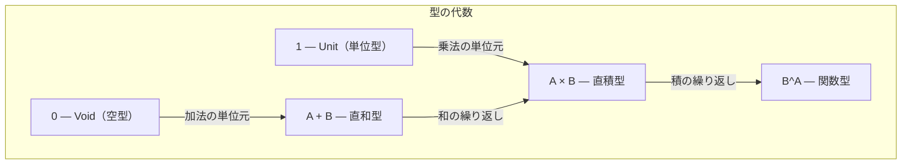

### 1.2 歴史的背景

代数的データ型の概念は、1970年代の関数型プログラミング言語の研究から発展した。1977年に発表された ML（Meta Language）は、代数的データ型とパターンマッチを言語の中核機能として備えた最初の実用的なプログラミング言語の一つである。ML は当初 Edinburgh LCF 定理証明系のメタ言語として設計されたが、そのデータ型定義の表現力が広く認識され、後続の言語に大きな影響を与えた。

1990年に登場した Haskell は、遅延評価や型クラスといった先進的な機能と共に、代数的データ型を言語の根幹に据えた。その後、OCaml（1996年）、Scala（2004年）、Rust（2010年）、Swift（2014年）、Kotlin（sealed class として、2016年）と、代数的データ型の概念は徐々に主流の言語にも浸透していった。近年では TypeScript の判別共用体（Discriminated Union）や Java 21 の sealed interface と record の組み合わせなど、伝統的にオブジェクト指向を主軸とする言語にも ADT の影響が見られる。

## 2. 直積型（Product Type）

### 2.1 定義と直感

**直積型（product type）** は、複数の値を **同時に** 保持するデータ型である。「AかつB」、つまり型 A の値と型 B の値の **両方** を持つ型と言い換えることもできる。

直積型が「積」と呼ばれるのは、その取りうる値の数が各構成要素の取りうる値の数の **積** になるからである。型 A が $m$ 個の値を持ち、型 B が $n$ 個の値を持つとき、直積型 $(A, B)$ は $m \times n$ 個の値を持つ。

日常的なプログラミングにおいて直積型はきわめて身近な存在である。構造体（struct）、レコード、タプル、クラスのフィールドなど、複数のデータを束ねて一つの単位として扱う仕組みはすべて直積型の一形態である。

### 2.2 各言語での表現

::: code-group

```haskell [Haskell]
-- Tuple (anonymous product)
type Point = (Double, Double)

-- Record (named product)
data Person = Person
  { name :: String
  , age  :: Int
  }
```

```rust [Rust]
// Tuple
type Point = (f64, f64);

// Struct (named product)
struct Person {
    name: String,
    age: u32,
}

// Tuple struct
struct Pair(i32, i32);
```

```ocaml [OCaml]
(* Tuple *)
type point = float * float

(* Record *)
type person = {
  name : string;
  age  : int;
}
```

```scala [Scala]
// Tuple
type Point = (Double, Double)

// Case class (named product)
case class Person(name: String, age: Int)
```

:::

### 2.3 直積型の性質

直積型にはいくつかの重要な代数的性質がある。

**単位元の存在**: `Unit` 型（1つの値しか持たない型）は直積の単位元として機能する。`(A, Unit)` は実質的に A と同じ情報量を持つ。代数的には $a \times 1 = a$ に対応する。

**交換法則**: `(A, B)` と `(B, A)` は同型である。つまり、構成要素の順序を入れ替えても情報量は変わらない（ただし、レコード型のように名前でアクセスする場合は順序は意味を持たない）。

**結合法則**: `((A, B), C)` と `(A, (B, C))` と `(A, B, C)` は本質的に同じ情報を持つ。ネストしたタプルとフラットなタプルの間には自然な同型が存在する。

**零元の存在**: `Void` 型（値が存在しない型）との積は常に `Void` になる。`(A, Void)` 型の値は構成できない。代数的には $a \times 0 = 0$ に対応する。

```mermaid
graph LR
    subgraph "直積型 Person"
        N["name: String"]
        A["age: Int"]
    end

    P["Person"] --> N
    P --> A

    subgraph "値の例"
        V1["Person &#123;name=&quot;Alice&quot;, age=30&#125;"]
        V2["Person &#123;name=&quot;Bob&quot;, age=25&#125;"]
    end
```

## 3. 直和型（Sum Type）

### 3.1 定義と直感

**直和型（sum type）** は、複数の型のうち **いずれか一つ** の値を保持するデータ型である。「AまたはB」、つまり型 A の値 **か** 型 B の値の **どちらか一方** を持つ型と言い換えることもできる。直和型は **タグ付き共用体（tagged union）**、**判別共用体（discriminated union）**、**バリアント型（variant type）** とも呼ばれる。

直和型が「和」と呼ばれるのは、その取りうる値の数が各構成要素の取りうる値の数の **和** になるからである。型 A が $m$ 個の値を持ち、型 B が $n$ 個の値を持つとき、直和型 `Either A B` は $m + n$ 個の値を持つ。

直和型は直積型と比べるとやや馴染みが薄いかもしれないが、プログラムの現実の問題を適切にモデル化する上で極めて重要な役割を果たす。現実世界のデータは「AかBのどちらか」という排他的な選択肢で表されることが多い。支払い方法はクレジットカードか銀行振込か現金のいずれか、HTTP レスポンスは成功か各種エラーのいずれか、JSON の値は文字列か数値かオブジェクトか配列か真偽値か null のいずれか、といった具合である。

### 3.2 C言語の union との違い

C言語にも `union` 型が存在するが、これは **タグなし共用体（untagged union）** であり、代数的データ型としての直和型とは根本的に異なる。C の union はどのバリアントが有効であるかの情報（タグ）を持たないため、プログラマが自分でタグを管理しなければならない。タグの管理を誤ると未定義動作が発生する。

```c
// C: manually tagged union — error-prone
typedef enum { CIRCLE, RECTANGLE } ShapeTag;

typedef struct {
    ShapeTag tag;
    union {
        double radius;          // for CIRCLE
        struct { double w, h; }; // for RECTANGLE
    };
} Shape;

// Nothing prevents accessing .radius when tag == RECTANGLE
```

代数的データ型としての直和型では、タグは型システムによって自動的に管理され、パターンマッチによって安全にアクセスされる。間違ったバリアントのデータにアクセスすることは型レベルで不可能になる。

### 3.3 各言語での表現

::: code-group

```haskell [Haskell]
-- Sum type with data constructors
data Shape
  = Circle Double
  | Rectangle Double Double
  | Triangle Double Double Double

-- Generic sum type
data Either a b
  = Left a
  | Right b
```

```rust [Rust]
// Enum (Rust's sum type)
enum Shape {
    Circle(f64),
    Rectangle(f64, f64),
    Triangle(f64, f64, f64),
}

// Each variant can hold different data
enum Result<T, E> {
    Ok(T),
    Err(E),
}
```

```ocaml [OCaml]
(* Variant type *)
type shape =
  | Circle of float
  | Rectangle of float * float
  | Triangle of float * float * float

(* Polymorphic variant *)
type result = Ok of int | Error of string
```

```scala [Scala]
// Sealed trait + case classes
sealed trait Shape
case class Circle(radius: Double) extends Shape
case class Rectangle(width: Double, height: Double) extends Shape
case class Triangle(a: Double, b: Double, c: Double) extends Shape

// Scala 3 enum
enum Shape:
  case Circle(radius: Double)
  case Rectangle(width: Double, height: Double)
  case Triangle(a: Double, b: Double, c: Double)
```

:::

### 3.4 直和型の性質

直和型にも直積型と同様の代数的性質がある。

**単位元の存在**: `Void` 型（値が存在しない型）は直和の単位元として機能する。`Either A Void` は実質的に A と同じ情報量を持つ。代数的には $a + 0 = a$ に対応する。

**交換法則**: `Either A B` と `Either B A` は同型である。

**結合法則**: `Either (Either A B) C` と `Either A (Either B C)` は同型である。

**分配法則**: 直積と直和の間には分配法則が成り立つ。`(A, Either B C)` は `Either (A, B) (A, C)` と同型である。代数的には $a \times (b + c) = a \times b + a \times c$ に対応する。

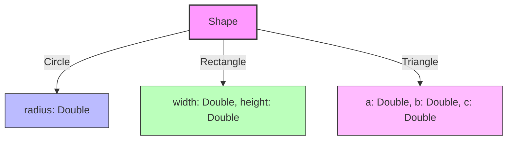

### 3.5 直積型と直和型の組み合わせ

実際のプログラミングでは、直積型と直和型を自由に組み合わせて複雑なデータ構造を表現する。直和型の各バリアントが直積型（構造体やタプル）のデータを持つことで、きわめて表現力豊かなデータモデリングが可能になる。

```haskell
-- Sum of products: each variant holds a product of fields
data Expr
  = Literal Double
  | Variable String
  | BinaryOp Op Expr Expr    -- Op is also a sum type
  | UnaryOp Op Expr
  | FunctionCall String [Expr]

data Op = Add | Sub | Mul | Div | Neg | Not
```

この例では、`Expr` は5つのバリアントを持つ直和型であり、`BinaryOp` バリアントは `Op`, `Expr`, `Expr` の3つの値の直積を保持している。このような「直和の積（sum of products）」パターンは、AST（抽象構文木）の表現をはじめとして、代数的データ型を活用する場面で最も頻繁に見られるパターンである。

## 4. パターンマッチ

### 4.1 パターンマッチとは

**パターンマッチ（pattern matching）** は、代数的データ型の値を **分解（destructure）** し、その構造に基づいて処理を分岐させる言語機能である。パターンマッチは代数的データ型と表裏一体の関係にあり、ADT の値を安全かつ簡潔に操作するための不可欠な仕組みである。

パターンマッチは、単なる値の比較（if-else や switch-case）とは本質的に異なる。パターンマッチは以下の3つの操作を **同時に** 行う。

1. **検査（inspection）**: 値がどのバリアント（コンストラクタ）であるかを判定する
2. **分解（destructuring）**: バリアントが保持するデータを取り出し、変数に束縛する
3. **分岐（branching）**: マッチしたパターンに対応する処理を実行する

### 4.2 パターンの種類

代表的なパターンの種類を見ていこう。

**コンストラクタパターン**: 直和型のどのバリアントであるかを判定し、内部データを束縛する。

```haskell
area :: Shape -> Double
area shape = case shape of
  Circle r       -> pi * r * r
  Rectangle w h  -> w * h
  Triangle a b c ->
    let s = (a + b + c) / 2
    in sqrt (s * (s - a) * (s - b) * (s - c))
```

**ワイルドカードパターン**: 任意の値にマッチするが、値を束縛しない。

```rust
fn is_circle(shape: &Shape) -> bool {
    match shape {
        Shape::Circle(_) => true,
        _ => false,  // wildcard: matches anything
    }
}
```

**リテラルパターン**: 特定のリテラル値にマッチする。

```ocaml
let describe_number n =
  match n with
  | 0 -> "zero"
  | 1 -> "one"
  | _ -> "many"
```

**ネストしたパターン**: パターンを入れ子にして、深い構造を一度に分解する。

```haskell
-- Nested pattern matching on an AST
simplify :: Expr -> Expr
simplify expr = case expr of
  BinaryOp Add (Literal 0) e -> simplify e       -- 0 + e = e
  BinaryOp Add e (Literal 0) -> simplify e       -- e + 0 = e
  BinaryOp Mul (Literal 1) e -> simplify e       -- 1 * e = e
  BinaryOp Mul e (Literal 1) -> simplify e       -- e * 1 = e
  BinaryOp Mul (Literal 0) _ -> Literal 0        -- 0 * _ = 0
  BinaryOp Mul _ (Literal 0) -> Literal 0        -- _ * 0 = 0
  BinaryOp op l r            -> BinaryOp op (simplify l) (simplify r)
  other                      -> other
```

**ガード付きパターン**: パターンに追加の条件を付与する。

```haskell
classify :: Int -> String
classify n
  | n < 0     = "negative"
  | n == 0    = "zero"
  | n < 100   = "small positive"
  | otherwise = "large positive"
```

**OR パターン**: 複数のパターンのいずれかにマッチする。

```rust
fn is_whitespace(c: char) -> bool {
    match c {
        ' ' | '\t' | '\n' | '\r' => true,
        _ => false,
    }
}
```

### 4.3 パターンマッチと if-else/switch の比較

パターンマッチが従来の if-else 文や switch 文と比べて優れている点を整理する。

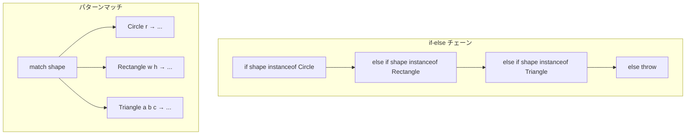

| 観点 | if-else / switch | パターンマッチ |
|---|---|---|
| 分解 | 手動でキャストしフィールドアクセス | パターン内で自動的に束縛 |
| 網羅性検査 | なし（実行時エラーのリスク） | コンパイラが静的に検査 |
| ネスト | 深いネストで可読性が低下 | フラットに記述可能 |
| 安全性 | キャストの失敗リスク | 型安全 |
| 拡張性 | 新しいケースの追加漏れに気づきにくい | コンパイラが警告 |

### 4.4 パターンマッチのコンパイル

パターンマッチは単なる構文糖ではなく、コンパイラによって効率的なコードに変換される。コンパイラが用いる主な戦略は2つある。

**決定木（decision tree）方式**: パターンの集合を木構造に変換し、各ノードで検査を行う。最悪の場合でもパターンの深さに比例する回数の検査でマッチが完了する。ただし、パターンが重複する場合にコードが重複する可能性がある。

**バックトラッキング方式**: パターンを上から順に試し、マッチに失敗したら次のパターンに戻る。コードの重複は少ないが、最悪の場合にはパターン数に比例する回数の検査が必要になる。

実際のコンパイラでは、これらの戦略を組み合わせたハイブリッドなアルゴリズムが使われる。GHC（Haskell）や OCaml のコンパイラは、特にパターンマッチの効率的なコンパイルに関して高度な最適化を行う。

## 5. 網羅性検査（Exhaustiveness Checking）

### 5.1 なぜ網羅性が重要か

パターンマッチの最大の利点の一つが **網羅性検査（exhaustiveness checking）** である。これは、パターンマッチがすべての可能なケースを処理しているかをコンパイラが **静的に** 検査する機能である。

網羅性検査が存在しない場合、新しいバリアントを直和型に追加したとき、そのバリアントを処理し忘れている箇所が実行時にはじめて発覚する。これは特に大規模なコードベースにおいて深刻な問題となる。直和型の定義を変更した際に、影響を受ける箇所をすべて人手で探し出すのは現実的ではない。

```rust
enum Color {
    Red,
    Green,
    Blue,
    Yellow, // newly added variant
}

fn to_hex(color: Color) -> &'static str {
    match color {
        Color::Red => "#FF0000",
        Color::Green => "#00FF00",
        Color::Blue => "#0000FF",
        // Compiler error: non-exhaustive patterns
        // `Color::Yellow` not covered
    }
}
```

この例では、`Color` に `Yellow` を追加した際、`to_hex` 関数のパターンマッチが `Yellow` を処理していないことをコンパイラが即座に指摘する。これにより、変更の影響範囲をコンパイラが自動的に教えてくれるのである。

### 5.2 網羅性検査のアルゴリズム

網羅性検査のアルゴリズムの基本的な考え方は、パターンの集合が型の **すべての値** をカバーしているかを判定することである。具体的には、どのパターンにもマッチしない「反例」となる値が存在するかを探索する。

代表的なアルゴリズムとして、Luc Maranget による「有用性（usefulness）」に基づく手法がある。パターン行列 $P$ と値ベクトル $q$ に対して、$q$ が $P$ の既存のパターンにマッチしない場合、$q$ は「有用（useful）」であると定義する。すべてのワイルドカードパターン（すべての値を表す）が有用でなければ、パターンマッチは網羅的である。

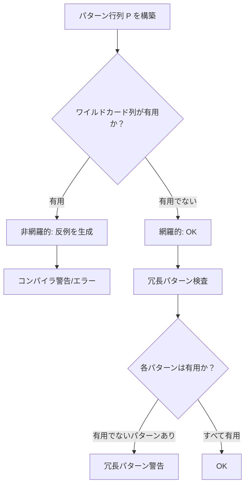

### 5.3 冗長パターンの検出

網羅性検査と同じアルゴリズムで、**冗長パターン（redundant pattern）** の検出も行える。冗長パターンとは、先行するパターンによってすでにカバーされており、決してマッチすることのないパターンのことである。

```ocaml
(* Warning: the third pattern is redundant *)
let f x =
  match x with
  | true  -> "yes"
  | false -> "no"
  | true  -> "also yes"  (* unreachable *)
```

冗長パターンの存在はロジックの誤りを示唆していることが多く、コンパイラの警告は有用なバグ検出手段となる。

### 5.4 各言語での網羅性検査の対応状況

| 言語 | 網羅性検査 | 備考 |
|---|---|---|
| Haskell | 警告（`-Wincomplete-patterns`） | デフォルトは警告のみ、`-Werror` でエラーに昇格可能 |
| Rust | エラー（必須） | 網羅的でないパターンマッチはコンパイルエラー |
| OCaml | 警告（デフォルト有効） | 非常に高品質な反例メッセージ |
| Scala | 警告（sealed 階層に対して） | `sealed` が付いていないと検査できない |
| Swift | エラー（必須） | Rust と同様に必須 |
| TypeScript | 型による間接的な検査 | `never` 型を使った技法で模擬可能 |
| Java 21+ | 警告/エラー（sealed + switch 式） | switch 式では網羅性が必須 |

## 6. 各言語における実装

### 6.1 Haskell

Haskell は代数的データ型とパターンマッチを最も純粋な形で提供する言語の一つである。`data` キーワードで直和型と直積型の両方を定義でき、パターンマッチは `case` 式や関数定義の等式パターンで行う。

```haskell
-- Sum type definition
data Tree a
  = Leaf
  | Node (Tree a) a (Tree a)
  deriving (Show, Eq)

-- Pattern matching in function equations
depth :: Tree a -> Int
depth Leaf = 0
depth (Node left _ right) = 1 + max (depth left) (depth right)

-- Inserting into a BST
insert :: Ord a => a -> Tree a -> Tree a
insert x Leaf = Node Leaf x Leaf
insert x (Node left val right)
  | x < val   = Node (insert x left) val right
  | x > val   = Node left val (insert x right)
  | otherwise  = Node left val right  -- duplicate: keep original

-- Using case expression
toList :: Tree a -> [a]
toList tree = case tree of
  Leaf -> []
  Node left val right -> toList left ++ [val] ++ toList right
```

Haskell の特徴として、`newtype` による **ゼロコスト抽象化** がある。`newtype` は単一コンストラクタ・単一フィールドの代数的データ型で、コンパイル時に消去されるため実行時のオーバーヘッドがない。

```haskell
-- Zero-cost wrapper: distinguishes Email from plain String at compile time
newtype Email = Email String
newtype UserId = UserId Int
```

### 6.2 Rust

Rust の `enum` は代数的データ型の直和型に対応し、`struct` が直積型に対応する。Rust の特筆すべき点は、網羅性検査が **コンパイルエラー** として強制される点と、パターンマッチが所有権システムと統合されている点である。

```rust
// Enum with various variant types
enum Command {
    Quit,                        // unit variant
    Echo(String),                // tuple variant
    Move { x: i32, y: i32 },    // struct variant
    ChangeColor(u8, u8, u8),    // tuple variant with multiple fields
}

fn execute(cmd: Command) {
    match cmd {
        Command::Quit => {
            println!("Quitting");
        }
        Command::Echo(msg) => {
            println!("{}", msg);
        }
        Command::Move { x, y } => {
            println!("Moving to ({}, {})", x, y);
        }
        Command::ChangeColor(r, g, b) => {
            println!("Color: #{:02X}{:02X}{:02X}", r, g, b);
        }
    }
}
```

Rust では `if let` や `while let` による簡潔なパターンマッチも提供されている。単一のバリアントだけに関心がある場合に便利である。

```rust
fn print_if_some(opt: Option<&str>) {
    // if let: convenient single-pattern match
    if let Some(value) = opt {
        println!("Got: {}", value);
    }
}

fn drain_queue(queue: &mut VecDeque<Task>) {
    // while let: loop until pattern fails
    while let Some(task) = queue.pop_front() {
        process(task);
    }
}
```

### 6.3 OCaml

OCaml はパターンマッチの検査品質が特に優れており、非網羅的パターンに対する反例メッセージが非常に具体的で有用である。

```ocaml
(* Algebraic data type for a simple expression language *)
type expr =
  | Int of int
  | Bool of bool
  | Add of expr * expr
  | If of expr * expr * expr
  | Eq of expr * expr

(* Evaluating the expression *)
let rec eval = function
  | Int n -> Int n
  | Bool b -> Bool b
  | Add (e1, e2) ->
    (match eval e1, eval e2 with
     | Int n1, Int n2 -> Int (n1 + n2)
     | _ -> failwith "type error: Add expects integers")
  | If (cond, then_e, else_e) ->
    (match eval cond with
     | Bool true -> eval then_e
     | Bool false -> eval else_e
     | _ -> failwith "type error: If expects boolean")
  | Eq (e1, e2) ->
    (match eval e1, eval e2 with
     | Int n1, Int n2 -> Bool (n1 = n2)
     | Bool b1, Bool b2 -> Bool (b1 = b2)
     | _ -> failwith "type error: Eq expects same types")
```

OCaml には **多相バリアント（polymorphic variant）** という独自の機能もある。通常のバリアント型は閉じた型（定義されたバリアントが固定）であるのに対し、多相バリアントは開いた型として振る舞い、柔軟な型付けが可能になる。

```ocaml
(* Polymorphic variants: open sum types *)
let describe_color = function
  | `Red -> "red"
  | `Green -> "green"
  | `Blue -> "blue"

(* This function accepts a superset of colors *)
let describe_extended_color = function
  | `Red -> "red"
  | `Green -> "green"
  | `Blue -> "blue"
  | `Yellow -> "yellow"
```

### 6.4 Scala

Scala は、オブジェクト指向と関数型プログラミングを融合した言語として、代数的データ型を `sealed trait`（あるいは Scala 3 の `enum`）と `case class` の組み合わせで表現する。

```scala
// Scala 3: enum syntax for ADT
enum Json:
  case JNull
  case JBool(value: Boolean)
  case JNumber(value: Double)
  case JString(value: String)
  case JArray(elements: List[Json])
  case JObject(fields: Map[String, Json])

// Pattern matching
def prettyPrint(json: Json, indent: Int = 0): String =
  val pad = " " * indent
  json match
    case Json.JNull        => "null"
    case Json.JBool(b)     => b.toString
    case Json.JNumber(n)   => n.toString
    case Json.JString(s)   => s"\"$s\""
    case Json.JArray(elems) =>
      val items = elems.map(e => prettyPrint(e, indent + 2))
      items.mkString(s"[\n$pad  ", s",\n$pad  ", s"\n$pad]")
    case Json.JObject(fields) =>
      val entries = fields.map { (k, v) =>
        s"\"$k\": ${prettyPrint(v, indent + 2)}"
      }
      entries.mkString(s"{\n$pad  ", s",\n$pad  ", s"\n$pad}")
```

Scala 3 では **match types** という、型レベルでのパターンマッチも導入されている。これにより型レベルのプログラミングがより自然に記述できるようになった。

## 7. Option/Result パターン

### 7.1 null 参照の問題

Tony Hoare は null 参照の発明を「10億ドルの間違い（billion-dollar mistake）」と呼んだ。null は「値が存在しない」ことを表すために導入されたが、型システムはある値が null である可能性を追跡しないため、NullPointerException（NPE）という実行時エラーの温床となっている。

根本的な問題は、`String` 型の変数が「文字列の値」だけでなく「値が存在しない」という状態も暗黙的に取りうることである。型シグネチャ `String -> Int` を見ただけでは、引数が null の場合にどうなるのか、戻り値が null になりうるのかがわからない。

### 7.2 Option 型

**Option 型**（Haskell では `Maybe`、Rust では `Option`、OCaml では `option`）は、値が存在しない可能性を **型レベルで明示的に表現** する代数的データ型である。

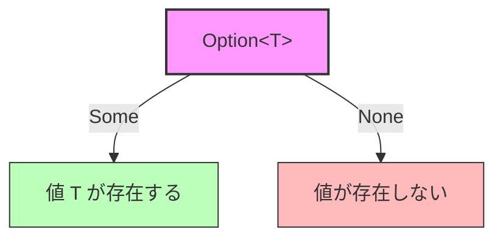

Option 型の定義は非常にシンプルである。

::: code-group

```haskell [Haskell]
data Maybe a
  = Nothing
  | Just a
```

```rust [Rust]
enum Option<T> {
    None,
    Some(T),
}
```

```ocaml [OCaml]
type 'a option =
  | None
  | Some of 'a
```

:::

Option 型を使うと、値の不在をパターンマッチで明示的に処理しなければならなくなる。

```rust
fn find_user(id: u64) -> Option<User> {
    // Returns None if user not found
    users.get(&id).cloned()
}

fn greet_user(id: u64) {
    match find_user(id) {
        Some(user) => println!("Hello, {}!", user.name),
        None => println!("User not found"),
    }
}
```

### 7.3 Result 型

**Result 型**（Haskell では `Either`、Rust では `Result`、OCaml では `result`）は、処理の成功と失敗を型レベルで表現する代数的データ型である。Option 型が「値があるかないか」を表すのに対し、Result 型は「成功した値か、失敗のエラー情報か」を表す。

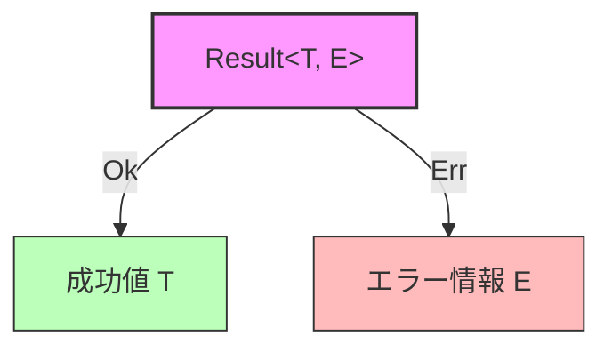

::: code-group

```haskell [Haskell]
data Either a b
  = Left a   -- conventionally, error
  | Right b  -- conventionally, success
```

```rust [Rust]
enum Result<T, E> {
    Ok(T),
    Err(E),
}
```

```ocaml [OCaml]
type ('a, 'b) result =
  | Ok of 'a
  | Error of 'b
```

:::

Result 型の真価は、エラー処理の **合成可能性（composability）** にある。複数のエラーが発生しうる処理を連鎖的に組み合わせる際に、エラーの伝播を簡潔に記述できる。

```rust
use std::fs;
use std::num::ParseIntError;

#[derive(Debug)]
enum AppError {
    Io(std::io::Error),
    Parse(ParseIntError),
}

impl From<std::io::Error> for AppError {
    fn from(e: std::io::Error) -> Self { AppError::Io(e) }
}

impl From<ParseIntError> for AppError {
    fn from(e: ParseIntError) -> Self { AppError::Parse(e) }
}

// The ? operator: early return on Err, unwrap on Ok
fn read_config_value(path: &str) -> Result<i32, AppError> {
    let contents = fs::read_to_string(path)?;  // Err => early return
    let value = contents.trim().parse::<i32>()?; // Err => early return
    Ok(value)
}
```

Rust の `?` 演算子は、Result 型に対するパターンマッチの **構文糖** である。`Err` の場合は即座に関数から返り、`Ok` の場合は内部の値を取り出す。これにより、例外機構を使わずに簡潔なエラー伝播が実現できる。

### 7.4 Option/Result のモナド的操作

Option 型と Result 型はいずれも **モナド（monad）** の構造を持っており、`map`、`and_then`（`flatMap` / `>>=`）、`unwrap_or` といった高階関数を通じて合成的に操作できる。

```rust
// Chaining operations on Option
fn parse_port(config: &HashMap<String, String>) -> Option<u16> {
    config
        .get("port")           // Option<&String>
        .and_then(|s| s.parse::<u16>().ok())  // Option<u16>
}

// Chaining operations on Result
fn process_data(input: &str) -> Result<Output, Error> {
    parse(input)               // Result<Parsed, Error>
        .and_then(validate)    // Result<Validated, Error>
        .map(transform)        // Result<Output, Error>
}
```

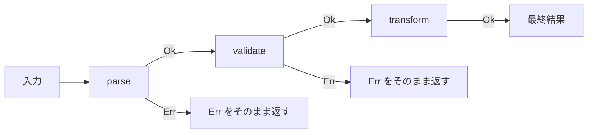

## 8. 再帰的データ型

### 8.1 再帰的データ型の定義

**再帰的データ型（recursive data type）** とは、自分自身を構成要素として含むデータ型のことである。代数的データ型の枠組みにおいて、再帰的な定義は自然に表現できる。リスト、木、式といった多くの重要なデータ構造は本質的に再帰的である。

再帰的データ型が成り立つためには、**基底ケース（base case）** が必須である。基底ケースがなければ型の値は無限のサイズを持つことになり、具体的な値を構築できない。

### 8.2 リスト

最も基本的な再帰的データ型はリストである。リストは「空リストか、先頭要素と残りのリストの対」として定義される。

```haskell
-- Linked list definition
data List a
  = Nil             -- base case: empty list
  | Cons a (List a) -- recursive case: head and tail

-- Example: [1, 2, 3]
example :: List Int
example = Cons 1 (Cons 2 (Cons 3 Nil))
```

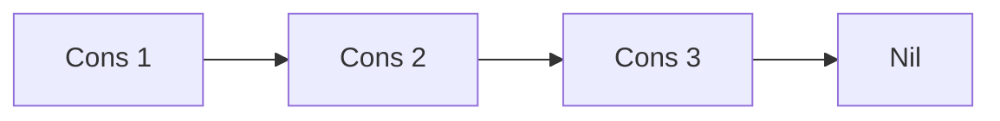

リストに対するパターンマッチは、再帰関数と組み合わせて使うのが典型的なパターンである。

```haskell
-- Sum of all elements
sumList :: List Int -> Int
sumList Nil = 0
sumList (Cons x rest) = x + sumList rest

-- Map function
mapList :: (a -> b) -> List a -> List b
mapList _ Nil = Nil
mapList f (Cons x rest) = Cons (f x) (mapList f rest)

-- Filter function
filterList :: (a -> Bool) -> List a -> List a
filterList _ Nil = Nil
filterList p (Cons x rest)
  | p x       = Cons x (filterList p rest)
  | otherwise  = filterList p rest
```

### 8.3 木構造

木構造は再帰的データ型の代表的な応用例である。二分木、多分木、赤黒木、B木など、さまざまなバリエーションが代数的データ型で自然に表現できる。

```rust
// Binary tree
enum Tree<T> {
    Leaf,
    Node {
        value: T,
        left: Box<Tree<T>>,
        right: Box<Tree<T>>,
    },
}

impl<T: Ord + Clone> Tree<T> {
    fn insert(self, new_val: T) -> Tree<T> {
        match self {
            Tree::Leaf => Tree::Node {
                value: new_val,
                left: Box::new(Tree::Leaf),
                right: Box::new(Tree::Leaf),
            },
            Tree::Node { value, left, right } => {
                if new_val < value {
                    Tree::Node {
                        value,
                        left: Box::new(left.insert(new_val)),
                        right,
                    }
                } else if new_val > value {
                    Tree::Node {
                        value,
                        left,
                        right: Box::new(right.insert(new_val)),
                    }
                } else {
                    // Duplicate: keep original
                    Tree::Node { value, left, right }
                }
            }
        }
    }
}
```

::: warning Rust での再帰的データ型
Rust では再帰的データ型を定義する際に `Box<T>`（ヒープ上のポインタ）が必要になることがある。これは、コンパイラがデータ型のサイズを静的に決定する必要があるためである。`Tree<T>` が直接 `Tree<T>` を含むと無限サイズになるが、`Box<Tree<T>>` はポインタサイズ（通常8バイト）で固定される。
:::

### 8.4 抽象構文木（AST）

再帰的データ型の最も重要な応用の一つが **抽象構文木（Abstract Syntax Tree、AST）** の表現である。プログラミング言語のコンパイラやインタプリタにおいて、ソースコードの構造を表現するためにAST は不可欠であり、代数的データ型はその表現に最適である。

```ocaml
(* A small expression language *)
type expr =
  | Lit of float
  | Var of string
  | Add of expr * expr
  | Mul of expr * expr
  | Let of string * expr * expr    (* let x = e1 in e2 *)
  | Fun of string * expr           (* fun x -> body *)
  | App of expr * expr             (* function application *)

(* Pretty printing *)
let rec to_string = function
  | Lit n -> string_of_float n
  | Var x -> x
  | Add (e1, e2) ->
    Printf.sprintf "(%s + %s)" (to_string e1) (to_string e2)
  | Mul (e1, e2) ->
    Printf.sprintf "(%s * %s)" (to_string e1) (to_string e2)
  | Let (x, e1, e2) ->
    Printf.sprintf "(let %s = %s in %s)" x (to_string e1) (to_string e2)
  | Fun (x, body) ->
    Printf.sprintf "(fun %s -> %s)" x (to_string body)
  | App (f, arg) ->
    Printf.sprintf "(%s %s)" (to_string f) (to_string arg)
```

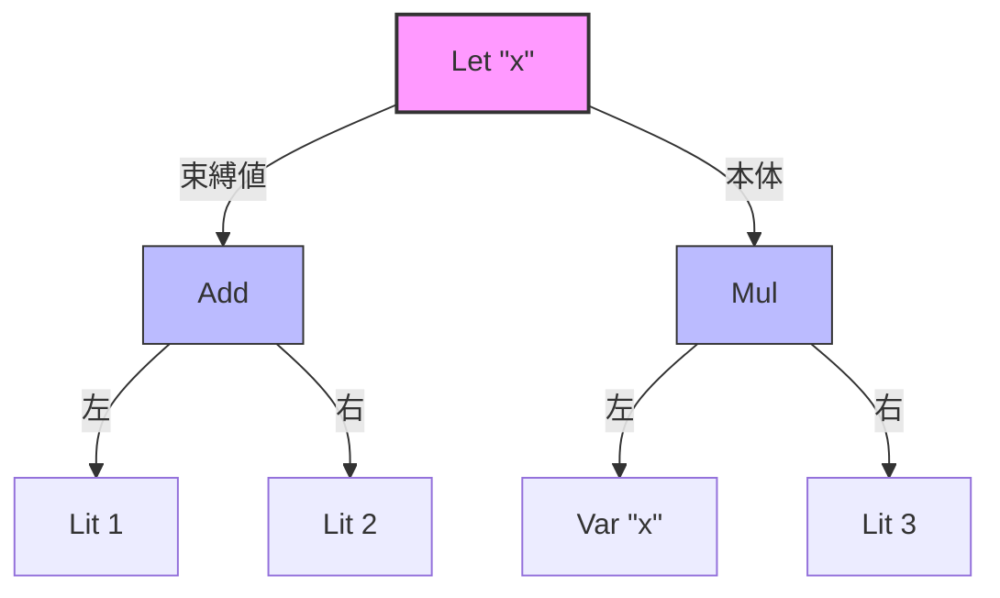

上の図は `let x = 1 + 2 in x * 3` という式の AST を表している。`Let` ノードは変数名 `"x"` と、束縛される値の式 `Add(Lit 1, Lit 2)` と、本体の式 `Mul(Var "x", Lit 3)` を子として持つ。

### 8.5 相互再帰的データ型

データ型同士が互いに参照し合う **相互再帰的データ型（mutually recursive data type）** も表現できる。

```haskell
-- Mutually recursive types for a simple HTML-like structure
data Block
  = Paragraph [Inline]
  | Heading Int [Inline]
  | CodeBlock String
  | BlockQuote [Block]

data Inline
  = Plain String
  | Bold [Inline]
  | Italic [Inline]
  | Link String [Inline]   -- URL and link text
  | InlineCode String
```

この例では、`Block` は `Inline` を含み、`Inline` の一部バリアント（`Bold` や `Italic`）は再び `Inline` を含む。さらに `BlockQuote` は `Block` のリストを含むため、`Block` 自体も再帰的である。

## 9. ADT とオブジェクト指向の比較（Expression Problem）

### 9.1 Expression Problem とは

**Expression Problem** は、Philip Wadler が1998年に提起した、プログラミング言語のデータ抽象における根本的なトレードオフの問題である。問題は次のように定式化される。

> 既存のコードを **変更することなく**、かつ **型安全性を維持して**、以下の2つの拡張を同時に行えるか？
> 1. 新しいデータバリアント（ケース）の追加
> 2. 新しい操作（関数）の追加

この問題は、代数的データ型（関数型スタイル）とオブジェクト指向の継承（OOPスタイル）の間にある本質的な非対称性を浮き彫りにする。

### 9.2 関数型スタイル：操作の追加は容易、バリアントの追加は困難

代数的データ型を使った関数型スタイルでは、データのバリアントは型定義に集約され、操作はパターンマッチを使った関数として定義される。

```haskell
-- Data definition: variants are fixed here
data Expr
  = Lit Double
  | Add Expr Expr

-- Operation 1: evaluation
eval :: Expr -> Double
eval (Lit n)   = n
eval (Add l r) = eval l + eval r

-- Operation 2: pretty printing — easy to add!
pretty :: Expr -> String
pretty (Lit n)   = show n
pretty (Add l r) = "(" ++ pretty l ++ " + " ++ pretty r ++ ")"
```

新しい操作（`pretty`）の追加は、新しい関数を書くだけでよい。既存のコードには一切手を加えない。しかし、新しいバリアント（たとえば `Mul`）を追加する場合は、`Expr` の定義を変更した上で、**すべての既存関数** のパターンマッチを修正しなければならない。

### 9.3 オブジェクト指向スタイル：バリアントの追加は容易、操作の追加は困難

オブジェクト指向スタイルでは、各バリアントがクラスとして定義され、操作はメソッドとして各クラスに分散する。

```java
// Base interface
interface Expr {
    double eval();
    String pretty();
}

// Variant 1
class Lit implements Expr {
    private final double value;
    Lit(double value) { this.value = value; }
    public double eval() { return value; }
    public String pretty() { return String.valueOf(value); }
}

// Variant 2
class Add implements Expr {
    private final Expr left, right;
    Add(Expr left, Expr right) { this.left = left; this.right = right; }
    public double eval() { return left.eval() + right.eval(); }
    public String pretty() {
        return "(" + left.pretty() + " + " + right.pretty() + ")";
    }
}

// Adding a new variant: just add a new class — easy!
class Mul implements Expr {
    private final Expr left, right;
    Mul(Expr left, Expr right) { this.left = left; this.right = right; }
    public double eval() { return left.eval() * right.eval(); }
    public String pretty() {
        return "(" + left.pretty() + " * " + right.pretty() + ")";
    }
}
```

新しいバリアント（`Mul` クラス）の追加は、新しいクラスを書くだけでよい。しかし、新しい操作（たとえば `optimize` メソッド）を追加する場合は、`Expr` インターフェースを変更した上で、**すべての既存クラス** にメソッドを追加しなければならない。

### 9.4 比較表

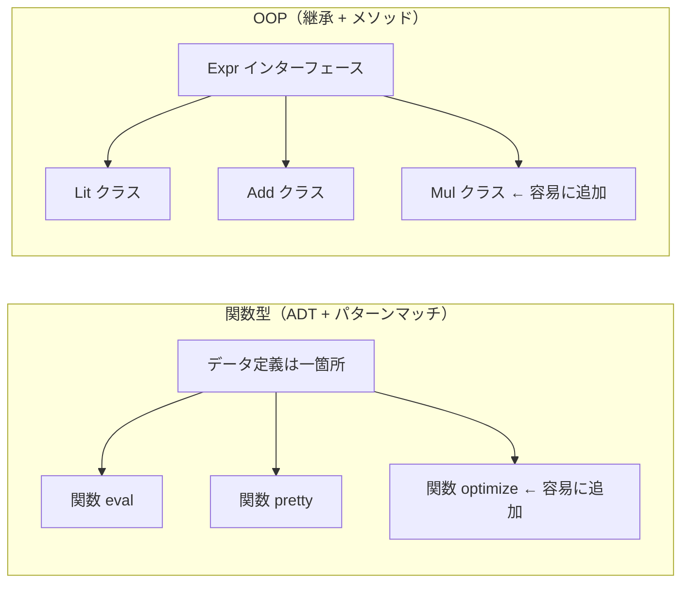

| 拡張の種類 | 関数型（ADT） | オブジェクト指向 |
|---|---|---|
| 新しいバリアントの追加 | 困難（既存関数の修正が必要） | 容易（新クラスを追加） |
| 新しい操作の追加 | 容易（新関数を追加） | 困難（既存クラスの修正が必要） |
| 網羅性の保証 | あり（コンパイラが検査） | 弱い（インターフェースの実装漏れは検出可能だが限定的） |

### 9.5 Expression Problem の解法

Expression Problem を完全に解決するためのさまざまなアプローチが研究・実践されている。

**型クラス / トレイト（Haskell, Rust）**: 型クラスやトレイトを使えば、既存の型に新しい操作を後付けで追加できる。ただし、新しいバリアントの追加には型クラスのインスタンスをすべて定義する必要があり、完全な解決にはならない。

```rust
// Trait allows adding operations to existing types
trait Eval {
    fn eval(&self) -> f64;
}

trait Pretty {
    fn pretty(&self) -> String;
}

// New operation: just implement a new trait
trait Optimize {
    fn optimize(&self) -> Box<dyn Expr>;
}
```

**多相バリアント（OCaml）**: OCaml の多相バリアントは開いた直和型を提供し、既存のバリアントを含む拡張が可能である。

```ocaml
(* Base variants and eval *)
let rec eval = function
  | `Lit n -> n
  | `Add (l, r) -> eval l +. eval r

(* Extended variants: reuses existing eval logic *)
let rec eval_ext = function
  | `Lit _ | `Add _ as e -> eval e
  | `Mul (l, r) -> eval_ext l *. eval_ext r
```

**Tagless Final スタイル**: データ型をコンストラクタではなく、操作のインターフェース（型クラスやモジュール）として定義する手法である。新しい操作もバリアントも既存コードの変更なしに追加できるが、データ構造を直接観察する操作（パターンマッチに相当するもの）が困難になるというトレードオフがある。

**Visitor パターン**: オブジェクト指向における古典的な解法で、二重ディスパッチを用いて操作をデータ階層から分離する。ただし、大量のボイラープレートコードが必要になり、新しいバリアントの追加では既存の Visitor インターフェースの変更が必要になるため、完全な解決にはならない。

### 9.6 実践的な指針

Expression Problem は理論的に興味深いだけでなく、実際の設計判断において重要な指針を与える。

- **バリアントが安定的で操作が増えていく場合**: 代数的データ型（関数型スタイル）が適している。コンパイラの AST 表現が典型例である。AST のノード種類はパーサーの仕様で固定されるが、意味解析、最適化、コード生成といった操作は次々と追加される。
- **操作が安定的でバリアントが増えていく場合**: オブジェクト指向の継承が適している。GUI ウィジェットのフレームワークが典型例である。`draw()`, `resize()`, `handleEvent()` といった基本操作は固定されるが、新しいウィジェット種類（ボタン、スライダー、チャートなど）が次々と追加される。
- **両方が頻繁に変わる場合**: 上述のより高度な手法（型クラス、Tagless Final など）の検討が必要になる。

## 10. まとめ

代数的データ型とパターンマッチは、プログラムにおけるデータ表現の **正しさ**、**表現力**、**保守性** を飛躍的に向上させる言語機能である。

代数的データ型の本質は、型の構成方法を **積** と **和** という2つの基本演算に還元したことにある。直積型は「AかつB」を、直和型は「AまたはB」を表す。この単純な組み合わせから、リスト、木、AST、Option、Result といった多様なデータ構造が自然に導出される。

パターンマッチは、代数的データ型の値を **安全に分解** し、**網羅的に処理** するための言語機能である。コンパイラによる網羅性検査は、直和型に新しいバリアントを追加した際に影響範囲をすべて洗い出してくれるという、大規模なリファクタリングにおいて極めて有用な性質をもたらす。

Option 型と Result 型は、代数的データ型の実用的な応用として、null 参照や例外に頼らない安全なエラー処理を実現する。Rust の `?` 演算子やモナド的な合成操作と組み合わせることで、簡潔さと安全性を両立できる。

Expression Problem は、代数的データ型とオブジェクト指向の継承が持つ本質的なトレードオフを明示する。どちらのスタイルが優れているかは問題の性質に依存し、両者の特性を理解した上で適切な設計を選択することが重要である。

かつては ML や Haskell といった関数型言語の専売特許であった代数的データ型は、Rust、Swift、Kotlin、TypeScript、Java といった主流の言語にも急速に浸透している。この流れは、型安全なデータ表現と網羅的なパターンマッチという設計原理が、特定のパラダイムを超えた普遍的な価値を持つことの証左であると言えるだろう。
