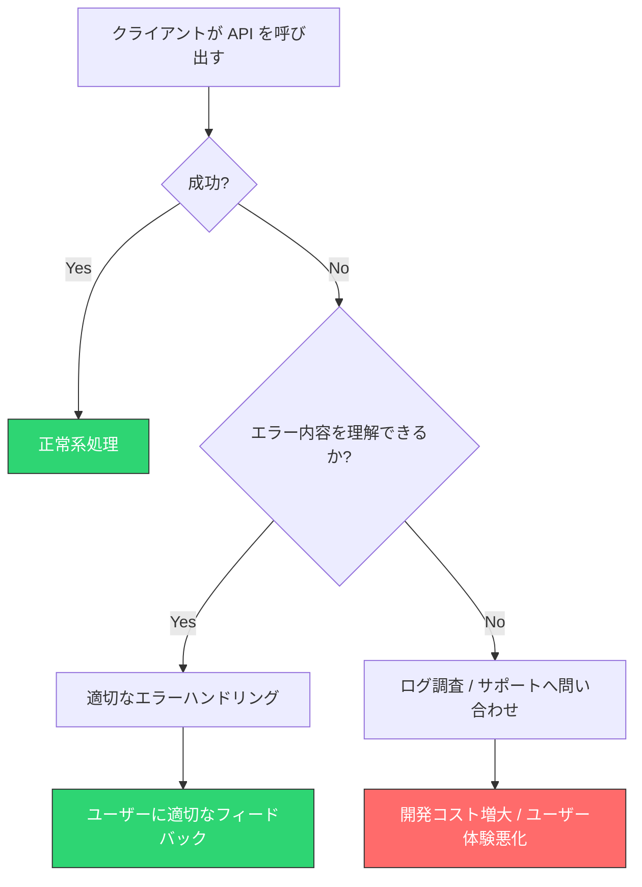
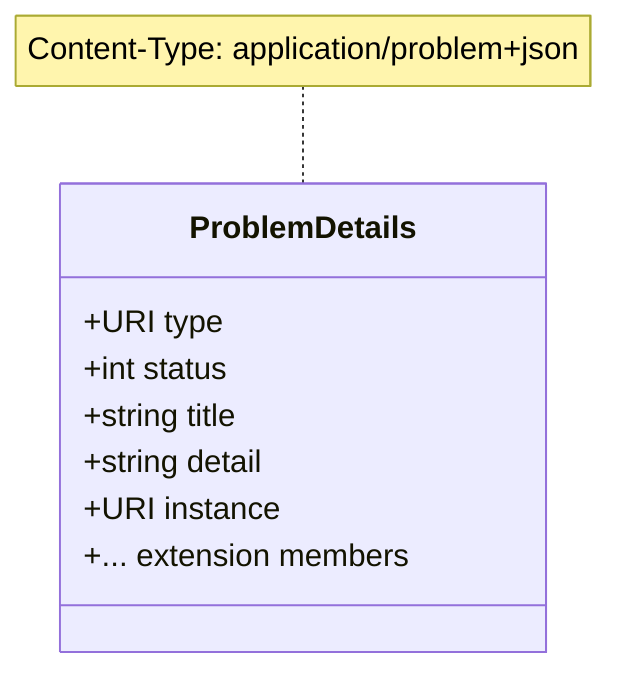
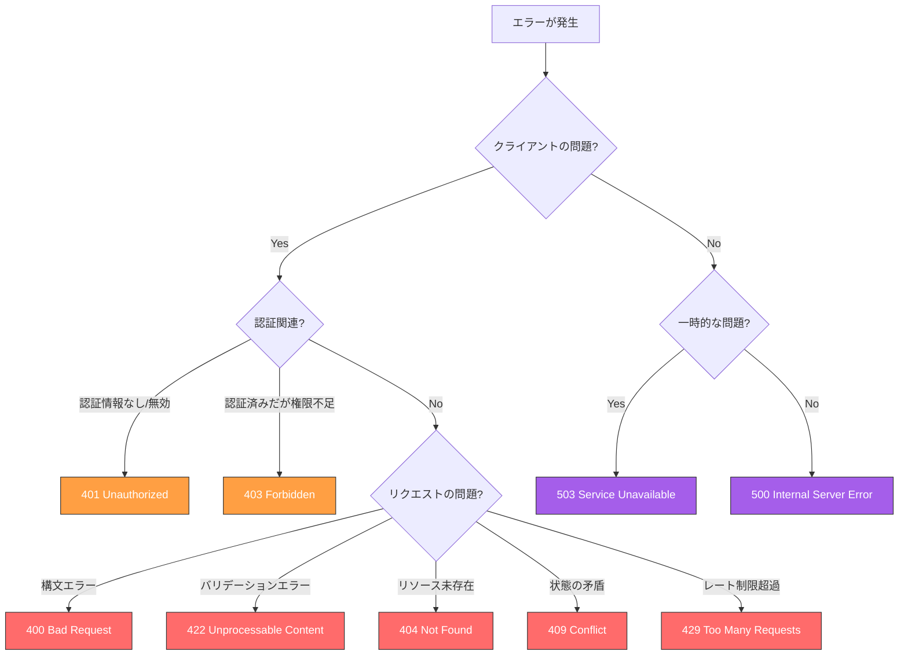
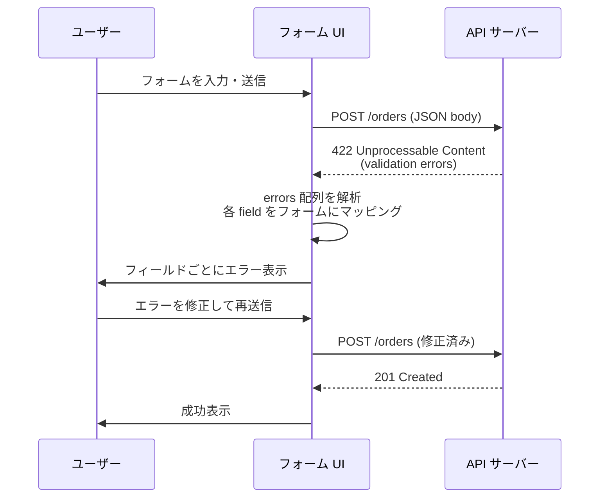
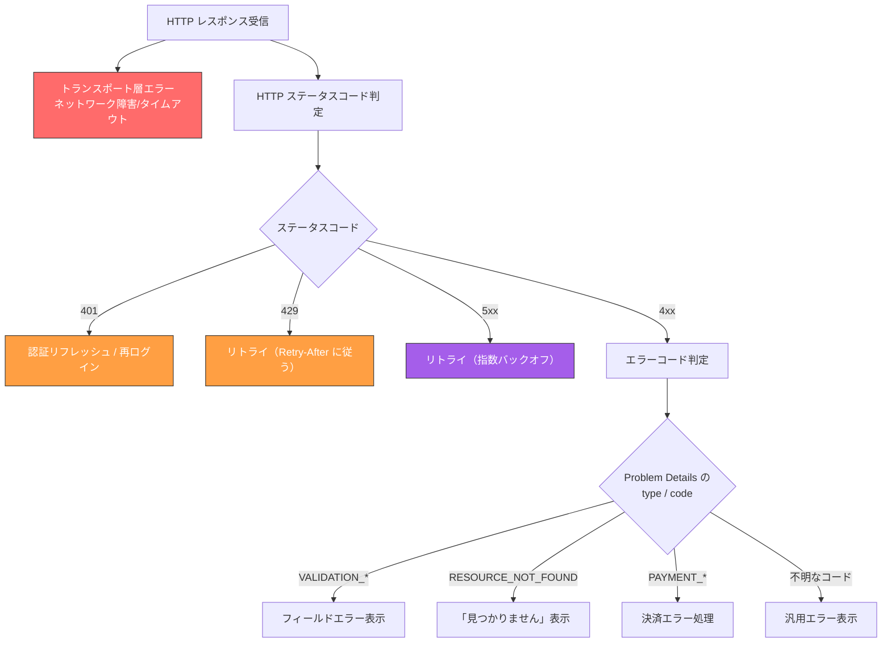
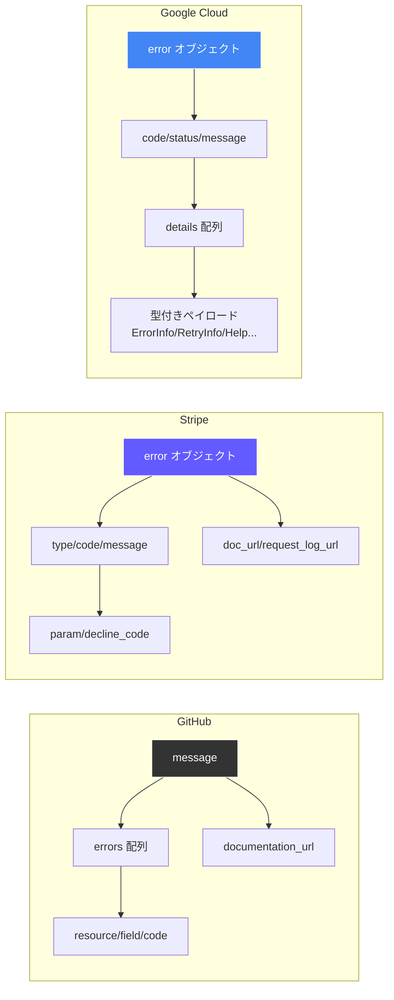
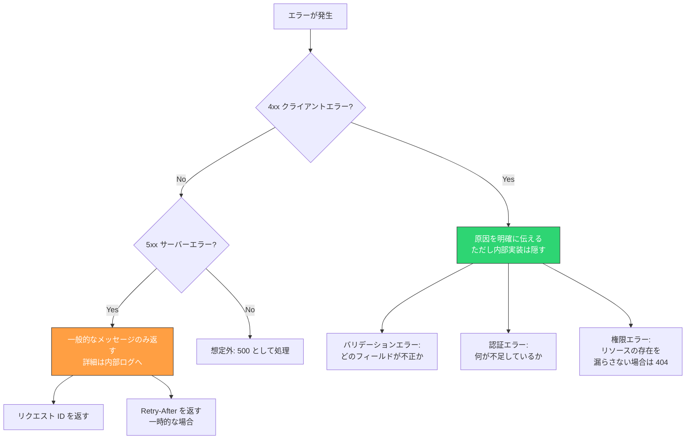

# API エラーレスポンス設計（RFC 7807 Problem Details）

## なぜエラーレスポンスの設計が重要なのか

API のエラーレスポンスは、正常系のレスポンス以上に設計の良し悪しがシステム全体の品質に影響する。API を利用する開発者は、成功レスポンスよりも**エラーレスポンスと向き合う時間のほうが長い**。認証エラー、バリデーションエラー、権限不足、レート制限超過、サーバー内部エラー――これらに遭遇したとき、レスポンスから問題の原因と対処法を素早く読み取れるかどうかは、開発体験（DX: Developer Experience）を大きく左右する。



エラーレスポンスが適切に設計されていれば、クライアント開発者は自力で問題を解決できる。逆に、不十分なエラーレスポンスはサポートコストの増大を招き、API プロバイダにとっても大きな負担となる。

### エラーレスポンスに求められる性質

優れたエラーレスポンスには、以下の性質が求められる。

1. **機械可読性（Machine-Readable）**: プログラムがエラーの種類を判別し、適切な処理を分岐できること
2. **人間可読性（Human-Readable）**: 開発者がレスポンスを読んで問題を理解できること
3. **一貫性（Consistency）**: API 全体で統一されたエラーフォーマットであること
4. **十分な情報量（Sufficient Detail）**: 問題の原因と対処法を特定するのに必要な情報が含まれていること
5. **安全性（Security）**: 内部実装の詳細やセンシティブな情報を漏洩しないこと

これらの性質をすべて満たすことは容易ではない。詳細な情報を返そうとするとセキュリティリスクが高まり、セキュリティを重視すると情報量が不足する。このバランスをどう取るかが、エラーレスポンス設計の核心的な課題である。

## よくあるアンチパターン

エラーレスポンス設計において、実際のプロジェクトでよく見かけるアンチパターンを整理する。これらを認識しておくことで、同じ過ちを避けることができる。

### アンチパターン 1: ステータスコードだけで全てを伝えようとする

```http
HTTP/1.1 400 Bad Request

(empty body)
```

HTTP ステータスコードは大まかなエラーカテゴリを伝えるには有用だが、具体的な原因を伝えるには不十分である。「400 Bad Request」だけでは、リクエストの何が悪いのかクライアントには分からない。必須パラメータが欠けているのか、フォーマットが不正なのか、値の範囲が不正なのか――これらの区別なしに、クライアントは適切なエラーハンドリングができない。

### アンチパターン 2: すべてを 200 で返す

```json
// Anti-pattern: always returning 200
{
  "success": false,
  "error": "Invalid email address"
}
```

このパターンでは HTTP ステータスコードが常に `200 OK` となるため、HTTP の仕組みに依存するインフラ層（ロードバランサ、CDN、監視ツール）がエラーを正しく検知できない。また、クライアント側では毎回レスポンスボディを解析して成否を判定しなければならず、HTTP の標準的なエラーハンドリング機構が使えなくなる。

### アンチパターン 3: 独自フォーマットの乱立

```json
// Endpoint A
{ "error": "not found" }

// Endpoint B
{ "errors": [{ "code": 1001, "msg": "missing field" }] }

// Endpoint C
{ "status": "error", "reason": "unauthorized" }
```

同一 API 内でエンドポイントごとにエラーフォーマットが異なるケースである。クライアントは各エンドポイントに対して個別のエラーパーサーを用意しなければならず、共通のエラーハンドリング層を構築できない。API が成長するにつれて、この問題は指数関数的に深刻化する。

### アンチパターン 4: 内部情報の漏洩

```json
{
  "error": "NullPointerException at UserService.java:142",
  "stack_trace": "at com.example.UserService.findById(UserService.java:142)\n...",
  "sql": "SELECT * FROM users WHERE id = '1; DROP TABLE users--'"
}
```

スタックトレースや SQL クエリをそのままレスポンスに含めてしまうケースである。これはセキュリティ上の重大なリスクとなる。攻撃者に内部アーキテクチャの情報を与えてしまうだけでなく、SQL インジェクションの成否を確認する手段を提供してしまう可能性がある。

### アンチパターン 5: 曖昧なエラーメッセージ

```json
{
  "error": "Something went wrong. Please try again later."
}
```

すべてのエラーに対して同じメッセージを返すパターンである。デバッグの手がかりが何もなく、クライアント開発者はログを精査するか、API プロバイダのサポートに問い合わせるしかない。開発効率を著しく低下させる。

::: warning
これらのアンチパターンは単なる「不便」ではなく、**セキュリティリスク**、**運用コストの増大**、**開発者の離反** につながる実践的な問題である。API のエラーレスポンスは、API の品質そのものを映し出す鏡である。
:::

## RFC 7807 / RFC 9457 Problem Details 仕様

### 標準化の背景

前述のアンチパターンが業界全体に蔓延していた状況を背景に、IETF（Internet Engineering Task Force）は HTTP API のエラーレスポンスを標準化する取り組みを進めた。その成果が **RFC 7807: Problem Details for HTTP APIs**（2016年公開）であり、その改訂版が **RFC 9457**（2023年7月公開）である。RFC 9457 は RFC 7807 を廃止（obsolete）し、現在の標準仕様となっている。

この仕様の目的は明確である。**HTTP API ごとに独自のエラーフォーマットを定義する必要をなくし、機械可読なエラー情報を標準的な方法で伝達すること** である。

### Problem Details オブジェクトの構造

RFC 9457 では、エラーレスポンスの構造を「Problem Details」オブジェクトとして定義している。このオブジェクトは JSON（`application/problem+json`）または XML（`application/problem+xml`）でシリアライズされる。



各メンバーの定義は以下のとおりである。

#### type（問題タイプ）

問題の種類を識別する URI 参照である。この URI はドキュメントへの参照であることが推奨され、デリファレンス（アクセス）すると問題の説明を人間が読める形式で取得できることが望ましい。省略された場合のデフォルト値は `"about:blank"` であり、これは HTTP ステータスコード以上の追加的な意味がないことを示す。

`type` は**エラーの種類をプログラムが一意に識別するための主キー**として機能する。クライアントはこの値を使ってエラーの種類を判定し、適切な処理を分岐させる。

```json
"type": "https://api.example.com/problems/insufficient-credit"
```

#### status（ステータスコード）

このエラーに対してサーバーが返した HTTP ステータスコードの数値である。これは**助言的（advisory）** な情報であり、HTTP レスポンス自体のステータスコードと一致させるべきだが、中間プロキシがステータスコードを書き換える可能性があるため、元のステータスコードをボディにも含めておくことで、クライアントが正しいステータスコードを参照できるようにする。

#### title（タイトル）

問題タイプの短い人間可読な要約である。同じ `type` の問題には常に同じ `title` を返すべきである（ローカライズを除く）。`title` はあくまで補助情報であり、プログラムによるエラー判定に使うべきではない。

#### detail（詳細）

この問題の**発生固有の説明**である。`title` が問題タイプ全般の説明であるのに対し、`detail` は「今回の具体的な問題」を説明する。デバッグ情報ではなく、クライアントが問題を解決するための情報を含めるべきである。

```json
"detail": "Your current balance is 30, but that costs 50."
```

#### instance（インスタンス）

この問題の発生を一意に識別する URI 参照である。デリファレンス可能であってもよいし、不透明な識別子として機能するだけでもよい。たとえば、リクエスト ID やエラーログのエントリを指すことができる。

### 完全な例

以下は、RFC 9457 に基づいた完全なエラーレスポンスの例である。

```http
HTTP/1.1 403 Forbidden
Content-Type: application/problem+json

{
  "type": "https://example.com/probs/out-of-credit",
  "title": "You do not have enough credit.",
  "status": 403,
  "detail": "Your current balance is 30, but that costs 50.",
  "instance": "/account/12345/msgs/abc",
  "balance": 30,
  "accounts": ["/account/12345", "/account/67890"]
}
```

この例で注目すべき点がいくつかある。

1. **Content-Type** が `application/problem+json` に設定されている。これにより、クライアントはレスポンスボディが Problem Details 形式であることを認識できる
2. **拡張メンバー**として `balance` と `accounts` が含まれている。RFC 9457 では、問題タイプ固有の追加情報を拡張メンバーとして自由に追加できる
3. `type` がドキュメント URI を指しており、開発者がこの URI にアクセスすれば、問題の詳細な説明を読むことができる

### about:blank タイプ

`type` が `"about:blank"` の場合（または省略された場合）、HTTP ステータスコード以上の追加情報がないことを示す。この場合、`title` は HTTP ステータスコードの説明テキスト（例: "Not Found"）と同じにすべきである。

```json
{
  "type": "about:blank",
  "title": "Not Found",
  "status": 404,
  "detail": "The requested user does not exist."
}
```

`about:blank` は、わざわざカスタムの問題タイプを定義するほどではない一般的なエラーに対して使うと便利である。

### 拡張メンバー

RFC 9457 の大きな強みの一つが、**拡張メンバー**の仕組みである。標準の 5 つのメンバー（type, status, title, detail, instance）に加えて、問題タイプ固有の追加情報を自由に定義できる。

```json
{
  "type": "https://api.example.com/problems/validation-error",
  "title": "Validation Error",
  "status": 422,
  "detail": "The request body contains invalid fields.",
  "errors": [
    {
      "field": "email",
      "message": "Must be a valid email address.",
      "rejected_value": "not-an-email"
    },
    {
      "field": "age",
      "message": "Must be between 0 and 150.",
      "rejected_value": -5
    }
  ]
}
```

::: tip
拡張メンバーの設計においては、クライアントが**認識しない拡張メンバーを無視できる**ことが仕様で求められている。したがって、拡張メンバーを追加しても既存のクライアントを壊さない。これは API を進化させる上で非常に重要な性質である。
:::

### RFC 7807 から RFC 9457 への主な変更点

RFC 9457 は RFC 7807 を全面的に置き換えたが、基本的な構造は変わっていない。主な変更点は以下のとおりである。

| 変更点 | RFC 7807 | RFC 9457 |
|--------|----------|----------|
| 複数の問題の表現 | 規定なし | 複数の問題を表現するガイダンスを追加 |
| 問題タイプのレジストリ | なし | IANA レジストリによる共通問題タイプの登録を導入 |
| 拡張メンバーの命名規則 | 曖昧 | 英字で始まり、英数字とアンダースコアのみ、3文字以上と明確化 |
| JSON の不正なメンバー型 | エラーとすべき | 無視すべき（寛容な処理） |

## HTTP ステータスコードの使い分け

エラーレスポンスの設計において、HTTP ステータスコードの適切な使い分けは基盤となる。Problem Details の `status` メンバーにどの値を設定するかは、エラーの性質を正しく反映する必要がある。

### クライアントエラー（4xx）

4xx 系のステータスコードは、**クライアント側に原因がある**エラーを示す。クライアントがリクエストを修正しない限り、同じリクエストを再送しても同じエラーが返る。

| ステータスコード | 意味 | 使いどころ |
|----------------|------|-----------|
| 400 Bad Request | リクエストの構文が不正 | JSON パースエラー、必須パラメータの欠落 |
| 401 Unauthorized | 認証が必要 / 認証情報が無効 | トークン未指定、トークン期限切れ |
| 403 Forbidden | 認証済みだが権限がない | リソースへのアクセス権限不足 |
| 404 Not Found | リソースが存在しない | 指定された ID のリソースがない |
| 405 Method Not Allowed | HTTP メソッドが許可されていない | GET のみのエンドポイントに POST した場合 |
| 409 Conflict | 現在のリソース状態と矛盾 | 楽観的ロックの競合、一意制約違反 |
| 415 Unsupported Media Type | メディアタイプが未サポート | XML のみのエンドポイントに JSON を送信 |
| 422 Unprocessable Content | 構文は正しいがセマンティクスが不正 | バリデーションエラー |
| 429 Too Many Requests | レート制限超過 | 単位時間あたりのリクエスト数超過 |

::: details 400 と 422 の使い分け
400 Bad Request と 422 Unprocessable Content の使い分けは、よく議論になるポイントである。明確な基準として以下を推奨する。

- **400**: リクエストの構文レベルの問題。JSON がパースできない、Content-Type が不正、必須ヘッダーが欠落しているなど
- **422**: リクエストの構文は正しいが、意味的に不正。メールアドレスの形式が不正、数値が範囲外、存在しないリソースへの参照など

つまり、「リクエストの形はあっているが、中身が不正」なら 422、「リクエストの形自体がおかしい」なら 400 である。
:::

### サーバーエラー（5xx）

5xx 系のステータスコードは、**サーバー側に原因がある**エラーを示す。クライアントのリクエストは正当であるが、サーバーの問題によって処理を完了できなかったことを意味する。

| ステータスコード | 意味 | 使いどころ |
|----------------|------|-----------|
| 500 Internal Server Error | サーバー内部の予期しないエラー | 未処理の例外、プログラムのバグ |
| 502 Bad Gateway | 上流サーバーからの不正なレスポンス | マイクロサービスの通信障害 |
| 503 Service Unavailable | サービスが一時的に利用不可 | メンテナンス中、過負荷 |
| 504 Gateway Timeout | 上流サーバーのタイムアウト | 依存サービスの応答遅延 |

::: warning
5xx エラーのレスポンスでは、内部情報の漏洩に特に注意が必要である。スタックトレース、内部サービス名、データベースのエラーメッセージなどは絶対にクライアントに返してはならない。代わりに、リクエスト ID を返して内部ログと紐づける方式を取るべきである。
:::

### ステータスコード選択のフローチャート



## エラーコード体系の設計

HTTP ステータスコードだけではエラーの種類を十分に区別できないため、**API 固有のエラーコード**を設計する必要がある。たとえば、`422 Unprocessable Content` はバリデーションエラーであることは分かるが、「どのフィールドが」「どのように」不正なのかは伝えられない。

### エラーコードの設計原則

#### 1. 一意性

各エラーコードは特定のエラー条件を一意に識別する。同じエラーコードが異なるエラー条件に使われてはならない。

#### 2. 安定性

一度公開したエラーコードは変更しない。エラーコードを変更すると、そのコードに依存するクライアントのエラーハンドリングが壊れる。不要になったコードは削除するのではなく、非推奨（deprecated）とする。

#### 3. 自己説明性

エラーコードの命名は、コードを見ただけでおおよその意味が推測できるものであるべきである。

#### 4. 階層性

エラーコードは階層構造を持つと便利である。上位カテゴリと下位の具体的なエラーを区別することで、クライアントは粗い粒度でも細かい粒度でもエラーハンドリングができる。

### エラーコードの形式

エラーコードの形式として、主に 2 つのアプローチがある。

**文字列ベースのエラーコード**

```json
{
  "type": "https://api.example.com/problems/validation-error",
  "status": 422,
  "title": "Validation Error",
  "code": "INVALID_EMAIL_FORMAT",
  "detail": "The email address 'foo' is not a valid email format."
}
```

- 可読性が高く、デバッグが容易
- ドキュメントとの対応が明確
- Stripe や GitHub が採用

**数値ベースのエラーコード**

```json
{
  "type": "https://api.example.com/problems/validation-error",
  "status": 422,
  "title": "Validation Error",
  "code": 40001,
  "detail": "The email address 'foo' is not a valid email format."
}
```

- 数値の範囲でカテゴリを表現できる（例: 4xxxx = バリデーション、5xxxx = サーバー）
- 国際化が容易（数値とメッセージを分離しやすい）
- gRPC のステータスコードが採用

::: tip
現代の API 設計では、**文字列ベースのエラーコード**が主流である。可読性が高く、開発者がエラーの意味を即座に理解できるからである。数値コードを使う場合でも、対応する文字列名をあわせて返すことが推奨される。
:::

### エラーコード体系の例

以下は、EC サイト API におけるエラーコード体系の設計例である。

```
Authentication & Authorization
├── AUTH_TOKEN_EXPIRED
├── AUTH_TOKEN_INVALID
├── AUTH_INSUFFICIENT_SCOPE
└── AUTH_ACCOUNT_LOCKED

Validation
├── VALIDATION_REQUIRED_FIELD
├── VALIDATION_INVALID_FORMAT
├── VALIDATION_OUT_OF_RANGE
└── VALIDATION_FIELD_CONFLICT

Resource
├── RESOURCE_NOT_FOUND
├── RESOURCE_ALREADY_EXISTS
├── RESOURCE_GONE
└── RESOURCE_LOCKED

Business Logic
├── ORDER_INSUFFICIENT_STOCK
├── ORDER_ALREADY_CANCELLED
├── PAYMENT_DECLINED
└── PAYMENT_INSUFFICIENT_FUNDS

Rate Limiting
├── RATE_LIMIT_EXCEEDED
└── RATE_LIMIT_QUOTA_EXHAUSTED
```

このように、プレフィックスでカテゴリを表現し、サフィックスで具体的なエラー条件を示す形式が実用的である。

## バリデーションエラーのレスポンス設計

バリデーションエラーは、API エラーの中で最も頻度が高く、かつ設計が難しいカテゴリである。単一のフィールドに対する単純なバリデーションから、複数フィールドにまたがるクロスバリデーションまで、様々なパターンを統一的に扱う必要がある。

### 基本構造

RFC 9457 の拡張メンバーを活用して、バリデーションエラーの詳細を構造化する。

```json
{
  "type": "https://api.example.com/problems/validation-error",
  "title": "Validation Error",
  "status": 422,
  "detail": "The request contains 3 validation errors.",
  "errors": [
    {
      "field": "email",
      "code": "VALIDATION_INVALID_FORMAT",
      "message": "Must be a valid email address.",
      "rejected_value": "not-an-email"
    },
    {
      "field": "age",
      "code": "VALIDATION_OUT_OF_RANGE",
      "message": "Must be between 0 and 150.",
      "rejected_value": -5
    },
    {
      "field": "password",
      "code": "VALIDATION_REQUIRED_FIELD",
      "message": "This field is required."
    }
  ]
}
```

### フィールドパスの表現

ネストしたオブジェクトや配列の要素に対するバリデーションエラーでは、フィールドの位置を明確に示す必要がある。JSON Pointer（RFC 6901）形式や、ドット記法を使うのが一般的である。

```json
{
  "type": "https://api.example.com/problems/validation-error",
  "title": "Validation Error",
  "status": 422,
  "detail": "The request contains validation errors.",
  "errors": [
    {
      "field": "shipping_address.postal_code",
      "code": "VALIDATION_INVALID_FORMAT",
      "message": "Must be a valid postal code (e.g., 100-0001)."
    },
    {
      "field": "items[0].quantity",
      "code": "VALIDATION_OUT_OF_RANGE",
      "message": "Must be at least 1."
    },
    {
      "field": "items[2].product_id",
      "code": "RESOURCE_NOT_FOUND",
      "message": "Product with this ID does not exist."
    }
  ]
}
```

### クロスフィールドバリデーション

複数のフィールドにまたがるバリデーションエラーの場合、`field` を配列にするか、トップレベルの問題として表現する。

```json
{
  "type": "https://api.example.com/problems/validation-error",
  "title": "Validation Error",
  "status": 422,
  "detail": "The request contains validation errors.",
  "errors": [
    {
      "fields": ["start_date", "end_date"],
      "code": "VALIDATION_FIELD_CONFLICT",
      "message": "start_date must be before end_date."
    }
  ]
}
```

### バリデーションエラーとフォームの連携

クライアントがフォーム UI を持つ場合、バリデーションエラーのレスポンスをフォームの各フィールドにマッピングする必要がある。`field` プロパティがリクエストボディの JSON パスに対応していれば、クライアントは自動的にフォームフィールドとエラーメッセージを紐づけることができる。



## i18n（国際化）対応

グローバルに提供される API では、エラーメッセージの国際化が求められることがある。しかし、エラーレスポンスの i18n 設計には慎重な検討が必要である。

### 基本方針

エラーレスポンスの国際化において重要な原則は、**機械可読な部分と人間可読な部分を明確に分離する**ことである。

- **機械可読部分**（`type`, `status`, エラーコード）: ローカライズ**しない**。プログラムが処理に使う値は常に同一であるべき
- **人間可読部分**（`title`, `detail`, フィールドエラーの `message`）: ローカライズ**できる**

### Accept-Language ヘッダーによる言語切り替え

```http
GET /api/orders/12345 HTTP/1.1
Accept-Language: ja
```

```json
{
  "type": "https://api.example.com/problems/resource-not-found",
  "title": "リソースが見つかりません",
  "status": 404,
  "detail": "注文 ID 12345 は存在しません。",
  "code": "RESOURCE_NOT_FOUND"
}
```

同じリクエストを英語で行った場合:

```http
GET /api/orders/12345 HTTP/1.1
Accept-Language: en
```

```json
{
  "type": "https://api.example.com/problems/resource-not-found",
  "title": "Resource Not Found",
  "status": 404,
  "detail": "Order with ID 12345 does not exist.",
  "code": "RESOURCE_NOT_FOUND"
}
```

`type` と `code` は同一であることに注意されたい。クライアントはこれらの機械可読フィールドでエラーの種類を判定し、人間可読フィールドはユーザーへの表示にのみ使う。

### Google Cloud の LocalizedMessage アプローチ

Google Cloud API は、AIP-193 エラー仕様において、`details` 配列内に `LocalizedMessage` 型のペイロードを含める方式を採用している。

```json
{
  "error": {
    "code": 404,
    "message": "Resource 'projects/123' was not found.",
    "status": "NOT_FOUND",
    "details": [
      {
        "@type": "type.googleapis.com/google.rpc.LocalizedMessage",
        "locale": "ja-JP",
        "message": "リソース 'projects/123' は見つかりませんでした。"
      }
    ]
  }
}
```

このアプローチの利点は、デフォルトのメッセージ（英語）を常に含めつつ、ローカライズされたメッセージをオプションで追加できることである。

### i18n 設計の注意点

::: warning
API のエラーメッセージをローカライズするかどうかは、**API の利用者が誰か**によって判断すべきである。

- **開発者向け API**（B2D: Business to Developer）: 英語のみで十分な場合が多い。開発者はエラーコードとドキュメントを参照する
- **エンドユーザー向け API**（BFF: Backend for Frontend）: ローカライズが求められることが多い。フロントエンドがエラーメッセージをそのまま表示する場合があるため

ただし、API のエラーメッセージをそのままユーザーに表示することは一般的に推奨されない。フロントエンドでエラーコードに基づいてユーザー向けメッセージを生成する方が、柔軟で安全なアプローチである。
:::

## クライアント側のエラーハンドリング

エラーレスポンスを適切に設計しても、クライアント側で適切に処理されなければ意味がない。ここでは、クライアントがエラーレスポンスをどのように処理すべきかを解説する。

### エラーハンドリングの階層

クライアントのエラーハンドリングは、以下の階層で設計するのが効果的である。



### 汎用エラーハンドラの実装例

TypeScript による汎用的なエラーハンドラの実装例を示す。

```typescript
// Problem Details type definition
interface ProblemDetails {
  type: string;
  title: string;
  status: number;
  detail?: string;
  instance?: string;
  [key: string]: unknown; // extension members
}

interface ValidationError extends ProblemDetails {
  errors: Array<{
    field: string;
    code: string;
    message: string;
    rejected_value?: unknown;
  }>;
}

// Centralized error handler
class ApiErrorHandler {
  async handleResponse(response: Response): Promise<never> {
    const contentType = response.headers.get("content-type") ?? "";

    // Check if the response is a Problem Details object
    if (contentType.includes("application/problem+json")) {
      const problem: ProblemDetails = await response.json();
      throw new ApiError(problem);
    }

    // Fallback for non-standard error responses
    const body = await response.text();
    throw new ApiError({
      type: "about:blank",
      title: response.statusText,
      status: response.status,
      detail: body,
    });
  }
}

class ApiError extends Error {
  constructor(public readonly problem: ProblemDetails) {
    super(problem.detail ?? problem.title);
    this.name = "ApiError";
  }

  get isValidationError(): boolean {
    return this.problem.type.endsWith("/validation-error");
  }

  get isRetryable(): boolean {
    return this.problem.status >= 500 || this.problem.status === 429;
  }

  get validationErrors(): ValidationError["errors"] | undefined {
    if (this.isValidationError) {
      return (this.problem as ValidationError).errors;
    }
    return undefined;
  }
}
```

### リトライ戦略

5xx エラーや 429（レート制限）エラーに対しては、自動リトライが有効な場合がある。ただし、適切なリトライ戦略を取らないと、障害を悪化させるリスクがある。

```typescript
async function fetchWithRetry(
  url: string,
  options: RequestInit,
  maxRetries: number = 3
): Promise<Response> {
  for (let attempt = 0; attempt <= maxRetries; attempt++) {
    const response = await fetch(url, options);

    if (response.ok) {
      return response;
    }

    // Do not retry client errors (except 429)
    if (response.status >= 400 && response.status < 500 && response.status !== 429) {
      return response;
    }

    if (attempt < maxRetries) {
      // Respect Retry-After header
      const retryAfter = response.headers.get("retry-after");
      let delay: number;

      if (retryAfter) {
        delay = parseInt(retryAfter, 10) * 1000;
      } else {
        // Exponential backoff with jitter
        delay = Math.min(1000 * Math.pow(2, attempt) + Math.random() * 1000, 30000);
      }

      await new Promise((resolve) => setTimeout(resolve, delay));
    }
  }

  // Return the last response after exhausting retries
  return await fetch(url, options);
}
```

::: tip
リトライ時の**指数バックオフ（exponential backoff）** と**ジッタ（jitter）** は、障害時にリクエストが集中する「thundering herd」問題を緩和するための重要なテクニックである。`Retry-After` ヘッダーが返された場合は、その値を最優先で尊重すべきである。
:::

### 冪等性とリトライの安全性

リトライを安全に行うためには、リクエストの**冪等性（idempotency）** を考慮する必要がある。GET、PUT、DELETE は HTTP の仕様上冪等であるが、POST は冪等ではない。POST リクエストのリトライが安全でないケースでは、**冪等性キー（Idempotency Key）** を使うことで安全にリトライできる。

```http
POST /api/payments HTTP/1.1
Idempotency-Key: 550e8400-e29b-41d4-a716-446655440000
Content-Type: application/json

{
  "amount": 5000,
  "currency": "JPY"
}
```

サーバーはこの冪等性キーを使って、同じリクエストが二重に処理されることを防ぐ。ネットワーク障害でレスポンスが返らなかった場合、クライアントは同じ冪等性キーでリクエストを再送すれば、サーバーは前回の結果を返す。

## 実際の API に見るエラーレスポンス設計

ここでは、広く利用されている API がどのようにエラーレスポンスを設計しているかを比較分析する。

### GitHub REST API

GitHub は、シンプルだが実用的なエラーフォーマットを採用している。

```json
{
  "message": "Validation Failed",
  "errors": [
    {
      "resource": "Issue",
      "field": "title",
      "code": "missing_field"
    }
  ],
  "documentation_url": "https://docs.github.com/rest/issues/issues#create-an-issue"
}
```

**特徴:**

- `message` がトップレベルのエラー説明
- `errors` 配列で個別のバリデーションエラーを表現
- `code` は定義済みの文字列コード（`missing`, `missing_field`, `invalid`, `already_exists`, `unprocessable`, `custom`）
- `documentation_url` でドキュメントへのリンクを提供
- RFC 7807 には準拠していないが、十分に構造化されている

**GitHub が返す主なエラーコード:**

| コード | 意味 |
|--------|------|
| `missing` | リソースが存在しない |
| `missing_field` | 必須フィールドが指定されていない |
| `invalid` | フィールドのフォーマットが不正 |
| `already_exists` | 一意制約に違反している |
| `unprocessable` | 不正なパラメータが指定された |
| `custom` | `message` プロパティに詳細がある |

GitHub のアプローチは、**セキュリティと情報量のバランス**が良い。プライベートリポジトリへのアクセスで権限がない場合、`403 Forbidden` ではなく `404 Not Found` を返すことで、リソースの存在を悟らせないようにしている。

### Stripe API

Stripe は、決済 API として最も洗練されたエラーレスポンス設計の一つを持つ。

```json
{
  "error": {
    "type": "card_error",
    "code": "card_declined",
    "decline_code": "insufficient_funds",
    "message": "Your card has insufficient funds.",
    "param": "source",
    "doc_url": "https://stripe.com/docs/error-codes/card-declined",
    "charge": "ch_1234567890",
    "request_log_url": "https://dashboard.stripe.com/logs/req_abcdef"
  }
}
```

**特徴:**

- `error` オブジェクトでラップされた階層構造
- `type` でエラーのカテゴリ分類（`api_error`, `card_error`, `idempotency_error`, `invalid_request_error`）
- `code` で具体的なエラー条件を示す
- 決済ドメイン特有の `decline_code` を持つ
- `param` でエラーの原因となったパラメータを示す
- `doc_url` でエラーコード固有のドキュメントへのリンクを提供
- `request_log_url` でダッシュボードのログページに直接リンク
- すべてのレスポンスに `Request-Id` ヘッダー（`req_` プレフィックス）が付与される

Stripe のエラー設計が優れている点は、**エラーから回復するために必要な情報がすべて含まれている**ことである。特に `doc_url` と `request_log_url` は、開発者が問題を自己解決するための強力なツールとなっている。

### Google Cloud API（AIP-193）

Google Cloud API は、gRPC ベースの独自エラーモデルを採用しているが、REST API においても JSON 形式でこれを表現する。

```json
{
  "error": {
    "code": 429,
    "message": "Quota exceeded for quota metric 'Queries' and limit 'Queries per minute per user'.",
    "status": "RESOURCE_EXHAUSTED",
    "details": [
      {
        "@type": "type.googleapis.com/google.rpc.ErrorInfo",
        "reason": "RATE_LIMIT_EXCEEDED",
        "domain": "googleapis.com",
        "metadata": {
          "quota_metric": "compute.googleapis.com/queries",
          "quota_limit": "QueriesPerMinutePerUser",
          "consumer": "projects/123456"
        }
      },
      {
        "@type": "type.googleapis.com/google.rpc.Help",
        "links": [
          {
            "description": "Request a quota increase",
            "url": "https://cloud.google.com/docs/quota"
          }
        ]
      },
      {
        "@type": "type.googleapis.com/google.rpc.RetryInfo",
        "retryDelay": "30s"
      }
    ]
  }
}
```

**特徴:**

- `code` は gRPC ステータスコードの数値（HTTP ステータスコードと対応）
- `status` は gRPC ステータスコードの文字列名
- `details` 配列に型付きの詳細ペイロードを含む
- `@type` で各ペイロードの型を示す（Protocol Buffers の型 URL）
- 標準の詳細ペイロードタイプ: `ErrorInfo`, `RetryInfo`, `DebugInfo`, `QuotaFailure`, `PreconditionFailure`, `BadRequest`, `RequestInfo`, `ResourceInfo`, `Help`, `LocalizedMessage`
- `ErrorInfo` はすべてのエラーに必須

Google のアプローチの特筆すべき点は、`details` の**型システム**である。各ペイロードが `@type` で型付けされているため、クライアントは認識できる型のペイロードだけを処理し、未知の型は無視できる。これは Protocol Buffers の `Any` 型に由来する設計であり、強い拡張性を持つ。

### 3 社の比較



| 観点 | GitHub | Stripe | Google Cloud |
|------|--------|--------|-------------|
| 標準準拠 | 独自形式 | 独自形式 | AIP-193（独自標準） |
| エラーコード体系 | 6 種類の固定コード | type + code の2階層 | gRPC ステータス + ErrorInfo |
| ドキュメントリンク | `documentation_url` | `doc_url` | `Help` ペイロード |
| リクエスト追跡 | なし | `request_log_url` | `RequestInfo` ペイロード |
| バリデーション詳細 | `errors` 配列 | `param` フィールド | `BadRequest` ペイロード |
| 拡張性 | 低い | 中程度 | 非常に高い |
| シンプルさ | 非常に高い | 高い | 低い |

::: details RFC 7807 / 9457 を採用している API の例
RFC 7807 / 9457 は標準仕様でありながら、上記 3 社のような大規模 API プロバイダは独自形式を採用している。これは、RFC 7807 の策定（2016年）以前から API を運用していたためである。しかし、比較的新しい API や、欧州を中心とした API 設計では RFC 9457 の採用が増えている。たとえば、Spring Framework（6.0 以降）はデフォルトで RFC 9457 形式のエラーレスポンスを返すようになっている。API 設計を新規に行う場合は、RFC 9457 をベースとすることが推奨される。
:::

## 実践的な設計ガイドライン

ここまでの議論を踏まえ、実際に API のエラーレスポンスを設計する際の実践的なガイドラインをまとめる。

### 1. 全体構造の決定

RFC 9457 をベースとした推奨構造を示す。

```json
{
  "type": "https://api.example.com/problems/{error-type}",
  "title": "Human-readable error summary",
  "status": 422,
  "detail": "Specific explanation for this occurrence.",
  "instance": "urn:uuid:d9e35127-e9b1-4c3c-a5e1-7e7c0c9f1b0c",
  "code": "ERROR_CODE",
  "timestamp": "2026-03-02T10:30:00Z",
  "errors": []
}
```

各フィールドの役割を再確認する。

| フィールド | 用途 | 対象 |
|-----------|------|------|
| `type` | エラー種別の識別（URI） | 機械 |
| `title` | エラー種別の要約 | 人間 |
| `status` | HTTP ステータスコード | 機械 / 人間 |
| `detail` | 発生固有の説明 | 人間 |
| `instance` | 発生の一意識別子 | 機械（ログ追跡用） |
| `code` | API 固有のエラーコード（拡張） | 機械 |
| `timestamp` | エラー発生時刻（拡張） | 機械 / 人間 |
| `errors` | バリデーションエラー詳細（拡張） | 機械 / 人間 |

### 2. エラーレスポンスのドキュメント化

エラーコードは、API ドキュメントの一部として体系的にドキュメント化すべきである。各エラーコードについて、以下の情報を記載する。

- **エラーコード**: `VALIDATION_INVALID_FORMAT`
- **HTTP ステータスコード**: 422
- **説明**: リクエストフィールドのフォーマットが不正
- **発生条件**: メールアドレスの形式不正、日付フォーマットの不正など
- **対処法**: 正しいフォーマットでリクエストを再送する
- **例**: レスポンスの JSON 例

`type` URI がドキュメントを指すように設計すれば、エラーレスポンスから直接ドキュメントにたどり着ける。

### 3. セキュリティの考慮事項



具体的な注意点を列挙する。

- **スタックトレースを返さない**: 内部の技術スタックが露出する
- **SQL エラーを返さない**: テーブル構造やクエリパターンが露出する
- **内部サービス名を返さない**: マイクロサービスの構成が推測される
- **機密リソースの存在を暴露しない**: 権限がないリソースへのアクセスは `404` を返すことを検討する（GitHub 方式）
- **レート制限情報の開示を制御する**: レート制限のしきい値を正確に返すと、攻撃者が限界ギリギリまでリクエストを送ることが容易になる

### 4. バージョニングとの関係

エラーレスポンスのフォーマット変更は、**Breaking Change** である。エラーレスポンスの構造に依存してエラーハンドリングを実装しているクライアントが壊れるからだ。したがって、エラーレスポンスの設計は最初から慎重に行い、変更が必要な場合は API のバージョニングと合わせて対応すべきである。

逆に、以下の変更は一般的に後方互換性を保つ。

- **新しいエラーコードの追加**: 既存のコードに影響しない
- **拡張メンバーの追加**: RFC 9457 の仕様により、クライアントは未知のメンバーを無視する
- **`detail` メッセージの文言変更**: プログラムが `detail` の文字列で分岐していない前提

::: danger
エラーメッセージの文字列比較でエラーハンドリングを行うクライアントは、メッセージ文言の変更で壊れる。これを防ぐために、必ず `type` や `code` などの**安定した識別子**でエラーを判定させるべきである。API ドキュメントにもその旨を明記する。
:::

### 5. ログとの連携

エラーレスポンスの `instance` フィールドにリクエスト ID を含めることで、クライアントとサーバーのログを紐づけることができる。

```
Client log:  API returned error, instance=urn:uuid:d9e35127-...
Server log:  [d9e35127-...] ValidationError at POST /orders: email format invalid
```

この仕組みにより、クライアント開発者がサポートに問い合わせる際にリクエスト ID を伝えるだけで、サーバー側のログを即座に特定できる。Stripe の `Request-Id` ヘッダーはこの仕組みの好例である。

### 6. OpenAPI での定義

エラーレスポンスは OpenAPI（Swagger）仕様でも定義すべきである。これにより、API ドキュメントの自動生成やクライアントコードの自動生成に反映される。

```yaml
# OpenAPI error schema definition
components:
  schemas:
    ProblemDetails:
      type: object
      properties:
        type:
          type: string
          format: uri
          description: URI reference identifying the problem type
          example: "https://api.example.com/problems/validation-error"
        title:
          type: string
          description: Short human-readable summary
          example: "Validation Error"
        status:
          type: integer
          description: HTTP status code
          example: 422
        detail:
          type: string
          description: Human-readable explanation specific to this occurrence
          example: "The request contains 2 validation errors."
        instance:
          type: string
          format: uri
          description: URI reference for this specific occurrence
        code:
          type: string
          description: API-specific error code
          example: "VALIDATION_ERROR"
        timestamp:
          type: string
          format: date-time
        errors:
          type: array
          items:
            $ref: '#/components/schemas/FieldError'

    FieldError:
      type: object
      required:
        - field
        - code
        - message
      properties:
        field:
          type: string
          description: JSON path to the invalid field
          example: "email"
        code:
          type: string
          description: Specific validation error code
          example: "VALIDATION_INVALID_FORMAT"
        message:
          type: string
          description: Human-readable description of the error
          example: "Must be a valid email address."
        rejected_value:
          description: The value that was rejected
          example: "not-an-email"

  responses:
    ValidationError:
      description: Validation error
      content:
        application/problem+json:
          schema:
            $ref: '#/components/schemas/ProblemDetails'
    NotFound:
      description: Resource not found
      content:
        application/problem+json:
          schema:
            $ref: '#/components/schemas/ProblemDetails'
```

## エラーレスポンス設計のチェックリスト

最後に、API のエラーレスポンスを設計・レビューする際のチェックリストをまとめる。

**構造と一貫性**

- [ ] すべてのエンドポイントで統一されたエラーフォーマットを使っているか
- [ ] Content-Type に `application/problem+json` を設定しているか
- [ ] HTTP ステータスコードとレスポンスボディの `status` が一致しているか

**情報量**

- [ ] エラーの種類を機械的に判別できるか（`type` / `code`）
- [ ] 人間が読んで問題を理解できるか（`title` / `detail`）
- [ ] バリデーションエラーで、どのフィールドが不正かを特定できるか
- [ ] リクエスト ID でサーバーログを追跡できるか

**セキュリティ**

- [ ] スタックトレース、SQL、内部サービス名が漏洩していないか
- [ ] 機密リソースの存在が漏洩していないか
- [ ] 5xx エラーで詳細な内部情報を返していないか

**クライアントフレンドリー**

- [ ] ドキュメントへのリンクが含まれているか
- [ ] リトライ可能なエラーに `Retry-After` ヘッダーが含まれているか
- [ ] エラーコードが十分にドキュメント化されているか

**運用**

- [ ] エラーコードの追加が Breaking Change にならないか
- [ ] エラーレスポンスの監視・アラートが設定されているか
- [ ] エラー率のメトリクスを収集しているか

## まとめ

API のエラーレスポンス設計は、一見すると地味な技術トピックに思えるが、API の品質と開発者体験を根底から左右する重要な設計判断である。

RFC 9457（Problem Details for HTTP APIs）は、エラーレスポンスの標準フォーマットとして、機械可読性と人間可読性のバランスを取りつつ、拡張メンバーによる柔軟性を備えた実用的な仕様である。GitHub、Stripe、Google Cloud といった大規模 API プロバイダは独自形式を採用しているが、それぞれが RFC 9457 と共通する設計原則――一貫した構造、機械可読なエラーコード、ドキュメントへのリンク、セキュリティへの配慮――を体現している。

新規に API を設計する場合は、RFC 9457 をベースとしたエラーレスポンスの設計を推奨する。既存の API で独自形式を使っている場合でも、本稿で述べた設計原則とチェックリストを適用することで、エラーレスポンスの品質を向上させることができる。

エラーレスポンスは、API が「うまくいかなかったとき」にどう振る舞うかを定義するものだ。そして、ソフトウェアの世界では、うまくいかないことのほうが圧倒的に多い。だからこそ、エラーレスポンスの設計に真剣に向き合う価値がある。
