# APIゲートウェイパターン（認証, ルーティング, 変換）

## 1. 歴史的背景 — なぜAPIゲートウェイが必要になったのか

### 1.1 モノリスからマイクロサービスへの移行が生んだ課題

2010年代前半、ソフトウェアアーキテクチャはモノリシックアーキテクチャからマイクロサービスアーキテクチャへの大きな転換期を迎えた。Netflix、Amazon、Uberといった先進企業がマイクロサービスの実践を積み重ね、その成果を公開したことで、多くの組織がこのアーキテクチャスタイルを採用し始めた。

マイクロサービスは独立したデプロイ、技術的多様性、細粒度のスケーリングといった利点をもたらしたが、同時にクライアントとバックエンドサービスの間に根本的な課題を生み出した。

モノリシックアーキテクチャでは、クライアントは単一のエンドポイントと通信するだけでよかった。しかしマイクロサービスでは、1つの画面を構成するために複数のサービスからデータを取得しなければならない。たとえばECサイトの商品詳細ページを表示するために、商品サービス、レビューサービス、在庫サービス、レコメンデーションサービス、ユーザーサービスなど、5つ以上のサービスに個別にリクエストを送る必要がある。

```
モノリス時代:

[クライアント] ──→ [モノリスAPI] ──→ [データベース]
                    1リクエストで完結

マイクロサービス時代:

                 ┌──→ [商品サービス]
                 ├──→ [レビューサービス]
[クライアント] ──┤──→ [在庫サービス]
                 ├──→ [レコメンドサービス]
                 └──→ [ユーザーサービス]
                    5リクエスト必要
```

この状況は、クライアント側に深刻な問題を引き起こす。

### 1.2 クライアント直接通信の問題点

クライアントが各マイクロサービスに直接通信する場合、以下の問題が顕在化する。

**ネットワークラウンドトリップの増加**: モバイルアプリから5つのサービスに順次リクエストを送ると、レイテンシが加算されてユーザー体験が著しく劣化する。特にモバイルネットワークでは1リクエストあたり数十〜数百ミリ秒のオーバーヘッドがあるため、5リクエストで数百ミリ秒〜1秒以上のレイテンシが加わることになる。

**サービスのアドレス管理**: クライアントが各サービスのエンドポイント（ホスト名、ポート、パス）を知っている必要がある。サービスの追加・分割・統合のたびにクライアント側のコードを修正してリリースしなければならない。特にモバイルアプリではアップデートの反映に時間がかかるため、これは致命的な問題となる。

**プロトコルの不一致**: 内部サービスはgRPCやメッセージキューなど、Webブラウザが直接サポートしないプロトコルを使用している場合がある。クライアントがこれらの多様なプロトコルに対応するのは非現実的である。

**横断的関心事の分散**: 認証・認可、レート制限、ロギング、CORS処理といった横断的関心事を各サービスで個別に実装する必要がある。これは重複した実装を生み出し、一貫性のないセキュリティポリシーの原因となる。

**内部構造の露出**: クライアントに内部サービスの構成が見えてしまうことは、セキュリティ上のリスクであり、アーキテクチャの進化を妨げる足かせとなる。

### 1.3 SOAのESBからAPIゲートウェイへ

APIゲートウェイの概念は突然現れたものではない。SOA（サービス指向アーキテクチャ）時代のESB（Enterprise Service Bus）がその先祖にあたる。ESBはサービス間の通信を仲介し、プロトコル変換やメッセージルーティングを担った。

しかしESBには「スマートパイプ」という根本的な問題があった。ESBはビジネスロジック（オーケストレーション、データ変換、ルーティングルール）をインフラに組み込む設計であったため、ESB自体が複雑なモノリスと化してしまうケースが多かった。

マイクロサービスの設計原則は「スマートエンドポイント、ダムパイプ」（Smart endpoints, dumb pipes）である。この原則に基づき、APIゲートウェイはESBの教訓を活かして、**ルーティングや横断的関心事のみを担い、ビジネスロジックはサービスに委ねる**という設計思想で生まれた。

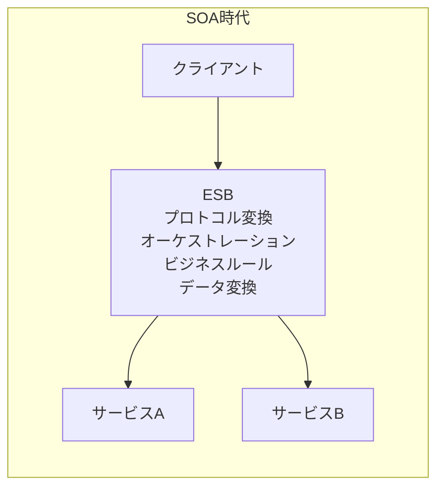
```mermaid
graph LR
    subgraph "SOA時代"
        Client1["クライアント"] --> ESB["ESB<br/>プロトコル変換<br/>オーケストレーション<br/>ビジネスルール<br/>データ変換"]
        ESB --> S1["サービスA"]
        ESB --> S2["サービスB"]
    end
```

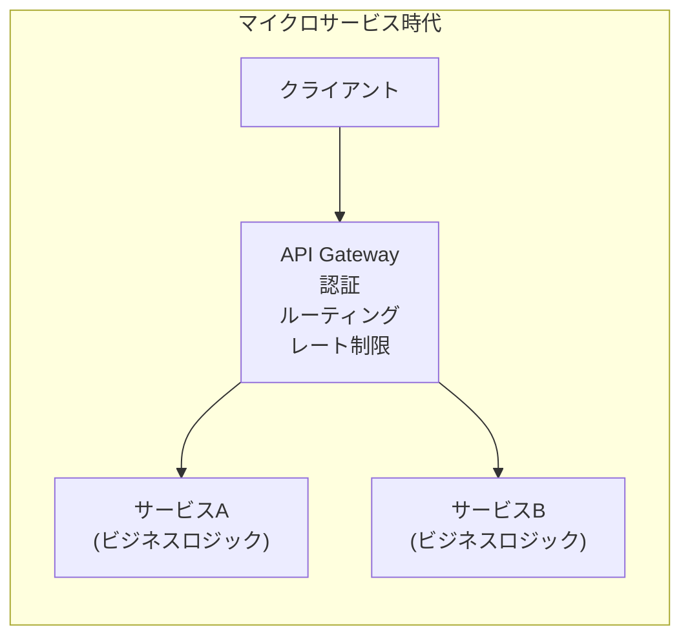
```mermaid
graph LR
    subgraph "マイクロサービス時代"
        Client2["クライアント"] --> GW["API Gateway<br/>認証<br/>ルーティング<br/>レート制限"]
        GW --> MS1["サービスA<br/>(ビジネスロジック)"]
        GW --> MS2["サービスB<br/>(ビジネスロジック)"]
    end
```

APIゲートウェイはESBの失敗から学び、インフラ層の責務を限定することで、分散システムにおけるクライアントとバックエンドの間の「薄い仲介層」としての地位を確立した。

---

## 2. APIゲートウェイの基本アーキテクチャ

### 2.1 APIゲートウェイとは何か

APIゲートウェイとは、クライアントとバックエンドサービス群の間に配置される**リバースプロキシの特化型**であり、API通信に関する横断的関心事を一元的に処理するコンポーネントである。

リバースプロキシがHTTPリクエストの転送とロードバランシングに焦点を置くのに対し、APIゲートウェイはそれに加えて認証・認可、レート制限、リクエスト/レスポンスの変換、プロトコル変換、レスポンス集約といったAPI固有の機能を提供する。

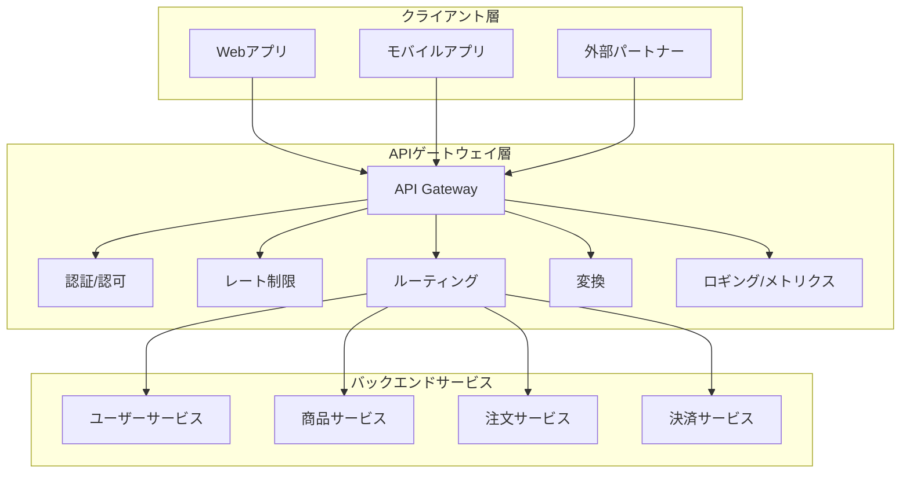
```mermaid
graph TB
    subgraph "クライアント層"
        Web["Webアプリ"]
        Mobile["モバイルアプリ"]
        ThirdParty["外部パートナー"]
    end

    subgraph "APIゲートウェイ層"
        GW["API Gateway"]
        Auth["認証/認可"]
        Rate["レート制限"]
        Route["ルーティング"]
        Transform["変換"]
        Log["ロギング/メトリクス"]
    end

    subgraph "バックエンドサービス"
        UserSvc["ユーザーサービス"]
        ProductSvc["商品サービス"]
        OrderSvc["注文サービス"]
        PaymentSvc["決済サービス"]
    end

    Web --> GW
    Mobile --> GW
    ThirdParty --> GW

    GW --> Auth
    GW --> Rate
    GW --> Route
    GW --> Transform
    GW --> Log

    Route --> UserSvc
    Route --> ProductSvc
    Route --> OrderSvc
    Route --> PaymentSvc
```

### 2.2 リクエスト処理のパイプライン

APIゲートウェイの内部構造は、一般にパイプラインパターンで設計される。受信したリクエストが一連のミドルウェア（フィルターチェーン）を通過し、各段階で異なる処理が適用される。

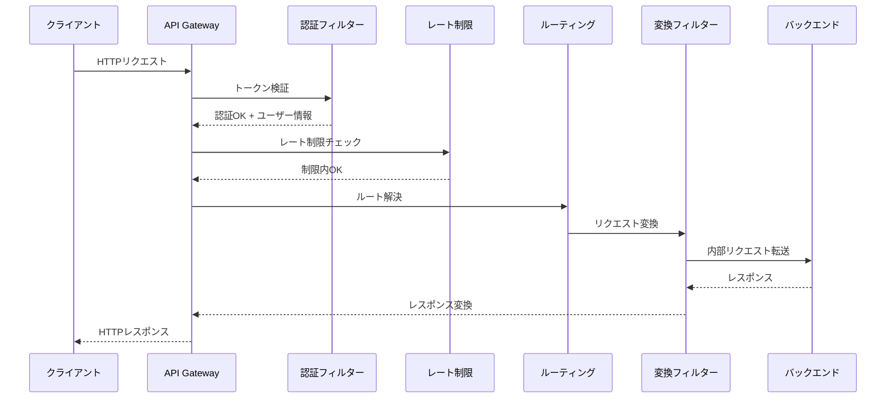
```mermaid
sequenceDiagram
    participant C as クライアント
    participant GW as API Gateway
    participant Auth as 認証フィルター
    participant RL as レート制限
    participant RT as ルーティング
    participant TF as 変換フィルター
    participant BE as バックエンド

    C->>GW: HTTPリクエスト
    GW->>Auth: トークン検証
    Auth-->>GW: 認証OK + ユーザー情報
    GW->>RL: レート制限チェック
    RL-->>GW: 制限内OK
    GW->>RT: ルート解決
    RT->>TF: リクエスト変換
    TF->>BE: 内部リクエスト転送
    BE-->>TF: レスポンス
    TF-->>GW: レスポンス変換
    GW-->>C: HTTPレスポンス
```

このパイプライン設計の利点は、各フィルターが独立しているため、機能の追加・削除が容易であることだ。新たにIPフィルタリングが必要になれば、新しいフィルターをパイプラインに挿入するだけでよい。

以下は、パイプライン処理の概念を示す擬似コードである。

```go
// Middleware represents a single step in the request pipeline.
type Middleware func(ctx *RequestContext, next func())

// Pipeline chains middlewares in order.
type Pipeline struct {
    middlewares []Middleware
}

// Execute runs the pipeline for the given request context.
func (p *Pipeline) Execute(ctx *RequestContext) {
    var index int
    var next func()
    next = func() {
        if index < len(p.middlewares) {
            current := p.middlewares[index]
            index++
            current(ctx, next)
        }
    }
    next()
}

// Example: building the gateway pipeline
func NewGatewayPipeline() *Pipeline {
    return &Pipeline{
        middlewares: []Middleware{
            LoggingMiddleware,      // Request/response logging
            CORSMiddleware,         // CORS header handling
            AuthenticationMiddleware, // Token validation
            RateLimitMiddleware,    // Rate limiting
            RoutingMiddleware,      // Backend routing
            TransformMiddleware,    // Request/response transformation
        },
    }
}
```

### 2.3 ノースサウス vs イーストウエスト

APIゲートウェイとサービスメッシュの責務の違いを理解するには、トラフィックの方向性の区別が重要である。

**ノースサウス（North-South）トラフィック**: クライアントからシステム内部への通信。外部からの入口であり、APIゲートウェイが管轄する。認証、レート制限、プロトコル変換といったエッジ機能が求められる。

**イーストウエスト（East-West）トラフィック**: 内部サービス間の通信。サービスメッシュが管轄する。mTLS、サーキットブレーカー、サービスディスカバリといった機能が求められる。

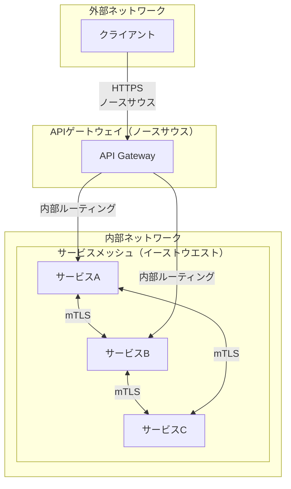
```mermaid
graph TB
    subgraph "外部ネットワーク"
        Client["クライアント"]
    end

    subgraph "APIゲートウェイ（ノースサウス）"
        GW["API Gateway"]
    end

    subgraph "内部ネットワーク"
        subgraph "サービスメッシュ（イーストウエスト）"
            SvcA["サービスA"] <-->|"mTLS"| SvcB["サービスB"]
            SvcB <-->|"mTLS"| SvcC["サービスC"]
            SvcA <-->|"mTLS"| SvcC
        end
    end

    Client -->|"HTTPS<br/>ノースサウス"| GW
    GW -->|"内部ルーティング"| SvcA
    GW -->|"内部ルーティング"| SvcB
```

この区別は概念的なものであり、実際にはEnvoyのようにAPIゲートウェイとサイドカープロキシの両方の役割を兼ねるソフトウェアも存在する。しかし設計上の責務を明確に分離しておくことで、システムの進化が容易になる。

---

## 3. 主要機能の詳細

### 3.1 認証と認可

APIゲートウェイの最も重要な機能の一つが、認証（Authentication）と認可（Authorization）の一元管理である。

#### 認証の集中化

マイクロサービスが個別に認証処理を実装すると、以下の問題が発生する。

- 認証ロジックの重複実装（言語・フレームワークごとに同じ処理を書く）
- トークン検証の一貫性を保てない
- 認証方式の変更（JWTからOpaqueトークンへ、など）が全サービスに波及する
- 認証に関するセキュリティパッチの適用が遅れるサービスが出てくる

APIゲートウェイで認証を集中管理することで、これらの問題を解消できる。バックエンドサービスはAPIゲートウェイを通過したリクエストを「すでに認証済み」として扱えるため、ビジネスロジックに集中できる。

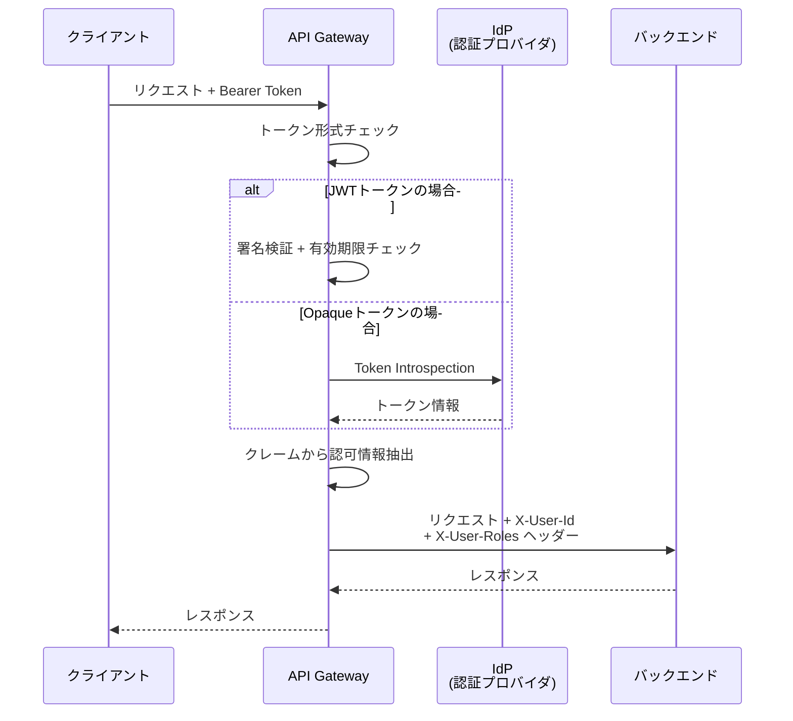
```mermaid
sequenceDiagram
    participant C as クライアント
    participant GW as API Gateway
    participant IDP as IdP<br/>(認証プロバイダ)
    participant BE as バックエンド

    C->>GW: リクエスト + Bearer Token
    GW->>GW: トークン形式チェック

    alt JWTトークンの場合
        GW->>GW: 署名検証 + 有効期限チェック
    else Opaqueトークンの場合
        GW->>IDP: Token Introspection
        IDP-->>GW: トークン情報
    end

    GW->>GW: クレームから認可情報抽出
    GW->>BE: リクエスト + X-User-Id<br/>+ X-User-Roles ヘッダー
    BE-->>GW: レスポンス
    GW-->>C: レスポンス
```

::: tip JWTとOpaqueトークンの使い分け
JWTは自己完結型であるため、APIゲートウェイが外部のIdP（Identity Provider）に問い合わせることなくトークンを検証できる。これはレイテンシの観点で有利である。一方、Opaqueトークン（ランダム文字列）は必ずIdPへの問い合わせ（Token Introspection）が必要だが、即時無効化が可能という利点がある。高頻度のAPIコールにはJWT、セキュリティ要件の高いケースにはOpaqueトークンが適している。
:::

#### 認可のパターン

APIゲートウェイにおける認可は、大きく二つのレベルに分かれる。

**粗粒度の認可（Coarse-grained Authorization）**: APIゲートウェイで処理する。「このAPIパスにアクセスできるロールか」「このスコープが含まれているか」といった判定である。リクエストのURL、HTTPメソッド、トークンのスコープ/ロール情報に基づいて判定する。

**細粒度の認可（Fine-grained Authorization）**: バックエンドサービスで処理する。「このユーザーがこの特定のリソースにアクセスできるか」「この注文は本人のものか」といったビジネスロジックに密接した判定である。

```yaml
# Example: coarse-grained authorization rules in gateway config
routes:
  - path: /api/v1/admin/**
    methods: [GET, POST, PUT, DELETE]
    required_roles: [admin]

  - path: /api/v1/orders
    methods: [POST]
    required_scopes: [orders:write]

  - path: /api/v1/orders
    methods: [GET]
    required_scopes: [orders:read]

  - path: /api/v1/public/**
    methods: [GET]
    authentication: none  # No auth required
```

::: warning 認可の責務分離に注意
APIゲートウェイにビジネスロジック依存の認可を実装してはならない。たとえば「ユーザーが自分の注文のみ閲覧可能」というルールはビジネスロジックであり、バックエンドサービスの責務である。APIゲートウェイに過度な認可ロジックを組み込むと、ESBのような「スマートパイプ」のアンチパターンに陥る。
:::

### 3.2 ルーティング

#### パスベースルーティング

最も基本的なルーティングはURLパスに基づくものである。リクエストのパスを解析し、対応するバックエンドサービスに転送する。

```
/api/v1/users/**      → user-service:8080
/api/v1/products/**   → product-service:8080
/api/v1/orders/**     → order-service:8080
/api/v1/payments/**   → payment-service:8080
```

この一見単純なマッピングの裏側には、パスの書き換え（Path Rewriting）という重要な処理が含まれる場合が多い。クライアントが `/api/v1/users/123` にリクエストを送った場合、バックエンドのuser-serviceには `/users/123` として転送する。APIバージョンのプレフィックスやゲートウェイ固有のパスをバックエンドに渡す必要はない。

```nginx
# Nginx example: path rewriting
location /api/v1/users/ {
    # Strip /api/v1 prefix before forwarding
    rewrite ^/api/v1/(.*)$ /$1 break;
    proxy_pass http://user-service:8080;
}
```

#### ヘッダーベースルーティング

HTTPヘッダーの値に基づくルーティングは、より高度なトラフィック制御を可能にする。

- **Content-Type**: `application/json` と `application/xml` で異なるバックエンドに転送
- **Accept-Language**: 言語に応じたサービスインスタンスに転送
- **カスタムヘッダー**: テナントID（`X-Tenant-Id`）に基づくマルチテナントルーティング

#### カナリアリリースとトラフィック分割

APIゲートウェイのルーティング機能は、デプロイ戦略にも活用される。新しいバージョンのサービスをデプロイする際、全トラフィックを一度に切り替えるのではなく、一部のトラフィックだけを新バージョンに流すことで、リスクを最小化できる。

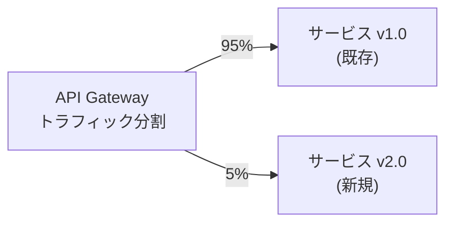
```mermaid
graph LR
    GW["API Gateway<br/>トラフィック分割"]
    V1["サービス v1.0<br/>(既存)"]
    V2["サービス v2.0<br/>(新規)"]

    GW -->|"95%"| V1
    GW -->|"5%"| V2
```

トラフィック分割の基準としては、以下のようなものがある。

- **重み付き**: 全リクエストの一定割合を新バージョンへ
- **ユーザー属性**: 特定のユーザーグループ（社内ユーザー、ベータテスターなど）のみ新バージョンへ
- **ヘッダーベース**: 特定のヘッダー（`X-Canary: true`）を含むリクエストのみ新バージョンへ

### 3.3 レート制限（Rate Limiting）

#### なぜレート制限が必要なのか

レート制限はAPIの安定性と公平性を保つための重要な仕組みである。レート制限がなければ、悪意のあるユーザーや誤って無限ループに陥ったクライアントが大量のリクエストを送信し、サービス全体を停止させる可能性がある。

レート制限が保護する対象は三つある。

- **サービスの可用性**: バックエンドサービスの処理能力を超えるリクエストを防止する
- **公平性**: 一部のクライアントがリソースを独占することを防ぐ
- **コスト管理**: クラウド環境ではリクエスト数がコストに直結するため、制御が必要

#### 主要なレート制限アルゴリズム

**トークンバケット（Token Bucket）**: バケットに一定速度でトークンが補充され、リクエストごとにトークンを消費する。バケットにトークンがなければリクエストは拒否される。バーストを許容しつつ、平均レートを制御できる最も広く使われるアルゴリズムである。

**リーキーバケット（Leaky Bucket）**: バケットに流入したリクエストが一定速度で処理される。バケットが満杯になると新しいリクエストは破棄される。処理レートが完全に一定になるため、バーストを許容しない用途に適している。

**固定ウィンドウカウンター**: 固定長の時間枠（例：1分間）でリクエスト数をカウントし、上限を超えたら拒否する。実装はシンプルだが、ウィンドウの境界でバーストが発生する問題（2つのウィンドウの境目に集中すると、短時間に上限の2倍のリクエストが通過する）がある。

**スライディングウィンドウログ**: リクエストのタイムスタンプをすべて記録し、現在時刻から一定時間遡った範囲内のリクエスト数をカウントする。精度は高いがメモリ使用量が大きい。

```go
// TokenBucket implements the token bucket rate limiting algorithm.
type TokenBucket struct {
    capacity   int       // Maximum number of tokens
    tokens     float64   // Current number of tokens
    refillRate float64   // Tokens added per second
    lastRefill time.Time // Last refill timestamp
    mu         sync.Mutex
}

// Allow checks if a request is allowed under the rate limit.
func (tb *TokenBucket) Allow() bool {
    tb.mu.Lock()
    defer tb.mu.Unlock()

    now := time.Now()
    elapsed := now.Sub(tb.lastRefill).Seconds()
    tb.tokens = math.Min(
        float64(tb.capacity),
        tb.tokens+elapsed*tb.refillRate,
    )
    tb.lastRefill = now

    if tb.tokens >= 1 {
        tb.tokens--
        return true
    }
    return false
}
```

#### レート制限のレスポンス

レート制限に達した場合、APIゲートウェイは `429 Too Many Requests` ステータスコードを返し、以下のヘッダーでクライアントに制限状態を伝える。

```
HTTP/1.1 429 Too Many Requests
X-RateLimit-Limit: 100
X-RateLimit-Remaining: 0
X-RateLimit-Reset: 1709312400
Retry-After: 30
```

::: tip 分散レート制限の課題
APIゲートウェイが複数インスタンスで動作する場合、各インスタンスが独立にレート制限を適用すると、実質的な制限値がインスタンス数倍になってしまう。これを解決するには、Redis等の外部ストアでカウンターを共有するか、ステッキーセッション（特定のクライアントを常に同じゲートウェイインスタンスに転送する）を使用する。Redisベースの集中管理がより一般的なアプローチである。
:::

### 3.4 プロトコル変換

#### REST — gRPC変換

マイクロサービスの内部通信ではgRPCが広く採用されているが、Webブラウザからの直接的なgRPC呼び出しは制約が多い。APIゲートウェイがクライアントからのREST/JSONリクエストを受け取り、内部のgRPCサービスに変換して転送するのは一般的なパターンである。

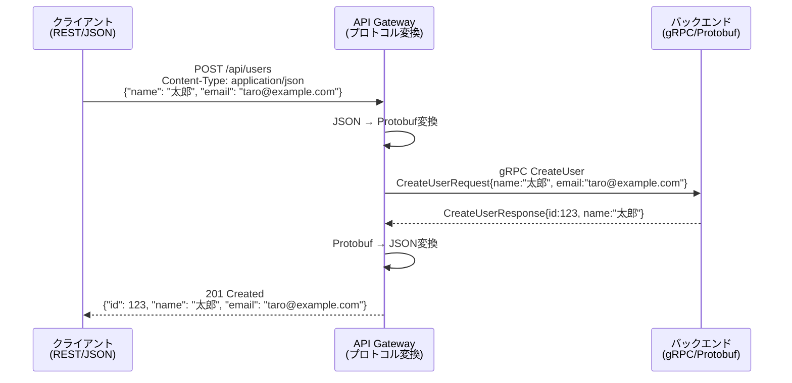
```mermaid
sequenceDiagram
    participant C as クライアント<br/>(REST/JSON)
    participant GW as API Gateway<br/>(プロトコル変換)
    participant BE as バックエンド<br/>(gRPC/Protobuf)

    C->>GW: POST /api/users<br/>Content-Type: application/json<br/>{"name": "太郎", "email": "taro@example.com"}

    GW->>GW: JSON → Protobuf変換

    GW->>BE: gRPC CreateUser<br/>CreateUserRequest{name:"太郎", email:"taro@example.com"}

    BE-->>GW: CreateUserResponse{id:123, name:"太郎"}

    GW->>GW: Protobuf → JSON変換

    GW-->>C: 201 Created<br/>{"id": 123, "name": "太郎", "email": "taro@example.com"}
```

この変換はProtocol Buffersの定義ファイル（`.proto`）とHTTPアノテーションを利用して自動化できる。Google API Designガイドで定められたHTTPマッピングが事実上の標準となっている。

```protobuf
// Proto definition with HTTP annotation for REST mapping
service UserService {
  rpc CreateUser(CreateUserRequest) returns (User) {
    option (google.api.http) = {
      post: "/api/v1/users"
      body: "*"
    };
  }

  rpc GetUser(GetUserRequest) returns (User) {
    option (google.api.http) = {
      get: "/api/v1/users/{id}"
    };
  }
}
```

#### WebSocket — HTTP変換

リアルタイム通信を必要とするクライアントに対して、APIゲートウェイがWebSocket接続を管理し、バックエンドにはHTTPベースのリクエストとして転送するケースもある。あるいはその逆に、クライアントからのHTTPロングポーリングをバックエンドのWebSocketやServer-Sent Events（SSE）に変換する場合もある。

#### GraphQL — REST変換

APIゲートウェイがGraphQLのクエリを受け取り、内部の複数のRESTサービスへのリクエストに分解するパターンも存在する。ただし、これはAPIゲートウェイの責務として適切かどうかは議論の余地がある（後述の「アンチパターン」の節を参照）。

### 3.5 レスポンス集約（API Composition）

レスポンス集約は、複数のバックエンドサービスからのレスポンスを1つにまとめてクライアントに返す機能である。これにより、クライアントが複数のAPIを呼び出すラウンドトリップを削減できる。

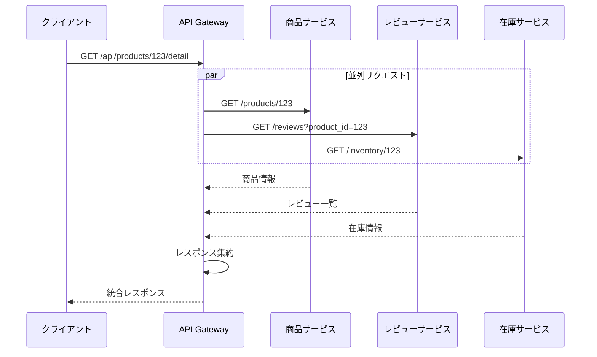
```mermaid
sequenceDiagram
    participant C as クライアント
    participant GW as API Gateway
    participant PS as 商品サービス
    participant RS as レビューサービス
    participant IS as 在庫サービス

    C->>GW: GET /api/products/123/detail

    par 並列リクエスト
        GW->>PS: GET /products/123
        GW->>RS: GET /reviews?product_id=123
        GW->>IS: GET /inventory/123
    end

    PS-->>GW: 商品情報
    RS-->>GW: レビュー一覧
    IS-->>GW: 在庫情報

    GW->>GW: レスポンス集約

    GW-->>C: 統合レスポンス
```

レスポンス集約の実装において重要なのは、**部分的な障害への対処**である。3つのサービスのうち1つが応答しなかった場合、どう振る舞うべきか。

- **全体失敗**: 1つでも失敗すればリクエスト全体を失敗させる
- **部分レスポンス**: 成功したサービスの結果のみを返し、失敗部分は空やデフォルト値で埋める
- **フォールバック**: キャッシュされた古いデータで代替する

一般的には、必須フィールド（商品情報）の取得に失敗した場合は全体を失敗とし、補足的なフィールド（レビュー）の取得に失敗した場合は部分レスポンスを返すのが妥当である。

::: warning レスポンス集約の注意点
レスポンス集約はAPIゲートウェイにビジネスロジックを持ち込むリスクがある。集約ロジックが複雑化すると、テストが困難になり、ゲートウェイの保守性が低下する。単純な結合であればゲートウェイで実装してもよいが、複雑なデータ変換やビジネスルールを含む場合は、専用のBFF（Backend for Frontend）サービスとして切り出すべきである。
:::

### 3.6 リクエスト/レスポンス変換

APIゲートウェイは、リクエストやレスポンスのヘッダー操作やボディの変換を行う。

**ヘッダーの操作**:

```
# Add internal headers
X-Request-Id: <generated-uuid>
X-Forwarded-For: <client-ip>
X-User-Id: <extracted-from-token>
X-User-Roles: <extracted-from-token>

# Remove sensitive headers before forwarding to backend
Remove: Authorization (after validation)
Remove: Cookie (if not needed by backend)

# Remove internal headers before returning to client
Remove: X-Internal-Trace-Id
Remove: X-Backend-Version
```

**ボディの変換**: APIバージョン間の互換性を維持するために、リクエストやレスポンスのフィールド名やデータ構造を変換する場合がある。ただし、複雑な変換はゲートウェイの責務を超えるため、最小限に留めるべきである。

### 3.7 キャッシング

APIゲートウェイは、バックエンドへのリクエストを削減するためにレスポンスキャッシュを持つことがある。特に、頻繁にアクセスされるが更新頻度の低いデータ（商品カタログ、設定情報など）のキャッシングは効果が大きい。

キャッシュ戦略は標準的なHTTPキャッシュのセマンティクス（`Cache-Control`、`ETag`、`Last-Modified`）に従うのが望ましい。独自のキャッシュ無効化メカニズムを構築すると複雑性が増すため、可能な限り標準に準拠する。

### 3.8 可観測性

APIゲートウェイはすべてのリクエストが通過するため、可観測性（Observability）の理想的な計装ポイントとなる。

**メトリクス**: リクエスト数、レイテンシ分布、エラー率、ステータスコード分布。RED（Rate, Errors, Duration）メトリクスの計測はここで行うのが最適である。

**ログ**: アクセスログ、エラーログ。リクエストID、ユーザーID、レスポンスタイム、ステータスコードを含む構造化ログが望ましい。

**分散トレーシング**: APIゲートウェイでトレースIDを生成（または伝播）し、リクエストヘッダー（`X-Request-Id` や W3C Trace Context の `traceparent`）としてバックエンドに伝える。これにより、リクエストのライフサイクル全体を追跡できる。

---

## 4. 代表的な実装

### 4.1 Kong

Kongは、2015年にMashapeがオープンソースとしてリリースしたAPIゲートウェイである。OpenResty（Nginx + LuaJIT）の上に構築されており、Nginxのパフォーマンスと安定性を基盤としつつ、プラグインアーキテクチャによる拡張性を提供する。

**アーキテクチャ**:

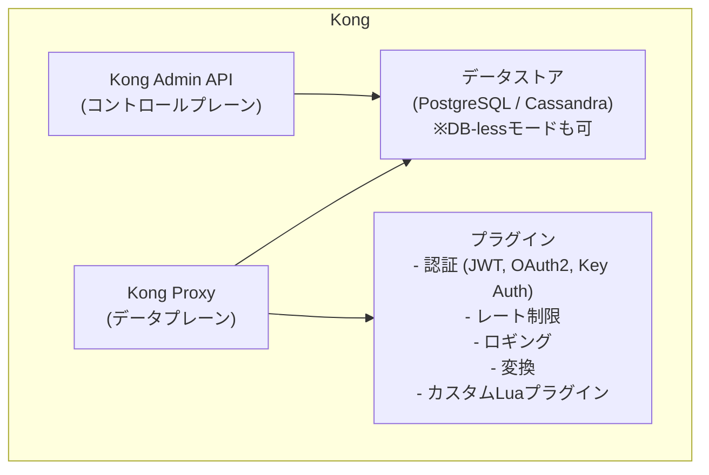
```mermaid
graph TB
    subgraph "Kong"
        KongProxy["Kong Proxy<br/>(データプレーン)"]
        KongAdmin["Kong Admin API<br/>(コントロールプレーン)"]
        Plugins["プラグイン<br/>- 認証 (JWT, OAuth2, Key Auth)<br/>- レート制限<br/>- ロギング<br/>- 変換<br/>- カスタムLuaプラグイン"]
        DB["データストア<br/>(PostgreSQL / Cassandra)<br/>※DB-lessモードも可"]
    end

    KongAdmin --> DB
    KongProxy --> Plugins
    KongProxy --> DB
```

**特徴**:

| 項目 | 説明 |
|------|------|
| 基盤技術 | OpenResty（Nginx + LuaJIT） |
| プラグイン数 | 100以上（OSS + Enterprise） |
| 設定方式 | Admin API、宣言的YAMLファイル（DB-lessモード） |
| デプロイ形態 | セルフホスト、Kubernetes Ingress Controller、マネージドサービス（Konnect） |
| プロトコルサポート | HTTP/HTTPS、gRPC、WebSocket、TCP/TLS |

Kongの強みは豊富なプラグインエコシステムにある。認証（JWT、OAuth 2.0、LDAP、mTLS）、セキュリティ（IP制限、Bot検知）、トラフィック制御（レート制限、リクエストサイズ制限）、可観測性（Prometheus、Datadog、OpenTelemetry）など、多彩な機能をプラグインの有効化だけで利用できる。

```yaml
# Kong declarative config example (DB-less mode)
_format_version: "3.0"

services:
  - name: user-service
    url: http://user-service:8080
    routes:
      - name: user-route
        paths:
          - /api/v1/users
        strip_path: true
    plugins:
      - name: jwt  # Enable JWT authentication
      - name: rate-limiting
        config:
          minute: 100
          policy: redis
          redis_host: redis
      - name: prometheus  # Enable metrics
```

### 4.2 AWS API Gateway

AWS API Gatewayは、AWSが提供するフルマネージドのAPIゲートウェイサービスである。インフラの管理が不要であり、従量課金で利用できる。

**3つのタイプ**:

| タイプ | 用途 | プロトコル | 特徴 |
|--------|------|-----------|------|
| REST API | 全機能のREST API | HTTP/HTTPS | 最も機能が豊富。リクエスト検証、WAF統合、キャッシング |
| HTTP API | シンプルなAPI | HTTP/HTTPS | REST APIより低コスト・低レイテンシ。機能は限定的 |
| WebSocket API | リアルタイム通信 | WebSocket | 双方向通信。チャット、ダッシュボード向け |

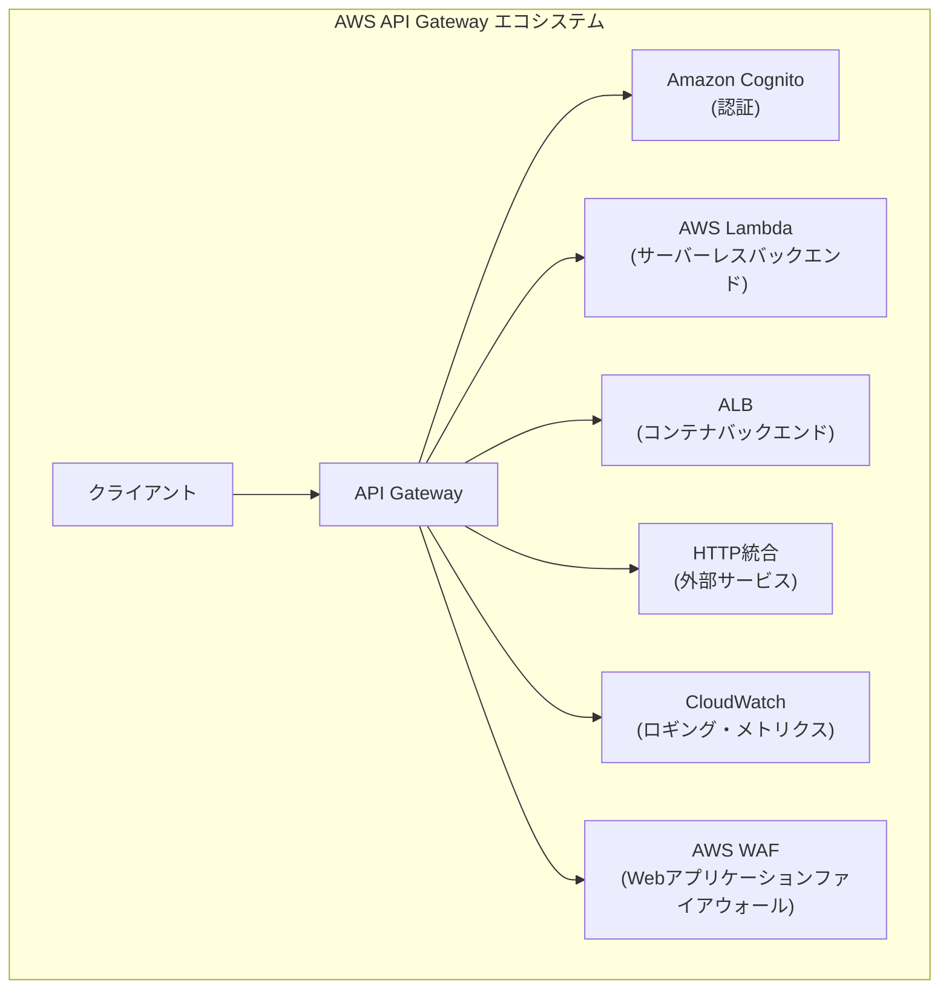
```mermaid
graph TB
    subgraph "AWS API Gateway エコシステム"
        Client["クライアント"] --> APIGW["API Gateway"]
        APIGW --> Cognito["Amazon Cognito<br/>(認証)"]
        APIGW --> Lambda["AWS Lambda<br/>(サーバーレスバックエンド)"]
        APIGW --> ALB["ALB<br/>(コンテナバックエンド)"]
        APIGW --> HTTP["HTTP統合<br/>(外部サービス)"]
        APIGW --> CW["CloudWatch<br/>(ロギング・メトリクス)"]
        APIGW --> WAF["AWS WAF<br/>(Webアプリケーションファイアウォール)"]
    end
```

AWS API Gatewayの大きな特徴は、**AWSエコシステムとの深い統合**である。Amazon Cognitoによる認証、AWS Lambdaとの直接統合（サーバーレスバックエンド）、AWS WAFによるセキュリティ、CloudWatchによる監視が、最小限の設定で利用できる。

一方で、制約もある。リクエスト/レスポンスのペイロードサイズ上限（10MB）、統合タイムアウト（29秒）、カスタムドメインの制限など、大規模なAPIや長時間処理には適さないケースがある。また、AWS固有のサービスであるため、マルチクラウドやオンプレミス環境への移植性はない。

### 4.3 Envoy（エッジプロキシとして）

Envoyは2016年にLyftが公開したL7プロキシであり、サービスメッシュのデータプレーンとして広く知られるが、APIゲートウェイ（エッジプロキシ）としても利用できる。

Envoyの特徴はxDS API（動的ディスカバリサービス）による設定の動的更新である。コントロールプレーンからリスナー、ルート、クラスター（バックエンド）の設定を動的に配信でき、再起動なしに設定変更を反映できる。

```yaml
# Envoy configuration example for edge proxy
static_resources:
  listeners:
    - name: edge_listener
      address:
        socket_address:
          address: 0.0.0.0
          port_value: 8443
      filter_chains:
        - filters:
            - name: envoy.filters.network.http_connection_manager
              typed_config:
                "@type": type.googleapis.com/envoy.extensions.filters.network.http_connection_manager.v3.HttpConnectionManager
                stat_prefix: edge
                http_filters:
                  # JWT authentication filter
                  - name: envoy.filters.http.jwt_authn
                    typed_config:
                      "@type": type.googleapis.com/envoy.extensions.filters.http.jwt_authn.v3.JwtAuthentication
                      providers:
                        auth0:
                          issuer: "https://example.auth0.com/"
                          audiences: ["api.example.com"]
                          remote_jwks:
                            http_uri:
                              uri: "https://example.auth0.com/.well-known/jwks.json"
                              cluster: auth0
                              timeout: 5s
                  # Rate limit filter
                  - name: envoy.filters.http.ratelimit
                    typed_config:
                      "@type": type.googleapis.com/envoy.extensions.filters.http.ratelimit.v3.RateLimit
                      domain: edge
                      rate_limit_service:
                        grpc_service:
                          envoy_grpc:
                            cluster_name: rate_limit_service
                  # Router
                  - name: envoy.filters.http.router
                    typed_config:
                      "@type": type.googleapis.com/envoy.extensions.filters.http.router.v3.Router
                route_config:
                  name: local_route
                  virtual_hosts:
                    - name: api
                      domains: ["api.example.com"]
                      routes:
                        - match:
                            prefix: "/api/v1/users"
                          route:
                            cluster: user_service
                        - match:
                            prefix: "/api/v1/orders"
                          route:
                            cluster: order_service
```

Envoy自体はAPIゲートウェイとしての「ビルトイン」機能（管理UI、開発者ポータルなど）は持たないが、Envoyを基盤としたAPIゲートウェイ製品として**Gloo Edge**や**Ambassador（Emissary-Ingress）**が存在する。

### 4.4 実装の比較

| 特性 | Kong | AWS API Gateway | Envoy（エッジ） |
|------|------|-----------------|----------------|
| デプロイ形態 | セルフホスト / マネージド | マネージドのみ | セルフホストのみ |
| 設定方式 | Admin API / YAML | AWS Console / CloudFormation / CDK | YAML / xDS API |
| プラグイン拡張 | Lua / Go | Lambda Authorizer | C++ / Wasm / Lua |
| gRPCサポート | あり | REST API型では制限あり | ネイティブサポート |
| 学習コスト | 中 | 低（AWS利用者） | 高 |
| 運用コスト | 中〜高 | 低（マネージド） | 高 |
| カスタマイズ性 | 高 | 中 | 非常に高 |
| ベンダーロックイン | なし | あり（AWS） | なし |

---

## 5. BFF（Backend for Frontend）パターンとの関係

### 5.1 BFFパターンとは

BFF（Backend for Frontend）パターンは、クライアントの種類ごとに専用のバックエンドサービスを用意するアーキテクチャパターンである。Sam Newmanが2015年に体系化した概念であり、SoundCloudの実践に基づいている。

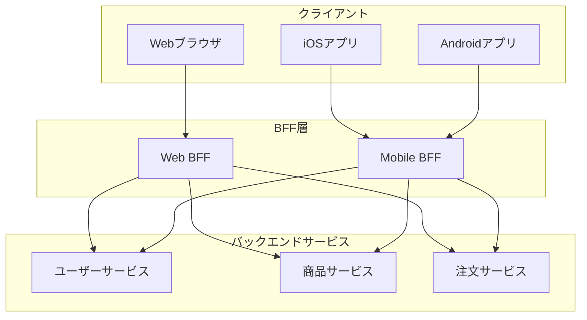
```mermaid
graph TB
    subgraph "クライアント"
        Web["Webブラウザ"]
        iOS["iOSアプリ"]
        Android["Androidアプリ"]
    end

    subgraph "BFF層"
        WebBFF["Web BFF"]
        MobileBFF["Mobile BFF"]
    end

    subgraph "バックエンドサービス"
        UserSvc["ユーザーサービス"]
        ProductSvc["商品サービス"]
        OrderSvc["注文サービス"]
    end

    Web --> WebBFF
    iOS --> MobileBFF
    Android --> MobileBFF

    WebBFF --> UserSvc
    WebBFF --> ProductSvc
    WebBFF --> OrderSvc
    MobileBFF --> UserSvc
    MobileBFF --> ProductSvc
    MobileBFF --> OrderSvc
```

BFFが必要とされる理由は、クライアントの種類によってAPIに求められる要件が大きく異なるためである。

**Webブラウザ**: 高速なネットワーク接続を前提にでき、大量のデータを一度に取得しても問題ない。デスクトップ画面は情報量が多いため、幅広いデータが必要。

**モバイルアプリ**: ネットワーク帯域が限られ、バッテリー消費の制約がある。画面が小さいため、必要なデータも限定的。レスポンスサイズの最小化とリクエスト回数の削減が重要。

**IoTデバイス**: 極めて限定的な計算リソースとネットワーク帯域。最小限のペイロードと効率的なプロトコル（MQTT、CoAPなど）が求められる。

### 5.2 APIゲートウェイとBFFの違い

APIゲートウェイとBFFは補完的な関係にあり、排他的なものではない。

| 観点 | APIゲートウェイ | BFF |
|------|---------------|-----|
| 責務 | 横断的関心事（認証、レート制限、ルーティング） | クライアント固有のAPI設計とデータ集約 |
| ビジネスロジック | 含めない | クライアントに特化したロジックを含む |
| 数 | 通常1つ（または少数） | クライアント種類ごとに1つ |
| 所有チーム | プラットフォームチーム | フロントエンドチーム |
| 変更頻度 | 低い（インフラ層） | 高い（UI要件に連動） |

### 5.3 APIゲートウェイとBFFの組み合わせ

実務では、APIゲートウェイとBFFを組み合わせるのが一般的である。APIゲートウェイが横断的関心事を処理した後、クライアント種類に応じたBFFにルーティングする。

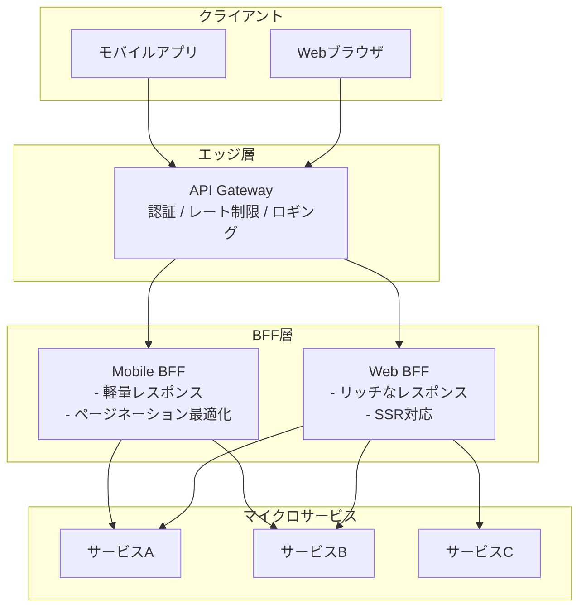
```mermaid
graph TB
    subgraph "クライアント"
        Web["Webブラウザ"]
        Mobile["モバイルアプリ"]
    end

    subgraph "エッジ層"
        GW["API Gateway<br/>認証 / レート制限 / ロギング"]
    end

    subgraph "BFF層"
        WebBFF["Web BFF<br/>- リッチなレスポンス<br/>- SSR対応"]
        MobileBFF["Mobile BFF<br/>- 軽量レスポンス<br/>- ページネーション最適化"]
    end

    subgraph "マイクロサービス"
        SvcA["サービスA"]
        SvcB["サービスB"]
        SvcC["サービスC"]
    end

    Web --> GW
    Mobile --> GW
    GW --> WebBFF
    GW --> MobileBFF
    WebBFF --> SvcA
    WebBFF --> SvcB
    WebBFF --> SvcC
    MobileBFF --> SvcA
    MobileBFF --> SvcB
```

この構成により、APIゲートウェイは薄いインフラ層として安定し、BFFがクライアント固有の要件を吸収する。フロントエンドチームはBFFを自律的に開発・デプロイできるため、バックエンドチームとの調整コストが削減される。

---

## 6. 設計パターン

### 6.1 単一エントリポイントパターン

最もシンプルなパターンであり、すべてのクライアントからのリクエストが1つのAPIゲートウェイを通過する。

**利点**:
- 運用が単純
- 横断的関心事の管理が容易
- SSL/TLS終端を1箇所に集約

**欠点**:
- ゲートウェイが単一障害点になりうる
- すべてのトラフィックがボトルネックになりうる
- 異なるクライアント要件に対応しにくい

### 6.2 マルチゲートウェイパターン

用途やクライアント種別ごとに異なるAPIゲートウェイを配置するパターンである。

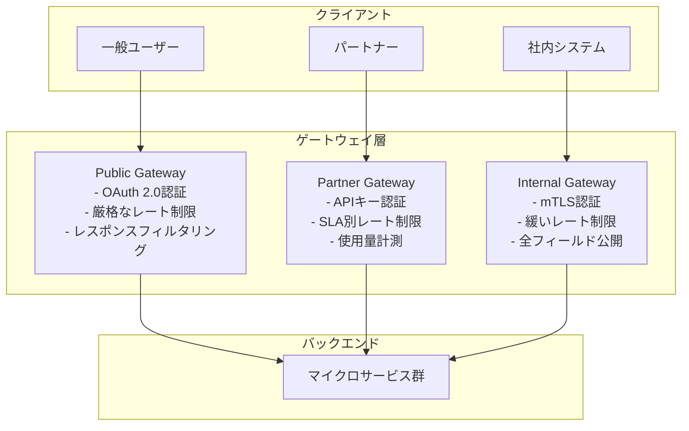
```mermaid
graph TB
    subgraph "クライアント"
        Public["一般ユーザー"]
        Partner["パートナー"]
        Internal["社内システム"]
    end

    subgraph "ゲートウェイ層"
        PublicGW["Public Gateway<br/>- OAuth 2.0認証<br/>- 厳格なレート制限<br/>- レスポンスフィルタリング"]
        PartnerGW["Partner Gateway<br/>- APIキー認証<br/>- SLA別レート制限<br/>- 使用量計測"]
        InternalGW["Internal Gateway<br/>- mTLS認証<br/>- 緩いレート制限<br/>- 全フィールド公開"]
    end

    subgraph "バックエンド"
        Services["マイクロサービス群"]
    end

    Public --> PublicGW
    Partner --> PartnerGW
    Internal --> InternalGW
    PublicGW --> Services
    PartnerGW --> Services
    InternalGW --> Services
```

このパターンは、異なるセキュリティ要件やSLA（Service Level Agreement）を持つクライアント群を扱う場合に有効である。パブリックAPIは厳格なレート制限とレスポンスフィルタリングを適用し、パートナーAPIは契約に応じた制限を設定し、社内APIはより寛容な設定にする、といった使い分けができる。

### 6.3 フェデレーテッドゲートウェイパターン

大規模な組織では、各チームが自分たちのサービスのAPI定義を所有し、それらを統合するフェデレーテッド（連合型）ゲートウェイが採用されることがある。Apollo Federationがこのパターンの代表例であり、複数のGraphQLサブグラフを1つの統合スキーマに結合する。

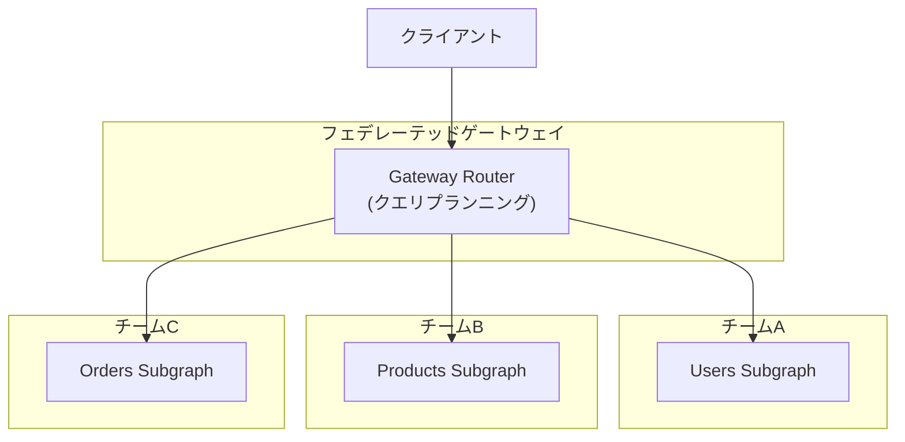
```mermaid
graph TB
    Client["クライアント"]

    subgraph "フェデレーテッドゲートウェイ"
        Router["Gateway Router<br/>(クエリプランニング)"]
    end

    subgraph "チームA"
        SubA["Users Subgraph"]
    end

    subgraph "チームB"
        SubB["Products Subgraph"]
    end

    subgraph "チームC"
        SubC["Orders Subgraph"]
    end

    Client --> Router
    Router --> SubA
    Router --> SubB
    Router --> SubC
```

このパターンでは、各チームが自分たちのサブグラフ（サービスのAPI定義）を独立して開発・デプロイできる。ゲートウェイは各サブグラフのスキーマを動的に統合し、クライアントには統一されたAPIを提供する。

### 6.4 段階的マイグレーションパターン（Strangler Fig）

モノリスからマイクロサービスへの段階的な移行において、APIゲートウェイは**Strangler Figパターン**の要として機能する。Martin Fowlerが提唱したこのパターンでは、モノリスの前にAPIゲートウェイを設置し、段階的にトラフィックをマイクロサービスに移行する。

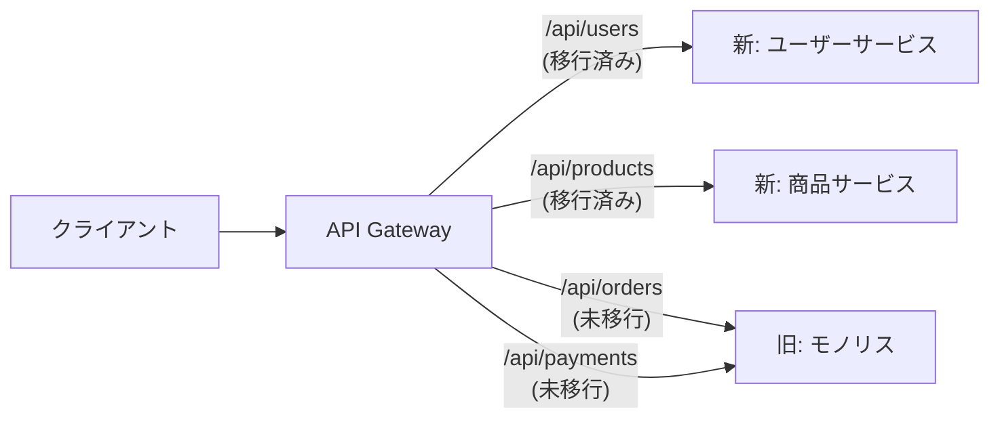
```mermaid
graph LR
    Client["クライアント"] --> GW["API Gateway"]
    GW -->|"/api/users<br/>(移行済み)"| NewSvc["新: ユーザーサービス"]
    GW -->|"/api/products<br/>(移行済み)"| NewSvc2["新: 商品サービス"]
    GW -->|"/api/orders<br/>(未移行)"| Monolith["旧: モノリス"]
    GW -->|"/api/payments<br/>(未移行)"| Monolith
```

移行が進むにつれ、モノリスへのルーティングが減少し、最終的にはすべてのトラフィックがマイクロサービスに流れるようになる。APIゲートウェイがファサードとして機能するため、クライアントは移行の過程を意識する必要がない。

---

## 7. アンチパターン

### 7.1 ゲートウェイにビジネスロジックを組み込む

最も一般的で危険なアンチパターンである。APIゲートウェイにビジネスロジック（価格計算、在庫チェック、ワークフロー制御など）を組み込んでしまうと、ESBの失敗を繰り返すことになる。

::: danger このアンチパターンの兆候
- ゲートウェイの設定ファイルにif文やswitch文が大量にある
- ゲートウェイのデプロイがビジネス要件の変更で頻繁に必要になる
- ゲートウェイの変更にバックエンドチームのレビューが必要
- ゲートウェイのテストにビジネスシナリオが含まれる
:::

ゲートウェイの責務は横断的関心事に限定すべきである。ビジネスロジックが必要な場合は、BFFやオーケストレーションサービスとして別コンポーネントに切り出す。

### 7.2 単一障害点化

APIゲートウェイがすべてのリクエストを通過する唯一の経路であるため、ゲートウェイの障害はシステム全体の停止を意味する。

対策として以下が必要である。

- 複数インスタンスによる冗長化
- ヘルスチェックとオートスケーリング
- サーキットブレーカーによるバックエンド障害の隔離
- フェイルオーバー機構の整備

### 7.3 過度なレスポンス集約

APIゲートウェイで多数のバックエンドサービスの結果を複雑に組み合わせて返す実装は、以下の問題を引き起こす。

- ゲートウェイの応答時間が最も遅いバックエンドに律速される
- 部分障害時の挙動が複雑になる
- ゲートウェイのメモリ使用量が増大する
- テストとデバッグが困難になる

2〜3サービスの単純な結合であれば許容されるが、それ以上になる場合はBFFやAPI Compositionサービスとして分離する。

### 7.4 ゲートウェイのモノリス化

APIゲートウェイ自体が巨大で複雑な設定を持つモノリスと化すケースがある。数百ものルーティングルール、カスタムプラグイン、複雑な変換ロジックが1つのゲートウェイに詰め込まれると、変更のリスクが増大し、デプロイが困難になる。

対策として、ドメインごとにゲートウェイを分割する（マルチゲートウェイパターン）か、設定をモジュール化してチームごとに管理する方法がある。

### 7.5 不適切なキャッシュ戦略

APIゲートウェイでのキャッシュは強力だが、不適切な実装は深刻な問題を引き起こす。

- **認証済みレスポンスのキャッシュ**: ユーザーAのデータがユーザーBに返される重大なセキュリティ問題
- **キャッシュキーの不適切な設計**: クエリパラメータやヘッダーを考慮しないキャッシュキーにより、間違ったレスポンスが返される
- **キャッシュの無効化漏れ**: データが更新されても古いキャッシュが返され続ける

```yaml
# Bad: caching without considering user context
cache:
  key: "${request.path}"  # Missing user context!
  ttl: 3600

# Better: user-aware cache key
cache:
  key: "${request.path}:${request.header.Authorization}"
  ttl: 300
  bypass_conditions:
    - "${request.method} != GET"
    - "${response.header.Cache-Control} == no-store"
```

---

## 8. 運用上の考慮事項

### 8.1 高可用性の設計

APIゲートウェイはシステムの入口であるため、高可用性の設計が不可欠である。

**水平スケーリング**: ステートレスに設計されたAPIゲートウェイは、ロードバランサー（L4）の背後に複数インスタンスを配置することで水平にスケールできる。レート制限のカウンターやセッション情報はRedis等の外部ストアで管理する。

```
[クライアント]
      |
[L4ロードバランサー (NLB)]
      |
  ┌───┼───┐
  ↓   ↓   ↓
[GW1][GW2][GW3]  ← ステートレスなGWインスタンス
  |   |   |
  └───┼───┘
      ↓
[Redis]  ← 共有ステート（レート制限カウンター等）
```

**ヘルスチェック**: ゲートウェイ自体のヘルスチェックエンドポイントを提供し、ロードバランサーが異常なインスタンスを自動的に除外できるようにする。ヘルスチェックには、バックエンドサービスへの接続性も含めた深いチェック（deep health check）が有効な場合がある。

### 8.2 セキュリティの考慮

APIゲートウェイはシステムの外部境界に位置するため、セキュリティの最前線である。

- **TLS終端**: クライアントとの通信はTLS 1.3を使用し、ゲートウェイでTLSを終端する。バックエンドとの通信は内部ネットワーク内であれば平文でもよいが、ゼロトラストモデルを採用する場合はmTLSを使用する。
- **入力検証**: リクエストサイズの上限、ヘッダー数の上限、URLの長さの上限を設定し、異常なリクエストを早期に拒否する。
- **CORS**: Cross-Origin Resource Sharingのポリシーをゲートウェイで一元管理する。
- **IPフィルタリング**: 既知の悪意あるIPアドレスからのリクエストをゲートウェイで遮断する。
- **WAF連携**: SQLインジェクション、XSS、CSRFなどの攻撃をWAF（Web Application Firewall）で検出・遮断する。

### 8.3 設定管理

APIゲートウェイの設定はInfrastructure as Code（IaC）として管理するのが望ましい。宣言的な設定ファイル（YAML、JSON）をバージョン管理し、CI/CDパイプラインで自動デプロイする。

```yaml
# GitOps workflow for gateway configuration
# gateway-config/routes/user-service.yaml

apiVersion: gateway/v1
kind: Route
metadata:
  name: user-service-routes
  labels:
    team: user-platform
spec:
  rules:
    - match:
        path: /api/v1/users
        methods: [GET, POST]
      backend:
        service: user-service
        port: 8080
      plugins:
        - name: jwt-auth
          config:
            issuer: "https://auth.example.com"
        - name: rate-limit
          config:
            requests_per_minute: 100
```

::: tip 設定変更のテスト
APIゲートウェイの設定変更は、直接本番環境に適用するのではなく、ステージング環境でのテストを経てからデプロイする。特にルーティングルールの変更は、意図しないトラフィックの転送先変更やセキュリティポリシーの穴を生む可能性があるため、設定変更に対する自動テスト（ルーティングの正当性チェック、認証ポリシーの検証など）を整備することが重要である。
:::

### 8.4 パフォーマンスチューニング

APIゲートウェイはすべてのリクエストの経路上にあるため、ここでのレイテンシはシステム全体に影響する。

**コネクションプーリング**: バックエンドへのTCP接続を使い回すことで、コネクション確立のオーバーヘッドを削減する。HTTP/2のコネクション多重化も有効である。

**タイムアウト設定**: リクエストタイムアウト、コネクションタイムアウト、アイドルタイムアウトを適切に設定する。タイムアウトが長すぎるとリソースを占有し、短すぎると正常なリクエストが失敗する。

```
接続タイムアウト:    3秒（バックエンドへのTCP接続確立）
リクエストタイムアウト: 30秒（バックエンドからのレスポンス待ち）
アイドルタイムアウト:  60秒（アイドル接続の維持時間）
```

**バッファリング**: リクエストボディとレスポンスボディのバッファリング戦略を適切に設定する。大きなファイルアップロードの場合、ストリーミングモード（バッファリングなし）が望ましい。

---

## 9. Kubernetes環境でのAPIゲートウェイ

### 9.1 Ingress Controller

Kubernetes環境では、APIゲートウェイの機能はIngress Controllerとして実装されることが多い。Ingress Controllerは、Kubernetesの`Ingress`リソースの定義に基づいて外部トラフィックをクラスタ内のServiceにルーティングする。

```yaml
# Kubernetes Ingress resource example
apiVersion: networking.k8s.io/v1
kind: Ingress
metadata:
  name: api-ingress
  annotations:
    # Nginx Ingress Controller specific
    nginx.ingress.kubernetes.io/rewrite-target: /$2
    nginx.ingress.kubernetes.io/rate-limit-rps: "10"
spec:
  tls:
    - hosts:
        - api.example.com
      secretName: api-tls-secret
  rules:
    - host: api.example.com
      http:
        paths:
          - path: /api/v1/users(/|$)(.*)
            pathType: ImplementationSpecific
            backend:
              service:
                name: user-service
                port:
                  number: 8080
          - path: /api/v1/orders(/|$)(.*)
            pathType: ImplementationSpecific
            backend:
              service:
                name: order-service
                port:
                  number: 8080
```

### 9.2 Gateway API

Kubernetes Gateway APIは、Ingressの後継として設計された、より表現力の高いAPI仕様である。Ingressの制約（パスベースの単純なルーティングのみ、ヘッダーベースルーティングの標準化不足、認証機能の欠如など）を解消し、ロールベースの設定分離を実現している。

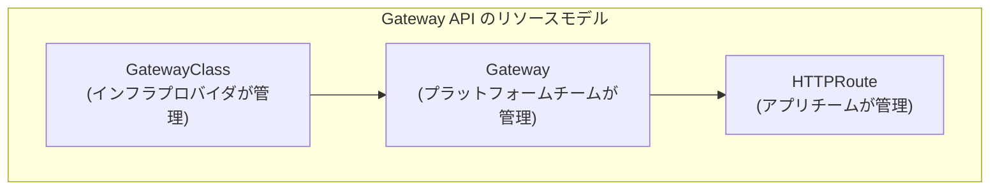
```mermaid
graph TB
    subgraph "Gateway API のリソースモデル"
        GC["GatewayClass<br/>(インフラプロバイダが管理)"]
        G["Gateway<br/>(プラットフォームチームが管理)"]
        HR["HTTPRoute<br/>(アプリチームが管理)"]
    end

    GC --> G
    G --> HR
```

Gateway APIの重要な設計原則は、**ロールベースの責務分離**である。

- **GatewayClass**: インフラプロバイダ（クラウドベンダー、プラットフォームチーム）が定義する。使用するコントローラーの種類を指定する。
- **Gateway**: プラットフォームチームが管理する。リスナー（ポート、プロトコル、TLS設定）を定義する。
- **HTTPRoute**: アプリケーションチームが管理する。具体的なルーティングルールを定義する。

```yaml
# Gateway API example
apiVersion: gateway.networking.k8s.io/v1
kind: Gateway
metadata:
  name: api-gateway
spec:
  gatewayClassName: envoy
  listeners:
    - name: https
      protocol: HTTPS
      port: 443
      tls:
        certificateRefs:
          - name: api-tls-cert
---
apiVersion: gateway.networking.k8s.io/v1
kind: HTTPRoute
metadata:
  name: user-service-route
spec:
  parentRefs:
    - name: api-gateway
  hostnames:
    - "api.example.com"
  rules:
    - matches:
        - path:
            type: PathPrefix
            value: /api/v1/users
      backendRefs:
        - name: user-service
          port: 8080
          weight: 90
        - name: user-service-canary
          port: 8080
          weight: 10  # 10% canary traffic
```

Gateway APIは、ヘッダーベースのルーティング、トラフィック分割（カナリアリリース）、リクエストミラーリングといった機能を標準仕様として定義しており、Ingress Controllerのアノテーション乱立問題を解消する。

---

## 10. APIゲートウェイの選定基準

### 10.1 選定時の判断軸

APIゲートウェイの選定は、以下の判断軸に基づいて行う。

**1. 運用モデル**: セルフホストで運用する体制があるか、マネージドサービスを利用したいか。セルフホストはカスタマイズ性が高いが運用コストがかかる。マネージドは運用が楽だがベンダーロックインのリスクがある。

**2. プロトコル要件**: REST/JSONのみで十分か、gRPC、WebSocket、GraphQLのサポートが必要か。

**3. 拡張性**: 標準プラグインで要件を満たせるか、カスタムロジックの実装が必要か。カスタムロジックが必要な場合、そのためのプラグインSDKや拡張メカニズムが充実しているか。

**4. エコシステム**: 既存のインフラ（Kubernetes、特定のクラウドプロバイダ、監視ツール）との統合が容易か。

**5. パフォーマンス要件**: レイテンシの追加が許容範囲か。高スループットが求められるか。

**6. チームのスキルセット**: 運用・カスタマイズに必要な技術（Lua、Go、C++、Wasmなど）にチームが習熟しているか。

### 10.2 典型的な選択パターン

**スタートアップ・小規模チーム**: AWS API Gateway（HTTP API）やCloudflare API Gatewayのようなマネージドサービスが適している。運用コストを最小限に抑え、プロダクト開発に集中できる。

**中規模組織・Kubernetes運用**: KongやNginx Ingress Controllerが適している。十分な機能を持ちつつ、エコシステムが充実しており、学習リソースも豊富である。

**大規模組織・高度な要件**: EnvoyベースのソリューションやKong Enterprise、あるいは独自のゲートウェイ構築が選択肢になる。トラフィック量、カスタマイズ要件、マルチクラウド対応など、組織固有の要件に対応できる。

---

## 11. まとめと今後の展望

### 11.1 APIゲートウェイの本質

APIゲートウェイの本質は、**クライアントとバックエンドサービスの間の関心事を分離するアーキテクチャパターン**である。モノリスからマイクロサービスへの移行によって生じた「クライアントが複数のサービスと直接通信する複雑性」を、単一のエントリポイントで吸収する。

重要なのは、APIゲートウェイは万能ではなく、その責務を明確に限定すべきだということである。横断的関心事（認証、レート制限、ルーティング、ログ、メトリクス）はゲートウェイの責務だが、ビジネスロジックやクライアント固有のデータ集約はBFFやバックエンドサービスの責務として分離する。この境界を守れるかどうかが、APIゲートウェイの運用が成功するか否かの分水嶺である。

### 11.2 今後の動向

**Gateway API の標準化**: KubernetesのGateway APIがIngressを置き換えつつあり、APIゲートウェイの設定方法が標準化される方向に進んでいる。これにより、ゲートウェイ製品間の移行が容易になることが期待される。

**WebAssembly（Wasm）によるプラグイン拡張**: EnvoyやKongなどのゲートウェイがWasmによるプラグイン実行をサポートし始めている。WasmはLuaやC++に比べて安全性が高く、複数の言語で開発できるため、プラグイン開発の敷居が下がる。

**eBPFによるネットワーク処理の効率化**: Ciliumに代表されるeBPFベースのネットワーキングは、カーネルレベルでのパケット処理により、従来のユーザースペースプロキシよりも高いパフォーマンスを実現する。将来的にはAPIゲートウェイの一部機能がeBPFで実装される可能性がある。

**AIを活用した異常検知とポリシー適用**: トラフィックパターンの異常検知、自動的なレート制限の調整、不正リクエストの検出にAI/MLを活用するアプローチが登場しつつある。従来のルールベースでは対応が困難な、巧妙なAPI悪用の検知が可能になると期待される。

**GraphQL Federationの普及**: マイクロサービスごとにGraphQLサブグラフを定義し、フェデレーテッドゲートウェイで統合するパターンが、RESTベースのAPIゲートウェイに代わるアプローチとして注目を集めている。

APIゲートウェイは、マイクロサービスアーキテクチャにおけるインフラの根幹を成すコンポーネントである。その設計と運用にはESB時代の教訓を活かし、「薄く保つ」ことを常に意識することが重要である。ビジネスロジックの肥大化を避け、横断的関心事に責務を限定することで、APIゲートウェイはシステムの進化を支える安定した基盤として機能し続ける。
