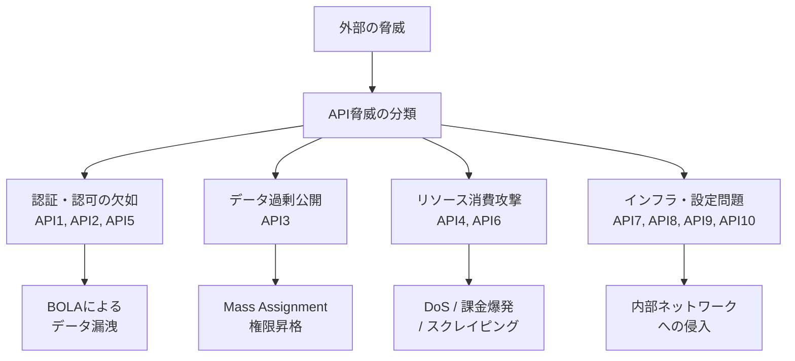
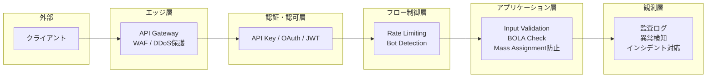
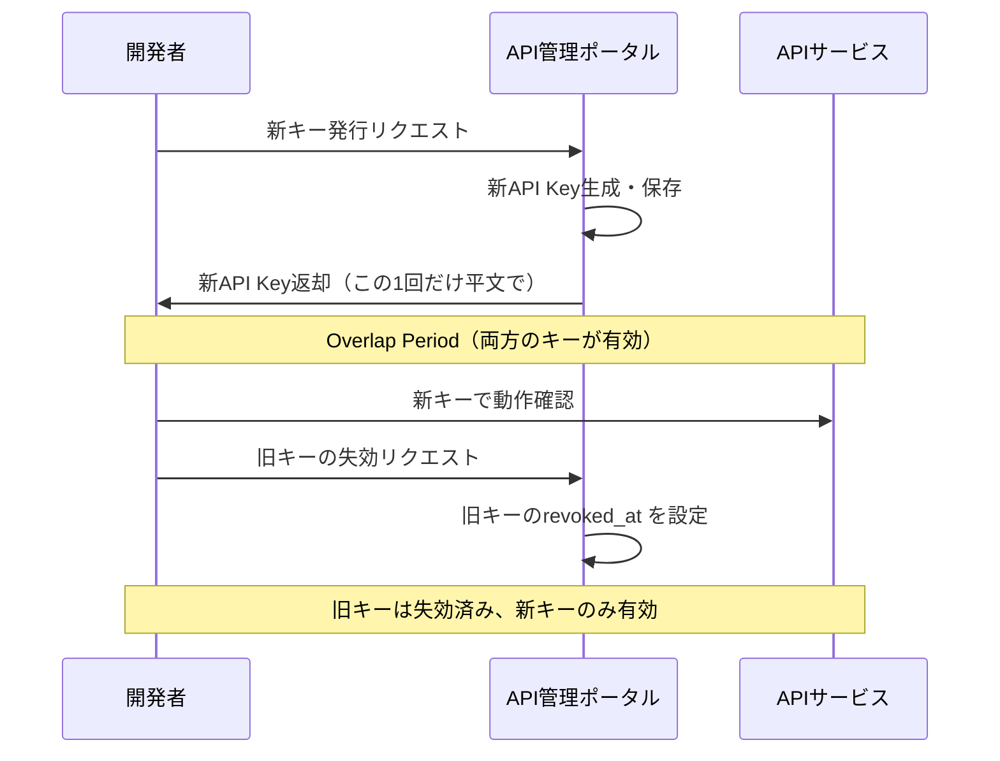
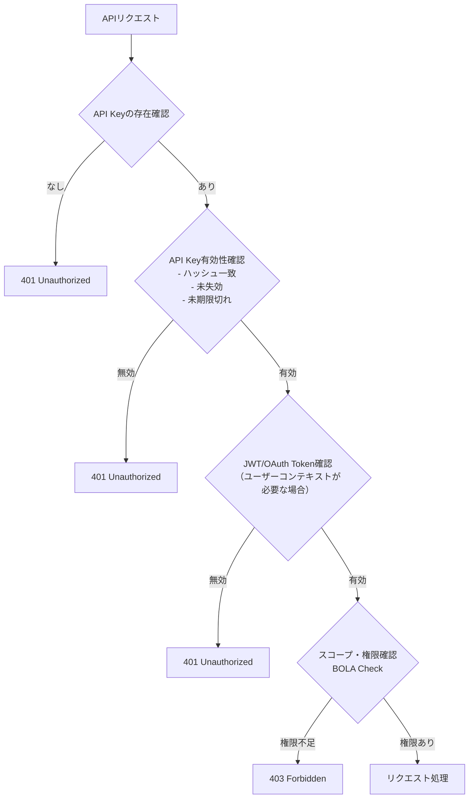
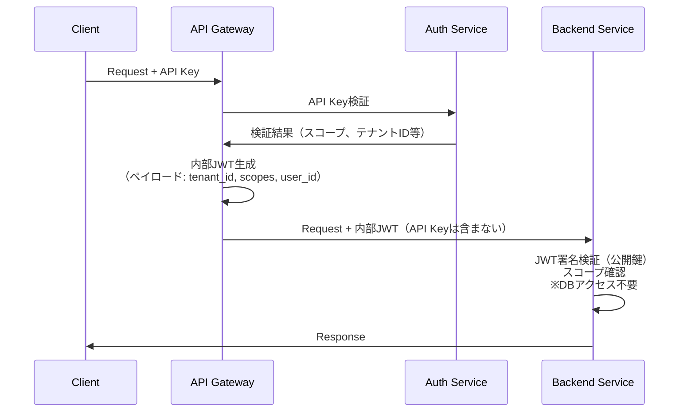
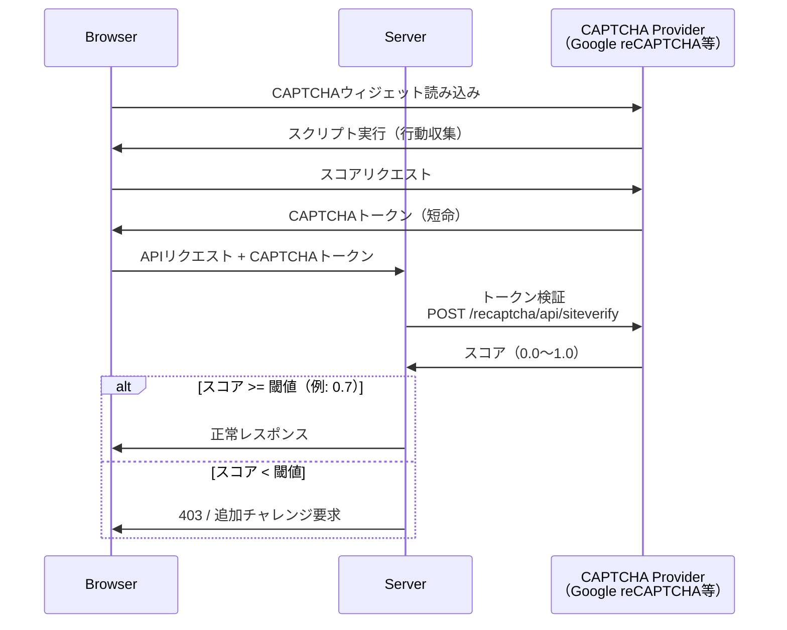
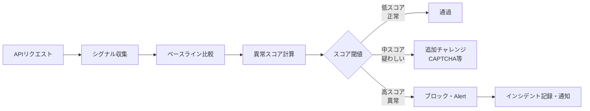
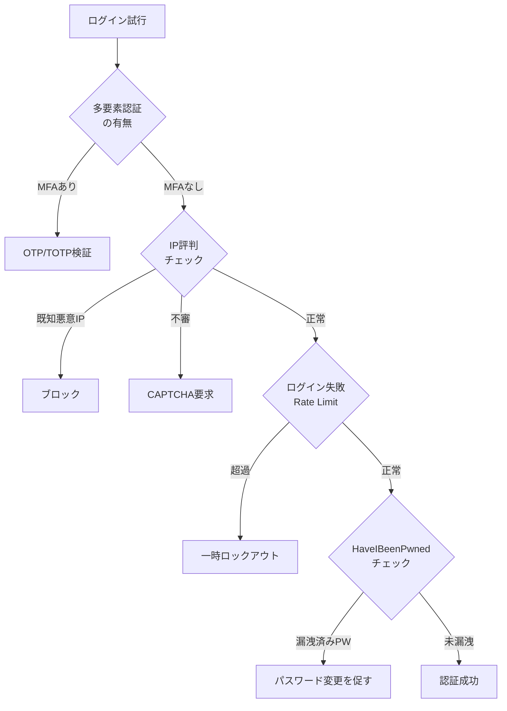
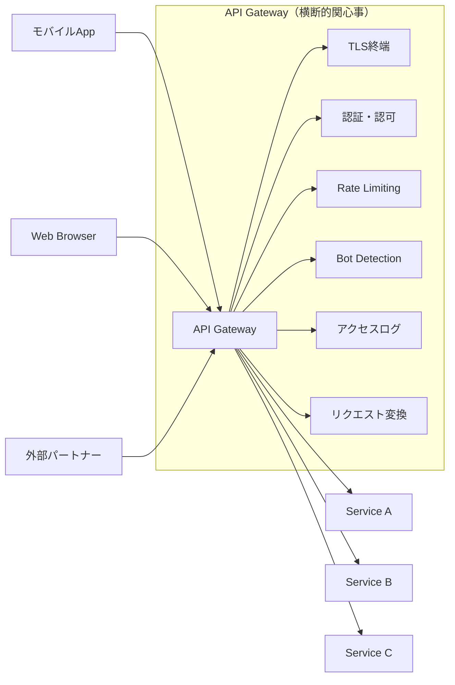
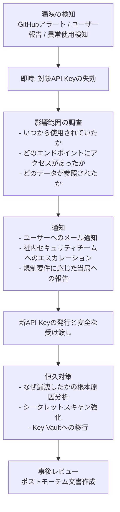

# APIセキュリティの実践（API Key管理, Abuse Prevention, Bot対策）

## 1. APIセキュリティの現状と脅威モデル

### 1.1 APIが攻撃の主戦場になった理由

現代のWebアプリケーションは、その大部分がAPIを通じてデータをやり取りする構造になっている。モバイルアプリ、シングルページアプリケーション（SPA）、マイクロサービス間通信、サードパーティ連携——これらはすべてAPIを基盤としている。かつてはHTMLを生成して返すWebサーバーが主役だったが、今日ではAPIサーバーがビジネスロジックとデータの実質的な守り手となっている。

この変化は攻撃者の視点からも同様に認識されている。従来のWebアプリケーションへの攻撃はブラウザを経由するものが多く、CORSやCSPといったブラウザ側の防御機構がある程度の壁となっていた。しかしAPIはブラウザを介さず直接呼び出せるため、これらの防御が効かない。さらに、APIは機械可読なレスポンスを返すため自動化攻撃との相性が非常に良く、大規模なデータ収集や不正操作が容易に実行できてしまう。

Salt Securityの調査（2024年）によると、組織の94%が過去12ヶ月にAPIセキュリティの問題を経験しており、そのうち17%が実際のデータ侵害につながったと報告されている。APIは今や組織の攻撃対象領域（Attack Surface）の中で最も急速に拡大している領域の一つである。

### 1.2 OWASP API Security Top 10

OWASP（Open Web Application Security Project）は2019年に、APIに特化したリスクリスト「OWASP API Security Top 10」を公開し、2023年に改訂した。これはWebアプリケーション向けのOWASP Top 10とは別個のリストであり、API特有の脅威に焦点を当てている。

| 順位 | 脅威名 | 概要 |
|------|--------|------|
| API1 | Broken Object Level Authorization (BOLA) | 他のユーザーのオブジェクトIDを操作してアクセスする（旧称IDOR） |
| API2 | Broken Authentication | 認証機構の実装不備により認証が迂回される |
| API3 | Broken Object Property Level Authorization | 過剰なデータ返却や不正なプロパティ更新（Mass Assignment含む） |
| API4 | Unrestricted Resource Consumption | Rate Limitingの欠如によるリソース枯渇・DoS・課金爆発 |
| API5 | Broken Function Level Authorization | 管理者専用エンドポイントへの一般ユーザーアクセス |
| API6 | Unrestricted Access to Sensitive Business Flows | ビジネスフロー（購入、予約等）の自動化による悪用 |
| API7 | Server Side Request Forgery (SSRF) | APIを通じてサーバーに内部リソースへのリクエストを発行させる |
| API8 | Security Misconfiguration | 不適切なセキュリティ設定（デバッグ有効化、弱い暗号等） |
| API9 | Improper Inventory Management | 古い/未文書化のAPIバージョンの放置 |
| API10 | Unsafe Consumption of APIs | 外部APIからのレスポンスを無検証で信頼する |

このリストで注目すべきは、BOLA（API1）の突出した危険性である。従来のSQLインジェクションやXSSと違い、BOLAは実装上の完全なバグではなく「認可チェックの欠如」という設計上の問題であるため、自動スキャナーでは検出が難しい。`GET /api/orders/12345` というリクエストで、自分の注文ID（12345）の代わりに他人の注文ID（12346）を指定してもアクセスできてしまう——これがBOLAの典型例である。



### 1.3 APIセキュリティの多層防御思想

APIセキュリティは単一の銀の弾丸で解決できる問題ではない。攻撃の種類が多様であり、それぞれに対応する防御層が必要になる。本記事では以下の防御層を順に解説していく。



## 2. API Keyの設計と管理

### 2.1 API Keyとは何か、何ではないか

API Keyは、クライアントがAPIサーバーに対して自身を識別させるために送信する秘密の文字列である。OAuth 2.0のようなユーザー委任フローとは異なり、API Keyは通常「このクライアントアプリケーション（またはサービスアカウント）」を識別するものであり、特定のエンドユーザーを識別するものではない。

API Keyの特性を整理する。

**API Keyが得意なこと**:
- サーバー間通信（M2M: Machine-to-Machine）の認証
- 開発者ポータルでのアクセス管理とレート制限の適用
- 監査ログへの帰属確認（どのクライアントが何をしたか）
- シンプルな読み取り専用アクセスの制御

**API Keyが苦手なこと（あるいは不適切なこと）**:
- エンドユーザーの認証・認可（→ OAuth 2.0/JWTを使う）
- 細粒度なユーザー権限管理
- フロントエンドJavaScriptへの埋め込み（→ 公開されてしまう）
- 秘密性が必要なモバイルアプリでの使用（→ バイナリ解析でバレる）

> [!WARNING]
> API Keyをフロントエンドのコード（JavaScriptバンドル、AndroidのAPK、iOS のIPAファイル）に直接埋め込むことは絶対に避けること。GitHub等のパブリックリポジトリへの誤コミットも頻発する事故である。GitHubは2020年よりシークレットスキャン機能を提供しており、多くのAPI ProviderのキーパターンをリポジトリにPushされた瞬間に検知して警告を出す。

### 2.2 API Keyの生成

セキュアなAPI Keyを生成するための要件は以下の通りである。

**エントロピー（ランダム性）**: 少なくとも128ビット、推奨は256ビット以上の暗号学的に安全な乱数から生成する。`Math.random()` や `rand()` のような疑似乱数関数は使ってはならない。

**エンコーディング**: Base64URL または16進数（hex）が一般的だが、Base62（英数字のみ）も人間が手動でコピーする用途では扱いやすい。長さは最低でも32文字、推奨は40〜64文字程度。

**プレフィックス**: `sk_live_`, `pk_test_`, `ghp_` のようなプレフィックスを付けると、流出したときにスキャナーが検知しやすくなり、また人間が見て「これはAPIキーだ」と判断できる。GitHubはすべてのトークン種別に独自プレフィックスを付けており、シークレットスキャンの精度を上げている。

```python
import secrets
import base64

def generate_api_key(prefix: str = "sk_live_") -> str:
    # Generate 32 bytes (256 bits) of cryptographically secure random data
    random_bytes = secrets.token_bytes(32)
    # Encode as URL-safe Base64 without padding
    encoded = base64.urlsafe_b64encode(random_bytes).decode("utf-8").rstrip("=")
    return f"{prefix}{encoded}"

# Example output: sk_live_abc123XYZ... (about 55 chars total)
api_key = generate_api_key()
```

```go
package apikey

import (
    "crypto/rand"
    "encoding/base64"
    "fmt"
)

// Generate creates a cryptographically secure API key with the given prefix.
func Generate(prefix string) (string, error) {
    // 32 bytes = 256 bits of entropy
    b := make([]byte, 32)
    if _, err := rand.Read(b); err != nil {
        return "", fmt.Errorf("failed to generate random bytes: %w", err)
    }
    encoded := base64.URLEncoding.WithPadding(base64.NoPadding).EncodeToString(b)
    return prefix + encoded, nil
}
```

### 2.3 API Keyの安全な保存

**クライアント側（API Keyを使う側）**: 環境変数、シークレット管理サービス（AWS Secrets Manager, HashiCorp Vault, GCP Secret Manager）に保存する。ソースコードやDockerfileに直書きしてはならない。

**サーバー側（API Keyを管理する側）**: 受け取ったAPI Keyをそのまま平文でデータベースに保存するのは危険である。データベースが侵害された場合、すべてのAPI Keyが一括漏洩する。

推奨されるアプローチは、パスワードと同様にハッシュ化して保存することである。ただし、API Keyはユーザーが覚える必要がなくランダム文字列であるため、Argon2やbcryptのような低速ハッシュ関数を使わなくても、SHA-256のような高速ハッシュで十分なことが多い（十分なエントロピーがあるため辞書攻撃が無効）。

```sql
-- API keys table schema
CREATE TABLE api_keys (
    id          BIGINT PRIMARY KEY AUTO_INCREMENT,
    -- Prefix for fast lookup (first 8 chars of the key, e.g., "sk_live_")
    key_prefix  VARCHAR(16) NOT NULL,
    -- SHA-256 hash of the full key (stored instead of plaintext)
    key_hash    CHAR(64) NOT NULL,
    -- Human-readable name for the key
    name        VARCHAR(255) NOT NULL,
    -- Scope: comma-separated list of allowed operations
    scopes      TEXT NOT NULL,
    -- Owner user or organization
    owner_id    BIGINT NOT NULL,
    -- Timestamps
    created_at  TIMESTAMP DEFAULT CURRENT_TIMESTAMP,
    last_used_at TIMESTAMP,
    expires_at  TIMESTAMP,
    revoked_at  TIMESTAMP,
    INDEX idx_key_prefix (key_prefix)
);
```

ルックアップは以下の手順で行う。リクエストで受け取ったAPI Keyのプレフィックス（最初の数文字）でDBレコードを絞り込み、その後SHA-256ハッシュを比較する。プレフィックスによる絞り込みで全レコードを総当たりせずに済む。

```python
import hashlib

def lookup_api_key(raw_key: str, db_conn):
    # Extract prefix for fast database lookup
    prefix = raw_key[:16]  # First 16 characters

    # Hash the full key
    key_hash = hashlib.sha256(raw_key.encode()).hexdigest()

    # Fetch candidates by prefix, then compare hash
    candidates = db_conn.query(
        "SELECT * FROM api_keys WHERE key_prefix = %s AND revoked_at IS NULL",
        (prefix,)
    )

    for candidate in candidates:
        if secrets.compare_digest(candidate["key_hash"], key_hash):
            # Update last_used_at asynchronously to avoid latency impact
            return candidate

    return None  # Key not found or invalid
```

> [!TIP]
> `secrets.compare_digest()` や `hmac.compare_digest()` のような定数時間比較関数を使うこと。通常の文字列比較（`==`）はタイミング攻撃（timing attack）に対して脆弱であり、比較にかかる時間から正しいバイト数を推測される可能性がある。

### 2.4 スコープ（権限の限定）

API Keyには必ず最小権限の原則（Principle of Least Privilege）を適用し、スコープを設定する。スコープとはそのキーで実行できる操作の集合であり、不要な権限を持つキーは侵害時の被害範囲を拡大させる。

スコープの設計パターンには以下のようなものがある。

**粗粒度スコープ（Coarse-grained）**: `read`, `write`, `admin` のように大まかに分類する。シンプルだが柔軟性に欠ける。

**細粒度スコープ（Fine-grained）**: `orders:read`, `orders:write`, `products:read`, `users:admin` のように、リソースと操作の組み合わせで定義する。GitHub Personal Access Tokens（classic）はこのアプローチを採用している。

**GitHub Fine-grained PAT方式**: リポジトリ単位、権限種別単位で非常に細かくスコープを設定できる。2022年よりベータとして提供されている。

```yaml
# Example scope definition in API key management system
scopes:
  - name: orders:read
    description: "注文の読み取り"
    methods: [GET]
    paths: ["/api/v1/orders/*", "/api/v1/orders"]

  - name: orders:write
    description: "注文の作成・更新・キャンセル"
    methods: [POST, PUT, PATCH, DELETE]
    paths: ["/api/v1/orders/*", "/api/v1/orders"]

  - name: products:read
    description: "商品情報の読み取り"
    methods: [GET]
    paths: ["/api/v1/products/*"]

  - name: admin:all
    description: "すべての操作（管理者専用）"
    methods: ["*"]
    paths: ["*"]
```

### 2.5 API Keyのローテーション

APIキーは定期的にローテーション（更新）する必要がある。漏洩していたとしても、その被害期間を限定するためである。

**ローテーションのベストプラクティス**:

1. **ゼロダウンタイムローテーション**: 新旧両方のキーを同時に有効な状態で一定期間（Overlap Period）維持する。突然旧キーを無効化すると、クライアントが更新する前に障害が発生する。
2. **自動通知**: 期限切れが近づいたらメール/Webhookで事前通知する。
3. **強制ローテーション**: セキュリティインシデント発生時は即時失効（Revoke）が必要。



> [!NOTE]
> 多くのAPI Providerは、API Keyを**発行時の一度しか平文で表示しない**。データベースにはハッシュしか保存していないため、後から確認することが不可能だからである。ユーザーはこの1回のチャンスで安全な場所に保存しなければならない。Stripe, GitHub, Twilioなどがこの方式を採用している。

## 3. 認証と認可の多層防御

### 3.1 なぜ一つの認証機構では不十分か

実際のAPIシステムでは、複数の認証・認可機構を組み合わせることが標準的になっている。それは単一の機構にはそれぞれ限界があるからである。

| 機構 | 強み | 弱み |
|------|------|------|
| API Key | シンプル、M2M向き | ユーザー委任不可、長期的な秘密 |
| OAuth 2.0 Access Token | ユーザー委任、短命 | フロー複雑、インフラコスト |
| JWT | ステートレス検証、スケーラブル | 失効困難、ペイロードが大きい |
| mTLS | 相互認証、非常に強固 | 証明書管理が煩雑 |

多くの本番システムは以下のような組み合わせを採用する。



### 3.2 OAuth 2.0とAPI Keyの組み合わせ

パブリックAPIを提供するプラットフォーム（例: Stripe, Twilio, SendGrid）では、以下のような二段階の認可モデルを採用することが多い。

**第一層: API Key（クライアント識別）**
- リクエストを送信しているのがどのアプリケーション（テナント）かを識別する
- Rate Limitingの適用単位として使用する
- 課金の計上単位として使用する

**第二層: OAuth 2.0（ユーザー委任）**
- そのアプリケーションがどのエンドユーザーの代わりに動作しているかを識別する
- ユーザー固有のリソースへのアクセス制御に使用する

```http
POST /api/v1/messages
Authorization: Bearer eyJhbGciOi...  (OAuth 2.0 Access Token = ユーザーコンテキスト)
X-API-Key: sk_live_abc123...          (API Key = クライアント識別)
Content-Type: application/json

{
  "to": "+1234567890",
  "body": "Your order has shipped!"
}
```

### 3.3 JWTを用いたステートレス認可

マイクロサービス環境では、各サービスがAPI Keyの有効性を都度DBに問い合わせるのはレイテンシ上の問題がある。JWTを活用することで、API Gatewayで一度認証を行い、その結果をJWTに埋め込んで各バックエンドサービスに渡す「内部JWT（Service Token）」パターンが有効である。



バックエンドサービスはAPI Gatewayが署名した内部JWTを公開鍵で検証するだけでよく、DBへの問い合わせが不要になる。ただしJWT失効の問題（一度発行したJWTは有効期限まで使える）があるため、内部JWTの有効期限は数分程度の短命にするべきである。

## 4. Rate LimitingとThrottling

### 4.1 Rate Limitingの必要性

Rate Limiting（レート制限）は、一定期間内にAPIが受け付けるリクエスト数を制限する仕組みである。これが欠如していると、以下の問題が発生する。

- **DoS攻撃**: 大量リクエストでサービスをダウンさせる
- **スクレイピング**: 全データを高速に収集される
- **課金爆発**: LLM APIなど従量課金のAPIを勝手に大量消費される（Wallet Abuse）
- **ブルートフォース**: 大量のリクエストで認証情報を総当たりされる
- **Credential Stuffing**: 漏洩したID/パスワードのリストを使ったログイン試行

OWASP API Security Top 10のAPI4「Unrestricted Resource Consumption」はまさにこの問題である。

### 4.2 トークンバケットアルゴリズム

トークンバケット（Token Bucket）は最も広く使われるRate Limitingアルゴリズムの一つである。

**動作原理**:
- バケツには最大 `capacity` 個のトークンが入る
- トークンは一定レート `refill_rate`（例: 毎秒10個）で補充される
- リクエストは1回につき `cost`（通常1）個のトークンを消費する
- バケツにトークンが足りない場合はリクエストを拒否する

```
バケツ (capacity=10, refill_rate=10/秒)

t=0秒: [●●●●●●●●●●] 10個 満タン
t=0.1秒: 5リクエスト → [●●●●●     ] 5個残
t=0.5秒: 4個補充  → [●●●●●●●●●  ] 9個
t=0.5秒: 3リクエスト → [●●●●●●    ] 6個残
```

トークンバケットの特性は**バーストを許容する**点にある。瞬間的なトラフィックの波（バースト）をバケツの容量分まで吸収できる。これはAPIクライアントの実際の使用パターン（定常的なリクエストではなく時々バーストする）に合致している。

```python
import time
import redis

class TokenBucketRateLimiter:
    def __init__(self, redis_client: redis.Redis, capacity: int, refill_rate: float):
        self.redis = redis_client
        self.capacity = capacity      # Maximum tokens
        self.refill_rate = refill_rate  # Tokens per second

    def allow(self, key: str, cost: int = 1) -> tuple[bool, dict]:
        """
        Check if request is allowed using token bucket algorithm.
        Uses a Lua script for atomicity in Redis.
        Returns (allowed, metadata).
        """
        # Lua script ensures atomicity (read-modify-write as a single operation)
        lua_script = """
        local key = KEYS[1]
        local capacity = tonumber(ARGV[1])
        local refill_rate = tonumber(ARGV[2])
        local cost = tonumber(ARGV[3])
        local now = tonumber(ARGV[4])

        -- Get current bucket state
        local bucket = redis.call('HMGET', key, 'tokens', 'last_refill')
        local tokens = tonumber(bucket[1]) or capacity
        local last_refill = tonumber(bucket[2]) or now

        -- Calculate tokens to add based on elapsed time
        local elapsed = now - last_refill
        local new_tokens = math.min(capacity, tokens + elapsed * refill_rate)

        -- Check if request can be fulfilled
        if new_tokens >= cost then
            new_tokens = new_tokens - cost
            redis.call('HMSET', key, 'tokens', new_tokens, 'last_refill', now)
            redis.call('EXPIRE', key, 3600)  -- Reset TTL
            return {1, math.floor(new_tokens), math.floor(capacity - new_tokens)}
        else
            redis.call('HMSET', key, 'tokens', new_tokens, 'last_refill', now)
            redis.call('EXPIRE', key, 3600)
            return {0, math.floor(new_tokens), math.floor(capacity - new_tokens)}
        end
        """
        result = self.redis.eval(
            lua_script, 1, key,
            self.capacity, self.refill_rate, cost, time.time()
        )
        allowed = bool(result[0])
        remaining = int(result[1])
        used = int(result[2])

        return allowed, {
            "X-RateLimit-Limit": self.capacity,
            "X-RateLimit-Remaining": remaining,
            "X-RateLimit-Used": used,
        }
```

### 4.3 スライディングウィンドウアルゴリズム

固定ウィンドウ（Fixed Window）方式はシンプルだが、ウィンドウの境界でバーストを許してしまう問題（Window Boundary Attack）がある。例えば「1分間に100リクエスト」という制限で、00:59に100リクエスト、01:00に100リクエスト送ると合計200リクエストが通ってしまう。

スライディングウィンドウ（Sliding Window）はこの問題を解決する。

```
固定ウィンドウの問題:
  |--- 00:00-01:00 ---||--- 01:00-02:00 ---|
  0リクエスト ...   100|100 リクエスト ...
                       ↑ 境界付近で200リクエスト通過

スライディングウィンドウ:
  常に「現在時刻から60秒前まで」のリクエスト数を数える
  → いかなる60秒間を切り取っても100リクエスト以下が保証される
```

**スライディングウィンドウカウンター（近似）の実装**:

完全なスライディングウィンドウはメモリコストが高い（各リクエストのタイムスタンプを保存する必要がある）。実用的には、前のウィンドウのカウントを時間で按分する近似実装が使われる。

```python
def sliding_window_allow(self, key: str, limit: int, window_seconds: int) -> bool:
    """
    Sliding window counter using weighted approximation.
    current_count = previous_window_count * (remaining_time / window) + current_window_count
    """
    now = time.time()
    window_start = int(now / window_seconds) * window_seconds
    prev_key = f"{key}:{window_start - window_seconds}"
    curr_key = f"{key}:{window_start}"

    pipeline = self.redis.pipeline()
    pipeline.get(prev_key)
    pipeline.get(curr_key)
    prev_count_str, curr_count_str = pipeline.execute()

    prev_count = int(prev_count_str) if prev_count_str else 0
    curr_count = int(curr_count_str) if curr_count_str else 0

    # Weight previous window by how much of the current window has elapsed
    elapsed_ratio = (now - window_start) / window_seconds
    weighted_count = prev_count * (1 - elapsed_ratio) + curr_count

    if weighted_count >= limit:
        return False  # Rate limited

    # Increment current window counter
    pipeline = self.redis.pipeline()
    pipeline.incr(curr_key)
    pipeline.expire(curr_key, window_seconds * 2)
    pipeline.execute()
    return True
```

### 4.4 Rate Limitingの粒度設計

Rate Limitingをどの単位に適用するかは設計の核心である。複数の粒度を組み合わせることが実践的である。

| 粒度 | キー例 | 目的 |
|------|--------|------|
| グローバル | `rate_limit:global` | インフラ全体の保護 |
| API Key | `rate_limit:key:{api_key_hash}` | テナント別課金・制限 |
| IPアドレス | `rate_limit:ip:{ip}` | 匿名攻撃への対策 |
| ユーザーID | `rate_limit:user:{user_id}` | 認証済みユーザーの制限 |
| エンドポイント | `rate_limit:endpoint:{api_key}:{path}` | 高コスト操作の個別制限 |

高コストな操作（例: LLM API呼び出し、メール送信、画像生成）は、エンドポイント単位でより厳しい制限を設けるべきである。

```http
# Rate Limit に関するレスポンスヘッダー（IETF Draft準拠）
HTTP/1.1 200 OK
RateLimit-Limit: 100
RateLimit-Remaining: 42
RateLimit-Reset: 1711900800
Retry-After: 30
```

> [!TIP]
> IETF RFC 6585 および [draft-ietf-httpapi-ratelimit-headers](https://datatracker.ietf.org/doc/draft-ietf-httpapi-ratelimit-headers/) はRate Limitヘッダーの標準化を進めている。`X-RateLimit-Remaining` のようなベンダー独自ヘッダーより、標準化されたヘッダーの採用が推奨される。

## 5. Bot対策

### 5.1 Botの分類と脅威

APIを叩くトラフィックの中には、人間のユーザーではなく自動化されたBot（ロボット）が含まれる。Botにも「良いBot」と「悪いBot」がある。

**良いBot（許可すべき）**:
- Googlebot等の検索エンジンクローラー
- 自社監視システムのヘルスチェック
- 正規のシステム統合（Zapier, IFTTT等）
- 自社開発のバッチ処理

**悪いBot（阻止すべき）**:
- スクレイパー（競合他社によるデータ収集）
- Credential Stuffingツール（漏洩認証情報を使ったログイン試行）
- 在庫買い占めBot（ダフ屋行為）
- DDoS攻撃Bot
- フォームスパムBot

問題は、APIの観点から見ると良いBotと悪いBotを区別するのが困難なことである。どちらも「HTTPリクエストを送信する自動化されたプログラム」に過ぎない。

### 5.2 CAPTCHA

CAPTCHA（Completely Automated Public Turing test to tell Computers and Humans Apart）は、人間にとっては容易だがコンピューターには困難なタスクを解かせることで、人間とBotを区別する仕組みである。

**CAPTCHAの世代**:

- **第一世代**: 歪んだテキスト画像を読み取る（reCAPTCHA v1）。現在はAIで突破可能。
- **第二世代**: 「私はロボットではありません」チェックボックス + 必要に応じて画像認識課題（reCAPTCHA v2）。ユーザー行動（マウス動作等）をスコアリング。
- **第三世代**: ユーザーに課題を提示せず、バックグラウンドの行動分析のみでスコアを返す（reCAPTCHA v3, hCaptcha, Cloudflare Turnstile）。スコアに応じてサーバー側で制限をかける。

**APIでのCAPTCHA統合**:



CAPTCHAにはプライバシー上の懸念（GoogleによるユーザートラッキングなどReCAPTCHAの場合）と、アクセシビリティの問題（視覚障害者には画像認識が困難）がある。このため、Cloudflare Turnstileのような非侵襲的な選択肢が注目されている。

### 5.3 デバイスフィンガープリンティング

フィンガープリンティングは、ブラウザや端末の様々な特性を収集して一意の識別子を生成する技術である。同じIPからでも端末が異なれば別のフィンガープリントが生成され、反対に同じ端末がIPを変えても同じフィンガープリントが生成される（精度は実装による）。

**収集する特性の例**:

```javascript
// Browser fingerprinting signals (client-side collection)
const signals = {
    // Basic browser info
    userAgent: navigator.userAgent,
    language: navigator.language,
    platform: navigator.platform,

    // Screen properties
    screenWidth: screen.width,
    screenHeight: screen.height,
    colorDepth: screen.colorDepth,
    pixelRatio: window.devicePixelRatio,

    // Time zone
    timezone: Intl.DateTimeFormat().resolvedOptions().timeZone,
    timezoneOffset: new Date().getTimezoneOffset(),

    // Canvas fingerprint (GPU rendering differences)
    canvasHash: getCanvasFingerprint(),

    // WebGL info (GPU model)
    webglVendor: getWebGLVendor(),
    webglRenderer: getWebGLRenderer(),

    // Audio context fingerprint
    audioHash: getAudioFingerprint(),

    // Installed fonts (via CSS font detection)
    fonts: getInstalledFonts(),

    // Browser plugins
    plugins: getPlugins(),

    // Touch support
    touchPoints: navigator.maxTouchPoints,
};
```

フィンガープリンティングは単独では限界があるが、他のシグナル（Rate Limiting情報、行動パターン）と組み合わせることで強力なBot検出が可能になる。

主要なサードパーティサービスとしては FingerprintJS（Pro版）、DataDome、Arkose Labs などがある。

### 5.4 行動分析（Behavioral Analysis）

人間のユーザーとBotでは行動パターンが根本的に異なる。この差異を利用して検出するのが行動分析である。

**検出できるBotの特徴**:

- **リクエスト間隔の均一性**: 人間のリクエスト間隔は不規則だが、Botは均一（例: ちょうど1000msごと）
- **マウスの動きの不自然さ**: Botはマウスを直線的に動かすか、まったく動かさない
- **スクロールパターン**: Botはページを即座に最下部までスクロールする
- **フォーム入力速度**: ボット生成のテキストは人間より一様に速いか、逆に0ms（プログラム的なfill）
- **セッション中の操作多様性の欠如**: Botは毎回同じフローを辿る
- **HTTPヘッダーの欠如**: `Accept-Language`, `Accept-Encoding` が存在しない
- **User-Agentとブラウザ特性の不一致**: User-AgentはChrome 120と名乗っているのにChrome 120固有のAPIが存在しない（Headless Chromeの検出）

```python
# Server-side behavioral scoring example
def calculate_bot_score(request, session_data):
    score = 0.0  # 0.0 = definitely human, 1.0 = definitely bot

    # Check request timing consistency
    if session_data.get("request_interval_stddev", float("inf")) < 10:
        # Very low variance in request timing = bot-like
        score += 0.3

    # Check for missing standard headers
    missing_headers = []
    for header in ["Accept-Language", "Accept-Encoding", "Accept"]:
        if header not in request.headers:
            missing_headers.append(header)
    score += len(missing_headers) * 0.1

    # Check User-Agent consistency
    ua = request.headers.get("User-Agent", "")
    if is_known_headless_ua(ua):
        score += 0.4

    # Check IP reputation
    ip = request.remote_addr
    if is_tor_exit_node(ip) or is_known_proxy(ip) or is_datacenter_ip(ip):
        score += 0.2

    return min(1.0, score)
```

## 6. Abuse Prevention（乱用防止）

### 6.1 ビジネスロジック攻撃

OWASP API Security のAPI6「Unrestricted Access to Sensitive Business Flows」は、技術的な脆弱性ではなくビジネスロジックを悪用する攻撃を扱う。これはファイアウォールや通常のWAFでは検出が非常に難しい。

**具体的な攻撃シナリオ**:

- **在庫買い占め**: 転売目的でBotが限定品を瞬時に大量購入し、後でオークションサイトで高値販売する
- **ギフトカード総当たり**: ギフトカード番号のパターンを推測してAPIで残高照会を繰り返す
- **紹介コード乱用**: 紹介プログラムの特典をBotアカウントを多数作って不正に獲得する
- **クーポン乱用**: 一人一回限りのクーポンを複数アカウントで使い回す
- **Price Scraping**: 競合他社がAPIから価格情報を収集してダンピングに使う
- **SMS Pumping**: SMSサービスのAPIを使って大量のOTPを送信させ、SMSアグリゲーターからキックバックを得る詐欺

### 6.2 異常検知の実装

統計的な手法を使って「通常とは異なる」リクエストパターンを検出する。



**異常検知のシグナル**:

```python
# Anomaly detection signals for abuse prevention
class AbuseDetector:
    def analyze(self, api_key: str, endpoint: str, user_id: str | None = None) -> float:
        signals = []

        # 1. Velocity check: requests per minute vs. historical average
        current_rpm = self.get_current_rpm(api_key)
        avg_rpm = self.get_historical_avg_rpm(api_key)
        if avg_rpm > 0 and current_rpm > avg_rpm * 3:
            signals.append(("velocity_spike", 0.4))

        # 2. Geographic anomaly: request origin vs. usual locations
        current_country = self.get_country_from_ip(self.get_current_ip())
        usual_countries = self.get_usual_countries(api_key)
        if current_country not in usual_countries:
            signals.append(("geo_anomaly", 0.2))

        # 3. Time-of-day anomaly: 3 AM activity for usually daytime user
        if self.is_unusual_hour(api_key):
            signals.append(("time_anomaly", 0.1))

        # 4. Endpoint pattern: suddenly hitting new endpoints
        if not self.has_accessed_endpoint_before(api_key, endpoint):
            signals.append(("new_endpoint", 0.1))

        # 5. Error rate: high 4xx error rate = probing
        error_rate = self.get_error_rate(api_key)
        if error_rate > 0.3:  # More than 30% errors
            signals.append(("high_error_rate", 0.5))

        # Combine signals (capped at 1.0)
        total_score = min(1.0, sum(s for _, s in signals))
        return total_score
```

### 6.3 課金保護（Wallet Abuse）

LLMや画像生成など従量課金のAPIでは、API Keyが漏洩すると第三者に課金を押しつけられる被害（Wallet Abuse）が発生する。2023年にはOpenAI APIキーの漏洩によって数万ドルの課金が発生した事例が多数報告された。

**防御策**:

1. **ハード上限（Hard Spend Limit）**: 月間の課金額に絶対的な上限を設定し、超えたらAPIを完全停止する
2. **アラート閾値**: 通常使用量の150%に達したらメール/Slackで警告する
3. **異常使用の検出**: 普段は月10ドルなのに急に1日で100ドル使われたら自動停止
4. **IPブロッキング**: 異常な使用元のIPを素早くブロックする

```python
# Hard spend limit enforcement
class SpendLimitEnforcer:
    def check_and_enforce(self, api_key_id: int, estimated_cost: float) -> bool:
        """
        Check if processing this request would exceed the spend limit.
        Returns True if allowed, False if blocked.
        """
        monthly_limit = self.get_spend_limit(api_key_id)
        current_month_spend = self.get_current_month_spend(api_key_id)

        # Hard limit check
        if current_month_spend + estimated_cost > monthly_limit:
            self.notify_spend_limit_exceeded(api_key_id, current_month_spend)
            return False

        # Soft limit warning at 80%
        if current_month_spend >= monthly_limit * 0.8:
            self.notify_approaching_limit(api_key_id, current_month_spend, monthly_limit)

        return True
```

### 6.4 Credential Stuffing対策

大規模なデータ漏洩で流出したID/パスワードのリスト（Combolist）を使って、他のサービスへの不正ログインを試みる攻撃を「Credential Stuffing」と呼ぶ。Have I Been Pwnedのデータベースによると、数十億件のクレデンシャルが漏洩・流通している。

**対策の組み合わせ**:



HIBP（Have I Been Pwned）APIを使うと、パスワードが過去の漏洩データベースに含まれているかをk-匿名性を保ちながら確認できる（パスワードのSHA-1ハッシュの先頭5文字を送るだけで照合できる）。

## 7. API Gatewayでのセキュリティ集約

### 7.1 API Gatewayとは

API Gatewayは、クライアントと実際のバックエンドサービスの間に位置するプロキシサーバーである。セキュリティ機能を各バックエンドサービスに分散させず、Gatewayで一元的に処理することで、実装の一貫性と保守性が向上する。



**主要なAPI Gatewayソフトウェア/サービス**:

| 製品 | 種別 | 特徴 |
|------|------|------|
| Kong | OSS/商用 | Lua/GoプラグインでのRate Limiting、豊富なプラグインエコシステム |
| AWS API Gateway | マネージド | Lambda統合、IAM認証、使用量プラン |
| Cloudflare API Shield | クラウド | ポジティブセキュリティモデル、Bot Management統合 |
| nginx + lua | DIY | 高い柔軟性、OpenResty |
| Envoy Proxy | OSS | Kubernetes環境での利用が多い、xDS API |

### 7.2 API GatewayでのRate Limiting実装例（Kong）

```yaml
# Kong Rate Limiting plugin configuration
plugins:
  - name: rate-limiting
    config:
      # Allow 100 requests per minute per API key
      minute: 100
      # Allow 10,000 requests per day per API key
      day: 10000
      # Apply limit per credential (API key)
      limit_by: credential
      # Use Redis for distributed rate limiting
      policy: redis
      redis:
        host: redis.internal
        port: 6379
      # Return error when limit is exceeded
      error_code: 429
      error_message: "Rate limit exceeded. Please retry after {retry-after} seconds."

  - name: bot-detection
    config:
      # Whitelist known good bots (Googlebot, etc.)
      whitelist:
        - "Googlebot"
        - "bingbot"
      # Blacklist known malicious user agent patterns
      blacklist:
        - "python-requests"  # Often used for scraping
        - "curl"             # Consider context-dependent

  - name: ip-restriction
    config:
      # Block requests from Tor exit nodes and known bad IP ranges
      deny:
        - "192.0.2.0/24"  # Example: known malicious range
```

### 7.3 WAF（Web Application Firewall）との統合

WAF（Web Application Firewall）はHTTPトラフィックを検査し、既知の攻撃パターン（SQLインジェクション、XSS等）を遮断する。OWASP ModSecurity Core Rule Set（CRS）が標準的なルールセットとして広く使われている。

APIに特化したWAFルールの重要な点は、従来のWebページ向けルールがAPIに適さない場合があることである。例えばAPIのJSONボディに含まれるSQL文字列が誤検知されるケースがある。このため、APIのコンテキストに合わせたWAFチューニングが必要になる。

## 8. Input ValidationとMass Assignment防止

### 8.1 Input Validationの重要性

クライアントからの入力を信頼してはならない（Trust No One原則）。API経由で送られるデータは、正規のクライアントアプリケーションからだけでなく、Burp SuiteやPostmanを使った手動操作や、悪意あるBotからのリクエストを含む可能性がある。

**バリデーションすべき項目**:

- **型チェック**: 数値フィールドに文字列が来ていないか
- **範囲チェック**: 年齢が0〜150の範囲か、金額が正の値か
- **長さ制限**: 文字列フィールドに100MBのデータが送られていないか
- **形式チェック**: メールアドレスの形式、電話番号の形式
- **列挙値チェック**: statusフィールドが許可値のみか
- **ネスト深度制限**: 深くネストしたJSONによるDoS（billion laughs的な）
- **配列サイズ制限**: リクエストに含まれる配列の要素数上限

```python
from pydantic import BaseModel, Field, field_validator
from typing import Literal
import re

class CreateOrderRequest(BaseModel):
    # Strict type validation with constraints
    product_id: int = Field(gt=0, description="Product ID must be positive")
    quantity: int = Field(ge=1, le=100, description="Quantity between 1 and 100")
    shipping_address: str = Field(min_length=10, max_length=500)
    priority: Literal["standard", "express", "overnight"] = "standard"

    # Custom validator for phone number format
    @field_validator("phone_number", mode="before")
    @classmethod
    def validate_phone(cls, v: str) -> str:
        if not re.match(r"^\+[1-9]\d{1,14}$", v):
            raise ValueError("Phone number must be in E.164 format")
        return v

    class Config:
        # Reject extra fields (prevents mass assignment)
        extra = "forbid"
```

### 8.2 Mass Assignment攻撃とその防止

Mass Assignment（大量代入）攻撃は、APIがオブジェクトのプロパティをリクエストから一括で更新する際に、クライアントが本来更新できないはずのフィールド（例: `is_admin`, `role`, `credit_balance`）も更新できてしまう脆弱性である。

**脆弱なコードの例**:

```python
# VULNERABLE: blindly assigns all request fields to the user object
@app.put("/api/v1/users/{user_id}/profile")
async def update_profile(user_id: int, request_body: dict, current_user: User):
    user = db.get_user(user_id)
    # This is DANGEROUS! request_body might contain {"is_admin": true}
    for key, value in request_body.items():
        setattr(user, key, value)
    db.save(user)
    return user
```

**安全なコードの例**:

```python
# SECURE: use explicit allowlist of updatable fields
from pydantic import BaseModel

class UpdateProfileRequest(BaseModel):
    display_name: str | None = Field(None, max_length=100)
    bio: str | None = Field(None, max_length=500)
    website_url: str | None = Field(None, max_length=200)
    # Note: is_admin, role, credit_balance are NOT included

    class Config:
        extra = "forbid"  # Reject unknown fields

@app.put("/api/v1/users/{user_id}/profile")
async def update_profile(
    user_id: int,
    body: UpdateProfileRequest,  # Only allowed fields are accepted
    current_user: User
):
    if current_user.id != user_id:
        raise HTTPException(status_code=403, detail="Cannot update another user's profile")

    user = db.get_user(user_id)
    # Only update fields that were explicitly provided
    update_data = body.model_dump(exclude_unset=True)
    for key, value in update_data.items():
        setattr(user, key, value)

    db.save(user)
    return UserProfileResponse.from_user(user)  # Return a restricted view
```

OWASP API3「Broken Object Property Level Authorization」はこのMass Assignmentと過剰なデータ返却の両方を含む。レスポンスでも、内部フィールド（ハッシュ化されたパスワード、内部フラグ等）を誤って返すことがないよう、レスポンススキーマを明示的に定義すべきである。

### 8.3 BOLA（Broken Object Level Authorization）対策

BOLAはIDの横取りによる不正アクセスである。URLパラメータ、クエリパラメータ、リクエストボディに含まれるオブジェクトIDを、認証済みユーザーに紐づくオブジェクトかどうかを必ず検証する。

```python
# SECURE: Always verify ownership before returning data
@app.get("/api/v1/orders/{order_id}")
async def get_order(order_id: int, current_user: User):
    order = db.get_order(order_id)

    if order is None:
        # Return 404, not 403, to avoid revealing existence of the resource
        raise HTTPException(status_code=404, detail="Order not found")

    # CRITICAL: Check that the order belongs to the current user
    if order.user_id != current_user.id:
        # Return 404 (not 403) to avoid revealing that this order exists
        raise HTTPException(status_code=404, detail="Order not found")

    return OrderResponse.from_order(order)
```

> [!WARNING]
> BOLAが発覚した場合、403（Forbidden）ではなく404（Not Found）を返すことを検討する。403を返すとリソースが存在することを攻撃者に知らせてしまい、IDの列挙（Enumeration）を助けてしまう。どちらが適切かはユースケースによるが、セキュリティ優先の場合は404が推奨される。

## 9. ログ監査とインシデント対応

### 9.1 APIアクセスログの設計

適切なログ設計はセキュリティ事後調査（フォレンジクス）の基盤である。何が起きたかを遡って追跡できなければ、インシデントの全容把握も再発防止も困難になる。

**ログに記録すべき項目**:

```json
{
  "timestamp": "2026-03-02T12:34:56.789Z",
  "request_id": "req_01HX9ABCDEFGH",
  "api_key_id": "key_42",
  "api_key_prefix": "sk_live_abc",
  "user_id": "usr_789",
  "method": "POST",
  "path": "/api/v1/orders",
  "query_string": "?currency=USD",
  "ip_address": "203.0.113.42",
  "user_agent": "MyApp/2.1 (iOS 17.0)",
  "response_status": 201,
  "response_time_ms": 145,
  "request_body_size": 234,
  "response_body_size": 512,
  "country_code": "JP",
  "rate_limit_remaining": 87,
  "bot_score": 0.05,
  "error_code": null,
  "trace_id": "trace_01HX9ABCDEFGH"
}
```

**ログに記録してはいけない項目**:
- API Keyの平文（プレフィックスのみ記録し、フルキーは記録しない）
- パスワード、クレジットカード番号
- 個人情報を含むリクエストボディの詳細（PII: Personally Identifiable Information）
- JWTの中身（署名済みだからといってそのまま記録すると漏洩につながる）

### 9.2 リアルタイムアラートと監視

ログを後から見るだけでなく、リアルタイムで異常を検知してアラートを発する仕組みが必要である。

**アラートのトリガー例**:

| イベント | 閾値の例 | アクション |
|---------|---------|-----------|
| 認証失敗の急増 | 5分間に同一IPから10回以上 | IPをブロック、Slack通知 |
| Rate Limit超過の多発 | 同一API Keyが1時間に100回超過 | APIキー一時停止、メール通知 |
| 新しい国からのアクセス | 初回のアクセス元国 | ユーザーにメール通知 |
| 深夜の異常アクセス | 通常時間外の大量リクエスト | 即時アラート |
| 高課金使用量 | 月間通常の200%超 | 課金上限適用、通知 |
| BOLA試行の痕跡 | 404が連続して多発（IDの列挙） | IPブロック、調査開始 |

```python
# Real-time anomaly alerting with sliding window
class SecurityMonitor:
    def on_request(self, log_entry: dict):
        key = log_entry["api_key_id"]
        ip = log_entry["ip_address"]
        status = log_entry["response_status"]

        # Check for ID enumeration pattern (many 404s from same IP)
        if status == 404:
            count = self.increment_counter(f"404:{ip}", window_seconds=60)
            if count > 50:
                self.alert_and_block(
                    ip=ip,
                    reason="Possible BOLA/ID enumeration attack",
                    evidence={"404_count_per_minute": count}
                )

        # Check for authentication brute force
        if status == 401:
            count = self.increment_counter(f"401:{ip}", window_seconds=300)
            if count > 20:
                self.alert_and_block(
                    ip=ip,
                    reason="Authentication brute force",
                    evidence={"401_count_per_5min": count}
                )

    def alert_and_block(self, ip: str, reason: str, evidence: dict):
        # Block the IP immediately
        self.ip_blocklist.add(ip, ttl_minutes=60)

        # Send alert to security team
        self.slack.post_message(
            channel="#security-alerts",
            text=f"IP {ip} blocked: {reason}",
            attachments=[{"fields": [
                {"title": k, "value": str(v)} for k, v in evidence.items()
            ]}]
        )

        # Log the incident
        self.incident_db.create({
            "type": "ip_block",
            "ip": ip,
            "reason": reason,
            "evidence": evidence,
            "timestamp": datetime.utcnow().isoformat()
        })
```

### 9.3 インシデント対応プレイブック

APIセキュリティインシデントが発生した際の対応手順（プレイブック）を事前に準備しておくことが重要である。本番環境でインシデントに気づいてから対応手順を考えていては遅い。

**API Keyが漏洩した場合のプレイブック**:



**対応時間の目標（SLA）**:
- **漏洩検知からKey失効まで**: 15分以内
- **影響範囲の初期調査完了**: 2時間以内
- **ユーザーへの初期通知**: 24時間以内
- **根本原因分析完了**: 72時間以内

### 9.4 コンプライアンスとログ保存

多くの業界規制・標準がAPIアクセスログの保存期間を定めている。

| 規制・標準 | 最低保存期間 | 主な要求事項 |
|-----------|------------|-------------|
| PCI DSS | 12ヶ月（うち3ヶ月即時参照可） | カード取り扱いシステムのアクセスログ |
| SOC 2 | 定義なし（一般的に1年） | セキュリティイベントのトレーサビリティ |
| GDPR | 目的に応じて最小限 | 個人データアクセスの記録 |
| 金融庁ガイドライン | 7年 | 電子的な取引記録 |

ログ保存には、保存コストと参照の利便性のトレードオフがある。近年はAWS S3 + Athena、Elasticsearch/OpenSearch、Grafana Lokiなどが大量ログの経済的な保存と検索に使われている。

## 10. 実践チェックリスト

以下に、APIセキュリティの実装チェックリストをまとめる。

::: details API Key管理チェックリスト

**生成・保存**
- [ ] 256ビット以上のエントロピーで生成している
- [ ] 暗号学的に安全な乱数生成器を使用している
- [ ] 意味のあるプレフィックスを付与している（シークレットスキャン対応）
- [ ] DBにはハッシュのみ保存し、平文は保存していない
- [ ] 発行時の一回のみ平文を表示している

**管理**
- [ ] スコープ（最小権限）を設定している
- [ ] 有効期限を設定している
- [ ] 即時失効（Revoke）の仕組みがある
- [ ] ローテーションの仕組みとUXがある
- [ ] 最終使用日時を記録している

**使用側**
- [ ] ソースコードにハードコードしていない
- [ ] 環境変数またはSecret Managerを使用している
- [ ] .gitignoreで.envを除外している
- [ ] GitHubシークレットスキャンを有効化している

:::

::: details Rate Limiting・Bot対策チェックリスト

**Rate Limiting**
- [ ] 全エンドポイントにRate Limitingを適用している
- [ ] API Key単位、IP単位の両方で制限している
- [ ] 高コスト操作（メール送信、SMS、LLM等）は個別に厳しく制限している
- [ ] Rate Limit超過時に適切なレスポンスヘッダーを返している（429 + Retry-After）
- [ ] Rate Limitの状態をRedis等の分散ストアで管理している

**Bot対策**
- [ ] ログインエンドポイントにCAPTCHAまたは行動分析を組み込んでいる
- [ ] IP評判チェック（Tor, Datacenter IP等）を実施している
- [ ] User-Agentの整合性チェックを行っている
- [ ] Headless Browserの検出を行っている

:::

::: details アプリケーションセキュリティチェックリスト

**Input Validation**
- [ ] すべてのAPIエンドポイントでスキーマバリデーションを行っている
- [ ] 文字列長の上限を設定している
- [ ] 数値の範囲チェックを行っている
- [ ] リクエストボディのサイズ上限を設定している

**認可**
- [ ] すべてのリソースアクセスでオーナーシップチェックを行っている（BOLA対策）
- [ ] Mass Assignmentを防ぐため許可フィールドを明示している
- [ ] レスポンスで内部フィールドを漏洩させていない
- [ ] 管理者専用エンドポイントに適切な権限チェックがある

**ログ・監視**
- [ ] すべてのAPIアクセスをログに記録している
- [ ] センシティブデータ（API Key平文、パスワード）をログに記録していない
- [ ] 異常パターン検知のアラートを設定している
- [ ] インシデント対応プレイブックを作成している

:::

## まとめ

APIセキュリティは、単一の対策で解決できる問題ではない。本記事で解説した通り、脅威モデルの理解から始まり、API Key管理・認証認可・Rate Limiting・Bot対策・異常検知・ログ監査まで、多層的な防御を組み合わせることが本質的なアプローチである。

特に現場での優先度という観点では、以下の順序が推奨される。

1. **認証・認可の基盤固め**（API Keyの適切な管理とBOLA対策）: これが崩れるとその他の対策が無意味になる
2. **Rate Limiting**（最低限の自衛手段）: インフラ保護と課金保護の両面で効果が高い
3. **Input Validation**（アプリケーションの安定性）: Mass AssignmentやInjectionの防止
4. **ログ監査**（可視性の確保）: 問題が起きたときに対応できる基盤
5. **Bot対策・異常検知**（高度な防御）: ビジネスロジック攻撃への対応

APIセキュリティの世界は攻撃手法の進化とともに常に変化している。OWASP API Security Top 10を定期的に確認し、自社のAPIが新たな脅威に対応できているかを継続的に見直すことが不可欠である。
