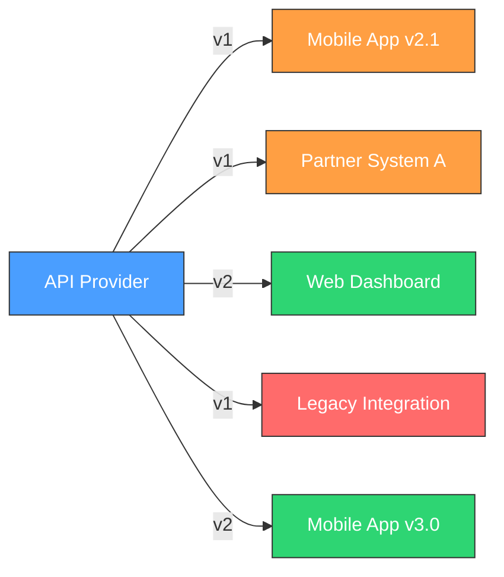
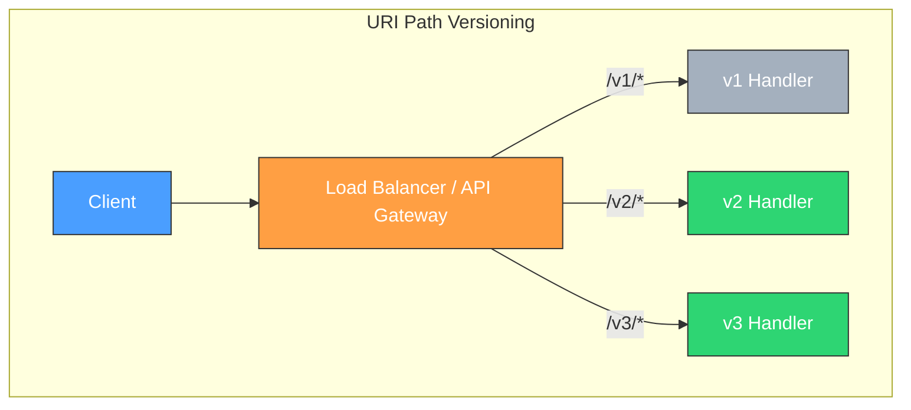
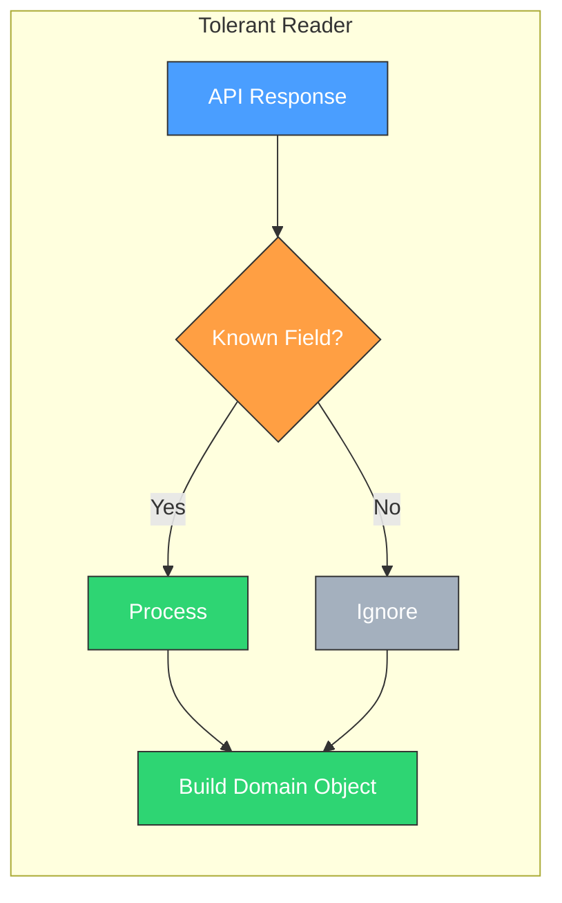
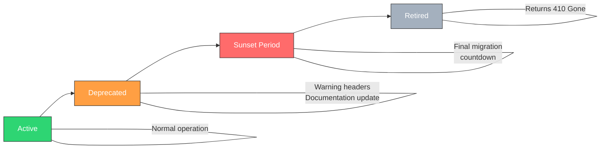
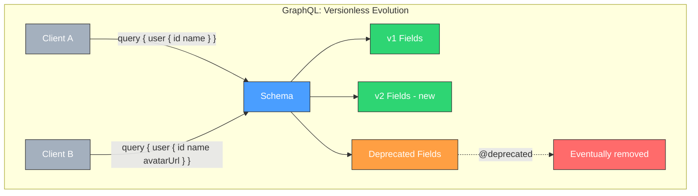
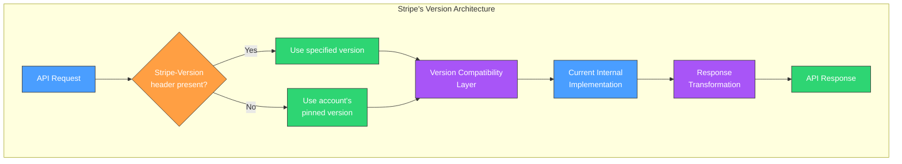
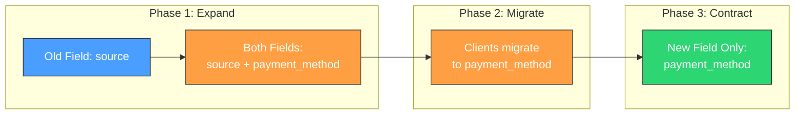
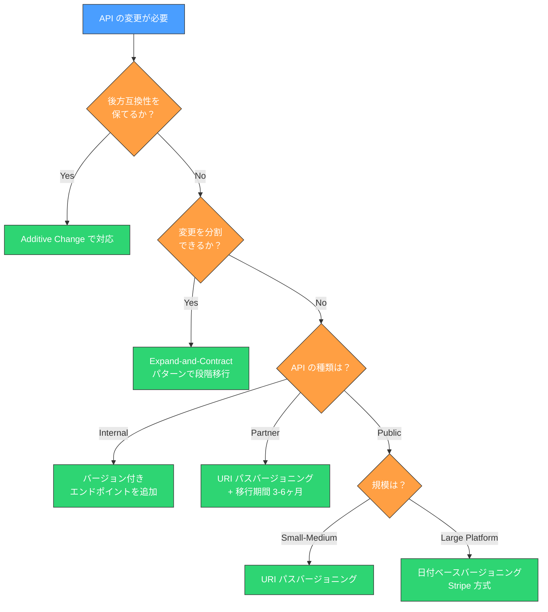
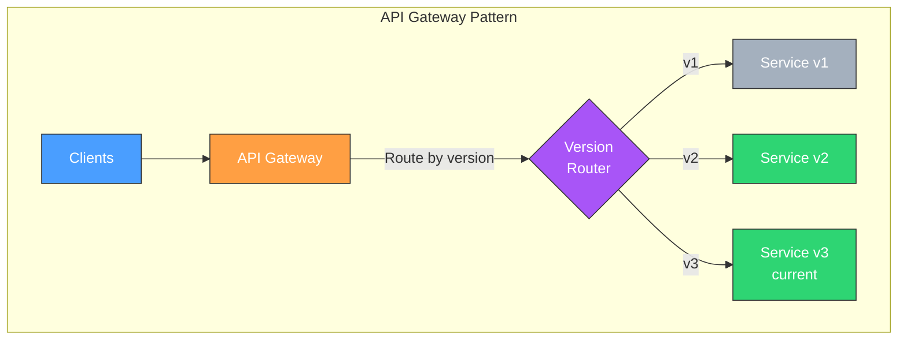

# API バージョニング戦略

## なぜ API バージョニングが必要か

ソフトウェアは変化する。ビジネス要件が変わり、理解が深まり、技術が進歩するなかで、API もまた進化を求められる。しかし API は単なるコードではなく、**契約（contract）** である。API を公開した瞬間から、その仕様に依存するクライアントが存在し、彼らのアプリケーションはその契約が守られることを前提に動作している。

API の変更が難しいのは、この契約関係に起因する。Web アプリケーションであれば、フロントエンドとバックエンドを同時にデプロイすれば済む。しかし公開 API の場合、クライアントのデプロイタイミングは提供者が制御できない。モバイルアプリは古いバージョンのまま何年も使われ続けることがある。サードパーティが構築したインテグレーションは、変更通知を見逃すかもしれない。



上図のように、同一の API プロバイダに対して、異なるバージョンの API を使うクライアントが同時に存在する。これが API バージョニングの本質的な課題である。

### 後方互換性の重要性

後方互換性（backward compatibility）とは、既存のクライアントが変更なしに動作し続けることを保証する性質である。後方互換性を維持できれば、バージョニングは不要になる。つまり、**バージョニングは後方互換性を維持できなくなったときの最後の手段** である。

後方互換性を壊すコストは大きい。

- **クライアントの移行コスト**: すべてのクライアントがコードを修正・テスト・再デプロイしなければならない
- **サポートコスト**: 移行期間中、複数バージョンを並行して運用する必要がある
- **信頼の毀損**: 頻繁に破壊的変更を行う API は、開発者に避けられるようになる

::: tip
API 設計における最善の戦略は「バージョニングしなくて済むように設計すること」である。バージョニングは解決策ではなく、後方互換性を壊してしまった場合のリカバリ手段にすぎない。
:::

## Breaking Change とは何か

### 定義

**Breaking Change（破壊的変更）** とは、既存のクライアントが修正なしには動作しなくなる API の変更のことである。形式的には、変更前の API 仕様で正しく動作していたクライアントが、変更後に期待通りの動作をしなくなる変更を指す。

### 具体例

REST API における典型的な Breaking Change を整理する。

| カテゴリ | 具体例 | なぜ壊れるか |
|---------|--------|-------------|
| フィールド削除 | レスポンスから `user.email` を削除 | クライアントがこのフィールドを参照している |
| フィールド名変更 | `created_at` → `createdAt` | 同上 |
| 型変更 | `id` を整数から文字列に変更 | パース処理が失敗する |
| 必須パラメータ追加 | 新しい必須パラメータ `region` を追加 | 既存リクエストがバリデーションエラーになる |
| エンドポイント削除 | `DELETE /users/:id` を廃止 | クライアントが 404 を受け取る |
| URL 構造変更 | `/users/:id/orders` → `/orders?user_id=:id` | クライアントのリクエスト先が存在しない |
| ステータスコード変更 | 成功時の `200` を `201` に変更 | ステータスコードで分岐しているクライアントの動作が変わる |
| エラーフォーマット変更 | エラーレスポンスの JSON 構造を変更 | エラーハンドリングが壊れる |
| 認証方式変更 | API Key 認証から OAuth 2.0 に変更 | 既存の認証情報が使えなくなる |
| ページネーション変更 | offset/limit から cursor-based に変更 | 既存のページング処理が動作しない |

::: warning
「型の拡張」も Breaking Change になりうる。たとえば、`status` フィールドが `"active"` と `"inactive"` の 2 値だったところに `"suspended"` を追加すると、`switch` 文で `default` ケースを処理していないクライアントが壊れる可能性がある。これは厳密には後方互換性のある変更だが、実践上は Breaking Change として扱うべき場合がある。
:::

### Non-Breaking Change（非破壊的変更）

一方、以下のような変更は一般的に後方互換性を保つ。

- **オプショナルなフィールドの追加**: レスポンスに新しいフィールドを追加する
- **オプショナルなパラメータの追加**: リクエストに新しい任意パラメータを追加する
- **新しいエンドポイントの追加**: 既存のエンドポイントに影響しない
- **新しい HTTP メソッドのサポート**: 既存のメソッドに影響しない

ただしこれらも、クライアントの実装によっては問題を起こす可能性がある。たとえば、レスポンスの JSON を厳密にスキーマ検証しているクライアントは、未知のフィールドが追加されただけでエラーになるかもしれない。

## バージョニング方式の比較

API のバージョンを表現する方法には複数のアプローチがある。それぞれに長所と短所があり、唯一の正解は存在しない。

### URI パスバージョニング

最も広く採用されている方式で、URL パスにバージョン番号を埋め込む。

```
GET /v1/users/123
GET /v2/users/123
```

**採用例**: Twitter API, Facebook Graph API, Google Maps API



**メリット**:
- 直感的で理解しやすい
- ブラウザで直接テストできる
- API Gateway でのルーティングが容易
- キャッシュキーとして自然に機能する
- ドキュメントでバージョンごとの仕様を明確に分離できる

**デメリット**:
- REST の原則に厳密に従うと、URI はリソースの識別子であるべきで、バージョンはリソースの属性ではない
- バージョンが増えると URL が散乱する
- バージョン間でリソース間のリンク（HATEOAS）を維持するのが複雑になる

### クエリパラメータバージョニング

クエリパラメータとしてバージョンを指定する方式。

```
GET /users/123?version=1
GET /users/123?version=2
```

**採用例**: Amazon Web Services（一部のサービス）, Google Data API（旧バージョン）

**メリット**:
- URI パスはリソース識別に専念できる
- バージョン指定を省略したときのデフォルトを設定しやすい
- 既存の URL 構造に影響を与えない

**デメリット**:
- クエリパラメータは一般的にオプショナルとみなされるため、省略時の挙動が曖昧になりやすい
- キャッシュにバージョンパラメータが含まれるようにプロキシの設定が必要
- ルーティング設定が複雑になりやすい

### HTTP ヘッダバージョニング（カスタムヘッダ）

カスタム HTTP ヘッダでバージョンを指定する方式。

```http
GET /users/123 HTTP/1.1
Host: api.example.com
X-API-Version: 2
```

**採用例**: Azure API Management

**メリット**:
- URL がクリーンに保たれる
- HTTP の仕組みとして自然
- 同じ URL で異なるバージョンにアクセスできる

**デメリット**:
- ブラウザで直接テストしにくい
- API ドキュメントで伝えにくい
- クライアント側でヘッダを明示的に設定する必要がある

### Content Negotiation（Accept ヘッダ）

HTTP の `Accept` ヘッダを使ってバージョンを指定する方式。MIME タイプのベンダー拡張を利用する。

```http
GET /users/123 HTTP/1.1
Host: api.example.com
Accept: application/vnd.example.v2+json
```

**採用例**: GitHub API（v3）

**メリット**:
- HTTP 仕様に最も忠実なアプローチ
- リソースの「表現」としてバージョンを扱うのは RESTful な考え方に合致する
- 同じリソースに対して複数の表現を提供するという HTTP の設計意図に合う

**デメリット**:
- 実装が複雑
- テストが面倒（curl で毎回ヘッダを指定する必要がある）
- 開発者にとって馴染みが薄い

### 方式の比較表

| 観点 | URI パス | クエリパラメータ | カスタムヘッダ | Content Negotiation |
|------|---------|----------------|--------------|---------------------|
| 直感性 | 高い | 中程度 | 低い | 低い |
| REST 適合性 | 低い | 中程度 | 中程度 | 高い |
| キャッシュ容易性 | 高い | 中程度 | 設定必要 | 設定必要 |
| テスト容易性 | 高い | 高い | 低い | 低い |
| API Gateway 対応 | 容易 | 中程度 | 中程度 | 複雑 |
| 採用実績 | 非常に多い | 少ない | 少ない | GitHub 等 |
| 推奨度 | 多くの場合で推奨 | 限定的 | 限定的 | 大規模 API 向け |

::: details URI パスバージョニングは本当に「RESTful でない」のか？
REST の提唱者 Roy Fielding は、バージョンを URI に含めることに否定的な見解を示している。REST の原則では、URI はリソースの識別子であり、`/v1/users/123` と `/v2/users/123` は異なるリソースを指すことになってしまう。しかし実用的には、URI パスバージョニングのシンプルさと普及度は無視できない。REST の純粋性と実用性のトレードオフとして、多くの API プロバイダが URI パスバージョニングを選択しているのが現実である。
:::

## セマンティックバージョニング（SemVer）の API への適用

### SemVer の基本

セマンティックバージョニング（Semantic Versioning、略称 SemVer）は、バージョン番号に意味を持たせる体系である。`MAJOR.MINOR.PATCH` の 3 つの数値で構成される。

- **MAJOR**: 後方互換性のない変更（Breaking Change）
- **MINOR**: 後方互換性のある機能追加
- **PATCH**: 後方互換性のあるバグ修正

```
2.3.1
│ │ └── PATCH: backward-compatible bug fix
│ └──── MINOR: backward-compatible feature addition
└────── MAJOR: breaking change
```

### API への適用パターン

ライブラリのバージョニングでは SemVer が広く使われているが、Web API に適用する場合はいくつかの考慮が必要である。

**パターン 1: MAJOR バージョンのみを公開する**

最も一般的なアプローチ。API の URL やヘッダには MAJOR バージョンのみを含め、MINOR と PATCH の変更は後方互換性を保ちつつ透過的に適用する。

```
GET /v2/users/123
```

この場合、`v2` の中で機能追加やバグ修正が行われても、クライアントは `v2` を使い続けるだけでよい。

**パターン 2: 日付ベースのバージョニング**

Stripe や Twilio が採用している方式で、バージョンを日付（YYYY-MM-DD）で表現する。SemVer とは異なるが、変更の時系列を明確にする利点がある。

```
Stripe-Version: 2024-06-20
```

**パターン 3: フル SemVer の公開**

API のバージョンをフル SemVer で公開する。ライブラリ的な API や SDK に適しているが、Web API では過剰になりがちである。

```
Accept: application/vnd.example.v2.3.1+json
```

::: tip
Web API の場合、MAJOR バージョンのみを公開し、MINOR・PATCH の変更は後方互換性を保って透過的にリリースするのが最も実用的である。クライアントが気にすべきは「Breaking Change があったかどうか」だけであり、それが MAJOR バージョンの役割である。
:::

### SemVer 適用の課題

Web API に SemVer を厳密に適用する際には、いくつかの課題がある。

1. **何が「破壊的」かの判断**: レスポンスに新しいフィールドを追加することは、厳密にはスキーマの変更だが、ほとんどのクライアントにとっては非破壊的である。どこに線を引くかは設計者の判断に委ねられる。

2. **MAJOR バージョンの頻度**: ライブラリでは MAJOR バージョンが頻繁に上がることもあるが、API では各 MAJOR バージョンを長期間サポートする必要があるため、軽々しく上げられない。

3. **内部 API と外部 API の差異**: マイクロサービス間の内部 API は SemVer が有効に機能するが、外部公開 API では MAJOR バージョンのみで十分な場合が多い。

## 非破壊的な進化

バージョニングに頼らずに API を進化させる手法は、長期的な API 管理において極めて重要である。

### Additive Change（加算的変更）

最も基本的な非破壊的進化の手法は、**既存のものを変えず、新しいものを追加する** ことである。

```json
// Before: v1 response
{
  "id": 123,
  "name": "Alice",
  "email": "alice@example.com"
}

// After: field addition (non-breaking)
{
  "id": 123,
  "name": "Alice",
  "email": "alice@example.com",
  "avatar_url": "https://example.com/avatars/123.png",
  "created_at": "2024-01-15T09:30:00Z"
}
```

既存のクライアントは `avatar_url` や `created_at` を無視するだけでよく、修正は不要である。

### Tolerant Reader Pattern

**Tolerant Reader**（寛容な読み手）パターンは、Martin Fowler が提唱した設計原則で、クライアント側の耐性を高めるアプローチである。

核心は「**必要なデータだけを読み取り、未知のデータは無視する**」ことにある。

```python
# Bad: strict parsing (fragile)
def parse_user(response):
    data = response.json()
    # Fails if schema changes
    assert set(data.keys()) == {"id", "name", "email"}
    return User(id=data["id"], name=data["name"], email=data["email"])

# Good: tolerant reader (robust)
def parse_user(response):
    data = response.json()
    # Only extract what we need, ignore the rest
    return User(
        id=data["id"],
        name=data["name"],
        email=data.get("email", ""),  # handle optional fields gracefully
    )
```

Tolerant Reader の原則をまとめると以下のようになる。

1. **未知のフィールドを無視する**: レスポンスに知らないフィールドが追加されても壊れない
2. **フィールドの順序に依存しない**: JSON オブジェクトのキー順序は保証されない
3. **オプショナルなフィールドを想定する**: 欠損していてもデフォルト値で処理できる
4. **列挙値の拡張を想定する**: `status` フィールドに未知の値が来ても `default` ケースで処理する



### Robustness Principle（Postel's Law）

Tolerant Reader パターンの根底にあるのは、Jon Postel が TCP の RFC 793 で述べた原則である。

> **"Be conservative in what you send, be liberal in what you accept."**
> （送るものには保守的に、受け取るものには寛容に）

API の文脈では以下のように解釈できる。

- **サーバー側（送るもの）**: 仕様に厳密に従ったレスポンスを返す
- **クライアント側（受け取るもの）**: 仕様に完全には合致しないレスポンスでも、可能な限り処理する

### フィールドの非推奨化（Deprecation at Field Level）

バージョンを上げずにフィールドを段階的に廃止する手法もある。

```json
{
  "id": 123,
  "name": "Alice",
  "username": "alice",
  "user_name": "alice"
}
```

上の例では `user_name` を `username` に移行したいとき、両方のフィールドを並存させる期間を設ける。API ドキュメントでは `user_name` を非推奨（deprecated）と明記し、十分な移行期間の後に削除する。この方式はバージョンを上げることなく移行を実現できる。

## API Deprecation 戦略

API の古いバージョンやエンドポイントを廃止する際には、クライアントへの影響を最小限に抑えるための計画的なアプローチが必要である。

### Sunset Header

IETF の RFC 8594 で定義された `Sunset` HTTP ヘッダは、リソースやエンドポイントの廃止日を機械可読な形式で通知する仕組みである。

```http
HTTP/1.1 200 OK
Content-Type: application/json
Sunset: Sat, 01 Mar 2025 00:00:00 GMT
Deprecation: true
Link: <https://api.example.com/v3/users>; rel="successor-version"
```

この例では以下の情報をヘッダで伝えている。

- `Sunset`: このエンドポイントが 2025 年 3 月 1 日に廃止される
- `Deprecation`: このエンドポイントは非推奨である
- `Link` ヘッダの `rel="successor-version"`: 後継バージョンの URL

### Deprecation のライフサイクル



各フェーズの詳細は以下の通りである。

**1. Active（アクティブ）**
- 通常運用状態
- 新機能の追加も行われる

**2. Deprecated（非推奨）**
- 新規利用者には推奨しないが、既存利用者は引き続き使用可能
- `Deprecation: true` ヘッダを付与
- ドキュメントに非推奨の旨を明記
- 代替手段（移行先）を明示
- 利用状況のモニタリングを開始

**3. Sunset Period（日没期間）**
- `Sunset` ヘッダで廃止日を通知
- 利用者への個別通知（メール、ダッシュボード）
- 移行ガイドの提供
- 利用率の推移を監視

**4. Retired（廃止）**
- エンドポイントが `410 Gone` を返す
- 可能であれば、新バージョンへのリダイレクト情報を提供
- ログ上で引き続きアクセスを監視

### 移行期間の設計

移行期間の長さは API の性質と利用者の状況によって異なるが、一般的なガイドラインは以下の通りである。

| API の種類 | 推奨される移行期間 | 根拠 |
|-----------|------------------|------|
| 内部 API（マイクロサービス間） | 数週間〜1 ヶ月 | チームが制御可能 |
| パートナー API（限定公開） | 3〜6 ヶ月 | パートナーとの調整が必要 |
| 公開 API（一般開発者向け） | 6〜12 ヶ月 | 多数の利用者の移行時間 |
| プラットフォーム API（Stripe, AWS 等） | 12 ヶ月以上 | エコシステム全体への影響 |

### 通知の手段

廃止通知は複数のチャネルで行うべきである。

1. **HTTP ヘッダ**: `Deprecation`, `Sunset` ヘッダによる機械可読な通知
2. **ドキュメント**: API リファレンスでの非推奨マーク
3. **変更ログ / ブログ**: 公式ブログや変更ログでの告知
4. **メール通知**: 登録されている開発者への直接通知
5. **開発者ダッシュボード**: API の利用状況とともに非推奨情報を表示
6. **SDK の警告**: 公式 SDK に非推奨の警告を組み込む

```python
import warnings

def get_user_v1(user_id):
    # Emit deprecation warning at runtime
    warnings.warn(
        "get_user_v1() is deprecated and will be removed on 2025-03-01. "
        "Use get_user_v2() instead.",
        DeprecationWarning,
        stacklevel=2,
    )
    return _call_api(f"/v1/users/{user_id}")
```

## GraphQL / gRPC におけるバージョニング

REST API だけでなく、GraphQL や gRPC といった他の API パラダイムにも独自のバージョニング課題がある。

### GraphQL のバージョニング

GraphQL は、その設計思想として**バージョニングを回避する**ことを志向している。Facebook（現 Meta）が GraphQL を設計した動機の一つが、REST API のバージョニング問題の解消であった。

GraphQL がバージョニングを回避できる理由は以下の通りである。

1. **クライアント駆動のクエリ**: クライアントが必要なフィールドだけを要求するため、サーバー側でフィールドを追加しても既存クライアントに影響しない
2. **型システムによるスキーマ定義**: GraphQL スキーマが API の契約を明示し、互換性の判断が容易
3. **フィールドレベルの非推奨**: `@deprecated` ディレクティブで個別フィールドを非推奨にできる

```graphql
type User {
  id: ID!
  name: String!
  email: String!
  username: String!
  # Deprecated: use 'username' instead
  user_name: String @deprecated(reason: "Use 'username' instead.")
  avatarUrl: String
}
```



::: warning
GraphQL でも Breaking Change は発生しうる。型の変更、必須フィールドの追加、フィールドの削除、列挙型から値を削除することなどは、いずれも破壊的変更である。GraphQL は「バージョニングが不要」なのではなく、「バージョニングが必要になる場面を減らせる」のである。
:::

### GraphQL の Breaking Change 管理ツール

GraphQL スキーマの変更が破壊的かどうかを自動検出するツールがある。

- **GraphQL Inspector**: スキーマ差分を解析し、Breaking Change を検出
- **Apollo Studio**: スキーマレジストリとして機能し、変更の影響範囲を可視化

これらのツールは CI/CD パイプラインに組み込むことで、Breaking Change が意図せず導入されるのを防ぐ。

### gRPC のバージョニング

gRPC は Protocol Buffers（protobuf）をインターフェース定義言語として使用する。protobuf には独自の互換性ルールがあり、これがバージョニング戦略に大きく影響する。

**protobuf の互換性ルール**:
- フィールドの追加は後方互換性がある（未知のフィールドは無視される）
- フィールド番号を変更してはならない
- 必須フィールド（`required`）を追加してはならない（proto3 では `required` は廃止）
- フィールドの型を変更してはならない

```protobuf
// version 1
message User {
  int64 id = 1;
  string name = 2;
  string email = 3;
}

// version 2: backward-compatible evolution
message User {
  int64 id = 1;
  string name = 2;
  string email = 3;
  string avatar_url = 4;    // new optional field
  Timestamp created_at = 5; // new optional field
  // field 6 reserved for future use
  reserved 6;
  reserved "legacy_field";  // prevent reuse of deleted field name
}
```

gRPC でバージョニングが必要になった場合のアプローチは以下の通りである。

1. **パッケージ名にバージョンを含める**: `package myapi.v1;` → `package myapi.v2;`
2. **サービス名にバージョンを含める**: `service UserServiceV2 { ... }`
3. **新旧サービスを並行稼働**: 両バージョンの gRPC サービスを同時に提供

```protobuf
// api/v1/user_service.proto
package api.v1;

service UserService {
  rpc GetUser(GetUserRequest) returns (GetUserResponse);
}

// api/v2/user_service.proto
package api.v2;

service UserService {
  rpc GetUser(GetUserRequest) returns (GetUserResponse);
  rpc ListUsers(ListUsersRequest) returns (ListUsersResponse);
}
```

## 大規模 API プラットフォームの事例

### Stripe: 日付ベースバージョニングの先駆者

Stripe は API バージョニングの最も洗練された実装の一つとして広く認知されている。その戦略は多くの API 設計者にとって参考になる。

**バージョニング方式: 日付ベース**

Stripe は API バージョンを `YYYY-MM-DD` 形式の日付で表現する。

```http
POST /v1/charges HTTP/1.1
Host: api.stripe.com
Authorization: Bearer sk_test_xxx
Stripe-Version: 2024-06-20
Content-Type: application/x-www-form-urlencoded
```

ここで注目すべきは、URL パスの `/v1/` と `Stripe-Version` ヘッダの二重構造になっている点である。URL パスの `v1` はめったに変わらない大枠のバージョンであり、`Stripe-Version` ヘッダが実際の API の振る舞いを細かく制御する。

**アカウント単位のバージョン固定**

Stripe では、各アカウントに「ピン留めされたバージョン（pinned version）」がある。アカウント作成時点の最新 API バージョンがデフォルトとして設定され、`Stripe-Version` ヘッダを明示的に指定しない限り、そのバージョンの振る舞いが適用される。



**内部実装: バージョン互換レイヤー**

Stripe の内部では、API の実装は常に最新バージョンに対して書かれている。過去のバージョンとの互換性は、**変更をチェーンとして連結する** ことで実現される。

概念的には以下のような仕組みである。

```python
class VersionChange:
    """Represents a single API version change."""
    def __init__(self, version_date, description):
        self.version_date = version_date
        self.description = description

    def transform_request(self, request):
        """Transform old-version request to current format."""
        return request

    def transform_response(self, response):
        """Transform current response to old-version format."""
        return response

class RenameFieldChange(VersionChange):
    """Example: field was renamed from 'source' to 'payment_method'."""
    def __init__(self):
        super().__init__("2024-06-20", "Rename source to payment_method")

    def transform_request(self, request):
        # Convert old field name to new
        if "source" in request:
            request["payment_method"] = request.pop("source")
        return request

    def transform_response(self, response):
        # Convert new field name back to old
        if "payment_method" in response:
            response["source"] = response.pop("payment_method")
        return response

# Changes are chained in chronological order
VERSION_CHANGES = [
    RenameFieldChange(),        # 2024-06-20
    AddFieldChange(),           # 2024-09-15
    RemoveFieldChange(),        # 2025-01-10
]

def apply_version_compatibility(request, client_version):
    """Apply all changes newer than client's version in reverse."""
    applicable_changes = [
        c for c in VERSION_CHANGES
        if c.version_date > client_version
    ]
    # Transform request forward through changes
    for change in applicable_changes:
        request = change.transform_request(request)
    return request
```

この設計の利点は以下の通りである。

1. **最新の実装を一つだけ維持**: コードのフォークが不要
2. **変更の蓄積が線形**: 新しい変更を追加するだけで、過去のすべてのバージョンが自動的にサポートされる
3. **テスト可能**: 各バージョン変更を独立してテストできる
4. **段階的な廃止**: 十分に古いバージョンの変更チェーンを削除することで、サポートを終了できる

::: tip Stripe の成功要因
Stripe のバージョニングが成功している理由は、技術的な仕組みだけでなく、運用面のコミットメントにもある。Stripe は API の後方互換性を企業文化として重視しており、Breaking Change の導入には厳格なレビュープロセスがある。また、変更ログは極めて詳細に記述され、移行ガイドが必ず用意される。技術だけでは優れた API バージョニングは実現できない。
:::

### GitHub: Content Negotiation と GraphQL の二本立て

GitHub は API バージョニングにおいて独自のアプローチを採用している。

**REST API（v3）: Accept ヘッダによるバージョニング**

GitHub の REST API は、`Accept` ヘッダのカスタム MIME タイプでバージョンを指定する。

```http
GET /repos/octocat/hello-world HTTP/1.1
Host: api.github.com
Accept: application/vnd.github.v3+json
```

特定の機能がプレビュー段階にある場合は、さらに詳細な MIME タイプを使用する。

```http
Accept: application/vnd.github.nebula-preview+json
```

**GraphQL API（v4）: バージョンレスな進化**

GitHub は 2017 年に GraphQL API を導入し、REST API の v4 に相当するものとして位置づけた。GraphQL の特性を活かし、スキーマの追加・非推奨化を通じてバージョニングなしに進化させている。

```graphql
query {
  repository(owner: "octocat", name: "hello-world") {
    name
    description
    stargazerCount
    # New fields can be added without breaking existing queries
  }
}
```

GitHub の事例は、REST API と GraphQL API を並行提供しつつ、それぞれに適したバージョニング戦略を採用する現実的なアプローチの好例である。

### Google: 体系的なバージョニングガイドライン

Google は、社内外の API 設計に関する包括的なガイドラインを公開している（Google API Design Guide）。その中でバージョニングについても詳細なルールが定められている。

**Google のバージョニング原則**:

1. **MAJOR バージョンのみを URI に含める**: `/v1/`, `/v2/`
2. **MAJOR バージョンは protobuf パッケージ名に含める**: `package google.cloud.vision.v1;`
3. **新しい MAJOR バージョンは慎重に導入する**: 可能な限り後方互換性を保つ
4. **プレビュー版には `alpha` / `beta` サフィックスを付ける**: `v1alpha1`, `v1beta2`

```
https://cloud.google.com/vision/v1/images:annotate
https://cloud.google.com/vision/v1beta2/images:annotate
```

Google の安定性レベルは以下のように定義されている。

| レベル | 意味 | SLA |
|-------|------|-----|
| `v1alpha1` | 初期アルファ版。いつでも変更可能 | なし |
| `v1beta1` | ベータ版。Breaking Change の可能性あり | 限定的 |
| `v1` | 正式版（GA）。後方互換性を保証 | 完全 |
| `v2` | 新しいメジャーバージョン | 完全 |

この段階的な安定性モデルにより、新機能を早期にフィードバックを得ながら提供しつつ、GA 版の安定性を維持できる。

## バージョニングなしの進化（Evolution over Versioning）

近年、「バージョニングを最小限に抑え、API を進化させる」というアプローチが注目されている。これは「バージョニングは必要悪であり、可能な限り避けるべきだ」という考え方に基づいている。

### Expand-and-Contract パターン

データベースのスキーマ移行で使われる Expand-and-Contract パターンは、API にも適用できる。



**Phase 1: Expand（拡張）**
- 新しいフィールドを追加する（旧フィールドは残す）
- 両方のフィールドに同じ値を設定する
- ドキュメントで旧フィールドを非推奨と明記する

**Phase 2: Migrate（移行）**
- クライアントが新しいフィールドに移行する期間を設ける
- 旧フィールドの利用状況を監視する

**Phase 3: Contract（収縮）**
- 旧フィールドの利用がゼロ（または十分に少ない）になったら削除する

### フィーチャーフラグとの組み合わせ

API の新機能をフィーチャーフラグで制御するアプローチもある。

```http
GET /users/123 HTTP/1.1
Host: api.example.com
X-Enable-Features: enhanced-profile,new-pagination
```

クライアントが明示的に新機能をオプトインする仕組みにすることで、Breaking Change を段階的に導入できる。ただし、このアプローチはフラグの組み合わせ爆発というリスクを伴う。

### API の進化を支える設計原則

バージョニングなしの進化を実現するために、初期設計の段階で意識すべき原則がある。

1. **拡張性を前提にしたスキーマ設計**: 将来のフィールド追加を想定し、JSON オブジェクトのネストは浅めにする
2. **列挙型よりも文字列**: ステータスなどの値を列挙型で厳密に定義するよりも、文字列とバリデーションの組み合わせにすることで、新しい値の追加が非破壊的になる
3. **意味的な URL 設計**: リソースの本質を反映した URL にすることで、変更の必要性を減らす
4. **冪等性の確保**: 同じリクエストを複数回送っても同じ結果になるように設計することで、リトライやバージョン移行が安全になる
5. **ハイパーメディアの活用**: レスポンスにリンクを含めることで、URL の変更をクライアントに透過的に伝えられる

```json
{
  "id": 123,
  "name": "Alice",
  "_links": {
    "self": { "href": "/users/123" },
    "orders": { "href": "/users/123/orders" },
    "profile": { "href": "/users/123/profile" }
  }
}
```

## 実践的な選択指針

これまで見てきた様々なアプローチを踏まえ、実際に API バージョニング戦略を選択する際のガイドラインを示す。

### 意思決定フローチャート



### API の種類別推奨戦略

| API の種類 | 推奨バージョニング方式 | 推奨進化戦略 | 備考 |
|-----------|---------------------|------------|------|
| マイクロサービス内部 API | パッケージ名バージョニング（gRPC）または URI パス | Expand-and-Contract | チームが制御可能、移行が素早い |
| BFF（Backend for Frontend） | バージョニング不要 | Additive Change | フロントエンドと同時デプロイ |
| パートナー API | URI パス | 通知+移行期間 | パートナー数が限定的 |
| 公開 REST API | URI パス | Expand-and-Contract + Sunset Header | 最もシンプルで実績あり |
| 大規模プラットフォーム API | 日付ベース（Stripe 方式） | バージョン互換レイヤー | 構築コストが高いが柔軟 |
| GraphQL API | バージョンレス | `@deprecated` + Additive Change | GraphQL の強みを活かす |
| gRPC API | パッケージバージョニング | protobuf の互換性ルール | protobuf の仕組みに従う |

### やってはいけないこと

バージョニング戦略を実施する際に避けるべきアンチパターンを挙げる。

::: danger アンチパターン

**1. バージョンを頻繁に上げる**
バージョンの数が増えると、サポートコストが指数的に増加する。可能な限り既存バージョン内で進化させるべきである。

**2. 旧バージョンのサポート終了日を定めない**
「いつかサポートを終了する」では、いつまでもクライアントが移行しない。明確な日程を示し、定期的にリマインドすること。

**3. 旧バージョンと新バージョンで振る舞いが微妙に異なる**
バグ修正であっても、旧バージョンのユーザーに予期しない動作変更を引き起こすことがある。バージョン間の振る舞いの違いは明示的に文書化すること。

**4. バージョニング方式を途中で変更する**
URI パスから Content Negotiation に切り替えるといった変更は、それ自体が Breaking Change である。最初にしっかり選択すること。

**5. デフォルトバージョンを最新版にする**
バージョンを指定しないリクエストのデフォルトを最新版にすると、新バージョンがリリースされるたびに既存クライアントが壊れる。デフォルトは最も古いサポートバージョン、または最初のバージョンに固定すべきである（Stripe のようにアカウント作成時のバージョンに固定するのが理想的）。
:::

### 実装のベストプラクティス

最後に、バージョニングの実装において守るべきベストプラクティスをまとめる。

**1. API Gateway によるバージョンルーティング**



API Gateway でバージョンルーティングを行うことで、バックエンドサービスはバージョニングロジックから解放される。

**2. バージョン間の差分を自動テストする**

CI/CD パイプラインに、各サポートバージョンに対する自動テストを組み込む。特にレスポンスのスキーマが意図せず変更されていないかを検証するスキーマテストが重要である。

```python
import jsonschema

def test_v1_user_response_schema():
    """Ensure v1 user endpoint still returns expected schema."""
    response = client.get("/v1/users/123")
    v1_schema = {
        "type": "object",
        "required": ["id", "name", "email"],
        "properties": {
            "id": {"type": "integer"},
            "name": {"type": "string"},
            "email": {"type": "string"},
        },
        # Allow additional properties for forward compatibility
        "additionalProperties": True,
    }
    jsonschema.validate(response.json(), v1_schema)
```

**3. 利用状況のモニタリング**

各バージョンの利用状況を継続的に監視し、廃止の判断材料にする。

```python
# Middleware to track API version usage
class VersionTrackingMiddleware:
    def __init__(self, app):
        self.app = app

    def __call__(self, request):
        version = self.extract_version(request)
        # Record metrics for monitoring
        metrics.increment(
            "api.request",
            tags={
                "version": version,
                "endpoint": request.path,
                "client_id": request.headers.get("X-Client-ID", "unknown"),
            },
        )
        return self.app(request)

    def extract_version(self, request):
        # Extract version from URL path, header, etc.
        pass
```

**4. 変更ログの自動生成**

OpenAPI（Swagger）仕様を使って API を定義している場合、バージョン間の差分から変更ログを自動生成できる。これにより、Breaking Change の見落としを防ぎ、ドキュメントの整合性を保てる。

## まとめ

API バージョニングは、API のライフサイクル管理における重要な側面である。本記事で述べた内容を要約する。

**1. バージョニングは最後の手段**

最善の戦略は「バージョニングしなくて済むように設計すること」である。Additive Change、Tolerant Reader パターン、Expand-and-Contract パターンを活用し、可能な限り後方互換性を維持すべきである。

**2. バージョニング方式は状況に応じて選択する**

URI パスバージョニングが最もシンプルで普及しているが、大規模プラットフォームでは Stripe のような日付ベースバージョニングが有効な場合もある。Content Negotiation は REST の純粋性を重視する場合に適している。重要なのは、一度選択したら途中で変更しないことである。

**3. Deprecation は計画的に**

`Sunset` ヘッダ、ドキュメント更新、メール通知など、複数のチャネルで十分な期間をもって廃止を通知する。移行ガイドの提供も欠かせない。

**4. GraphQL や gRPC にはそれぞれの進化戦略がある**

GraphQL はスキーマの段階的な進化を重視し、gRPC は protobuf の互換性ルールに従う。REST API のバージョニング手法をそのまま適用するのではなく、各パラダイムの特性を活かすべきである。

**5. 大規模 API の運用は技術だけでなく組織的なコミットメントが必要**

Stripe の事例が示すように、優れた API バージョニングは技術的な仕組みだけでなく、後方互換性を重視する文化、詳細な変更ログ、丁寧な移行サポートといった組織的な取り組みがあって初めて成立する。

API は「公開したコード」ではなく「公開した約束」である。その約束をどう守り、どう進化させるか — それが API バージョニング戦略の本質である。
