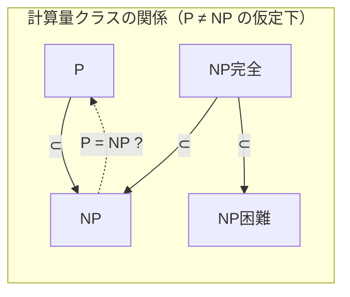
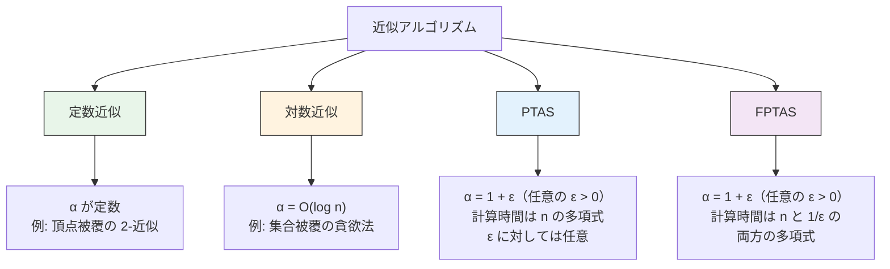
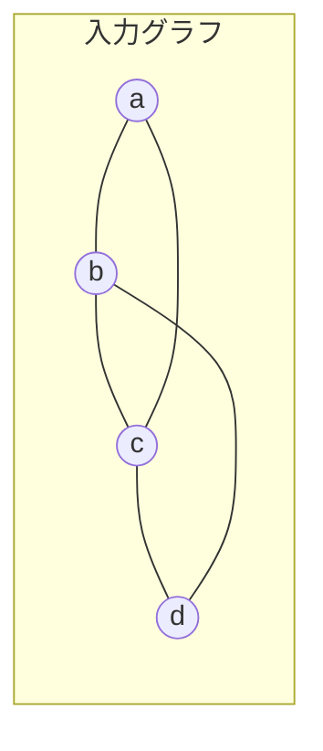
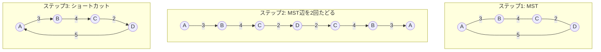
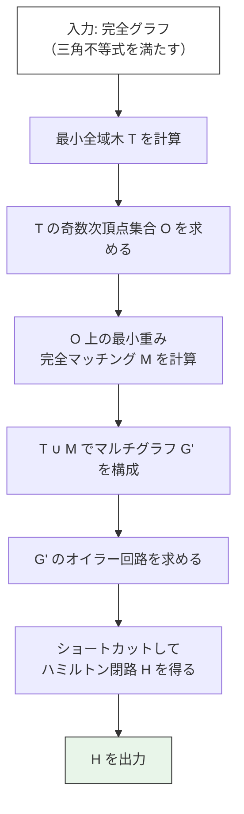
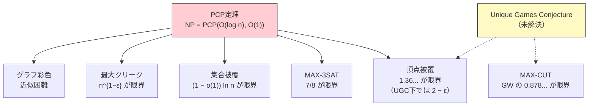
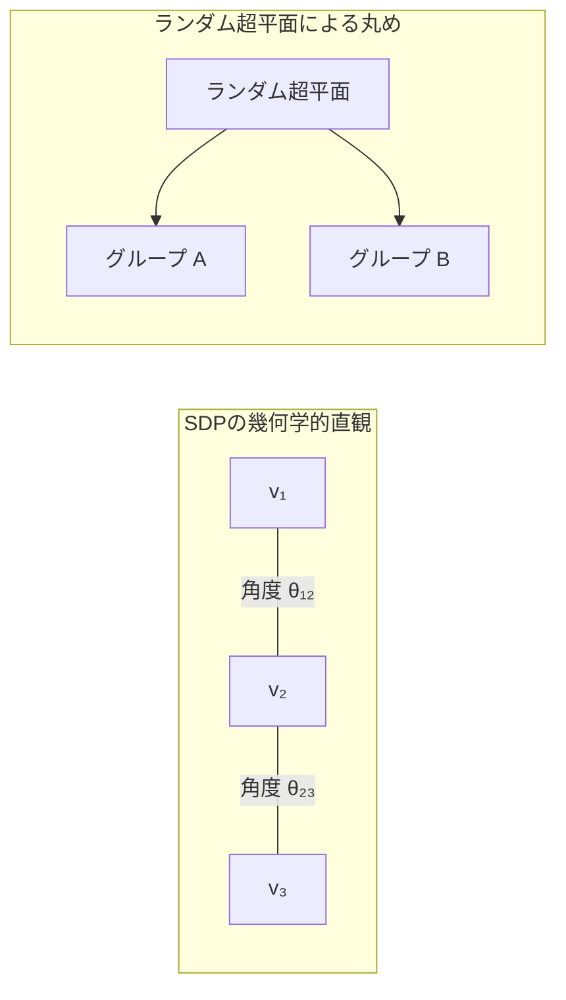
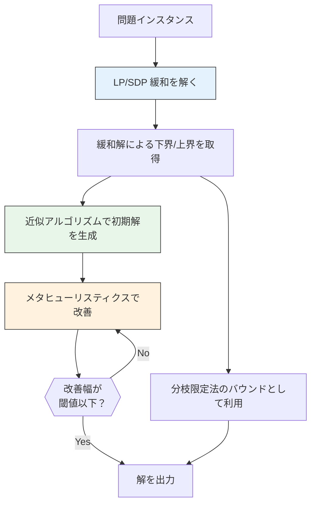

# 近似アルゴリズム — NP困難問題への実用的アプローチ

## 1. NP困難問題と近似の必要性

計算機科学において、多くの重要な最適化問題は**NP困難**（NP-hard）であることが知られている。NP困難問題に対して多項式時間で最適解を求めるアルゴリズムは（P $\neq$ NP を仮定する限り）存在しない。しかし、現実世界ではこれらの問題を「解かなくてよい」わけではない。物流の配送ルート最適化、ネットワーク設計、スケジューリング、チップ設計のレイアウト――いずれも NP困難問題として定式化されるが、産業界では日々解を求められている。

この状況に対し、計算機科学は複数のアプローチを用意している。

```
NP困難問題に対する戦略:

┌──────────────────────────────────────────────────────┐
│ 1. 厳密解法（指数時間を許容）                          │
│    - 分枝限定法、動的計画法など                        │
│    - 小規模インスタンスでは現実的                      │
├──────────────────────────────────────────────────────┤
│ 2. 近似アルゴリズム（多項式時間＋品質保証）             │
│    - 最適解との乖離に理論的上界を持つ                  │
│    - 本記事の主題                                      │
├──────────────────────────────────────────────────────┤
│ 3. ヒューリスティクス（多項式時間、品質保証なし）       │
│    - 実用上は良い解を返すことが多い                    │
│    - 焼きなまし法、遺伝的アルゴリズムなど              │
├──────────────────────────────────────────────────────┤
│ 4. 特殊ケースへの制限                                  │
│    - 入力に構造的制約を課し、多項式時間で厳密解        │
│    - 例: 木構造上の問題、平面グラフ上の問題            │
└──────────────────────────────────────────────────────┘
```

近似アルゴリズムが他のアプローチと異なる最も重要な点は、**多項式時間で動作しつつ、解の品質に理論的な保証を与える**ことである。つまり「高速に解を求め、しかもその解が最適解からどれだけ離れているか」を数学的に証明できる。この保証があるからこそ、近似アルゴリズムは理論的にも実用的にも信頼される。

### 1.1 計算量クラスの復習

近似アルゴリズムの議論に入る前に、関連する計算量クラスを簡潔に整理しておく。

- **P**: 多項式時間で**解ける**（判定できる）問題のクラス
- **NP**: 多項式時間で解の**検証**ができる問題のクラス
- **NP完全**（NP-complete）: NP に属し、かつ NP 中のすべての問題から多項式時間で帰着可能な問題。SAT、頂点被覆の判定版、ハミルトン閉路問題など
- **NP困難**（NP-hard）: NP 中のすべての問題から多項式時間で帰着可能な問題。判定問題とは限らず、最適化問題も含む



NP困難な最適化問題の例は数多い。

| 問題 | 概要 | 応用 |
|------|------|------|
| 巡回セールスマン問題（TSP） | すべての都市を1回ずつ訪問する最短巡回路 | 物流、配送ルート |
| 頂点被覆（Vertex Cover） | すべての辺を被覆する最小頂点集合 | ネットワーク監視 |
| 集合被覆（Set Cover） | 全要素を被覆する最小コストの部分集合族 | リソース配置 |
| ナップサック問題 | 容量制約下の価値最大化 | 投資配分、積載 |
| グラフ彩色 | 最小色数での頂点彩色 | スケジューリング |
| 最大カット（Max-Cut） | 辺の重みの合計を最大化するグラフの二分割 | VLSI設計 |

### 1.2 なぜ「近似」が重要か

NP困難問題に対して厳密解を求めると、最悪計算量は指数的になる。例えば TSP の厳密解法は $O(n^2 \cdot 2^n)$ の動的計画法（Held–Karp アルゴリズム）が知られているが、$n = 30$ でおよそ $3 \times 10^{10}$ 程度の計算量となり、$n = 50$ では現実的な時間では終わらない。

一方、物流企業が扱う配送先は数百から数千に及ぶ。このとき必要なのは、「最適解でなくても、最適解に近い解を高速に得る」ことである。近似アルゴリズムは、この要求に理論的裏付けを持って応える。

---

## 2. 近似比の定義

近似アルゴリズムの品質を測る尺度が**近似比**（approximation ratio）である。

### 2.1 形式的定義

最適化問題のインスタンス $I$ に対して、最適解の目的関数値を $\text{OPT}(I)$、近似アルゴリズム $A$ が返す解の目的関数値を $A(I)$ とする。

**最小化問題**の場合、アルゴリズム $A$ が**$\alpha$-近似**（$\alpha \geq 1$）であるとは、すべてのインスタンス $I$ に対して

$$
A(I) \leq \alpha \cdot \text{OPT}(I)
$$

が成り立つことをいう。

**最大化問題**の場合、アルゴリズム $A$ が**$\alpha$-近似**（$0 < \alpha \leq 1$）であるとは、すべてのインスタンス $I$ に対して

$$
A(I) \geq \alpha \cdot \text{OPT}(I)
$$

が成り立つことをいう。

::: tip 近似比の流儀
文献によって近似比の表記が異なることがある。最小化問題で「$\alpha$-近似」と書いたとき $\alpha \geq 1$ とする流儀（本記事の流儀）と、最大化・最小化を統一して $\max\left(\frac{A(I)}{\text{OPT}(I)}, \frac{\text{OPT}(I)}{A(I)}\right) \leq \alpha$ とする流儀がある。いずれの場合も、$\alpha$ が 1 に近いほど良い近似であることは共通している。
:::

### 2.2 近似比の直観的意味

近似比 $\alpha$ は、最悪の場合にアルゴリズムがどれだけ「損をする」かの上界である。

- **2-近似アルゴリズム**: 最悪でも最適解の2倍以内のコスト（最小化問題）
- **$\frac{3}{2}$-近似アルゴリズム**: 最悪でも最適解の1.5倍以内のコスト
- **$(1 + \varepsilon)$-近似アルゴリズム**: 任意の $\varepsilon > 0$ に対し、最適解の $(1 + \varepsilon)$ 倍以内

重要な点として、近似比は**最悪ケース**での保証である。多くの実用的なインスタンスでは、近似比よりもはるかに良い解が得られることが多い。

### 2.3 近似アルゴリズムの分類

近似比の性質に基づき、近似アルゴリズムは以下のように分類できる。



この分類は「どれだけ精度よく近似できるか」を反映しており、FPTAS が最も望ましく、近似不可能な問題が最も困難である。

---

## 3. 頂点被覆の2-近似アルゴリズム

**頂点被覆問題**（Vertex Cover Problem）は、近似アルゴリズムの最も基本的な題材の一つである。

### 3.1 問題の定義

無向グラフ $G = (V, E)$ が与えられたとき、**頂点被覆**とは、すべての辺 $e \in E$ の少なくとも一方の端点を含む頂点の部分集合 $S \subseteq V$ である。**最小頂点被覆問題**は、$|S|$ を最小化する頂点被覆を求める問題であり、NP困難である。

### 3.2 極大マッチングに基づく2-近似

驚くほど単純なアルゴリズムが2-近似を達成する。

**アルゴリズム: APPROX-VERTEX-COVER**

1. $C \leftarrow \emptyset$（被覆集合）
2. $E' \leftarrow E$（残りの辺の集合）
3. $E'$ が空でない間:
   a. $E'$ から任意の辺 $(u, v)$ を選ぶ
   b. $C \leftarrow C \cup \{u, v\}$（両端点を追加）
   c. $u$ または $v$ に接続するすべての辺を $E'$ から除去
4. $C$ を返す

```python
def approx_vertex_cover(graph):
    """
    2-approximation algorithm for Minimum Vertex Cover.
    Uses maximal matching approach.
    """
    cover = set()
    edges = set(graph.edges())

    while edges:
        # Pick an arbitrary edge
        u, v = next(iter(edges))
        cover.add(u)
        cover.add(v)

        # Remove all edges incident to u or v
        edges = {(a, b) for (a, b) in edges
                 if a != u and a != v and b != u and b != v}

    return cover
```

### 3.3 近似比の証明

**定理**: APPROX-VERTEX-COVER は2-近似アルゴリズムである。

**証明**: アルゴリズムが選んだ辺の集合を $M$ とする。$M$ はマッチング（どの2辺も端点を共有しない）である。なぜなら、辺 $(u, v)$ を選んだ後、$u$ と $v$ に接続するすべての辺を除去しているからである。

- アルゴリズムが返す被覆のサイズは $|C| = 2|M|$ である（各辺の両端点を追加するため）。
- $M$ の各辺について、少なくとも一方の端点は任意の頂点被覆に含まれなければならない（辺が被覆されるために）。
- $M$ はマッチングなので、$M$ の辺は端点を共有しない。したがって、最適頂点被覆 $C^*$ は $M$ の各辺から少なくとも1つの端点を含む。
- よって $|C^*| \geq |M|$ である。

以上より:

$$
|C| = 2|M| \leq 2|C^*|
$$

これは $|C| \leq 2 \cdot \text{OPT}$ を意味し、2-近似が示された。 $\square$

### 3.4 具体例での動作



**ステップ1**: 辺 $(a, b)$ を選択 → $C = \{a, b\}$、$a, b$ に接続する辺を除去

**ステップ2**: 残る辺 $(c, d)$ を選択 → $C = \{a, b, c, d\}$

結果: $|C| = 4$

実際の最適頂点被覆は $\{b, c\}$（サイズ2）であるため、この例では近似比がちょうど2に達している。これは最悪ケースに近い例であり、近似比の上界がタイトであることを示している。

### 3.5 頂点被覆の近似限界

頂点被覆の最小近似比については、長年の研究がある。

- Dinur と Safra（2005年）は、P $\neq$ NP を仮定して、$1.3606$-近似未満の多項式時間アルゴリズムは存在しないことを示した。
- UGC（Unique Games Conjecture）を仮定すると、$(2 - \varepsilon)$-近似が限界であることが Khot と Regev（2008年）により示された。
- つまり、上記の単純な2-近似アルゴリズムは、UGC が正しければ本質的に最良の近似比を達成している。

---

## 4. 巡回セールスマン問題の近似

**巡回セールスマン問題**（Traveling Salesman Problem, TSP）は、$n$ 個の都市をすべて1回ずつ訪問して出発点に戻る最短の巡回路を求める問題である。一般の TSP は近似すら困難であるが、距離が**三角不等式**を満たす場合（メトリック TSP）には良い近似が可能になる。

### 4.1 一般TSPの近似不可能性

**定理**: P $\neq$ NP を仮定すると、一般の TSP に対して、任意の多項式計算可能な関数 $f(n)$ について $f(n)$-近似アルゴリズムは存在しない。

直観的には、一般の TSP では距離を自由に設定できるため、ハミルトン閉路の存在判定（NP完全問題）を埋め込むことができ、近似すら困難になる。

### 4.2 メトリックTSPと2-近似

距離関数 $d$ が**三角不等式** $d(u, w) \leq d(u, v) + d(v, w)$ を満たす場合、以下の手順で2-近似が得られる。

**アルゴリズム: MST-TSP**

1. グラフの**最小全域木**（MST）$T$ を求める（Kruskal法やPrim法）
2. $T$ の各辺を2回たどる（往復）ことで、すべての頂点を訪問するウォーク $W$ を得る
3. $W$ から重複する頂点訪問を**ショートカット**して巡回路 $H$ を得る



**近似比の証明**:

- 最適巡回路 $H^*$ から任意の1辺を除くと全域木になるため、$\text{MST} \leq \text{OPT}$
- ウォーク $W$ のコストは MST の各辺を2回たどるので $\text{cost}(W) = 2 \cdot \text{MST}$
- ショートカットは三角不等式により距離を増やさないので $\text{cost}(H) \leq \text{cost}(W)$

$$
\text{cost}(H) \leq 2 \cdot \text{MST} \leq 2 \cdot \text{OPT}
$$

### 4.3 Christofidesのアルゴリズム（$\frac{3}{2}$-近似）

1976年に Nicos Christofides が提案したアルゴリズムは、メトリック TSP に対して**$\frac{3}{2}$-近似**を達成する。2023年時点でも、このアルゴリズムは50年近く最良の近似比を保っている（Karlin–Klein–Oveis Gharan による $(3/2 - \varepsilon)$-近似の成果が2021年に発表されたが、改善幅は極めて小さい）。

**アルゴリズム: Christofides**

1. 入力グラフの最小全域木 $T$ を求める
2. $T$ において次数が奇数の頂点の集合 $O$ を求める
3. $O$ 上の**最小重み完全マッチング** $M$ を求める
4. $T$ と $M$ の辺を合わせたマルチグラフ $G'$ を構成する
5. $G'$ の**オイラー回路**を求める
6. ショートカットして巡回路 $H$ を得る



**なぜ奇数次頂点のマッチングか？** オイラー回路が存在するためには、すべての頂点の次数が偶数でなければならない。MST には奇数次の頂点が存在しうるが、グラフ理論の基本定理により奇数次の頂点数は偶数個である。そこで奇数次頂点同士をマッチングで結ぶことで、すべての頂点の次数を偶数にできる。

**近似比 $\frac{3}{2}$ の証明の概略**:

- $\text{cost}(T) \leq \text{OPT}$（前述の議論と同じ）
- $O$ の頂点を最適巡回路 $H^*$ の順に巡ると、$O$ 上の巡回路が得られる。この巡回路は2つの完全マッチングに分割できる（$O$ の頂点を交互に分ける）。各マッチングのコストの合計は（三角不等式とショートカットの議論により）$\text{OPT}$ 以下であるため、小さい方のマッチングのコストは $\frac{\text{OPT}}{2}$ 以下。
- したがって $\text{cost}(M) \leq \frac{\text{OPT}}{2}$

$$
\text{cost}(H) \leq \text{cost}(T) + \text{cost}(M) \leq \text{OPT} + \frac{\text{OPT}}{2} = \frac{3}{2} \cdot \text{OPT}
$$

### 4.4 実装上の考慮点

Christofides アルゴリズムの計算ボトルネックは、ステップ3の最小重み完全マッチングである。Edmonds のアルゴリズム（blossom algorithm）により $O(n^3)$ で計算できる。MST の計算は $O(n^2 \log n)$ または $O(n^2)$（完全グラフの場合は Prim 法が効率的）、オイラー回路の構成は $O(n)$ である。全体の計算量は $O(n^3)$ となる。

---

## 5. 集合被覆の貪欲近似

### 5.1 問題の定義

**集合被覆問題**（Set Cover Problem）は以下のように定義される。

- 全体集合 $U = \{e_1, e_2, \ldots, e_n\}$（$n$ 個の要素）
- 部分集合の族 $\mathcal{S} = \{S_1, S_2, \ldots, S_m\}$（$S_i \subseteq U$、各 $S_i$ にコスト $c_i$ が付随）
- 目的: $\bigcup_{i \in I} S_i = U$ を満たす $I \subseteq \{1, \ldots, m\}$ のうち、$\sum_{i \in I} c_i$ を最小化する

集合被覆は極めて汎用的な問題であり、頂点被覆はその特殊ケースである。

### 5.2 貪欲アルゴリズム

**アルゴリズム: GREEDY-SET-COVER**

各反復で、**費用対効果が最も良い**集合を選ぶ。

1. $R \leftarrow U$（未被覆要素の集合）
2. $I \leftarrow \emptyset$（選んだ集合のインデックス）
3. $R \neq \emptyset$ の間:
   a. 費用対効果 $\frac{c_i}{|S_i \cap R|}$ を最小化する $S_i$ を選択
   b. $I \leftarrow I \cup \{i\}$
   c. $R \leftarrow R \setminus S_i$
4. $I$ を返す

```python
def greedy_set_cover(universe, subsets, costs):
    """
    Greedy approximation for Weighted Set Cover.
    Returns indices of selected subsets.

    :param universe: set of all elements
    :param subsets: list of sets
    :param costs: list of costs for each subset
    """
    uncovered = set(universe)
    selected = []

    while uncovered:
        # Find subset with best cost-effectiveness
        best_idx = None
        best_ratio = float('inf')

        for i, s in enumerate(subsets):
            newly_covered = len(s & uncovered)
            if newly_covered > 0:
                ratio = costs[i] / newly_covered
                if ratio < best_ratio:
                    best_ratio = ratio
                    best_idx = i

        selected.append(best_idx)
        uncovered -= subsets[best_idx]

    return selected
```

### 5.3 近似比 $H_n$ の証明

**定理**: 貪欲アルゴリズムは $H_n$-近似である。ここで $H_n = \sum_{k=1}^{n} \frac{1}{k} = \ln n + O(1)$ は第 $n$ 調和数である。

**証明の概略**:

各要素 $e$ にコストを割り当てる。要素 $e$ が初めて被覆されたとき、その反復で選ばれた集合 $S_i$ のコスト $c_i$ を、$S_i$ が新たに被覆した要素数 $|S_i \cap R|$ で割ったものを $e$ の「価格」$\text{price}(e)$ とする。

$$
\text{price}(e) = \frac{c_i}{|S_i \cap R|}
$$

貪欲アルゴリズムの総コストは:

$$
\text{GREEDY} = \sum_{e \in U} \text{price}(e)
$$

ここで、最適解の各集合 $S_j$（$j \in I^*$）に含まれる要素の価格の合計が $c_j \cdot H_{|S_j|}$ 以下であることを示せる。直観的には、集合 $S_j$ の要素が1つずつ被覆されていくとき、残りの要素数は $|S_j|, |S_j| - 1, \ldots, 1$ と減少し、各時点での費用対効果（これは貪欲選択により $c_j$ を現在のカバー能力で割ったもの以下）を合計すると調和級数が現れる。

$$
\sum_{e \in S_j} \text{price}(e) \leq c_j \cdot H_{|S_j|} \leq c_j \cdot H_n
$$

したがって:

$$
\text{GREEDY} = \sum_{e \in U} \text{price}(e) \leq \sum_{j \in I^*} \sum_{e \in S_j} \text{price}(e) \leq H_n \cdot \sum_{j \in I^*} c_j = H_n \cdot \text{OPT}
$$

（最初の不等式は、各要素が最適解の少なくとも1つの集合に属していることから従う。） $\square$

### 5.4 近似比のタイト性と限界

- 貪欲アルゴリズムの近似比 $H_n = \Theta(\log n)$ はタイトである。すなわち、近似比がちょうど $H_n$ に達するインスタンスが構成できる。
- Dinur と Steurer（2014年）は、P $\neq$ NP を仮定して、集合被覆問題に対する $(1 - o(1)) \ln n$-近似未満の多項式時間アルゴリズムは存在しないことを示した。
- つまり、貪欲アルゴリズムは集合被覆に対して**本質的に最良**の近似比を達成している。

---

## 6. PTAS と FPTAS

一部の NP困難問題では、任意の精度 $\varepsilon > 0$ に対して $(1 + \varepsilon)$-近似を達成する多項式時間アルゴリズムが存在する。このようなアルゴリズム体系を**PTAS**（Polynomial-Time Approximation Scheme）と呼ぶ。

### 6.1 PTASの定義

最小化問題に対する **PTAS** とは、任意の固定された $\varepsilon > 0$ に対して、$(1 + \varepsilon)$-近似を達成し、入力サイズ $n$ に関して多項式時間で動作するアルゴリズム族である。

ただし、計算時間が $\varepsilon$ に対して多項式である必要はない。例えば、$O(n^{1/\varepsilon})$ や $O(n^{2^{1/\varepsilon}})$ も PTAS の定義を満たす。$\varepsilon = 0.01$ のとき $O(n^{100})$ となり、理論的には多項式時間だが実用的ではない。

### 6.2 FPTASの定義

**FPTAS**（Fully Polynomial-Time Approximation Scheme）は、PTAS の強化版であり、計算時間が $n$ と $1/\varepsilon$ の**両方**に関して多項式であることを要求する。すなわち、計算時間が $\text{poly}(n, 1/\varepsilon)$ であるアルゴリズム族である。

$$
\text{計算時間} = O\left(n^{c_1} \cdot \left(\frac{1}{\varepsilon}\right)^{c_2}\right) \quad (c_1, c_2 \text{ は定数})
$$

FPTASは、$\varepsilon$ を小さくしても計算時間が穏やかにしか増加しないため、実用上も価値が高い。

### 6.3 ナップサック問題のFPTAS

0-1ナップサック問題は NP困難であるが、FPTAS が存在する代表的な問題である。

**問題**: $n$ 個の品物があり、品物 $i$ の重さは $w_i$、価値は $v_i$。容量 $W$ のナップサックに入れる品物の部分集合を選び、総価値を最大化する。

**動的計画法ベースのFPTAS**:

核心となるアイデアは、**価値のスケーリングと丸め**である。

1. 最大価値 $v_{\max} = \max_i v_i$ を求める
2. スケーリング因子 $K = \frac{\varepsilon \cdot v_{\max}}{n}$ を設定
3. 各品物の価値を $\hat{v}_i = \lfloor v_i / K \rfloor$ に丸める
4. 丸めた価値 $\hat{v}_i$ を用いて動的計画法で最適解を求める

```python
def fptas_knapsack(values, weights, capacity, epsilon):
    """
    FPTAS for 0-1 Knapsack Problem.

    :param values: list of item values
    :param weights: list of item weights
    :param capacity: knapsack capacity
    :param epsilon: approximation parameter (0 < epsilon < 1)
    :return: list of selected item indices
    """
    n = len(values)
    v_max = max(values)

    # Scaling factor
    K = (epsilon * v_max) / n

    # Scaled values (rounded down)
    scaled_values = [int(v / K) for v in values]

    # DP with scaled values
    # dp[j] = minimum weight to achieve total scaled value j
    max_val = sum(scaled_values)
    dp = [float('inf')] * (max_val + 1)
    dp[0] = 0

    # Track which items were selected
    selected = [[] for _ in range(max_val + 1)]

    for i in range(n):
        # Traverse in reverse to avoid using item i twice
        for j in range(max_val, scaled_values[i] - 1, -1):
            new_weight = dp[j - scaled_values[i]] + weights[i]
            if new_weight < dp[j]:
                dp[j] = new_weight
                selected[j] = selected[j - scaled_values[i]] + [i]

    # Find best feasible solution
    best_val = 0
    for j in range(max_val + 1):
        if dp[j] <= capacity:
            best_val = j

    return selected[best_val]
```

**計算時間の解析**:

丸めた価値の上界は $\hat{v}_i \leq v_i / K = n / \varepsilon$（正規化後）であり、全品物の丸め価値の合計は $O(n^2 / \varepsilon)$。動的計画法のテーブルサイズは $O(n^2 / \varepsilon)$ であり、各エントリの更新は $O(1)$ で、$n$ 個の品物について繰り返すので、全体の計算時間は:

$$
O\left(\frac{n^3}{\varepsilon}\right)
$$

これは $n$ と $1/\varepsilon$ の多項式であり、FPTAS の要件を満たす。

**近似比の証明**:

丸めにより各品物の価値で失われるのは高々 $K$ であり、$n$ 個の品物全体では高々 $nK = \varepsilon \cdot v_{\max}$ の損失である。最適解の価値は少なくとも $v_{\max}$ であるため:

$$
\text{FPTAS} \geq \text{OPT} - \varepsilon \cdot v_{\max} \geq \text{OPT} - \varepsilon \cdot \text{OPT} = (1 - \varepsilon) \cdot \text{OPT}
$$

### 6.4 FPTASが存在しない問題

すべての NP困難問題に FPTAS が存在するわけではない。

- **集合被覆**: P $\neq$ NP の下で PTAS すら存在しない（$\Theta(\log n)$ が限界）
- **TSP（メトリック）**: P $\neq$ NP の下で FPTAS は存在しないと考えられている（PTAS は存在する：Arora, Mitchell による PTAS はユークリッド TSP に限定）
- **最大独立集合**: P $\neq$ NP の下で $n^{1-\varepsilon}$-近似すら困難

```
問題の近似可能性のスペクトル:

      容易                                            困難
  ◄─────────────────────────────────────────────────────►

  FPTAS        PTAS       定数近似    対数近似    近似不可能
  ┃            ┃          ┃          ┃           ┃
  ナップサック  ユークリッド  頂点被覆    集合被覆     最大独立集合
               TSP       メトリックTSP             グラフ彩色
```

---

## 7. 近似の限界 — PCP定理

近似アルゴリズムの研究において、最も深遠な成果の一つが**PCP定理**（PCP Theorem）である。PCP定理は、多くの問題に対する近似の困難性を証明するための基盤となっている。

### 7.1 PCP定理の直観

PCP（Probabilistically Checkable Proof）とは、「確率的に検査可能な証明」のことである。通常の NP の定義では、証明（証拠）のすべてのビットを読む必要がある。PCP定理は、「NP の任意の問題の証明を、ランダムに少数のビットだけを読んで高確率で検証できる形式に変換できる」ことを主張する。

**PCP定理**（Arora, Lund, Motwani, Sudan, Szegedy, 1998）:

$$
\text{NP} = \text{PCP}(O(\log n), O(1))
$$

ここで $\text{PCP}(r(n), q(n))$ は、$r(n)$ ビットのランダムネスと $q(n)$ 回の証明へのクエリを用いて検証可能な問題のクラスである。つまり、NP に属する任意の問題は、$O(\log n)$ ビットのランダムネスと**定数回**の証明へのクエリで検証できる。

### 7.2 PCP定理と近似困難性

PCP定理の驚くべき帰結は、近似困難性への直接的な応用である。

**例: MAX-3SAT**

MAX-3SAT は、3-CNF 論理式において、充足される節の数を最大化する問題である。

PCP定理から以下が導かれる:

**定理**: P $\neq$ NP を仮定すると、MAX-3SAT に対して $\frac{7}{8} + \varepsilon$ 近似（$\varepsilon > 0$）を達成する多項式時間アルゴリズムは存在しない。

一方、各変数をランダムに True/False に設定するだけで、期待値として節の $\frac{7}{8}$ の割合を充足できる（各節が3リテラルを持つため、充足されない確率は $(1/2)^3 = 1/8$）。Johan Hastad（2001年）はこの $\frac{7}{8}$ という閾値がタイトであることを示した。つまり、ランダム割当てという最も素朴な方法が、本質的に最良の近似比を達成しているのである。

### 7.3 近似困難性の全体像

PCP定理とその発展により、多くの問題の近似限界が明らかになった。



### 7.4 Unique Games Conjecture（UGC）

Subhash Khot（2002年）が提唱した **Unique Games Conjecture**（UGC）は、PCP定理をさらに精密化する予想であり、多くの問題の「正確な」近似限界を導く。

UGC が正しければ:

- **頂点被覆**: $(2 - \varepsilon)$-近似が限界
- **MAX-CUT**: Goemans–Williamson の $\approx 0.878$-近似が限界
- **多くの CSP**: 半正定値計画法（SDP）に基づく近似が最良

UGC は未証明であり、計算量理論の最も重要な未解決問題の一つである。

---

## 8. LP緩和とランダム丸め

**線形計画緩和**（LP relaxation）は、近似アルゴリズム設計における最も体系的かつ強力な手法の一つである。

### 8.1 整数計画と線形計画緩和

多くの組合せ最適化問題は**整数線形計画**（Integer Linear Programming, ILP）として定式化できる。例えば、集合被覆は以下の ILP となる:

$$
\begin{aligned}
\text{minimize} \quad & \sum_{i=1}^{m} c_i x_i \\
\text{subject to} \quad & \sum_{i: e_j \in S_i} x_i \geq 1 \quad \forall e_j \in U \\
& x_i \in \{0, 1\} \quad \forall i
\end{aligned}
$$

$x_i = 1$ は集合 $S_i$ を選ぶことを意味する。この ILP を解くのは NP困難である（集合被覆自体が NP困難であるため）。

**LP緩和**は、整数条件 $x_i \in \{0, 1\}$ を $0 \leq x_i \leq 1$ に緩和したものである:

$$
\begin{aligned}
\text{minimize} \quad & \sum_{i=1}^{m} c_i x_i \\
\text{subject to} \quad & \sum_{i: e_j \in S_i} x_i \geq 1 \quad \forall e_j \in U \\
& 0 \leq x_i \leq 1 \quad \forall i
\end{aligned}
$$

LP は多項式時間で解ける（内点法や楕円体法）。LP の最適値は ILP の最適値以下であるため（実行可能領域が広がるため）、**LP の最適値は OPT の下界**となる。

$$
\text{LP-OPT} \leq \text{ILP-OPT} = \text{OPT}
$$

### 8.2 決定的丸め

LP の最適解 $x^*$ は分数値（例えば $x_i^* = 0.7$）を取りうる。これを整数解に変換する最も単純な方法が**決定的丸め**（deterministic rounding）である。

**集合被覆の場合**: 各要素を少なくとも1つの集合が被覆するという制約から、最大頻度 $f = \max_{e_j} |\{i : e_j \in S_i\}|$ を用いて:

- $x_i^* \geq 1/f$ ならば $x_i = 1$、そうでなければ $x_i = 0$ とする

この方法により $f$-近似が得られる。

### 8.3 ランダム丸め

**ランダム丸め**（randomized rounding）は、LP の分数解を確率的に整数化する手法であり、Raghavan と Thompson（1987年）により導入された。

**基本的なアイデア**: LP の最適解 $x_i^*$ を確率として解釈し、$x_i$ を確率 $x_i^*$ で 1 に、確率 $1 - x_i^*$ で 0 に設定する。

**集合被覆へのランダム丸め**:

1. LP緩和を解いて最適解 $x^*$ を得る
2. 独立に、各 $x_i$ を確率 $x_i^*$ で 1 に設定する
3. すべての要素が被覆されるまで繰り返す（もしくは適切な倍率で確率を調整する）

**解析**: 要素 $e_j$ が被覆されない確率は:

$$
\Pr[e_j \text{ が未被覆}] = \prod_{i: e_j \in S_i} (1 - x_i^*) \leq \prod_{i: e_j \in S_i} e^{-x_i^*} = e^{-\sum_{i: e_j \in S_i} x_i^*} \leq e^{-1} \approx 0.368
$$

（LP の制約 $\sum_{i: e_j \in S_i} x_i^* \geq 1$ と $1 - x \leq e^{-x}$ を利用）

丸めを $c \ln n$ 回独立に繰り返すと、要素 $e_j$ がすべての反復で未被覆である確率は $(e^{-1})^{c \ln n} = n^{-c/e}$ となる。$c$ を十分大きく取れば、和集合上界により、すべての要素が被覆される確率が高い。期待コストは各反復で $\text{LP-OPT}$ 以下であるため、$O(\log n)$-近似が得られる。

### 8.4 MAX-CUTに対するSDP緩和とGoemans–Williamson

LP緩和の拡張として、**半正定値計画緩和**（SDP relaxation）がある。MAX-CUT問題に対する Goemans–Williamson アルゴリズム（1995年）は、SDP緩和の最も有名な応用である。

**MAX-CUT問題**: 重み付きグラフの頂点を2グループに分割し、グループ間を跨ぐ辺の重みの合計を最大化する。

**Goemans–Williamsonアルゴリズムの概要**:

1. 各頂点 $i$ に単位ベクトル $\mathbf{v}_i$ を割り当て、$\sum_{(i,j) \in E} w_{ij} \frac{1 - \mathbf{v}_i \cdot \mathbf{v}_j}{2}$ を最大化する SDP を解く
2. ランダムな超平面で単位ベクトルを「丸める」: ランダムなベクトル $\mathbf{r}$ を選び、$\mathbf{v}_i \cdot \mathbf{r} \geq 0$ ならグループ A、そうでなければグループ B に割り当てる



**近似比**: 辺 $(i, j)$ がカットされる確率は $\frac{\theta_{ij}}{\pi}$（$\theta_{ij}$ はベクトル $\mathbf{v}_i$ と $\mathbf{v}_j$ の角度）である。SDP の目的関数値との比を取ると:

$$
\frac{\theta_{ij} / \pi}{(1 - \cos \theta_{ij}) / 2} \geq \alpha_{GW} \approx 0.87856
$$

この不等式は $\theta_{ij} \in [0, \pi]$ のすべてで成り立つ（最小値は数値計算で求まる）。

したがって、Goemans–Williamson アルゴリズムは $\alpha_{GW} \approx 0.878$-近似を達成する。UGC が正しければ、これは多項式時間で達成可能な最良の近似比である。

---

## 9. 実用上のヒューリスティクスと近似アルゴリズムの関係

理論的な近似保証を持つアルゴリズムと、実用的なヒューリスティクスは対立するものではなく、相補的な関係にある。

### 9.1 メタヒューリスティクス

実用上よく使われるメタヒューリスティクスには以下がある:

| 手法 | 着想 | 特徴 |
|------|------|------|
| **焼きなまし法**（Simulated Annealing） | 金属の焼きなまし過程 | 温度パラメータで探索と活用のバランスを制御 |
| **遺伝的アルゴリズム**（GA） | 生物の進化 | 交叉・突然変異・選択による解の集団進化 |
| **タブー探索**（Tabu Search） | 短期記憶による循環回避 | 直近に訪れた解への再訪を禁止 |
| **蟻コロニー最適化**（ACO） | 蟻のフェロモン経路 | 確率的経路構築とフェロモン更新 |

これらは最悪ケースの近似保証を持たないが、実用的なインスタンスにおいては近似アルゴリズムよりも良い解を返すことが多い。

### 9.2 局所探索と近似保証

一部の局所探索（local search）手法には、近似保証が付く。

**例: MAX-CUT の局所探索**

反転操作（1頂点を反対側のグループに移す）に基づく局所探索は、局所最適解がグローバル最適解の $\frac{1}{2}$ 以上であることが保証される。

**証明**: 局所最適解において、どの頂点を反転してもカットの重みが増えない。頂点 $v$ について、$v$ と同じ側の辺の重み $w_{\text{same}}(v)$ と反対側の辺の重み $w_{\text{cut}}(v)$ を考えると、局所最適性から $w_{\text{cut}}(v) \geq w_{\text{same}}(v)$。全頂点について合計すると:

$$
2 \cdot \text{CUT} = \sum_v w_{\text{cut}}(v) \geq \sum_v w_{\text{same}}(v) = 2(W - \text{CUT})
$$

（$W$ はグラフの全辺の重み合計）

よって $\text{CUT} \geq W/2 \geq \text{OPT}/2$。

### 9.3 ハイブリッドアプローチ

現代の実用的な最適化ソルバーは、理論的な近似アルゴリズムとヒューリスティクスを組み合わせることが多い。



代表的な組み合わせパターン:

1. **LP緩和 + ランダム丸め + 局所探索**: LP緩和で良い初期解を得て、局所探索で改善する
2. **近似アルゴリズム + メタヒューリスティクス**: 近似アルゴリズムの解を初期解としてメタヒューリスティクスを適用する
3. **分枝限定法 + 近似アルゴリズム**: 近似アルゴリズムの解を分枝限定法の初期上界（最小化問題の場合）として利用し、枝刈りを強化する

### 9.4 TSPの実用的解法

TSP は近似アルゴリズムとヒューリスティクスの両方が活発に研究されている代表例である。

**LKH（Lin–Kernighan Heuristic）**: 実用上最も優れた TSP ソルバーの一つ。$k$-opt 操作（$k$ 本の辺を交換する局所改善）を効率的に実装したもので、数千～数万都市の TSP インスタンスに対して最適解の 0.1% 以内の解を短時間で求める。ただし、最悪ケースの近似保証はない。

**Concorde**: 厳密解法の実装としても有名な TSP ソルバーで、LP緩和と分枝限定法を組み合わせる。数万都市規模のインスタンスでも最適解を求めた実績がある。

### 9.5 実務での選択指針

```
近似アルゴリズム vs ヒューリスティクス — 選択の指針:

┌─────────────────┬──────────────────┬──────────────────┐
│ 観点             │ 近似アルゴリズム   │ ヒューリスティクス │
├─────────────────┼──────────────────┼──────────────────┤
│ 解の品質保証     │ ある（最悪ケース） │ ない              │
│ 実用的な解の品質 │ 良い〜非常に良い   │ 非常に良い〜最良   │
│ 計算時間の予測   │ 理論的に保証       │ 困難（問題依存）   │
│ 実装の容易さ     │ 問題依存           │ 比較的容易         │
│ パラメータ調整   │ 少ない             │ 多い（温度、世代数等）│
│ 適した場面       │ 保証が必要な場合   │ 最良解を追求する場合│
│                  │ 組込みシステム     │ オフライン最適化   │
└─────────────────┴──────────────────┴──────────────────┘
```

---

## 10. まとめと展望

### 10.1 近似アルゴリズムの全体像

本記事で扱った内容を、問題と技法の対応として整理する。

| 問題 | 近似比 | 手法 | 限界 |
|------|--------|------|------|
| 頂点被覆 | 2 | 極大マッチング | $1.36$（$2 - \varepsilon$@UGC） |
| メトリック TSP | $3/2$ | Christofides | PTAS はユークリッドに限定 |
| 集合被覆 | $H_n \approx \ln n$ | 貪欲法 | $(1 - o(1)) \ln n$ |
| ナップサック | $1 + \varepsilon$ | FPTAS（スケーリング） | FPTAS が存在 |
| MAX-CUT | $\approx 0.878$ | SDP + ランダム丸め | $0.878$@UGC |
| MAX-3SAT | $7/8$ | ランダム割当て | $7/8 + \varepsilon$ は不可能 |

### 10.2 研究の最前線

近似アルゴリズムの分野は現在も活発に研究されている。

1. **UGCの解決**: Unique Games Conjecture が証明または反証されれば、多くの問題の近似限界が確定する。これは計算量理論の最重要問題の一つである。

2. **量子近似アルゴリズム**: 量子コンピュータ上の近似アルゴリズム（QAOA: Quantum Approximate Optimization Algorithm など）が研究されている。量子優位性が近似問題でも得られるかは未解決である。

3. **パラメータ化近似**: 固定パラメータ追跡可能性（FPT）と近似アルゴリズムを組み合わせる研究が進展している。例えば、木幅が小さいグラフ上では、一般には近似困難な問題でも良い近似が可能になる場合がある。

4. **オンライン近似**: 入力が逐次的に与えられるオンライン設定での近似アルゴリズムも重要な研究領域である。オンライン集合被覆、オンラインスケジューリングなどが研究されている。

5. **機械学習との融合**: 学習拡張アルゴリズム（learning-augmented algorithms）として、機械学習による予測を近似アルゴリズムに組み込む研究が近年急速に進展している。予測が正確な場合はより良い近似比を、予測が不正確な場合でも最悪ケースの保証を維持するアルゴリズムの設計が目標である。

### 10.3 近似アルゴリズムの意義

近似アルゴリズムは、計算量理論と実用的なアルゴリズム設計の交差点に位置する分野である。

- **理論的意義**: NP困難問題の「困難さの度合い」を精密に測る尺度を提供する。ある問題が FPTAS を許容するか、PTAS を許容するか、定数近似が限界か、あるいは対数近似すら困難か——この分類は、問題の計算量的な性質を深く理解させてくれる。

- **実用的意義**: 多項式時間で動作し、かつ解の品質に保証を持つアルゴリズムは、安全性や信頼性が要求される応用（ネットワーク設計、資源配分、医療スケジューリングなど）において不可欠である。「この解は最悪でも最適解の2倍以内です」と言えることは、意思決定者にとって大きな価値がある。

近似アルゴリズムの研究は、$\text{P} \neq \text{NP}$ という壁の存在を認めつつ、その壁の向こう側にある問題に対して「できる限り最善を尽くす」ための体系的な方法論である。それは計算機科学の成熟を象徴する分野の一つといえるだろう。
