# 非同期リクエスト処理（Long-Running Operations, ポーリング, コールバック）

## 1. なぜ非同期リクエスト処理が必要か

### 1.1 同期リクエストの限界

Web API の基本的な通信モデルは、クライアントがリクエストを送信し、サーバーが処理を完了してレスポンスを返す同期的なリクエスト/レスポンスパターンである。このモデルはシンプルで理解しやすく、多くのユースケースに適合する。

しかし、すべての処理が数百ミリ秒以内に完了するわけではない。現実のシステムには、完了までに数秒から数時間、場合によっては数日かかる処理が数多く存在する。

- **動画のトランスコーディング**: 数十分～数時間
- **大規模データのエクスポート**: 数分～数十分
- **機械学習モデルの学習**: 数時間～数日
- **PDF レポートの生成**: 数秒～数分
- **外部システムとの連携処理**: 数秒～数分（相手側の応答時間に依存）
- **大量のメール一斉送信**: 数分～数時間
- **データベースマイグレーション**: 数分～数時間
- **クラウドリソースのプロビジョニング**: 数秒～数十分

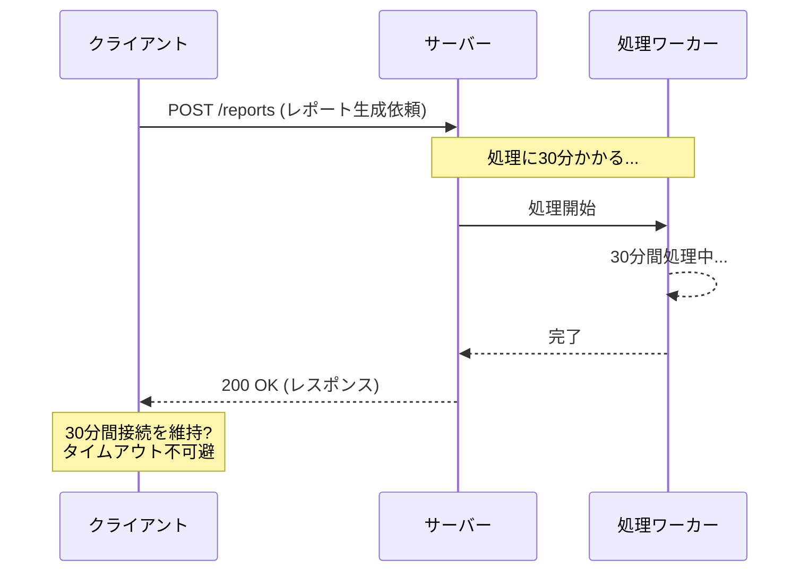

このような長時間処理を同期的に扱おうとすると、以下の深刻な問題が生じる。

**HTTP タイムアウト**: HTTP クライアント、ロードバランサ、リバースプロキシには接続タイムアウトが設定されている。一般的に 30 秒～60 秒がデフォルトであり、それを超える処理は強制的に切断される。タイムアウトを極端に長くすることは技術的には可能だが、接続リソースの枯渇を招くため現実的ではない。

**リソースの占有**: 同期リクエスト中はサーバー側のスレッド（またはコネクション）が 1 つ占有され続ける。処理が長時間に及ぶと、同時リクエスト数の上限に達し、新しいリクエストを受け付けられなくなる。

**クライアントの拘束**: 同期リクエストでは、クライアントはレスポンスが返るまで待機しなければならない。ユーザーがブラウザのタブを閉じたり、モバイルアプリを切り替えたりした場合、処理結果を受け取れなくなる。

**リトライの困難**: ネットワーク障害でレスポンスを受信できなかった場合、処理が完了しているのか失敗したのかクライアントには判断できない。同じリクエストをリトライすると、二重処理が発生する危険がある。

### 1.2 非同期リクエスト処理の基本思想

非同期リクエスト処理の核心は、**「リクエストの受付」と「処理の実行」を分離する**という設計思想にある。

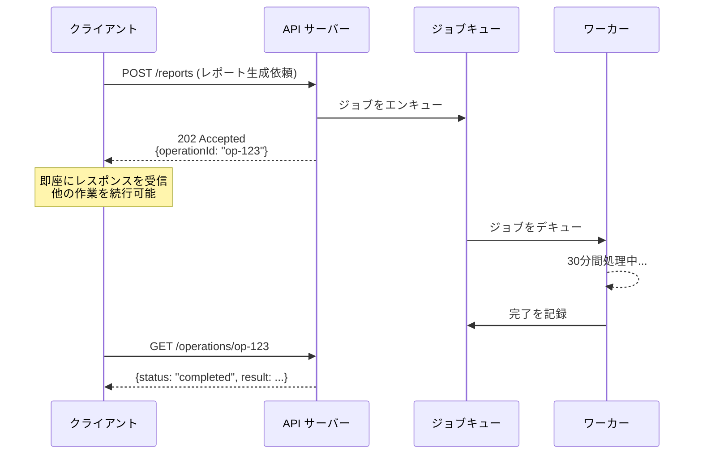

クライアントがリクエストを送信すると、サーバーは処理をキューに投入し、即座に「受け付けました」というレスポンスを返す。クライアントはそのレスポンスに含まれる識別子を使って、後から処理の進捗や結果を問い合わせる。

この分離により、先述のすべての問題が解消される。

| 同期処理の問題 | 非同期処理での解決 |
|---------------|-------------------|
| HTTP タイムアウト | リクエスト受付自体は即座に完了するため、タイムアウトしない |
| リソース占有 | サーバーのスレッドはリクエスト受付後すぐに解放される |
| クライアントの拘束 | クライアントは好きなタイミングで結果を確認できる |
| リトライの困難 | 冪等キー（idempotency key）と組み合わせることで安全にリトライ可能 |

::: tip 非同期処理のトレードオフ
非同期処理は万能ではない。同期処理に比べて、システムの複雑性が大幅に増加する。ジョブの状態管理、結果の通知、エラーハンドリング、タイムアウト処理、キャンセル処理など、考慮すべき事項が多い。処理が数百ミリ秒で完了する場合は、同期処理のほうがシンプルで適切である。非同期処理は「同期処理では対応できない」場合の手段として検討すべきである。
:::

## 2. 202 Accepted パターン

### 2.1 HTTP 202 ステータスコードの意味

HTTP/1.1 仕様（RFC 9110）では、ステータスコード `202 Accepted` を以下のように定義している。

> The 202 (Accepted) status code indicates that the request has been accepted for processing, but the processing has not been completed.

つまり、「リクエストは受け付けたが、処理はまだ完了していない」という意味である。これは非同期リクエスト処理のために用意されたステータスコードであり、サーバーが最終的な処理結果をコミットしていないことを明示する。

### 2.2 レスポンスの設計

202 Accepted レスポンスには、クライアントが後から処理結果を取得するために必要な情報を含める必要がある。

```http
POST /api/reports HTTP/1.1
Content-Type: application/json

{
  "type": "monthly-sales",
  "period": "2026-02"
}
```

```http
HTTP/1.1 202 Accepted
Content-Type: application/json
Location: /api/operations/op-abc-123

{
  "operationId": "op-abc-123",
  "status": "pending",
  "createdAt": "2026-03-02T10:00:00Z",
  "estimatedCompletionTime": "2026-03-02T10:05:00Z",
  "statusUrl": "/api/operations/op-abc-123"
}
```

レスポンスに含めるべき情報は以下のとおりである。

| フィールド | 必須 | 説明 |
|-----------|------|------|
| `operationId` | 必須 | 操作を一意に識別する ID |
| `status` | 必須 | 現在の状態（`pending`, `running`, `completed`, `failed`） |
| `statusUrl` | 推奨 | 状態を確認するための URL |
| `createdAt` | 推奨 | 操作が作成された日時 |
| `estimatedCompletionTime` | 任意 | 予想完了時刻 |

::: warning Location ヘッダの活用
`Location` ヘッダにステータス確認用の URL を設定するのは広く採用されている慣習である。RFC 9110 は 202 レスポンスについて「The representation sent with this response ought to describe the request's current status and point to (or embed) a status monitor that can provide the user with an estimate of when the request will be fulfilled」と述べており、この慣習はRFCの推奨に合致する。
:::

### 2.3 冪等性の確保

非同期リクエストでは、冪等性（idempotency）の確保が特に重要になる。ネットワーク障害で 202 レスポンスを受信できなかった場合、クライアントは同じリクエストをリトライする。このとき、同じ処理が二重に実行されることを防がなければならない。

一般的な手法は、クライアントが生成する**冪等キー（Idempotency Key）**をリクエストヘッダに含めることである。

```http
POST /api/reports HTTP/1.1
Content-Type: application/json
Idempotency-Key: 7c3e4a2f-b1d0-4e89-9f2a-1234567890ab

{
  "type": "monthly-sales",
  "period": "2026-02"
}
```

サーバー側は、同じ冪等キーのリクエストを受信した場合、新しい処理を開始せず、既存の操作情報を返す。

```python
def create_report(request):
    idempotency_key = request.headers.get("Idempotency-Key")

    if idempotency_key:
        # Check for existing operation with this key
        existing = operation_store.find_by_idempotency_key(idempotency_key)
        if existing:
            return Response(status=202, body=existing.to_dict())

    # Create new operation
    operation = Operation(
        id=generate_id(),
        idempotency_key=idempotency_key,
        status="pending",
        created_at=now(),
    )
    operation_store.save(operation)
    job_queue.enqueue(operation.id)

    return Response(status=202, body=operation.to_dict())
```

## 3. 進捗の通知方法 — ポーリング, Webhook コールバック, SSE

非同期リクエストを受け付けた後、クライアントにどうやって処理の進捗や完了を通知するかという問題がある。大きく 3 つのアプローチが存在し、それぞれにトレードオフがある。

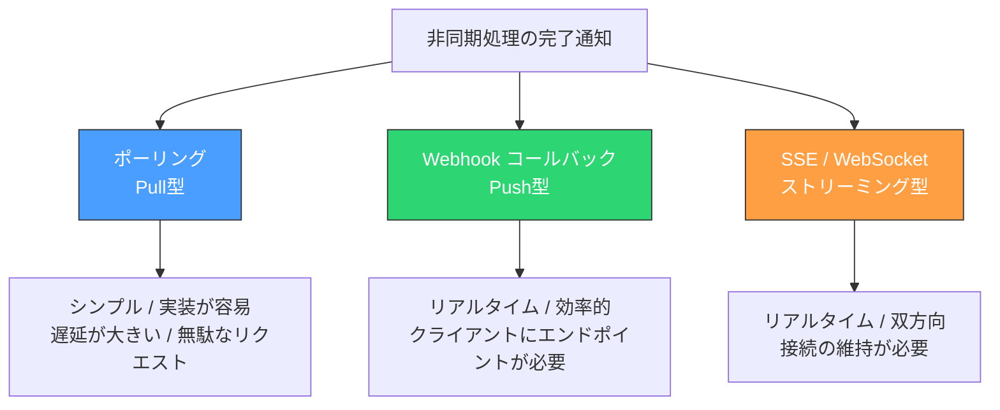

### 3.1 ポーリング（Polling）

#### 基本的な仕組み

ポーリングは、クライアントが定期的にサーバーにリクエストを送信して、処理の状態を確認する Pull 型のアプローチである。最もシンプルで、クライアント・サーバーの双方にとって実装が容易である。

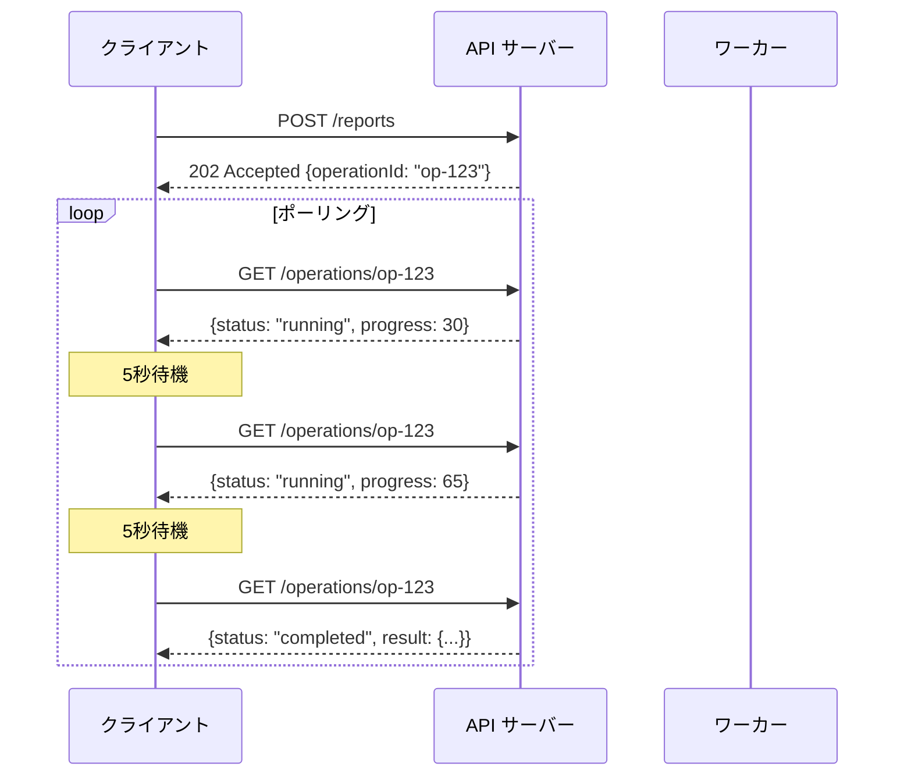

#### ポーリングレスポンスの設計

ステータス確認用のエンドポイントは、操作の現在の状態を詳細に返すべきである。

```http
GET /api/operations/op-abc-123 HTTP/1.1
```

処理中の場合：

```http
HTTP/1.1 200 OK
Content-Type: application/json
Retry-After: 5

{
  "operationId": "op-abc-123",
  "status": "running",
  "progress": 65,
  "message": "Processing records: 6,500 / 10,000",
  "createdAt": "2026-03-02T10:00:00Z",
  "updatedAt": "2026-03-02T10:02:30Z",
  "estimatedCompletionTime": "2026-03-02T10:05:00Z"
}
```

完了した場合：

```http
HTTP/1.1 200 OK
Content-Type: application/json

{
  "operationId": "op-abc-123",
  "status": "completed",
  "progress": 100,
  "result": {
    "reportUrl": "/api/reports/rpt-xyz-789",
    "recordCount": 10000,
    "fileSize": 2048576
  },
  "createdAt": "2026-03-02T10:00:00Z",
  "completedAt": "2026-03-02T10:04:45Z"
}
```

失敗した場合：

```http
HTTP/1.1 200 OK
Content-Type: application/json

{
  "operationId": "op-abc-123",
  "status": "failed",
  "error": {
    "code": "INSUFFICIENT_DATA",
    "message": "No sales records found for the specified period.",
    "retryable": false
  },
  "createdAt": "2026-03-02T10:00:00Z",
  "failedAt": "2026-03-02T10:01:15Z"
}
```

::: tip Retry-After ヘッダ
`Retry-After` ヘッダは、クライアントに次のポーリングまで待つべき秒数を伝えるための標準的な HTTP ヘッダである。これにより、サーバーはポーリング間隔をクライアントに指示できる。処理の進捗に応じて動的に値を変えることも有効で、たとえば処理の初期段階では長めの間隔を、完了が近づくにつれて短い間隔を返すといった制御が可能になる。
:::

#### ポーリング戦略

単純な固定間隔ポーリングは実装が容易だが、効率が悪い。実際の運用では、いくつかの改善された戦略が用いられる。

**固定間隔ポーリング**: 一定の間隔（たとえば 5 秒ごと）でポーリングする。最もシンプルだが、処理が長時間に及ぶ場合に無駄なリクエストが大量に発生する。

**指数バックオフ（Exponential Backoff）**: ポーリング間隔を徐々に長くしていく。たとえば 1 秒、2 秒、4 秒、8 秒、16 秒、...と倍増させる。上限（たとえば 60 秒）を設けるのが一般的である。

**適応型ポーリング**: サーバーからの `Retry-After` ヘッダや、予想完了時刻をもとにポーリング間隔を動的に調整する。最も効率が良いが、サーバー側の協力が必要になる。

```typescript
async function pollOperation(
  operationId: string,
  options: { maxAttempts: number; initialInterval: number; maxInterval: number }
): Promise<OperationResult> {
  let interval = options.initialInterval;

  for (let attempt = 0; attempt < options.maxAttempts; attempt++) {
    const response = await fetch(`/api/operations/${operationId}`);
    const operation = await response.json();

    if (operation.status === "completed") {
      return operation.result;
    }

    if (operation.status === "failed") {
      throw new OperationError(operation.error);
    }

    // Use Retry-After header if available
    const retryAfter = response.headers.get("Retry-After");
    if (retryAfter) {
      interval = parseInt(retryAfter, 10) * 1000;
    } else {
      // Exponential backoff with jitter
      interval = Math.min(
        interval * 2 + Math.random() * 1000,
        options.maxInterval
      );
    }

    await sleep(interval);
  }

  throw new Error("Polling timeout: max attempts exceeded");
}
```

::: warning ジッターの重要性
指数バックオフでは、ジッター（ランダムな揺らぎ）を加えることが極めて重要である。ジッターなしでは、同時に開始した多数のクライアントが同じタイミングでポーリングし、**サンダリングハード（Thundering Herd）問題**を引き起こす。ジッターにより各クライアントのポーリングタイミングが分散し、サーバーへの負荷が平滑化される。
:::

#### ポーリングの利点と欠点

| 利点 | 欠点 |
|------|------|
| 実装が非常にシンプル | リアルタイム性が低い（ポーリング間隔分の遅延） |
| クライアントに特別な機能が不要 | 無駄なリクエストが発生する（特に処理が長い場合） |
| ファイアウォール・プロキシの制約を受けにくい | ポーリング間隔の調整が難しい |
| ステートレスであり、サーバーの負担が少ない | 大量のクライアントが同時にポーリングすると負荷が高い |
| デバッグが容易 | クライアント側のロジックが煩雑になりがち |

### 3.2 Webhook コールバック

#### 基本的な仕組み

Webhook は、処理が完了した際にサーバーからクライアントが指定した URL に対して HTTP リクエストを送信する Push 型のアプローチである。クライアントはポーリングする必要がなく、処理が完了した瞬間に通知を受け取ることができる。

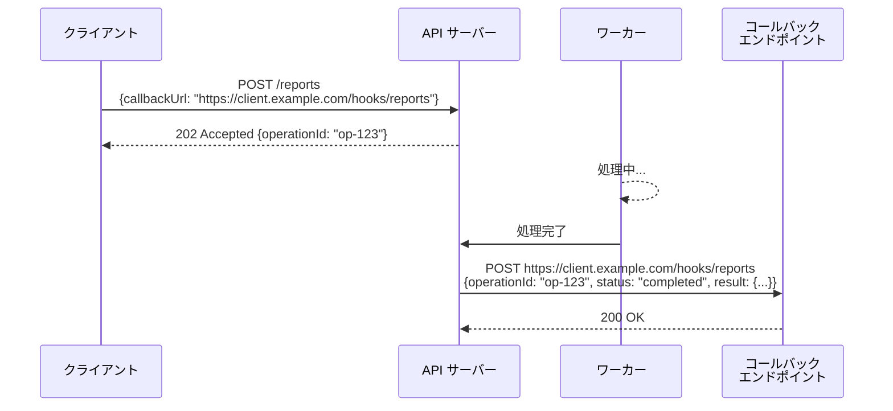

#### Webhook リクエストの設計

サーバーからクライアントへ送信する Webhook リクエストには、以下の情報を含める。

```http
POST /hooks/reports HTTP/1.1
Host: client.example.com
Content-Type: application/json
X-Webhook-Signature: sha256=a1b2c3d4e5f6...
X-Webhook-Id: wh-evt-001
X-Webhook-Timestamp: 2026-03-02T10:04:45Z

{
  "event": "operation.completed",
  "operationId": "op-abc-123",
  "status": "completed",
  "result": {
    "reportUrl": "https://api.example.com/reports/rpt-xyz-789",
    "recordCount": 10000
  },
  "timestamp": "2026-03-02T10:04:45Z"
}
```

#### セキュリティ上の考慮事項

Webhook はサーバーからクライアントへの HTTP リクエストであるため、セキュリティ上の考慮が不可欠である。

**署名検証**: Webhook リクエストが正規の API サーバーから送信されたものであることを、共有シークレットを用いた HMAC 署名で検証する。これがなければ、攻撃者が偽のイベントを送信してクライアントを騙すことが可能になる。

```python
import hmac
import hashlib

def verify_webhook_signature(payload: bytes, signature: str, secret: str) -> bool:
    """Verify the HMAC-SHA256 signature of a webhook payload."""
    expected = hmac.new(
        secret.encode("utf-8"),
        payload,
        hashlib.sha256
    ).hexdigest()
    return hmac.compare_digest(f"sha256={expected}", signature)
```

**タイムスタンプ検証**: 古いリクエストの再送（リプレイ攻撃）を防ぐため、タイムスタンプが一定の範囲内（たとえば 5 分以内）であることを確認する。

**冪等な受信処理**: Webhook は「at-least-once」配信であるのが一般的であり、同じイベントが複数回配信される可能性がある。受信側は、`X-Webhook-Id` を用いて重複排除を行い、冪等に処理する必要がある。

#### リトライ戦略

Webhook の配信が失敗した場合（タイムアウト、5xx エラーなど）、サーバーはリトライを行うべきである。一般的なリトライポリシーは以下のようになる。

```
1回目のリトライ: 1分後
2回目のリトライ: 5分後
3回目のリトライ: 30分後
4回目のリトライ: 2時間後
5回目のリトライ: 12時間後
```

一定回数のリトライが失敗した場合は、管理者に通知し、手動での再送を可能にするインターフェースを用意しておくのが望ましい。

::: danger Webhook の信頼性
Webhook は「Fire and Forget」に近い仕組みであり、配信の保証が本質的に弱い。クライアント側のサーバーがダウンしていれば配信できないし、ファイアウォールでブロックされることもある。このため、**Webhook はポーリングの完全な代替ではなく、補完的な手段として設計すべき**である。多くの優れた API は、Webhook とポーリングの両方を提供し、クライアントが状況に応じて選択できるようにしている。
:::

#### Webhook の利点と欠点

| 利点 | 欠点 |
|------|------|
| リアルタイム通知が可能 | クライアントが公開エンドポイントを用意する必要がある |
| 無駄なリクエストが発生しない | セキュリティの考慮事項が多い（署名検証、SSRF 対策等） |
| サーバー負荷が低い | 配信の信頼性を保証しにくい |
| イベント駆動的な処理に適合する | デバッグが難しい（配信ログの確認が必要） |
| | クライアントの実装負荷が高い |

### 3.3 Server-Sent Events（SSE）

#### 基本的な仕組み

Server-Sent Events（SSE）は、HTTP 接続を維持したまま、サーバーからクライアントへ一方向にイベントをストリーミングする技術である。ブラウザベースのアプリケーションでの非同期処理の進捗表示に特に適している。

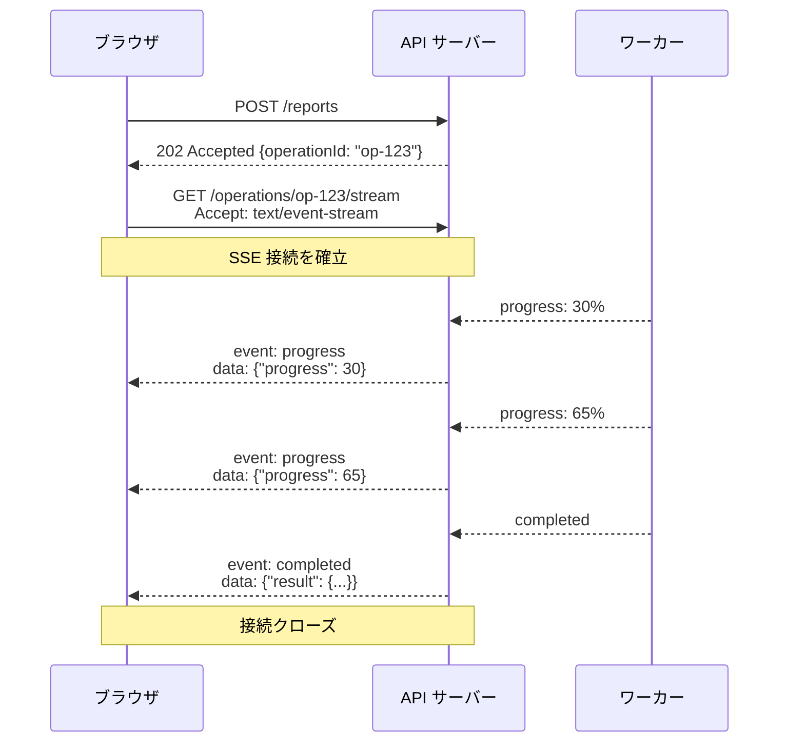

#### SSE のレスポンス形式

SSE は `text/event-stream` コンテンツタイプを使用し、特定のフォーマットでイベントを送信する。

```http
GET /api/operations/op-abc-123/stream HTTP/1.1
Accept: text/event-stream
```

```http
HTTP/1.1 200 OK
Content-Type: text/event-stream
Cache-Control: no-cache
Connection: keep-alive

event: progress
data: {"operationId":"op-abc-123","progress":30,"message":"Processing records..."}
id: evt-001

event: progress
data: {"operationId":"op-abc-123","progress":65,"message":"Generating report..."}
id: evt-002

event: completed
data: {"operationId":"op-abc-123","status":"completed","result":{"reportUrl":"/reports/rpt-xyz"}}
id: evt-003

```

クライアント側は `EventSource` API を使って簡潔に実装できる。

```javascript
const eventSource = new EventSource("/api/operations/op-abc-123/stream");

eventSource.addEventListener("progress", (event) => {
  const data = JSON.parse(event.data);
  // Update progress bar
  updateProgressBar(data.progress);
});

eventSource.addEventListener("completed", (event) => {
  const data = JSON.parse(event.data);
  // Handle completion
  showResult(data.result);
  eventSource.close();
});

eventSource.addEventListener("error", (event) => {
  // EventSource will automatically reconnect
  console.error("SSE connection error:", event);
});
```

SSE は接続が切断された場合に自動的に再接続を試みる。再接続時には `Last-Event-ID` ヘッダを送信するため、サーバー側はこの ID 以降のイベントだけを再送すればよい。

#### SSE の利点と欠点

| 利点 | 欠点 |
|------|------|
| リアルタイムな進捗通知が可能 | サーバー側で接続を維持するリソースが必要 |
| ブラウザのネイティブ API で利用可能 | 一方向通信のみ（サーバー→クライアント） |
| 自動再接続機能が組み込み | 同時接続数に制限がある（HTTP/1.1 では最大 6 接続） |
| HTTP ベースのためプロキシを通しやすい | サーバーサイドのクライアント（バックエンド間通信）には不向き |
| テキストベースでデバッグが容易 | 長時間の接続維持はロードバランサとの相性が悪い場合がある |

### 3.4 3 つの手法の比較と使い分け

| 観点 | ポーリング | Webhook | SSE |
|------|-----------|---------|-----|
| 通信方向 | Pull（クライアント→サーバー） | Push（サーバー→クライアント） | Push（サーバー→クライアント） |
| リアルタイム性 | 低（ポーリング間隔依存） | 高 | 高 |
| サーバー負荷 | 中～高（無駄なリクエスト） | 低 | 中（接続維持） |
| クライアント要件 | HTTP クライアントのみ | 公開 HTTP エンドポイントが必要 | EventSource API 対応 |
| 実装の複雑さ | 低 | 高 | 中 |
| 信頼性 | 高（クライアント制御） | 中（配信失敗のリスク） | 中（再接続の考慮が必要） |
| 適用シーン | B2B API、バッチ処理 | サーバー間連携、イベント通知 | Web UI、ダッシュボード |

::: tip 実践的な選択基準
- **ブラウザベースの UI** で進捗表示が必要 → SSE
- **サーバー間連携** でリアルタイム通知が必要 → Webhook + ポーリング（フォールバック）
- **シンプルさ優先** の公開 API → ポーリング
- **高信頼性** が求められるミッションクリティカルな処理 → ポーリング + Webhook の併用
:::

## 4. Google AIP-151: Long-Running Operations

### 4.1 AIP（API Improvement Proposals）とは

Google は自社の API 設計のベストプラクティスを **AIP（API Improvement Proposals）** として体系的に文書化している。AIP は Google Cloud API だけでなく、広くリソース指向 API 設計のリファレンスとして参照されている。

その中で **AIP-151** は Long-Running Operations（LRO）のパターンを規定しており、非同期リクエスト処理の標準的なインターフェース設計として広く知られている。Google Cloud の多くのサービス（Compute Engine、Cloud Functions、BigQuery など）がこのパターンに準拠している。

### 4.2 Operation リソース

AIP-151 の核心は、非同期処理を **Operation リソース**として明示的にモデリングすることにある。操作（operation）を一級市民のリソースとして扱い、REST のリソース操作と同じインターフェースで状態を管理する。

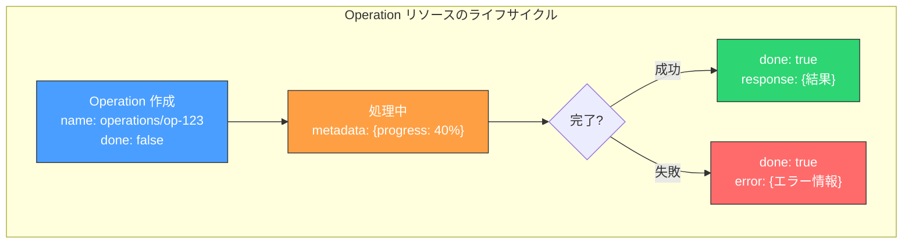

Operation リソースの構造（Protocol Buffers の定義に基づく）は以下のとおりである。

```protobuf
// The Operation resource represents a long-running operation.
message Operation {
  // The server-assigned name (e.g., "operations/op-abc-123").
  string name = 1;

  // Service-specific metadata associated with the operation.
  google.protobuf.Any metadata = 2;

  // If true, the operation has completed.
  bool done = 3;

  // The operation result, which can be either a response or an error.
  oneof result {
    // The error result if the operation failed.
    google.rpc.Status error = 4;
    // The normal response on success.
    google.protobuf.Any response = 5;
  }
}
```

JSON 表現では以下のようになる。

処理中：

```json
{
  "name": "operations/op-abc-123",
  "metadata": {
    "@type": "type.googleapis.com/example.v1.ReportOperationMetadata",
    "progress": 40,
    "recordsProcessed": 4000,
    "totalRecords": 10000
  },
  "done": false
}
```

成功：

```json
{
  "name": "operations/op-abc-123",
  "metadata": {
    "@type": "type.googleapis.com/example.v1.ReportOperationMetadata",
    "progress": 100,
    "recordsProcessed": 10000,
    "totalRecords": 10000
  },
  "done": true,
  "response": {
    "@type": "type.googleapis.com/example.v1.Report",
    "reportId": "rpt-xyz-789",
    "downloadUrl": "https://storage.example.com/reports/rpt-xyz-789.pdf"
  }
}
```

失敗：

```json
{
  "name": "operations/op-abc-123",
  "done": true,
  "error": {
    "code": 9,
    "message": "No sales records found for the specified period.",
    "details": []
  }
}
```

### 4.3 標準メソッド

AIP-151 では、Operation リソースに対して以下の標準メソッドを定義している。

#### Get

Operation の現在の状態を取得する。ポーリングに使用される。

```http
GET /v1/operations/op-abc-123 HTTP/1.1
```

#### List

特定のリソースに関連する Operation の一覧を取得する。

```http
GET /v1/operations?filter=metadata.parentResource="projects/my-project" HTTP/1.1
```

#### Cancel

実行中の Operation のキャンセルをリクエストする。キャンセルは**ベストエフォート**であり、即座に処理が停止されることは保証されない。

```http
POST /v1/operations/op-abc-123:cancel HTTP/1.1
```

#### Delete

完了した Operation の記録を削除する。未完了の Operation を削除しようとするとエラーが返される。

```http
DELETE /v1/operations/op-abc-123 HTTP/1.1
```

#### Wait

AIP-151 では、ポーリングの代替として `Wait` メソッドも定義している。これはロングポーリングの一種であり、Operation が完了するか、指定されたタイムアウトに達するまでレスポンスをブロックする。

```http
POST /v1/operations/op-abc-123:wait HTTP/1.1
Content-Type: application/json

{
  "timeout": "30s"
}
```

Wait メソッドにより、クライアントは繰り返しポーリングする代わりに、1 回のリクエストで結果を待つことができる。タイムアウトした場合は現在の状態が返される。

### 4.4 設計の原則

AIP-151 の設計にはいくつかの重要な原則が反映されている。

**リソース指向**: Operation を独立したリソースとして扱うことで、既存の REST パターン（CRUD 操作、フィルタリング、ページネーション）がそのまま適用できる。これにより、非同期操作の管理が一貫した API インターフェースに統合される。

**型安全性**: `metadata` と `response` フィールドに `Any` 型を使用することで、サービスごとに固有の情報を埋め込める。型情報（`@type`）を含むため、クライアントは適切なデシリアライゼーションが可能である。

**統一インターフェース**: すべてのサービスが同じ Operation インターフェースを使うため、クライアントライブラリを共通化できる。Google Cloud のクライアント SDK では、言語ごとに LRO のポーリングや待機を抽象化するヘルパーが提供されている。

::: tip REST API での AIP-151 適用
AIP-151 は元々 gRPC API のために設計されたが、その設計思想は REST API にも適用できる。実際に Google Cloud の REST API も同じ Operation リソース構造を使用している。自社の REST API に LRO パターンを導入する際は、AIP-151 の設計を参考にすることで、一貫性のあるインターフェースを構築できる。
:::

## 5. ジョブ状態管理

### 5.1 状態遷移の設計

非同期処理の状態管理は、システムの信頼性を左右する最も重要な設計課題の一つである。状態遷移を正確に定義し、不正な遷移を防ぐ必要がある。

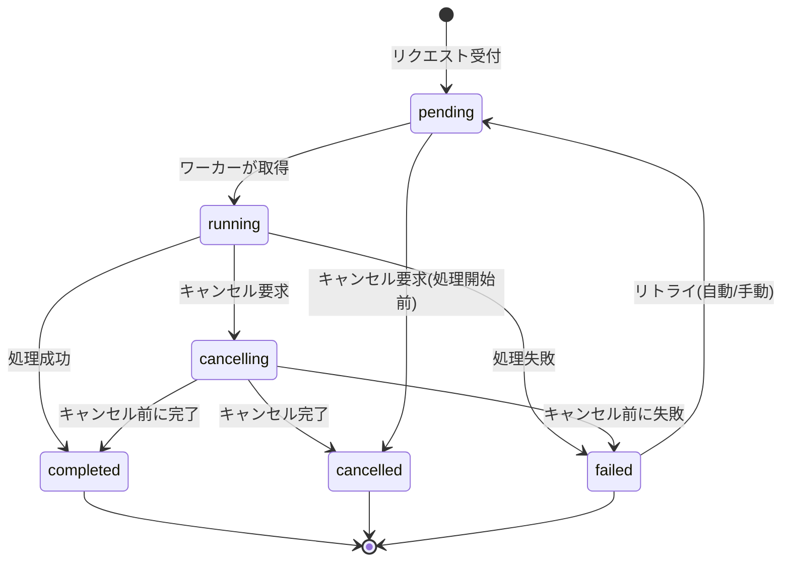

各状態の定義は以下のとおりである。

| 状態 | 説明 | 終端状態 |
|------|------|---------|
| `pending` | リクエストは受け付けられたが、まだ処理が開始されていない | No |
| `running` | ワーカーが処理を実行中 | No |
| `completed` | 処理が正常に完了した | Yes |
| `failed` | 処理がエラーにより失敗した | Yes（リトライ可能な場合は No） |
| `cancelling` | キャンセルが要求されたが、まだ停止していない | No |
| `cancelled` | キャンセルが完了した | Yes |

### 5.2 データモデル

ジョブの状態を永続化するためのデータモデルを設計する。

```sql
-- Core operations table
CREATE TABLE operations (
    id             UUID PRIMARY KEY DEFAULT gen_random_uuid(),
    idempotency_key VARCHAR(255) UNIQUE,
    type           VARCHAR(100) NOT NULL,       -- e.g., 'report_generation', 'data_export'
    status         VARCHAR(20) NOT NULL DEFAULT 'pending',
    input          JSONB NOT NULL,              -- Request parameters
    metadata       JSONB DEFAULT '{}',          -- Progress and other metadata
    result         JSONB,                       -- Result on success
    error          JSONB,                       -- Error details on failure
    created_at     TIMESTAMPTZ NOT NULL DEFAULT NOW(),
    updated_at     TIMESTAMPTZ NOT NULL DEFAULT NOW(),
    started_at     TIMESTAMPTZ,
    completed_at   TIMESTAMPTZ,
    expires_at     TIMESTAMPTZ,                 -- TTL for cleanup
    cancel_requested BOOLEAN NOT NULL DEFAULT FALSE,
    retry_count    INTEGER NOT NULL DEFAULT 0,
    max_retries    INTEGER NOT NULL DEFAULT 3,
    created_by     VARCHAR(255),                -- User or service that created the operation

    CONSTRAINT valid_status CHECK (
        status IN ('pending', 'running', 'completed', 'failed', 'cancelling', 'cancelled')
    )
);

-- Index for polling and listing
CREATE INDEX idx_operations_status ON operations (status) WHERE status IN ('pending', 'running');
CREATE INDEX idx_operations_created_by ON operations (created_by, created_at DESC);
CREATE INDEX idx_operations_type_status ON operations (type, status);
CREATE INDEX idx_operations_expires_at ON operations (expires_at) WHERE expires_at IS NOT NULL;
```

### 5.3 状態遷移の排他制御

複数のワーカーが同一のジョブを取得してしまう二重実行を防ぐために、状態遷移時の排他制御が不可欠である。

**悲観的ロック**: `SELECT ... FOR UPDATE` を用いて行レベルのロックを取得する方法。確実だが、ロック競合が発生しやすい。

```sql
-- Pessimistic locking: claim a pending job
BEGIN;

SELECT id FROM operations
WHERE status = 'pending' AND type = 'report_generation'
ORDER BY created_at ASC
LIMIT 1
FOR UPDATE SKIP LOCKED;

-- If a row is returned, update its status
UPDATE operations
SET status = 'running', started_at = NOW(), updated_at = NOW()
WHERE id = '<selected_id>';

COMMIT;
```

`FOR UPDATE SKIP LOCKED` により、既に他のトランザクションがロックしている行をスキップする。これにより、複数のワーカーが同時にジョブを取得しようとしても、各ワーカーが別々のジョブを取得できる。

**楽観的ロック**: ステータスを条件に含めた `UPDATE` を実行し、影響行数が 1 であることを確認する方法。

```sql
-- Optimistic locking: attempt to claim a job by CAS
UPDATE operations
SET status = 'running', started_at = NOW(), updated_at = NOW()
WHERE id = '<target_id>' AND status = 'pending'
RETURNING id;
```

影響行数が 0 の場合、他のワーカーが先にジョブを取得したことを意味する。

### 5.4 進捗の追跡

長時間処理では、クライアントに進捗を伝えることが重要になる。進捗の更新は、ジョブの `metadata` フィールドを通じて行う。

```python
class OperationTracker:
    """Track progress of a long-running operation."""

    def __init__(self, operation_id: str, db):
        self.operation_id = operation_id
        self.db = db

    def update_progress(self, progress: int, message: str = ""):
        """Update the progress of the operation (0-100)."""
        self.db.execute(
            """
            UPDATE operations
            SET metadata = metadata || %s, updated_at = NOW()
            WHERE id = %s AND status = 'running'
            """,
            [json.dumps({"progress": progress, "message": message}), self.operation_id],
        )

    def complete(self, result: dict):
        """Mark the operation as completed with a result."""
        self.db.execute(
            """
            UPDATE operations
            SET status = 'completed', result = %s,
                metadata = metadata || '{"progress": 100}',
                completed_at = NOW(), updated_at = NOW()
            WHERE id = %s AND status IN ('running', 'cancelling')
            """,
            [json.dumps(result), self.operation_id],
        )

    def fail(self, error_code: str, error_message: str, retryable: bool = False):
        """Mark the operation as failed."""
        error = {
            "code": error_code,
            "message": error_message,
            "retryable": retryable,
        }
        self.db.execute(
            """
            UPDATE operations
            SET status = 'failed', error = %s,
                completed_at = NOW(), updated_at = NOW()
            WHERE id = %s AND status IN ('running', 'cancelling')
            """,
            [json.dumps(error), self.operation_id],
        )

    def is_cancel_requested(self) -> bool:
        """Check if cancellation has been requested."""
        row = self.db.execute(
            "SELECT cancel_requested FROM operations WHERE id = %s",
            [self.operation_id],
        ).fetchone()
        return row and row["cancel_requested"]
```

## 6. タイムアウトとキャンセル

### 6.1 タイムアウト

非同期処理のタイムアウトには、複数のレイヤーが存在する。

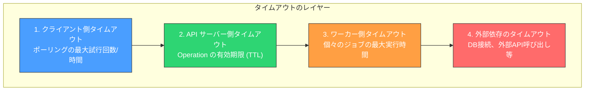

#### クライアント側のタイムアウト

クライアントは、ポーリングの最大試行回数または最大待機時間を設定すべきである。無限にポーリングし続けることは、クライアントのリソースを浪費する。

```typescript
async function executeAsyncOperation(
  request: CreateReportRequest
): Promise<Report> {
  // Submit the request
  const operation = await submitReport(request);

  // Poll with timeout
  const result = await pollOperation(operation.operationId, {
    maxAttempts: 60,       // Max 60 attempts
    initialInterval: 2000, // Start with 2s interval
    maxInterval: 30000,    // Max 30s interval
  });

  return result;
}
```

#### サーバー側のタイムアウト（TTL）

Operation には有効期限（TTL: Time to Live）を設定すべきである。`pending` 状態のまま長時間放置された Operation はスタック（stuck）している可能性が高い。

```python
def detect_stuck_operations():
    """Detect and handle stuck operations."""
    # Find operations stuck in 'running' for too long
    stuck = db.execute(
        """
        SELECT id FROM operations
        WHERE status = 'running'
          AND started_at < NOW() - INTERVAL '1 hour'
        """,
    ).fetchall()

    for op in stuck:
        db.execute(
            """
            UPDATE operations
            SET status = 'failed',
                error = '{"code": "TIMEOUT", "message": "Operation timed out", "retryable": true}',
                completed_at = NOW(), updated_at = NOW()
            WHERE id = %s AND status = 'running'
            """,
            [op["id"]],
        )
```

#### ワーカー側のタイムアウト

ワーカーは個々のジョブに対してタイムアウトを設定し、制限時間を超えた場合にはグレースフルに処理を中断する。

```python
import signal

class WorkerTimeout(Exception):
    pass

def handle_timeout(signum, frame):
    raise WorkerTimeout("Job execution timed out")

def execute_job(operation_id: str, timeout_seconds: int = 3600):
    """Execute a job with a timeout."""
    tracker = OperationTracker(operation_id, db)

    # Set alarm signal for timeout
    signal.signal(signal.SIGALRM, handle_timeout)
    signal.alarm(timeout_seconds)

    try:
        result = do_actual_work(operation_id)
        tracker.complete(result)
    except WorkerTimeout:
        tracker.fail("TIMEOUT", "Job exceeded maximum execution time", retryable=True)
    except Exception as e:
        tracker.fail("INTERNAL_ERROR", str(e), retryable=True)
    finally:
        signal.alarm(0)  # Cancel the alarm
```

### 6.2 キャンセル

#### キャンセルの設計上の課題

非同期処理のキャンセルは、一見単純に見えるが、実際には多くの設計上の課題を伴う。

**非即時性**: キャンセルのリクエストを受け付けても、処理がただちに停止するとは限らない。ワーカーがキャンセルを検知するまでの遅延があり、また処理の途中でクリーンアップが必要な場合もある。このため、キャンセルは**リクエスト**であり、**即時停止の命令**ではないという点をクライアントに明示する必要がある。

**部分的な副作用**: 処理の途中でキャンセルされた場合、一部の副作用（ファイルの作成、外部 API の呼び出しなど）がすでに発生している可能性がある。これらの副作用を巻き戻せるかどうかは、処理の性質に依存する。

**競合状態**: キャンセルのリクエストと処理の完了が同時に発生する可能性がある。この競合をどう処理するかを明確に定義しておく必要がある。

#### キャンセルの実装

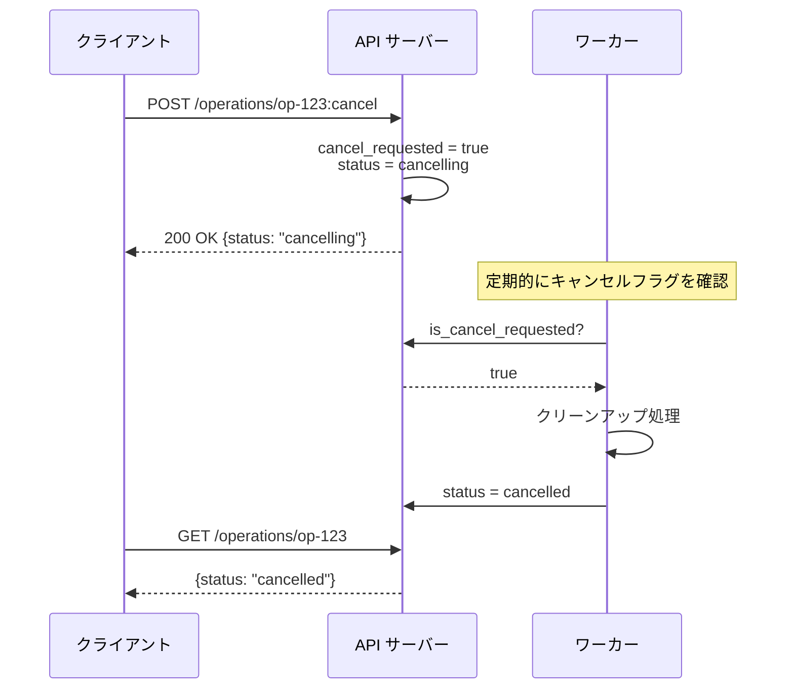

キャンセルの API エンドポイント：

```python
def cancel_operation(operation_id: str):
    """Request cancellation of an operation."""
    result = db.execute(
        """
        UPDATE operations
        SET cancel_requested = TRUE,
            status = CASE
                WHEN status = 'pending' THEN 'cancelled'
                WHEN status = 'running' THEN 'cancelling'
                ELSE status
            END,
            updated_at = NOW(),
            completed_at = CASE
                WHEN status = 'pending' THEN NOW()
                ELSE completed_at
            END
        WHERE id = %s AND status IN ('pending', 'running')
        RETURNING status
        """,
        [operation_id],
    )

    row = result.fetchone()
    if row is None:
        raise OperationNotCancellableError(
            "Operation is already completed, failed, or cancelled"
        )

    return {"operationId": operation_id, "status": row["status"]}
```

ワーカー側では、処理のチェックポイントごとにキャンセルフラグを確認する。

```python
def process_report(operation_id: str, params: dict):
    """Process a report generation job with cancellation support."""
    tracker = OperationTracker(operation_id, db)
    records = fetch_records(params)
    total = len(records)

    for i, batch in enumerate(chunk(records, batch_size=100)):
        # Check for cancellation at each checkpoint
        if tracker.is_cancel_requested():
            cleanup_partial_results(operation_id)
            db.execute(
                """
                UPDATE operations
                SET status = 'cancelled', completed_at = NOW(), updated_at = NOW()
                WHERE id = %s
                """,
                [operation_id],
            )
            return

        # Process the batch
        process_batch(batch)

        # Update progress
        progress = int(((i + 1) * 100) / (total / 100))
        tracker.update_progress(min(progress, 99), f"Processed {(i+1)*100}/{total} records")

    # Finalize
    result = finalize_report(operation_id)
    tracker.complete(result)
```

::: warning キャンセルのチェックポイント粒度
キャンセルフラグの確認頻度はトレードオフを伴う。確認が頻繁すぎるとデータベースへの問い合わせが増え、パフォーマンスに影響する。逆に確認間隔が長すぎると、キャンセルのレスポンスが遅くなる。一般的には、バッチ処理の各バッチの境界や、重い外部呼び出しの前後でチェックするのが妥当である。
:::

## 7. 実装例 — 非同期レポート生成 API

ここまで解説した概念を統合した、実践的な非同期レポート生成 API の実装例を示す。

### 7.1 API インターフェース

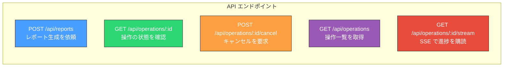

### 7.2 サーバー実装

以下に、Python（FastAPI）を用いた実装の全体像を示す。

```python
from fastapi import FastAPI, HTTPException, Request, Response, Header
from fastapi.responses import StreamingResponse
from pydantic import BaseModel
from typing import Optional
from uuid import uuid4
from datetime import datetime, timedelta
import json
import asyncio

app = FastAPI()

# --- Request / Response Models ---

class CreateReportRequest(BaseModel):
    type: str          # e.g., "monthly-sales"
    period: str        # e.g., "2026-02"
    format: str = "pdf"

class OperationResponse(BaseModel):
    operationId: str
    status: str
    progress: Optional[int] = None
    message: Optional[str] = None
    result: Optional[dict] = None
    error: Optional[dict] = None
    createdAt: str
    updatedAt: str
    completedAt: Optional[str] = None
    estimatedCompletionTime: Optional[str] = None

# --- API Endpoints ---

@app.post("/api/reports", status_code=202)
async def create_report(
    request: CreateReportRequest,
    idempotency_key: Optional[str] = Header(None, alias="Idempotency-Key"),
):
    """Accept a report generation request and return an operation."""
    # Idempotency check
    if idempotency_key:
        existing = await operation_store.find_by_idempotency_key(idempotency_key)
        if existing:
            return build_operation_response(existing)

    # Create the operation record
    operation = {
        "id": str(uuid4()),
        "idempotency_key": idempotency_key,
        "type": "report_generation",
        "status": "pending",
        "input": request.dict(),
        "metadata": {"progress": 0},
        "created_at": datetime.utcnow().isoformat() + "Z",
        "updated_at": datetime.utcnow().isoformat() + "Z",
    }
    await operation_store.save(operation)

    # Enqueue the job for async processing
    await job_queue.enqueue("report_generation", operation["id"])

    response = build_operation_response(operation)
    return Response(
        content=json.dumps(response),
        status_code=202,
        media_type="application/json",
        headers={"Location": f"/api/operations/{operation['id']}"},
    )

@app.get("/api/operations/{operation_id}")
async def get_operation(operation_id: str):
    """Get the current state of an operation."""
    operation = await operation_store.find_by_id(operation_id)
    if not operation:
        raise HTTPException(status_code=404, detail="Operation not found")

    response = build_operation_response(operation)
    headers = {}
    if operation["status"] in ("pending", "running", "cancelling"):
        headers["Retry-After"] = "5"

    return Response(
        content=json.dumps(response),
        media_type="application/json",
        headers=headers,
    )

@app.post("/api/operations/{operation_id}/cancel")
async def cancel_operation(operation_id: str):
    """Request cancellation of an operation."""
    operation = await operation_store.find_by_id(operation_id)
    if not operation:
        raise HTTPException(status_code=404, detail="Operation not found")

    if operation["status"] not in ("pending", "running"):
        raise HTTPException(
            status_code=409,
            detail=f"Cannot cancel operation in '{operation['status']}' state",
        )

    new_status = "cancelled" if operation["status"] == "pending" else "cancelling"
    await operation_store.update(
        operation_id,
        status=new_status,
        cancel_requested=True,
    )

    return {"operationId": operation_id, "status": new_status}

@app.get("/api/operations/{operation_id}/stream")
async def stream_operation(operation_id: str):
    """Stream operation progress via SSE."""
    operation = await operation_store.find_by_id(operation_id)
    if not operation:
        raise HTTPException(status_code=404, detail="Operation not found")

    async def event_generator():
        last_progress = -1
        while True:
            op = await operation_store.find_by_id(operation_id)
            if not op:
                break

            progress = op.get("metadata", {}).get("progress", 0)

            if progress != last_progress:
                if op["status"] in ("completed", "failed", "cancelled"):
                    yield format_sse(op["status"], build_operation_response(op))
                    break
                else:
                    yield format_sse("progress", build_operation_response(op))
                    last_progress = progress

            await asyncio.sleep(1)

    return StreamingResponse(
        event_generator(),
        media_type="text/event-stream",
        headers={"Cache-Control": "no-cache", "Connection": "keep-alive"},
    )

# --- Helpers ---

def build_operation_response(operation: dict) -> dict:
    """Build the API response from an operation record."""
    return {
        "operationId": operation["id"],
        "status": operation["status"],
        "progress": operation.get("metadata", {}).get("progress"),
        "message": operation.get("metadata", {}).get("message"),
        "result": operation.get("result"),
        "error": operation.get("error"),
        "createdAt": operation["created_at"],
        "updatedAt": operation["updated_at"],
        "completedAt": operation.get("completed_at"),
    }

def format_sse(event: str, data: dict) -> str:
    """Format data as an SSE event."""
    return f"event: {event}\ndata: {json.dumps(data)}\n\n"
```

### 7.3 ワーカー実装

```python
import asyncio

async def report_worker():
    """Worker that processes report generation jobs."""
    while True:
        # Dequeue a job
        job = await job_queue.dequeue("report_generation")
        if not job:
            await asyncio.sleep(1)
            continue

        operation_id = job["operation_id"]
        tracker = OperationTracker(operation_id, db)

        # Claim the job (optimistic locking)
        claimed = await operation_store.transition(
            operation_id, from_status="pending", to_status="running"
        )
        if not claimed:
            continue  # Another worker already claimed it

        try:
            operation = await operation_store.find_by_id(operation_id)
            params = operation["input"]

            # Phase 1: Data collection (0-40%)
            tracker.update_progress(5, "Fetching data from database...")
            records = await fetch_sales_records(params["period"])

            if tracker.is_cancel_requested():
                await tracker.cancel()
                continue

            # Phase 2: Data processing (40-80%)
            total_batches = (len(records) // 100) + 1
            processed_rows = []

            for i, batch in enumerate(chunk(records, 100)):
                if tracker.is_cancel_requested():
                    await tracker.cancel()
                    break

                processed = await process_batch(batch)
                processed_rows.extend(processed)

                progress = 40 + int((i + 1) / total_batches * 40)
                tracker.update_progress(
                    progress,
                    f"Processing records: {len(processed_rows)}/{len(records)}"
                )
            else:
                # Phase 3: Report generation (80-100%)
                tracker.update_progress(85, "Generating report file...")
                report_file = await generate_report_file(
                    processed_rows, params.get("format", "pdf")
                )

                tracker.update_progress(95, "Uploading report...")
                download_url = await upload_to_storage(report_file)

                tracker.complete({
                    "reportId": str(uuid4()),
                    "downloadUrl": download_url,
                    "recordCount": len(records),
                    "fileSize": report_file.size,
                })

        except Exception as e:
            await tracker.fail(
                "INTERNAL_ERROR",
                f"Report generation failed: {str(e)}",
                retryable=True,
            )
```

### 7.4 運用上の考慮事項

#### Operation のクリーンアップ

完了した Operation は無限に保持し続けるべきではない。ストレージの肥大化を防ぐために、TTL を設定して自動的にクリーンアップする。

```python
async def cleanup_expired_operations():
    """Periodically clean up expired operations."""
    await db.execute(
        """
        DELETE FROM operations
        WHERE expires_at IS NOT NULL AND expires_at < NOW()
          AND status IN ('completed', 'failed', 'cancelled')
        """
    )
```

一般的な TTL の設定基準は以下のとおりである。

| Operation の状態 | 推奨 TTL |
|-----------------|----------|
| `completed` | 7 日～30 日 |
| `failed` | 7 日～30 日（デバッグのため） |
| `cancelled` | 1 日～7 日 |

#### モニタリングとアラート

非同期処理システムの健全性を監視するために、以下のメトリクスを収集すべきである。

- **キューの深さ**: pending 状態の Operation 数。増加が続く場合はワーカーの処理能力不足を示す
- **処理時間**: running 状態の平均・p50・p95・p99 の所要時間
- **失敗率**: 失敗した Operation の割合
- **スタック検知**: running 状態のまま長時間経過した Operation の数
- **リトライ回数**: リトライが頻発している場合は根本原因の調査が必要

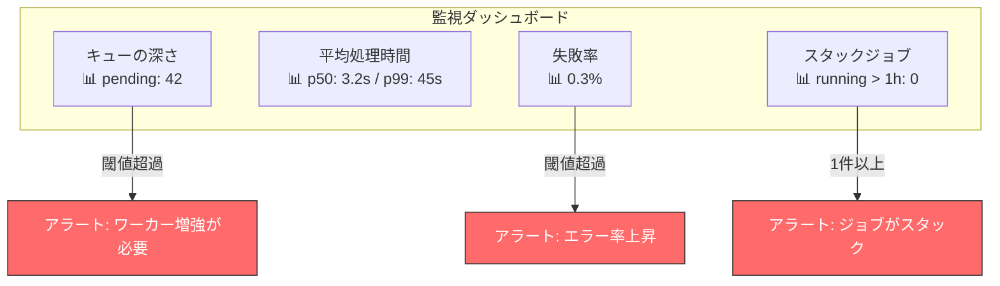

#### デッドレターキュー

最大リトライ回数を超えて失敗し続けるジョブは、**デッドレターキュー（Dead Letter Queue, DLQ）** に移動させるのが一般的なパターンである。DLQ に入ったジョブは手動で調査し、問題を修正した後に再投入するか、永続的に失敗として記録する。

```python
async def handle_failed_job(operation_id: str):
    """Handle a job that has exhausted its retries."""
    operation = await operation_store.find_by_id(operation_id)

    if operation["retry_count"] < operation["max_retries"]:
        # Re-enqueue for retry with backoff
        delay = calculate_backoff(operation["retry_count"])
        await operation_store.update(
            operation_id, status="pending", retry_count=operation["retry_count"] + 1
        )
        await job_queue.enqueue(
            "report_generation", operation_id, delay=delay
        )
    else:
        # Move to dead letter queue
        await dead_letter_queue.enqueue(operation_id)
        await operation_store.update(
            operation_id,
            status="failed",
            error={
                "code": "MAX_RETRIES_EXCEEDED",
                "message": f"Operation failed after {operation['max_retries']} retries",
                "retryable": False,
            },
        )
```

## 8. 他サービスの実装事例

非同期リクエスト処理のパターンは、多くの著名なクラウドサービスや API で採用されている。各サービスの実装を比較することで、パターンの多様性と共通点を理解できる。

### 8.1 AWS

AWS では、多くのサービスが非同期処理パターンを採用している。たとえば、AWS Step Functions はステートマシンによるワークフロー管理を提供し、長時間の非同期処理をオーケストレーションする。CloudFormation のスタック作成は、リソースのプロビジョニングが完了するまで非同期的に進行し、`DescribeStacks` API でポーリングしてステータスを確認する。

特徴的なのは、AWS の多くのサービスが「リクエストを送信し、Describe 系 API で結果をポーリングする」という一貫したパターンを採用している点である。

### 8.2 Azure

Azure は **Azure Resource Manager (ARM)** で LRO を体系的にサポートしている。非同期操作のレスポンスに `Azure-AsyncOperation` ヘッダまたは `Location` ヘッダを含め、これらの URL をポーリングすることで結果を取得する。ARM のクライアント SDK にはポーリングのヘルパーが組み込まれており、開発者が手動でポーリングループを書く必要がない場合が多い。

### 8.3 Stripe

Stripe の API は、処理に時間がかかる操作に対しても基本的に同期レスポンスを返す設計だが、**Webhook** を併用した非同期通知パターンを広範に採用している。たとえば、支払い処理では即座にレスポンスが返るが、最終的な成否は Webhook で通知される。Stripe の Webhook は署名検証、タイムスタンプ検証、リトライ機能を備えており、業界のリファレンス実装として広く参照されている。

### 8.4 GitHub

GitHub API では、リポジトリのフォーク作成やインポートなどの時間がかかる処理に非同期パターンが使われている。レスポンスのステータスとして `202 Accepted` を返し、`Location` ヘッダでステータス確認 URL を提供する。また、GitHub Actions のワークフロー実行は非同期処理の典型例であり、Webhook（GitHub Webhooks）またはポーリング（REST API）で状態を監視できる。

## 9. まとめ

非同期リクエスト処理は、同期的なリクエスト/レスポンスモデルでは対応できない長時間処理を API で実現するための重要なパターンである。

本記事で解説した要素を振り返る。

1. **202 Accepted パターン** により、リクエストの受付と処理の実行を分離する
2. **進捗通知** にはポーリング、Webhook コールバック、SSE の 3 つのアプローチがあり、ユースケースに応じて選択・組み合わせる
3. **Google AIP-151** は LRO パターンの優れたリファレンス設計であり、Operation リソースを一級市民として扱うアプローチは広く応用可能である
4. **ジョブの状態管理** では、明確な状態遷移の定義、排他制御、進捗追跡が不可欠である
5. **タイムアウトとキャンセル** は、複数のレイヤーでの設計が必要であり、キャンセルが非即時的であることを前提とした設計が求められる

非同期リクエスト処理は、システムの複雑性を大幅に増加させるトレードオフを伴う。同期処理で十分な場合は同期処理を選択すべきであり、非同期処理は「必要になったときに」導入するのが健全なアプローチである。しかし、いったん導入が必要になった場合には、ここで解説した設計パターンと原則を意識することで、信頼性が高く、運用しやすいシステムを構築できるだろう。
