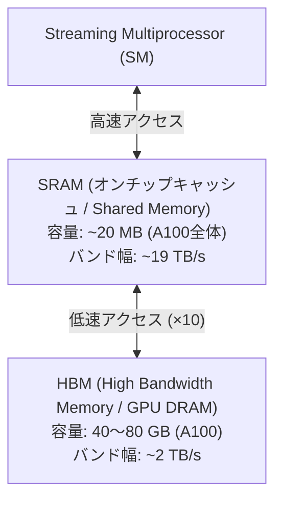
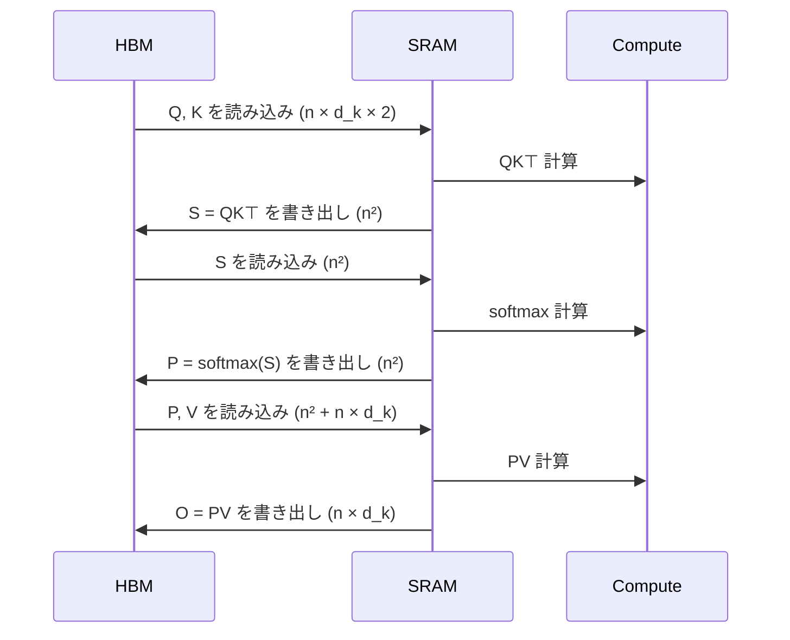
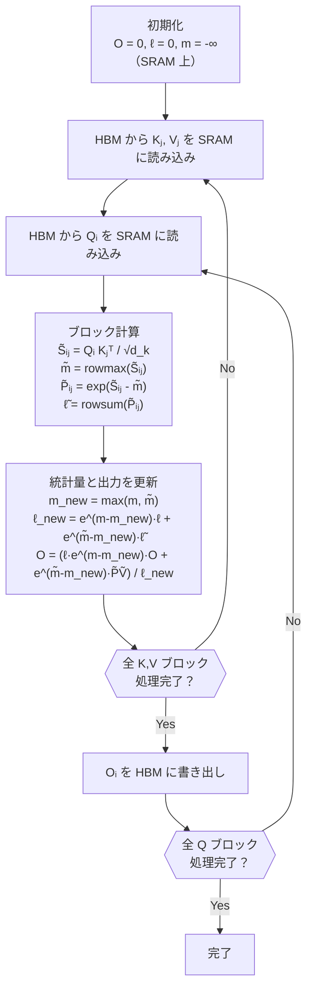
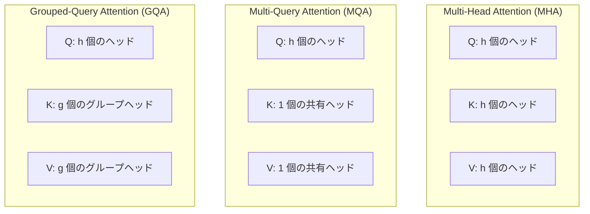
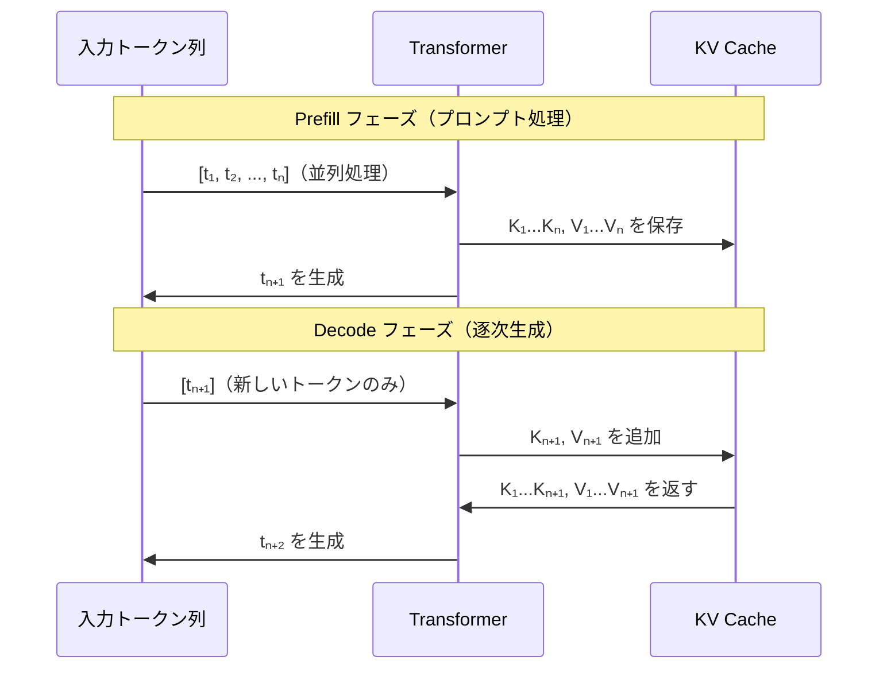
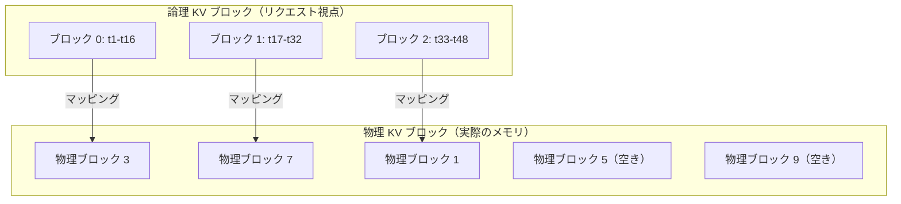
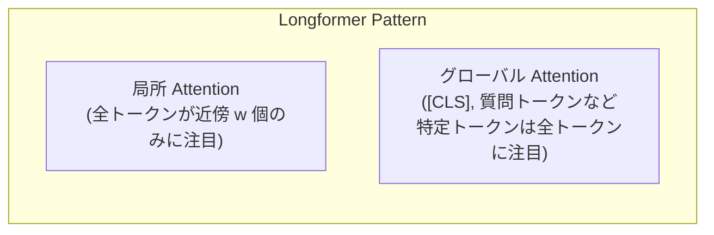
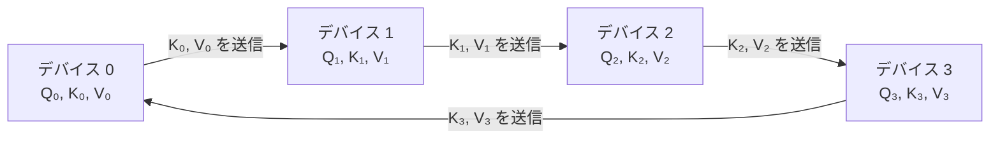
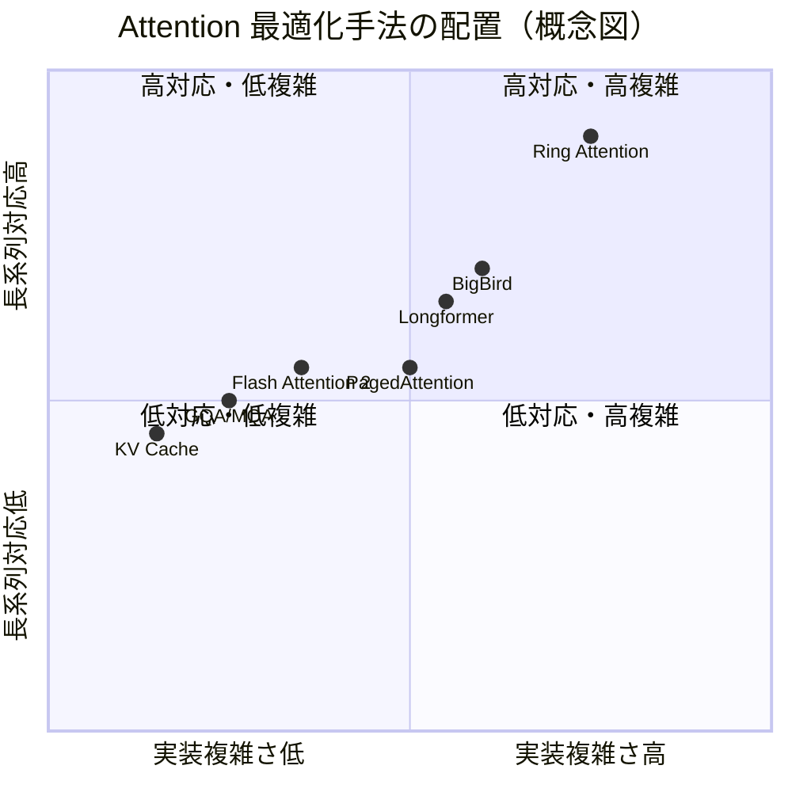

# Attention の最適化（Flash Attention, Multi-Query/Grouped-Query, KV Cache）

## 1. はじめに：なぜ Attention の最適化が必要なのか

Transformer アーキテクチャは、Self-Attention 機構によって自然言語処理・コンピュータビジョン・音声処理など広範な領域に革命をもたらした。しかし、Transformer を実際の大規模システムに展開しようとすると、すぐに深刻な計算上・メモリ上の壁に突き当たる。その根本的な原因は、**Self-Attention の計算量がシーケンス長 $n$ に対して二乗オーダー $O(n^2)$ になる**ことである。

GPT-4 や Gemini Ultra のような巨大言語モデル（LLM）では、入力コンテキスト長が数万〜数十万トークンに及ぶことがある。Claude 3 シリーズでは 200k トークンのコンテキストを扱えるとされる。このような長大なシーケンスに素朴な Self-Attention を適用すると、メモリ消費量は $n^2$ に比例して膨張し、単一の A100 GPU（80GB HBM）でも扱いきれなくなる。

さらに、LLM を推論に使う際のボトルネックはまた別の性質を持つ。Transformer によるテキスト生成は**自己回帰的（auto-regressive）**に行われる。各トークンを生成するたびに、過去のすべてのトークンに対する Attention を再計算するのは非常に非効率だ。

このような課題に対して、研究コミュニティはさまざまな最適化手法を提案してきた。本記事では以下の主要な最適化技術を体系的に解説する。

- **Flash Attention / Flash Attention 2**: IO-aware な Attention 実装による高速化
- **Multi-Query Attention / Grouped-Query Attention**: KV ヘッドの削減による推論高速化
- **KV Cache**: 自己回帰生成における Attention の再計算回避
- **PagedAttention (vLLM)**: KV Cache のメモリ効率的な管理
- **Sparse Attention**: Attention パターンの間引きによる $O(n^2)$ の打破
- **Ring Attention**: 超長系列への分散対応

## 2. 標準的な Self-Attention の計算量とメモリボトルネック

### 2.1 Self-Attention の基本式

Scaled Dot-Product Attention の定義は以下のとおりである。

$$\text{Attention}(Q, K, V) = \text{softmax}\!\left(\frac{QK^\top}{\sqrt{d_k}}\right) V$$

ここで、$Q, K, V \in \mathbb{R}^{n \times d_k}$ はそれぞれ Query・Key・Value 行列、$n$ はシーケンス長、$d_k$ はヘッド次元数である。

計算の流れは以下のとおり。

1. **QK 積の計算**: $S = QK^\top \in \mathbb{R}^{n \times n}$。計算量 $O(n^2 d_k)$、メモリ $O(n^2)$。
2. **スケーリングとソフトマックス**: $P = \text{softmax}(S / \sqrt{d_k}) \in \mathbb{R}^{n \times n}$。計算量 $O(n^2)$、メモリ $O(n^2)$。
3. **PV 積の計算**: $O = PV \in \mathbb{R}^{n \times d_k}$。計算量 $O(n^2 d_k)$、メモリ $O(n d_k)$。

問題となるのは、中間行列 $S$（スコア行列）および $P$（Attention 重み行列）のサイズが $n \times n$ であることだ。

### 2.2 二乗オーダーの問題規模

具体的な数値で問題の深刻さを確認してみよう。

| シーケンス長 $n$ | Attention 行列サイズ ($n^2$) | fp16 でのメモリ量（h=1ヘッド） |
|--|--|--|
| 1,024 | 約 100 万 | 約 2 MB |
| 8,192 | 約 6,700 万 | 約 128 MB |
| 32,768 | 約 10 億 | 約 2 GB |
| 131,072 (128k) | 約 170 億 | 約 32 GB |

Multi-Head Attention では Head 数 $h$ 倍（通常 32〜128）になるため、128k コンテキスト・128 ヘッドでは Attention 重み行列だけで **4 TB** を超える。これは現在の GPU のメモリ容量を遥かに超える。

> [!WARNING]
> 上記の計算は単純化したものである。実際にはバッチ処理、バックワードパス用の中間値保持なども加わり、メモリ消費はさらに増大する。

### 2.3 計算量と通信量の整理

Self-Attention の計算において、「計算量が多い」こととは別に**「メモリ帯域幅（Memory Bandwidth）がボトルネックになる」**という問題がある。これを理解するために、GPU のメモリ階層を見ておく必要がある。

## 3. GPU メモリ階層と IO ボトルネック

### 3.1 GPU のメモリ階層

現代の GPU（例: NVIDIA A100、H100）は、複数のメモリ階層を持つ。



| メモリ種別 | 容量 | バンド幅 | レイテンシ |
|--|--|--|--|
| レジスタ | ~256 KB/SM | 〜 数十 TB/s | 1 サイクル |
| L1/Shared Memory (SRAM) | ~20 MB (A100 全体) | ~19 TB/s | 数サイクル |
| L2 Cache | ~40 MB | ~4 TB/s | 数十サイクル |
| HBM (GPU DRAM) | 40〜80 GB | ~2 TB/s | 数百サイクル |

重要なのは、**HBM と SRAM の帯域幅は約 10 倍差がある**ことだ。HBM へのアクセスは SRAM に比べて遅く、GPU の理論演算性能（FLOPS）を十分に活かせない状況が生じる。

### 3.2 Attention の IO コスト

標準的な Attention 実装（PyTorch の `nn.MultiheadAttention` など）では、各演算ステップごとに HBM への読み書き（HBM IO）が発生する。



この実装では、$n \times n$ の行列を HBM に**書いてから読み直す**という往復が複数回発生する。これが「IO ボトルネック」の実態である。

**Arithmetic Intensity（演算密度）**という指標で考えると、Attention はメモリアクセス量に対して演算量が相対的に少ない「メモリバウンド」な演算である。GPU の計算性能を無駄にせず活かすためには、HBM へのアクセス回数を最小化し、できる限り SRAM 上で計算を完結させる必要がある。

この洞察が **Flash Attention** の誕生につながった。

## 4. Flash Attention

### 4.1 核心アイデア：IO-Aware Attention

Flash Attention は、スタンフォード大学の Tri Dao らによって 2022 年に発表された論文 "FlashAttention: Fast and Memory-Efficient Exact Attention with IO-Awareness"（NeurIPS 2022）で提案された。

**Flash Attention の核心思想**:

> Attention 行列全体 $S, P \in \mathbb{R}^{n \times n}$ を HBM に書き出すことなく、**SRAM 上でブロック（タイル）単位に計算を完結**させ、最終的な出力 $O$ だけを HBM に書き出す。

これにより、HBM への IO 量を $O(n^2)$ から $O(n)$ へ削減できる（ただし FLOPS 自体は変わらない）。

### 4.2 タイリング（Tiling）

タイリングとは、行列を小さなブロックに分割し、各ブロックを SRAM に収まるサイズで処理する手法である。

Flash Attention では、Q, K, V 行列をそれぞれブロックサイズ $B_r \times d_k$、$B_c \times d_k$ に分割する。

```
Q: [Q₁ | Q₂ | Q₃ | ... | Qₜᵣ]   各ブロック: B_r × d_k
K: [K₁ | K₂ | K₃ | ... | Kₜ_c]  各ブロック: B_c × d_k
V: [V₁ | V₂ | V₃ | ... | Vₜ_c]  各ブロック: B_c × d_k
```

各 Q ブロックに対して、すべての K・V ブロックを順番に SRAM に読み込み、部分的な Attention 計算を行う。

> [!NOTE]
> SRAM のサイズ $M$ に対して、ブロックサイズは $B_c = \lceil M / (4 d_k) \rceil$、$B_r = \min(\lceil M / (4 d_k) \rceil, d_k)$ に設定される。

### 4.3 オンラインソフトマックス（Online Softmax）

タイリングの最大の技術的課題は**ソフトマックスの計算**である。

通常のソフトマックスは以下の式で計算される。

$$\text{softmax}(x_i) = \frac{e^{x_i}}{\sum_j e^{x_j}}$$

この計算は**全要素の値を知った上でないと分母が決まらない**。つまり、$QK^\top$ の行全体（$n$ 要素）を見てからでないと正規化できない。これがブロック単位処理の障壁となる。

Flash Attention はこれを**数値安定なオンラインソフトマックス**によって解決する。

**アイデア**: ブロックを順次処理しながら、現在までの最大値 $m$ と正規化定数 $\ell$（分母）を逐次的に更新する。

ブロック $t$ の処理が終わった時点での統計量を $(m^{(t)}, \ell^{(t)})$ とし、次のブロック $t+1$ を処理した後の統計量を以下のように更新する。

$$m^{(t+1)} = \max(m^{(t)},\ \tilde{m}^{(t+1)})$$

$$\ell^{(t+1)} = e^{m^{(t)} - m^{(t+1)}} \ell^{(t)} + e^{\tilde{m}^{(t+1)} - m^{(t+1)}} \tilde{\ell}^{(t+1)}$$

ここで $\tilde{m}^{(t+1)}$ と $\tilde{\ell}^{(t+1)}$ は新しいブロックのみから計算した局所的な最大値と正規化定数である。

出力の累積和も同様に、スケール係数を掛けながら逐次更新できる。

$$O^{(t+1)} = \frac{\ell^{(t)} e^{m^{(t)} - m^{(t+1)}} O^{(t)} + e^{\tilde{m}^{(t+1)} - m^{(t+1)}} \tilde{O}^{(t+1)}}{\ell^{(t+1)}}$$

この数式が意味するのは、「過去のブロックで計算した出力 $O^{(t)}$ を、新しい最大値に合わせて再スケールし、新しいブロックの寄与を加算する」ということである。全ブロックを処理し終えると、全シーケンス長を考慮した正確な Attention 出力が得られる。

### 4.4 Flash Attention のアルゴリズム全体像



### 4.5 メモリ使用量と IO コストの改善

Flash Attention による改善をまとめると以下のとおりである。

| 指標 | 標準 Attention | Flash Attention |
|--|--|--|
| HBM 使用量 | $O(n^2)$ | $O(n)$ |
| HBM IO 量 | $O(n^2 d_k)$ | $O(n^2 d_k^2 / M)$ ※ |
| FLOPS | $O(n^2 d_k)$ | $O(n^2 d_k)$ |
| 数値的正確性 | 完全一致 | 完全一致（近似なし） |

※ $M$ は SRAM サイズ。$M \gg d_k$ のとき、HBM IO は大幅に削減される。

重要な点は**Flash Attention は近似手法ではない**ということだ。FLOPS は同じだが、HBM へのアクセス回数を削減することで実測のスループットを大幅に向上させる。論文では、標準実装比で **2〜4 倍の高速化**と **5〜20 倍のメモリ削減**が報告されている。

### 4.6 バックワードパスと再計算（Recomputation）

訓練時には勾配計算のためにフォワードパスの中間値を保持する必要がある。標準的な実装では、ソフトマックス後の Attention 重み行列 $P \in \mathbb{R}^{n \times n}$ を HBM に保存しておく。

Flash Attention では、この $P$ 行列を**保存しない**。代わりにバックワードパス時に**再計算（recomputation）**する。これは一見 FLOPS の無駄遣いに思えるが、HBM IO コストの削減の恩恵の方が大きいため、トータルでは高速になる。

バックワードパスに必要な情報として保存するのは、出力 $O \in \mathbb{R}^{n \times d_k}$ と、各行のソフトマックスの正規化定数 $\text{logsumexp} \in \mathbb{R}^n$ のみである。

## 5. Flash Attention 2

2023 年に同じく Tri Dao が発表した **Flash Attention 2** は、初代の改良版であり、さらなる高速化を実現した。

### 5.1 主要な改善点

**1. ワークロードの分割戦略の改善**

Flash Attention 1 では、各スレッドブロック（Thread Block）が K, V の一部ブロックを担当し、複数の Q ブロックを処理していた。Flash Attention 2 では、**Q の外側ループと K/V の内側ループ**という分割に変更し、各 Q ブロックを1つのスレッドブロックが担当するようにした。

これにより:
- スレッドブロック間の通信（共有メモリによるアトミック操作）が不要になった
- Attention マスク（因果マスク）の適用が不規則な場合のオーバーヘッドが削減された

**2. Warp レベルの並列化**

Flash Attention 2 では、スレッドブロック内の **Warp**（32 スレッドのグループ）間での作業分割を改善した。

```
Flash Attention 1:           Flash Attention 2:
[Warp 0] K_1, K_2 を処理    [Warp 0] Q_1 のサブセット
[Warp 1] K_3, K_4 を処理    [Warp 1] Q_1 のサブセット
→ 結果をマージするために     → マージ不要、各 Warp が
  共有メモリ同期が必要         独立して完全な計算を実施
```

**3. ソフトマックス正規化の削減**

各 K/V ブロックのループ内での不必要なソフトマックス正規化（スケーリング）ステップを削減した。

### 5.2 性能向上

Flash Attention 2 は、FlashAttention 比で **2 倍程度の高速化**を達成した。A100 GPU 上での FWD + BWD のベンチマークでは、理論的な最大スループット（BLAS 行列積）の約 70〜75% を達成するとされる（Flash Attention 1 は約 35〜50%）。

> [!TIP]
> Flash Attention 2 は PyTorch 2.0 以降では `torch.nn.functional.scaled_dot_product_attention` に統合されており、特別な設定なしに自動的に利用される。

## 6. Multi-Head Attention から Multi-Query, Grouped-Query Attention へ

Attention ヘッドの設計も大きく進化してきた。特に推論時の KV Cache の効率化という観点から、ヘッド構成を変える手法が提案された。

### 6.1 Multi-Head Attention (MHA) の復習

標準の Multi-Head Attention では、$h$ 個のヘッドそれぞれが独立した Q, K, V の射影行列を持つ。

$$\text{MHA}(Q, K, V) = \text{Concat}(\text{head}_1, \ldots, \text{head}_h) W^O$$

$$\text{head}_i = \text{Attention}(Q W^Q_i, K W^K_i, V W^V_i)$$

各ヘッドは異なる「注意パターン」を学習できるため、表現力が高い。しかし、推論時には**全ヘッドの K, V を保持する必要がある**。

KV Cache に必要なメモリは以下のとおりである。

$$\text{KV Cache サイズ} = 2 \times h \times d_k \times n \times \text{bytes per element}$$

例: $h=32$、$d_k=128$、$n=4096$、fp16 の場合 → $2 \times 32 \times 128 \times 4096 \times 2 = 67$ MB（1 レイヤー）

レイヤー数が 32 なら **2 GB** になる。バッチサイズを増やしたり、コンテキスト長を伸ばすと、このコストは急速に膨れ上がる。

### 6.2 Multi-Query Attention (MQA)

**Multi-Query Attention（MQA）**は Noam Shazeer（Google Brain）が 2019 年に提案した手法である。

MQA のアイデアは単純明快だ: **Q は各ヘッドが独立して持つが、K と V はすべてのヘッドで共有する**（すなわち K, V ヘッド数を 1 にする）。



KV Cache の削減効果は劇的である。MQA では KV Cache のサイズが MHA の $1/h$ になる。

ただし、K, V の共有による**表現力の低下**というトレードオフがある。同じモデルサイズでは MHA より品質が劣ることがあり、同等の品質を得るにはモデルをわずかに大きくする必要がある場合もある。

**採用例**: Google の PaLM 540B、Falcon、StarCoder

### 6.3 Grouped-Query Attention (GQA)

**Grouped-Query Attention（GQA）**は Ainslie ら（Google Research）が 2023 年に提案した MHA と MQA の中間の手法である。

GQA では、$h$ 個の Query ヘッドを $g$ 個のグループに分け、各グループが K, V の1つのヘッドを共有する。$g=1$ のとき MQA に、$g=h$ のとき MHA に一致する。

$$\text{GQA}_g: \quad h \text{ 個の Q ヘッド、} g \text{ 個の KV ヘッド}、\quad g \text{ で } h \text{ を割り切れる}$$

| 手法 | Q ヘッド数 | K/V ヘッド数 | KV Cache サイズ比 |
|--|--|--|--|
| MHA | $h$ | $h$ | 1× |
| GQA | $h$ | $g$ ($1 < g < h$) | $g/h$ × |
| MQA | $h$ | 1 | $1/h$ × |

GQA の論文では、Llama 2 70B を用いた実験で、MQA より品質が高く、MHA より推論が速いというバランスの良い結果が示された。

**採用例**: Llama 2 70B / Llama 3, Mistral 7B, Gemma, Falcon 180B の大型版

> [!TIP]
> Llama 3 70B の設定: $h=64$ Q ヘッド、$g=8$ KV ヘッド（8倍の KV Cache 削減）

### 6.4 MHA → GQA への変換（アップトレーニング）

既存の MHA モデルから GQA モデルへの変換は、各 KV ヘッドグループのヘッドを**平均プーリング**することで初期化し、元のデータの 5% 程度でファインチューニングするだけで、MHA 品質の 95% 以上を回復できることが示されている。

```python
def convert_mha_to_gqa(K_heads, V_heads, num_groups):
    # K_heads: [num_heads, d_k] -> [num_groups, d_k]
    # Each group averages the heads within it
    num_heads = K_heads.shape[0]
    heads_per_group = num_heads // num_groups
    K_gqa = K_heads.reshape(num_groups, heads_per_group, -1).mean(dim=1)
    V_gqa = V_heads.reshape(num_groups, heads_per_group, -1).mean(dim=1)
    return K_gqa, V_gqa
```

## 7. KV Cache

### 7.1 自己回帰生成の構造

LLM によるテキスト生成は**自己回帰的（auto-regressive）**に進む。モデルは現在のトークン列から次のトークンを1つ生成し、それを入力に追加して再び次のトークンを生成する。

```
入力: [t₁, t₂, t₃, t₄]
→ 生成: t₅
→ 入力: [t₁, t₂, t₃, t₄, t₅]
→ 生成: t₆
→ 入力: [t₁, t₂, t₃, t₄, t₅, t₆]
→ 生成: t₇
...
```

Transformer の Self-Attention では、各新しいトークン $t_i$ の Key と Value を計算するために、対応する線形変換 $W^K, W^V$ を適用するだけでよい。すでに計算済みの $t_1, \ldots, t_{i-1}$ の K, V は変化しない（因果マスク付きのデコーダでは過去のトークンに変化はない）。

### 7.2 KV Cache の仕組み

**KV Cache** は、過去のすべてのトークンについて計算した K, V ベクトルをメモリに保持しておき、次のトークンを生成する際に再利用する手法である。



**KV Cache がない場合**: $i$ 番目のトークン生成時に $O(i^2)$ の計算（全過去トークンの QK 積を再計算）

**KV Cache がある場合**: $i$ 番目のトークン生成時に $O(i)$ の計算（新しい Q とキャッシュ済み K の内積のみ）

$n$ トークンを生成する合計コスト: KV Cache なし $O(n^3)$、あり $O(n^2)$

### 7.3 KV Cache のメモリ消費

KV Cache の実装はシンプルだが、メモリ消費が大きい。

$$\text{KV Cache サイズ} = 2 \times L \times h_{\text{kv}} \times d_k \times n_{\text{ctx}} \times \text{bytes}$$

ここで $L$ はレイヤー数、$h_{\text{kv}}$ は KV ヘッド数（GQA の場合 Q ヘッド数より小さい）、$n_{\text{ctx}}$ はコンテキスト長。

**例: Llama 3 70B**（$L=80$, $h_{\text{kv}}=8$, $d_k=128$, fp16）

- コンテキスト長 4,096 トークン: $2 \times 80 \times 8 \times 128 \times 4096 \times 2 \approx 1.0$ GB
- コンテキスト長 131,072 トークン (128k): $\approx 32$ GB（GPU 全体のメモリの約 40%）

このように、長いコンテキスト・多バッチ処理では KV Cache が GPU メモリの大半を占めることになる。

### 7.4 KV Cache の管理上の課題

- **断片化**: 各リクエストのシーケンス長が異なるため、連続したメモリ領域を事前確保しても無駄が生じる
- **プリアロケーション問題**: 最大シーケンス長で事前確保すると短いリクエストで無駄が発生
- **マルチユーザー環境**: 複数リクエストを同時処理する際の KV Cache の公平な割り当て

これらの課題を解決するのが次に述べる **PagedAttention** である。

## 8. PagedAttention（vLLM）

### 8.1 OS のページング機構からの着想

**vLLM**（2023年、UC Berkeley）は、LLM 推論システムにおける KV Cache 管理の問題を解決するために **PagedAttention** を提案した。

PagedAttention は、オペレーティングシステムの**仮想メモリとページング**の概念を KV Cache に応用したものだ。

OS のページングでは:
- 物理メモリは固定サイズの「ページ」に分割される
- プロセスは連続した仮想アドレス空間を持つが、対応する物理メモリは非連続でよい
- ページテーブルが仮想→物理アドレスのマッピングを管理する

PagedAttention では:
- KV Cache は固定サイズの「ブロック」に分割される
- 各ブロックは固定数のトークン（例: 16 トークン）の K, V を格納
- 論理的には連続したシーケンスでも、物理的なブロックは非連続でよい
- ブロックテーブルが論理→物理ブロックのマッピングを管理する



### 8.2 PagedAttention の利点

**メモリ効率の改善**

連続した物理メモリを事前確保する必要がないため、断片化（フラグメンテーション）が大幅に削減される。論文では、メモリ無駄を **4% 以下**（従来比 60〜80% の無駄から大幅削減）に抑えられると報告されている。

**KV Cache の共有**

同じプレフィックスを持つ複数のリクエスト（例: システムプロンプトが共通）は、同じ物理ブロックを**共有（Copy-on-Write）**できる。

```
リクエスト A: [システムプロンプト | ユーザー入力 A]
リクエスト B: [システムプロンプト | ユーザー入力 B]

システムプロンプト部分の物理ブロックを共有
→ メモリ消費を大幅削減
```

**動的なメモリ管理**

リクエストの終了時にブロックを即座に解放でき、新しいリクエストに再割り当て可能。OS のメモリアロケータと同様の効率を実現できる。

> [!NOTE]
> vLLM は PagedAttention により、同じ GPU メモリ量でも従来の推論フレームワーク（FasterTransformer 等）比で **2〜4 倍のスループット**を達成した。

### 8.3 Prefix Caching

vLLM v0.5 以降では **Automatic Prefix Caching（APC）**が実装されている。同一のプレフィックス（例: 長いシステムプロンプト、Few-Shot 例）が複数のリクエストで繰り返し登場する場合、そのプレフィックスの KV ブロックをキャッシュし再利用することで、プリフィルのコストを大幅に削減できる。

## 9. Sparse Attention

### 9.1 なぜ Sparse Attention か

$O(n^2)$ の計算量をアルゴリズム的に削減する根本的なアプローチが **Sparse Attention** である。Transformer の全ヘッドが全トークンペアに注意を向ける必要があるかという問いに対して、経験的な分析から「多くの Attention 重みはゼロに近い」ことが示されている。

Sparse Attention は、Attention 行列の中で**有意な（非ゼロに近い）要素のみを計算する**という考え方だ。

### 9.2 ローカル（Sliding Window）Attention

最も直感的な Sparse パターンは**局所的な注意**である。各トークンはそのトークンから最も近い $w$ 個のトークン（ウィンドウ）のみに注意を向ける。

$$\text{Attention}(i \to j) \neq 0 \quad \text{iff} \quad |i - j| \leq w/2$$

計算量は $O(n \cdot w)$。$w \ll n$ のとき $O(n)$ に近づく。

**直感**: 自然言語では、多くの文法的・意味的依存関係は局所的（近傍のトークン間）である。長距離依存性は少数の関係に限られる。

```
標準: 全トークン間を参照
□□□□□□□□□□
□□□□□□□□□□
□□□□□□□□□□

ローカル (w=4): 近傍のみ参照
□
□□
□□□
□□□□
 □□□□
  □□□□
   □□□□
```

### 9.3 ストライド Attention

**ストライド Attention** では、局所ウィンドウに加えて、$k$ ステップおきのトークンにも注意を向ける（ストライドパターン）。

```
ローカルパターン (実線) + ストライドパターン (破線)
● ┄ ┄ ● ┄ ┄ ●   ← ストライド k=3
●─●─●         ← ローカル w=3
```

これにより、O(n) の計算量を保ちつつ、長距離情報の伝播を確保できる。

### 9.4 Longformer

**Longformer**（Beltagy ら, Allen AI, 2020）は、ローカル Attention とグローバルトークンを組み合わせたアーキテクチャである。



**ローカル Attention**: 各トークンは前後 $w/2$ 個のトークンに注意（ウィンドウサイズ $w=512$ など）

**グローバル Attention**: [CLS] トークンや、QA タスクでは質問トークンなど、「特別な」トークンは全シーケンスと双方向に注意する

この組み合わせにより、$O(n)$ の計算量で長い文書（16k〜32k トークン）を扱える。

> [!NOTE]
> Longformer の計算量: $O(n \cdot w + n \cdot g)$ ここで $g$ はグローバルトークン数（$g \ll n$）

**採用例**: 長文書の分類・QA タスク、LED（Longformer Encoder-Decoder）

### 9.5 BigBird

**BigBird**（Zaheer ら, Google Research, 2020）は、理論的な裏付けを持った Sparse Attention の設計として注目を集めた。

BigBird の Attention パターンは以下の 3 要素から構成される。

1. **ローカル Attention**: 各トークンが近傍 $w$ トークンに注目
2. **グローバルトークン**: 特定のトークン（例: [CLS]）が全トークンに注目
3. **ランダム Attention**: 各トークンがランダムに選択した $r$ 個のトークンに注目

```
パターン (全部組み合わせ):
G G G G G G G G   ← グローバルトークン (列全体が注目)
G ● ● ●   R     ← ローカル + ランダム
G   ● ● ●   R
G R   ● ● ●
G     ● ● ● R
G   R   ● ● ●
G ●       ● ● R
G   R       ● ●

G: グローバル, ●: ローカル, R: ランダム
```

BigBird の理論的意義は、このランダム成分により Sparse Attention でも**スパースグラフ上での情報伝達**（グラフ理論的な接続性）が保証され、完全な Transformer と同等の表現能力（Turing 完全性）を持つことを証明した点にある。

### 9.6 Sparse Attention の実用上の注意点

Sparse Attention は理論的に $O(n)$ や $O(n \sqrt{n})$ などの計算量を実現できる一方、実装の難しさという現実的な問題がある。

- **不規則なメモリアクセスパターン**: GPU は規則的なアクセスに最適化されているため、Sparse パターンではハードウェア効率が低下する
- **カーネル実装の複雑さ**: 効率的な GPU カーネルを記述するには専門的な知識が必要
- **品質トレードオフ**: Sparse パターンの選択が品質に大きく影響する

近年は Flash Attention の改良や GQA/MQA による KV Cache 削減で実用的な長コンテキストが扱えるようになり、Sparse Attention の必要性は当初ほど高くないという見方もある。しかし、100k を超える超長系列では依然として有力な選択肢である。

## 10. Ring Attention

### 10.1 超長系列の分散処理

Flash Attention でもシーケンス長が十分に長い場合、単一 GPU のメモリに収まらない。このような超長系列（1M トークン以上）を扱うために、**Ring Attention** が提案された。

**Ring Attention**（Liu ら, UC Berkeley, 2023）は、複数の GPU（またはホスト）を「リング」状に接続し、シーケンスを分割して並列処理する手法である。

### 10.2 Ring Attention のアルゴリズム

基本アイデアは、シーケンスを $N_{\text{dev}}$ 個のデバイスに均等に分割し、各デバイスが Q・K・V のサブシーケンスを担当することだ。



各ステップで:
1. 各デバイスは現在保持している K, V ブロックを使って、ローカルの Q との Attention を計算
2. K, V ブロックをリングの次のデバイスへ送信
3. 全デバイスが全 K, V ブロックを受け取るまで繰り返す（$N_{\text{dev}}$ ステップ）

これを Flash Attention のオンラインソフトマックスと組み合わせることで、各デバイスが **全体の Attention** を（部分的に処理しながら）正確に計算できる。

### 10.3 通信と計算のオーバーラップ

Ring Attention の鍵は、**通信（K, V の送受信）と計算（Attention の計算）を重ね合わせる**ことにある。

あるデバイスが受け取った K, V で Attention を計算している間に、次の K, V ブロックの送受信を行う。これにより、通信コストが計算コストに隠蔽（Hide）される。

```
ステップ 1: Compute(K₀V₀) | Send K₀V₀→ | Recv K₃V₃
ステップ 2: Compute(K₃V₃) | Send K₃V₃→ | Recv K₂V₂
ステップ 3: Compute(K₂V₂) | Send K₂V₂→ | Recv K₁V₁
ステップ 4: Compute(K₁V₁) | Done
```

### 10.4 Stripe Attention と派生手法

Ring Attention の発展として **Stripe Attention** がある。Ring Attention のシンプルな連続分割（デバイス $i$ がトークン $[i \cdot L/N, (i+1) \cdot L/N)$ を担当）に対し、Stripe Attention では各デバイスがトークンをインターリーブ（交互）に担当する。

因果マスク（Causal Masking）がある場合、前方のトークンは後方のトークンより Attention 計算量が少ない（三角形型）。単純な連続分割では計算量の不均衡が生じるが、ストライプ割り当てでは各デバイスの計算量が均等になる。

## 11. 手法の比較と選択指針

各最適化手法のトレードオフをまとめると以下のようになる。



### ユースケース別の推奨

| ユースケース | 推奨手法 |
|--|--|
| 訓練時の高速化・メモリ削減 | Flash Attention 2 |
| 推論の KV ヘッド削減 | GQA（品質・速度バランス） / MQA（速度優先） |
| 推論サービングの高スループット | PagedAttention (vLLM) |
| 32k〜128k の長コンテキスト推論 | Flash Attention 2 + GQA + KV Cache |
| 1M トークン超の超長系列 | Ring Attention |
| 長文書タスク（分類・QA） | Longformer / BigBird |

## 12. 実装での活用

### 12.1 PyTorch での Flash Attention の利用

PyTorch 2.0 以降では `F.scaled_dot_product_attention` を通じて Flash Attention が透過的に利用できる。

```python
import torch
import torch.nn.functional as F

def flash_attention_example():
    # When using torch.backends.cuda.sdp_kernel context manager,
    # Flash Attention backend is automatically selected
    batch_size = 4
    seq_len = 4096
    num_heads = 32
    head_dim = 128

    q = torch.randn(batch_size, num_heads, seq_len, head_dim,
                    device='cuda', dtype=torch.float16)
    k = torch.randn(batch_size, num_heads, seq_len, head_dim,
                    device='cuda', dtype=torch.float16)
    v = torch.randn(batch_size, num_heads, seq_len, head_dim,
                    device='cuda', dtype=torch.float16)

    with torch.backends.cuda.sdp_kernel(
        enable_flash=True,      # Enable Flash Attention
        enable_math=False,      # Disable naive math backend
        enable_mem_efficient=False
    ):
        # Automatically uses Flash Attention kernel
        output = F.scaled_dot_product_attention(q, k, v, is_causal=True)

    return output
```

### 12.2 GQA を持つ Attention モジュール

```python
import torch
import torch.nn as nn
import torch.nn.functional as F

class GroupedQueryAttention(nn.Module):
    def __init__(self, d_model, num_q_heads, num_kv_heads):
        super().__init__()
        assert num_q_heads % num_kv_heads == 0, \
            "num_q_heads must be divisible by num_kv_heads"

        self.num_q_heads = num_q_heads
        self.num_kv_heads = num_kv_heads
        self.groups = num_q_heads // num_kv_heads
        self.head_dim = d_model // num_q_heads

        # Q has num_q_heads, KV has num_kv_heads
        self.q_proj = nn.Linear(d_model, num_q_heads * self.head_dim, bias=False)
        self.k_proj = nn.Linear(d_model, num_kv_heads * self.head_dim, bias=False)
        self.v_proj = nn.Linear(d_model, num_kv_heads * self.head_dim, bias=False)
        self.o_proj = nn.Linear(d_model, d_model, bias=False)

    def forward(self, x, kv_cache=None):
        B, T, C = x.shape

        q = self.q_proj(x).view(B, T, self.num_q_heads, self.head_dim).transpose(1, 2)
        k = self.k_proj(x).view(B, T, self.num_kv_heads, self.head_dim).transpose(1, 2)
        v = self.v_proj(x).view(B, T, self.num_kv_heads, self.head_dim).transpose(1, 2)

        # Append to KV cache if provided
        if kv_cache is not None:
            k_cache, v_cache = kv_cache
            k = torch.cat([k_cache, k], dim=2)  # concat along seq dim
            v = torch.cat([v_cache, v], dim=2)

        # Expand KV heads to match Q heads (repeat_interleave)
        # k: [B, num_kv_heads, T, head_dim] -> [B, num_q_heads, T, head_dim]
        k = k.repeat_interleave(self.groups, dim=1)
        v = v.repeat_interleave(self.groups, dim=1)

        # Use Flash Attention via scaled_dot_product_attention
        out = F.scaled_dot_product_attention(q, k, v, is_causal=True)
        out = out.transpose(1, 2).contiguous().view(B, T, C)
        return self.o_proj(out), (k, v)  # return updated KV cache
```

> [!WARNING]
> 上記のコードでは `repeat_interleave` で KV を展開しているため、GQA のメモリ節約効果は Attention 計算の KV テンソル上では失われる。実際の高効率実装（FlashAttention-2 のカーネルなど）はカーネル内で暗黙的にグループ展開を行い、展開したテンソルを明示的にメモリに置かない。

## 13. 今後の展望

Attention の最適化は 2020 年代前半の最も活発な研究領域のひとつであり、今後も新しい手法が登場し続けている。

**線形 Attention の再評価**: Performer や RetNet などの線形近似 Attention は、近似精度の向上により実用的になりつつある。

**ハードウェア Co-design**: NVIDIA の Hopper アーキテクチャ（H100）では Tensor Memory Accelerator（TMA）が導入され、Flash Attention 3 のような次世代カーネルが HBM3 の帯域幅をより効率的に活用する。

**State Space Models（SSM）との融合**: Mamba などの SSM は Attention を持たず線形の時間・空間複雑性を持つが、Hybrid モデル（SSM + Attention）が長系列タスクで競争力を持つことが示されつつある。

**専用 ASIC**: Google TPU v5e や Trainium2、Cerebras など、Transformer 向けに最適化されたハードウェアでは、ソフトウェアレベルの Attention 最適化の多くがハードウェアに組み込まれていく可能性がある。

## まとめ

本記事では、Attention メカニズムの最適化技術について体系的に解説した。

- **Flash Attention**: IO-Aware な設計により、$O(n^2)$ の HBM アクセスを $O(n)$ に削減。メモリ効率と速度を両立した**近似なし**の実装。現在の大多数の LLM 訓練・推論の基盤技術。

- **Flash Attention 2**: ワークロード分割の改善により、理論的な演算効率の 70〜75% を達成。PyTorch 2.0 に統合済み。

- **MQA / GQA**: K, V ヘッドを削減することで KV Cache のサイズを大幅削減。推論スループットの向上に直結。Llama 3、Mistral、Gemma など多くのモデルで採用。

- **KV Cache**: 自己回帰生成における過去の K, V の再利用。生成コストを $O(n^3)$ から $O(n^2)$ に削減する不可欠な技術。

- **PagedAttention (vLLM)**: OS のページング機構を KV Cache 管理に適用。断片化を解消し、複数リクエスト間の KV 共有を実現。LLM サービング効率を大幅改善。

- **Sparse Attention**: Longformer, BigBird など、Attention パターンを間引くことでアルゴリズム的に計算量を削減。長文書処理に有効。

- **Ring Attention**: シーケンスを複数デバイスに分割し、通信と計算をオーバーラップさせる。1M トークン超の超長系列を実現する分散手法。

これらの技術は互いに補完的であり、実際の大規模システムでは組み合わせて使われる。Flash Attention 2 による効率的な計算カーネル + GQA による KV 削減 + PagedAttention による動的メモリ管理という組み合わせが、現在の LLM サービングの事実上の標準となりつつある。

Attention の最適化は単なる実装の工夫にとどまらず、扱えるコンテキスト長・スループット・コストの限界を押し上げ、LLM のアプリケーション可能性の境界を広げる根幹技術である。ハードウェアの進化と並んで、今後も重要な研究・エンジニアリング領域であり続けるだろう。
