# オートスケーリング

## 1. なぜオートスケーリングが必要か — スケーリング問題の本質

ウェブサービスやアプリケーションの負荷は常に一定ではない。EC サイトのセール期間、ニュースサイトの速報時、ゲームのリリース直後など、トラフィックは時間帯やイベントによって大きく変動する。この変動に対して、インフラストラクチャを適切に追従させることがスケーリングの本質的な課題だ。

固定的なリソース割り当てでは、ピーク時に備えて常に余剰リソースを確保するか（オーバープロビジョニング）、あるいはコストを抑えるために最小限のリソースで運用するか（アンダープロビジョニング）のいずれかを選ぶことになる。前者はコストの無駄を生み、後者はサービス品質の低下を招く。

```
リソース量
│
│     ████                    ← オーバープロビジョニング（常時ピーク分を確保）
│     ████
│  ▓▓▓████▓▓▓               ← 実際のトラフィック
│  ▓▓▓████▓▓▓▓▓▓
│▒▒▒▒▒████▒▒▒▒▒▒▒▒▒
│▒▒▒▒▒████▒▒▒▒▒▒▒▒▒         ← アンダープロビジョニング（最低限のみ）
└───────────────────────→ 時間
```

オートスケーリングはこのジレンマを解消するために生まれた技術であり、「必要なときに必要なだけのリソースを自動的に確保する」という理想を実現するための仕組みである。

### 1.1 手動スケーリングの限界

クラウド以前の時代には、サーバーの増設は物理的なハードウェアの調達と設置を伴う作業だった。リードタイムは数週間から数ヶ月に及び、急激なトラフィック増加に対応することは事実上不可能だった。

クラウドの登場により、仮想マシンを数分で起動できるようになったが、それでも手動でのスケーリングには以下の課題が残る。

- **反応速度の遅さ**: 運用担当者がアラートを確認し、判断し、操作を行うまでにタイムラグが発生する
- **人為的ミス**: 手動操作はミスのリスクを伴い、特に深夜帯や障害対応中は判断力が低下する
- **スケールダウンの遅延**: スケールアップは危機感から迅速に行われるが、スケールダウンは後回しになりやすく、コストが膨らむ
- **予測不可能な負荷**: Flash Crowd（突発的な大量アクセス）のような事象には、そもそも事前の人手による対応が間に合わない

これらの課題を解決するために、インフラストラクチャの自動的な拡縮、すなわちオートスケーリングが不可欠となった。

---

## 2. スケーリングの種類 — 水平スケーリングと垂直スケーリング

スケーリングには大きく分けて **水平スケーリング（Horizontal Scaling）** と **垂直スケーリング（Vertical Scaling）** の2種類がある。

### 2.1 水平スケーリング（スケールアウト / スケールイン）

水平スケーリングは、同一仕様のインスタンスやコンテナの **数を増減** させるアプローチだ。負荷が高まればインスタンスを追加し（スケールアウト）、負荷が下がれば削減する（スケールイン）。

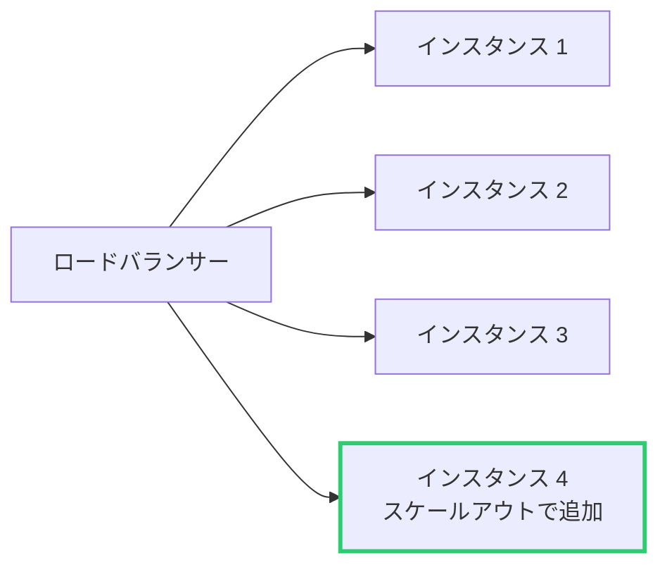
```mermaid
graph LR
    LB[ロードバランサー]
    LB --> A[インスタンス 1]
    LB --> B[インスタンス 2]
    LB --> C[インスタンス 3]
    LB --> D[インスタンス 4<br/>スケールアウトで追加]

    style D stroke:#2ecc71,stroke-width:3px
```

**メリット**:
- 理論上、無制限にスケールできる
- 個々のインスタンスの障害がサービス全体に直結しない（高可用性）
- コモディティハードウェアで構成できるためコスト効率が良い

**デメリット**:
- アプリケーションがステートレスである必要がある（セッション管理やキャッシュの設計が必要）
- ロードバランサーなどのトラフィック分散機構が必須
- データの整合性管理が複雑になる

### 2.2 垂直スケーリング（スケールアップ / スケールダウン）

垂直スケーリングは、既存のインスタンスに割り当てる **リソース（CPU・メモリ）を増減** させるアプローチだ。

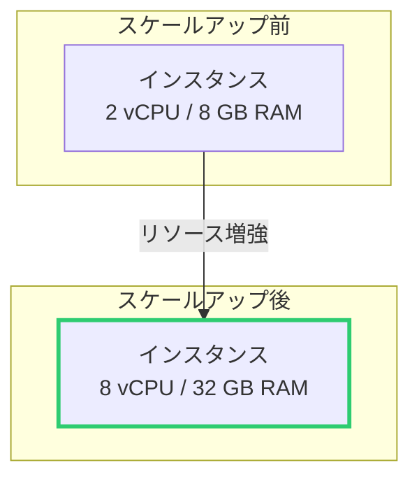
```mermaid
graph TD
    subgraph スケールアップ後
        B[インスタンス<br/>8 vCPU / 32 GB RAM]
    end
    subgraph スケールアップ前
        A[インスタンス<br/>2 vCPU / 8 GB RAM]
    end
    A -->|リソース増強| B

    style B stroke:#2ecc71,stroke-width:3px
```

**メリット**:
- アプリケーションの変更が不要（ステートフルなアプリケーションにも適用可能）
- 設計・運用がシンプル

**デメリット**:
- 物理的・仮想的なリソースの上限がある
- 多くの場合、リソース変更時にダウンタイムが発生する
- 単一障害点（SPOF）になりやすい

### 2.3 実際のアーキテクチャでの使い分け

現実の運用では、水平スケーリングと垂直スケーリングを **併用** するのが一般的だ。例えば、ウェブサーバーやアプリケーションサーバーのようなステートレスなコンポーネントには水平スケーリングを適用し、データベースのようなステートフルなコンポーネントには垂直スケーリング（あるいはリードレプリカによる水平スケーリング）を適用するという構成が広く採用されている。

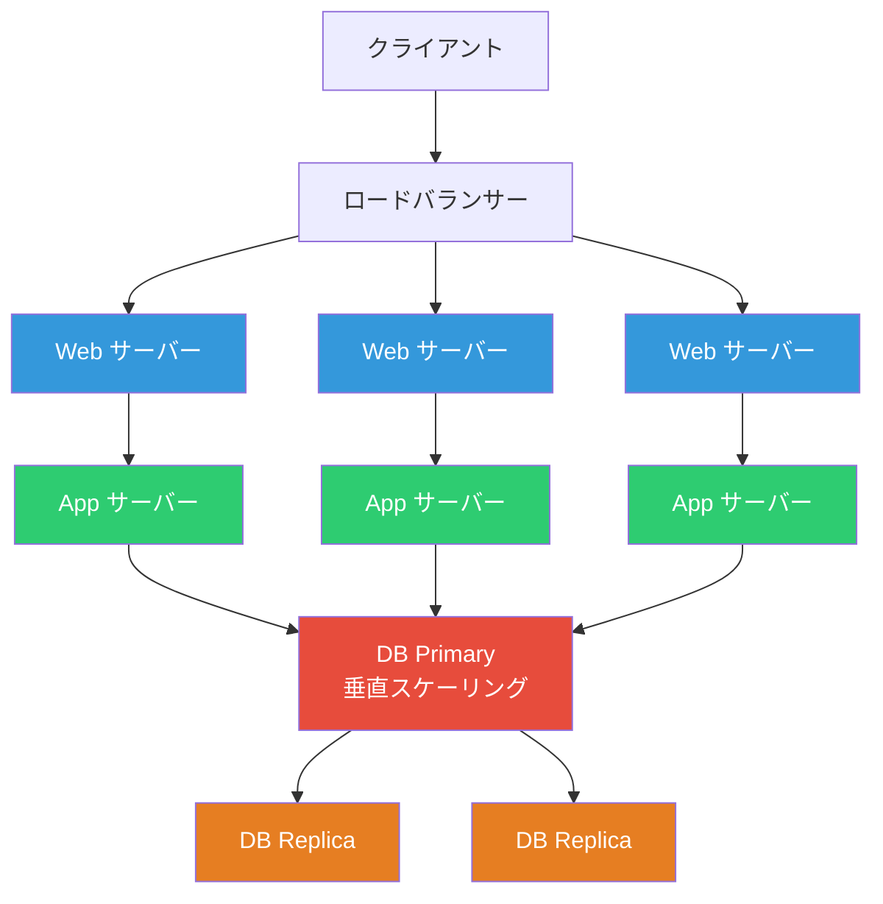
```mermaid
graph TB
    Client[クライアント]
    Client --> LB[ロードバランサー]
    LB --> Web1[Web サーバー]
    LB --> Web2[Web サーバー]
    LB --> Web3[Web サーバー]
    Web1 --> App1[App サーバー]
    Web2 --> App2[App サーバー]
    Web3 --> App3[App サーバー]
    App1 --> DBPrimary[DB Primary<br/>垂直スケーリング]
    App2 --> DBPrimary
    App3 --> DBPrimary
    DBPrimary --> DBReplica1[DB Replica]
    DBPrimary --> DBReplica2[DB Replica]

    style Web1 fill:#3498db,color:#fff
    style Web2 fill:#3498db,color:#fff
    style Web3 fill:#3498db,color:#fff
    style App1 fill:#2ecc71,color:#fff
    style App2 fill:#2ecc71,color:#fff
    style App3 fill:#2ecc71,color:#fff
    style DBPrimary fill:#e74c3c,color:#fff
    style DBReplica1 fill:#e67e22,color:#fff
    style DBReplica2 fill:#e67e22,color:#fff
```

この構成では、Web サーバーと App サーバーは水平にスケールし、DB Primary は垂直にスケールする。DB Replica は読み取り負荷を分散するために水平にスケールアウトできる。

---

## 3. リアクティブスケーリング vs 予測型スケーリング

オートスケーリングの判断ロジックは、大きく「リアクティブ（事後対応型）」と「プレディクティブ（予測型）」に分類される。

### 3.1 リアクティブスケーリング

リアクティブスケーリングは、**現在のメトリクス値に基づいてスケーリングを判断する**最も基本的なアプローチだ。CPU 使用率やメモリ使用率、リクエスト数などの指標が閾値を超えたらスケールアウトし、閾値を下回ったらスケールインする。

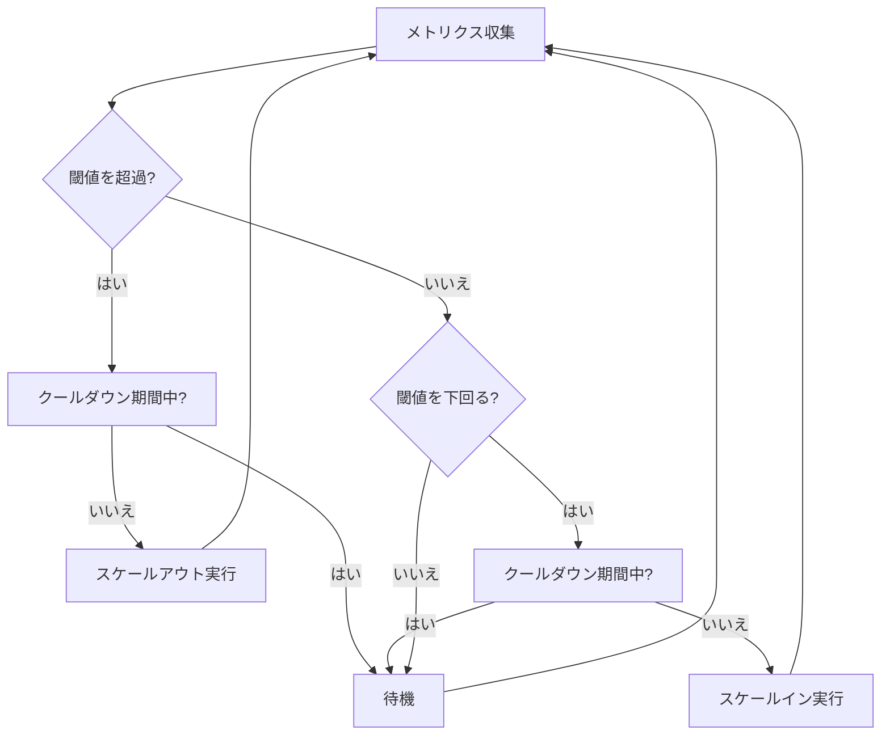
```mermaid
flowchart TD
    A[メトリクス収集] --> B{閾値を超過?}
    B -->|はい| C[クールダウン期間中?]
    C -->|いいえ| D[スケールアウト実行]
    C -->|はい| E[待機]
    B -->|いいえ| F{閾値を下回る?}
    F -->|はい| G[クールダウン期間中?]
    G -->|いいえ| H[スケールイン実行]
    G -->|はい| E
    F -->|いいえ| E
    D --> A
    H --> A
    E --> A
```

リアクティブスケーリングの典型的な設定例は以下のとおりだ。

| パラメータ | 値の例 | 説明 |
|---|---|---|
| スケールアウト閾値 | CPU 使用率 70% | この値を超えたらインスタンスを追加 |
| スケールイン閾値 | CPU 使用率 30% | この値を下回ったらインスタンスを削減 |
| クールダウン期間 | 300 秒 | スケーリング実行後の待機時間 |
| 評価期間 | 60 秒 x 3 回 | 閾値超過を判定するための連続観測回数 |

**リアクティブスケーリングの課題**:
- **遅延**: メトリクスの収集、評価、スケーリング実行、インスタンスの起動、ヘルスチェックの通過まで数分かかる
- **振動（フラッピング）**: スケールアウトとスケールインが頻繁に繰り返される
- **突発的な負荷増大**: Flash Crowd のような瞬間的な負荷増大には間に合わない

### 3.2 予測型スケーリング

予測型スケーリングは、**過去のトラフィックパターンを分析して将来の負荷を予測し、事前にスケーリングを実行する**アプローチだ。機械学習モデルや時系列分析を用いて、数分から数時間先の負荷を予測する。

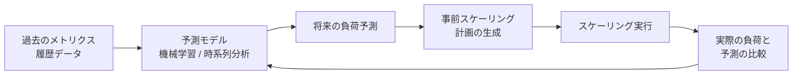
```mermaid
graph LR
    A[過去のメトリクス<br/>履歴データ] --> B[予測モデル<br/>機械学習 / 時系列分析]
    B --> C[将来の負荷予測]
    C --> D[事前スケーリング<br/>計画の生成]
    D --> E[スケーリング実行]
    E --> F[実際の負荷と<br/>予測の比較]
    F --> B
```

AWS Auto Scaling の **Predictive Scaling** はこのアプローチを採用しており、過去14日間のメトリクスデータから周期的なパターンを学習し、将来の負荷を予測する。毎日の朝のピーク、週末のトラフィック減少、月末の処理増加といったパターンを自動的に検出する。

### 3.3 スケジュールベースのスケーリング

リアクティブと予測型の中間に位置するのが、**スケジュールベースのスケーリング**だ。運用者が既知のトラフィックパターンやイベントに合わせて、事前にスケーリングスケジュールを設定する。

```yaml
# Example: Scheduled scaling for an e-commerce platform
schedules:
  - name: morning-peak
    recurrence: "0 8 * * MON-FRI"  # Weekday mornings at 8:00
    min_capacity: 10
    max_capacity: 50
  - name: evening-off-peak
    recurrence: "0 22 * * *"  # Every day at 22:00
    min_capacity: 3
    max_capacity: 20
  - name: sale-event
    start: "2026-03-15T00:00:00Z"
    end: "2026-03-16T00:00:00Z"
    min_capacity: 30
    max_capacity: 100
```

スケジュールベースのスケーリングは、予測可能な負荷パターンに対しては効果的だが、予期しない負荷変動には対応できない。そのため、リアクティブスケーリングと組み合わせて使用するのが一般的だ。

### 3.4 3つのアプローチの組み合わせ

実際の運用では、これら3つのアプローチを**レイヤーとして組み合わせる**のがベストプラクティスとされている。

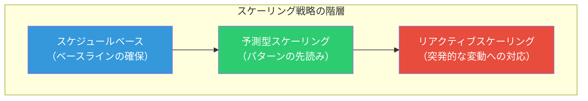
```mermaid
graph TB
    subgraph "スケーリング戦略の階層"
        S["スケジュールベース<br/>（ベースラインの確保）"]
        P["予測型スケーリング<br/>（パターンの先読み）"]
        R["リアクティブスケーリング<br/>（突発的な変動への対応）"]
    end
    S --> P --> R

    style S fill:#3498db,color:#fff
    style P fill:#2ecc71,color:#fff
    style R fill:#e74c3c,color:#fff
```

- **スケジュールベース**: 既知のイベント（セール、メンテナンス等）に対してベースラインのキャパシティを設定
- **予測型**: 日次・週次のパターンに基づいて事前にキャパシティを調整
- **リアクティブ**: 予測から外れた突発的な負荷増大に対応する安全弁

---

## 4. AWS Auto Scaling

AWS は最も早くからオートスケーリングをサービスとして提供してきたクラウドプロバイダーの一つだ。ここでは EC2 Auto Scaling を中心に、AWS のオートスケーリング機構を解説する。

### 4.1 EC2 Auto Scaling の基本アーキテクチャ

EC2 Auto Scaling は、**Auto Scaling Group（ASG）** という論理グループ単位でインスタンスの数を管理する。

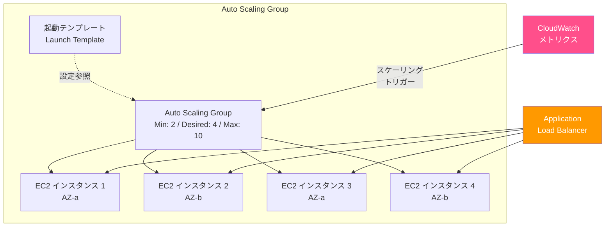
```mermaid
graph TB
    subgraph "Auto Scaling Group"
        LC[起動テンプレート<br/>Launch Template]
        ASG[Auto Scaling Group<br/>Min: 2 / Desired: 4 / Max: 10]
        ASG --> I1[EC2 インスタンス 1<br/>AZ-a]
        ASG --> I2[EC2 インスタンス 2<br/>AZ-b]
        ASG --> I3[EC2 インスタンス 3<br/>AZ-a]
        ASG --> I4[EC2 インスタンス 4<br/>AZ-b]
    end
    LC -.->|設定参照| ASG
    ALB[Application<br/>Load Balancer] --> I1
    ALB --> I2
    ALB --> I3
    ALB --> I4
    CW[CloudWatch<br/>メトリクス] -->|スケーリング<br/>トリガー| ASG

    style ALB fill:#ff9900,color:#fff
    style CW fill:#ff4f8b,color:#fff
```

ASG の3つの重要なパラメータは以下のとおりだ。

- **最小キャパシティ（Min）**: サービスの可用性を保証する最低インスタンス数
- **希望キャパシティ（Desired）**: 現在のターゲットとなるインスタンス数（オートスケーリングはこの値を調整する）
- **最大キャパシティ（Max）**: コスト制御のための上限

### 4.2 スケーリングポリシーの種類

EC2 Auto Scaling は複数のスケーリングポリシーを提供している。

#### Target Tracking Scaling（ターゲット追跡）

最も推奨されるポリシーであり、指定したメトリクスのターゲット値を維持するようにインスタンス数を自動調整する。サーモスタットのように「目標温度」を設定するだけで済む。

```json
{
  "TargetTrackingConfiguration": {
    "PredefinedMetricSpecification": {
      "PredefinedMetricType": "ASGAverageCPUUtilization"
    },
    "TargetValue": 50.0,
    "DisableScaleIn": false
  }
}
```

Target Tracking では、AWS が内部的に比例制御（P制御に近い）アルゴリズムを用いて、ターゲット値との乖離に応じたスケーリング量を計算する。例えば、ターゲット CPU 使用率が50%で現在の使用率が75%なら、おおよそ50%のインスタンス追加が必要と判断される。

#### Step Scaling（ステップスケーリング）

CloudWatch アラームの閾値に応じて、段階的にスケーリング量を変化させる。

```
CPU 使用率:
  50% - 60%: +1 インスタンス
  60% - 80%: +3 インスタンス
  80% 以上:  +5 インスタンス
```

#### Simple Scaling（シンプルスケーリング）

最も基本的なポリシーで、アラームが発火したら固定数のインスタンスを追加・削除する。クールダウン期間中は追加のスケーリングが行われないため、急激な負荷増大に対する追従性が低い。現在は Target Tracking や Step Scaling の使用が推奨されている。

### 4.3 Predictive Scaling

AWS は2021年に EC2 Auto Scaling に **Predictive Scaling** を正式導入した。このポリシーは機械学習を用いて将来の負荷を予測し、事前にスケーリングを実行する。

内部的には以下のステップで動作する。

1. 過去14日間の CloudWatch メトリクスデータを収集
2. 時系列予測モデル（周期性の検出、トレンド分析）でパターンを学習
3. 48時間先までの負荷を予測
4. 予測に基づいてスケーリングスケジュールを生成
5. 実際のメトリクスとの差異を継続的にフィードバックし、モデルを改善

Predictive Scaling は **Forecast only** モードと **Forecast and scale** モードを提供しており、まず Forecast only で予測精度を確認してから Forecast and scale に移行するのが安全だ。

### 4.4 インスタンスの起動と終了戦略

ASG はインスタンスの追加・削除時に様々な戦略を適用できる。

**起動時の考慮事項**:
- **ウォームプール**: 事前に停止状態のインスタンスをプールしておき、スケールアウト時に素早く起動する（コールドスタートの軽減）
- **Mixed Instances Policy**: オンデマンドとスポットインスタンスを混在させてコストを最適化
- **Allocation Strategy**: 複数のインスタンスタイプやアベイラビリティゾーンにまたがって分散配置

**終了時の戦略（Termination Policy）**:
- **OldestInstance**: 最も古いインスタンスから終了（AMI の更新を促進）
- **NewestInstance**: 最も新しいインスタンスから終了（最小限の変更を維持）
- **OldestLaunchConfiguration**: 古い起動設定のインスタンスを優先的に終了
- **Default**: AZ 間のバランスを優先し、その中で最も古い起動設定のインスタンスを終了

### 4.5 ライフサイクルフック

ASG は、インスタンスの起動・終了時にカスタム処理を挿入するための **ライフサイクルフック** を提供する。

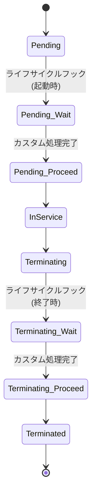
```mermaid
stateDiagram-v2
    [*] --> Pending
    Pending --> Pending_Wait: ライフサイクルフック<br/>(起動時)
    Pending_Wait --> Pending_Proceed: カスタム処理完了
    Pending_Proceed --> InService
    InService --> Terminating
    Terminating --> Terminating_Wait: ライフサイクルフック<br/>(終了時)
    Terminating_Wait --> Terminating_Proceed: カスタム処理完了
    Terminating_Proceed --> Terminated
    Terminated --> [*]
```

起動時のライフサイクルフックは、インスタンスがサービスに投入される前にアプリケーションの初期化、設定のプル、ヘルスチェックの事前確認などを行うために使用される。終了時のライフサイクルフックは、処理中のリクエストの完了（Graceful Shutdown）、ログの退避、監視システムからの登録解除などに使用される。

---

## 5. Kubernetes HPA / VPA / KEDA

Kubernetes のエコシステムでは、Pod レベルのオートスケーリングとして **HPA（Horizontal Pod Autoscaler）**、**VPA（Vertical Pod Autoscaler）**、そしてイベント駆動型の **KEDA** が提供されている。

### 5.1 Horizontal Pod Autoscaler（HPA）

HPA は、Kubernetes に組み込まれた水平スケーリング機構だ。Deployment や ReplicaSet の Pod レプリカ数を、メトリクスに基づいて自動調整する。

#### アルゴリズム

HPA のコアとなるスケーリングアルゴリズムは、以下のシンプルな比例計算に基づいている。

$$
\text{desiredReplicas} = \left\lceil \text{currentReplicas} \times \frac{\text{currentMetricValue}}{\text{desiredMetricValue}} \right\rceil
$$

例えば、現在3つの Pod が稼働しており、平均 CPU 使用率が80%、ターゲット値が50%の場合:

$$
\text{desiredReplicas} = \left\lceil 3 \times \frac{80}{50} \right\rceil = \left\lceil 4.8 \right\rceil = 5
$$

このアルゴリズムの鍵は、**Pod の Requests 値に対する使用率** をメトリクスとして使用する点だ。Requests が適切に設定されていなければ、HPA は正しく機能しない。

#### HPA v2 マニフェストの例

```yaml
apiVersion: autoscaling/v2
kind: HorizontalPodAutoscaler
metadata:
  name: web-app-hpa
spec:
  scaleTargetRef:
    apiVersion: apps/v1
    kind: Deployment
    name: web-app
  minReplicas: 3
  maxReplicas: 50
  metrics:
    # CPU-based scaling
    - type: Resource
      resource:
        name: cpu
        target:
          type: Utilization
          averageUtilization: 60
    # Memory-based scaling
    - type: Resource
      resource:
        name: memory
        target:
          type: Utilization
          averageUtilization: 70
    # Custom metric: requests per second
    - type: Pods
      pods:
        metric:
          name: http_requests_per_second
        target:
          type: AverageValue
          averageValue: "1000"
  behavior:
    scaleUp:
      stabilizationWindowSeconds: 60
      policies:
        - type: Percent
          value: 100          # Double the replicas at most
          periodSeconds: 60
        - type: Pods
          value: 10           # Add at most 10 pods
          periodSeconds: 60
      selectPolicy: Max
    scaleDown:
      stabilizationWindowSeconds: 300
      policies:
        - type: Percent
          value: 10           # Remove at most 10% of replicas
          periodSeconds: 60
```

#### HPA の制御ループ

HPA コントローラーは、デフォルトで **15秒ごと** にメトリクスを評価し、スケーリングの判断を行う。

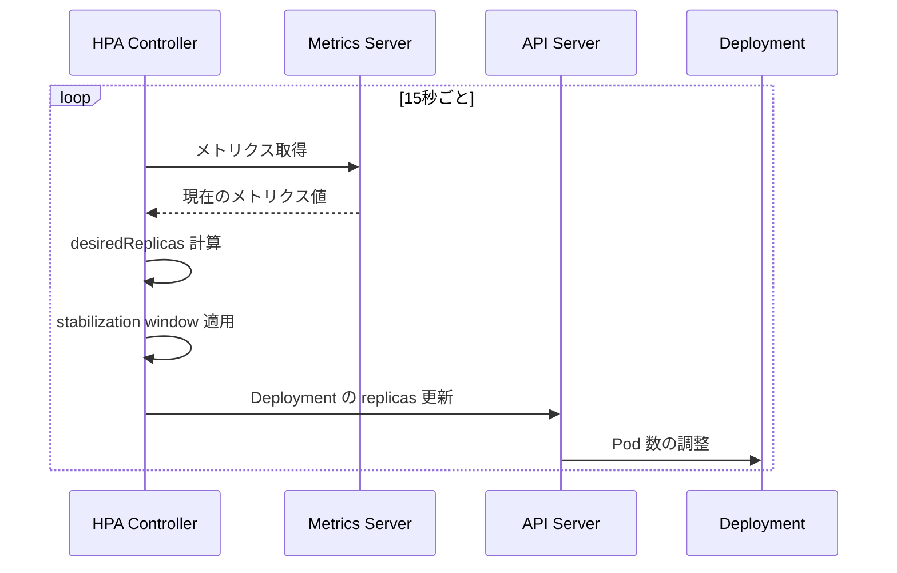
```mermaid
sequenceDiagram
    participant HC as HPA Controller
    participant MS as Metrics Server
    participant API as API Server
    participant D as Deployment

    loop 15秒ごと
        HC->>MS: メトリクス取得
        MS-->>HC: 現在のメトリクス値
        HC->>HC: desiredReplicas 計算
        HC->>HC: stabilization window 適用
        HC->>API: Deployment の replicas 更新
        API->>D: Pod 数の調整
    end
```

#### Stabilization Window

HPA v2 で導入された **Stabilization Window** は、スケーリングの振動を防ぐための重要なメカニズムだ。指定された時間ウィンドウ内の全ての推奨レプリカ数を記録し、スケールダウンの場合は最大値、スケールアップの場合は最小値を採用する。これにより、一時的なメトリクスの変動によるフラッピングを抑制する。

### 5.2 Vertical Pod Autoscaler（VPA）

VPA は、個々の Pod に割り当てる CPU とメモリの Requests / Limits を自動調整する。HPA が「Pod の数」を変えるのに対し、VPA は「Pod のサイズ」を変える。

#### VPA のコンポーネント

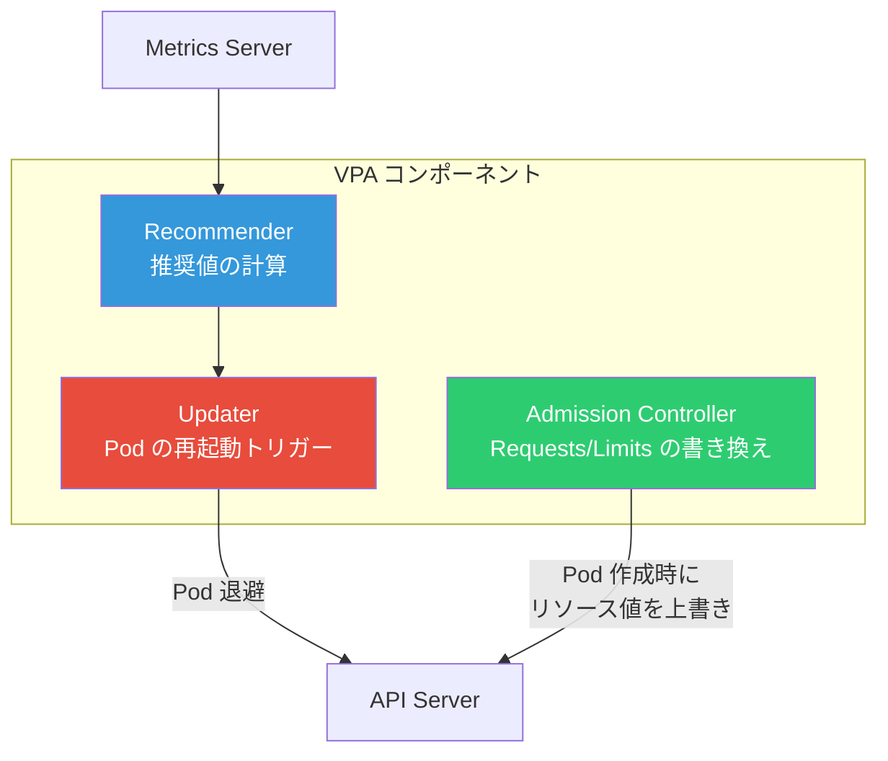
```mermaid
graph TB
    subgraph "VPA コンポーネント"
        R[Recommender<br/>推奨値の計算]
        U[Updater<br/>Pod の再起動トリガー]
        AC[Admission Controller<br/>Requests/Limits の書き換え]
    end
    MS[Metrics Server] --> R
    R --> U
    U -->|Pod 退避| API[API Server]
    AC -->|Pod 作成時に<br/>リソース値を上書き| API

    style R fill:#3498db,color:#fff
    style U fill:#e74c3c,color:#fff
    style AC fill:#2ecc71,color:#fff
```

- **Recommender**: 過去のリソース使用量を分析し、適切な Requests / Limits を推奨する。指数加重移動平均（EWMA）を用いて直近のデータに重みを置く
- **Updater**: 現在の Requests が推奨値から大きく乖離している Pod を検出し、退避（Eviction）させる
- **Admission Controller**: 新たに作成される Pod の Requests / Limits を、Recommender の推奨値に書き換える

#### VPA のモード

```yaml
apiVersion: autoscaling.k8s.io/v1
kind: VerticalPodAutoscaler
metadata:
  name: web-app-vpa
spec:
  targetRef:
    apiVersion: apps/v1
    kind: Deployment
    name: web-app
  updatePolicy:
    updateMode: "Auto"  # "Off", "Initial", "Auto"
  resourcePolicy:
    containerPolicies:
      - containerName: web-app
        minAllowed:
          cpu: 100m
          memory: 128Mi
        maxAllowed:
          cpu: 4
          memory: 8Gi
        controlledResources: ["cpu", "memory"]
```

| モード | 動作 |
|---|---|
| `Off` | 推奨値の計算のみ行い、Pod に適用しない（観察モード） |
| `Initial` | Pod 作成時にのみ推奨値を適用し、既存の Pod は変更しない |
| `Auto` | 推奨値に基づいて既存の Pod を再起動して更新する |

#### HPA と VPA の併用に関する注意

HPA と VPA を **同一の Pod に対して同じメトリクス（CPU など）で適用することは推奨されない**。両者が競合し、HPA が「Pod を増やそう」とする一方で VPA が「Pod のサイズを上げよう」とすると、予期しない動作が発生する。

回避策としては以下がある。

- HPA はカスタムメトリクス（RPS など）で制御し、VPA は CPU / メモリの Requests 最適化に使用する
- VPA を `Off` モードで運用し、推奨値を参考にして手動で Requests を調整する
- Multidimensional Pod Autoscaler（MPA）のような統合ソリューションを使用する

### 5.3 KEDA（Kubernetes Event-Driven Autoscaling）

KEDA は、外部のイベントソースに基づいてスケーリングを行うオープンソースのプロジェクトだ。HPA の機能を拡張し、メッセージキューの深さ、データベースのクエリ結果、Prometheus のメトリクスなど、多様なイベントソースからスケーリングをトリガーできる。

#### KEDA のアーキテクチャ

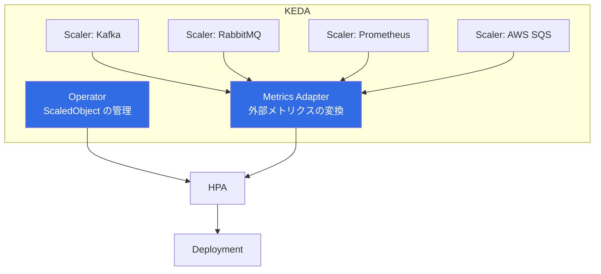
```mermaid
graph TB
    subgraph "KEDA"
        O[Operator<br/>ScaledObject の管理]
        MA[Metrics Adapter<br/>外部メトリクスの変換]
        S1[Scaler: Kafka]
        S2[Scaler: RabbitMQ]
        S3[Scaler: Prometheus]
        S4[Scaler: AWS SQS]
    end
    O --> HPA[HPA]
    MA --> HPA
    S1 --> MA
    S2 --> MA
    S3 --> MA
    S4 --> MA
    HPA --> D[Deployment]

    style O fill:#326ce5,color:#fff
    style MA fill:#326ce5,color:#fff
```

KEDA の重要な特徴は、**Pod を0にスケールダウンできる** 点だ。標準の HPA は最小レプリカ数を1以上にしか設定できないが、KEDA は処理対象のイベントがない場合に Pod を完全に停止し、イベントが到着したら Pod を起動する。これにより、バッチ処理やイベント駆動型のワークロードで大幅なコスト削減が可能になる。

#### KEDA の設定例

```yaml
apiVersion: keda.sh/v1alpha1
kind: ScaledObject
metadata:
  name: order-processor
spec:
  scaleTargetRef:
    name: order-processor
  pollingInterval: 15        # Check every 15 seconds
  cooldownPeriod: 300        # Wait 5 minutes before scaling to zero
  minReplicaCount: 0         # Scale to zero when idle
  maxReplicaCount: 100
  triggers:
    # Scale based on Kafka topic lag
    - type: kafka
      metadata:
        bootstrapServers: kafka-broker:9092
        consumerGroup: order-consumer
        topic: orders
        lagThreshold: "50"   # Scale up when lag exceeds 50
    # Also consider CPU usage
    - type: cpu
      metricType: Utilization
      metadata:
        value: "70"
```

---

## 6. Cluster Autoscaler とノードレベルのスケーリング

Pod レベルのスケーリング（HPA / VPA）が Pod の数やサイズを調整するのに対し、**Cluster Autoscaler** はクラスタのノード数を調整する。Pod がスケジュール不可能（Pending）になった場合にノードを追加し、使用率の低いノードを削除する。

### 6.1 Cluster Autoscaler の動作原理

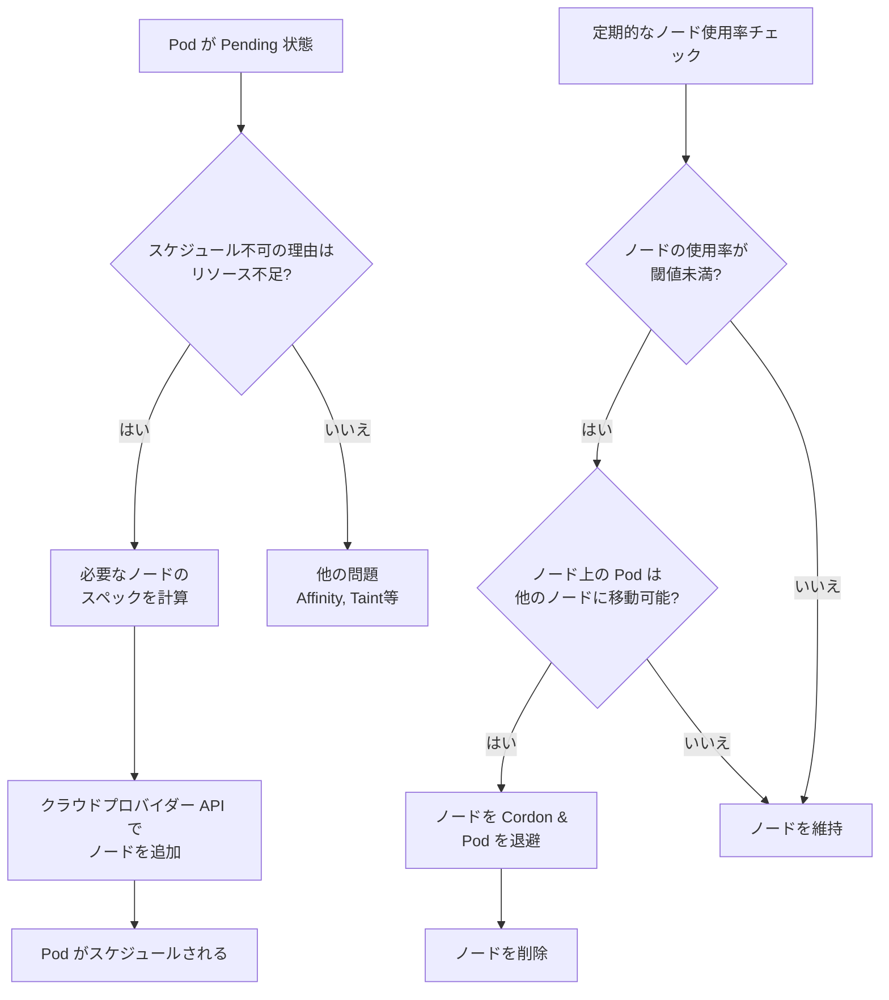
```mermaid
flowchart TD
    A[Pod が Pending 状態] --> B{スケジュール不可の理由は<br/>リソース不足?}
    B -->|はい| C[必要なノードの<br/>スペックを計算]
    C --> D[クラウドプロバイダー API で<br/>ノードを追加]
    D --> E[Pod がスケジュールされる]
    B -->|いいえ| F[他の問題<br/>Affinity, Taint等]

    G[定期的なノード使用率チェック] --> H{ノードの使用率が<br/>閾値未満?}
    H -->|はい| I{ノード上の Pod は<br/>他のノードに移動可能?}
    I -->|はい| J[ノードを Cordon &<br/>Pod を退避]
    J --> K[ノードを削除]
    I -->|いいえ| L[ノードを維持]
    H -->|いいえ| L
```

#### スケールアップのロジック

1. kube-scheduler が Pod をスケジュールできない（Pending状態）
2. Cluster Autoscaler が Pending Pod を検出
3. 各ノードグループで、その Pod を収容できるか**シミュレーション**する
4. 最適なノードグループを選択してノードを追加
5. 新しいノードが Ready になり、Pod がスケジュールされる

#### スケールダウンのロジック

1. 定期的に（デフォルト10秒間隔）全ノードの使用率を評価
2. CPU とメモリの Requests 合計がノード容量の50%未満のノードを候補とする
3. そのノード上の全 Pod が他のノードに移動可能かを確認
4. 以下の Pod があるノードは削除候補から除外される:
   - `PodDisruptionBudget` に違反する Pod
   - `kube-system` 名前空間の Pod（Daemonset 以外）
   - ローカルストレージを使用する Pod
   - アノテーションで削除を禁止された Pod
5. 条件を満たすノードが10分間継続して低使用率なら削除を実行

### 6.2 Karpenter — 次世代のノードプロビジョナー

AWS が開発した **Karpenter** は、Cluster Autoscaler の課題を解決するために設計された次世代のノードプロビジョニングツールだ。

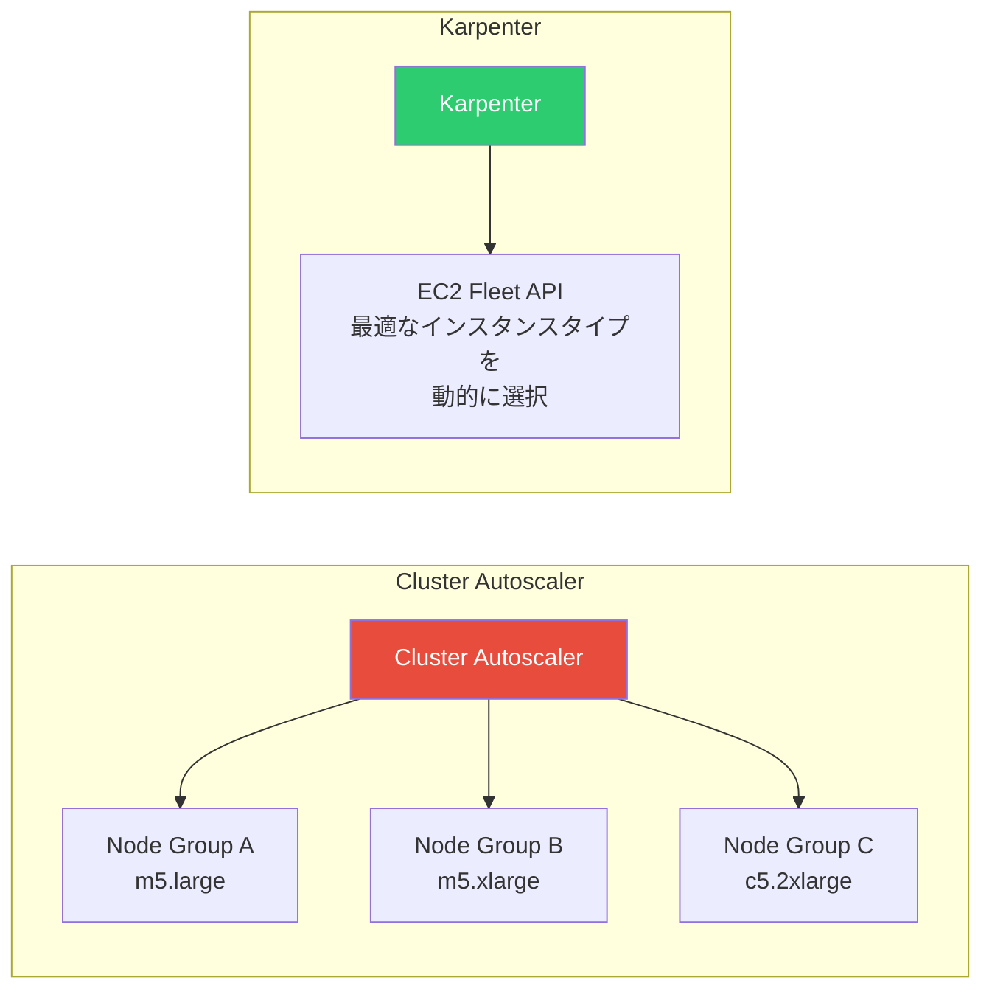
```mermaid
graph LR
    subgraph "Cluster Autoscaler"
        CA[Cluster Autoscaler] --> ASG1[Node Group A<br/>m5.large]
        CA --> ASG2[Node Group B<br/>m5.xlarge]
        CA --> ASG3[Node Group C<br/>c5.2xlarge]
    end

    subgraph "Karpenter"
        K[Karpenter] --> EC2[EC2 Fleet API<br/>最適なインスタンスタイプを<br/>動的に選択]
    end

    style CA fill:#e74c3c,color:#fff
    style K fill:#2ecc71,color:#fff
```

Cluster Autoscaler と Karpenter の主な違いは以下のとおりだ。

| 特性 | Cluster Autoscaler | Karpenter |
|---|---|---|
| ノードグループ | 事前定義が必要 | 不要（動的選択） |
| インスタンスタイプ | グループごとに固定 | Pod の要件から最適なものを選択 |
| スケールアップ速度 | ASG 経由（遅い） | EC2 Fleet API 直接（速い） |
| ビンパッキング | ノードグループ単位 | Pod 単位で最適化 |
| ノードの統合 | 限定的 | 積極的に統合（Consolidation） |

Karpenter の **Consolidation** 機能は特に強力だ。使用率の低い複数のノードを検出し、より少ない（あるいはより小さい）ノードに Pod を再配置することで、クラスタ全体のリソース効率を継続的に最適化する。

```yaml
apiVersion: karpenter.sh/v1
kind: NodePool
metadata:
  name: default
spec:
  template:
    spec:
      requirements:
        - key: kubernetes.io/arch
          operator: In
          values: ["amd64"]
        - key: karpenter.sh/capacity-type
          operator: In
          values: ["on-demand", "spot"]
        - key: node.kubernetes.io/instance-type
          operator: In
          values: ["m5.large", "m5.xlarge", "m5.2xlarge",
                   "c5.large", "c5.xlarge", "c5.2xlarge",
                   "r5.large", "r5.xlarge"]
      expireAfter: 720h  # Nodes expire after 30 days
  disruption:
    consolidationPolicy: WhenEmptyOrUnderutilized
    consolidateAfter: 30s
  limits:
    cpu: "1000"
    memory: 1000Gi
```

---

## 7. メトリクスベースのスケーリング — 何を測り、どう判断するか

オートスケーリングの成否は、**適切なメトリクスの選定**にかかっている。CPU 使用率だけを見ていては、アプリケーションの実際の負荷状態を正確に把握できない。

### 7.1 メトリクスの分類

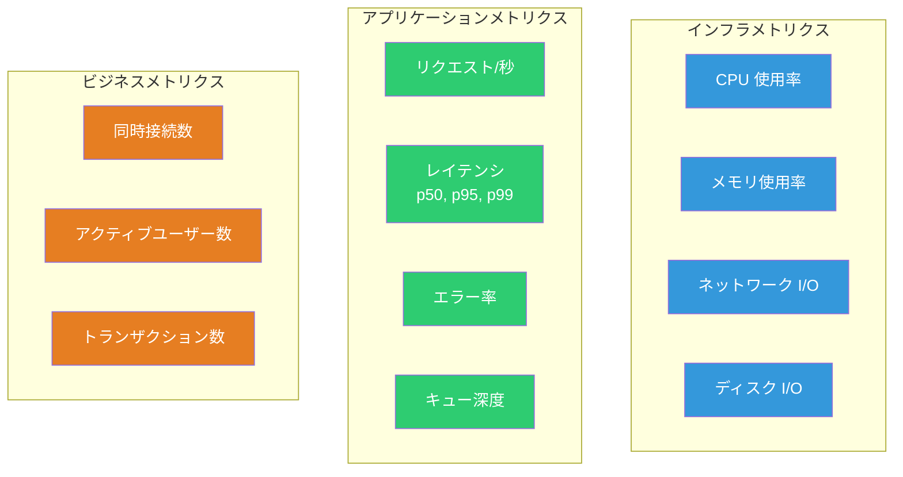
```mermaid
graph TB
    subgraph "インフラメトリクス"
        CPU[CPU 使用率]
        MEM[メモリ使用率]
        NET[ネットワーク I/O]
        DISK[ディスク I/O]
    end
    subgraph "アプリケーションメトリクス"
        RPS[リクエスト/秒]
        LAT[レイテンシ<br/>p50, p95, p99]
        ERR[エラー率]
        QUEUE[キュー深度]
    end
    subgraph "ビジネスメトリクス"
        CONN[同時接続数]
        ACTIVE[アクティブユーザー数]
        TXN[トランザクション数]
    end

    style CPU fill:#3498db,color:#fff
    style MEM fill:#3498db,color:#fff
    style NET fill:#3498db,color:#fff
    style DISK fill:#3498db,color:#fff
    style RPS fill:#2ecc71,color:#fff
    style LAT fill:#2ecc71,color:#fff
    style ERR fill:#2ecc71,color:#fff
    style QUEUE fill:#2ecc71,color:#fff
    style CONN fill:#e67e22,color:#fff
    style ACTIVE fill:#e67e22,color:#fff
    style TXN fill:#e67e22,color:#fff
```

### 7.2 CPU 使用率の落とし穴

CPU 使用率は最も一般的なスケーリングメトリクスだが、以下のケースでは不適切な判断につながる。

**I/O バウンドなワークロード**: データベースへのクエリやAPIへのHTTPリクエストで待機している場合、CPU使用率は低いままだが、アプリケーションは処理能力の限界に達している。この場合、同時接続数やリクエストキューの深度がより適切なメトリクスとなる。

**ガベージコレクションの影響**: Java や Go のようなGC付き言語では、GC による CPU スパイクがスケーリングを誤ってトリガーする可能性がある。

**CPU スロットリング**: Kubernetes の CFS（Completely Fair Scheduler）によるCPUスロットリングは、CPU使用率のメトリクスには現れないが、レイテンシに大きな影響を与える。

### 7.3 効果的なメトリクスの選定ガイドライン

| ワークロードの種類 | 推奨メトリクス | 理由 |
|---|---|---|
| Web サーバー | RPS + レイテンシ p99 | ユーザー体験に直結する |
| API サーバー | 同時接続数 + CPU | バックエンド処理の実態を反映 |
| バッチ処理 | キュー深度 + 処理待ち時間 | 未処理タスクの蓄積を検知 |
| 機械学習推論 | GPU 使用率 + リクエストキュー | GPU リソースの効率利用 |
| ストリーム処理 | コンシューマーラグ | 処理遅延の蓄積を検知 |
| データベース | 接続数 + クエリ待機時間 | スループットの限界を検知 |

### 7.4 複合メトリクスによるスケーリング

単一のメトリクスではなく、**複数のメトリクスを組み合わせた**スケーリング判断が効果的だ。

HPA v2 では複数のメトリクスを指定でき、全メトリクスの中で**最大のレプリカ数が採用される**。つまり、いずれか一つのメトリクスでもスケールアウトが必要と判断されれば、スケールアウトが実行される。

より高度なアプローチとして、Prometheus の記録ルールを用いてカスタムメトリクスを合成する方法がある。

```yaml
# Prometheus recording rule: composite scaling metric
groups:
  - name: scaling-metrics
    rules:
      - record: scaling:composite_score
        expr: |
          0.4 * (rate(http_requests_total[5m]) / 1000)
          + 0.3 * (avg(container_cpu_usage_seconds_total) / avg(kube_pod_container_resource_requests{resource="cpu"}))
          + 0.3 * (histogram_quantile(0.99, rate(http_request_duration_seconds_bucket[5m])) / 0.5)
```

この例では、リクエスト数、CPU 使用率、レイテンシ p99 を重み付けして合成スコアを算出し、このスコアに基づいてスケーリングを行う。

---

## 8. スケールダウンの課題 — スケーリングの難しい半分

多くの技術記事がスケールアップ（スケールアウト）に焦点を当てるが、実は**スケールダウン（スケールイン）のほうが遥かに難しい**。スケールアップは「リソースを追加する」だけだが、スケールダウンは「動作中のプロセスを安全に停止する」という本質的に困難な問題を含んでいる。

### 8.1 Graceful Shutdown の実装

スケールダウン時に最も重要なのは、処理中のリクエストを完了させてからプロセスを停止する **Graceful Shutdown** の実装だ。

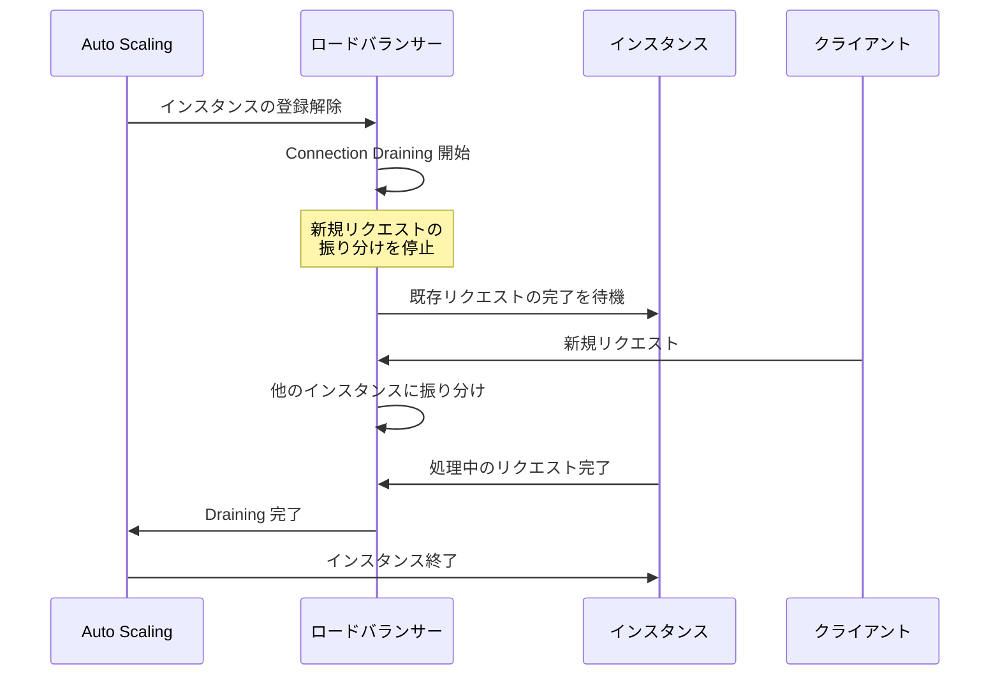
```mermaid
sequenceDiagram
    participant ASG as Auto Scaling
    participant LB as ロードバランサー
    participant I as インスタンス
    participant C as クライアント

    ASG->>LB: インスタンスの登録解除
    LB->>LB: Connection Draining 開始
    Note over LB: 新規リクエストの<br/>振り分けを停止
    LB->>I: 既存リクエストの完了を待機
    C->>LB: 新規リクエスト
    LB->>LB: 他のインスタンスに振り分け
    I->>LB: 処理中のリクエスト完了
    LB->>ASG: Draining 完了
    ASG->>I: インスタンス終了
```

Kubernetes における Graceful Shutdown は、以下の流れで行われる。

1. Pod が **Terminating** 状態になる
2. **preStop フック**が実行される（存在する場合）
3. **SIGTERM** シグナルがコンテナに送信される
4. **terminationGracePeriodSeconds**（デフォルト30秒）の間、プロセスの終了を待つ
5. タイムアウト後、**SIGKILL** で強制終了

```yaml
apiVersion: apps/v1
kind: Deployment
metadata:
  name: web-app
spec:
  template:
    spec:
      terminationGracePeriodSeconds: 60
      containers:
        - name: web-app
          lifecycle:
            preStop:
              exec:
                command: ["/bin/sh", "-c", "sleep 5"]  # Wait for endpoint removal
          # Application should handle SIGTERM gracefully
```

::: warning preStop と SIGTERM のタイミング
Kubernetes では、Pod の Endpoint 削除と SIGTERM の送信が**並行して行われる**。つまり、SIGTERM を受け取った直後にまだロードバランサーが新規リクエストを送ってくる可能性がある。`preStop` フックで数秒のスリープを入れることで、Endpoint の伝播を待つのが一般的なプラクティスだ。
:::

### 8.2 ステートフルワークロードのスケールダウン

ステートフルなワークロード（データベース、キャッシュ、ステートフルセッションなど）のスケールダウンは特に困難だ。

**データの再配置**: 分散キャッシュや分散データベースでは、ノードの削除前にデータを他のノードに移行する必要がある。Consistent Hashing を使用している場合でも、ノード数の変更はキーの再配置を引き起こし、一時的なキャッシュミス率の増加が発生する。

**セッションの移行**: ステートフルなセッション管理を行っている場合、スケールダウン対象のインスタンス上のセッションを他のインスタンスに移行するか、セッションの有効期限切れを待つ必要がある。

### 8.3 スケールダウンの遅延と安定性

スケールダウンを急ぎすぎると、直後の負荷増加に対応できなくなる「ヨーヨー効果」が発生する。逆に慎重すぎると、不要なリソースにコストを払い続けることになる。

このバランスを取るための主要なメカニズムは以下のとおりだ。

- **Stabilization Window**: HPA では `scaleDown.stabilizationWindowSeconds` で設定。過去N秒間の推奨レプリカ数の最大値を採用する
- **クールダウン期間**: EC2 Auto Scaling では、スケーリング実行後に一定時間の再実行を抑制する
- **段階的スケールダウン**: 一度に大量のインスタンスを削除せず、少しずつ減らす
- **スケールダウン率の制限**: HPA の `scaleDown.policies` で、一定期間あたりの削減率を制限する

---

## 9. コスト最適化

オートスケーリングの最終的な目的の一つは **コスト最適化** だ。必要なリソースを必要なときだけ使用することで、パフォーマンスを維持しながらコストを最小化する。

### 9.1 スポットインスタンス / Preemptible VM との組み合わせ

クラウドプロバイダーが提供するスポットインスタンス（AWS）やPreemptible VM（GCP）は、オンデマンド価格の60〜90%割引で利用できるが、プロバイダーの都合で突然回収される可能性がある。

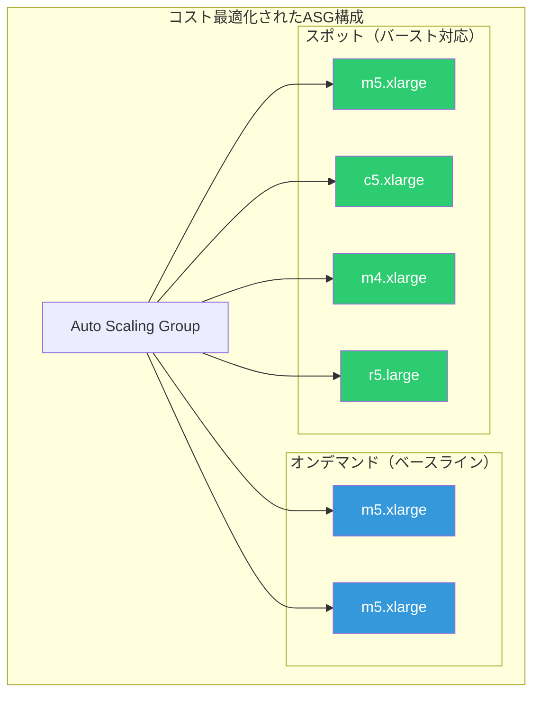
```mermaid
graph TB
    subgraph "コスト最適化されたASG構成"
        ASG[Auto Scaling Group]
        subgraph "オンデマンド（ベースライン）"
            OD1[m5.xlarge]
            OD2[m5.xlarge]
        end
        subgraph "スポット（バースト対応）"
            SP1[m5.xlarge]
            SP2[c5.xlarge]
            SP3[m4.xlarge]
            SP4[r5.large]
        end
    end
    ASG --> OD1
    ASG --> OD2
    ASG --> SP1
    ASG --> SP2
    ASG --> SP3
    ASG --> SP4

    style OD1 fill:#3498db,color:#fff
    style OD2 fill:#3498db,color:#fff
    style SP1 fill:#2ecc71,color:#fff
    style SP2 fill:#2ecc71,color:#fff
    style SP3 fill:#2ecc71,color:#fff
    style SP4 fill:#2ecc71,color:#fff
```

効果的なスポットインスタンス戦略のポイントは以下のとおりだ。

- **多様なインスタンスタイプ**: 複数のインスタンスタイプを指定して、特定タイプの中断リスクを分散する
- **複数の AZ**: アベイラビリティゾーンをまたがって配置し、ゾーン単位の中断に備える
- **ベースラインのオンデマンド**: 最低限のキャパシティはオンデマンドで確保し、超過分をスポットで賄う
- **中断ハンドリング**: 2分前の中断通知を受け取り、Graceful Shutdown を実行する仕組みを組み込む

### 9.2 Right Sizing — リソースの適正化

オートスケーリングの前提として、各インスタンスや Pod の **リソースサイズが適切であること** が重要だ。過大な Requests を設定していると、オートスケーリングが不必要にスケールアウトしてコストが膨らむ。

VPA の Recommender や AWS Compute Optimizer は、実際のリソース使用量に基づいて適切なサイズを推奨してくれる。

```
推奨値の確認:
$ kubectl describe vpa web-app-vpa
...
Recommendation:
  Container Recommendations:
    Container Name: web-app
    Lower Bound:
      Cpu:     100m
      Memory:  256Mi
    Target:
      Cpu:     250m      ← 推奨 Requests
      Memory:  512Mi
    Upper Bound:
      Cpu:     800m
      Memory:  1Gi
    Uncapped Target:
      Cpu:     250m
      Memory:  512Mi
```

### 9.3 コスト配分とオートスケーリング予算

大規模な組織では、チームやサービスごとにコスト配分を行い、オートスケーリングの予算を管理する必要がある。

- **Max Capacity の制限**: オートスケーリングの最大値を適切に設定し、暴走的なスケーリングを防ぐ
- **コストアラート**: 月間予算の80%に達した時点でアラートを発報し、最大キャパシティの見直しを促す
- **Cluster Autoscaler の limits**: Karpenter では CPU やメモリの総量にリミットを設定できる
- **リソースクォータ**: Kubernetes の ResourceQuota でNamespace ごとのリソース上限を設定する

### 9.4 Savings Plans / Reserved Instances との併用

オートスケーリングは「変動する負荷分」を効率化するが、**常に稼働しているベースライン分** については、Savings Plans や Reserved Instances を活用することで更なるコスト削減が可能だ。

```
コスト
│
│ ┌─────────────────────────────────────┐
│ │         スポットインスタンス          │ ← 突発的なピーク
│ ├─────────────────────────────────────┤
│ │     オンデマンド（オートスケーリング）  │ ← 日常的な変動
│ ├─────────────────────────────────────┤
│ │                                     │
│ │   Reserved / Savings Plans          │ ← ベースライン
│ │           (1年 or 3年)               │
│ │                                     │
│ └─────────────────────────────────────┘
└───────────────────────────────────────→ 時間
```

この3層構成により、トータルコストを最小化しつつ、あらゆる負荷パターンに対応できる。

---

## 10. 実践的な設計パターン

ここでは、オートスケーリングの実践的な設計パターンをいくつか紹介する。

### 10.1 パターン1: Web アプリケーションの典型構成

最も一般的な構成で、ステートレスな Web サーバーを水平にスケーリングする。

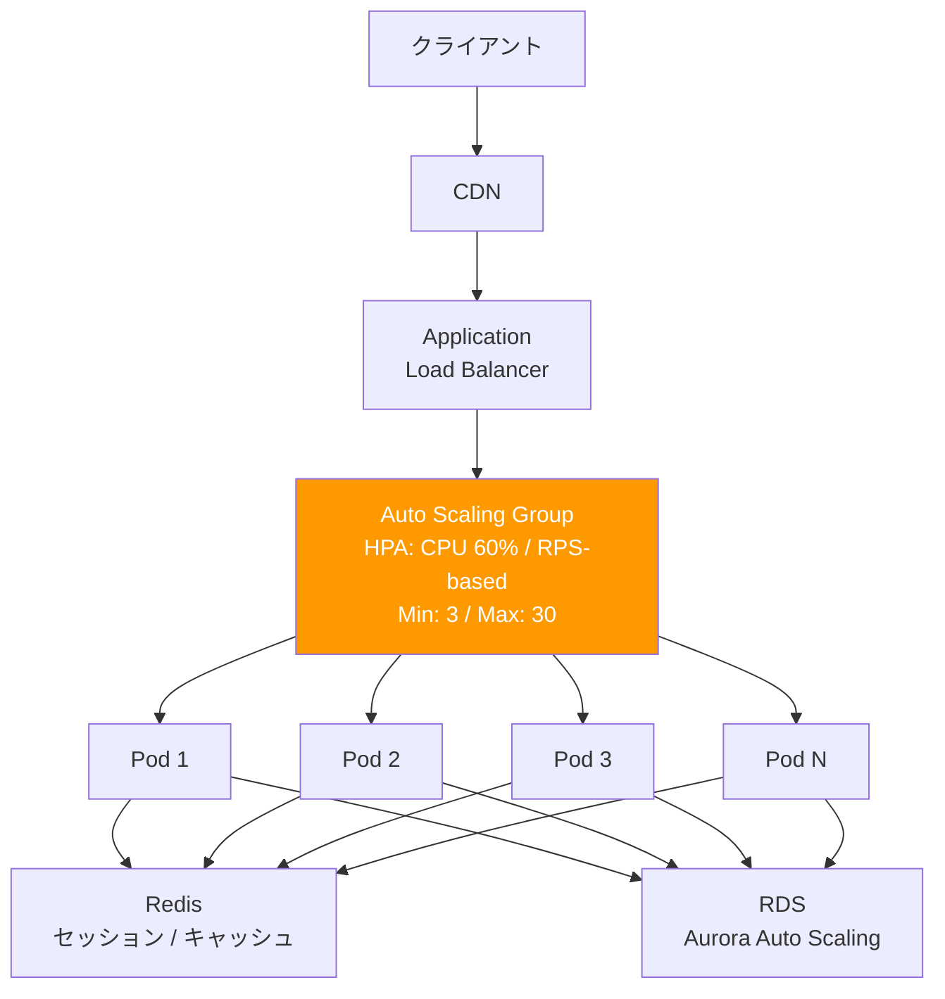
```mermaid
graph TB
    Client[クライアント] --> CDN[CDN]
    CDN --> ALB[Application<br/>Load Balancer]
    ALB --> ASG["Auto Scaling Group<br/>HPA: CPU 60% / RPS-based<br/>Min: 3 / Max: 30"]
    ASG --> Pod1[Pod 1]
    ASG --> Pod2[Pod 2]
    ASG --> Pod3[Pod 3]
    ASG --> PodN[Pod N]
    Pod1 --> Redis[Redis<br/>セッション / キャッシュ]
    Pod1 --> RDS[RDS<br/>Aurora Auto Scaling]
    Pod2 --> Redis
    Pod2 --> RDS
    Pod3 --> Redis
    Pod3 --> RDS
    PodN --> Redis
    PodN --> RDS

    style ASG fill:#ff9900,color:#fff
```

**設計のポイント**:
- セッション情報は Redis や Memcached に外出しし、Pod をステートレスに保つ
- ヘルスチェックのエンドポイントはデータベースへの疎通確認を含める
- 起動時間を短縮するために、コンテナイメージのサイズを最小限に保つ
- Readiness Probe で実際にリクエストを処理可能になってからトラフィックを受け付ける

### 10.2 パターン2: イベント駆動型ワーカー

メッセージキューからタスクを取得して処理するワーカーのスケーリングパターンだ。

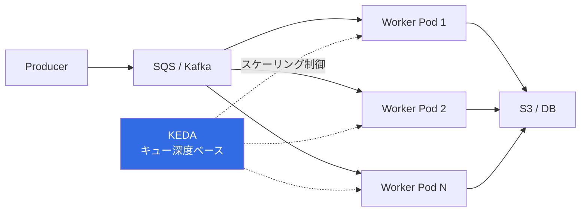
```mermaid
graph LR
    P[Producer] --> SQS[SQS / Kafka]
    SQS --> W1[Worker Pod 1]
    SQS --> W2[Worker Pod 2]
    SQS --> WN[Worker Pod N]
    W1 --> S3[S3 / DB]
    W2 --> S3
    WN --> S3
    KEDA[KEDA<br/>キュー深度ベース] -.->|スケーリング制御| W1
    KEDA -.-> W2
    KEDA -.-> WN

    style KEDA fill:#326ce5,color:#fff
```

**設計のポイント**:
- KEDA でキューの深度（未処理メッセージ数）に基づいてスケーリング
- キューが空のときは Pod を0にスケールダウン
- 処理の冪等性を保証し、少なくとも1回（at-least-once）の配信に対応
- Visibility Timeout を処理時間よりも十分に長く設定し、重複処理を抑制

### 10.3 パターン3: バッチ処理のスケジュール制御

日次・週次のバッチ処理で、処理対象のデータ量に応じてスケーリングするパターンだ。

```yaml
apiVersion: keda.sh/v1alpha1
kind: ScaledJob
metadata:
  name: daily-etl
spec:
  jobTargetRef:
    template:
      spec:
        containers:
          - name: etl-worker
            image: etl-app:latest
            resources:
              requests:
                cpu: "1"
                memory: 2Gi
        restartPolicy: Never
  pollingInterval: 30
  maxReplicaCount: 50
  triggers:
    - type: aws-sqs-queue
      metadata:
        queueURL: https://sqs.ap-northeast-1.amazonaws.com/123456789/etl-tasks
        queueLength: "5"  # One job per 5 messages
```

KEDA の **ScaledJob** は、ScaledObject と異なり、Deployment ではなく Kubernetes Job を動的に作成する。各 Job は独立して実行・完了し、処理が終わるとリソースが解放される。

### 10.4 パターン4: マルチクラスタ・フェデレーション

大規模なサービスでは、単一クラスタのオートスケーリングだけでは不十分な場合がある。複数のクラスタにまたがるスケーリングが必要になる。

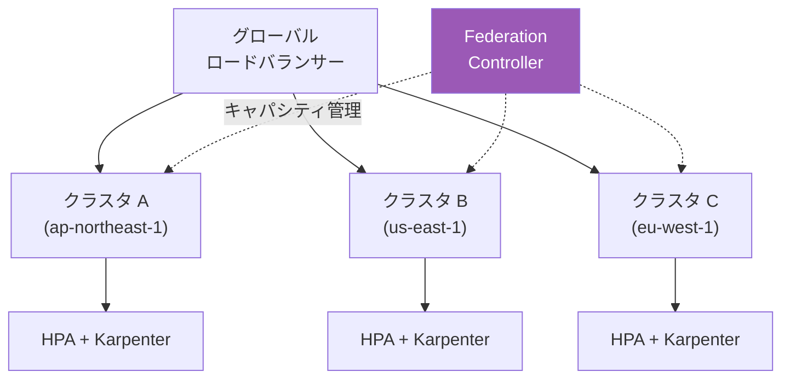
```mermaid
graph TB
    GSLB[グローバル<br/>ロードバランサー]
    GSLB --> C1["クラスタ A<br/>(ap-northeast-1)"]
    GSLB --> C2["クラスタ B<br/>(us-east-1)"]
    GSLB --> C3["クラスタ C<br/>(eu-west-1)"]

    C1 --> HPA1[HPA + Karpenter]
    C2 --> HPA2[HPA + Karpenter]
    C3 --> HPA3[HPA + Karpenter]

    Fed[Federation<br/>Controller] -.->|キャパシティ管理| C1
    Fed -.-> C2
    Fed -.-> C3

    style Fed fill:#9b59b6,color:#fff
```

この構成では、各クラスタが独立してオートスケーリングを行いつつ、Federation Controller がクラスタ間のキャパシティバランスを管理する。あるリージョンのクラスタが限界に近づいた場合、グローバルロードバランサーが他のリージョンにトラフィックを分散する。

### 10.5 パターン5: カナリアリリースとの統合

オートスケーリングはカナリアリリース戦略と組み合わせることで、新バージョンのデプロイ時のリスクを軽減できる。

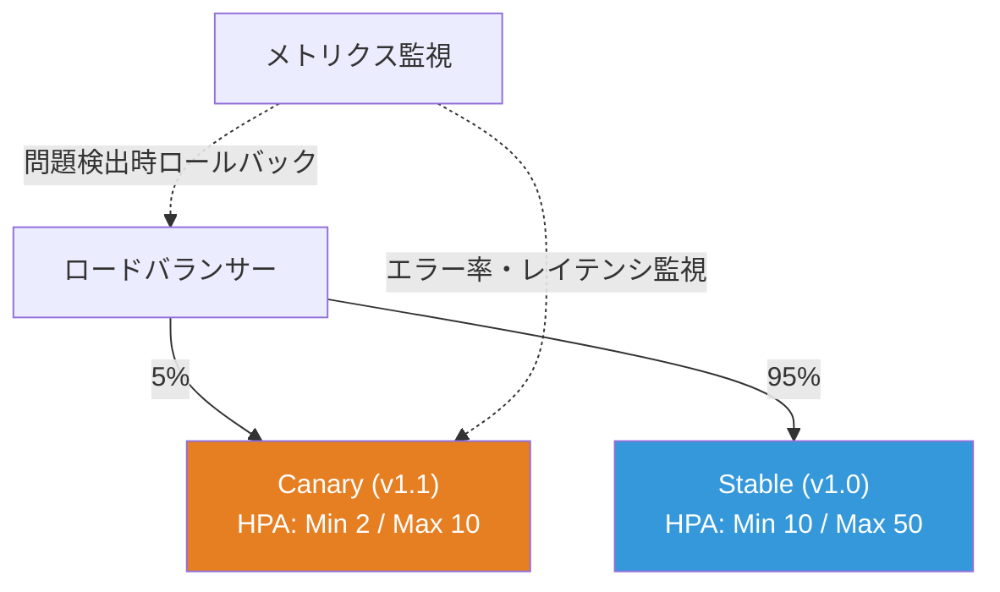
```mermaid
graph TB
    LB[ロードバランサー]
    LB -->|95%| Stable["Stable (v1.0)<br/>HPA: Min 10 / Max 50"]
    LB -->|5%| Canary["Canary (v1.1)<br/>HPA: Min 2 / Max 10"]

    Monitor[メトリクス監視] -.->|エラー率・レイテンシ監視| Canary
    Monitor -.->|問題検出時ロールバック| LB

    style Stable fill:#3498db,color:#fff
    style Canary fill:#e67e22,color:#fff
```

新バージョンのカナリアにも HPA を設定しておくことで、カナリアのトラフィック比率を増やした際にも自動的にスケーリングが行われる。

---

## 11. オートスケーリングのアンチパターンと運用上の教訓

### 11.1 アンチパターン: Requests を設定しない

Kubernetes で CPU や Memory の Requests を設定しないと、HPA は使用率を計算できない。VPA の推奨値を参考に、必ず適切な Requests を設定する。

### 11.2 アンチパターン: 起動時間を考慮しない

コンテナの起動に数分かかるアプリケーションでは、スケールアウトの効果が出るまでのタイムラグが大きくなる。以下の対策が有効だ。

- コンテナイメージを軽量化する
- アプリケーションの初期化処理を最適化する
- ウォームプール（AWS）や Karpenter の先読みプロビジョニングを活用する
- Readiness Probe の設定を適切にして、準備完了前にトラフィックが来ないようにする

### 11.3 アンチパターン: スケーリングメトリクスの不一致

ロードバランサーのターゲットグループのヘルスチェックと、スケーリングメトリクスが異なる基準を持つ場合、スケーリングの判断が実態と乖離する。例えば、ヘルスチェックは通るがレイテンシが悪化しているケースでは、レイテンシベースのスケーリングメトリクスを追加する必要がある。

### 11.4 アンチパターン: Max Capacity を設定しない

Max Capacity を設定しないか、過大な値を設定していると、バグやDDoS攻撃によって無制限にスケールアウトし、莫大な請求が発生するリスクがある。ビジネスの要件とコスト許容範囲に基づいて、適切な上限を設定する。

### 11.5 運用の教訓: 段階的なロールアウト

新しいスケーリングポリシーは、いきなり本番環境に適用するのではなく、以下の段階を踏む。

1. **観察フェーズ**: メトリクスのみ収集し、「もしスケーリングが実行されていたら」のシミュレーションを行う
2. **限定適用**: 一部のサービスや低リスクな環境で適用し、挙動を確認する
3. **全面展開**: 問題がないことを確認してから全環境に展開する

---

## 12. 将来の展望

### 12.1 AI 駆動のオートスケーリング

機械学習モデルを活用した予測型スケーリングは、今後さらに高度化していくと考えられる。単純な時系列予測だけでなく、外部要因（天気、イベント、ニュース）を考慮した多変量予測、異常検知による異常トラフィックの識別、強化学習によるスケーリングポリシーの自動最適化などが研究されている。

### 12.2 サーバーレスとの融合

AWS Lambda や Google Cloud Functions のようなサーバーレスプラットフォームは、「究極のオートスケーリング」とも言える。リクエスト単位でリソースが割り当てられ、アイドル時のコストはゼロだ。ただし、コールドスタートの問題、実行時間の制約、ベンダーロックインといった課題がある。

Knative のようなプロジェクトは、Kubernetes 上でサーバーレスのスケーリングモデルを実現する試みであり、0へのスケールダウンを含むイベント駆動型のスケーリングを提供している。

### 12.3 カーボンアウェアスケーリング

サステナビリティの観点から、電力の炭素強度（Carbon Intensity）を考慮したスケーリングが注目されている。再生可能エネルギーの供給量が多い時間帯にバッチ処理をスケジュールしたり、炭素強度の低いリージョンにワークロードを移動したりする取り組みが始まっている。

CNCF の **Carbon Aware KEDA Scaler** はこのアプローチの先駆けであり、電力グリッドの炭素強度データに基づいてスケーリングのタイミングを最適化する。

---

## まとめ

オートスケーリングは、クラウドコンピューティングにおける最も重要な技術の一つだ。その本質は「必要なときに必要なだけのリソースを、自動的に確保し、不要になったら解放する」というシンプルな原則にある。

しかし、この原則を正しく実装するためには、以下の多岐にわたる知識と判断が求められる。

- **スケーリングの方向性**: 水平と垂直の使い分け
- **判断のタイミング**: リアクティブ、予測型、スケジュールベースの組み合わせ
- **メトリクスの選定**: ワークロード特性に合った指標の選択
- **スケールダウンの安全性**: Graceful Shutdown、Connection Draining、Stabilization Window
- **コスト最適化**: スポットインスタンス、Right Sizing、Reserved Instances
- **プラットフォーム固有の機構**: AWS ASG、Kubernetes HPA/VPA/KEDA、Karpenter

オートスケーリングは設定して終わりではない。ワークロードの変化に応じて継続的にメトリクスを観察し、閾値を調整し、新たなパターンに対応していく **運用プロセス** そのものだ。この記事が、その実践の出発点となれば幸いである。
