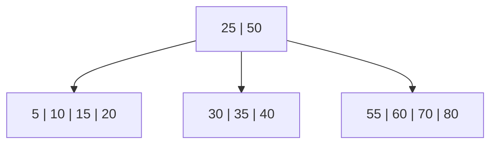
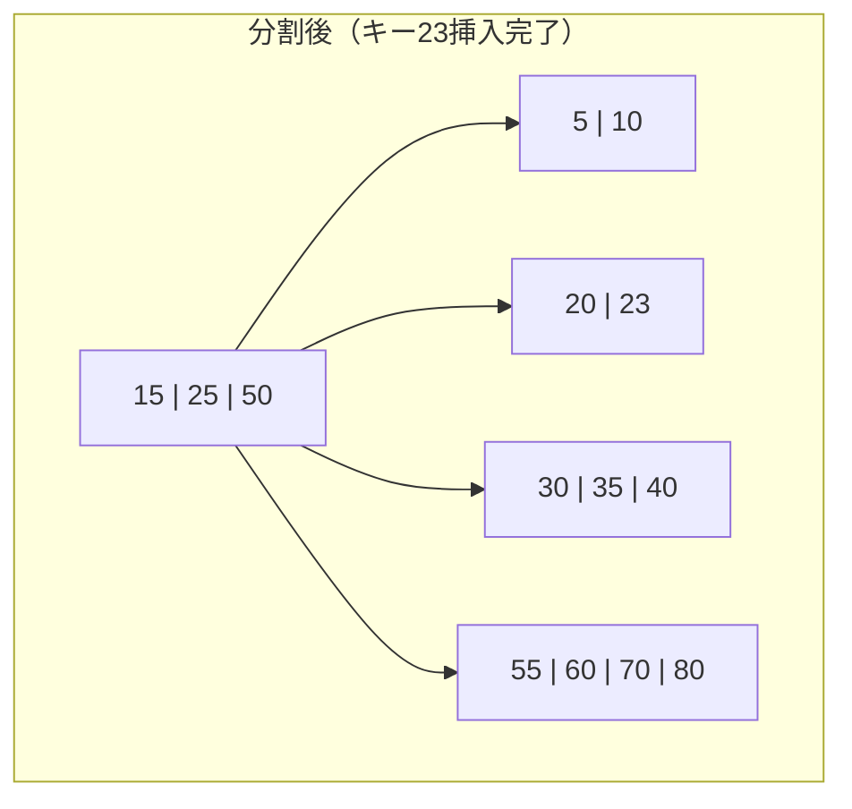
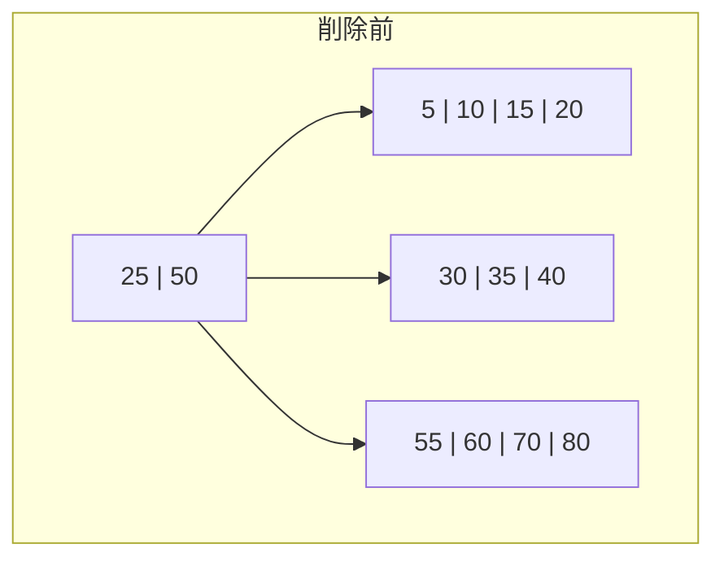
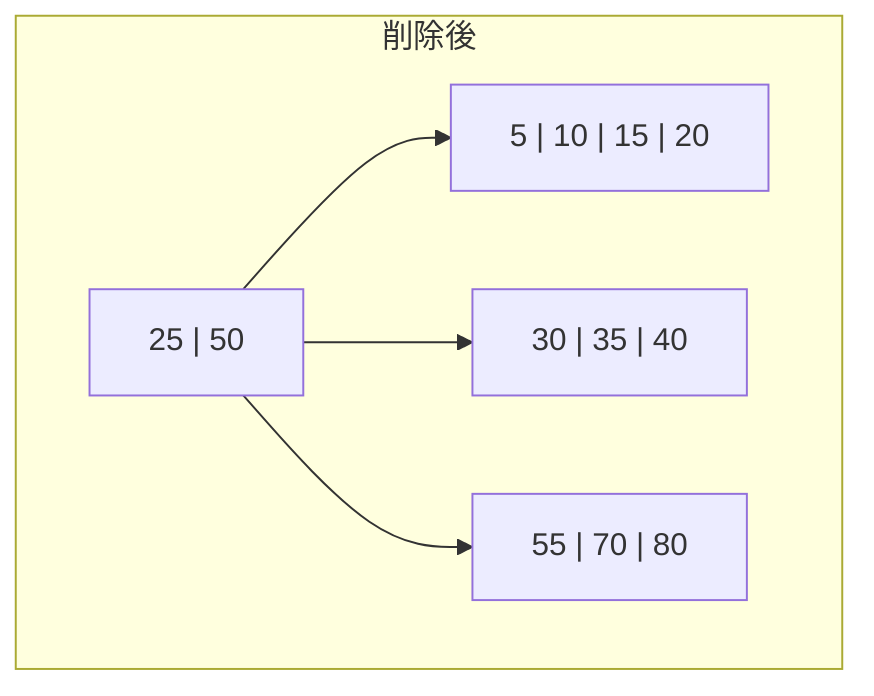
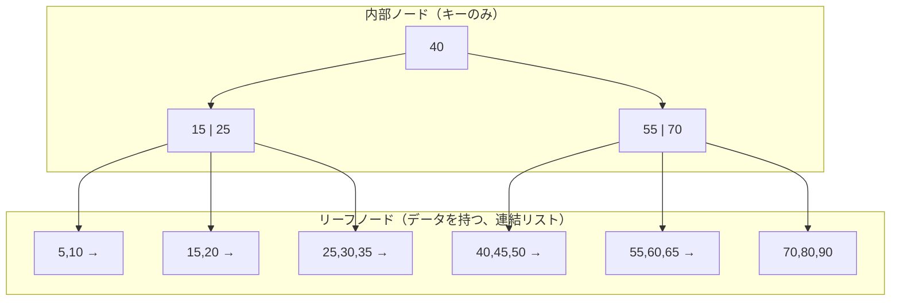

# B-Tree / B+Tree — ディスク指向のデータ構造

## 1. はじめに：なぜB木は発明されたのか

コンピュータサイエンスにおいて、データの探索・挿入・削除を効率的に行う手段として、平衡二分探索木（AVL木、赤黒木など）が広く知られている。これらの木構造はメモリ上では $O(\log_2 n)$ の計算量で優れた性能を発揮するが、データがメモリに収まりきらず**ディスク（HDD/SSD）上に格納される**場面では、深刻な問題に直面する。

その問題の本質は、ディスクアクセスの遅延にある。

| ストレージ | ランダムアクセス遅延 | 順次読み取り帯域 |
|---|---|---|
| DRAM | ~100 ns | ~25 GB/s |
| SSD（NVMe） | ~10-100 μs | ~3-7 GB/s |
| HDD | ~5-10 ms | ~100-200 MB/s |

メモリとディスクの間には、アクセス遅延にして3桁から5桁の開きがある。平衡二分探索木でキーを探索するとき、ノードを辿るたびにディスクアクセスが発生するならば、$\log_2 n$ 回のランダムI/Oが必要になる。100万件のデータに対しては約20回、10億件に対しては約30回のディスクアクセスとなり、HDDの場合は1回あたり約10msかかるため、1回の検索に数百msもかかる計算になる。

B木（B-Tree）は、この問題を根本的に解決するために設計されたデータ構造である。基本的な発想はシンプルで、**1ノードあたりの子の数を大幅に増やし、木の高さを極端に低くする**ことにある。ファンアウト（分岐数）が500であれば、100万件のデータに対する木の高さは $\log_{500}(10^6) \approx 2.2$ となり、わずか3回のディスクアクセスで任意のキーに到達できる。

```
平衡二分探索木:  高さ ≈ 20  → 20回のディスクI/O
B木（次数500）:  高さ ≈ 3   → 3回のディスクI/O
```

この圧倒的な効率性の差が、B木を50年以上にわたりデータベースやファイルシステムの基盤データ構造たらしめている理由である。

本記事では、B木をデータ構造とアルゴリズムの観点から体系的に解説する。B木の定義と性質、探索・挿入・削除の各アルゴリズム、重要な変種であるB+木との比較、ディスクI/Oモデルにおける計算量解析、そして実世界での採用例を網羅的に取り上げる。

## 2. 歴史的背景

### 2.1 誕生

B木は1970年にBoeing Scientific Research Labsの**Rudolf Bayer**と**Edward McCreight**によって発明された。彼らの論文「*Organization and Maintenance of Large Ordered Indexes*」（1972年発表）は、ディスク上の大規模な順序付きインデックスを動的に管理するためのデータ構造を提案したものである。

「B」が何を意味するかについては、公式な定義は存在しない。**B**alanced（平衡）、**B**ayer（発明者）、**B**oeing（研究所）、**B**road（幅広い）など諸説あるが、McCreight自身は意図的に意味を定義しないのが良いと述べている。

### 2.2 登場以前の状況

B木が登場する以前、大規模データの索引には**ISAM**（Indexed Sequential Access Method）が主に使われていた。ISAMは静的なインデックス構造であり、挿入によってオーバーフローページが連鎖するとアクセス性能が劣化するという本質的な問題を抱えていた。定期的な再構築が必要で、運用コストが高かった。

B木はノードの**分割**（split）と**マージ**（merge）によって動的に平衡を維持する点で画期的であった。データの挿入・削除を繰り返しても、木の高さが自動的に調整され、検索性能が保証される。この性質は、IBMのSystem Rをはじめとする初期のリレーショナルデータベースに即座に採用される要因となった。

### 2.3 その後の発展

B木の発明後、数多くの変種と最適化が提案された。

- **B+木**（1973年頃）：データをリーフノードにのみ格納し、リーフ間を連結リストで接続する。範囲検索に優れ、現代のデータベースの事実上の標準となった
- **B\*木**（Knuth, 1973年）：ノードの最低充填率を2/3に引き上げ、分割の頻度を減らす変種
- **Lehman & Yaoのアルゴリズム**（1981年）：B木の並行制御を効率化するために右リンクポインタを導入
- **Blink-Tree**（1981年）：並行アクセスに最適化されたB木の変種
- **Bw-Tree**（2013年、Microsoft Research）：ラッチフリーのB木実装

Douglas Comerは1979年の有名なサーベイ論文で、B木を「**ユビキタスなB-Tree**」と形容した。半世紀以上を経た現在でも、この表現は的確である。

## 3. B木の定義と基本性質

### 3.1 形式的定義

次数（order）$m$ のB木は、以下の性質を満たす根付きの多分木（multiway search tree）である。

1. **すべてのリーフノードは同じ深さにある**（完全平衡）
2. ルートノードを除く各内部ノードは、最低 $\lceil m/2 \rceil$ 個、最大 $m$ 個の子を持つ
3. ルートノードは、木が空でない限り最低2個の子を持つ（ルートがリーフの場合を除く）
4. $k$ 個の子を持つ内部ノードは $k - 1$ 個のキーを持つ
5. 各ノード内のキーは昇順にソートされている
6. キー $K_i$ を挟む部分木 $T_i$ と $T_{i+1}$ について、$T_i$ のすべてのキーは $K_i$ 以下であり、$T_{i+1}$ のすべてのキーは $K_i$ より大きい

::: tip 次数の定義の揺れ
B木の「次数」の定義は文献によって異なる。Knuthの定義では最低次数（minimum degree）$t$ を使い、各ノードは最低 $t-1$ 個、最大 $2t-1$ 個のキーを持つとする。Bayerの原論文では最大子数を $m$ とする。本記事ではBayerの定義（$m$ = 最大子数）を採用する。
:::

### 3.2 ノードの構造

B木の各ノードは以下の要素から構成される。

```
┌──────────────────────────────────────────────────────────────┐
│  n │ K₁ │ V₁ │ K₂ │ V₂ │ ... │ Kₙ │ Vₙ │ P₀ │ P₁ │ ... │ Pₙ │
└──────────────────────────────────────────────────────────────┘

n  : ノードに格納されているキーの個数
Kᵢ : i番目のキー（K₁ < K₂ < ... < Kₙ）
Vᵢ : キーKᵢに対応する値（レコードへのポインタなど）
Pᵢ : i番目の子ノードへのポインタ（リーフの場合はNULL）
```

**ディスク上のレイアウトとの対応**が重要である。B木は元来ディスク上のデータ構造として設計されたため、1ノードが1つの**ページ**（ディスクI/Oの基本単位、通常4KB～16KB）に収まるように設計される。子ノードへのポインタは、ディスク上のページ番号（page ID）に相当する。

### 3.3 高さの上界

$n$ 個のキーを持つ次数 $m$ のB木の高さ $h$ について、以下の上界が成り立つ。

$$
h \leq \log_{\lceil m/2 \rceil} \frac{n + 1}{2}
$$

これは、各ノードが最低 $\lceil m/2 \rceil$ 個の子を持つことから導かれる。ルートは最低2個の子を持ち、それ以下の各レベルでは最低 $\lceil m/2 \rceil$ 個の子がある。深さ $h$ でのリーフ数は最低 $2 \cdot \lceil m/2 \rceil^{h-1}$ となり、キー数 $n$ はリーフ数以上であることから、上式が得られる。

具体例を見てみよう。$m = 1000$（現実的なファンアウト）の場合：

| キー数 $n$ | 高さの上界 |
|---|---|
| $10^3$（1,000件） | 1 |
| $10^6$（100万件） | 2 |
| $10^9$（10億件） | 3 |
| $10^{12}$（1兆件） | 4 |

10億件のデータでも高さはわずか3に収まる。これが平衡二分探索木の高さ約30と比較して、いかに効率的であるかがわかる。

### 3.4 次数5のB木の例

次数5のB木（各ノードは最大4個のキー、最大5個の子を持つ）の具体例を示す。



この木の性質を確認しよう。

- ルートは2個のキー（25, 50）と3個の子を持つ
- すべてのリーフは同じ深さ（1）にある
- ノードA内のすべてのキー（5, 10, 15, 20）は25未満
- ノードB内のすべてのキー（30, 35, 40）は25より大きく50未満
- ノードC内のすべてのキー（55, 60, 70, 80）は50より大きい
- 各ノード内のキーは昇順に整列している

## 4. 探索アルゴリズム

B木の探索は、ルートノードから開始して目的のキーが見つかるかリーフに到達するまで木を下降する操作である。

### 4.1 アルゴリズム

```python
def search(node, key):
    """
    Search for a key in the B-Tree.
    Returns (node, index) if found, None otherwise.
    """
    i = 0
    while i < node.num_keys and key > node.keys[i]:
        i += 1

    # Key found in this node
    if i < node.num_keys and key == node.keys[i]:
        return (node, i)

    # Reached a leaf without finding the key
    if node.is_leaf:
        return None

    # Read child from disk
    child = disk_read(node.children[i])
    return search(child, key)
```

各ノード内でのキーの位置特定には、キー数が少なければ線形探索を、多ければ二分探索を用いる。実際のデータベース実装では、ノード内のキー数が数十～数百になるため、二分探索が一般的である。

### 4.2 計算量

探索のコストは次のように分解できる。

- **ディスクI/O回数**：$O(h) = O(\log_m n)$（木の高さ分だけノードを読み込む）
- **ノード内の比較回数**：各ノードで二分探索を使えば $O(\log_2 m)$
- **全体の比較回数**：$O(\log_m n \cdot \log_2 m) = O(\log_2 n)$

全体の比較回数は平衡二分探索木と同じ $O(\log_2 n)$ であるが、ディスクI/O回数が $O(\log_m n)$ に大幅に圧縮される。ディスクI/Oが圧倒的にボトルネックとなる環境では、この差は決定的である。

### 4.3 探索の具体例

上記の次数5のB木で、キー35を探索する過程を追跡する。

```
Step 1: ルートノード [25 | 50] を読み込む
        35 > 25、35 < 50 → 中央の子（ノードB）に進む

Step 2: ノードB [30 | 35 | 40] を読み込む
        35 == 35 → キーを発見

結果: 2回のノードアクセスで探索完了
```

## 5. 挿入アルゴリズム

B木への挿入は常にリーフノードに対して行われる。これによりすべてのリーフが同じ深さに保たれるという不変条件が維持される。挿入先のリーフが満杯の場合は**分割**（split）が発生し、この分割が再帰的にルートまで伝播する可能性がある。

### 5.1 アルゴリズムの概要

1. 探索アルゴリズムと同様に、挿入すべきリーフノードを見つける
2. リーフに空きがあれば、キーを適切な位置に挿入して完了
3. リーフが満杯（$m - 1$ 個のキー）の場合、ノードを分割する

### 5.2 ノードの分割

ノード分割はB木の核心的なメカニズムである。

1. 満杯のノードの中央値（メディアン）を選択する
2. 中央値より小さいキーを左のノードに、大きいキーを右の新ノードに分配する
3. 中央値を親ノードに**昇格**（promote）させる
4. 親ノードも満杯であれば、再帰的に分割する
5. ルートが分割される場合、新しいルートが作られ、木の高さが1増える

次の図は、次数5のB木においてキー23を挿入する際のノード分割を示す。


キー23をノードA（`[5|10|15|20]`）に挿入しようとするが、ノードAは既に4個のキー（最大数）を保持しているため分割が必要になる。



ノードAの中央値15が親（ルート）に昇格し、ノードAは `[5|10]` と `[20|23]` の2つのノードに分割された。

### 5.3 ルートの分割

ルートノードが分割される場合は特別な処理が必要である。新しいルートノードが作成され、分割された2つのノードがその子となる。これがB木で**唯一、木の高さが増える**操作である。B木がボトムアップに成長すると言われる所以はここにある。

```
ルート分割前:
    [10 | 20 | 30 | 40]   ← ルートが満杯（次数5の場合）

ルート分割後:
         [20]             ← 新しいルート
        /    \
   [10]      [30 | 40]
```

### 5.4 プロアクティブ分割（Preemptive Splitting）

Cormen et al.の教科書『Introduction to Algorithms』（CLRS）で紹介されている挿入アルゴリズムの変種として、**プロアクティブ分割**がある。これは、木を下降する途中で満杯のノードに遭遇したら、そのノードが挿入先でなくても**先行的に分割**してしまう方式である。

この方式の利点は、ディスクへの書き込みが木を下降する1パスのみで完結し、リーフからルートへの分割の連鎖（再帰的な遡上）が不要になることである。ディスクI/Oの回数は変わらないが、ページの書き戻しを1方向のパスに限定できるため、バッファ管理が単純になるという実装上のメリットがある。

```python
def insert_preemptive(tree, key):
    """
    Insert a key using preemptive splitting (single-pass, top-down).
    """
    root = tree.root
    if root.num_keys == MAX_KEYS:
        # Root is full: split it first
        new_root = allocate_node()
        new_root.is_leaf = False
        new_root.children[0] = root
        split_child(new_root, 0)
        tree.root = new_root
        insert_nonfull(new_root, key)
    else:
        insert_nonfull(root, key)

def insert_nonfull(node, key):
    """
    Insert into a node that is guaranteed not to be full.
    """
    if node.is_leaf:
        # Insert key in sorted position
        insert_key_into_leaf(node, key)
    else:
        # Find child to descend into
        i = find_child_index(node, key)
        child = disk_read(node.children[i])
        if child.num_keys == MAX_KEYS:
            # Preemptively split the full child
            split_child(node, i)
            if key > node.keys[i]:
                i += 1
            child = disk_read(node.children[i])
        insert_nonfull(child, key)
```

### 5.5 挿入の計算量

| コスト | 計算量 |
|---|---|
| ディスク読み取り | $O(\log_m n)$ |
| ディスク書き込み | $O(\log_m n)$（最悪：分割がルートまで伝播） |
| ノード内の操作 | 各ノードで $O(m)$（キーの移動） |

最悪の場合、ルートまで分割が連鎖するため $O(\log_m n)$ 回のディスク書き込みが必要となるが、これは極めて稀である。分割がルートまで達するのは、ルートからリーフまでのパス上のすべてのノードが満杯の場合のみであり、平均的にはリーフの分割だけで済む。

**償却計算量**の観点では、$n$ 回の挿入で発生する分割の総数は高々 $n - 1$ 回であることが示される（各分割はノード数を1つ増やし、最初のノードを含めて高々 $n$ 個のノードが存在するため）。したがって、1回の挿入あたりの平均分割回数は $O(1)$ である。

## 6. 削除アルゴリズム

B木からの削除は、挿入よりも複雑なアルゴリズムである。削除後にノードのキー数が最低数を下回る**アンダーフロー**（underflow）が発生した場合に、木の不変条件を復元するための処理が必要になるためである。

### 6.1 3つのケース

#### ケース1：リーフノードからの削除（アンダーフローなし）

削除対象のキーがリーフノードに存在し、削除後もノードのキー数が最低数（$\lceil m/2 \rceil - 1$）以上を維持する場合。単純にキーを除去して完了する。

#### ケース2：内部ノードからの削除

削除対象のキーが内部ノードに存在する場合、直接削除すると木構造が壊れる。代わりに、以下のいずれかで置き換える。

- **前任者**（predecessor）：削除キーの左部分木における最大キー。必ずリーフに存在する
- **後任者**（successor）：削除キーの右部分木における最小キー。必ずリーフに存在する

置き換え後、リーフから前任者（または後任者）のキーを削除する。これによりケース1またはケース3に帰着する。

```
内部ノードからの削除（キー30を削除）:

削除前:
         [20 | 30 | 50]
        /    |     |    \
  [10,15] [25,28] [35,40] [55,60]

Step 1: 前任者（28）で30を置き換え
         [20 | 28 | 50]
        /    |     |    \
  [10,15] [25,28] [35,40] [55,60]
               ↑ ここから28を削除

Step 2: リーフから28を削除
         [20 | 28 | 50]
        /    |     |    \
  [10,15]  [25]  [35,40] [55,60]
```

#### ケース3：リーフノードからの削除（アンダーフロー発生）

削除後にキー数が最低数を下回る場合、以下の2つの対策がある。

**再分配（redistribution / rotation）**：隣接する兄弟ノードにキーの余裕がある場合、兄弟からキーを「借りる」。実際の操作は、兄弟のキーを親に昇格させ、親のキーを不足ノードに降格させる回転操作である。

```
再分配の例（左の兄弟から借りる）:

再分配前:
     Parent: [... | 30 | ...]
               /        \
        [10 | 20 | 25]   [35]  ← アンダーフロー

再分配後:
     Parent: [... | 25 | ...]
               /        \
        [10 | 20]      [30 | 35]
```

**マージ（merge / coalescence）**：どちらの兄弟にも余裕がない場合、不足ノードと隣接する兄弟を統合し、親からセパレータキーを1つ降格させる。

```
マージの例:

マージ前:
     Parent: [... | 30 | ...]
               /        \
          [20]          [35]  ← 両方とも余裕なし

マージ後:
     Parent: [... | ...]
               |
        [20 | 30 | 35]
```

マージにより親のキー数が1つ減るため、親でもアンダーフローが発生する可能性がある。その場合は再帰的に処理が伝播する。ルートのキー数が0になった場合は、ルートを削除して唯一の子を新ルートとし、木の高さが1減る。

### 6.2 削除の具体例

次数5のB木において、キー60を削除する過程を詳しく追跡する。



キー60はリーフノードC（`[55|60|70|80]`）に存在する。削除後のキー数は3個で、次数5の最低キー数（$\lceil 5/2 \rceil - 1 = 2$）以上を満たすため、単純に削除できる（ケース1）。



### 6.3 削除の計算量

| コスト | 計算量 |
|---|---|
| ディスク読み取り | $O(\log_m n)$ |
| ディスク書き込み | $O(\log_m n)$（最悪：マージがルートまで伝播） |
| ノード内の操作 | 各ノードで $O(m)$（キーの移動） |

挿入と同様、最悪の場合の連鎖的なマージは極めて稀であり、平均的な削除コストは $O(1)$ 回のディスク書き込みで済む。

## 7. B+木：B木の最重要変種

### 7.1 B+木の特徴

B+木（B+ Tree）は、B木の最も重要な変種であり、現代のデータベースシステムやファイルシステムにおいてB木よりも遥かに広く採用されている。B木との主な違いは以下の3点である。

1. **データ（値）はリーフノードにのみ格納される**：内部ノードにはキーと子ポインタのみが存在し、ルーティング（探索の方向付け）のためだけに機能する
2. **リーフノードが連結リストで接続されている**：全リーフが左から右へポインタで連結されており、順序走査が効率的に行える
3. **内部ノードのキーはセパレータとして機能する**：内部ノードのキーは部分木の境界を示すだけで、データとして存在するキーと一致しなくてもよい



### 7.2 B木とB+木の構造的比較

両者の違いを図で比較する。

```
B木（データは内部ノードにも存在）:
         [20:data | 40:data]
        /        |         \
  [10:data]  [30:data]  [50:data | 60:data]

B+木（データはリーフのみ、リーフは連結）:
         [20 | 40]              ← キーのみ（ルーティング用）
        /     |     \
  [10:data] → [20:data | 30:data] → [40:data | 50:data | 60:data]
              ← リーフ間連結リスト →
```

### 7.3 B+木の利点

#### ファンアウトの増大

内部ノードがデータを持たないため、同じページサイズにより多くのキーとポインタを格納できる。これはファンアウト（分岐数）の増大、ひいては木の高さの低減につながる。

キーが8バイト、データポインタが8バイト、子ノードポインタが8バイト、ページサイズが8KBの場合を比較する。

- **B木**：各エントリは $8 + 8 + 8 = 24$ バイト → ファンアウト $\approx 8{,}192 / 24 \approx 341$
- **B+木の内部ノード**：各エントリは $8 + 8 = 16$ バイト → ファンアウト $\approx 8{,}192 / 16 \approx 512$

ファンアウトが512に増えることで、10億件のキーに対するB+木の高さは $\log_{512}(10^9) \approx 3.3$ となり、B木の $\log_{341}(10^9) \approx 3.6$ よりも低くなる。

#### 範囲検索の効率性

B+木の最大の優位点は**範囲検索**（range query）における効率性である。リーフノードが連結リストで接続されているため、ある範囲のキーを取得するには、始点となるリーフを見つけた後、リンクをたどって順次読み出すだけでよい。

```
範囲検索: 20 ≤ key ≤ 55

1. ルートからkey=20を含むリーフを検索 → [15,20]
2. リンクをたどる → [25,30,35] → [40,45,50] → [55,60,65]
3. key=55を読み取った時点で終了

読み取ったリーフページ: 4ページ（順次アクセス）
```

B木の場合、範囲検索にはツリーの中間順走査（in-order traversal）が必要であり、内部ノードへの行き来が発生する。これはディスクアクセスのランダム性を高め、特にHDDでは大きな性能劣化を招く。

#### フルスキャンの効率性

テーブル全体を順序通りに走査する場合も、リーフノードのリンクを先頭から末尾までたどるだけで完了する。内部ノードを読み込む必要がないため、不要なI/Oが排除される。

#### キャッシュ効率の向上

内部ノードのサイズが小さくなるため、より多くの内部ノードをメモリ上のバッファプール（キャッシュ）に保持できる。実際の運用では、ルートノードとその直下の内部ノードは常にメモリに常駐していることが多く、ディスクI/Oはリーフへのアクセスのみで済む。

### 7.4 B+木の探索・挿入・削除

B+木の探索・挿入・削除のアルゴリズムはB木と概ね同様であるが、いくつかの違いがある。

**探索**：B+木では、データがリーフにのみ存在するため、内部ノードでキーが見つかっても探索を継続してリーフまで下降する必要がある。計算量は $O(\log_m n)$ で変わらない。

**挿入**：リーフノードの分割時、B木ではメディアンのキーが親に昇格するが、B+木では**メディアンのコピー**が親に昇格する。元のキーはリーフに残り続ける（データはリーフにのみ存在するという不変条件を維持するため）。

```
B木の分割:
  [10 | 20 | 30 | 40] → [10 | 20] と [40]、30は親に昇格
                          ↑ 30はリーフから消える

B+木の分割:
  [10 | 20 | 30 | 40] → [10 | 20] と [30 | 40]、30のコピーが親に昇格
                                      ↑ 30はリーフに残る
```

**削除**：リーフからキーを削除した際、そのキーが内部ノードのセパレータとしても存在していても、内部ノードのセパレータを必ずしも更新する必要はない。セパレータはルーティングの正確性が保たれていれば、実際のデータキーと一致していなくてもよいためである。ただし、実装によっては整合性のためにセパレータの更新を行う場合もある。

### 7.5 B木とB+木の比較まとめ

| 特性 | B木 | B+木 |
|---|---|---|
| データの格納位置 | 内部ノード + リーフノード | リーフノードのみ |
| リーフ間リンク | なし | あり（連結リスト） |
| 内部ノードのファンアウト | 小さい | 大きい |
| 等値検索の最良ケース | 内部ノードで発見可能 | 常にリーフまで下降 |
| 範囲検索 | 非効率（中間順走査が必要） | 高効率（リーフリンクを辿る） |
| 全走査 | 非効率 | 高効率（リーフのみ） |
| 実装の複雑さ | やや単純 | やや複雑 |
| 実世界での採用 | 限定的 | データベースの事実上の標準 |

現代のデータベースが「B-Treeインデックス」と呼ぶものの実体は、ほとんどの場合B+木である。

## 8. ディスクI/Oモデルにおける計算量解析

### 8.1 外部記憶モデル

B木の計算量を正しく評価するには、通常のRAMモデルではなく**外部記憶モデル**（external memory model / disk access model）を用いる必要がある。

外部記憶モデルでは、以下を仮定する。

- 計算はメモリ上で行われ、コストは無視する
- データはブロック（ページ）単位でディスクから転送される
- 1回のI/O操作でサイズ $B$ のブロックを1つ転送できる
- 性能の指標は**I/O回数**（ブロック転送回数）である

B木の各ノードは1ブロックに対応するため、ファンアウト $m$ は $\Theta(B)$ のオーダーとなる（ブロックサイズ $B$ に比例するキー数を格納可能）。

### 8.2 各操作のI/O計算量

| 操作 | I/O回数 |
|---|---|
| 探索 | $O(\log_B n)$ |
| 挿入 | $O(\log_B n)$（償却） |
| 削除 | $O(\log_B n)$（償却） |
| 範囲検索（$k$ 件取得） | $O(\log_B n + k/B)$（B+木の場合） |

範囲検索における $k/B$ の項は、$k$ 件の結果を含むリーフブロックの順次読み取りコストである。B+木のリーフ間連結リストにより、これが最適な $O(k/B)$ で達成される。

### 8.3 最適性

**B木の探索は外部記憶モデルにおいて最適**であることが証明されている。$n$ 個のキーを格納する任意の比較ベースのデータ構造において、探索には $\Omega(\log_B n)$ のI/O回数が必要であり、B木はこの下界を達成する。

この最適性は、B木が単に「実用的に良い」だけでなく、**理論的にもこれ以上改善できない**構造であることを意味する。

## 9. 実装上の考慮点

### 9.1 ページサイズの選択

B木のノードサイズ（= ページサイズ）の選択は性能に直結する。

- **ページが大きい場合**：ファンアウトが増え、木の高さが低くなりI/O回数が減る。しかし、小さな更新でもページ全体の書き戻しが必要になり、書き込みコストが増大する
- **ページが小さい場合**：更新の粒度は細かくなるが、ファンアウトが減り木の高さが高くなる

| データベース | デフォルトページサイズ |
|---|---|
| MySQL InnoDB | 16 KB |
| PostgreSQL | 8 KB |
| SQLite | 4 KB |
| Oracle | 8 KB |
| SQL Server | 8 KB |

ページサイズはストレージデバイスの特性にも依存する。HDDではシーケンシャルリードの効率を活かすために大きめのページが有利だが、SSDではランダムアクセスのペナルティが小さいため、ページサイズの影響は相対的に小さくなる。

### 9.2 プレフィックス圧縮とサフィックス切り詰め

**プレフィックス圧縮**（prefix compression）は、同一ノード内のキーが共通プレフィックスを持つ場合に、その冗長性を排除する技法である。例えば、URL文字列 `https://example.com/page/1` と `https://example.com/page/2` の共通部分を1回だけ格納し、差分のみを保持する。これによりノードに格納できるキー数が増え、ファンアウトが向上する。

**サフィックス切り詰め**（suffix truncation）は、内部ノードのセパレータキーを最短の識別可能な長さに切り詰める技法である。左の子の最大キーが `algorithm` で右の子の最小キーが `binary` であれば、セパレータとして `b` だけを格納すれば十分である。これも内部ノードのファンアウト向上に寄与する。

### 9.3 バルクローディング

大量のデータに対してB木を一から構築する場合、1件ずつ挿入するのは非効率である。**バルクローディング**（bulk loading）は以下の手順で効率的にB木を構築する。

1. すべてのキーをソートする
2. リーフページを左から右へ順番に充填していく
3. 各リーフが完成するたびにセパレータキーを親に追加する
4. ボトムアップに内部ノードを構築する

この方法はソート済みデータの順次書き込みのみで完了するため、ランダムI/Oが発生しない。また、ページの充填率を制御できるため（通常90%以上）、個別挿入時の平均充填率（約 $\ln 2 \approx 69\%$）よりも高い空間効率を達成できる。

### 9.4 並行制御（ラッチカップリング）

マルチスレッド環境でB木に同時アクセスする際は、データ整合性を保つための並行制御が不可欠である。最も広く使われる技法が**ラッチカップリング**（latch coupling / crabbing protocol）である。

::: tip ラッチとロック
データベースの文脈では、**ラッチ**はメモリ上のデータ構造を短時間保護する軽量な同期プリミティブ（mutexに相当）であり、**ロック**はトランザクション間の論理的な排他制御に使われる。B木の並行制御で使われるのはラッチである。
:::

ラッチカップリングの基本的な流れは以下の通りである。

**読み取り操作**：
1. ルートに共有ラッチを取得する
2. 子ノードに共有ラッチを取得する
3. 親のラッチを解放する
4. リーフに到達するまで繰り返す

**書き込み操作**：
1. ルートに排他ラッチを取得する
2. 子ノードに排他ラッチを取得する
3. 子が「安全」（分割/マージが不要）であれば、祖先のラッチをすべて解放する
4. リーフに到達するまで繰り返す

「安全」なノードとは、挿入の場合はキー数が $m-2$ 以下、削除の場合はキー数が $\lceil m/2 \rceil$ 以上のノードである。この仕組みにより、分割やマージが不要な（大多数の）操作では上位ノードのラッチが早期に解放され、並行性が確保される。

### 9.5 楽観的ラッチカップリング

ラッチカップリングをさらに改良した**楽観的ラッチカップリング**（optimistic latch coupling）では、書き込み操作であっても最初は共有ラッチのみで木を下降し、リーフで排他ラッチに昇格する。分割が必要な場合のみ操作をやり直す。

ノード分割は稀にしか発生しないため、ほとんどの書き込みは読み取りラッチだけで木を下降でき、上位ノードでの競合が大幅に軽減される。

### 9.6 可変長キーの扱い

実際のシステムでは、キーが固定長とは限らない。文字列型のカラムにインデックスを張る場合、キーの長さは行ごとに異なる。可変長キーに対する主な対応方法は以下の通りである。

- **キーそのものをノードに格納**：ノード内にキーの長さ情報とキー本体を格納する。ノードごとに格納できるキー数が変動するため、ファンアウトの予測が難しくなる
- **キーの先頭部分のみ格納**（key prefix）：内部ノードでは、部分木の識別に必要な最短のプレフィックスのみを格納し、完全なキー値はリーフのみに保持する
- **間接参照**（indirection）：ノードにはキーのポインタのみを格納し、実際のキー値は別のページに配置する

PostgreSQLでは、キーが一定サイズを超える場合に**TOAST**（The Oversized-Attribute Storage Technique）の仕組みを使い、キーの一部を外部ページに退避させる。

## 10. その他のB木の変種

### 10.1 B\*木

**B\*木**（B-star tree）はKnuth（1973年）が提案した変種で、ノードの最低充填率を2/3（約67%）に引き上げる。通常のB木の最低充填率が1/2（50%）であるのに対して、空間効率が向上する。

B\*木では、ノードが満杯になった際に即座に分割するのではなく、まず隣接する兄弟ノードにキーを再分配することを試みる。兄弟にも余裕がない場合は、**2つのノードを3つのノードに分割する**（2-to-3 split）操作を行う。

```
通常のB木の分割: 1つの満杯ノード → 2つのノード（各50%充填）
B*木の分割:      2つの満杯ノード → 3つのノード（各67%充填）
```

### 10.2 B-link木

**B-link木**はLehman & Yao（1981年）が提案した変種で、各ノードに右隣ノードへのリンク（right-link）と、そのノードが管轄するキーの上限値（high key）を追加する。

この構造により、ノード分割中に別のスレッドがそのノードにアクセスしても、右リンクをたどることで正しいノードに到達できる。読み取り操作が共有ラッチのみで安全に実行可能になり、並行性が大幅に向上する。PostgreSQLのB-Tree実装はこのアルゴリズムに基づいている。

### 10.3 Bw-Tree

**Bw-Tree**（2013年、Microsoft Research）は、現代のマルチコアプロセッサとフラッシュストレージに最適化されたB木の変種である。以下の特徴を持つ。

- **ラッチフリー**：CAS（Compare-And-Swap）操作を用いてロックなしで並行更新を実現する
- **ログ構造化更新**：ページへの更新をデルタレコードとして追記し、一定量が溜まったらページを再構築する
- **マッピングテーブル**：論理ページIDと物理アドレスの間にマッピングテーブルを介在させ、ページの物理位置の変更をポインタの付け替えで表現する

Bw-Treeは、Microsoft SQL ServerのHekaton（インメモリOLTPエンジン）やAzure CosmosDBで採用されている。

## 11. ディスクI/Oとの関係

### 11.1 なぜディスクとの親和性が高いのか

B木がディスクベースのシステムにおいて圧倒的な地位を占めている理由は、その設計がディスクI/Oの物理的特性に深く適合していることにある。

**ブロックアクセスの単位との一致**：ディスクはデータをブロック（セクタ/ページ）単位で読み書きする。B木の1ノードが1ブロックに対応するように設計されるため、1回のI/Oで1ノードの全情報が取得でき、無駄な転送が発生しない。

**局所性の活用**：B木の探索では、ルートから特定のリーフまでの1本のパスを辿る。アクセスされるノード数は木の高さ分だけであり、その数は非常に少ない（通常3～4）。さらに、上位ノードはアクセス頻度が高いため、バッファプールに常駐させることで実質的なI/O回数をさらに削減できる。

**順次アクセスパターン**：B+木のリーフ間連結リストにより、範囲検索はシーケンシャルリードに変換される。HDDではシーケンシャルリードのスループットがランダムアクセスの100倍以上高いため、この最適化の効果は絶大である。

### 11.2 SSD時代のB木

SSDの普及により、ディスクアクセスパターンの前提が一部変化している。SSDではランダムリードのペナルティがHDDよりも大幅に小さいため、B木の「高さを最小化する」という設計目標の重要性は相対的に低下する。

しかし、B木はSSD環境でも依然として有効である。

- **書き込み増幅の問題**：SSDには書き込み回数に寿命上の制限がある。B木の更新は影響範囲が小さく（通常はリーフ1ページの書き換え）、書き込み増幅が比較的抑えられる
- **メモリ階層の活用**：SSDが高速になっても、メモリとの速度差は依然として大きい。B木の上位ノードをメモリにキャッシュするアプローチは引き続き有効
- **ソフトウェアスタックのオーバーヘッド**：SSDの低レイテンシを活かすには、I/O回数の削減が引き続き重要である

ただし、書き込みヘビーなワークロードではLSM-Tree（Log-Structured Merge-Tree）がSSDの順次書き込み性能を活かせるため、B木よりも有利になる場面がある。

## 12. データベースにおけるB木の使われ方

### 12.1 クラスタードインデックスとセカンダリインデックス

データベースにおけるB木（B+木）の使われ方は大きく2種類に分かれる。

**クラスタードインデックス**（clustered index）は、テーブルのデータそのものをB+木のリーフノードに格納する方式である。テーブル自体がB+木として構成され、主キーの順序でデータが物理的に配置される。MySQL InnoDBがこの方式を採用している。

```
クラスタードインデックス:
         [20 | 50]
        /    |     \
  [id=1,  [id=21, [id=51,
   data]   data]   data]
```

**セカンダリインデックス**（secondary index）は、主キー以外のカラムに対して作成されるインデックスであり、リーフノードには主キーへの参照（またはレコードの物理位置へのポインタ）が格納される。セカンダリインデックスを用いた検索は、まずインデックスから主キーを取得し、その後クラスタードインデックスで実際のデータを取得する二段階のルックアップが必要となる。

### 12.2 複合インデックスとキーの順序

複数のカラムを組み合わせた**複合インデックス**（composite index）は、B+木のキーを複数カラムの連結として構成する。例えば `(last_name, first_name)` の複合インデックスでは、まず `last_name` でソートされ、同一 `last_name` 内では `first_name` でソートされる。

```
複合インデックス (last_name, first_name):

リーフノード:
[("Doe","Alice") | ("Doe","Bob") | ("Smith","Carol") | ("Smith","David")]
```

この構造により、以下のクエリがインデックスを効率的に利用できる。

- `WHERE last_name = 'Doe'`（先頭カラムの等値検索）
- `WHERE last_name = 'Doe' AND first_name = 'Bob'`（全カラムの等値検索）
- `WHERE last_name = 'Doe' AND first_name > 'A'`（先頭カラムの等値 + 後続カラムの範囲）
- `WHERE last_name > 'D' AND last_name < 'T'`（先頭カラムの範囲検索）

一方、以下のクエリではインデックスが効率的に利用できない。

- `WHERE first_name = 'Alice'`（先頭カラムが指定されていない）

これは、B木のキーの整列順序が最左プレフィックスに依存するためである。この性質は**最左プレフィックスの法則**として知られる。

### 12.3 カバリングインデックス

クエリで必要なカラムがすべてインデックスに含まれている場合、テーブル本体（クラスタードインデックスのリーフ）にアクセスする必要がなく、インデックスのみでクエリを完結できる。これを**カバリングインデックス**（covering index）と呼ぶ。

例えば、`(last_name, first_name, age)` の複合インデックスが存在する場合、以下のクエリはインデックスのみで応答可能である。

```sql
SELECT first_name, age FROM users WHERE last_name = 'Smith';
```

カバリングインデックスはセカンダリインデックスのルックアップに伴う二段階検索を回避できるため、大幅な性能改善をもたらすことがある。

## 13. 実世界での採用例

### 13.1 リレーショナルデータベース

事実上すべてのリレーショナルデータベースが、デフォルトのインデックス構造としてB+木を採用している。

| データベース | 実装の特徴 |
|---|---|
| **MySQL InnoDB** | クラスタードインデックス方式。主キーのB+木にデータ行が格納される。ページサイズ16KB |
| **PostgreSQL** | Lehman & YaoのB-link木。非クラスタード。TID（Tuple ID）でヒープテーブルを参照。ページサイズ8KB |
| **SQLite** | テーブルにはB+木、インデックスにはB木を使用。ページサイズ4KB |
| **Oracle** | B+木インデックス。Index Organized Table（IOT）でクラスタード方式も可能 |
| **SQL Server** | クラスタード/非クラスタードの両方に対応。ページサイズ8KB |

### 13.2 ファイルシステム

B木およびその変種は、ファイルシステムのメタデータ管理にも広く用いられている。

- **NTFS**（Windows）：マスターファイルテーブル（MFT）内でB+木を使用してディレクトリエントリを管理
- **HFS+**（macOS、旧）：カタログファイルにB\*木を使用
- **APFS**（macOS/iOS、現行）：B木ベースの構造を採用し、コピーオンライト方式で整合性を保証
- **Btrfs**（Linux）：名前の由来がB-Tree File System。コピーオンライトのB木でファイルシステム全体を管理
- **ext4**（Linux）：ディレクトリインデックスにHTree（B木の一種）を使用

### 13.3 キーバリューストア

- **LMDB**（Lightning Memory-Mapped Database）：B+木をメモリマップドファイル上に実装。コピーオンライトで並行読み取りを効率化
- **BoltDB**（Go言語）：LMDBの影響を受けたB+木ベースのKVストア。etcdの内部ストレージとして使用されていた
- **WiredTiger**（MongoDB）：B+木とLSM-Treeの両方をサポートするストレージエンジン

### 13.4 その他のシステム

- **Git**：パックファイルのインデックスにおいて、ファンアウトテーブル（一種のB木的構造）を使用
- **検索エンジン**：転置インデックスの管理にB+木を使用するケースがある
- **ネットワーク機器**：ルーティングテーブルの管理にB木ベースの構造を使用

## 14. B木の限界と代替手法

### 14.1 書き込み増幅

B木の主要な弱点は**書き込み増幅**（write amplification）である。1つのキーの挿入に対して、リーフページの書き換え、分割時の追加ページ作成、WAL（Write-Ahead Log）への書き込みなど、複数のディスク書き込みが発生する。ページ内の1バイトの変更でも、ページ全体を書き戻す必要がある。

### 14.2 LSM-Tree

**LSM-Tree**（Log-Structured Merge-Tree）は、すべての書き込みを順次書き込みに変換することで書き込み増幅を大幅に削減するデータ構造である。LevelDB、RocksDB、Cassandraなどで採用されている。

ただし、LSM-Treeは読み取り時に複数のレベルを検索する必要があり（**読み取り増幅**）、バックグラウンドのコンパクション処理がリソースを消費するという課題がある。

| 特性 | B木 | LSM-Tree |
|---|---|---|
| 読み取り性能 | 優秀 | やや劣る |
| 書き込み性能 | 中程度 | 優秀 |
| 範囲検索 | 非常に効率的 | コンパクション後は効率的 |
| 遅延の予測可能性 | 安定 | コンパクション中にスパイクの可能性 |

### 14.3 ハッシュインデックス

等値検索に特化した場面では、$O(1)$ の検索が可能な**ハッシュインデックス**が有利になることがある。ただし、順序関係を保持しないため、範囲検索やソートには使えない。汎用性の観点では、B木の方が遥かに適用範囲が広い。

### 14.4 フラクショナルカスケーディング

理論的には、**フラクショナルカスケーディング**（fractional cascading）と呼ばれるテクニックにより、複数の順序付きリストにまたがる検索を効率化できる。これはB木の直接的な代替ではないが、多次元検索などの特殊な場面でB木の性能を補完する。

## 15. まとめ

B木は1970年の発明以来、半世紀以上にわたりコンピュータサイエンスの基盤的データ構造であり続けている。その成功の本質は、**ディスクI/Oの物理的制約を計算量の最適化に取り込んだ**点にある。

本記事で見てきた主要なポイントを整理する。

1. **設計の動機**：メモリとディスクの速度差に起因するI/Oボトルネックの解消。ノードのファンアウトを最大化し、木の高さを最小化する
2. **完全平衡の保証**：ボトムアップの成長により、すべてのリーフが常に同じ深さに維持される。最悪ケースでも探索性能が $O(\log_m n)$ に保証される
3. **外部記憶モデルでの最適性**：B木の探索は $O(\log_B n)$ のI/O回数を達成し、これは比較ベースのデータ構造における理論的下界と一致する
4. **B+木の優位性**：データをリーフのみに格納し、リーフ間を連結することで、範囲検索と順次走査に最適化した変種が実世界の標準となった
5. **豊富な最適化手法**：プレフィックス圧縮、サフィックス切り詰め、バルクローディング、ラッチカップリングなど、数十年にわたる研究の蓄積がある
6. **普遍的な採用**：リレーショナルデータベース、ファイルシステム、キーバリューストアなど、ストレージに関わるあらゆるシステムで基盤的な役割を果たしている

B木を深く理解することは、データベースの内部動作、ファイルシステムの設計、ストレージシステムのチューニングなど、コンピュータサイエンスの多くの領域に対する洞察を深める出発点となる。データがメモリに収まりきらない問題に直面する限り、B木の重要性は今後も変わることはないだろう。

## 参考文献

- Bayer, R., McCreight, E. (1972). "Organization and Maintenance of Large Ordered Indexes". *Acta Informatica*, 1(3), 173-189.
- Comer, D. (1979). "The Ubiquitous B-Tree". *ACM Computing Surveys*, 11(2), 121-137.
- Knuth, D. E. (1998). *The Art of Computer Programming, Volume 3: Sorting and Searching*. 2nd Edition. Addison-Wesley.
- Cormen, T. H., Leiserson, C. E., Rivest, R. L., Stein, C. (2009). *Introduction to Algorithms*. 3rd Edition. MIT Press. Chapter 18: B-Trees.
- Lehman, P. L., Yao, S. B. (1981). "Efficient Locking for Concurrent Operations on B-Trees". *ACM Transactions on Database Systems*, 6(4), 650-670.
- Graefe, G. (2011). "Modern B-Tree Techniques". *Foundations and Trends in Databases*, 3(4), 203-402.
- Levandoski, J. J., Lomet, D. B., Sengupta, S. (2013). "The Bw-Tree: A B-tree for New Hardware Platforms". *ICDE*, 302-313.
- Kleppmann, M. (2017). *Designing Data-Intensive Applications*. O'Reilly Media. Chapter 3: Storage and Retrieval.
