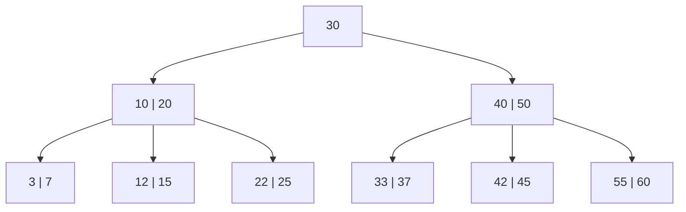
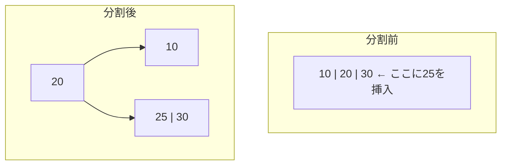

# B-Treeインデックス — データベースの心臓部を支えるデータ構造

## 1. はじめに：なぜB-Treeが必要か

リレーショナルデータベースにおいて、テーブルに格納された数百万行、数億行のデータから特定の行を高速に見つけ出すことは、システムの実用性を左右する根幹的な課題である。もしインデックスが存在しなければ、データベースはクエリのたびにテーブル全体を走査（フルテーブルスキャン）しなければならず、データ量に比例して応答時間が劣化する。

この問題を理解するためには、まずコンピュータのストレージ階層を意識する必要がある。

### 1.1 ディスクI/Oのコスト

メモリとディスク（HDD/SSD）の間には、アクセス速度に桁違いの差がある。

| ストレージ | ランダムアクセス遅延 | 順次読み取り帯域 |
|---|---|---|
| DRAM | ~100 ns | ~25 GB/s |
| SSD（NVMe） | ~10-100 μs | ~3-7 GB/s |
| HDD | ~5-10 ms | ~100-200 MB/s |

HDDのランダムアクセスはDRAMの約10万倍遅い。SSDでもDRAMの100〜1000倍遅い。したがって、データベースの性能はディスクI/Oの回数によってほぼ決定される。「**I/O回数を最小化するデータ構造**」がデータベースインデックスの本質的な設計目標である。

### 1.2 二分探索木の限界

メモリ上の探索では、二分探索木（BST）や平衡二分探索木（AVL木、赤黒木）が $O(\log_2 n)$ の時間計算量で効率的に動作する。しかし、これらの木構造をディスク上のデータベースにそのまま適用すると深刻な問題が生じる。

100万件のレコードを持つ平衡二分探索木の高さは $\log_2(1{,}000{,}000) \approx 20$ である。ノードごとに1回のディスクI/Oが発生するならば、1回の検索に20回のディスクアクセスが必要となる。HDDでは1回のランダムアクセスに約10msかかるため、単純な検索でも200msを要する計算になる。

ここに着目したのがB-Treeの設計思想である。**ノードあたりの子の数を数百〜数千に増やし、木の高さを劇的に低くする**ことで、ディスクI/O回数を最小限に抑える。同じ100万件でも、ファンアウト（分岐数）が500のB-Treeであれば、高さは $\log_{500}(1{,}000{,}000) \approx 2.2$、つまりわずか3回のディスクアクセスで目的のレコードに到達できる。

```
二分探索木:  高さ ≈ 20  →  20回のI/O
B-Tree:      高さ ≈ 3   →  3回のI/O（ルートがキャッシュされていれば2回）
```

この圧倒的な差こそが、B-Treeが50年以上にわたりデータベースインデックスの標準であり続けている理由である。

## 2. 歴史的背景

B-Treeは1970年にBoeing Scientific Research Labsの**Rudolf Bayer**と**Edward McCreight**によって発明された。彼らの論文「*Organization and Maintenance of Large Ordered Indexes*」は、大規模な順序付きインデックスをディスク上で効率的に管理する方法を提案したものであり、その後のデータベース技術の基盤となった。

「B」が何を意味するかについては諸説あり、公式な説明は存在しない。**B**alanced（平衡）、**B**ayer（発明者の名前）、**B**oeing（研究所の名前）、**B**road（幅広い）など様々な解釈があるが、McCreight自身は「B-Treeの"B"の意味を明確に定義しないのが良い」と述べている。

B-Treeの登場以前、大規模データの索引にはISAM（Indexed Sequential Access Method）が使われていたが、ISAMは静的な構造であり、挿入・削除時にオーバーフローページが連鎖して性能が劣化するという問題を抱えていた。B-Treeはノードの分割とマージによって動的に平衡を保つ点で画期的であり、IBMのSystem Rをはじめとする初期のリレーショナルデータベースに即座に採用された。

今日では、MySQL、PostgreSQL、SQLite、Oracle、SQL Serverなど、事実上すべての主要なリレーショナルデータベースがB-Tree（またはその変種であるB+Tree）をデフォルトのインデックス構造として採用している。

## 3. B-Treeの基本構造

### 3.1 次数と基本性質

次数 $m$ のB-Treeは、以下の性質を満たす多分木（multiway search tree）である。

1. **各ノードは最大 $m - 1$ 個のキーを持つ**
2. **各ノードは最大 $m$ 個の子を持つ**
3. **ルート以外の各ノードは最低 $\lceil m/2 \rceil - 1$ 個のキーを持つ**（最低占有率 50%）
4. **ルートは最低1個のキーを持つ**（ただし木が空でない場合）
5. **すべてのリーフノードは同じ深さにある**（完全平衡）
6. **各ノード内のキーは昇順に整列されている**
7. **ノードが $k$ 個のキーを持つならば、$k + 1$ 個の子を持つ**（内部ノードの場合）

性質5が特に重要である。B-Treeは**ボトムアップに成長する**木構造であり、挿入時にノードがいっぱいになると分割（split）が発生し、その結果として木が上方向に伸びる。このため、すべてのリーフが常に同じ深さに保たれ、最悪の場合でも検索性能が保証される。

### 3.2 ノードの構造

B-Treeのノードは、ディスク上の1ページ（通常4KB〜16KB）に対応するように設計される。各ノードの論理的な構造は次のとおりである。

```
┌─────────────────────────────────────────────────────┐
│  P₀ │ K₁ │ V₁ │ P₁ │ K₂ │ V₂ │ P₂ │ ... │ Kₙ │ Vₙ │ Pₙ │
└─────────────────────────────────────────────────────┘

Pᵢ: i番目の子ノードへのポインタ（ページID）
Kᵢ: i番目のキー
Vᵢ: キーに対応する値（レコードへのポインタなど）
```

キーとポインタは交互に配置される。ポインタ $P_i$ が指す部分木に含まれるすべてのキーは、$K_i < \text{key} \leq K_{i+1}$ の範囲にある（$P_0$ の場合は $\text{key} \leq K_1$）。

### 3.3 次数3のB-Treeの例

次数3（2-3木とも呼ばれる）のB-Treeの例を示す。各ノードは最大2個のキーと最大3個の子を持つ。



この木では、例えばキー15を検索する場合、ルートで $15 < 30$ なので左の子 `[10|20]` に進み、$10 < 15 \leq 20$ なので中央の子 `[12|15]` に進み、ここでキー15を発見する。わずか3回のノードアクセスで完了する。

## 4. B-Treeの操作

### 4.1 検索

B-Treeの検索はルートから始まり、各ノードで二分探索（またはキー数が少なければ線形探索）を行い、適切な子ノードを選んで降りていく。

```python
def search(node, key):
    # Find the position where key should be
    i = 0
    while i < node.num_keys and key > node.keys[i]:
        i += 1

    # Key found in this node
    if i < node.num_keys and key == node.keys[i]:
        return (node, i)

    # Key not found and this is a leaf
    if node.is_leaf:
        return None

    # Recurse into the appropriate child
    return search(node.children[i], key)
```

検索の計算量は $O(\log_m n)$ のディスクI/O回数と、各ノード内での $O(\log_2 m)$ の比較（二分探索の場合）で構成される。全体としての比較回数は $O(\log_2 n)$ であり二分探索木と同じだが、I/O回数が $O(\log_m n)$ に劇的に削減される点が本質的な違いである。

### 4.2 挿入

B-Treeへの挿入は、常にリーフノードに対して行われる。手順は以下のとおりである。

1. 検索と同じ手順で、キーが挿入されるべきリーフノードを見つける
2. リーフノードに空きがあれば、適切な位置にキーを挿入する
3. リーフノードがいっぱい（$m - 1$ 個のキー）の場合、**分割（split）**を行う

#### 4.2.1 ノードの分割

ノード分割はB-Treeの最も重要な操作であり、木の平衡を維持する鍵となるメカニズムである。

1. いっぱいになったノードの中央のキー（メディアン）を選ぶ
2. 中央のキーより小さいキーを左の新ノードに、大きいキーを右の新ノードに分配する
3. 中央のキーを親ノードに**昇格（promote）**させる
4. 親ノードもいっぱいであれば、再帰的に分割を行う
5. ルートが分割される場合、新しいルートが作られ、木の高さが1増える

次の図は、次数4のB-Treeにおけるノード分割の様子を示す。各ノードは最大3個のキーを持てる。



キー25を `[10|20|30]` に挿入しようとすると、ノードがいっぱいのため分割が発生する。中央値の20が親に昇格し、10は左の子に、25と30は右の子に分配される。

#### 4.2.2 挿入の計算量

挿入の最悪計算量は、リーフからルートまですべてのノードで分割が発生する場合であり、$O(\log_m n)$ のディスクI/O（書き込み含む）が必要である。ただし、分割がルートまで連鎖することは実際には極めて稀であり、平均的には1〜2回の分割で済む。

### 4.3 削除

削除は挿入よりも複雑であり、以下のケースを考慮する必要がある。

#### ケース1：リーフノードからの削除

削除後もノードの最低キー数（$\lceil m/2 \rceil - 1$）が維持されていれば、単純に削除して完了する。

#### ケース2：内部ノードからの削除

内部ノードのキーを直接削除すると木構造が壊れるため、**前任者（predecessor）**または**後任者（successor）**で置き換える。前任者とは、削除するキーの左部分木における最大のキーであり、これは必ずリーフノードに存在する。置き換え後、リーフノードからそのキーを削除する（ケース1に帰着）。

#### ケース3：アンダーフロー（キー不足）

削除後にノードのキー数が最低数を下回る場合、以下の対策を取る。

**再分配（redistribution）**：隣接する兄弟ノードにキーの余裕がある場合、兄弟からキーを借りる。具体的には、兄弟ノードのキーを親に昇格させ、親のキーを不足しているノードに降格させる。

```
再分配前:
Parent: [...| 30 |...]
         /        \
  [10 | 20]      [35]  ← キー不足（最低2個必要）

再分配後:
Parent: [...| 20 |...]
         /        \
    [10]        [30 | 35]
```

**マージ（merge）**：兄弟ノードにも余裕がない場合、不足ノードと兄弟ノードを統合し、親からキーを1つ降格させる。これにより親のキー数が減るため、再帰的にアンダーフロー処理が必要になる可能性がある。

```
マージ前:
Parent: [...| 30 |...]
         /        \
    [10]          [35]  ← 両方とも余裕なし

マージ後:
Parent: [...|...]
         |
   [10 | 30 | 35]
```

ルートのキー数が0になった場合、ルートを削除してその唯一の子を新しいルートとし、木の高さが1減る。

### 4.4 操作の計算量まとめ

| 操作 | ディスクI/O回数 | ノード内の計算量 |
|---|---|---|
| 検索 | $O(\log_m n)$ | $O(m)$ または $O(\log_2 m)$ |
| 挿入 | $O(\log_m n)$ | $O(m)$ |
| 削除 | $O(\log_m n)$ | $O(m)$ |

ここで $m$ はB-Treeの次数、$n$ は格納されているキーの総数である。実際のデータベースでは $m$ が数百〜数千であるため、$\log_m n$ は非常に小さい値となる。

## 5. B+Tree：実用上の主役

### 5.1 B-Treeとの違い

実際のデータベースシステムで広く使われているのは、B-Treeの変種である**B+Tree**である。B+Treeは以下の点でオリジナルのB-Treeと異なる。

1. **データはリーフノードにのみ格納される**：内部ノードにはキーとポインタ（子ノードへの参照）のみが格納され、実際のレコードへのポインタはリーフノードだけが持つ
2. **リーフノードが連結リストで接続されている**：全リーフノードが左から右へポインタで連結されており、順序アクセスが効率的に行える
3. **内部ノードのキーは「セパレータ」として機能する**：内部ノードのキーはルーティング（探索の方向付け）のためだけに存在し、必ずしもデータとして存在するキーと一致しなくてもよい

```mermaid
graph TD
    subgraph 内部ノード
        R["30 | 60"]
        N1["10 | 20"]
        N2["40 | 50"]
        N3["70 | 80"]
    end

    subgraph リーフノード（連結リスト）
        L1["3,7 | 10,12 →"]
        L2["15,18 | 20,25 →"]
        L3["30,33 | 35,38 →"]
        L4["40,42 | 45,48 →"]
        L5["50,55 | 58,59 →"]
        L6["60,65 | 70,75 →"]
        L7["78,80 | 85,90"]
    end

    R --> N1
    R --> N2
    R --> N3
    N1 --> L1
    N1 --> L2
    N1 --> L3
    N2 --> L4
    N2 --> L5
    N3 --> L6
    N3 --> L7
```

### 5.2 B+Treeの利点

#### ファンアウトの増大

内部ノードにデータを格納しないため、同じページサイズに対してより多くのキーとポインタを詰め込むことができる。これによりファンアウト（分岐数）が増大し、木の高さがさらに低くなる。

例えば、キーが8バイト、データポインタが8バイト、子ノードポインタが8バイトの場合を考える。ページサイズが4KBのとき：

- **B-Tree**：各エントリは $8 + 8 + 8 = 24$ バイトを消費し、約 $4096 / 24 \approx 170$ 個のエントリ（ファンアウト ≈ 170）
- **B+Tree**：内部ノードの各エントリは $8 + 8 = 16$ バイト（データポインタ不要）で、約 $4096 / 16 \approx 256$ 個のエントリ（ファンアウト ≈ 256）

この差は木の高さに直接影響する。10億件のレコードに対して：

$$
\text{B-Tree: } \log_{170}(10^9) \approx 4.0 \quad \text{B+Tree: } \log_{256}(10^9) \approx 3.7
$$

実際のシステムでは、この差がさらに顕著になることがある。

#### 範囲検索の効率性

B+Treeの最大の利点は**範囲検索（range scan）**の効率性である。リーフノードが連結リストで接続されているため、例えば `WHERE price BETWEEN 100 AND 500` のような範囲クエリでは、まずキー100を含むリーフノードを見つけた後、リンクをたどって連続的にリーフノードを読み出すだけでよい。木を何度もルートから辿り直す必要がない。

```
範囲検索 (20 ≤ key ≤ 45):

1. ルートからkey=20を含むリーフを検索 → [15,18 | 20,25]
2. リンクをたどる → [30,33 | 35,38] → [40,42 | 45,48]
3. key=45まで読み取ったら終了
```

この順次アクセスパターンは、ディスク（特にHDD）のシーケンシャルリード性能と極めて相性が良い。

#### フルスキャンの効率性

テーブル全体を順序通りに走査する場合も、リーフノードのリンクを先頭から末尾までたどるだけでよい。内部ノードを一切読む必要がないため、不要なI/Oを避けられる。

### 5.3 B+Treeが事実上の標準である理由

以上の理由から、現代のリレーショナルデータベースが「B-Treeインデックス」と呼ぶものは、実質的にはほとんどがB+Treeである。以下では「B-Treeインデックス」という一般的な用語を使う場合でも、特に断りのない限りB+Treeを指すものとする。

## 6. ディスク上のレイアウト

### 6.1 ページとバッファプール

データベースはストレージとのデータの受け渡しを**ページ**（またはブロック）という固定サイズの単位で行う。一般的なページサイズは以下のとおりである。

| データベース | デフォルトのページサイズ |
|---|---|
| MySQL InnoDB | 16 KB |
| PostgreSQL | 8 KB |
| SQLite | 4 KB |
| Oracle | 8 KB |

B-Treeの各ノードは1ページに対応するように設計される。ページサイズの選択はB-Treeの性能に直結する。ページが大きいほどファンアウトが増え木の高さが低くなるが、更新時の書き込み量が増え、メモリ上のバッファプールを圧迫する。

**バッファプール**はメモリ上にページをキャッシュする仕組みであり、頻繁にアクセスされるページ（特にルートノードやその直下の内部ノード）はメモリ上に常駐する。そのため、実際のディスクI/Oはリーフノード付近のアクセスのみで済むことが多い。

### 6.2 ファンアウトと木の高さ

実際のデータベースにおけるB+Treeの木の高さを見積もってみよう。以下の前提を置く。

- ページサイズ：16 KB（MySQL InnoDB）
- キーサイズ：8バイト（BIGINT型）
- ポインタサイズ：6バイト（InnoDBのページ番号）
- ページヘッダ等のオーバーヘッド：約200バイト

内部ノードのファンアウト：

$$
\text{fanout} = \frac{16{,}384 - 200}{8 + 6} \approx 1{,}156
$$

リーフノードの格納レコード数（データ行がリーフに埋め込まれるクラスタードインデックスの場合、行サイズを100バイトと仮定）：

$$
\text{records per leaf} = \frac{16{,}384 - 200}{100} \approx 161
$$

各高さで格納可能なレコード数：

| 木の高さ | 格納可能レコード数 | 概算 |
|---|---|---|
| 1 | 161 | 約160件 |
| 2 | $1{,}156 \times 161$ | 約19万件 |
| 3 | $1{,}156^2 \times 161$ | 約2.2億件 |
| 4 | $1{,}156^3 \times 161$ | 約2,500億件 |

つまり、**高さ3のB+Treeで約2億件のレコードにインデックスが張れる**。ルートと高さ1の内部ノードがバッファプールに常駐していれば（計 $1 + 1{,}156 \approx 1{,}157$ ページ、約18MB）、**任意のレコードにわずか1回のディスクI/Oで到達**できる。

これがB-Treeインデックスの真の威力である。

### 6.3 ページ内部の構造

実際のデータベースでは、ページ内部のレイアウトもI/O効率を意識して設計されている。典型的なB+Treeリーフページの構造は以下のようになる。

```
┌──────────────────────────────────────────────────────┐
│                   ページヘッダ                         │
│  ページID | ページタイプ | レコード数 | 空き領域オフセット  │
│  前ページポインタ | 次ページポインタ | LSN               │
├──────────────────────────────────────────────────────┤
│                                                      │
│  レコード1 → [キー1 | データ1]                         │
│  レコード2 → [キー2 | データ2]                         │
│  レコード3 → [キー3 | データ3]                         │
│  ...                                                 │
│                                                      │
│              ← 空き領域 →                             │
│                                                      │
│  スロットアレイ（レコードへのオフセット配列）             │
│  [offset₃][offset₂][offset₁]                        │
└──────────────────────────────────────────────────────┘
```

**スロットアレイ**（slot array / indirection vector）は、ページ内のレコードへのオフセットを格納する配列であり、ページ末尾から先頭方向に成長する。レコード自体はページ先頭から末尾方向に格納される。この設計により、レコードの物理的な順序を変えずにスロットアレイだけをソートすることで、論理的な順序を維持できる。

## 7. 実装の工夫

### 7.1 プレフィックス圧縮（Prefix Compression）

B-Treeの同一ノード内のキーは、しばしば共通のプレフィックスを持つ。例えば、URL文字列をキーとする場合、`https://example.com/page/1`、`https://example.com/page/2`、`https://example.com/page/3` は長い共通プレフィックスを共有する。

**プレフィックス圧縮**はこの冗長性を排除する技法であり、各キーから共通プレフィックスを取り除いてサフィックス部分のみを格納する。これによりキーの実効サイズが小さくなり、1ノードに格納できるキー数が増え、ファンアウトが向上する。

PostgreSQLでは、B-Treeインデックスのリーフページでこのプレフィックス圧縮（deduplication）が実装されている。

### 7.2 サフィックス切り詰め（Suffix Truncation）

内部ノードのキーは、左右の部分木を正しく分離できれば十分であり、完全なキー値を保持する必要はない。例えば、左の子の最大キーが `abracadabra` で右の子の最小キーが `abstract` であれば、セパレータとして `abs` だけを格納すれば十分である。

この**サフィックス切り詰め**により、内部ノードのキーサイズが大幅に削減され、ファンアウトが向上する。SQLiteやPostgreSQLはこの最適化を実装している。

### 7.3 バルクローディング（Bulk Loading）

大量のデータを持つテーブルに対して新しくインデックスを構築する場合、1件ずつ挿入するのは非効率である。**バルクローディング**は、以下の手順でインデックスを一括構築する。

1. すべてのキーをソートする
2. リーフページを左から右へ順番にキーで満たしていく（各ページの充填率を制御可能）
3. リーフページが完成するたびに、セパレータキーを親の内部ノードに追加する
4. 内部ノードもボトムアップに構築する

この方法はソート済みデータの順次書き込みだけで済むため、ランダムI/Oが発生しない。また、ページの充填率を高く保てるため（通常90%以上）、スペース効率も良い。通常の1件ずつの挿入では分割が繰り返されるため、ページの平均充填率は約69%（ ln(2) ≈ 0.693）に収束することが知られている。

### 7.4 並行制御 — ラッチカップリング（Latch Coupling / Crabbing）

マルチスレッド環境でB-Treeに同時にアクセスする場合、データの整合性を保つための並行制御が必要となる。B-Treeの並行制御で広く使われている技法が**ラッチカップリング**（crabbing protocoll）である。

::: tip ラッチとロックの違い
データベースの文脈では、**ラッチ**はメモリ上のデータ構造を短時間保護するための軽量な同期プリミティブ（mutexに相当）であり、**ロック**はトランザクション間の論理的な排他制御に使われるものである。B-Treeの並行制御で使われるのはラッチである。
:::

ラッチカップリングの基本的な考え方は以下のとおりである。

**検索（読み取り）の場合**：
1. ルートノードに共有ラッチ（read latch）を取得する
2. 子ノードに共有ラッチを取得する
3. 親ノードのラッチを解放する
4. 2〜3をリーフノードに到達するまで繰り返す

**挿入・削除（書き込み）の場合**：
1. ルートノードに排他ラッチ（write latch）を取得する
2. 子ノードに排他ラッチを取得する
3. 子ノードが「安全」（分割やマージが不要）であれば、祖先のすべてのラッチを解放する
4. 2〜3をリーフノードに到達するまで繰り返す

「安全」なノードとは、挿入の場合はキー数が $m - 2$ 以下（分割が起きない）、削除の場合はキー数が $\lceil m/2 \rceil$以上（マージが起きない）のノードである。

```
ラッチカップリングの例（挿入操作）:

Step 1: ルートに排他ラッチ取得
        [X-latch: Root]
              |
Step 2: 子ノードに排他ラッチ取得。子は安全 → ルートのラッチ解放
        [unlocked: Root]
              |
        [X-latch: Node A]  ← 安全（キー数 < m-1）
              |
Step 3: 次の子に排他ラッチ取得。子は安全 → Node Aのラッチ解放
        [unlocked: Node A]
              |
        [X-latch: Leaf]  ← ここに挿入
```

この方式により、木の上位ノードのラッチが早期に解放され、他のスレッドが並行してツリーを走査できるようになる。書き込み操作であっても、分割が波及しない限り上位ノードをロックし続ける必要がないため、並行性が大幅に向上する。

### 7.5 楽観的ラッチカップリング（Optimistic Latch Coupling）

ラッチカップリングをさらに改良した手法として、**楽観的ラッチカップリング**がある。書き込み操作であっても、最初は読み取りラッチのみで木を下降し、リーフノードに到達した時点で排他ラッチに昇格する。もしリーフノードで分割が必要になった場合は、操作を最初からやり直す（pessimistic restart）。

分割は稀にしか発生しないため、ほとんどの場合は読み取りラッチだけで木を下降でき、上位ノードでの競合が大幅に減少する。この最適化はBw-Treeなどの現代的なB-Tree実装で採用されている。

## 8. 実世界での使用例

### 8.1 MySQL InnoDB

InnoDBはMySQLのデフォルトストレージエンジンであり、テーブルデータをB+Treeとして格納する**クラスタードインデックス**（clustered index）方式を採用している。

**クラスタードインデックス**とは、テーブルの主キーをキーとするB+Treeのリーフノードに、行データそのものが格納される構造である。つまり、テーブル自体がB+Treeである。

```
クラスタードインデックス（主キー = id）:

内部ノード: [... | id=100 | id=200 | ...]
                   /            \
リーフノード: [...| id=98 (name="Alice", age=30) |
              id=99 (name="Bob", age=25) |
              id=100 (name="Carol", age=28) | ...]
```

**セカンダリインデックス**（二次索引）は、主キー以外のカラムに対して作成されるインデックスであり、リーフノードには主キーの値が格納される。セカンダリインデックスを使った検索では、まずセカンダリインデックスで主キーを取得し、次にクラスタードインデックスで実際の行データを取得する二段階のルックアップが必要となる。

InnoDBのページサイズはデフォルトで16KBであり、高さ3〜4のB+Treeで数億件規模のテーブルを効率的に管理できる。

### 8.2 PostgreSQL

PostgreSQLのB-Treeインデックスは、テーブルデータとは独立した構造（非クラスタード）である。リーフノードにはキーとTID（Tuple ID：テーブル上の行の物理位置を指すポインタ）が格納される。

PostgreSQLのB-Tree実装にはLehman & Yaoのアルゴリズム（1981年）が採用されている。このアルゴリズムでは、各ノードに**右リンクポインタ**（right-link）と**ハイキー**（high key）が追加される。右リンクポインタは同じレベルの右隣ノードを指し、ハイキーはそのノードが含みうるキーの上限値を表す。

この設計により、ノード分割中に他のスレッドがそのノードにアクセスしても、右リンクポインタをたどることで分割後の正しいノードに到達できる。これにより、検索操作では読み取りラッチのみで安全にツリーを走査できるようになり、並行性が向上する。

PostgreSQLのデフォルトのページサイズは8KBである。また、PostgreSQL 13以降ではリーフページのキー重複排除（deduplication）が導入され、同一キー値が多数存在する場合のスペース効率が改善された。

### 8.3 SQLite

SQLiteはサーバーレスのデータベースエンジンであり、そのストレージ層もB-TreeおよびB+Treeに基づいている。

SQLiteの特徴的な点は、**テーブルにはB+Treeを、インデックスにはB-Tree（キーと値が内部ノードにも格納される形式）を使い分けている**ことである。テーブルのB+Treeではrowid（整数の行ID）がキーとなり、リーフノードに行データ全体が格納される。インデックスのB-Treeではインデックスキーが格納され、値としてrowidが含まれる。

SQLiteのデフォルトのページサイズは4KBであり、`PRAGMA page_size` で変更可能である。比較的小規模なデータベース（数GB以下）を想定した設計であるが、そのシンプルなB-Tree実装は教育的な観点からも非常に参考になる。

## 9. B-Treeの限界と代替手法

B-Treeは読み取り重視のワークロードには極めて優れた性能を発揮するが、すべての場面で最適とは限らない。

### 9.1 書き込み増幅（Write Amplification）

B-Treeの最大の弱点は**書き込み増幅**である。1つのキーを挿入するだけでも、以下の書き込みが発生しうる。

1. リーフページへの書き込み
2. 分割が発生した場合、新ページの作成と親ページの更新
3. WAL（Write-Ahead Log）への書き込み（クラッシュ回復のため）
4. ページ全体の書き戻し（たとえ1バイトの変更でも、ページ単位で書き込む）

特にSSDでは書き込み回数に寿命上の制限があるため、書き込み増幅は深刻な問題となりうる。

### 9.2 LSM-Tree（Log-Structured Merge-Tree）

書き込み重視のワークロードに対しては、**LSM-Tree**が有力な代替手法である。LSM-Treeはすべての書き込みを**順次書き込み**に変換することで、ランダム書き込みを完全に排除する。

```
LSM-Tree の基本構造:

書き込み → [Memtable（メモリ上、ソート済み）]
                  │ flush
                  ↓
            [Level 0: SSTable]
                  │ compaction
                  ↓
            [Level 1: SSTable（より大きい）]
                  │ compaction
                  ↓
            [Level 2: SSTable（さらに大きい）]
```

LSM-Treeは以下のシステムで採用されている。

- **LevelDB**（Google）
- **RocksDB**（Facebook / Meta）
- **Cassandra**（Apache）
- **HBase**（Apache）

ただし、LSM-Treeは読み取り時に複数のレベルを検索する必要があり（読み取り増幅）、またバックグラウンドのコンパクション処理がCPUとI/Oリソースを消費するという課題がある。

### 9.3 B-Tree vs LSM-Tree

| 特性 | B-Tree | LSM-Tree |
|---|---|---|
| 読み取り性能 | 優れている（$O(\log_m n)$ I/O） | やや劣る（複数レベルの探索） |
| 書き込み性能 | 中程度（ランダム書き込み） | 優れている（順次書き込み） |
| 書き込み増幅 | 大きい | 小さい（ただしコンパクション分がある） |
| 空間効率 | 中程度（ページの充填率に依存） | 良い（コンパクション後） |
| 範囲検索 | 非常に効率的 | コンパクション後は効率的 |
| 予測可能性 | 安定した遅延 | コンパクション中にスパイクの可能性 |

一般に、**読み取りと書き込みが混在するOLTPワークロード**ではB-Treeが、**書き込みヘビーなワークロード**ではLSM-Treeが有利とされる。ただし、これは絶対的な法則ではなく、具体的なワークロードパターン、ハードウェア構成、チューニングによって結果は変わる。

### 9.4 ハッシュインデックス

**ハッシュインデックス**は、キーのハッシュ値を使って直接レコードの位置を特定する方式であり、等値検索（`WHERE id = 42`）に対しては $O(1)$ の計算量で動作する。B-Treeの $O(\log_m n)$ よりも理論的には高速である。

しかし、ハッシュインデックスには以下の制約がある。

- **範囲検索が不可能**：ハッシュ値にはキーの順序関係が保存されないため、`WHERE price BETWEEN 100 AND 500` のようなクエリでは使えない
- **ソート順のサポートがない**：`ORDER BY` に対してインデックスが利用できない
- **プレフィックスマッチが不可能**：`WHERE name LIKE 'Alice%'` のようなクエリでは使えない

これらの制約があるため、ハッシュインデックスは特定のユースケース（キャッシュの検索など）では有用だが、汎用のデータベースインデックスとしてはB-Treeの方が遥かに適用範囲が広い。MySQLのMemoryエンジンやPostgreSQLではハッシュインデックスがサポートされているが、デフォルトのインデックスタイプはB-Treeである。

## 10. まとめ

B-Treeは、1970年の発明以来半世紀以上にわたり、データベースインデックスの事実上の標準として君臨し続けている。その長寿の秘密は、**ディスクI/Oの物理的制約に対する根本的な解答**を提供している点にある。

本記事で見てきたように、B-Treeの設計は以下の洞察に基づいている。

1. **ディスクI/Oこそがボトルネック**であり、I/O回数を最小化するデータ構造が必要である
2. **ノードあたりの分岐数を最大化**することで、木の高さを極限まで低く抑える
3. **ボトムアップの成長**により、常に完全平衡が保たれる
4. **B+Treeの改良**（リーフノード間のリンク）により、範囲検索が効率的になる

実際のデータベースシステムでは、プレフィックス圧縮、サフィックス切り詰め、バルクローディング、ラッチカップリングなど、数十年にわたる研究の蓄積によって数々の最適化が施されている。16KBのページを持つB+Treeであれば、高さ3で数億件のレコードをインデックスでき、ルートと内部ノードのキャッシュにより、実質的には1回のディスクI/Oで任意のレコードに到達できる。

一方で、書き込みヘビーなワークロードに対してはLSM-Treeが、等値検索に特化した場面ではハッシュインデックスが、それぞれ補完的な役割を果たしている。データベースの設計者やユーザーは、ワークロードの特性に応じて適切なインデックス構造を選択する必要がある。

B-Treeを理解することは、データベースの内部動作を理解するための最も重要な第一歩である。`CREATE INDEX` の裏側で何が起きているかを知ることで、インデックス設計やクエリチューニングの判断がより的確なものとなるだろう。

## 参考文献

- Bayer, R., McCreight, E. (1972). "Organization and Maintenance of Large Ordered Indexes". *Acta Informatica*, 1(3), 173-189.
- Comer, D. (1979). "The Ubiquitous B-Tree". *ACM Computing Surveys*, 11(2), 121-137.
- Lehman, P. L., Yao, S. B. (1981). "Efficient Locking for Concurrent Operations on B-Trees". *ACM Transactions on Database Systems*, 6(4), 650-670.
- Graefe, G. (2011). "Modern B-Tree Techniques". *Foundations and Trends in Databases*, 3(4), 203-402.
- Kleppmann, M. (2017). *Designing Data-Intensive Applications*. O'Reilly Media. Chapter 3: Storage and Retrieval.
