# バックプレッシャー制御

## 1. バックプレッシャーとは何か

### 1.1 生産者と消費者の速度差問題

ソフトウェアシステムにおける多くの処理は、データを**生産する側（Producer）** と**消費する側（Consumer）** の関係で成り立っている。API ゲートウェイがリクエストを受け取り、バックエンドサービスが処理する。メッセージキューにイベントが投入され、ワーカーがそれを取り出して処理する。ログ収集エージェントがログを送信し、集約サービスが受信する。これらすべてが Producer-Consumer パターンである。

理想的には、Producer が生産する速度と Consumer が消費する速度が一致していれば問題は発生しない。しかし現実のシステムでは、この速度のバランスが崩れることが日常的に起きる。

- 突発的なトラフィックスパイク（フラッシュセールやバイラルコンテンツ）
- Consumer 側の処理遅延（データベースのスロークエリ、外部 API のタイムアウト）
- Consumer のスケールアウトが Producer の増加に追いつかない
- バッチ処理やメンテナンスによる一時的な処理能力の低下

**バックプレッシャー（Backpressure）** とは、Consumer が処理しきれないデータの流入に対して、上流の Producer に対して「速度を落としてほしい」というフィードバック信号を伝搬させる仕組みである。この用語はもともと流体力学から借用されたもので、パイプ内の流体が下流で詰まったとき、上流に向かって圧力（pressure）が逆方向（back）に伝わる現象に由来する。

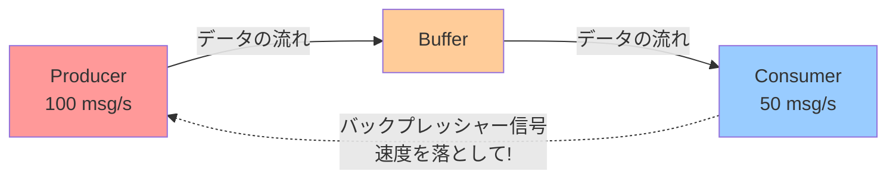

### 1.2 バックプレッシャーの本質

バックプレッシャーの本質は「**システムの安定性を維持するためのフロー制御**」である。これは単なるエラーハンドリングやリトライとは異なり、**システムが自身の処理能力の限界を自覚し、それを上流に伝えることで全体の崩壊を防ぐ**という能動的な制御メカニズムである。

バックプレッシャーが重要である理由は、現代のシステムが多段のパイプラインで構成されていることにある。フロントエンドからAPIゲートウェイ、マイクロサービス、データベースへと処理が流れる中で、どこか一箇所でボトルネックが発生すると、その影響は上流に向かって波及する。バックプレッシャーを適切に実装しなければ、この影響の波及が制御不能になる。

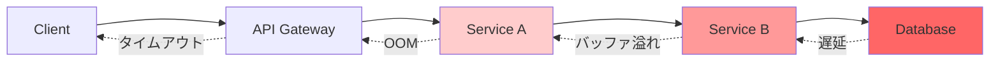

## 2. バックプレッシャーがない場合の問題

バックプレッシャーを実装しないシステムでは、Producer と Consumer の速度差が生じたとき、以下のような深刻な障害が連鎖的に発生する。

### 2.1 メモリ枯渇（OOM）

最も直接的かつ致命的な問題がメモリ枯渇である。Consumer が処理しきれないデータは、どこかにバッファリングされなければならない。明示的なバッファがなければ、カーネルのソケットバッファ、言語ランタイムのヒープメモリ、あるいはアプリケーション内部のキューに暗黙的に蓄積される。

蓄積されたデータがシステムの物理メモリを超過すると、Linux の OOM Killer がプロセスを強制終了する。これはシステムの急死であり、処理中のデータはすべて失われる。

```
Producer: 10,000 msg/s
Consumer:  2,000 msg/s
---
1秒後:   8,000 msg がバッファに滞留
10秒後:  80,000 msg がバッファに滞留
60秒後: 480,000 msg がバッファに滞留 → OOM Kill
```

::: danger OOM の危険性
OOM Killer は通常、メモリ消費量が最も大きいプロセスを選択して強制終了する。これは必ずしも問題の原因であるプロセスではなく、データベースプロセスのような重要なプロセスが巻き添えになることがある。
:::

### 2.2 レイテンシの増大

バッファに蓄積されたメッセージは、先入れ先出し（FIFO）で処理される。バッファが膨らむほど、新しく到着したメッセージが処理されるまでの待ち時間（キューイング遅延）が増大する。

例えば、Consumer の処理速度が 1,000 msg/s で、バッファに 100,000 件のメッセージが滞留している場合、新着メッセージは少なくとも 100 秒待たなければ処理されない。リアルタイム性が求められるシステムでは、この遅延は致命的である。

さらに悪いことに、バッファが大きくなるとガベージコレクション（GC）の負荷が増大し、Consumer の処理速度自体がさらに低下するという悪循環に陥る。

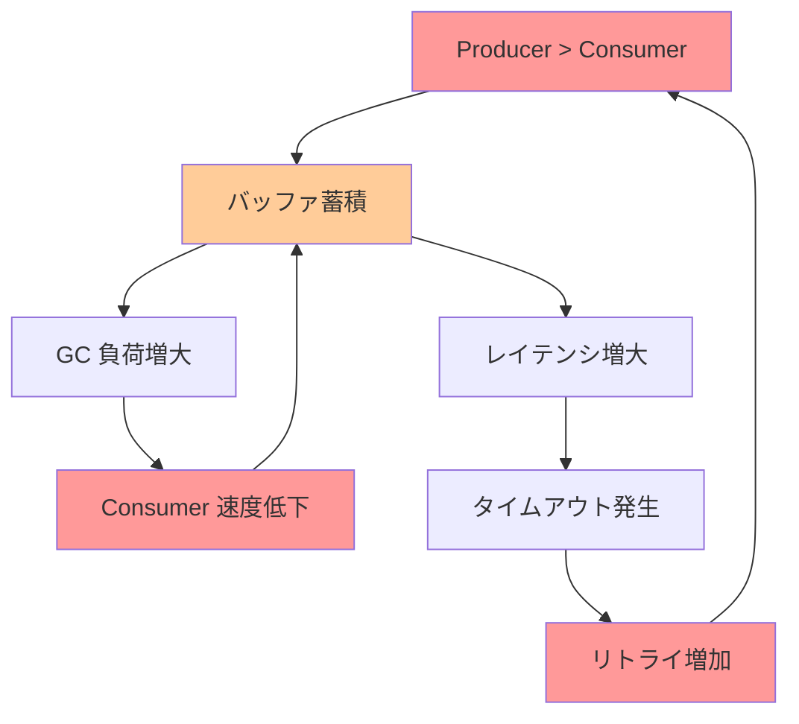

### 2.3 カスケード障害

バックプレッシャーの不在がもたらす最も深刻な結果がカスケード障害（Cascading Failure）である。一つのサービスの過負荷が、接続している他のサービスに連鎖的に波及し、最終的にはシステム全体が停止する。

典型的なシナリオを以下に示す。

1. **Service C** のデータベースが遅延し、レスポンスが遅くなる
2. **Service B** から Service C へのリクエストがタイムアウトし、リトライが発生する（負荷の増幅）
3. **Service B** のスレッドプールが Service C を待つリクエストで枯渇する
4. **Service A** から Service B へのリクエストも滞留し、同様にスレッドプールが枯渇する
5. **API Gateway** のコネクションプールが枯渇し、新規リクエストを受け付けられなくなる
6. システム全体がダウンする

::: warning カスケード障害とバックプレッシャー
カスケード障害を防ぐには、バックプレッシャーだけでなく、サーキットブレーカーやタイムアウト制御と組み合わせることが重要である。バックプレッシャーは「正常な過負荷」を制御する手段であり、「異常な障害」にはサーキットブレーカーが適している。
:::

### 2.4 データの整合性の喪失

バッファが溢れたとき、多くのシステムはデータを暗黙的にドロップする。UDP ベースのプロトコルではパケットが静かに消失し、ネットワークバッファが溢れた場合にはカーネルがパケットを破棄する。アプリケーション層でも、固定サイズのリングバッファを使用していれば古いデータが上書きされる。

このような暗黙的なデータロスは、ログの欠落、メトリクスの不正確さ、イベントの消失といった形でシステムの信頼性を蝕む。バックプレッシャーを明示的に実装することで、データをドロップするかどうかを**意識的に制御**できるようになる。

## 3. バックプレッシャーの制御手法

バックプレッシャーの制御手法は大きく 4 つに分類できる。各手法にはトレードオフがあり、ユースケースに応じて使い分ける。

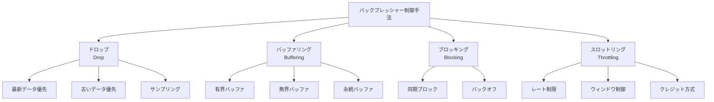

### 3.1 ドロップ（Drop）

Consumer が処理しきれないデータを意図的に捨てる手法である。一見乱暴に思えるが、ユースケースによっては最も合理的な選択である。

**適したユースケース:**

- **メトリクス/テレメトリ**: 1 秒ごとの CPU 使用率が数件欠落しても全体のトレンドに影響しない
- **リアルタイム動画/音声ストリーミング**: 古いフレームより最新フレームが重要
- **センサーデータ**: 高頻度のサンプリングデータの一部欠落は許容可能

**ドロップ戦略の種類:**

| 戦略 | 説明 | 適したケース |
|---|---|---|
| **最新優先（Drop Oldest）** | 古いデータを捨て、最新データを保持 | リアルタイムモニタリング |
| **古い方優先（Drop Newest）** | 新しいデータを捨て、古いデータを保持 | 順序保証が重要なケース |
| **サンプリング** | 一定割合でデータを間引く | 統計的に十分な精度が得られるケース |

```go
// Bounded channel with drop-oldest strategy
type DropOldestChan[T any] struct {
    ch chan T
}

func NewDropOldestChan[T any](size int) *DropOldestChan[T] {
    return &DropOldestChan[T]{ch: make(chan T, size)}
}

func (d *DropOldestChan[T]) Send(val T) {
    select {
    case d.ch <- val:
        // Successfully sent
    default:
        // Buffer full: drop the oldest item and retry
        <-d.ch
        d.ch <- val
    }
}

func (d *DropOldestChan[T]) Recv() T {
    return <-d.ch
}
```

### 3.2 バッファリング（Buffering）

Producer と Consumer の間にバッファを置き、一時的な速度差を吸収する手法である。バッファリングは最も広く使われているが、バッファの設計を誤ると問題を隠蔽するだけで解決しない。

**有界バッファ（Bounded Buffer）:**

固定サイズのバッファを使用する。バッファが満杯になったら、Producer をブロックするかデータをドロップする。サイズの選定が重要であり、「一時的なスパイクを吸収できる程度」が目安となる。

```go
// Bounded buffer with blocking semantics
func producer(ch chan<- int) {
    for i := 0; ; i++ {
        ch <- i // Blocks when buffer is full
    }
}

func consumer(ch <-chan int) {
    for val := range ch {
        process(val) // Slow processing
    }
}

func main() {
    // Buffer size = 100: absorbs short bursts
    ch := make(chan int, 100)
    go producer(ch)
    consumer(ch)
}
```

**無界バッファ（Unbounded Buffer）:**

サイズ制限のないバッファを使用する。一見便利に見えるが、Producer が Consumer を恒常的に上回る状況では、メモリが際限なく消費される。無界バッファは「バックプレッシャーを実装しない」こととほぼ等価であり、原則として避けるべきである。

::: danger 無界バッファの罠
無界バッファ（Unbounded Buffer）は、バックプレッシャー問題を解決するのではなく**先送り**するだけである。負荷テスト時には問題なく動作していても、本番環境の想定外のスパイクで OOM を引き起こす。必ず有界バッファを使用し、上限到達時の振る舞いを明示的に設計すること。
:::

**永続バッファ（Persistent Buffer）:**

メモリではなくディスクやメッセージブローカーにデータを一時保存する。Kafka のようなメッセージブローカーが典型例であり、大量のデータを長期間バッファリングできる。ただし、ディスク I/O のレイテンシが加わるため、リアルタイム性が犠牲になる。

### 3.3 ブロッキング（Blocking）

Consumer が処理可能になるまで、Producer の送信を物理的にブロックする手法である。最もシンプルで確実なバックプレッシャーだが、Producer 自体がブロックされるため、システムのスループットが低下する可能性がある。

```go
// Blocking backpressure via Go channels
func pipeline() {
    // Unbuffered channel: producer blocks until consumer reads
    ch := make(chan Data)

    go func() {
        for data := range inputStream {
            ch <- data // Blocks if consumer is not ready
        }
        close(ch)
    }()

    for data := range ch {
        slowProcess(data)
    }
}
```

ブロッキング方式の利点は、データの損失がゼロであることと、メモリ使用量が制限されることである。しかし、以下の場合にはブロッキングが問題を引き起こす。

- **ネットワーク経由の通信**: Producer が遠隔地にある場合、ブロッキングの伝播に時間がかかる
- **多対一の構成**: 複数の Producer が一つの Consumer に接続している場合、遅い Consumer が全 Producer をブロックする（Head-of-Line Blocking）
- **リアルタイム制約**: ブロッキングの遅延が許容できないケース

### 3.4 スロットリング（Throttling）

Producer のデータ送信速度を能動的に制限する手法である。Consumer の処理能力に合わせて Producer の速度を動的に調整する。

**レート制限（Rate Limiting）:**

単位時間あたりの送信件数に上限を設ける。トークンバケットやリーキーバケットアルゴリズムが代表的な実装である。

```python
import time
from threading import Lock

class TokenBucket:
    """Token Bucket rate limiter for backpressure"""

    def __init__(self, rate: float, capacity: int):
        self.rate = rate          # tokens per second
        self.capacity = capacity  # max burst size
        self.tokens = capacity
        self.last_refill = time.monotonic()
        self.lock = Lock()

    def acquire(self) -> bool:
        with self.lock:
            now = time.monotonic()
            # Refill tokens based on elapsed time
            elapsed = now - self.last_refill
            self.tokens = min(
                self.capacity,
                self.tokens + elapsed * self.rate
            )
            self.last_refill = now

            if self.tokens >= 1:
                self.tokens -= 1
                return True
            return False

    def acquire_blocking(self):
        """Block until a token is available"""
        while not self.acquire():
            time.sleep(1.0 / self.rate)
```

**クレジット方式（Credit-Based Flow Control）:**

Consumer が明示的に「あと N 件処理できる」というクレジット（許可証）を Producer に送信する。Producer はクレジットの範囲内でのみデータを送信する。これは Reactive Streams の `request(n)` メカニズムや TCP のウィンドウ制御の基本原理である。

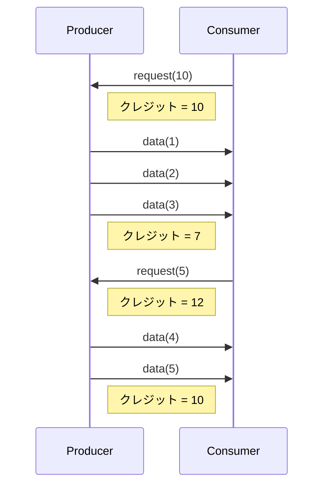

### 3.5 手法の比較と選定指針

| 手法 | データ損失 | レイテンシ影響 | メモリ使用量 | 実装複雑性 | 適したケース |
|---|---|---|---|---|---|
| **ドロップ** | あり | 低 | 低 | 低 | テレメトリ、ストリーミング |
| **有界バッファ** | 戦略依存 | 中 | 制限可 | 低 | 一時的なスパイクの吸収 |
| **ブロッキング** | なし | 高 | 低 | 低 | 同一プロセス内のパイプライン |
| **スロットリング** | なし | 中 | 低 | 中〜高 | API、ネットワーク通信 |

::: tip 組み合わせが基本
実際のシステムでは、これらの手法を組み合わせて使用することが多い。例えば「有界バッファ + バッファ満杯時はドロップ」「クレジット方式 + 有界バッファ」といった組み合わせが一般的である。
:::

## 4. Reactive Streams とバックプレッシャー

### 4.1 Reactive Streams の誕生背景

2013年から2014年にかけて、Netflix、Lightbend（旧 Typesafe）、Pivotal らが中心となり、非同期ストリーム処理におけるバックプレッシャーの標準仕様として **Reactive Streams** が策定された。それ以前、非同期ストリーム処理のライブラリ（RxJava、Akka Streams など）はそれぞれ独自のバックプレッシャー機構を持っており、相互運用性がなかった。

Reactive Streams は JVM 上のインターフェース仕様として始まり、後に Java 9 では `java.util.concurrent.Flow` として標準ライブラリに取り込まれた。

### 4.2 4 つのインターフェース

Reactive Streams の仕様は、わずか 4 つのインターフェースで構成される。

```java
public interface Publisher<T> {
    void subscribe(Subscriber<? super T> s);
}

public interface Subscriber<T> {
    void onSubscribe(Subscription s);
    void onNext(T t);
    void onError(Throwable t);
    void onComplete();
}

public interface Subscription {
    void request(long n);
    void cancel();
}

public interface Processor<T, R> extends Subscriber<T>, Publisher<R> {
}
```

この仕様の核心は `Subscription.request(long n)` である。Subscriber は自分が処理可能な件数を `request(n)` で Publisher に通知し、Publisher はその件数を超えてデータを送信してはならない。これがクレジットベースのバックプレッシャーである。

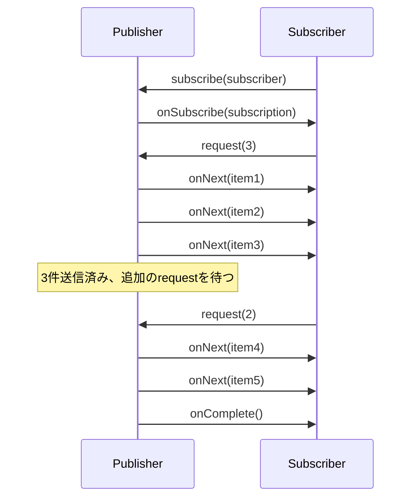

### 4.3 Reactive Streams の実装ライブラリ

| ライブラリ | 言語/プラットフォーム | 特徴 |
|---|---|---|
| **Project Reactor** | Java（Spring WebFlux） | Mono/Flux を中心とした API |
| **RxJava 2+** | Java/Android | Flowable がバックプレッシャー対応 |
| **Akka Streams** | Scala/Java | グラフ DSL によるストリーム定義 |
| **Kotlin Coroutines Flow** | Kotlin | Coroutine ベースの軽量実装 |
| **R2DBC** | Java | リアクティブデータベース接続 |

以下は Project Reactor を使ったバックプレッシャーの例である。

```java
Flux.range(1, 1_000_000)
    .onBackpressureBuffer(1024)     // Buffer up to 1024 items
    .publishOn(Schedulers.parallel())
    .subscribe(new BaseSubscriber<>() {
        @Override
        protected void hookOnSubscribe(Subscription s) {
            request(10); // Initially request 10 items
        }

        @Override
        protected void hookOnNext(Integer value) {
            process(value);      // Slow processing
            request(1);          // Request one more after processing
        }
    });
```

### 4.4 バックプレッシャー戦略

Reactive Streams の実装ライブラリでは、Consumer が追いつけない場合のバックプレッシャー戦略を選択できる。

```java
// Strategy 1: Buffer (bounded)
Flux.create(sink -> generateData(sink))
    .onBackpressureBuffer(256);

// Strategy 2: Drop newest
Flux.create(sink -> generateData(sink))
    .onBackpressureDrop(dropped ->
        log.warn("Dropped: {}", dropped));

// Strategy 3: Keep only latest
Flux.create(sink -> generateData(sink))
    .onBackpressureLatest();

// Strategy 4: Error on overflow
Flux.create(sink -> generateData(sink))
    .onBackpressureError();
```

::: tip Reactive Streams の適用範囲
Reactive Streams は JVM エコシステムで生まれた仕様だが、その設計思想は言語を超えて広く影響を与えている。Rust の `tokio::sync::mpsc` チャネル、Go のバッファ付きチャネル、Node.js の Streams API など、多くのランタイムがクレジットベースまたはバッファベースのフロー制御を採用している。
:::

## 5. TCP/HTTP レベルのバックプレッシャー

### 5.1 TCP のフロー制御

TCP はプロトコルレベルでバックプレッシャーを組み込んだ最も成功した例の一つである。TCP のフロー制御はスライディングウィンドウ方式を採用しており、受信側が処理可能なバイト数を送信側に通知する。

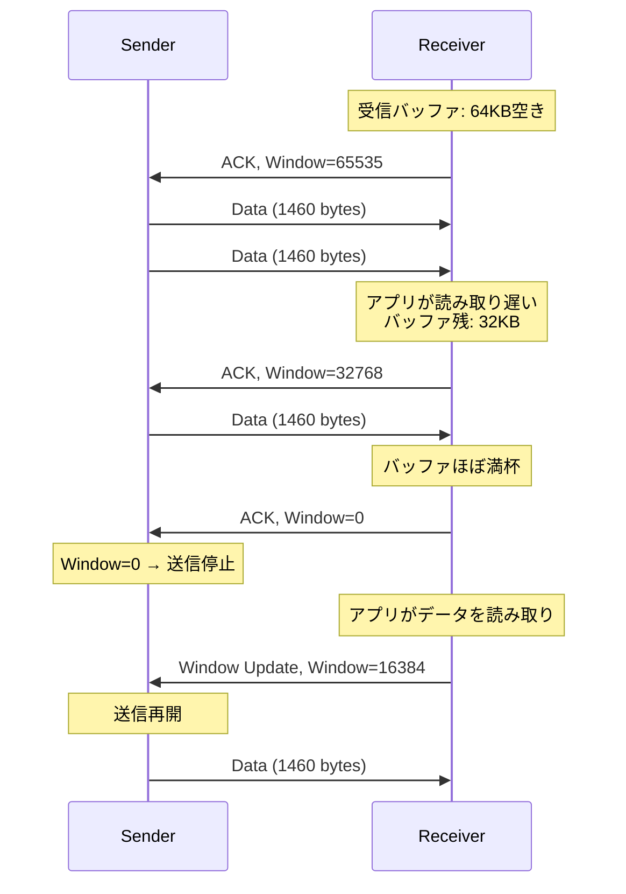

TCP ヘッダの **Window Size** フィールドが、受信側のバックプレッシャー信号そのものである。受信側のアプリケーションがソケットからデータを読み取らなければ、受信バッファが埋まり、Window Size が 0 になる。これによって送信側は送信を停止し、受信側が処理を追いつくまで待機する。

### 5.2 TCP Window Size = 0 の影響

TCP の Window Size が 0 になる状態（ゼロウィンドウ）は、アプリケーション層のバックプレッシャーが TCP 層にまで伝搬していることを意味する。この状態では以下が起きる。

1. 送信側は **Zero Window Probe** パケットを定期的に送信し、受信側のウィンドウ回復を確認する
2. 送信側アプリケーションの `write()` / `send()` システムコールがブロックされる（または非同期の場合は `EAGAIN`/`EWOULDBLOCK` を返す）
3. このブロッキングが上流に伝搬し、アプリケーション層のバックプレッシャーとして機能する

### 5.3 HTTP/1.1 のバックプレッシャー

HTTP/1.1 では、TCP のフロー制御がそのまま HTTP レベルのバックプレッシャーとして機能する。HTTP/1.1 は一つの TCP コネクション上でリクエストを逐次処理する（パイプラインは実質的に使われていない）ため、レスポンスの送信が遅れれば自然に TCP のフロー制御が作動する。

しかし、HTTP/1.1 のバックプレッシャーには限界がある。クライアントが大量のリクエストボディ（例えばファイルアップロード）を送信する場合、サーバーが処理しきれなくても TCP 層のバッファにデータが蓄積し続ける。サーバーアプリケーションがリクエストボディを読み取らなければ最終的に TCP ウィンドウが 0 になるが、それまでにカーネルバッファにデータが蓄積される。

### 5.4 HTTP/2 のフロー制御

HTTP/2 は TCP の上に独自のフロー制御機構を追加した。HTTP/2 では一つの TCP コネクション上で複数のストリームが多重化されるため、ストリームごとのフロー制御が必要になる。

HTTP/2 のフロー制御は**二階層**で動作する。

1. **コネクションレベル**: TCP コネクション全体のフロー制御
2. **ストリームレベル**: 個々のストリーム（リクエスト/レスポンス）ごとのフロー制御

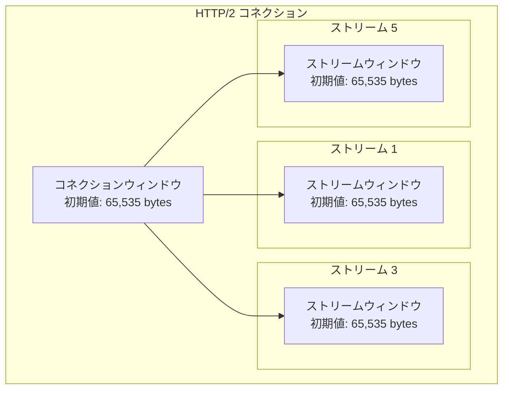

送信側は、**コネクションウィンドウとストリームウィンドウの両方**に空きがある場合にのみ DATA フレームを送信できる。受信側は `WINDOW_UPDATE` フレームを送信してウィンドウサイズを回復させる。

この仕組みにより、特定のストリーム（例えば大きなファイルのダウンロード）が他のストリームのフロー制御に悪影響を与えることを防げる。ただし、HTTP/2 のフロー制御の初期ウィンドウサイズはデフォルトで 65,535 bytes と小さいため、高帯域幅の環境では `SETTINGS_INITIAL_WINDOW_SIZE` を適切に調整する必要がある。

### 5.5 gRPC とバックプレッシャー

gRPC は HTTP/2 上に構築されており、HTTP/2 のフロー制御をそのまま活用する。加えて、gRPC のストリーミング API では、言語ごとのライブラリがアプリケーションレベルのバックプレッシャーを提供する。

```go
// gRPC server-side streaming with backpressure in Go
func (s *server) StreamData(
    req *pb.StreamRequest,
    stream pb.DataService_StreamDataServer,
) error {
    for i := 0; i < 1000000; i++ {
        resp := &pb.DataResponse{Value: int64(i)}
        // Send() blocks when HTTP/2 flow control window is exhausted
        // This provides natural backpressure
        if err := stream.Send(resp); err != nil {
            return err
        }
    }
    return nil
}
```

## 6. メッセージキューにおけるバックプレッシャー

### 6.1 メッセージキューの基本的な役割

メッセージキューは、Producer と Consumer の間に永続的なバッファ層を設けることで、両者を時間的に分離（デカップリング）する。これ自体がバックプレッシャーの一形態ともいえるが、メッセージキューが無限にスケールするわけではなく、キュー自体にも適切なバックプレッシャー機構が必要である。

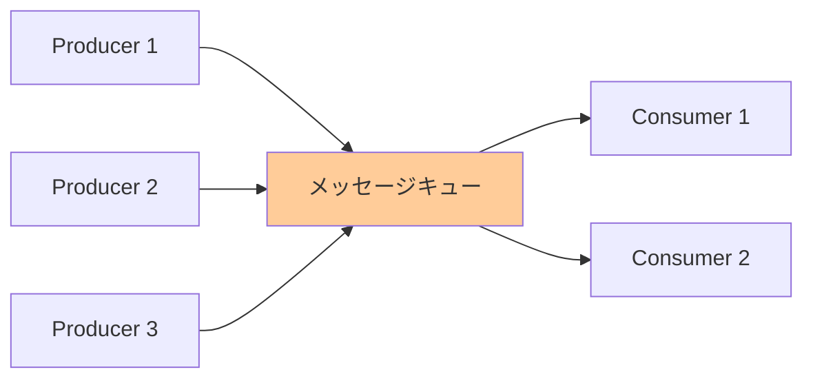

### 6.2 Apache Kafka のバックプレッシャー

Kafka はログベースのメッセージブローカーであり、Consumer が自分のペースでデータを消費するプル（Pull）モデルを採用している。この設計自体がバックプレッシャーの自然な実装である。

**Kafka のプルモデル:**

Consumer は `poll()` を呼び出してブローカーからメッセージを取得する。Consumer が `poll()` を呼ばなければ、ブローカー側にデータが蓄積されるだけで、Producer への圧力は発生しない（Kafka のディスク容量が許す限り）。

```java
// Kafka consumer with manual commit and flow control
Properties props = new Properties();
props.put("max.poll.records", "100");  // Limit batch size
props.put("enable.auto.commit", "false");

KafkaConsumer<String, String> consumer = new KafkaConsumer<>(props);
consumer.subscribe(List.of("events"));

while (true) {
    // Pull model: consumer controls the pace
    ConsumerRecords<String, String> records = consumer.poll(
        Duration.ofMillis(1000)
    );

    for (ConsumerRecord<String, String> record : records) {
        process(record); // Slow processing is fine
    }

    // Commit only after successful processing
    consumer.commitSync();
}
```

**Kafka のブローカー側の制限:**

Kafka ブローカーは以下の設定でデータ蓄積量を制限する。

| 設定 | 説明 | デフォルト |
|---|---|---|
| `log.retention.hours` | メッセージの保持期間 | 168（7日） |
| `log.retention.bytes` | パーティションあたりの最大サイズ | -1（無制限） |
| `message.max.bytes` | 単一メッセージの最大サイズ | 1,048,576（1MB） |

**Producer 側のバックプレッシャー:**

Kafka Producer はブローカーへの送信が滞った場合、内部バッファ（`buffer.memory`、デフォルト 32MB）が満杯になると `send()` がブロックする（`max.block.ms` の期間まで待ち、それを超えると例外をスローする）。

```java
Properties producerProps = new Properties();
producerProps.put("buffer.memory", 33554432);  // 32MB internal buffer
producerProps.put("max.block.ms", 60000);       // Block up to 60s when buffer full
producerProps.put("linger.ms", 5);              // Batch messages for 5ms
producerProps.put("batch.size", 16384);         // 16KB per batch
```

**Consumer Lag のモニタリング:**

Kafka のバックプレッシャーの状態は **Consumer Lag**（Producer のオフセットと Consumer のオフセットの差）で可視化される。Consumer Lag が増加し続ける場合、Consumer が Producer に追いついていないことを意味する。

### 6.3 RabbitMQ のバックプレッシャー

RabbitMQ は Kafka とは対照的に、プッシュ（Push）モデルを基本とする。ブローカーが Consumer にメッセージを能動的に送信する。このため、Consumer が処理しきれない場合のバックプレッシャーが重要になる。

**Prefetch Count:**

RabbitMQ のバックプレッシャーの中核は `prefetch count`（QoS 設定）である。Consumer が未 ACK のまま保持できるメッセージ数の上限を設定する。

```python
import pika

connection = pika.BlockingConnection(
    pika.ConnectionParameters('localhost')
)
channel = connection.channel()
channel.queue_declare(queue='tasks')

# Set prefetch count: only deliver 10 unacknowledged messages at a time
channel.basic_qos(prefetch_count=10)

def callback(ch, method, properties, body):
    process(body)  # Slow processing
    # ACK after successful processing
    # This frees a slot for the next message
    ch.basic_ack(delivery_tag=method.delivery_tag)

channel.basic_consume(
    queue='tasks',
    on_message_callback=callback
)
channel.start_consuming()
```

`prefetch_count=10` に設定すると、Consumer が 10 件のメッセージを受信したが ACK を返していない場合、ブローカーは 11 件目のメッセージを送信しない。Consumer が 1 件を ACK すると、ブローカーは次の 1 件を送信する。これはクレジットベースのフロー制御そのものである。

**コネクションレベルのバックプレッシャー:**

RabbitMQ はブローカー側でもバックプレッシャーを実装している。メモリ使用量が `vm_memory_high_watermark`（デフォルト: 利用可能メモリの 40%）を超えると、**すべての Producer からの受信をブロック**する。ディスク空き容量が `disk_free_limit` を下回った場合も同様である。

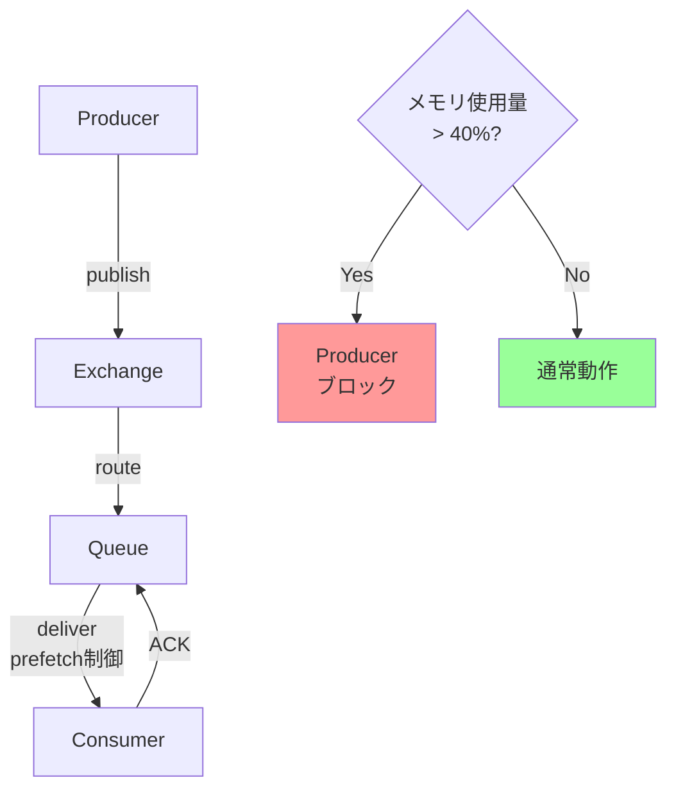

### 6.4 Kafka vs RabbitMQ のバックプレッシャー比較

| 特性 | Kafka | RabbitMQ |
|---|---|---|
| **配信モデル** | Pull | Push（prefetch 制御付き） |
| **Consumer Lag** | ブローカーにデータが蓄積 | Queue に蓄積、メモリ圧迫 |
| **Producer への圧力** | バッファ満杯時にブロック | メモリ閾値超過時にブロック |
| **スケーラビリティ** | Consumer Group でスケールアウト | Consumer 追加でスケールアウト |
| **データ永続性** | ディスクベース（長期保持） | メモリ+ディスク（消費後に削除） |
| **適したケース** | 高スループット、ストリーミング | 低レイテンシ、ルーティング |

## 7. 実装パターン

### 7.1 Go：チャネルによるバックプレッシャー

Go のチャネルは言語レベルでバックプレッシャーをサポートする代表的な機構である。バッファ付きチャネルは有界バッファとして機能し、バッファなしチャネルは完全な同期を提供する。

```go
package main

import (
	"context"
	"fmt"
	"sync"
	"time"
)

// Pipeline stage with backpressure via bounded channels
func generator(ctx context.Context, out chan<- int) {
	defer close(out)
	for i := 0; ; i++ {
		select {
		case <-ctx.Done():
			return
		case out <- i:
			// Blocks when downstream is slow (backpressure)
			fmt.Printf("produced: %d\n", i)
		}
	}
}

func transformer(in <-chan int, out chan<- string) {
	defer close(out)
	for v := range in {
		// Simulate slow transformation
		time.Sleep(100 * time.Millisecond)
		out <- fmt.Sprintf("item-%d", v)
	}
}

func consumer(in <-chan string, wg *sync.WaitGroup) {
	defer wg.Done()
	for v := range in {
		// Simulate slow consumption
		time.Sleep(200 * time.Millisecond)
		fmt.Printf("consumed: %s\n", v)
	}
}

func main() {
	ctx, cancel := context.WithTimeout(
		context.Background(), 5*time.Second,
	)
	defer cancel()

	// Bounded channels provide backpressure
	stage1 := make(chan int, 5)     // Buffer: 5 items
	stage2 := make(chan string, 3)  // Buffer: 3 items

	var wg sync.WaitGroup
	wg.Add(1)

	go generator(ctx, stage1)
	go transformer(stage1, stage2)
	go consumer(stage2, &wg)

	wg.Wait()
}
```

**Fan-Out/Fan-In パターンのバックプレッシャー:**

複数のワーカーでパイプラインを並列化する場合も、チャネルのバッファサイズで自然にバックプレッシャーが機能する。

```go
// Fan-out: distribute work across multiple workers
func fanOut(
	in <-chan Task,
	numWorkers int,
) <-chan Result {
	out := make(chan Result, numWorkers) // Buffer = number of workers
	var wg sync.WaitGroup

	for i := 0; i < numWorkers; i++ {
		wg.Add(1)
		go func(workerID int) {
			defer wg.Done()
			for task := range in {
				result := process(task) // Slow processing
				out <- result           // Blocks if downstream is slow
			}
		}(i)
	}

	go func() {
		wg.Wait()
		close(out)
	}()

	return out
}
```

### 7.2 Node.js：Streams API のバックプレッシャー

Node.js の Streams API は、バックプレッシャーを組み込んだストリーム処理の代表的な実装である。Node.js のストリームでは、`write()` の戻り値と `drain` イベントがバックプレッシャーの伝搬を担う。

```javascript
const { Readable, Transform, Writable } = require('stream');

// Producer: generates data
const producer = new Readable({
  highWaterMark: 1024, // Internal buffer size (bytes)
  read(size) {
    // Called when downstream needs more data
    const data = generateNextChunk();
    if (data) {
      this.push(data);
    } else {
      this.push(null); // Signal end of stream
    }
  }
});

// Transformer: processes data
const transformer = new Transform({
  highWaterMark: 512,
  transform(chunk, encoding, callback) {
    // Simulate slow transformation
    setTimeout(() => {
      const result = processChunk(chunk);
      callback(null, result);
    }, 100);
  }
});

// Consumer: writes data slowly
const consumer = new Writable({
  highWaterMark: 256,
  write(chunk, encoding, callback) {
    // Simulate slow writing (e.g., database insert)
    setTimeout(() => {
      console.log(`Wrote: ${chunk.length} bytes`);
      callback(); // Signal ready for next chunk
    }, 200);
  }
});

// pipe() automatically handles backpressure
producer.pipe(transformer).pipe(consumer);
```

**Node.js Streams のバックプレッシャー伝搬メカニズム:**

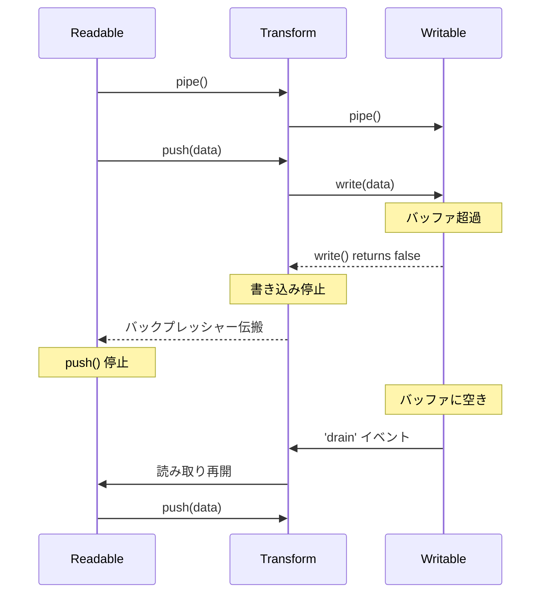

`pipe()` メソッドを使用すると、この一連のバックプレッシャー伝搬が自動的に処理される。しかし、手動でストリームを接続する場合には、`write()` の戻り値をチェックし、`false` が返った場合は `drain` イベントを待つ必要がある。

::: warning pipe() を使わない場合の注意
`pipe()` を使わずに手動で `readable.on('data', ...)` でデータを読み取り、`writable.write()` で書き込む場合、バックプレッシャーは自動的には機能しない。`write()` が `false` を返した場合の処理を自分で実装する必要がある。
:::

```javascript
// Manual backpressure handling (without pipe)
readable.on('data', (chunk) => {
  const canContinue = writable.write(chunk);
  if (!canContinue) {
    // Pause reading until writable drains
    readable.pause();
    writable.once('drain', () => {
      readable.resume();
    });
  }
});
```

### 7.3 Rust：tokio と async チャネル

Rust の非同期ランタイム tokio は、バウンド付きチャネルとストリームによるバックプレッシャーを提供する。

```rust
use tokio::sync::mpsc;
use tokio::time::{sleep, Duration};

#[tokio::main]
async fn main() {
    // Bounded channel: capacity 10
    // send() will await when buffer is full (backpressure)
    let (tx, mut rx) = mpsc::channel::<u64>(10);

    // Producer task
    let producer = tokio::spawn(async move {
        for i in 0..1_000_000 {
            // .await suspends this task when channel is full
            // No busy-waiting, no blocking the thread
            tx.send(i).await.unwrap();
            println!("Sent: {}", i);
        }
    });

    // Consumer task (slow)
    let consumer = tokio::spawn(async move {
        while let Some(val) = rx.recv().await {
            // Simulate slow processing
            sleep(Duration::from_millis(10)).await;
            println!("Processed: {}", val);
        }
    });

    let _ = tokio::join!(producer, consumer);
}
```

Rust のチャネルでは、`send().await` がバッファ満杯時に呼び出し元のタスクをサスペンドする。これはスレッドをブロックするのではなく、非同期ランタイムが他のタスクを実行できるようにサスペンドするため、効率的なバックプレッシャーが実現できる。

### 7.4 Java：Virtual Threads と構造化並行性

Java 21 以降の Virtual Threads（Project Loom）は、ブロッキング I/O をそのままバックプレッシャーとして活用するパラダイムを復権させた。

```java
import java.util.concurrent.*;

public class BackpressurePipeline {
    public static void main(String[] args) throws Exception {
        // Bounded queue acts as backpressure mechanism
        BlockingQueue<String> queue = new LinkedBlockingQueue<>(100);

        // Producer: blocks on put() when queue is full
        Thread producer = Thread.ofVirtual().start(() -> {
            try {
                for (int i = 0; i < 1_000_000; i++) {
                    // put() blocks when queue is full (backpressure)
                    // With virtual threads, this does NOT block OS thread
                    queue.put("item-" + i);
                }
            } catch (InterruptedException e) {
                Thread.currentThread().interrupt();
            }
        });

        // Consumer: processes items at its own pace
        Thread consumer = Thread.ofVirtual().start(() -> {
            try {
                while (true) {
                    String item = queue.take();
                    Thread.sleep(10); // Simulate slow processing
                    System.out.println("Processed: " + item);
                }
            } catch (InterruptedException e) {
                Thread.currentThread().interrupt();
            }
        });

        producer.join();
    }
}
```

Virtual Threads の登場により、`BlockingQueue.put()` のブロッキングが OS スレッドを占有しなくなったため、「ブロッキングによるバックプレッシャー」が再び実用的な選択肢となった。Reactive Streams のような明示的なフロー制御なしに、シンプルなブロッキング API でバックプレッシャーを実現できる。

## 8. 運用上のモニタリングとチューニング

### 8.1 監視すべきメトリクス

バックプレッシャーの運用では、「バックプレッシャーが発生しているかどうか」を検知するためのモニタリングが不可欠である。以下のメトリクスを継続的に収集・監視すべきである。

| メトリクス | 説明 | アラート条件 |
|---|---|---|
| **キュー深さ（Queue Depth）** | バッファ内の滞留メッセージ数 | 最大容量の 80% を超えたら警告 |
| **Consumer Lag** | Producer と Consumer のオフセット差 | 単調増加が続く場合 |
| **処理レイテンシ（P99）** | メッセージが投入されてから処理完了までの時間 | SLO を超過した場合 |
| **ドロップ率** | ドロップ戦略を採用している場合の廃棄率 | 閾値を超えた場合 |
| **スループット（msg/s）** | Producer と Consumer の処理速度 | Consumer < Producer が持続する場合 |
| **メモリ使用量** | バッファに使用されているメモリ量 | 閾値を超えた場合 |
| **TCP ウィンドウサイズ** | TCP 接続のウィンドウサイズ | 0 になる頻度が高い場合 |

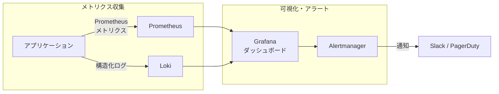

### 8.2 Prometheus によるメトリクス実装

```go
import (
	"github.com/prometheus/client_golang/prometheus"
	"github.com/prometheus/client_golang/prometheus/promauto"
)

var (
	// Gauge: current queue depth
	queueDepth = promauto.NewGauge(prometheus.GaugeOpts{
		Name: "pipeline_queue_depth",
		Help: "Current number of items in the processing queue",
	})

	// Counter: total items dropped due to backpressure
	droppedItems = promauto.NewCounter(prometheus.CounterOpts{
		Name: "pipeline_dropped_items_total",
		Help: "Total number of items dropped due to backpressure",
	})

	// Histogram: processing latency
	processingLatency = promauto.NewHistogram(prometheus.HistogramOpts{
		Name:    "pipeline_processing_duration_seconds",
		Help:    "Time from enqueue to processing complete",
		Buckets: prometheus.ExponentialBuckets(0.001, 2, 15),
	})

	// Gauge: backpressure active indicator
	backpressureActive = promauto.NewGauge(prometheus.GaugeOpts{
		Name: "pipeline_backpressure_active",
		Help: "1 if backpressure is currently being applied, 0 otherwise",
	})
)

func processWithMetrics(queue chan Message) {
	for msg := range queue {
		queueDepth.Set(float64(len(queue)))

		start := time.Now()
		process(msg)
		processingLatency.Observe(time.Since(start).Seconds())
	}
}

func sendWithBackpressure(queue chan Message, msg Message) {
	select {
	case queue <- msg:
		backpressureActive.Set(0)
	default:
		// Queue full: backpressure active
		backpressureActive.Set(1)
		droppedItems.Inc()
	}
}
```

### 8.3 バッファサイズのチューニング

バッファサイズの設計は、バックプレッシャーシステムにおいて最も重要なチューニングポイントの一つである。

**小さすぎるバッファ:**
- 一時的な速度変動を吸収できず、頻繁にバックプレッシャーが作動する
- スループットが低下する（特にネットワーク越しの場合、RTT 分の遅延が発生する）

**大きすぎるバッファ:**
- メモリを無駄に消費する
- レイテンシが増大する（バッファ内の待ち時間が長くなる）
- バックプレッシャーの伝搬が遅れ、問題の検知が遅くなる

**経験則としてのサイズ目安:**

```
バッファサイズ ≈ (Producer レート - Consumer レート) × 許容遅延時間
```

例えば、Producer が平均 1,000 msg/s、Consumer が平均 800 msg/s で、10 秒のスパイクを吸収したい場合:

```
バッファサイズ ≈ (1,000 - 800) × 10 = 2,000 メッセージ
```

ただし、これはあくまで出発点であり、実際の本番トラフィックパターンを観察した上で調整する必要がある。

::: tip Little's Law の活用
キューイング理論の Little's Law（L = λW）を使って、定常状態でのバッファ内メッセージ数を推定できる。L はバッファ内の平均メッセージ数、λ は到着レート、W はバッファ内の平均滞在時間である。この法則はバッファサイズとレイテンシの関係を理解する上で非常に有用である。
:::

### 8.4 動的なバックプレッシャー調整

静的なバッファサイズやレート制限だけでなく、システムの状態に応じて動的にバックプレッシャーのパラメータを調整するアプローチも有効である。

**AIMD（Additive Increase / Multiplicative Decrease）:**

TCP の輻輳制御と同じ考え方で、正常時にはレートを線形に増加させ、バックプレッシャーを検知したらレートを半減させる。

```python
class AdaptiveRateLimiter:
    """AIMD-based adaptive rate limiter"""

    def __init__(self, initial_rate: float, min_rate: float, max_rate: float):
        self.rate = initial_rate
        self.min_rate = min_rate
        self.max_rate = max_rate
        self.additive_increase = 10    # +10 msg/s per interval
        self.multiplicative_decrease = 0.5  # halve on backpressure

    def on_success(self):
        """Called when a message is processed successfully"""
        # Additive increase
        self.rate = min(
            self.rate + self.additive_increase,
            self.max_rate
        )

    def on_backpressure(self):
        """Called when backpressure is detected"""
        # Multiplicative decrease
        self.rate = max(
            self.rate * self.multiplicative_decrease,
            self.min_rate
        )

    def get_interval(self) -> float:
        """Returns the interval between sends in seconds"""
        return 1.0 / self.rate
```

**PID 制御:**

より高度なアプローチとして、PID 制御器を使ってキュー深さを目標値に維持する方法がある。目標キュー深さと実際のキュー深さの差（誤差）をフィードバックとして、Producer のレートを調整する。

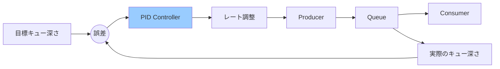

### 8.5 バックプレッシャーのアンチパターン

運用において避けるべきアンチパターンを以下にまとめる。

| アンチパターン | 問題 | 正しいアプローチ |
|---|---|---|
| **無限キュー** | OOM のリスク | 有界バッファを使用する |
| **暗黙的なドロップ** | データ消失に気づかない | ドロップをメトリクスで可視化する |
| **タイムアウトなしのブロッキング** | デッドロックのリスク | タイムアウトを必ず設定する |
| **固定レート制限** | 環境変化に対応できない | 動的な調整を導入する |
| **バックプレッシャーの無視** | 上流でリトライ爆発 | エラーコードで明示的に通知する |
| **全段同一バッファサイズ** | ボトルネックが移動する | 各段のスループットに応じて調整する |

::: warning リトライとバックプレッシャーの関係
バックプレッシャーが正しく伝搬されない場合、上流コンポーネントはタイムアウトを検知してリトライを行う。このリトライが負荷を増幅し、「リトライストーム」を引き起こす。HTTP 503 Service Unavailable と `Retry-After` ヘッダーを返すことで、クライアントに適切な待ち時間を伝えることがバックプレッシャーの一形態となる。
:::

## 9. まとめ

バックプレッシャー制御は、Producer と Consumer の速度差というあらゆるシステムに内在する根本的な問題に対する、体系的な解決手法である。

本記事で取り上げた内容を整理する。

1. **バックプレッシャーの本質**: Consumer の処理能力の限界を上流に伝搬し、システム全体の安定性を維持するフロー制御メカニズムである

2. **制御手法の分類**: ドロップ、バッファリング、ブロッキング、スロットリングの 4 手法があり、ユースケースに応じて組み合わせて使用する

3. **プロトコルレベルの実装**: TCP のスライディングウィンドウ、HTTP/2 のフロー制御、Reactive Streams の `request(n)` など、様々なレイヤーでバックプレッシャーが実装されている

4. **メッセージキュー**: Kafka のプルモデルと RabbitMQ の prefetch 制御はそれぞれ異なるアプローチでバックプレッシャーを実現している

5. **実装パターン**: Go のチャネル、Node.js の Streams、Rust の async チャネル、Java の Virtual Threads + BlockingQueue など、言語ごとに自然なバックプレッシャーの実装パターンが存在する

6. **運用**: キュー深さ、Consumer Lag、処理レイテンシなどのメトリクスを継続的に監視し、バッファサイズやレートを動的に調整することが重要である

バックプレッシャーを意識しないシステムは、平常時には問題なく動作しても、負荷スパイク時にカスケード障害を引き起こすリスクを常に抱えている。システム設計の初期段階から、「Consumer が追いつけなくなったときに何が起きるか」を問い続けることが、堅牢なシステムを構築するための第一歩である。
