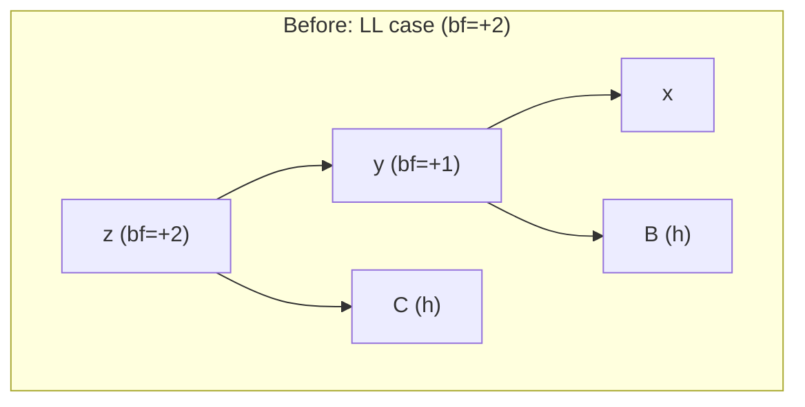
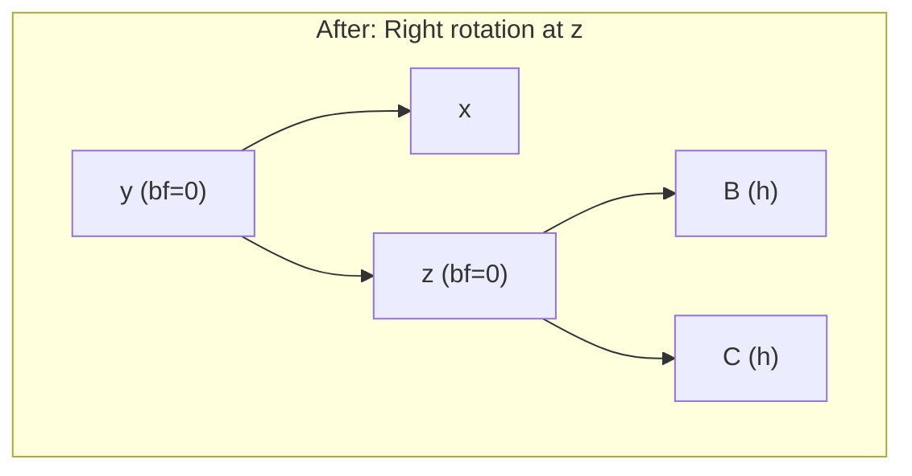
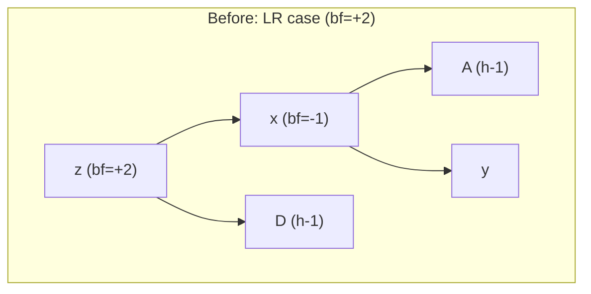
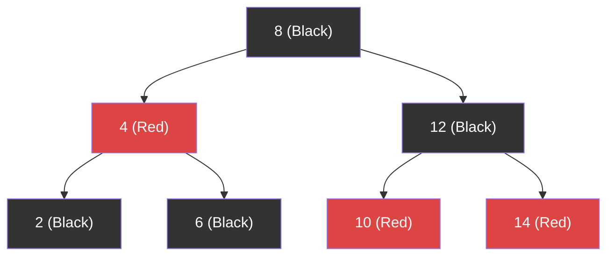
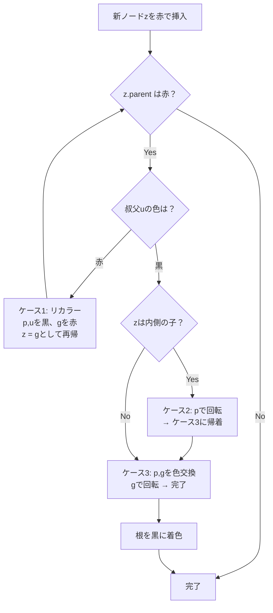
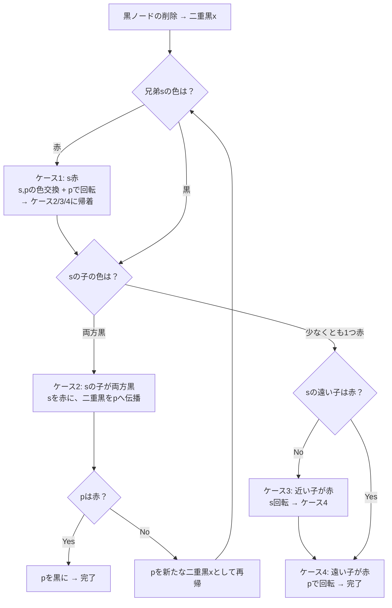
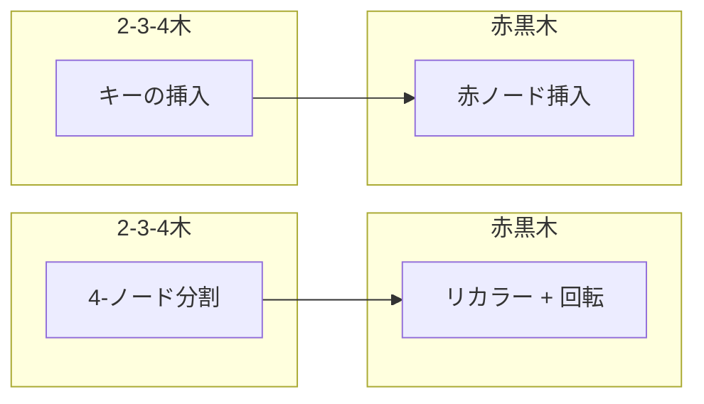

# 赤黒木とAVL木 — 平衡二分探索木

## 1. 背景と動機：二分探索木の退化問題

二分探索木（Binary Search Tree, BST）は、各ノードが左の子より大きく右の子より小さい（または等しい）キーを持つという単純な不変条件に基づくデータ構造である。探索・挿入・削除の計算量は木の高さ $h$ に比例するため、理想的には $O(\log n)$ の性能が期待される。

しかし、この期待は**入力データの順序**に依存する。ソート済みの列を素朴なBSTに挿入すると、木は一方向に伸びた連結リストと同等の構造に退化し、高さは $O(n)$ に達する。

```
ソート済み入力 [1, 2, 3, 4, 5] を挿入した場合：

    1
     \
      2
       \
        3
         \
          4
           \
            5

高さ = 4（ノード数 - 1）
探索コスト = O(n)
```

この退化は理論上の病的ケースではなく、実務でも頻繁に発生する。データベースに主キーが自動採番される行を連続挿入する場面、辞書をアルファベット順に構築する場面など、入力がほぼソート済みであることは珍しくない。

この問題に対する根本的な解決策が**平衡二分探索木**（self-balancing BST）である。平衡二分探索木は、挿入や削除のたびに木の構造を自動的に調整し、高さが常に $O(\log n)$ に保たれることを保証する。代表的なものとして、1962年に発明されたAVL木と、1978年に発明された赤黒木がある。

```
同じ入力 [1, 2, 3, 4, 5] をAVL木に挿入した場合：

        2
       / \
      1   4
         / \
        3   5

高さ = 2
探索コスト = O(log n)
```

本記事では、AVL木と赤黒木の両方について、その平衡条件、回転操作、挿入・削除アルゴリズムのケース分析を詳細に解説する。さらに、両者の性能特性の比較、赤黒木と2-3-4木の対応関係、実装上の変種（左傾赤黒木、AA木）、そして実世界での採用状況を網羅的に取り上げる。

## 2. 回転操作の基礎

平衡二分探索木において、木の構造を変更しつつBSTの不変条件を維持する基本操作が**回転**（rotation）である。AVL木でも赤黒木でも、この操作が平衡を回復するための土台となる。

### 2.1 右回転（Right Rotation）

ノード $y$ を根とする部分木で、$y$ の左の子 $x$ を新たな根に持ち上げる操作である。

```
    y               x
   / \             / \
  x   C    →     A   y
 / \                 / \
A   B               B   C
```

BSTの順序関係は維持される：$A < x < B < y < C$ という関係は回転の前後で不変である。

### 2.2 左回転（Left Rotation）

右回転の対称操作である。ノード $x$ の右の子 $y$ を新たな根に持ち上げる。

```
  x                 y
 / \               / \
A   y      →      x   C
   / \           / \
  B   C         A   B
```

### 2.3 二重回転

単一の回転では解決できないケースに対して、2回の回転を組み合わせる。

**左-右回転（LR Rotation）**：左の子の右部分木が問題の場合、まず左の子で左回転し、次に根で右回転する。

```
    z               z               y
   / \             / \             / \
  x   D   →      y   D   →      x   z
 / \             / \            / \ / \
A   y           x   C         A  B C  D
   / \         / \
  B   C       A   B

  左回転(x)        右回転(z)
```

**右-左回転（RL Rotation）**：右の子の左部分木が問題の場合、まず右の子で右回転し、次に根で左回転する。これはLR回転の対称操作である。

回転操作は $O(1)$ の時間で実行できる。ポインタの付け替えが定数個で済むためである。

## 3. AVL木

### 3.1 歴史と定義

AVL木は1962年にソビエト連邦の数学者**Georgy Adelson-Velsky**と**Evgenii Landis**によって発明された、最初の自己平衡二分探索木である。名称は発明者の頭文字に由来する。

AVL木の平衡条件は直感的で厳密である。

::: tip AVL木の平衡条件
すべてのノードにおいて、左部分木の高さと右部分木の高さの差（**平衡係数**、balance factor）が $-1$, $0$, $1$ のいずれかである。
:::

平衡係数は次のように定義される。

$$
\text{bf}(v) = \text{height}(\text{left}(v)) - \text{height}(\text{right}(v))
$$

空の部分木の高さは $-1$ と定義する。

### 3.2 高さの上界

AVL木の高さの上界は、最も「痩せた」AVL木（各ノードで平衡係数が $\pm 1$）を考えることで導出できる。高さ $h$ の最小ノード数を $N(h)$ とすると、以下の漸化式が成り立つ。

$$
N(h) = N(h-1) + N(h-2) + 1
$$

初期条件は $N(0) = 1$, $N(1) = 2$ である。この漸化式はフィボナッチ数列と類似しており、$N(h) = F_{h+3} - 1$ と表せる（$F_k$ はフィボナッチ数）。フィボナッチ数の指数的成長から、AVL木の高さは次のように制約される。

$$
h < 1.4405 \cdot \log_2(n + 2) - 0.3277
$$

すなわち、AVL木の高さは $O(\log n)$ であり、最悪でも完全平衡二分木の約1.44倍に収まる。この厳しい平衡条件が、AVL木の探索性能の高さを保証している。

### 3.3 挿入アルゴリズム

AVL木への挿入は、以下の2段階で行われる。

1. **通常のBST挿入**：適切な位置にノードを追加する
2. **平衡の回復**：挿入したノードから根に向かって遡り、平衡条件が崩れたノードで回転操作を行う

挿入によって平衡が崩れるパターンは4つに分類される。平衡条件が崩れた最初のノードを $z$ とする。

#### LL（Left-Left）ケース

$z$ の平衡係数が $+2$ で、$z$ の左の子の平衡係数が $+1$ または $0$ の場合。$z$ の左の子の左部分木が高い。

**修正**：$z$ で右回転を1回行う。





#### RR（Right-Right）ケース

LL ケースの対称。$z$ の平衡係数が $-2$ で、$z$ の右の子の平衡係数が $-1$ または $0$ の場合。

**修正**：$z$ で左回転を1回行う。

#### LR（Left-Right）ケース

$z$ の平衡係数が $+2$ で、$z$ の左の子の平衡係数が $-1$ の場合。$z$ の左の子の右部分木が高い。

**修正**：$z$ の左の子で左回転を行い、続いて $z$ で右回転を行う（二重回転）。



#### RL（Right-Left）ケース

LR ケースの対称。$z$ の平衡係数が $-2$ で、$z$ の右の子の平衡係数が $+1$ の場合。

**修正**：$z$ の右の子で右回転を行い、続いて $z$ で左回転を行う。

### 3.4 挿入の重要な性質

AVL木における挿入後の再平衡は、**最大で2回の回転**（単回転1回または二重回転1回）で完了する。これは挿入操作が木の高さを最大で1だけ増加させるためである。最初に平衡が崩れたノードで回転を行えば、そのノードの部分木の高さは挿入前と同じに戻るため、祖先ノードの平衡係数に影響を与えない。

### 3.5 削除アルゴリズム

削除は挿入よりも複雑である。通常のBST削除（リーフの削除、子が1つのノードの削除、後続ノードとの交換）を行った後、削除されたノードの位置から根に向かって遡り、平衡を回復する。

挿入との重要な違いは、削除では**最大で $O(\log n)$ 回の回転**が必要になりうる点である。ある祖先で回転を行っても、その部分木の高さが1だけ減少する場合があり、さらに上の祖先の平衡を崩す可能性があるためである。この連鎖的な再平衡が根まで伝播しうる。

ただし、実測では削除あたりの平均回転数は約0.21回程度であり、理論上の最悪ケースと比べて格段に少ない。

### 3.6 AVL木の計算量

| 操作 | 平均 | 最悪 |
|---|---|---|
| 探索 | $O(\log n)$ | $O(\log n)$ |
| 挿入 | $O(\log n)$ | $O(\log n)$ |
| 削除 | $O(\log n)$ | $O(\log n)$ |
| 挿入時の回転 | $O(1)$ 回 | 最大2回 |
| 削除時の回転 | $O(1)$ 回（平均） | $O(\log n)$ 回 |
| 空間計算量 | $O(n)$ | $O(n)$ |

## 4. 赤黒木

### 4.1 歴史

赤黒木は1978年にLeo J. Guibasと**Robert Sedgewick**によって発明された。原論文のタイトルは「*A Dichromatic Framework for Balanced Trees*」であり、2色に着色された二分探索木の枠組みを提示した。この着色の概念は、2-3-4木（後述）の二分木としての表現に由来する。

赤黒木は1970年代に研究されていた対称二分B木（symmetric binary B-tree）を一般化したものであり、Bayerの研究に触発されている。Bayerは赤と黒の代わりに「水平リンク」と「垂直リンク」という概念を用いていた。

### 4.2 5つの不変条件

赤黒木は以下の5つの不変条件を満たす二分探索木である。

::: warning 赤黒木の不変条件
1. **ノード色条件**：各ノードは**赤**（Red）または**黒**（Black）のいずれかである
2. **根の条件**：根ノードは黒である
3. **葉の条件**：すべての外部ノード（NIL葉）は黒である
4. **赤の条件**：赤ノードの子は必ず黒である（赤ノードが連続しない）
5. **黒高さ条件**：任意のノードから、その子孫のNIL葉までのパスに含まれる黒ノードの個数（**黒高さ**）はすべて等しい
:::

ここで外部ノード（NIL葉）とは、実際のデータを持たない仮想的な葉ノードであり、実装上はNULLポインタまたは共有の番兵ノードで表現される。

```
赤黒木の例:

          8(B)
        /      \
      4(R)     12(B)
     /   \     /   \
   2(B)  6(B) 10(R) 14(R)
   / \   / \   / \   / \
  N  N  N  N  N  N  N  N

B = Black, R = Red, N = NIL (Black)
```



### 4.3 高さの上界

赤黒木の高さの上界を導出する。不変条件5より、任意のノードの黒高さを $bh$ とすると、そのノードを根とする部分木には最低 $2^{bh} - 1$ 個の内部ノードが含まれる（帰納法で証明可能）。

不変条件4より、根からNIL葉までの任意のパスにおいて、赤ノードの数は黒ノードの数を超えない。したがって、黒高さが $bh$ のとき、最長パスの長さは $2 \cdot bh$ 以下である。

根の黒高さを $bh$ とすると、$n \geq 2^{bh} - 1$ であるから $bh \leq \log_2(n+1)$。木の高さ $h \leq 2 \cdot bh$ であるから、

$$
h \leq 2 \cdot \log_2(n + 1)
$$

AVL木の高さの上界 $\approx 1.44 \cdot \log_2 n$ と比較すると、赤黒木は理論上の最悪ケースにおいてAVL木よりも約1.39倍高くなりうる。しかし、実際の挿入・削除パターンでは、赤黒木の高さはこの上界よりはるかに低い。

### 4.4 挿入アルゴリズム

赤黒木の挿入は以下の手順で行われる。

1. 通常のBST挿入で新しいノードを追加する
2. 新しいノードを**赤**に着色する
3. 不変条件が崩れた場合、色の変更と回転で修正する

新しいノードを赤にする理由は、黒高さ条件（不変条件5）を崩さないためである。赤ノードを追加しても黒高さは変わらない。崩れる可能性があるのは赤の条件（不変条件4）のみである。つまり、新しい赤ノードの親が赤の場合にのみ修正が必要となる。

#### ケース分析

新しいノードを $z$、その親を $p$、祖父を $g$、叔父（$p$ の兄弟）を $u$ とする。$p$ が赤の場合（修正が必要な場合）、$g$ は必ず黒である（不変条件4が $p$ の挿入前に成立していたため）。

**ケース1：叔父 $u$ が赤**

$p$ と $u$ の両方を黒に、$g$ を赤にリカラーする。これにより黒高さは維持されるが、$g$ の親が赤の場合、問題が $g$ に伝播する。$g$ を新たな $z$ として再帰的に処理を続ける。

```
        g(B)              g(R)
       / \               / \
     p(R) u(R)    →    p(B) u(B)
     /                  /
   z(R)               z(R)

色を変更し、gを新たなzとして上方に伝播
```

**ケース2：叔父 $u$ が黒で、$z$ が $p$ の内側の子**

$z$ が $p$ の右の子（$p$ が $g$ の左の子の場合）のとき、$p$ で左回転してケース3に帰着させる。

```
      g(B)              g(B)
     / \               / \
   p(R) u(B)    →   z(R) u(B)
     \               /
    z(R)           p(R)

pで左回転し、ケース3に帰着
```

**ケース3：叔父 $u$ が黒で、$z$ が $p$ の外側の子**

$p$ と $g$ の色を交換し、$g$ で右回転する。

```
        g(B)              p(B)
       / \               / \
     p(R) u(B)    →   z(R) g(R)
     /                       \
   z(R)                     u(B)

pとgの色を交換し、gで右回転
```



#### 挿入の計算量

- ケース1はリカラーのみ（$O(1)$）で、上方に伝播する可能性がある。最悪で根まで $O(\log n)$ 回
- ケース2とケース3は回転を伴うが、ケース3の後は終了する
- したがって、**挿入あたりの回転は最大2回**であり、全体の計算量は $O(\log n)$（挿入位置の探索とリカラーの伝播）

### 4.5 削除アルゴリズム

赤黒木の削除は挿入よりもはるかに複雑である。通常のBST削除を行った後、削除されたノードが黒であった場合に不変条件の修正が必要となる。赤ノードの削除は不変条件を崩さない（黒高さに影響しないため）。

黒ノードの削除は黒高さ条件を崩すため、削除されたノードの位置に「二重黒」（double black）の概念を導入して問題を体系的に処理する。削除による修正には4つのケースがある。

#### ケース分析

削除によって「二重黒」になったノードを $x$、その兄弟を $s$、親を $p$ とする。

**ケース1：兄弟 $s$ が赤**

$s$ と $p$ の色を交換し、$p$ で回転する。これにより $x$ の新しい兄弟は黒になり、ケース2, 3, 4のいずれかに帰着する。

**ケース2：兄弟 $s$ が黒で、$s$ の子が両方とも黒**

$s$ を赤にリカラーし、二重黒を $p$ に伝播させる。$p$ が赤なら $p$ を黒にして終了。$p$ が黒なら $p$ が新たな二重黒となり、再帰的に処理を続ける。

**ケース3：兄弟 $s$ が黒で、$s$ の近い側の子が赤、遠い側の子が黒**

$s$ と赤い子の色を交換し、$s$ で回転する。これによりケース4に帰着する。

**ケース4：兄弟 $s$ が黒で、$s$ の遠い側の子が赤**

$s$ に $p$ の色を移し、$p$ と $s$ の遠い側の子を黒にし、$p$ で回転する。二重黒は解消され、処理は終了する。



#### 削除の計算量

- ケース2のリカラーのみが上方に伝播しうる（最悪 $O(\log n)$ 回）
- 回転は最大3回
- 全体の計算量は $O(\log n)$

### 4.6 赤黒木の計算量まとめ

| 操作 | 平均 | 最悪 |
|---|---|---|
| 探索 | $O(\log n)$ | $O(\log n)$ |
| 挿入 | $O(\log n)$ | $O(\log n)$ |
| 削除 | $O(\log n)$ | $O(\log n)$ |
| 挿入時の回転 | $O(1)$ 回 | 最大2回 |
| 削除時の回転 | $O(1)$ 回 | 最大3回 |
| 空間計算量 | $O(n)$ | $O(n)$ |

## 5. AVL木 vs 赤黒木：性能特性の比較

### 5.1 理論的比較

| 特性 | AVL木 | 赤黒木 |
|---|---|---|
| 高さの上界 | $\approx 1.44 \cdot \log_2 n$ | $\leq 2 \cdot \log_2(n+1)$ |
| 挿入時の回転 | 最大2回 | 最大2回 |
| 削除時の回転 | 最大 $O(\log n)$ 回 | 最大3回 |
| ノードあたりの追加情報 | 高さ or 平衡係数（2ビット） | 色（1ビット） |
| 平衡の厳密さ | より厳密 | より緩い |

### 5.2 実用的な使い分け

AVL木と赤黒木の性能差は、ワークロードの特性に依存する。

**AVL木が有利な場面**：

- **読み取りが支配的**なワークロード。AVL木はより厳密に平衡が保たれるため、探索パスが短く、読み取り性能が高い
- メモリ内データ構造として使用する場合。ディスクI/Oのコストがないため、比較回数の少なさが直接的に性能に反映される
- データベースのインメモリインデックスなど

**赤黒木が有利な場面**：

- **書き込み（挿入・削除）が頻繁**なワークロード。赤黒木は削除時の回転が定数回で済むため、構造変更のコストが予測可能
- リアルタイムシステムなど、最悪ケースの回転数を制限したい場面
- 汎用的な順序付きマップ・セットのデフォルト実装として

### 5.3 ベンチマーク上の傾向

一般に、以下の傾向が報告されている。

- **ランダム挿入**：AVL木と赤黒木の性能差はごくわずか
- **ランダム探索**：AVL木の方が約5-20%高速（木の高さが低いため比較回数が少ない）
- **ランダム削除**：赤黒木の方がわずかに高速（回転数が少ない）
- **挿入と削除が交互に発生するワークロード**：赤黒木が有利

ただし、現代のCPUではキャッシュ効果やブランチ予測が支配的であり、理論的な比較回数の差がそのまま実行時間の差に反映されるとは限らない。実際のアプリケーションでは、両者の差は多くの場合数%以内である。

## 6. 2-3-4木との対応関係

赤黒木を深く理解するうえで最も重要な視点の一つが、**2-3-4木**（2-3-4 tree）との対応関係である。赤黒木は本質的に、2-3-4木を二分木として表現したものと理解できる。

### 6.1 2-3-4木とは

2-3-4木（2-4木、B木の次数4の特殊ケース）は、各ノードが2個、3個、または4個の子を持つ平衡多分木である。

- **2-ノード**：1つのキーと2つの子を持つ
- **3-ノード**：2つのキーと3つの子を持つ
- **4-ノード**：3つのキーと4つの子を持つ

```
2-ノード:    [b]         3-ノード:   [a, c]      4-ノード:   [a, b, c]
            / \                    / | \                   / | | \
           <b  >b               <a  a-c  >c            <a a-b b-c >c
```

2-3-4木ではすべてのリーフが同じ深さにあるため、完全に平衡が保たれる。挿入時にノードが溢れた場合は分割（split）によって処理する。

### 6.2 赤黒木への変換

2-3-4木の各ノードは、以下のルールで赤黒木のサブツリーに変換できる。

**2-ノード → 黒ノード1つ**

```
  [b]          b(B)
  / \    →    / \
```

**3-ノード → 黒ノード + 赤ノード（2通り）**

```
  [a, c]          c(B)         a(B)
  / | \     →    / \     or     / \
               a(R)           (略) c(R)
              / \                   / \
```

左寄せの場合：
```
   c(B)
  /   \
a(R)   >c
/ \
<a a-c
```

**4-ノード → 黒ノード + 赤ノード2つ**

```
  [a, b, c]          b(B)
  / | | \     →     / \
                  a(R) c(R)
                  / \   / \
                <a a-b b-c >c
```

### 6.3 操作の対応

この対応関係により、赤黒木の操作は2-3-4木の操作と一対一に対応する。

| 2-3-4木の操作 | 赤黒木での操作 |
|---|---|
| ノードの分割（4-ノード → 2-ノード2つ + 親にキーを押し上げ） | リカラー（赤の子2つ → 黒にし、親を赤に） |
| ノード内でのキーの移動 | 回転操作 |
| 4-ノードの検出 | 赤ノードが連続することの検出 |



この対応を理解すると、赤黒木の不変条件が「なぜそうなっているのか」が明確になる。

- **不変条件4**（赤が連続しない）：赤ノードは2-3-4木の同一ノード内の追加キーを表す。赤が連続すると、5個以上のキーを持つ不正なノードに対応してしまう
- **不変条件5**（黒高さが一定）：黒ノードのみを数えると2-3-4木の深さに対応する。2-3-4木は完全に平衡しているため、黒高さは一定でなければならない

### 6.4 教育的意義

Sedgewickは著書『Algorithms』において、赤黒木の理解のためにまず2-3木（2-3-4木の簡易版）との対応を説明するアプローチを採っている。これは赤黒木の不変条件や操作の「なぜ」を直感的に理解するための最良の方法の一つとされている。

赤黒木の挿入・削除の複雑なケース分析は、2-3-4木の分割・結合という比較的直感的な操作の「翻訳」として理解すると、はるかに見通しが良くなる。

## 7. 実装上の変種

### 7.1 左傾赤黒木（Left-Leaning Red-Black Tree, LLRB）

2008年にRobert Sedgewickが提案した赤黒木の変種である。通常の赤黒木に追加の制約を課すことで、実装を大幅に単純化する。

**追加制約**：赤リンク（赤ノードへの辺）は常に左に傾く。すなわち、3-ノードを表現する際に、右の子を赤にすることを禁止する。

この制約により、赤黒木の挿入・削除のケース数が大幅に削減され、コード量がおよそ半分になる。Sedgewickは、LLRBの実装がわずか数十行で済むことを示した。

```
通常の赤黒木:                 LLRB:
3-ノードに2通りの表現          3-ノードは1通りのみ

  b(B)      a(B)              b(B)
  /           \               /
a(R)        b(R)            a(R)
(左傾き)    (右傾き)         (常に左傾き)
```

LLRBは2-3木（2-3-4木ではなく）に対応する。挿入アルゴリズムは以下の3つの簡単な修正ルールに集約される。

1. **右の子が赤で左の子が黒** → 左回転
2. **左の子が赤でその左の子も赤** → 右回転
3. **左右の子が両方赤** → 色を反転

::: details LLRBの挿入における修正ルールの直感

これらの3つのルールは、2-3木の操作に直接対応する。ルール1は3-ノードの正規化（左傾きに統一）、ルール2は4-ノードを分割する前の準備、ルール3は4-ノードの分割に相当する。

:::

ただし、LLRBの削除は通常の赤黒木と比べて特段単純になるわけではなく、場合によってはLLRBの制約の維持が追加のオーバーヘッドになることが指摘されている。

### 7.2 AA木

1993年にArne Anderssonが提案した赤黒木の変種で、LLRBと類似の制約を持つ。AA木では「レベル」という概念を用い、右の子へのリンクのみが水平（同レベル）であることを許す。これは左傾赤黒木を「反転」させたもの（右に傾ける）と解釈できる。

AA木は2-3木に対応し、実装のケース数がさらに少ない。特に削除のケースが通常の赤黒木の半分程度に削減される。対称操作を考える必要がないため、教育用途や実装の簡潔さを重視する場面で有用である。

### 7.3 スプレー木

スプレー木（Splay Tree）はDaniel SleatorとRobert Tarjanが1985年に提案した自己調整二分探索木である。厳密には「平衡二分探索木」ではないが、**償却計算量**（amortized complexity）で $O(\log n)$ を達成する。

スプレー木の核となるアイデアは、アクセスされたノードを**回転操作で根に持ち上げる**ことである（スプレー操作）。最近アクセスされたデータが再びアクセスされる確率が高い（局所性がある）場合、スプレー木は極めて効率的に動作する。

スプレー木の特徴的な性質：

- **ワーストケースの個々の操作**は $O(n)$ になりうる
- **償却計算量**は $O(\log n)$
- **ワーキングセット性質**：アクセスパターンに偏りがある場合、平衡二分探索木より高速
- **追加のメタデータ不要**：色や高さの情報を保持する必要がない

ただし、最悪ケースが $O(n)$ であることから、リアルタイム性が求められる場面には不向きである。

### 7.4 Treap

TreapはCecilia AragonとRaimund Seidel（1989年）によって提案されたランダム化二分探索木である。各ノードにキーとは別にランダムな優先度を割り当て、キーについてはBST順序を、優先度についてはヒープ順序を維持する。

TreapはBSTの不変条件とヒープの不変条件を同時に満たすことから、Tree + Heap = Treap と命名された。ランダムな優先度により、木の期待される高さは $O(\log n)$ となる。

## 8. 実世界での利用

### 8.1 C++ std::map / std::set

C++ 標準ライブラリの `std::map`、`std::set`、`std::multimap`、`std::multiset` は、順序付き連想コンテナとして規格で規定されている。規格は赤黒木を明示的に要求していないが、計算量の要件（挿入・削除・探索が $O(\log n)$、イテレータの無効化規則など）から、実質的にすべての主要実装が赤黒木を採用している。

- **libstdc++（GCC）**：赤黒木を使用
- **libc++（Clang/LLVM）**：赤黒木を使用
- **MSVC STL**：赤黒木を使用

### 8.2 Java TreeMap / TreeSet

Java の `java.util.TreeMap` および `java.util.TreeSet` は赤黒木で実装されている。これはJDKのソースコードに明示的に記載されている。`NavigableMap` インターフェースを通じて、`floorKey()`、`ceilingKey()`、`subMap()` などの範囲操作が $O(\log n)$ で提供される。

### 8.3 Linux CFS（Completely Fair Scheduler）

Linuxカーネル（バージョン2.6.23以降）のデフォルトプロセススケジューラであるCFS（Completely Fair Scheduler）は、赤黒木を用いて実行待ちタスクを管理している。

CFSでは、各タスクの仮想実行時間（vruntime）をキーとして赤黒木に格納する。スケジューリング時にvruntimeが最も小さいタスク（木の最左ノード）を選択することで、CPUの公平な配分を実現する。赤黒木を選択した理由は以下の通りである。

- 挿入・削除が $O(\log n)$ で高速
- 最小要素の取得が $O(\log n)$（最左ノードへの走査）
- 回転数が少なく予測可能なオーバーヘッド
- カーネル空間での安定した動作

::: tip Linux 6.6以降の変更
Linux 6.6（2023年11月リリース）以降、CFSに代わりEEVDF（Earliest Eligible Virtual Deadline First）スケジューラがデフォルトとなった。EEVDFも引き続き赤黒木をベースのデータ構造として使用している。
:::

### 8.4 その他の利用例

| ソフトウェア | 用途 | 採用理由 |
|---|---|---|
| Linux カーネル（メモリ管理） | `vm_area_struct` の管理 | プロセスの仮想メモリ領域をアドレス順に管理 |
| Nginx | タイマー管理 | タイムアウトイベントの効率的な管理 |
| epoll（Linux） | ファイルディスクリプタ管理 | 大量のFDを順序付きで管理 |
| Java ConcurrentSkipListMap | --- | 赤黒木ではなくSkip Listを採用（ロックフリー性のため） |

最後のConcurrentSkipListMapは赤黒木の**不採用**の例として興味深い。並行データ構造として赤黒木を使う場合、回転操作が複数のポインタを同時に変更するため、ロックフリー実装が困難である。Skip Listは局所的な変更で済むためCAS操作と相性が良い。

## 9. 実装例

以下に、赤黒木の基本的な挿入操作の実装をPythonで示す。教育目的の実装であり、本番での使用にはコーナーケースの処理やメモリ効率の改善が必要である。

```python
from enum import Enum
from typing import Optional, Any

class Color(Enum):
    RED = 0
    BLACK = 1

class Node:
    """Red-Black Tree Node."""
    def __init__(self, key: int, value: Any = None):
        self.key = key
        self.value = value
        self.color: Color = Color.RED  # new nodes are always red
        self.left: Optional['Node'] = None
        self.right: Optional['Node'] = None
        self.parent: Optional['Node'] = None

class RedBlackTree:
    """Red-Black Tree with insertion and fixup."""

    def __init__(self):
        # Sentinel NIL node (shared across all leaves)
        self.NIL: Node = Node(key=0)
        self.NIL.color = Color.BLACK
        self.NIL.left = None
        self.NIL.right = None
        self.root: Node = self.NIL

    def insert(self, key: int, value: Any = None) -> None:
        """Insert a key-value pair into the tree."""
        node = Node(key, value)
        node.left = self.NIL
        node.right = self.NIL

        # Standard BST insertion
        parent = None
        current = self.root
        while current != self.NIL:
            parent = current
            if key < current.key:
                current = current.left
            elif key > current.key:
                current = current.right
            else:
                # Duplicate key: update value
                current.value = value
                return

        node.parent = parent
        if parent is None:
            self.root = node
        elif key < parent.key:
            parent.left = node
        else:
            parent.right = node

        # Fix red-black properties
        self._insert_fixup(node)

    def _insert_fixup(self, z: Node) -> None:
        """Restore red-black properties after insertion."""
        while z.parent is not None and z.parent.color == Color.RED:
            if z.parent == z.parent.parent.left:
                # Parent is left child of grandparent
                uncle = z.parent.parent.right
                if uncle.color == Color.RED:
                    # Case 1: Uncle is red → recolor
                    z.parent.color = Color.BLACK
                    uncle.color = Color.BLACK
                    z.parent.parent.color = Color.RED
                    z = z.parent.parent
                else:
                    if z == z.parent.right:
                        # Case 2: z is right child → left rotate to case 3
                        z = z.parent
                        self._left_rotate(z)
                    # Case 3: z is left child → recolor and right rotate
                    z.parent.color = Color.BLACK
                    z.parent.parent.color = Color.RED
                    self._right_rotate(z.parent.parent)
            else:
                # Symmetric: parent is right child of grandparent
                uncle = z.parent.parent.left
                if uncle.color == Color.RED:
                    # Case 1 (mirror)
                    z.parent.color = Color.BLACK
                    uncle.color = Color.BLACK
                    z.parent.parent.color = Color.RED
                    z = z.parent.parent
                else:
                    if z == z.parent.left:
                        # Case 2 (mirror)
                        z = z.parent
                        self._right_rotate(z)
                    # Case 3 (mirror)
                    z.parent.color = Color.BLACK
                    z.parent.parent.color = Color.RED
                    self._left_rotate(z.parent.parent)

        # Ensure root is always black
        self.root.color = Color.BLACK

    def _left_rotate(self, x: Node) -> None:
        """
        Left rotation at node x.

             x                y
            / \              / \
           a   y    →      x   c
              / \         / \
             b   c       a   b
        """
        y = x.right
        x.right = y.left
        if y.left != self.NIL:
            y.left.parent = x
        y.parent = x.parent
        if x.parent is None:
            self.root = y
        elif x == x.parent.left:
            x.parent.left = y
        else:
            x.parent.right = y
        y.left = x
        x.parent = y

    def _right_rotate(self, y: Node) -> None:
        """
        Right rotation at node y.

             y              x
            / \            / \
           x   c   →     a   y
          / \                / \
         a   b              b   c
        """
        x = y.left
        y.left = x.right
        if x.right != self.NIL:
            x.right.parent = y
        x.parent = y.parent
        if y.parent is None:
            self.root = x
        elif y == y.parent.left:
            y.parent.left = x
        else:
            y.parent.right = x
        x.right = y
        y.parent = x

    def search(self, key: int) -> Optional[Any]:
        """Search for a key and return its value, or None."""
        node = self._search_node(key)
        if node == self.NIL:
            return None
        return node.value

    def _search_node(self, key: int) -> Node:
        """Find the node with the given key."""
        current = self.root
        while current != self.NIL:
            if key == current.key:
                return current
            elif key < current.key:
                current = current.left
            else:
                current = current.right
        return self.NIL

    def inorder(self) -> list:
        """Return keys in sorted order."""
        result = []
        self._inorder_helper(self.root, result)
        return result

    def _inorder_helper(self, node: Node, result: list) -> None:
        if node != self.NIL:
            self._inorder_helper(node.left, result)
            result.append(node.key)
            self._inorder_helper(node.right, result)
```

以下に、AVL木の基本的な挿入操作の実装を示す。

```python
from typing import Optional, Any

class AVLNode:
    """AVL Tree Node."""
    def __init__(self, key: int, value: Any = None):
        self.key = key
        self.value = value
        self.height: int = 0
        self.left: Optional['AVLNode'] = None
        self.right: Optional['AVLNode'] = None

class AVLTree:
    """AVL Tree with insertion and self-balancing."""

    def __init__(self):
        self.root: Optional[AVLNode] = None

    def _height(self, node: Optional[AVLNode]) -> int:
        """Return height of node (-1 for None)."""
        if node is None:
            return -1
        return node.height

    def _balance_factor(self, node: AVLNode) -> int:
        """Compute balance factor: left height - right height."""
        return self._height(node.left) - self._height(node.right)

    def _update_height(self, node: AVLNode) -> None:
        """Recompute height from children."""
        node.height = 1 + max(self._height(node.left),
                              self._height(node.right))

    def _right_rotate(self, y: AVLNode) -> AVLNode:
        """
        Right rotation at y.

             y              x
            / \            / \
           x   C   →     A   y
          / \                / \
         A   B              B   C
        """
        x = y.left
        b = x.right
        x.right = y
        y.left = b
        self._update_height(y)
        self._update_height(x)
        return x

    def _left_rotate(self, x: AVLNode) -> AVLNode:
        """
        Left rotation at x.

           x                y
          / \              / \
         A   y    →      x   C
            / \         / \
           B   C       A   B
        """
        y = x.right
        b = y.left
        y.left = x
        x.right = b
        self._update_height(x)
        self._update_height(y)
        return y

    def _rebalance(self, node: AVLNode) -> AVLNode:
        """Rebalance the subtree rooted at node."""
        self._update_height(node)
        bf = self._balance_factor(node)

        if bf > 1:
            # Left-heavy
            if self._balance_factor(node.left) < 0:
                # LR case: left rotate left child first
                node.left = self._left_rotate(node.left)
            # LL case (or LR after adjustment)
            return self._right_rotate(node)

        if bf < -1:
            # Right-heavy
            if self._balance_factor(node.right) > 0:
                # RL case: right rotate right child first
                node.right = self._right_rotate(node.right)
            # RR case (or RL after adjustment)
            return self._left_rotate(node)

        return node

    def insert(self, key: int, value: Any = None) -> None:
        """Insert a key-value pair."""
        self.root = self._insert(self.root, key, value)

    def _insert(self, node: Optional[AVLNode],
                key: int, value: Any) -> AVLNode:
        """Recursive insertion with rebalancing."""
        if node is None:
            return AVLNode(key, value)

        if key < node.key:
            node.left = self._insert(node.left, key, value)
        elif key > node.key:
            node.right = self._insert(node.right, key, value)
        else:
            # Duplicate key: update value
            node.value = value
            return node

        return self._rebalance(node)

    def search(self, key: int) -> Optional[Any]:
        """Search for a key and return its value, or None."""
        node = self.root
        while node is not None:
            if key == node.key:
                return node.value
            elif key < node.key:
                node = node.left
            else:
                node = node.right
        return None

    def inorder(self) -> list:
        """Return keys in sorted order."""
        result = []
        self._inorder(self.root, result)
        return result

    def _inorder(self, node: Optional[AVLNode], result: list) -> None:
        if node is not None:
            self._inorder(node.left, result)
            result.append(node.key)
            self._inorder(node.right, result)
```

## 10. まとめ

平衡二分探索木は、二分探索木の退化問題を解決し、最悪ケースでも $O(\log n)$ の探索・挿入・削除を保証するデータ構造である。本記事で取り上げた主要な知見を整理する。

**AVL木**は最初に発明された自己平衡BSTであり、厳密な平衡条件（平衡係数が $\pm 1$ 以内）により木の高さが最小に近く保たれる。探索に最適化されたデータ構造であり、読み取り主体のワークロードで優れた性能を発揮する。

**赤黒木**は5つの色に関する不変条件を維持することで、より緩い平衡を実現する。AVL木と比べて木の高さはやや高くなるが、挿入・削除時の構造変更（回転）が定数回で済む。この特性は、書き込みが頻繁なワークロードやリアルタイム性が求められる場面で有利である。

両者の本質的な違いは、**平衡の厳密さとメンテナンスコストのトレードオフ**にある。AVL木はより厳密に平衡を維持する代わりに削除時の回転が多く、赤黒木はより緩い平衡を許す代わりに構造変更のコストを抑制する。

赤黒木が2-3-4木の二分木表現であるという理解は、不変条件の「なぜ」を明確にし、挿入・削除の複雑なケース分析を直感的に把握するうえで不可欠である。さらに、左傾赤黒木（LLRB）やAA木といった変種は、実装の複雑さを軽減しつつ同等の計算量保証を提供する。

実世界では、赤黒木がC++やJavaの標準ライブラリ、Linuxカーネルのスケジューラなど、広範なソフトウェアで採用されている。AVL木も一部のデータベースのインメモリインデックスで使用されている。どちらを選択するかは、アプリケーションの読み書き比率、最悪ケースの制約、実装の複雑さの許容度を総合的に判断して決定すべきである。

## 参考文献

- Adelson-Velsky, G. M., & Landis, E. M. (1962). *An algorithm for the organization of information*. Proceedings of the USSR Academy of Sciences, 146, 263-266.
- Guibas, L. J., & Sedgewick, R. (1978). *A dichromatic framework for balanced trees*. 19th Annual Symposium on Foundations of Computer Science (FOCS), 8-21.
- Cormen, T. H., Leiserson, C. E., Rivest, R. L., & Stein, C. (2022). *Introduction to Algorithms* (4th ed.). MIT Press. Chapters 13-14.
- Sedgewick, R. (2008). *Left-leaning Red-Black Trees*. Dagstuhl Workshop on Data Structures.
- Andersson, A. (1993). *Balanced search trees made simple*. Proceedings of the Workshop on Algorithms and Data Structures (WADS), 60-71.
- Bayer, R. (1972). *Symmetric binary B-trees: Data structure and maintenance algorithms*. Acta Informatica, 1(4), 290-306.
- Sleator, D. D., & Tarjan, R. E. (1985). *Self-adjusting binary search trees*. Journal of the ACM, 32(3), 652-686.
- Knuth, D. E. (1997). *The Art of Computer Programming, Volume 3: Sorting and Searching* (2nd ed.). Addison-Wesley.
