# BFF（Backend for Frontend）

## 1. 背景と動機 — なぜ BFF パターンが生まれたのか

### 1.1 モノリスから API の時代へ

Web アプリケーション開発の初期、サーバーサイドのテンプレートエンジンが HTML を生成し、ブラウザはそれを表示するだけだった。Ruby on Rails の ERB、Java の JSP、PHP のテンプレートなど、サーバー側でビューを組み立てる時代には「フロントエンド専用のバックエンド」など不要だった。サーバーが唯一のクライアントであるブラウザに対して HTML を返すのが当たり前であり、データ取得からレンダリングまでが一体化していたからである。

しかし 2010 年代に入ると、状況は一変する。

**スマートフォンの爆発的普及**により、同じサービスが Web ブラウザだけでなく iOS アプリ、Android アプリからも利用されるようになった。さらにスマートウォッチ、スマートテレビ、IoT デバイスなど、クライアントの種類は増え続けた。

**SPA（Single Page Application）の台頭**により、Web フロントエンド自体がリッチなアプリケーションとなった。React、Angular、Vue.js といったフレームワークが普及し、フロントエンドはサーバーから JSON データを受け取って自らレンダリングを行うようになった。

**マイクロサービスアーキテクチャの普及**により、バックエンドは単一の API サーバーではなく、数十から数百のサービスに分割された。ユーザーの画面を構成するデータは、複数のマイクロサービスに散在することになった。

この三つの変化が同時に起きた結果、フロントエンドの開発者は深刻な課題に直面した。

### 1.2 汎用 API が生む摩擦

マイクロサービス環境において、フロントエンドが直接各サービスの API を呼び出す構成を考えてみよう。EC サイトの商品詳細画面を例に取る。

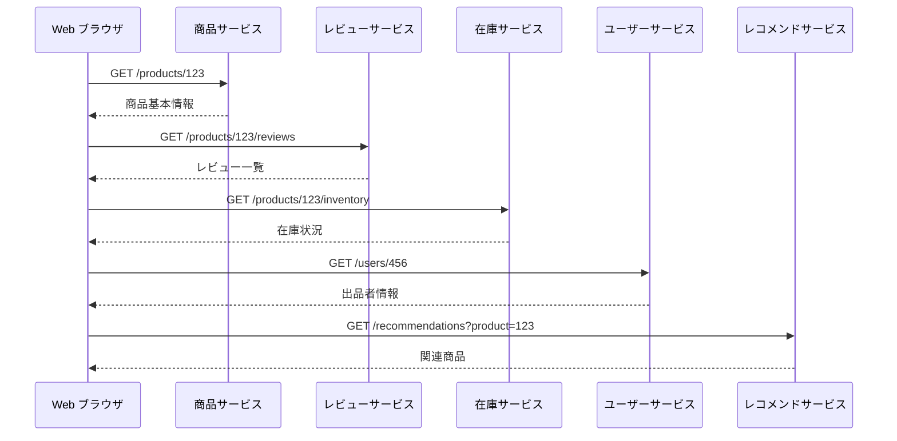

この構成には複数の問題がある。

**複数リクエストによるレイテンシの増大**：1 つの画面を描画するために 5 回の HTTP リクエストが必要である。モバイルネットワーク環境では、リクエスト数の増加がそのまま体感速度の悪化に直結する。TCP コネクションの確立、TLS ハンドシェイク、DNS 解決といったオーバーヘッドが、リクエストのたびに発生する。

**Over-fetching と Under-fetching**：商品サービスの API は汎用的に設計されているため、在庫管理画面で必要な全フィールドを返す。しかし商品詳細画面では名前・価格・画像 URL だけで十分かもしれない。逆に、1 回のリクエストでは画面に必要なデータが揃わず、追加のリクエストが必要になる（Under-fetching）。

**クライアント間の要件差異**：Web ブラウザの商品詳細画面では高解像度の画像を 5 枚表示し、レビューを 20 件表示する。一方、モバイルアプリでは画像は 3 枚、レビューは 5 件で十分かもしれない。スマートウォッチに至っては、商品名と価格だけを表示するかもしれない。汎用 API はこの差異を吸収できない。

**フロントエンドへのロジック流出**：複数サービスからのデータを統合し、画面に必要な形に変換するロジックがフロントエンドに押し出される。JavaScript でのデータ結合、フィルタリング、ソートは、パフォーマンスの観点でもコードの保守性の観点でも望ましくない。

### 1.3 BFF パターンの登場

こうした課題を解決するために生まれたのが **BFF（Backend for Frontend）** パターンである。BFF は、**特定のフロントエンドのために設計された専用のバックエンドサービス** を意味する。

この概念を最初に体系的に定義・普及させたのは、SoundCloud のエンジニアであった Sam Newman である。Newman は 2015 年の著書『Building Microservices』（邦訳『マイクロサービスアーキテクチャ』）で BFF パターンを詳細に解説した。ただし、BFF 的なアプローチ自体はそれ以前から実践されていた。Netflix や Spotify は、マイクロサービスへの移行初期から、クライアントごとに最適化された API レイヤーを構築していた。

BFF の本質は**「フロントエンドの関心事をバックエンドに移すこと」**である。個々のフロントエンドが必要とするデータの集約、変換、最適化を行う専用のサーバーサイドレイヤーを設けることで、フロントエンドはシンプルなインターフェースを通じてデータを取得できるようになる。

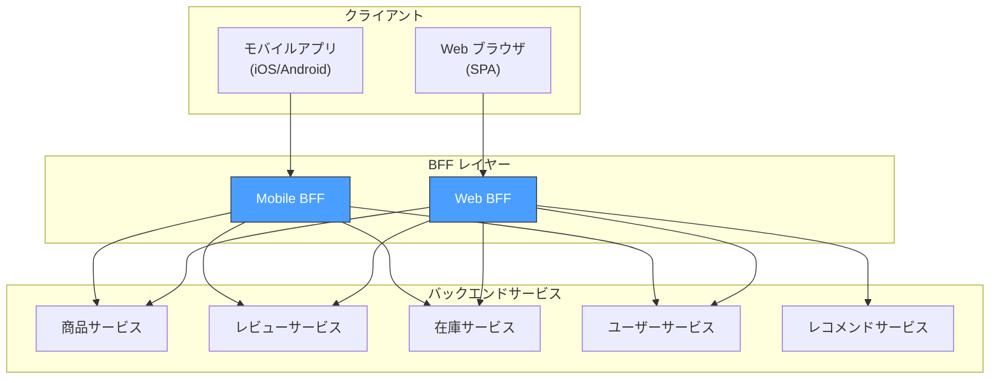

BFF を導入することで、先ほどの商品詳細画面のリクエストは次のように簡素化される。

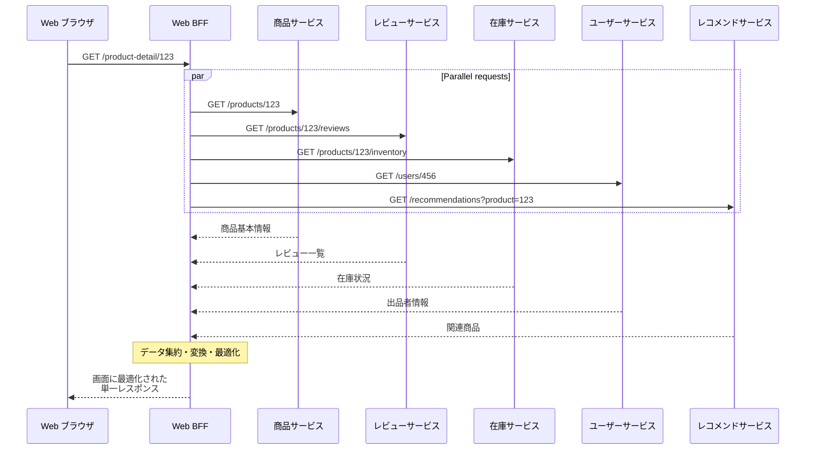

クライアントからのリクエストは 1 回で済み、BFF がバックエンドサービスへの並列リクエスト、データ集約、レスポンスの最適化を一手に引き受ける。

---

## 2. BFF の役割 — 何を担うのか

BFF は単なるプロキシではない。フロントエンドとバックエンドの間に位置する「翻訳レイヤー」として、明確な責務を持つ。

### 2.1 データ集約（Aggregation）

BFF の最も基本的な役割が **データ集約** である。複数のバックエンドサービスから取得したデータを、フロントエンドの画面要件に合わせて結合する。

```typescript
// Web BFF: product detail endpoint
async function getProductDetail(productId: string) {
  // Fetch data from multiple services in parallel
  const [product, reviews, inventory, seller, recommendations] =
    await Promise.all([
      productService.getProduct(productId),
      reviewService.getReviews(productId, { limit: 20 }),
      inventoryService.getInventory(productId),
      userService.getUser(product.sellerId),
      recommendationService.getRecommendations(productId, { limit: 8 }),
    ]);

  // Aggregate and shape data for the web frontend
  return {
    id: product.id,
    name: product.name,
    price: product.price,
    images: product.images, // All high-res images for web
    description: product.description,
    seller: {
      name: seller.displayName,
      rating: seller.averageRating,
      avatar: seller.avatarUrl,
    },
    reviews: {
      summary: {
        averageRating: reviews.averageRating,
        totalCount: reviews.totalCount,
        distribution: reviews.ratingDistribution,
      },
      items: reviews.items.map((r) => ({
        author: r.authorName,
        rating: r.rating,
        comment: r.comment,
        date: r.createdAt,
      })),
    },
    inventory: {
      inStock: inventory.quantity > 0,
      quantity: inventory.quantity,
      estimatedDelivery: inventory.estimatedDeliveryDate,
    },
    recommendations: recommendations.map((r) => ({
      id: r.id,
      name: r.name,
      price: r.price,
      thumbnail: r.thumbnailUrl,
    })),
  };
}
```

ここで重要なのは、BFF が返すレスポンスの構造がバックエンドサービスの API 構造とは異なるという点である。BFF はバックエンドのデータモデルをフロントエンドのビューモデルに変換している。バックエンドサービスが `quantity` フィールドを返しても、フロントエンドは `inStock` という boolean 値だけが必要かもしれない。この変換ロジックが BFF の責務である。

### 2.2 プロトコル変換

バックエンドサービスは、それぞれの特性に応じて異なる通信プロトコルを使用する場合がある。商品サービスは REST、注文処理サービスは gRPC、在庫サービスは GraphQL、通知サービスは非同期メッセージングといった具合である。

BFF はクライアントに対して統一的なインターフェースを提供しつつ、バックエンドとの通信ではサービスごとに適切なプロトコルを使い分ける。

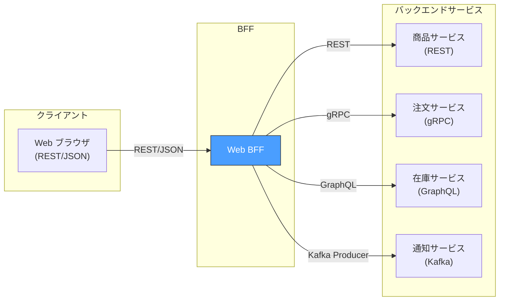

クライアントは BFF が公開する REST/JSON のインターフェースだけを意識すればよく、バックエンドの通信プロトコルの詳細から完全に遮蔽される。これはフロントエンド開発者の認知負荷を大幅に下げる。

### 2.3 認証・認可の集約

BFF は認証・認可のロジックを集約する場所としても機能する。これは特に Web アプリケーションにおいて重要な役割である。

::: tip BFF による認証の利点
SPA が直接トークンを管理する場合、アクセストークンやリフレッシュトークンを JavaScript のメモリや `localStorage` に保持する必要がある。これは XSS 攻撃によるトークン窃取のリスクを伴う。BFF を認証の仲介者として利用することで、トークンをサーバーサイドに保持し、クライアントにはセッション Cookie のみを渡すことができる。
:::

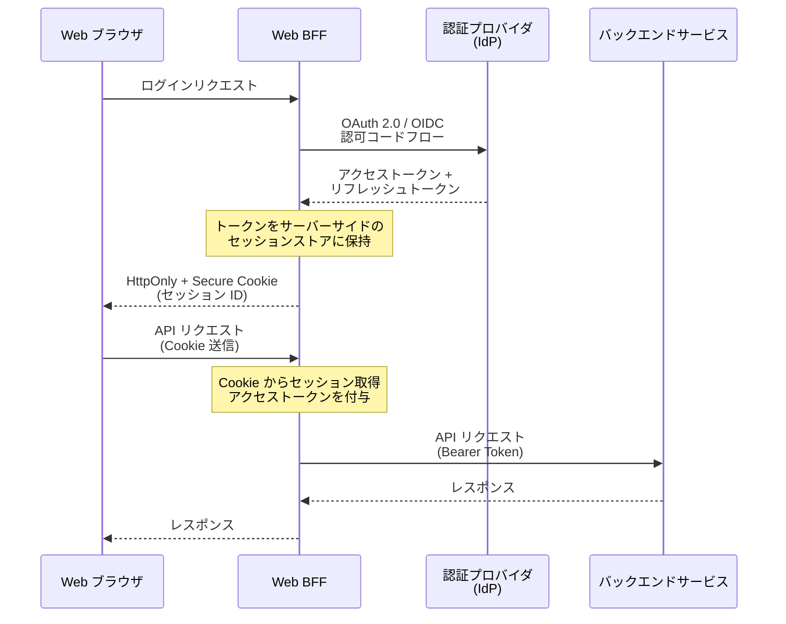

この構成では、アクセストークンがブラウザの JavaScript から一切アクセスできない。BFF がトークンのライフサイクル管理（リフレッシュ、失効処理）を一手に引き受けるため、フロントエンドは認証の複雑さから解放される。

さらに、BFF はクライアントの種類に応じて異なる認証フローを実装できる。Web BFF は Cookie ベースのセッション、Mobile BFF は OAuth 2.0 のデバイスフロー、Third-party BFF は API キーベースの認証というように、クライアント特性に最適化した認証方式を選択できる。

### 2.4 レスポンスの最適化

BFF はクライアントの特性に応じてレスポンスを最適化する。

**フィールドフィルタリング**：Web ブラウザには全フィールドを返すが、モバイルアプリには画面に表示するフィールドのみを返す。データ転送量を削減し、パース処理の負荷を軽減する。

**画像の最適化**：デバイスの画面サイズや解像度に応じて、適切なサイズの画像 URL を返す。Retina ディスプレイのブラウザには `@2x` 画像を、低速ネットワーク接続のモバイルデバイスには圧縮率の高いサムネイルを返す。

**ページネーション戦略の変更**：Web ブラウザにはオフセットベースのページネーション、モバイルアプリには無限スクロール向けのカーソルベースページネーションを提供する。

**キャッシュ戦略の調整**：クライアントの特性に応じて `Cache-Control` ヘッダーの値を変える。Web ブラウザには `max-age=60` を設定しつつ、リアルタイム性が求められるモバイルアプリには `no-cache` を設定するといった最適化が可能になる。

### 2.5 エラーハンドリングの統一

バックエンドサービスはそれぞれ異なるエラーフォーマットを返す可能性がある。gRPC サービスは Status Code を、REST サービスは HTTP ステータスコードを、GraphQL サービスは `errors` 配列をそれぞれ返す。BFF はこれらを統一的なエラーフォーマットに変換してクライアントに返す。

```typescript
// Unified error handling in BFF
async function handleRequest(req, res) {
  try {
    const result = await aggregateData(req);
    res.json(result);
  } catch (error) {
    // Normalize errors from different backend services
    if (error instanceof GrpcError) {
      // Convert gRPC status to HTTP-friendly error
      const httpStatus = grpcToHttpStatus(error.code);
      res.status(httpStatus).json({
        error: {
          code: error.code,
          message: error.message,
          details: error.details,
        },
      });
    } else if (error instanceof GraphQLError) {
      // Extract meaningful error from GraphQL response
      res.status(400).json({
        error: {
          code: "VALIDATION_ERROR",
          message: error.errors[0]?.message,
          fields: extractFieldErrors(error.errors),
        },
      });
    } else {
      // Generic error fallback
      res.status(500).json({
        error: {
          code: "INTERNAL_ERROR",
          message: "An unexpected error occurred",
        },
      });
    }
  }
}
```

加えて、バックエンドサービスの一部が障害を起こした場合にも、BFF は画面全体を壊さない**グレースフルデグラデーション**を実現できる。たとえば、レコメンドサービスが応答しなくても、商品情報と在庫情報は返すことで、画面は部分的に描画できる。

---

## 3. BFF vs API Gateway — 混同されやすい二つのパターン

BFF と API Gateway は共にクライアントとバックエンドサービスの間に位置するが、その目的と責務は明確に異なる。両者を混同すると、設計上の判断を誤る原因となる。

### 3.1 API Gateway の役割

API Gateway は **インフラストラクチャ層** の関心事を扱う汎用的なエントリーポイントである。

| 責務 | 説明 |
|------|------|
| ルーティング | パスやヘッダーに基づいてリクエストを適切なバックエンドサービスに転送する |
| 認証・認可 | API キーの検証、JWT の検証、OAuth トークンの確認などを行う |
| レート制限 | クライアントごとのリクエスト数を制限する |
| TLS 終端 | SSL/TLS の暗号化・復号を集約する |
| ロギング・モニタリング | リクエストの監査ログ、メトリクスの収集を行う |
| CORS 処理 | Cross-Origin Resource Sharing のヘッダーを管理する |

API Gateway は **クライアントの種類に依存しない**。Web ブラウザからのリクエストもモバイルアプリからのリクエストも、同じ API Gateway を通過し、同じルールで処理される。

代表的な実装としては、Kong、Amazon API Gateway、Apigee、Tyk などが挙げられる。

### 3.2 BFF の役割（再確認）

BFF は **アプリケーション層** の関心事を扱う、**特定のフロントエンドに特化した** サービスである。

| 責務 | 説明 |
|------|------|
| データ集約 | 複数のバックエンドサービスからデータを取得し結合する |
| データ変換 | バックエンドのデータモデルをフロントエンドのビューモデルに変換する |
| プロトコル変換 | gRPC/GraphQL/メッセージングを REST/JSON に変換する |
| クライアント固有のロジック | デバイス特性に応じた最適化を行う |
| フロントエンド向けエラーハンドリング | バックエンドのエラーをクライアントに適したフォーマットに変換する |

### 3.3 共存する構成

実際のシステムでは、API Gateway と BFF は排他的ではなく、**異なるレイヤーで共存する** ことが多い。

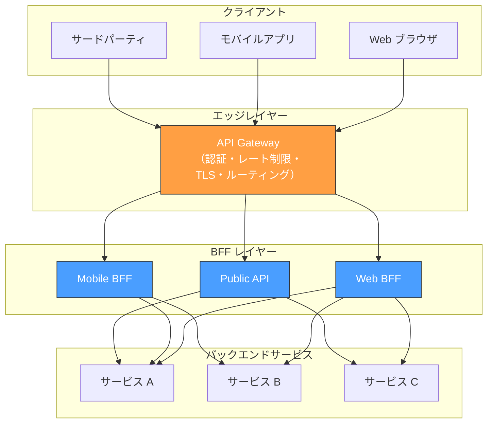

この構成において、各レイヤーの責務は明確に分離されている。

1. **API Gateway** がすべてのリクエストを最初に受け取り、認証検証、レート制限、TLS 終端といったインフラ横断的な処理を行う
2. **BFF** が各クライアントの要件に応じたデータ集約・変換を行う
3. **バックエンドサービス** がビジネスドメインのロジックを実行する

::: warning BFF に API Gateway の責務を持たせるアンチパターン
BFF にレート制限やTLS 終端などのインフラ機能を組み込むと、BFF が肥大化し、本来の「フロントエンド特化」という目的から逸脱する。これは「Fat BFF」と呼ばれるアンチパターンであり、保守性と運用性を著しく損なう。インフラ横断の関心事は API Gateway に、クライアント固有の関心事は BFF に、ビジネスロジックはバックエンドサービスに——この責務分離を維持することが重要である。
:::

### 3.4 判断基準

以下のフローチャートは、API Gateway と BFF のどちらが適切かを判断する助けとなる。

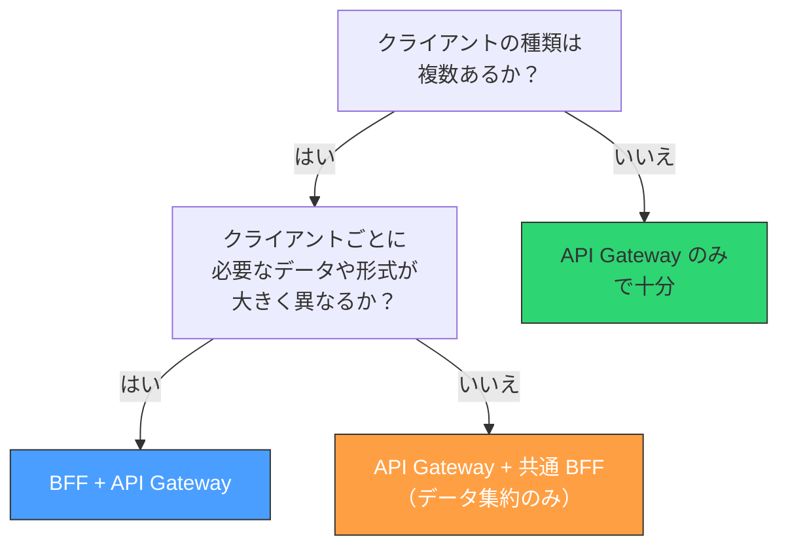

---

## 4. クライアント別 BFF の設計

### 4.1 Web BFF

Web BFF は SPA（Single Page Application）や SSR（Server-Side Rendering）フレームワークを対象としたバックエンドである。

**SSR との統合**：Next.js や Nuxt のような SSR フレームワークでは、BFF の役割がフレームワーク自体に組み込まれることが多い。Next.js の `getServerSideProps` や Route Handlers（App Router の場合）は、事実上 BFF の機能を果たしている。サーバーサイドでバックエンドサービスからデータを取得し、画面に最適化されたデータをクライアントに返す。

```typescript
// Next.js App Router: server component acting as BFF
// app/products/[id]/page.tsx
export default async function ProductPage({
  params,
}: {
  params: { id: string };
}) {
  // Server-side data aggregation (BFF behavior)
  const [product, reviews] = await Promise.all([
    fetch(`${PRODUCT_SERVICE_URL}/products/${params.id}`).then((r) => r.json()),
    fetch(`${REVIEW_SERVICE_URL}/products/${params.id}/reviews?limit=20`).then(
      (r) => r.json()
    ),
  ]);

  return <ProductDetailView product={product} reviews={reviews} />;
}
```

**Web 固有の関心事**：

- SEO に必要なメタデータの生成
- Open Graph タグ用のデータ整形
- 大きなペイロードの許容（ブロードバンド接続を前提にできる）
- `Set-Cookie` による認証セッション管理

### 4.2 Mobile BFF

Mobile BFF はモバイルアプリ（iOS / Android）を対象とする。モバイル環境固有の制約に対処することが主な役割である。

**ネットワーク最適化**：モバイルネットワークは Web と比較してレイテンシが大きく、帯域幅が限られている。Mobile BFF はレスポンスのペイロードサイズを最小化し、必要最低限のフィールドだけを返す。

```typescript
// Mobile BFF: product detail endpoint
async function getMobileProductDetail(productId: string) {
  const [product, reviews, inventory] = await Promise.all([
    productService.getProduct(productId),
    reviewService.getReviews(productId, { limit: 5 }), // Fewer reviews for mobile
    inventoryService.getInventory(productId),
  ]);

  return {
    id: product.id,
    name: product.name,
    price: product.price,
    images: product.images.slice(0, 3).map((img) => ({
      // Fewer, smaller images
      url: img.mobileUrl, // Mobile-optimized image URL
      width: 750,
    })),
    rating: reviews.averageRating,
    reviewCount: reviews.totalCount,
    // Only top 5 reviews, trimmed comment length
    topReviews: reviews.items.map((r) => ({
      rating: r.rating,
      comment: r.comment.substring(0, 200),
    })),
    inStock: inventory.quantity > 0,
  };
}
```

**バージョニング対応**：モバイルアプリは Web と異なり、すべてのユーザーが同じバージョンを使っているとは限らない。App Store / Google Play での配布遅延や、更新を行わないユーザーの存在を考慮し、Mobile BFF は複数のアプリバージョンをサポートする必要がある。

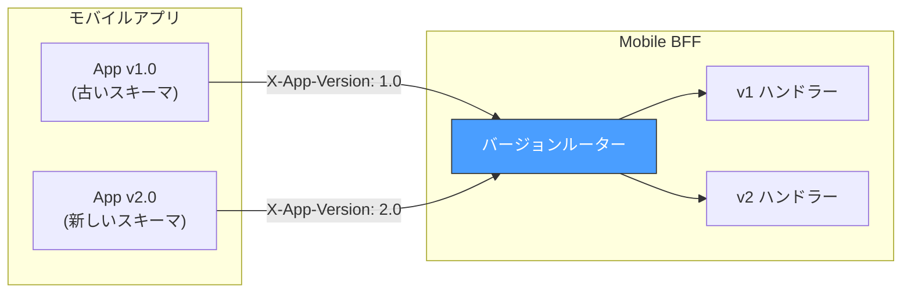

**プッシュ通知との連携**：Mobile BFF はプッシュ通知サービス（FCM / APNs）との連携ポイントとしても機能する。ユーザーのデバイストークンの管理、通知ペイロードの構築などを担う。

### 4.3 Third-party BFF（Public API）

外部パートナーやサードパーティ開発者向けの API を提供する場合も、BFF パターンが有効である。

**安定したインターフェース**：内部サービスの API は頻繁に変更されうるが、サードパーティ向けの API は高い安定性が求められる。Third-party BFF はこの安定性を保証するための緩衝材となる。内部サービスのリファクタリングやスキーマ変更を、サードパーティには見えないように吸収する。

**データアクセスの制御**：内部向けには公開されているデータでも、外部には公開すべきでない情報がある。Third-party BFF はフィールドレベルのアクセス制御を行い、機密情報がリークしないようにする。

**利用制限の粒度**：サードパーティごとに異なる利用契約（フリープラン、エンタープライズプランなど）に応じて、返すデータの範囲やリクエスト制限を BFF レイヤーで制御する。

### 4.4 「何個の BFF を作るか」問題

BFF の粒度は設計上の重要な判断ポイントである。

**クライアントプラットフォームごとに 1 つ**（Web BFF、iOS BFF、Android BFF）が最も一般的なアプローチである。Sam Newman が推奨したのもこの粒度であり、プラットフォーム間の差異を吸収しつつ、BFF の数を管理可能な範囲に保つバランスが良い。

**iOS と Android で BFF を分けるか**という問いは、よく議論される。両者の画面構成やデータ要件が大きく異なる場合は分ける意味があるが、多くの場合は「Mobile BFF」として共通化し、差異は `User-Agent` やカスタムヘッダーに基づくレスポンス調整で対応する方が現実的である。

::: danger 過剰分割の警告
画面ごと、機能ごとに BFF を分割する**マイクロ BFF** アプローチを採ると、BFF の数が爆発的に増加する。10 画面 x 3 プラットフォームで 30 個の BFF が生まれる計算になり、運用コストが到底見合わなくなる。BFF の粒度は「クライアントプラットフォーム」が基本単位であり、それより細かくすべきかは慎重に判断する必要がある。
:::

---

## 5. GraphQL BFF

### 5.1 GraphQL が BFF に適する理由

BFF が解決しようとする問題——クライアントごとに異なるデータ要件、Over-fetching / Under-fetching——は、GraphQL が本質的に解決しようとする問題と重なっている。この親和性から、**GraphQL を BFF のインターフェースとして採用する** パターンが広く普及している。

GraphQL BFF では、クライアントが必要なフィールドを宣言的に指定する。同じ商品詳細のデータであっても、Web ブラウザとモバイルアプリで異なるクエリを発行することで、レスポンスが自動的に最適化される。

```graphql
# Web browser: rich product detail query
query WebProductDetail($id: ID!) {
  product(id: $id) {
    id
    name
    price
    description
    images {
      url
      alt
      width
      height
    }
    seller {
      name
      rating
      avatar
      memberSince
    }
    reviews(first: 20) {
      averageRating
      totalCount
      edges {
        node {
          author
          rating
          comment
          createdAt
          helpfulCount
        }
      }
    }
    recommendations(first: 8) {
      id
      name
      price
      thumbnail
    }
  }
}
```

```graphql
# Mobile app: lightweight product detail query
query MobileProductDetail($id: ID!) {
  product(id: $id) {
    id
    name
    price
    images(first: 3) {
      mobileUrl
    }
    reviews(first: 5) {
      averageRating
      totalCount
    }
    inStock
  }
}
```

### 5.2 GraphQL BFF のアーキテクチャ

GraphQL BFF は、GraphQL サーバーとしてクライアントにスキーマを公開しつつ、バックエンドの REST / gRPC サービスと通信する。

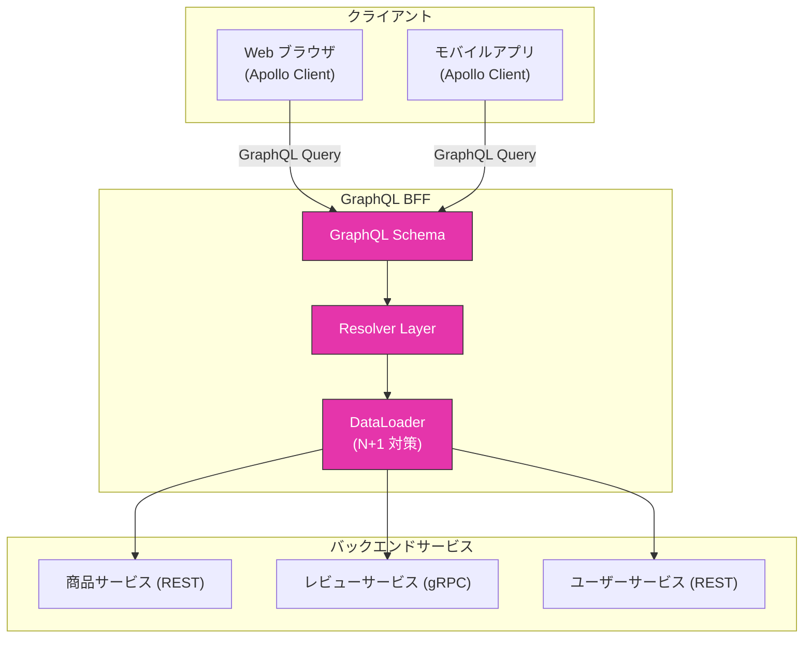

**DataLoader パターン**は GraphQL BFF において不可欠なコンポーネントである。GraphQL のリゾルバはフィールド単位で実行されるため、ナイーブな実装では N+1 問題が発生する。たとえば、20 件のレビューそれぞれに対して著者情報を取得すると、ユーザーサービスへのリクエストが 20 回発生する。DataLoader はこれをバッチ化し、1 回のリクエストにまとめる。

```typescript
// DataLoader batches individual user lookups into a single request
const userLoader = new DataLoader(async (userIds: string[]) => {
  // Single batch request to user service
  const users = await userService.getUsersByIds(userIds);
  // Return users in the same order as requested IDs
  return userIds.map((id) => users.find((u) => u.id === id));
});

// Resolver uses the loader
const resolvers = {
  Review: {
    author: (review) => userLoader.load(review.authorId),
  },
};
```

### 5.3 単一 GraphQL BFF か、クライアント別か

GraphQL を採用する場合、「全クライアントが共通の GraphQL BFF を使う」か「クライアントごとに GraphQL BFF を分ける」かの判断が必要になる。

**単一 GraphQL BFF**のアプローチでは、GraphQL の柔軟なクエリ能力に頼り、クライアント間の差異はクエリの違いで吸収する。スキーマは一つであり、メンテナンスコストが低い。ただし、特定クライアントにしか必要のないフィールドやロジックがスキーマに混在するリスクがある。

**クライアント別 GraphQL BFF** のアプローチでは、Web 用と Mobile 用にそれぞれ異なる GraphQL スキーマとリゾルバを定義する。スキーマが各クライアントに最適化されるが、共通ロジックの重複が発生する。

実際の運用では、**単一 GraphQL BFF から始め、クライアント間の乖離が大きくなったら分離する** という段階的なアプローチが現実的である。

::: tip GraphQL Federation との関係
大規模な組織では、複数チームがそれぞれ独自の GraphQL サブグラフを提供し、Apollo Federation や GraphQL Mesh でそれらを統合する**Federated GraphQL**アプローチも採られる。これは BFF レイヤーと Federation レイヤーの二層構造になることが多く、さらに複雑な構成となる。導入には十分な組織的成熟度が必要である。
:::

### 5.4 GraphQL BFF の注意点

GraphQL BFF にはいくつかの固有の課題がある。

**クエリの複雑性制御**：クライアントが任意のクエリを発行できるため、極端に深いネストや大量のフィールドを要求するクエリがバックエンドに過大な負荷をかける可能性がある。クエリの深度制限、コスト分析、Persisted Queries（事前登録されたクエリのみ許可）といった対策が必要である。

**キャッシュの複雑さ**：REST API ではエンドポイント単位で HTTP キャッシュが効くが、GraphQL はすべてのクエリが同一エンドポイント（通常 `POST /graphql`）に送られるため、HTTP レベルのキャッシュが効きにくい。Apollo Client のような正規化キャッシュや、`@cacheControl` ディレクティブによるフィールドレベルのキャッシュ制御が必要になる。

**エラーハンドリングの曖昧さ**：GraphQL は部分的なエラーを返すことができる（`data` と `errors` が同時に存在するレスポンス）。これはグレースフルデグラデーションに有用だが、クライアント側のエラーハンドリングが複雑になる。

---

## 6. 実装パターン

### 6.1 Node.js / Express による REST BFF

最もシンプルな BFF の実装パターンとして、Node.js を使った REST ベースの BFF を示す。

```typescript
import express from "express";

const app = express();

// Health check endpoint
app.get("/health", (_, res) => res.json({ status: "ok" }));

// BFF endpoint: aggregates data for product detail page
app.get("/api/product-detail/:id", async (req, res) => {
  const productId = req.params.id;

  try {
    // Parallel requests to backend services
    const results = await Promise.allSettled([
      fetchFromService(`${PRODUCT_SERVICE}/products/${productId}`),
      fetchFromService(`${REVIEW_SERVICE}/products/${productId}/reviews`),
      fetchFromService(`${INVENTORY_SERVICE}/inventory/${productId}`),
    ]);

    const [productResult, reviewsResult, inventoryResult] = results;

    // Graceful degradation: return partial data if some services fail
    const product =
      productResult.status === "fulfilled" ? productResult.value : null;
    const reviews =
      reviewsResult.status === "fulfilled" ? reviewsResult.value : null;
    const inventory =
      inventoryResult.status === "fulfilled" ? inventoryResult.value : null;

    if (!product) {
      // Product service is essential; return error
      return res.status(502).json({ error: "Product data unavailable" });
    }

    res.json({
      product: {
        id: product.id,
        name: product.name,
        price: formatPrice(product.price, product.currency),
        images: product.images,
      },
      reviews: reviews
        ? {
            average: reviews.averageRating,
            count: reviews.totalCount,
            items: reviews.items.slice(0, 20),
          }
        : null, // Indicate reviews are temporarily unavailable
      availability: inventory
        ? {
            inStock: inventory.quantity > 0,
            delivery: inventory.estimatedDeliveryDate,
          }
        : null,
    });
  } catch (error) {
    console.error("BFF aggregation error:", error);
    res.status(500).json({ error: "Internal server error" });
  }
});

// Helper: fetch with timeout and circuit breaker
async function fetchFromService(url: string, timeoutMs = 3000) {
  const controller = new AbortController();
  const timeout = setTimeout(() => controller.abort(), timeoutMs);

  try {
    const response = await fetch(url, { signal: controller.signal });
    if (!response.ok) throw new Error(`HTTP ${response.status}`);
    return await response.json();
  } finally {
    clearTimeout(timeout);
  }
}

app.listen(3000);
```

`Promise.allSettled` を使用している点に注目したい。`Promise.all` ではなく `Promise.allSettled` を使うことで、一部のバックエンドサービスが失敗しても他のサービスのレスポンスを利用できる。これがグレースフルデグラデーションの実装基盤となる。

### 6.2 BFF におけるキャッシュ戦略

BFF は複数のバックエンドサービスからデータを集約するため、キャッシュ戦略がパフォーマンスに大きく影響する。

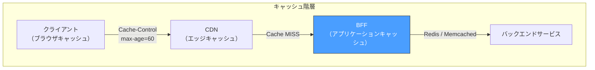

BFF レイヤーでのキャッシュには、主に二つの戦略がある。

**レスポンスキャッシュ**：BFF のエンドポイント単位でレスポンス全体をキャッシュする。`/api/product-detail/123` のレスポンスを Redis にキャッシュし、一定期間内は再計算を省略する。実装がシンプルだが、部分的な無効化が難しい。

**サービスレスポンスキャッシュ**：バックエンドサービスへの個別リクエストの結果をキャッシュする。商品情報は 5 分、在庫情報は 30 秒、レコメンド結果は 1 時間といった具合に、データの性質に応じた TTL を設定できる。より柔軟だが、実装が複雑になる。

```typescript
// Service-level caching with per-service TTL
const cacheConfig = {
  product: { ttl: 300 }, // 5 minutes
  inventory: { ttl: 30 }, // 30 seconds (frequently changing)
  reviews: { ttl: 600 }, // 10 minutes
  recommendations: { ttl: 3600 }, // 1 hour
};

async function getCachedOrFetch(
  cacheKey: string,
  service: string,
  fetchFn: () => Promise<any>
) {
  const cached = await redis.get(cacheKey);
  if (cached) return JSON.parse(cached);

  const data = await fetchFn();
  await redis.setex(cacheKey, cacheConfig[service].ttl, JSON.stringify(data));
  return data;
}
```

### 6.3 サーキットブレーカーの導入

BFF は複数のバックエンドサービスに依存するため、一つのサービスの障害が BFF 全体の応答性能を低下させるリスクがある。サーキットブレーカーパターンを導入し、障害の波及を防ぐ。

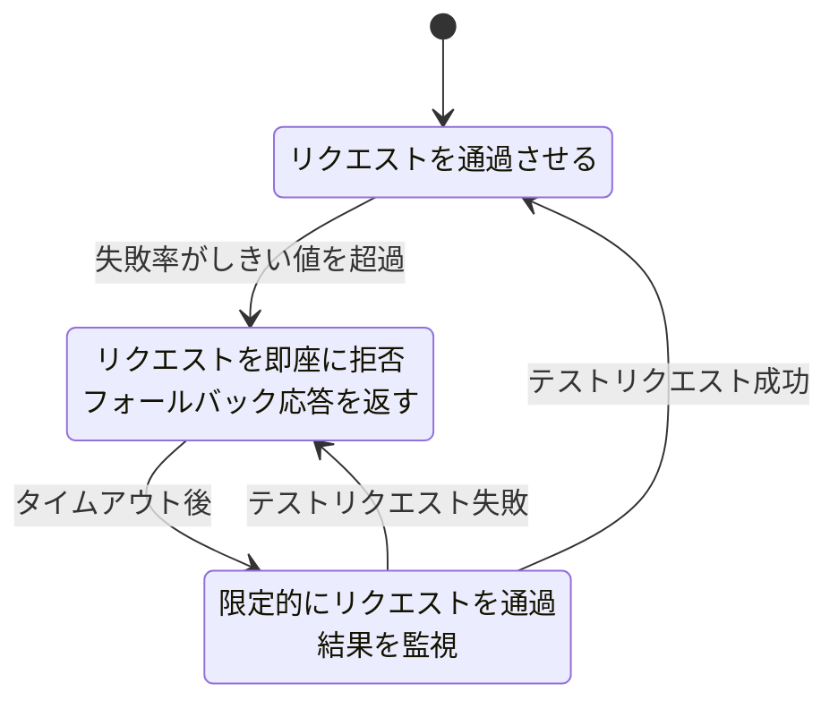

サーキットブレーカーが Open 状態になると、BFF は該当サービスへのリクエストを即座に失敗させ、キャッシュされた古いデータやデフォルト値を返す。これにより、障害を起こしたサービスへの不要な負荷を防ぎ、レスポンスタイムの劣化を最小限に抑える。

### 6.4 BFF の技術選定

BFF の実装言語・フレームワークの選定は、フロントエンドチームの技術スタックとの親和性を重視すべきである。

| 選択肢 | 利点 | 適したケース |
|--------|------|-------------|
| Node.js (Express / Fastify) | フロントエンドチームが慣れた JavaScript/TypeScript で記述可能。型定義を共有できる | フロントエンドチームが BFF を所有する場合 |
| Next.js / Nuxt (SSR 統合) | BFF と SSR が一体化。デプロイ単位が減る | Web BFF のみが必要で、SSR フレームワークを使っている場合 |
| Go | 高パフォーマンス、低メモリ使用量。コンパイル言語の型安全性 | 高スループットが求められる場合 |
| Kotlin / Spring Cloud Gateway | Java / Kotlin エコシステムとの親和性。リアクティブプログラミングのサポート | バックエンドチームが JVM に精通している場合 |

::: tip
BFF の技術選定において最も重要なのは、**所有するチームが運用できること** である。フロントエンドチームが BFF を所有する場合（後述の「所有権モデル」参照）、Go や Kotlin で BFF を構築すると、フロントエンドエンジニアには馴染みのない言語を運用する負担が生じる。TypeScript/Node.js で BFF を実装し、フロントエンドとの型定義を共有するアプローチが最も摩擦が少ない。
:::

---

## 7. 運用上の課題

### 7.1 BFF の肥大化（Fat BFF 問題）

BFF の最も一般的な失敗パターンは **肥大化** である。BFF は「フロントエンドのために何でもやる場所」として認識されがちで、気がつくと以下のようなロジックが BFF に紛れ込む。

- ビジネスルールの計算（割引率の計算、在庫引き当てロジックなど）
- データベースへの直接アクセス
- バッチ処理やスケジュールされたジョブ
- 他のサービスへの書き込み操作のオーケストレーション

こうした肥大化が進むと、BFF は「フロントエンド向けのモノリス」と化し、マイクロサービス化した意味が失われる。

**BFF に入れるべきもの**と**入れるべきでないもの**の判断基準を以下に示す。

| BFF に入れるべき | BFF に入れるべきでない |
|------------------|----------------------|
| データの集約・結合 | ビジネスルールの実装 |
| レスポンスの整形・フィルタリング | データの永続化 |
| プロトコル変換 | 複雑なオーケストレーション |
| クライアント固有のエラーハンドリング | バッチ処理 |
| 認証トークンの管理 | 他サービスのドメインロジック |

::: warning 見極めのポイント
ある処理を BFF に実装するか迷ったら、次の問いを投げかけるとよい：「この処理は、フロントエンドの種類が変わったら変わるか？」——答えが Yes ならば BFF に置く合理性がある。No ならば、バックエンドサービスに置くべきである。たとえば「税込み価格の計算」はフロントエンドの種類によらず同じであるため、BFF ではなくバックエンドサービスの責務である。「価格を `"¥1,234"` のようにフォーマットすること」は Web と iOS で異なる可能性があるため、BFF の責務と言える。
:::

### 7.2 レイテンシの増加

BFF は追加のネットワークホップを導入する。クライアント → BFF → バックエンドサービスという経路になるため、BFF が存在しない場合と比較してレイテンシが必ず増加する。

この問題を緩和するための戦略をいくつか挙げる。

**並列リクエスト**：BFF はバックエンドサービスへのリクエストを可能な限り並列に発行する。逐次的にリクエストする場合と比較して、レイテンシは最も遅いサービスの応答時間に収束する。

**コロケーション**：BFF とバックエンドサービスを同じデータセンター、同じ Kubernetes クラスター内に配置し、ネットワーク遅延を最小化する。

**接続の再利用**：BFF からバックエンドサービスへの HTTP/2 接続を維持し、コネクション確立のオーバーヘッドを削減する。gRPC を使用する場合は、HTTP/2 のストリーム多重化が自然に活用される。

**レスポンスのストリーミング**：すべてのバックエンドサービスの応答を待ってからレスポンスを返すのではなく、準備できたデータから順次返すストリーミングアプローチを検討する。React の Server Components は、このパターンとの親和性が高い。

### 7.3 テスト戦略

BFF はバックエンドサービスとの統合点であるため、テスト戦略が重要である。

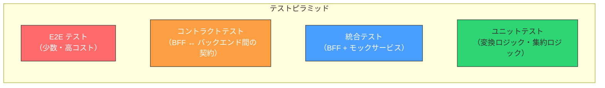

**ユニットテスト**：データ変換ロジック、集約ロジック、エラーハンドリングを純粋関数として切り出し、入出力を検証する。BFF のコアロジックの大半はこのレベルでテストできる。

**コントラクトテスト**：BFF とバックエンドサービスの間の API 契約を検証する。Pact などのコントラクトテストフレームワークを使い、BFF が期待するレスポンス構造とバックエンドサービスが実際に返すレスポンス構造の整合性を継続的に検証する。これは、バックエンドサービスが BFF に通知なく API を変更した場合に、破壊を検出するための重要な防御線である。

**統合テスト**：バックエンドサービスをモック（WireMock、MSW など）に置き換え、BFF のエンドポイントを実際の HTTP リクエストでテストする。グレースフルデグラデーション（一部サービスの障害時の振る舞い）もここで検証する。

### 7.4 可観測性

BFF は複数のバックエンドサービスへのリクエストを集約するため、パフォーマンスのボトルネックが発生しやすい。問題を迅速に特定するための可観測性の確保が不可欠である。

**分散トレーシング**：BFF で受け取ったリクエストにトレース ID を付与し、バックエンドサービスへの各リクエストをスパンとして記録する。OpenTelemetry を使い、BFF からバックエンドサービスへのリクエストそれぞれの所要時間を計測する。

```typescript
// OpenTelemetry instrumentation in BFF
import { trace, SpanKind } from "@opentelemetry/api";

const tracer = trace.getTracer("web-bff");

async function getProductDetail(productId: string) {
  return tracer.startActiveSpan(
    "getProductDetail",
    { kind: SpanKind.SERVER },
    async (span) => {
      // Each backend call creates a child span
      const product = await tracer.startActiveSpan(
        "fetchProduct",
        async (childSpan) => {
          const result = await productService.getProduct(productId);
          childSpan.setAttribute("service", "product-service");
          childSpan.end();
          return result;
        }
      );

      span.setAttribute("product.id", productId);
      span.end();
      return product;
    }
  );
}
```

**メトリクス**：BFF のリクエスト数、レイテンシ分布（p50/p95/p99）、エラー率、バックエンドサービスごとの応答時間、キャッシュヒット率などを Prometheus や Datadog で計測・可視化する。

**アラート**：BFF のエラー率やレイテンシが閾値を超えた場合にアラートを発火する。特に、特定のバックエンドサービスへのリクエストが集中的に失敗している場合は、サーキットブレーカーの状態変化と連動してアラートを発火させる。

### 7.5 デプロイメント

BFF のデプロイ頻度はフロントエンドの変更頻度に連動する。UI の変更に伴いデータ要件が変わるたびに BFF も変更される可能性があるため、**BFF はフロントエンドと同じデプロイパイプラインで管理する**のが望ましい。

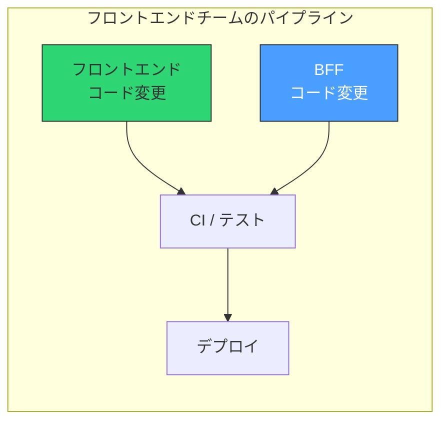

Kubernetes 環境では、BFF は独立した Deployment として管理される。フロントエンドの新バージョンと BFF の新バージョンが同時にリリースされる際には、カナリアデプロイやブルーグリーンデプロイを用い、段階的にトラフィックを切り替えることが安全である。

---

## 8. 所有権モデル — 誰が BFF を所有するか

BFF の所有権は、技術的な設計判断と同じかそれ以上に重要な組織的判断である。所有権の配置は、開発速度、品質、チーム間の摩擦に直接影響する。

### 8.1 フロントエンドチーム所有モデル

Sam Newman が当初提唱し、最も広く推奨されるモデルである。各フロントエンドチーム（Web チーム、Mobile チーム）が、それぞれ自分たちの BFF を所有・運用する。

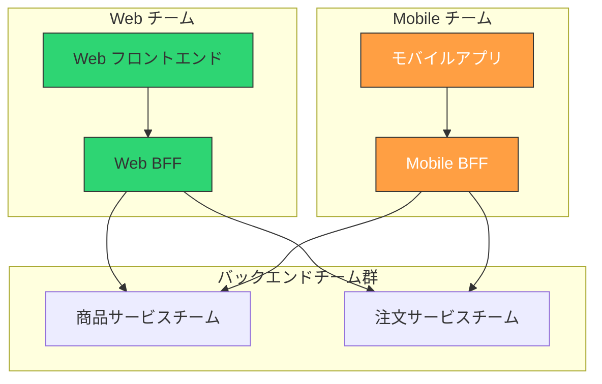

**利点**：

- フロントエンドの要件変更に即座に対応できる。UI の変更と BFF の変更を同じチームが同じスプリントで行える
- フロントエンドチームがバックエンドチームにデータ集約 API の作成を依頼する必要がなくなり、チーム間のコミュニケーションオーバーヘッドが削減される
- 「自分が使うものは自分で作り、自分で運用する」というオーナーシップの原則に合致する

**課題**：

- フロントエンドエンジニアがサーバーサイドの開発・運用スキルを持つ必要がある。TypeScript/Node.js であればスキルギャップは比較的小さいが、インフラ運用、パフォーマンスチューニング、障害対応は別のスキルセットである
- 複数の BFF 間で共通ロジック（認証処理、共通のデータ変換など）が重複する可能性がある

### 8.2 バックエンドチーム所有モデル

バックエンドチーム（またはプラットフォームチーム）が BFF を所有するモデルである。

**利点**：

- サーバーサイドの運用ノウハウが豊富なチームが BFF を運用するため、パフォーマンスや安定性の面で安心感がある
- バックエンドサービスの API 変更と BFF の対応が同じチーム内で完結する

**課題**：

- フロントエンドチームが UI を変更するたびに、バックエンドチームに BFF の変更を依頼する必要がある。これがチーム間のボトルネックになる
- BFF がフロントエンドの関心事（画面レイアウトの都合、デバイス特性への対応）を正しく反映できず、結局はフロントエンド側にデータ変換ロジックが残る

::: warning
バックエンドチーム所有モデルでは、BFF が「汎用 API」に退化しやすい。バックエンドエンジニアにとって「特定のフロントエンドに最適化する」という発想は自然ではなく、「汎用的で再利用可能な API を設計する」方向に引き寄せられがちである。これは BFF の本来の目的と矛盾する。
:::

### 8.3 専任 BFF チームモデル

大規模な組織では、BFF を専任で担当するチームを設ける場合がある。

**利点**：

- BFF の品質と一貫性を組織横断的に維持できる
- フロントエンドチームとバックエンドチームの双方から独立して最適化を行える

**課題**：

- 調整コストが増大する。フロントエンドチーム、BFF チーム、バックエンドチームの三者間でコミュニケーションが必要になる
- BFF チームがボトルネックになる。すべてのフロントエンドの変更が BFF チームを経由するため、スケールしにくい

### 8.4 推奨される選択

BFF の所有権モデルの選択は組織の規模と成熟度に依存するが、以下の指針が多くの組織に当てはまる。

| 組織の状態 | 推奨モデル |
|-----------|-----------|
| スタートアップ（10 人以下） | BFF を分離せず、フルスタックチームが SSR フレームワーク（Next.js 等）の機能で代替 |
| 中規模（10-100 人） | フロントエンドチーム所有。TypeScript/Node.js で BFF を実装し、フロントエンドと同じリポジトリで管理 |
| 大規模（100 人以上） | フロントエンドチーム所有をベースとしつつ、プラットフォームチームが BFF のテンプレート・ライブラリ・インフラを提供 |

---

## 9. 実世界での採用事例と教訓

### 9.1 Netflix

Netflix は BFF パターンの先駆的な実践者である。同社は Web、iOS、Android、テレビ、ゲーム機など多数のクライアントをサポートしており、それぞれのクライアントに対して最適化された API レイヤーを構築している。

Netflix は当初、各クライアントチームが共通の API Gateway（Zuul）を通じてバックエンドサービスにアクセスしていたが、クライアント間の要件差異が大きくなるにつれ、各クライアントチームが自らの BFF を所有するモデルに移行した。クライアントチームのエンジニアがサーバーサイドのスクリプト（Groovy）を記述し、API Gateway 上で実行する「API Adapter Layer」を構築した。

### 9.2 SoundCloud

BFF パターンの名付け親である Sam Newman が在籍していた SoundCloud では、Web と Mobile でそれぞれ独立した BFF を運用していた。Web BFF は Clojure で、Mobile BFF は JVM 上で実装されていた。各フロントエンドチームが自身の BFF を所有することで、バックエンドチームへの依存を減らし、デリバリ速度を向上させた。

### 9.3 Spotify

Spotify もまた、クライアントごとに最適化された API レイヤーを持つことで知られる。同社の場合、BFF は明示的に独立したサービスというよりも、バックエンドの各マイクロサービスが GraphQL サブグラフを公開し、それらを Apollo Federation で統合する形式を取っている。クライアントチームはフェデレーテッドグラフに対してクエリを発行し、必要なデータだけを取得する。これは BFF を GraphQL Federation に「溶かし込んだ」形態と見ることができる。

### 9.4 共通する教訓

これらの事例から導き出される共通の教訓は以下の通りである。

**BFF はクライアントの多様性に比例して価値を発揮する**：単一の Web クライアントしかないサービスでは BFF のオーバーヘッドが利点を上回ることが多い。クライアントの種類が増え、それぞれの要件が乖離するにつれて、BFF の価値は急速に高まる。

**BFF の所有権はフロントエンドチームに寄せる方が成功しやすい**：Netflix、SoundCloud ともに、クライアントチーム（フロントエンドチーム）が BFF を所有するモデルで成果を上げている。

**技術選定は柔軟に**：BFF の実装技術は画一的である必要はない。Netflix の Groovy、SoundCloud の Clojure、一般的な Node.js/TypeScript——それぞれの組織が最も効率的に開発・運用できる技術を選べばよい。

---

## 10. BFF の将来と代替パプローチ

### 10.1 Server Components と BFF の収斂

React Server Components（RSC）の登場は、BFF の役割に大きな影響を与えている。RSC では、サーバーサイドで実行されるコンポーネントがバックエンドサービスからデータを直接フェッチし、クライアントには描画済みのコンポーネントツリーを送る。これは事実上、コンポーネント単位の BFF である。

```typescript
// React Server Component: component-level BFF
async function ProductReviews({ productId }: { productId: string }) {
  // This runs on the server, not in the browser
  const reviews = await fetch(
    `${REVIEW_SERVICE}/products/${productId}/reviews`
  ).then((r) => r.json());

  return (
    <div>
      <h3>Reviews ({reviews.totalCount})</h3>
      {reviews.items.map((review) => (
        <ReviewCard key={review.id} review={review} />
      ))}
    </div>
  );
}
```

Next.js の App Router は RSC を全面的に採用しており、`page.tsx` や `layout.tsx` がサーバーサイドでバックエンドサービスからデータを取得する構造は、独立した BFF サービスと機能的に同等である。この進化が示すのは、**Web 向けの BFF は独立したサービスとしてではなく、SSR フレームワークに統合される方向に収斂しつつある**という傾向である。

ただし、これはあくまで Web クライアント向けの話である。モバイルアプリやサードパーティ向けの BFF は、SSR フレームワークには統合できないため、独立したサービスとして引き続き必要になる。

### 10.2 API Gateway の機能拡張

近年の API Gateway 製品は、単純なルーティングを超えて、データ集約やレスポンス変換の機能を備えるようになってきている。Apollo Router は GraphQL Federation のゲートウェイとしてサブグラフの統合を行い、Kong は プラグインによるレスポンスの変換を提供する。

この傾向が進めば、軽量な BFF のユースケースは API Gateway の機能で代替できる可能性がある。ただし、複雑なビジネスロジックに近い変換やクライアント固有の最適化は、API Gateway の宣言的な設定だけでは表現しきれないため、BFF の存在意義は残り続けるだろう。

### 10.3 BFF は「消える」のか

BFF パターンは「消える」のではなく、**形を変えて存続する**と見るのが妥当である。

- Web 向け BFF は SSR フレームワーク（Next.js、Nuxt）に吸収されつつある
- 軽量なデータ集約は API Gateway / GraphQL Federation に吸収されつつある
- モバイル向け・サードパーティ向けの BFF は独立したサービスとして残り続ける
- 複雑なクライアント固有のロジックを持つ BFF は、今後も明示的なサービスとして存在し続ける

重要なのは、BFF が解決しようとした**本質的な課題**——クライアントの多様性に起因するデータ要件の差異——が消えるわけではないということである。その課題を解決する手段が、独立した BFF サービスからフレームワーク統合や API Gateway の機能へと多様化しているに過ぎない。

---

## 11. まとめ

BFF（Backend for Frontend）は、マイクロサービスアーキテクチャとクライアントの多様化という二つの潮流が交差する地点で生まれたパターンである。その本質は「**フロントエンドの関心事を、フロントエンドに最も近いサーバーサイドレイヤーで引き受けること**」に尽きる。

BFF の導入を検討する際に重要なのは、以下の点である。

1. **BFF は万能薬ではない**。単一の Web クライアントしかない小規模なシステムでは、オーバーヘッドが利点を上回る。BFF の価値はクライアントの多様性と要件の乖離に比例して高まる
2. **BFF は API Gateway と異なる**。API Gateway はインフラ層の横断的関心事を、BFF はアプリケーション層のクライアント固有の関心事を担う。両者は共存する
3. **所有権はフロントエンドチームに**。BFF の最大の価値は、フロントエンドチームがバックエンドチームへの依頼なしに、必要なデータを必要な形で取得できることにある
4. **肥大化に注意する**。BFF にビジネスロジックが流入すると、「フロントエンド向けモノリス」に退化する。「この処理はフロントエンドの種類によって変わるか？」という問いが、BFF に置くべきかの判断基準である
5. **技術の進化を追う**。React Server Components、GraphQL Federation、進化した API Gateway など、BFF が解決してきた問題を別の手段で解決するアプローチが台頭している。適切な技術を選択することで、独立した BFF サービスを必要とせずに同等の効果を得られる場合がある

BFF パターンの歴史は、「フロントエンドとバックエンドの境界をどこに引くか」という根本的な問いへの答えの変遷でもある。この問いに対する正解は時代とともに変わるが、クライアントの多様性という課題が存在する限り、BFF の思想は何らかの形で生き続けるだろう。
