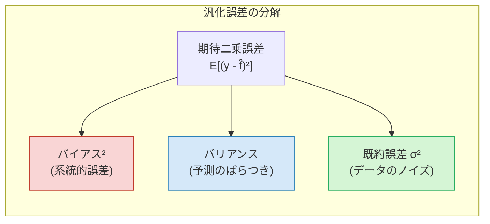
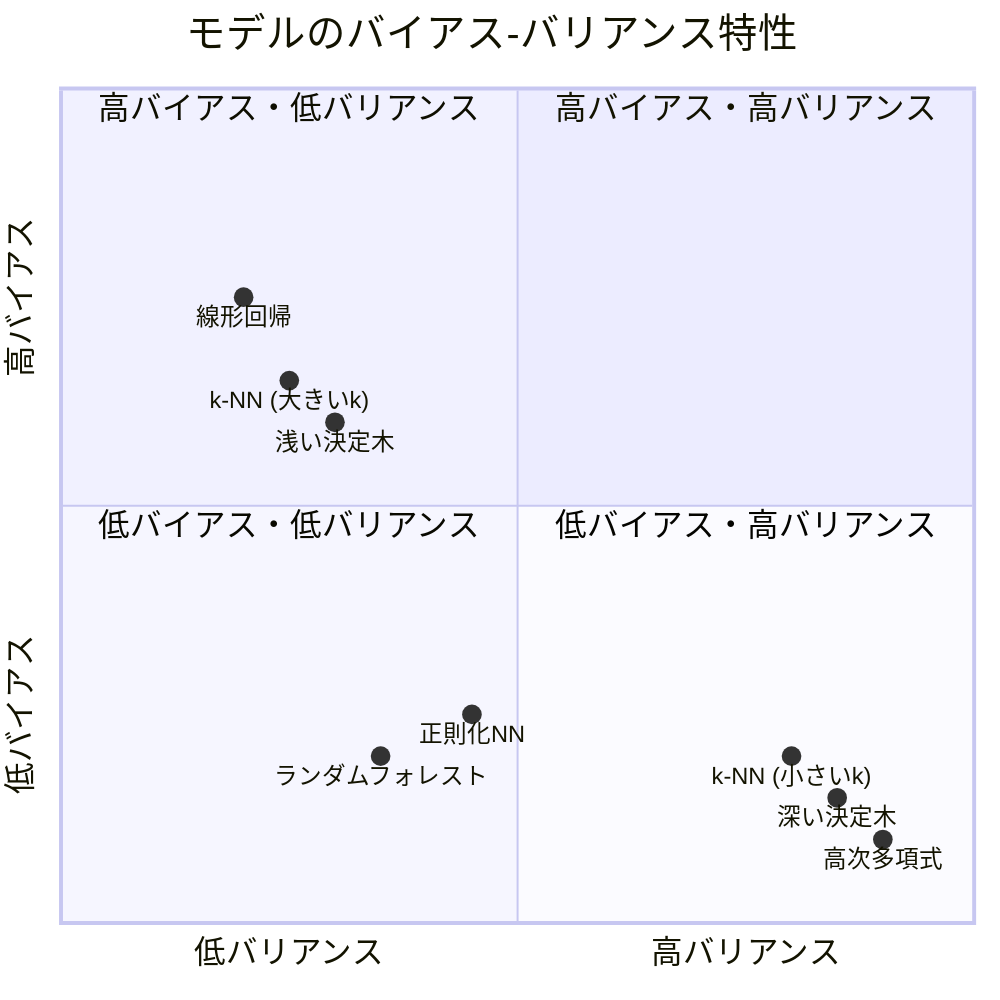
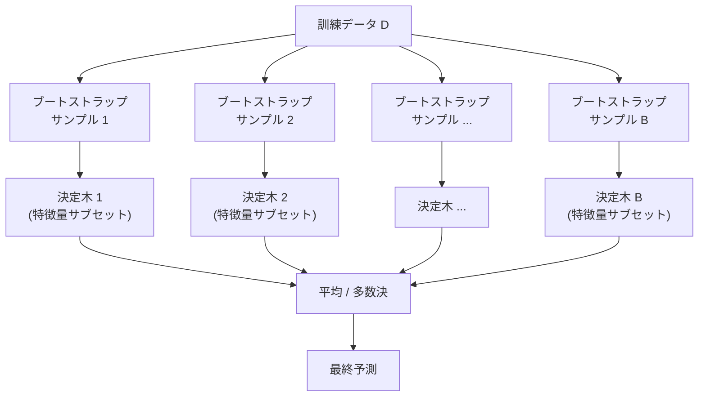
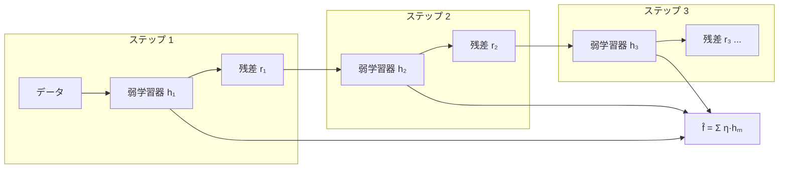
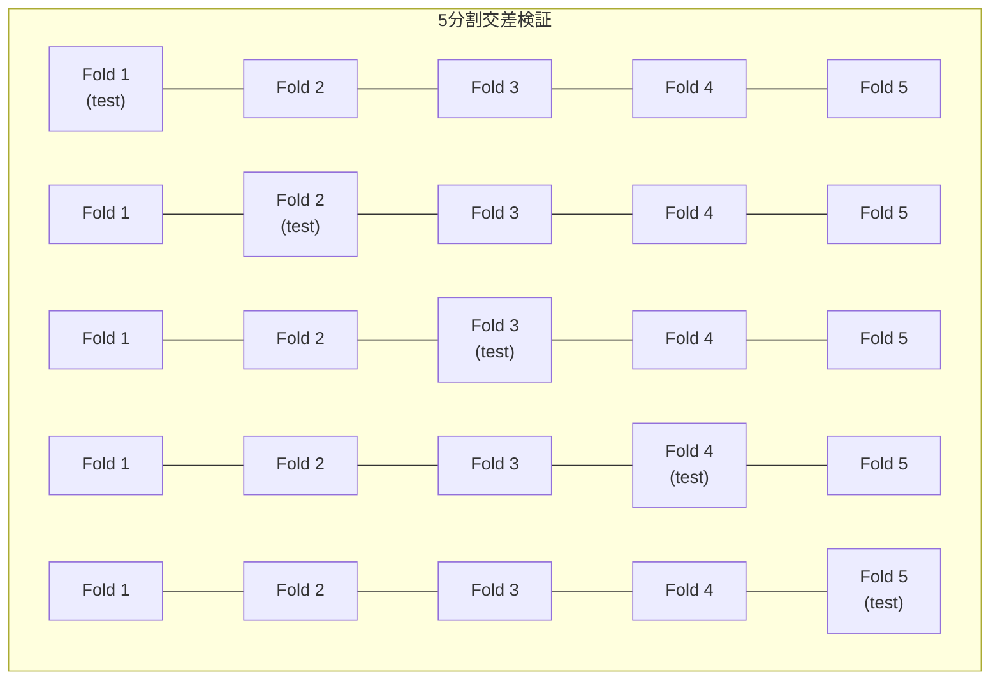
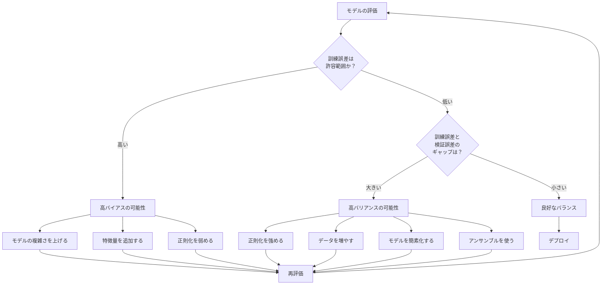

# バイアス-バリアンストレードオフ

## なぜこの概念が重要なのか

機械学習モデルを設計・選択する際、「訓練データにはよく合うのに、新しいデータには全く通用しない」という経験をした人は多い。あるいは逆に、「モデルが単純すぎて訓練データすら十分に説明できない」ということもある。前者は**過学習（overfitting）**、後者は**未学習（underfitting）**と呼ばれる現象であり、これらの根本にあるのが**バイアス-バリアンストレードオフ（Bias-Variance Tradeoff）**という統計学習理論の中心的概念である。

この概念は、モデルの**汎化誤差（generalization error）**を理解し、適切な複雑さのモデルを選ぶための理論的枠組みを提供する。正則化、交差検証、アンサンブル学習など、機械学習の多くの実践的技法は、このトレードオフへの対処として理解できる。

## 前提知識 — 教師あり学習の枠組み

バイアス-バリアンス分解を議論するにあたり、教師あり学習の基本的な問題設定を確認する。

入力 $x \in \mathbb{R}^d$ と出力 $y \in \mathbb{R}$ の間に、次のような関係があると仮定する。

$$
y = f(x) + \epsilon
$$

ここで、$f(x)$ は未知の真の関数であり、$\epsilon$ は平均ゼロ・分散 $\sigma^2$ のノイズ（$\mathbb{E}[\epsilon] = 0$, $\text{Var}(\epsilon) = \sigma^2$）である。このノイズは、データ測定の不正確さや、入力 $x$ には含まれない潜在変数の影響など、原理的に除去できない不確実性を表す。

訓練データ $D = \{(x_1, y_1), (x_2, y_2), \ldots, (x_n, y_n)\}$ が与えられたとき、学習アルゴリズムは $f(x)$ の推定値 $\hat{f}_D(x)$ を出力する。添字 $D$ は、この推定値が訓練データセット $D$ に依存することを明示している。異なる訓練データセットからは、一般に異なる $\hat{f}_D(x)$ が得られる。

## バイアス-バリアンス分解

### 期待二乗誤差の分解

新しいデータ点 $x_0$ に対するモデルの**期待二乗誤差（Expected Squared Error）**を分解してみよう。期待値はすべての可能な訓練データセット $D$ と、ノイズ $\epsilon$ に関してとる。

$$
\mathbb{E}_D\left[(y - \hat{f}_D(x_0))^2\right]
$$

$y = f(x_0) + \epsilon$ を代入して展開する。

$$
\mathbb{E}_D\left[(f(x_0) + \epsilon - \hat{f}_D(x_0))^2\right]
$$

$\epsilon$ と $\hat{f}_D(x_0)$ は独立であることに注意して展開すると、次の**バイアス-バリアンス分解**が得られる。

$$
\mathbb{E}_D\left[(y - \hat{f}_D(x_0))^2\right] = \underbrace{\left(\text{Bias}[\hat{f}_D(x_0)]\right)^2}_{\text{バイアスの二乗}} + \underbrace{\text{Var}[\hat{f}_D(x_0)]}_{\text{バリアンス}} + \underbrace{\sigma^2}_{\text{既約誤差}}
$$

各項を定義すると以下のとおりである。

- **バイアス（Bias）**: $\text{Bias}[\hat{f}_D(x_0)] = \mathbb{E}_D[\hat{f}_D(x_0)] - f(x_0)$
- **バリアンス（Variance）**: $\text{Var}[\hat{f}_D(x_0)] = \mathbb{E}_D\left[(\hat{f}_D(x_0) - \mathbb{E}_D[\hat{f}_D(x_0)])^2\right]$
- **既約誤差（Irreducible Error）**: $\sigma^2$

### 分解の導出

導出の過程を丁寧に追う。まず、$\bar{f}(x_0) = \mathbb{E}_D[\hat{f}_D(x_0)]$ と略記する。

$$
\begin{aligned}
\mathbb{E}_D\left[(y - \hat{f}_D(x_0))^2\right]
&= \mathbb{E}_D\left[(f(x_0) + \epsilon - \hat{f}_D(x_0))^2\right] \\
&= \mathbb{E}_D\left[((f(x_0) - \hat{f}_D(x_0)) + \epsilon)^2\right] \\
&= \mathbb{E}_D\left[(f(x_0) - \hat{f}_D(x_0))^2\right] + 2\mathbb{E}_D\left[(f(x_0) - \hat{f}_D(x_0))\epsilon\right] + \mathbb{E}_D[\epsilon^2]
\end{aligned}
$$

$\epsilon$ は $D$ および $f(x_0)$ と独立なので、交差項は 0 になる。

$$
= \mathbb{E}_D\left[(f(x_0) - \hat{f}_D(x_0))^2\right] + \sigma^2
$$

第一項をさらに分解する。$\bar{f}(x_0)$ を加減する。

$$
\begin{aligned}
\mathbb{E}_D\left[(f(x_0) - \hat{f}_D(x_0))^2\right]
&= \mathbb{E}_D\left[((f(x_0) - \bar{f}(x_0)) + (\bar{f}(x_0) - \hat{f}_D(x_0)))^2\right] \\
&= (f(x_0) - \bar{f}(x_0))^2 + 2(f(x_0) - \bar{f}(x_0))\mathbb{E}_D[\bar{f}(x_0) - \hat{f}_D(x_0)] + \mathbb{E}_D[(\bar{f}(x_0) - \hat{f}_D(x_0))^2]
\end{aligned}
$$

$\mathbb{E}_D[\bar{f}(x_0) - \hat{f}_D(x_0)] = \bar{f}(x_0) - \bar{f}(x_0) = 0$ であるから、交差項は消える。

$$
= \underbrace{(f(x_0) - \bar{f}(x_0))^2}_{\text{Bias}^2} + \underbrace{\mathbb{E}_D[(\hat{f}_D(x_0) - \bar{f}(x_0))^2]}_{\text{Variance}}
$$

したがって最終的に以下が得られる。

$$
\mathbb{E}_D\left[(y - \hat{f}_D(x_0))^2\right] = \text{Bias}^2 + \text{Variance} + \sigma^2
$$

## 各項の直観的理解

### バイアス（Bias）

バイアスは、**モデルの仮定が真の関数からどれだけ系統的にずれているか**を測る。多数の異なる訓練データセットで学習した場合の「平均的な予測」$\bar{f}(x_0)$ と、真の関数値 $f(x_0)$ との差である。

高いバイアスは、モデルの仮定が制限的すぎることを意味する。たとえば、真の関係が非線形であるのに線形モデルで近似しようとすると、どれだけデータを集めても系統的な誤差が残る。これが**未学習（underfitting）**の本質である。

### バリアンス（Variance）

バリアンスは、**訓練データのサンプリングに対するモデルの予測の揺らぎ**を測る。異なる訓練データセットから学習した場合に、予測がどれだけばらつくかを定量化する。

高いバリアンスは、モデルが訓練データの個別のパターンやノイズに過度に敏感であることを意味する。複雑なモデル（高次多項式、深い決定木など）は表現力が高い反面、訓練データの微妙な変動まで捉えてしまい、新しいデータに対する予測が不安定になる。これが**過学習（overfitting）**の本質である。

### 既約誤差（Irreducible Error）

既約誤差 $\sigma^2$ は、データ生成過程そのものに内在するノイズであり、いかなるモデルを使っても除去することはできない。この項はモデルの選択とは無関係であるため、学習アルゴリズムの設計においては、バイアスとバリアンスの二項に焦点を当てることになる。



## トレードオフの構造

バイアスとバリアンスは、モデルの複雑さに関して**トレードオフ**の関係にある。これが「バイアス-バリアンストレードオフ」の核心である。

### モデルの複雑さとの関係

| モデルの複雑さ | バイアス | バリアンス | 汎化誤差 |
|:---:|:---:|:---:|:---:|
| 低い（単純なモデル） | 高い | 低い | 高い（未学習） |
| 適切 | 中程度 | 中程度 | **最小** |
| 高い（複雑なモデル） | 低い | 高い | 高い（過学習） |

```mermaid
xychart-beta
    title "バイアス-バリアンストレードオフ"
    x-axis "モデルの複雑さ" [低, "", "", 適切, "", "", 高]
    y-axis "誤差" 0 --> 100
    line "バイアス²" [90, 70, 50, 30, 15, 8, 5]
    line "バリアンス" [5, 8, 15, 25, 40, 60, 85]
    line "汎化誤差" [95, 78, 65, 55, 55, 68, 90]
```

::: tip トレードオフの本質
汎化誤差を最小化するには、バイアスとバリアンスの**合計**を最小化する必要がある。モデルの複雑さを増すとバイアスは減少するが、ある点を超えるとバリアンスの増加がバイアスの減少を上回り、全体の誤差が増加に転じる。この「最適な複雑さ」を見つけることが、モデル選択の核心的課題である。
:::

### 的のアナロジー

バイアスとバリアンスの直観的な理解には、ダーツ投げの比喩がよく使われる。

```
  高バイアス / 低バリアンス      低バイアス / 低バリアンス
  ┌─────────────────┐         ┌─────────────────┐
  │    ○             │         │                 │
  │   ○○             │         │                 │
  │  ○○              │         │     ○○●○        │
  │                  │         │      ○          │
  │        ●         │         │                 │
  └─────────────────┘         └─────────────────┘
  一貫して外れる（系統的誤差）    正確かつ精密（理想）

  高バイアス / 高バリアンス      低バイアス / 高バリアンス
  ┌─────────────────┐         ┌─────────────────┐
  │ ○          ○     │         │ ○               │
  │                  │         │          ○      │
  │      ○           │         │     ●           │
  │            ○     │         │            ○    │
  │        ●         │         │   ○             │
  └─────────────────┘         └─────────────────┘
  ばらつきも大きく外れる         的の中心周りだがばらつく

  ● = 真の値（的の中心）  ○ = 個々の予測
```

- **高バイアス / 低バリアンス**: 予測は一貫しているが、真の値から系統的にずれている
- **低バイアス / 低バリアンス**: 予測が正確かつ安定している。理想的な状態
- **高バイアス / 高バリアンス**: 系統的にずれている上にばらつきも大きい。最悪の状態
- **低バイアス / 高バリアンス**: 平均的には正しいが、個々の予測は大きくばらつく

## 具体例 — 多項式回帰による図解

バイアス-バリアンストレードオフを実感するために、多項式回帰の例を考える。

### 問題設定

真の関数が $f(x) = \sin(\pi x)$ であり、ノイズ $\epsilon \sim \mathcal{N}(0, 0.1)$ が加わったデータを $n = 20$ 個サンプリングする場合を考える。この関数を $d$ 次多項式 $\hat{f}(x) = \sum_{k=0}^{d} w_k x^k$ で近似する。

```python
import numpy as np

def true_function(x):
    return np.sin(np.pi * x)

def generate_data(n=20, noise_std=0.1):
    # Generate training data with Gaussian noise
    x = np.random.uniform(-1, 1, n)
    y = true_function(x) + np.random.normal(0, noise_std, n)
    return x, y

def fit_polynomial(x, y, degree):
    # Fit polynomial regression of given degree
    coeffs = np.polyfit(x, y, degree)
    return np.poly1d(coeffs)
```

### 次数による振る舞いの違い

**1次多項式（$d = 1$）— 高バイアス / 低バリアンス**

直線では $\sin(\pi x)$ の曲率を表現できない。どの訓練データセットを使っても似たような直線が得られるが（低バリアンス）、真の関数からは常に系統的にずれる（高バイアス）。

**4次多項式（$d = 4$）— 適度なバイアス / 適度なバリアンス**

$\sin(\pi x)$ の形状を概ね捉えられる程度の柔軟性を持ち、訓練データが変わっても大きくは変動しない。バイアスとバリアンスのバランスが取れた状態である。

**15次多項式（$d = 15$）— 低バイアス / 高バリアンス**

非常に高い表現力を持つため、訓練データの各点をほぼ正確に通る曲線を描ける（低バイアス）。しかし、訓練データが少し変わるだけで、曲線の形が激しく変動する（高バリアンス）。データ点の間では予測が極端に振れ、新しいデータに対する性能は劣化する。

```python
def estimate_bias_variance(degree, n_datasets=200, n_points=20):
    """
    Estimate bias and variance by generating multiple datasets
    """
    x_test = np.linspace(-1, 1, 100)
    predictions = np.zeros((n_datasets, len(x_test)))

    for i in range(n_datasets):
        x_train, y_train = generate_data(n=n_points)
        model = fit_polynomial(x_train, y_train, degree)
        predictions[i] = model(x_test)

    # Mean prediction across datasets
    mean_pred = np.mean(predictions, axis=0)
    true_vals = true_function(x_test)

    # Bias^2: (E[f_hat] - f)^2
    bias_sq = np.mean((mean_pred - true_vals) ** 2)
    # Variance: E[(f_hat - E[f_hat])^2]
    variance = np.mean(np.var(predictions, axis=0))

    return bias_sq, variance

# degree=1:  Bias^2 ≈ 0.28, Variance ≈ 0.005
# degree=4:  Bias^2 ≈ 0.003, Variance ≈ 0.012
# degree=15: Bias^2 ≈ 0.005, Variance ≈ 1.2
```

この実験は、多項式の次数を上げるとバイアスは減少するが、ある時点からバリアンスが急激に増大し、汎化誤差が増加に転じることを明確に示している。

## 様々なモデルのバイアス-バリアンス特性

実際の機械学習で使われるモデルについて、バイアスとバリアンスの特性を整理する。

### 線形モデル — 高バイアス / 低バリアンス

線形回帰やロジスティック回帰などの線形モデルは、入力特徴量の線形結合のみを表現できるため、仮定が強く（高バイアス）、訓練データの変動に対する感度は低い（低バリアンス）。

パラメータ数は特徴量の次元 $d$ に対して $O(d)$ であり、データ量が十分であれば安定した推定が得られる。しかし、真の関係が非線形の場合は本質的に表現できない。

### k近傍法（k-NN）

k-NN は、$k$ の値によってバイアスとバリアンスのバランスが大きく変わるモデルの好例である。

- **$k = 1$**: 各テストデータに対して最も近い訓練データ点の値をそのまま返す。訓練データを完全に再現するため**バイアスは低い**が、単一のデータ点に依存するため**バリアンスは非常に高い**
- **$k = n$（全データ数）**: すべての訓練データの平均を返す。これは定数関数に等しく、**バイアスは最大**だが**バリアンスは最小**

$$
\text{Bias}^2 \propto k, \quad \text{Variance} \propto \frac{1}{k}
$$

### 決定木

単一の決定木は、木の深さ（depth）によってバイアス-バリアンスの特性が変わる。

- **浅い木（depth が小さい）**: 入力空間を粗くしか分割できない。高バイアス / 低バリアンス
- **深い木（depth が大きい、あるいは制限なし）**: 訓練データの個々のデータ点に合わせた細かい分割が可能。低バイアス / 高バリアンス

剪定されていない決定木は、バリアンスが非常に高い典型的なモデルである。

### ニューラルネットワーク

ニューラルネットワークは、層の数やユニット数を増やすことで任意の関数を近似できる能力（万能近似定理）を持つ。パラメータ数が膨大になるため、理論的にはバリアンスが高くなるが、実際には以下のメカニズムで制御される。

- **正則化**（Dropout、Weight Decay）
- **確率的勾配降下法**（SGD）の暗黙的正則化効果
- **Early Stopping**

::: warning 現代の深層学習における「二重降下」
古典的なバイアス-バリアンストレードオフの描像では、パラメータ数を増やし続けると汎化誤差が単調に悪化する（U字カーブ）と予測される。しかし、現代の深層学習では、パラメータ数がデータ数を大きく超えた**過パラメータ化（overparameterized）**領域において、汎化誤差が再び減少する**二重降下（double descent）**現象が観察されている。この現象については後のセクションで詳しく議論する。
:::

### モデル比較の概観



## トレードオフへの対処法

バイアス-バリアンストレードオフに対処するための主要な手法を、大きく分けて **正則化**、**アンサンブル学習**、**モデル選択** の三つの観点から整理する。

### 正則化 — バリアンスの制御

正則化は、モデルの表現力を制限することで**バリアンスを抑制**する技法である。これはバイアスの微増と引き換えに、バリアンスの大幅な低減を実現する。

#### L1 正則化（Lasso）

損失関数にパラメータの絶対値の和を加える。

$$
\mathcal{L}_{\text{Lasso}} = \frac{1}{n}\sum_{i=1}^{n}(y_i - \hat{y}_i)^2 + \lambda \sum_{j=1}^{p}|w_j|
$$

L1正則化はパラメータの一部を正確にゼロにするため、**特徴量選択**の効果を持つ。不要なパラメータが除去されることで、モデルの実効的な複雑さが下がり、バリアンスが減少する。

#### L2 正則化（Ridge）

損失関数にパラメータの二乗和を加える。

$$
\mathcal{L}_{\text{Ridge}} = \frac{1}{n}\sum_{i=1}^{n}(y_i - \hat{y}_i)^2 + \lambda \sum_{j=1}^{p}w_j^2
$$

L2正則化はパラメータをゼロに近づけるが、正確にゼロにはしない。大きなパラメータ値を抑制することで、モデルの出力が訓練データの微小な変動に過度に反応することを防ぐ。

#### Elastic Net

L1とL2を組み合わせた正則化である。

$$
\mathcal{L}_{\text{Elastic}} = \frac{1}{n}\sum_{i=1}^{n}(y_i - \hat{y}_i)^2 + \lambda_1 \sum_{j=1}^{p}|w_j| + \lambda_2 \sum_{j=1}^{p}w_j^2
$$

#### ニューラルネットワークにおける正則化

ニューラルネットワークでは、L2正則化（Weight Decay）に加えて、以下の正則化技法がよく使われる。

- **Dropout**: 学習時にランダムにユニットを無効化する。これは暗黙的にアンサンブルの効果を持ち、バリアンスを抑制する
- **Batch Normalization**: 中間層の出力を正規化することで、学習の安定化と軽度の正則化効果をもたらす
- **Data Augmentation**: 訓練データを人工的に増やすことで、実効的なデータ量を増加させ、バリアンスを減少させる

#### 正則化強度 $\lambda$ の効果

正則化のハイパーパラメータ $\lambda$ は、バイアスとバリアンスのバランスを直接制御する。

| $\lambda$ | バイアス | バリアンス | モデルの振る舞い |
|:---:|:---:|:---:|:---|
| 0（正則化なし） | 低い | 高い | 訓練データに完全に適合しようとする |
| 小さい | やや低い | やや高い | 軽い制約つきで学習する |
| 適切 | 中程度 | 中程度 | バランスの取れた汎化 |
| 大きい | 高い | 低い | パラメータが過度に抑制され、未学習になる |
| $\infty$ | 最大 | 最小 | すべてのパラメータが 0 に潰れる |

### アンサンブル学習 — バリアンスとバイアスの同時改善

アンサンブル学習は、複数のモデル（弱学習器）の予測を組み合わせることで、単一のモデルよりも優れた汎化性能を達成する手法である。バイアスとバリアンスのどちらを主に改善するかによって、大きく二つのアプローチに分けられる。

#### バギング（Bagging）— バリアンスの低減

バギング（Bootstrap Aggregating）は、訓練データからブートストラップサンプル（復元抽出）を複数生成し、それぞれで独立にモデルを学習して予測を平均（回帰の場合）または多数決（分類の場合）する手法である。

**なぜバリアンスが低減するのか？**

$B$ 個の独立した確率変数 $Z_1, \ldots, Z_B$ がそれぞれ分散 $\sigma_Z^2$ を持つとき、その平均の分散は以下のとおりである。

$$
\text{Var}\left(\frac{1}{B}\sum_{b=1}^{B} Z_b\right) = \frac{\sigma_Z^2}{B}
$$

実際にはブートストラップサンプルから学習したモデル同士は完全に独立ではないため、モデル間の相関を $\rho$ とすると以下のようになる。

$$
\text{Var}\left(\frac{1}{B}\sum_{b=1}^{B} Z_b\right) = \rho \sigma_Z^2 + \frac{1 - \rho}{B}\sigma_Z^2
$$

$B$ を大きくしても第一項 $\rho \sigma_Z^2$ は消えない。この相関を低減するために考案されたのが**ランダムフォレスト**である。

**ランダムフォレスト**は、バギングに加えて各分割時に特徴量のランダムなサブセットのみを候補とすることで、個々の木の間の相関を下げる。これにより、上式の $\rho$ が小さくなり、バリアンスがさらに低減する。



::: tip バギングの要点
バギングは**バリアンスの高い**モデル（深い決定木など）に対して効果的であり、バイアスはほとんど変えない。すでにバイアスの高いモデル（浅い木など）にバギングを適用しても、大きな改善は期待できない。
:::

#### ブースティング（Boosting）— バイアスの低減

ブースティングは、弱学習器を**逐次的に**組み合わせて、前のモデルの誤りを次のモデルが補正するアプローチである。

**AdaBoost**: 前のモデルが誤分類したサンプルに高い重みを与えて次のモデルを学習する。

**勾配ブースティング（Gradient Boosting）**: 残差（勾配）に対して次のモデルをフィットする。

$$
\hat{f}^{(m)}(x) = \hat{f}^{(m-1)}(x) + \eta \cdot h_m(x)
$$

ここで $h_m(x)$ は $m$ 番目の弱学習器、$\eta$ は学習率である。各ステップで残差を近似するモデルを加えることで、**バイアスを段階的に低減**する。

ただし、ブースティングはステップ数を増やしすぎると過学習する（バリアンスが増大する）リスクがある。学習率 $\eta$ を小さくする、木の深さを制限する、Early Stopping を適用するなどの方法でバリアンスを制御する。

**XGBoost、LightGBM、CatBoost** などの実用的なブースティングライブラリは、正則化を組み込むことでバイアスとバリアンスの両方を効果的に制御する。



#### バギングとブースティングの比較

| 観点 | バギング | ブースティング |
|:---|:---|:---|
| 主な効果 | **バリアンス低減** | **バイアス低減** |
| 学習の方式 | 独立・並列 | 逐次的 |
| 基底モデルに適するもの | 高バリアンスのモデル（深い木） | 高バイアスのモデル（浅い木） |
| 過学習リスク | 低い | 高い（制御が必要） |
| 並列化 | 容易 | 困難 |
| 代表的手法 | ランダムフォレスト | XGBoost, LightGBM |

### モデル選択 — 最適な複雑さの探索

バイアス-バリアンストレードオフにおける最適なバランス点を実際に見つけるための方法論を整理する。

#### 交差検証（Cross-Validation）

汎化誤差を直接推定する最も信頼性の高い方法のひとつが**k分割交差検証**である。



データを $k$ 個のフォールドに分割し、各フォールドを順にテストセットとして使用する。$k$ 回の評価の平均で汎化誤差を推定する。

$$
\text{CV}(k) = \frac{1}{k}\sum_{i=1}^{k} \text{Error}_i
$$

$k$ の選択自体にもバイアス-バリアンストレードオフが存在する。

- **$k$ が小さい（例: $k = 2$）**: 各訓練セットが小さいため、バイアスが高くなる（性能を過小評価する傾向）。一方で、各フォールドの重複が少ないため、バリアンスは低い
- **$k$ が大きい（例: $k = n$、Leave-One-Out）**: 訓練セットが大きいためバイアスは低いが、各フォールドの重複が多いため推定値の相関が高く、バリアンスが大きくなる
- **実務的には $k = 5$ または $k = 10$** がバイアスとバリアンスのバランスがよいとされている

#### 情報量規準

情報量規準は、モデルの訓練誤差にモデルの複雑さに対するペナルティ項を加えた指標であり、交差検証の計算コストをかけずに汎化性能を近似的に評価できる。

**AIC（赤池情報量規準）**:

$$
\text{AIC} = 2k - 2\ln(\hat{L})
$$

ここで $k$ はパラメータ数、$\hat{L}$ は最大尤度である。

**BIC（ベイズ情報量規準）**:

$$
\text{BIC} = k\ln(n) - 2\ln(\hat{L})
$$

BICはAICよりもパラメータ数に対するペナルティが強く（$n > e^2 \approx 7.4$ のとき）、よりシンプルなモデルを選択する傾向がある。

#### 学習曲線による診断

学習曲線は、訓練データ量に対する訓練誤差と検証誤差のプロットであり、モデルが高バイアスか高バリアンスかを診断するための実用的なツールである。

**高バイアスの場合の学習曲線**:

```
誤差
 │ ─────────────────── 検証誤差（高止まり）
 │
 │ ─────────────────── 訓練誤差（高止まり）
 │
 └─────────────────── データ量
```

- 訓練誤差と検証誤差の両方が高い値で収束する
- 二つの曲線の間のギャップは小さい
- データを増やしても大きな改善は見込めない
- **対処法**: より複雑なモデルを使う、特徴量を追加する

**高バリアンスの場合の学習曲線**:

```
誤差
 │ ───────────────\     検証誤差（高いが減少中）
 │                 \
 │                  大きなギャップ
 │                 /
 │ ───────────────/     訓練誤差（非常に低い）
 └─────────────────── データ量
```

- 訓練誤差は非常に低いが、検証誤差との間に大きなギャップがある
- データを増やすと改善の余地がある
- **対処法**: 正則化を強める、データを増やす、モデルを簡素化する

## ベイズ的観点からのバイアスとバリアンス

バイアス-バリアンストレードオフをベイズ統計の枠組みで捉えると、より深い理解が得られる。

### 事前分布と正則化

ベイズ統計では、パラメータに**事前分布（prior）**を設定する。これは正則化と密接に関連している。

- **L2正則化** ≡ パラメータにガウス事前分布 $w \sim \mathcal{N}(0, \tau^2)$ を仮定した**MAP推定（Maximum A Posteriori）**
- **L1正則化** ≡ パラメータにラプラス事前分布 $w \sim \text{Laplace}(0, b)$ を仮定したMAP推定

事前分布が強い（分散が小さい）ほど、推定が事前の仮定に引きずられ（高バイアス）、データへの依存が減る（低バリアンス）。事前分布が弱い（分散が大きい）ほど、データ主導の推定になり（低バイアス）、データの変動に敏感になる（高バリアンス）。

### ベイズ予測とバリアンスの低減

ベイズ予測では、MAP推定のように単一のパラメータ値を使うのではなく、事後分布全体に対して積分（周辺化）を行う。

$$
p(y^* | x^*, D) = \int p(y^* | x^*, w) \, p(w | D) \, dw
$$

この周辺化は、パラメータの不確実性を適切に考慮するため、MAP推定に比べて**バリアンスが低減**される。直観的には、パラメータ空間上のアンサンブルを取っていることに相当する。

ただし、この積分は一般に解析的に計算できないため、マルコフ連鎖モンテカルロ法（MCMC）やラプラス近似、変分推論などの近似手法が用いられる。

## 二重降下現象 — 古典的トレードオフの拡張

### 古典的な U字カーブの限界

古典的なバイアス-バリアンストレードオフの描像では、パラメータ数（モデルの複雑さ）に対する汎化誤差はU字カーブを描き、**補間閾値**（パラメータ数がちょうどデータ数と等しくなる点）付近で最大になると予測される。

しかし、現代の深層学習では、パラメータ数がデータ数を大幅に超えた過パラメータ化領域でも良好な汎化性能が観察されている。

### 二重降下（Double Descent）

Belkin ら（2019）が提唱した**二重降下**現象は、汎化誤差がモデルの複雑さに対して二段階の降下を示すことを指す。

```
汎化誤差
 │
 │ \
 │  \        ↗ ← 補間閾値でのピーク
 │   \      /  \
 │    \    /    \
 │     \  /     \
 │      \/       ────── ← 過パラメータ化領域での第二の降下
 │
 └─────────────────────── パラメータ数
        ↑          ↑
    古典的最適点    データ数 ≈ パラメータ数
```

1. **バイアス支配領域（Under-parameterized）**: パラメータ数が少ない領域。モデルの複雑さを増すと汎化誤差が減少する（古典的）
2. **補間閾値（Interpolation Threshold）**: パラメータ数 $\approx$ データ数。モデルが訓練データを「ちょうど」補間できる臨界点。この近傍で汎化誤差が急激に悪化する
3. **バリアンス支配領域から再降下（Over-parameterized）**: パラメータ数がデータ数を大幅に超える領域。汎化誤差が再び減少する

### なぜ過パラメータ化が機能するのか

この現象の理論的理解はまだ完全ではないが、以下の要因が関与していると考えられている。

**暗黙的正則化（Implicit Regularization）**: SGDによる最適化は、多数の補間解の中から「最も滑らかな」解を暗黙的に選択する傾向がある。パラメータ空間が十分に大きいと、訓練データを補間しつつも滑らかな関数が見つかりやすくなる。

**ノルム最小解**: 過パラメータ化された線形回帰では、SGD（あるいは勾配降下法）は訓練データを完全に補間する解の中で $L_2$ ノルムが最小のものに収束することが証明されている。これはL2正則化の効果と同等である。

**補間閾値のメカニズム**: パラメータ数がデータ数とほぼ等しいとき、モデルは訓練データを補間するために「無理に」パラメータを調整する必要があり、結果として過度に複雑な関数が学習される。パラメータ数が十分に多ければ、より穏やかな方法で補間が可能になる。

::: danger 注意
二重降下は、古典的なバイアス-バリアンストレードオフが「間違っている」ことを意味するのではない。バイアス-バリアンス分解自体は常に成立する数学的事実である。二重降下は、バイアスとバリアンスの各項がモデルの複雑さに対して必ずしも単調に変化しないことを示しており、古典的な「バイアスは単調減少、バリアンスは単調増加」という前提が過度に単純化されていたことを明らかにした。
:::

## 実践的なガイドライン

### モデル選択のフローチャート



### チェックリスト

**高バイアスが疑われる場合**:
1. より複雑なモデル（例: 線形 → 非線形）に変更する
2. 特徴量エンジニアリングで有用な特徴量を追加する
3. 正則化のハイパーパラメータ $\lambda$ を小さくする
4. ブースティング（Gradient Boosting）を検討する

**高バリアンスが疑われる場合**:
1. 正則化を適用または強化する（L1/L2, Dropout）
2. 訓練データを増やす、またはData Augmentationを行う
3. モデルの複雑さを下げる（層数削減、決定木の剪定など）
4. バギング/ランダムフォレストを検討する
5. Early Stopping を適用する

### データ量の影響

バイアス-バリアンストレードオフは、データ量 $n$ とも密接に関係する。

- データ量が増えると、バリアンスは一般に $O(1/n)$ のオーダーで減少する
- バイアスはデータ量にほとんど依存しない（モデルの仮定そのものの問題であるため）

したがって、**データを増やすことは高バリアンスの問題には有効だが、高バイアスの問題には効果が薄い**。これは学習曲線の診断結果と一致する。

## バイアス-バリアンス分解の0-1損失への拡張

ここまで二乗誤差損失に基づくバイアス-バリアンス分解を論じてきたが、分類問題で使われる0-1損失に対するバイアス-バリアンス分解も存在する。ただし、こちらはやや複雑で、複数の異なる定式化が提案されている。

### Domingos の分解

Domingos（2000）は、以下の統一的な分解を提案した。

$$
\mathbb{E}_D[\text{Loss}] = c_1 \cdot \text{Bias}^2 + \text{Variance} + \text{Noise}
$$

分類問題では、バイアスとバリアンスが単純に加算的ではなく、バイアスが高い場合にバリアンスが実際には誤差を**低減**する場合がある（バリアンスが有益となるケース）。これは、多数決で正しい答えが選ばれるようなケースに対応する。

### Kong と Dietterich の分解

Kong と Dietterich（1995）は0-1損失に対して以下の分解を導出した。主予測（most frequent prediction）$\hat{y}^*(x)$ を用いて、

- **バイアス**: $\hat{y}^*(x) \neq y^*(x)$ であるかどうか（0 or 1）
- **バリアンス**: $P_D(\hat{f}_D(x) \neq \hat{y}^*(x))$

この分解により、分類問題においてもバイアスとバリアンスの概念が利用でき、モデル選択の指針となる。

## 理論的な限界 — No Free Lunch

バイアス-バリアンストレードオフの議論を踏まえて、機械学習におけるモデル選択の根本的な限界についても言及しておく。

**No Free Lunch定理**（Wolpert, 1996）は、すべての可能なデータ生成分布に対して均一に最良のアルゴリズムは存在しないことを示す。つまり、あるクラスの問題でバイアスを低く保つためには、別のクラスの問題ではバイアスが高くなることを受け入れなければならない。

この定理は、バイアス-バリアンストレードオフをさらに一般化したものと見ることができる。「すべての問題に最適な」モデルの複雑さは存在せず、対象とする問題の構造に基づいて適切なモデルクラスを選択する必要がある。

実際には、多くの自然なデータ分布は「滑らかさ」や「スパース性」など何らかの構造を持っており、この構造を適切に反映した帰納的バイアス（inductive bias）を持つモデルを選ぶことで、良好なバイアス-バリアンスのバランスを達成できる。

## まとめ

バイアス-バリアンストレードオフは、機械学習モデルの汎化性能を理解するための最も基本的な理論的枠組みである。

1. **汎化誤差はバイアス、バリアンス、既約誤差の三つに分解される**。この分解は二乗誤差損失のもとで数学的に厳密に成り立つ
2. **バイアスはモデルの仮定の強さ**に起因する系統的誤差であり、**バリアンスは訓練データの変動に対する感度**である
3. **モデルの複雑さを増すとバイアスは減少するがバリアンスは増大**し、最適な複雑さはこの二つのバランスが取れた点にある
4. **正則化、アンサンブル学習、交差検証**は、このトレードオフに対処するための主要な実践的手法である
5. **二重降下現象**は、過パラメータ化領域での振る舞いが古典的描像より複雑であることを示しているが、バイアス-バリアンス分解自体の妥当性を否定するものではない

この概念を深く理解することは、「なぜこのモデルは機能するのか」「なぜ機能しないのか」を論理的に分析し、適切な対処を行うための基盤となる。正則化の強さをどう設定するか、データをもっと集めるべきか、モデルを変えるべきか — これらの判断はすべて、バイアス-バリアンストレードオフの理解に基づいて行われるものである。

## 参考文献

- Hastie, T., Tibshirani, R., & Friedman, J. (2009). *The Elements of Statistical Learning* (2nd ed.). Springer. Chapter 7: Model Assessment and Selection
- Bishop, C. M. (2006). *Pattern Recognition and Machine Learning*. Springer. Section 3.2: The Bias-Variance Decomposition
- Belkin, M., Hsu, D., Ma, S., & Mandal, S. (2019). Reconciling modern machine-learning practice and the classical bias-variance trade-off. *Proceedings of the National Academy of Sciences*, 116(32), 15849-15854
- Geman, S., Bienenstock, E., & Doursat, R. (1992). Neural networks and the bias/variance dilemma. *Neural Computation*, 4(1), 1-58
- Domingos, P. (2000). A unified bias-variance decomposition. *Proceedings of the 17th International Conference on Machine Learning*, 231-238
- Wolpert, D. H. (1996). The lack of a priori distinctions between learning algorithms. *Neural Computation*, 8(7), 1341-1390
