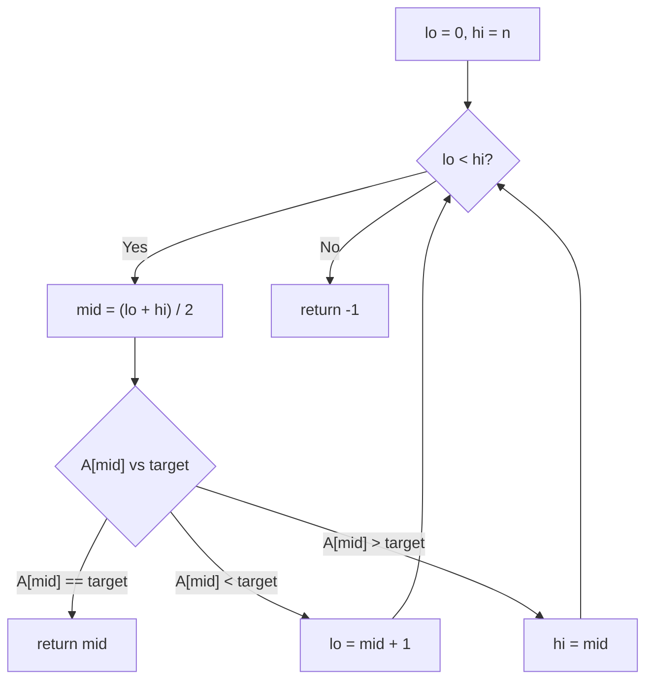
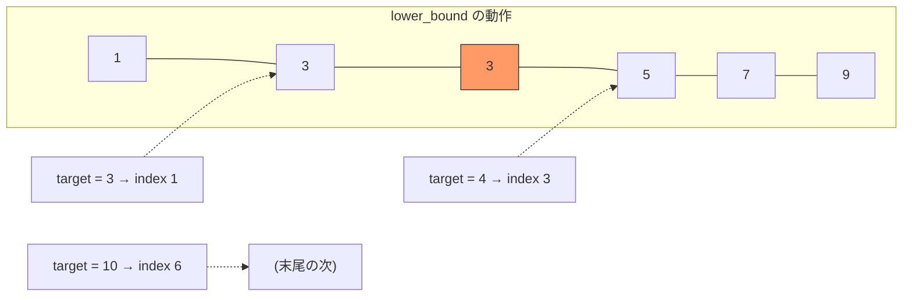
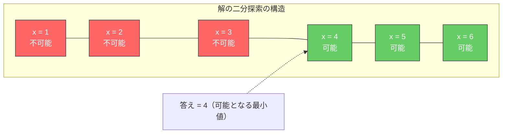
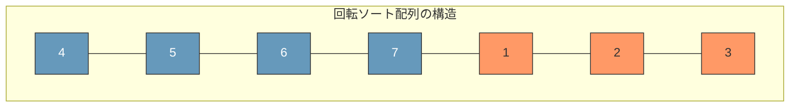
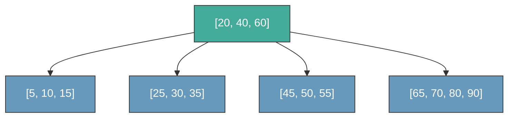
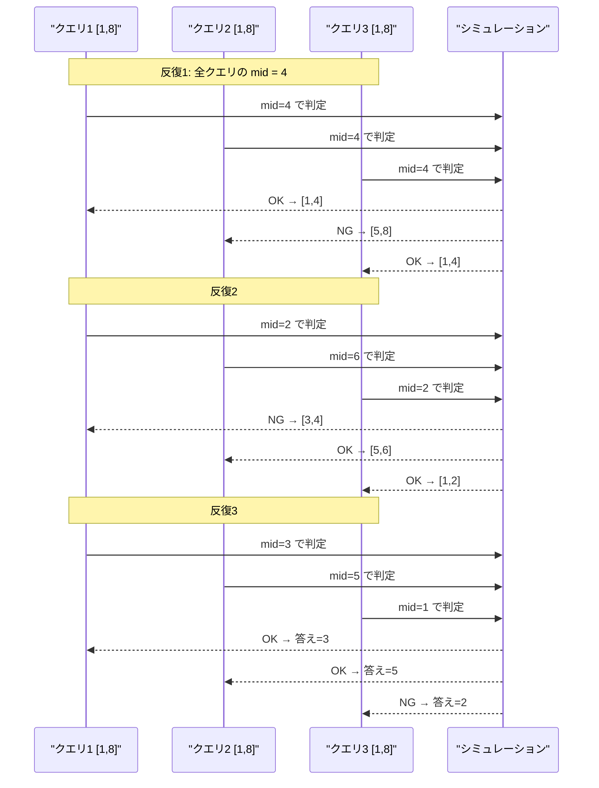
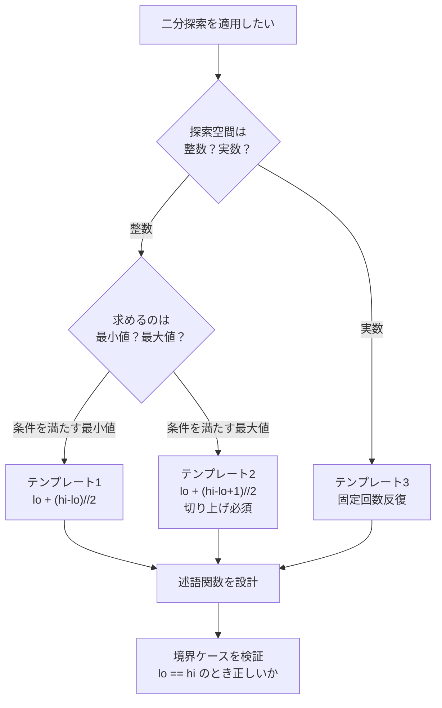

# 二分探索の応用と実装テクニック

## 1. 二分探索の基本

### 1.1 なぜ二分探索なのか

ソートされたデータから特定の要素を見つけ出す――この一見すると単純な問題は、計算機科学における最も基本的かつ実用的な問題の一つである。線形探索（linear search）では $n$ 個のデータに対して最悪 $O(n)$ の比較が必要だが、二分探索（binary search）はこれを $O(\log n)$ に削減する。

$n = 10^9$（10億）のとき、線形探索は最悪10億回の比較を必要とするが、二分探索ではわずか $\lceil \log_2 10^9 \rceil = 30$ 回で済む。この圧倒的な効率の差は、二分探索が**対数的に探索空間を縮小する**という本質的な性質に由来する。

### 1.2 二分探索の着想

二分探索の基本的なアイデアは、辞書を引く行為に例えられる。辞書の中央付近のページを開き、目的の単語がそのページより前にあるか後ろにあるかを判断し、半分の範囲を捨てる。これを繰り返すことで、目的の単語に素早く到達する。

形式的に述べると、ソート済み配列 $A[0..n-1]$ において目標値 $t$ を探索する場合、以下の不変条件を維持しながら探索範囲を半分に狭めていく。

> **不変条件**: 目標値 $t$ が配列中に存在するならば、それは現在の探索範囲 $[lo, hi)$ の中にある。

各ステップで中央のインデックス $mid = \lfloor (lo + hi) / 2 \rfloor$ を計算し、$A[mid]$ と $t$ を比較する。

- $A[mid] = t$ ならば探索成功
- $A[mid] < t$ ならば $lo = mid + 1$ として左半分を棄却
- $A[mid] > t$ ならば $hi = mid$ として右半分を棄却



### 1.3 計算量の分析

二分探索の各ステップで探索範囲は半分になる。初期範囲が $n$ であるとき、$k$ 回の比較後の探索範囲は $n / 2^k$ である。探索が終了する条件は $n / 2^k \leq 1$ であるから、

$$
k \geq \log_2 n
$$

したがって最悪比較回数は $\lceil \log_2 n \rceil$ であり、時間計算量は $O(\log n)$ となる。

情報理論的な観点からも、この結果は自然である。$n$ 個の候補から1つの要素を特定するには最低 $\lceil \log_2 n \rceil$ ビットの情報が必要であり、各比較（2値の判定）で得られる情報は高々1ビットである。二分探索は各比較で正確に1ビットの情報を獲得するため、**情報理論的に最適**な探索アルゴリズムである。

### 1.4 基本的な実装

最も素直な二分探索の実装を以下に示す。

```python
def binary_search(arr: list[int], target: int) -> int:
    """Return index of target in sorted arr, or -1 if not found."""
    lo, hi = 0, len(arr)
    while lo < hi:
        mid = lo + (hi - lo) // 2  # avoid integer overflow
        if arr[mid] == target:
            return mid
        elif arr[mid] < target:
            lo = mid + 1
        else:
            hi = mid
    return -1
```

`mid = lo + (hi - lo) // 2` という計算式は、`(lo + hi) // 2` で発生しうる整数オーバーフローを回避するためのイディオムである。Python では任意精度整数があるためオーバーフローは発生しないが、C/C++ や Java では `lo + hi` が `int` の最大値を超えうるため、この書き方が定石となっている。Java では 2006 年に公開された Joshua Bloch の有名なブログ記事「Extra, Extra — Read All About It: Nearly All Binary Searches and Mergesorts are Broken」で、この問題が広く知られるようになった。

## 2. 境界条件の罠（off-by-one）

### 2.1 二分探索はなぜバグりやすいのか

Jon Bentley は著書 *Programming Pearls* において、プロのプログラマにソートされた配列の二分探索を実装させたところ、約90%の人がバグのあるコードを書いたと報告している。Donald Knuth も二分探索について「アイデアは単純だが、正しく実装するのは驚くほど難しい」と述べている。

二分探索のバグの大半は**境界条件**（off-by-one error）に起因する。具体的には以下の選択肢の組み合わせが、正しさに直結する。

| 設計選択 | 選択肢 A | 選択肢 B |
|----------|----------|----------|
| 探索範囲 | $[lo, hi]$（閉区間） | $[lo, hi)$（半開区間） |
| ループ条件 | `lo <= hi` | `lo < hi` |
| 左更新 | `lo = mid + 1` | `lo = mid` |
| 右更新 | `hi = mid - 1` | `hi = mid` |

### 2.2 閉区間スタイル vs 半開区間スタイル

二分探索の実装には、探索範囲を**閉区間** $[lo, hi]$ で表すスタイルと、**半開区間** $[lo, hi)$ で表すスタイルの2つの流儀がある。

**閉区間スタイル** $[lo, hi]$:

```python
def binary_search_closed(arr: list[int], target: int) -> int:
    """Closed interval style: [lo, hi]"""
    lo, hi = 0, len(arr) - 1
    while lo <= hi:           # valid range: lo <= hi
        mid = lo + (hi - lo) // 2
        if arr[mid] == target:
            return mid
        elif arr[mid] < target:
            lo = mid + 1      # exclude mid from left
        else:
            hi = mid - 1      # exclude mid from right
    return -1
```

**半開区間スタイル** $[lo, hi)$:

```python
def binary_search_half_open(arr: list[int], target: int) -> int:
    """Half-open interval style: [lo, hi)"""
    lo, hi = 0, len(arr)
    while lo < hi:            # valid range: lo < hi
        mid = lo + (hi - lo) // 2
        if arr[mid] == target:
            return mid
        elif arr[mid] < target:
            lo = mid + 1      # exclude mid from left
        else:
            hi = mid          # hi is exclusive, so mid is excluded
    return -1
```

半開区間スタイルには以下の利点がある。

1. **範囲の長さ**が `hi - lo` で直接得られる（閉区間では `hi - lo + 1`）
2. **空区間**を `lo == hi` で自然に表現できる
3. C++ STL の `begin()`/`end()` や Python のスライス `arr[lo:hi]` と一貫性がある

本記事では以降、特に断りがない限り半開区間スタイルを用いる。

### 2.3 off-by-one の典型的パターン

off-by-one エラーの典型的なパターンを整理する。

**パターン1: 無限ループ**

```python
# BUG: infinite loop when arr[mid] > target
lo, hi = 0, len(arr) - 1
while lo < hi:
    mid = lo + (hi - lo) // 2
    if arr[mid] < target:
        lo = mid + 1
    else:
        hi = mid - 1  # should be hi = mid in half-open style
```

`lo = 0, hi = 1` のとき `mid = 0` となり、`arr[0] >= target` であれば `hi = -1` となって `lo > hi` にスキップしてしまう。閉区間の更新規則と半開区間のループ条件が混在している。

**パターン2: 要素の見落とし**

```python
# BUG: may miss the last element
lo, hi = 0, len(arr)
while lo < hi:
    mid = lo + (hi - lo) // 2
    if arr[mid] < target:
        lo = mid  # should be lo = mid + 1
    else:
        hi = mid
```

`lo = 3, hi = 4` のとき `mid = 3` となり、`arr[3] < target` であれば `lo = 3` のまま変わらず無限ループに陥る。

### 2.4 正しさを保証するための指針

off-by-one エラーを防ぐための指針をまとめる。

1. **区間の表現方法を最初に決め、一貫して使う**
2. **ループ不変条件を明示的に書く**（コメントとして残す）
3. **ループが必ず終了すること**を確認する（各反復で `hi - lo` が厳密に減少するか）
4. **要素数が0, 1, 2の場合**を手動でトレースして検証する

## 3. lower_bound / upper_bound

### 3.1 「見つかった/見つからない」の先にある問い

基本的な二分探索は「配列中に目標値が存在するか」を答える。しかし、実務では「目標値以上の最小の要素はどこか」「目標値より大きい最初の要素はどこか」といった問いの方がはるかに多い。これらの問いに答えるのが **`lower_bound`** と **`upper_bound`** である。

### 3.2 lower_bound

`lower_bound(arr, target)` は、ソート済み配列 `arr` において `target` **以上**の最初の要素の位置を返す。言い換えると、`target` を挿入してもソート順が保たれる最も左の位置を返す。

形式的には、以下を満たす最小の $i$ を求める。

$$
\text{lower\_bound}(A, t) = \min \{ i \mid A[i] \geq t \}
$$

該当する要素がなければ $n$（配列の長さ）を返す。

```python
def lower_bound(arr: list[int], target: int) -> int:
    """Return the leftmost index where target could be inserted."""
    lo, hi = 0, len(arr)
    while lo < hi:
        mid = lo + (hi - lo) // 2
        if arr[mid] < target:
            lo = mid + 1  # arr[mid] is too small, exclude it
        else:
            hi = mid      # arr[mid] >= target, it may be the answer
    return lo
```

ここでの不変条件は以下の通りである。

> **不変条件**: $A[0..lo-1]$ のすべての要素は $target$ より小さく、$A[hi..n-1]$ のすべての要素は $target$ 以上である。



### 3.3 upper_bound

`upper_bound(arr, target)` は、ソート済み配列 `arr` において `target` **より大きい**最初の要素の位置を返す。

$$
\text{upper\_bound}(A, t) = \min \{ i \mid A[i] > t \}
$$

```python
def upper_bound(arr: list[int], target: int) -> int:
    """Return the leftmost index where element > target."""
    lo, hi = 0, len(arr)
    while lo < hi:
        mid = lo + (hi - lo) // 2
        if arr[mid] <= target:
            lo = mid + 1  # arr[mid] is not greater, exclude it
        else:
            hi = mid      # arr[mid] > target, it may be the answer
    return lo
```

`lower_bound` との違いは、条件分岐が `<` から `<=` に変わっただけである。この微小な差が、重複要素が存在する場合に決定的な違いを生む。

### 3.4 lower_bound と upper_bound の関係

`lower_bound` と `upper_bound` を組み合わせることで、多くの問いに答えられる。

| 問い | 計算方法 |
|------|----------|
| `target` の出現回数 | `upper_bound(arr, target) - lower_bound(arr, target)` |
| `target` が存在するか | `lower_bound(arr, target) < n` かつ `arr[lower_bound(arr, target)] == target` |
| `target` 以下の最大の要素の位置 | `upper_bound(arr, target) - 1` |
| `target` 未満の要素数 | `lower_bound(arr, target)` |

C++ の STL は `std::lower_bound` と `std::upper_bound` をまさにこの意味で提供しており、`std::equal_range` はこの2つを同時に返す。

### 3.5 述語関数による一般化

`lower_bound` と `upper_bound` は、より一般的な枠組みで統一的に捉えることができる。ソート済み配列に対する二分探索は、本質的には**単調な述語関数**（monotone predicate）の境界点を見つける問題である。

述語関数 $P(i)$ が以下を満たすとする。

$$
P(i) = \begin{cases} \text{false} & (i < k) \\ \text{true} & (i \geq k) \end{cases}
$$

このとき、$P(i)$ が `false` から `true` に切り替わる最初のインデックス $k$ を見つけるのが二分探索の一般形である。

```python
def bisect(lo: int, hi: int, predicate) -> int:
    """Find the smallest i in [lo, hi) where predicate(i) is True.

    Assumes predicate is monotone: False...False True...True
    """
    while lo < hi:
        mid = lo + (hi - lo) // 2
        if predicate(mid):
            hi = mid
        else:
            lo = mid + 1
    return lo
```

この一般化された形を理解すると、あらゆる二分探索の問題を同じテンプレートで解けるようになる。

- `lower_bound(arr, t)` は `predicate = lambda i: arr[i] >= t`
- `upper_bound(arr, t)` は `predicate = lambda i: arr[i] > t`

## 4. 実数値に対する二分探索

### 4.1 整数から実数への拡張

これまでの二分探索は離散的な整数インデックス上で動作していたが、二分探索の原理は連続的な実数空間にも適用できる。典型的な応用として、**方程式の根（零点）の近似計算**がある。

連続関数 $f(x)$ が区間 $[a, b]$ 上で $f(a) < 0$ かつ $f(b) > 0$ を満たすとき、中間値の定理により $f(c) = 0$ なる $c \in (a, b)$ が存在する。二分法（bisection method）はこの $c$ を二分探索で近似する。

```python
def bisection_method(f, lo: float, hi: float, eps: float = 1e-9) -> float:
    """Find root of f in [lo, hi] using bisection method.

    Assumes f(lo) < 0 and f(hi) > 0.
    """
    for _ in range(100):  # sufficient iterations for double precision
        mid = (lo + hi) / 2
        if f(mid) < 0:
            lo = mid
        else:
            hi = mid
    return (lo + hi) / 2
```

### 4.2 収束速度の分析

$k$ 回の反復後、探索区間の幅は $(b - a) / 2^k$ となる。`float64`（倍精度浮動小数点数）の有効桁数は約15〜16桁であるから、区間幅が初期値から $10^{-15}$ 倍程度になれば十分な精度が得られる。

$$
\frac{b - a}{2^k} \leq \varepsilon \implies k \geq \log_2 \frac{b - a}{\varepsilon}
$$

初期区間幅が $1$ で $\varepsilon = 10^{-9}$ の場合、$k \geq \log_2 10^9 \approx 30$ 回で十分である。実用上は50〜100回の固定回数で反復を打ち切ることが多い。

### 4.3 終了条件の注意点

実数値の二分探索では、終了条件に `while hi - lo > eps` を使いたくなるが、これには注意が必要である。

```python
# CAUTION: may loop forever if lo and hi are very large
while hi - lo > 1e-9:
    mid = (lo + hi) / 2
    ...
```

浮動小数点数の精度は**相対的**であるため、$lo$ と $hi$ が大きい値（例えば $10^{15}$）のとき、`hi - lo` が $10^{-9}$ 未満になることはありえない。なぜなら、`float64` は $10^{15}$ 付近で最小の表現可能な差が約 $0.125$ だからである。

安全な終了条件は以下のいずれかである。

1. **固定回数の反復**: `for _ in range(100)` — 最も確実
2. **相対誤差の使用**: `while (hi - lo) / max(1, abs(lo)) > eps`

### 4.4 実数値二分探索の応用例：平方根の計算

$\sqrt{x}$ を二分探索で求める例を示す。

$$
f(m) = m^2 - x
$$

として、$f(m) = 0$ となる $m$ を探す。

```python
def sqrt_bisect(x: float) -> float:
    """Compute square root of x using bisection."""
    if x < 0:
        raise ValueError("Cannot compute square root of negative number")
    lo, hi = 0.0, max(1.0, x)
    for _ in range(100):
        mid = (lo + hi) / 2
        if mid * mid < x:
            lo = mid
        else:
            hi = mid
    return (lo + hi) / 2
```

`hi` の初期値を `max(1.0, x)` としているのは、$0 < x < 1$ のとき $\sqrt{x} > x$ となるためである。

## 5. 解の二分探索（Binary Search on Answer）

### 5.1 パラダイムの転換

二分探索の最も強力な応用の一つが、**解の二分探索**（Binary Search on Answer / Parametric Search）である。これは「最適値を直接求める」のではなく、「ある値が実現可能かどうかを判定する」問題に変換し、その判定問題に対して二分探索を適用するテクニックである。

この手法が適用できる問題は、以下の構造を持つ。

> 「ある条件を満たす $x$ の最小値（または最大値）を求めよ」

ここで、$x$ に関して条件の真偽が**単調**であること（つまり、$x = k$ で条件が満たされるなら $x > k$ でも満たされる、あるいはその逆）が必要である。



### 5.2 例題1：最小の最大値（Minimum Maximum）

> $n$ 個の荷物（重さ $w_1, w_2, \ldots, w_n$）を $k$ 台のトラックに分配する。各トラックの積載量の最大値を最小化せよ。荷物は連続した区間で分配しなければならない。

この問題を直接解くのは難しいが、「各トラックの積載量上限を $C$ としたとき、$k$ 台以内で全荷物を運べるか？」という判定問題は貪欲法で $O(n)$ で解ける。

```python
def can_distribute(weights: list[int], k: int, capacity: int) -> bool:
    """Check if weights can be split into at most k groups,
    each with total weight <= capacity."""
    trucks = 1
    current_load = 0
    for w in weights:
        if w > capacity:
            return False  # single item exceeds capacity
        if current_load + w > capacity:
            trucks += 1
            current_load = 0
        current_load += w
    return trucks <= k

def min_max_load(weights: list[int], k: int) -> int:
    """Find the minimum possible maximum truck load."""
    lo = max(weights)         # at least the heaviest item
    hi = sum(weights) + 1     # at most all items in one truck
    while lo < hi:
        mid = lo + (hi - lo) // 2
        if can_distribute(weights, k, mid):
            hi = mid          # mid is feasible, try smaller
        else:
            lo = mid + 1      # mid is not enough, try larger
    return lo
```

全体の計算量は $O(n \log S)$ となる（$S$ は重さの合計）。これは、判定関数の $O(n)$ に二分探索の $O(\log S)$ を掛けたものである。

### 5.3 例題2：K番目の値

> $n \times n$ の乗算表（$i$ 行 $j$ 列の要素が $i \times j$）において、全要素を昇順に並べたときの $K$ 番目の値を求めよ。

$n^2$ 個の要素を実際にソートすると $O(n^2 \log n)$ かかるが、解の二分探索を使えば $O(n \log n)$ で解ける。

「乗算表中に $x$ 以下の要素がいくつあるか」を $O(n)$ で計算できる。

$$
\text{count}(x) = \sum_{i=1}^{n} \min\left(\left\lfloor \frac{x}{i} \right\rfloor, n\right)
$$

$\text{count}(x) \geq K$ となる最小の $x$ が答えである。

```python
def kth_in_multiplication_table(n: int, k: int) -> int:
    """Find k-th smallest value in n x n multiplication table."""
    def count_le(x: int) -> int:
        """Count how many entries in the table are <= x."""
        total = 0
        for i in range(1, n + 1):
            total += min(x // i, n)
        return total

    lo, hi = 1, n * n + 1
    while lo < hi:
        mid = lo + (hi - lo) // 2
        if count_le(mid) >= k:
            hi = mid
        else:
            lo = mid + 1
    return lo
```

### 5.4 解の二分探索を適用するための条件

解の二分探索が適用できるための条件を整理する。

1. **単調性**: 解の候補 $x$ に対して、判定関数 $f(x)$ が単調（`false...false true...true` または `true...true false...false`）であること
2. **効率的な判定**: 判定関数が元の問題を直接解くよりも効率的に計算できること
3. **探索範囲の有界性**: 解の上限と下限が既知であること

この条件さえ満たせば、最適化問題を判定問題に帰着させることで、広範な問題に二分探索を適用できる。

## 6. 回転ソート配列の探索

### 6.1 問題設定

ソート済み配列を任意の位置で「回転」させた配列において、特定の要素を $O(\log n)$ で探索する問題は、二分探索の応用問題として頻出する。

回転ソート配列とは、元のソート済み配列 $[1, 2, 3, 4, 5, 6, 7]$ を位置3で回転させた $[4, 5, 6, 7, 1, 2, 3]$ のような配列である。

```
元の配列:     [1, 2, 3, 4, 5, 6, 7]
                        ↓ 位置3で回転
回転後の配列: [4, 5, 6, 7, 1, 2, 3]
                          ↑ ピボット
```

回転ソート配列は、実質的にはソート済みの2つの部分配列が連結されたものである。



### 6.2 最小値の探索

まず、回転のピボット（最小値の位置）を二分探索で見つける。

```python
def find_min_in_rotated(arr: list[int]) -> int:
    """Find the minimum element in a rotated sorted array (no duplicates)."""
    lo, hi = 0, len(arr) - 1
    while lo < hi:
        mid = lo + (hi - lo) // 2
        if arr[mid] > arr[hi]:
            lo = mid + 1  # min is in the right half
        else:
            hi = mid      # min is in the left half (including mid)
    return arr[lo]
```

ここでの核心は、`arr[mid]` と `arr[hi]` の比較である。

- `arr[mid] > arr[hi]` ならば、ピボット（最小値）は `mid` より右にある（`mid` と `hi` の間で配列が「折れている」）
- `arr[mid] <= arr[hi]` ならば、`mid` から `hi` の区間はソート済みであり、ピボットは `mid` 以左にある

### 6.3 特定の要素の探索

ピボットの位置がわかれば、どちらの部分配列に対して通常の二分探索を適用すればよいかが判定できる。しかし、1回のパスで直接探索することも可能である。

```python
def search_in_rotated(arr: list[int], target: int) -> int:
    """Search for target in a rotated sorted array (no duplicates)."""
    lo, hi = 0, len(arr) - 1
    while lo <= hi:
        mid = lo + (hi - lo) // 2
        if arr[mid] == target:
            return mid

        if arr[lo] <= arr[mid]:
            # left half [lo..mid] is sorted
            if arr[lo] <= target < arr[mid]:
                hi = mid - 1
            else:
                lo = mid + 1
        else:
            # right half [mid..hi] is sorted
            if arr[mid] < target <= arr[hi]:
                lo = mid + 1
            else:
                hi = mid - 1
    return -1
```

各ステップで、左半分と右半分のどちらがソート済みかを判定し、ソート済みの半分に `target` が含まれるかを確認する。含まれていればそちらに探索範囲を絞り、含まれていなければ反対側に進む。

### 6.4 重複要素がある場合

配列に重複要素がある場合、最悪計算量が $O(n)$ に退化しうる。例えば `[1, 1, 1, 1, 1, 0, 1]` のような配列では、`arr[lo] == arr[mid] == arr[hi]` となり、どちらの半分にピボットがあるかを判定できない。

```python
def search_in_rotated_with_dups(arr: list[int], target: int) -> bool:
    """Search in rotated sorted array with possible duplicates."""
    lo, hi = 0, len(arr) - 1
    while lo <= hi:
        mid = lo + (hi - lo) // 2
        if arr[mid] == target:
            return True

        if arr[lo] == arr[mid] == arr[hi]:
            lo += 1       # cannot determine which half is sorted
            hi -= 1       # shrink both ends
        elif arr[lo] <= arr[mid]:
            if arr[lo] <= target < arr[mid]:
                hi = mid - 1
            else:
                lo = mid + 1
        else:
            if arr[mid] < target <= arr[hi]:
                lo = mid + 1
            else:
                hi = mid - 1
    return False
```

`arr[lo] == arr[mid] == arr[hi]` の場合に `lo += 1; hi -= 1` とすることで、少なくとも情報量のない端を除去する。最悪ケースでは全要素が同一値の場合に $O(n)$ となるが、平均的には $O(\log n)$ が期待できる。

## 7. 二分探索とデータベースインデックス

### 7.1 B-Tree と二分探索

データベースの根幹技術である **B-Tree**（および B+Tree）インデックスは、二分探索の原理を多分岐木に拡張したものである。B-Tree の各ノードは複数のキーを持ち、そのノード内での探索には二分探索が使われる。



B-Tree の探索では、まずルートノードのキー配列 `[20, 40, 60]` に対して二分探索を行い、次にたどるべき子ノードを決定する。例えば `target = 30` であれば、$20 < 30 < 40$ より2番目の子ノード `[25, 30, 35]` に進む。

各ノードの分岐数（order）を $B$ とすると、$n$ 個のキーを持つ B-Tree の高さは $O(\log_B n)$ であり、各ノード内の二分探索は $O(\log B)$ である。したがって全体の計算量は以下のようになる。

$$
O(\log_B n \cdot \log B) = O\left(\frac{\log n}{\log B} \cdot \log B\right) = O(\log n)
$$

計算量のオーダーは通常の二分探索と同じだが、B-Tree の真の利点はディスク I/O の回数にある。ディスク上のデータアクセスではランダムアクセスのレイテンシが支配的であるため、1回のディスクアクセスでなるべく多くの情報を読み込むことが重要である。B-Tree はノードサイズをディスクのページサイズ（通常4〜16KB）に合わせることで、木の高さ（= ディスクアクセス回数）を最小化する。

### 7.2 データベースクエリにおける二分探索の現れ

SQL の `WHERE` 句やインデックスの走査における二分探索の対応関係を示す。

| SQL 操作 | 二分探索の対応 |
|----------|--------------|
| `WHERE x = 5` | 等値探索（基本的な二分探索） |
| `WHERE x >= 5` | `lower_bound(5)` からリーフの走査 |
| `WHERE x > 5` | `upper_bound(5)` からリーフの走査 |
| `WHERE x BETWEEN 3 AND 7` | `lower_bound(3)` から `upper_bound(7)` までの範囲走査 |
| `ORDER BY x LIMIT 1` | B-Tree の最左リーフ |

### 7.3 インデックスの選択とコストモデル

データベースのクエリオプティマイザは、インデックススキャン（二分探索 + 範囲走査）とフルテーブルスキャン（線形探索）のどちらが効率的かを判断する。一般的な指標として**選択率**（selectivity）が用いられる。

$$
\text{selectivity} = \frac{\text{条件に合致するタプル数}}{\text{全タプル数}}
$$

選択率が小さい（少数のタプルだけが合致する）場合はインデックススキャンが有利であり、選択率が大きい（多数のタプルが合致する）場合はフルテーブルスキャンの方が効率的である場合がある。これは、インデックススキャンではリーフノードからヒープへのランダムアクセスが発生するためである。

閾値はシステムやデータの物理的配置に依存するが、経験的には選択率が5〜20%程度を超えるとフルテーブルスキャンが有利になることが多い。

## 8. 並列二分探索

### 8.1 動機と問題設定

**並列二分探索**（Parallel Binary Search）は、複数のクエリに対してそれぞれ独立に二分探索を行う必要がある場合に、それらをまとめて効率的に処理するテクニックである。

典型的な問題設定は以下のような形を取る。

> 時刻 $1, 2, \ldots, T$ に操作が行われる。$Q$ 個のクエリがあり、各クエリ $q_i$ は「ある条件が初めて満たされるのは何回目の操作の後か？」を問う。

各クエリを独立に二分探索すると、1つのクエリあたり $O(\log T)$ 回の判定が必要で、判定1回あたり $O(T)$ の処理が必要だとすると、全体で $O(Q \cdot T \log T)$ となる。

並列二分探索ではこれを $O((Q + T) \log T)$ 程度に改善できる。

### 8.2 アルゴリズムの概要

並列二分探索の基本的なアイデアは以下の通りである。

1. 各クエリ $q_i$ に対して、探索範囲 $[lo_i, hi_i]$ を管理する
2. 各反復で、全クエリの $mid_i = (lo_i + hi_i) / 2$ を計算する
3. 時刻順に操作を適用しながら、各 $mid_i$ の時点での判定を同時に行う
4. 判定結果に基づいて各クエリの探索範囲を更新する
5. すべてのクエリの探索範囲が収束するまで繰り返す



### 8.3 実装の骨格

```python
def parallel_binary_search(
    n_queries: int,
    n_operations: int,
    apply_operation,   # apply_operation(t) applies operation at time t
    undo_operation,    # undo_operation(t) undoes operation at time t
    check_query,       # check_query(q) checks if query q is satisfied
):
    """Parallel binary search framework.

    Returns: list of answers, one per query.
    """
    lo = [0] * n_queries
    hi = [n_operations] * n_queries
    ans = [n_operations] * n_queries

    for _ in range(n_operations.bit_length() + 1):
        # Group queries by their current mid value
        mid_groups: dict[int, list[int]] = {}
        for q in range(n_queries):
            if lo[q] <= hi[q]:
                mid = (lo[q] + hi[q]) // 2
                mid_groups.setdefault(mid, []).append(q)

        if not mid_groups:
            break

        # Process operations in order, checking queries at their mid points
        state_reset()
        for t in range(n_operations):
            apply_operation(t)
            if t in mid_groups:
                for q in mid_groups[t]:
                    if check_query(q):
                        ans[q] = t
                        hi[q] = (lo[q] + hi[q]) // 2 - 1
                    else:
                        lo[q] = (lo[q] + hi[q]) // 2 + 1

    return ans
```

### 8.4 計算量

二分探索の反復回数は $O(\log T)$ であり、各反復で $T$ 個の操作を順に適用する。したがって全体の計算量は以下となる。

$$
O((T + Q) \log T)
$$

各クエリを独立に二分探索する $O(Q \cdot T \log T)$ と比較すると、$Q$ が大きい場合に大幅な高速化となる。

### 8.5 適用例：動的連結性

並列二分探索の典型的な応用として、動的なグラフに辺が追加される過程で「各頂点対が初めて連結になる時刻」を求める問題がある。Union-Find（素集合データ構造）を用いると、各操作の適用は $O(\alpha(n))$（逆アッカーマン関数、実質定数）で行える。$Q$ 個のクエリを並列二分探索で処理すると、全体で $O((T + Q) \cdot \alpha(n) \cdot \log T)$ となる。

## 9. 実装パターンの整理

### 9.1 二分探索のテンプレート体系

これまでに見てきた様々な二分探索の変種を、統一的なテンプレートとして整理する。

::: tip 二分探索の黄金テンプレート
すべての二分探索は、「単調な述語関数の境界を見つける」問題に帰着できる。
:::

**テンプレート1: 整数上の二分探索（述語が true になる最小値）**

```python
def binary_search_min_true(lo: int, hi: int, predicate) -> int:
    """Find the smallest x in [lo, hi) where predicate(x) is True.

    Invariant: predicate is False for all x < answer, True for all x >= answer.
    Returns hi if predicate is always False.
    """
    while lo < hi:
        mid = lo + (hi - lo) // 2
        if predicate(mid):
            hi = mid      # mid might be the answer
        else:
            lo = mid + 1  # mid is definitely not the answer
    return lo
```

**テンプレート2: 整数上の二分探索（述語が true になる最大値）**

```python
def binary_search_max_true(lo: int, hi: int, predicate) -> int:
    """Find the largest x in (lo, hi] where predicate(x) is True.

    Invariant: predicate is True for all x <= answer, False for all x > answer.
    Returns lo if predicate is always False.
    """
    while lo < hi:
        mid = lo + (hi - lo + 1) // 2  # round up to avoid infinite loop
        if predicate(mid):
            lo = mid      # mid might be the answer
        else:
            hi = mid - 1  # mid is definitely not the answer
    return lo
```

::: warning 切り上げ除算に注意
テンプレート2では `mid = lo + (hi - lo + 1) // 2`（切り上げ）を使う。切り捨ての場合、`lo = mid` で `lo` が変化しないケースが発生し、無限ループに陥る。
:::

**テンプレート3: 実数上の二分探索**

```python
def binary_search_real(lo: float, hi: float, predicate, iterations: int = 100) -> float:
    """Find the boundary point in [lo, hi] where predicate changes.

    Predicate changes from False to True (or True to False) at the boundary.
    """
    for _ in range(iterations):
        mid = (lo + hi) / 2
        if predicate(mid):
            hi = mid
        else:
            lo = mid
    return (lo + hi) / 2
```

### 9.2 テンプレート選択のフローチャート



### 9.3 各言語の標準ライブラリ

主要なプログラミング言語の標準ライブラリにおける二分探索の提供状況を整理する。

| 言語 | 関数/メソッド | 動作 |
|------|-------------|------|
| C++ | `std::lower_bound(first, last, value)` | `value` 以上の最初の位置 |
| C++ | `std::upper_bound(first, last, value)` | `value` より大きい最初の位置 |
| C++ | `std::binary_search(first, last, value)` | 存在判定（`bool`） |
| Python | `bisect.bisect_left(a, x)` | `lower_bound` 相当 |
| Python | `bisect.bisect_right(a, x)` | `upper_bound` 相当 |
| Java | `Arrays.binarySearch(a, key)` | インデックス or 挿入点 |
| Java | `Collections.binarySearch(list, key)` | インデックス or 挿入点 |
| Go | `sort.Search(n, f)` | 述語ベースの汎用二分探索 |
| Rust | `slice.binary_search(&value)` | `Result<usize, usize>` |

::: details Go の sort.Search の特徴
Go の `sort.Search` は本記事で述べた「述語関数による一般化」に最も忠実な API 設計である。述語関数 `f(i) bool` を受け取り、`f(i)` が `true` となる最小の `i` を返す。これは本記事のテンプレート1そのものである。

```go
// Find the smallest index i where arr[i] >= target
idx := sort.Search(len(arr), func(i int) bool {
    return arr[i] >= target
})
```
:::

### 9.4 よくある間違いチェックリスト

実装時に確認すべきチェックリストを以下にまとめる。

| チェック項目 | 確認方法 |
|-------------|---------|
| 整数オーバーフロー | `mid = lo + (hi - lo) / 2` を使っているか |
| 無限ループ | 各反復で `hi - lo` が厳密に減少するか |
| 空配列 | `lo == hi` の初期状態で正しく動作するか |
| 要素数1 | `lo = 0, hi = 1` でトレースしたか |
| 全要素が同一値 | 正しい位置を返すか |
| 探索範囲外の target | `target < arr[0]` および `target > arr[n-1]` |
| 述語の単調性 | 本当に `false...false true...true` の形か |

### 9.5 二分探索の計算量まとめ

| 問題 | 時間計算量 | 備考 |
|------|----------|------|
| ソート済み配列での探索 | $O(\log n)$ | 情報理論的に最適 |
| lower_bound / upper_bound | $O(\log n)$ | 等値探索と同じ |
| 実数値の二分法 | $O(\log \frac{b-a}{\varepsilon})$ | 1反復で1ビットの精度向上 |
| 解の二分探索 | $O(f(n) \cdot \log S)$ | $f(n)$: 判定関数のコスト、$S$: 解の範囲 |
| 回転ソート配列 | $O(\log n)$ | 重複ありの場合は最悪 $O(n)$ |
| B-Tree 探索 | $O(\log n)$ | ディスク I/O は $O(\log_B n)$ |
| 並列二分探索 | $O((T + Q) \log T)$ | $T$: 操作数、$Q$: クエリ数 |

## 10. まとめと展望

### 10.1 二分探索の本質

二分探索の本質は「探索空間を半分に分割する」という単純な原理にある。しかし、その応用範囲は驚くほど広い。

1. **配列上の探索**: 最も基本的な形。ソート済みデータでの等値検索、範囲検索
2. **境界探索**: `lower_bound` / `upper_bound` による単調述語の境界点の発見
3. **連続空間での求根**: 中間値の定理に基づく実数方程式の数値解法
4. **最適化問題の判定問題への帰着**: 解の二分探索による計算量の大幅な削減
5. **変形データ構造上の探索**: 回転ソート配列のような、標準的でないデータ上での適用
6. **ストレージ層での活用**: B-Tree インデックスによるディスク I/O の最適化
7. **複数クエリの一括処理**: 並列二分探索によるバッチ最適化

### 10.2 関連するアルゴリズムと手法

二分探索を理解した上で、さらに学ぶべき関連手法がある。

**三分探索**（ternary search）は、単峰関数（unimodal function）の極値を求める手法である。探索区間を3等分し、2つの分割点での関数値を比較することで、極値を含まない1/3の区間を排除する。各反復で探索区間が $2/3$ に縮小するため、計算量は $O(\log_{3/2} n)$ であり、二分探索の $O(\log_2 n)$ と定数倍の差しかない。

**指数探索**（exponential search）は、探索範囲の上界が未知の場合に有効な手法である。まず $1, 2, 4, 8, \ldots$ と指数的に範囲を広げて目標値を含む区間を特定し、次にその区間内で二分探索を行う。無限リストや、目標値が先頭付近にある場合に効率的で、計算量は $O(\log k)$（$k$ は目標値の位置）となる。

**補間探索**（interpolation search）は、値の分布に関する情報を利用して、中央ではなくより良い分割点を選ぶ手法である。データが一様分布している場合、期待計算量は $O(\log \log n)$ と非常に高速だが、最悪計算量は $O(n)$ に退化する。

**フラクショナルカスケーディング**（fractional cascading）は、複数のソート済みリストに対して同じ値を探索する際に、リスト間で探索結果を「伝播」させることで、$k$ 個のリストでの探索を $O(k + \log n)$（素朴にやると $O(k \log n)$）に改善する技法である。計算幾何学やデータベースの多次元インデックスで活用される。

### 10.3 実務での心構え

二分探索は基本的なアルゴリズムであるが、その実装は繊細である。以下の心構えが、バグのない実装への近道となる。

1. **テンプレートを暗記するのではなく、不変条件を理解する**。テンプレートの丸暗記は、微妙に異なる変種に対応できなくなる
2. **まず述語関数を設計し、その単調性を確認する**。二分探索の正しさの根拠は述語の単調性にある
3. **境界ケースを必ず手動でトレースする**。要素数0, 1, 2の場合を検証するだけで、大半のバグを防げる
4. **標準ライブラリを活用する**。自前実装よりも、十分にテストされたライブラリ関数を使う方が安全である

二分探索は「知っている」と「正しく実装できる」の間に大きな溝がある稀有なアルゴリズムの一つである。その溝を埋めるのは、原理の深い理解と、境界条件への丁寧な注意に他ならない。
