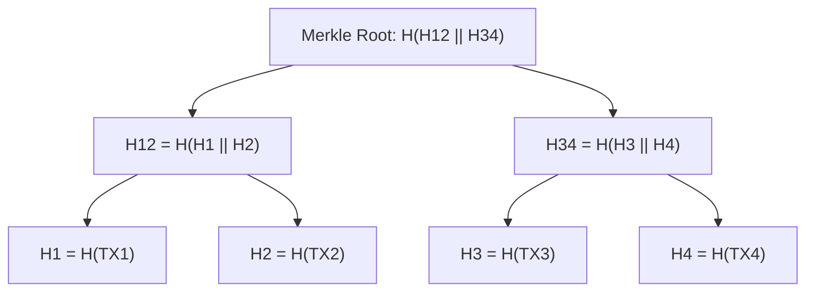
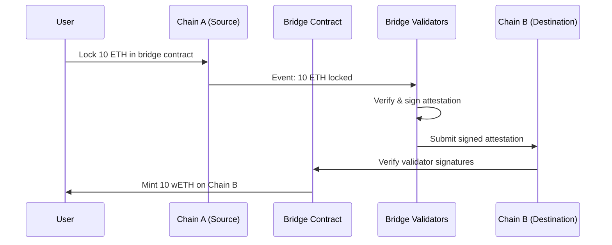

# ブロックチェーンセキュリティ — 暗号経済の信頼基盤を守る技術と実践

## 1. 背景と動機

### 1.1 なぜブロックチェーンセキュリティが重要なのか

ブロックチェーンは「信頼のない環境で信頼を構築する」ための技術として登場した。中央管理者を排除し、暗号学的手法とコンセンサスアルゴリズムによって、参加者間の合意を自律的に形成する。この革命的なアーキテクチャは、金融、サプライチェーン、デジタルアイデンティティなど多くの領域に応用されてきた。

しかし、「コードが法である（Code is Law）」という思想は、同時に深刻なリスクをもたらす。従来の金融システムでは、不正送金が発覚すれば銀行が取り消し処理を行える。しかしブロックチェーン上のトランザクションは原則として不可逆であり、一度実行されたスマートコントラクトの結果を巻き戻すことは、ネットワーク全体のハードフォークでもない限り不可能である。

2024年だけで300件以上のセキュリティインシデントが発生し、14億ドル以上の資産が失われた。アクセス制御の脆弱性が全体の75%を占め、9.53億ドルもの損害をもたらしている。ブリッジ攻撃、スマートコントラクトの脆弱性、秘密鍵の漏洩——これらの脅威は技術の進化とともに巧妙化し続けている。

### 1.2 ブロックチェーンのセキュリティモデル

ブロックチェーンのセキュリティは複数のレイヤーで構成される。

```
+--------------------------------------------------+
|        Application Layer                         |
|  (Smart Contracts, DApps, Wallets)               |
+--------------------------------------------------+
|        Consensus Layer                           |
|  (PoW, PoS, BFT, Block Finality)                |
+--------------------------------------------------+
|        Network Layer                             |
|  (P2P Protocol, Gossip, Eclipse Attack Defense)  |
+--------------------------------------------------+
|        Cryptographic Layer                       |
|  (Hash Functions, Digital Signatures, Merkle Tree)|
+--------------------------------------------------+
```

各レイヤーにはそれぞれ固有の攻撃ベクトルが存在し、一つのレイヤーの安全性が破られると上位レイヤー全体が危険にさらされる。本記事では、暗号学的基盤からアプリケーション層まで、ブロックチェーンセキュリティの全体像を解説する。

## 2. 暗号学的基盤 — ハッシュチェーンとMerkle Tree

### 2.1 ハッシュチェーンによる改ざん検出

ブロックチェーンの最も基本的なセキュリティ機構は、ハッシュ関数による連鎖構造（ハッシュチェーン）である。各ブロックは前のブロックのハッシュ値を含んでおり、これによりチェーン全体の整合性が保証される。

```
Block N-1                   Block N                    Block N+1
+-----------------------+   +-----------------------+   +-----------------------+
| Header                |   | Header                |   | Header                |
|  Prev Hash: 0x3a...  |<--| Prev Hash: 0x7f...    |<--| Prev Hash: 0xb2...    |
|  Merkle Root: 0xd1...|   | Merkle Root: 0xe4...  |   | Merkle Root: 0xa9...  |
|  Nonce: 84729         |   | Nonce: 12045          |   | Nonce: 93847          |
|  Timestamp            |   | Timestamp             |   | Timestamp             |
+-----------------------+   +-----------------------+   +-----------------------+
| Transactions          |   | Transactions          |   | Transactions          |
|  TX1, TX2, TX3...     |   |  TX1, TX2, TX3...     |   |  TX1, TX2, TX3...     |
+-----------------------+   +-----------------------+   +-----------------------+
```

あるブロックのデータを改ざんすると、そのブロックのハッシュ値が変化する。すると次のブロックに記録された「前ブロックのハッシュ」と一致しなくなり、以降のすべてのブロックを再計算する必要が生じる。SHA-256のような暗号学的ハッシュ関数の一方向性と衝突耐性により、この再計算は計算量的に実行不可能である。

具体的には、ブロック $B_i$ のハッシュは次のように計算される。

$$H(B_i) = \text{SHA-256}(\text{PrevHash}_{i-1} \| \text{MerkleRoot}_i \| \text{Nonce}_i \| \text{Timestamp}_i)$$

ブロック $B_k$ を改ざんした場合、$B_k, B_{k+1}, \ldots, B_n$ のすべてのハッシュを再計算しなければならない。Proof of Workの場合、各ブロックでnonce探索が必要となるため、改ざんのコストは $O(n - k)$ 個のブロック分のマイニング作業に相当する。

### 2.2 Merkle Treeによる効率的なデータ検証

Merkle Treeは、大量のトランザクションの整合性を効率的に検証するためのデータ構造である。各トランザクションのハッシュ値をリーフノードとし、隣接するハッシュ値同士を結合してハッシュ化することを繰り返し、最終的に一つのルートハッシュ（Merkle Root）を得る。



Merkle Treeのセキュリティ上の利点は以下の通りである。

**効率的な検証（SPV: Simplified Payment Verification）**: あるトランザクションがブロックに含まれていることを証明するのに、全トランザクションをダウンロードする必要はない。Merkle Proof（認証パス）だけで検証でき、計算量は $O(\log n)$ である。例えばブロック内に4096個のトランザクションがあっても、12個のハッシュ値だけで包含証明が可能となる。

**改ざん検出**: いずれか一つのトランザクションが改ざんされると、そのリーフからMerkle Rootまでの全ハッシュ値が変化する。Merkle Rootはブロックヘッダーに含まれるため、ブロックのハッシュ値も変化し、ハッシュチェーン全体の整合性が崩れる。

## 3. コンセンサスメカニズムのセキュリティ

### 3.1 Proof of Work（PoW）と51%攻撃

Proof of Workは、Bitcoinに採用された最初のコンセンサスメカニズムであり、計算資源を担保とした安全性を提供する。マイナーは次のブロックを生成するために、特定の条件を満たすnonce値を探索する。

$$\text{SHA-256}(\text{BlockHeader} \| \text{Nonce}) < \text{Target}$$

Targetが小さいほど条件を満たすnonce値は見つかりにくく、難易度が高くなる。正直なマイナーは最も長いチェーン（最も累積difficulty が高いチェーン）を正当なチェーンとして採用する。

**51%攻撃の仕組み**: 攻撃者がネットワーク全体のハッシュレートの過半数を支配すると、正直なチェーンよりも速くブロックを生成できるようになる。これにより以下の攻撃が可能となる。

1. **二重支払い（Double Spending）**: 攻撃者はまず正規のチェーンでトランザクションを送信し、相手が確認した後、秘密裏に構築した代替チェーン（そのトランザクションを含まない）を公開する。代替チェーンの方が長ければネットワークに採用され、元のトランザクションは無効化される。

```
Time -->

Honest chain:  [B100] -- [B101] -- [B102] -- [B103]
                  |         ^
                  |         | TX: Alice -> Bob (100 BTC)
                  |
Attacker chain:[B100] -- [B101'] -- [B102'] -- [B103'] -- [B104']
                            ^
                            | TX: Alice -> Alice (100 BTC)
                            |
               Attacker publishes longer chain -> network switches
```

2. **トランザクション検閲**: 特定のアドレスからのトランザクションをブロックに含めないことで、事実上の検閲を実行できる。

3. **マイナー報酬の独占**: すべてのブロック報酬を攻撃者が獲得する。

51%攻撃の経済的コストは、ネットワークのハッシュレートに依存する。Bitcoinのような巨大なネットワークでは、攻撃に必要なハードウェアと電力のコストが天文学的な額に達するため、経済的に非合理的である。しかし、ハッシュレートの低い小規模チェーンでは現実的な脅威となる。

### 3.2 Ethereum Classic 51%攻撃 — 実際の事例

Ethereum Classic（ETC）は、51%攻撃の現実的なリスクを世界に示した代表的な事例である。

**2019年1月の攻撃**: 2回の51%攻撃が発生し、二重支払いが確認された。Coinbaseは約88,500 ETC（当時約46万ドル）の二重支払いを検出し、取引所での入出金を一時停止した。

**2020年8月の連続攻撃**: 最も深刻な攻撃は2020年8月に発生した。

- **第1次攻撃（2020年7月31日）**: 約800,000 ETC（約580万ドル）の二重支払い。攻撃者はNiceHashからハッシュパワーをレンタルし、4日間で4,280ブロックを秘密裏にマイニングした。攻撃コストは約17.5 BTC（約19.2万ドル）と推定され、投資対効果は2,800%を超えた。
- **第2次攻撃（2020年8月5日）**: 約460,000 ETC（約320万ドル）の二重支払い。
- **第3次攻撃**: 同月にさらにもう一度攻撃が発生。

攻撃の手口は明快であった。攻撃者はNiceHashの「daggerhashimoto」プロバイダーからハッシュパワーをレンタルし、ETCネットワークの過半数のハッシュレートを一時的に掌握した。そして自身のウォレットへの送金トランザクションを含むブロックを秘密裏にマイニングし、正規チェーンよりも長くなった時点でネットワークにブロードキャストした。これによりチェーンの再編成（reorg）が発生し、正規チェーンに含まれていたトランザクションが無効化された。

この事件はPoWチェーンの根本的な脆弱性を浮き彫りにした。ハッシュパワーのレンタル市場（NiceHashなど）の存在により、攻撃者は自前でハードウェアを保有せずとも一時的に大量のハッシュパワーを調達できるようになったのである。

### 3.3 Proof of Stake（PoS）のセキュリティ課題

Proof of Stakeは、計算資源の代わりに保有する暗号通貨（ステーク）を担保としてブロック生成権を得るメカニズムである。エネルギー効率は大幅に改善されるが、独自のセキュリティ課題が存在する。

**Nothing-at-Stake問題**: PoWでは、マイニングに物理的な計算資源が必要であるため、フォークが発生した場合にマイナーは一つのチェーンにリソースを集中させるインセンティブがある。しかしPoSでは、バリデーターは複数のフォークに同時に投票しても追加コストが発生しない。なぜなら、ステークはすべてのフォーク上に存在するからである。

```
Fork A:  [Block N] -- [Block N+1a]  <-- Validator votes here
              |
Fork B:  [Block N] -- [Block N+1b]  <-- Validator also votes here (no cost!)
```

この問題により、バリデーターはすべてのフォークに投票する「合理的」な行動を取り、コンセンサスの収束が妨げられる。

**対策 — Slashing**: Ethereumをはじめとする現代のPoSプロトコルは、Slashing（没収）メカニズムによってNothing-at-Stake問題に対処する。バリデーターが矛盾する2つのブロックに署名した場合（equivocation）、ステークの一部または全部が没収される。Ethereumでは、最低でもステークの $1/32$（約1 ETH）が没収され、同時期に多数のバリデーターがSlashingを受けた場合は、没収額が最大で全ステーク（32 ETH）まで増加する。

**Long-Range Attack**: PoSのもう一つの脅威は、過去のバリデーターが古い時点からの代替チェーンを構築するLong-Range Attackである。PoWと異なり、過去のブロック生成に計算コストがかからないため、理論的には遠い過去まで遡って代替履歴を作成できる。

対策としては、チェックポイント（特定のブロックを社会的合意によって確定する）や、Weak Subjectivity（新規参加ノードが最近のチェックポイントを信頼された情報源から取得する）が採用されている。

### 3.4 BFT系コンセンサスのセキュリティ

Byzantine Fault Tolerance（BFT）系コンセンサスアルゴリズムは、ネットワーク参加者の一部が悪意を持って行動（ビザンチン障害）しても、全体として正しい合意に到達できることを保証する。

**PBFT（Practical Byzantine Fault Tolerance）**: $n$ 個のノードのうち、$f$ 個のビザンチンノードが存在する場合、$n \geq 3f + 1$ であればコンセンサスが保証される。すなわち、全ノードの $1/3$ 未満がビザンチンであれば安全である。

$$\text{安全性条件}: f < \frac{n}{3}$$

BFT系の利点はファイナリティ（確定性）にある。PoWでは確率的ファイナリティしか得られない（承認数が増えるほど覆される確率が指数関数的に減少するが、ゼロにはならない）のに対し、BFTでは合意に達した時点で即座にファイナリティが得られる。

一方で、BFT系はノード数の増加に伴う通信量の爆発（$O(n^2)$ のメッセージ複雑度）という制約があり、数百ノード程度が実用的な上限となる。この制約から、パーミッションドブロックチェーン（Hyperledger Fabric、Tendermintなど）で主に採用されている。

## 4. スマートコントラクトの脆弱性

スマートコントラクトは、ブロックチェーン上で自動実行されるプログラムである。一度デプロイされると原則として変更不可能であり、脆弱性が発見されても即座にパッチを適用することができない。この不変性がセキュリティ上の最大のリスク要因となっている。

### 4.1 再入攻撃（Reentrancy Attack）— The DAO事件（2016年）

再入攻撃は、スマートコントラクトセキュリティにおける最も象徴的な脆弱性である。2016年6月17日、The DAOと呼ばれる分散型自律組織がこの脆弱性を突かれ、約360万ETH（当時約6,000万ドル）が窃取された。当時のEthereum全供給量の約5%に相当する額であった。

**攻撃の仕組み**: 再入攻撃は、コントラクトが外部アドレスにEtherを送金する際、送金先のfallback関数（またはreceive関数）が呼び出される仕様を悪用する。送金先が悪意のあるコントラクトであった場合、そのfallback関数内から再び元のコントラクトの引き出し関数を呼び出すことで、残高の更新が行われる前に繰り返し引き出しを実行できる。

**脆弱なコントラクトの例**:

```solidity
// SPDX-License-Identifier: MIT
pragma solidity ^0.8.0;

// VULNERABLE - DO NOT USE IN PRODUCTION
contract VulnerableVault {
    mapping(address => uint256) public balances;

    function deposit() external payable {
        balances[msg.sender] += msg.value;
    }

    function withdraw() external {
        uint256 amount = balances[msg.sender];
        require(amount > 0, "No balance");

        // VULNERABILITY: External call before state update
        (bool success, ) = msg.sender.call{value: amount}("");
        require(success, "Transfer failed");

        // State update happens AFTER external call
        balances[msg.sender] = 0;
    }
}
```

**攻撃コントラクト**:

```solidity
// SPDX-License-Identifier: MIT
pragma solidity ^0.8.0;

// Attacker contract exploiting reentrancy
contract Attacker {
    VulnerableVault public vault;

    constructor(address _vault) {
        vault = VulnerableVault(_vault);
    }

    function attack() external payable {
        vault.deposit{value: msg.value}();
        vault.withdraw();
    }

    // This function is called when the vault sends Ether
    receive() external payable {
        if (address(vault).balance >= 1 ether) {
            vault.withdraw(); // Re-enter the withdraw function
        }
    }
}
```

攻撃の流れは次のようになる。

1. 攻撃者が `attack()` を呼び出し、1 ETHを預金
2. `withdraw()` を呼び出すと、1 ETHの送金処理が開始
3. 送金により攻撃コントラクトの `receive()` が発火
4. `receive()` 内で再び `withdraw()` を呼び出す
5. `balances[msg.sender]` はまだ0に更新されていないため、再び1 ETHが送金される
6. VaultのETH残高が尽きるまで再帰的に繰り返される

**The DAO事件の影響**: この事件はEthereumコミュニティを二分する大議論を引き起こした。最終的にEthereumはハードフォークによって盗まれた資金を取り戻す決定をしたが、これに反対するグループがEthereum Classicとして元のチェーンを維持した。「Code is Law」の理念を貫くか、被害者を救済するかという哲学的対立は、ブロックチェーンのガバナンスに関する根本的な問いを提起した。

### 4.2 整数オーバーフロー/アンダーフロー

Solidityの古いバージョン（0.8.0未満）では、整数演算のオーバーフロー/アンダーフローが自動的にチェックされなかった。符号なし整数 `uint256` の最大値は $2^{256} - 1$ であり、これに1を加えると0に戻る（オーバーフロー）。逆に、0から1を引くと $2^{256} - 1$ になる（アンダーフロー）。

**脆弱なコントラクトの例（Solidity < 0.8.0）**:

```solidity
// SPDX-License-Identifier: MIT
pragma solidity ^0.7.0;

// VULNERABLE - DO NOT USE IN PRODUCTION
contract VulnerableToken {
    mapping(address => uint256) public balances;

    function transfer(address to, uint256 amount) external {
        // VULNERABILITY: Underflow when balances[msg.sender] < amount
        // e.g., 0 - 1 = 2^256 - 1 (massive balance!)
        balances[msg.sender] -= amount;
        balances[to] += amount;
    }
}
```

2018年にはBEC（Beauty Chain）トークンがこの脆弱性を突かれ、天文学的な量のトークンが不正に生成された。攻撃者は `batchTransfer` 関数の乗算オーバーフローを悪用し、実質的に無限のトークンを送金した。

Solidity 0.8.0以降では算術演算のオーバーフロー/アンダーフローチェックがデフォルトで有効化されたが、`unchecked` ブロック内ではチェックがバイパスされるため注意が必要である。

### 4.3 フロントランニングとMEV

フロントランニングは、トランザクションがmempool（未確認トランザクションの待機プール）で公開される仕組みを悪用した攻撃である。攻撃者はmempool内の未確認トランザクションを監視し、有利なトランザクションを先に実行することで利益を得る。

**MEV（Maximal Extractable Value）**: MEVとは、ブロック内のトランザクションの順序を操作することで抽出可能な最大価値のことである。ブロック提案者（マイナーまたはバリデーター）は、ブロック内のトランザクションの順序を自由に決定できるため、この権限を利用して利益を得ることができる。

**サンドイッチ攻撃**: MEVの代表的な手法がサンドイッチ攻撃である。

```
Mempool monitoring:
  Victim's TX: Swap 10 ETH -> TokenA (slippage: 1%)

Attacker's strategy:
  1. Front-run: Buy TokenA (raises price)         -- higher gas fee
  2. Victim's TX: Buy TokenA at inflated price     -- normal gas fee
  3. Back-run: Sell TokenA (at higher price)        -- lower gas fee

Result: Attacker profits from price difference
        Victim gets fewer tokens than expected
```

2024年10月の1か月間だけで、Uniswap V2上で125,829件のサンドイッチ攻撃が発生し、MEV関連のガス手数料は合計789万ドルに達した。Uniswap V2上の2020年5月15日から2024年1月13日までの660万ブロックのうち、90%以上がフロントランニングのリスクにさらされていたという分析もある。

**対策**: Flashbots ProtectやMEV Blockerなどのプライベートトランザクションプールを利用することで、トランザクションを公開mempoolに露出させずにブロックに含めることができる。また、DEXレベルでのスリッページ保護の強化や、バッチオークション方式の採用なども有効な対策である。

### 4.4 アクセス制御の不備

スマートコントラクトにおけるアクセス制御の不備は、2024年に最も大きな被害をもたらした脆弱性カテゴリであり、9.53億ドルの損失を引き起こした。

**脆弱なコントラクトの例**:

```solidity
// SPDX-License-Identifier: MIT
pragma solidity ^0.8.0;

// VULNERABLE - Missing access control
contract VulnerableAdmin {
    address public owner;
    bool public paused;

    constructor() {
        owner = msg.sender;
    }

    // VULNERABILITY: Anyone can call this function
    function setOwner(address newOwner) external {
        owner = newOwner;
    }

    // VULNERABILITY: No access control on critical function
    function withdrawAll() external {
        payable(msg.sender).transfer(address(this).balance);
    }
}
```

**安全なコントラクト**:

```solidity
// SPDX-License-Identifier: MIT
pragma solidity ^0.8.0;

import "@openzeppelin/contracts/access/Ownable.sol";
import "@openzeppelin/contracts/access/AccessControl.sol";

contract SecureAdmin is AccessControl {
    bytes32 public constant ADMIN_ROLE = keccak256("ADMIN_ROLE");
    bytes32 public constant WITHDRAWER_ROLE = keccak256("WITHDRAWER_ROLE");

    constructor() {
        _grantRole(DEFAULT_ADMIN_ROLE, msg.sender);
        _grantRole(ADMIN_ROLE, msg.sender);
        _grantRole(WITHDRAWER_ROLE, msg.sender);
    }

    function withdrawAll() external onlyRole(WITHDRAWER_ROLE) {
        payable(msg.sender).transfer(address(this).balance);
    }

    function pause() external onlyRole(ADMIN_ROLE) {
        // pause logic
    }
}
```

OpenZeppelinの `AccessControl` や `Ownable` コントラクトを継承することで、堅牢なロールベースアクセス制御（RBAC）を実装できる。しかし、Proxyパターンを使用したアップグレーダブルコントラクトでは、初期化関数のアクセス制御にも注意が必要である。`initialize` 関数が誰でも呼び出せる状態のまま放置され、攻撃者がオーナー権限を奪取した事例は複数存在する。

### 4.5 フラッシュローン攻撃

フラッシュローンは、担保なしで巨額の資金を借り入れ、同一トランザクション内で返済することを条件とするDeFi固有の仕組みである。正当な用途（アービトラージ、担保スワップ、自己清算など）がある一方で、攻撃ベクトルとしても悪用されている。

**攻撃の典型的なパターン**:

```
Single Transaction:
  1. Flash loan: Borrow $100M from Aave
  2. Deposit $80M into Protocol X's liquidity pool
  3. Manipulate price oracle (AMM spot price)
  4. Borrow against inflated collateral in Protocol Y
  5. Withdraw borrowed funds from Protocol Y
  6. Remove liquidity from Protocol X
  7. Repay flash loan + fee
  8. Profit: $5M+

Total cost to attacker: Gas fee only (~$50)
```

**主要なフラッシュローン攻撃事例**:

- **Beanstalk Farms（2022年4月）**: 攻撃者はAaveから約10億ドルを借り入れ、Beanstalkのガバナンス投票を操作。議決権を一時的に確保して悪意のあるプロポーザルを可決し、1.82億ドルを窃取した。
- **Euler Finance（2023年3月）**: フラッシュローンを利用してレンディングプロトコルの債務ポジションを操作し、約1.97億ドルを流出。後に攻撃者が全額返還するという異例の結末を迎えた。
- **PancakeBunny（2021年5月）**: PancakeBunnyのプール内の資産価格を操作し、約2億ドルの被害。

フラッシュローン攻撃の根本的な原因は、多くのプロトコルが単一のAMM（自動マーケットメイカー）のスポット価格をオラクルとして利用していることにある。AMMのスポット価格は直近の取引のみを反映しており、十分な資本（フラッシュローンで調達可能）があれば容易に操作できる。対策として、Chainlink Price Feedsのような分散型オラクルや、TWAP（Time-Weighted Average Price）の利用が推奨される。

## 5. Solidityセキュリティパターン

### 5.1 Checks-Effects-Interactions パターン

再入攻撃を防ぐための最も基本的な設計パターンが、Checks-Effects-Interactions（CEI）パターンである。

1. **Checks**: 条件の検証（require文）
2. **Effects**: 状態変数の更新
3. **Interactions**: 外部コントラクトとのやり取り

```solidity
// SPDX-License-Identifier: MIT
pragma solidity ^0.8.0;

contract SecureVault {
    mapping(address => uint256) public balances;

    function deposit() external payable {
        balances[msg.sender] += msg.value;
    }

    function withdraw() external {
        uint256 amount = balances[msg.sender];

        // 1. Checks
        require(amount > 0, "No balance");

        // 2. Effects (state update BEFORE external call)
        balances[msg.sender] = 0;

        // 3. Interactions (external call AFTER state update)
        (bool success, ) = msg.sender.call{value: amount}("");
        require(success, "Transfer failed");
    }
}
```

CEIパターンでは、外部呼び出しの前に状態変数を更新するため、再入されても既に残高が0に更新されており、二重引き出しが不可能となる。

### 5.2 Reentrancy Guard

CEIパターンに加えて、より確実な防御策としてReentrancy Guardがある。OpenZeppelinの `ReentrancyGuard` は、関数の実行中に再入を検出してリバートするミューテックスロックを提供する。

```solidity
// SPDX-License-Identifier: MIT
pragma solidity ^0.8.0;

import "@openzeppelin/contracts/utils/ReentrancyGuard.sol";

contract SecureVaultWithGuard is ReentrancyGuard {
    mapping(address => uint256) public balances;

    function deposit() external payable {
        balances[msg.sender] += msg.value;
    }

    // nonReentrant modifier prevents reentrancy
    function withdraw() external nonReentrant {
        uint256 amount = balances[msg.sender];
        require(amount > 0, "No balance");

        balances[msg.sender] = 0;

        (bool success, ) = msg.sender.call{value: amount}("");
        require(success, "Transfer failed");
    }
}
```

`nonReentrant` 修飾子の内部実装は以下の通りである。

```solidity
// Simplified OpenZeppelin ReentrancyGuard logic
uint256 private _status;
uint256 private constant NOT_ENTERED = 1;
uint256 private constant ENTERED = 2;

modifier nonReentrant() {
    require(_status != ENTERED, "ReentrancyGuard: reentrant call");
    _status = ENTERED;
    _;
    _status = NOT_ENTERED;
}
```

### 5.3 SafeMathとSolidity 0.8.0以降

Solidity 0.8.0より前のバージョンでは、整数演算のオーバーフロー/アンダーフローを防ぐためにOpenZeppelinの `SafeMath` ライブラリが広く使用されていた。

```solidity
// For Solidity < 0.8.0
// SafeMath usage example
library SafeMath {
    function add(uint256 a, uint256 b) internal pure returns (uint256) {
        uint256 c = a + b;
        require(c >= a, "SafeMath: addition overflow");
        return c;
    }

    function sub(uint256 a, uint256 b) internal pure returns (uint256) {
        require(b <= a, "SafeMath: subtraction underflow");
        return a - b;
    }

    function mul(uint256 a, uint256 b) internal pure returns (uint256) {
        if (a == 0) return 0;
        uint256 c = a * b;
        require(c / a == b, "SafeMath: multiplication overflow");
        return c;
    }
}
```

Solidity 0.8.0以降では、算術演算のオーバーフロー/アンダーフローチェックがコンパイラレベルで自動的に挿入されるようになった。ただし、ガス最適化のために `unchecked` ブロックを使用する場合は、開発者がオーバーフローの安全性を自ら保証する必要がある。

```solidity
// Solidity >= 0.8.0
function increment(uint256 x) pure returns (uint256) {
    // Automatically reverts on overflow
    return x + 1;
}

function unsafeIncrement(uint256 x) pure returns (uint256) {
    // WARNING: No overflow check - developer must ensure safety
    unchecked {
        return x + 1;
    }
}
```

### 5.4 その他の重要なセキュリティパターン

**Pull over Push（引き出しパターン）**: 送金を自動的にプッシュするのではなく、受取人が自ら引き出す設計にすることで、送金失敗によるDoS攻撃を防ぐ。

```solidity
// SPDX-License-Identifier: MIT
pragma solidity ^0.8.0;

// VULNERABLE: Push pattern
contract VulnerableAuction {
    address public highestBidder;
    uint256 public highestBid;

    function bid() external payable {
        require(msg.value > highestBid, "Bid too low");

        // If this transfer fails (e.g., to a contract that reverts),
        // no one can ever bid again (DoS)
        payable(highestBidder).transfer(highestBid);

        highestBidder = msg.sender;
        highestBid = msg.value;
    }
}

// SECURE: Pull pattern
contract SecureAuction {
    address public highestBidder;
    uint256 public highestBid;
    mapping(address => uint256) public pendingReturns;

    function bid() external payable {
        require(msg.value > highestBid, "Bid too low");

        if (highestBidder != address(0)) {
            pendingReturns[highestBidder] += highestBid;
        }

        highestBidder = msg.sender;
        highestBid = msg.value;
    }

    function withdraw() external {
        uint256 amount = pendingReturns[msg.sender];
        require(amount > 0, "Nothing to withdraw");

        pendingReturns[msg.sender] = 0;
        payable(msg.sender).transfer(amount);
    }
}
```

## 6. スマートコントラクトの形式検証

### 6.1 形式検証とは何か

形式検証（Formal Verification）とは、数学的な手法を用いてプログラムが仕様を満たすことを証明する技術である。テストが「特定の入力に対して正しく動作すること」を確認するのに対し、形式検証は「すべての可能な入力と状態に対して仕様を満たすこと」を数学的に保証する。

スマートコントラクトにおいて形式検証が特に重要である理由は、以下の通りである。

1. **不変性**: デプロイ後の修正が困難
2. **金銭的リスク**: バグが直接的な資金損失につながる
3. **複雑な状態空間**: 複数のコントラクト間の相互作用が予測困難な挙動を生む

### 6.2 主要な形式検証ツール

**Certora Prover**: 業界で最も広く使用されている形式検証ツールである。CVL（Certora Verification Language）と呼ばれる仕様記述言語でルールを記述し、スマートコントラクトのバイトコードを数学的に検証する。すべての可能な状態とパスをチェックし、仕様に違反するケースを自動的に検出する。

```
// Certora CVL specification example
rule withdrawPreservesTotalBalance() {
    env e;

    uint256 balanceBefore = balances[e.msg.sender];
    uint256 contractBalanceBefore = nativeBalances[currentContract];

    withdraw(e);

    uint256 balanceAfter = balances[e.msg.sender];
    uint256 contractBalanceAfter = nativeBalances[currentContract];

    assert balanceAfter == 0;
    assert contractBalanceAfter == contractBalanceBefore - balanceBefore;
}
```

**Halmos**: a16zが開発したオープンソースの形式検証ツール。シンボリックテスティングを活用し、従来の単体テストと形式仕様の間のギャップを埋める。Foundryのテストフレームワークと互換性があり、既存のテストコードを最小限の変更で形式検証に活用できる。

**Kontrol**: Runtime Verificationが開発した検証ツール。K Frameworkに基づいており、EVMのセマンティクスを厳密に形式化している。

**定理証明器ベースのアプローチ**: Coq（coq-of-solidity）やLean（Clear）などの汎用定理証明器を使用する方法もある。これらは最も強力な保証を提供するが、仕様記述と証明に高度な専門知識と多大な工数を要する。

### 6.3 形式検証の限界

形式検証は強力な手法であるが、万能ではない。

- **仕様の正しさ**: 形式検証は「仕様通りに動作すること」を証明するが、仕様自体が間違っていれば意味がない。
- **外部依存関係**: オラクル、他のコントラクト、チェーンの状態など、外部要因のモデル化には限界がある。
- **コスト**: 大規模なコントラクトの完全な形式検証には、数週間から数か月の工数が必要となる。
- **状態爆発問題**: コントラクトの状態空間が巨大な場合、検証が計算量的に困難になる。

実務では、形式検証は他のセキュリティ手法（監査、テスト、ファジング）と組み合わせて使用される。すべてを形式検証するのではなく、最も重要な不変条件（invariant）に焦点を当てて適用するのが効果的である。

## 7. 秘密鍵管理

### 7.1 秘密鍵管理の重要性

ブロックチェーンにおいて、秘密鍵は資産の所有権そのものである。秘密鍵を失えば資産にアクセスできなくなり、秘密鍵が漏洩すれば資産が窃取される。Chainalysisの2024年レポートによると、秘密鍵の漏洩による被害額は20億ドルを超えている。

### 7.2 ハードウェアウォレット

ハードウェアウォレット（Ledger、Trezorなど）は、秘密鍵を専用のセキュアエレメント（SE）チップ内に格納し、物理的に外部に出さない仕組みである。

```
+-----------------------------------+
| Hardware Wallet                   |
|  +-----------------------------+  |
|  | Secure Element (SE Chip)    |  |
|  |  - Private key storage      |  |
|  |  - Signature generation     |  |
|  |  - Key NEVER leaves chip    |  |
|  +-----------------------------+  |
|                                   |
|  +-----------------------------+  |
|  | Display + Buttons           |  |
|  |  - Transaction verification |  |
|  |  - Physical confirmation    |  |
|  +-----------------------------+  |
+-----------------------------------+
         |
    USB / Bluetooth
         |
+-----------------------------------+
| Host Computer                     |
|  - Constructs unsigned TX         |
|  - Sends TX to hardware wallet    |
|  - Receives signed TX             |
|  - Broadcasts to network          |
+-----------------------------------+
```

トランザクション署名のプロセスは次の通りである。

1. ホストコンピュータで未署名トランザクションを構成
2. ハードウェアウォレットにトランザクションデータを送信
3. ハードウェアウォレットのディスプレイでトランザクション内容を確認
4. 物理ボタンで承認
5. SEチップ内で署名を生成
6. 署名済みトランザクションをホストに返送
7. ホストがネットワークにブロードキャスト

秘密鍵がSEチップの外に出ることはなく、マルウェアに感染したコンピュータに接続しても秘密鍵は安全である。ただし、フィッシングによりユーザーが悪意のあるトランザクションを承認してしまうリスクは依然として存在する。

### 7.3 マルチシグ（Multi-Signature）ウォレット

マルチシグウォレットは、トランザクションの承認に複数の秘密鍵を要求するスマートコントラクトベースのウォレットである。一般的に「m-of-n」方式（n個の鍵のうちm個の署名が必要）で運用される。

**利点**:
- 単一障害点の排除（一つの鍵が漏洩しても資産は安全）
- 組織的な資金管理に適している（複数の承認者を設定可能）
- 鍵の紛失リスクの低減（n - m 個の鍵を失っても回復可能）

**課題**:
- オンチェーンで実装されるため、ブロックチェーン固有の制約がある
- トランザクション手数料が通常より高くなる
- スマートコントラクト自体の脆弱性リスク

### 7.4 MPCウォレット

MPC（Multi-Party Computation）ウォレットは、秘密鍵を複数のシェア（断片）に分割し、各シェアを異なるパーティが保持する方式である。トランザクション署名時には、各パーティが自身のシェアを用いて分散的に署名を生成し、完全な秘密鍵がどの時点でも一箇所に再構成されることはない。

```
+----------+    +----------+    +----------+
| Party A  |    | Party B  |    | Party C  |
| Share 1  |    | Share 2  |    | Share 3  |
+----+-----+    +----+-----+    +----+-----+
     |               |               |
     +-------+-------+-------+-------+
             |               |
        MPC Protocol     MPC Protocol
        (Signing)        (Key Gen)
             |               |
     +-------+-------+       |
     |               |       |
  Partial Sig    Partial Sig |
     |               |       |
     +-------+-------+       |
             |                |
      Combined Signature      |
             |                |
    Valid Transaction     No complete key
    on Blockchain         ever exists
```

**マルチシグとの比較**:

| 特性 | マルチシグ | MPCウォレット |
|---|---|---|
| 実装場所 | オンチェーン（スマートコントラクト） | オフチェーン（暗号プロトコル） |
| チェーン対応 | プロトコル固有 | プロトコル非依存 |
| トランザクションコスト | 高い（複数署名のガス代） | 通常と同じ（単一署名） |
| 署名者の匿名性 | 署名者が公開される | 単一アドレスに見える |
| 鍵管理の柔軟性 | 変更にオンチェーンTXが必要 | オフチェーンで柔軟に変更可能 |

MPCウォレットの主要プロバイダーとしては、Fireblocks、Zengo、Web3Authなどが挙げられる。2024年時点で、MPCウォレットの暗号プロトコル自体が直接破られた事例は報告されていないが、実装の不備による脆弱性は発見されており、適切な実装と監査が不可欠である。

## 8. ブリッジ攻撃

### 8.1 クロスチェーンブリッジの仕組みとリスク

クロスチェーンブリッジは、異なるブロックチェーン間で資産を移転するためのプロトコルである。典型的な仕組みでは、元のチェーンで資産をロックし、宛先チェーンで等価のラップドトークンを発行する。



ブリッジは「ブロックチェーンのセキュリティが最も弱くなる場所」と言われる。個々のブロックチェーンは独自のコンセンサスによって保護されるが、ブリッジはチェーン間の信頼の橋渡しという、根本的に困難な問題を解決しなければならない。ブリッジに預けられた資産（TVL: Total Value Locked）は巨額に上るため、攻撃者にとって魅力的な標的となる。

### 8.2 Ronin Network攻撃（2022年3月）— 6.25億ドルの被害

Ronin Networkは、人気NFTゲーム「Axie Infinity」のサイドチェーンであり、2022年3月23日に史上最大級のブリッジ攻撃を受けた。173,600 ETHと2,550万USDCが窃取され、被害額は約6.25億ドルに達した。

**攻撃の詳細**:

Ronin Networkは9個のバリデーターノードで運用されており、ブリッジのトランザクション承認には5個のバリデーターの署名が必要であった（5-of-9方式）。

- Sky Mavis社が4個のバリデーターを運用
- 残り5個が外部のバリデーター

問題は、2021年11月にSky Mavisがトランザクション負荷軽減のためにAxie DAOのバリデーターに一時的にトランザクション署名の委任を依頼し、その委任が適切に取り消されなかったことにある。この結果、Sky Mavisの4つのバリデーターに加え、Axie DAOのバリデーターにもアクセス可能な状態が維持されていた。

攻撃者（後に北朝鮮のLazarusグループと特定された）は、ソーシャルエンジニアリングを通じてSky Mavis社の内部システムに侵入し、5個のバリデーター秘密鍵を入手した。これにより、ブリッジのトランザクション承認に必要な過半数の署名を獲得し、資産を不正に引き出した。

**最も衝撃的な事実**: この攻撃は発生から6日間気づかれなかった。あるユーザーがブリッジから5,000 ETHを引き出せないと報告したことで、ようやく発覚した。

**教訓**:
- バリデーターの過度な集中化は、分散型を謳うシステムの根本的なセキュリティリスクとなる
- 一時的なアクセス許可は必ず適時に取り消す必要がある
- 異常検知システムの導入が不可欠

### 8.3 Wormhole攻撃（2022年2月）— 3.26億ドルの被害

Wormholeは、EthereumとSolana間のクロスチェーンブリッジであり、2022年2月2日に約3.26億ドル（120,000 wETH）が窃取された。

**攻撃の詳細**:

攻撃者は、Wormholeのスマートコントラクトにおける署名検証のバイパス脆弱性を悪用した。具体的には、非推奨（deprecated）の関数 `load_current_index` が使用されており、この関数は注入された「Sysvarアカウント」が正規のシステム変数であるかどうかを検証しなかった。

攻撃者はこの脆弱性を利用して偽の署名検証をパスし、担保なしで120,000 wETHをSolana上でミントした。その後、これらのトークンの一部をEthereumにブリッジして現金化した。

**対応**: Wormholeの親会社であるJump Tradingは、攻撃者に対して1,000万ドルの報奨金を提示して資金の返還を求めたが応じられなかった。最終的にJump Cryptoが120,000 ETHを自社資金で補填した。

### 8.4 ブリッジセキュリティの教訓

これらの攻撃から得られる教訓は以下の通りである。

1. **バリデーターの分散化**: 少数のエンティティがバリデーターの過半数を制御する構成は、単一障害点と同等のリスクを持つ
2. **多層防御**: 署名検証だけでなく、金額制限、遅延引き出し、異常検知など複数の防御層を設ける
3. **非推奨APIの排除**: セキュリティに関わるコードでは、非推奨関数の使用を厳格に禁止する
4. **インシデント検知**: リアルタイムの監視と自動アラートシステムの導入

## 9. 監査の実践

### 9.1 スマートコントラクト監査のプロセス

スマートコントラクト監査は、デプロイ前にコードの脆弱性を発見するための重要なプロセスである。一般的な監査は以下のフェーズで構成される。

```
+--------------------+    +------------------+    +-------------------+
| Phase 1:           |    | Phase 2:         |    | Phase 3:          |
| Automated Analysis |--->| Manual Review    |--->| Formal Verification|
|                    |    |                  |    | (Optional)        |
| - Static analysis  |    | - Code review    |    | - Invariant check |
| - Slither          |    | - Logic analysis |    | - Certora/Halmos  |
| - Mythril          |    | - Access control |    | - Property testing|
| - Echidna (fuzz)   |    | - Economic model |    |                   |
+--------------------+    +------------------+    +-------------------+
         |                        |                        |
         v                        v                        v
+-------------------------------------------------------------+
| Phase 4: Report & Remediation                               |
|  - Severity classification (Critical/High/Medium/Low/Info)  |
|  - Detailed vulnerability descriptions                      |
|  - Recommended fixes                                        |
|  - Re-audit after fixes                                     |
+-------------------------------------------------------------+
```

### 9.2 主要な自動解析ツール

**Slither**: Trail of Bitsが開発した静的解析フレームワーク。バグ、未使用変数、危険なコードパターンを高速に検出する。誤検知（false positive）も一定数あるが、初期段階のスクリーニングとして非常に有効である。

**Mythril**: シンボリック実行を用いた脆弱性検出ツール。実行パスを数学的に探索し、整数オーバーフロー、再入攻撃、不適切なアクセス制御などを検出する。

**Echidna**: プロパティベースのファジングツール。数千のランダムなトランザクションシーケンスを生成し、指定した不変条件（invariant）に違反するケースを探索する。静的解析では発見困難な、複数トランザクションにまたがる複雑なバグの検出に優れる。

### 9.3 監査の限界と補完策

監査は万能ではない。以下の限界を認識することが重要である。

- **スナップショットの性質**: 監査はある時点のコードに対して行われる。監査後の変更は再監査なしには保証されない。
- **経済的攻撃の見落とし**: 純粋にコードレベルの脆弱性だけでなく、経済モデルの欠陥や市場操作の可能性は、従来の監査では見落とされやすい。
- **コンポーザビリティのリスク**: 個々のコントラクトは安全でも、組み合わせて使用した際に予期しない挙動が生じることがある。

これらの限界を補完するため、以下の施策が推奨される。

- **バグバウンティプログラム**: Immunefi等のプラットフォームを通じて、ホワイトハッカーに脆弱性発見の報奨金を提供する。2024年時点で、上位のバグバウンティプログラムは1件あたり最大1,000万ドルの報奨金を提示している。
- **段階的デプロイ**: テストネットでの徹底テスト後、メインネットでは限定的なTVL上限を設けて段階的にデプロイする。
- **サーキットブレーカー**: 異常な引き出しパターンを検知した際に自動的に操作を一時停止する仕組みを実装する。
- **タイムロック**: 重大な変更（パラメーター更新、コントラクトアップグレードなど）に時間遅延を設け、コミュニティが変更内容を検証する時間を確保する。

## 10. 実世界のインシデント総覧

ブロックチェーンセキュリティの歴史は、高額な被害を伴うインシデントの連続でもある。以下に主要な事例をまとめる。

| 年 | インシデント | 被害額 | 攻撃手法 | カテゴリ |
|---|---|---|---|---|
| 2016 | The DAO | 6,000万ドル | 再入攻撃 | スマートコントラクト |
| 2018 | Coincheck | 5.34億ドル | 秘密鍵漏洩（ホットウォレット） | 取引所 |
| 2020 | ETC 51%攻撃（3回） | 約900万ドル | 51%攻撃・二重支払い | コンセンサス |
| 2021 | Poly Network | 6.11億ドル | アクセス制御の不備 | ブリッジ |
| 2021 | PancakeBunny | 2億ドル | フラッシュローン・価格操作 | DeFi |
| 2022 | Ronin Network | 6.25億ドル | バリデーター秘密鍵の窃取 | ブリッジ |
| 2022 | Wormhole | 3.26億ドル | 署名検証のバイパス | ブリッジ |
| 2022 | Beanstalk Farms | 1.82億ドル | フラッシュローン・ガバナンス攻撃 | DeFi |
| 2023 | Euler Finance | 1.97億ドル | フラッシュローン・債務操作 | DeFi |
| 2023 | Mixin Network | 2億ドル | クラウドプロバイダー侵入 | インフラ |
| 2024 | 全体 | 14.2億ドル以上 | 各種（アクセス制御が75%） | 複合 |

このテーブルから読み取れる傾向は明確である。

1. **被害額の巨大化**: 初期の数千万ドル規模から、現在は数億ドル規模のインシデントが常態化
2. **攻撃ベクトルの多様化**: スマートコントラクトの脆弱性から、ブリッジ攻撃、インフラ侵入、ガバナンス操作まで多岐にわたる
3. **国家レベルの脅威**: 北朝鮮のLazarusグループによる攻撃が全体の61%を占めるとの推計もある
4. **アクセス制御の重要性**: 2024年の被害の大半がアクセス制御の不備に起因

## 11. 今後の展望と課題

### 11.1 ゼロ知識証明とプライバシー

ゼロ知識証明（ZKP）は、情報を開示せずにその正しさを証明する暗号技術であり、ブロックチェーンのスケーラビリティとプライバシーの両面で革命的な進歩をもたらしている。zk-Rollup（zkSync、StarkNetなど）はトランザクションの正しさをゼロ知識証明で検証することで、Layer 2のセキュリティをLayer 1と同等に保ちつつスケーラビリティを向上させる。

しかし、ZKP回路自体の脆弱性も新たな攻撃対象となりうる。回路の制約条件の不備が、証明の偽造を可能にするリスクがあり、この分野の形式検証技術の発展が求められている。

### 11.2 Account Abstractionとウォレットの進化

Ethereum ERC-4337に代表されるAccount Abstractionは、ウォレットのセキュリティモデルを根本的に変革する可能性を持つ。従来のEOA（Externally Owned Account）では秘密鍵の紛失が資産の永久喪失を意味したが、Account Abstractionにより、ソーシャルリカバリー、セッションキー、支出制限など、従来のWeb2に近いセキュリティUXを実現できる。

### 11.3 量子コンピュータへの対応

量子コンピュータの進歩は、ブロックチェーンの暗号学的基盤に長期的な脅威をもたらす。Shorのアルゴリズムにより、楕円曲線暗号（ECDSA）に基づくデジタル署名が将来的に解読される可能性がある。NISTの耐量子暗号標準化（CRYSTALS-Dilithium、CRYSTALS-KYBER等）が進行中であり、ブロックチェーンプロトコルへの組み込みも長期的な課題として議論されている。

### 11.4 規制とコンプライアンス

ブロックチェーンセキュリティは純粋な技術的問題だけではない。EU MiCA（暗号資産市場規制）、米国SECの規制強化など、法規制の枠組みがブロックチェーンプロジェクトのセキュリティ要件に直接影響を与えるようになっている。KYC/AML対応、監査証跡の確保、インシデント報告義務など、技術とコンプライアンスの統合的なアプローチが求められている。

## 12. まとめ

ブロックチェーンセキュリティは、暗号学、分散システム、ソフトウェア工学、経済学が交差する複合的な分野である。本記事で概観した通り、脅威はプロトコルの暗号学的基盤からアプリケーション層のスマートコントラクト、さらには鍵管理やブリッジのインフラストラクチャに至るまで、あらゆるレイヤーに存在する。

最も重要な教訓は以下の三点に集約される。

1. **多層防御（Defense in Depth）**: 単一の防御策に依存せず、暗号学的保証、コンセンサスの安全性、コードレベルのセキュリティ、運用面の対策を組み合わせる
2. **最小信頼原則**: 信頼すべきエンティティの数を最小化し、各コンポーネントの信頼前提を明示する。Ronin Networkの事例が示す通り、「分散型」を標榜しても実質的に集中化されていれば、集中型システムと同じリスクを負う
3. **経済的安全性の設計**: 攻撃の技術的可能性だけでなく、攻撃の経済的インセンティブとコストのバランスを設計段階から考慮する。攻撃コストが期待利益を大きく上回るようにメカニズムを設計することが、持続可能なセキュリティの基盤となる

「Code is Law」の世界では、コードのバグは法の欠陥と同義である。ブロックチェーンが社会のインフラストラクチャとして機能するためには、セキュリティに対する継続的な研究、教育、投資が不可欠である。
