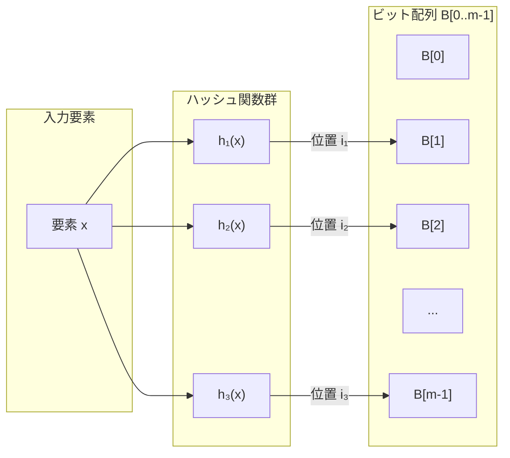
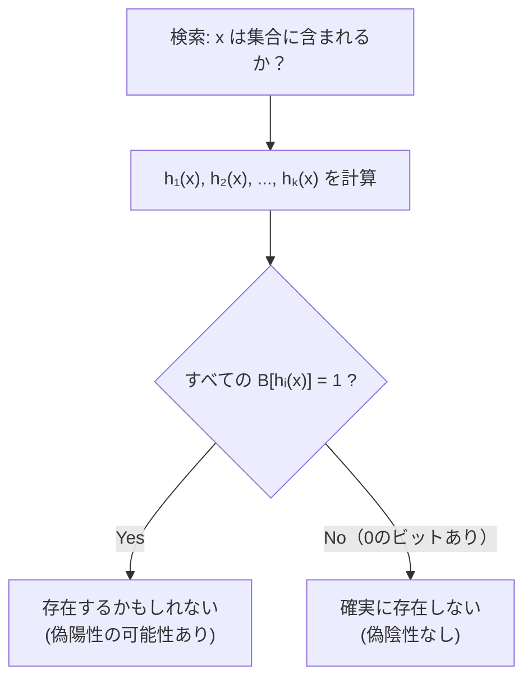
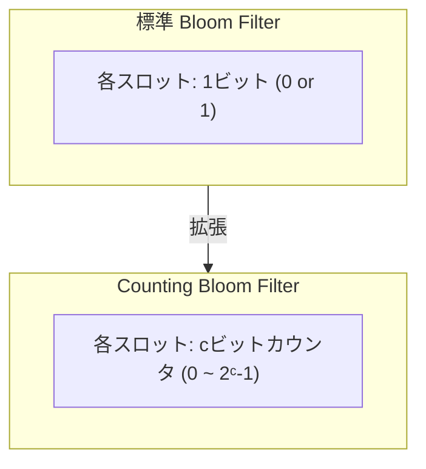
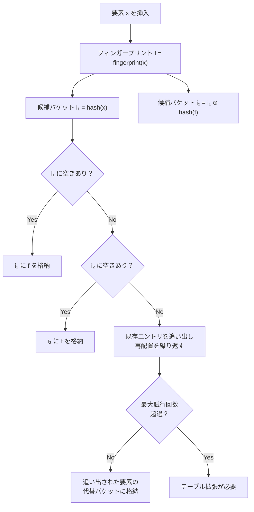
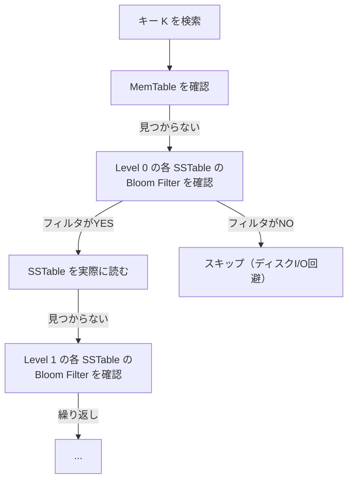

# Bloom Filter と確率的データ構造

## 1. はじめに：「存在しないこと」を高速に判定する

コンピュータサイエンスにおいて、ある要素が集合に含まれるかどうかを判定する**メンバーシップテスト**（membership test）は極めて基本的な操作である。ハッシュテーブルや平衡二分探索木を使えば正確に判定できるが、いずれも集合の全要素をメモリ上に保持する必要がある。

しかし、現実のシステムでは、正確性をわずかに犠牲にしてでもメモリ使用量を大幅に削減したい場面が頻繁に存在する。たとえば、次のような場面を考えてみよう。

- データベースが特定のキーを含まないディスクブロックへの不要なI/Oを回避したい
- Webブラウザがユーザーをフィッシングサイトから守るために、既知の悪意あるURLのリストと照合したい
- 分散キャッシュシステムが、リクエストをどのノードに転送すべきかを迅速に判定したい

これらの場面に共通するのは、「**ほぼ確実に存在しない**」ことを高速かつ省メモリで判定できればよいという要件である。ここで登場するのが **Bloom Filter（ブルームフィルタ）** である。

Bloom Filterは、1970年にBurton Howard Bloomが論文 *"Space/Time Trade-offs in Hash Coding with Allowable Errors"* で提案した確率的データ構造である。その名前が示すとおり、空間と時間のトレードオフを許容誤差という概念で結びつけた画期的なアイデアであった。

Bloom Filterの核心的な特性は次の2点に集約される。

1. **偽陰性（false negative）は絶対に発生しない**：集合に存在する要素を「存在しない」と判定することはない
2. **偽陽性（false positive）は発生しうる**：集合に存在しない要素を「存在するかもしれない」と判定する確率がわずかに存在する

つまり、Bloom Filterに問い合わせた結果が「NO（存在しない）」であれば、その回答は100%正しい。一方、「YES（存在するかもしれない）」という回答には一定の誤りが含まれる可能性がある。この非対称性こそが、Bloom Filterの実用的な価値の源泉である。

## 2. 歴史的背景と設計動機

### 2.1 Bloomの原論文

1970年、Bloomが解こうとした問題は、大規模なデータベースに対するアクセス効率化であった。当時のコンピュータは現在と比較してメモリが極めて限られており、ディスクアクセスのコストは相対的に非常に高かった。Bloomは、ハッシュコーディングによる「許容可能な誤り」を導入することで、空間効率と時間効率を同時に改善できることを示した。

原論文では、ハイフネーション辞書（英語の単語をどこで改行してよいかを示す辞書）の例が用いられている。辞書全体をメモリに載せることは当時不可能だったため、「この単語は辞書にない」という判定をメモリ上の小さなデータ構造で行い、辞書へのディスクアクセスを大幅に削減するという発想であった。

### 2.2 なぜ確率的データ構造が必要なのか

情報理論的な限界として、$n$ 個の要素からなる集合のメンバーシップテストを正確に行うためには、最低でも $n \log_2(1/\epsilon)$ ビット程度のメモリが必要であり（ここで $\epsilon$ は偽陽性率）、さらに集合の要素自体を格納する必要がある。Bloom Filterは要素自体を格納せず、「存在するかどうか」という情報のみをコンパクトに符号化するため、情報理論的下限に近い空間効率を達成できる。

具体的には、Bloom Filterでは要素1個あたり約 $1.44 \log_2(1/\epsilon)$ ビットで偽陽性率 $\epsilon$ を実現できる。たとえば、1%の偽陽性率を許容するならば、要素あたり約 $1.44 \times \log_2(100) \approx 9.6$ ビットで済む。10億個の要素を管理する場合でも約1.2GBのメモリで足りる計算になる。これは、要素そのもの（たとえばURLの文字列）を格納する場合と比較すれば、桁違いの省メモリである。

## 3. ビット配列とハッシュ関数の構造

### 3.1 基本構造

Bloom Filterは、2つの構成要素からなる。

1. **ビット配列** $B[0..m-1]$：長さ $m$ のビット配列で、初期状態ではすべてのビットが0に設定されている
2. **$k$ 個の独立なハッシュ関数** $h_1, h_2, \ldots, h_k$：各ハッシュ関数は任意の要素を $\{0, 1, \ldots, m-1\}$ の範囲に均一に写像する

```
ビット配列 B（初期状態）:
┌───┬───┬───┬───┬───┬───┬───┬───┬───┬───┬───┬───┐
│ 0 │ 0 │ 0 │ 0 │ 0 │ 0 │ 0 │ 0 │ 0 │ 0 │ 0 │ 0 │
└───┴───┴───┴───┴───┴───┴───┴───┴───┴───┴───┴───┘
  0   1   2   3   4   5   6   7   8   9  10  11

ハッシュ関数（k = 3）:
  h₁(x) → ビット位置
  h₂(x) → ビット位置
  h₃(x) → ビット位置
```

### 3.2 Mermaidによる構造の可視化



### 3.3 ハッシュ関数の実装戦略

理論的には $k$ 個の**独立な**ハッシュ関数が必要だが、実用上は2つのハッシュ関数から $k$ 個のハッシュ値を生成するテクニックが広く使われる。Kirsch and Mitzenmacher（2006）は、次の手法が理論的にも同等の性能を持つことを証明した。

$$g_i(x) = h_1(x) + i \cdot h_2(x) \pmod{m}, \quad i = 0, 1, \ldots, k-1$$

ここで $h_1$ と $h_2$ は2つの独立なハッシュ関数である。この手法を用いれば、128ビットのハッシュ値（たとえば MurmurHash3の128ビット版）を上位64ビットと下位64ビットに分割し、$h_1$ と $h_2$ として利用するだけで、任意の $k$ に対応できる。

```python
import mmh3

def bloom_hash(item: str, k: int, m: int) -> list[int]:
    """Generate k hash positions using double hashing technique."""
    # MurmurHash3 128-bit generates two 64-bit values
    h1, h2 = mmh3.hash64(item, seed=0)
    positions = []
    for i in range(k):
        pos = (h1 + i * h2) % m
        positions.append(abs(pos))
    return positions
```

## 4. 挿入と検索の手順

### 4.1 挿入操作（Insert / Add）

要素 $x$ を集合に追加する手順は次のとおりである。

1. $k$ 個のハッシュ関数を用いて $k$ 個の位置 $h_1(x), h_2(x), \ldots, h_k(x)$ を計算する
2. ビット配列の対応する位置をすべて1に設定する：$B[h_i(x)] \leftarrow 1 \quad (i = 1, \ldots, k)$

```
要素 "apple" を挿入（k = 3, m = 12）:
  h₁("apple") = 1
  h₂("apple") = 5
  h₃("apple") = 9

挿入前:
┌───┬───┬───┬───┬───┬───┬───┬───┬───┬───┬───┬───┐
│ 0 │ 0 │ 0 │ 0 │ 0 │ 0 │ 0 │ 0 │ 0 │ 0 │ 0 │ 0 │
└───┴───┴───┴───┴───┴───┴───┴───┴───┴───┴───┴───┘
  0   1   2   3   4   5   6   7   8   9  10  11

挿入後:
┌───┬───┬───┬───┬───┬───┬───┬───┬───┬───┬───┬───┐
│ 0 │ 1 │ 0 │ 0 │ 0 │ 1 │ 0 │ 0 │ 0 │ 1 │ 0 │ 0 │
└───┴───┴───┴───┴───┴───┴───┴───┴───┴───┴───┴───┘
  0   1   2   3   4   5   6   7   8   9  10  11
      ↑               ↑               ↑
    h₁              h₂              h₃
```

さらに要素 "banana" を挿入する例を見てみよう。

```
要素 "banana" を挿入（k = 3, m = 12）:
  h₁("banana") = 3
  h₂("banana") = 5   ← "apple" の h₂ と衝突！
  h₃("banana") = 11

挿入後:
┌───┬───┬───┬───┬───┬───┬───┬───┬───┬───┬───┬───┐
│ 0 │ 1 │ 0 │ 1 │ 0 │ 1 │ 0 │ 0 │ 0 │ 1 │ 0 │ 1 │
└───┴───┴───┴───┴───┴───┴───┴───┴───┴───┴───┴───┘
  0   1   2   3   4   5   6   7   8   9  10  11
      ↑       ↑       ↑               ↑       ↑
  apple   banana  共有          apple  banana
```

位置5のビットが "apple" と "banana" の両方で使われている点に注目してほしい。この重複が後述する偽陽性の原因となる。

### 4.2 検索操作（Query / Lookup）

要素 $x$ が集合に含まれるかを判定する手順は次のとおりである。

1. $k$ 個のハッシュ関数を用いて $k$ 個の位置 $h_1(x), h_2(x), \ldots, h_k(x)$ を計算する
2. ビット配列の対応する位置を**すべて**確認する
3. **すべてのビットが1**であれば「**存在するかもしれない**（probably yes）」と判定する
4. **1つでも0のビットがあれば**「**確実に存在しない**（definitely no）」と判定する



「確実に存在しない」という判定が100%正確である理由は明快である。要素 $x$ が挿入されていたならば、$h_1(x), h_2(x), \ldots, h_k(x)$ の位置はすべて1に設定されているはずだからである。これらの位置の1つでも0であるということは、$x$ は一度も挿入されていないことを意味する。

一方、すべてのビットが1であっても、それは他の要素の挿入によってたまたま1になっている可能性がある。これが偽陽性のメカニズムである。

### 4.3 最小限の実装例

```python
class BloomFilter:
    """A minimal Bloom filter implementation."""

    def __init__(self, size: int, num_hashes: int):
        self.size = size          # m: bit array size
        self.num_hashes = num_hashes  # k: number of hash functions
        self.bit_array = [0] * size

    def _hashes(self, item: str) -> list[int]:
        """Generate k hash positions using double hashing."""
        h1 = hash(item)
        h2 = hash(item + "__salt__")
        return [(h1 + i * h2) % self.size for i in range(self.num_hashes)]

    def add(self, item: str) -> None:
        """Insert an element into the filter."""
        for pos in self._hashes(item):
            self.bit_array[pos] = 1

    def might_contain(self, item: str) -> bool:
        """Check membership. False means definitely not in set."""
        return all(self.bit_array[pos] == 1 for pos in self._hashes(item))
```

このインターフェースの重要な点は、検索メソッドが `contains` ではなく `might_contain` と命名されていることである。Bloom Filterの確率的性質をAPIの利用者に対して明示するための慣習であり、Google Guavaのような著名なライブラリでもこの命名規則が採用されている。

## 5. 偽陽性率の数学的解析

### 5.1 偽陽性率の導出

Bloom Filterの理論的解析の核心は、偽陽性率（false positive probability）の導出である。以下の仮定を置く。

- ビット配列の長さ：$m$
- ハッシュ関数の個数：$k$
- 挿入された要素の個数：$n$
- 各ハッシュ関数はビット配列の各位置に均一に写像する

1つのハッシュ関数が特定のビットを1にする確率は $\frac{1}{m}$ であるから、特定のビットを1に**しない**確率は次のとおりである。

$$1 - \frac{1}{m}$$

$n$ 個の要素をそれぞれ $k$ 個のハッシュ関数で処理するため、全体で $nk$ 回のビット設定が行われる。特定のビットがこれらすべての操作で0のまま残る確率は次のようになる。

$$\left(1 - \frac{1}{m}\right)^{nk}$$

よって、特定のビットが1に設定されている確率は次のとおりである。

$$1 - \left(1 - \frac{1}{m}\right)^{nk}$$

ここで、$m$ が十分に大きいとき、次の近似が使える。

$$\left(1 - \frac{1}{m}\right)^{m} \approx e^{-1}$$

したがって、

$$1 - \left(1 - \frac{1}{m}\right)^{nk} \approx 1 - e^{-nk/m}$$

偽陽性が発生するのは、集合に含まれない要素に対して $k$ 個のハッシュ位置がすべて1になっている場合であるから、偽陽性率 $p$ は次のように表される。

$$\boxed{p \approx \left(1 - e^{-kn/m}\right)^k}$$

### 5.2 偽陽性率の直感的理解

この式が意味するところを具体的な数値で確認しよう。$m = 10n$（要素あたり10ビット）、$k = 7$ の場合を考える。

$$p \approx \left(1 - e^{-7/10}\right)^7 = \left(1 - e^{-0.7}\right)^7 \approx (1 - 0.4966)^7 \approx (0.5034)^7 \approx 0.00819$$

つまり、要素あたり10ビットを使い、7つのハッシュ関数を用いるだけで、偽陽性率を約0.82%に抑えることができる。10億個の要素を管理しても必要なメモリは約1.25GBであり、要素そのものを格納する場合と比較して桁違いに小さい。

### 5.3 ビット充填率との関係

直感的には、ビット配列中の1の割合（充填率、fill ratio）が偽陽性率を決定する。$n$ 個の要素を挿入した後のビット配列において、あるビットが1である確率を $\rho$ とすると、

$$\rho \approx 1 - e^{-kn/m}$$

偽陽性率は $p \approx \rho^k$ と表せる。充填率が50%に近づくとき、最も効率的な動作が実現される。

## 6. 最適なパラメータ設計

### 6.1 最適なハッシュ関数の数

偽陽性率 $p$ を最小化する $k$ を求めるために、$p$ の対数を取り、$k$ で微分する。

$$\ln p = k \ln\left(1 - e^{-kn/m}\right)$$

ここで $t = e^{-kn/m}$ と置くと、$\ln p = k \ln(1 - t)$ であり、$k = -(m/n) \ln t$ である。最適化の結果、$t = 1/2$（すなわちビット配列の半分が1に設定されている状態）のとき、偽陽性率が最小化されることが導かれる。

この条件から、最適なハッシュ関数の数は次のようになる。

$$\boxed{k_{\text{opt}} = \frac{m}{n} \ln 2 \approx 0.6931 \cdot \frac{m}{n}}$$

### 6.2 最適なビット配列サイズ

目標とする偽陽性率 $p$ が与えられたとき、必要なビット配列のサイズ $m$ は次の式で計算できる。

最適な $k$ のもとでの偽陽性率は次のとおりである。

$$p = \left(\frac{1}{2}\right)^k = \left(\frac{1}{2}\right)^{(m/n)\ln 2}$$

これを $m$ について解くと、

$$\boxed{m = -\frac{n \ln p}{(\ln 2)^2}}$$

また、最適なハッシュ関数の数は次のようになる。

$$k = -\frac{\ln p}{\ln 2} = -\log_2 p$$

### 6.3 パラメータ設計の早見表

| 偽陽性率 $p$ | 要素あたりのビット数 $m/n$ | ハッシュ関数の数 $k$ |
|---|---|---|
| 10% (0.1) | 4.79 | 3.32 ≈ 3 |
| 5% (0.05) | 6.24 | 4.32 ≈ 4 |
| 1% (0.01) | 9.58 | 6.64 ≈ 7 |
| 0.1% (0.001) | 14.38 | 9.97 ≈ 10 |
| 0.01% (0.0001) | 19.17 | 13.29 ≈ 13 |

この表から分かるように、偽陽性率を1桁下げるごとに、要素あたり約4.8ビットの追加メモリが必要となる。これは次の関係から導かれる。

$$\frac{\Delta m}{n} = -\frac{\ln(p/10)}{(\ln 2)^2} + \frac{\ln p}{(\ln 2)^2} = \frac{\ln 10}{(\ln 2)^2} \approx 4.79$$

### 6.4 パラメータ設計のコード例

```python
import math

def optimal_bloom_params(n: int, p: float) -> tuple[int, int]:
    """
    Calculate optimal Bloom filter parameters.

    Args:
        n: expected number of elements
        p: desired false positive probability (0 < p < 1)

    Returns:
        (m, k): bit array size and number of hash functions
    """
    # Optimal bit array size
    m = int(-n * math.log(p) / (math.log(2) ** 2))
    # Optimal number of hash functions
    k = max(1, int(round(m / n * math.log(2))))
    return m, k

# Example: 1 million elements, 1% false positive rate
m, k = optimal_bloom_params(1_000_000, 0.01)
print(f"Bit array size: {m:,} bits ({m / 8 / 1024:.1f} KB)")
print(f"Number of hash functions: {k}")
# Output:
# Bit array size: 9,585,059 bits (1,170.5 KB)
# Number of hash functions: 7
```

## 7. 削除が不可能な理由

### 7.1 ビット共有の問題

標準的なBloom Filterでは、一度挿入した要素を**削除することができない**。この制約は、Bloom Filterの構造的な性質に起因する。

あるビットが1に設定されているとき、そのビットを1にした要素は1つとは限らない。複数の要素が同じビット位置を共有している可能性がある。要素を削除するためにそのビットを0に戻すと、同じビットを使っている他の要素のメンバーシップ判定が壊れてしまう。

```
要素 "apple" と "banana" が挿入済み:
  h₁("apple")  = 1,  h₂("apple")  = 5,  h₃("apple")  = 9
  h₁("banana") = 3,  h₂("banana") = 5,  h₃("banana") = 11
                                     ↑
                              位置5を共有

┌───┬───┬───┬───┬───┬───┬───┬───┬───┬───┬───┬───┐
│ 0 │ 1 │ 0 │ 1 │ 0 │ 1 │ 0 │ 0 │ 0 │ 1 │ 0 │ 1 │
└───┴───┴───┴───┴───┴───┴───┴───┴───┴───┴───┴───┘
  0   1   2   3   4   5   6   7   8   9  10  11

"apple" を削除するために位置 1, 5, 9 を0にすると:
┌───┬───┬───┬───┬───┬───┬───┬───┬───┬───┬───┬───┐
│ 0 │ 0 │ 0 │ 1 │ 0 │ 0 │ 0 │ 0 │ 0 │ 0 │ 0 │ 1 │
└───┴───┴───┴───┴───┴───┴───┴───┴───┴───┴───┴───┘
  0   1   2   3   4   5   6   7   8   9  10  11
                        ↑
              位置5が0になったため、
              "banana" の検索も「存在しない」を返す！
              → 偽陰性が発生（Bloom Filterの保証を破壊）
```

### 7.2 偽陰性が許されない理由

Bloom Filterの最も重要な不変条件（invariant）は「偽陰性が発生しない」ことである。この保証があるからこそ、Bloom Filterを前段フィルタとして安全に使用できる。もし偽陰性が発生しうるならば、存在する要素を「存在しない」と判定してしまい、データの欠損につながる。

たとえばデータベースのブルームフィルタが偽陰性を返した場合、実際にはディスク上に存在するデータが「存在しない」と判定され、ユーザーに返されなくなる。これはデータの整合性に関わる致命的な問題である。偽陽性であれば、不要なディスクアクセスが発生するだけで、データの正確性には影響しない。

## 8. Counting Bloom Filter

### 8.1 削除を可能にする拡張

Fan, Cao, Almeida, Broder（2000）は、ビットの代わりに**カウンタ**を用いることで削除を可能にする **Counting Bloom Filter** を提案した。

各スロットを1ビットではなく、$c$ ビットのカウンタ（通常は4ビット）に拡張する。挿入時にはカウンタをインクリメントし、削除時にはデクリメントする。



### 8.2 操作

```
Counting Bloom Filter (4ビットカウンタ, m = 8, k = 3):

初期状態:
┌───┬───┬───┬───┬───┬───┬───┬───┐
│ 0 │ 0 │ 0 │ 0 │ 0 │ 0 │ 0 │ 0 │
└───┴───┴───┴───┴───┴───┴───┴───┘
  0   1   2   3   4   5   6   7

"apple" を挿入 (h₁=1, h₂=3, h₃=6):
┌───┬───┬───┬───┬───┬───┬───┬───┐
│ 0 │ 1 │ 0 │ 1 │ 0 │ 0 │ 1 │ 0 │
└───┴───┴───┴───┴───┴───┴───┴───┘

"banana" を挿入 (h₁=1, h₂=4, h₃=6):
┌───┬───┬───┬───┬───┬───┬───┬───┐
│ 0 │ 2 │ 0 │ 1 │ 1 │ 0 │ 2 │ 0 │
└───┴───┴───┴───┴───┴───┴───┴───┘
      ↑                   ↑
   カウンタ=2          カウンタ=2
  （apple, banana）    （apple, banana）

"apple" を削除 (h₁=1, h₂=3, h₃=6):
┌───┬───┬───┬───┬───┬───┬───┬───┐
│ 0 │ 1 │ 0 │ 0 │ 1 │ 0 │ 1 │ 0 │
└───┴───┴───┴───┴───┴───┴───┴───┘
      ↑                   ↑
   カウンタ=1          カウンタ=1
  （bananaのみ）       （bananaのみ）

→ "banana" のメンバーシップは正しく保持される
```

### 8.3 カウンタオーバーフロー問題

4ビットカウンタの場合、最大値は15である。15を超える挿入が同一位置に集中すると、カウンタがオーバーフローする。オーバーフローが発生すると、削除時のデクリメントが正しく機能しなくなり、偽陰性が発生する可能性がある。

実用上、4ビットカウンタ（最大値15）で十分であることが経験的に知られている。Fanらの分析によれば、最適なパラメータ設計のもとでは、カウンタが15を超える確率は $1.37 \times 10^{-15} \times m$ と極めて小さい。

### 8.4 空間コスト

Counting Bloom Filterの最大の欠点は、空間効率の悪化である。4ビットカウンタを使う場合、標準的なBloom Filterの**4倍**のメモリが必要になる。要素あたり10ビットで1%の偽陽性率を実現できる標準Bloom Filterに対し、Counting Bloom Filterでは要素あたり40ビット（5バイト）が必要となる。

## 9. 主なバリエーション

Bloom Filterの基本的な制約（削除不可、偽陽性率の固定的なトレードオフ）を克服するために、多くの変種が提案されてきた。

### 9.1 Cuckoo Filter

Cuckoo Filter は Fan, Andersen, Kaminsky, Mitzenmacher（2014）によって提案された、Bloom Filterの代替データ構造である。Cuckoo Hashing の手法に基づいており、次の利点を持つ。

**動作原理**

Cuckoo Filter はバケットの配列で構成される。各バケットには一定数（通常4個）のスロットがあり、要素のハッシュ値の一部（**フィンガープリント**、fingerprint）を格納する。

```
Cuckoo Filter のバケット構造（バケットサイズ = 4）:

バケット 0: [fp₁] [fp₂] [   ] [   ]
バケット 1: [fp₃] [   ] [   ] [   ]
バケット 2: [fp₄] [fp₅] [fp₆] [   ]
バケット 3: [   ] [   ] [   ] [   ]
...
```

挿入時には2つの候補バケットのいずれかにフィンガープリントを格納する。両方のバケットが満杯の場合、既存のフィンガープリントを追い出して（cuckoo、カッコウの意味）再配置する。



**Bloom Filter との比較**

| 特性 | Bloom Filter | Cuckoo Filter |
|---|---|---|
| 偽陽性率 | 調整可能 | 調整可能 |
| 削除 | 不可 | 可能 |
| 空間効率（低偽陽性率時） | 良好 | より良好（$\epsilon < 3\%$ のとき） |
| 挿入の最悪計算量 | $O(k)$ | $O(1)$ 償却だが再配置時に高コスト |
| 検索の計算量 | $O(k)$ | $O(1)$（2バケットのみ） |
| 集合の和 | ビットOR | 困難 |

Cuckoo Filterは、特に偽陽性率が3%未満の場合にBloom Filterよりも空間効率が優れることが示されている。また、削除操作をサポートする点が大きな利点である。

### 9.2 Quotient Filter

Quotient Filter は Bender, Farach-Colton, Johnson, Kuszmaul, Medjedovic, Montes, Shetty, Spillane, Zadok（2012）によって提案された。ハッシュ値を**商**（quotient）と**剰余**（remainder）に分割し、商をバケットインデックスとして使い、剰余をバケット内に格納する。

**特徴**

- **キャッシュフレンドリー**：データが連続したメモリ領域に格納されるため、CPUキャッシュのヒット率が高い
- **削除可能**：要素の削除をサポートする
- **マージ可能**：2つのQuotient Filterを効率的にマージできる
- **リサイズ可能**：ハッシュ値の追加ビットを使うことでリサイズ可能

**空間コスト**

Quotient Filterはフィンガープリントに加えて、1スロットあたり3ビットのメタデータ（`is_occupied`, `is_continuation`, `is_shifted`）を必要とする。このオーバーヘッドのため、Bloom Filterと比較して空間効率はやや劣る場合がある。

### 9.3 その他のバリエーション

| バリエーション | 特徴 | 主な用途 |
|---|---|---|
| **Scalable Bloom Filter** | 要素数の増加に応じて自動的に拡張する | 要素数が事前に不明な場合 |
| **Partitioned Bloom Filter** | ビット配列を $k$ 個のパーティションに分割 | 並列処理の改善 |
| **Compressed Bloom Filter** | 転送時に圧縮を適用 | ネットワーク転送 |
| **Blocked Bloom Filter** | キャッシュラインサイズのブロック単位で操作 | キャッシュ効率の改善 |
| **Ribbon Filter** | 連立方程式ベースの空間効率的フィルタ | 静的集合の高空間効率フィルタ |
| **Xor Filter** | 3-wise XOR に基づく空間効率的フィルタ | 静的集合、読み取り専用用途 |

## 10. 実世界での応用

### 10.1 データベースにおける応用

**LSM-Treeベースのストレージエンジン**

LSM-Tree（Log-Structured Merge-Tree）を採用するデータベース（LevelDB, RocksDB, Apache Cassandra, Apache HBase など）では、Bloom Filterがパフォーマンスの要として機能している。

LSM-Treeでは、データが複数のレベル（Level 0, Level 1, ...）のSSTable（Sorted String Table）ファイルに格納される。ポイントルックアップ（特定のキーの検索）では、どのSSTファイルに目的のキーが含まれるかを特定する必要があるが、全ファイルを走査すると非常に遅い。



各SSTファイルにBloom Filterを付与することで、そのファイルにキーが含まれないことを高速に判定し、不要なディスクアクセスを回避する。LevelDBでは、デフォルトで要素あたり10ビットのBloom Filterが使われており、読み取り性能を大幅に改善している。

**PostgreSQLにおけるBloom Indexの拡張**

PostgreSQL 9.6以降では、`bloom` 拡張モジュールによってBloom Filterベースのインデックスを作成できる。多数のカラムに対する等値検索を効率化するために使われ、通常のB-Treeインデックスでは必要になる複数のインデックスを1つのBloom Indexで代替できる場合がある。

### 10.2 キャッシュシステムにおける応用

**キャッシュミスの削減**

CDN（Content Delivery Network）やインメモリキャッシュ（Redis, Memcached）において、存在しないキーへのアクセスは無駄なバックエンドへの問い合わせを発生させる。Bloom Filterを用いてキャッシュ可能なキーの集合を管理すれば、「確実にキャッシュに存在しないキー」に対するバックエンド問い合わせを回避できる。

**キャッシュ汚染攻撃の防御**

攻撃者が存在しないキーを大量にリクエストすることで、キャッシュのヒット率を低下させる攻撃（cache pollution attack）がある。Bloom Filterを前段に配置し、一度もリクエストされたことのないキーをフィルタリングすることで、この攻撃を緩和できる。

### 10.3 ネットワークにおける応用

**Google Chrome のセーフブラウジング**

Google Chromeは、マルウェアやフィッシングサイトの既知のURLリストとの照合にBloom Filterを使用していた（現在はより高度な手法に移行）。ユーザーがURLにアクセスする際、ローカルのBloom Filterでまず照合し、「存在するかもしれない」と判定された場合にのみGoogleのサーバーに問い合わせる。これにより、ネットワーク通信を最小限に抑えつつ、ユーザーのプライバシーも保護できる。

**Akamai CDN のキャッシュ戦略**

Akamai のCDNでは、Web上のコンテンツの約75%が「一度しかアクセスされない」（one-hit wonder）ことが経験的に知られている。これらのコンテンツをキャッシュに格納するのは無駄である。Bloom Filterを用いて、2回以上アクセスされたURLのみをキャッシュ対象とすることで、キャッシュの効率を大幅に改善している。

**Bitcoin SPVノード**

Bitcoin のSPV（Simplified Payment Verification）ノードは、フルノードからトランザクションデータを受け取る際にBloom Filterを使用する。SPVノードは自分に関連するトランザクションのアドレスをBloom Filterに設定し、フルノードに送信する。フルノードはBloom FilterにマッチするトランザクションのみをSPVノードに返す。これにより、SPVノードのプライバシーを一定程度保護しつつ、帯域幅の使用量を削減できる。

### 10.4 分散システムにおける応用

**Apache Cassandraのレプリケーション修復**

Cassandraは、ノード間のデータ不整合を検出する際にBloom Filterを使用する。各ノードが保持するデータのBloom Filterを交換し、差異がある可能性のあるデータのみを同期することで、修復処理の効率化を図っている。

**Apache Hadoop の Map-Side Join**

MapReduceの処理において、巨大なデータセット同士のJoinを行う際、一方のデータセットが小さい場合はBloom Filterで前段フィルタリングを行い、Joinに必要なレコードのみをMap処理に渡すことで、中間データの転送量を削減できる。

## 11. 実装の考慮点

### 11.1 ハッシュ関数の選択

Bloom Filterの性能はハッシュ関数の品質に大きく依存する。実用上、以下のハッシュ関数が広く使われている。

| ハッシュ関数 | 特徴 | 主な採用例 |
|---|---|---|
| **MurmurHash3** | 高速、良好な分散、128ビット出力対応 | Google Guava, Apache Spark |
| **xxHash** | 極めて高速、SIMD最適化 | Facebook (Meta) |
| **SipHash** | HashDoS耐性、やや低速 | セキュリティ重視のアプリケーション |
| **FNV-1a** | シンプル、小さなデータに適する | 簡易的な実装 |
| **CityHash** | Google開発、64/128/256ビット対応 | Google内部 |

暗号学的ハッシュ関数（SHA-256など）は品質は高いが、計算コストがBloom Filterの用途には過大である。Bloom Filterには衝突耐性や一方向性は不要であるため、非暗号学的ハッシュ関数で十分である。

### 11.2 ビット配列の実装

ビット配列の実装には、言語標準のビット操作を使う方法と、バイト配列を用いる方法がある。

```python
class BitArray:
    """Space-efficient bit array using bytearray."""

    def __init__(self, size: int):
        self.size = size
        self.array = bytearray((size + 7) // 8)

    def set(self, index: int) -> None:
        """Set bit at given index to 1."""
        self.array[index >> 3] |= (1 << (index & 7))

    def get(self, index: int) -> bool:
        """Check if bit at given index is 1."""
        return bool(self.array[index >> 3] & (1 << (index & 7)))
```

### 11.3 並行アクセスの考慮

マルチスレッド環境でBloom Filterを使用する場合、次の点に注意が必要である。

- **検索はスレッドセーフ**：検索操作はビット配列を読み取るだけであるため、複数スレッドから同時に実行しても安全である
- **挿入にはアトミック操作が必要**：ビットの設定にはアトミックなOR操作（`atomic_or`）を用いるべきである。ただし、Bloom Filterの挿入は冪等な操作（同じ要素を複数回挿入しても結果は同じ）であるため、CAS（Compare-And-Swap）ループは不要であり、単純なアトミックORで十分である

```c
// Thread-safe insertion using atomic OR
void bloom_insert(atomic_uint8_t *bit_array, uint32_t index) {
    uint32_t byte_index = index / 8;
    uint8_t bit_mask = 1 << (index % 8);
    atomic_fetch_or(&bit_array[byte_index], bit_mask);
}
```

### 11.4 シリアライゼーションと永続化

Bloom Filterは本質的にビット配列であるため、シリアライゼーションは単純である。ビット配列をそのままバイト列として書き出し、パラメータ（$m$, $k$, ハッシュ関数の種類）をヘッダとして付加すればよい。

```
Bloom Filter のシリアライズフォーマット例:
┌─────────────────────────────────────┐
│ Magic Number (4 bytes)              │
│ Version (2 bytes)                   │
│ Hash Function ID (2 bytes)          │
│ Bit Array Size m (8 bytes)          │
│ Num Hash Functions k (4 bytes)      │
│ Num Elements n (8 bytes)            │
│ Bit Array Data (⌈m/8⌉ bytes)       │
└─────────────────────────────────────┘
```

### 11.5 要素数の推定

Bloom Filterに挿入された要素数 $n$ は直接記録しなくても、ビット配列から推定可能である。ビット配列中の1のビット数を $X$ とすると、

$$\hat{n} = -\frac{m}{k} \ln\left(1 - \frac{X}{m}\right)$$

この推定はビット配列が十分に疎な場合（充填率が50%程度以下）に高い精度を持つ。

## 12. Bloom Filter の理論的限界

### 12.1 情報理論的下限との比較

$n$ 個の要素に対して偽陽性率 $\epsilon$ のメンバーシップテストを行うために必要なビット数の情報理論的下限は次のとおりである。

$$m_{\text{lower}} = n \log_2\left(\frac{1}{\epsilon}\right)$$

最適なBloom Filterが使用するビット数は次のとおりである。

$$m_{\text{bloom}} = \frac{n \ln(1/\epsilon)}{(\ln 2)^2} = \frac{n \log_2(1/\epsilon)}{\ln 2} \approx 1.44 \cdot n \log_2\left(\frac{1}{\epsilon}\right)$$

したがって、Bloom Filterは情報理論的下限の約 $1/\ln 2 \approx 1.44$ 倍のメモリを使用する。この44%のオーバーヘッドは、Bloom Filterの構造的な制約（各ハッシュ関数が独立にビットを設定する）に起因する。

### 12.2 情報理論的下限を達成するデータ構造

近年、情報理論的下限に近い空間効率を達成するデータ構造が提案されている。

- **Xor Filter**（2020年）：静的な集合に対して情報理論的下限に極めて近い空間効率を実現する。構築には集合のすべての要素が事前に必要
- **Ribbon Filter**（2021年）：Ribbon（Rapid Incremental Boolean Banding）に基づく手法で、Bloom Filterとほぼ同等の構築速度を維持しつつ、情報理論的下限に近い空間効率を達成する。RocksDBで採用されている

## 13. 実際の性能特性

### 13.1 計算量

| 操作 | 時間計算量 | 空間計算量 |
|---|---|---|
| 挿入 | $O(k)$ | - |
| 検索 | $O(k)$ | - |
| 全体の空間 | - | $O(m) = O(n \log(1/\epsilon))$ |

ここで $k$ は通常 $O(\log(1/\epsilon))$ であるが、実用的には10程度の定数である。したがって、挿入も検索も実質的に $O(1)$ の操作である。

### 13.2 キャッシュ効率

標準的なBloom Filterの検索では、$k$ 個のランダムな位置にアクセスする必要がある。ビット配列がCPUキャッシュに収まらない場合、各アクセスがキャッシュミスを引き起こす可能性がある。この問題に対処するために、**Blocked Bloom Filter** が提案されている。

Blocked Bloom Filterでは、ビット配列をキャッシュラインサイズ（通常64バイト = 512ビット）のブロックに分割し、各要素のハッシュ値を1つのブロック内のビットにのみ写像する。これにより、1回の検索で1回のキャッシュラインアクセスのみで済むが、偽陽性率はやや悪化する。

### 13.3 SIMD最適化

現代のCPUが持つSIMD（Single Instruction, Multiple Data）命令を活用することで、Bloom Filterの検索性能を大幅に改善できる。特に、256ビットのAVX2命令を用いれば、複数のハッシュ値の照合を並列に実行できる。

## 14. まとめ

Bloom Filterは、半世紀以上前に提案されたにもかかわらず、現代のコンピュータシステムにおいて依然として広く活用されている確率的データ構造である。その本質は次の3点に集約される。

1. **空間と正確性のトレードオフ**：完璧な正確性を諦め、偽陽性を許容することで、劇的な空間効率の改善を実現する
2. **偽陰性の不在という保証**：「存在しない」という回答が100%正しいという非対称な保証により、前段フィルタとして安全に使用できる
3. **シンプルさと実用性の両立**：ビット配列とハッシュ関数という極めてシンプルな構造でありながら、データベース、キャッシュ、ネットワーク、分散システムなど、広範な領域で実用的な価値を提供する

Bloom Filterの設計思想は、コンピュータサイエンスにおける重要な教訓を含んでいる。すなわち、**完璧な解を追求するよりも、許容可能な誤差の範囲内で効率的な解を提供する方が、実際のシステムにとって遥かに有用である**という教訓である。

近年ではCuckoo Filter、Xor Filter、Ribbon Filterなど、Bloom Filterの限界を克服する新しいデータ構造も提案されており、確率的データ構造の分野は今なお活発に発展を続けている。しかし、Bloom Filterの直感的な美しさと実装のシンプルさは、これらの新しいデータ構造と比較しても依然として色褪せることはない。

## 参考文献

- Bloom, B. H. (1970). "Space/Time Trade-offs in Hash Coding with Allowable Errors." *Communications of the ACM*, 13(7), 422-426.
- Fan, L., Cao, P., Almeida, J., & Broder, A. Z. (2000). "Summary Cache: A Scalable Wide-Area Web Cache Sharing Protocol." *IEEE/ACM Transactions on Networking*, 8(3), 281-293.
- Kirsch, A., & Mitzenmacher, M. (2006). "Less Hashing, Same Performance: Building a Better Bloom Filter." *Random Structures & Algorithms*, 33(2), 187-218.
- Fan, B., Andersen, D. G., Kaminsky, M., & Mitzenmacher, M. (2014). "Cuckoo Filter: Practically Better Than Bloom." *CoNEXT '14*.
- Bender, M. A. et al. (2012). "Don't Thrash: How to Cache Your Hash on Flash." *PVLDB*, 5(11), 1627-1637.
- Graf, T. M., & Lemire, D. (2020). "Xor Filters: Faster and Smaller Than Bloom and Cuckoo Filters." *Journal of Experimental Algorithmics*, 25, 1-16.
- Dillinger, P. C., & Walzer, S. (2021). "Ribbon filter: practically smaller than Bloom and Xor." *arXiv preprint arXiv:2103.02515*.
