# 分岐予測 — パイプラインを止めないための知恵と投機的実行

## 1. 分岐ペナルティの問題

### 1.1 パイプラインと分岐命令の衝突

現代のCPUは**命令パイプライン**によって高いスループットを実現している。パイプラインとは、命令の処理を複数のステージ（フェッチ、デコード、実行、メモリアクセス、ライトバック等）に分割し、各ステージを同時並行で動かすことで、理想的には毎クロックサイクル1命令を完了させる仕組みである。

```mermaid
gantt
    title 5段パイプラインの理想的な動作
    dateFormat X
    axisFormat %s

    section 命令1
    Fetch     : 0, 1
    Decode    : 1, 2
    Execute   : 2, 3
    Memory    : 3, 4
    WriteBack : 4, 5

    section 命令2
    Fetch     : 1, 2
    Decode    : 2, 3
    Execute   : 3, 4
    Memory    : 4, 5
    WriteBack : 5, 6

    section 命令3
    Fetch     : 2, 3
    Decode    : 3, 4
    Execute   : 4, 5
    Memory    : 5, 6
    WriteBack : 6, 7
```

しかし、プログラムには必ず**条件分岐命令**（`if`、`for`、`while`、`switch` 等に対応する `beq`、`bne`、`jmp` 等のマシン命令）が含まれる。統計的に、全命令の約15〜25%が分岐命令であるとされる。分岐命令は、パイプラインにとって根本的な問題を引き起こす。

分岐命令がパイプラインの実行ステージに到達するまで、その分岐が成立する（taken）のか不成立（not taken）なのか、またジャンプ先のアドレスが何であるかが確定しない。パイプラインが深ければ深いほど、フェッチからこの判定までに多くのサイクルが経過しており、その間にフェッチされた後続命令が正しいのか間違っているのかが分からない。

### 1.2 分岐ペナルティの定量的影響

分岐の結果が判明するまでパイプラインを**ストール（停止）**させると、その間のサイクルが完全に無駄になる。これを**分岐ペナルティ（branch penalty）**と呼ぶ。

5段パイプラインの場合、分岐ペナルティは2〜3サイクル程度であるが、現代の高性能プロセッサでは15〜20段以上のパイプラインが一般的であり、ペナルティは大きくなる。例えば Intel の Pentium 4（NetBurst アーキテクチャ）は最大31段のパイプラインを持ち、分岐ミス時のペナルティは約20サイクルに達した。

分岐ペナルティの影響を簡単に見積もってみよう。仮にパイプラインのペナルティが15サイクル、全命令の20%が分岐命令、そして分岐予測を一切行わない（常にストール）場合を考える。

$$
\text{CPI}_{\text{effective}} = \text{CPI}_{\text{ideal}} + \text{分岐頻度} \times \text{ペナルティ} = 1.0 + 0.20 \times 15 = 4.0
$$

理想的なCPI（Cycles Per Instruction）が1.0であるのに対し、実効CPIは4.0に跳ね上がる。つまり性能が**4分の1**に低下することを意味する。これは到底許容できない。

### 1.3 分岐ペナルティへの対処戦略

分岐ペナルティに対処する方法は大きく3つに分類できる。

1. **分岐遅延スロット（Branch Delay Slot）**: 分岐命令の直後に、分岐結果に関係なく実行される命令のスロットを設ける（MIPSで採用）。コンパイラが有用な命令でスロットを埋める必要がある。パイプラインが浅い場合は有効だが、深いパイプラインには対応しきれない。
2. **分岐予測（Branch Prediction）**: 分岐結果を予測し、予測に基づいて投機的に命令をフェッチ・実行する。予測が当たればペナルティはゼロ、外れた場合のみペナルティが発生する。
3. **述語実行（Predicated Execution）**: 分岐を排除し、条件付き命令（例: ARM の条件付き命令、x86 の `cmov`）で両方のパスの命令を実行する。

本記事では、現代プロセッサの性能を支える最も重要な技術である**分岐予測**に焦点を当てて詳述する。

## 2. 静的分岐予測

### 2.1 静的予測の基本

**静的分岐予測（Static Branch Prediction）**とは、分岐命令の実行履歴を使わず、コンパイル時や命令の性質のみから予測方向を決定する手法である。実行時の状態に関わらず予測方向が固定されるため「静的」と呼ばれる。

静的予測は実装コストが極めて低く、ハードウェアリソースをほとんど消費しない。その反面、精度には限界がある。

### 2.2 代表的な静的予測手法

#### Always Not Taken（常に不成立と予測）

最も単純な戦略で、すべての分岐を「不成立（not taken）」と予測する。つまり、分岐命令の直後の命令（fall-through パス）を常にフェッチする。この戦略は実装が容易であり、パイプラインのフェッチユニットはプログラムカウンタを単純にインクリメントし続ければよい。

しかし、ループの末尾にある後方分岐（backward branch）はほとんどの場合成立するため、この戦略ではループ内の大部分で予測ミスが生じる。

#### Always Taken（常に成立と予測）

すべての分岐を「成立（taken）」と予測する。後方分岐に対してはAlways Not Takenより高い精度を示す。統計的に、分岐命令の約60〜70%は成立するため、全体の精度もAlways Not Takenを上回ることが多い。ただし、ジャンプ先アドレスの計算が必要なため、フェッチユニットへの実装はやや複雑になる。

#### BTFNT（Backward Taken, Forward Not Taken）

分岐の方向（後方か前方か）によって予測を変える手法である。

- **後方分岐（backward branch）**: 成立と予測 — ループの繰り返しに対応
- **前方分岐（forward branch）**: 不成立と予測 — if文の条件不成立に対応

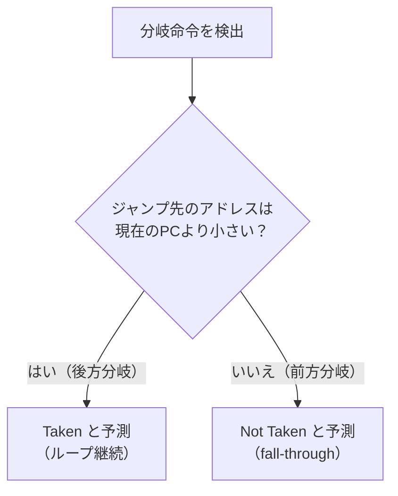

BTFNTは比較的良好な精度を示し、多くの初期のプロセッサで採用された。後方分岐のほとんどはループの末尾にあるため taken となる頻度が高く、前方分岐はif文の「通常パス」が fall-through であることが多いためである。

#### コンパイラヒント

一部のISA（Instruction Set Architecture）では、分岐命令にヒントビットを付与し、コンパイラが予測方向を指示できる。例えば、SPARC V9やPowerPCにはこのようなヒントビットが存在した。Cコンパイラでは `__builtin_expect` マクロ（GCC/Clang）を通じて、プログラマが分岐の傾向をコンパイラに伝えることができる。

```c
// compiler hint for branch prediction
if (__builtin_expect(error_condition, 0)) {
    // unlikely path - error handling
    handle_error();
}
```

Linux カーネルでは、これをラップした `likely()` / `unlikely()` マクロが広く使われている。

```c
// Linux kernel macro usage
#define likely(x)   __builtin_expect(!!(x), 1)
#define unlikely(x) __builtin_expect(!!(x), 0)

if (unlikely(ptr == NULL)) {
    // error handling - rarely executed
    return -ENOMEM;
}
```

### 2.3 静的予測の限界

静的予測は、実行時の分岐パターンの変化に追従できない。例えば、あるif文が入力データに依存して成立・不成立の割合が変動する場合、静的予測では対応できない。実際のプログラムでは、分岐の振る舞いは入力データや実行フェーズによって大きく変化することが多い。一般的な静的予測の精度は55〜75%程度であり、現代のプロセッサが要求する精度（95%以上）には到底及ばない。

## 3. 動的分岐予測

### 3.1 動的予測の基本原理

**動的分岐予測（Dynamic Branch Prediction）**は、分岐命令の過去の実行履歴をハードウェアに記録し、その履歴に基づいて将来の分岐方向を予測する手法である。プログラムの実行時の振る舞いに適応できるため、静的予測を大幅に上回る精度を実現する。

動的予測の根幹にある仮定は、**分岐命令の振る舞いには時間的な一貫性がある**ということである。つまり、直前の何回かで taken だった分岐は、次も taken になる可能性が高い。この仮定はほとんどのプログラムで成立する。

### 3.2 分岐履歴テーブル（BHT）と1ビット予測器

最もシンプルな動的予測器は**1ビット予測器（1-bit predictor）**である。各分岐命令に1ビットの状態を対応づけ、前回の分岐結果をそのまま次回の予測に使う。

- 前回 taken → 次も taken と予測
- 前回 not taken → 次も not taken と予測

これらの状態は**分岐履歴テーブル（Branch History Table: BHT）**と呼ばれるテーブルに格納される。BHTは分岐命令のアドレスの下位ビットでインデックスされる。


1ビット予測器の問題は、**ループの終了時に必ず2回連続で予測ミスが発生する**ことである。N回繰り返すループを考えてみよう。

| イテレーション | 実際の結果 | 予測 | 結果 |
|:---:|:---:|:---:|:---:|
| 1回目 | Taken | Not Taken（初期値） | ミス |
| 2〜N-1回目 | Taken | Taken | ヒット |
| N回目（最後） | Not Taken | Taken | ミス |
| 次回のループ1回目 | Taken | Not Taken | ミス |

最後のイテレーションでNot Takenとなるため状態が反転し、次のループの最初のイテレーションでもう1回ミスが発生する。つまり、ループの実行ごとに最低2回の予測ミスが避けられない。

### 3.3 2ビット飽和カウンタ予測器

1ビット予測器の欠点を克服するために考案されたのが**2ビット飽和カウンタ予測器（2-bit saturating counter predictor）**である。Smith（1981年）によって提案されたこの方式は、各分岐命令に2ビットの状態を持たせ、4つの状態を遷移させる。

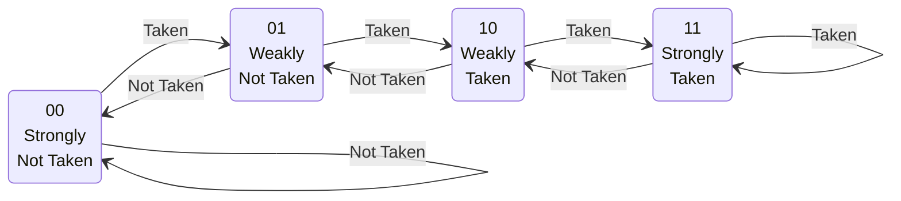

この方式の核心は、予測方向を変更するには**2回連続で反対方向の結果が出る必要がある**という点にある。これにより、ループの最後のNot Takenが1回発生しても、状態はStrongly TakenからWeakly Takenに遷移するだけで、予測方向は依然としてTakenのままである。次のループの最初のイテレーションでは正しくTakenと予測でき、1ビット予測器に比べて1回分の予測ミスを削減できる。

2ビット飽和カウンタは実装が非常にシンプル（加算・減算と飽和処理のみ）であり、現在でも多くの予測器の基本構成要素として使われている。

### 3.4 BHTのエイリアシング問題

BHTは分岐命令のPCの下位ビットでインデックスされるため、異なる分岐命令が同じエントリにマッピングされる**エイリアシング（aliasing）**の問題が生じる。エイリアシングが発生すると、互いに無関係な分岐命令が同じカウンタを更新し合い、予測精度が劣化する。

この問題への対処として、BHTのエントリ数を増やす方法があるが、ハードウェア面積は有限である。より洗練された対処法は、後述するインデックス関数にハッシュを導入する方法（gshare等）である。

## 4. 相関型予測器

### 4.1 分岐間の相関

2ビットカウンタ予測器は個々の分岐命令を独立に扱うが、実際のプログラムでは**分岐同士に相関関係**が存在することが多い。

```c
// correlated branches example
if (x == 0)       // branch 1
    y = 1;

if (y == 1)       // branch 2
    z = x + y;
```

この例では、branch 1がtakenであれば `y = 1` が実行されるため、branch 2もtakenになる可能性が極めて高い。このような分岐間の相関を活用するのが**相関型予測器（Correlating Predictor）**である。

### 4.2 グローバル履歴レジスタ（GHR）

相関型予測器の基本構成要素は**グローバル履歴レジスタ（Global History Register: GHR）**である。GHRはシフトレジスタであり、直近のN個の分岐結果（taken/not taken）をビット列として保持する。

例えば、直近4回の分岐結果が「Taken, Not Taken, Taken, Taken」であれば、GHRの内容は `1011` となる。

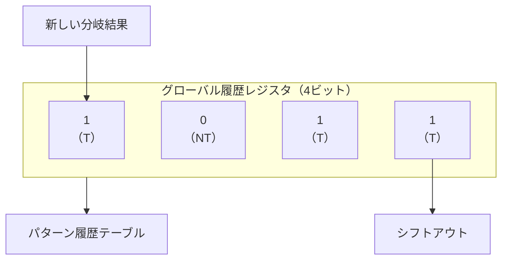

### 4.3 Two-Level Adaptive Predictor

Yeh and Patt（1991年）が提案した**Two-Level Adaptive Predictor**は、分岐予測の精度を飛躍的に向上させた画期的な手法である。この予測器は2つのレベルで構成される。

- **第1レベル**: 分岐履歴の記録（GHRまたはローカル履歴レジスタ）
- **第2レベル**: パターン履歴テーブル（Pattern History Table: PHT）— 履歴パターンごとに2ビットカウンタを持つテーブル

予測時には、GHRの内容をインデックスとしてPHTを参照し、対応する2ビットカウンタの値から予測方向を決定する。

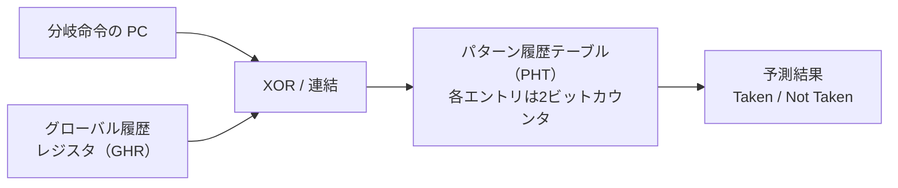

この手法の強みは、「最近の分岐パターンが TNTNT（交互）であった場合、次は T になりやすい」といった**パターンベースの予測**が可能になることである。

### 4.4 gshare 予測器

McFarling（1993年）が提案した**gshare**は、最も広く使われた相関型予測器の一つである。gshareの特徴は、GHRと分岐命令のPCを**XOR**して得たハッシュ値でPHTをインデックスする点にある。

$$
\text{index} = \text{PC}[\text{low bits}] \oplus \text{GHR}
$$

XORを使うことで、PCの情報とグローバル履歴の情報を1つのインデックスに効率的に混合でき、エイリアシングの発生を抑制できる。PCのみやGHRのみでインデックスする方式に比べ、同じテーブルサイズでより高い精度を実現する。

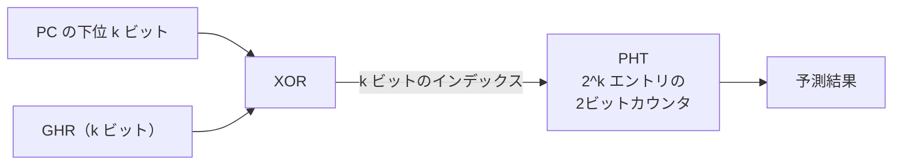

gshareはシンプルでありながら高い予測精度を持つため、多くのプロセッサで基本的な予測器として採用された。Alpha 21264やAMD K6などがgshareベースの予測器を使用していた。

### 4.5 ローカル履歴 vs グローバル履歴

相関型予測器には、グローバル履歴を使うものとローカル履歴を使うものがある。

- **グローバル履歴**: プログラム全体で直近のN個の分岐結果を共有する。異なる分岐命令間の相関を捉えるのに適している。
- **ローカル履歴**: 各分岐命令ごとに独自の履歴レジスタを持つ。特定の分岐命令の固有のパターン（例: 3回に1回だけ taken になるようなパターン）を捉えるのに適している。

どちらが優れているかはプログラムの性質に依存する。この洞察が、次に述べるTournament Predictorの設計思想につながる。

## 5. Tournament Predictor（トーナメント予測器）

### 5.1 設計思想

異なる予測器はそれぞれ異なる種類の分岐パターンに強みを持つ。グローバル履歴ベースの予測器は分岐間の相関に強く、ローカル履歴ベースの予測器は個々の分岐の固有パターンに強い。**Tournament Predictor**は、複数の予測器を組み合わせ、分岐命令ごとに最も精度の高い予測器を動的に選択するメタ予測器である。

McFarling（1993年）の論文で提案されたこの概念は、Alpha 21264プロセッサ（1998年）で初めて商用実装された。

### 5.2 構成と動作

Tournament Predictorは以下の3つの構成要素からなる。

1. **予測器P1**: グローバル履歴ベースの予測器（例: gshare）
2. **予測器P2**: ローカル履歴ベースの予測器
3. **選択テーブル（Choice Table / Meta-Predictor）**: 各分岐命令に対してどちらの予測器を使うかを決定する2ビットカウンタのテーブル

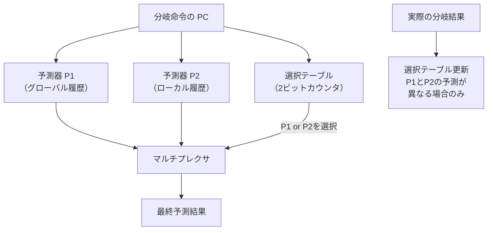

選択テーブルの更新ルールが重要である。P1とP2の予測が一致している場合、どちらが正しかったかは区別できないため更新しない。P1とP2の予測が異なる場合にのみ、正しかった方の予測器の方向にカウンタを更新する。

### 5.3 Alpha 21264の実装

Alpha 21264のTournament Predictorは以下の構成であった。

- **グローバル予測器**: 12ビットのグローバル履歴レジスタ + 4096エントリのPHT（2ビットカウンタ）
- **ローカル予測器**: 1024エントリのローカル履歴テーブル（各10ビット） + 1024エントリのローカルPHT（3ビットカウンタ）
- **選択テーブル**: 4096エントリの2ビットカウンタ

この構成で、SPECベンチマークにおいて約96%の予測精度を達成した。これは当時としては極めて高い精度であった。

### 5.4 Tournament Predictorの意義

Tournament Predictorが示した重要な設計原理は、**単一の「最良の」予測器を追求するよりも、異なる特性を持つ複数の予測器を動的に選択する方が高い精度を実現できる**ということである。この考え方は、後述するTAGEをはじめとする現代の高度な予測器の設計にも脈々と受け継がれている。

## 6. TAGE — 現代の最先端予測器

### 6.1 TAGEの誕生と背景

**TAGE（TAgged GEometric history length predictor）**は、Seznec（2006年）によって提案された分岐予測器であり、現代の高性能プロセッサにおける分岐予測の事実上の標準となっている。Intel のSandy Bridge以降のマイクロアーキテクチャや、AMDのZenシリーズなど、多くの商用プロセッサがTAGEまたはその変種を採用している。

TAGEは、Championship Branch Prediction（CBP）コンペティションで圧倒的な性能を示し、2006年以降の分岐予測研究の方向性を決定づけた。

### 6.2 幾何級数的履歴長

TAGEの中核的なアイデアは、**異なる長さのグローバル履歴**を同時に活用することである。短い履歴で捉えられるパターンもあれば、非常に長い履歴が必要なパターンもある。TAGEは、複数のテーブル（コンポーネント）を持ち、各テーブルが異なる長さの履歴を使う。

重要なのは、履歴長が**幾何級数的（geometric series）**に増加するよう設計されている点である。

$$
L_i = (int)(\alpha^{i-1} \times L_1 + 0.5), \quad i = 1, 2, \ldots, N
$$

例えば、5つのテーブルで $L_1 = 5$、$\alpha = 2$ とすると、各テーブルの履歴長は概ね 5, 10, 20, 40, 80 のようになる。この幾何級数的な配置により、短い相関から長い相関まで、幅広いパターンを効率的にカバーできる。

### 6.3 TAGEの構成

TAGEは以下のコンポーネントで構成される。

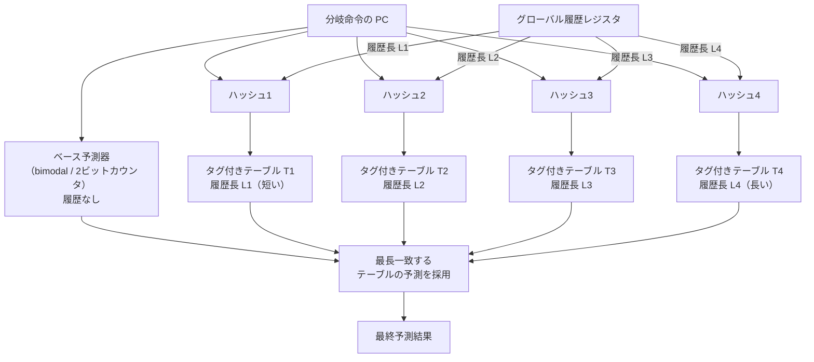

1. **ベース予測器（Base Predictor / T0）**: タグなしの2ビットカウンタテーブル。すべての分岐に対してデフォルトの予測を提供する。
2. **タグ付きテーブル T1〜TN**: 各テーブルはそれぞれ異なる長さの履歴を使ってインデックスされる。各エントリにはタグ（分岐命令の識別情報）、予測カウンタ、有用性カウンタ（useful counter）が格納される。

### 6.4 予測と更新のアルゴリズム

**予測時**: すべてのタグ付きテーブルを並列に参照し、タグが一致するテーブルのうち**最も長い履歴長**を持つテーブルの予測を採用する。どのタグ付きテーブルにもヒットしない場合は、ベース予測器の結果を使う。

この「最長一致」の原則は直感的に理解できる。より長い履歴が一致するということは、より特殊で具体的な文脈情報が活用されていることを意味し、一般的にはより正確な予測が期待できるからである。

**更新時**: 予測が正しかった場合はヒットしたエントリのカウンタを強化する。予測が外れた場合は、ヒットしたエントリのカウンタを弱化するとともに、より長い履歴を持つテーブルに新しいエントリを割り当てる（allocate）。有用性カウンタ（useful counter）は、エントリが実際に正しい予測に貢献しているかどうかを追跡し、不要なエントリの置換に使われる。

### 6.5 TAGEの予測精度

TAGEは、SPECベンチマーク等の標準的なワークロードに対して**97〜99%** の予測精度を達成する。これは、ミス率にして1〜3%という驚異的な数値である。

$$
\text{ミスペナルティの影響} = \text{分岐頻度} \times \text{ミス率} \times \text{ペナルティ} = 0.20 \times 0.02 \times 15 = 0.06 \text{ CPI}
$$

分岐予測なしの場合のペナルティが3.0 CPI（追加分）であったのに対し、TAGEを使えば追加分はわずか0.06 CPIに抑えられる。分岐予測による性能向上は**50倍**にも達することになる。

### 6.6 TAGEの派生と発展

TAGEは基本設計の優秀さから、多くの派生形が研究されている。

- **TAGE-SC-L**: TAGEに統計的補正器（Statistical Corrector: SC）とループ予測器（Loop Predictor: L）を組み合わせた予測器。CBPコンペティションで優勝した実績を持つ。
- **ITTAGE**: 間接分岐（indirect branch）に特化したTAGEの変種。
- **BATAGE**: より少ないハードウェアリソースで効率的に動作するTAGEの変種。

## 7. 投機的実行

### 7.1 投機的実行とは

**投機的実行（Speculative Execution）**とは、分岐予測の結果に基づいて、分岐の結果が確定する前に予測パス上の命令を実際に実行してしまう技術である。予測が正しければ実行結果はそのまま確定され（コミット）、予測が外れた場合は実行結果が破棄（ロールバック）される。

投機的実行は分岐予測と表裏一体の技術であり、分岐予測なしの投機的実行は意味をなさず、投機的実行なしの分岐予測は効果が限定的である。

### 7.2 投機的実行の仕組み

投機的実行を支えるための主要なハードウェア機構は以下の通りである。

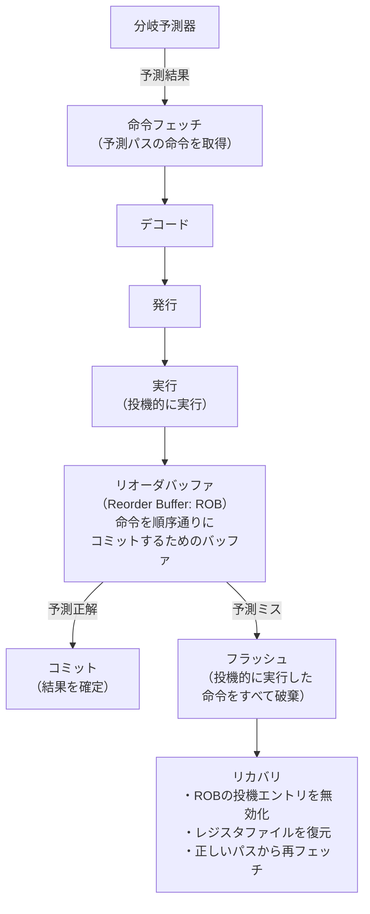

1. **リオーダバッファ（Reorder Buffer: ROB）**: 投機的に実行された命令の結果を一時的に保持する。命令はプログラム順にROBに登録され、分岐が確定するまでコミットされない。
2. **レジスタリネーミング**: 投機的に書き換えられるレジスタを物理レジスタにマッピングし、投機失敗時に元のマッピングに復元できるようにする。
3. **ストアバッファ**: 投機的なストア命令の結果はストアバッファに保持され、メインメモリ（キャッシュ）への書き込みはコミット時まで遅延される。

### 7.3 予測ミス時のリカバリ

分岐予測が外れた場合のリカバリは、高性能プロセッサにおいて最もコストの高い操作の一つである。リカバリの手順は概ね以下のようになる。

1. **パイプラインのフラッシュ**: 誤った予測パスに基づいてフェッチ・実行されたすべての命令を無効化する。
2. **アーキテクチャ状態の復元**: レジスタマッピングを分岐命令時点の状態に巻き戻す。チェックポイント方式を用いるプロセッサでは、分岐命令ごとにスナップショットを保存しておくことで高速な復元が可能になる。
3. **正しいパスからの再フェッチ**: 分岐の正しい結果に基づいて、正しいアドレスから命令のフェッチを再開する。

現代の高性能プロセッサでは、ROBに100〜300以上の命令を同時に保持できる。予測ミス時にこれらすべてが無駄になる可能性があることを考えると、高い予測精度がいかに重要であるかが理解できる。

### 7.4 分岐ターゲットバッファ（BTB）

分岐予測器が「taken/not taken」を予測するだけでは不十分である。takenと予測した場合、ジャンプ先のアドレスも即座に知る必要がある。これを提供するのが**分岐ターゲットバッファ（Branch Target Buffer: BTB）**である。

BTBはキャッシュ構造を持ち、分岐命令のPCをキーとして、ジャンプ先アドレスを保持する。フェッチステージで次のPCを決定する際に、分岐予測器の予測方向とBTBのターゲットアドレスの両方が参照される。

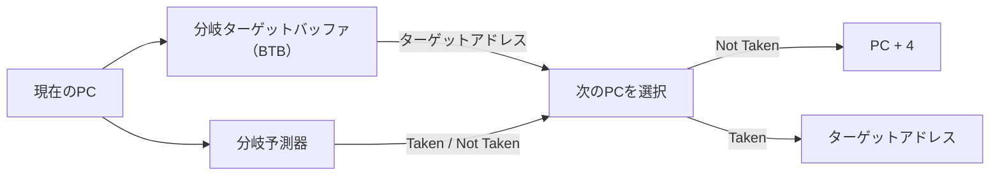

間接分岐（関数ポインタやvirtual dispatch等）の場合、ターゲットアドレスは毎回変わり得るため、**間接分岐ターゲットバッファ（Indirect Branch Target Buffer）**が別途設けられることがある。

### 7.5 リターンアドレススタック（RAS）

関数からのリターン命令（`ret`）は間接分岐の一種であるが、そのターゲットアドレス（呼び出し元のアドレス）は呼び出しスタックに対応した規則的なパターンを持つ。**リターンアドレススタック（Return Address Stack: RAS）**は、`call` 命令実行時にリターンアドレスをハードウェアスタックにプッシュし、`ret` 命令実行時にポップすることで、リターン命令のターゲットを高い精度で予測する。

RASは比較的小さなハードウェア（8〜32エントリ程度）で非常に高い精度を実現でき、関数呼び出しが頻繁なプログラムの性能に大きく貢献する。

## 8. Spectre脆弱性との関係

### 8.1 投機的実行の「副作用」

2018年1月に公開されたSpectre脆弱性（CVE-2017-5753, CVE-2017-5715）は、コンピュータセキュリティの歴史において画期的な事件であった。Spectreは、分岐予測と投機的実行という**性能最適化のための正当なCPU機能**がセキュリティ上の脅威となりうることを示した。

投機的実行された命令は、予測ミスが判明した時点でアーキテクチャ上は「なかったこと」にされる。レジスタの値は復元され、メモリへの書き込みは破棄される。しかし、投機的実行中にCPUキャッシュに読み込まれたデータのキャッシュラインは、ロールバック後もキャッシュに残り続ける。このキャッシュ状態の変化は**マイクロアーキテクチャ上の副作用（side effect）**であり、これを**サイドチャネル**として利用することでメモリの内容を推測できてしまう。

### 8.2 Spectre Variant 1（Bounds Check Bypass）

Spectre Variant 1は、条件分岐の投機的実行を悪用する攻撃である。

```c
// vulnerable code pattern
if (x < array1_size) {          // bounds check
    y = array2[array1[x] * 256]; // speculative access
}
```

攻撃の手順は以下の通りである。

1. 攻撃者は、`x < array1_size` の条件が成立するような値で何度も関数を呼び出し、分岐予測器を「taken」方向に**訓練**する。
2. その後、`x` として配列の範囲外の値（例: アクセスしたい秘密データのオフセット）を渡す。
3. 分岐予測器は訓練の結果に基づいて「taken」と予測し、範囲チェックが成立すると投機的に判断して、`array1[x]`（範囲外アクセス、秘密データの読み取り）を投機的に実行する。
4. 秘密データの値に応じて `array2` の異なる位置がキャッシュに読み込まれる。
5. 投機的実行はロールバックされるが、`array2` のキャッシュ状態は変化したままである。
6. 攻撃者はFlush+Reloadなどのキャッシュサイドチャネル攻撃によって、`array2` のどの位置がキャッシュされているかを測定し、秘密データの値を推測する。

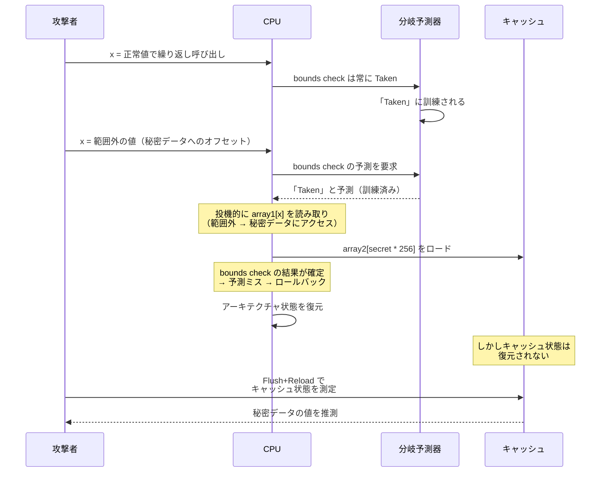

### 8.3 Spectre Variant 2（Branch Target Injection）

Spectre Variant 2は、間接分岐の予測を悪用する攻撃である。攻撃者がBTBを汚染（ポイズニング）し、間接分岐のターゲットを攻撃者が選んだアドレス（ガジェット）に誤導する。これにより、任意のコードを投機的に実行させ、キャッシュサイドチャネルを通じてデータを窃取する。

### 8.4 対策

Spectre脆弱性への対策は、ハードウェアとソフトウェアの両面で進められている。

**ソフトウェア対策**:
- **Retpoline**: 間接分岐を、RASを利用した制御フローに置き換えることで、BTBポイズニングを無効化する技法。Googleのエンジニアによって考案された。
- **LFENCE**: 投機的実行のバリアとなるシリアライズ命令を挿入する。性能への影響が大きい。
- **配列インデックスのマスキング**: 投機的実行時でも範囲外アクセスを防ぐよう、インデックスをビットマスクで制限する。

**ハードウェア対策**:
- **IBRS / IBPB / STIBP**: Intelが提供するマイクロコード更新による間接分岐予測の制御機構。
- **Enhanced IBRS（eIBRS）**: 新しいCPUでハードウェアレベルで間接分岐予測の分離を実現。
- **SSBD（Speculative Store Bypass Disable）**: Spectre Variant 4への対策。

### 8.5 Spectreが示した教訓

Spectreは、コンピュータアーキテクチャにおける**性能とセキュリティのトレードオフ**を鮮明に浮き彫りにした。投機的実行は数十年にわたって性能向上の主要な柱であったが、そのマイクロアーキテクチャ上の副作用がセキュリティ上の脅威となることは、2018年まで広く認識されていなかった。

Spectre以降、プロセッサ設計ではセキュリティが性能と同等の重要性を持つ設計指標として位置づけられるようになった。新しいCPUアーキテクチャでは、投機的実行の副作用を最小化するための設計上の工夫が積極的に取り入れられている。

## 9. ブランチレスプログラミング

### 9.1 分岐予測ミスのソフトウェア的回避

分岐予測の精度がいかに高くても、予測困難な分岐パターンは存在する。例えば、ランダムなデータに基づく比較結果は、どんな予測器でも正確に予測できない。このような場合、**分岐命令そのものを排除する**ことで予測ミスのペナルティを回避する技法が**ブランチレスプログラミング（branchless programming）**である。

### 9.2 条件付き移動命令（cmov）

x86アーキテクチャの `cmov`（Conditional Move）命令は、条件に基づいてレジスタ間のデータ移動を行うが、制御フローの分岐は発生しない。パイプラインの観点からは通常の演算命令と同様に扱われるため、分岐予測ミスのペナルティが存在しない。

```c
// branching version
int max_branch(int a, int b) {
    if (a > b)
        return a;
    else
        return b;
}

// branchless version using conditional move
int max_branchless(int a, int b) {
    int result = b;
    __asm__ (
        "cmpl %1, %2\n\t"
        "cmovg %2, %0"    // conditional move if greater
        : "+r"(result)
        : "r"(b), "r"(a)
    );
    return result;
}
```

多くのコンパイラは最適化レベルが十分に高ければ、単純な条件式を自動的に `cmov` に変換する。

```c
// compiler often generates cmov for this pattern
int abs_val(int x) {
    return x < 0 ? -x : x;
}
```

### 9.3 算術的手法によるブランチレス化

ビット操作や算術演算を使って条件分岐を排除する技法がある。

```c
// branchless min/max using arithmetic
int branchless_min(int a, int b) {
    // works for integers without overflow risk
    return b + ((a - b) & ((a - b) >> 31));
}

int branchless_max(int a, int b) {
    return a - ((a - b) & ((a - b) >> 31));
}
```

```c
// branchless absolute value
int branchless_abs(int x) {
    int mask = x >> 31;  // all 1s if negative, all 0s if positive
    return (x ^ mask) - mask;
}
```

### 9.4 SIMD を活用したブランチレス処理

SIMD（Single Instruction, Multiple Data）命令は、複数のデータに対して同一の操作を並列に行う。SIMD命令セットには比較結果をマスクとして扱う機能が備わっており、これを活用することでデータ依存の分岐を排除できる。

```c
// branchless clamping with SSE
#include <immintrin.h>

void clamp_array(float* data, int n, float lo, float hi) {
    __m128 vlo = _mm_set1_ps(lo);
    __m128 vhi = _mm_set1_ps(hi);

    for (int i = 0; i < n; i += 4) {
        __m128 v = _mm_loadu_ps(&data[i]);
        v = _mm_max_ps(v, vlo);  // branchless clamp to lower bound
        v = _mm_min_ps(v, vhi);  // branchless clamp to upper bound
        _mm_storeu_ps(&data[i], v);
    }
}
```

### 9.5 実用的なブランチレスの例 — ソート

ソートアルゴリズムにおいて、要素の比較と交換は頻繁に行われる。この操作をブランチレスにすることで、ランダムなデータに対する性能を大幅に改善できる。

```c
// branching swap
void cond_swap_branch(int* a, int* b) {
    if (*a > *b) {
        int tmp = *a;
        *a = *b;
        *b = tmp;
    }
}

// branchless swap
void cond_swap_branchless(int* a, int* b) {
    int diff = *a - *b;
    int mask = diff >> 31;  // 0 if a >= b, -1 if a < b
    // if a > b: mask = 0, so swap occurs via XOR trick
    // Alternatively:
    int min = *b + (diff & mask);
    int max = *a - (diff & mask);
    *a = min;
    *b = max;
}
```

### 9.6 ブランチレスプログラミングの注意点

ブランチレスプログラミングは万能の最適化ではない。以下の点を考慮する必要がある。

**効果的なケース**:
- 分岐の方向がランダムに近い場合（予測精度が50%程度）
- ホットループ内の短い条件分岐
- データ依存の分岐パターンが不規則な場合

**逆効果になるケース**:
- 分岐の方向が偏っている場合（予測器が95%以上の精度で予測可能）: ブランチレス化により、不要な計算（常に実行される両方のパスの演算）が追加され、予測器が正しく予測できる場合よりも遅くなることがある。
- 分岐の一方のパスが重い処理を含む場合: 分岐版であればパスが選択されない限りその処理は実行されないが、ブランチレス版では常に両方のパスの計算が行われる。
- コードの可読性が大きく損なわれる場合: ブランチレスコードは一般にトリッキーであり、保守性が低下する。

::: tip 最適化の鉄則
ブランチレスプログラミングは**プロファイリングの結果に基づいて**適用すべきである。分岐予測ミスがボトルネックであることを確認せずにブランチレス化を行うのは、早すぎる最適化の典型例である。`perf stat` の `branch-misses` カウンタや、Intel VTune の Branch Analysis などのツールで分岐予測ミスの頻度を計測し、実際にペナルティが顕著な箇所にのみ適用することが重要である。
:::

### 9.7 コンパイラの役割

現代のコンパイラは、分岐のブランチレス化について高度な最適化を行う。GCCやClangは、プロファイルガイド最適化（PGO: Profile-Guided Optimization）の情報を活用して、分岐予測ミスが多い箇所を自動的に `cmov` や条件付き選択命令に変換する。

```bash
# profile-guided optimization workflow
gcc -O2 -fprofile-generate -o program program.c  # instrumented build
./program < training_data                          # collect profile
gcc -O2 -fprofile-use -o program program.c        # optimized build
```

PGOでは、実際の実行プロファイルに基づいてコンパイラが分岐の方向の偏りを把握し、予測困難な分岐を自動的にブランチレス化する判断を行える。

## 10. まとめと今後の展望

### 10.1 分岐予測の進化の軌跡

分岐予測は、パイプラインプロセッサの登場とともに生まれた技術であり、半世紀以上にわたって進化を続けてきた。

| 年代 | 予測器の種類 | 代表的な精度 | 主要な進展 |
|:---:|:---|:---:|:---|
| 1980年代 | 静的予測（BTFNT等） | 60〜75% | パイプライン導入初期 |
| 1981年 | 2ビット飽和カウンタ | 80〜85% | Smith による提案 |
| 1991年 | Two-Level Adaptive | 90〜95% | Yeh & Patt による提案 |
| 1993年 | gshare / Tournament | 93〜97% | McFarling による提案 |
| 2006年 | TAGE | 97〜99% | Seznec による提案 |
| 2010年代〜 | TAGE-SC-L 等 | 99%+ | ニューラル分岐予測との融合研究 |

### 10.2 ニューラル分岐予測

近年、機械学習の手法を分岐予測に応用する研究が進んでいる。**パーセプトロン予測器（Perceptron Predictor）**は、Jimenez and Lin（2001年）によって提案され、AMDのZenシリーズのプロセッサで採用実績がある。パーセプトロン予測器は、グローバル履歴の各ビットに重みを持たせ、重み付き和の符号で予測方向を決定する。

$$
y = w_0 + \sum_{i=1}^{n} w_i \times h_i
$$

ここで $h_i$ は履歴ビット（+1 または -1）、$w_i$ は学習される重み、$w_0$ はバイアスである。$y > 0$ なら taken、$y \leq 0$ なら not taken と予測する。

パーセプトロン予測器はTAGEと異なるアプローチであり、線形分離可能なパターンに対して高い精度を示す。一方、XOR型のパターン（線形分離不可能）には弱いという理論的限界がある。実用的には、TAGEとパーセプトロンを組み合わせたハイブリッド予測器が研究されている。

### 10.3 セキュリティとのバランス

Spectre脆弱性の発覚以降、分岐予測と投機的実行の設計にはセキュリティの観点が不可欠となった。今後のプロセッサ設計では、以下のような方向性が模索されている。

- **投機的実行のサイドチャネルの最小化**: 投機的実行中のキャッシュアクセスを分離・制限する
- **ドメイン分離**: 異なるセキュリティドメイン（カーネル/ユーザ空間、異なるプロセス間）で分岐予測器の状態を分離する
- **投機的タイントトラッキング**: 投機的にロードされたデータの使用を追跡し、サイドチャネルとなりうる操作を制限する

### 10.4 分岐予測の本質的意義

分岐予測は、**制御フローの不確実性**という本質的な問題に対するハードウェアの回答である。プログラムは逐次的な命令列として記述されるが、条件分岐の存在により、次に実行される命令は実行時まで確定しない。この不確実性にもかかわらず、パイプラインプロセッサは毎サイクル新しい命令をフェッチし続けなければならない。

この矛盾を解決するために、プロセッサは**過去のパターンから未来を推測する**という、ある種の帰納的推論をハードウェアレベルで実装している。2ビットカウンタからTAGE、パーセプトロンに至るまで、その手法は洗練されてきたが、根底にある原理は「過去の振る舞いは未来の振る舞いの良い予測子である」という統計的事実への依拠である。

分岐予測は、コンピュータアーキテクチャにおいて理論と実装が最も密接に結びついた領域の一つであり、その進化はプロセッサ性能の向上と直結してきた。そしてSpectreが示したように、性能最適化の帰結がセキュリティ上の脅威となりうるという事実は、コンピュータサイエンスにおける設計上のトレードオフの奥深さを物語っている。
