# ブラウザのネットワーク最適化

## 1. ブラウザのネットワークスタック概要

### 1.1 なぜブラウザのネットワーク最適化が重要なのか

現代のWebページは、2010年代初頭と比較して劇的に複雑になった。HTTP Archiveの調査によれば、2025年時点でデスクトップ向けWebページの中央値は約2.5MBのデータを転送し、70以上のHTTPリクエストを発行する。モバイルでも状況は同様であり、多くのユーザーが帯域幅の制約やレイテンシの高いネットワーク環境でWebを利用している。

ユーザー体験の観点では、ページの読み込み速度はビジネスに直結する。Googleの調査では、モバイルページの読み込みが1秒から3秒に増加すると直帰率が32%上昇し、5秒になると90%上昇するとされている。Amazonも100ミリ秒のレイテンシ増加で売上が1%減少するという有名な分析結果を公表している。

こうした背景から、ブラウザのネットワークスタックの仕組みを理解し、適切な最適化を施すことは、現代のWeb開発者にとって不可欠なスキルとなっている。

### 1.2 ブラウザのネットワークスタックの全体像

ブラウザがURLを受け取ってからページを表示するまでの間に、数多くのネットワーク処理が行われる。その全体像を俯瞰してみよう。

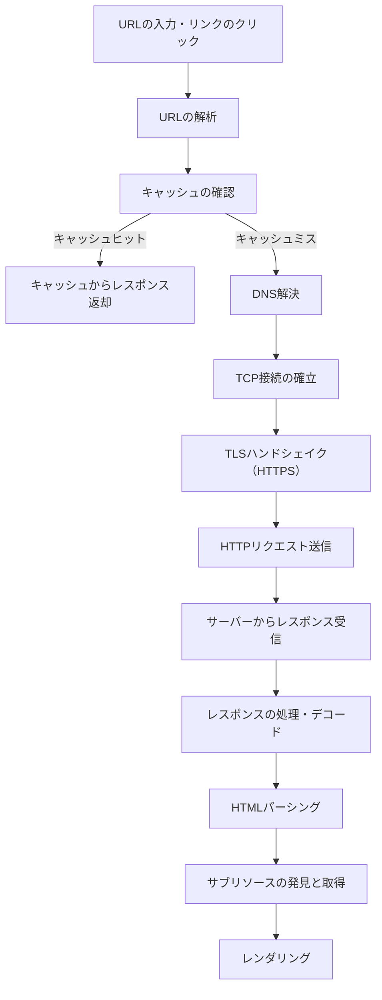

この一連のプロセスの中で、ネットワーク関連の処理が大きな割合を占める。DNS解決には数十ミリ秒から数百ミリ秒、TCP接続の確立には1RTT（Round Trip Time）、TLSハンドシェイクにはさらに1〜2RTTが必要だ。これらの「接続セットアップコスト」は、リソースの取得自体にかかる時間に上乗せされる。

### 1.3 ネットワークスタックの内部構造

モダンブラウザ（Chrome、Firefox、Safari、Edge）のネットワークスタックは、高度に最適化された多層構造を持っている。Chromeを例に取ると、そのネットワークスタックは以下のような構成になっている。

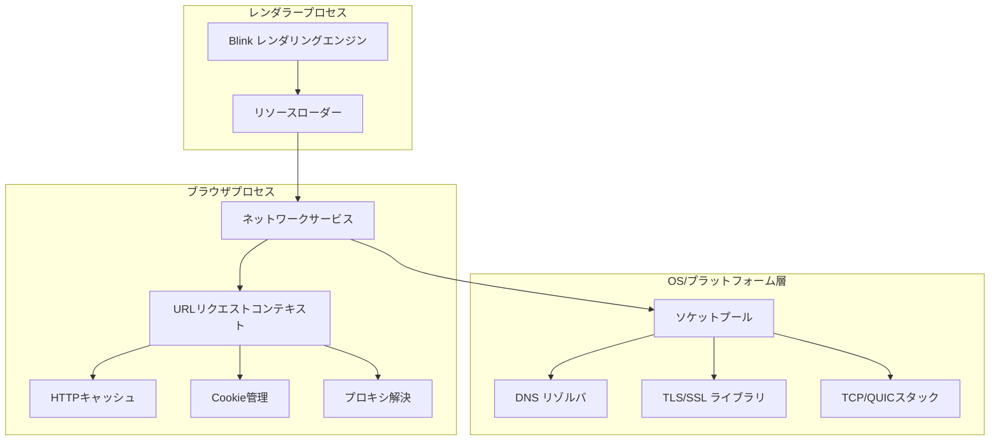

レンダラープロセスでHTMLのパーシング中にリソースの参照が発見されると、リソースローダーがネットワークサービスにリクエストを送る。ネットワークサービスは、キャッシュの確認、Cookie の付与、プロキシ設定の解決などを行った上で、ソケットプールを通じて実際のネットワーク通信を実行する。

重要なのは、これらの処理がブラウザのレンダラープロセスとは分離されたプロセス（またはスレッド）で実行されることだ。これにより、ネットワーク I/O がメインスレッドをブロックすることなく、レンダリングとネットワーク処理が並行して進行できる。

## 2. DNS解決の最適化

### 2.1 DNSルックアップの隠れたコスト

Webページを読み込む際、ブラウザはまずドメイン名をIPアドレスに変換するDNS解決を行う必要がある。一つのページが複数のドメインからリソースを取得する場合（CDNからの画像、サードパーティのアナリティクス、広告ネットワークなど）、それぞれのドメインに対してDNS解決が発生する。

DNS解決は通常20〜120ミリ秒ほどかかるが、ネットワーク状況や再帰リゾルバの負荷によっては数百ミリ秒に達することもある。モバイルネットワークでは特に顕著で、4G環境でも200ミリ秒を超える場合がある。

ブラウザにはDNSキャッシュが搭載されており、一度解決したドメインのIPアドレスはTTLの間保持される。しかし初回アクセスやキャッシュが期限切れの場合には、必ずDNS解決のコストが発生する。

### 2.2 dns-prefetch

`dns-prefetch`は、将来必要になりそうなドメインのDNS解決を事前に行うヒントである。

```html
<link rel="dns-prefetch" href="https://cdn.example.com">
<link rel="dns-prefetch" href="https://api.example.com">
<link rel="dns-prefetch" href="https://fonts.googleapis.com">
```

ブラウザはこのヒントを受け取ると、バックグラウンドでDNS解決を実行する。実際にリソースが必要になったときには、既にIPアドレスが判明しているため、接続の確立が高速化される。

`dns-prefetch`は低コストな最適化であり、DNSパケットの送受信のみでTCP接続やTLSハンドシェイクは行わない。そのため、外部ドメインのリソースを参照しているページでは積極的に指定してよい。ただし、実際に使用しないドメインに対して`dns-prefetch`を指定すると、DNSリゾルバに無意味な負荷をかけるだけなので避けるべきだ。

### 2.3 preconnect

`preconnect`は`dns-prefetch`の上位互換であり、DNS解決に加えてTCP接続の確立とTLSハンドシェイクまでを事前に完了させる。

```html
<link rel="preconnect" href="https://cdn.example.com">
<link rel="preconnect" href="https://fonts.gstatic.com" crossorigin>
```

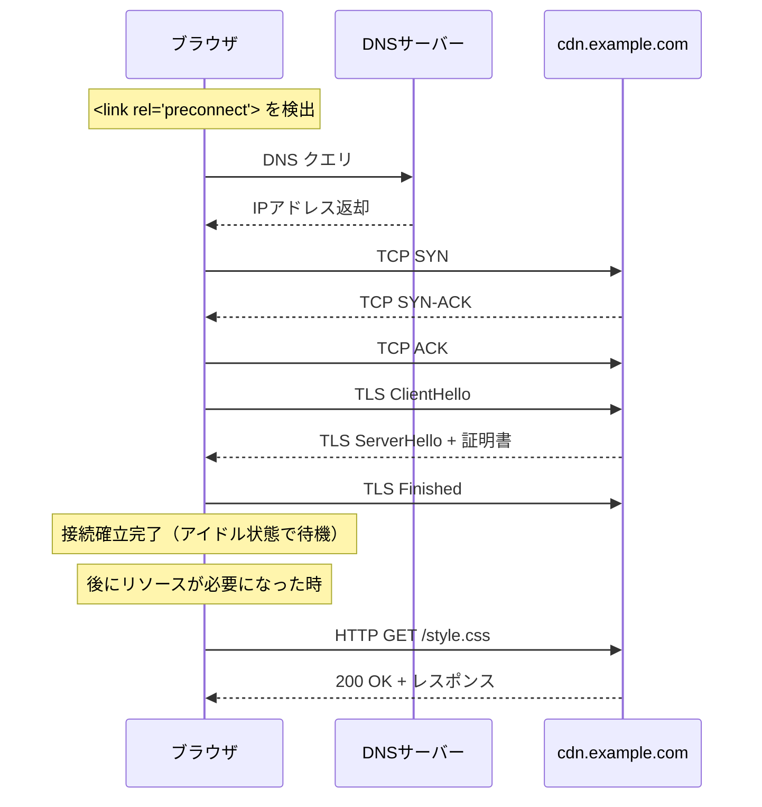

`preconnect`はDNS解決（約50ms）+ TCP接続（1RTT ≈ 約50ms）+ TLSハンドシェイク（1〜2RTT ≈ 約50〜100ms）を事前に完了させるため、合計で100〜250ミリ秒の短縮効果がある。ただし、接続はリソースを消費するため（特にサーバー側のソケット）、本当に必要な接続先に対してのみ指定すべきだ。目安としては、クリティカルパス上の外部ドメイン3〜5個程度が適切である。

### 2.4 実践的なDNS最適化戦略

効果的なDNS最適化のためには、まずページがアクセスするドメインを把握することが重要だ。Chrome DevToolsのNetworkパネルでドメインごとのリクエストを確認し、以下の方針で最適化を適用するとよい。

1. **クリティカルパス上の外部ドメイン**: `preconnect`を使用（例：Webフォント、主要CDN）
2. **後から使われる可能性がある外部ドメイン**: `dns-prefetch`を使用（例：サードパーティスクリプトのドメイン）
3. **ユーザーアクション後にのみ使われるドメイン**: JavaScriptで動的に`preconnect`を挿入

```html
<head>
  <!-- Critical third-party origins -->
  <link rel="preconnect" href="https://fonts.googleapis.com">
  <link rel="preconnect" href="https://fonts.gstatic.com" crossorigin>

  <!-- Non-critical origins: DNS prefetch only -->
  <link rel="dns-prefetch" href="https://www.google-analytics.com">
  <link rel="dns-prefetch" href="https://connect.facebook.net">
</head>
```

## 3. HTTP/2とHTTP/3の活用

### 3.1 HTTP/1.1の限界とHTTP/2の登場

HTTP/1.1はWebの基盤として長年機能してきたが、現代のWebアプリケーションにとってはいくつかの根本的な制約を抱えていた。

最大の問題は**Head-of-Line（HoL）ブロッキング**だ。HTTP/1.1では、一つのTCP接続上でリクエストとレスポンスを逐次的に処理しなければならない。パイプライニングが仕様上は存在するが、レスポンスの順序は維持する必要があり、実際にはほとんどのブラウザで無効化されていた。

この制約を回避するために、ブラウザはオリジンあたり最大6つのTCP接続を並列に開いていたが、これには以下の問題があった。

- 接続ごとにTCPスロースタートが発生し、帯域幅の利用効率が低下する
- サーバー側のリソース（メモリ、ソケット）を余分に消費する
- TLSハンドシェイクが接続ごとに必要になる

HTTP/2はこれらの問題を解決するために、**単一のTCP接続上で複数のリクエスト/レスポンスを多重化（Multiplexing）** する仕組みを導入した。

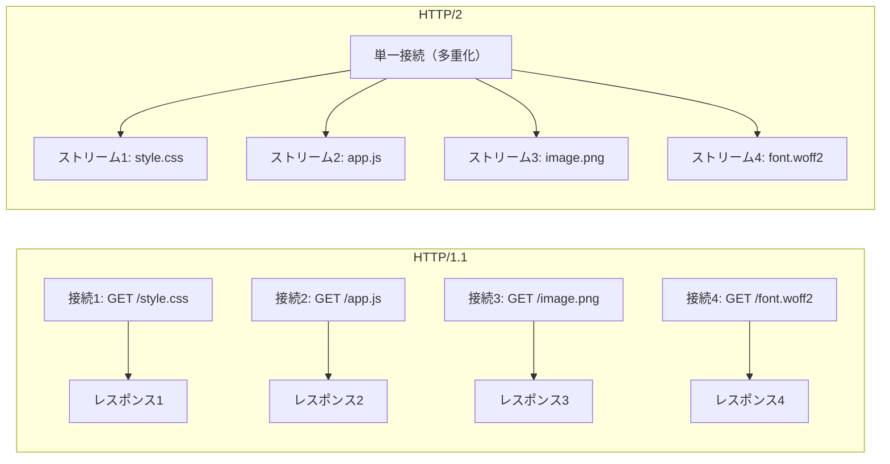

### 3.2 HTTP/2の主要最適化機能

HTTP/2がブラウザのネットワーク性能に寄与する主要な機能を見てみよう。

**ストリーム多重化**: 一つのTCP接続上で複数のストリーム（リクエスト/レスポンスのペア）を同時に処理できる。フレームという単位でデータを分割し、異なるストリームのフレームをインターリーブして送受信する。これにより、HTTP/1.1のHoLブロッキング問題がアプリケーション層では解消される。

**ヘッダ圧縮（HPACK）**: HTTPヘッダはリクエストごとに繰り返し送信されるが、Cookie、User-Agent、Acceptなどの多くのヘッダは値が変わらない。HPACKはハフマン符号化と動的テーブルを組み合わせて、ヘッダの重複を排除する。これにより、ヘッダサイズが80〜90%削減されることもある。

**サーバープッシュ**: サーバーがクライアントのリクエストを待たずに、必要と予測されるリソースを事前に送信できる。例えば、HTMLのリクエストに対して、そのHTMLが参照するCSSやJavaScriptをサーバーから先回りして送信できる。ただし、実際にはキャッシュとの整合性やクライアント側の制御の難しさから、広く活用されるには至らなかった。Chrome 106（2022年）でサーバープッシュのサポートが削除されたことは、この機能の実用性の限界を象徴している。

**ストリーム優先度**: ブラウザはリソースの種類に応じて優先度を設定できる。CSSやJavaScriptなどレンダリングに必要なリソースを高優先度に、画像を低優先度に設定することで、ページの表示開始を早められる。

### 3.3 HTTP/3とQUIC——TCPの限界を超えて

HTTP/2は多くの改善をもたらしたが、TCPに起因する根本的な問題が残った。**TCPレベルのHoLブロッキング**である。TCPは順序通りのバイトストリームを保証するため、あるパケットが失われると、後続のパケットがすべて受信済みであっても、ロスしたパケットの再送を待たなければならない。HTTP/2で多重化されたストリームはすべて同一のTCPバイトストリーム上にあるため、一つのストリームのパケットロスが全ストリームに波及してしまう。

HTTP/3はこの問題を解決するために、トランスポート層をTCPからQUICに置き換えた。

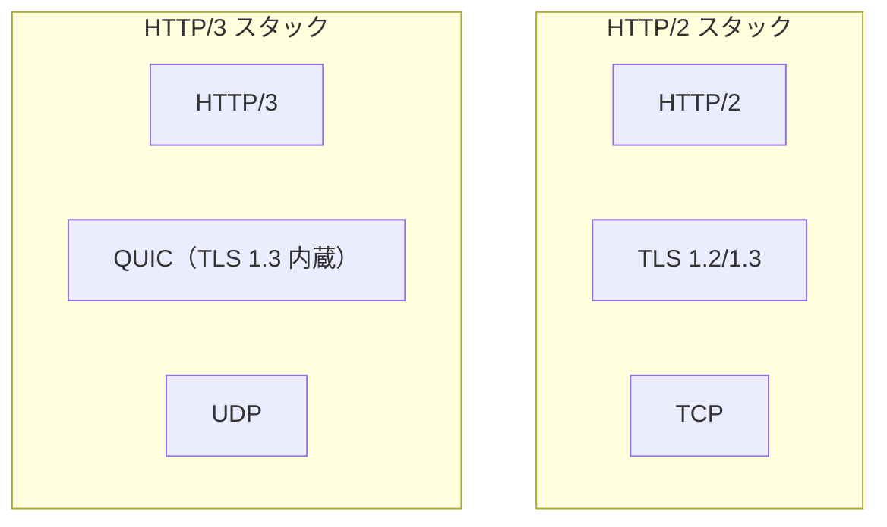

QUICの主要な利点は以下の通りだ。

- **ストリーム単位の独立した配信**: あるストリームでパケットロスが発生しても、他のストリームには影響しない
- **0-RTT接続確立**: 過去に接続したことのあるサーバーに対して、最初のパケットからデータを送信できる（TLS 1.3の0-RTTと統合）
- **コネクションマイグレーション**: IPアドレスが変わっても（Wi-Fiからモバイルへの切り替えなど）、接続を維持できる。これはTCPが4タプル（送信元IP、送信元ポート、宛先IP、宛先ポート）で接続を識別するのに対し、QUICが接続IDで識別するためである

### 3.4 開発者が行うべきHTTP/2・HTTP/3最適化

HTTP/2およびHTTP/3を効果的に活用するために、開発者が意識すべきことがある。

**HTTP/1.1時代のハックを解除する**: ドメインシャーディング（リソースを複数のサブドメインに分散させてブラウザの同時接続制限を回避する手法）は、HTTP/2では逆効果となる。多重化の利点を最大限活用するためには、できるだけ少ないドメインに集約すべきだ。同様に、スプライトシートやCSS/JSの結合といった手法も、HTTP/2環境では必ずしも必要ではない。

**103 Early Hintsの活用**: サーバーがHTMLのレスポンスを生成している間に、先にリソースヒントを送信できるHTTPステータスコードである。サーバーの処理待ち時間を有効活用できる。

```
HTTP/1.1 103 Early Hints
Link: </style.css>; rel=preload; as=style
Link: </app.js>; rel=preload; as=script

HTTP/1.1 200 OK
Content-Type: text/html
...
```

**Priority Hintsの利用**: Fetch Priority API（`fetchpriority`属性）を使って、ブラウザにリソースの優先度を明示的に伝えることができる。

```html
<!-- LCP画像を高優先度に -->


<!-- ファーストビュー外の画像を低優先度に -->


<!-- 重要なスクリプトを高優先度に -->
<script src="critical.js" fetchpriority="high"></script>
```

## 4. リソースヒント

### 4.1 リソースヒントとは何か

リソースヒント（Resource Hints）は、ブラウザに対して「将来必要になるリソース」の情報を事前に伝えるための仕組みだ。ブラウザのパーサーがHTMLを処理しながらリソースを発見するよりも前に、開発者がブラウザに手がかりを与えることで、リソースの取得を早期に開始させることができる。

前述の`dns-prefetch`と`preconnect`もリソースヒントの一種だが、ここではリソース自体の取得に関わるヒントを解説する。

### 4.2 preload——現在のページに必要なリソースの事前取得

`preload`は、現在のページのレンダリングに必要なリソースを、通常の発見タイミングよりも早く取得開始するための指示だ。`preload`はヒントではなく命令であり、ブラウザは指定されたリソースを必ず取得する。

```html
<link rel="preload" href="/fonts/custom.woff2" as="font" type="font/woff2" crossorigin>
<link rel="preload" href="/css/critical.css" as="style">
<link rel="preload" href="/js/main.js" as="script">
```

`as`属性は必須であり、リソースの種類をブラウザに伝える。これにより、ブラウザは適切な優先度設定、Content Security Policy（CSP）のチェック、キャッシュの管理を行える。`as`属性を省略すると、リソースが二重にダウンロードされるなどの問題が発生する場合がある。

`preload`が特に効果を発揮するケースを挙げる。

- **Webフォント**: CSSが読み込まれ、パースされ、レンダリングツリーが構築された後にしか発見されないため、発見が遅い
- **CSSの`background-image`**: CSSの適用後にしか発見されない
- **CSSの`@import`**: CSSファイルが読み込まれた後にしか発見されない
- **JavaScriptで動的に読み込まれるリソース**: スクリプトの実行まで発見されない

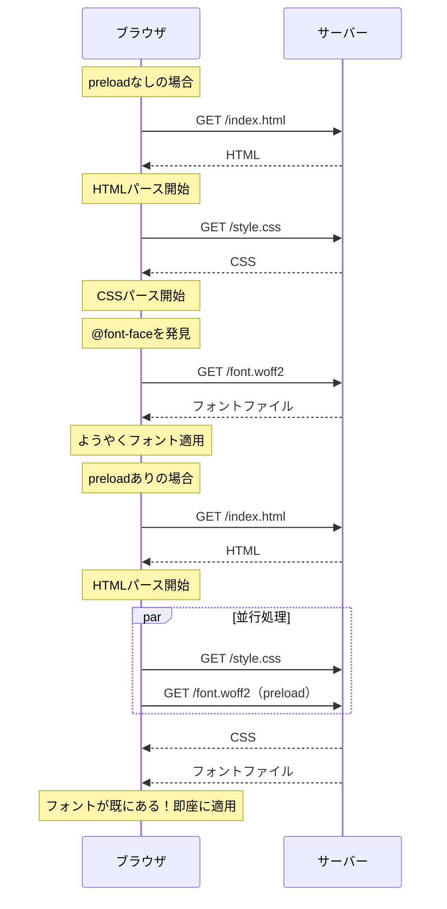

ただし、`preload`は万能ではない。必要のないリソースを`preload`すると帯域幅を浪費し、本当に必要なリソースの取得を遅らせる可能性がある。Chrome DevToolsのコンソールには、`preload`されたのに3秒以内に使用されなかったリソースに対して警告が表示される。

### 4.3 prefetch——将来のナビゲーションのための事前取得

`prefetch`は、将来のナビゲーション（次のページ遷移など）で必要になりそうなリソースを、現在のページのアイドル時間に低優先度で取得しておく仕組みだ。

```html
<link rel="prefetch" href="/next-page.html">
<link rel="prefetch" href="/js/next-page-bundle.js">
```

`preload`と`prefetch`の違いは明確だ。

| 特性 | `preload` | `prefetch` |
|------|-----------|------------|
| 用途 | 現在のページで必要 | 将来のナビゲーションで必要 |
| 優先度 | 高い（`as`属性による） | 低い（Lowest） |
| 取得タイミング | 即座に開始 | ブラウザのアイドル時 |
| キャッシュ | メモリキャッシュ | HTTPキャッシュ |
| 必須性 | 命令（必ず取得） | ヒント（ブラウザが判断） |

`prefetch`はユーザーの次のアクション（ナビゲーション）を予測して適用する。例えば、ECサイトの商品一覧ページでは、ユーザーがクリックしそうな商品詳細ページのリソースを`prefetch`することで、遷移時の体感速度を大幅に改善できる。

### 4.4 Speculation Rules API——次世代のプリレンダリング

従来の`<link rel="prerender">`は、メモリ消費が大きくセキュリティ上の懸念もあったことから、多くのブラウザで実質的に`prefetch`と同等の動作に格下げされていた。これに代わるものとして、Chrome 109以降で**Speculation Rules API**が導入された。

```html
<script type="speculationrules">
{
  "prerender": [
    {
      "where": {
        "href_matches": "/products/*"
      },
      "eagerness": "moderate"
    }
  ],
  "prefetch": [
    {
      "where": {
        "href_matches": "/blog/*"
      },
      "eagerness": "conservative"
    }
  ]
}
</script>
```

Speculation Rules APIは以下の点で従来のアプローチよりも優れている。

- **eagerness制御**: `immediate`（即座に）、`eager`（早期に）、`moderate`（ホバー時）、`conservative`（クリック時）の4段階で投機的な実行のタイミングを制御できる
- **条件指定**: URLパターンやCSS セレクタを使って、対象リンクを柔軟に指定できる
- **リソース制限**: ブラウザがメモリやCPUの状況を考慮して、投機的レンダリングの実行を制御する
- **プリレンダリング**: 完全なページのレンダリング（JavaScript実行を含む）を事前に行い、ユーザーのクリック時に即座にページを表示できる

## 5. 接続管理とコネクションプール

### 5.1 ブラウザの接続管理戦略

ブラウザは、ネットワーク接続を効率的に管理するためにコネクションプールを維持している。TCP（またはQUIC）接続の確立には時間がかかるため、一度確立した接続を再利用することで、後続のリクエストの遅延を削減できる。

ブラウザの接続管理には以下のような制約と最適化がある。

**オリジンごとの接続数制限**: HTTP/1.1では、ブラウザはオリジン（スキーム + ホスト + ポート）ごとに最大6つの並列TCP接続を維持する。HTTP/2では理論上1つの接続で十分だが、実際にはフォールバック用に複数の接続を保持する場合がある。

**接続の再利用（Keep-Alive）**: HTTP/1.1のデフォルトである持続的接続により、TCP接続をリクエスト間で再利用する。ブラウザは接続のアイドルタイムアウト（通常300秒前後）を管理し、一定時間使用されない接続を閉じる。

**接続の合体（Connection Coalescing）**: HTTP/2では、同じIPアドレスに解決され、かつ同じTLS証明書でカバーされる異なるドメインの接続を一つに統合できる。例えば、`www.example.com`と`api.example.com`が同じIPアドレスを指し、ワイルドカード証明書`*.example.com`でカバーされている場合、一つのHTTP/2接続でリクエストを処理できる。

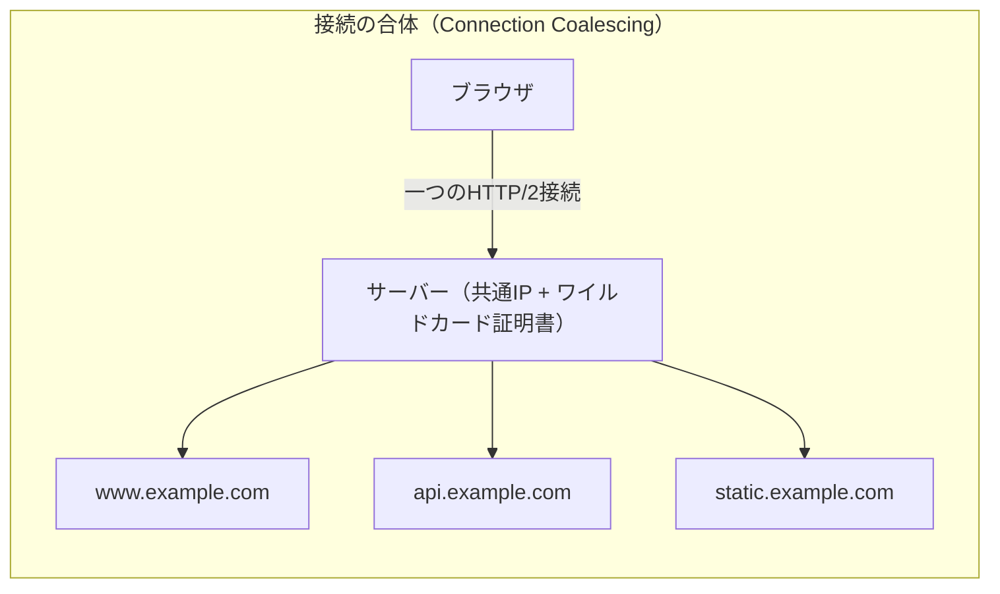

### 5.2 ソケットプールの動作

Chromeのソケットプールは、接続の管理において以下のような最適化を行っている。

1. **接続の事前確立**: `preconnect`ヒントや過去のナビゲーションパターンに基づいて、事前に接続を確立する
2. **接続の優先度制御**: レンダリングに必要なリソースの接続を優先し、低優先度リソースの接続を遅延させる
3. **グローバルな接続数制限**: すべてのオリジンを合わせた総接続数にも上限がある（Chromeでは256程度）
4. **SSL Session Resumption**: TLSセッションチケットを保持し、再接続時のTLSハンドシェイクを高速化する

開発者がこの仕組みを最大限活用するためには、不要なドメイン分散を避け、できるだけ少ないオリジンにリソースを集約することが望ましい。ただし、CookieレスドメインからのCDN配信など、合理的な理由がある場合のドメイン分離は引き続き有効だ。

## 6. 圧縮

### 6.1 転送サイズの削減が重要な理由

ネットワーク最適化の最も基本的かつ効果的な手法の一つが、転送データの圧縮だ。帯域幅は有限であり、特にモバイルネットワークではデータ転送量がコストに直結する。テキストベースのリソース（HTML、CSS、JavaScript、JSON、SVGなど）は圧縮率が高く、60〜90%のサイズ削減が可能だ。

### 6.2 gzip

gzip（GNU zip）は1992年に登場した圧縮フォーマットで、DEFLATEアルゴリズム（LZ77 + ハフマン符号化の組み合わせ）を使用する。Webにおけるコンテンツ圧縮の事実上の標準として20年以上にわたって使われてきた。

gzip圧縮はHTTPのContent Negotiation（コンテンツネゴシエーション）の仕組みを通じて動作する。

```
# リクエスト
GET /app.js HTTP/1.1
Accept-Encoding: gzip, deflate, br

# レスポンス
HTTP/1.1 200 OK
Content-Encoding: gzip
Content-Type: application/javascript
Vary: Accept-Encoding
```

ブラウザが`Accept-Encoding`ヘッダで対応している圧縮方式を通知し、サーバーが適切な方式で圧縮したレスポンスを返す。ブラウザは`Content-Encoding`ヘッダを見て自動的に解凍する。

### 6.3 Brotli——gzipの後継

Brotli（br）は、Googleが2013年に開発し2015年に公開した圧縮アルゴリズムだ。2025年現在、すべての主要ブラウザがBrotliをサポートしている。

Brotliがgzipよりも優れている点は以下の通りだ。

- **圧縮率**: 同等の圧縮速度において、gzipよりも15〜25%小さいファイルサイズを実現する
- **事前定義辞書**: WebリソースでよくあるHTMLタグ、CSSプロパティ、JavaScriptキーワードなどを含む静的辞書を内蔵しており、小さなファイルでも効率的に圧縮できる
- **圧縮レベルの柔軟性**: 0〜11の12段階の圧縮レベルがあり、用途に応じて速度と圧縮率のトレードオフを選択できる

実運用では、事前に圧縮できる静的ファイルにはBrotliの高圧縮レベル（例: 11）を適用し、動的レスポンスにはBrotliの低〜中圧縮レベル（例: 4〜6）またはgzipを使うのが一般的だ。

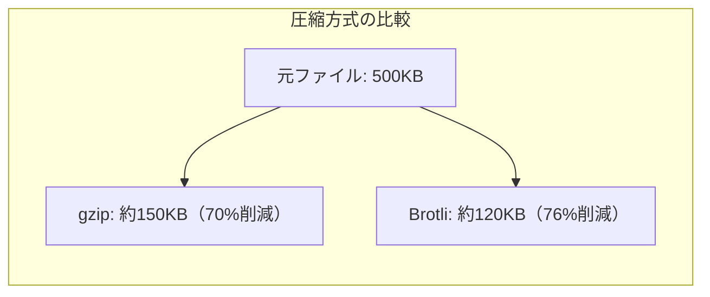

### 6.4 Zstandard（zstd）

2023年にRFC 8878で標準化されたZstandard（zstd）は、Facebookが開発した圧縮アルゴリズムだ。ChromeとFirefoxが`Accept-Encoding: zstd`をサポートしており、今後の普及が期待されている。

Zstandardの特徴は、Brotliに匹敵する圧縮率を保ちながら、圧縮・展開速度がBrotliよりも大幅に高速である点だ。特に動的レスポンスの圧縮において、サーバーのCPU負荷を抑えつつ高い圧縮率を実現できる。

### 6.5 圧縮の実践的な設定

Webサーバーでの圧縮設定の例を示す。

::: code-group
```nginx [Nginx]
# Enable gzip
gzip on;
gzip_types text/plain text/css application/json application/javascript text/xml application/xml text/javascript image/svg+xml;
gzip_min_length 256;
gzip_vary on;

# Enable Brotli (requires ngx_brotli module)
brotli on;
brotli_types text/plain text/css application/json application/javascript text/xml application/xml text/javascript image/svg+xml;
brotli_min_length 256;
brotli_comp_level 6;
```

```apache [Apache]
# Enable gzip
<IfModule mod_deflate.c>
    AddOutputFilterByType DEFLATE text/html text/plain text/css application/json application/javascript text/xml application/xml text/javascript image/svg+xml
</IfModule>

# Enable Brotli (requires mod_brotli)
<IfModule mod_brotli.c>
    AddOutputFilterByType BROTLI_COMPRESS text/html text/plain text/css application/json application/javascript text/xml application/xml text/javascript image/svg+xml
</IfModule>
```
:::

注意すべき点として、画像（JPEG、PNG、WebP）や動画など、既に圧縮されている形式のファイルに対してgzipやBrotliを適用しても、サイズはほとんど変わらないか逆に増加する場合がある。圧縮対象はテキストベースのリソースに限定すべきだ。

## 7. CDNとキャッシュ戦略

### 7.1 CDNの役割

CDN（Content Delivery Network）は、世界各地に分散配置されたエッジサーバーを通じてコンテンツを配信するインフラストラクチャだ。ブラウザのネットワーク最適化の観点では、CDNは以下の利点をもたらす。

- **レイテンシの削減**: ユーザーに地理的に近いサーバーからコンテンツを配信することで、物理的な伝搬遅延を最小化する
- **帯域幅の効率化**: エッジサーバーでのキャッシュにより、オリジンサーバーへのリクエストを削減する
- **可用性の向上**: オリジンサーバーに障害が発生した場合でも、エッジキャッシュからコンテンツを配信し続けられる

### 7.2 HTTPキャッシュの仕組み

ブラウザのHTTPキャッシュは、ネットワークリクエストを回避する最も効果的な手段だ。キャッシュ制御には`Cache-Control`ヘッダが中心的な役割を果たす。

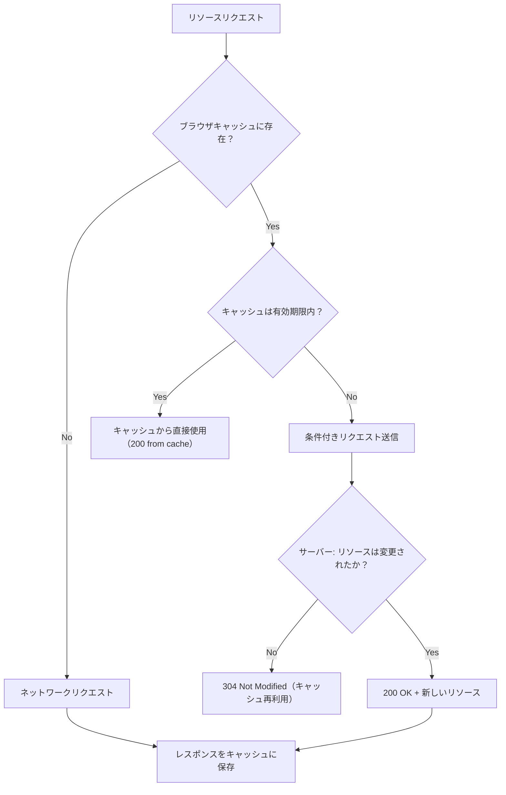

### 7.3 キャッシュ戦略のパターン

効果的なキャッシュ戦略は、リソースの種類に応じて異なるアプローチを取る。

**イミュータブル（不変）リソース**: ファイル名にハッシュ値を含めることで、内容が変わればURLも変わることを保証する。これにより、非常に長いキャッシュ有効期間を設定できる。

```
# File: /assets/app.a1b2c3d4.js
Cache-Control: public, max-age=31536000, immutable
```

`immutable`ディレクティブは、ブラウザに対して「このリソースは有効期限内に変更されることはない」と伝え、条件付きリクエスト（If-None-Match / If-Modified-Since）も不要であることを示す。

**頻繁に変更されるリソース（HTMLなど）**: HTMLファイルは内容が頻繁に変わるため、毎回サーバーに確認する設定が適切だ。

```
# File: /index.html
Cache-Control: no-cache
ETag: "abc123"
```

`no-cache`はキャッシュを禁止するのではなく、「キャッシュしてよいが、使用する前にサーバーに有効性を確認（再検証）せよ」という意味だ。`no-store`と混同しないよう注意が必要だ。

**まとめて示す**と、一般的なキャッシュ戦略は以下のようになる。

| リソース種別 | Cache-Control | 理由 |
|---|---|---|
| ハッシュ付きJS/CSS/画像 | `public, max-age=31536000, immutable` | 内容変更 = URL変更のため長期キャッシュ可 |
| HTML | `no-cache` + ETag | 頻繁に変更される可能性あり |
| APIレスポンス | `private, no-cache` または `max-age=0, must-revalidate` | ユーザー固有データの漏洩防止 |
| Service Worker | `no-cache` | 更新の迅速な反映が必要 |

### 7.4 stale-while-revalidate

`stale-while-revalidate`は、キャッシュの有効期限が切れた後も一定期間は古いキャッシュを返しつつ、バックグラウンドで新しいリソースを取得する戦略だ。

```
Cache-Control: max-age=3600, stale-while-revalidate=86400
```

この設定では、最初の1時間はキャッシュを直接使用し、1時間〜25時間の間はキャッシュを返しつつバックグラウンドで再検証を行い、25時間を超えるとキャッシュは使用されない。ユーザーには常に即座にレスポンスが返るため、体感速度が大幅に改善される。

## 8. Service Workerによるオフライン対応とネットワーク最適化

### 8.1 Service Workerとは

Service Workerは、ブラウザとネットワークの間に位置するプログラム可能なプロキシだ。Webページとは独立したバックグラウンドスレッドで動作し、ネットワークリクエストをインターセプトして、キャッシュからの応答、リクエストの変更、独自のレスポンス生成など、高度なネットワーク制御を実現する。

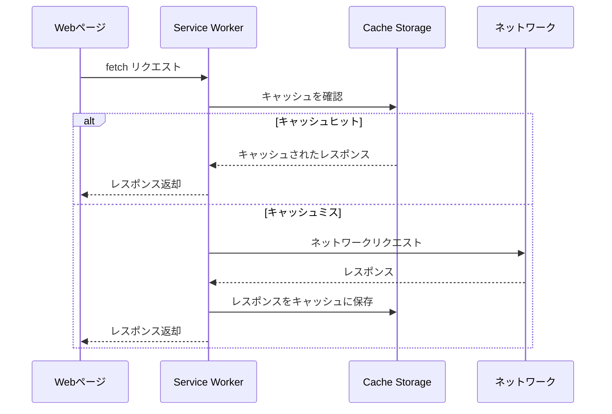

### 8.2 キャッシュ戦略の実装パターン

Service Workerでは、HTTPキャッシュよりも細かいキャッシュ戦略を実装できる。

**Cache First（キャッシュ優先）**: 静的リソースに適した戦略で、キャッシュにあればそれを返し、なければネットワークから取得する。

```javascript
self.addEventListener('fetch', (event) => {
  event.respondWith(
    caches.match(event.request).then((cached) => {
      // Return cached response if available, otherwise fetch from network
      return cached || fetch(event.request).then((response) => {
        // Clone response before caching (response body can only be consumed once)
        const clone = response.clone();
        caches.open('static-v1').then((cache) => cache.put(event.request, clone));
        return response;
      });
    })
  );
});
```

**Network First（ネットワーク優先）**: APIレスポンスなど鮮度が重要なデータに適した戦略で、ネットワークから取得を試み、失敗した場合にキャッシュを返す。

```javascript
self.addEventListener('fetch', (event) => {
  event.respondWith(
    fetch(event.request)
      .then((response) => {
        // Cache the fresh response
        const clone = response.clone();
        caches.open('api-v1').then((cache) => cache.put(event.request, clone));
        return response;
      })
      .catch(() => {
        // Network failed, try cache
        return caches.match(event.request);
      })
  );
});
```

**Stale While Revalidate**: キャッシュから即座に応答しつつ、バックグラウンドでキャッシュを更新する。HTTPヘッダの`stale-while-revalidate`と似た概念だが、Service Workerではより柔軟な制御が可能だ。

```javascript
self.addEventListener('fetch', (event) => {
  event.respondWith(
    caches.open('dynamic-v1').then((cache) => {
      return cache.match(event.request).then((cached) => {
        // Fetch from network in the background
        const fetchPromise = fetch(event.request).then((response) => {
          cache.put(event.request, response.clone());
          return response;
        });
        // Return cached response immediately, or wait for network
        return cached || fetchPromise;
      });
    })
  );
});
```

### 8.3 プリキャッシュとランタイムキャッシュ

Service Workerのキャッシュは大きく二つに分類される。

**プリキャッシュ（Precache）**: Service Workerのインストール時に、アプリケーションのシェル（HTML、CSS、JavaScript、画像など）を一括でキャッシュに保存する。ネットワーク接続の有無にかかわらず、アプリケーションの基本的な表示と動作を保証する。

```javascript
const PRECACHE_ASSETS = [
  '/',
  '/index.html',
  '/css/app.css',
  '/js/app.js',
  '/images/logo.svg',
];

self.addEventListener('install', (event) => {
  event.waitUntil(
    caches.open('precache-v1').then((cache) => {
      return cache.addAll(PRECACHE_ASSETS);
    })
  );
});
```

**ランタイムキャッシュ（Runtime Cache）**: 実行時にネットワークから取得したリソースを動的にキャッシュに追加する。APIレスポンスや画像など、事前にすべてを列挙できないリソースに対して使用する。

実際のプロジェクトでは、Workboxのようなライブラリを使用すると、これらのキャッシュ戦略を宣言的に設定できる。

### 8.4 Navigation Preload

Service Workerの起動には時間がかかる（通常50〜100ms）。この起動遅延がナビゲーションリクエストのレイテンシに上乗せされる問題を解決するのがNavigation Preloadだ。

Navigation Preloadを有効にすると、Service Workerの起動と並行してナビゲーションリクエストをネットワークに送信する。Service Workerのfetchイベントハンドラ内で`event.preloadResponse`を通じてそのレスポンスを取得できる。

```javascript
// Enable navigation preload during activation
self.addEventListener('activate', (event) => {
  event.waitUntil(
    self.registration.navigationPreload.enable()
  );
});

self.addEventListener('fetch', (event) => {
  if (event.request.mode === 'navigate') {
    event.respondWith(
      (async () => {
        // Try to use the preloaded response
        const preloadResponse = await event.preloadResponse;
        if (preloadResponse) {
          return preloadResponse;
        }
        // Fall back to network
        return fetch(event.request);
      })()
    );
  }
});
```

## 9. Core Web Vitalsとネットワーク

### 9.1 Core Web Vitalsの概要

Core Web Vitalsは、Googleが定義するWebページのユーザー体験を測定する指標群だ。2021年にGoogle検索のランキング要因として導入され、Web開発者にとって重要なパフォーマンス目標となっている。2025年時点では以下の3つの指標で構成される。

- **LCP（Largest Contentful Paint）**: ビューポート内で最も大きなコンテンツ要素が描画されるまでの時間。目標値は2.5秒以内。
- **INP（Interaction to Next Paint）**: ユーザーの操作（クリック、タップ、キー入力）から次のフレームが描画されるまでの遅延。目標値は200ミリ秒以内。2024年3月にFIDに代わって導入された。
- **CLS（Cumulative Layout Shift）**: ページのライフサイクル中に発生するレイアウトシフトの累積スコア。目標値は0.1以下。

### 9.2 ネットワーク最適化がCore Web Vitalsに与える影響

**LCPとネットワーク最適化**: LCPはネットワーク最適化の影響を最も直接的に受ける指標だ。LCPの時間は大まかに以下の要素の合計で決まる。

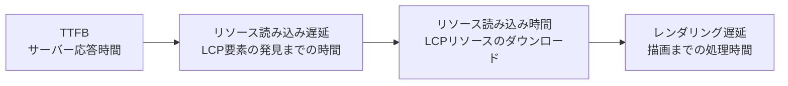

各フェーズに対するネットワーク最適化のアプローチは以下の通りだ。

1. **TTFB（Time to First Byte）の短縮**
   - CDNの活用でオリジンまでの距離を短縮
   - サーバーサイドキャッシュの適用
   - `103 Early Hints`でリソースヒントを先行送信

2. **リソース読み込み遅延の排除**
   - LCP候補となる画像やフォントを`preload`で事前取得
   - `fetchpriority="high"`で優先度を明示
   - クリティカルCSSのインライン化

3. **リソース読み込み時間の短縮**
   - 画像の最適化（WebP/AVIF形式の採用、適切なサイズ指定）
   - Brotli圧縮の適用
   - HTTP/2以上のプロトコル活用

4. **レンダリング遅延の排除**
   - レンダリングブロッキングリソースの排除・遅延
   - JavaScriptの`async`/`defer`属性の適切な使用

**CLSとネットワーク**: ネットワークの遅延は間接的にCLSにも影響する。遅れて読み込まれる画像、フォント、広告がレイアウトシフトを引き起こすことがある。

- 画像には必ず`width`と`height`属性（またはCSSのアスペクト比）を指定する
- Webフォントの読み込み中にFOUT（Flash of Unstyled Text）やFOIT（Flash of Invisible Text）が発生しないよう、`font-display: swap`と`preload`を組み合わせる
- 動的に挿入されるコンテンツには、あらかじめスペースを確保する

### 9.3 Network Information API

ブラウザはNetwork Information APIを通じて、現在のネットワーク接続の情報を提供する。これを利用して、ネットワーク状況に応じた適応的な最適化が可能だ。

```javascript
if ('connection' in navigator) {
  const conn = navigator.connection;

  // Effective connection type: 'slow-2g', '2g', '3g', '4g'
  console.log(conn.effectiveType);

  // Estimated downlink speed in Mbps
  console.log(conn.downlink);

  // Estimated round-trip time in ms
  console.log(conn.rtt);

  // Whether the user has requested reduced data usage
  console.log(conn.saveData);

  // Adapt behavior based on network conditions
  if (conn.saveData || conn.effectiveType === '2g') {
    // Load low-resolution images, skip non-essential resources
    loadLowQualityAssets();
  } else if (conn.effectiveType === '4g') {
    // Load high-quality assets, enable prefetching
    loadHighQualityAssets();
    enablePrefetching();
  }

  // React to connection changes
  conn.addEventListener('change', () => {
    console.log(`Connection changed to ${conn.effectiveType}`);
  });
}
```

`saveData`プロパティは、ユーザーがブラウザの「データセーバー」機能を有効にしている場合に`true`を返す。HTTPリクエストには`Save-Data: on`ヘッダが付与されるため、サーバーサイドでもデータ量を削減した応答を返すことができる。

## 10. 測定とデバッグツール

### 10.1 Chrome DevTools

Chrome DevToolsのNetworkパネルは、ブラウザのネットワーク活動を詳細に分析するための最も基本的なツールだ。

**Networkパネルの主要機能**:

- **ウォーターフォールチャート**: リクエストのタイミング（DNS、TCP、TLS、TTFB、コンテンツダウンロード）を可視化
- **スロットリング**: ネットワーク速度を人工的に制限（Slow 3G、Fast 3Gなど）して、低速環境でのパフォーマンスをテスト
- **フィルタリング**: リソースタイプ、ドメイン、サイズなどでリクエストをフィルタリング
- **HAR（HTTP Archive）エクスポート**: ネットワーク活動をHARフォーマットで保存し、他のツールで分析

**Performanceパネル**: ページの読み込みからレンダリングまでの全体的なタイムラインを分析でき、ネットワークリクエストがレンダリングに与える影響を把握できる。

**Lighthouseパネル**: パフォーマンス監査を自動実行し、ネットワーク関連の最適化提案（未圧縮リソース、不要なリソース、キャッシュ設定の問題など）を提示する。

### 10.2 WebPageTest

WebPageTestは、実際のブラウザを使用したWebパフォーマンステストサービスだ。世界各地のロケーションから、さまざまなネットワーク条件でテストを実行できる。

主要な機能は以下の通り。

- **マルチロケーションテスト**: 世界各地のサーバーからテストを実行し、地理的なパフォーマンス差を確認
- **ウォーターフォールビュー**: 各リソースのダウンロードタイミングと依存関係を詳細に可視化
- **フィルムストリップビュー**: ページの描画過程を100ms刻みのスクリーンショットで表示
- **比較テスト**: 異なるURLや設定のテスト結果を並べて比較
- **スクリプティング**: 複数ステップのテストシナリオを記述

### 10.3 Navigation Timing API と Resource Timing API

ブラウザはJavaScript APIを通じて、ナビゲーションとリソース取得のタイミング情報を提供する。これらを利用して、RUM（Real User Monitoring）データを収集できる。

```javascript
// Navigation Timing: page load metrics
const navEntry = performance.getEntriesByType('navigation')[0];
console.log({
  dns: navEntry.domainLookupEnd - navEntry.domainLookupStart,
  tcp: navEntry.connectEnd - navEntry.connectStart,
  tls: navEntry.secureConnectionStart > 0
    ? navEntry.connectEnd - navEntry.secureConnectionStart
    : 0,
  ttfb: navEntry.responseStart - navEntry.requestStart,
  download: navEntry.responseEnd - navEntry.responseStart,
  domInteractive: navEntry.domInteractive - navEntry.startTime,
  domComplete: navEntry.domComplete - navEntry.startTime,
  loadEvent: navEntry.loadEventEnd - navEntry.startTime,
});

// Resource Timing: individual resource metrics
const resources = performance.getEntriesByType('resource');
resources.forEach((entry) => {
  console.log({
    name: entry.name,
    type: entry.initiatorType,
    transferSize: entry.transferSize,
    encodedBodySize: entry.encodedBodySize,
    decodedBodySize: entry.decodedBodySize,
    duration: entry.duration,
    protocol: entry.nextHopProtocol, // "h2", "h3", "http/1.1"
  });
});
```

`transferSize`、`encodedBodySize`、`decodedBodySize`の三つの値を比較することで、圧縮の効果を定量的に把握できる。`transferSize`が0の場合、そのリソースはキャッシュから取得されたことを示す。

### 10.4 Performance Observer

`PerformanceObserver`を使うと、パフォーマンスイベントを非同期に監視できる。LCPやCLSなどのCore Web Vitals指標もこのAPIで取得可能だ。

```javascript
// Observe LCP
const lcpObserver = new PerformanceObserver((entryList) => {
  const entries = entryList.getEntries();
  const lastEntry = entries[entries.length - 1];
  console.log('LCP:', lastEntry.startTime, lastEntry.element);
});
lcpObserver.observe({ type: 'largest-contentful-paint', buffered: true });

// Observe long tasks (potential INP contributors)
const longTaskObserver = new PerformanceObserver((entryList) => {
  for (const entry of entryList.getEntries()) {
    console.log('Long task:', entry.duration, 'ms');
  }
});
longTaskObserver.observe({ type: 'longtask', buffered: true });

// Observe layout shifts (CLS)
const clsObserver = new PerformanceObserver((entryList) => {
  for (const entry of entryList.getEntries()) {
    if (!entry.hadRecentInput) {
      console.log('Layout shift:', entry.value, entry.sources);
    }
  }
});
clsObserver.observe({ type: 'layout-shift', buffered: true });
```

本番環境でのRUMデータ収集には、`web-vitals`ライブラリの利用が推奨される。このライブラリは、Core Web Vitalsの各指標を正確に測定し、アナリティクスサービスへのレポートを容易にする。

```javascript
import { onLCP, onINP, onCLS } from 'web-vitals';

onLCP((metric) => sendToAnalytics('LCP', metric));
onINP((metric) => sendToAnalytics('INP', metric));
onCLS((metric) => sendToAnalytics('CLS', metric));
```

## 11. 画像の最適化

### 11.1 画像がネットワークに与える影響

HTTP Archiveのデータによれば、Webページの総転送量のうち画像が占める割合は約50%にも達する。画像の最適化は、ネットワーク帯域幅の節約とページ読み込み速度の改善において最もインパクトの大きい施策の一つだ。

### 11.2 モダンな画像フォーマット

**WebP**: Googleが開発した画像フォーマットで、JPEGと比較して25〜35%のファイルサイズ削減を実現する。可逆・非可逆圧縮の両方に対応し、透過（アルファチャネル）もサポートする。2025年時点ですべての主要ブラウザが対応している。

**AVIF**: AV1ビデオコーデックに基づく画像フォーマットで、WebPよりもさらに高い圧縮率を実現する。特に写真のような自然画像において、同等の画質でJPEGの50%以下のファイルサイズになることが多い。ただし、エンコード速度はWebPやJPEGよりも大幅に遅いため、ビルド時に事前生成しておく運用が一般的だ。

`<picture>`要素を使うことで、ブラウザの対応状況に応じて最適なフォーマットを自動的に選択させることができる。

```html
<picture>
  <source srcset="hero.avif" type="image/avif">
  <source srcset="hero.webp" type="image/webp">
  
</picture>
```

### 11.3 レスポンシブ画像

デバイスの画面サイズとピクセル密度に応じた最適な画像を配信することで、不要なデータ転送を防ぐことができる。

```html

```

`srcset`と`sizes`を組み合わせることで、ブラウザはビューポートサイズとデバイスピクセル比を考慮して最適なサイズの画像を自動的に選択する。

### 11.4 遅延読み込み（Lazy Loading）

ファーストビュー外の画像を遅延読み込みすることで、初期ページロードのネットワーク転送量を削減できる。

```html
<!-- Above the fold: load immediately, high priority -->


<!-- Below the fold: lazy load -->


```

`loading="lazy"`属性により、ブラウザは画像がビューポートに近づいたタイミングで読み込みを開始する。LCP候補となる画像には`loading="lazy"`を指定してはならない。LCP画像の読み込みが遅延し、LCPスコアが悪化するためだ。

## 12. JavaScriptとCSSの読み込み最適化

### 12.1 レンダリングブロッキング

ブラウザのHTMLパーサーが`<script>`タグを検出すると、スクリプトのダウンロードと実行が完了するまでHTMLのパースを中断する。同様に、`<link rel="stylesheet">`もCSSOMの構築を完了するまでレンダリングをブロックする。これらはレンダリングブロッキングリソースと呼ばれ、ページの初期表示を遅延させる主要因だ。

```mermaid
gantt
    title レンダリングブロッキングの影響
    dateFormat X
    axisFormat %s

    section ブロッキング
    HTMLパース        :a1, 0, 200
    CSSダウンロード   :a2, 200, 400
    JSダウンロード    :a3, 400, 600
    JS実行           :a4, 600, 700
    HTMLパース再開    :a5, 700, 900
    レンダリング      :a6, 900, 1000

    section 最適化後
    HTMLパース        :b1, 0, 200
    CSSダウンロード   :b2, 0, 300
    JSダウンロード    :b3, 0, 350
    HTMLパース継続    :b4, 200, 500
    レンダリング      :b5, 500, 600
```

### 12.2 async と defer

`<script>`タグの`async`属性と`defer`属性は、JavaScriptの読み込みとHTMLパースの関係を制御する。

```html
<!-- Blocking: HTML parse stops until script downloads and executes -->
<script src="app.js"></script>

<!-- Async: download in parallel, execute immediately when downloaded -->
<script src="analytics.js" async></script>

<!-- Defer: download in parallel, execute after HTML parsing completes -->
<script src="app.js" defer></script>

<!-- Module: deferred by default -->
<script type="module" src="app.mjs"></script>
```

- **`async`**: スクリプトのダウンロードはHTMLパースと並行して行われるが、ダウンロード完了時点でHTMLパースを中断してスクリプトを実行する。実行順序は保証されないため、他のスクリプトに依存しない独立したスクリプト（アナリティクスなど）に適している。
- **`defer`**: スクリプトのダウンロードはHTMLパースと並行して行われ、HTMLパースが完了した後にドキュメント順で実行される。DOMContentLoadedイベントの直前に実行されるため、DOM操作を含むスクリプトに適している。

### 12.3 コード分割とダイナミックインポート

モダンなJavaScriptバンドラー（webpack、Rollup、Vite）は、コード分割（Code Splitting）をサポートしている。これにより、初期ロードに必要なコードのみをダウンロードし、残りを必要に応じて遅延ロードできる。

```javascript
// Dynamic import: load module on demand
button.addEventListener('click', async () => {
  const { openModal } = await import('./modal.js');
  openModal();
});

// Route-based code splitting (React example)
const ProductPage = React.lazy(() => import('./pages/ProductPage'));
```

ダイナミックインポートは、ユーザーのアクションやルートの遷移に応じてコードをオンデマンドで読み込む。これにより、初期バンドルサイズを大幅に削減でき、ネットワーク転送量と解析時間を節約できる。

### 12.4 クリティカルCSSのインライン化

ファーストビューに必要なCSSのみをHTMLに直接インライン化し、残りのCSSを非同期で読み込む手法は、レンダリングブロッキングを最小化する効果がある。

```html
<head>
  <!-- Critical CSS inlined -->
  <style>
    /* Only styles needed for above-the-fold content */
    body { margin: 0; font-family: system-ui, sans-serif; }
    .header { background: #1a1a1a; color: white; padding: 1rem; }
    .hero { height: 60vh; display: flex; align-items: center; }
  </style>

  <!-- Full CSS loaded asynchronously -->
  <link rel="preload" href="/css/full.css" as="style"
        onload="this.onload=null;this.rel='stylesheet'">
  <noscript><link rel="stylesheet" href="/css/full.css"></noscript>
</head>
```

## 13. 実践的な最適化チェックリスト

ここまで解説した最適化手法を、実践的なチェックリストとしてまとめる。

### 接続の最適化
- [ ] クリティカルな外部ドメインに`preconnect`を設定しているか
- [ ] 非クリティカルな外部ドメインに`dns-prefetch`を設定しているか
- [ ] HTTP/2またはHTTP/3が有効になっているか
- [ ] 不要なドメインシャーディングを廃止したか

### リソースの優先度制御
- [ ] LCP画像に`fetchpriority="high"`を設定しているか
- [ ] クリティカルなリソース（フォント、CSS）に`preload`を設定しているか
- [ ] LCP画像に`loading="lazy"`を**設定していない**か
- [ ] ファーストビュー外の画像に`loading="lazy"`を設定しているか

### 圧縮とサイズ削減
- [ ] テキストリソースにBrotli（またはgzip）圧縮を適用しているか
- [ ] 画像をWebPまたはAVIF形式で配信しているか
- [ ] レスポンシブ画像（`srcset` + `sizes`）を使用しているか
- [ ] JavaScriptのコード分割を実施しているか

### キャッシュ
- [ ] ハッシュ付き静的ファイルに長期キャッシュを設定しているか
- [ ] HTMLに適切な再検証キャッシュを設定しているか
- [ ] CDNを活用しているか
- [ ] Service Workerによるオフライン対応が必要か検討したか

### JavaScriptとCSS
- [ ] `<script>`タグに`async`または`defer`を付けているか
- [ ] クリティカルCSSをインライン化しているか
- [ ] 不要なJavaScriptを遅延読み込みにしているか

### 測定
- [ ] Core Web Vitals（LCP、INP、CLS）を監視しているか
- [ ] RUMデータを収集しているか
- [ ] 定期的にWebPageTestやLighthouseで監査しているか

## 14. まとめ

ブラウザのネットワーク最適化は、単一の銀の弾丸で解決できるものではなく、多層的なアプローチの組み合わせである。DNS解決の高速化から始まり、接続の事前確立、HTTP/2・HTTP/3の活用、リソースヒントによる優先度制御、圧縮、キャッシュ戦略、Service Worker、そしてリソースの最適化と、各レイヤーでの改善が積み重なって初めて高速なWeb体験が実現される。

重要なのは、最適化を施す前に必ず**測定**を行うことだ。Chrome DevTools、WebPageTest、RUMデータといったツールで現状を正確に把握し、最もインパクトの大きいボトルネックから順に対処すべきである。闇雲に最適化を適用すると、かえって複雑さを増し、メンテナンス性を損なう場合がある。

また、Web技術は急速に進化している。Speculation Rules API、Priority Hints、103 Early Hints、HTTP/3、AVIFといった新しい技術が次々と標準化され、ブラウザに実装されている。これらの動向を継続的にキャッチアップし、プロジェクトの要件に応じて適切な最適化を選択することが、持続的にユーザー体験を改善していくための鍵となる。
