# ブラウザレンダリングパイプライン — DOMからピクセルまで

## 1. 背景：URLを入力してからページが表示されるまで

### 1.1 ブラウザとは何か

Webブラウザは、最も広く使われているソフトウェアの一つである。ユーザーがアドレスバーにURLを入力してからページが表示されるまでの間に、ブラウザの内部では極めて精緻な処理パイプラインが動作している。この過程を理解することは、Webアプリケーションのパフォーマンス最適化において不可欠であり、フロントエンドエンジニアに限らずすべてのWeb開発者にとって価値のある知識である。

ブラウザの歴史は1990年にTim Berners-LeeがWorldWideWebブラウザを開発したことに遡る。当時のWebページは静的なHTMLドキュメントであり、テキストとハイパーリンクで構成される単純なものだった。しかし現代のWebアプリケーションは、複雑なレイアウト、アニメーション、リアルタイム通信、3Dグラフィックスを駆使する高度なソフトウェアへと進化している。この進化に伴い、ブラウザのレンダリングエンジンも飛躍的に複雑化した。

### 1.2 ナビゲーションからレンダリングまでの全体像

ユーザーがURLを入力してからページが画面に描画されるまでのプロセスは、大きく以下のフェーズに分けられる。


本記事では、HTTPレスポンスとしてHTML/CSSが到着した後の**レンダリングパイプライン**に焦点を当てる。すなわち、DOM構築からCompositing（レイヤー合成）に至るまでの一連の処理を詳しく解説する。

### 1.3 レンダリングパイプラインの本質的な課題

レンダリングパイプラインが解決すべき本質的な課題は、「テキストで記述された構造情報（HTML）と見た目の定義（CSS）から、画面上のピクセル列を高速に生成する」ことである。

この課題を難しくする要因がいくつかある。

1. **増分処理の必要性**: JavaScriptによるDOM操作やユーザーインタラクションにより、ページの状態は絶えず変化する。変更のたびに全体を再描画するのは計算コストが高すぎるため、変更された部分のみを効率的に再処理する仕組みが必要である。
2. **60fpsの制約**: 滑らかなアニメーションを実現するには、1フレームあたり約16.67ミリ秒（=1000ms / 60fps）以内にすべての処理を完了させなければならない。
3. **CSS仕様の複雑性**: CSSのカスケード、継承、メディアクエリ、Flexbox、Grid、絶対配置など、レイアウトに影響する要因は非常に多い。
4. **メインスレッドの競合**: JavaScriptの実行とレンダリング処理は同じメインスレッドで行われるため、適切な協調が求められる。

## 2. HTMLパーサとDOM構築

### 2.1 HTMLパーサの特殊性

HTML（HyperText Markup Language）のパースは、一般的なプログラミング言語のパースとは根本的に異なる。XMLのような厳密な構文のパースであれば、文脈自由文法に基づくパーサで扱える。しかしHTMLは、歴史的な理由から**不正な構文にも寛容**（error-tolerant）でなければならない。

たとえば、以下のようなHTMLはいずれも正しく解釈される必要がある。

```html
<!-- closing tag omitted -->
<p>First paragraph
<p>Second paragraph

<!-- mismatched nesting -->
<b><i>bold and italic</b></i>

<!-- optional tags omitted -->
<html>
<head>
<body>
<p>Hello
```

HTML Living Standard（旧HTML5仕様）は、このような不正な入力をどう処理するかを、トークナイザと木構築アルゴリズムの両方で厳密に定義している。ブラウザ間で異なる表示になることを防ぐために、エラー処理の振る舞いまでが仕様化されているのだ。

### 2.2 パースの2段階

HTMLパーサは、以下の2段階で処理を行う。


**第1段階：トークナイゼーション**

入力バイトストリームは、まず文字エンコーディング（UTF-8等）に基づいてデコードされ、文字列となる。トークナイザはこの文字列を走査し、以下のようなトークンに分割する。

- **DOCTYPE トークン**: `<!DOCTYPE html>` を表す
- **開始タグトークン**: `<div class="container">` のようなもの
- **終了タグトークン**: `</div>` のようなもの
- **コメントトークン**: `<!-- ... -->` の内容
- **テキストトークン**: タグの間に存在するテキストノード
- **EOFトークン**: 入力の終端

HTMLトークナイザは**状態機械**（state machine）として実装される。仕様では約80の状態が定義されており、入力文字に応じて状態遷移しながらトークンを生成する。

**第2段階：木構築**

生成されたトークンは、**木構築アルゴリズム**に渡される。このアルゴリズムは、**オープン要素のスタック**（stack of open elements）を管理しながらDOMツリーを構築する。開始タグトークンが到着するとスタックに要素をプッシュし、対応する終了タグが到着するとスタックからポップする。ここで重要なのは、暗黙の終了タグ補完やフォスターペアレンティング（`<table>` 内の不正なテキストの処理）といった複雑なエラー処理ロジックが含まれている点である。

### 2.3 DOM（Document Object Model）の構造

パースの結果構築されるDOMは、ドキュメントの構造をノードのツリーとして表現したものである。

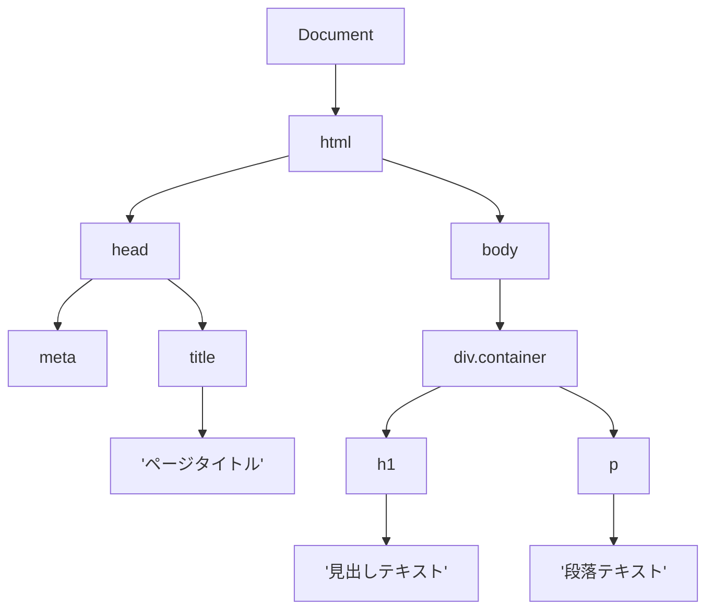

DOMは単なるデータ構造ではなく、JavaScriptからアクセス可能な**APIインターフェース**でもある。`document.createElement()`、`element.appendChild()`、`element.querySelector()` といったAPIを通じて、JavaScriptはDOMを動的に操作できる。

DOMの各ノードはメモリ上のC++オブジェクト（Chromiumの場合）として存在し、以下のような情報を保持する。

- ノードタイプ（Element、Text、Comment等）
- タグ名（div、p、span等）
- 属性（id、class、style等）
- 親ノード、子ノード、兄弟ノードへの参照
- イベントリスナーの登録情報

### 2.4 インクリメンタルパースとSpeculative Parsing

ブラウザはHTMLをすべて受信してからパースを始めるわけではない。ネットワークからチャンク単位でデータが到着するたびに、**インクリメンタルに**パースを進める。これにより、HTMLのダウンロードとDOM構築が並列に行われ、ファースト・コンテンツフル・ペイント（FCP）までの時間を短縮できる。

さらに、現代のブラウザは**Speculative Parsing**（投機的パース）を実装している。メインのパーサがJavaScript（`<script>` タグ）の実行待ちでブロックされている間、別のスレッドが先読みして後続のリソース（CSS、画像、JavaScript等）のURLを抽出し、事前にネットワークリクエストを発行する。これにより、パーサがブロックされている間もリソースの取得が進行する。

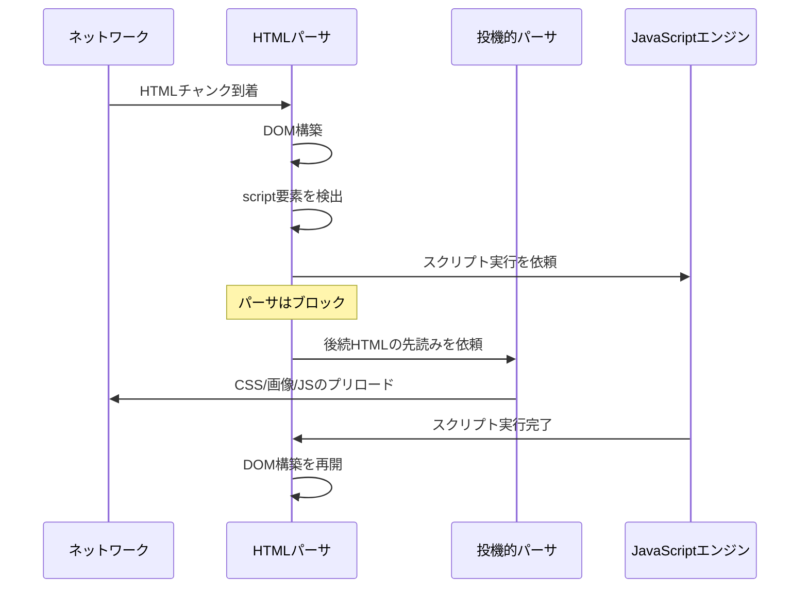

## 3. CSSパーサとCSSOM構築

### 3.1 CSSの取得とパース

HTMLパーサが `<link rel="stylesheet">` 要素や `<style>` 要素を検出すると、CSSの取得とパースが開始される。CSSはHTMLとは異なり、**文脈自由文法**で記述できるため、比較的一般的なパーサで解析可能である。

CSSパーサは入力をトークナイズし、以下のような構造に変換する。

```css
/* input */
body {
  font-size: 16px;
  color: #333;
}

.container > .title {
  font-weight: bold;
  margin-bottom: 12px;
}
```

これが以下のようなCSSOMツリーに変換される。

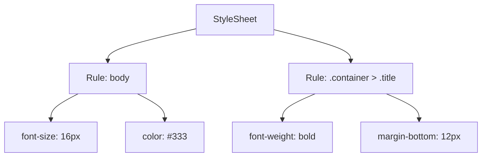

### 3.2 CSSOM（CSS Object Model）の構築

CSSOMは、文書に適用されるすべてのスタイル情報をツリー構造で表現したものである。CSSOMはDOMと同様にJavaScript APIを通じてアクセスでき、`document.styleSheets` や `getComputedStyle()` などで操作可能である。

CSSOMの構築には、以下のソースからのスタイル情報が統合される。

1. **ユーザーエージェントスタイルシート**: ブラウザがデフォルトで提供するスタイル（例：`<h1>` が太字になる、`<a>` に下線がつく）
2. **ユーザースタイルシート**: ユーザーが設定したスタイル（アクセシビリティ設定等）
3. **作成者スタイルシート**: 外部CSS (`<link>`)、内部CSS (`<style>`)、インラインスタイル (`style` 属性)

### 3.3 CSSはレンダリングブロッキング

CSSは**レンダリングブロッキングリソース**（render-blocking resource）である。ブラウザはCSSOMの構築が完了するまで、ページのレンダリングを行わない。この設計上の理由は明確だ。もしCSSOMが不完全な状態でレンダリングを開始すると、スタイルが適用されていない「素のHTML」が一瞬表示されてしまう。これを**FOUC（Flash of Unstyled Content）**と呼び、ユーザー体験を大きく損なう。

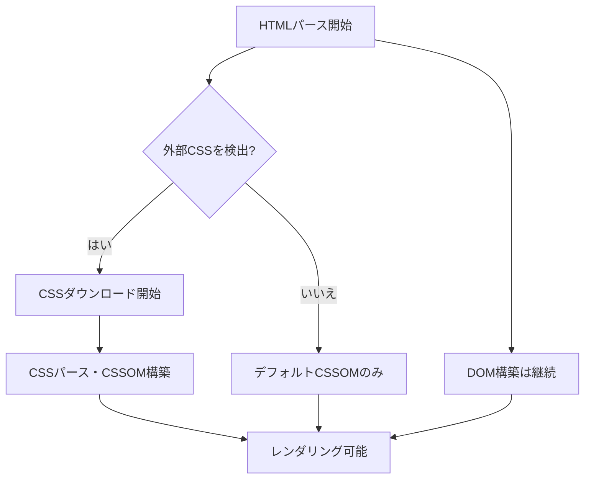

この特性から、**CSSの配信はパフォーマンスに直結する**。Critical CSS（初期表示に必要な最小限のCSS）をインライン化し、残りを非同期で読み込む手法は、現代のWebパフォーマンス最適化の定石である。

### 3.4 セレクタマッチングの仕組み

CSSOMの構築過程で、ブラウザはDOMの各要素に対してどのCSSルールが適用されるかを計算する。この**セレクタマッチング**は、直感に反して**右から左に**評価される。

たとえば、セレクタ `.container > .title span` は、以下の順で評価される。

1. まず `span` 要素をすべて探す
2. その親が `.title` クラスを持つか確認する
3. さらにその親が `.container` クラスを持つか確認する

この「右から左」の評価順は、効率的にマッチしない要素を早期に除外するための最適化である。最も右のセレクタ（キーセレクタ）で候補を絞り込み、そこから祖先方向に条件を検証する。もし左から右に評価すると、途中で条件に合わなかった場合にバックトラックが必要になり、計算コストが増大する。

## 4. Render Tree（Style Resolution）

### 4.1 DOMとCSSOMの合流

DOMの構築とCSSOMの構築が完了すると、ブラウザはこの2つを統合して**Render Tree**（レンダーツリー）を構築する。Render Treeは、画面に実際に描画される視覚的な要素のみを含むツリー構造である。

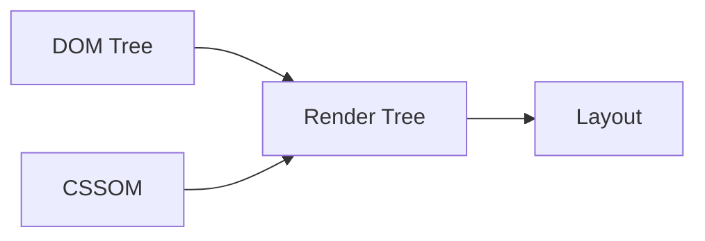

Render Treeの構築プロセスは以下の通りである。

1. DOMツリーのルートから各ノードを走査する
2. **表示されないノードを除外する**: `<head>`、`<meta>`、`<script>` などのメタデータ要素や、`display: none` が設定された要素はRender Treeに含まれない
3. 各表示対象ノードに対して、**算出スタイル**（computed style）を決定する
4. Render Treeの各ノード（レンダーオブジェクト）を生成する

### 4.2 算出スタイルの決定（Style Resolution）

Style Resolutionは、各DOM要素の最終的なスタイルを決定する処理であり、CSSの**カスケード**、**詳細度**、**継承**のルールに従う。

**カスケード順序**（優先度の低い順）:

1. ユーザーエージェントスタイルシート（ブラウザデフォルト）
2. ユーザースタイルシート
3. 作成者スタイルシート（通常宣言）
4. 作成者スタイルシート（`!important` 宣言）
5. ユーザースタイルシート（`!important` 宣言）
6. ユーザーエージェントスタイルシート（`!important` 宣言）

同じカスケードオリジン内では、**詳細度**（specificity）が高いルールが優先される。詳細度は (inline, id, class, element) のタプルで表現され、左から順に比較される。

```
/* specificity: (0, 0, 0, 1) */
p { color: blue; }

/* specificity: (0, 0, 1, 0) */
.text { color: green; }

/* specificity: (0, 1, 0, 0) */
#main { color: red; }

/* specificity: (1, 0, 0, 0) — inline style */
/* <p style="color: purple"> */
```

さらに、明示的に値が指定されていないプロパティは**継承**または**初期値**で補完される。`color` や `font-size` は継承されるプロパティであり、親要素の値を引き継ぐ。一方、`margin` や `padding` は継承されないプロパティであり、初期値が使用される。

### 4.3 表示されないノードの処理

重要な区別として、`display: none` と `visibility: hidden` の違いがある。

- **`display: none`**: Render Treeに**含まれない**。レイアウト上のスペースも占有しない。
- **`visibility: hidden`**: Render Treeに**含まれる**。レイアウト上のスペースは占有するが、ピクセルは描画されない。

`<meta>`、`<link>`、`<script>` などのメタデータ要素は、そもそもRender Treeには追加されない。また、`::before` や `::after` などの擬似要素は、DOMには存在しないがRender Treeには追加される。

### 4.4 スタイル計算の最適化

全DOM要素に対してすべてのCSSルールを照合するのは、大規模なページでは計算コストが非常に高い。ブラウザはいくつかの最適化を行っている。

- **スタイル共有**: 同じ条件（同じタグ名、クラス、属性、親のスタイル等）を持つ兄弟要素は、算出スタイルを共有できる。Blinkエンジンはこれを**Style Sharing Cache**として実装している。
- **ルールのインデックス化**: CSSルールをセレクタのキー部分（id、class、タグ名）でインデックス化し、各要素に対して照合する候補ルールを事前に絞り込む。
- **Bloom Filter**: 祖先セレクタのマッチングにおいて、Bloom Filterを用いて不一致を高速に判定する。

## 5. Layout（Reflow）

### 5.1 Layoutとは何か

Render Treeが構築されると、次は**Layout**（レイアウト）フェーズが実行される。Layoutは、各要素の**正確な位置とサイズ**を画面上のピクセル座標で計算する処理である。このフェーズは**Reflow**とも呼ばれる。

Layoutフェーズへの入力はRender Treeと**ビューポートサイズ**であり、出力は各要素の**ボックスモデル**（位置、幅、高さ、マージン、パディング、ボーダー）の具体的な数値である。

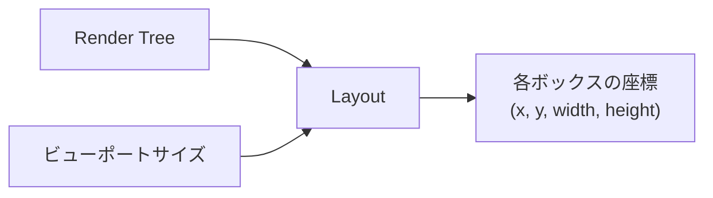

### 5.2 ボックスモデル

CSSのボックスモデルは、すべての要素をボックス（矩形領域）として扱う。ボックスは以下の4つの領域で構成される。

```
┌─────────────────────────────────────────┐
│                margin                   │
│  ┌───────────────────────────────────┐  │
│  │            border                 │  │
│  │  ┌─────────────────────────────┐  │  │
│  │  │          padding            │  │  │
│  │  │  ┌───────────────────────┐  │  │  │
│  │  │  │      content          │  │  │  │
│  │  │  │  (width × height)     │  │  │  │
│  │  │  └───────────────────────┘  │  │  │
│  │  └─────────────────────────────┘  │  │
│  └───────────────────────────────────┘  │
└─────────────────────────────────────────┘
```

`box-sizing` プロパティは、`width` と `height` がどの範囲を指すかを制御する。

- **`content-box`**（デフォルト）: `width`/`height` はcontent領域のみを指す。paddingとborderは別途加算される。
- **`border-box`**: `width`/`height` はborder、padding、contentを含む全体を指す。現代のWeb開発ではこちらが推奨される。

### 5.3 レイアウトアルゴリズム

Layout処理は、Render Treeを**再帰的に走査**しながら行われる。各ノードの位置とサイズは、以下のような要因によって決定される。

**ブロックレイアウト**:

ブロックレベル要素（`<div>`、`<p>`、`<h1>` 等）は、親要素の幅いっぱいに広がり、垂直方向に積み重なる。ブロックレイアウトの基本的なアルゴリズムは以下の通りである。

1. 親ボックスの幅を決定する（通常は親の content-box の幅）
2. 子要素を上から順に配置する
3. 各子要素の高さを計算する（テキストの折り返し等を考慮）
4. 子要素の高さの合計から親ボックスの高さを決定する

**インラインレイアウト**:

インライン要素（`<span>`、`<a>`、`<em>` 等）は、テキストの流れに沿って水平方向に配置される。**行ボックス**（line box）内にインライン要素が並び、行ボックスの幅を超えると次の行に折り返される。

**Flexboxレイアウト**:

`display: flex` が指定されたコンテナ内では、子要素（Flex Item）が主軸（main axis）に沿って配置される。Flex Itemのサイズは `flex-grow`、`flex-shrink`、`flex-basis` の3つのプロパティに基づいて計算される。

**Gridレイアウト**:

`display: grid` が指定されたコンテナでは、行と列のトラックが定義され、子要素がグリッドセルに配置される。トラックサイズは `fr` 単位、`auto`、固定値、`minmax()` などの複合的な指定が可能であり、レイアウトアルゴリズムはこれらを解決する。

### 5.4 Layoutの走査方向とダーティビット

Layoutは基本的に**トップダウン**で行われる。親要素が自身の幅を決定し、子要素に制約（available width）を伝え、子要素がその制約内で自身のサイズを計算し、最終的に子要素の高さの合計を親に返す。

DOM操作やスタイル変更によるLayoutの再計算は、**ダーティビット**（dirty bit）メカニズムで最適化される。変更が発生した要素とその祖先にダーティフラグが設定され、次のLayout時にはダーティフラグが設定された要素のみが再計算される。

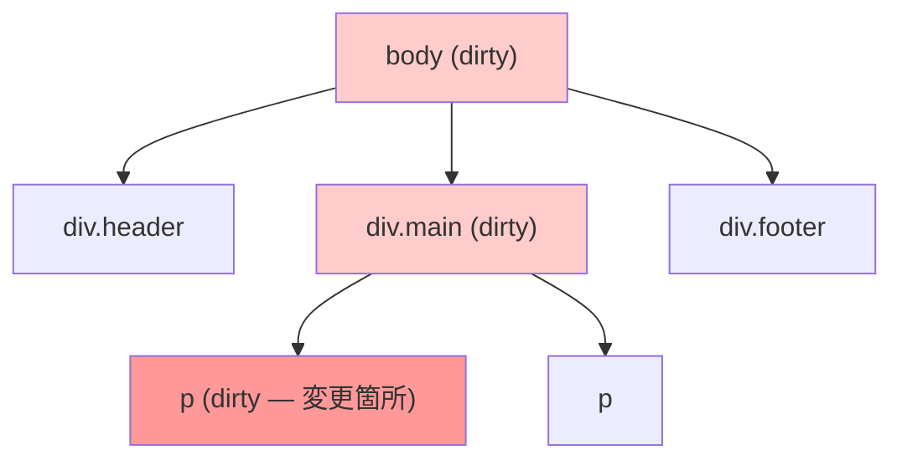

### 5.5 Forced Reflow（強制リフロー）

JavaScriptから特定のレイアウト情報を読み取るAPIを呼び出すと、ブラウザは保留中のスタイル変更とLayoutを即座に実行する。これを**Forced Reflow**（強制リフロー）と呼び、パフォーマンスの大きなボトルネックとなる。

以下のプロパティやメソッドへのアクセスは、Forced Reflowを引き起こす可能性がある。

```javascript
// These properties/methods may trigger forced reflow
element.offsetWidth;
element.offsetHeight;
element.offsetTop;
element.offsetLeft;
element.clientWidth;
element.clientHeight;
element.getBoundingClientRect();
window.getComputedStyle(element);
element.scrollTop;
element.scrollHeight;
```

特に深刻なのは、以下のような**read-writeサイクル**のパターンである。

```javascript
// BAD: read-write cycle causes multiple forced reflows
for (const el of elements) {
  const height = el.offsetHeight; // read => forced reflow
  el.style.height = height * 2 + "px"; // write => invalidate layout
}

// GOOD: batch reads, then batch writes
const heights = elements.map((el) => el.offsetHeight); // batch read
elements.forEach((el, i) => {
  el.style.height = heights[i] * 2 + "px"; // batch write
});
```

## 6. Paint

### 6.1 Paintフェーズの役割

Layoutフェーズで各要素の位置とサイズが確定すると、次は**Paint**（ペイント）フェーズが実行される。Paintフェーズでは、各要素を実際にピクセルとして**どのように描画するか**を決定する。具体的には、テキスト、色、画像、ボーダー、シャドウなどの視覚的な属性を処理し、**描画命令**（paint records / display list）のリストを生成する。

Paintフェーズは「何をどの順番で描画するか」を決定する工程であり、実際のラスタライズ（ピクセルへの変換）はこの後のステップで行われる。

### 6.2 ペイント順序（Stacking Order）

ブラウザが要素を描画する順序は、CSSの**スタッキングコンテキスト**（stacking context）と**ペイント順序**に従う。同一のスタッキングコンテキスト内では、以下の順序で描画される（後に描画されるものが前面に表示される）。

1. **背景色・背景画像**: スタッキングコンテキストを形成する要素のbackground
2. **負のz-indexを持つ子要素**: `z-index` が負の値の子スタッキングコンテキスト
3. **ブロックレベル要素**: 通常フローのブロック要素の背景と枠線
4. **浮動要素**: `float` された要素
5. **インライン要素**: 通常フローのインライン要素（テキスト等）
6. **z-index: 0 / auto**: `position: relative/absolute` で `z-index: auto` または `0` の要素
7. **正のz-indexを持つ子要素**: `z-index` が正の値の子スタッキングコンテキスト

### 6.3 スタッキングコンテキスト

以下の条件を満たす要素は、新しいスタッキングコンテキストを形成する。

- ルート要素（`<html>`）
- `position: absolute/relative` かつ `z-index` が `auto` 以外
- `position: fixed` または `position: sticky`
- `opacity` が `1` 未満
- `transform`、`filter`、`perspective`、`clip-path` などのプロパティが設定されている
- `will-change` で特定のプロパティが指定されている
- Flex/Gridコンテナの子要素で `z-index` が `auto` 以外

スタッキングコンテキストは入れ子構造を形成し、内部の `z-index` は外部のコンテキストには影響しない。これはCSSの `z-index` が期待通りに動作しない場合の主要な原因である。

### 6.4 Paintの最適化とレイヤー分割

現代のブラウザは、ページ全体を単一のサーフェスに描画するわけではない。ページを複数の**レイヤー**（Compositing Layer）に分割し、それぞれを独立して描画する。レイヤー分割の判断は**Paint**フェーズの一部として行われる。

レイヤー分割により、以下のメリットが得られる。

- 一部の要素が変更された場合、そのレイヤーだけを再描画すれば済む
- `transform` や `opacity` のアニメーションは、レイヤーの合成パラメータを変更するだけで実現でき、再描画が不要

レイヤーが独立して描画された後、各レイヤーの内容は**ラスタライズ**（rasterize）される。ラスタライズとは、描画命令をビットマップ（ピクセルの配列）に変換する処理である。現代のブラウザでは、この処理はGPUまたは別スレッドのラスタライズワーカーで行われる。

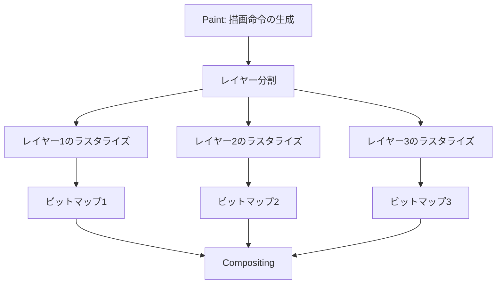

## 7. Compositing（レイヤー合成、GPUの役割）

### 7.1 Compositingとは

**Compositing**（コンポジティング）は、レンダリングパイプラインの最終段階である。Paint・ラスタライズフェーズで生成された複数のレイヤーのビットマップを、正しい順序で重ね合わせて最終的な画面イメージを生成する処理である。

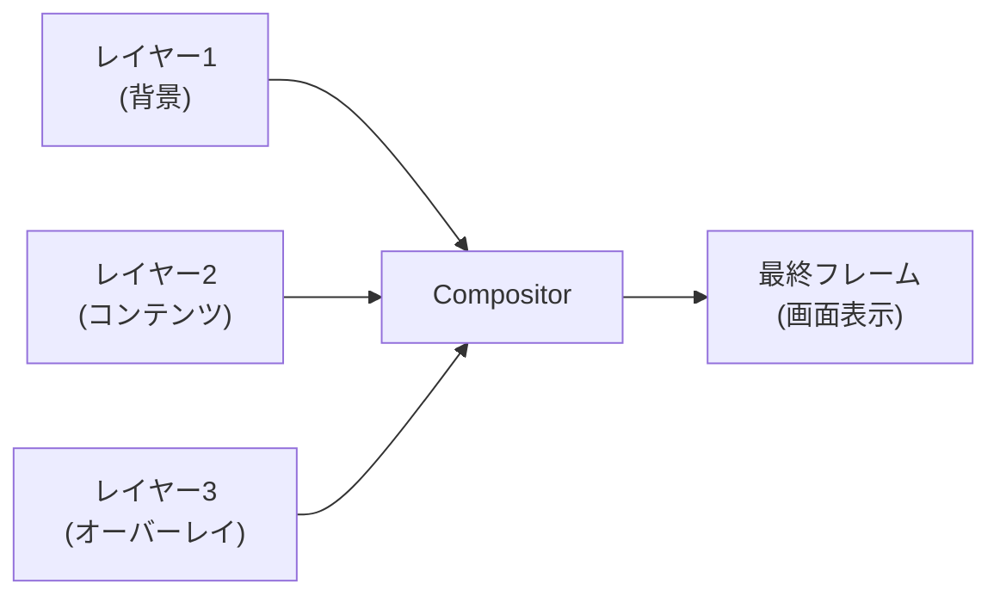

### 7.2 Compositorスレッドとメインスレッドの分離

Compositingの最大の利点は、**メインスレッドとは独立して実行できる**点にある。Chromiumでは、以下のようなスレッドアーキテクチャを採用している。

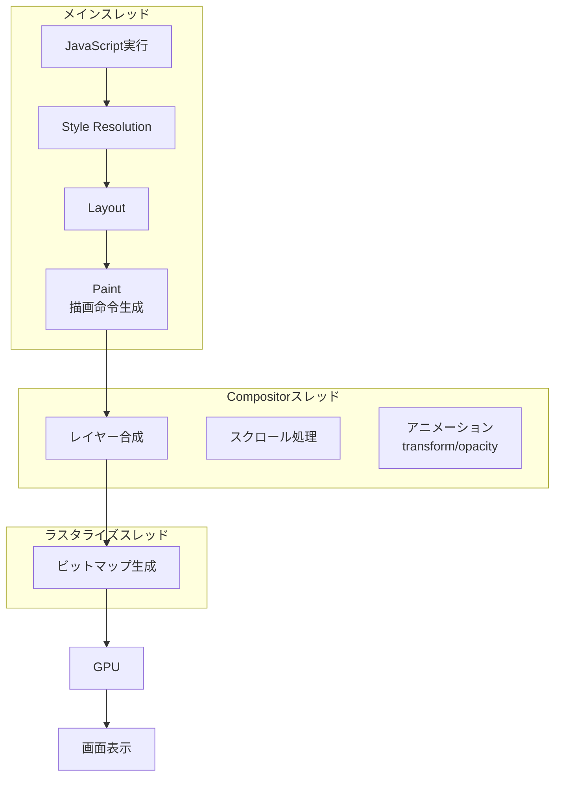

この分離が意味するのは、以下のことである。

- **スクロール**: メインスレッドがJavaScriptの実行でビジーでも、Compositorスレッドがスクロールを処理できるため、スクロールが滑らかに動作する
- **`transform`/`opacity` アニメーション**: これらのプロパティの変更はCompositorスレッドで処理され、メインスレッドのLayout/Paintをバイパスできる
- **`left`/`top`/`width`/`height` のアニメーション**: これらはLayoutの再計算が必要なため、メインスレッドでの処理が必須であり、パフォーマンスが劣る

### 7.3 GPUの役割

レイヤーの合成とラスタライズにおいて、**GPU**（Graphics Processing Unit）は重要な役割を果たす。GPUは大量のピクセルを並列に処理する能力に優れており、以下のタスクを高速に実行する。

- **テクスチャのアップロード**: ラスタライズされたビットマップをGPUメモリ（VRAM）にテクスチャとして転送する
- **テクスチャの合成**: 複数のテクスチャをz-orderに従って重ね合わせる
- **トランスフォームの適用**: 回転、拡大縮小、移動などの行列変換をハードウェアで実行する
- **opacityの適用**: アルファブレンディングをハードウェアで実行する

GPUによるCompositing処理は極めて高速であるため、`transform` と `opacity` のみを変更するアニメーションは「**Compositor-only animation**」と呼ばれ、60fps（あるいはそれ以上）を安定して達成できる。

### 7.4 レイヤー昇格（Layer Promotion）

ブラウザは、以下の条件を満たす要素を**独立したCompositing Layer**に昇格させる。

- `transform: translateZ(0)` や `translate3d()` を含む3D変換
- `will-change: transform` や `will-change: opacity` の指定
- `<video>` や `<canvas>` 要素
- `position: fixed` の要素
- `opacity` にアニメーションが適用されている要素
- Compositing Layerの上に重なる要素（**暗黙的な昇格**）

レイヤー昇格には注意が必要である。各レイヤーはGPUメモリを消費するため、過剰なレイヤーは**メモリ使用量の増大**と**レイヤー管理のオーバーヘッド**を引き起こす。これを**レイヤー爆発**（layer explosion）と呼び、特にモバイルデバイスでは深刻な問題になりうる。

### 7.5 タイリングとビューポートの最適化

巨大なページの場合、レイヤー全体をラスタライズするのは非効率である。ブラウザは各レイヤーを小さな**タイル**（通常256x256ピクセルまたは512x512ピクセル）に分割し、ビューポートに表示されるタイルとその近傍のタイルのみをラスタライズする。ユーザーがスクロールすると、新しいタイルがオンデマンドでラスタライズされる。

```
┌────────────────────────────┐
│ ┌──────┬──────┬──────┬───┐ │
│ │Tile  │Tile  │Tile  │   │ │
│ │(0,0) │(1,0) │(2,0) │...│ │
│ ├──────┼──────┼──────┼───┤ │
│ │Tile  │██████│██████│   │ │  ██ = ビューポートに
│ │(0,1) │██(1,1)██(2,1)│   │ │      表示中のタイル
│ ├──────┼██████┼██████┼───┤ │
│ │Tile  │██████│██████│   │ │
│ │(0,2) │██(1,2)██(2,2)│   │ │
│ ├──────┼──────┼──────┼───┤ │
│ │  ... │ ...  │ ...  │   │ │
│ └──────┴──────┴──────┴───┘ │
│           ページ全体          │
└────────────────────────────┘
```

## 8. リフローとリペイントの最適化

### 8.1 リフローとリペイントの違い

レンダリングパイプラインにおいて、DOM/スタイルの変更が引き起こす再処理の範囲は、変更の種類によって異なる。

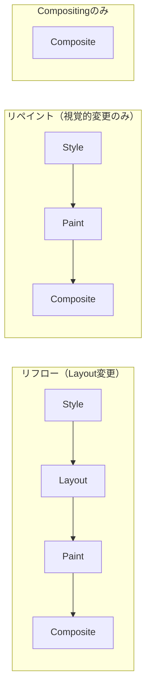

| 変更の種類 | 発生するフェーズ | 代表的なプロパティ |
|---|---|---|
| **リフロー** | Style → Layout → Paint → Composite | `width`, `height`, `margin`, `padding`, `font-size`, `display` |
| **リペイント** | Style → Paint → Composite | `color`, `background-color`, `visibility`, `box-shadow` |
| **Compositing のみ** | Composite | `transform`, `opacity` |

**リフローはリペイントよりもはるかにコストが高い**。リフローが発生すると、変更された要素とその子孫、場合によっては兄弟要素や祖先要素のLayoutも再計算が必要になるためである。

### 8.2 リフローの伝播

リフローがどの範囲に伝播するかは、変更の種類に依存する。

- **ローカルリフロー**: 要素のサイズ変更が祖先のサイズに影響しない場合（固定幅のコンテナ内での変更等）
- **グローバルリフロー**: ビューポートのリサイズ、`<body>` のフォントサイズ変更など、ドキュメント全体に影響する変更

### 8.3 具体的な最適化手法

**1. DOM操作のバッチ化**

```javascript
// BAD: each append triggers a potential reflow
for (let i = 0; i < 100; i++) {
  const li = document.createElement("li");
  li.textContent = `Item ${i}`;
  list.appendChild(li); // reflow may occur each time
}

// GOOD: use DocumentFragment to batch
const fragment = document.createDocumentFragment();
for (let i = 0; i < 100; i++) {
  const li = document.createElement("li");
  li.textContent = `Item ${i}`;
  fragment.appendChild(li);
}
list.appendChild(fragment); // single reflow
```

**2. クラスの一括変更**

```javascript
// BAD: multiple style changes trigger multiple recalculations
element.style.width = "100px";
element.style.height = "200px";
element.style.margin = "10px";

// GOOD: use a CSS class for batch style changes
element.classList.add("expanded");
```

**3. アニメーションの最適化**

```javascript
// BAD: animating layout properties
element.animate(
  [{ left: "0px" }, { left: "100px" }], // triggers reflow per frame
  { duration: 300 }
);

// GOOD: animating composite-only properties
element.animate(
  [{ transform: "translateX(0)" }, { transform: "translateX(100px)" }], // compositor-only
  { duration: 300 }
);
```

**4. `requestAnimationFrame` の活用**

```javascript
// BAD: DOM updates at arbitrary timing
function onScroll() {
  element.style.transform = `translateY(${window.scrollY}px)`;
}
window.addEventListener("scroll", onScroll);

// GOOD: coalesce updates to next frame
let ticking = false;
function onScroll() {
  if (!ticking) {
    requestAnimationFrame(() => {
      element.style.transform = `translateY(${window.scrollY}px)`;
      ticking = false;
    });
    ticking = true;
  }
}
window.addEventListener("scroll", onScroll);
```

## 9. JavaScript実行とレンダリングの関係

### 9.1 メインスレッドのブロッキング

ブラウザのメインスレッドは、以下のタスクを**単一のスレッド**で処理する。

- JavaScript の実行
- DOM/CSSOMの構築
- Style Resolution
- Layout
- Paintの描画命令生成
- イベントハンドラの実行
- ガベージコレクション

これらのタスクは基本的に**直列**で実行されるため、長時間のJavaScript実行はレンダリングをブロックし、画面の更新を妨げる。ユーザーはこれを「ページがフリーズした」と感じる。

```mermaid
gantt
    title メインスレッドのタイムライン
    dateFormat X
    axisFormat %L

    section フレーム1
    JavaScript実行   :js1, 0, 5
    Style            :s1, after js1, 2
    Layout           :l1, after s1, 3
    Paint            :p1, after l1, 2
    Idle             :i1, after p1, 5

    section フレーム2（長いJS）
    長いJavaScript実行 :js2, 17, 40
    Style            :s2, after js2, 2
    Layout           :l2, after s2, 3
    Paint            :p2, after l2, 2
```

上の例で、フレーム2のJavaScript実行に23ms以上かかっているため、16.67msのフレーム予算を大幅に超過し、フレームドロップ（コマ落ち）が発生する。

### 9.2 `<script>` タグとパーサブロッキング

HTMLパーサが `<script>` タグ（`async`/`defer` 属性なし）を検出すると、以下の処理が行われる。

1. パーサはDOM構築を停止する
2. スクリプトが外部ファイルの場合、ダウンロードを待つ
3. 未完了のCSSOMがあれば、CSSOM構築の完了を待つ（スクリプトがCSSOMを参照する可能性があるため）
4. スクリプトを実行する
5. パーサがDOM構築を再開する

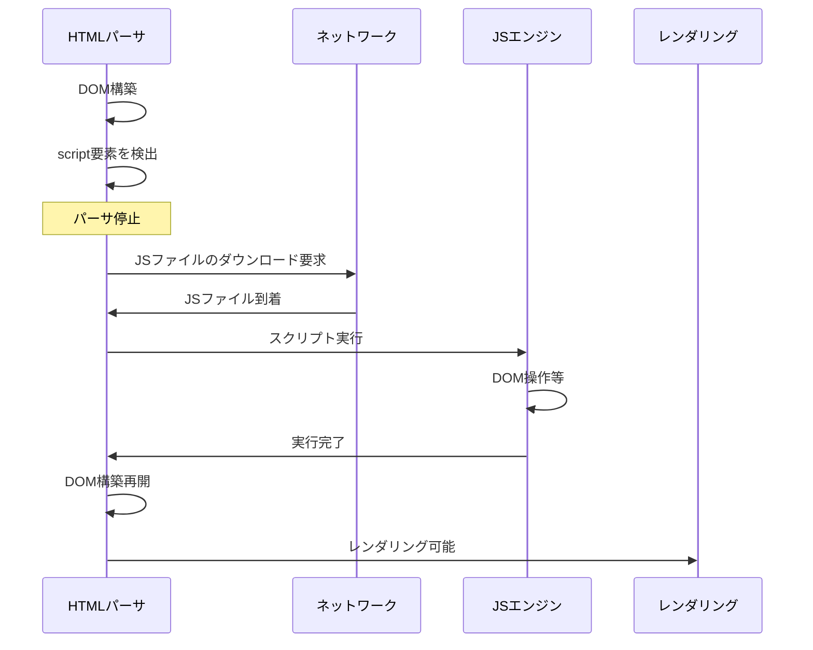

### 9.3 `async` と `defer`

`<script>` タグの `async` と `defer` 属性は、スクリプトの読み込みと実行のタイミングを制御する。

```html
<!-- parser-blocking: download and execute block parsing -->
<script src="app.js"></script>

<!-- async: download in parallel, execute when ready (blocks parsing during execution) -->
<script src="analytics.js" async></script>

<!-- defer: download in parallel, execute after DOM is ready -->
<script src="app.js" defer></script>
```

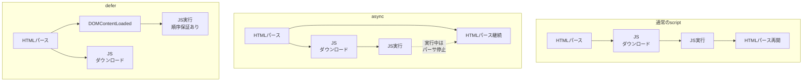

**使い分けの指針**:
- **`defer`**: DOM構築後に実行が必要で、実行順序が重要なスクリプト（アプリケーションのメインスクリプト等）
- **`async`**: 他のスクリプトやDOMに依存しない独立したスクリプト（アナリティクス、広告等）

### 9.4 Long Tasks と Web Workers

**Long Task**とは、メインスレッドで50ms以上かかるタスクを指す。Long TaskはUser Inputの処理やレンダリングを遅延させるため、ユーザー体験を直接的に悪化させる。

計算量の多い処理をメインスレッドから分離する手段として**Web Workers**がある。Web Workerは独立したスレッドで動作し、DOMにはアクセスできないが、メインスレッドとメッセージパッシングで通信できる。

```javascript
// main.js
const worker = new Worker("heavy-computation.js");
worker.postMessage({ data: largeDataSet });
worker.onmessage = (e) => {
  // update DOM with results
  updateUI(e.data.result);
};

// heavy-computation.js
self.onmessage = (e) => {
  const result = performHeavyComputation(e.data);
  self.postMessage({ result });
};
```

### 9.5 イベントループとレンダリングの協調

ブラウザのイベントループは、以下のサイクルを繰り返す。

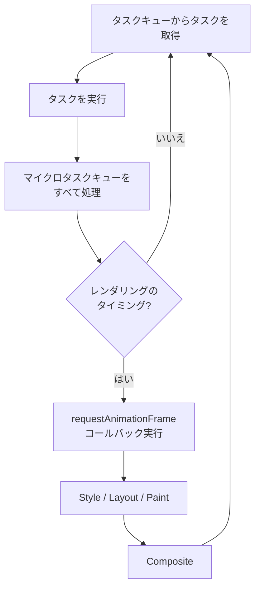

レンダリングは通常、ディスプレイのリフレッシュレートに同期して行われる（60Hzディスプレイなら約16.67ms間隔）。`requestAnimationFrame` のコールバックは、次のレンダリング直前に実行されるため、視覚的な更新はこのタイミングで行うのが最適である。

## 10. 最新の最適化技術

### 10.1 `will-change` プロパティ

`will-change` は、要素が近い将来どのように変化するかをブラウザに事前通知するプロパティである。これにより、ブラウザは事前にレイヤーの昇格やリソースの準備を行うことができる。

```css
.animated-element {
  will-change: transform, opacity;
}
```

`will-change` を指定すると、ブラウザは以下のような最適化を行う可能性がある。

- 要素を独立したCompositing Layerに昇格させる
- GPUメモリに事前にテクスチャを確保する
- 最適化されたラスタライズパスを使用する

ただし、`will-change` の乱用は避けるべきである。すべての要素に `will-change` を指定すると、メモリ消費が増大し、むしろパフォーマンスが悪化する。アニメーション開始前に動的に設定し、アニメーション完了後に解除するのが理想的である。

```javascript
// apply will-change when animation is about to start
element.addEventListener("mouseenter", () => {
  element.style.willChange = "transform";
});

// start the animation
element.addEventListener("click", () => {
  element.style.transform = "scale(1.2)";
});

// remove will-change after animation completes
element.addEventListener("transitionend", () => {
  element.style.willChange = "auto";
});
```

### 10.2 `contain` プロパティ

`contain` プロパティは、要素のレイアウト・スタイル・ペイントの影響範囲をブラウザに明示する。これにより、ブラウザは部分的な再計算の範囲を限定でき、パフォーマンスが向上する。

```css
.card {
  contain: layout style paint;
}
```

`contain` には以下の値がある。

| 値 | 効果 |
|---|---|
| `layout` | 要素内部のレイアウト変更が外部に影響しないことを宣言する。外部のレイアウトが内部に影響することもない |
| `style` | カウンタやクオートの影響範囲を要素内に限定する |
| `paint` | 要素の子孫が要素のボーダーボックスの外に描画されないことを宣言する |
| `size` | 要素のサイズが子孫の内容に依存しないことを宣言する。サイズは明示的に指定する必要がある |
| `strict` | `layout style paint size` の省略記法 |
| `content` | `layout style paint` の省略記法（`size` を含まない、より安全な選択肢） |

`contain: layout paint` を指定した要素で子孫のDOMが変更された場合、ブラウザはその要素の外部のLayout/Paintを再実行する必要がないと判断でき、再処理のコストを大幅に削減できる。

### 10.3 `content-visibility` プロパティ

`content-visibility` は、要素の描画やLayoutの遅延を制御する比較的新しいプロパティである。ビューポート外にある大量のコンテンツの初期レンダリングコストを劇的に削減できる。

```css
.article-section {
  content-visibility: auto;
  contain-intrinsic-size: auto 500px;
}
```

`content-visibility: auto` が指定された要素は、以下の振る舞いをする。

- **ビューポート外の場合**: Style Resolution、Layout、Paintをすべてスキップする。子孫のレンダリングは行われない
- **ビューポート内に入ると**: 通常通りレンダリングを行う
- **ビューポートから出ると**: 再びレンダリングをスキップする（ただしキャッシュされたレイアウト情報は保持する場合がある）

`contain-intrinsic-size` は、コンテンツがスキップされている間のプレースホルダーサイズを指定する。これがないとスクロールバーのサイズが正確に計算されず、ユーザー体験が損なわれる。

長いリスト表示やブログ記事の一覧ページなどでは、`content-visibility: auto` の適用により初期レンダリング時間が数倍改善されることがある。

### 10.4 CSS Animations / Transitions vs JavaScript Animations

アニメーションの実装方法によって、レンダリングパイプラインの処理パスが異なる。

**CSS Transitions / Animations（Compositor-friendly プロパティ）**:
- `transform`、`opacity` のアニメーションはCompositorスレッドで処理可能
- メインスレッドがブロックされていても、アニメーションは滑らかに継続する
- 60fps以上を安定して達成できる

**JavaScript Animations（`requestAnimationFrame`）**:
- 各フレームでJavaScriptが実行される
- Layoutプロパティの変更を伴う場合、メインスレッドでの処理が必須
- メインスレッドがビジーな場合、フレームドロップが発生する

**Web Animations API**:
- `element.animate()` で宣言的にアニメーションを定義
- Compositor-friendlyなプロパティの場合、CSS Animationsと同等のパフォーマンスを達成
- JavaScriptからの細かい制御（pause/resume/reverse等）が可能

```javascript
// Web Animations API — compositor-optimized
const animation = element.animate(
  [
    { transform: "translateX(0)", opacity: 1 },
    { transform: "translateX(200px)", opacity: 0.5 },
  ],
  {
    duration: 500,
    easing: "ease-out",
    fill: "forwards",
  }
);

// programmatic control
animation.pause();
animation.reverse();
animation.finished.then(() => console.log("done"));
```

## 11. ブラウザエンジンの比較

### 11.1 主要なブラウザエンジン

現在、主要なブラウザエンジンは3つ存在する。

| エンジン | 開発元 | 使用ブラウザ | レンダリングエンジン | JSエンジン |
|---|---|---|---|---|
| **Blink** | Google (Chromium) | Chrome, Edge, Opera, Brave, Vivaldi | Blink | V8 |
| **WebKit** | Apple | Safari, iOS上の全ブラウザ | WebKit | JavaScriptCore (Nitro) |
| **Gecko** | Mozilla | Firefox | Gecko | SpiderMonkey |

### 11.2 Blink（Chromium）

BlinkはかつてのWebKitからフォークされたエンジンであり、2013年に独立したプロジェクトとなった。現在、デスクトップ・モバイルを合わせてもっとも高いシェアを持つ。

**アーキテクチャの特徴**:

- **マルチプロセスアーキテクチャ**: タブごとに独立したレンダラプロセスが動作する。これによりタブ間の隔離とクラッシュの局所化が実現される
- **Compositor Thread**: メインスレッドとは独立したCompositorスレッドにより、スクロールやtransformアニメーションがメインスレッドの影響を受けない
- **LayoutNG**: 2020年から段階的に導入された新しいLayoutエンジン。Flexbox、Grid、Block Fragmentationなどの複雑なレイアウトを統一的に扱う
- **RenderingNG**: レンダリングパイプライン全体を再設計したプロジェクト。タイリング、ラスタライズ、Compositingの効率を大幅に改善

### 11.3 WebKit

WebKitはAppleが中心となって開発しているエンジンである。Safari および iOS上のすべてのブラウザ（iOSではサードパーティブラウザもWebKitの使用が義務付けられていた。ただしEU圏ではiOS 17.4以降この制限が緩和された）で使用されている。

**アーキテクチャの特徴**:

- **Web Process と UI Process の分離**: WebKitもマルチプロセスアーキテクチャを採用しているが、Blinkとは異なるプロセスモデルを使用する
- **省電力設計**: AppleのハードウェアとOSに最適化されており、バッテリー消費の低減に注力している
- **Intelligent Tracking Prevention (ITP)**: プライバシー保護機能がレンダリングエンジンレベルで統合されている

### 11.4 Gecko

GeckoはMozillaが開発する唯一の独立したブラウザエンジンである。BlinkやWebKitとは異なるコードベースを持ち、Webの多様性を維持する上で重要な存在である。

**アーキテクチャの特徴**:

- **WebRender**: GeckoはCSSのPaintとCompositingの両方をGPUで処理する**WebRender**を実装している。従来のブラウザがPaintをCPUで、CompositingのみをGPUで行っていたのに対し、WebRenderはDisplay List全体をGPUのシェーダーで処理する。これにより、複雑なCSSエフェクト（影、グラデーション、クリッピング等）の描画が高速化される
- **Stylo**: Rust言語で実装されたCSSエンジン。CSSのStyle Resolutionを複数スレッドで並列実行することで、大規模なDOMに対するスタイル計算のパフォーマンスを大幅に改善する
- **Fission**: サイト分離（Site Isolation）を実現するプロジェクト。異なるオリジンのiframeを別プロセスで処理する

### 11.5 レンダリングパイプラインの比較

3つのエンジンのレンダリングパイプラインは、基本的な概念（DOM → Style → Layout → Paint → Composite）は共通だが、実装のアーキテクチャに特徴的な違いがある。

```mermaid
flowchart TD
    subgraph Blink
        A1[DOM] --> B1[Style]
        B1 --> C1[Layout<br/>LayoutNG]
        C1 --> D1[Paint<br/>Display List]
        D1 --> E1[Raster<br/>CPU/GPU]
        E1 --> F1[Composite<br/>Viz/GPU]
    end

    subgraph Gecko
        A2[DOM] --> B2[Style<br/>Stylo/並列]
        B2 --> C2[Layout]
        C2 --> D2[Display List]
        D2 --> E2[WebRender<br/>全GPUレンダリング]
    end

    subgraph WebKit
        A3[DOM] --> B3[Style]
        B3 --> C3[Layout]
        C3 --> D3[Paint<br/>Display List]
        D3 --> E3[Raster<br/>CPU]
        E3 --> F3[Composite<br/>GPU]
    end
```

GeckoのWebRenderが特に興味深い。従来のブラウザでは、Paint（CPU上での描画命令の実行）とCompositing（GPU上でのレイヤー合成）が明確に分かれていたが、WebRenderはこれを統合し、Display Listを直接GPUで処理する。これはゲームエンジンのような「即時モードレンダリング」に近い手法であり、レイヤー管理のオーバーヘッドを排除する。

## 12. まとめ：レンダリングパイプラインの全体像

本記事で解説したレンダリングパイプラインの全体像をまとめる。

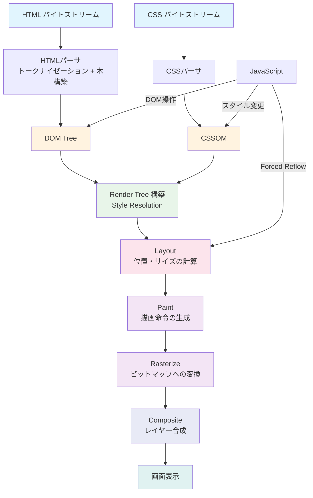

各フェーズのポイントを整理する。

| フェーズ | 入力 | 出力 | 実行スレッド |
|---|---|---|---|
| HTMLパース | バイトストリーム | DOM Tree | メインスレッド |
| CSSパース | CSSテキスト | CSSOM | メインスレッド |
| Style Resolution | DOM + CSSOM | Render Tree（算出スタイル付き） | メインスレッド |
| Layout | Render Tree + ビューポートサイズ | ボックスの座標・サイズ | メインスレッド |
| Paint | レイアウト済みRender Tree | 描画命令リスト | メインスレッド |
| Rasterize | 描画命令 | ビットマップ | ラスタライズスレッド/GPU |
| Composite | ビットマップ群 | 最終フレーム | Compositorスレッド/GPU |

レンダリングパイプラインを理解することで、Webアプリケーションのパフォーマンスボトルネックを正確に特定し、適切な最適化戦略を選択できるようになる。Layout変更を最小限に抑え、Compositor-onlyプロパティを活用し、`content-visibility` でオフスクリーンコンテンツのレンダリングをスキップする。これらの最適化は、ブラウザの内部動作を理解して初めて合理的に適用できるものである。

ブラウザは単なるHTMLビューアではなく、高度に最適化されたレンダリングエンジンであり、オペレーティングシステムに匹敵する複雑さを持つソフトウェアプラットフォームである。その内部動作を深く理解することは、現代のWeb開発者にとって不可欠な素養と言える。
