# Web Storage, IndexedDB, Cache API

## 歴史的背景 — Cookie から始まるブラウザストレージの進化

### Cookie の時代

Web の初期、ブラウザがクライアント側にデータを永続化する唯一の手段は **Cookie** だった。1994年に Netscape の Lou Montulli が HTTP Cookie を考案し、ステートレスな HTTP プロトコルの上にセッション管理やユーザー設定の保持を実現した。

しかし Cookie には設計上の制約が多い。

- **容量制限**: 1つの Cookie あたり約 4KB、1ドメインあたり最大数十個
- **毎回のリクエストに付随**: Cookie は HTTP ヘッダとして自動送信されるため、不要なデータまでネットワーク帯域を消費する
- **セキュリティの課題**: XSS や CSRF 攻撃のベクターとなりやすい
- **API の煩雑さ**: `document.cookie` という文字列ベースの API は扱いにくい

これらの問題は、Web アプリケーションが高度化するにつれて深刻になっていった。

### Web Storage の登場（2009年〜）

HTML5 の一部として策定された **Web Storage API**（localStorage / sessionStorage）は、Cookie の制約を大きく緩和した。キーバリュー形式で約 5〜10MB のデータを保存でき、HTTP リクエストには自動送信されない。シンプルな同期 API により、設定値やフォームの一時保存などが容易になった。

### IndexedDB の導入（2011年〜）

Web アプリケーションがより複雑なデータ管理を必要とするようになると、単純なキーバリューストアでは不十分だった。**IndexedDB** はブラウザ内の本格的なトランザクショナルデータベースとして登場し、構造化されたデータの保存・検索・インデックス作成を可能にした。非同期 API により、大量データの操作でも UI をブロックしない設計となっている。

### Cache API と Service Worker（2015年〜）

**Service Worker** の登場とともに導入された **Cache API** は、HTTP リクエスト/レスポンスのペアをキャッシュするために特化した API である。オフラインファーストの Web アプリケーション（Progressive Web App: PWA）を実現する中核技術として位置づけられた。

### ブラウザストレージの進化の全体像

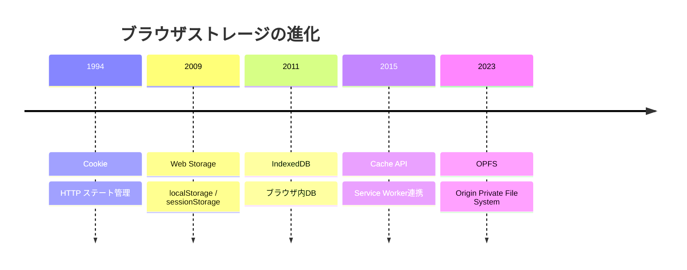

この進化は、Web アプリケーションがデスクトップアプリケーションに匹敵する機能を持つようになるにつれ、より大容量・高機能・非同期なストレージ手段が求められた結果である。

## アーキテクチャ — 各ストレージ API の設計思想と比較

### 設計思想の違い

各ストレージ API は、それぞれ異なるユースケースに対して設計されている。

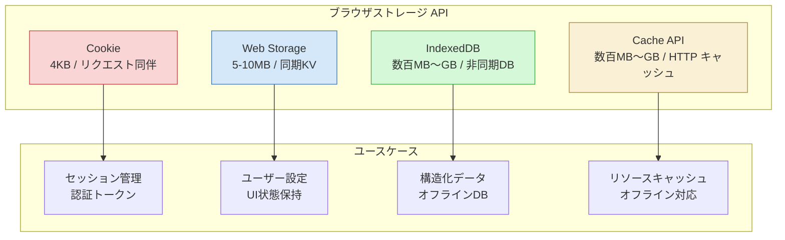

### 主要な比較軸

| 特性 | Cookie | Web Storage | IndexedDB | Cache API |
|------|--------|-------------|-----------|-----------|
| **容量** | ~4KB | 5〜10MB | 数百MB〜GB | 数百MB〜GB |
| **API** | 文字列操作 | 同期 KV | 非同期 トランザクション | 非同期 Promise |
| **データ形式** | 文字列 | 文字列 | 構造化クローン対応 | Request/Response |
| **インデックス** | なし | なし | あり | URL ベース |
| **トランザクション** | なし | なし | あり | なし |
| **有効期限** | 設定可能 | なし（永続） | なし（永続） | 手動管理 |
| **Worker からのアクセス** | 不可 | 不可 | 可能 | 可能 |
| **HTTP 送信** | 自動 | なし | なし | なし |

### 同一オリジンポリシーとストレージの分離

すべてのブラウザストレージ API は **同一オリジンポリシー**（Same-Origin Policy）に従い、`プロトコル + ホスト + ポート` の組み合わせごとにストレージ空間が分離される。

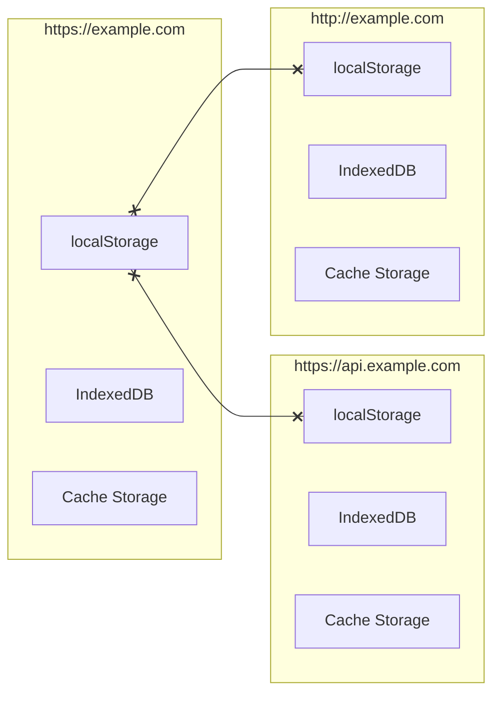

上図のように、サブドメインが異なる場合や、プロトコルが異なる場合（HTTP vs HTTPS）は、まったく別のストレージ空間として扱われる。これはセキュリティ上の重要な特性であり、悪意のあるサイトが他のオリジンのデータにアクセスすることを防いでいる。

## 技術詳細 — Web Storage

### localStorage と sessionStorage

Web Storage API は `localStorage` と `sessionStorage` という2つのストレージオブジェクトを提供する。両者は同じインターフェース（`Storage` インターフェース）を実装しているが、ライフサイクルとスコープが異なる。

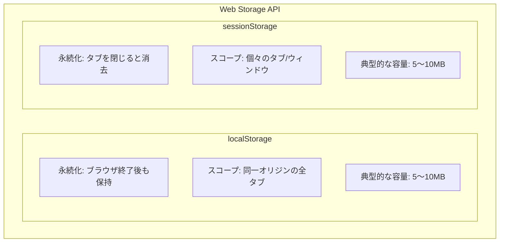

**localStorage** は明示的に削除しない限りデータが永続化され、同一オリジンのすべてのタブ・ウィンドウ間で共有される。ユーザー設定の保存やテーマの記憶など、長期的に保持したいデータに適している。

**sessionStorage** はブラウザのタブやウィンドウのセッションに紐づき、タブを閉じるとデータが消去される。フォームの一時保存やウィザード形式の入力途中データなど、一時的なデータの保持に適している。

### API の詳細

Web Storage の API はシンプルな同期インターフェースで構成される。

```javascript
// Store a value
localStorage.setItem("theme", "dark");

// Retrieve a value
const theme = localStorage.getItem("theme"); // "dark"

// Remove a specific item
localStorage.removeItem("theme");

// Clear all items for this origin
localStorage.clear();

// Get the number of stored items
console.log(localStorage.length); // 0

// Iterate over all keys
for (let i = 0; i < localStorage.length; i++) {
  const key = localStorage.key(i);
  console.log(`${key}: ${localStorage.getItem(key)}`);
}
```

値は必ず **文字列として保存** される点に注意が必要である。オブジェクトや配列を保存する場合は、明示的に JSON シリアライズ/デシリアライズする必要がある。

```javascript
// Storing an object requires JSON serialization
const userPrefs = {
  theme: "dark",
  fontSize: 14,
  language: "ja",
};

localStorage.setItem("prefs", JSON.stringify(userPrefs));

// Retrieval requires JSON deserialization
const stored = JSON.parse(localStorage.getItem("prefs"));
console.log(stored.theme); // "dark"
```

### storage イベント

localStorage は **`storage` イベント**を通じて、同一オリジンの他のタブ・ウィンドウとの間でデータの変更を検知できる。これはクロスタブ通信の簡易的な手段として利用される。

```javascript
// Listen for changes made in OTHER tabs/windows
window.addEventListener("storage", (event) => {
  console.log(`Key: ${event.key}`);
  console.log(`Old value: ${event.oldValue}`);
  console.log(`New value: ${event.newValue}`);
  console.log(`URL: ${event.url}`);
  console.log(`Storage area: ${event.storageArea}`);
});
```

重要な注意点として、`storage` イベントは**変更を行ったタブ自身では発火しない**。あくまで同一オリジンの**他のタブ・ウィンドウ**に対してのみ通知される。

### Web Storage の制約と注意点

Web Storage は手軽に使えるが、以下の制約を理解しておく必要がある。

1. **同期 API**: メインスレッドをブロックするため、大量のデータ操作には不向き
2. **文字列のみ**: バイナリデータの保存には Base64 エンコーディングが必要で非効率
3. **トランザクションなし**: 複数の操作をアトミックに行うことができない
4. **容量制限**: 通常 5〜10MB でオリジンごとに制限される
5. **Worker からアクセス不可**: Web Worker や Service Worker からは利用できない

## 技術詳細 — IndexedDB

### IndexedDB の設計原則

IndexedDB はブラウザ内の **非同期トランザクショナルデータベース** である。以下の設計原則に基づいている。

- **非同期 API**: UI スレッドをブロックしない
- **トランザクションベース**: データの一貫性を保証する
- **キーバリューストア**: 主キーによるデータの格納と検索
- **インデックスサポート**: 任意のプロパティに対するインデックスで高速な検索を実現
- **構造化クローンアルゴリズム**: JavaScript オブジェクト、Blob、ArrayBuffer などをそのまま保存可能
- **大容量**: ディスク容量に応じて数百 MB〜数 GB のデータを保存可能

### IndexedDB のデータモデル

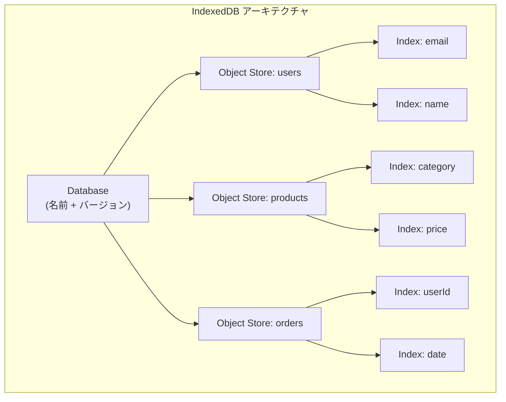

IndexedDB のデータ階層は以下のようになる。

- **Database**: 最上位のコンテナ。名前とバージョン番号で識別される
- **Object Store**: RDBMS のテーブルに相当する。各レコードはキーで一意に識別される
- **Index**: Object Store 内のプロパティに対する二次インデックス。範囲検索やソートを効率化する
- **Key**: 主キー。自動採番（autoIncrement）またはインライン（keyPath）で指定
- **Value**: 構造化クローン可能な JavaScript の値（オブジェクト、配列、Blob など）

### トランザクションモデル

IndexedDB のトランザクションには2つのモードがある。

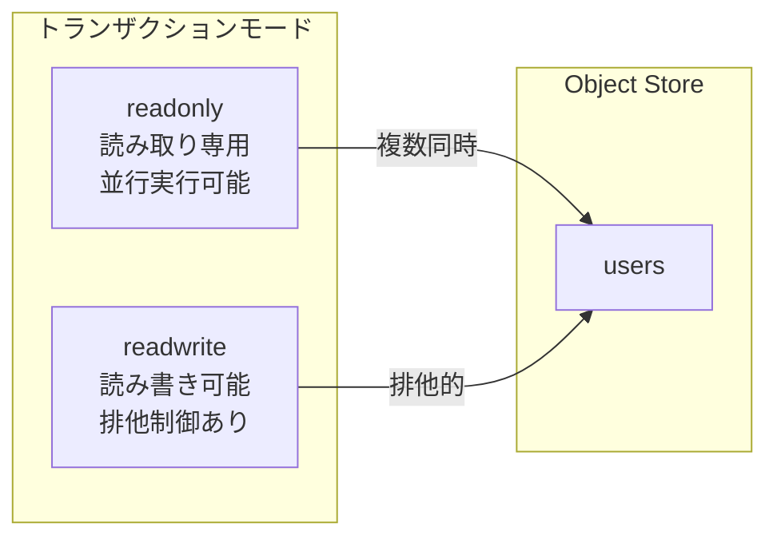

- **readonly**: 読み取り専用。同一 Object Store に対して複数の readonly トランザクションが並行実行できる
- **readwrite**: 読み書き可能。同一 Object Store に対しては排他的に実行される

トランザクションは自動コミットされる。明示的なコミット操作は不要で、トランザクション内のすべての操作が完了すると自動的にコミットされる。エラーが発生した場合はロールバックされる。

### 基本的な操作

#### データベースのオープンとスキーマ定義

```javascript
// Open (or create) a database with version 1
const request = indexedDB.open("myApp", 1);

// Called when the database is created or version is upgraded
request.onupgradeneeded = (event) => {
  const db = event.target.result;

  // Create an object store with an auto-incrementing key
  const userStore = db.createObjectStore("users", { keyPath: "id", autoIncrement: true });

  // Create indexes for searching
  userStore.createIndex("email", "email", { unique: true });
  userStore.createIndex("name", "name", { unique: false });
  userStore.createIndex("age", "age", { unique: false });
};

request.onsuccess = (event) => {
  const db = event.target.result;
  console.log("Database opened successfully");
};

request.onerror = (event) => {
  console.error("Database error:", event.target.error);
};
```

`onupgradeneeded` イベントは、データベースが新規作成されるとき、またはバージョン番号が上がったときにのみ発火する。Object Store やインデックスの作成・変更は、このイベントハンドラ内でのみ行える。これはスキーマのバージョン管理メカニズムとして機能する。

#### CRUD 操作

```javascript
function addUser(db, user) {
  // Start a readwrite transaction
  const tx = db.transaction("users", "readwrite");
  const store = tx.objectStore("users");

  // Add a record
  const request = store.add(user);

  request.onsuccess = () => {
    console.log("User added with id:", request.result);
  };

  tx.oncomplete = () => {
    console.log("Transaction completed");
  };

  tx.onerror = (event) => {
    console.error("Transaction failed:", event.target.error);
  };
}

function getUserByEmail(db, email) {
  const tx = db.transaction("users", "readonly");
  const store = tx.objectStore("users");
  const index = store.index("email");

  // Look up by index
  const request = index.get(email);

  request.onsuccess = () => {
    console.log("Found user:", request.result);
  };
}

function updateUser(db, user) {
  const tx = db.transaction("users", "readwrite");
  const store = tx.objectStore("users");

  // put() updates if the key exists, inserts if it doesn't
  store.put(user);
}

function deleteUser(db, id) {
  const tx = db.transaction("users", "readwrite");
  const store = tx.objectStore("users");

  store.delete(id);
}
```

#### カーソルによる範囲検索

IndexedDB のカーソルは、RDBMS のカーソルと同様に、レコードを逐次的に走査する仕組みである。`IDBKeyRange` と組み合わせることで、範囲検索を効率的に実行できる。

```javascript
function getUsersByAgeRange(db, minAge, maxAge) {
  const tx = db.transaction("users", "readonly");
  const store = tx.objectStore("users");
  const index = store.index("age");

  // Define a key range: minAge <= age <= maxAge
  const range = IDBKeyRange.bound(minAge, maxAge);

  const results = [];

  // Open a cursor over the range
  const request = index.openCursor(range);

  request.onsuccess = (event) => {
    const cursor = event.target.result;
    if (cursor) {
      results.push(cursor.value);
      cursor.continue(); // Move to the next record
    } else {
      // No more records
      console.log("Users in age range:", results);
    }
  };
}
```

`IDBKeyRange` は以下の4つの静的メソッドを提供する。

- `IDBKeyRange.only(value)` — 完全一致
- `IDBKeyRange.lowerBound(lower, open?)` — 下限指定
- `IDBKeyRange.upperBound(upper, open?)` — 上限指定
- `IDBKeyRange.bound(lower, upper, lowerOpen?, upperOpen?)` — 範囲指定

### Promise ラッパーと idb ライブラリ

IndexedDB のネイティブ API はイベントリスナーベースのコールバックスタイルであり、モダンな JavaScript の非同期パターン（async/await）とは相性が悪い。実務では [idb](https://github.com/jakearchibald/idb) のような薄い Promise ラッパーライブラリを使うことが一般的である。

```javascript
import { openDB } from "idb";

async function main() {
  // Open database with Promise-based API
  const db = await openDB("myApp", 1, {
    upgrade(db) {
      const store = db.createObjectStore("users", {
        keyPath: "id",
        autoIncrement: true,
      });
      store.createIndex("email", "email", { unique: true });
    },
  });

  // Add a record
  const id = await db.add("users", {
    name: "Alice",
    email: "alice@example.com",
    age: 30,
  });

  // Read by primary key
  const user = await db.get("users", id);

  // Read by index
  const userByEmail = await db.getFromIndex("users", "email", "alice@example.com");

  // Get all records
  const allUsers = await db.getAll("users");

  // Update
  await db.put("users", { ...user, age: 31 });

  // Delete
  await db.delete("users", id);
}
```

## 技術詳細 — Cache API

### Cache API の設計思想

Cache API は **HTTP のリクエスト/レスポンスペアをキャッシュする** ために設計された API である。Service Worker と組み合わせることで、ネットワークリクエストのインターセプトとキャッシュされたレスポンスの返却が可能になり、オフライン対応やパフォーマンス向上を実現する。

Cache API の特徴は以下の通りである。

- **Request/Response ペア**: URL をキーとし、HTTP レスポンスを値として保存
- **Promise ベース**: すべての操作が Promise を返す
- **Service Worker 連携**: Service Worker の fetch イベントハンドラからアクセスが容易
- **手動管理**: HTTP キャッシュ（ブラウザキャッシュ）とは独立した、開発者が完全に制御できるキャッシュ
- **メインスレッドからもアクセス可能**: Service Worker がなくても `window.caches` からアクセスできる

### Cache API と HTTP キャッシュの違い

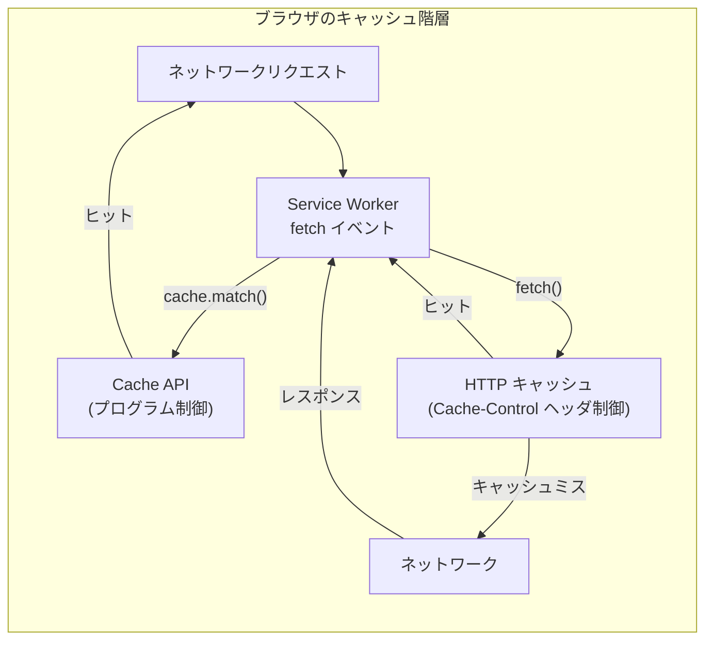

Cache API と HTTP キャッシュの主な違いは以下の通りである。

| 特性 | Cache API | HTTP キャッシュ |
|------|-----------|----------------|
| **制御主体** | JavaScript コード | Cache-Control ヘッダ |
| **有効期限** | 手動管理 | ヘッダに基づく自動管理 |
| **プログラムからの制御** | 完全 | 限定的 |
| **オフライン対応** | 可能 | 限定的 |
| **キーの単位** | Request オブジェクト | URL + Vary ヘッダ |

### 基本操作

```javascript
// Open a named cache
const cache = await caches.open("my-app-v1");

// Add a single URL to the cache
await cache.add("/styles/main.css");

// Add multiple URLs at once
await cache.addAll([
  "/",
  "/styles/main.css",
  "/scripts/app.js",
  "/images/logo.png",
]);

// Manually add a request/response pair
const response = await fetch("/api/data");
await cache.put("/api/data", response);

// Match a request (returns the cached response or undefined)
const cachedResponse = await cache.match("/styles/main.css");
if (cachedResponse) {
  const text = await cachedResponse.text();
  console.log("Cached CSS:", text);
}

// Delete a specific entry
await cache.delete("/api/data");

// List all cache names
const cacheNames = await caches.keys();
console.log("Available caches:", cacheNames);

// Delete an entire cache
await caches.delete("my-app-v1");
```

### Service Worker との連携

Cache API の真価は Service Worker と組み合わせたときに発揮される。Service Worker の `fetch` イベントをインターセプトし、キャッシュ戦略に基づいてレスポンスを返却する。

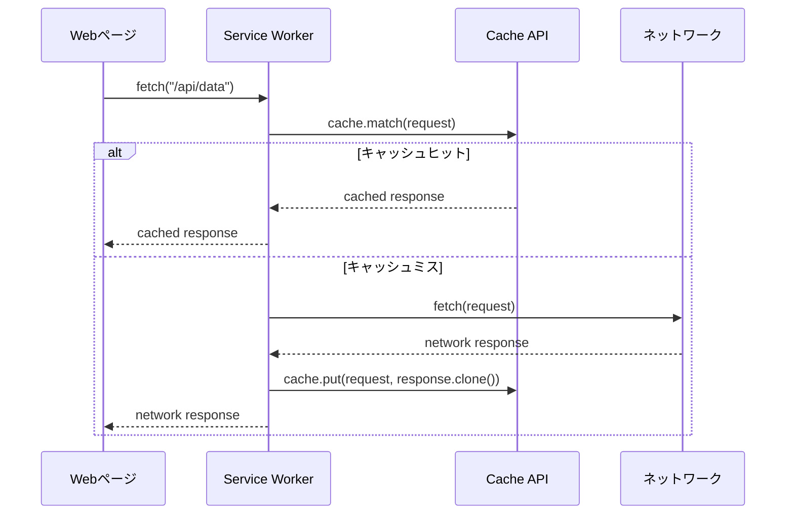

#### Service Worker のライフサイクルとキャッシュ管理

```javascript
// service-worker.js

const CACHE_NAME = "my-app-v2";
const ASSETS_TO_CACHE = [
  "/",
  "/index.html",
  "/styles/main.css",
  "/scripts/app.js",
  "/images/logo.png",
];

// Install event: pre-cache essential assets
self.addEventListener("install", (event) => {
  event.waitUntil(
    caches.open(CACHE_NAME).then((cache) => {
      return cache.addAll(ASSETS_TO_CACHE);
    })
  );
});

// Activate event: clean up old caches
self.addEventListener("activate", (event) => {
  event.waitUntil(
    caches.keys().then((cacheNames) => {
      return Promise.all(
        cacheNames
          .filter((name) => name !== CACHE_NAME)
          .map((name) => caches.delete(name))
      );
    })
  );
});

// Fetch event: serve from cache, falling back to network
self.addEventListener("fetch", (event) => {
  event.respondWith(
    caches.match(event.request).then((cachedResponse) => {
      if (cachedResponse) {
        return cachedResponse;
      }
      return fetch(event.request).then((networkResponse) => {
        // Cache the new response for future use
        if (networkResponse.status === 200) {
          const responseClone = networkResponse.clone();
          caches.open(CACHE_NAME).then((cache) => {
            cache.put(event.request, responseClone);
          });
        }
        return networkResponse;
      });
    })
  );
});
```

## 実装方法 — キャッシュ戦略とベストプラクティス

### 代表的なキャッシュ戦略

Service Worker と Cache API を使ったキャッシュ戦略には、いくつかの代表的なパターンがある。

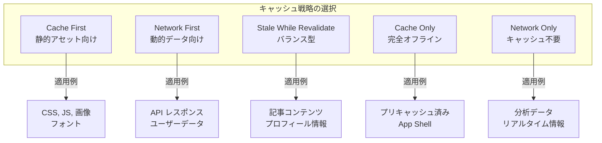

#### Cache First（キャッシュ優先）

キャッシュにあればそれを返し、なければネットワークに問い合わせる。バージョニングされた静的アセット（ファイル名にハッシュが含まれるものなど）に最適。

```javascript
// Cache First strategy
self.addEventListener("fetch", (event) => {
  event.respondWith(
    caches.match(event.request).then((cached) => {
      return cached || fetch(event.request);
    })
  );
});
```

#### Network First（ネットワーク優先）

まずネットワークに問い合わせ、失敗したらキャッシュを返す。最新のデータが重要な API レスポンスなどに適している。

```javascript
// Network First strategy
self.addEventListener("fetch", (event) => {
  event.respondWith(
    fetch(event.request)
      .then((networkResponse) => {
        // Update cache with fresh response
        const clone = networkResponse.clone();
        caches.open(CACHE_NAME).then((cache) => {
          cache.put(event.request, clone);
        });
        return networkResponse;
      })
      .catch(() => {
        // Fall back to cache if network fails
        return caches.match(event.request);
      })
  );
});
```

#### Stale While Revalidate（古いキャッシュを返しつつ裏で更新）

キャッシュがあればすぐに返しつつ、バックグラウンドでネットワークから最新版を取得してキャッシュを更新する。速度と鮮度のバランスが取れた戦略。

```javascript
// Stale While Revalidate strategy
self.addEventListener("fetch", (event) => {
  event.respondWith(
    caches.open(CACHE_NAME).then((cache) => {
      return cache.match(event.request).then((cached) => {
        // Always fetch from network to update cache
        const fetchPromise = fetch(event.request).then((networkResponse) => {
          cache.put(event.request, networkResponse.clone());
          return networkResponse;
        });
        // Return cached immediately, or wait for network
        return cached || fetchPromise;
      });
    })
  );
});
```

### IndexedDB のベストプラクティス

#### スキーマのバージョン管理

IndexedDB のスキーマ変更はバージョンアップグレードの仕組みを通じて行う。運用中のアプリケーションでは、以前のバージョンからの移行パスを維持する必要がある。

```javascript
const request = indexedDB.open("myApp", 3);

request.onupgradeneeded = (event) => {
  const db = event.target.result;
  const oldVersion = event.oldVersion;

  // Migration from version 0 (new database)
  if (oldVersion < 1) {
    const store = db.createObjectStore("users", {
      keyPath: "id",
      autoIncrement: true,
    });
    store.createIndex("email", "email", { unique: true });
  }

  // Migration from version 1 to 2
  if (oldVersion < 2) {
    const tx = event.target.transaction;
    const store = tx.objectStore("users");
    store.createIndex("createdAt", "createdAt", { unique: false });
  }

  // Migration from version 2 to 3
  if (oldVersion < 3) {
    db.createObjectStore("settings", { keyPath: "key" });
  }
};
```

#### エラーハンドリング

IndexedDB は様々な理由でエラーが発生しうる。プライベートブラウジングモードでの容量制限、ストレージ上限の超過、同時アクセスによる競合などを適切にハンドリングする必要がある。

```javascript
async function safeDbOperation() {
  try {
    const db = await openDB("myApp", 1, {
      upgrade(db) {
        db.createObjectStore("data", { keyPath: "id" });
      },
      blocked() {
        // Another tab has an older version open
        console.warn("Database upgrade blocked by another tab");
      },
      blocking() {
        // This connection is blocking a version upgrade
        console.warn("This tab is blocking a database upgrade");
      },
    });

    return db;
  } catch (error) {
    if (error.name === "QuotaExceededError") {
      console.error("Storage quota exceeded");
      // Implement cleanup logic
    } else if (error.name === "InvalidStateError") {
      console.error("Database deleted or not accessible (private mode?)");
    } else {
      console.error("Unexpected IndexedDB error:", error);
    }
    throw error;
  }
}
```

### localStorage のベストプラクティス

#### 有効期限付きストレージ

localStorage にはネイティブの有効期限メカニズムがないため、必要に応じて自前で実装する。

```javascript
const StorageWithTTL = {
  set(key, value, ttlMs) {
    const item = {
      value: value,
      expiry: Date.now() + ttlMs,
    };
    localStorage.setItem(key, JSON.stringify(item));
  },

  get(key) {
    const raw = localStorage.getItem(key);
    if (!raw) return null;

    const item = JSON.parse(raw);
    if (Date.now() > item.expiry) {
      // Expired — remove and return null
      localStorage.removeItem(key);
      return null;
    }
    return item.value;
  },
};

// Store with 1-hour TTL
StorageWithTTL.set("apiToken", "abc123", 60 * 60 * 1000);

// Retrieve (returns null if expired)
const token = StorageWithTTL.get("apiToken");
```

#### 容量の安全な管理

localStorage の容量上限に達した場合、`setItem` は `QuotaExceededError` をスローする。

```javascript
function safeSetItem(key, value) {
  try {
    localStorage.setItem(key, value);
    return true;
  } catch (e) {
    if (e.name === "QuotaExceededError") {
      console.warn("localStorage quota exceeded, attempting cleanup");
      // Implement a cleanup strategy (e.g., remove oldest items)
      cleanupOldEntries();
      try {
        localStorage.setItem(key, value);
        return true;
      } catch {
        console.error("Still unable to store data after cleanup");
        return false;
      }
    }
    throw e;
  }
}
```

## 運用の実際 — 容量制限、オリジンポリシー、パフォーマンス

### ストレージの容量制限

ブラウザごとにストレージの容量制限は異なり、また時代とともに変化している。以下は一般的な目安である。

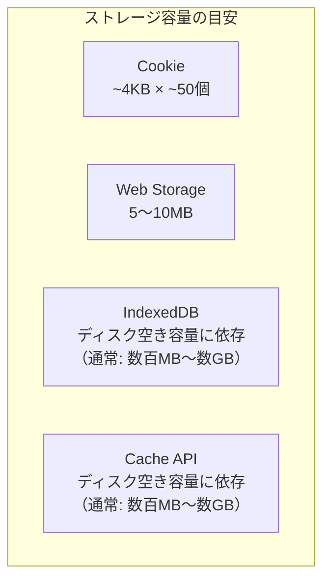

主要ブラウザにおけるストレージクォータの仕組みは以下の通りである。

- **Chrome / Edge（Chromium 系）**: デバイスの空きディスク容量の最大60%をすべてのオリジンで共有。各オリジンはその中で最大60%まで使用可能
- **Firefox**: 空きディスク容量の最大50%。各オリジンは最大10%または2GBの小さい方まで
- **Safari**: 各オリジンに対して初期1GBを許可。それ以上はユーザーの許可が必要。7日間操作がないオリジンのデータは削除される可能性がある（ITP: Intelligent Tracking Prevention）

#### Storage Manager API による確認

```javascript
// Check storage usage and quota
async function checkStorageQuota() {
  if (navigator.storage && navigator.storage.estimate) {
    const estimate = await navigator.storage.estimate();
    const usedMB = (estimate.usage / (1024 * 1024)).toFixed(2);
    const quotaMB = (estimate.quota / (1024 * 1024)).toFixed(2);
    const percentUsed = ((estimate.usage / estimate.quota) * 100).toFixed(1);

    console.log(`Used: ${usedMB} MB`);
    console.log(`Quota: ${quotaMB} MB`);
    console.log(`Usage: ${percentUsed}%`);

    // Breakdown by storage type (Chrome only)
    if (estimate.usageDetails) {
      console.log("IndexedDB:", estimate.usageDetails.indexedDB);
      console.log("Cache API:", estimate.usageDetails.caches);
      console.log("Service Worker:", estimate.usageDetails.serviceWorkerRegistrations);
    }
  }
}
```

### ストレージの永続化

デフォルトでは、ブラウザはストレージ容量が逼迫した場合に、使用頻度の低いオリジンのデータを自動的に削除（eviction）する可能性がある。**StorageManager.persist()** を使うことで、データの永続化をリクエストできる。

```javascript
// Request persistent storage
async function requestPersistence() {
  if (navigator.storage && navigator.storage.persist) {
    const isPersistent = await navigator.storage.persist();
    if (isPersistent) {
      console.log("Storage will not be cleared automatically");
    } else {
      console.log("Storage may be cleared under pressure");
    }
  }
}

// Check if storage is already persistent
async function checkPersistence() {
  if (navigator.storage && navigator.storage.persisted) {
    const persisted = await navigator.storage.persisted();
    console.log(`Persistent storage: ${persisted}`);
  }
}
```

永続化の許可はブラウザによって判断基準が異なる。Chrome ではサイトのエンゲージメント（ブックマーク、通知の許可など）に基づいて自動的に判断される。Firefox ではユーザーにプロンプトを表示する。

### パフォーマンスの考慮事項

#### Web Storage のパフォーマンス特性

localStorage の操作は**同期的**であり、メインスレッドをブロックする。小さなデータ（数 KB 程度）であれば問題ないが、大量のデータや頻繁な読み書きはパフォーマンスに影響する。

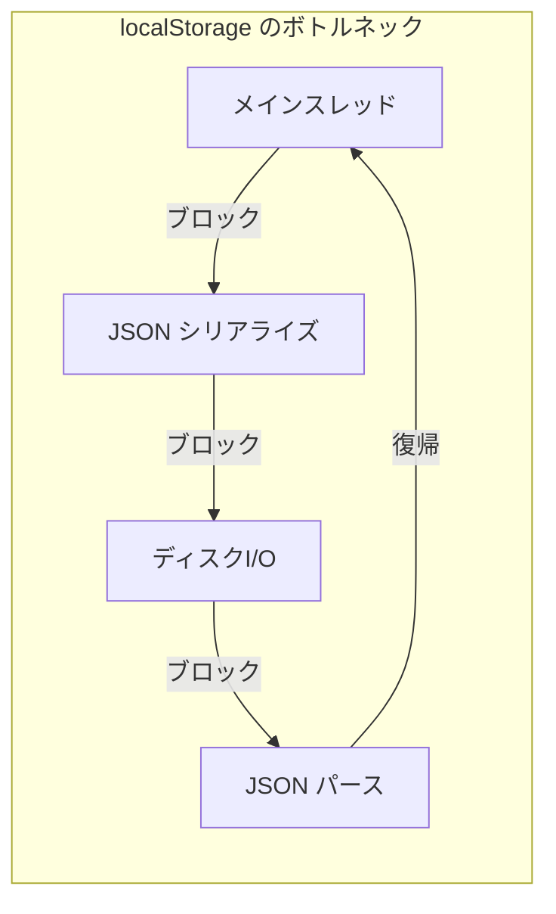

特に以下のパターンは避けるべきである。

1. **大きなオブジェクトの頻繁な読み書き**: JSON.stringify/parse のコストが大きい
2. **ループ内での繰り返しアクセス**: バッチ処理が不可能なため、各操作がディスク I/O を伴う
3. **アプリケーション起動時の大量読み込み**: 初期化を遅延させる

#### IndexedDB のパフォーマンス最適化

IndexedDB は非同期 API を持つが、適切に使わないとパフォーマンス問題が発生する。

```javascript
// BAD: Opening a new transaction for each operation
async function badBatchInsert(db, items) {
  for (const item of items) {
    // Each iteration creates a new transaction
    await db.add("products", item);
  }
}

// GOOD: Batch operations in a single transaction
async function goodBatchInsert(db, items) {
  const tx = db.transaction("products", "readwrite");
  const store = tx.objectStore("products");

  // All operations share the same transaction
  for (const item of items) {
    store.add(item);
  }

  await tx.done;
}
```

トランザクションのスコープを最小限にし、不要な Object Store をトランザクションに含めないことも重要である。readwrite トランザクションは排他ロックを取得するため、長時間保持すると他の操作がブロックされる。

### セキュリティの考慮事項

ブラウザストレージには**機密情報を保存しない**ことが原則である。

- **XSS 攻撃**: JavaScript で任意のコードが実行された場合、localStorage、sessionStorage、IndexedDB のすべてのデータが読み取られる可能性がある
- **物理的なアクセス**: デバイスに物理的にアクセスできる攻撃者は、ブラウザの開発者ツールを通じてストレージの内容を確認できる
- **暗号化なし**: ブラウザストレージのデータはデフォルトで暗号化されていない

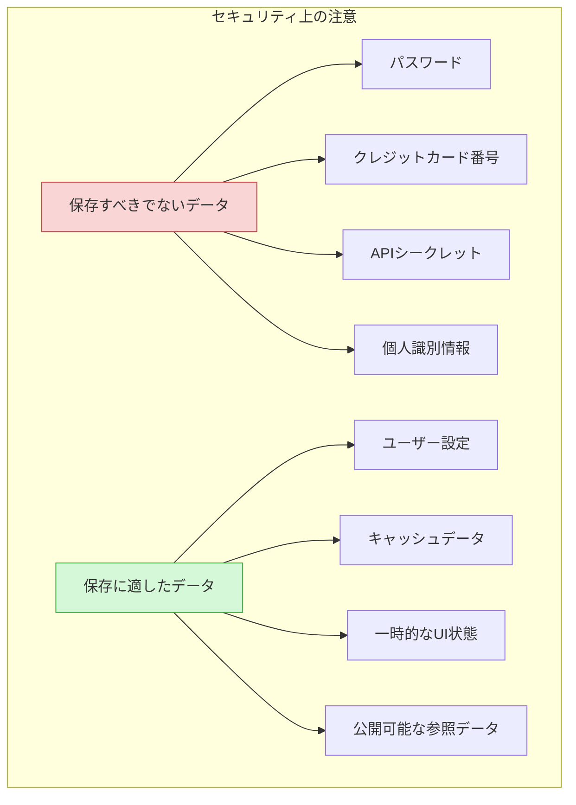

認証トークンの保存には Cookie の `HttpOnly` + `Secure` + `SameSite` 属性を使用するか、短寿命のアクセストークンをメモリ内にのみ保持するアプローチが推奨される。

### サードパーティ Cookie とストレージのパーティショニング

近年のプライバシー強化に伴い、ブラウザはサードパーティコンテキストでのストレージアクセスを制限する方向に進んでいる。

- **Safari**: ITP（Intelligent Tracking Prevention）により、サードパーティ Cookie は既にブロックされ、クロスサイトのストレージも制限されている
- **Firefox**: ETP（Enhanced Tracking Protection）により、既知のトラッカーのサードパーティストレージをブロック
- **Chrome**: サードパーティ Cookie の段階的廃止を進めている。**Storage Partitioning** により、サードパーティコンテキストのストレージはトップレベルサイトごとに分離される

Storage Partitioning では、`iframe` 内のコンテンツが使用する localStorage や IndexedDB は、トップレベルのオリジンとの組み合わせで分離される。これにより、あるサイトの iframe 内でセットしたデータは、別のサイトの iframe 内からはアクセスできなくなる。

## 今後の展望

### Origin Private File System（OPFS）

**Origin Private File System（OPFS）** は File System Access API の一部として導入された、オリジンごとに分離されたファイルシステムである。IndexedDB や Cache API とは異なるアプローチで、ファイルベースの高速なデータアクセスを提供する。

```javascript
// Access the Origin Private File System
const root = await navigator.storage.getDirectory();

// Create a file
const fileHandle = await root.getFileHandle("data.json", { create: true });

// Write to the file
const writable = await fileHandle.createWritable();
await writable.write(JSON.stringify({ key: "value" }));
await writable.close();

// Read the file
const file = await fileHandle.getFile();
const contents = await file.text();
console.log(JSON.parse(contents));
```

OPFS の最も注目すべき特徴は、**Web Worker 内で同期的なアクセスが可能**な点である。`createSyncAccessHandle()` メソッドにより、ファイルの高速な読み書きが実現される。これはデータベースエンジンのような低レベルなストレージ操作を必要とするユースケースで特に有用である。

```javascript
// In a Web Worker: synchronous access for high performance
const root = await navigator.storage.getDirectory();
const fileHandle = await root.getFileHandle("db.bin", { create: true });
const accessHandle = await fileHandle.createSyncAccessHandle();

// Read and write with ArrayBuffer (synchronous, high-performance)
const buffer = new ArrayBuffer(1024);
const bytesRead = accessHandle.read(buffer, { at: 0 });

const data = new Uint8Array([1, 2, 3, 4]);
accessHandle.write(data, { at: 0 });
accessHandle.flush();
accessHandle.close();
```

この同期アクセスの仕組みにより、**SQLite をブラウザ上で動作させる**プロジェクト（sql.js、wa-sqlite など）が OPFS をバックエンドとして利用するケースが増えている。IndexedDB と比較して、OPFS + SQLite の方が特定のワークロードで10倍以上高速になるという報告もある。

### Storage Buckets API

**Storage Buckets API** は、オリジン内のストレージをさらに細かく分割して管理するための提案中の仕様である。異なるデータに対して異なる永続化ポリシーやクォータを設定できるようになる。

```javascript
// Create storage buckets with different policies (proposed API)
// A persistent bucket for important user data
const userDataBucket = await navigator.storageBuckets.open("user-data", {
  persisted: true,
});

// A temporary bucket for cache data
const cacheBucket = await navigator.storageBuckets.open("cache", {
  persisted: false,
  durability: "relaxed",
});

// Each bucket has its own IndexedDB, Cache API, etc.
const db = await userDataBucket.indexedDB.open("app", 1);
const cache = await cacheBucket.caches.open("images");
```

### Web アプリケーションのオフラインファースト化

Service Worker、Cache API、IndexedDB を組み合わせたオフラインファーストのアーキテクチャは、今後さらに重要性を増していく。特に以下の分野で発展が期待される。

- **バックグラウンド同期（Background Sync API）**: オフライン時の操作をキューに入れ、接続復帰時に自動同期
- **定期的バックグラウンド同期（Periodic Background Sync API）**: 定期的なデータの事前取得
- **Web Push**: サーバーからのプッシュ通知によるデータ更新

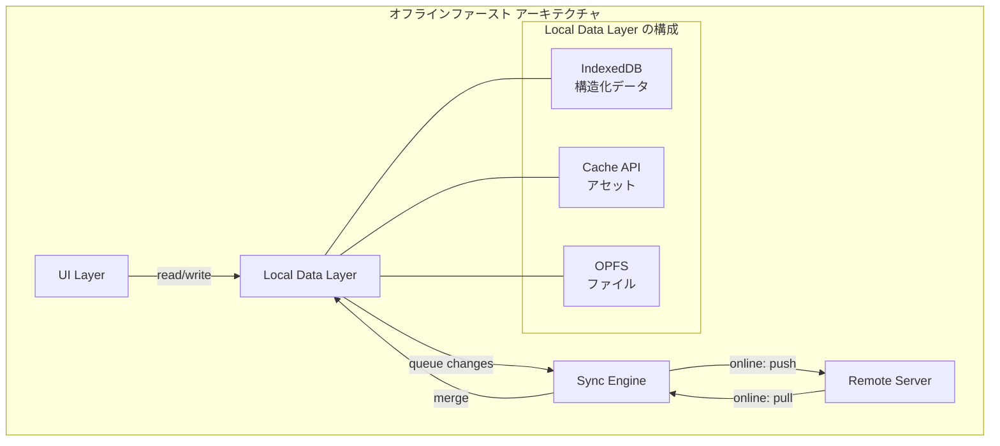

### まとめ

ブラウザストレージは、Cookie の限定的なデータ保存から始まり、Web Storage の手軽なキーバリューストア、IndexedDB の本格的なクライアントサイドデータベース、Cache API のネットワークキャッシュ、そして OPFS のファイルベースの高性能ストレージへと進化を続けてきた。

適切なストレージ API の選択は、アプリケーションの要件に応じて行うべきである。

- **ユーザー設定の保存**: localStorage（シンプルで手軽）
- **一時的なセッションデータ**: sessionStorage（タブのライフサイクルに紐づく）
- **構造化データの管理**: IndexedDB（検索、インデックス、トランザクション）
- **リソースのキャッシュ**: Cache API（Service Worker と連携したオフライン対応）
- **高性能ファイルアクセス**: OPFS（SQLite バックエンドなど）

Web アプリケーションがデスクトップアプリケーションと同等の体験を提供するためには、これらのストレージ API を理解し、適材適所で使い分けることが不可欠である。
