# バッファプール — ディスクとメモリの間を取り持つデータベースの心臓部

## 1. 背景と動機 — なぜバッファプールが必要なのか

### 1.1 ディスクとメモリの速度差という根本問題

データベース管理システム（DBMS）は、永続的なデータストアとしてディスク（HDD や SSD）を使用する。しかし、CPU がデータを処理するにはメモリ上にデータが存在しなければならない。問題は、ディスクとメモリの間に桁違いの速度差があることだ。

| 記憶階層 | アクセスレイテンシ | 帯域幅（目安） |
|---|---|---|
| L1 キャッシュ | ~1 ns | ~1 TB/s |
| L2 キャッシュ | ~4 ns | ~500 GB/s |
| メインメモリ（DRAM） | ~100 ns | ~50 GB/s |
| SSD（NVMe） | ~10-100 μs | ~3-7 GB/s |
| HDD | ~5-10 ms | ~100-200 MB/s |

メインメモリとSSDの間には約100倍から1000倍のレイテンシ差があり、HDDに至ってはメモリの10万倍以上遅い。もし DBMS がクエリを処理するたびにディスクから直接データを読み込んでいたら、性能は壊滅的なものになる。

### 1.2 OSのページキャッシュではなぜ不十分なのか

Linux や Windows などの OS はすでにページキャッシュ（バッファキャッシュ）という仕組みを持っており、ディスク上のデータを自動的にメモリにキャッシュする。では、DBMS は OS のページキャッシュに任せればよいのではないだろうか。

実際に一部のシステム（たとえば初期の PostgreSQL や mmap を使う一部のストレージエンジン）はこのアプローチを採用していたが、多くの DBMS はあえて独自のバッファプールを実装している。その理由は以下のとおりである。

1. **エビクション制御の不足**: OS のページキャッシュは LRU やその変種に基づく汎用的なポリシーで管理されるが、DBMS はクエリ実行計画の情報を持っているため、どのページが今後必要になるか、どのページが不要になるかをはるかに正確に判断できる。たとえば全表スキャンで一度だけ読まれたページがキャッシュを汚染するのを防ぐような制御は、OS レベルでは困難である。

2. **ダーティページのフラッシュ制御**: OS はメモリ不足時にダーティページ（変更があったがディスクに書き戻されていないページ）を任意のタイミングでフラッシュするが、DBMS にとっては WAL プロトコルとの整合性が不可欠である。WAL のログレコードが先にディスクに書き出される前にデータページがフラッシュされると、クラッシュリカバリが正しく動作しない。

3. **プリフェッチの最適化**: DBMS はクエリ実行計画を解析することで、次にどのページが必要になるかを事前に予測し、非同期にディスクから読み込むことができる。OS のリードアヘッド機構はファイルのシーケンシャルアクセスパターンしか検出できない。

4. **ダブルバッファリング問題**: DBMS 独自のバッファプールと OS のページキャッシュの両方にデータが存在すると、同じデータが二重にメモリを消費する。これを避けるために多くの DBMS は `O_DIRECT` フラグを用いて OS のページキャッシュをバイパスする。

5. **ページレイアウトとアライメント**: DBMS はページ内のレコード配置やインデックス構造を独自に管理しており、OS が持つ4KBページの概念とは異なるサイズ（8KB、16KBなど）を使用する場合がある。

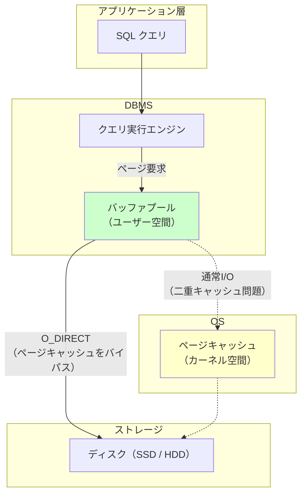

### 1.3 バッファプールの基本的な役割

バッファプールは DBMS のストレージエンジン内に実装される、メモリ上の大きな領域である。その役割を一言で表現するなら、**ディスク上のページのメモリ上のキャッシュ** である。具体的には以下の責務を担う。

- ディスクからページを読み込み、メモリ上に保持する
- 同じページへの複数回のアクセスをメモリ上で高速に処理する
- 更新されたページ（ダーティページ）を適切なタイミングでディスクに書き戻す
- メモリが不足した場合に、どのページを追い出す（エビクト）するかを決定する
- WAL プロトコルとの連携により、クラッシュリカバリの正しさを保証する

## 2. ページ（ブロック）の概念

### 2.1 ページとは何か

DBMS はデータをディスク上で **ページ**（一部のシステムではブロックとも呼ぶ）という固定サイズの単位で管理する。ページは DBMS がディスクとの間でデータを読み書きする最小単位であり、バッファプールの管理単位でもある。

| DBMS | デフォルトのページサイズ |
|---|---|
| MySQL InnoDB | 16 KB |
| PostgreSQL | 8 KB |
| Oracle | 8 KB |
| SQL Server | 8 KB |
| SQLite | 4 KB |

ページサイズの選択にはトレードオフがある。大きなページは1回の I/O で多くのデータを読み込めるため、シーケンシャルスキャンに有利だが、小さなランダムアクセスでは不要なデータまで読み込むことになる。逆に小さなページはランダムアクセスの効率は良いが、メタデータのオーバーヘッドが相対的に大きくなる。

### 2.2 ページの構造

典型的なデータベースページは以下のような構造を持つ。

```
+-------------------------------------------+
|             ページヘッダ                    |
|  - ページID                                |
|  - チェックサム                             |
|  - LSN（Log Sequence Number）              |
|  - フリースペースポインタ                    |
|  - レコード数                               |
+-------------------------------------------+
|         スロット配列（Slot Array）           |
|  [offset1] [offset2] [offset3] ...         |
|          ↓ (下に向かって成長)               |
+-------------------------------------------+
|                                           |
|            フリースペース                   |
|                                           |
+-------------------------------------------+
|          ↑ (上に向かって成長)               |
|         レコードデータ領域                   |
|  [Record3] [Record2] [Record1]            |
+-------------------------------------------+
```

この構造は **スロット付きページ（slotted page）** と呼ばれ、多くの DBMS で採用されている。スロット配列がページの先頭側から下方向に伸び、レコードデータがページの末尾側から上方向に伸びるというレイアウトになっている。この設計により、レコードの可変長データへの対応と、レコードの物理的な再配置（コンパクション）が容易になる。

### 2.3 ページの識別

ディスク上のすべてのページは一意に識別される必要がある。一般的に **page_id** はファイル番号とファイル内のオフセットの組み合わせとして表現される。

```
page_id = (file_id, page_offset)
```

MySQL InnoDB の場合は、テーブルスペースID（space_id）とページ番号（page_no）の組み合わせで識別する。PostgreSQL では、リレーションの OID とブロック番号の組み合わせである。

## 3. バッファプールの構造

### 3.1 全体アーキテクチャ

バッファプールは主に以下の3つのコンポーネントから構成される。

1. **フレーム配列（Frame Array）**: メモリ上に確保された、ページサイズの固定長バッファの配列。各フレームはディスクから読み込まれた1つのページのデータを格納する。
2. **ページテーブル（Page Table）**: page_id からフレーム番号へのマッピングを管理するハッシュテーブル。あるページがバッファプール内に存在するかどうかを高速に判定する。
3. **ディスクリプタ配列（Descriptor Array）**: 各フレームに対応するメタデータを保持する配列。ピンカウント、ダーティフラグ、ページIDなどの管理情報を格納する。

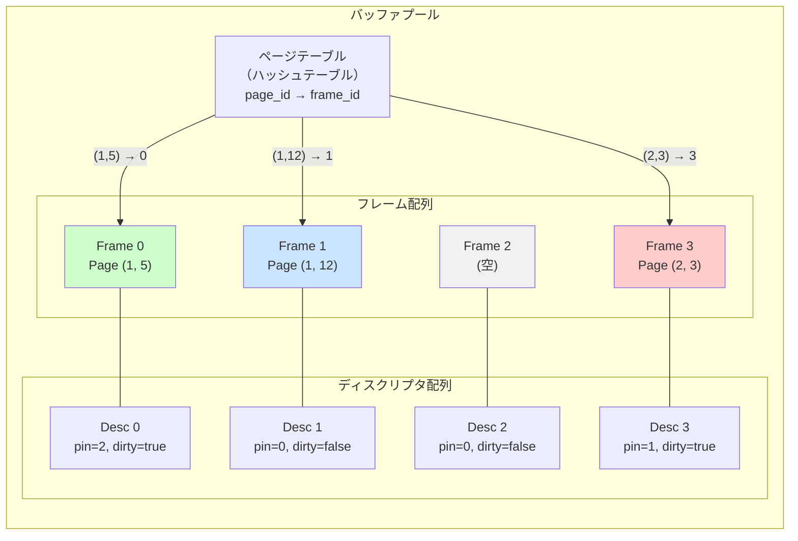

### 3.2 ページテーブルの詳細

ページテーブルは、DBMS のページテーブルと OS の仮想メモリページテーブルを混同しないように注意が必要である。DBMS のページテーブルは純粋にユーザー空間のデータ構造であり、page_id をキーとしてバッファプール内のフレーム番号を返すハッシュテーブルに過ぎない。

一般的にはチェイン法（chaining）による衝突解決が使われ、バケット数はフレーム数に対して適切に設定される。ページテーブルへのアクセスは高頻度で発生するため、このルックアップの効率がバッファプール全体の性能に大きく影響する。

### 3.3 フレームのライフサイクル

あるページへのアクセスが要求された場合のフレームのライフサイクルは以下のように進む。

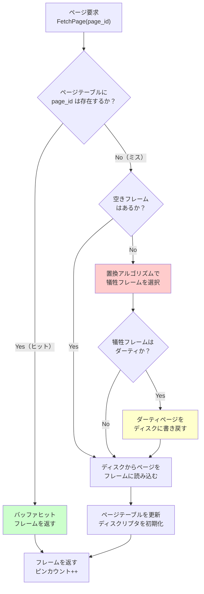

### 3.4 ピンカウントとアンピン

**ピンカウント（pin count）** は、現在そのフレームを使用しているスレッドの数を表す参照カウンタである。ピンカウントが0より大きいフレームは「ピンされている」状態であり、エビクション（追い出し）の対象にならない。

```
FetchPage(page_id):
    frame = page_table.lookup(page_id)
    if frame != null:
        frame.pin_count++
        return frame
    else:
        // Buffer miss: load from disk
        victim = replacement_policy.select_victim()
        if victim.is_dirty:
            disk.write(victim.page_id, victim.data)
        disk.read(page_id, victim.data)
        page_table.remove(victim.page_id)
        page_table.insert(page_id, victim.frame_id)
        victim.page_id = page_id
        victim.pin_count = 1
        victim.is_dirty = false
        return victim

UnpinPage(page_id, is_dirty):
    frame = page_table.lookup(page_id)
    frame.pin_count--
    if is_dirty:
        frame.is_dirty = true
```

使用が終了したら `UnpinPage` を呼び出してピンカウントをデクリメントする。ピンカウントが0に戻ったフレームは、将来エビクションの候補になり得る。`UnpinPage` の際に `is_dirty` フラグを渡すことで、そのページが変更されたかどうかを通知する。

## 4. ページ置換アルゴリズム

バッファプールが満杯になったとき、新しいページを読み込むためにどのフレームを追い出すかを決定する必要がある。この判断を行うのがページ置換アルゴリズムである。理想的には「今後最も長い間参照されないページ」を追い出すべきだが（Beladyの最適アルゴリズム）、これは未来の参照パターンを知らなければ実現できない。そのため、過去の参照パターンから将来を推定するさまざまなヒューリスティクスが考案されてきた。

### 4.1 LRU（Least Recently Used）

最も広く知られた置換アルゴリズムであり、「最も長い間参照されていないページを追い出す」という方針に基づく。最近アクセスされたデータは近い将来もアクセスされやすいという **時間的局所性（temporal locality）** の仮定に立っている。

実装方法としては、アクセスされるたびにページを二重連結リストの先頭に移動させ、追い出し時にはリストの末尾のページを選択する。

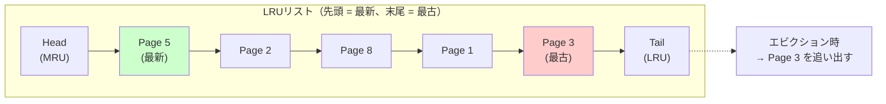

**LRU の問題点**:

- **シーケンシャルフラッディング（Sequential Flooding）**: 全表スキャンのように大量のページをシーケンシャルに1回だけ読む操作を行うと、本当に頻繁にアクセスされる「ホット」なページがすべてキャッシュから追い出されてしまう。これは DBMS においては非常に深刻な問題である。
- **リストの更新コスト**: 高頻度なアクセスがあるとリストの更新が頻繁に発生し、ロック競合によるスケーラビリティの低下を招く。

### 4.2 Clock（Second Chance）

LRU のリスト管理オーバーヘッドを軽減した近似アルゴリズムである。フレームを円環状（クロック）に配置し、各フレームに **参照ビット（reference bit）** を持たせる。

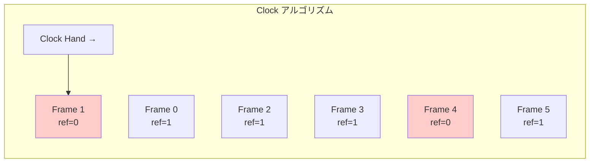

動作は以下のとおりである。

1. ページがアクセスされると、そのフレームの参照ビットを1に設定する
2. エビクションが必要になると、Clock Hand の位置から順にフレームを調べる
3. 参照ビットが1のフレームは「最近使われた」と見なし、ビットを0にリセットして次のフレームに進む（セカンドチャンスを与える）
4. 参照ビットが0のフレームを見つけたら、それを犠牲フレームとして選択する

Clock は LRU と比較して以下の利点がある。

- ページアクセス時にリストの再配置が不要で、ビットを立てるだけでよい
- エビクション時のみ Clock Hand を動かすので、通常のアクセスパスのオーバーヘッドが小さい

ただし、LRU と同様にシーケンシャルフラッディングの問題は解消されない。

### 4.3 LRU-K

LRU の改良版であり、ページの **直近 K 回のアクセス時刻** を記録して、K 回前のアクセスからの経過時間に基づいて追い出しを決定する。最も一般的なのは K=2 の **LRU-2** である。

LRU（K=1）が直近1回のアクセスだけを見るのに対し、LRU-2 は直近2回のアクセス間隔を考慮する。これにより、1回しかアクセスされていないページ（たとえばシーケンシャルスキャンで読まれたページ）と、繰り返しアクセスされるホットなページを区別できる。

```
エビクション優先度の決定:
  - K回以上アクセスされたページ: K回前のアクセス時刻が最も古いものを優先的にエビクト
  - K回未満のアクセスしかないページ: 最初のアクセス時刻が最も古いものを優先的にエビクト
  - K回未満のページは K回以上のページよりも常に先にエビクトされる
```

LRU-K の利点は、シーケンシャルスキャンの耐性が LRU より格段に高いことである。1回しか読まれないページは K 回の履歴が貯まらないため、優先的に追い出される。欠点としては、各ページのアクセス履歴を保持する必要があるため、メモリと管理のオーバーヘッドが LRU より大きい。

### 4.4 2Q（Two-Queue）

LRU-K のアイデアをよりシンプルに実装したアルゴリズムである。名前のとおり2つのキューを使用する。

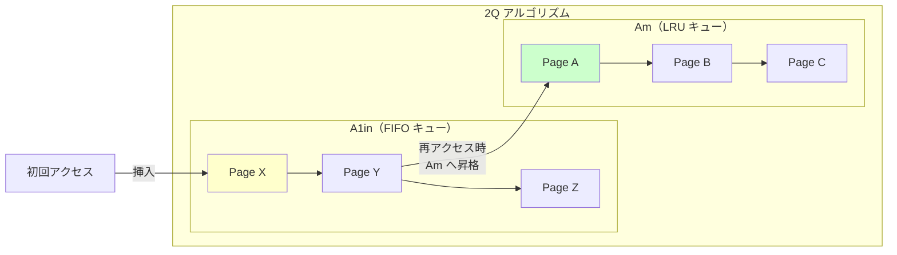

1. **A1in（FIFO キュー）**: ページが初めてバッファプールに読み込まれたとき、このキューに入る。FIFO 方式で管理され、一定期間アクセスがないとこのキューから追い出される。
2. **Am（LRU キュー）**: A1in にいる間に再度アクセスされたページは、Am キューに昇格する。Am は通常の LRU で管理される。

この設計により、1回しか読まれないページは A1in から素早く追い出され、繰り返しアクセスされるホットなページは Am に長く留まる。PostgreSQL のバッファプール置換アルゴリズムは 2Q をベースにした方式を採用している。

### 4.5 ARC（Adaptive Replacement Cache）

IBM が2003年に発表した、LRU と LFU（Least Frequently Used）を適応的に組み合わせるアルゴリズムである。4つのリストを管理する。

- **T1**: 最近1回だけアクセスされたページのリスト（recency）
- **T2**: 最近2回以上アクセスされたページのリスト（frequency）
- **B1**: T1 から追い出されたページの「ゴースト」エントリ（ページ ID のみ保持）
- **B2**: T2 から追い出されたページの「ゴースト」エントリ

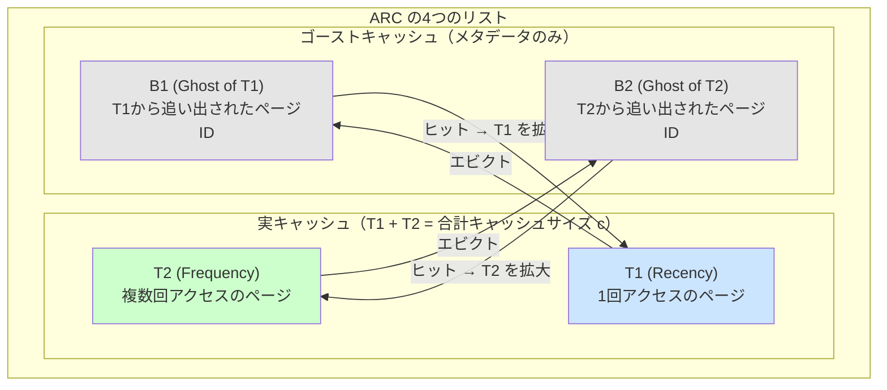

ARC の核心は、ゴーストリスト B1 と B2 へのヒット率に応じて T1 と T2 のサイズ比率を動的に調整する点にある。

- B1 にヒットが多い → 最近アクセスされたページがすぐ必要になる傾向がある → T1 を拡大
- B2 にヒットが多い → 頻繁にアクセスされるページが重要 → T2 を拡大

これにより、ワークロードの変化に自動的に適応できる。ただし、ARC は IBM が特許を保有していたため（2023年に期限切れ）、長らく多くの OSS での採用が見送られていた。ZFS のキャッシュ管理で採用されていることで知られる。

### 4.6 各アルゴリズムの比較

| アルゴリズム | シーケンシャルスキャン耐性 | 適応性 | 実装の複雑さ | 代表的な採用例 |
|---|---|---|---|---|
| LRU | 低い | なし | 低い | 教科書的実装 |
| Clock | 低い | なし | 低い | MySQL InnoDB (改良版) |
| LRU-K | 高い | 部分的 | 中程度 | SQL Server (LRU-2) |
| 2Q | 高い | 部分的 | 中程度 | PostgreSQL |
| ARC | 高い | 高い | 高い | ZFS |

## 5. ダーティページとフラッシュ戦略

### 5.1 ダーティページとは

トランザクションがバッファプール内のページを更新すると、そのページはメモリ上の内容とディスク上の内容が不一致になる。このような状態のページを **ダーティページ（dirty page）** と呼ぶ。ダーティページは最終的にディスクに書き戻す（フラッシュする）必要がある。

ダーティページの管理において最も重要な原則は、WAL プロトコルの **Write-Ahead Rule** である。

> ダーティページをディスクに書き戻す前に、そのページの変更に対応するすべての WAL ログレコードが先にディスクに永続化されていなければならない。

この原則を守ることで、クラッシュ後の REDO（やり直し）リカバリが正しく動作する。

### 5.2 フラッシュポリシー

ダーティページをいつディスクに書き戻すかについて、大きく2つのポリシーがある。

**Force ポリシー**: トランザクションのコミット時に、そのトランザクションが変更したすべてのダーティページをディスクに強制的に書き出す。コミットのたびにランダム I/O が大量に発生するため、性能が著しく低下する。リカバリは単純になるが、実用的ではない。

**No-Force ポリシー**: コミット時にダーティページのフラッシュを行わない。WAL のコミットレコードだけをディスクに書き出せばよい。データページの書き戻しはバックグラウンドで非同期に行う。ほとんどの DBMS がこの方式を採用している。

No-Force ポリシーを採用する場合、ダーティページの書き戻しは以下のタイミングで行われる。

### 5.3 バックグラウンドフラッシュ

多くの DBMS は **バックグラウンドライタ（background writer）** と呼ばれるスレッドを持ち、定期的にダーティページをディスクに書き戻す。


バックグラウンドフラッシュの目的は以下の3つである。

1. **エビクションの高速化**: 追い出し対象のフレームがクリーンであれば、ディスクへの書き出しなしに即座に再利用できる。
2. **リカバリ時間の短縮**: ダーティページが多いほど、クラッシュ後の REDO リカバリに時間がかかる。定期的なフラッシュにより REDO の範囲を限定できる。
3. **I/O の平準化**: コミット時に集中的な書き出しを避け、I/O 負荷を時間方向に分散させる。

### 5.4 チェックポイント

**チェックポイント（checkpoint）** は、ある時点でのバッファプール内の全ダーティページをディスクに書き出し、リカバリの起点を作る操作である。チェックポイントにより、それ以前の WAL ログレコードは REDO に不要になるため、古い WAL セグメントを再利用・削除できる。

チェックポイントには主に2つの方式がある。

**シャープチェックポイント（Sharp Checkpoint）**: すべてのダーティページを一気にフラッシュする。チェックポイント中はシステムの I/O 帯域を大量に消費し、通常のクエリ処理に影響を与える。シンプルだが、大規模なバッファプールでは実用的でない。

**ファジーチェックポイント（Fuzzy Checkpoint）**: ダーティページのフラッシュを段階的に行う。チェックポイントの開始時にダーティページのリストを記録し、バックグラウンドで少しずつフラッシュしていく。MySQL InnoDB はこの方式を採用しており、`innodb_io_capacity` パラメータでフラッシュの速度を制御できる。

## 6. プリフェッチ（先読み）

### 6.1 プリフェッチの基本概念

**プリフェッチ（prefetch）** とは、クエリ実行エンジンが実際にページを必要とする前に、バッファプールに先読みしておく手法である。ディスク I/O はレイテンシが大きいため、実際にページが必要になってから読み込みを開始すると CPU がアイドル状態で待つことになる。プリフェッチによりディスク I/O と CPU 処理をオーバーラップさせることで、全体のスループットを向上させる。

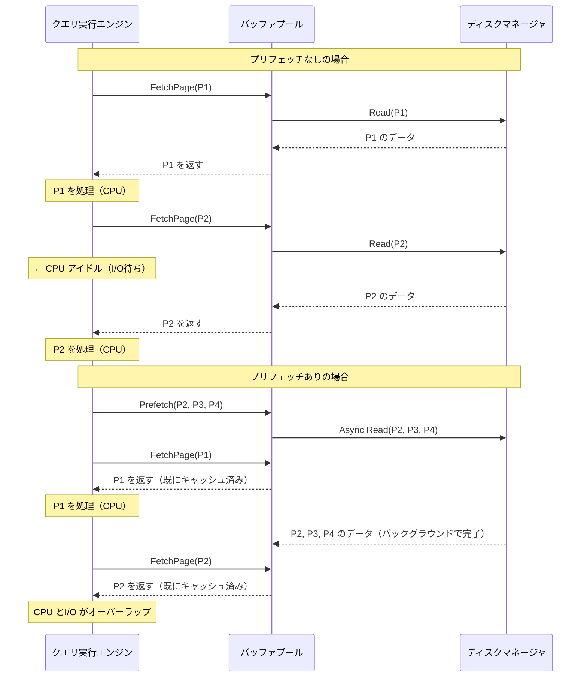

### 6.2 プリフェッチの種類

**シーケンシャルプリフェッチ**: テーブルの全表スキャンやインデックスの範囲スキャンのように、連続したページをアクセスするパターンを検出して、次に読む可能性の高い隣接ページを先読みする。MySQL InnoDB では `innodb_read_ahead_threshold` パラメータで、シーケンシャルアクセスを検出する閾値を設定できる。

**ランダムプリフェッチ**: インデックスのリーフページなど、論理的には連続しているが物理的にはランダムに配置されているページの先読み。エクステント（連続するページのグループ）内のアクセスパターンを監視し、一定の割合以上のページがアクセスされたら残りのページも先読みする。

**クエリ駆動プリフェッチ**: クエリ実行計画の情報を利用して、必要なページを事前に特定して読み込む。たとえば、ネストループ結合の内側テーブルのインデックスルックアップで必要となるページを、外側テーブルの処理中に先読みしておく。

## 7. ダブルバッファリング

### 7.1 問題の本質

前述のとおり、DBMS がバッファプールを独自に管理しつつ OS の通常のファイル I/O を使用すると、同じデータがバッファプール（ユーザー空間）と OS のページキャッシュ（カーネル空間）の両方に存在する **ダブルバッファリング（double buffering）** が発生する。

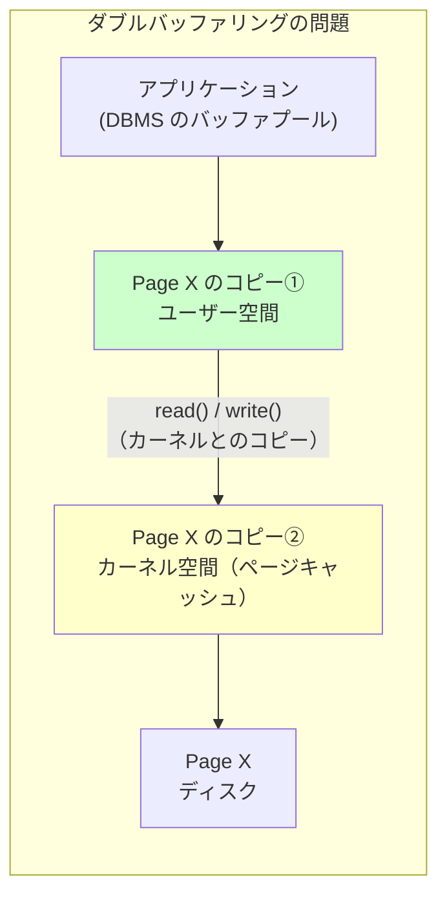

これにより以下の問題が生じる。

- **メモリの無駄**: 同じページが2箇所に存在するため、利用可能なメモリが実質的に半減する
- **余分なメモリコピー**: ユーザー空間とカーネル空間の間でデータのコピーが発生する
- **エビクションの不整合**: DBMS がバッファプールからページを追い出しても、OS のページキャッシュに残っていれば本当にメモリが解放されたわけではない

### 7.2 O_DIRECT による解決

ほとんどの DBMS は `O_DIRECT` フラグ（Linux の場合）を使ってファイルを開くことで、OS のページキャッシュをバイパスする。これにより、ディスク I/O はバッファプールのメモリとディスクの間で直接行われる。

```c
// O_DIRECT to bypass OS page cache
int fd = open("/data/tablespace", O_RDWR | O_DIRECT);
```

`O_DIRECT` を使用する場合の注意点として、I/O バッファのメモリアライメントが必要である。一般的にはセクターサイズ（512バイトまたは4096バイト）の境界にアラインされたメモリから I/O を行う必要がある。

ただし、すべての DBMS が `O_DIRECT` を使用するわけではない。PostgreSQL は従来 `O_DIRECT` を使わず OS のページキャッシュと共存する設計を取ってきた（PostgreSQL 16 以降では `io_method = io_uring` との組み合わせで `O_DIRECT` サポートが追加されている）。

## 8. バッファプールの並行制御（ラッチ）

### 8.1 ラッチとロックの違い

DBMS では「ロック」と「ラッチ」を明確に区別する。

| 特性 | ロック（Lock） | ラッチ（Latch） |
|---|---|---|
| 対象 | 論理的なデータ（行、テーブル） | 物理的なデータ構造（ページ、ハッシュテーブル） |
| 保持期間 | トランザクション全体 | 操作中の短い期間 |
| デッドロック検出 | あり | なし（プログラマが防止する） |
| 待機方式 | キュー待ち | スピンまたは短い待ち |
| ロールバック | 可能 | 不要 |

バッファプールでは、ページテーブルやフレームのメタデータを保護するためにラッチが使用される。

### 8.2 ページテーブルのラッチ

ページテーブル（ハッシュテーブル）への同時アクセスを保護する方式には、主に以下のものがある。

**グローバルラッチ**: ページテーブル全体を1つのラッチで保護する。実装は最もシンプルだが、すべてのページアクセスが直列化されるため、マルチコア環境でのスケーラビリティが低い。

**バケット単位ラッチ**: ハッシュテーブルのバケットごとにラッチを持つ。異なるバケットへのアクセスは並行して処理できるため、スケーラビリティが向上する。多くの DBMS がこの方式を採用している。

**ロックフリーハッシュテーブル**: CAS（Compare-and-Swap）命令などのアトミック操作を活用してラッチなしでハッシュテーブルを操作する。最高のスケーラビリティを実現できるが、実装が非常に複雑になる。

### 8.3 ページラッチ

個々のページの内容を保護するために、各フレームには **読み取り/書き込みラッチ（RW latch）** が設けられる。

- **共有ラッチ（Shared latch）**: 複数のスレッドがページを同時に読み取ることを許可する
- **排他ラッチ（Exclusive latch）**: ページを変更する際に取得し、他のすべてのアクセスをブロックする

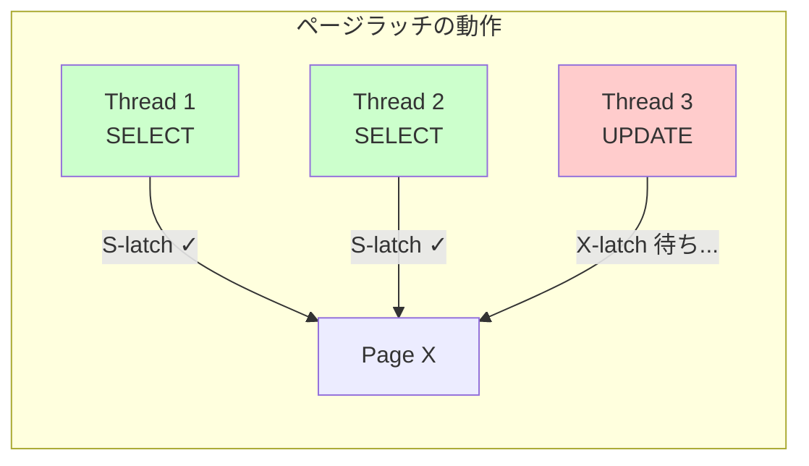

### 8.4 バッファプールのパーティショニング

マルチコア環境でバッファプールのスケーラビリティを向上させるために、多くの DBMS はバッファプールを複数のパーティション（インスタンス）に分割する。各パーティションは独立したページテーブルとフリーリストを持ち、独立したラッチで保護される。

page_id に基づくハッシュで対象のパーティションを決定するため、異なるパーティションへのアクセスは完全に並行して処理できる。

MySQL InnoDB では `innodb_buffer_pool_instances` パラメータでパーティション数を設定でき、デフォルトではバッファプールサイズが 1GB 以上の場合に8インスタンスに分割される。

## 9. 各 DBMS の実装

### 9.1 MySQL InnoDB

InnoDB のバッファプールは DBMS バッファプール実装の代表例であり、以下の特徴を持つ。

**バッファプールのサイズ設定**: `innodb_buffer_pool_size` パラメータで設定する。一般的には使用可能なメモリの50%〜80%をバッファプールに割り当てることが推奨される。

**LRU リストの改良（Midpoint Insertion）**: InnoDB は純粋な LRU ではなく、リストを「Young」領域と「Old」領域に分割する。新しく読み込まれたページはリストの中間点（デフォルトではリストの5/8の位置）に挿入される。

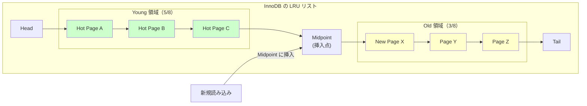

新しいページはまず Old 領域に入り、一定時間（`innodb_old_blocks_time`、デフォルト1000ms）以内に再アクセスされなければ Old 領域内で LRU によって追い出される。再アクセスされた場合のみ Young 領域に昇格する。この設計は 2Q アルゴリズムの変種と言える。

**Adaptive Flushing**: InnoDB は WAL のチェックポイント年齢（最古のダーティページの LSN と最新の LSN の差分）を監視し、この値が `innodb_max_dirty_pages_pct_lwm` を超えると積極的にフラッシュを開始する。フラッシュ速度は `innodb_io_capacity` と `innodb_io_capacity_max` によって制御される。

**Change Buffer**: セカンダリインデックスの更新に特化した最適化である。対象ページがバッファプールに存在しない場合、変更内容を Change Buffer に一時的に蓄積し、後でそのページが読み込まれたときにまとめて適用（マージ）する。これにより、セカンダリインデックスの更新のためだけにディスクからページを読み込むランダム I/O を削減する。

**ダブルライトバッファ（Doublewrite Buffer）**: ページのフラッシュ時に、まず連続した領域（ダブルライトバッファ）にページを書き出し、その後実際のデータファイルの位置に書き込む。これにより、書き込み途中でクラッシュした場合の **partial write（ページの一部だけが書き換わった状態）** を検出・修復できる。


### 9.2 PostgreSQL

PostgreSQL のバッファプール管理は InnoDB とは異なるアプローチを取っている。

**共有バッファ**: PostgreSQL では `shared_buffers` パラメータでバッファプールのサイズを設定する。デフォルト値は128MBと控えめで、一般的にはシステムメモリの25%程度が推奨される（InnoDB の50〜80%より低い）。これは PostgreSQL が従来 OS のページキャッシュとの共存を前提とした設計だったためである。

**Clock-Sweep アルゴリズム**: PostgreSQL は Clock アルゴリズムの変種である Clock-Sweep を採用している。各バッファに対して参照カウント（usage_count）を持ち、アクセスされるたびにカウントをインクリメント（最大値は5）する。Sweep 時にはカウントをデクリメントし、0になったバッファを犠牲として選択する。

```
// PostgreSQL Clock-Sweep pseudocode
victim = clock_hand
while true:
    if victim.pin_count == 0:
        if victim.usage_count == 0:
            return victim  // this buffer is the victim
        else:
            victim.usage_count--  // decrement and move on
    clock_hand = (clock_hand + 1) % num_buffers
    victim = clock_hand
```

usage_count の最大値を5に制限することで、極端にホットなページがいつまでもエビクトされないという問題を緩和しつつ、アクセス頻度の高いページを優遇する。

**リングバッファ（Ring Buffer）**: PostgreSQL は大きなシーケンシャルスキャン（全表スキャン、VACUUM、bulk INSERT など）に対して、バッファプール全体を汚染しないように専用のリングバッファを割り当てる。リングバッファはバッファプール内の小さな部分集合（通常256KB程度）であり、この領域内でのみページのサイクルが行われる。

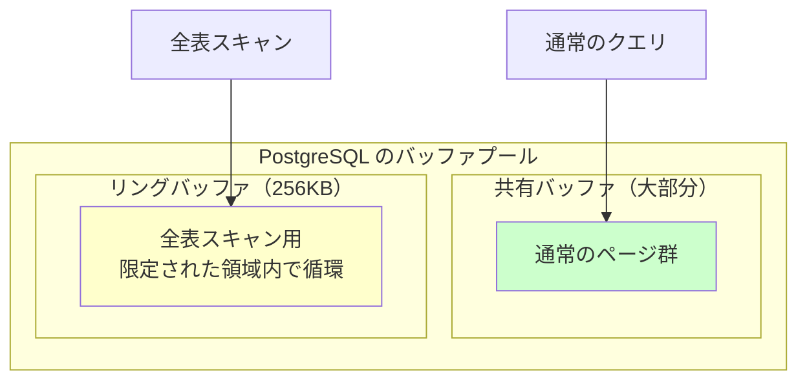

**バックグラウンドライタと checkpointer**: PostgreSQL には `bgwriter`（バックグラウンドライタ）と `checkpointer` の2つのバックグラウンドプロセスがある。`bgwriter` は Clock-Sweep の先回りでダーティバッファをフラッシュし、クリーンなバッファの供給を確保する。`checkpointer` は定期的にチェックポイントを実行し、すべてのダーティバッファをフラッシュして WAL の切り詰めを可能にする。

## 10. バッファプールの監視とチューニング

### 10.1 重要な監視指標

バッファプールの性能を評価するために、以下の指標を継続的に監視することが重要である。

**バッファプールヒット率（Buffer Pool Hit Ratio）**: バッファプール内でページが見つかった割合。通常、OLTP ワークロードでは99%以上が望ましい。

$$
\text{Hit Ratio} = \frac{\text{Buffer Pool Hits}}{\text{Buffer Pool Hits} + \text{Disk Reads}} \times 100
$$

ヒット率が低い場合は、バッファプールのサイズが不足しているか、ワークロードがバッファプールに収まらないほど大きなデータセットにアクセスしている可能性がある。

**ダーティページの割合**: バッファプール内のダーティページが占める割合。高すぎるとチェックポイント時に大量の I/O が発生し、低すぎるとフラッシュが頻繁に起こりすぎている可能性がある。

**エビクション率**: 単位時間あたりにエビクトされるページの数。高いエビクション率は、バッファプールのサイズ不足やシーケンシャルスキャンによるキャッシュ汚染を示唆する。

**ウェイト統計**: バッファプールのラッチ待ちの頻度と時間。ラッチ競合が多い場合は、バッファプールのパーティション数を増やすことを検討する。

### 10.2 MySQL InnoDB の監視

MySQL InnoDB では `SHOW ENGINE INNODB STATUS` コマンドや `information_schema.INNODB_BUFFER_POOL_STATS` テーブルでバッファプールの状態を確認できる。

```sql
-- Buffer pool hit ratio
SHOW ENGINE INNODB STATUS\G
-- BUFFER POOL AND MEMORY section:
-- Buffer pool hit rate: 999 / 1000

-- Detailed buffer pool statistics
SELECT
    POOL_ID,
    POOL_SIZE,
    FREE_BUFFERS,
    DATABASE_PAGES,
    MODIFIED_DB_PAGES,
    HIT_RATE
FROM information_schema.INNODB_BUFFER_POOL_STATS;
```

主要なチューニングパラメータは以下のとおりである。

| パラメータ | 説明 | 推奨値 |
|---|---|---|
| `innodb_buffer_pool_size` | バッファプールの総サイズ | 使用可能メモリの50-80% |
| `innodb_buffer_pool_instances` | パーティション数 | バッファプール1GBあたり1インスタンス |
| `innodb_old_blocks_pct` | Old領域の割合 | 37（デフォルト） |
| `innodb_old_blocks_time` | Old→Young昇格の待機時間(ms) | 1000（デフォルト） |
| `innodb_io_capacity` | フラッシュのI/O帯域(IOPS) | ストレージの性能に応じて |
| `innodb_io_capacity_max` | フラッシュのI/O帯域上限 | io_capacityの2倍程度 |
| `innodb_read_ahead_threshold` | リードアヘッドのトリガー閾値 | 56（デフォルト） |

### 10.3 PostgreSQL の監視

PostgreSQL では `pg_stat_bgwriter` ビューと `pg_buffercache` 拡張モジュールで監視できる。

```sql
-- Buffer hit ratio
SELECT
    sum(blks_hit) AS hits,
    sum(blks_read) AS reads,
    round(
        sum(blks_hit)::numeric /
        nullif(sum(blks_hit) + sum(blks_read), 0) * 100,
        2
    ) AS hit_ratio
FROM pg_stat_database;

-- Buffer cache contents (requires pg_buffercache extension)
CREATE EXTENSION IF NOT EXISTS pg_buffercache;
SELECT
    c.relname,
    count(*) AS buffers,
    round(
        count(*) * 8192.0 / (1024 * 1024),
        2
    ) AS size_mb,
    round(
        avg(b.usagecount),
        2
    ) AS avg_usage
FROM pg_buffercache b
JOIN pg_class c ON b.relfilenode = pg_relation_filenode(c.oid)
    AND b.reldatabase IN (0, (SELECT oid FROM pg_database WHERE datname = current_database()))
GROUP BY c.relname
ORDER BY buffers DESC
LIMIT 20;
```

主要なチューニングパラメータは以下のとおりである。

| パラメータ | 説明 | 推奨値 |
|---|---|---|
| `shared_buffers` | バッファプールのサイズ | システムメモリの25%程度 |
| `effective_cache_size` | OS キャッシュを含む有効キャッシュ推定値 | システムメモリの50-75% |
| `bgwriter_lru_maxpages` | bgwriter が1回に書き出す最大ページ数 | 100-1000 |
| `bgwriter_lru_multiplier` | フリーバッファ需要に対する先行書き出し倍率 | 2.0 |
| `checkpoint_completion_target` | チェックポイント間隔中のフラッシュ目標比率 | 0.9 |

### 10.4 バッファプールウォームアップ

DBMS を再起動した直後はバッファプールが空のため、すべてのアクセスがディスクからの読み込みとなる。これを **コールドスタート問題** と呼ぶ。ヒット率が定常状態に達するまでに時間がかかり、その間応答時間が大きく劣化する。

MySQL InnoDB はこの問題に対処するために、**バッファプールのダンプとリストア** 機能を提供している。

```sql
-- Save buffer pool state before shutdown
SET GLOBAL innodb_buffer_pool_dump_at_shutdown = ON;
SET GLOBAL innodb_buffer_pool_load_at_startup = ON;
```

この設定を有効にすると、シャットダウン時にバッファプール内のページID一覧をファイルに保存し、起動時にそのリストに基づいてページを先読みする。実際のデータではなくページIDのみを保存するため、ダンプファイルは小さく、保存・リストアが高速に行える。

PostgreSQL には同等の組み込み機能はないが、`pg_prewarm` 拡張モジュールを使うことで、特定のリレーションをバッファプールにプリロードすることが可能である。PostgreSQL 15 以降では `pg_prewarm.autoprewarm` パラメータにより、共有バッファの内容を定期的に保存し再起動時に自動リストアする機能が利用できる。

## 11. 高度なトピック

### 11.1 バッファプールとNVMeの進化

NVMe SSD の登場により、ストレージのレイテンシは数マイクロ秒にまで短縮された。この性能向上は従来のバッファプール設計に新たな疑問を投げかけている。

- **ソフトウェアオーバーヘッドの相対的増大**: ストレージのレイテンシが小さくなると、バッファプールのページテーブルルックアップやラッチ取得のコストが相対的に大きくなる。
- **バッファプールは本当に必要か**: 超高速ストレージ上では、OS のページキャッシュや mmap に回帰する方が効率的ではないかという議論がある。実際、LeanStore などの研究プロトタイプでは、NVMe に最適化した新しいバッファ管理手法が模索されている。

しかし、現時点では DRAM とSSD の速度差は依然として100倍程度存在し、バッファプールの有用性は失われていない。むしろ、ラッチの軽量化やロックフリー設計によるバッファプールの高速化が実用上の重要な研究課題となっている。

### 11.2 バッファプールとDirect I/O（io_uring）

Linux の io_uring は、システムコールのオーバーヘッドを削減した非同期 I/O インターフェースである。共有リングバッファを介してカーネルとユーザー空間がやりとりするため、I/O リクエストの発行と完了の通知をシステムコールなしに行える。

PostgreSQL 16 以降では io_uring との統合が進められており、`O_DIRECT` + io_uring の組み合わせにより、OS のページキャッシュをバイパスしつつ低オーバーヘッドの非同期 I/O を実現する道が開かれている。これにより、PostgreSQL の従来の「OS のページキャッシュと共存する」設計からの転換が進みつつある。

### 11.3 バッファプールと永続メモリ

Intel Optane DC Persistent Memory（PMEM）のような永続メモリは、DRAM に近いレイテンシでバイトアドレッサブルなアクセスが可能な不揮発性メモリである。永続メモリが普及すると、バッファプールの設計は根本的に変わる可能性がある。

- ページのコピー（ディスク→メモリ）が不要になり、永続メモリ上のページを直接参照（ポインタスウィズル）できる
- WAL のフラッシュコストが大幅に低減される
- ただし、永続メモリの帯域は DRAM よりも制限されるため、アクセスパターンの最適化は依然として重要

Intel が Optane の生産を終了したため、永続メモリの将来は不透明だが、CXL（Compute Express Link）を通じた拡張メモリとして類似の技術が復活する可能性がある。

## 12. まとめ

バッファプールは、ディスクとメモリの速度差という根本的な問題を吸収し、DBMS の性能を支える最も重要なコンポーネントの一つである。本記事で解説した要点を整理する。

1. **存在理由**: ディスクとメモリの桁違いの速度差を隠蔽し、OS のページキャッシュでは実現できない DBMS 固有の最適化（WAL 連携、クエリ駆動のエビクションとプリフェッチ）を行うために、DBMS は独自のバッファプールを実装する。

2. **基本構造**: フレーム配列、ページテーブル（ハッシュテーブル）、ディスクリプタ配列の3つの要素で構成される。ピンカウントによりアクティブに使用中のページのエビクションを防ぐ。

3. **ページ置換**: LRU の改良が歴史的な主要テーマであり、シーケンシャルスキャンによるキャッシュ汚染への対策として LRU-K、2Q、ARC などが考案された。実際の DBMS では、InnoDB の Midpoint Insertion や PostgreSQL の Clock-Sweep など、ワークロード特性に合わせた独自の変種が使われる。

4. **ダーティページ管理**: No-Force ポリシーのもとで、バックグラウンドフラッシュとファジーチェックポイントにより I/O を平準化しつつ、WAL プロトコルとの整合性を保つ。

5. **並行制御**: マルチコア環境でのスケーラビリティのため、バッファプールのパーティショニング、バケット単位ラッチ、RW ラッチといった手法が組み合わせて使われる。

6. **運用と監視**: バッファプールヒット率は最も基本的かつ重要な指標である。DBMS ごとに提供される監視機能を活用し、ワークロードに応じたサイジングとパラメータチューニングを行う。

バッファプールの設計は、ストレージ技術の進化（NVMe、永続メモリ、CXL）や CPU アーキテクチャの変化に伴い今後も進化を続ける領域であるが、「ディスクアクセスを最小化する」という基本原理の重要性は、ストレージ階層が存在する限り変わらない。
