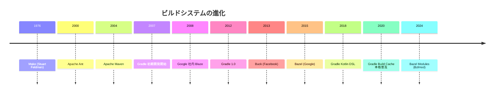
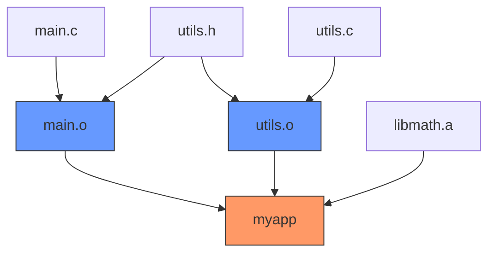
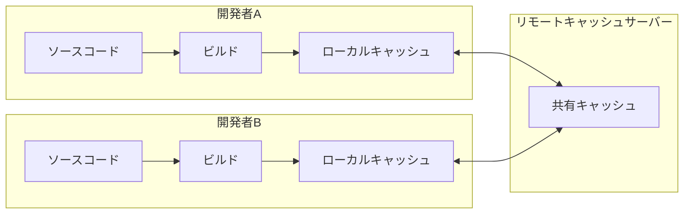
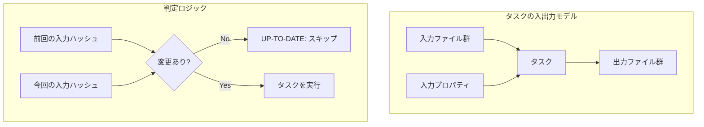
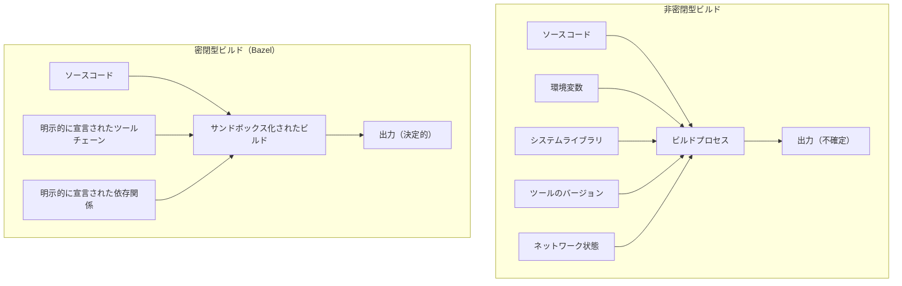
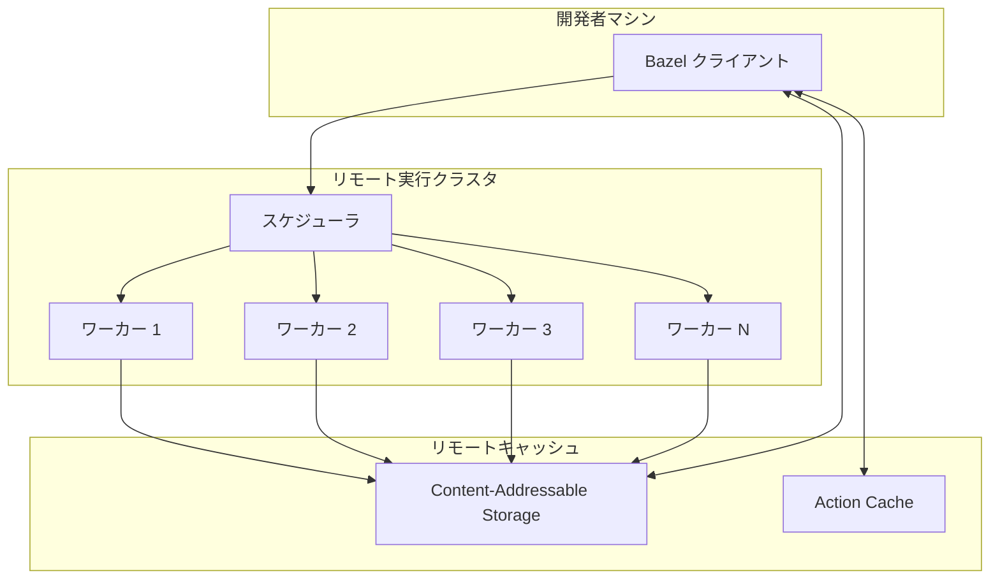
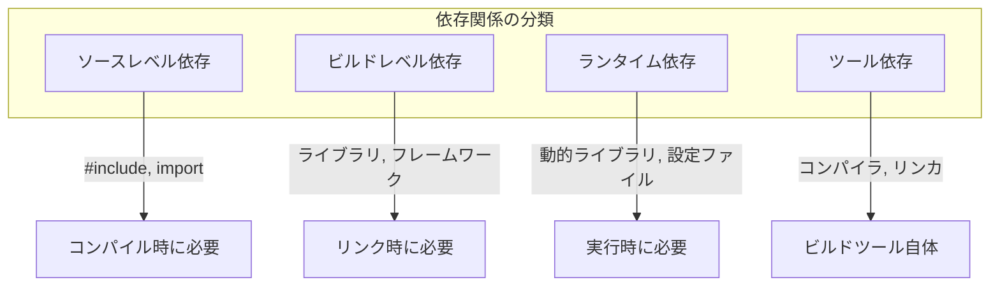
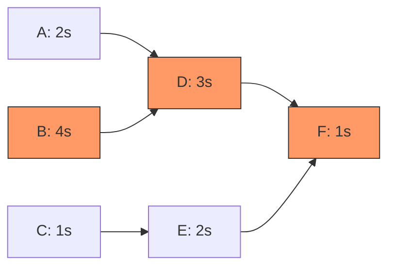
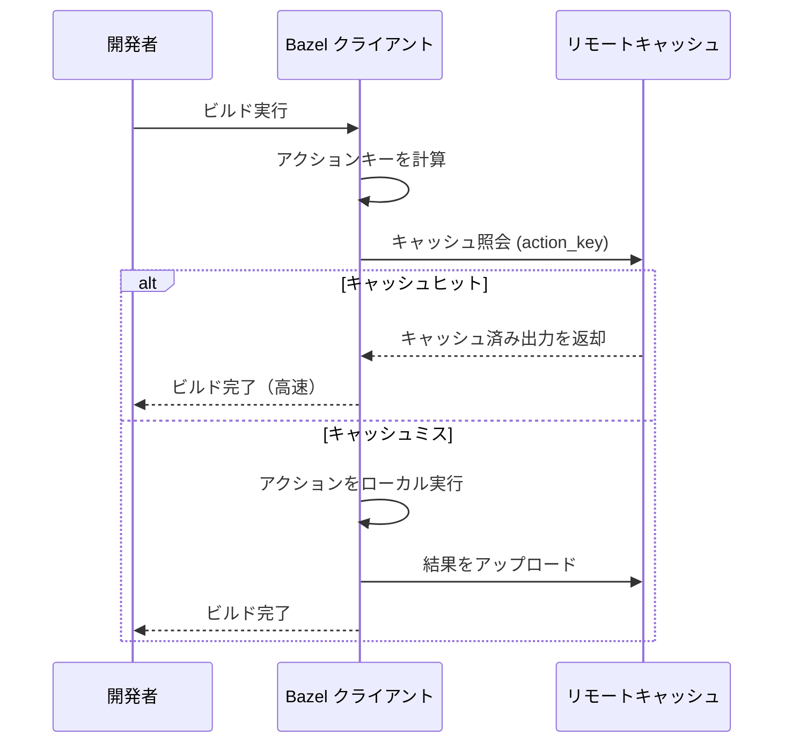
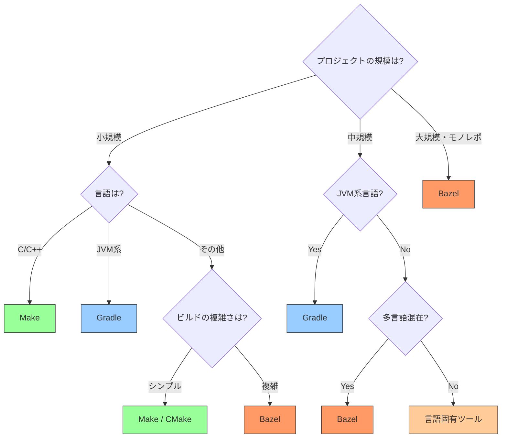

# ビルドシステムの設計（Make, Bazel, Gradle）

## 1. はじめに：なぜビルドシステムが必要なのか

ソフトウェア開発においてソースコードから実行可能なプログラムを生成するプロセスを**ビルド**と呼ぶ。小規模なプロジェクトであれば `gcc main.c -o main` のようなコマンド一つで済むが、現実の大規模プロジェクトでは事情が全く異なる。数千、数万のソースファイルが相互に依存し、コンパイル、リンク、テスト、パッケージングといった多段階の処理が必要になる。

ビルドシステムが解決する本質的な問題は以下の3つに集約される：

1. **再現性（Reproducibility）**：同じソースコードから、いつ、どこで、誰がビルドしても同じ成果物が得られること
2. **効率性（Efficiency）**：変更されたファイルだけを再ビルドし、不要な処理を省くこと
3. **自動化（Automation）**：手動操作を排除し、ビルド手順を宣言的に記述すること

この3つの要求は一見単純に見えるが、ソフトウェアの規模が大きくなるにつれて、ビルドシステムの設計は極めて複雑な問題へと発展する。ビルドシステムの歴史は、これらの要求にいかに応えるかという技術的挑戦の歴史でもある。

## 2. ビルドシステムの歴史的変遷

### 2.1 シェルスクリプトからの脱却

最も原始的なビルド手法は、コンパイルコマンドを列挙したシェルスクリプトである。しかし、この方法にはファイル間の依存関係を管理する仕組みがなく、ソースファイルを一つ変更しただけでもプロジェクト全体を再ビルドする必要があった。

### 2.2 Make（1976年）

Stuart Feldman が AT&T Bell Labs で開発した **Make** は、依存関係グラフとタイムスタンプに基づくインクリメンタルビルドという革新的な概念を導入した。Make は UNIX 文化と密接に結びつき、C/C++ プロジェクトのデファクトスタンダードとなった。

### 2.3 Java 時代のビルドツール

Java の登場により、ビルドシステムの要求は変化した。2000年に Apache **Ant** がリリースされ、XML ベースのビルド定義を導入した。しかし Ant は依存関係管理を持たず、ビルド手順が手続き的であった。2004年に登場した Apache **Maven** は「設定より規約（Convention over Configuration）」の哲学を掲げ、標準化されたプロジェクト構造とライブラリ依存管理を実現した。しかし Maven の硬直的な構成と XML の冗長性が問題視された。

### 2.4 Gradle（2012年 1.0リリース）

**Gradle** は Maven の依存管理の強みを継承しつつ、Groovy（後に Kotlin）ベースの DSL により柔軟性を獲得した。タスクグラフに基づくビルドモデル、インクリメンタルビルド、ビルドキャッシュなどの先進的な機能を備え、Android 公式ビルドシステムに採用されたことで広く普及した。

### 2.5 Bazel（2015年公開）

Google 社内で長年使われてきた内部ビルドシステム **Blaze** をオープンソース化したものが **Bazel** である。数十億行のコードベースを単一のモノレポで管理する Google の経験から生まれた Bazel は、密閉型ビルド（Hermetic Build）、コンテンツアドレッサブルキャッシュ、リモート実行など、再現性とスケーラビリティに特化した設計を持つ。



## 3. 共通の基盤概念

具体的なツールの詳細に入る前に、すべてのビルドシステムに共通する基盤概念を整理する。

### 3.1 依存関係グラフ（DAG）

ビルドシステムの核心は、**有向非巡回グラフ（DAG: Directed Acyclic Graph）** としてモデル化された依存関係の管理にある。各ノードはビルドターゲット（ソースファイル、オブジェクトファイル、ライブラリ、実行ファイルなど）を表し、エッジは依存関係を表す。



DAG であることの意味は重要である。循環依存が存在しないため、**トポロジカルソート**によりビルドの実行順序を一意に決定できる。さらに、互いに依存しないノード同士は**並列に実行**できる。

### 3.2 インクリメンタルビルド

すべてのソースファイルを毎回コンパイルし直すことは、プロジェクトの規模が大きくなると非現実的である。インクリメンタルビルドとは、前回のビルドからの変更点のみを再処理する仕組みである。変更を検知する方法には主に2つのアプローチがある：

| アプローチ | 方式 | 代表的なツール | 精度 |
|-----------|------|--------------|------|
| **タイムスタンプベース** | ファイルの更新日時を比較 | Make | やや不正確 |
| **コンテンツベース** | ファイル内容のハッシュを比較 | Bazel, Gradle | 正確 |

タイムスタンプベースの方式はシンプルだが、ファイルの内容が変わらなくても日時だけが更新された場合に不要なリビルドが発生する。逆に、ファイルを古いバージョンに戻した場合に変更を見逃す可能性もある。コンテンツベースの方式はこれらの問題を解消するが、ハッシュ計算のオーバーヘッドが加わる。

### 3.3 ビルドキャッシュ

ビルドキャッシュは、過去のビルド結果を保存しておき、同一の入力に対して再利用する仕組みである。キャッシュの粒度と範囲によって以下のように分類できる：

- **ローカルキャッシュ**：開発者のマシン上にビルド結果を保存
- **リモートキャッシュ**：チーム全体で共有するサーバーにビルド結果を保存
- **分散キャッシュ**：複数のキャッシュノード間で分散管理



リモートキャッシュが効果的に機能するためには、ビルドの**再現性**が前提条件となる。同じ入力から常に同じ出力が得られなければ、他の開発者がキャッシュしたビルド結果を安全に再利用できない。

### 3.4 並列実行

依存関係グラフ上で互いに独立なタスクは並列に実行できる。並列化の度合いはグラフの**クリティカルパス**（最長の依存チェーン）によって制限される。ビルドの並列化には以下のレベルがある：

- **タスクレベル並列化**：独立したタスクを異なるスレッドやプロセスで実行
- **ファイルレベル並列化**：独立したソースファイルのコンパイルを並列実行（`make -j8`）
- **マシンレベル並列化**：複数のマシンにタスクを分散（リモート実行）

## 4. Make：UNIX ビルドの原点

### 4.1 設計思想

Make の設計思想は UNIX 哲学と深く結びついている。「ルール」を通じてファイル間の依存関係と変換手順を宣言し、タイムスタンプに基づいて最小限の作業でビルドを完了する。`Makefile` という設定ファイルにすべてのルールを記述する。

### 4.2 Makefile の基本構造

Makefile の基本要素は**ターゲット**、**前提条件（依存先）**、**レシピ（コマンド）** の3つである：

```makefile
# target: prerequisites
#     recipe

CC = gcc
CFLAGS = -Wall -O2

# final binary depends on object files
myapp: main.o utils.o
	$(CC) $(CFLAGS) -o myapp main.o utils.o

# object file depends on source and header
main.o: main.c utils.h
	$(CC) $(CFLAGS) -c main.c

utils.o: utils.c utils.h
	$(CC) $(CFLAGS) -c utils.c

clean:
	rm -f *.o myapp

.PHONY: clean
```

`make myapp` を実行すると、Make は以下の処理を行う：

1. `myapp` のターゲットを探す
2. 前提条件（`main.o`, `utils.o`）が最新かどうかをタイムスタンプで確認する
3. 前提条件が古い場合、その前提条件のルールを再帰的に評価する
4. 必要なレシピだけを実行する

### 4.3 タイムスタンプベースのリビルド判定

Make のインクリメンタルビルドの仕組みはシンプルである。ターゲットファイルのタイムスタンプが、すべての前提条件ファイルのタイムスタンプよりも新しければ、そのターゲットは最新であり再ビルドは不要と判定する。

```
if timestamp(target) > timestamp(prerequisite_1) AND
   timestamp(target) > timestamp(prerequisite_2) AND ...
then
    skip rebuild
else
    execute recipe
```

この方式は効率的だが、いくつかの問題がある：

- **コンパイラフラグの変更を検知しない**：`CFLAGS` を `-O2` から `-O3` に変更してもソースファイルのタイムスタンプは変わらないため、再ビルドされない
- **ファイルの中身が変わらない更新**：`touch` コマンドでタイムスタンプだけが更新された場合、不要な再ビルドが発生する
- **時刻の巻き戻し**：システム時刻が過去に戻った場合、ビルドの正確性が損なわれる

### 4.4 暗黙のルールとパターンルール

Make はサフィックスルールやパターンルールにより、共通的なビルドパターンを簡潔に記述できる：

```makefile
# pattern rule: any .c file to .o file
%.o: %.c
	$(CC) $(CFLAGS) -c $< -o $@

# automatic variables:
#   $@ = target name
#   $< = first prerequisite
#   $^ = all prerequisites
```

GNU Make はさらに、C のソースファイルから `.o` を生成するといった暗黙のルールを内蔵している。

### 4.5 Make の限界

Make は半世紀にわたって使われ続けている偉大なツールだが、現代の大規模ソフトウェア開発においていくつかの根本的な限界がある：

- **ヘッダファイルの依存関係追跡が困難**：C/C++ のヘッダファイルのインクルードチェーンを正しく追跡するには、`-MMD` フラグと `.d` ファイルの生成・取り込みが必要であり、設定が複雑になる
- **クロスプラットフォーム対応の欠如**：Makefile は UNIX シェルの構文に依存しており、Windows 環境では動作しない。Autotools（`./configure && make`）で補完されるが、その複雑さは悪名高い
- **ライブラリ依存管理がない**：外部ライブラリの取得やバージョン管理は Make の範囲外であり、別途 `pkg-config` や手動設定が必要
- **大規模プロジェクトでの再帰的 Make の問題**：サブディレクトリごとに再帰的に Make を呼ぶ方式は、グローバルな依存関係グラフを破壊し、ビルドの正確性と効率性を損なう。Peter Miller の有名な論文 "Recursive Make Considered Harmful"（1997年）で詳細に分析されている
- **ビルドの再現性が保証されない**：環境変数、パス設定、ツールのバージョンなどがビルド結果に影響を与え得るが、Make はこれらを管理しない

## 5. Gradle：柔軟性と生産性の両立

### 5.1 設計思想

Gradle は Maven の構造化された依存管理と Ant の柔軟性を統合することを目指して設計された。その核となる設計原則は以下の通りである：

- **タスクグラフに基づくビルドモデル**：ビルド全体を DAG として表現し、タスク間の依存関係を明示的に管理する
- **プログラマブルな DSL**：Groovy または Kotlin による DSL でビルドロジックを記述し、必要に応じてチューリング完全なプログラミング言語の力を活用できる
- **設定より規約**：合理的なデフォルト値を提供しつつ、すべてをカスタマイズ可能にする
- **インクリメンタル性の重視**：タスクの入出力を追跡し、変更があった部分だけを再実行する

### 5.2 タスクグラフ

Gradle のビルドモデルは**タスクグラフ**を中心に構築されている。ビルドの実行は3つのフェーズで進む：


1. **初期化フェーズ（Initialization）**：ビルドに参加するプロジェクトを決定する（`settings.gradle.kts`）
2. **構成フェーズ（Configuration）**：すべてのプロジェクトのビルドスクリプトを評価し、タスクグラフを構築する
3. **実行フェーズ（Execution）**：必要なタスクをトポロジカル順序で実行する

### 5.3 ビルドスクリプトの例

Kotlin DSL を用いた Gradle ビルドスクリプトの例を示す：

```kotlin
// build.gradle.kts
plugins {
    java
    application
}

repositories {
    mavenCentral()
}

dependencies {
    implementation("com.google.guava:guava:32.1.3-jre")
    testImplementation("org.junit.jupiter:junit-jupiter:5.10.1")
}

application {
    mainClass.set("com.example.App")
}

tasks.test {
    useJUnitPlatform()
}
```

この宣言的なスクリプトにより、Gradle は自動的にソースのコンパイル、依存ライブラリの取得、テストの実行、アプリケーションの実行といったタスクグラフを構築する。

### 5.4 インクリメンタルビルドの仕組み

Gradle のインクリメンタルビルドは、タスクの**入力**と**出力**の追跡に基づいている。各タスクは、自身の入力（ソースファイル、設定パラメータなど）と出力（生成されるファイル群）を宣言する。Gradle はこれらのスナップショット（ファイルパス、ファイル内容のハッシュ）を保存し、次回の実行時に比較する。



タスクの入力が前回と同一であれば、そのタスクは `UP-TO-DATE` としてスキップされる。これにより、Make のタイムスタンプベースの方式よりも正確なインクリメンタルビルドが実現される。

### 5.5 ビルドキャッシュ

Gradle のビルドキャッシュは、タスクの入力からキャッシュキーを計算し、対応する出力を保存・再利用する仕組みである。

キャッシュキーの計算には以下の要素が含まれる：
- タスクのクラス名とアクション（実装）のハッシュ
- 入力プロパティの値
- 入力ファイルのパスと内容のハッシュ

```
cache_key = hash(task_class, task_actions, input_properties, input_file_hashes)
```

ローカルキャッシュはデフォルトで有効であり、リモートキャッシュは Gradle Enterprise（現 Develocity）を通じて利用できる。リモートキャッシュにより、CI でビルドされた結果を開発者のローカル環境で再利用するといった運用が可能になる。

::: tip ビルドキャッシュの効果
Google の Android プロジェクトでは、ビルドキャッシュの導入により CI のビルド時間が平均 30-40% 短縮されたと報告されている。特に、クリーンビルドが頻繁に発生する CI 環境での効果が大きい。
:::

### 5.6 Gradle の強みと課題

**強み**：
- 柔軟なプログラマブル DSL により、複雑なビルド要件に対応可能
- Maven の依存管理エコシステムとの互換性
- Android 開発の公式ビルドシステムとしての広い採用
- プラグインエコシステムによる拡張性

**課題**：
- 構成フェーズでのスクリプト評価がビルド時間に影響（Configuration Cache で改善）
- Groovy DSL の動的型付けにより、ビルドスクリプトのデバッグが困難なことがある（Kotlin DSL で改善）
- ビルドの再現性は開発者の記述に依存し、ツール側で強制されない
- 大規模モノレポでの性能はBazelに劣る場合がある

## 6. Bazel：再現性とスケーラビリティの追求

### 6.1 設計思想

Bazel は Google の内部ビルドシステム Blaze の思想を継承し、以下の原則に基づいて設計されている：

- **正確性（Correctness）**：ビルドは常に正しい結果を生成する。古いキャッシュや不完全な依存関係に起因するバグを排除する
- **再現性（Reproducibility）**：同じ入力からは常に同じ出力が得られる
- **スケーラビリティ（Scalability）**：数十億行のコードベースでも効率的に動作する
- **多言語対応**：単一のビルドシステムで C++, Java, Python, Go など様々な言語のビルドを統一的に管理する

### 6.2 密閉型ビルド（Hermetic Build）

Bazel の最も重要な特性は**密閉性（Hermeticity）** である。密閉型ビルドとは、ビルド結果がビルド環境に依存しないことを意味する。



密閉性を実現するために、Bazel は以下の手段を講じる：

- **サンドボックス実行**：各ビルドアクションは隔離されたサンドボックス内で実行される。宣言されていないファイルへのアクセスは遮断される
- **ツールチェーンの明示的宣言**：コンパイラやリンカなどのツールもビルドグラフの一部として管理される
- **ネットワークアクセスの制限**：ビルド中のネットワークアクセスはデフォルトで禁止される
- **絶対パスの排除**：ビルド出力に絶対パスが埋め込まれることを防ぐ

### 6.3 BUILD ファイルと Starlark

Bazel のビルド定義は `BUILD` ファイル（または `BUILD.bazel`）に記述される。ビルドルールは **Starlark**（旧称 Skylark）という Python に似た設定言語で記述される。Starlark は意図的にチューリング不完全に設計されており、副作用やI/O操作を持たない。これにより、ビルド定義の解析と評価が決定的に行われることが保証される。

```python
# BUILD file
cc_library(
    name = "utils",
    srcs = ["utils.cc"],
    hdrs = ["utils.h"],
    deps = ["//third_party/absl:strings"],
)

cc_binary(
    name = "myapp",
    srcs = ["main.cc"],
    deps = [":utils"],
)

cc_test(
    name = "utils_test",
    srcs = ["utils_test.cc"],
    deps = [
        ":utils",
        "@com_google_googletest//:gtest_main",
    ],
)
```

注目すべき設計上の選択がいくつかある：

- **すべての依存関係が明示的**：ヘッダファイルも `hdrs` として宣言する必要がある。暗黙の依存関係は許容されない
- **ラベルによる参照**：`//package:target` という形式で、リポジトリ内のあらゆるターゲットを一意に参照できる
- **可視性制御**：`visibility` 属性により、パッケージ間の依存関係を制限できる

### 6.4 コンテンツアドレッサブルキャッシュ

Bazel のキャッシュは**コンテンツアドレッサブル**である。各ビルドアクションの結果は、その入力の暗号学的ハッシュで識別される。

```
action_key = hash(
    rule_definition,
    input_file_hashes,
    tool_hashes,
    command_line_arguments,
    environment_variables  // declared only
)
```

このアプローチにより：

- **同一の入力からは必ず同一のキャッシュキーが生成される**：密閉性の保証があるため、キャッシュのヒット率が最大化される
- **キャッシュの正確性が保証される**：入力が少しでも異なれば別のキャッシュキーが生成されるため、誤ったキャッシュが使われることがない
- **分散環境でのキャッシュ共有が安全**：異なるマシンで生成されたキャッシュを安全に再利用できる

### 6.5 リモート実行（Remote Execution）

Bazel は**リモート実行**をネイティブにサポートしている。ビルドアクションをローカルマシンではなく、リモートのワーカークラスタで実行できる。



リモート実行のプロトコルは **Remote Execution API (REAPI)** として標準化されており、Bazel 以外のビルドシステムからも利用可能である。リモート実行により：

- **ビルドの並列度がローカルマシンの CPU コア数に制限されない**
- **強力なサーバー群を活用してビルド時間を大幅に短縮できる**
- **開発者のマシンスペックに依存しないビルド性能が得られる**

### 6.6 Bazel の強みと課題

**強み**：
- 密閉型ビルドによる高い再現性
- コンテンツアドレッサブルキャッシュによる正確かつ効率的なキャッシュ
- リモート実行による大規模な並列ビルド
- 多言語対応（C++, Java, Python, Go, Rust など）
- モノレポでの大規模プロジェクトに最適化

**課題**：
- 学習コストが高い
- すべての依存関係を明示的に宣言する必要があり、既存プロジェクトへの導入コストが大きい
- Starlark によるカスタムルールの記述が複雑になりがち
- 外部依存関係の管理が Maven/Gradle エコシステムほど成熟していない（Bzlmod で改善中）
- 小規模プロジェクトではオーバーヘッドが大きい

## 7. 核心概念の深掘り

### 7.1 ビルドの正確性とは何か

ビルドシステムの正確性を形式的に定義すると、以下のようになる：

> ビルドシステムが正確であるとは、クリーンビルド（すべてのソースからのフルビルド）とインクリメンタルビルドの結果が常に一致することである。

これは一見当然の要件に見えるが、実際には多くのビルドシステムがこれを完全には保証しない。Make ではよく知られた問題として、依存関係の記述漏れ（例えばヘッダファイルの依存を書き忘れる）により、インクリメンタルビルドが不正確になることがある。開発者が「`make clean` してから `make` し直したら直った」と言うのは、まさにこの問題の現れである。

### 7.2 依存関係の種類

ビルドシステムが管理する依存関係には複数の種類がある：



- **ソースレベル依存**：ソースファイルが他のファイルを参照する関係（`#include`, `import`）
- **ビルドレベル依存**：コンパイルやリンクに必要なライブラリ
- **ランタイム依存**：実行時にのみ必要な依存（動的リンクライブラリ、設定ファイルなど）
- **ツール依存**：ビルドプロセス自体が依存するツール（コンパイラ、コードジェネレータなど）

Make はソースレベル依存の手動管理のみを提供する。Gradle はビルドレベルとランタイム依存を `implementation` と `runtimeOnly` のスコープで区別する。Bazel はこれらすべてを明示的に管理し、ツール依存まで含めて密閉性を保証する。

### 7.3 ビルドの並列化と依存関係解析

ビルドの並列化における理論的な上限は、依存関係グラフの**クリティカルパス長**によって決まる。



上図の例では、クリティカルパスは `B → D → F` であり、その長さは $4 + 3 + 1 = 8$ 秒である。無限のCPUコアがあっても、このビルドを8秒未満で完了することはできない。すべてを直列実行すると $2 + 4 + 1 + 3 + 2 + 1 = 13$ 秒かかるため、並列化による速度向上の理論的上限は $13 / 8 \approx 1.6$ 倍である。

実際のビルドグラフでは、クリティカルパスの長さはグラフの構造に大きく依存する。横に広い（多くの独立したターゲットがある）グラフは並列化の恩恵を受けやすく、縦に深い（長い依存チェーンがある）グラフでは並列化の効果が限定的である。

## 8. ビルドの再現性と密閉性

### 8.1 再現性の段階

ビルドの再現性にはいくつかの段階がある：

| レベル | 説明 | 例 |
|-------|------|-----|
| **同一マシン再現性** | 同じマシンで再ビルドすると同じ結果になる | Make（条件付き） |
| **同一環境再現性** | 同じ OS・ツールバージョンで同じ結果になる | Gradle（おおむね） |
| **ビット単位再現性** | いつ、どこで、誰がビルドしてもバイト単位で同一の出力になる | Bazel（目標） |

ビット単位の再現性を阻害する要因には以下がある：

- **タイムスタンプの埋め込み**：多くのアーカイブ形式（JAR, ZIP）がファイルのタイムスタンプを含む
- **ビルドパスの埋め込み**：デバッグ情報に絶対パスが記録される
- **非決定的なリンク順序**：リンカがオブジェクトファイルを処理する順序が不定の場合がある
- **乱数・UUID の使用**：ビルド時に生成される一意な識別子
- **並列処理の非決定性**：出力の順序が実行タイミングに依存する場合

### 8.2 サンドボックスによる密閉性の実現

Bazel はビルドアクションの密閉性を**サンドボックス**によって実現する。Linux 環境では、各アクションは独自の名前空間（namespace）内で実行され、宣言された入力ファイルのみがアクセス可能な状態になる。

```
[Action: compile utils.cc]
├── Declared inputs:
│   ├── utils.cc
│   ├── utils.h
│   └── /toolchain/gcc
├── Sandbox filesystem:
│   ├── utils.cc    (symlink to actual file)
│   ├── utils.h     (symlink to actual file)
│   └── gcc         (symlink to toolchain)
└── Undeclared files: BLOCKED
```

宣言されていないファイルにアクセスしようとすると、ビルドは失敗する。これにより、依存関係の記述漏れが即座に検出される。Make では「たまたま動く」が Bazel では「明示的に宣言しないと動かない」という方針が貫かれている。

## 9. リモートキャッシュと分散ビルド

### 9.1 リモートキャッシュのアーキテクチャ

リモートキャッシュは、ビルド結果をネットワーク上の共有ストレージに保存し、チーム全体で再利用する仕組みである。



典型的な運用パターンは以下の通りである：

1. CI サーバーがメインブランチを定期的にビルドし、結果をリモートキャッシュにアップロードする
2. 開発者がローカルでビルドすると、CI がすでにビルドした結果がキャッシュから取得される
3. 開発者が変更したファイルに関連するタスクだけが実際に実行される

このパターンにより、開発者は実質的にフルビルドのコストを払うことなく、常に最新のビルド結果を利用できる。

### 9.2 リモート実行の仕組み

リモート実行では、ビルドアクション自体がリモートのワーカーマシンで実行される。Bazel の Remote Execution API は以下の要素で構成される：

- **Content-Addressable Storage (CAS)**：入力ファイルと出力ファイルをハッシュで管理するストレージ
- **Action Cache (AC)**：アクションキーと対応する出力のマッピング
- **Execution Service**：アクションを受け取り、ワーカーで実行するサービス

リモート実行の利点はキャッシュを超えた並列化にある。ローカルマシンが8コアであっても、リモートクラスタが数百コアを持っていれば、それらすべてを活用してビルドを並列化できる。

::: warning リモート実行の前提条件
リモート実行が正しく機能するためには、ビルドの密閉性が厳密に保証されていなければならない。ビルド結果がローカル環境に依存する要素があると、リモートで実行した結果がローカルと異なるものになり、バグの原因となる。これが、Bazel が密閉性に執着する根本的な理由である。
:::

## 10. 3つのビルドシステムの比較

### 10.1 特性の比較

| 特性 | Make | Gradle | Bazel |
|------|------|--------|-------|
| **変更検知** | タイムスタンプ | コンテンツハッシュ | コンテンツハッシュ |
| **依存管理** | 手動 | Maven/Ivy リポジトリ | WORKSPACE / Bzlmod |
| **ビルド言語** | Makefile 構文 | Groovy/Kotlin DSL | Starlark |
| **密閉性** | なし | 部分的 | 厳格 |
| **サンドボックス** | なし | なし | あり |
| **リモートキャッシュ** | なし | Develocity | ネイティブ対応 |
| **リモート実行** | なし | なし（実験的） | ネイティブ対応 |
| **多言語対応** | 任意（手動設定） | 主に JVM 系 | 多言語ネイティブ |
| **学習コスト** | 低〜中 | 中 | 高 |
| **小規模プロジェクト** | 最適 | 適切 | オーバーヘッド大 |
| **大規模モノレポ** | 不適切 | 可能だが限界あり | 最適 |

### 10.2 選択の指針

ビルドシステムの選択は、プロジェクトの特性に依存する。以下に指針を示す。

**Make を選ぶべき場面**：
- C/C++ の小〜中規模プロジェクト
- UNIX 環境に特化したツール開発
- シンプルなビルド手順で十分な場合
- 既存の Makefile ベースのエコシステムとの統合が必要な場合

**Gradle を選ぶべき場面**：
- Java / Kotlin / Android プロジェクト
- Maven エコシステムのライブラリを活用する場合
- 柔軟なカスタムビルドロジックが必要な場合
- 段階的にビルドの高度化を進めたい場合

**Bazel を選ぶべき場面**：
- 大規模モノレポ
- 多言語で構成されるプロジェクト
- ビルドの再現性が厳密に求められる場合
- リモート実行・分散ビルドが必要な規模のプロジェクト
- CI/CD パイプラインのビルド時間が深刻なボトルネックになっている場合



## 11. 現代のトレンドと今後の方向性

### 11.1 言語固有ビルドツールの台頭

近年、汎用ビルドシステムとは別に、言語固有の高品質なビルドツールが登場している：

- **Rust**: Cargo — 依存管理、ビルド、テスト、公開を統合
- **Go**: `go build` — モジュールシステムとビルドが言語に組み込まれている
- **JavaScript/TypeScript**: npm/Yarn/pnpm + Webpack/Vite/esbuild/Turbopack

これらのツールは特定の言語エコシステムに最適化されており、汎用ビルドシステムよりも優れた開発体験を提供することが多い。しかし、複数言語が混在するプロジェクトでは、汎用ビルドシステムの必要性は依然として高い。

### 11.2 モノレポツールの進化

モノレポ（単一リポジトリで複数プロジェクトを管理）の採用が広がる中、Bazel の思想を取り入れつつもより軽量なツールが登場している：

- **Turborepo**：JavaScript/TypeScript モノレポ向け。タスクのキャッシュとパイプライン定義に特化
- **Nx**：Angular から発展したモノレポツール。タスクグラフの可視化と影響分析が特徴
- **Pants**：Python を中心としたモノレポ向けビルドシステム。Bazel に近い思想だがより軽量
- **Buck2**（Meta）：Bazel と同様の設計思想を持つが、Rust で実装され高速に動作する

### 11.3 ビルドシステムの融合的トレンド

現代のビルドシステムには、いくつかの共通的なトレンドが見られる：

**コンテンツアドレッサブル化**：タイムスタンプではなくファイル内容のハッシュに基づく変更検知が標準になりつつある。これは正確性の向上とキャッシュの効率化に直結する。

**リモートキャッシュの普及**：GitHub Actions のキャッシュ機能、Turborepo の Remote Cache、Gradle の Build Cache など、リモートキャッシュが一般的なインフラとして認知されている。

**宣言的なビルド定義**：手続き的なビルドスクリプト（シェルスクリプト、Ant の XML）から、宣言的なビルド定義（Bazel の BUILD ファイル、Gradle の Convention Plugin）への移行が進んでいる。宣言的な定義は解析が容易であり、ツールによる最適化の余地が大きい。

**サプライチェーンセキュリティ**：依存するライブラリの安全性を検証する仕組みが重要性を増している。SLSA（Supply-chain Levels for Software Artifacts）フレームワークは、ビルドの完全性を保証するための段階的な基準を定めている。Bazel の密閉型ビルドは、このような要件と親和性が高い。

### 11.4 将来の展望

ビルドシステムの将来について、いくつかの方向性が見えている：

**ビルドの知能化**：機械学習を活用して、ビルドグラフの最適化やテストの選択的実行を行う試みがある。Google の TAP（Test Automation Platform）は、コード変更の影響範囲を予測し、関連するテストのみを実行する。

**クラウドネイティブなビルド**：ビルド実行環境がローカルマシンからクラウドに移行する傾向が加速している。GitHub Codespaces や Google Cloud Workstations のような環境では、ビルドリソースを動的にスケールできる。

**統一的なビルドプロトコル**：Remote Execution API のように、ビルドシステム間で共通のプロトコルを定義する動きがある。これにより、ビルドシステムの選択に関わらず、共通のインフラを活用できるようになる。

## 12. まとめ

ビルドシステムは、ソフトウェア開発における「退屈だが極めて重要なインフラ」である。Make が半世紀前に確立した依存関係グラフとインクリメンタルビルドの概念は、今日のあらゆるビルドシステムの基盤となっている。

本記事で見てきた3つのビルドシステムは、それぞれ異なるトレードオフを選択している：

- **Make** はシンプルさと UNIX 哲学への忠実さを選び、小規模プロジェクトでの使いやすさを実現した
- **Gradle** は柔軟性と JVM エコシステムとの統合を選び、中〜大規模の Java/Android プロジェクトでの生産性を高めた
- **Bazel** は再現性とスケーラビリティを選び、超大規模モノレポでの正確なビルドを実現した

ビルドシステムの選択において最も重要なのは、プロジェクトの現在の規模だけでなく、将来の成長も見据えた判断を行うことである。小規模プロジェクトに Bazel を導入するのはオーバーエンジニアリングだが、大規模化が見込まれるプロジェクトで Make を使い続けることもまた問題である。

ビルドシステムの設計は、「正確性」「効率性」「使いやすさ」の三要素のバランスをどこに取るかという永遠の問題であり、これからも技術の進化とともにその最適解は変化し続けるだろう。
