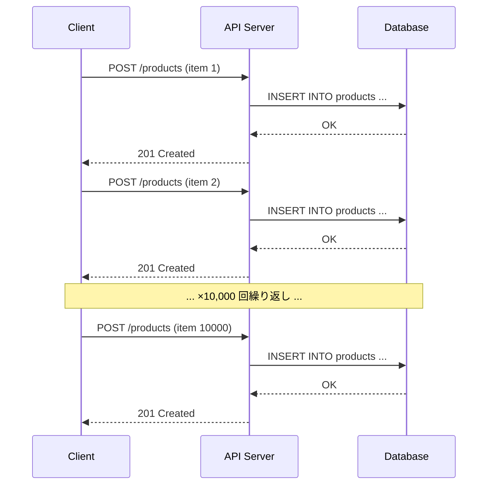
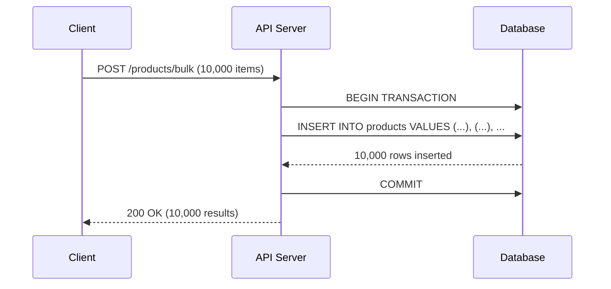
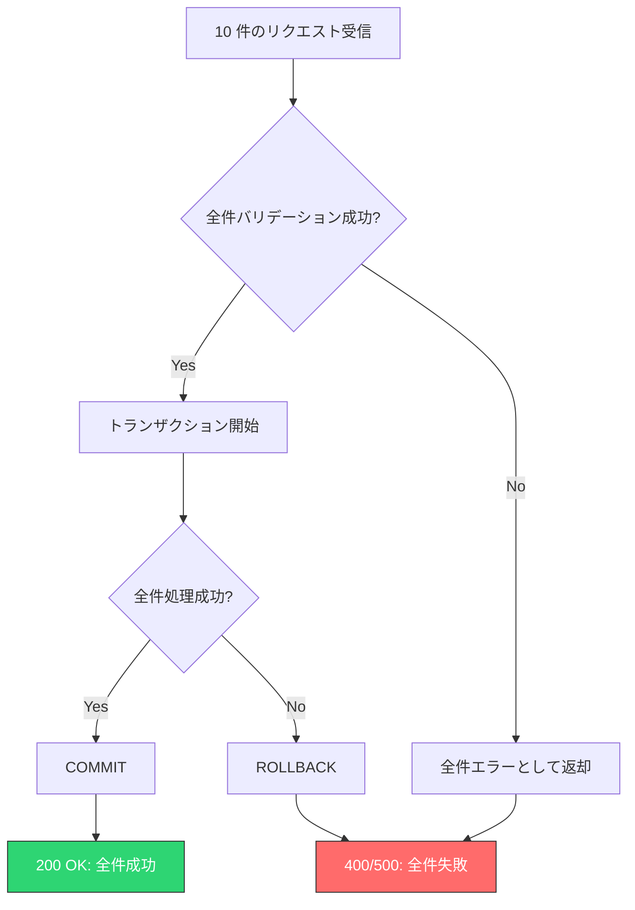
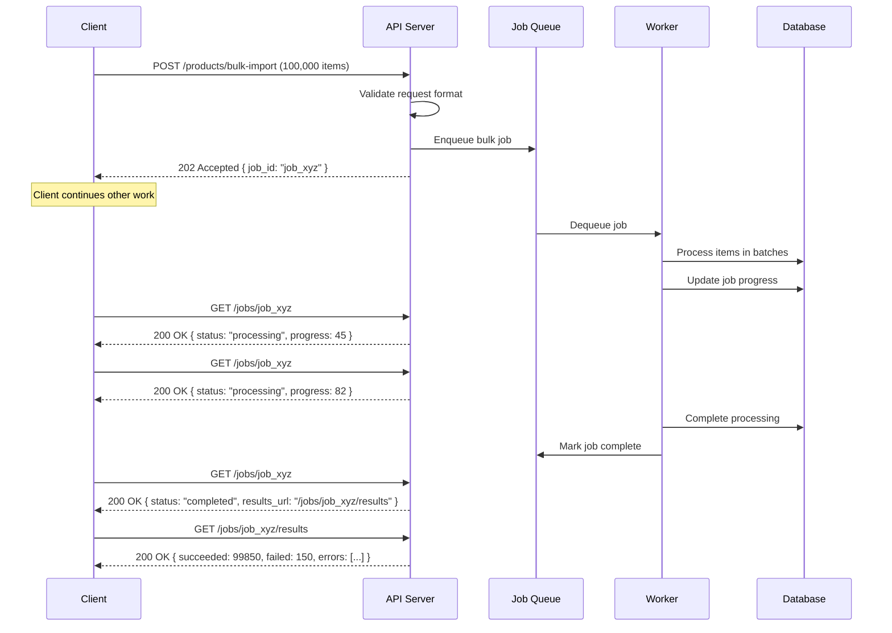
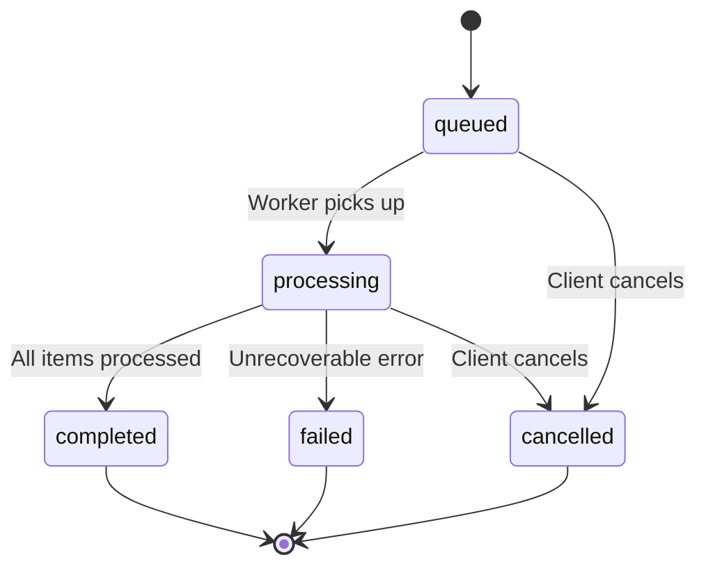
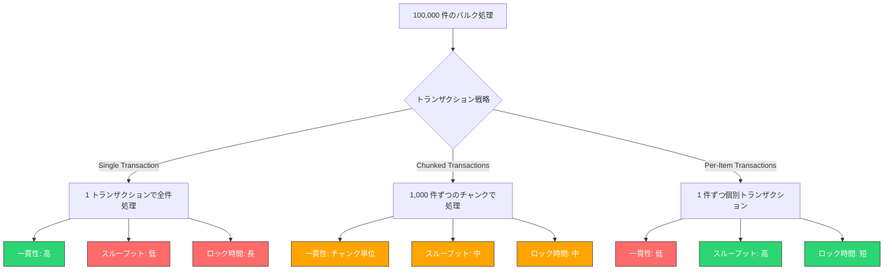
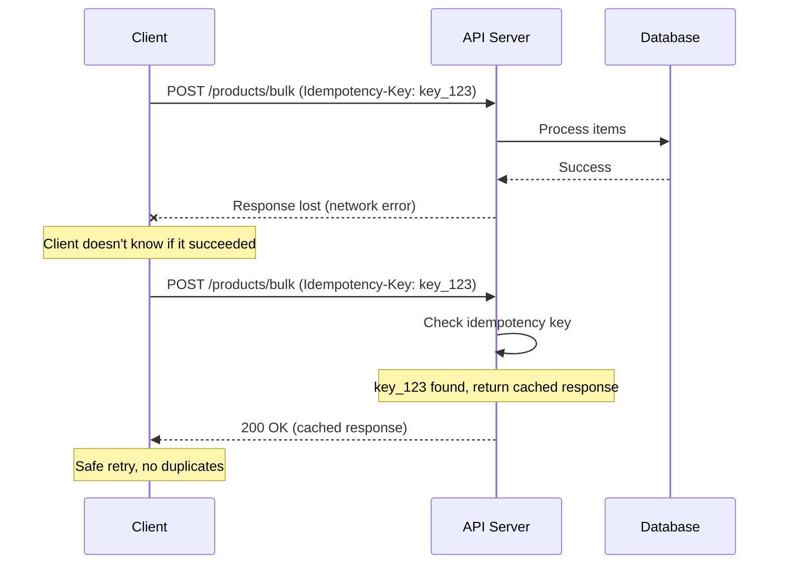
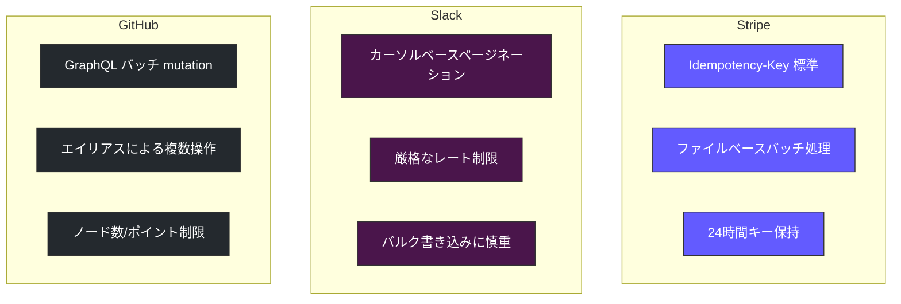
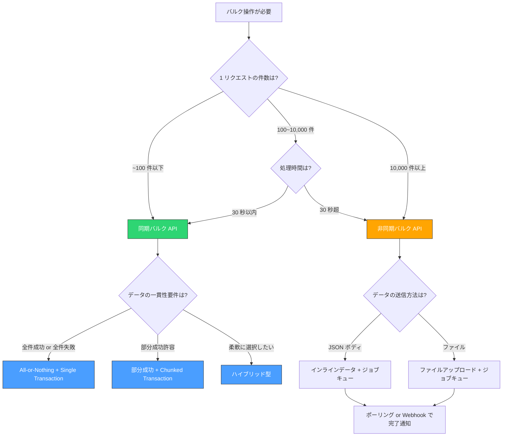

# バルク処理・バッチAPI設計

## なぜバルク処理が必要か

Web API を設計する際、最初に作られるのは単一リソースに対する CRUD エンドポイントである。`POST /users` で 1 人のユーザーを作成し、`GET /users/:id` で 1 人のユーザーを取得する。RESTful な設計原則に従えば、これは自然で美しい。

しかし現実のアプリケーションでは、**一度に大量のリソースを操作したい場面** が頻繁に発生する。

- CSV ファイルから 10,000 件の商品データを一括インポートする
- 管理画面で選択した 50 件の注文のステータスを一括更新する
- 外部システムとのデータ同期で数万件のレコードを同期する
- マーケティングツールから 100 万件のメールアドレスに対してタグを付与する

こうした場面で単一リソース API を繰り返し呼び出すと、深刻な問題が発生する。これが **N+1 API 問題** である。

### N+1 API 問題

10,000 件の商品を登録するために `POST /products` を 10,000 回呼ぶとどうなるか。



この方式の問題は多岐にわたる。

| 観点 | 問題 |
|------|------|
| レイテンシ | 1 リクエストあたり 50ms としても、10,000 回で 500 秒（8 分以上）かかる |
| ネットワーク | HTTP ヘッダーや TLS ハンドシェイクが毎回発生し、帯域を浪費する |
| サーバー負荷 | リクエストごとに認証・認可・バリデーションが走り、CPU を消費する |
| DB 負荷 | 個別の INSERT 文がトランザクションごとに発行され、I/O が増大する |
| レート制限 | API のレート制限に容易に抵触する |
| エラーハンドリング | 5,000 件目で失敗した場合、残りをどうするか判断が難しい |

::: warning
N+1 API 問題はデータベースの N+1 クエリ問題と構造的に同じである。個別処理の繰り返しによってオーバーヘッドが線形に蓄積し、全体のパフォーマンスを大幅に劣化させる。
:::

### バルク API による解決

バルク API は、**複数のリソース操作を 1 つの API リクエストにまとめる** ことでこの問題を解決する。



バルク API の利点は以下の通りである。

- **レイテンシ削減**: 1 回の HTTP ラウンドトリップで完結する
- **ネットワーク効率**: ヘッダーのオーバーヘッドが 1 回分で済む
- **DB 最適化**: バッチ INSERT やバルク UPDATE により I/O を最小化できる
- **トランザクション制御**: 全体を 1 つのトランザクションで処理するか、個別に処理するかを選択できる
- **エラーハンドリング**: 全件の結果を一括で返却できる

## 同期バルク API 設計

### エンドポイント設計

バルク操作のエンドポイントには主に 2 つのパターンがある。

**パターン 1: 専用エンドポイント**

```
POST /products/bulk
POST /products/batch
POST /products:batchCreate
```

**パターン 2: 既存エンドポイントの配列受付**

```
POST /products  (body が配列の場合はバルク処理)
```

パターン 2 は一見シンプルに見えるが、単一リソース作成とバルク作成でレスポンスの構造が変わるため、クライアント側の実装が複雑になる。パターン 1 の専用エンドポイントを設ける方が明確で推奨される。

::: tip
Google API の設計ガイドラインでは、バッチ操作に `batchGet`、`batchCreate`、`batchUpdate`、`batchDelete` のような命名を推奨している。これにより操作の意図が URL から明確に読み取れる。
:::

### リクエスト設計

バルクリクエストの基本的な構造は以下のようになる。

```json
// POST /products/bulk
{
  "operations": [
    {
      "method": "create",
      "data": {
        "name": "Product A",
        "price": 1000,
        "category": "electronics"
      }
    },
    {
      "method": "create",
      "data": {
        "name": "Product B",
        "price": 2000,
        "category": "books"
      }
    },
    {
      "method": "update",
      "id": "prod_abc123",
      "data": {
        "price": 1500
      }
    }
  ]
}
```

操作が単一種類（一括作成のみ等）の場合は、よりシンプルな構造にできる。

```json
// POST /products/batch-create
{
  "items": [
    {
      "name": "Product A",
      "price": 1000,
      "category": "electronics"
    },
    {
      "name": "Product B",
      "price": 2000,
      "category": "books"
    }
  ]
}
```

### 部分成功・部分失敗のレスポンス設計

バルク API 設計において最も難しいのが、**部分成功（partial success）** の扱いである。10 件中 8 件が成功し 2 件が失敗した場合、レスポンスはどうあるべきか。

ここには 3 つの戦略がある。

#### 戦略 1: All-or-Nothing（全件成功 or 全件失敗）



この戦略では、1 件でも失敗すればトランザクション全体をロールバックする。

```json
// Success: HTTP 200
{
  "status": "success",
  "results": [
    { "id": "prod_001", "status": "created" },
    { "id": "prod_002", "status": "created" }
  ]
}

// Failure: HTTP 400
{
  "status": "failed",
  "message": "Validation failed for 2 items. No items were processed.",
  "errors": [
    { "index": 3, "field": "price", "message": "must be a positive number" },
    { "index": 7, "field": "name", "message": "is required" }
  ]
}
```

**利点**: トランザクションの一貫性が保証される。クライアントは成功か失敗かの 2 状態だけを扱えばよい。

**欠点**: 1 件の不正データのために残り 9,999 件が処理されない。大量データの場合、修正して再送するコストが高い。

#### 戦略 2: 部分成功許容

この戦略では、各アイテムを独立に処理し、成功・失敗を個別に報告する。

```json
// HTTP 207 Multi-Status
{
  "summary": {
    "total": 10,
    "succeeded": 8,
    "failed": 2
  },
  "results": [
    { "index": 0, "status": "success", "id": "prod_001" },
    { "index": 1, "status": "success", "id": "prod_002" },
    { "index": 2, "status": "error", "error": { "code": "VALIDATION_ERROR", "message": "price must be positive" } },
    { "index": 3, "status": "success", "id": "prod_003" },
    { "index": 4, "status": "success", "id": "prod_004" },
    { "index": 5, "status": "success", "id": "prod_005" },
    { "index": 6, "status": "error", "error": { "code": "DUPLICATE_SKU", "message": "SKU already exists" } },
    { "index": 7, "status": "success", "id": "prod_006" },
    { "index": 8, "status": "success", "id": "prod_007" },
    { "index": 9, "status": "success", "id": "prod_008" }
  ]
}
```

::: warning
HTTP ステータスコードの選択は議論が分かれる。`207 Multi-Status`（WebDAV 由来）を使うサービスもあれば、`200 OK` を返して本文で個別のステータスを表現するサービスもある。いずれにせよ、クライアントが **レスポンス本文を解析して個別の成否を確認しなければならない** 点は同じである。
:::

**利点**: 正常なデータは即座に処理される。失敗分だけを修正して再送できる。

**欠点**: クライアントのエラーハンドリングが複雑になる。データの一貫性が保証されない場合がある。

#### 戦略 3: ハイブリッド（クライアント選択型）

最も柔軟なのは、クライアントにトランザクション戦略を選択させるアプローチである。

```json
// POST /products/bulk
{
  "transaction_mode": "independent",  // or "atomic"
  "items": [
    { "name": "Product A", "price": 1000 },
    { "name": "Product B", "price": -100 }
  ]
}
```

- `"atomic"`: All-or-Nothing。1 件でも失敗すれば全件ロールバック
- `"independent"`: 各アイテムを独立に処理し、部分成功を許容

このハイブリッド方式は Stripe のバルク API でも採用されている考え方で、ユースケースに応じた柔軟な使い分けを可能にする。

### HTTP ステータスコードの設計方針

バルク API におけるステータスコードの設計は一見些細に見えるが、クライアントの実装に直接影響する重要な決定である。

| シナリオ | 推奨ステータスコード | 理由 |
|---------|---------------------|------|
| 全件成功 | `200 OK` | リクエスト自体は正常に処理された |
| 全件失敗（バリデーション） | `400 Bad Request` | リクエスト自体が不正 |
| 部分成功 | `200 OK` or `207 Multi-Status` | サービスの設計方針による |
| 全件失敗（サーバーエラー） | `500 Internal Server Error` | サーバー側の問題 |
| ペイロード超過 | `413 Payload Too Large` | サイズ制限超過 |
| 件数超過 | `400 Bad Request` | バリデーションエラーの一種 |

::: tip
`207 Multi-Status` は標準的な HTTP ステータスコードではなく WebDAV 拡張（RFC 4918）に由来する。採用するかどうかはチームの方針次第だが、`200 OK` を返してレスポンス本文内で個別のステータスを表現する方がシンプルで、多くのクライアントライブラリと相性が良い。
:::

## 非同期バルク API 設計

### 同期処理の限界

同期バルク API は数百件程度の処理には適しているが、件数が増えるとタイムアウトやリソース枯渇の問題が発生する。

- **HTTP タイムアウト**: ロードバランサーやプロキシに 30〜60 秒のタイムアウトが設定されていることが多い
- **メモリ圧迫**: 10 万件のレスポンスをメモリ上に構築するとサーバーの OOM リスクがある
- **クライアント体験**: 数分間レスポンスが返らない API は、ユーザーに「壊れている」という印象を与える
- **リトライの困難**: 途中で接続が切れた場合、どこまで処理されたか分からない

これらの問題を解決するのが **非同期バルク API** である。

### 非同期 API の基本フロー



### ジョブ投入 API

非同期バルク API の最初のステップは、ジョブの投入である。

```json
// POST /products/bulk-import
// Content-Type: application/json
{
  "source": "inline",
  "items": [ ... ],
  "options": {
    "on_error": "continue",
    "notify_url": "https://example.com/webhooks/bulk-import"
  }
}

// Response: HTTP 202 Accepted
{
  "job_id": "job_abc123",
  "status": "queued",
  "created_at": "2026-03-02T10:00:00Z",
  "estimated_completion": "2026-03-02T10:05:00Z",
  "status_url": "/jobs/job_abc123"
}
```

ここでの重要なポイントは以下の通りである。

- **HTTP 202 Accepted**: 「リクエストは受理したが、処理はまだ完了していない」ことを示す
- **job_id**: クライアントがジョブの進捗を問い合わせるための識別子
- **status_url**: ポーリング先の URL を明示的に返す

::: tip
大量データの場合、リクエストボディにインラインで全データを含めるのではなく、事前にファイルをアップロードしてその URL を参照する方式も有効である。Stripe のバルクインポートや AWS の S3 バッチオペレーションはこのパターンを採用している。
:::

### ファイルアップロード方式

データ量が非常に大きい場合、JSON ボディに全データを詰め込むのは現実的ではない。ファイルアップロード方式では、2 ステップでジョブを実行する。

```json
// Step 1: Upload file
// POST /uploads
// Content-Type: multipart/form-data
// (CSV or NDJSON file)

// Response: HTTP 201 Created
{
  "upload_id": "upload_xyz",
  "file_url": "/uploads/upload_xyz",
  "row_count": 100000
}

// Step 2: Create bulk job referencing the upload
// POST /products/bulk-import
{
  "source": "upload",
  "upload_id": "upload_xyz",
  "options": {
    "on_error": "continue",
    "skip_header": true
  }
}

// Response: HTTP 202 Accepted
{
  "job_id": "job_abc456",
  "status": "queued"
}
```

### ポーリング API

ジョブの進捗を確認するためのポーリング API を設計する。

```json
// GET /jobs/job_abc123

// Processing:
{
  "job_id": "job_abc123",
  "status": "processing",
  "progress": {
    "total": 100000,
    "processed": 45000,
    "succeeded": 44850,
    "failed": 150,
    "percentage": 45
  },
  "created_at": "2026-03-02T10:00:00Z",
  "updated_at": "2026-03-02T10:02:30Z",
  "estimated_completion": "2026-03-02T10:05:00Z"
}

// Completed:
{
  "job_id": "job_abc123",
  "status": "completed",
  "progress": {
    "total": 100000,
    "processed": 100000,
    "succeeded": 99850,
    "failed": 150,
    "percentage": 100
  },
  "created_at": "2026-03-02T10:00:00Z",
  "completed_at": "2026-03-02T10:04:45Z",
  "results_url": "/jobs/job_abc123/results",
  "errors_url": "/jobs/job_abc123/errors"
}
```

ジョブのステータスは一般的に以下の遷移をたどる。



### ポーリング vs Webhook vs Server-Sent Events

ジョブの完了を検知する方法には複数のアプローチがある。

**ポーリング（Polling）**

最もシンプルで確実な方法。クライアントが定期的にステータス API を呼び出す。

```javascript
// Polling with exponential backoff
async function waitForJob(jobId) {
  let delay = 1000; // initial delay: 1 second
  const maxDelay = 30000; // max delay: 30 seconds

  while (true) {
    const response = await fetch(`/jobs/${jobId}`);
    const job = await response.json();

    if (job.status === "completed" || job.status === "failed") {
      return job;
    }

    await sleep(delay);
    delay = Math.min(delay * 2, maxDelay); // exponential backoff
  }
}
```

**Webhook（コールバック）**

ジョブ投入時にコールバック URL を指定し、完了時にサーバーから通知する。

```json
// Job submission with webhook
{
  "items": [...],
  "options": {
    "notify_url": "https://example.com/webhooks/bulk-complete",
    "notify_events": ["completed", "failed"]
  }
}

// Webhook payload (server → client)
// POST https://example.com/webhooks/bulk-complete
{
  "event": "job.completed",
  "job_id": "job_abc123",
  "status": "completed",
  "summary": {
    "total": 100000,
    "succeeded": 99850,
    "failed": 150
  }
}
```

**Server-Sent Events（SSE）**

リアルタイムの進捗通知が必要な場合に適している。

```
GET /jobs/job_abc123/stream
Accept: text/event-stream

data: {"status":"processing","progress":10}

data: {"status":"processing","progress":25}

data: {"status":"processing","progress":50}

data: {"status":"completed","progress":100}
```

| 方式 | 利点 | 欠点 | 適するケース |
|------|------|------|------------|
| ポーリング | 実装が簡単、ステートレス | 無駄なリクエストが発生 | 汎用的、サーバー間通信 |
| Webhook | リアルタイム、効率的 | 受信側のエンドポイント必要 | サーバー間連携 |
| SSE | リアルタイム、ブラウザ対応 | 接続維持のコスト | ブラウザからの進捗監視 |

## トランザクション境界の設計

### バルク処理におけるトランザクションの課題

バルク処理でのトランザクション設計は、データの一貫性とスループットのトレードオフである。



### Single Transaction（全件一括）

```python
def bulk_create_all_or_nothing(items):
    """Process all items in a single transaction."""
    with db.transaction():
        results = []
        for item in items:
            # If any item fails, the entire transaction rolls back
            result = create_product(item)
            results.append(result)
        return results
```

100,000 件を 1 トランザクションで処理すると、トランザクションログが巨大になり、ロールバックに何分もかかる可能性がある。また、トランザクション中にテーブルロックが保持されるため、他のリクエストがブロックされる。

### Chunked Transactions（チャンク分割）

実務上最も多く採用されるのがこのパターンである。

```python
def bulk_create_chunked(items, chunk_size=1000):
    """Process items in chunks with separate transactions."""
    results = []
    for i in range(0, len(items), chunk_size):
        chunk = items[i:i + chunk_size]
        try:
            with db.transaction():
                chunk_results = []
                for item in chunk:
                    result = create_product(item)
                    chunk_results.append({
                        "index": i + len(chunk_results),
                        "status": "success",
                        "id": result.id
                    })
                results.extend(chunk_results)
        except Exception as e:
            # Mark all items in this chunk as failed
            for j in range(len(chunk)):
                results.append({
                    "index": i + j,
                    "status": "error",
                    "error": str(e)
                })
    return results
```

チャンクサイズの決定には以下の要因を考慮する。

- **DB のトランザクションログサイズ上限**: PostgreSQL の場合、`max_wal_size` に注意
- **ロック保持時間の許容範囲**: 他のリクエストへの影響を最小化する
- **メモリ使用量**: チャンク内のデータがメモリに収まるか
- **リトライの粒度**: チャンク単位でリトライできるため、小さすぎず大きすぎないサイズが望ましい

::: tip
一般的なガイドラインとして、チャンクサイズは 500〜5,000 件程度が適切なことが多い。ただし、1 件あたりのデータサイズや処理の複雑さに依存するため、実際の負荷テストで最適値を見つけるべきである。
:::

### Per-Item Transactions（個別処理）

各アイテムを独立したトランザクションで処理する方式。部分成功を許容する設計と組み合わせて使われる。

```python
def bulk_create_independent(items):
    """Process each item independently."""
    results = []
    for i, item in enumerate(items):
        try:
            with db.transaction():
                result = create_product(item)
                results.append({
                    "index": i,
                    "status": "success",
                    "id": result.id
                })
        except ValidationError as e:
            results.append({
                "index": i,
                "status": "error",
                "error": {"code": "VALIDATION_ERROR", "message": str(e)}
            })
        except Exception as e:
            results.append({
                "index": i,
                "status": "error",
                "error": {"code": "INTERNAL_ERROR", "message": "unexpected error"}
            })
    return results
```

個別トランザクションはロック競合が最小化される反面、トランザクションのオーバーヘッドが件数分発生する。DB のバッチ INSERT の恩恵も受けられない。

## ペイロードサイズ制限

### なぜ制限が必要か

無制限にデータを受け付けるバルク API は、意図的・偶発的を問わず、以下の問題を引き起こす。

- **メモリ枯渇**: JSON ペイロードのパース時にサーバーのメモリが枯渇する
- **タイムアウト**: 処理時間がリバースプロキシやロードバランサーのタイムアウトを超える
- **DoS 攻撃**: 巨大なペイロードを繰り返し送信することでサービスを停止させられる
- **公平性**: 1 つの大きなリクエストがリソースを独占し、他のリクエストに影響する

### 制限の種類と設計

```json
// API configuration example
{
  "bulk_limits": {
    "max_items_per_request": 1000,
    "max_payload_size_bytes": 10485760,
    "max_item_size_bytes": 10240,
    "rate_limit_per_minute": 10
  }
}
```

| 制限種類 | 典型的な値 | 目的 |
|---------|-----------|------|
| 最大件数 | 100〜10,000 件 | 処理時間の上限を保証 |
| 最大ペイロードサイズ | 1MB〜50MB | メモリ使用量の制限 |
| 1 件あたりの最大サイズ | 1KB〜100KB | 異常データの排除 |
| レート制限 | 10〜100 回/分 | サーバーリソースの保護 |

### エラーレスポンス

制限超過時のエラーは明確に報告する。

```json
// HTTP 413 Payload Too Large
{
  "error": {
    "code": "PAYLOAD_TOO_LARGE",
    "message": "Request payload exceeds the maximum allowed size of 10MB",
    "details": {
      "max_size_bytes": 10485760,
      "actual_size_bytes": 15728640
    }
  }
}

// HTTP 400 Bad Request
{
  "error": {
    "code": "TOO_MANY_ITEMS",
    "message": "Bulk request contains 5000 items, maximum is 1000",
    "details": {
      "max_items": 1000,
      "actual_items": 5000
    }
  }
}
```

::: warning
ペイロードサイズの制限は API レイヤーだけでなく、Web サーバー（Nginx: `client_max_body_size`）、API ゲートウェイ、ロードバランサー（ALB: デフォルト 1MB）など、リクエストが通過するすべてのレイヤーで考慮する必要がある。最も小さい制限がボトルネックになる。
:::

### ページング型バルクリクエスト

制限を超える大量データを送信したい場合、クライアント側でページングする方式がある。

```javascript
async function bulkCreateWithPaging(items, pageSize = 1000) {
  const results = [];

  for (let i = 0; i < items.length; i += pageSize) {
    const page = items.slice(i, i + pageSize);
    const response = await fetch("/products/bulk", {
      method: "POST",
      headers: { "Content-Type": "application/json" },
      body: JSON.stringify({ items: page }),
    });
    const data = await response.json();
    results.push(...data.results);
  }

  return results;
}
```

ただし、この方式はページ間のトランザクション一貫性が保証されない。全体の一貫性が必要な場合は非同期バルク API を使うべきである。

## 冪等性の確保

### なぜ冪等性が重要か

バルク API はネットワーク障害やタイムアウトが発生しやすい。クライアントは 10,000 件のバルクリクエストを送信した後、レスポンスを受け取る前に接続が切れることがある。このとき、クライアントは処理が成功したのか失敗したのか分からない。

冪等性がなければ、安全にリトライすることができない。リトライによってデータが重複作成される可能性があるからだ。



### Idempotency Key パターン

最も広く採用されている冪等性の実現方法が、**Idempotency Key** パターンである。Stripe がこのパターンを広めたことで知られている。

```python
import hashlib
import json
from datetime import datetime, timedelta

class IdempotencyKeyStore:
    """Store and retrieve idempotency keys with their responses."""

    def __init__(self, redis_client):
        self.redis = redis_client
        self.ttl = timedelta(hours=24)  # Keys expire after 24 hours

    def get_cached_response(self, key):
        """Check if this key has been processed before."""
        cached = self.redis.get(f"idempotency:{key}")
        if cached:
            return json.loads(cached)
        return None

    def lock_key(self, key):
        """Acquire a lock for processing this key."""
        # Prevent concurrent requests with same key
        return self.redis.set(
            f"idempotency:{key}:lock",
            "processing",
            nx=True,  # Only set if not exists
            ex=60     # Lock expires after 60 seconds
        )

    def save_response(self, key, response):
        """Cache the response for this key."""
        self.redis.setex(
            f"idempotency:{key}",
            self.ttl,
            json.dumps(response)
        )
        self.redis.delete(f"idempotency:{key}:lock")


def handle_bulk_request(request):
    """Handle bulk request with idempotency."""
    idempotency_key = request.headers.get("Idempotency-Key")

    if not idempotency_key:
        return error_response(400, "Idempotency-Key header is required")

    store = IdempotencyKeyStore(redis)

    # Check for cached response
    cached = store.get_cached_response(idempotency_key)
    if cached:
        return cached  # Return same response as before

    # Acquire lock to prevent concurrent processing
    if not store.lock_key(idempotency_key):
        return error_response(409, "Request with this key is already being processed")

    try:
        # Process the bulk operation
        result = process_bulk_items(request.json["items"])

        # Cache the response
        response = success_response(result)
        store.save_response(idempotency_key, response)

        return response
    except Exception as e:
        store.release_lock(idempotency_key)
        raise
```

クライアント側の使い方は以下の通りである。

```javascript
async function bulkCreateWithRetry(items, maxRetries = 3) {
  // Generate a unique idempotency key for this batch
  const idempotencyKey = crypto.randomUUID();

  for (let attempt = 0; attempt < maxRetries; attempt++) {
    try {
      const response = await fetch("/products/bulk", {
        method: "POST",
        headers: {
          "Content-Type": "application/json",
          "Idempotency-Key": idempotencyKey, // Same key for all retries
        },
        body: JSON.stringify({ items }),
      });

      if (response.ok) {
        return await response.json();
      }

      // Don't retry client errors (4xx)
      if (response.status >= 400 && response.status < 500) {
        throw new Error(`Client error: ${response.status}`);
      }
    } catch (error) {
      if (attempt === maxRetries - 1) throw error;
      // Exponential backoff before retry
      await sleep(Math.pow(2, attempt) * 1000);
    }
  }
}
```

### 自然キーによる冪等性

Idempotency Key のほかに、データ自体が持つ **自然キー（Natural Key）** を利用して冪等性を実現する方法もある。

たとえば、商品の SKU コードや外部システムの ID をユニークキーとして扱い、UPSERT（存在すれば更新、なければ挿入）を行う。

```sql
-- PostgreSQL: ON CONFLICT (upsert)
INSERT INTO products (sku, name, price, category)
VALUES
    ('SKU-001', 'Product A', 1000, 'electronics'),
    ('SKU-002', 'Product B', 2000, 'books'),
    ('SKU-003', 'Product C', 3000, 'electronics')
ON CONFLICT (sku) DO UPDATE SET
    name = EXCLUDED.name,
    price = EXCLUDED.price,
    category = EXCLUDED.category,
    updated_at = NOW();
```

この方式は同じデータを何度送信しても同じ結果になるため、本質的に冪等である。ただし、「作成」と「更新」が区別できなくなるため、ユースケースによっては適切でない場合もある。

## 実装パターン

### バッチ INSERT

最も基本的な最適化パターンは、複数の INSERT 文を 1 つの文にまとめるバッチ INSERT である。

```sql
-- Bad: Individual inserts (N round trips)
INSERT INTO products (name, price) VALUES ('Product A', 1000);
INSERT INTO products (name, price) VALUES ('Product B', 2000);
INSERT INTO products (name, price) VALUES ('Product C', 3000);

-- Good: Batch insert (1 round trip)
INSERT INTO products (name, price) VALUES
    ('Product A', 1000),
    ('Product B', 2000),
    ('Product C', 3000);
```

バッチ INSERT のパフォーマンス効果は劇的である。PostgreSQL のベンチマークでは、10,000 件の個別 INSERT に 10 秒かかる処理が、バッチ INSERT では 0.1 秒以下で完了することがある。

ただし、SQL 文のサイズには上限がある（MySQL のデフォルトは `max_allowed_packet = 64MB`）。大量データの場合はチャンクに分割してバッチ INSERT を繰り返す。

```python
def batch_insert_products(items, batch_size=1000):
    """Insert products in batches for optimal performance."""
    for i in range(0, len(items), batch_size):
        batch = items[i:i + batch_size]
        # Build parameterized query
        placeholders = ", ".join(
            ["(%s, %s, %s)"] * len(batch)
        )
        values = []
        for item in batch:
            values.extend([item["name"], item["price"], item["category"]])

        query = f"""
            INSERT INTO products (name, price, category)
            VALUES {placeholders}
        """
        db.execute(query, values)
```

### COPY / LOAD DATA による高速バルクロード

さらに大量のデータを処理する場合、SQL の INSERT 文ではなく、データベース固有のバルクロード機能を使うことで桁違いのパフォーマンスが得られる。

```sql
-- PostgreSQL: COPY command
COPY products (name, price, category)
FROM '/tmp/products.csv'
WITH (FORMAT csv, HEADER true);

-- MySQL: LOAD DATA
LOAD DATA INFILE '/tmp/products.csv'
INTO TABLE products
FIELDS TERMINATED BY ','
ENCLOSED BY '"'
LINES TERMINATED BY '\n'
IGNORE 1 ROWS
(name, price, category);
```

COPY コマンドは WAL（Write-Ahead Log）への書き込みを最適化し、インデックスの更新をバッチ化するため、INSERT 文と比較して 5〜10 倍高速になることがある。

### UPSERT パターン

既存データの更新と新規データの挿入を同時に行う UPSERT は、バルク同期処理において非常に重要なパターンである。

```sql
-- PostgreSQL: INSERT ... ON CONFLICT
INSERT INTO products (external_id, name, price, stock)
VALUES
    ('ext_001', 'Product A', 1000, 50),
    ('ext_002', 'Product B', 2000, 30),
    ('ext_003', 'Product C', 3000, 0)
ON CONFLICT (external_id) DO UPDATE SET
    name = EXCLUDED.name,
    price = EXCLUDED.price,
    stock = EXCLUDED.stock,
    updated_at = NOW()
RETURNING id, external_id,
    (xmax = 0) AS is_inserted;  -- true if inserted, false if updated
```

```sql
-- MySQL: INSERT ... ON DUPLICATE KEY UPDATE
INSERT INTO products (external_id, name, price, stock)
VALUES
    ('ext_001', 'Product A', 1000, 50),
    ('ext_002', 'Product B', 2000, 30),
    ('ext_003', 'Product C', 3000, 0)
ON DUPLICATE KEY UPDATE
    name = VALUES(name),
    price = VALUES(price),
    stock = VALUES(stock),
    updated_at = NOW();
```

::: details UPSERT の注意点
UPSERT は便利だが、いくつかの落とし穴がある。

1. **ユニークインデックスが必要**: ON CONFLICT で指定するカラムにはユニークインデックスが必要
2. **部分更新の考慮**: EXCLUDED を使って全カラムを上書きすると、意図しないデータ消失がありうる
3. **トリガーの挙動**: INSERT トリガーと UPDATE トリガーのどちらが発火するかは DB 実装による
4. **デッドロック**: 並行する UPSERT がデッドロックを引き起こすことがある（キーの順序を揃えることで軽減可能）
:::

### バルク DELETE パターン

大量データの削除もバルク処理が必要になる場面である。

```sql
-- Bad: Delete all matching rows at once (locks entire table)
DELETE FROM logs WHERE created_at < '2025-01-01';

-- Good: Delete in batches to reduce lock contention
DO $$
DECLARE
    deleted_count INTEGER;
BEGIN
    LOOP
        DELETE FROM logs
        WHERE id IN (
            SELECT id FROM logs
            WHERE created_at < '2025-01-01'
            LIMIT 10000
        );
        GET DIAGNOSTICS deleted_count = ROW_COUNT;
        EXIT WHEN deleted_count = 0;
        -- Allow other transactions to proceed
        PERFORM pg_sleep(0.1);
    END LOOP;
END $$;
```

大量行の一括 DELETE はテーブルロックやレプリケーション遅延の原因になるため、バッチに分割して削除間隔を空けるのが定石である。

### アプリケーションレイヤーでの並列処理

バルク処理をさらに高速化するために、アプリケーションレイヤーで並列処理を導入する場合がある。

```python
import asyncio
from concurrent.futures import ThreadPoolExecutor

async def bulk_process_parallel(items, chunk_size=1000, max_workers=4):
    """Process bulk items in parallel chunks."""
    chunks = [
        items[i:i + chunk_size]
        for i in range(0, len(items), chunk_size)
    ]

    results = []
    semaphore = asyncio.Semaphore(max_workers)

    async def process_chunk(chunk, chunk_index):
        async with semaphore:
            try:
                # Process chunk in thread pool to avoid blocking
                loop = asyncio.get_event_loop()
                chunk_results = await loop.run_in_executor(
                    ThreadPoolExecutor(max_workers=1),
                    lambda: batch_insert_products(chunk)
                )
                return {
                    "chunk_index": chunk_index,
                    "status": "success",
                    "count": len(chunk_results)
                }
            except Exception as e:
                return {
                    "chunk_index": chunk_index,
                    "status": "error",
                    "error": str(e)
                }

    tasks = [
        process_chunk(chunk, i) for i, chunk in enumerate(chunks)
    ]
    results = await asyncio.gather(*tasks)

    return results
```

::: warning
並列処理を導入する場合、DB のコネクションプール数やデッドロックに注意が必要である。並列度をコネクションプールサイズ以下に抑え、デッドロック回避のためにチャンク内のデータをプライマリキー順にソートすることが推奨される。
:::

## 実例から学ぶ

### Stripe の Bulk Operations

Stripe は決済 API のリーダーであり、そのバルク操作の設計は業界のベストプラクティスとして広く参照されている。

**冪等性キーの標準化**

Stripe は全ての POST リクエストに `Idempotency-Key` ヘッダーを受け付ける。これはバルク操作に限らない API 全体の設計方針である。

```bash
curl https://api.stripe.com/v1/charges \
  -u sk_test_xxx: \
  -H "Idempotency-Key: unique_key_123" \
  -d amount=2000 \
  -d currency=usd
```

冪等性キーは 24 時間保持され、同じキーで再リクエストすると、最初のレスポンスがそのまま返される。処理中のリクエストに同じキーでアクセスすると `409 Conflict` が返される。

**バッチ処理 API**

Stripe は非同期のファイルベースバッチ処理もサポートしている。大量の Payout（支払い）を処理する場合、CSV ファイルをアップロードしてバッチジョブとして実行できる。

### Slack の conversations API

Slack API はバルク操作について興味深いアプローチを取っている。メッセージの一括取得では、`conversations.history` API がカーソルベースのページネーションを採用し、効率的な大量データ取得を可能にしている。

```json
// GET https://slack.com/api/conversations.history
// ?channel=C1234567890&limit=200&cursor=dXNlcjpVMDYxTkZUVDI=

{
  "ok": true,
  "messages": [...],
  "has_more": true,
  "response_metadata": {
    "next_cursor": "bmV4dF90czoxNTEyMTU4NzI1MDAwNjAw"
  }
}
```

一方、Slack はバルク書き込み操作には慎重で、個別のメッセージ送信 API（`chat.postMessage`）にレート制限（1 秒に 1 メッセージ程度）を設けている。これは、Slack のリアルタイム通知システムに過負荷をかけないための設計判断である。

### GitHub の GraphQL バッチリクエスト

GitHub は REST API v3 と GraphQL API v4 を提供しているが、バルク操作においては GraphQL が大きな利点を持つ。

GraphQL では、1 つのリクエストで複数の操作を実行できる。

```graphql
mutation {
  addLabels1: addLabelsToLabelable(input: {
    labelableId: "ISSUE_ID_1",
    labelIds: ["LABEL_ID_1"]
  }) {
    labelable { ... on Issue { number } }
  }

  addLabels2: addLabelsToLabelable(input: {
    labelableId: "ISSUE_ID_2",
    labelIds: ["LABEL_ID_1"]
  }) {
    labelable { ... on Issue { number } }
  }

  addLabels3: addLabelsToLabelable(input: {
    labelableId: "ISSUE_ID_3",
    labelIds: ["LABEL_ID_1"]
  }) {
    labelable { ... on Issue { number } }
  }
}
```

GraphQL のエイリアス機能（`addLabels1`, `addLabels2`, ...）を使うことで、同一の mutation を異なる引数で複数回呼び出せる。各操作は独立に成功・失敗し、レスポンスにはそれぞれの結果が含まれる。

ただし、GitHub の GraphQL API にはノード数制限（1 リクエストあたり最大 500,000 ノード）やレート制限（1 時間あたり 5,000 ポイント）があり、無制限にバルク操作ができるわけではない。

### 各サービスの比較



| 観点 | Stripe | Slack | GitHub |
|------|--------|-------|--------|
| バルク書き込み | ファイルベースバッチ | 個別 API + レート制限 | GraphQL バッチ mutation |
| バルク読み取り | リストAPI + ページネーション | カーソルベースページネーション | GraphQL クエリ |
| 冪等性 | Idempotency-Key ヘッダー | N/A（主に読み取り） | mutation は非冪等 |
| レート制限 | リクエストベース | メソッドごとに異なる | ポイントベース |
| 非同期処理 | バッチジョブ + ポーリング | N/A | N/A |

## 設計上の判断基準

バルク API を設計する際、多くの選択肢がある。以下のディシジョンツリーを参考に、ユースケースに応じた適切な設計を選択してほしい。



### 同期 vs 非同期の判断

| 基準 | 同期バルク API | 非同期バルク API |
|------|---------------|-----------------|
| 件数 | 数百件まで | 数千〜数百万件 |
| 処理時間 | 30 秒以内 | 制限なし |
| リアルタイム性 | 即座に結果が必要 | 遅延許容 |
| 実装コスト | 低い | 高い（ジョブキュー等が必要） |
| エラーハンドリング | シンプル | 複雑（ジョブ失敗、リトライ等） |
| クライアント体験 | 直感的 | ポーリング/Webhook の理解が必要 |

### 冪等性の実装方針

| 方式 | 適するケース | 実装コスト |
|------|------------|-----------|
| Idempotency-Key | 汎用的な POST/PUT 操作 | 中（Redis 等が必要） |
| 自然キー + UPSERT | 外部 ID を持つデータ同期 | 低（DB 機能で完結） |
| クライアント生成 ID | リソース作成操作 | 低（UUID を事前生成） |
| リクエスト内容のハッシュ | 内容が同じなら同一とみなす場合 | 低（衝突リスクあり） |

## まとめ

バルク API の設計は、単純に「配列を受け取って処理する」だけの問題ではない。部分成功の扱い、トランザクション境界、ペイロード制限、冪等性、非同期処理など、多くの設計判断が絡み合う。

最も重要な原則は以下の通りである。

1. **明確なトランザクション戦略を選択する**: All-or-Nothing か部分成功許容かを明示的に決定し、API の利用者に伝える。曖昧な挙動は最悪の結果を招く。

2. **ペイロードの上限を設定する**: 無制限に受け付ける API は必ず問題を起こす。件数制限とサイズ制限の両方を設ける。

3. **冪等性を確保する**: バルク API はリトライが発生する前提で設計する。Idempotency Key か自然キーによる UPSERT で安全なリトライを保証する。

4. **同期と非同期の境界を見極める**: 処理時間が HTTP タイムアウトを超える可能性がある場合は、最初から非同期設計にする。後から同期を非同期に変更するのは破壊的変更になる。

5. **レスポンスで十分な情報を返す**: 各アイテムの成否、エラーの詳細、リトライに必要な情報をすべてレスポンスに含める。クライアントが次にどうすればよいか判断できるレスポンスを設計する。

バルク API は「API の応用問題」であり、基礎的な REST 設計の知識に加えて、データベース、メッセージキュー、分散システムの理解が求められる。しかし、適切に設計されたバルク API は、アプリケーションのパフォーマンスとユーザー体験を劇的に向上させる、投資に値する取り組みである。
