# ビザンチン将軍問題とBFTコンセンサス — PBFT, HotStuff, Tendermint

## 1. ビザンチン将軍問題の定義

### 問題の起源

1982年、Leslie Lamport、Robert Shostak、Marshall Peaseは論文「The Byzantine Generals Problem」を発表し、分散システムにおける最も根源的な障害モデルの一つを定式化した。この問題は以下のように表現される。

> ビザンチン帝国の複数の将軍が、それぞれの軍隊を率いて敵の都市を包囲している。将軍たちは伝令を通じてのみ通信でき、共通の作戦計画（攻撃するか撤退するか）に合意しなければならない。しかし、将軍の中には**裏切り者**がおり、忠実な将軍たちの合意を妨害しようとする。

この問題の本質は、**任意の故障**（arbitrary fault）を起こしうる参加者が存在する環境で、正常な参加者がいかにして合意に到達するかという点にある。「任意の故障」とは、単にクラッシュするだけでなく、嘘をつく、矛盾した情報を送る、意図的に破壊的な行動をとるといった、あらゆる逸脱行動を含む。

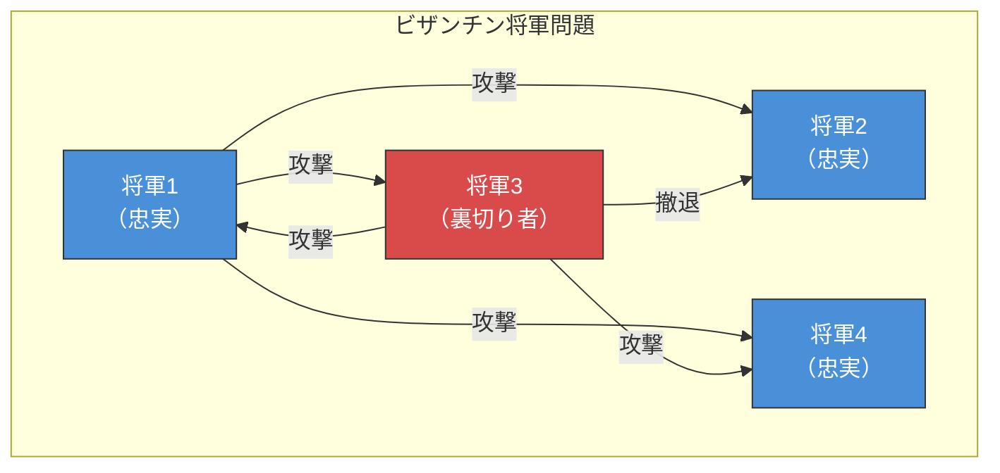

上の図では、裏切り者である将軍3が異なるメッセージを異なる将軍に送っている。将軍2は「撤退」を受け取り、将軍1と将軍4は「攻撃」を受け取る。このような状況で、忠実な将軍たちは一貫した決定を下さなければならない。

### クラッシュ障害とビザンチン障害の違い

分散システムにおける障害モデルは、大きく二つに分類される。

| 障害モデル | 故障ノードの振る舞い | 検出の容易さ | 必要な冗長性 |
|:---|:---|:---|:---|
| **クラッシュ障害**（Crash Fault） | 応答しなくなる | 比較的容易（タイムアウト） | $2f + 1$ |
| **ビザンチン障害**（Byzantine Fault） | 任意の振る舞い（嘘、改ざん、矛盾） | 極めて困難 | $3f + 1$ |

クラッシュ障害モデルでは、故障したノードは単に「沈黙する」だけである。PaxosやRaftといったコンセンサスアルゴリズムはこのモデルを前提としており、$n = 2f + 1$ 個のノードで $f$ 個のクラッシュ障害を許容できる。

一方、ビザンチン障害モデルでは、故障したノードが積極的に嘘をつき、異なる相手に異なるメッセージを送ることができる。この「嘘をつける」という性質が、問題を飛躍的に困難にする。

### 実世界におけるビザンチン障害

ビザンチン障害は理論的な構成物ではなく、現実のシステムで発生しうる。

- **ハードウェア故障**: メモリビット反転（bit flip）、ディスクの静かなデータ破損（silent data corruption）
- **ソフトウェアバグ**: 非決定的な動作を引き起こすバグ、不正な状態遷移
- **悪意のある攻撃者**: ネットワークへの侵入者、内部犯行者
- **ブロックチェーン環境**: 信頼できない参加者が自由に参加するオープンなネットワーク

特にAmazon S3やGoogleのインフラストラクチャで発生した「静かなデータ破損」の事例は、ビザンチン障害が大規模システムにおいて無視できないリスクであることを示している。

## 2. BFTの必要条件：$3f + 1$ の壁

### なぜ $3f + 1$ が必要なのか

Lamport、Shostak、Peaseの1982年の論文における最も重要な結果の一つが、以下の定理である。

> **定理**: ビザンチン障害を $f$ 個許容するためには、最低 $3f + 1$ 個のノードが必要である。

この結果の直観的な理解は次のとおりである。ビザンチンノードは「二枚舌」を使える。ある正常ノードには値 $A$ を、別の正常ノードには値 $B$ を伝えることができる。正常ノードが「本当の値はどちらか」を判断するためには、**多数決で真偽を見分けられるだけの正常ノード数**が必要となる。

より厳密に考えると、正常ノードは $n - f$ 個存在する。ビザンチンノード $f$ 個が嘘をついた場合、正常ノードの証言 $n - f$ 個のうち $f$ 個は嘘の情報と一致する可能性がある。真実を判別するためには、正常ノードの数がビザンチンノードの影響を上回る必要がある。

$$n - f > 2f \implies n > 3f \implies n \geq 3f + 1$$

### $f = 1$ の場合の具体例

$f = 1$（裏切り者が1人）の場合、最低4人の将軍が必要である。3人の場合に合意が不可能であることを示す。

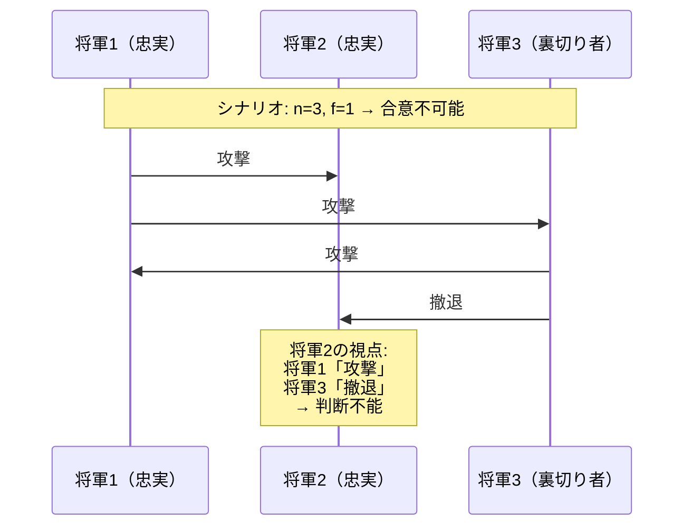

将軍2の視点では、将軍1から「攻撃」、将軍3から「撤退」というメッセージを受け取る。2対1の多数決をとろうにも、自分を含めて「攻撃」が2票（将軍1と自分）にならない限り判断できず、さらに将軍3が裏切り者であるという情報も持っていない。$n = 3$ では $3f + 1 = 4$ を満たさないため、プロトコルが正しく機能しない。

### 口頭メッセージと署名付きメッセージ

Lamportらは二つのモデルを区別した。

1. **口頭メッセージ**（Oral Messages）: メッセージの転送時に内容を改ざんできる。この場合、$3f + 1$ が厳密な下界となる。
2. **署名付きメッセージ**（Signed Messages）: 暗号署名により改ざんを検出できる。この場合、$2f + 1$ で十分となる場合がある。ただし、暗号署名のコストと鍵管理の複雑さが加わる。

現代のBFTプロトコルの多くは署名付きメッセージモデルを採用しつつ、$3f + 1$ のノード数を前提としている。これは、署名の検証だけでなく、プロトコルの活性（liveness）を保証するためにもクォーラム（quorum）サイズとして $2f + 1$ 以上の応答が必要になるためである。

### クォーラムの交差性

BFTプロトコルにおけるクォーラムサイズは $\lceil \frac{2n + 1}{3} \rceil$（おおよそ $2f + 1$）である。この設計の鍵は**クォーラム交差性**（quorum intersection）にある。

任意の2つのクォーラム $Q_1$ と $Q_2$ の共通部分には、少なくとも $f + 1$ 個のノードが含まれる。ビザンチンノードが最大 $f$ 個であることから、共通部分には**必ず1つ以上の正常ノード**が含まれることが保証される。これにより、矛盾する決定が行われることを防止できる。

$$|Q_1 \cap Q_2| \geq 2(2f + 1) - (3f + 1) = f + 1$$

## 3. PBFT（Practical Byzantine Fault Tolerance）

### 背景と動機

1999年、Miguel CastroとBarbara Liskovは論文「Practical Byzantine Fault Tolerance」を発表した。それ以前のBFTプロトコル（例えばLamportのオリジナルアルゴリズム）は理論的には正しいものの、**指数的な通信コスト**を持ち、実用的ではなかった。

PBFTの画期的な点は、通信複雑度を**多項式オーダー**に削減し、実際のシステムで動作可能なBFTプロトコルを初めて提示したことにある。PBFTは以下の性質を持つ。

- **安全性（Safety）**: 全ての正常ノードが同じリクエスト列に合意する（非同期ネットワークでも保証）
- **活性（Liveness）**: 最終的に同期的になるネットワーク（partial synchrony）の下で、リクエストは最終的に処理される
- **耐障害性**: $n = 3f + 1$ 個のノードで $f$ 個のビザンチン障害を許容

### PBFTのアーキテクチャ

PBFTはレプリカの集合で構成され、そのうち一つが**プライマリ**（リーダー）として機能する。クライアントのリクエストはプライマリに送信され、全レプリカで同一の順序で実行される。

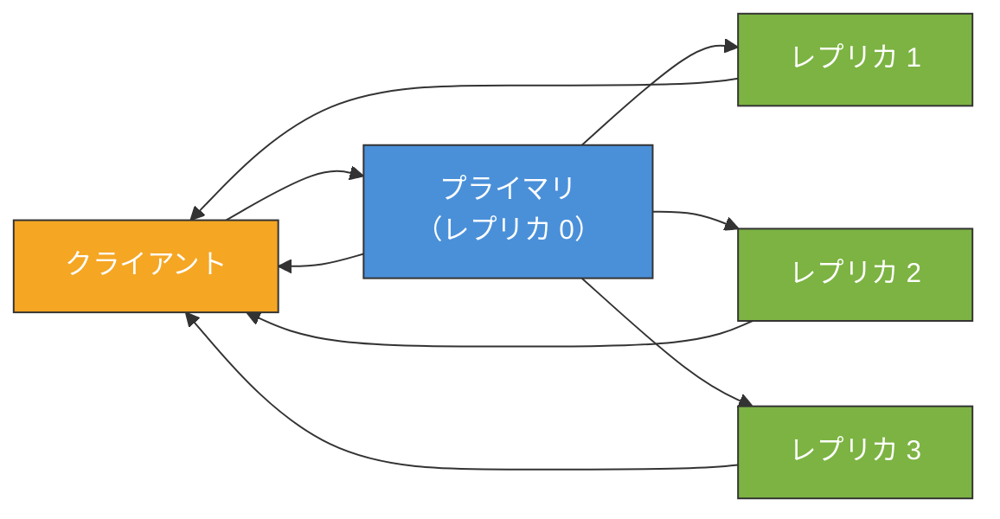

### 通常操作の3フェーズプロトコル

PBFTの通常操作は、**Pre-prepare**、**Prepare**、**Commit** の3フェーズで構成される。

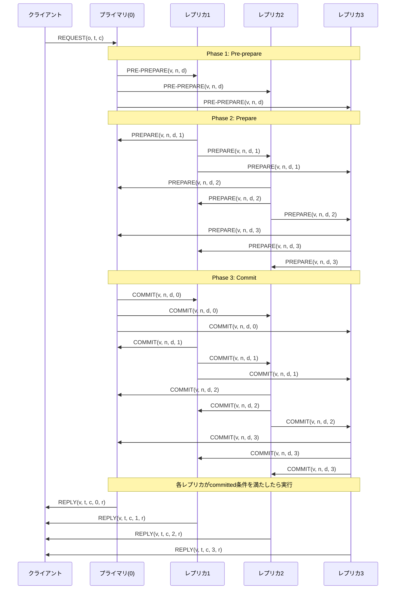

各フェーズの役割を詳しく見ていく。

#### Phase 1: Pre-prepare

プライマリはクライアントのリクエスト $m$ を受け取ると、**シーケンス番号** $n$ を割り当て、`PRE-PREPARE(v, n, d)` メッセージを全バックアップレプリカにブロードキャストする。ここで $v$ はビュー番号、$d$ はリクエストのダイジェスト（ハッシュ値）である。

バックアップレプリカは以下の条件を確認して Pre-prepare を受理する。

- 署名が正しいこと
- 現在のビュー $v$ であること
- 同じビューで同じシーケンス番号 $n$ に対して異なるダイジェストの Pre-prepare を受理していないこと
- シーケンス番号が「ウォーターマーク」（$h < n < H$）の範囲内であること

#### Phase 2: Prepare

Pre-prepare を受理したレプリカは、`PREPARE(v, n, d, i)` メッセージを全レプリカにブロードキャストする。レプリカ $i$ が **prepared** 状態に入る条件は以下である。

- Pre-prepare メッセージ `PRE-PREPARE(v, n, d)` を受理済みであること
- $2f$ 個の異なるレプリカからの `PREPARE(v, n, d, *)` メッセージを受理済みであること（Pre-prepare を含めると $2f + 1$ 個の証拠）

Prepare フェーズの目的は、**同一ビュー内で同じシーケンス番号に対して全正常ノードが同じリクエストに合意する**ことを保証することである。

#### Phase 3: Commit

prepared 状態に入ったレプリカは、`COMMIT(v, n, d, i)` メッセージを全レプリカにブロードキャストする。レプリカ $i$ が **committed-local** 状態に入る条件は以下である。

- prepared 状態であること
- $2f + 1$ 個の異なるレプリカからの `COMMIT(v, n, *, i)` メッセージを受理済みであること

Commit フェーズの目的は、**ビューが変更された場合でも合意が保持される**ことを保証することである。

### 通信複雑度

PBFTの各フェーズにおける通信量は以下のとおりである。

| フェーズ | メッセージ数 | 通信パターン |
|:---|:---|:---|
| Pre-prepare | $O(n)$ | 1対多（プライマリ→全体） |
| Prepare | $O(n^2)$ | 全対全ブロードキャスト |
| Commit | $O(n^2)$ | 全対全ブロードキャスト |
| **合計** | $O(n^2)$ | — |

1回の合意に $O(n^2)$ のメッセージが必要であり、これがPBFTのスケーラビリティの主要なボトルネックとなる。ノード数が増加すると通信量が二次的に増大するため、典型的には数十ノード程度が実用的な上限とされる。

### ビューチェンジ（View Change）

プライマリがビザンチンである場合や障害を起こした場合、**ビューチェンジ**プロトコルによって新しいプライマリに交代する。

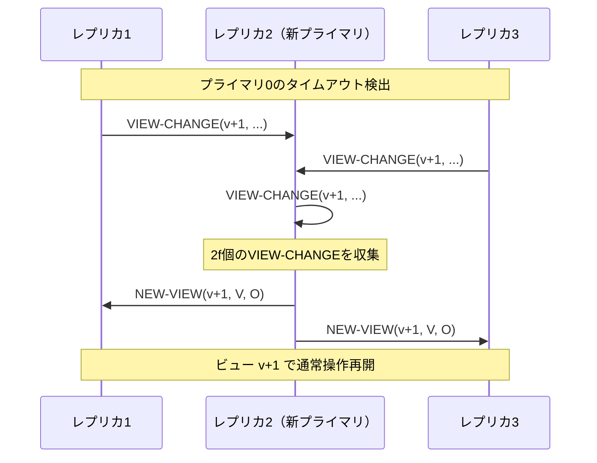

ビューチェンジの手順は以下のとおりである。

1. レプリカがプライマリからのタイムアウトを検出すると、`VIEW-CHANGE` メッセージをブロードキャストする
2. 新しいプライマリ（ビュー番号によって決定的に選ばれる）が $2f$ 個の `VIEW-CHANGE` メッセージを収集する
3. 新プライマリは `NEW-VIEW` メッセージを送信し、前のビューで committed だったリクエストを引き継ぐ
4. 新しいビューで通常操作が再開される

ビューチェンジプロトコルの通信複雑度は $O(n^3)$ であり、PBFTの中で最もコストが高い部分である。これは、ビューチェンジメッセージ内に前のビューの Prepare 証明が含まれ、各レプリカがそれを検証する必要があるためである。

### チェックポイントとガベージコレクション

PBFTでは、ログの無限増大を防ぐために定期的な**チェックポイント**を設ける。安定チェックポイント（stable checkpoint）が確立されると、それ以前のメッセージログを安全に破棄できる。チェックポイントの確立には $2f + 1$ 個のレプリカからの同意が必要である。

## 4. HotStuff

### PBFTの限界とHotStuffの動機

PBFTは実用的なBFTプロトコルとして画期的であったが、以下の限界が存在した。

1. **ビューチェンジの複雑さ**: $O(n^3)$ の通信複雑度
2. **リーダー交代の非効率**: ビューチェンジは「例外処理」として設計されており、頻繁なリーダー交代に適さない
3. **パイプライン化の困難**: 複数フェーズの独立性が低く、処理のパイプライン化が難しい

2019年、Yin、Malkhi、Reiter、Gueta、Abrahamは論文「HotStuff: BFT Consensus with Linearity and Responsiveness」を発表した。HotStuffはこれらの問題を解決するために、以下の特性を実現した。

- **線形通信複雑度**: 各フェーズ $O(n)$、ビューチェンジも $O(n)$
- **楽観的応答性**（Optimistic Responsiveness）: ネットワーク遅延に依存した速度で動作
- **パイプライン化対応**: 連続するプロポーザルを効率的に処理可能

### HotStuffの核心：閾値署名とチェーンド構造

HotStuffの通信複雑度削減の鍵は、**閾値署名**（threshold signature）の活用にある。

PBFTでは各レプリカが個別の署名を全レプリカに送信するため $O(n^2)$ の通信が必要だったが、HotStuffではリーダーが $2f + 1$ 個の部分署名を集約して**1つの閾値署名**（Quorum Certificate, QC）にまとめる。このQCは $O(1)$ サイズで全ノードが検証可能であり、通信パターンが「星型」（スター型）に集約される。

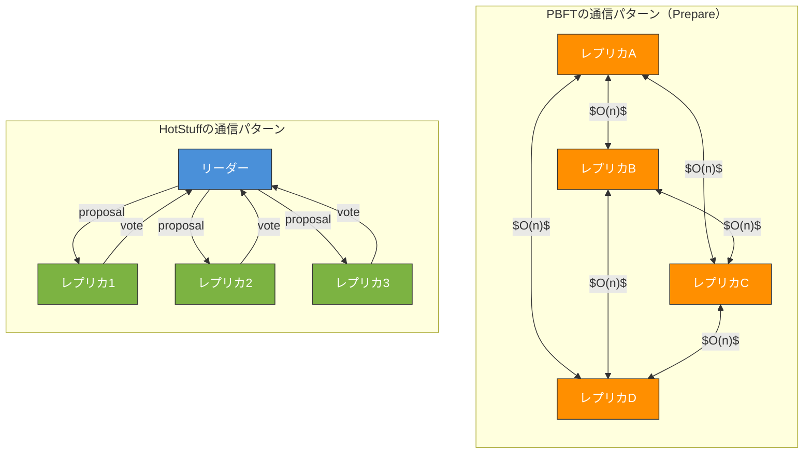

### Basic HotStuffプロトコル

Basic HotStuffは、PBFTの3フェーズに対応する3つの投票フェーズを持つが、各フェーズが**リーダー中心の星型通信**で行われる。

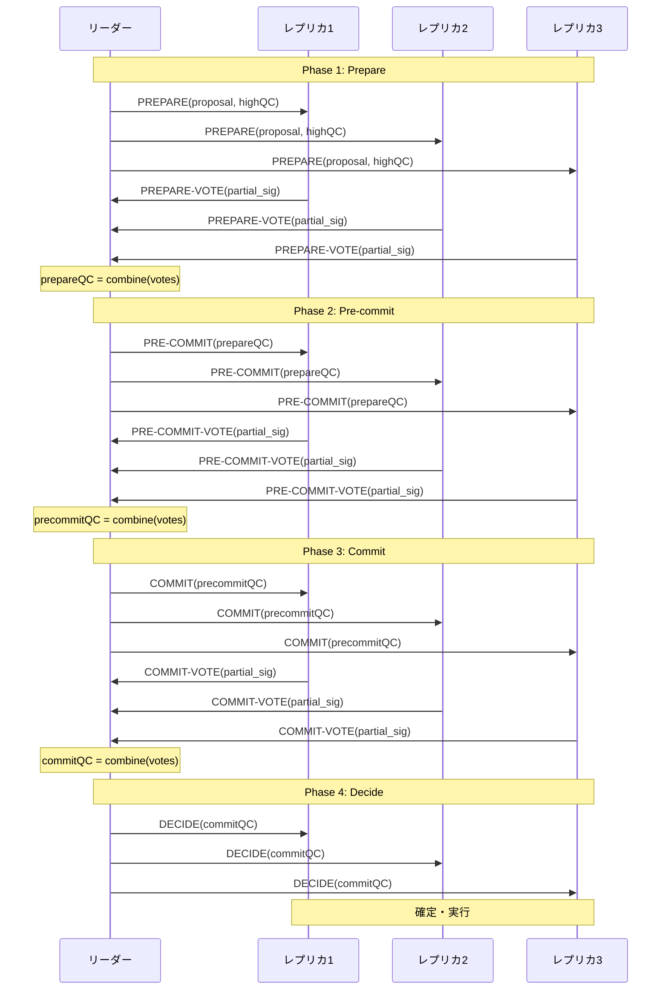

各フェーズの通信は $O(n)$ であり、3フェーズ合計でも $O(n)$ である（リーダーがボトルネックとなるが、各フェーズ $2n$ メッセージ）。

### Chained HotStuff

Basic HotStuffでは各提案に対して3回の投票ラウンドが必要だが、**Chained HotStuff** ではこれをパイプライン化する。ある提案への投票が、**同時に前の提案の次のフェーズを進める**という仕組みである。

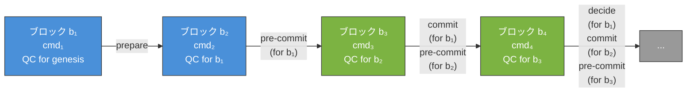

Chained HotStuffでは、ブロック $b_k$ に対するQCが形成されたとき、以下の効果がある。

- $b_k$ に対する **prepare** が完了
- $b_{k-1}$ に対する **pre-commit** が完了
- $b_{k-2}$ に対する **commit** が完了
- $b_{k-3}$ が **decide**（確定）

つまり、3-chain rule が適用され、連続する3つのQCがチェーンを形成したときにブロックが確定する。これにより、1回のQCで新しい提案の処理と過去の提案の進行を同時に実現でき、スループットが大幅に向上する。

### ビューチェンジの単純化

HotStuffの最大の革新の一つは、ビューチェンジが通常操作と**同じメカニズム**で行われることである。

PBFTのビューチェンジでは、レプリカが前のビューの状態（prepared 証明）を新リーダーに送信し、新リーダーがそれを検証・統合する必要があった。これが $O(n^3)$ の複雑さの原因であった。

HotStuffでは、各レプリカが自身の知る**最新のQC**（highest QC）を新リーダーに送るだけでよい。QCは閾値署名により $O(1)$ サイズであり、新リーダーはその中から最新のQCを選択して新しいビューを開始する。この操作は $O(n)$ で完了する。

## 5. Tendermint

### Tendermintの概要

Tendermint は2014年にJae Kwonによって提案されたBFTコンセンサスエンジンであり、**ブロックチェーン向けBFT**の先駆的な実装である。Tendermintは以下の2つのコンポーネントから構成される。

1. **Tendermint Core**: BFTコンセンサスエンジンとP2Pネットワーク層
2. **ABCI（Application BlockChain Interface）**: アプリケーションロジックとコンセンサスエンジンの境界を定義するインターフェース

Tendermintの設計哲学は、コンセンサスとアプリケーションロジックの**分離**にある。ABCIを介して任意のアプリケーション（スマートコントラクトプラットフォーム、トークンシステムなど）をBFTコンセンサスの上に構築できる。

### Tendermintのコンセンサスプロトコル

Tendermintのコンセンサスは、ラウンドベースのプロトコルであり、各ラウンドは **Propose**、**Prevote**、**Precommit** の3ステップで構成される。

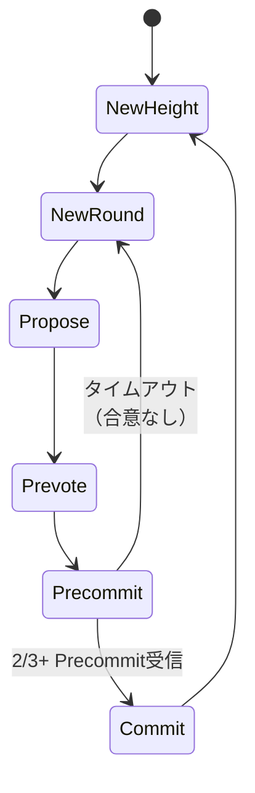

#### ステップ1: Propose

各ラウンドで**決定的に選ばれたプロポーザー**（proposer）がブロック提案を行う。プロポーザーの選出はラウンドロビンや重み付きラウンドロビンで行われる。

#### ステップ2: Prevote

バリデータは提案されたブロックを検証し、有効であれば `PREVOTE` メッセージをブロードキャストする。無効な場合やタイムアウトした場合は `nil` に投票する。

#### ステップ3: Precommit

バリデータが $2f + 1$ 個の Prevote（同一ブロックに対する）を確認すると、そのブロックに対する `PRECOMMIT` メッセージをブロードキャストする。$2f + 1$ 個の Precommit が集まると、ブロックが**確定**（commit）する。

### ロック機構と安全性

Tendermintの安全性保証において重要なのが**ロック機構**である。バリデータは、あるブロックに対して $2f + 1$ の Prevote を確認した時点で、そのブロックに**ロック**される。ロックされたバリデータは、より新しいラウンドでロックが解除されるまで、ロックされたブロック以外には Prevote しない。

この機構により、2つの異なるブロックが同じ高さで確定する（フォークが発生する）ことを防止する。

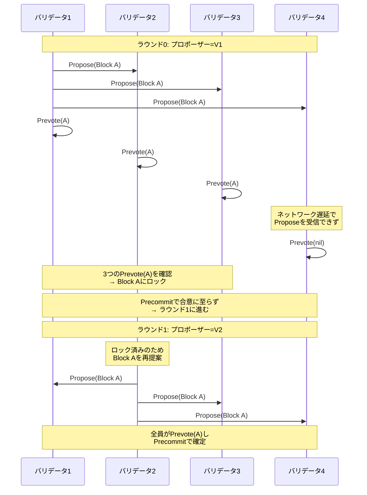

### TendermintとPBFTの差異

TendermintはPBFTから着想を得ているが、いくつかの重要な相違点がある。

| 観点 | PBFT | Tendermint |
|:---|:---|:---|
| 対象 | 汎用的なBFTレプリケーション | ブロックチェーン（ブロック単位の合意） |
| 通信パターン | 全対全（$O(n^2)$） | ゴシッププロトコル + 星型 |
| リーダー交代 | 障害時のみ（View Change） | 毎ラウンド交代 |
| 確定性 | 即座に確定 | 即座に確定（確率的ファイナリティではない） |
| ロック機構 | Prepared 証明 | Polka（$2/3+$ Prevote） |
| クライアントインタラクション | $f + 1$ 個の一致する応答で受理 | ブロックにトランザクションが含まれる |

### Cosmos SDKとTendermint

Tendermintは **Cosmos** エコシステムの中核を構成するコンセンサスエンジンとして広く採用されている。Cosmos SDKはTendermint（現CometBFT）の上にアプリケーション固有のブロックチェーンを構築するためのフレームワークを提供する。

ABCIによる分離のおかげで、開発者はコンセンサスの詳細を意識することなく、アプリケーションロジックに集中できる。これは「**Application-Specific Blockchain**」（アプリケーション固有ブロックチェーン）というパラダイムの基盤となっている。

## 6. CFTとBFTの比較

### CFT（Crash Fault Tolerance）の代表例

CFTプロトコルの代表例として、Paxos、Raft、ZAB（ZooKeeperが使用）がある。これらは**クラッシュ障害のみ**を想定し、ノードが悪意を持つことはないと仮定する。

### 本質的な違い

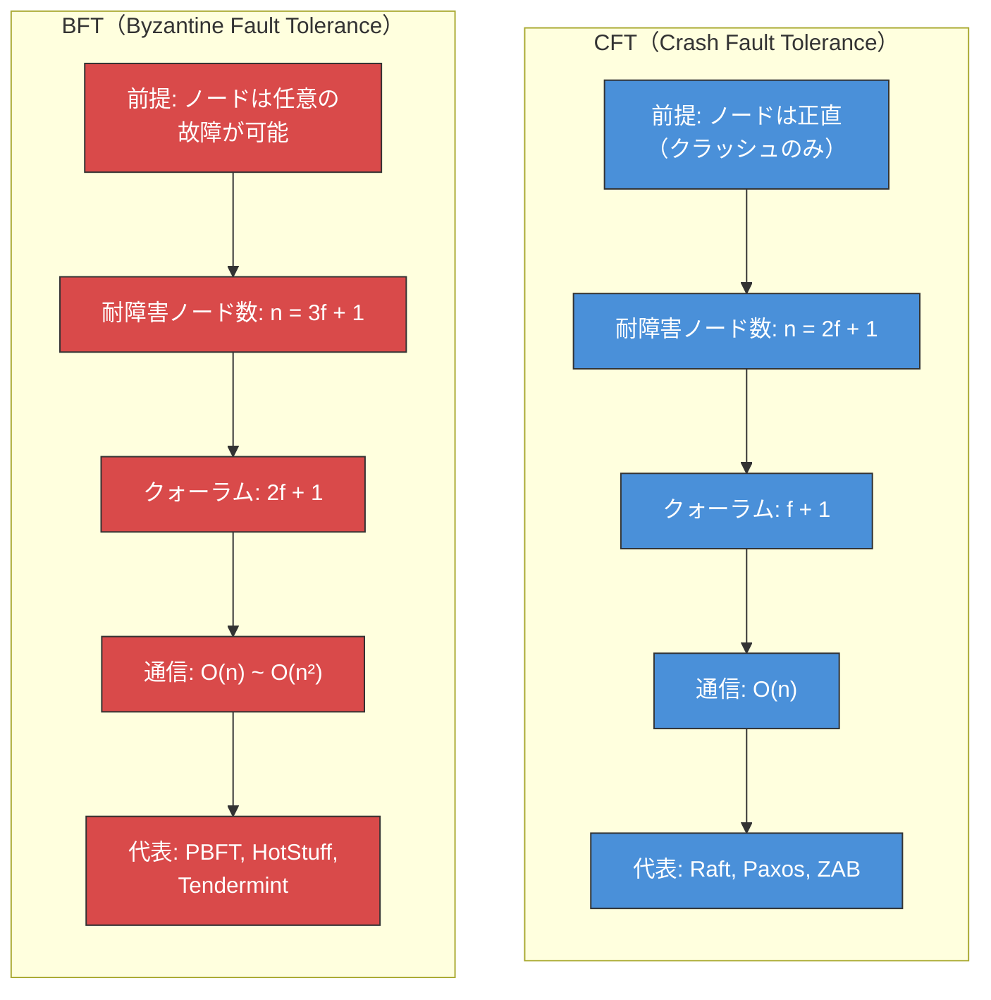

### 詳細比較表

| 項目 | CFT（Raft/Paxos） | BFT（PBFT） | BFT（HotStuff） |
|:---|:---|:---|:---|
| 障害モデル | クラッシュのみ | ビザンチン | ビザンチン |
| 必要ノード数（$f$ 障害許容） | $2f + 1$ | $3f + 1$ | $3f + 1$ |
| 通信複雑度（通常操作） | $O(n)$ | $O(n^2)$ | $O(n)$ |
| 通信複雑度（リーダー交代） | $O(n)$ | $O(n^3)$ | $O(n)$ |
| リーダーの信頼 | 信頼される | 検証される | 検証される |
| 暗号要件 | なし〜最小限 | デジタル署名、MAC | 閾値署名 |
| 典型的なスループット | 数万〜数十万 TPS | 数千〜数万 TPS | 数千〜数万 TPS |
| 典型的なレイテンシ | ミリ秒〜 | 数十ミリ秒〜 | 数十ミリ秒〜 |
| ユースケース | 信頼できる環境の分散システム | 信頼できない環境 | 大規模BFTシステム |

### いつCFT、いつBFTを選ぶべきか

**CFTが適切な場合**:
- データセンター内の分散システム（etcd、ZooKeeper、CockroachDB）
- 運営者が全ノードを管理・信頼している環境
- パフォーマンスが最優先で、ビザンチン障害のリスクが極めて低い場合

**BFTが必要な場合**:
- ブロックチェーンやDLT（分散台帳技術）: 参加者を信頼できない環境
- マルチテナント環境: 異なる組織が運営するノードが協調する場合
- 高い安全性が要求されるシステム: 航空、宇宙、金融の一部のシステム
- サプライチェーン管理: 複数企業がデータの正当性を相互に検証する場合

## 7. ブロックチェーンとの関係

### ビザンチン障害とブロックチェーンの深い結びつき

ブロックチェーンは本質的に「**信頼できない参加者間でのコンセンサス**」を実現する技術であり、ビザンチン障害耐性はその理論的基盤を提供する。

Bitcoin（2008年）の登場以前、BFTプロトコルは「参加者が既知で固定」（permissioned設定）であることを前提としていた。Bitcoinの画期的な点は、**Proof of Work**（PoW）により、参加者が匿名かつ動的に参加できる環境（permissionless設定）でのビザンチン障害耐性を（確率的に）実現したことである。

### コンセンサスメカニズムの分類

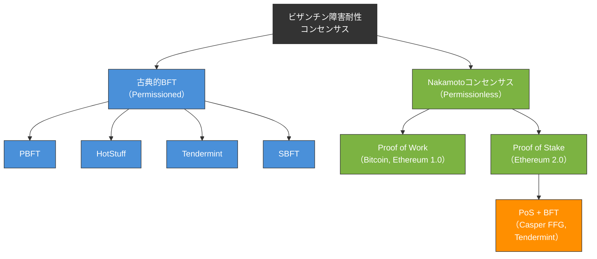

### ファイナリティの種類

| ファイナリティ | メカニズム | 確定の性質 | 例 |
|:---|:---|:---|:---|
| **確率的ファイナリティ** | PoW, PoS（longest chain） | 確認数が増えるほど覆る確率が指数的に減少 | Bitcoin, Ethereum (PoW) |
| **即時的ファイナリティ** | PBFT, Tendermint, HotStuff | 一度確定したら覆らない | Cosmos, Hyperledger Fabric |
| **経済的ファイナリティ** | PoS + Slashing | 覆すには経済的ペナルティが発生 | Ethereum 2.0 (Casper FFG) |

即時的ファイナリティはBFTプロトコルの大きな利点であるが、ネットワーク分断時にはブロック生成が停止するというトレードオフがある。一方、確率的ファイナリティを持つシステムは分断時にもブロック生成を継続できるが、フォークが発生する可能性がある。

### 主要なブロックチェーンプラットフォームとBFT

- **Hyperledger Fabric**: 初期はPBFTベース、後にRaftベースのOrdering Serviceも追加（CFTとBFTの選択可能）
- **Cosmos / Tendermint**: TendermintコンセンサスによるBFT
- **Ethereum 2.0**: Casper FFG（PoSベースのBFT finality gadget）
- **Diem（旧Libra）**: HotStuffベースのDiemBFT
- **Algorand**: Byzantine Agreement（BA*）によるランダム化BFT
- **Solana**: Tower BFT（PBFTの変形 + Proof of History）

## 8. パフォーマンスと制約

### スケーラビリティの壁

BFTプロトコルのスケーラビリティは、主に以下の要因によって制限される。

#### 通信複雑度

| プロトコル | 通常操作 | リーダー交代 |
|:---|:---|:---|
| PBFT | $O(n^2)$ | $O(n^3)$ |
| HotStuff | $O(n)$ | $O(n)$ |
| Tendermint | $O(n^2)$（ゴシップ） | $O(n)$ |

HotStuffは通信複雑度では優位だが、閾値署名の計算コストが加わるため、ノード数が少ない場合にはPBFTの方が高速になることもある。

#### 暗号演算のオーバーヘッド

BFTプロトコルでは、各メッセージに署名を付与し、受信側で検証する必要がある。暗号演算は計算コストが高く、特に閾値署名のような高度な暗号プリミティブはさらにコストが増大する。

```
// Simplified cost model for BFT consensus per decision
// n = number of nodes, f = max Byzantine faults

// PBFT
pbft_messages = O(n^2)
pbft_signatures = O(n^2)  // each message signed individually
pbft_verifications = O(n^2)  // each node verifies O(n) messages

// HotStuff
hotstuff_messages = O(n)
hotstuff_partial_sigs = O(n)  // each replica sends one partial sig
hotstuff_threshold_combine = O(1)  // leader combines into one QC
hotstuff_qc_verify = O(1)  // any node verifies QC in constant time
```

#### レイテンシ

BFTプロトコルは複数ラウンドの通信を必要とするため、レイテンシが増加する。

- **PBFT**: 3ラウンド（Pre-prepare → Prepare → Commit）
- **HotStuff（Basic）**: 3ラウンド（Prepare → Pre-commit → Commit → Decide）
- **Tendermint**: 2〜3ラウンド（Propose → Prevote → Precommit）

WAN（広域ネットワーク）環境では、1ラウンドのRTT（Round Trip Time）が数十〜数百ミリ秒に達するため、合計レイテンシは数百ミリ秒から秒単位になりうる。

### ベンチマーク実績

学術論文やプロジェクトで報告されている代表的なベンチマーク結果を示す。ただし、条件（ネットワーク環境、ペイロードサイズ、暗号ライブラリ）が異なるため、直接比較には注意が必要である。

| プロトコル | ノード数 | スループット | レイテンシ | 環境 |
|:---|:---|:---|:---|:---|
| PBFT（Castro & Liskov 1999） | 4 | ~3,000 ops/s | ~3 ms | LAN |
| HotStuff（2019論文） | 128 | ~数万 ops/s | 数百 ms | WAN |
| Tendermint（Cosmos Hub） | ~150 | ~数千 TPS | ~6 s | WAN |
| DiemBFT（Diem） | ~100 | ~数万 TPS | <1 s | WAN |

### 制約と課題

1. **ノード数の上限**: ほとんどのBFTプロトコルは数百ノードが実用的な上限であり、数千〜数万ノードへのスケーリングは困難
2. **ネットワーク帯域**: メッセージサイズが大きい場合（大きなブロックなど）、帯域がボトルネックとなる
3. **リーダーへの負荷集中**: HotStuffのようなリーダーベースのプロトコルでは、リーダーに通信・計算負荷が集中する
4. **部分同期の仮定**: 多くのBFTプロトコルは部分同期モデル（eventually synchronous）を仮定しており、長時間の非同期状態では活性が失われる

## 9. 応用と将来

### 現在の応用領域

#### ブロックチェーンとDLT

BFTコンセンサスの最も広範な応用はブロックチェーン分野である。特にPermissionedブロックチェーン（Hyperledger Fabric、Corda、Quorum）や、PoSベースのPermissionlessブロックチェーン（Cosmos、Ethereum 2.0）において、BFTは不可欠な要素技術となっている。

#### 分散データベース

CockroachDB、YugabyteDB、TiDBなどの分散NewSQLデータベースは主にCFT（Raft）を使用しているが、マルチクラウド・マルチテナント環境への展開に伴い、BFTの導入を検討する動きもある。Google Spannerのような地理分散データベースにおいても、より強力な障害耐性の必要性が議論されている。

#### クラウドコンピューティング

クラウド環境では、異なるテナントのVMが同一ホスト上で動作する。サイドチャネル攻撃やハイパーバイザの脆弱性を考慮すると、クラウドネイティブな分散システムにおけるBFTの価値は高まりつつある。

### 最新の研究動向

#### DAG（有向非巡回グラフ）ベースのBFT

近年、DAG構造を利用したBFTプロトコルが注目を集めている。**Narwhal & Tusk**（2022年）、**Bullshark**（2022年）、**DAG-Rider**（2021年）などが代表的な研究である。

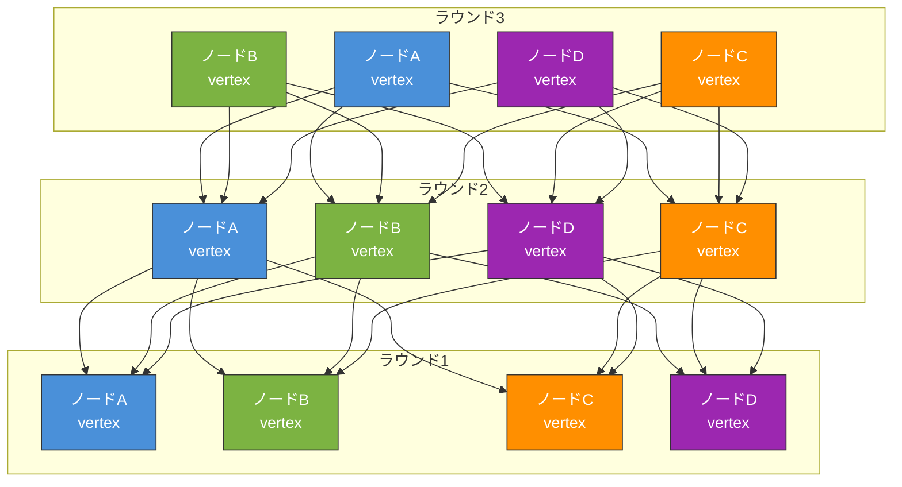

DAGベースのアプローチでは、トランザクションの順序付け（ordering）とデータの可用性（data availability）を分離する。各ノードが独立にvertexを生成してDAGに追加し、DAGの構造からコンセンサスを導出する。これにより以下の利点が得られる。

- **リーダーボトルネックの緩和**: 全ノードが並行してvertexを提案可能
- **高スループット**: データ伝播とコンセンサスの分離により、帯域を効率的に利用
- **ゼロメッセージオーバーヘッドのコンセンサス**: DAGの構造自体がコンセンサスの「投票」を暗黙的に表現

Sui、Aptos（旧Diem/Libra）などの次世代ブロックチェーンでは、DAGベースのプロトコルが採用・検討されている。

#### Accountable BFT

従来のBFTプロトコルは障害を**許容**するが、**誰が障害を引き起こしたかを特定する**機構は持たなかった。**Accountable BFT**（例: Polygraph, Casper FFGのslashing）は、ビザンチンノードの行為を暗号学的に証明し、ペナルティを科すことを可能にする。

これは特にProof of Stakeブロックチェーンにおいて重要であり、不正行為者のステーク（預託金）を没収することで、経済的インセンティブによるセキュリティを実現する。

#### 楽観的BFTと投機的実行

**Zyzzyva**（2007年）が先駆的な例であるが、障害がない場合に1ラウンドで合意を確定する「楽観的パス」と、障害発生時の「通常パス」を使い分けるアプローチがある。実際の環境ではビザンチン障害の発生頻度は低いため、楽観的パスが支配的に利用され、平均的なパフォーマンスが向上する。

#### BFT + TEE（Trusted Execution Environment）

Intel SGXやARM TrustZoneなどのTEE（信頼実行環境）とBFTを組み合わせるアプローチも研究されている。TEEにより「信頼できるコンポーネント」を各ノードに導入し、ビザンチン障害の一部をクラッシュ障害に「格下げ」することで、必要なノード数を $3f + 1$ から $2f + 1$ に削減できる可能性がある（例: **MinBFT**、**CheapBFT**）。ただし、TEE自体の脆弱性（Spectreなどのサイドチャネル攻撃）には注意が必要である。

### 未解決の課題

1. **大規模スケーリング**: 数万ノード以上でのBFTコンセンサスの実用化はまだ達成されていない。シャーディングやレイヤー2ソリューションとの組み合わせが模索されている。

2. **動的メンバーシップ**: ノードの参加・離脱が頻繁に発生する環境でのBFTは、理論的にも実装的にも困難が残る。

3. **非同期BFT**: 部分同期ではなく**完全な非同期**環境でのBFTは可能ではあるが（例: HoneyBadgerBFT）、実用的なパフォーマンスの達成が課題である。

4. **量子耐性**: 量子コンピュータが暗号署名を破る可能性を考慮し、量子耐性のある暗号プリミティブを組み込んだBFTプロトコルの設計が将来的に必要となる。

5. **形式検証**: BFTプロトコルの正しさは数学的証明に基づくが、実装レベルでのバグが安全性を損なう事例がある。TLA+やIvy、Coqなどを用いた形式検証の適用が進められている。

## まとめ

ビザンチン将軍問題は、分散システムにおける最も根本的かつ困難な問題の一つであり、その解決策であるBFTコンセンサスは、40年以上にわたる研究と進化を経て、今日のブロックチェーン技術の理論的基盤を形成している。

PBFTは「実用的なBFT」の道を開き、HotStuffは通信複雑度の壁を打ち破り、Tendermintはブロックチェーンとの架け橋を構築した。そして現在、DAGベースのプロトコルやAccountable BFTなどの新しいアプローチが、さらなるスケーラビリティと安全性の向上を追求している。

BFTコンセンサスを理解することは、現代の分散システムとブロックチェーン技術の本質を理解することに他ならない。信頼できない環境でいかにして信頼を構築するか—この永遠の問いに対する回答が、BFTコンセンサスの研究を前進させ続けている。

## 参考文献

- Lamport, L., Shostak, R., & Pease, M. (1982). "The Byzantine Generals Problem." *ACM Transactions on Programming Languages and Systems*, 4(3), 382–401.
- Castro, M. & Liskov, B. (1999). "Practical Byzantine Fault Tolerance." *Proceedings of the Third Symposium on Operating Systems Design and Implementation (OSDI)*.
- Yin, M., Malkhi, D., Reiter, M.K., Gueta, G.G., & Abraham, I. (2019). "HotStuff: BFT Consensus with Linearity and Responsiveness." *Proceedings of the 2019 ACM Symposium on Principles of Distributed Computing (PODC)*.
- Buchman, E. (2016). "Tendermint: Byzantine Fault Tolerance in the Age of Blockchains." *Master's thesis, University of Guelph*.
- Danezis, G., Kokoris-Kogias, E., Sonnino, A., & Spiegelman, A. (2022). "Narwhal and Tusk: A DAG-based Mempool and Efficient BFT Consensus." *Proceedings of the Seventeenth European Conference on Computer Systems (EuroSys)*.
- Fischer, M.J., Lynch, N.A., & Paterson, M.S. (1985). "Impossibility of Distributed Consensus with One Faulty Process." *Journal of the ACM*, 32(2), 374–382.
