# キャッシュとDBの一貫性問題（Double-Write, Race Condition, 分散環境）

## 1. 概要：なぜキャッシュとDBの一貫性は難しいのか

キャッシュは現代のバックエンドシステムにおいてレイテンシの低減とスループットの向上に不可欠な技術である。しかし、キャッシュを導入した瞬間から、システムは**同じデータの複製を2箇所に持つ**ことになる。この「2箇所に存在するデータ」をいかに一貫させるかが、キャッシュとDBの一貫性問題の本質である。

一貫性問題が発生する根本的な理由は以下の3つに集約される。

1. **二重書き込みの原子性の欠如**: キャッシュの更新とDBの更新は2つの独立した操作であり、それらをアトミックに実行する仕組みが標準では存在しない
2. **並行アクセスによる競合**: 複数のリクエストが同時にデータを読み書きすると、操作の順序が入れ替わり、古いデータがキャッシュに残る可能性がある
3. **部分障害**: ネットワーク障害やプロセスのクラッシュにより、2つの操作の片方だけが成功する場合がある

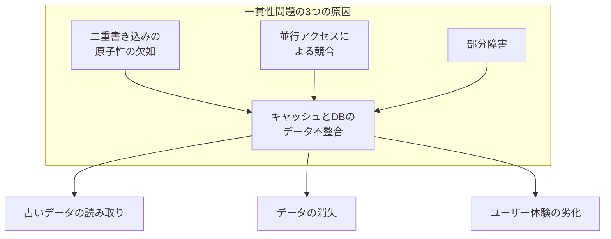
```mermaid
graph TD
    subgraph "一貫性問題の3つの原因"
        A["二重書き込みの<br>原子性の欠如"] --> D["キャッシュとDBの<br>データ不整合"]
        B["並行アクセスに<br>よる競合"] --> D
        C["部分障害"] --> D
    end
    D --> E["古いデータの読み取り"]
    D --> F["データの消失"]
    D --> G["ユーザー体験の劣化"]
```

これらの問題は「キャッシュを使わなければ発生しない」という意味で、キャッシュ導入のトレードオフそのものである。本記事では、各キャッシュパターンにおける一貫性問題の具体的な発生メカニズムを解説し、Race Condition やDouble-Write 問題の詳細な分析、分散環境での対策、そして実運用で採用されている実装パターンを包括的に論じる。

::: tip 前提知識
本記事は、キャッシュパターン（Cache-Aside, Write-Through, Write-Behind）の基本的な動作を理解していることを前提とする。各パターンの基本については「キャッシュパターン — Cache-Aside, Write-Through, Write-Behind」の記事を参照されたい。
:::

## 2. 各キャッシュパターンにおける一貫性問題

### 2.1 Cache-Aside パターンの一貫性問題

Cache-Aside（Lazy Loading）は最も広く使われるキャッシュパターンであるが、更新操作において本質的な一貫性の課題を抱えている。

#### 更新時の基本戦略

Cache-Aside パターンでデータを更新する場合、以下の2つの戦略がよく議論される。

1. **Invalidate（キャッシュ削除）**: DBを更新した後、キャッシュのエントリを削除する
2. **Update（キャッシュ更新）**: DBを更新した後、キャッシュのエントリも新しい値で更新する

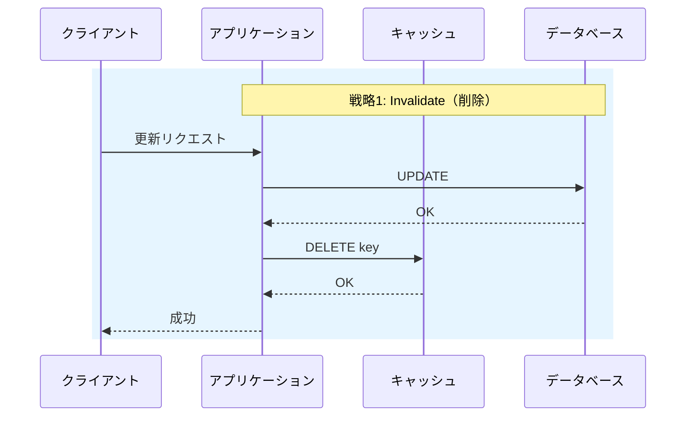
```mermaid
sequenceDiagram
    participant C as クライアント
    participant A as アプリケーション
    participant Ca as キャッシュ
    participant DB as データベース

    rect rgb(230, 245, 255)
    Note over A,DB: 戦略1: Invalidate（削除）
    C->>A: 更新リクエスト
    A->>DB: UPDATE
    DB-->>A: OK
    A->>Ca: DELETE key
    Ca-->>A: OK
    A-->>C: 成功
    end
```

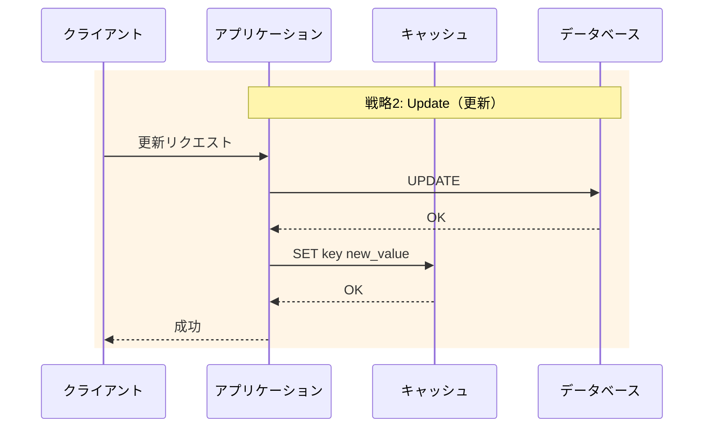
```mermaid
sequenceDiagram
    participant C as クライアント
    participant A as アプリケーション
    participant Ca as キャッシュ
    participant DB as データベース

    rect rgb(255, 245, 230)
    Note over A,DB: 戦略2: Update（更新）
    C->>A: 更新リクエスト
    A->>DB: UPDATE
    DB-->>A: OK
    A->>Ca: SET key new_value
    Ca-->>A: OK
    A-->>C: 成功
    end
```

一般に**Invalidate戦略のほうが安全**とされる。その理由を以下で詳しく見ていく。

#### Invalidate 戦略の問題

Invalidate 戦略であっても、DBの更新とキャッシュの削除の間にはタイムウィンドウが存在する。

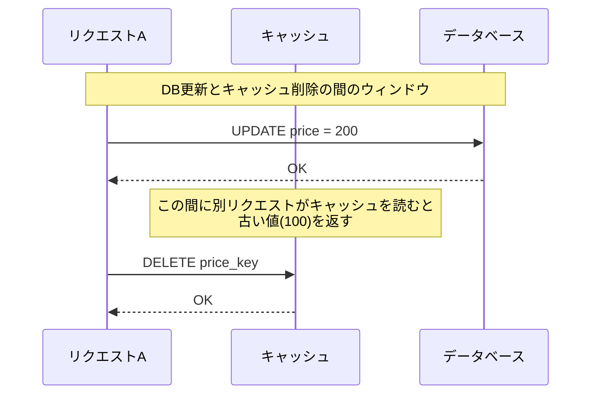
```mermaid
sequenceDiagram
    participant A as リクエストA
    participant Ca as キャッシュ
    participant DB as データベース

    Note over A,DB: DB更新とキャッシュ削除の間のウィンドウ
    A->>DB: UPDATE price = 200
    DB-->>A: OK
    Note over Ca: この間に別リクエストがキャッシュを読むと<br>古い値(100)を返す
    A->>Ca: DELETE price_key
    Ca-->>A: OK
```

このタイムウィンドウは通常数ミリ秒から数十ミリ秒程度であり、実用上は許容されることが多い。しかし、後述するRace Conditionと組み合わさると深刻な問題となる。

#### Update 戦略が危険な理由

Update 戦略（キャッシュの値を新しい値で上書きする）は、**計算コストの高いデータの場合に無駄な再計算を避けられる**というメリットがあるが、Race Conditionに対して脆弱である。2つの書き込みが並行して発生した場合、DBとキャッシュの値が逆転するリスクがある。この問題は第3章で詳しく分析する。

### 2.2 Write-Through パターンの一貫性問題

Write-Through パターンでは、キャッシュへの書き込みとDBへの書き込みが同期的に行われる。アプリケーションはキャッシュに対してのみ書き込み、キャッシュライブラリ（またはプロキシ）がDBへの書き込みも同時に行う。

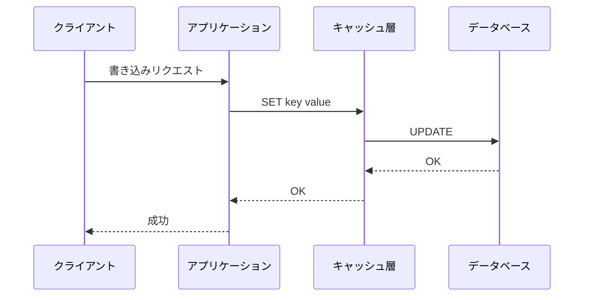
```mermaid
sequenceDiagram
    participant C as クライアント
    participant A as アプリケーション
    participant Ca as キャッシュ層
    participant DB as データベース

    C->>A: 書き込みリクエスト
    A->>Ca: SET key value
    Ca->>DB: UPDATE
    DB-->>Ca: OK
    Ca-->>A: OK
    A-->>C: 成功
```

Write-Through は読み取り時にキャッシュとDBの一貫性が保たれやすいが、以下の問題がある。

- **書き込みレイテンシの増大**: 毎回DBへの書き込みを待つため、書き込みが遅くなる
- **部分障害**: キャッシュへの書き込みは成功したがDBへの書き込みが失敗した場合、あるいはその逆のケースで不整合が生じる
- **キャッシュ層がSPOFになるリスク**: キャッシュ層を経由するため、キャッシュ層の障害が書き込み全体に影響する

部分障害への対策として、キャッシュ層の内部でDBへの書き込みの成否に応じてキャッシュの値をロールバックする仕組みが必要となる。

### 2.3 Write-Behind（Write-Back）パターンの一貫性問題

Write-Behind パターンでは、キャッシュへの書き込みを即座に完了させ、DBへの書き込みは非同期で後から行う。書き込みレイテンシを大幅に低減できるが、一貫性の観点では最もリスクが高いパターンである。

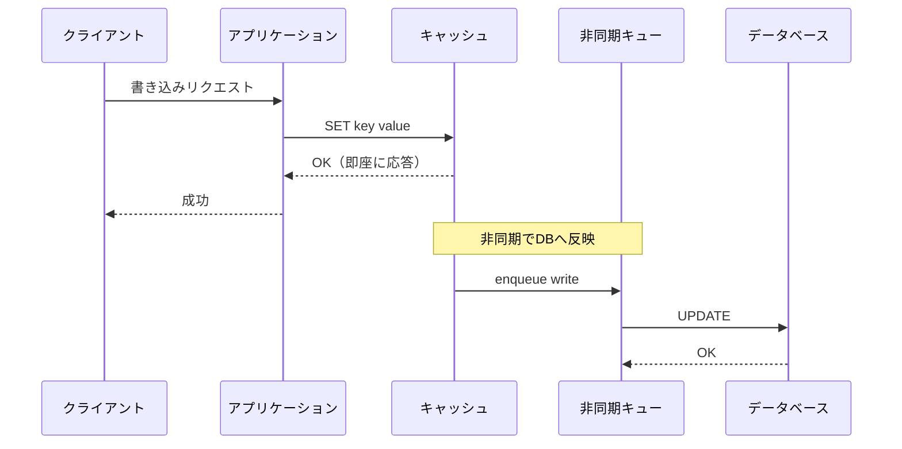
```mermaid
sequenceDiagram
    participant C as クライアント
    participant A as アプリケーション
    participant Ca as キャッシュ
    participant Q as 非同期キュー
    participant DB as データベース

    C->>A: 書き込みリクエスト
    A->>Ca: SET key value
    Ca-->>A: OK（即座に応答）
    A-->>C: 成功
    Note over Ca,Q: 非同期でDBへ反映
    Ca->>Q: enqueue write
    Q->>DB: UPDATE
    DB-->>Q: OK
```

Write-Behind の一貫性リスクは以下の通りである。

- **データ消失**: キャッシュに書き込まれたがDBへの反映前にキャッシュノードがクラッシュすると、データが失われる
- **読み取り時の不整合**: DBに直接アクセスするバッチ処理や分析クエリが、キャッシュにのみ存在する最新データを見落とす
- **書き込み順序の逆転**: 非同期キューの処理順序が保証されない場合、古い値が新しい値を上書きする可能性がある
- **障害時のリカバリの複雑さ**: クラッシュ後のリカバリ時に、どの書き込みがDBに反映済みかを特定する必要がある

::: warning Write-Behind の適用範囲
Write-Behind はデータ消失のリスクが伴うため、一時的な集計データや、最悪消失しても再計算可能なデータに限定して使うのが安全である。金融取引や注文データなど、消失が許されないデータには不向きである。
:::

### 2.4 各パターンの一貫性リスク比較

| パターン | 読み取り一貫性 | 書き込み一貫性 | データ消失リスク | 実装の複雑さ |
|---|---|---|---|---|
| Cache-Aside + Invalidate | 短いウィンドウあり | 中 | 低い | 低い |
| Cache-Aside + Update | Race Condition に弱い | 中 | 低い | 低い |
| Write-Through | 高い | 部分障害リスク | 低い | 中 |
| Write-Behind | 高い（キャッシュ経由のみ） | 非同期で遅延あり | **高い** | 高い |

## 3. Race Condition の具体例と対策

Race Condition（競合状態）は、キャッシュとDBの一貫性問題において最も理解が難しく、かつ最も頻繁に問題を引き起こす原因の一つである。本章では代表的なシナリオを具体的なタイムラインで示し、それぞれの対策を論じる。

### 3.1 Read-Write Race（Cache-Aside + Invalidate）

このシナリオは、Cache-Aside + Invalidate 戦略において、読み取りリクエストと書き込みリクエストが同時に発生した場合に起きる。一般的に最も広く知られた Race Condition である。

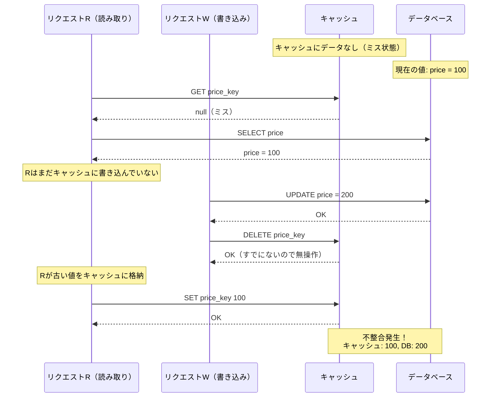
```mermaid
sequenceDiagram
    participant R as リクエストR（読み取り）
    participant W as リクエストW（書き込み）
    participant Ca as キャッシュ
    participant DB as データベース

    Note over Ca: キャッシュにデータなし（ミス状態）
    Note over DB: 現在の値: price = 100

    R->>Ca: GET price_key
    Ca-->>R: null（ミス）
    R->>DB: SELECT price
    DB-->>R: price = 100

    Note over R: Rはまだキャッシュに書き込んでいない

    W->>DB: UPDATE price = 200
    DB-->>W: OK
    W->>Ca: DELETE price_key
    Ca-->>W: OK（すでにないので無操作）

    Note over R: Rが古い値をキャッシュに格納
    R->>Ca: SET price_key 100
    Ca-->>R: OK

    Note over Ca,DB: 不整合発生！<br>キャッシュ: 100, DB: 200
```

このシナリオの特徴は以下の通りである。

- リクエストRがDBから値を取得した後、キャッシュに書き込む前に、リクエストWがDBを更新しキャッシュを削除する
- リクエストRがキャッシュに書き込む時点では、Wの削除はすでに完了しているため、**古い値が新たにキャッシュに格納されてしまう**
- TTL が設定されていない場合、この不整合は永続する

::: danger 発生頻度の落とし穴
この Race Condition は「キャッシュミスの瞬間に書き込みが発生する」必要があるため、発生確率は低いように思える。しかし、トラフィックが高いシステムではキャッシュミスと書き込みが重なる確率は無視できない。また、キャッシュのTTL切れや再起動時には大量のキャッシュミスが同時に発生する（キャッシュスタンピード）ため、この Race Condition の発生確率が跳ね上がる。
:::

#### 対策

**対策1: TTL の設定**

最もシンプルかつ実用的な対策は、キャッシュエントリに必ずTTL（Time To Live）を設定することである。不整合が発生しても、TTL 経過後にキャッシュが自動的に無効化され、次の読み取りでDBから最新値が取得される。

```python
# Set cache with TTL (e.g., 5 minutes)
def cache_aside_read(key):
    value = cache.get(key)
    if value is not None:
        return value
    value = db.query(key)
    cache.set(key, value, ttl=300)  # TTL = 300 seconds
    return value
```

不整合の許容時間（staleness window）をTTL で制御するという考え方であり、完全な一貫性は保証しないが、多くのアプリケーションにとって十分な対策となる。

**対策2: 遅延削除（Delayed Invalidation）**

DB更新後、キャッシュを即座に削除するのではなく、短い遅延を挟んでからもう一度削除する（いわゆる「ダブル削除」）。

```python
def update_with_delayed_invalidation(key, new_value):
    # Step 1: Delete cache first
    cache.delete(key)
    # Step 2: Update DB
    db.update(key, new_value)
    # Step 3: Delete cache again after short delay
    schedule_delayed_task(
        delay_seconds=1,
        task=lambda: cache.delete(key)
    )
```

これにより、ReadリクエストRが古い値をキャッシュに書き込んだとしても、遅延後の2回目の削除で古い値が除去される。ただし、遅延の時間設定が短すぎると効果がなく、長すぎると不整合のウィンドウが広がるというトレードオフがある。

**対策3: キャッシュへの書き込みにロックを使う**

読み取り時のキャッシュ格納にロック（分散ロック）を用いて、書き込み操作との排他制御を行う方法である。

```python
def cache_aside_read_with_lock(key):
    value = cache.get(key)
    if value is not None:
        return value

    # Acquire lock before populating cache
    lock = distributed_lock.acquire(f"cache_fill:{key}", timeout=5)
    if not lock:
        # Failed to acquire lock, read directly from DB
        return db.query(key)

    try:
        # Double-check after acquiring lock
        value = cache.get(key)
        if value is not None:
            return value
        value = db.query(key)
        cache.set(key, value, ttl=300)
        return value
    finally:
        lock.release()
```

この方法はRace Conditionを確実に防止できるが、ロックのオーバーヘッドとデッドロックのリスクが増大する。ホットキー（頻繁にアクセスされるキー）に対してロックを使うと、性能が著しく低下する可能性がある。

### 3.2 Write-Write Race（Cache-Aside + Update）

2つの書き込みリクエストが同時に発生した場合に起きるRace Conditionである。Cache-Aside + Update戦略で顕著に問題となる。

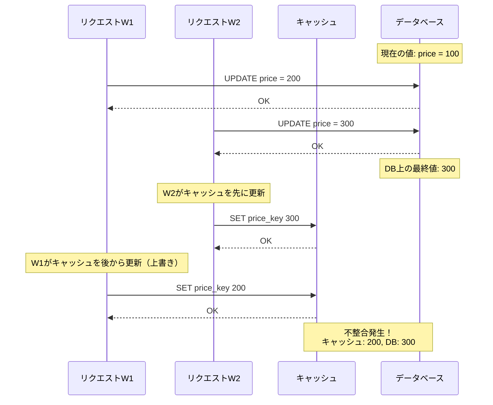
```mermaid
sequenceDiagram
    participant W1 as リクエストW1
    participant W2 as リクエストW2
    participant Ca as キャッシュ
    participant DB as データベース

    Note over DB: 現在の値: price = 100

    W1->>DB: UPDATE price = 200
    DB-->>W1: OK
    W2->>DB: UPDATE price = 300
    DB-->>W2: OK

    Note over DB: DB上の最終値: 300

    Note over W2: W2がキャッシュを先に更新
    W2->>Ca: SET price_key 300
    Ca-->>W2: OK

    Note over W1: W1がキャッシュを後から更新（上書き）
    W1->>Ca: SET price_key 200
    Ca-->>W1: OK

    Note over Ca,DB: 不整合発生！<br>キャッシュ: 200, DB: 300
```

DBへの書き込み順序（W1が先、W2が後）とキャッシュへの書き込み順序（W2が先、W1が後）が逆転してしまい、**キャッシュに古い値が残る**。これがUpdate戦略が危険とされる最大の理由である。

#### 対策

**対策1: Invalidate 戦略への切り替え**

最も効果的な対策は、Update戦略をやめてInvalidate戦略を採用することである。キャッシュを削除するだけであれば、削除の順序が入れ替わっても問題にならない（どちらの削除も同じ結果をもたらす）。

**対策2: バージョニング**

キャッシュのエントリにバージョン番号を付与し、古いバージョンで新しいバージョンを上書きすることを防ぐ。

```python
def update_with_versioning(key, new_value):
    # Use DB's auto-increment version or timestamp
    version = db.update_and_get_version(key, new_value)

    # Only update cache if version is newer
    current = cache.get(key)
    if current is None or current["version"] < version:
        cache.set(key, {"value": new_value, "version": version}, ttl=300)
```

ただし、このバージョンチェック自体もアトミックに行う必要があるため、Redis の Lua スクリプトなどを用いた原子的な操作が求められる。

```lua
-- Redis Lua script: update cache only if version is newer
local current = redis.call('GET', KEYS[1])
if current then
    local current_data = cjson.decode(current)
    local new_version = tonumber(ARGV[2])
    if current_data.version >= new_version then
        return 0  -- skip update, current version is newer or equal
    end
end
redis.call('SET', KEYS[1], ARGV[1], 'EX', ARGV[3])
return 1
```

### 3.3 Read-Update Race（Write-Through）

Write-Through パターンでも、読み取りと書き込みの間でRace Conditionが発生する場合がある。特に、キャッシュ層の内部でDBへの書き込みに時間がかかる場合に顕在化する。

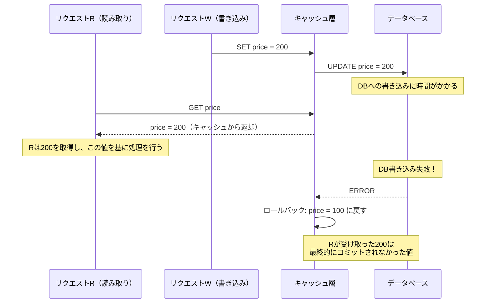
```mermaid
sequenceDiagram
    participant R as リクエストR（読み取り）
    participant W as リクエストW（書き込み）
    participant Ca as キャッシュ層
    participant DB as データベース

    W->>Ca: SET price = 200
    Ca->>DB: UPDATE price = 200
    Note over DB: DBへの書き込みに時間がかかる

    R->>Ca: GET price
    Ca-->>R: price = 200（キャッシュから返却）

    Note over R: Rは200を取得し、この値を基に処理を行う

    Note over DB: DB書き込み失敗！
    DB-->>Ca: ERROR
    Ca->>Ca: ロールバック: price = 100 に戻す

    Note over Ca,DB: Rが受け取った200は<br>最終的にコミットされなかった値
```

この問題は**ダーティリード**に類似しており、コミットされていない値が他のリクエストに見えてしまう。対策としては、Write-Through のキャッシュ層がDBへの書き込み完了まで読み取りをブロックする設計にする方法があるが、レイテンシが増大するトレードオフがある。

## 4. Double-Write 問題

### 4.1 Double-Write 問題とは

Double-Write問題とは、**データの更新時にキャッシュとDBの両方に書き込む必要があり、この2つの書き込みをアトミックに行えない**ことから生じる一貫性の問題の総称である。キャッシュとDBは独立したシステムであり、単一のトランザクションで両方の操作を保証することはできない（2フェーズコミットのような分散トランザクションを導入しない限り）。

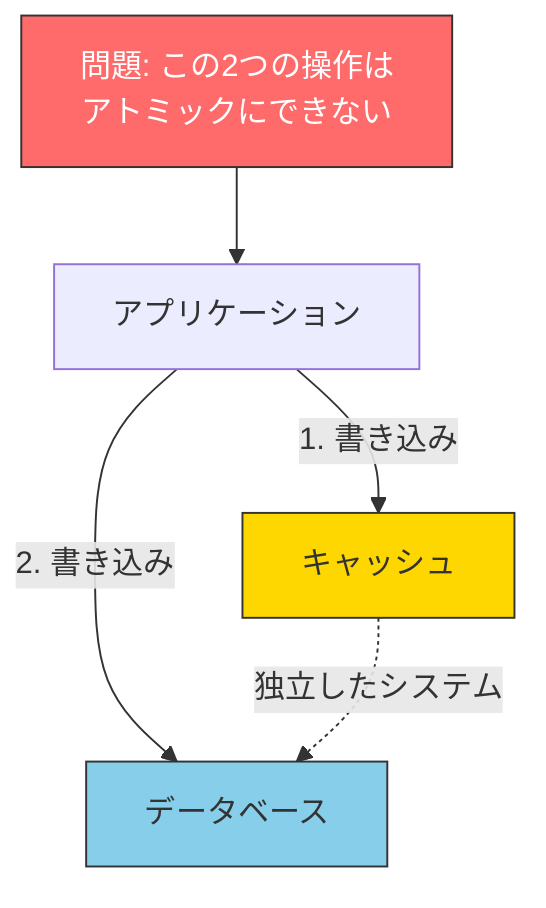
```mermaid
graph TD
    A["アプリケーション"] -->|"1. 書き込み"| B["キャッシュ"]
    A -->|"2. 書き込み"| C["データベース"]

    B -.->|"独立したシステム"| C

    style B fill:#ffd700,stroke:#333
    style C fill:#87ceeb,stroke:#333

    D["問題: この2つの操作は<br>アトミックにできない"] --> A
    style D fill:#ff6b6b,stroke:#333,color:#fff
```

### 4.2 操作順序の選択肢と問題点

データ更新時に、キャッシュの操作とDBの操作をどの順序で行うかによって、障害時の振る舞いが変わる。

#### パターン1: DB更新 → キャッシュ削除（推奨）

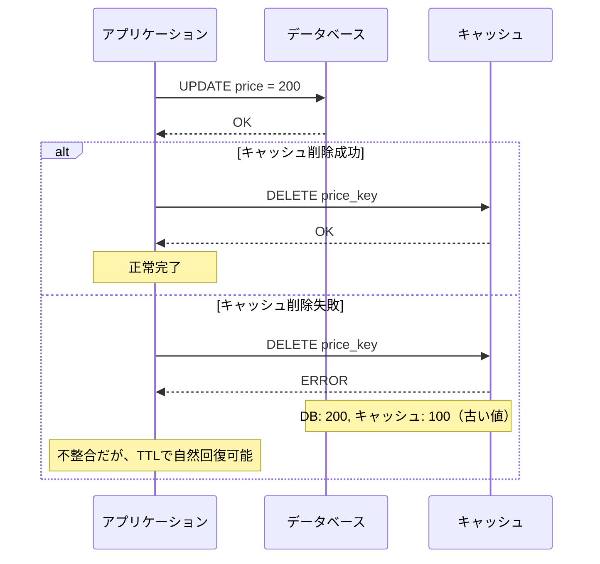
```mermaid
sequenceDiagram
    participant A as アプリケーション
    participant DB as データベース
    participant Ca as キャッシュ

    A->>DB: UPDATE price = 200
    DB-->>A: OK

    alt キャッシュ削除成功
        A->>Ca: DELETE price_key
        Ca-->>A: OK
        Note over A: 正常完了
    else キャッシュ削除失敗
        A->>Ca: DELETE price_key
        Ca-->>A: ERROR
        Note over Ca,DB: DB: 200, キャッシュ: 100（古い値）
        Note over A: 不整合だが、TTLで自然回復可能
    end
```

DB更新が成功した後にキャッシュ削除が失敗した場合、キャッシュに古い値が残る。しかし、この不整合はTTL によって自然に解消される。また、リトライ機構を設けることで削除の成功率を高められる。

#### パターン2: キャッシュ削除 → DB更新

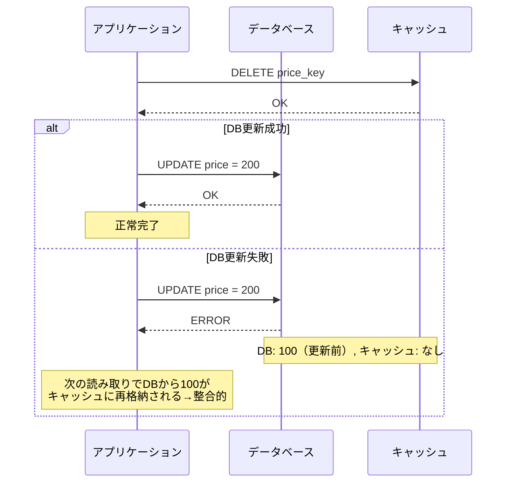
```mermaid
sequenceDiagram
    participant A as アプリケーション
    participant DB as データベース
    participant Ca as キャッシュ

    A->>Ca: DELETE price_key
    Ca-->>A: OK

    alt DB更新成功
        A->>DB: UPDATE price = 200
        DB-->>A: OK
        Note over A: 正常完了
    else DB更新失敗
        A->>DB: UPDATE price = 200
        DB-->>A: ERROR
        Note over Ca,DB: DB: 100（更新前）, キャッシュ: なし
        Note over A: 次の読み取りでDBから100が<br>キャッシュに再格納される→整合的
    end
```

キャッシュを先に削除する方式は、**DB更新が失敗した場合の整合性は保たれる**（次の読み取りでDBの値がキャッシュに格納されるため）。しかし、キャッシュ削除後からDB更新完了までの間に読み取りが発生すると、DBから古い値を読み取ってキャッシュに格納してしまう（3.1で述べたRead-Write Raceと同じ問題）。

#### パターン3: キャッシュ更新 → DB更新（非推奨）

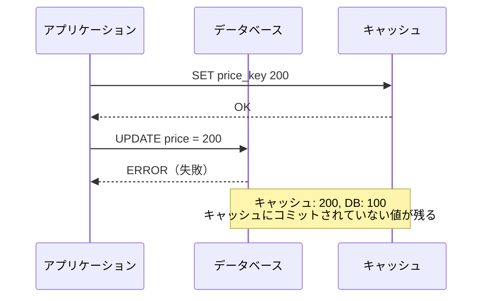
```mermaid
sequenceDiagram
    participant A as アプリケーション
    participant DB as データベース
    participant Ca as キャッシュ

    A->>Ca: SET price_key 200
    Ca-->>A: OK
    A->>DB: UPDATE price = 200
    DB-->>A: ERROR（失敗）

    Note over Ca,DB: キャッシュ: 200, DB: 100<br>キャッシュにコミットされていない値が残る
```

この順序は最も危険であり、DB更新が失敗した場合にキャッシュに不正な値が残る。DBは真のデータソース（Source of Truth）であるべきなので、**キャッシュをDBより先に更新する戦略は原則として避けるべきである**。

### 4.3 操作順序の推奨事項

以上の分析をまとめると、推奨される順序は以下の通りである。

| 操作順序 | 障害時の不整合 | 回復の容易さ | 推奨度 |
|---|---|---|---|
| DB更新 → キャッシュ削除 | キャッシュに古い値が残る | TTL/リトライで回復 | **推奨** |
| キャッシュ削除 → DB更新 | Read-Write Race のリスク | 次の読み取りで回復 | 条件付き可 |
| キャッシュ更新 → DB更新 | コミットされていない値がキャッシュに残る | 手動ロールバックが必要 | **非推奨** |
| DB更新 → キャッシュ更新 | Write-Write Race のリスク | バージョニングが必要 | 注意が必要 |

### 4.4 Double-Write 問題の根本的解決：Change Data Capture

Double-Write 問題の根本的な解決策の一つが、**Change Data Capture（CDC）** を活用したアプローチである。アプリケーションがキャッシュとDBの両方に書き込むのではなく、**DBへの書き込みのみを行い、DBの変更ログ（WAL/Binlog）からキャッシュの更新をトリガーする**。

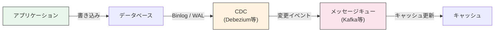
```mermaid
graph LR
    A["アプリケーション"] -->|"書き込み"| DB["データベース"]
    DB -->|"Binlog / WAL"| CDC["CDC<br>(Debezium等)"]
    CDC -->|"変更イベント"| MQ["メッセージキュー<br>(Kafka等)"]
    MQ -->|"キャッシュ更新"| Ca["キャッシュ"]

    style A fill:#e8f5e9,stroke:#333
    style CDC fill:#fff3e0,stroke:#333
    style MQ fill:#fce4ec,stroke:#333
```

このアプローチの利点は以下の通りである。

- **アプリケーションはDBへの書き込みだけを行えばよい**: Double-Write が不要になる
- **DBの変更が確実にキャッシュに反映される**: CDCはDBのトランザクションログを読むため、コミットされた変更のみが伝搬される
- **順序保証**: Binlog/WALはトランザクションの順序で記録されるため、Write-Write Raceが起きない

ただし、CDCには以下の制約もある。

- **反映の遅延**: DBの変更からキャッシュの更新までに数百ミリ秒〜数秒の遅延が生じる（Eventual Consistency）
- **インフラの複雑さ**: Debezium、Kafka、コンシューマーなどのコンポーネントが必要になる
- **運用コスト**: CDCパイプラインの監視・障害対応が必要

::: tip CDCの適用判断
CDCは強力だが、すべてのシステムに適用すべきではない。アプリケーションの規模が小さく、更新頻度が低い場合は、「DB更新 → キャッシュ削除 + TTL + リトライ」のシンプルな方式で十分なことが多い。CDCの導入は、一貫性の要件が厳しく、かつシステムの規模がある程度大きい場合に検討すべきである。
:::

## 5. 分散環境での一貫性維持（Redis + DB）

### 5.1 分散環境特有の課題

分散環境（複数のアプリケーションインスタンスが同一のキャッシュとDBを共有する環境）では、単一インスタンスの場合には存在しなかった追加の課題が発生する。

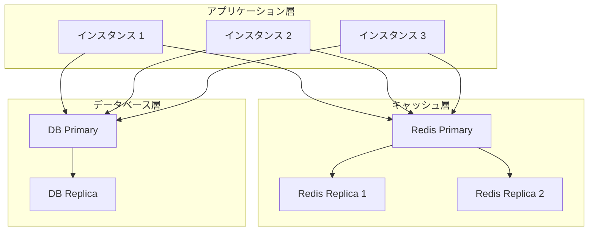
```mermaid
graph TD
    subgraph "アプリケーション層"
        A1["インスタンス 1"]
        A2["インスタンス 2"]
        A3["インスタンス 3"]
    end

    subgraph "キャッシュ層"
        R1["Redis Primary"]
        R2["Redis Replica 1"]
        R3["Redis Replica 2"]
    end

    subgraph "データベース層"
        DB1["DB Primary"]
        DB2["DB Replica"]
    end

    A1 --> R1
    A2 --> R1
    A3 --> R1
    R1 --> R2
    R1 --> R3

    A1 --> DB1
    A2 --> DB1
    A3 --> DB1
    DB1 --> DB2
```

分散環境で追加される課題は以下の通りである。

1. **ネットワーク遅延の非対称性**: 各アプリケーションインスタンスからキャッシュ/DBへのネットワーク遅延が異なるため、操作の到達順序が入れ替わりやすい
2. **Redis レプリケーションラグ**: Redis Primaryへの書き込みがReplicaに反映されるまでの遅延
3. **DBレプリケーションラグ**: DB Primaryへの書き込みがRead Replicaに反映されるまでの遅延
4. **分散ロックの課題**: 複数インスタンス間で排他制御を行うための分散ロックの信頼性と性能
5. **ネットワーク分断**: アプリケーションとキャッシュ間、またはアプリケーションとDB間のネットワークが断絶した場合の振る舞い

### 5.2 Redis レプリケーションと一貫性

Redis は非同期レプリケーションを採用しているため、PrimaryとReplica間でデータの一貫性が保証されない瞬間が存在する。

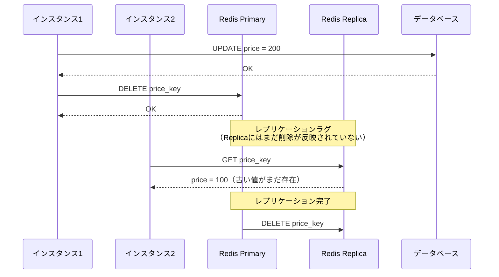
```mermaid
sequenceDiagram
    participant A1 as インスタンス1
    participant A2 as インスタンス2
    participant RP as Redis Primary
    participant RR as Redis Replica
    participant DB as データベース

    A1->>DB: UPDATE price = 200
    DB-->>A1: OK
    A1->>RP: DELETE price_key
    RP-->>A1: OK

    Note over RP,RR: レプリケーションラグ<br>（Replicaにはまだ削除が反映されていない）

    A2->>RR: GET price_key
    RR-->>A2: price = 100（古い値がまだ存在）

    Note over RP,RR: レプリケーション完了
    RP->>RR: DELETE price_key
```

この問題への対策としては以下が考えられる。

- **読み取りもPrimaryから行う**: Replicaを読み取りに使わないことで、レプリケーションラグの影響を排除する。ただし、Primaryへの負荷が集中する
- **WAIT コマンド**: Redis の `WAIT` コマンドで指定数のReplicaへの同期を待つことが可能だが、レイテンシが増大する
- **アプリケーション側での対処**: 書き込みを行ったインスタンスが、一定時間はPrimaryから読み取るように制御する（Read-Your-Writes保証）

### 5.3 DB Read Replica との不整合

多くのシステムでは、読み取り性能を向上させるためにDBのRead Replicaを使用する。しかし、キャッシュミス時にRead Replicaからデータを取得すると、レプリケーションラグにより古い値がキャッシュに格納されるリスクがある。

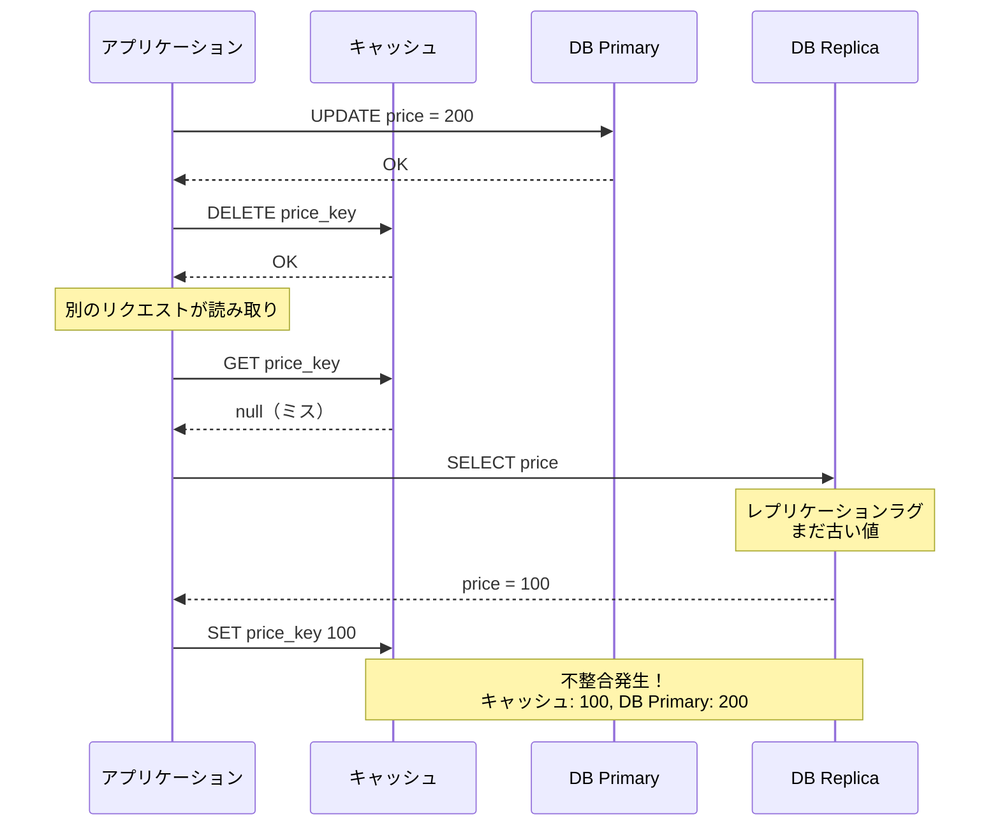
```mermaid
sequenceDiagram
    participant A as アプリケーション
    participant Ca as キャッシュ
    participant DBP as DB Primary
    participant DBR as DB Replica

    A->>DBP: UPDATE price = 200
    DBP-->>A: OK
    A->>Ca: DELETE price_key
    Ca-->>A: OK

    Note over A: 別のリクエストが読み取り
    A->>Ca: GET price_key
    Ca-->>A: null（ミス）
    A->>DBR: SELECT price
    Note over DBR: レプリケーションラグ<br>まだ古い値
    DBR-->>A: price = 100
    A->>Ca: SET price_key 100

    Note over Ca,DBR: 不整合発生！<br>キャッシュ: 100, DB Primary: 200
```

#### 対策

**対策1: キャッシュミス時はPrimaryから読み取る**

キャッシュミスが発生した場合（特に書き込み直後）は、Read ReplicaではなくDB Primaryから読み取ることで、レプリケーションラグの影響を回避できる。

```python
def cache_aside_read_distributed(key, recently_written=False):
    value = cache.get(key)
    if value is not None:
        return value

    if recently_written:
        # Read from primary to avoid replication lag
        value = db.primary.query(key)
    else:
        # Read from replica for normal reads
        value = db.replica.query(key)

    cache.set(key, value, ttl=300)
    return value
```

「最近書き込まれたか」を判定する方法としては、書き込み時にキーのリストをメモリに保持し、一定時間後に削除するアプローチがある。

**対策2: 短いTTLでの保護**

書き込み直後に格納されたキャッシュエントリには、通常より短いTTLを設定することで、不整合の影響期間を短縮する。

### 5.4 分散ロック（Redlock）を用いた排他制御

分散環境でのRace Conditionを防ぐために、分散ロックを使用する方法がある。Redisの作者であるSalvatore Sanfilippoが提案した**Redlock**アルゴリズムは、複数のRedisインスタンスを使った分散ロックの実装方法である。

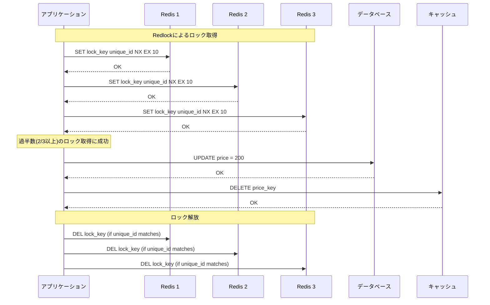
```mermaid
sequenceDiagram
    participant A as アプリケーション
    participant R1 as Redis 1
    participant R2 as Redis 2
    participant R3 as Redis 3
    participant DB as データベース
    participant Ca as キャッシュ

    Note over A,R3: Redlockによるロック取得
    A->>R1: SET lock_key unique_id NX EX 10
    R1-->>A: OK
    A->>R2: SET lock_key unique_id NX EX 10
    R2-->>A: OK
    A->>R3: SET lock_key unique_id NX EX 10
    R3-->>A: OK

    Note over A: 過半数(2/3以上)のロック取得に成功

    A->>DB: UPDATE price = 200
    DB-->>A: OK
    A->>Ca: DELETE price_key
    Ca-->>A: OK

    Note over A,R3: ロック解放
    A->>R1: DEL lock_key (if unique_id matches)
    A->>R2: DEL lock_key (if unique_id matches)
    A->>R3: DEL lock_key (if unique_id matches)
```

::: warning Redlock の安全性に関する議論
Redlock の安全性については、分散システム研究者のMartin Kleppmannが「How to do distributed locking」という記事で異議を唱え、Salvatore Sanfilippoが反論するという有名な論争がある。Kleppmannの主な批判は、**クロックのドリフトやプロセスの停止（GCの停止など）によって、Redlockが想定する時間的仮定が破られる可能性がある**というものである。このため、Redlockを使う場合は、ロックの期限切れ時に不整合が発生し得ることを前提に設計する必要がある。
:::

### 5.5 Redis Cluster 環境での注意点

Redis Clusterを使用している場合、キーはハッシュスロットに基づいて異なるノードに分散される。このため、あるキーのキャッシュ操作と、関連する別のキーの操作が異なるノードで行われ、原子性が保証されない場合がある。

```python
# Problem: these operations may go to different Redis nodes
cache.delete("user:123:profile")
cache.delete("user:123:orders")
cache.delete("user:123:recommendations")

# Solution: use hash tags to force same slot
cache.delete("{user:123}:profile")
cache.delete("{user:123}:orders")
cache.delete("{user:123}:recommendations")
```

Redis のハッシュタグ（`{...}` で囲まれた部分）を使うことで、関連するキーを同一のスロットに配置し、同一ノードでの操作を保証できる。ただし、特定のスロットにキーが集中するとホットスポット問題が発生するため、バランスが必要である。

## 6. 実装パターンと対策

### 6.1 キャッシュ無効化戦略の設計指針

キャッシュ無効化は「コンピューターサイエンスで最も難しい問題の一つ」と言われるほど奥が深い。以下に、実運用で有効な無効化戦略を体系的にまとめる。

#### イベント駆動型無効化

データの更新イベントに基づいてキャッシュを無効化する方式である。最も直接的で、不整合のウィンドウを最小化できる。

```python
class CacheInvalidator:
    def __init__(self, cache, event_bus):
        self.cache = cache
        self.event_bus = event_bus

    def on_user_updated(self, event):
        """Invalidate all cache entries related to the updated user."""
        user_id = event.user_id
        keys_to_invalidate = [
            f"user:{user_id}:profile",
            f"user:{user_id}:permissions",
            f"user:{user_id}:dashboard",
        ]
        for key in keys_to_invalidate:
            self.cache.delete(key)

    def register_handlers(self):
        self.event_bus.subscribe("user.updated", self.on_user_updated)
        self.event_bus.subscribe("user.deleted", self.on_user_deleted)
```

この方式の課題は、**あるデータの更新がどのキャッシュキーに影響するかを網羅的に把握する必要がある**点である。関連するキャッシュキーの漏れがあると、古いデータが残り続ける。

#### タグベース無効化

キャッシュエントリにタグを付与し、タグ単位で一括無効化する方式である。

```python
class TagBasedCache:
    def __init__(self, cache):
        self.cache = cache

    def set_with_tags(self, key, value, tags, ttl=300):
        """Store value with associated tags."""
        # Store the value
        self.cache.set(key, value, ttl=ttl)
        # Register key under each tag
        for tag in tags:
            self.cache.sadd(f"tag:{tag}", key)

    def invalidate_by_tag(self, tag):
        """Invalidate all cache entries associated with a tag."""
        tag_key = f"tag:{tag}"
        keys = self.cache.smembers(tag_key)
        if keys:
            self.cache.delete(*keys)
        self.cache.delete(tag_key)

    # Usage example
    def cache_product_detail(self, product_id, data):
        self.set_with_tags(
            key=f"product:{product_id}:detail",
            value=data,
            tags=[
                f"product:{product_id}",
                "product_catalog",
                f"category:{data['category_id']}",
            ],
            ttl=600
        )

    def on_category_updated(self, category_id):
        """Invalidate all products in a category."""
        self.invalidate_by_tag(f"category:{category_id}")
```

タグベース無効化は柔軟性が高いが、タグの管理自体がキャッシュに保存されるため、タグ情報の一貫性も管理する必要がある。

### 6.2 TTL 設計のベストプラクティス

TTLは不整合の「最終防衛線」として機能する。適切なTTLの設定はシステムの信頼性に直結する。

#### TTL設計の考慮点

| 要因 | 短いTTL（数秒〜数分） | 長いTTL（数時間〜数日） |
|---|---|---|
| データの鮮度 | 高い | 低い |
| キャッシュヒット率 | 低い | 高い |
| DB負荷 | 高い | 低い |
| 不整合の許容時間 | 短い | 長い |
| 適する用途 | 在庫数、価格 | マスターデータ、設定情報 |

#### ジッタ付きTTL

複数のキャッシュエントリに同じTTLを設定すると、それらが同時に期限切れを迎え、大量のキャッシュミスが同時に発生する（**キャッシュスタンピード**）。これを防ぐために、TTLにランダムなジッタを加える。

```python
import random

def set_with_jitter(cache, key, value, base_ttl=300):
    """Set cache with jittered TTL to prevent stampede."""
    # Add ±20% jitter
    jitter = random.uniform(0.8, 1.2)
    ttl = int(base_ttl * jitter)
    cache.set(key, value, ttl=ttl)
```

#### 階層型TTL

データの重要度と更新頻度に応じて、異なるTTLを設定する。

```python
TTL_CONFIG = {
    "user_session": 1800,      # 30 minutes - security-sensitive
    "product_price": 60,       # 1 minute - frequently changes
    "product_detail": 600,     # 10 minutes - moderate changes
    "category_list": 3600,     # 1 hour - rarely changes
    "static_config": 86400,    # 24 hours - almost never changes
}
```

### 6.3 バージョニングとETag

バージョニングは、キャッシュとDBの一貫性を検証するための強力な手法である。HTTP の ETag に着想を得たアプローチで、キャッシュされたデータが最新かどうかを効率的に判定する。

```python
class VersionedCache:
    def __init__(self, cache, db):
        self.cache = cache
        self.db = db

    def get(self, key):
        """Get value with version check."""
        cached = self.cache.get(key)
        if cached is None:
            return self._fetch_and_cache(key)

        # Quick version check against DB
        current_version = self.db.get_version(key)
        if cached["version"] == current_version:
            return cached["value"]

        # Version mismatch, refresh cache
        return self._fetch_and_cache(key)

    def _fetch_and_cache(self, key):
        row = self.db.query_with_version(key)
        self.cache.set(key, {
            "value": row["value"],
            "version": row["version"],
        }, ttl=300)
        return row["value"]
```

::: tip バージョンチェックの軽量化
毎回DBにバージョンを問い合わせると、キャッシュの効果が薄れる。実務では、バージョン情報のみを非常に短いTTL（数秒）でキャッシュしたり、Redis Pub/Sub でバージョン変更を通知するハイブリッドなアプローチが採用されることがある。
:::

### 6.4 リトライとべき等性

キャッシュの無効化操作が失敗した場合にリトライする仕組みは、一貫性の確保に不可欠である。リトライを安全に行うには、操作のべき等性（Idempotency）を保証する必要がある。

キャッシュの DELETE 操作はべき等であるが、SET 操作はべき等ではない（古い値で上書きする可能性がある）。これも、Invalidate 戦略が推奨される理由の一つである。

```python
class ReliableCacheInvalidator:
    def __init__(self, cache, retry_queue):
        self.cache = cache
        self.retry_queue = retry_queue

    def invalidate(self, key, max_retries=3):
        """Invalidate cache with retry on failure."""
        for attempt in range(max_retries):
            try:
                self.cache.delete(key)
                return True
            except CacheConnectionError:
                if attempt < max_retries - 1:
                    time.sleep(0.1 * (2 ** attempt))  # exponential backoff
                    continue
                else:
                    # Enqueue for background retry
                    self.retry_queue.enqueue({
                        "action": "delete",
                        "key": key,
                        "enqueued_at": time.time(),
                    })
                    return False

    def process_retry_queue(self):
        """Background worker to process failed invalidations."""
        while True:
            task = self.retry_queue.dequeue(timeout=5)
            if task is None:
                continue
            try:
                self.cache.delete(task["key"])
            except CacheConnectionError:
                # Re-enqueue with backoff
                if time.time() - task["enqueued_at"] < 3600:
                    self.retry_queue.enqueue(task)
```

### 6.5 防御的プログラミング：フォールバック戦略

キャッシュがダウンした場合に、システム全体が停止しないようにフォールバック戦略を設計することが重要である。

```python
def get_with_fallback(key):
    """Read with graceful degradation."""
    try:
        # Try cache first
        value = cache.get(key)
        if value is not None:
            return value
    except CacheConnectionError:
        # Cache is down, proceed to DB
        pass

    try:
        # Read from DB
        value = db.query(key)
        try:
            cache.set(key, value, ttl=300)
        except CacheConnectionError:
            pass  # Cache write failed, but we have the value
        return value
    except DatabaseError:
        # Both cache and DB are down
        # Return stale data from local in-memory cache if available
        stale_value = local_cache.get(key)
        if stale_value is not None:
            return stale_value
        raise ServiceUnavailableError("Data source unavailable")
```

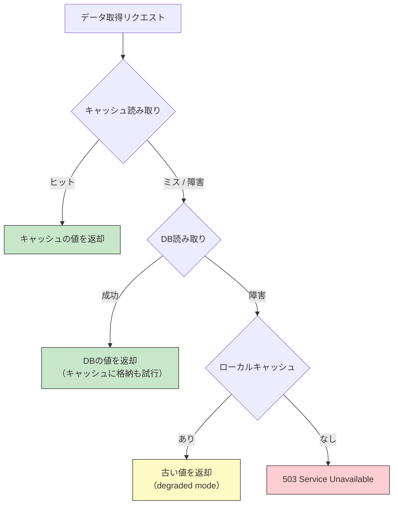
```mermaid
graph TD
    A["データ取得リクエスト"] --> B{"キャッシュ読み取り"}
    B -->|"ヒット"| C["キャッシュの値を返却"]
    B -->|"ミス / 障害"| D{"DB読み取り"}
    D -->|"成功"| E["DBの値を返却<br>（キャッシュに格納も試行）"]
    D -->|"障害"| F{"ローカルキャッシュ"}
    F -->|"あり"| G["古い値を返却<br>（degraded mode）"]
    F -->|"なし"| H["503 Service Unavailable"]

    style C fill:#c8e6c9,stroke:#333
    style E fill:#c8e6c9,stroke:#333
    style G fill:#fff9c4,stroke:#333
    style H fill:#ffcdd2,stroke:#333
```

## 7. 実際のシステムでの事例

### 7.1 Facebook の Memcache 運用（TAO）

Facebook は、キャッシュとDBの一貫性問題に大規模に取り組んだ先駆者の一つである。2013年に発表された論文「Scaling Memcache at Facebook」は、数千台のMemcachedサーバーを運用する中で直面した一貫性の課題と解決策を詳述している。

#### リース（Lease）機構

Facebook は、3.1で述べたRead-Write Raceを解決するために**リース（Lease）** 機構を導入した。キャッシュミスが発生した場合、クライアントにリーストークンを発行し、そのトークンを使ってのみキャッシュに書き込みを許可する。他のクライアントがキャッシュを無効化した場合、リーストークンも無効化されるため、古い値がキャッシュに格納されることを防止する。

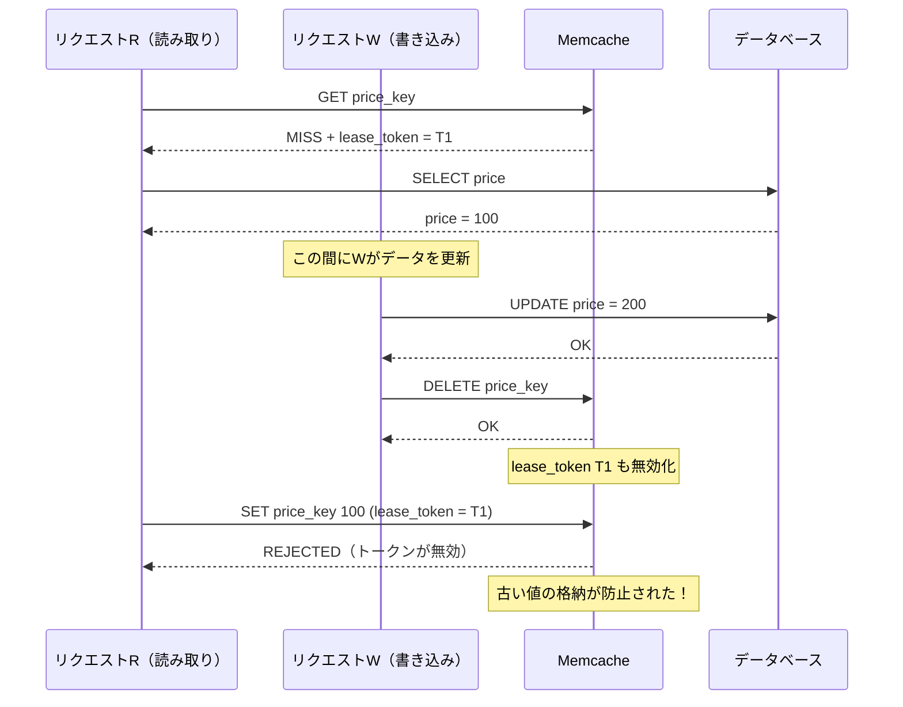
```mermaid
sequenceDiagram
    participant R as リクエストR（読み取り）
    participant W as リクエストW（書き込み）
    participant MC as Memcache
    participant DB as データベース

    R->>MC: GET price_key
    MC-->>R: MISS + lease_token = T1

    R->>DB: SELECT price
    DB-->>R: price = 100

    Note over W: この間にWがデータを更新
    W->>DB: UPDATE price = 200
    DB-->>W: OK
    W->>MC: DELETE price_key
    MC-->>W: OK
    Note over MC: lease_token T1 も無効化

    R->>MC: SET price_key 100 (lease_token = T1)
    MC-->>R: REJECTED（トークンが無効）

    Note over MC: 古い値の格納が防止された！
```

このリース機構は、ロックを使わずにRace Conditionを防止できる点で優れている。リーストークンの有効期限は通常10秒程度に設定され、トークンが無効化された場合は、クライアントは短時間待機した後に再試行する。

#### リモートマーカー（Remote Marker）

Facebook のシステムは複数のデータセンターにまたがっており、マスターリージョンとレプリカリージョンが存在する。データの更新はマスターリージョンのDBで行われ、レプリカリージョンのDBにはMySQL のレプリケーションで反映される。

キャッシュの無効化はDBレプリケーションのコールバックとして実行されるが、レプリカリージョンのキャッシュに対して、レプリケーションの遅延中に古いデータが格納されることを防ぐため、**リモートマーカー**と呼ばれる仕組みが導入された。書き込み時にマスターリージョンにマーカーを設定し、レプリカリージョンの読み取りはマーカーが存在する間はマスターリージョンから読み取るようにリダイレクトされる。

### 7.2 Amazon DynamoDB Accelerator（DAX）

Amazon DynamoDB Accelerator（DAX）は、DynamoDB のための完全マネージド型のキャッシュサービスである。DAX はWrite-Through パターンを採用しており、DynamoDB への書き込みを透過的にキャッシュにも反映する。

DAX の一貫性に関する特徴は以下の通りである。

- **最終的一貫性（Eventual Consistency）のデフォルト**: DAX のキャッシュからの読み取りはデフォルトで最終的一貫性となる
- **強い一貫性の読み取り**: DynamoDB の強い一貫性読み取り（Strongly Consistent Read）を要求した場合、DAX はキャッシュをバイパスして DynamoDB から直接読み取る
- **アイテムキャッシュとクエリキャッシュの分離**: 個別アイテムのキャッシュとクエリ結果のキャッシュが独立して管理され、アイテムの更新時にアイテムキャッシュは即座に更新されるが、クエリキャッシュはTTL まで古い結果を返す可能性がある

```mermaid
graph TD
    subgraph "DAX の読み取りフロー"
        A["クライアント"] --> B{"一貫性レベル"}
        B -->|"Eventual"| C["DAX キャッシュから読み取り"]
        B -->|"Strong"| D["DynamoDB から直接読み取り<br>（キャッシュをバイパス）"]
    end

    subgraph "DAX の書き込みフロー"
        E["クライアント"] --> F["DAX"]
        F --> G["DynamoDB に書き込み"]
        G --> H["アイテムキャッシュを更新"]
        Note1["クエリキャッシュはTTLまで<br>古い結果を返す可能性あり"]
    end
```

### 7.3 Twitter のキャッシュ戦略

Twitter は大量の読み取りリクエスト（タイムライン表示）に対して、キャッシュを積極的に活用している。Twitter の初期のアーキテクチャでは、Cache-Aside パターンを単純に適用していたが、スケールに伴い以下のような課題が浮上した。

- **セレブリティ問題（Hot Key）**: 人気ユーザーのツイートが大量にキャッシュミスを引き起こし、DBに負荷が集中する
- **ファンアウト問題**: 1つのツイートが数百万のフォロワーのタイムラインキャッシュに影響する

Twitter はこれに対し、**タイムラインのファンアウト（書き込み時にフォロワーのタイムラインキャッシュを事前に構築する）** と、**ファンアウトとプル型読み取りのハイブリッド**（フォロワーが少ないユーザーにはファンアウト、フォロワーが多いユーザーにはプル型）を組み合わせた戦略を採用している。

この設計では、キャッシュの一貫性は「最終的一貫性」で許容し、タイムラインの表示が数秒遅れることを許容する代わりに、読み取りの高速化を優先している。SNSのようなユースケースでは、この「最終的一貫性で十分」という判断が合理的である。

### 7.4 実践的な判断フレームワーク

実際のシステム設計において、キャッシュの一貫性戦略を選択する際は、以下のフレームワークが参考になる。

```mermaid
graph TD
    A["データの更新頻度は？"] -->|"高い（秒単位）"| B["短いTTL + Invalidate"]
    A -->|"低い（時間〜日単位）"| C["長いTTL + Invalidate"]
    A -->|"ほぼない"| D["非常に長いTTL<br>+ 手動無効化"]

    B --> E{"不整合の許容度は？"}
    E -->|"数秒なら許容"| F["TTL + ダブル削除"]
    E -->|"許容できない"| G["CDC / リース機構"]

    C --> H{"更新時にすべての<br>キャッシュキーを<br>特定できるか？"}
    H -->|"はい"| I["イベント駆動型無効化"]
    H -->|"いいえ"| J["タグベース無効化"]
```

| シナリオ | 推奨戦略 | 理由 |
|---|---|---|
| ECサイトの商品価格 | Cache-Aside + Invalidate + 短TTL | 価格の不整合はビジネスリスク |
| SNSのタイムライン | Cache-Aside + 最終的一貫性 | 数秒の遅れは許容可能 |
| セッション情報 | Write-Through | 読み書き両方で最新値が必要 |
| アクセスカウンタ | Write-Behind | 多少のずれが許容可能で書き込みが多い |
| 金融取引データ | キャッシュしない or CDC | 一貫性が最優先 |
| マスターデータ | 長TTL + イベント駆動型無効化 | 更新頻度が低く、変更時のみ無効化 |

## 8. まとめ

キャッシュとDBの一貫性問題は、**データの複製を2箇所に持つ以上、原理的に完全には解決できない**という本質を持っている。これはCAP定理やFLP不可能性定理に通じる、分散システムの根本的な制約である。

重要なポイントを振り返る。

1. **Invalidate 戦略を基本とする**: キャッシュの値を更新するのではなく削除する方式が、Race Condition に対して最も堅牢である
2. **DB更新を先に行う**: Double-Write の操作順序としては「DB更新 → キャッシュ削除」が最も安全であり、失敗時のリカバリも容易である
3. **TTL は必ず設定する**: TTL は不整合の「最終防衛線」であり、どのような一貫性戦略を採用する場合でも必ず設定すべきである
4. **完全な一貫性が必要な場合はCDC を検討する**: アプリケーションレベルのDouble-Write を排除し、DBの変更ログからキャッシュを更新するアプローチが最も信頼性が高い
5. **不整合の許容度に基づいて戦略を選ぶ**: すべてのデータに同じレベルの一貫性を求めるのではなく、ビジネス要件に応じて適切な戦略を選択する

最終的に、キャッシュの一貫性問題は「技術的な正解」だけでは解決できない。**ビジネス要件として、どの程度の不整合を、どの程度の期間許容できるか**を明確にし、その要件に見合ったコストと複雑さの対策を選択することが、実践的なシステム設計の鍵である。
