# キャッシュパターン — Cache-Aside, Write-Through, Write-Behind

## 1. 背景と動機：なぜキャッシュが必要か

### 1.1 レイテンシの壁

現代のソフトウェアシステムにおいて、データアクセスのレイテンシはユーザー体験とシステムスループットを左右する最大の要因の一つである。以下は典型的なストレージ階層ごとのアクセス時間の目安である。

| アクセス先 | 典型的なレイテンシ |
|---|---|
| L1 CPUキャッシュ | ~1 ns |
| L2 CPUキャッシュ | ~4 ns |
| L3 CPUキャッシュ | ~10 ns |
| メインメモリ（DRAM） | ~100 ns |
| Redis（ローカル・ネットワーク） | ~100-500 μs |
| SSD（ランダム読み取り） | ~100 μs |
| RDBMS（単純なクエリ） | ~1-10 ms |
| RDBMS（複雑な結合クエリ） | ~10-100 ms |
| 外部API呼び出し | ~50-500 ms |

メインメモリ上のインメモリキャッシュ（Redis, Memcached）へのアクセスは、RDBMSへのアクセスと比較して桁違いに高速である。この速度差を活用することがキャッシュの本質的な価値である。

### 1.2 スループットとスケーラビリティ

キャッシュの恩恵はレイテンシの低減だけではない。データベースへのクエリをキャッシュで吸収することで、バックエンドの負荷を大幅に軽減できる。例えば、あるAPIエンドポイントが秒間10,000リクエストを受け、各リクエストがDBクエリを1回発行する場合、キャッシュヒット率が95%であれば、DBへの実際のクエリは秒間500回に抑えられる。これにより、DBサーバのスケールアップ・スケールアウトのコストを大幅に削減できる。

### 1.3 キャッシュの基本原理

キャッシュは**参照の局所性（Locality of Reference）** を活用する技術である。以下の二つの局所性がキャッシュの有効性を支えている。

- **時間的局所性（Temporal Locality）**：最近アクセスされたデータは、近い将来に再びアクセスされる可能性が高い
- **空間的局所性（Spatial Locality）**：あるデータの近傍にあるデータも、近い将来にアクセスされる可能性が高い

アプリケーションレベルのキャッシュでは、特に時間的局所性を活用する。頻繁にアクセスされるデータ（ホットデータ）をメモリ上に保持し、高速に応答する。

しかし、キャッシュの導入は「どのタイミングでデータをキャッシュに載せるか」「データが更新されたときにキャッシュをどう扱うか」という設計上の問題を生む。これが本記事の主題であるキャッシュパターンである。

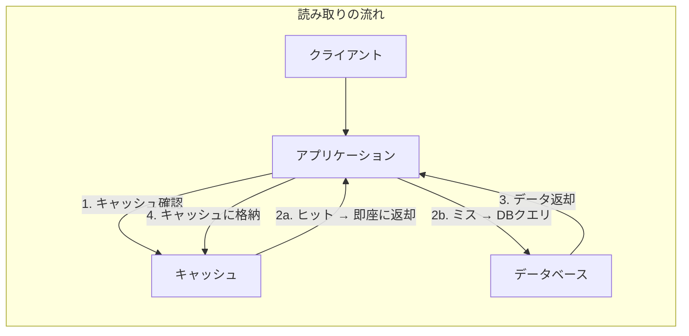

## 2. Cache-Aside（Lazy Loading）パターン

### 2.1 概要

Cache-Aside（キャッシュアサイド）は最も広く採用されているキャッシュパターンである。「Lazy Loading」とも呼ばれ、データが実際に要求されたときに初めてキャッシュに格納する。アプリケーション自身がキャッシュとデータベースの両方を明示的に操作する点が特徴である。

### 2.2 読み取りの流れ

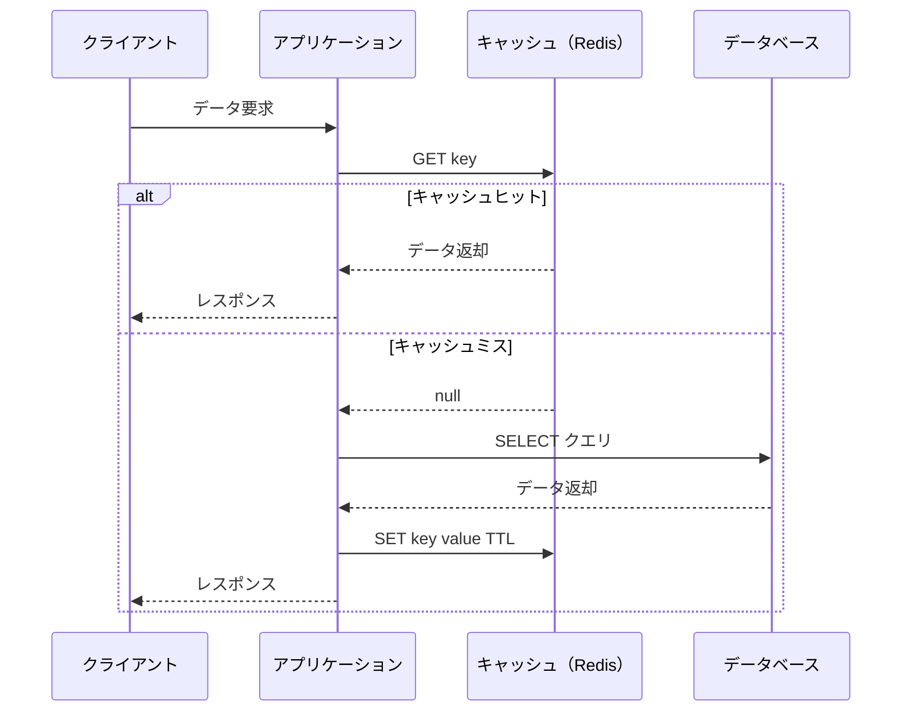

1. アプリケーションがキャッシュに対してデータを問い合わせる
2. キャッシュヒットの場合、キャッシュから直接データを返す
3. キャッシュミスの場合、データベースからデータを取得する
4. 取得したデータをキャッシュに格納し、クライアントに返す

### 2.3 書き込みの流れ

Cache-Asideパターンでは、書き込み時にキャッシュを**無効化（Invalidation）** する方式が一般的である。

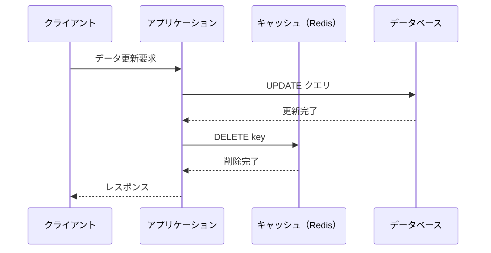

書き込み時にキャッシュを更新（上書き）するのではなく、削除する理由は重要である。キャッシュの値を更新する場合、DBの更新とキャッシュの更新の間にレースコンディションが発生し、古いデータがキャッシュに残り続ける可能性がある。削除であれば、次回の読み取り時に最新のデータがDBから取得され、キャッシュに格納される。

### 2.4 実装例

以下はPython（擬似コード）での典型的なCache-Aside実装である。

```python
class UserService:
    def __init__(self, cache_client, db_client):
        self.cache = cache_client
        self.db = db_client
        self.default_ttl = 3600  # 1 hour

    def get_user(self, user_id: str) -> dict:
        cache_key = f"user:{user_id}"

        # Step 1: Try cache first
        cached = self.cache.get(cache_key)
        if cached is not None:
            return json.loads(cached)

        # Step 2: Cache miss — query database
        user = self.db.query("SELECT * FROM users WHERE id = %s", user_id)
        if user is None:
            return None

        # Step 3: Populate cache
        self.cache.setex(cache_key, self.default_ttl, json.dumps(user))
        return user

    def update_user(self, user_id: str, data: dict) -> None:
        # Step 1: Update database
        self.db.execute(
            "UPDATE users SET name = %s WHERE id = %s",
            data["name"], user_id
        )

        # Step 2: Invalidate cache
        cache_key = f"user:{user_id}"
        self.cache.delete(cache_key)
```

### 2.5 利点と欠点

**利点：**

- **実装のシンプルさ**：アプリケーションコードで明示的にキャッシュを制御するため、動作が理解しやすい
- **キャッシュの耐障害性**：キャッシュが障害でダウンしてもDBから直接データを取得できるため、サービスは（遅くはなるが）継続可能
- **必要なデータのみキャッシュ**：実際にアクセスされたデータだけがキャッシュに格納されるため、メモリ効率が良い
- **キャッシュとDBの技術選定の自由度**：キャッシュとDBの間に技術的な結合がない

**欠点：**

- **初回アクセスの遅延（コールドスタート）**：キャッシュが空の状態では全リクエストがDBに到達する。サーバ再起動後やキャッシュフラッシュ後のウォームアップが問題になる
- **データの不整合ウィンドウ**：DBの更新からキャッシュの無効化までの間に他のリクエストが古いキャッシュを読む可能性がある
- **アプリケーションの責務増大**：キャッシュの読み書きロジックをアプリケーション側で管理する必要がある

### 2.6 適用場面

Cache-Asideは以下のような場面で特に効果を発揮する。

- **読み取り負荷の高いワークロード**：SNSのユーザープロフィール、ECサイトの商品情報など
- **データの更新頻度が低い**：マスタデータ、設定情報
- **キャッシュミス時の遅延が許容できる**：ユーザーが数ミリ秒の初回遅延を許容できるケース

## 3. Read-Through パターン

### 3.1 概要

Read-Through（リードスルー）パターンは、Cache-Asideと似た読み取り動作を行うが、キャッシュの読み書きの責務をキャッシュライブラリ（またはキャッシュプロバイダ）に委譲する点が異なる。アプリケーションは常にキャッシュに対してのみ読み取りを行い、キャッシュミス時のDB問い合わせはキャッシュプロバイダが自動的に行う。

### 3.2 動作の流れ

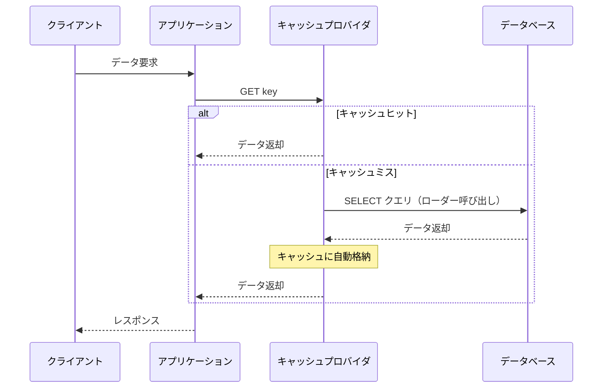

### 3.3 Cache-Aside との比較

| 観点 | Cache-Aside | Read-Through |
|---|---|---|
| DBアクセスの責務 | アプリケーション | キャッシュプロバイダ |
| キャッシュミス処理 | アプリケーションが実装 | ローダー関数をキャッシュに登録 |
| コードの複雑さ | キャッシュロジックが散在しやすい | データアクセスが統一的 |
| フレームワーク依存 | 低い | キャッシュライブラリに依存 |

Read-Throughの核心は、キャッシュプロバイダに「ローダー（loader）」と呼ばれるコールバック関数を登録し、キャッシュミス時にこの関数がDB問い合わせを自動的に行う点にある。

### 3.4 実装例

JavaのCaffeine（ローカルキャッシュ）やGuava Cacheは、Read-Throughパターンをネイティブにサポートしている。

```java
// Caffeine (Java) example
LoadingCache<String, User> userCache = Caffeine.newBuilder()
    .maximumSize(10_000)
    .expireAfterWrite(Duration.ofHours(1))
    .build(key -> {
        // This loader is called on cache miss
        return userRepository.findById(key);
    });

// Application code — just call cache.get()
User user = userCache.get("user:123");
```

アプリケーションコードから見ると、キャッシュミスかヒットかを意識する必要がない。常に `cache.get()` を呼ぶだけでよい。

### 3.5 利点と欠点

**利点：**

- **アプリケーションコードの簡潔化**：キャッシュミス時の処理がキャッシュプロバイダに隠蔽される
- **一貫したアクセスパターン**：データ取得のコードが統一的になる
- **重複リクエストの統合**：多くのRead-Through実装は、同一キーへの同時リクエストを1回のDB問い合わせに統合する（request coalescing）

**欠点：**

- **キャッシュプロバイダへの依存**：特定のライブラリやフレームワークに依存する
- **分散キャッシュでの実装が複雑**：Redis単体ではRead-Throughをネイティブにサポートしない。通常はアプリケーション側のラッパーで実現する

## 4. Write-Through パターン

### 4.1 概要

Write-Through（ライトスルー）パターンでは、データの書き込みがキャッシュとデータベースの両方に対して**同期的**に行われる。アプリケーションはキャッシュに書き込み、キャッシュプロバイダが即座にデータベースにも書き込みを反映する。

### 4.2 動作の流れ

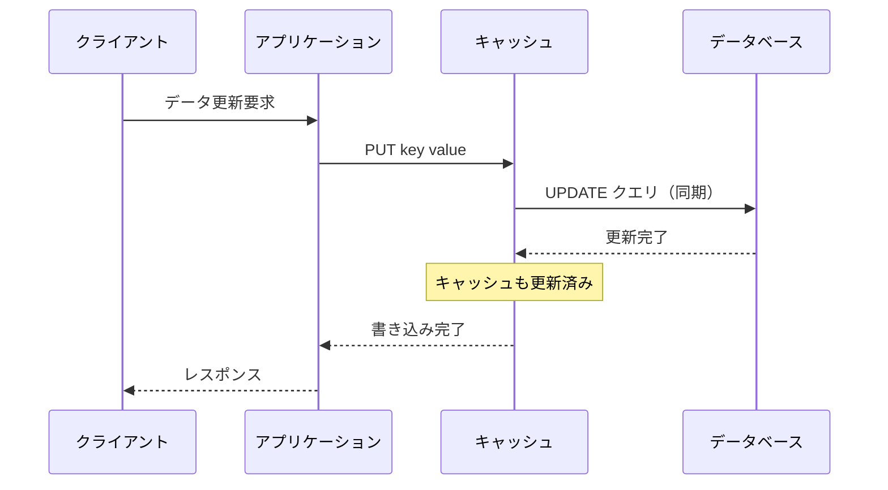

### 4.3 Read-Through との組み合わせ

Write-Throughは、単独で使われることは少なく、Read-Throughと組み合わせて使われることが一般的である。この組み合わせにより、読み取りも書き込みもキャッシュプロバイダを介して行う統一的なデータアクセス層が実現される。

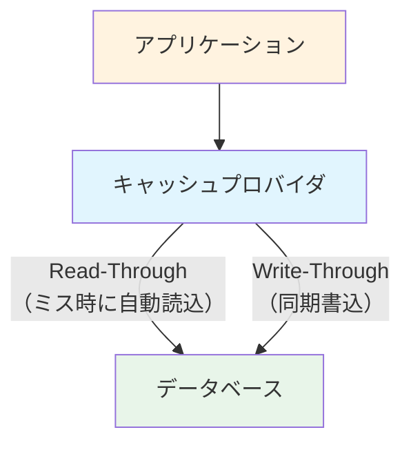

### 4.4 実装例

```python
class WriteThroughCache:
    def __init__(self, cache_client, db_client):
        self.cache = cache_client
        self.db = db_client

    def put(self, key: str, value: dict) -> None:
        # Step 1: Write to database first
        self.db.execute(
            "INSERT INTO data (key, value) VALUES (%s, %s) "
            "ON CONFLICT (key) DO UPDATE SET value = %s",
            key, json.dumps(value), json.dumps(value)
        )

        # Step 2: Write to cache (only after DB succeeds)
        self.cache.set(key, json.dumps(value))

    def get(self, key: str) -> dict:
        # Read-Through logic
        cached = self.cache.get(key)
        if cached is not None:
            return json.loads(cached)

        result = self.db.query("SELECT value FROM data WHERE key = %s", key)
        if result:
            self.cache.set(key, result["value"])
            return json.loads(result["value"])
        return None
```

### 4.5 利点と欠点

**利点：**

- **キャッシュとDBの一貫性が高い**：書き込みが同期的に両方に行われるため、Cache-Asideのような不整合ウィンドウが極めて小さい
- **読み取りの高速性保証**：書き込み時にキャッシュが更新されるため、直後の読み取りが常にキャッシュヒットする
- **データ損失リスクの低減**：キャッシュがダウンしてもDBには書き込み済みのため、データは保持される

**欠点：**

- **書き込みレイテンシの増大**：キャッシュとDBの両方に書き込む必要があるため、書き込みのレイテンシが上がる。特にDB書き込みがボトルネックの場合、キャッシュの恩恵が読み取り側にしか効かない
- **不要データのキャッシュ**：書き込まれたが読まれないデータもキャッシュに格納される。TTLの設定で緩和は可能だが、メモリ効率はCache-Asideより劣る可能性がある

### 4.6 適用場面

- **一貫性要件が高い**：金融取引の残高情報、在庫数など
- **書き込み後の即時読み取りが必要**：ユーザーが設定を変更した直後に反映を確認するケース
- **書き込み頻度が比較的低い**：マスタデータの更新など

## 5. Write-Behind（Write-Back）パターン

### 5.1 概要

Write-Behind（ライトビハインド）パターンは、Write-Throughの変種であるが、根本的な違いがある。データの書き込みはまずキャッシュに対して行われ、データベースへの書き込みは**非同期的に遅延実行**される。これにより、書き込みのレイテンシを大幅に削減できる。

「Write-Back」とも呼ばれ、この用語はCPUキャッシュのWrite-Backポリシーに由来する。

### 5.2 動作の流れ

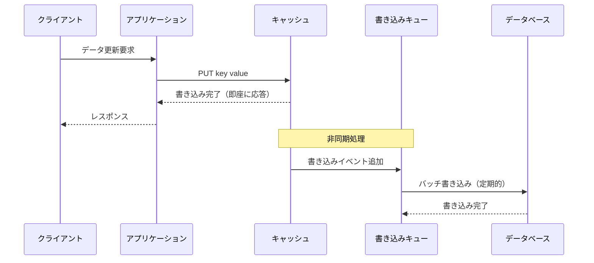

### 5.3 バッチ書き込みの最適化

Write-Behindの大きな利点の一つは、複数の書き込みを集約して一度のバッチ処理でDBに反映できる点である。例えば、同一キーへの連続した更新は最新の値だけをDBに書き込めばよい。

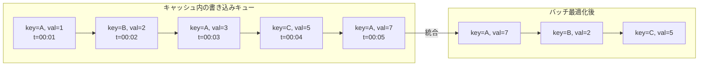

上の例では、キー A に対する3回の書き込みが最新の値（val=7）1回に統合され、DB書き込み回数が5回から3回に削減される。

### 5.4 実装上の考慮事項

Write-Behindの実装には、いくつかの重要な考慮事項がある。

**永続性の保証：** キャッシュに書き込んだデータがDBに反映される前にキャッシュがクラッシュすると、データが失われる。これを緩和するために、書き込みキューを永続化（ディスクやメッセージキューに保存）する必要がある。

**書き込み順序の保証：** 同一キーに対する複数の書き込みは順序が保証される必要がある。異なるキーに対しては並列にDBへ書き込むことが可能だが、同一キーの順序を逆転させるとデータの整合性が壊れる。

**障害時のリトライ：** DB書き込みに失敗した場合のリトライ戦略が必要である。指数バックオフやデッドレターキューの導入が一般的である。

```python
class WriteBehindCache:
    def __init__(self, cache_client, write_queue):
        self.cache = cache_client
        self.queue = write_queue  # e.g., Redis Stream, Kafka

    def put(self, key: str, value: dict) -> None:
        # Step 1: Write to cache immediately
        self.cache.set(key, json.dumps(value))

        # Step 2: Enqueue for async DB write
        self.queue.enqueue({
            "key": key,
            "value": value,
            "timestamp": time.time()
        })

    def get(self, key: str) -> dict:
        # Always read from cache (it has the latest data)
        cached = self.cache.get(key)
        if cached:
            return json.loads(cached)
        return None


class WriteBehindWorker:
    """Background worker that flushes writes to DB."""

    def __init__(self, write_queue, db_client, batch_size=100, flush_interval=5):
        self.queue = write_queue
        self.db = db_client
        self.batch_size = batch_size
        self.flush_interval = flush_interval  # seconds

    def run(self):
        while True:
            batch = self.queue.dequeue_batch(self.batch_size, timeout=self.flush_interval)
            if batch:
                # Deduplicate: keep only the latest write per key
                latest = {}
                for item in batch:
                    latest[item["key"]] = item["value"]

                # Batch write to DB
                self.db.batch_upsert(latest)
```

### 5.5 利点と欠点

**利点：**

- **書き込みレイテンシの劇的な低減**：クライアントへの応答はキャッシュ書き込みの完了時点で返されるため、DB書き込みの遅延の影響を受けない
- **DBの負荷軽減**：バッチ書き込みにより、DB側のI/O回数を大幅に削減できる
- **書き込みスパイクの吸収**：突発的な大量書き込みをキューで平準化できる

**欠点：**

- **データ損失のリスク**：キャッシュのクラッシュ時に、まだDBに反映されていないデータが失われる可能性がある
- **一貫性の複雑化**：キャッシュとDBの内容が一時的に異なる状態が通常運用で発生する
- **実装の複雑さ**：バックグラウンドワーカー、リトライ機構、デッドレターキューなど、関連するインフラの構築と運用が必要

### 5.6 適用場面

- **大量の書き込みが発生するワークロード**：IoTセンサーデータの集計、アクセスカウンター、アナリティクスイベント
- **書き込みレイテンシが最重要**：リアルタイムゲームのスコア記録、チャットメッセージ
- **データの厳密な永続性が最優先ではない**：閲覧数カウントやいいね数のように、多少の損失が許容される場合

## 6. Refresh-Ahead パターン

### 6.1 概要

Refresh-Ahead（リフレッシュアヘッド）パターンは、キャッシュのTTL（有効期限）が切れる前に、バックグラウンドで非同期的にキャッシュを更新する手法である。これにより、頻繁にアクセスされるデータについて、キャッシュミスをほぼゼロにできる。

### 6.2 動作の流れ

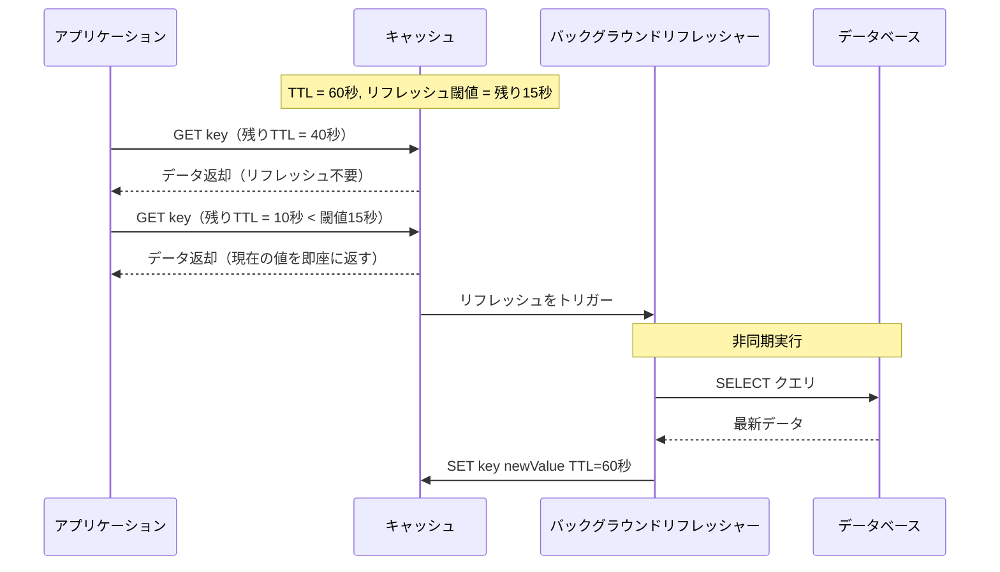

ポイントは、リフレッシュが非同期で行われる間も、クライアントには現在のキャッシュ値が即座に返される点である。クライアントから見ると、キャッシュミスによる遅延が発生しない。

### 6.3 リフレッシュ閾値の設計

リフレッシュ閾値（refresh factor）の設定は重要な設計判断である。一般的には、TTLの20%〜30%程度の残り時間をリフレッシュ閾値とする。

- TTL = 300秒、リフレッシュ閾値 = 60秒（残り20%）
- TTL = 3600秒、リフレッシュ閾値 = 600秒（残り約17%）

閾値が大きすぎると、不必要なDBクエリが増える。小さすぎると、リフレッシュが間に合わずにTTLが切れてしまうリスクがある。

### 6.4 利点と欠点

**利点：**

- **キャッシュミスの回避**：ホットデータに対するキャッシュミスがほぼゼロになる
- **予測可能なレイテンシ**：リフレッシュが非同期で行われるため、読み取りレイテンシが安定する

**欠点：**

- **アクセス頻度の予測が必要**：まれにしかアクセスされないデータに対しても不必要にリフレッシュされる可能性がある（頻度判定の仕組みが必要）
- **実装の複雑さ**：バックグラウンドのリフレッシュ機構が必要
- **データの鮮度保証がない**：リフレッシュ間隔中のデータ変更は、次回のリフレッシュまで反映されない

## 7. キャッシュ無効化戦略

コンピューターサイエンスにおいて有名な格言がある。

> "There are only two hard things in Computer Science: cache invalidation and naming things."
> — Phil Karlton

キャッシュ無効化（Cache Invalidation）は、キャッシュシステムの設計において最も困難な課題の一つである。以下に主要な無効化戦略を解説する。

### 7.1 TTL（Time-To-Live）ベースの期限切れ

最もシンプルで広く使われる戦略である。各キャッシュエントリに有効期限を設定し、期限を過ぎたエントリは自動的に無効化される。

```
SET user:123 '{"name": "Alice"}' EX 3600  # 1 hour TTL
```

**TTL設計のガイドライン：**

| データの性質 | 推奨TTL | 理由 |
|---|---|---|
| ほぼ不変のマスタデータ | 24時間〜7日 | 変更頻度が極めて低い |
| ユーザープロフィール | 1〜6時間 | 適度な鮮度と性能のバランス |
| セッション情報 | 30分〜2時間 | セキュリティとUXのバランス |
| リアルタイムデータ（在庫数など） | 10秒〜1分 | 高い鮮度が要求される |
| ランキング・集計データ | 5分〜1時間 | 計算コストが高いがリアルタイム性は不要 |

**TTLの注意点：** 同一TTLを大量のキーに設定すると、同時に期限切れが発生し、大量のキャッシュミスがDBに集中する（Cache Stampede、後述）。TTLにランダムなジッター（揺らぎ）を追加することで、期限切れを分散させる。

```python
import random

base_ttl = 3600
# Add jitter: ±10% of base TTL
jitter = random.randint(-360, 360)
ttl = base_ttl + jitter
cache.setex(key, ttl, value)
```

### 7.2 イベント駆動無効化

データの変更が発生した際に、イベント（メッセージ）を発行してキャッシュを無効化する方式である。TTLベースの無効化よりも即時性が高い。

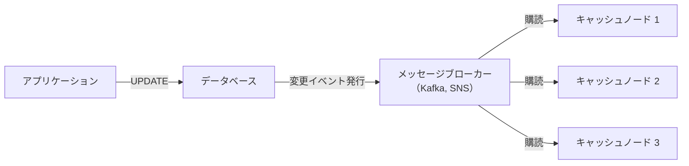

**CDC（Change Data Capture）との連携：** データベースのWAL（Write-Ahead Log）を監視し、データ変更を自動的にキャプチャしてキャッシュを無効化する方式がある。Debeziumなどのツールを利用すると、アプリケーションコードを変更することなくイベント駆動無効化を実現できる。

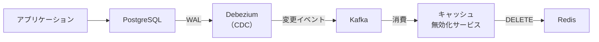

この方式の利点は、アプリケーションがキャッシュの無効化を意識しなくてよい点と、直接DBを更新するバッチ処理やマイグレーションスクリプトによる変更もキャプチャできる点である。

### 7.3 手動パージ（Explicit Purge）

管理者やデプロイパイプラインからの明示的な操作により、特定のキャッシュエントリやプレフィックスに一致するエントリを一括で無効化する方式である。

```bash
# Purge all keys matching a pattern
redis-cli --scan --pattern "product:*" | xargs redis-cli DEL

# Purge a specific key
redis-cli DEL "user:123"
```

CDNのキャッシュパージ（例：CloudFront Invalidation, Fastly Instant Purge）もこのカテゴリに該当する。デプロイ後にアセットキャッシュを無効化する場合などに使用される。

### 7.4 バージョニング

キャッシュキーにバージョン番号を含めることで、データスキーマの変更やバッチ的な無効化に対応する方式である。

```python
CACHE_VERSION = "v3"

def cache_key(entity: str, entity_id: str) -> str:
    return f"{CACHE_VERSION}:{entity}:{entity_id}"

# v3:user:123 → schema change → v4:user:123
# Old keys (v3:*) will expire naturally via TTL
```

デプロイ時にバージョン番号をインクリメントすると、旧バージョンのキーは参照されなくなり、TTLに従って自然に消滅する。明示的な削除が不要なため、大量キーの無効化でもRedisに負荷をかけない利点がある。

## 8. キャッシュの一貫性問題

### 8.1 Thundering Herd（群集雪崩）問題

キャッシュ内の人気データ（ホットキー）のTTLが切れた瞬間に、大量のリクエストが同時にキャッシュミスとなり、一斉にDBへクエリが殺到する問題である。

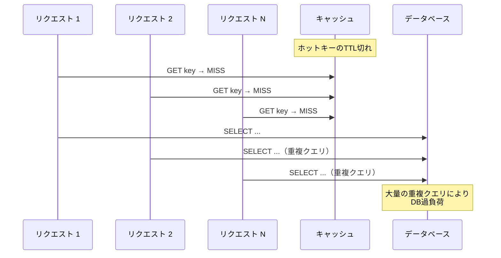

**対策1：Mutex/ロックによる単一リクエスト化**

キャッシュミス時に分散ロックを取得し、ロックを取得した1つのリクエストだけがDBにクエリを発行する。他のリクエストはロックの解放（＝キャッシュの再充填）を待つ。

```python
def get_with_mutex(key: str) -> dict:
    value = cache.get(key)
    if value is not None:
        return json.loads(value)

    # Try to acquire distributed lock
    lock_key = f"lock:{key}"
    if cache.set(lock_key, "1", nx=True, ex=5):  # NX = set if not exists
        try:
            # Only this request queries the DB
            value = db.query("SELECT * FROM data WHERE key = %s", key)
            cache.setex(key, 3600, json.dumps(value))
            return value
        finally:
            cache.delete(lock_key)
    else:
        # Wait for the lock holder to populate cache
        time.sleep(0.05)
        return get_with_mutex(key)  # Retry
```

**対策2：確率的早期更新（Probabilistic Early Refresh）**

TTLが切れる前に、確率的に一部のリクエストがバックグラウンドでキャッシュを更新する。前述のRefresh-Aheadパターンの一種である。

### 8.2 Cache Stampede（キャッシュスタンピード）

Thundering Herdと類似の問題だが、Cache Stampedeはより広範なシナリオを指す。単一のホットキーだけでなく、キャッシュの一括期限切れ（同一TTLを持つ大量のキー）、キャッシュノードの障害によるキャッシュミスの集中なども含む。

**対策：TTLジッター**

前述の通り、TTLにランダムなジッターを加えることで、期限切れのタイミングを分散させる。

**対策：ステイル・ホワイル・リバリデート（Stale-While-Revalidate）**

キャッシュの論理的なTTLと物理的なTTLを分離する方式である。論理TTL切れ後も古い値（stale value）を返しつつ、バックグラウンドで最新値を取得する。

```python
def get_with_swr(key: str) -> dict:
    entry = cache.get(key)
    if entry is None:
        # Hard miss — must fetch from DB
        return fetch_and_cache(key)

    data = json.loads(entry)
    if data["logical_expiry"] < time.time():
        # Stale — return current value but trigger background refresh
        trigger_async_refresh(key)

    return data["value"]

def fetch_and_cache(key: str) -> dict:
    value = db.query("SELECT * FROM data WHERE key = %s", key)
    entry = {
        "value": value,
        "logical_expiry": time.time() + 300,  # 5 minutes logical TTL
    }
    cache.setex(key, 600, json.dumps(entry))  # 10 minutes physical TTL
    return value
```

### 8.3 二重書き込み問題（Dual Write Problem）

Cache-Asideパターンにおいて、DB更新とキャッシュ無効化の二つの操作をアトミックに行うことは本質的に困難である。以下のレースコンディションが発生しうる。

**シナリオ：DB先行更新でのレースコンディション**

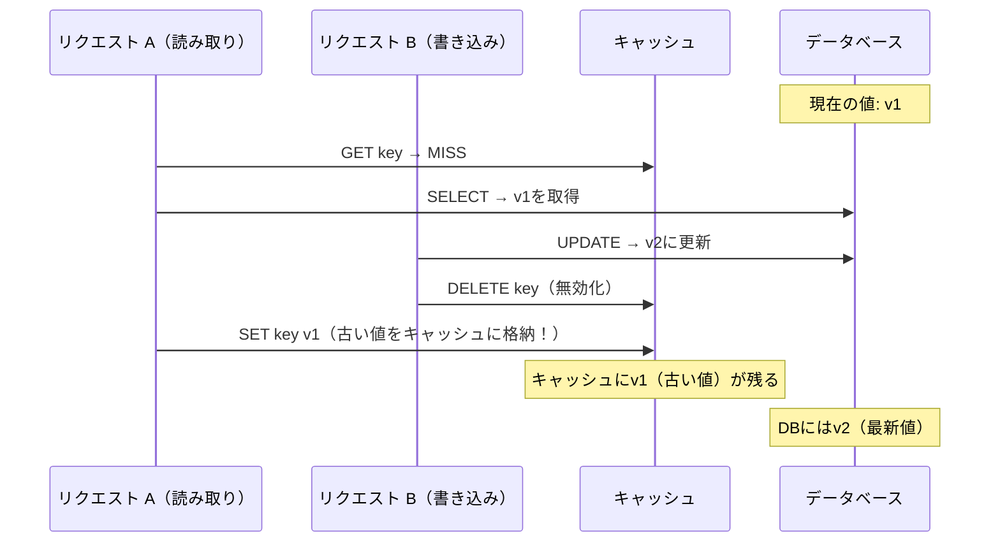

このシナリオでは、リクエストAがDBからv1を読み取った後、リクエストBがDBを更新しキャッシュを無効化するが、その後にリクエストAが古いv1をキャッシュに格納してしまう。結果として、キャッシュにはDBと異なる古い値が残り続ける。

**緩和策：**

- **TTLの設定**：最悪の場合でもTTL切れにより古いキャッシュは自然に消滅する
- **遅延無効化（Delayed Invalidation）**：DB更新後に短い遅延を入れてから2回目のキャッシュ無効化を行う
- **CDC（Change Data Capture）ベースの無効化**：DBの変更ログに基づいて確実にキャッシュを無効化する

```python
def update_user(user_id: str, data: dict) -> None:
    # Step 1: Update database
    db.execute("UPDATE users SET name = %s WHERE id = %s", data["name"], user_id)

    # Step 2: Invalidate cache immediately
    cache_key = f"user:{user_id}"
    cache.delete(cache_key)

    # Step 3: Schedule delayed invalidation (e.g., 500ms later)
    schedule_delayed_task(
        delay_ms=500,
        func=cache.delete,
        args=(cache_key,)
    )
```

### 8.4 ドッグパイル効果（Dogpile Effect）

キャッシュの値が期限切れになった後、その値を再計算（DBクエリ）するのに時間がかかる場合に発生する。計算が完了するまでの間、後続のリクエストも同じ計算を開始し、バックエンドに対して不必要な負荷がかかる。

Thundering Herdと本質的には同じ問題だが、特に「計算コストが高い」場合に深刻化する。例えば、集計クエリやランキング計算のように数秒かかるクエリの場合、その間に蓄積されるリクエスト数が多くなり、DBへの負荷増大が顕著になる。

## 9. 分散キャッシュの設計考慮

### 9.1 Redis vs Memcached

分散キャッシュの二大選択肢であるRedisとMemcachedには、それぞれ異なる特性がある。

| 観点 | Redis | Memcached |
|---|---|---|
| データ構造 | String, Hash, List, Set, Sorted Set, Stream | String（Key-Value）のみ |
| 永続化 | RDB / AOF | なし（純粋なキャッシュ） |
| レプリケーション | ネイティブ対応（マスター-レプリカ） | なし（クライアント側で分散） |
| クラスタリング | Redis Cluster（ハッシュスロット） | クライアント側のConsistent Hashing |
| メモリ効率 | やや低い（メタデータのオーバーヘッド） | 高い（slab allocator） |
| マルチスレッド | I/Oスレッド対応（Redis 6+） | マルチスレッド対応 |
| Pub/Sub | 対応 | なし |
| Lua スクリプト | 対応 | なし |

**Redisが適するケース：** キャッシュ以外の用途（セッション管理、レートリミッター、ランキング）も兼ねる場合、データの永続性が必要な場合、リッチなデータ構造が必要な場合。

**Memcachedが適するケース：** 純粋なKey-Valueキャッシュとして使う場合、極めてシンプルかつ高スループットが求められる場合、マルチスレッドによる高並列処理が必要な場合。

### 9.2 Redis Cluster のアーキテクチャ

Redis Clusterは、16,384個のハッシュスロットをノード間で分割することでデータを分散管理する。

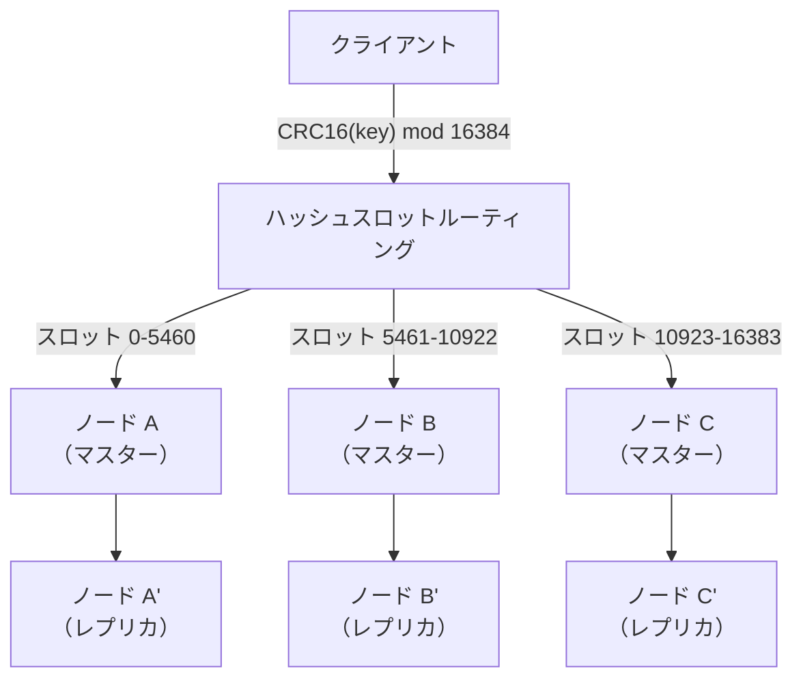

**ホットキー問題：** 特定のキーに対するアクセスが極端に偏ると、そのキーを担当するノードがボトルネックになる。対策として、キーにサフィックスを付加して複数のスロットに分散させる方式がある。

```python
import random

def get_hot_key(base_key: str, replicas: int = 10) -> str:
    # Distribute a hot key across multiple slots
    suffix = random.randint(0, replicas - 1)
    return f"{base_key}:{suffix}"

# Write: write to all replicas
for i in range(10):
    cache.set(f"popular_item:{i}", value)

# Read: read from a random replica
value = cache.get(get_hot_key("popular_item"))
```

### 9.3 シリアライゼーションフォーマット

キャッシュに格納するデータのシリアライゼーションフォーマットの選択は、パフォーマンスとメモリ効率に直接影響する。

| フォーマット | サイズ | 速度 | スキーマ進化 | デバッグ容易性 |
|---|---|---|---|---|
| JSON | 大 | 中 | 柔軟 | 高い（人間可読） |
| MessagePack | 小 | 高 | 柔軟 | 低い（バイナリ） |
| Protocol Buffers | 小 | 最速 | スキーマ定義必要 | 低い（バイナリ） |
| 言語固有（pickle等） | 中 | 高 | 脆弱 | 低い |

本番環境では、JSONの互換性とデバッグ容易性を取るか、MessagePackやProtocol Buffersのパフォーマンスを取るか、プロジェクトの要件に応じて判断する。

### 9.4 接続管理とコネクションプール

分散キャッシュへの接続管理は、パフォーマンスに大きく影響する。リクエストごとにTCP接続を確立するのではなく、コネクションプールを使用して接続を再利用する。

```python
import redis

# Connection pool for Redis
pool = redis.ConnectionPool(
    host="redis-cluster.example.com",
    port=6379,
    max_connections=50,
    socket_timeout=1.0,       # Read timeout
    socket_connect_timeout=0.5,  # Connection timeout
    retry_on_timeout=True,
    health_check_interval=30,
)

cache = redis.Redis(connection_pool=pool)
```

**タイムアウトの設計：** キャッシュへのアクセスにタイムアウトを設定し、キャッシュが遅延した場合にはDBに直接アクセスするフォールバックを用意する。キャッシュの障害がシステム全体の障害に波及しないようにする（キャッシュはあくまで「あれば高速」であり、「なければ動かない」状態にしてはならない）。

## 10. 多層キャッシュ（L1 ローカル + L2 分散）

### 10.1 なぜ多層化するのか

分散キャッシュ（Redis, Memcached）へのアクセスは、ネットワークラウンドトリップを伴う。数百マイクロ秒のレイテンシは、通常のアプリケーションでは十分高速だが、ホットパスで秒間数万回アクセスされるデータに対しては、このオーバーヘッドも無視できない。

多層キャッシュは、アプリケーションプロセス内のインメモリキャッシュ（L1）と、分散キャッシュ（L2）を組み合わせることで、さらに高い性能を実現する。

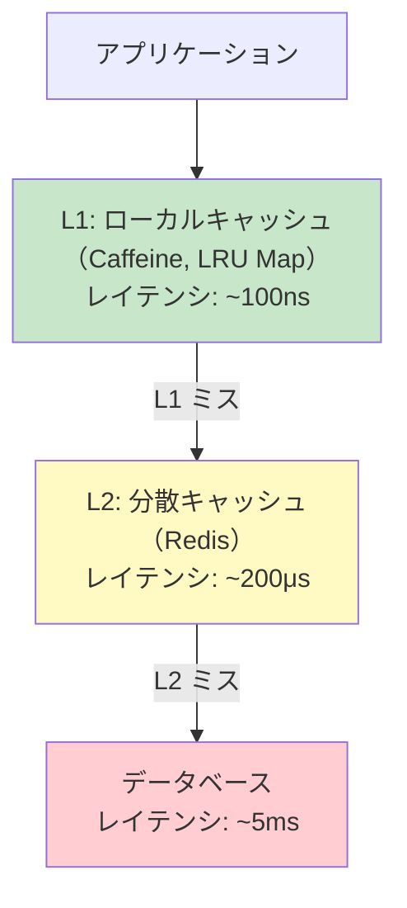

### 10.2 L1キャッシュの設計

L1キャッシュは各アプリケーションインスタンスのプロセス内に存在する。以下の特性を持つ。

- **容量制限が厳しい**：アプリケーションのヒープメモリの一部を使用するため、数千〜数万エントリが上限
- **ゼロレイテンシ**：ネットワークアクセスが不要で、メモリアクセスのみ
- **プロセス間で独立**：複数のアプリケーションインスタンスが異なるL1キャッシュを持つため、インスタンス間でデータの不整合が発生する

**エビクションポリシー（追い出しポリシー）：**

| ポリシー | 動作 | 特徴 |
|---|---|---|
| LRU（Least Recently Used） | 最も古くアクセスされたエントリを追い出す | シンプルで広く使われる |
| LFU（Least Frequently Used） | 最もアクセス頻度の低いエントリを追い出す | 頻度の偏りが大きい場合に効果的 |
| W-TinyLFU（Caffeine） | アドミッションフィルタ + LFUの組み合わせ | 理論上最も高いヒット率 |

### 10.3 L1とL2の整合性

多層キャッシュの最大の課題は、L1キャッシュ間の整合性である。インスタンスAがデータを更新してL2キャッシュを無効化しても、インスタンスBのL1キャッシュには古い値が残る。

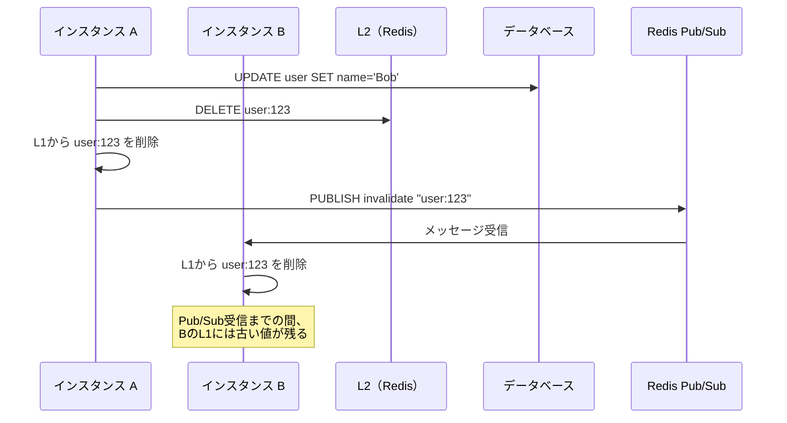

**対策：**

- **短いL1 TTL**：L1キャッシュのTTLを短く（10秒〜60秒）設定し、不整合のウィンドウを制限する
- **Pub/Subによるインバリデーション通知**：RedisのPub/Subを利用して、L1キャッシュの無効化を全インスタンスに通知する
- **L1をイミュータブルデータに限定**：変更されないデータ（例：マスタデータ、バージョン管理されたアセット）のみをL1にキャッシュし、可変データはL2のみに格納する

### 10.4 実装例

```python
class TwoLevelCache:
    def __init__(self, l1_cache, l2_cache, db_client, pubsub):
        self.l1 = l1_cache     # e.g., cachetools.TTLCache
        self.l2 = l2_cache     # e.g., Redis client
        self.db = db_client
        self.pubsub = pubsub

        # Subscribe to invalidation channel
        self.pubsub.subscribe("cache:invalidate", self._on_invalidate)

    def get(self, key: str) -> dict:
        # Check L1 first
        value = self.l1.get(key)
        if value is not None:
            return value

        # Check L2
        cached = self.l2.get(key)
        if cached is not None:
            value = json.loads(cached)
            self.l1[key] = value  # Promote to L1
            return value

        # Cache miss — query DB
        value = self.db.query("SELECT * FROM data WHERE key = %s", key)
        if value:
            self.l2.setex(key, 3600, json.dumps(value))  # L2 TTL: 1 hour
            self.l1[key] = value  # L1 TTL: managed by TTLCache
        return value

    def invalidate(self, key: str) -> None:
        self.l1.pop(key, None)
        self.l2.delete(key)
        # Notify other instances
        self.pubsub.publish("cache:invalidate", key)

    def _on_invalidate(self, message: str) -> None:
        key = message
        self.l1.pop(key, None)  # Remove from local L1
```

## 11. キャッシュの監視とメトリクス

### 11.1 核となるメトリクス

キャッシュシステムの健全性を監視するために、以下のメトリクスを継続的に計測する必要がある。

**ヒット率（Hit Rate）：**

$$
\text{Hit Rate} = \frac{\text{Cache Hits}}{\text{Cache Hits} + \text{Cache Misses}} \times 100\%
$$

ヒット率はキャッシュの有効性を示す最も基本的な指標である。一般的に、90%以上のヒット率が望ましく、95%以上であれば優れた状態と言える。ヒット率が低い場合は、TTLが短すぎる、キャッシュサイズが不足している、あるいはアクセスパターンがキャッシュに適していない可能性を疑う。

**エビクション率（Eviction Rate）：**

メモリ不足により追い出されたエントリの頻度を示す。エビクション率が高い場合、キャッシュのメモリを増やすか、TTLを短くして不要なエントリを早期に解放する必要がある。

**レイテンシ分布：**

キャッシュヒット時とミス時のレイテンシをそれぞれ計測する。特にp50（中央値）、p95、p99のパーセンタイルを監視する。キャッシュミス時のレイテンシが急増している場合、DBの性能劣化を示唆する。

### 11.2 監視ダッシュボードの構成

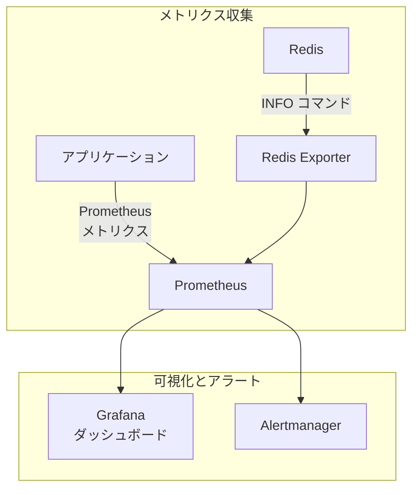

**監視すべきRedisメトリクス：**

| メトリクス | 取得方法 | 意味 |
|---|---|---|
| `keyspace_hits` / `keyspace_misses` | `INFO stats` | ヒット/ミス数 |
| `used_memory` / `maxmemory` | `INFO memory` | メモリ使用率 |
| `evicted_keys` | `INFO stats` | 追い出されたキー数 |
| `connected_clients` | `INFO clients` | 接続数 |
| `instantaneous_ops_per_sec` | `INFO stats` | 秒間操作数 |
| `latency` | `LATENCY HISTORY` | コマンドごとのレイテンシ |

### 11.3 アラート設計

以下のような条件でアラートを設定する。

| 条件 | 重大度 | 対応 |
|---|---|---|
| ヒット率 < 80%（5分間） | Warning | TTLやキャッシュ戦略を見直す |
| ヒット率 < 50%（5分間） | Critical | キャッシュノードの障害を確認 |
| メモリ使用率 > 90% | Warning | キャッシュサイズの拡張を検討 |
| エビクション率の急増 | Warning | メモリ不足、ホットキーの調査 |
| レイテンシ p99 > 10ms | Warning | ネットワークやRedisの負荷を調査 |
| 接続数がプール上限に近い | Warning | コネクションプールの拡張 |

### 11.4 キャッシュの可観測性の実装

アプリケーション側でキャッシュ操作にメトリクスを埋め込む例を示す。

```python
from prometheus_client import Counter, Histogram

cache_hits = Counter("cache_hits_total", "Cache hit count", ["cache_name", "key_prefix"])
cache_misses = Counter("cache_misses_total", "Cache miss count", ["cache_name", "key_prefix"])
cache_latency = Histogram(
    "cache_operation_duration_seconds",
    "Cache operation latency",
    ["cache_name", "operation"],
    buckets=[0.0001, 0.0005, 0.001, 0.005, 0.01, 0.05, 0.1]
)

class InstrumentedCache:
    def __init__(self, cache_client, cache_name: str):
        self.cache = cache_client
        self.name = cache_name

    def get(self, key: str):
        prefix = key.split(":")[0] if ":" in key else key

        with cache_latency.labels(self.name, "get").time():
            value = self.cache.get(key)

        if value is not None:
            cache_hits.labels(self.name, prefix).inc()
        else:
            cache_misses.labels(self.name, prefix).inc()

        return value
```

## 12. パターンの選択指針

### 12.1 意思決定フロー

以下のフローチャートは、どのキャッシュパターンを選択すべきかの指針を示す。

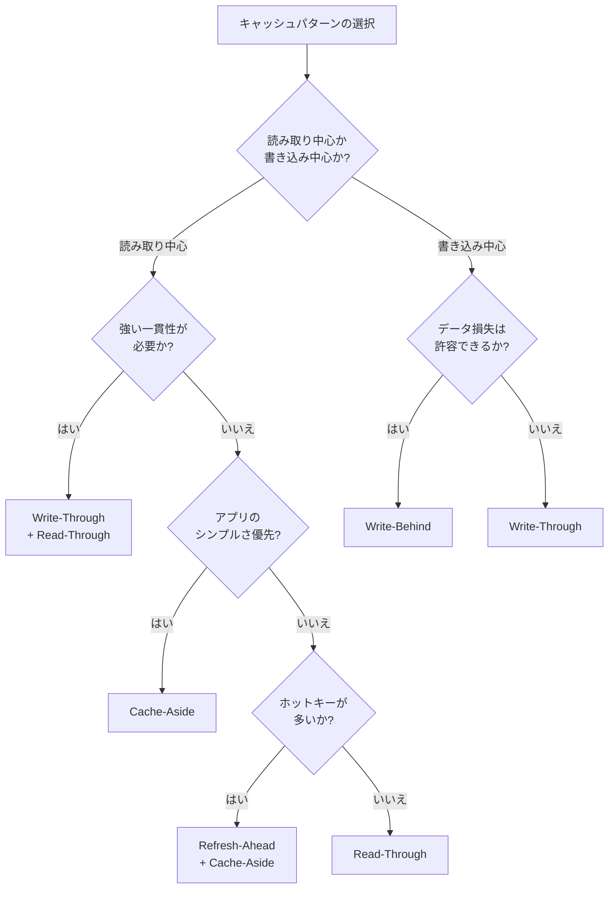

### 12.2 パターン比較まとめ

| パターン | 読み取りレイテンシ | 書き込みレイテンシ | 一貫性 | 実装複雑度 | データ損失リスク |
|---|---|---|---|---|---|
| Cache-Aside | 初回は遅い | DB依存 | 中 | 低 | なし |
| Read-Through | 初回は遅い | DB依存 | 中 | 低〜中 | なし |
| Write-Through | 常に高速 | やや遅い | 高 | 中 | なし |
| Write-Behind | 常に高速 | 高速 | 低 | 高 | あり |
| Refresh-Ahead | 常に高速 | DB依存 | 中 | 中〜高 | なし |

### 12.3 実世界での採用例

**Amazonのショッピングカート**：Cache-Asideをベースに、DynamoDBとの組み合わせで高い可用性を実現。カートの読み取りは高頻度だが、更新は比較的低頻度であるため、Cache-Asideの特性に合致する。

**Twitterのタイムライン**：Write-Behindに類似したファンアウト（fan-out）方式を採用。ツイートの投稿時に、フォロワーのタイムラインキャッシュに非同期で書き込む。

**Facebook（Meta）のMemcacheアーキテクチャ**：多層キャッシュとリージョン間のインバリデーション通知を組み合わせた大規模システム。リージョナルプール（分散キャッシュ）とローカルキャッシュの二層構造で、リード負荷の大半をキャッシュで吸収する。

## 13. まとめ

キャッシュパターンの選択は、システムのワークロード特性（読み取り/書き込み比率）、一貫性要件、レイテンシ要件、データ損失の許容度によって決まる。

最も重要なのは、キャッシュを「銀の弾丸」として扱わないことである。キャッシュは性能を向上させる強力なツールだが、同時に一貫性の問題、運用の複雑さ、障害モードの増加をもたらす。キャッシュを導入する前に、まずデータベースのクエリ最適化、インデックス設計、接続プーリングといった基本的な最適化を行うべきである。

その上で、キャッシュが必要と判断された場合には、まずCache-Asideから始めることを推奨する。Cache-Asideは最もシンプルで理解しやすく、多くのユースケースで十分な性能を発揮する。より高度なパターン（Write-Behind, Refresh-Ahead, 多層キャッシュ）は、明確な性能要件やスケーラビリティ要件が存在する場合に段階的に導入すればよい。

キャッシュの設計と運用は、理論だけでなく実際のワークロードに基づく検証とチューニングが不可欠である。本記事で解説した各パターンの特性を理解した上で、自身のシステムに最適なキャッシュ戦略を構築していただきたい。
