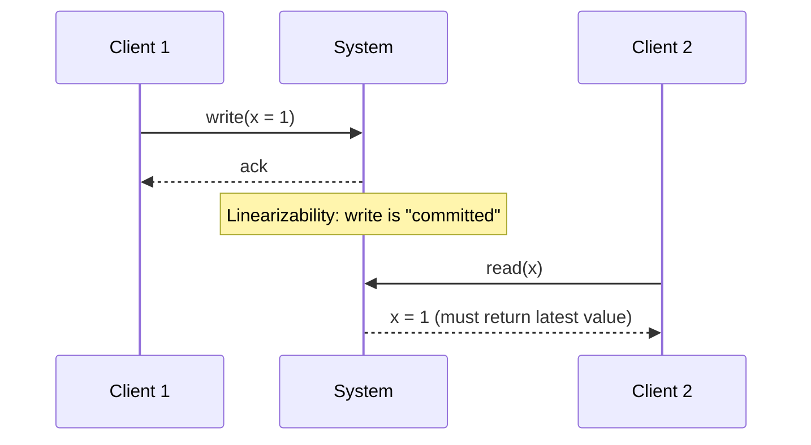
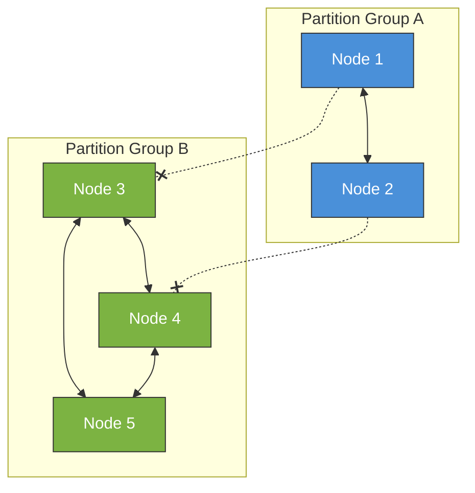
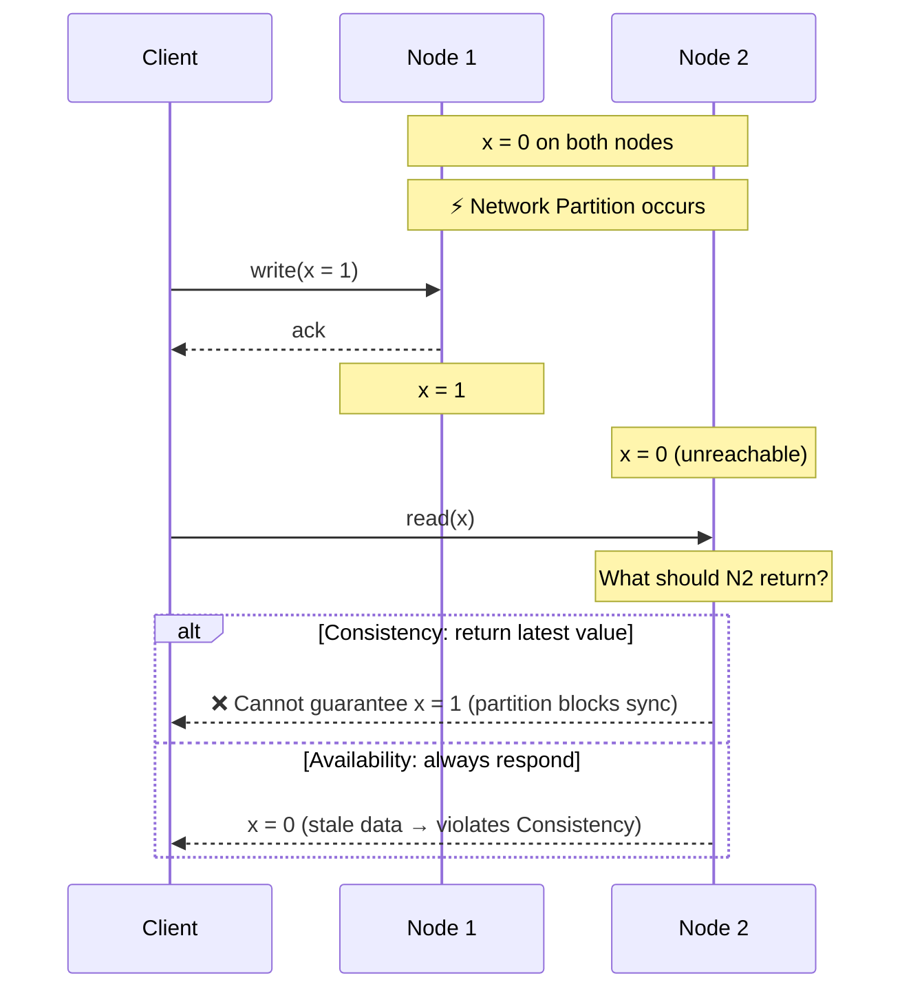
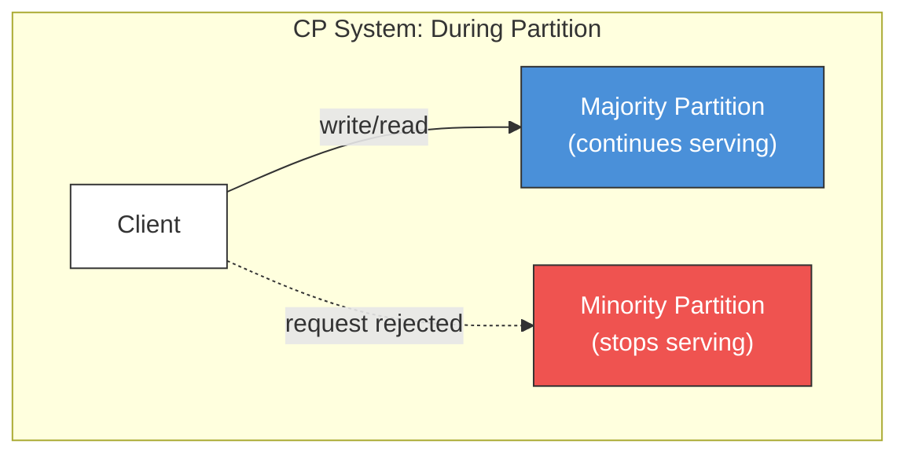
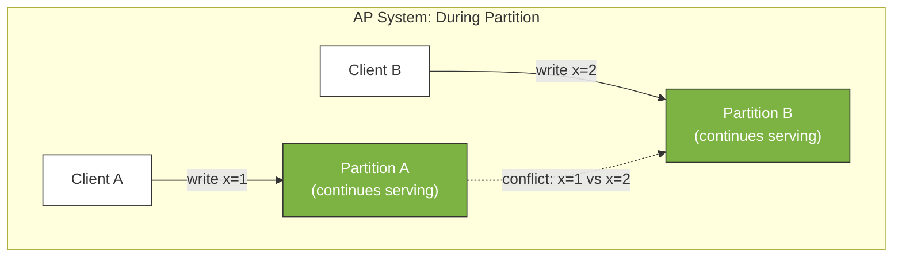
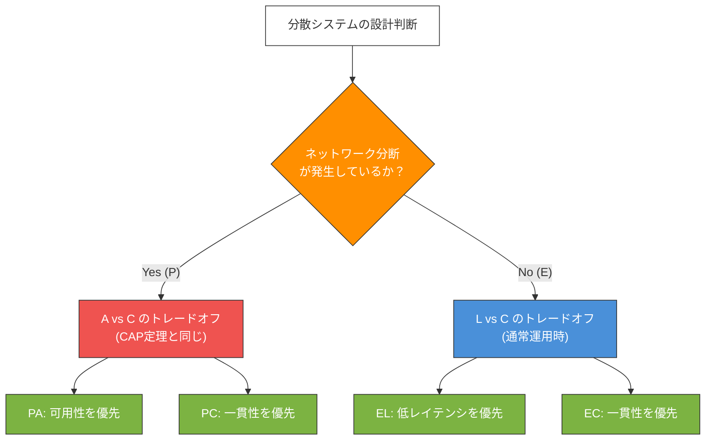
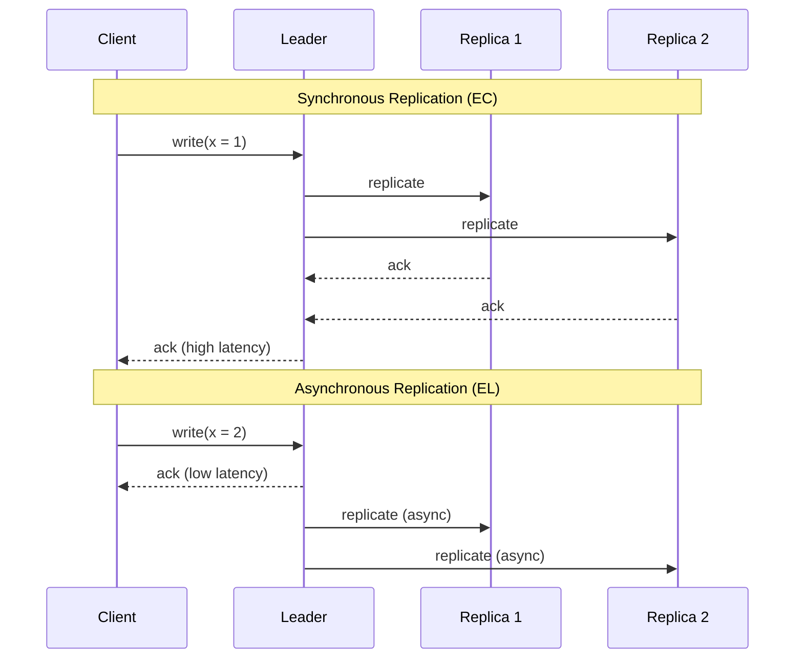
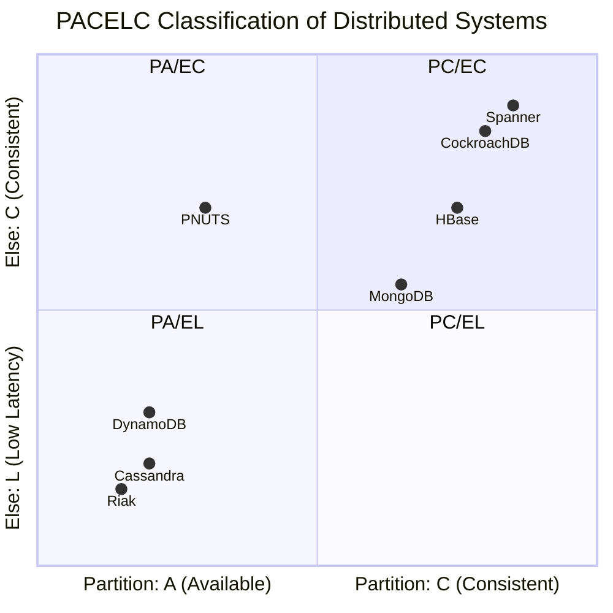
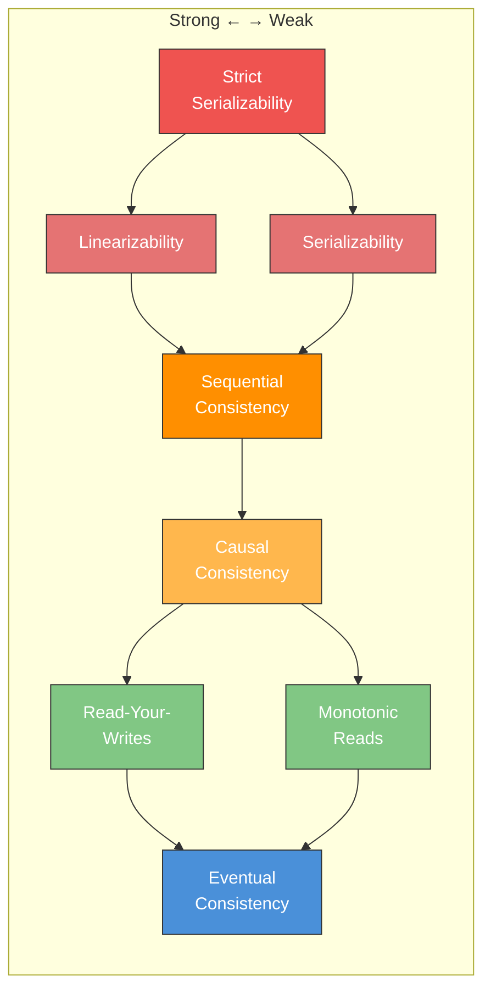
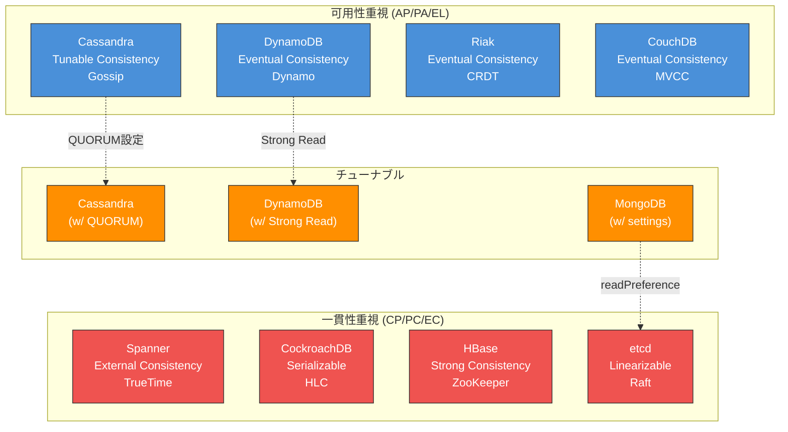

# CAP定理とPACELC — 分散システムのトレードオフを理解する

## 1. はじめに：分散システムが直面する根本的なジレンマ

分散システムの設計において、最も根本的な問いのひとつは「ネットワーク障害が発生したとき、システムはどう振る舞うべきか」である。データを複数のノードに分散して保持するシステムでは、ノード間の通信が途絶した瞬間に、設計者は避けがたい選択を迫られる。**古いデータを返してでも応答し続けるか、正確なデータを返せるようになるまで応答を拒否するか**。

この問いに対する理論的な枠組みを与えたのが**CAP定理**である。2000年にEric Brewerが予想として提示し、2002年にSeth GilbertとNancy Lynchによって厳密に証明されたこの定理は、分散システムの設計における三者択一のトレードオフを明確にした。

CAP定理は、分散システムの教科書やアーキテクチャ議論において最も頻繁に引用される定理のひとつだが、同時に**最も誤解されている定理**でもある。「3つのうち2つしか選べない」という簡潔なスローガンが独り歩きし、実際のシステム設計で必要な繊細な判断を覆い隠してしまうことが少なくない。

本記事では、CAP定理の歴史的背景と厳密な定義から始め、なぜ3つの性質を同時に満たせないのかを直感的に理解する。そして、CAP定理への批判と限界を踏まえ、Daniel Abadiが提唱したPACELC定理による拡張、一貫性モデルのスペクトラム、実世界のシステム分類、そして設計上の教訓までを包括的に解説する。

## 2. CAP定理の歴史的背景

### 2.1 Eric Brewerの予想（2000年）

CAP定理の起源は、2000年にカリフォルニア大学バークレー校のEric Brewerが、ACM Symposium on Principles of Distributed Computing（PODC）の基調講演で提示した予想（Brewer's Conjecture）に遡る。

Brewerは当時、Inktomi（後にYahooに買収される検索エンジン企業）での実務経験を背景に、分散Webサービスの設計において以下の3つの性質のうち、同時に達成できるのは最大2つであるという主張を行った。

- **Consistency（一貫性）**: すべてのノードが同時に同じデータを参照できる
- **Availability（可用性）**: すべてのリクエストに応答が返る
- **Partition Tolerance（分断耐性）**: ネットワークが分断されてもシステムが動作し続ける

この予想の背景には、1990年代後半から2000年代初頭にかけてのインターネット企業の急速な成長がある。単一のデータベースサーバーでは処理しきれない規模のトラフィックに対応するため、データを複数のノードに分散する必要性が高まっていた。しかし、分散化に伴い、一貫性と可用性の間のトレードオフが実務上の深刻な問題として浮上していたのである。

### 2.2 Gilbert-Lynchの証明（2002年）

Brewerの予想は、2002年にMITのSeth GilbertとNancy Lynchによって厳密に証明された。彼らの論文「Brewer's Conjecture and the Feasibility of Consistent, Available, Partition-Tolerant Web Services」は、非同期ネットワークモデルにおいてCAP定理が定理として成立することを示した。

この証明が重要なのは、Brewerの直感的な予想に対して、**形式的なシステムモデルと数学的な証明を与えた**点である。Gilbert-Lynchの論文は、各性質を厳密に定義したうえで、3つすべてを満たすシステムが存在しないことを背理法で示した。

### 2.3 Brewerの再考（2012年）

CAP定理の提唱から12年後、Brewer自身がIEEE Computer誌に「CAP Twelve Years Later: How the 'Rules' Have Changed」という論文を発表した。この論文で、Brewerは以下の重要な指摘を行っている。

> "The 'two out of three' formulation is misleading. [...] Partition is not a choice — it's a reality of distributed systems."

すなわち、「3つのうち2つを選ぶ」という定式化は誤解を招くものであり、ネットワーク分断は「選択するもの」ではなく「現実として発生するもの」であるという認識が示された。この再考が、後のPACELC定理の議論につながっていく。

## 3. CAP定理の厳密な定義

CAP定理を正確に理解するためには、各性質の厳密な定義を押さえる必要がある。Gilbert-Lynchの証明に基づく定義を以下に示す。

### 3.1 Consistency（一貫性）

CAP定理における一貫性は、**Linearizability（線形化可能性）** と同等の強い一貫性を指す。これはACIDにおけるConsistencyとは異なる概念である。

Linearizabilityとは、以下の性質を満たす一貫性モデルである。

- すべての操作が、その**呼び出しから応答までの間のある一時点**で即座に実行されたかのように見える
- すべてのクライアントは、**最新の書き込み結果を反映した値**を読み取る
- 操作の順序は、外部の観察者にとって矛盾がない



重要な点として、CAP定理における「一貫性」は、すべてのノードが同じデータを持つことではない。**ある書き込みが完了した後、すべての読み取りがその書き込みを反映した値を返す**ことを要求する。これは非常に強い保証である。

### 3.2 Availability（可用性）

CAP定理における可用性は、以下のように定義される。

- 障害が発生していないノードが受信した**すべてのリクエスト**に対して、**必ず応答を返す**
- 応答がエラーでないことが要求される（タイムアウトや接続拒否は可用性の違反）

ここで注意すべきは、可用性の定義には**応答時間の上限が含まれない**点である。10分後に応答を返しても、定義上は「可用」である。ただし、実用的には応答時間が重要であることは言うまでもない。

また、この定義における「すべてのリクエスト」は、**障害の起きていない任意のノード**に対するものであることも重要である。ネットワーク分断によってクライアントが到達できないノードについては、可用性の判定対象外となる。

### 3.3 Partition Tolerance（分断耐性）

ネットワーク分断（Network Partition）とは、ネットワーク上のノード群が2つ以上のグループに分かれ、グループ間の通信が不可能になる状態を指す。



Partition Toleranceは、ネットワーク上のノード間で**任意のメッセージが消失**してもシステムが正しく動作し続けることを要求する。ここでいう「正しく動作」とは、一貫性と可用性の要件に従って動作するという意味である。

### 3.4 三つの性質のまとめ

| 性質 | 定義 | 実用的な意味 |
|------|------|------------|
| **Consistency** | Linearizability。すべての読み取りが最新の書き込みを反映する | 「古いデータ」を読むことがない |
| **Availability** | 障害のないノードは必ず応答を返す | リクエストがタイムアウトしない |
| **Partition Tolerance** | ネットワーク分断下でもシステムが動作する | ノード間の通信断に耐える |

## 4. なぜ3つ全てを同時に満たせないのか

### 4.1 証明の直感的理解

CAP定理の証明を直感的に理解するために、最も単純なケースを考える。2つのノード $N_1$ と $N_2$ があり、それぞれが同じデータ $x$ のコピーを保持しているとする。初期状態で $x = 0$ である。



このシナリオにおいて何が起きるかを追う。

**ステップ 1**: ネットワーク分断が発生し、$N_1$ と $N_2$ の間の通信が不可能になる。

**ステップ 2**: クライアントが $N_1$ に `write(x = 1)` を送信する。$N_1$ は書き込みを受け付ける。

**ステップ 3**: クライアントが $N_2$ に `read(x)` を送信する。このとき、$N_2$ は2つの選択肢に直面する。

- **選択肢A（一貫性を優先）**: $N_2$ は最新の値（$x = 1$）を返す必要があるが、$N_1$ と通信できないため最新の値を知り得ない。したがって、$N_2$ はリクエストに応答できない。これは**可用性の違反**である。
- **選択肢B（可用性を優先）**: $N_2$ は手元にある値 $x = 0$ を返す。クライアントは応答を受け取れるが、この値は最新ではない。これは**一貫性の違反**である。

ネットワーク分断が発生している（Partition Toleranceが必要な）状況では、一貫性と可用性のどちらかを犠牲にせざるを得ない。これがCAP定理の本質である。

### 4.2 もう少し形式的な議論

Gilbert-Lynchの証明をもう少し形式的に述べる。

**仮定**: Consistency、Availability、Partition Toleranceの3つすべてを満たすシステム $S$ が存在すると仮定する。

**構成**: ネットワーク分断により、ノード集合が2つの空でない部分集合 $G_1$ と $G_2$ に分かれ、$G_1$ と $G_2$ 間のすべてのメッセージが消失するとする。

**矛盾の導出**:

1. $G_1$ に属するノードに書き込み操作 $w$ を送信する。Availabilityにより、$G_1$ のノードは $w$ を受理し応答する。
2. 続いて、$G_2$ に属するノードに読み取り操作 $r$ を送信する。Availabilityにより、$G_2$ のノードは $r$ に応答する。
3. $G_1$ と $G_2$ 間のメッセージはすべて消失しているため、$G_2$ のノードは $w$ の結果を知り得ない。
4. したがって、$G_2$ のノードが返す値は $w$ を反映していない。これはConsistency（Linearizability）に矛盾する。

よって、3つすべてを満たすシステムは存在しない。$\square$

### 4.3 Partition Toleranceは「選択」ではない

上記の証明から明らかになる重要な洞察がある。ネットワーク分断は、設計者が「選ぶ」ものではなく、**現実の分散システムにおいて不可避的に発生する現象**である。

> [!WARNING]
> 「CAP定理では3つのうち2つを選ぶ」という表現は技術的に正しいが、実用的には誤解を招く。現実の分散システムでは、ネットワーク分断は必ず発生する。したがって、実質的な選択は**CとA（ネットワーク分断時にどちらを優先するか）** の二択である。

物理的にネットワーク分断が発生する原因として、以下のようなものが挙げられる。

- ネットワークスイッチの障害
- ケーブルの切断
- ファイアウォールの設定ミス
- データセンター間の接続断
- クラウドプロバイダ内のAvailability Zone間の通信障害
- BGPの設定ミスによるルーティング異常

Googleのような大規模インフラでさえ、ネットワーク分断は定期的に発生していることが報告されている。Peter BailisとKyle Kingsburyの調査によると、Googleの内部ネットワークで年間数十回のネットワーク分断が観測されている。

## 5. CP、APシステムの具体例

CAP定理に基づき、分散システムは分断発生時の振る舞いによってCPシステムとAPシステムに分類される。

### 5.1 CPシステム（Consistency + Partition Tolerance）

CPシステムは、ネットワーク分断時に**一貫性を優先し、可用性を犠牲にする**。分断中は一部のリクエストがエラーやタイムアウトになる可能性があるが、返される応答は常に正確である。



**代表的なCPシステム**:

| システム | 説明 |
|----------|------|
| **ZooKeeper** | 分断時に過半数（Quorum）に属さないノードは読み書きを拒否する |
| **etcd** | Raftコンセンサスに基づく。リーダーが属さない側のノードは書き込みを受け付けない |
| **HBase** | ZooKeeper上に構築され、リージョンサーバーがマスターと通信できない場合はサービスを停止する |
| **MongoDB（デフォルト設定）** | レプリカセットにおいて、プライマリが過半数と通信できない場合はステップダウンする |
| **Google Spanner** | TrueTimeを活用しつつ、分断時は一貫性を優先する |

ZooKeeperを例に、CPの振る舞いを具体的に見てみる。5台のZooKeeperアンサンブルが3台と2台に分断された場合、3台側（過半数）は引き続きクライアントリクエストを処理できるが、2台側はリーダーとの接続を失い、新しいリーダー選出にも参加できないため、クライアントリクエストを拒否する。

### 5.2 APシステム（Availability + Partition Tolerance）

APシステムは、ネットワーク分断時に**可用性を優先し、一貫性を犠牲にする**。分断中もすべてのノードがリクエストに応答するが、ノード間でデータの不一致が生じる可能性がある。



**代表的なAPシステム**:

| システム | 説明 |
|----------|------|
| **Cassandra** | 全ノードが書き込みを受け付ける。分断復旧後にLast-Write-Winsや修復メカニズムで整合性を回復 |
| **DynamoDB** | 高可用性を最優先に設計。Eventual Consistencyがデフォルト |
| **CouchDB** | マルチマスターレプリケーションを採用。競合はアプリケーション層で解決 |
| **Riak** | Dynamo論文に基づく設計。Vector Clockによる競合検出 |
| **DNS** | 名前解決は結果整合性モデル。TTLによるキャッシュの期限切れで最終的に整合する |

Cassandraを例に、APの振る舞いを具体的に見てみる。Cassandraでは、`consistency level = ONE` に設定した場合、書き込みは1台のレプリカに書き込まれた時点で成功とみなされる。ネットワーク分断中に異なるレプリカに対して同じキーへの書き込みが行われた場合、分断復旧後にタイムスタンプベースのLast-Write-Wins（LWW）ルールで競合が解決される。

### 5.3 「CA」システムは存在するか

理論上、CAシステム（Consistency + Availabilityを満たし、Partition Toleranceを犠牲にするシステム）も存在しうるが、**実用的な分散システムとしてのCAは意味をなさない**。

前述のとおり、ネットワーク分断は現実の分散システムにおいて不可避である。Partition Toleranceを「犠牲にする」とは、ネットワーク分断が発生した場合にシステムの動作について一切の保証をしないことを意味する。これは単に「分散していない」システム、すなわち単一ノードのデータベースに帰着する。

> [!NOTE]
> 単一ノードのRDBMS（例：PostgreSQL、MySQL）は、ネットワーク分断の概念が存在しないため、CとAの両方を満たす。しかし、これは「CAP定理においてCAを選択した」のではなく、そもそも**CAP定理の対象外**（分散システムではない）と考えるのが適切である。

## 6. CAP定理への批判と誤解

CAP定理は分散システムの理論において重要な位置を占めるが、その簡潔さゆえに多くの誤解と批判を生んできた。ここでは主要な批判と誤解を整理する。

### 6.1 「3つのうち2つを選ぶ」は過度な単純化

CAP定理を「C、A、Pのうち2つを選べ」と解釈するのは、最も広く見られる誤解である。この解釈には以下の問題がある。

**問題1: Pは選択肢ではない**。前述のとおり、ネットワーク分断は現実の分散システムでは不可避である。したがって、実際の選択は「分断発生時にCとAのどちらを優先するか」という二択である。

**問題2: 二項対立ではなくスペクトラム**。CAP定理の定義では、ConsistencyはLinearizabilityを意味するが、実際のシステムはLinearizabilityから Eventual Consistencyまでの連続的なスペクトラム上のどこかに位置する。CとAの「どちらか」ではなく、「どの程度のCを、どの程度のAとトレードオフするか」が実際の設計判断である。

**問題3: 分断はバイナリではない**。「ネットワークが分断されている or されていない」というバイナリな見方は現実を反映していない。実際には、遅延の増大、パケットロスの増加、部分的な接続障害など、グラデーションのある障害が発生する。

### 6.2 通常運用時のトレードオフを無視している

CAP定理は**ネットワーク分断が発生している間**のトレードオフについてのみ述べている。しかし、分散システムは大部分の時間において正常に動作しており、通常運用時にも一貫性と性能（レイテンシ）の間にトレードオフが存在する。

例えば、強い一貫性を保証するためにはQuorum書き込みが必要であり、これは単一ノードへの書き込みよりもレイテンシが高い。CAP定理はこの日常的なトレードオフについて何も語っていない。

### 6.3 ACIDのCとCAPのCの混同

データベースの文脈では、ACIDのC（Consistency）とCAPのC（Consistency）が混同されやすい。

| 概念 | 意味 |
|------|------|
| **ACIDのC** | トランザクションがデータベースの整合性制約（外部キー制約、一意性制約など）を維持すること |
| **CAPのC** | すべてのノードが同じ最新のデータを参照できること（Linearizability） |

この2つは根本的に異なる概念である。ACIDのCはアプリケーション層の制約であり、CAPのCは分散データの複製に関する制約である。

### 6.4 可用性の定義が実用から乖離している

CAP定理の可用性の定義は、「障害のないノードはすべてのリクエストに応答する」というものだが、応答時間の制約を含まない。理論的には10分後の応答も「可用」だが、実用的にはそのようなシステムは「利用不能」に等しい。

また、実際のシステムでは99.99%の可用性（年間約53分のダウンタイム）で十分とされることが多く、「すべてのリクエストに応答」という絶対的な要件は過度に厳しい。

### 6.5 Martin Kleppmannの批判

Martin Kleppmannは、その著書「Designing Data-Intensive Applications」の中で、CAP定理の実用性について批判的な見解を示している。Kleppmannの主な論点は以下である。

1. CAP定理の定義が厳密すぎて、実際のシステム設計に直接適用できない
2. 一貫性のスペクトラム（Linearizability以外の一貫性モデル）を考慮していない
3. レイテンシという重要な要素が欠如している
4. 実際の設計判断では、CAP定理よりも具体的な一貫性モデルとレイテンシのトレードオフを検討するべきである

## 7. PACELC定理

### 7.1 Daniel Abadiの提案

CAP定理への批判、特に「通常運用時のトレードオフを無視している」という批判に応える形で、Yale大学のDaniel Abadiは2010年に**PACELC定理**を提唱した（その後2012年の論文で詳細に展開した）。

PACELCは以下のように読む。

> **P**artitionが発生した場合（**A**vailabilityと**C**onsistencyのトレードオフ）、**E**lse（正常時は**L**atencyと**C**onsistencyのトレードオフ）

すなわち、PACELCは以下の2つの状況を区別する。



### 7.2 PACELCが追加する洞察

CAP定理が扱わない「通常運用時」のトレードオフとは何か。具体的に考えてみる。

ネットワーク分断が発生していない正常な状態でも、データの複製にはネットワーク通信が必要であり、一貫性の強度とレイテンシの間にトレードオフが存在する。

**強い一貫性（同期レプリケーション）の場合**:
書き込みは、すべて（または過半数）のレプリカに到達するまで完了しない。これにより一貫性は保証されるが、レイテンシが増大する。特にレプリカが地理的に分散している場合、光速の制約により数十ミリ秒から数百ミリ秒のレイテンシが発生する。

**弱い一貫性（非同期レプリケーション）の場合**:
書き込みはローカルノードへの書き込みが完了した時点で応答を返す。レプリカへの同期はバックグラウンドで行われる。レイテンシは低いが、読み取り時に最新の値が返されない可能性がある。



### 7.3 PACELCの4つの組み合わせ

PACELCに基づくと、システムは以下の4つの類型に分類される。

| 類型 | 分断時 | 通常時 | 説明 |
|------|--------|--------|------|
| **PA/EL** | 可用性優先 | 低レイテンシ優先 | 一貫性を全面的に犠牲にし、性能と可用性を最大化 |
| **PA/EC** | 可用性優先 | 一貫性優先 | 分断時は可用性を優先するが、通常時は一貫性を保証 |
| **PC/EL** | 一貫性優先 | 低レイテンシ優先 | （珍しい組み合わせ。分断時は厳格だが通常時は緩い） |
| **PC/EC** | 一貫性優先 | 一貫性優先 | 一貫性を全面的に優先し、レイテンシと可用性を犠牲にする |

### 7.4 PACELCによる主要システムの分類



具体的なシステム分類を以下の表にまとめる。

| システム | PACELC分類 | 説明 |
|----------|-----------|------|
| **DynamoDB** | PA/EL | デフォルトではEventual Consistency読み取り。可用性と低レイテンシを最優先 |
| **Cassandra** | PA/EL | デフォルト設定では可用性と低レイテンシを優先。ただしConsistency Levelの設定で調整可能 |
| **Riak** | PA/EL | Dynamo系の設計。可用性と低レイテンシを重視 |
| **PNUTS（Yahoo!）** | PA/EC | 分断時は可用性を優先するが、通常時はタイムラインの一貫性を提供 |
| **MongoDB** | PC/EC | デフォルトではプライマリへの書き込みとプライマリからの読み取りで一貫性を確保 |
| **HBase** | PC/EC | ZooKeeper上に構築。分断時は一貫性を優先 |
| **Google Spanner** | PC/EC | TrueTimeに基づく外部一貫性（External Consistency）を提供 |
| **CockroachDB** | PC/EC | Spannerに触発された設計。Serializableトランザクションを提供 |

> [!TIP]
> Cassandraは設定によって振る舞いが大きく変わる。Consistency Level を `QUORUM` に設定すれば、通常運用時には強い一貫性が得られるが、分断時には可用性が低下する（PA/EC的な振る舞い）。`ALL` に設定すれば完全な一貫性が得られるが、1台でも障害があると書き込みが失敗する（PC/EC的な振る舞い）。このように、多くのシステムは**設定によってPACELCの分類が変化する**。

## 8. 一貫性モデルのスペクトラム

CAP定理のConsistencyはLinearizabilityという最も強い一貫性モデルを指すが、実際のシステムは様々な強度の一貫性モデルを採用している。これらの一貫性モデルはスペクトラムを形成し、強い一貫性ほどコスト（レイテンシ、可用性の犠牲）が高い。

### 8.1 主要な一貫性モデル



以下に各一貫性モデルを概説する。

#### Strict Serializability（厳密な直列化可能性）

最も強い一貫性モデル。Serializability（トランザクションの直列化可能性）とLinearizability（個々の操作のリアルタイム順序保証）の両方を満たす。Google SpannerのExternal Consistencyは、このモデルに相当する。

#### Linearizability（線形化可能性）

個々の操作がリアルタイムの順序を反映する。操作Aが操作Bよりも前に完了した場合、すべての観察者はAがBより前に発生したことを確認する。CAP定理のConsistencyはこのモデルを指す。

#### Serializability（直列化可能性）

トランザクションの結果が、それらをある順序で直列に実行した場合と等価になる。ただし、その順序はリアルタイムの順序と一致する必要はない。これはデータベースのトランザクション分離レベルにおける最も強いレベルに相当する。

#### Sequential Consistency（逐次一貫性）

すべてのプロセスの操作が、ある全順序に従って実行されたかのように見え、個々のプロセス内での操作の順序はその全順序において保存される。ただし、リアルタイムの順序は保証されない。

#### Causal Consistency（因果一貫性）

因果関係のある操作は、すべてのノードで同じ順序で観察される。因果関係のない操作（並行な操作）は、ノードによって異なる順序で観察されてもよい。

因果一貫性は「Partition下でも達成可能な最強の一貫性モデル」として知られている。これは、CAP定理がLinearizabilityを対象としているのに対し、因果一貫性はネットワーク分断と両立可能であることを意味する。

#### Read-Your-Writes（自己書き込みの読み取り）

自分が書き込んだ値は、その後の読み取りで必ず反映される。他のクライアントの書き込みについては保証しない。

#### Monotonic Reads（単調読み取り）

一度ある値を読み取ったら、その後の読み取りで以前の値（より古い値）が返されることはない。

#### Eventual Consistency（結果整合性）

更新が停止した状態で十分な時間が経過すれば、最終的にすべてのレプリカが同じ値に収束する。収束までの間は、異なるレプリカが異なる値を返す可能性がある。

### 8.2 一貫性モデルの選択基準

一貫性モデルの選択は、以下の要素を考慮して行われる。

| 考慮事項 | 強い一貫性を選ぶべき場合 | 弱い一貫性で十分な場合 |
|----------|------------------------|-----------------------|
| **データの性質** | 金融取引、在庫管理、座席予約 | ソーシャルメディアのフィード、いいね数 |
| **競合の頻度** | 同一データへの同時書き込みが多い | 書き込みが分散しており競合が稀 |
| **レイテンシ要件** | 多少の遅延は許容できる | ミリ秒単位の応答が必要 |
| **地理的分散** | 単一リージョン内 | 複数リージョン/大陸間 |
| **可用性要件** | 短時間のダウンタイムは許容できる | 99.99%以上の可用性が必要 |

## 9. 実世界のシステム分類と設計判断

### 9.1 Amazon DynamoDB

DynamoDBは、AmazonのDynamo論文（2007年）の設計思想を受け継ぐキーバリューストアであり、APシステムの代表格である。

**設計思想**: Amazonは「ショッピングカートに商品を追加する操作が失敗するよりも、一時的に古いカート情報が表示される方がマシである」という判断のもと、可用性を最優先とした。

**一貫性モデル**:
- **デフォルト**: Eventual Consistency読み取り。書き込みの結果が読み取りに反映されるまでに数百ミリ秒から数秒かかる可能性がある
- **オプション**: Strongly Consistent Read。リーダーノードから読み取ることで最新の値を保証するが、レイテンシが増加し、ノード障害時に利用不能になる可能性がある

**PACELC分類**: PA/EL（デフォルト）。Strongly Consistent Readを使用する場合はPA/ECに近づく。

### 9.2 Apache Cassandra

Cassandraは、Dynamo論文とGoogle Bigtableの影響を受けた分散データベースであり、設定によってCPにもAPにもなり得る柔軟性を持つ。

**一貫性のチューニング**: Cassandraの最大の特徴は、Consistency Levelによって一貫性と可用性のトレードオフを操作単位で調整できる点である。

| Consistency Level | 振る舞い | トレードオフ |
|-------------------|---------|------------|
| `ONE` | 1台のレプリカに書き込み/読み取り | 低レイテンシ、低一貫性 |
| `QUORUM` | 過半数のレプリカに書き込み/読み取り | 中程度のレイテンシ、強い一貫性 |
| `ALL` | 全レプリカに書き込み/読み取り | 高レイテンシ、最強の一貫性、低可用性 |
| `LOCAL_QUORUM` | ローカルデータセンター内の過半数 | 地理的に分散したシステムでのバランス |

**PACELC分類**: デフォルト（`ONE`/`ONE`）ではPA/EL。`QUORUM`/`QUORUM` ではPC/EC的な振る舞いに近づく。

### 9.3 Google Spanner

Spannerは、Googleが開発したグローバル分散データベースであり、「CAPの限界に挑戦した」システムとして知られる。

**TrueTime**: Spannerの最も革新的な要素は、**TrueTime API**である。これは、GPS受信機と原子時計を組み合わせることで、各ノードの時刻の不確実性の区間を把握するAPIである。TrueTimeは時刻をスカラー値ではなく `[earliest, latest]` という区間として返す。

```
TT.now() → TTinterval: [earliest, latest]
TT.after(t) → true if t has definitely passed
TT.before(t) → true if t has definitely not arrived
```

Spannerは、トランザクションのコミット時にTrueTimeの不確実性区間だけ待機する（commit-wait）ことで、外部一貫性（External Consistency）を実現する。これは事実上のStrict Serializabilityである。

**CAP定理との関係**: SpannerはPC/ECに分類される。ネットワーク分断時には一貫性を優先し、可用性を犠牲にする。ただし、Googleの内部ネットワークの品質が極めて高いため、分断の発生頻度は低く、実質的にはCAの両方を高い水準で提供しているように見える。

Brewer自身も、Spannerについて「事実上CAを実現している」と述べつつ、厳密にはCPであると認めている。

> [!NOTE]
> SpannerがCAP定理を「破った」わけではない。Spannerは、ネットワーク分断の発生確率を極限まで低減することで、Pが発生しない（または極めて稀にしか発生しない）環境を構築し、CとAの両方を実用上達成している。理論的にはPが発生すれば一貫性を優先する（CPの振る舞い）。

### 9.4 CockroachDB

CockroachDBは、Spannerに触発されたオープンソースの分散SQLデータベースであり、Serializableトランザクションを提供する。

**設計思想**: CockroachDBは「あたかも単一ノードのSQLデータベースのように使える分散データベース」を目指している。

**一貫性モデル**: Serializableトランザクションを提供し、Raftコンセンサスを使用してデータを複製する。

**PACELC分類**: PC/EC。分断時は一貫性を優先し、通常時も一貫性を優先する。CockroachDBはTrueTimeの代わりにHybrid Logical Clock（HLC）を使用するため、Spannerほどの低レイテンシは達成できないが、専用ハードウェアを必要としない利点がある。

### 9.5 MongoDB

MongoDBは、バージョンや設定によってCAPの分類が変化する典型的な例である。

**レプリカセット構成**: デフォルトでは、書き込みはプライマリに対して行われ、プライマリからセカンダリへ非同期でレプリケーションされる。`readPreference` を `primary` にすれば、読み取りは常にプライマリから行われ、一貫性が保証される。

**PACELC分類**: デフォルト設定ではPC/EC。ただし、`readPreference: secondaryPreferred` と `writeConcern: 1` を組み合わせると、PA/EL的な振る舞いに近づく。

### 9.6 システム間の比較まとめ



## 10. 設計上の教訓

CAP定理とPACELCの理論的背景を踏まえ、実際のシステム設計に活かすべき教訓をまとめる。

### 10.1 「すべてのデータに同じ一貫性レベル」は不要

システム内のデータは、すべてが同じ一貫性要件を持つわけではない。例えば、ECサイトにおいて以下のようなデータがある。

| データ | 一貫性要件 | 理由 |
|--------|-----------|------|
| 在庫数 | 強い一貫性 | オーバーセルを防ぐため |
| 決済処理 | 強い一貫性 | 二重課金を防ぐため |
| 商品レビュー | 結果整合性 | 数秒の遅延は許容できる |
| 商品閲覧履歴 | 結果整合性 | 厳密な順序は不要 |
| おすすめ商品 | 結果整合性 | 多少古いデータでも問題ない |

一つのシステム内で、データの種類に応じて異なる一貫性レベルを適用するのは合理的な設計判断である。

### 10.2 障害モードを事前に定義せよ

CAP定理が教える最も重要な教訓は、「ネットワーク分断は発生する」という現実を受け入れ、**分断発生時のシステムの振る舞いを事前に設計する**ことである。

事前に決定すべき事項は以下のとおりである。

1. **検出**: ネットワーク分断をどうやって検出するか（タイムアウト値、ハートビート間隔）
2. **モード切替**: 分断検出後、システムの振る舞いをどう変更するか
3. **復旧**: 分断復旧後、データの不整合をどう解決するか
4. **通知**: 分断の発生と復旧をオペレーターとユーザーにどう通知するか

### 10.3 競合解決戦略を選択せよ

APシステムを採用する場合、分断復旧後のデータ競合の解決が必要となる。主要な競合解決戦略は以下のとおりである。

| 戦略 | 説明 | 適用場面 |
|------|------|---------|
| **Last-Write-Wins (LWW)** | タイムスタンプが最新の書き込みが勝つ | シンプルだが、書き込みが失われる可能性がある |
| **Application-level Resolution** | アプリケーション側でマージロジックを実装 | ビジネスロジックに基づく判断が必要な場合 |
| **CRDTs** | 数学的にマージ可能なデータ構造を使用 | カウンタ、セット、マップなどの特定のデータ型 |
| **Vector Clocks** | 因果関係を追跡し、競合を検出 | 競合の検出は自動だが、解決は手動 |

### 10.4 レイテンシを定量的に評価せよ

PACELCが示すとおり、通常運用時にも一貫性とレイテンシのトレードオフが存在する。以下の数値を把握しておくことが重要である。

| 一貫性レベル | 典型的な追加レイテンシ | 根拠 |
|-------------|---------------------|------|
| 同一データセンター内のQuorum書き込み | 1-5 ms | ネットワークRTT + ディスク書き込み |
| 同一リージョン内（マルチAZ）のQuorum書き込み | 5-20 ms | AZ間のネットワークRTT |
| クロスリージョンの同期レプリケーション | 50-200 ms | 大陸間のネットワークRTT |
| グローバルな同期レプリケーション | 100-500 ms | 太平洋/大西洋横断のRTT |

これらの数値は、一貫性モデルの選択だけでなく、データセンターの配置やレプリケーション戦略の設計にも直接影響する。

### 10.5 CAP/PACELCを超えた設計思考

CAP定理とPACELCは分散システムの設計において重要な理論的フレームワークだが、実際の設計判断はこれらの定理だけでは決まらない。以下の要素も考慮する必要がある。

**Durability（永続性）**: データが永続化される前にノードがクラッシュした場合のデータ損失リスク。これはCAPの枠組みでは扱われない。

**Scalability（拡張性）**: システムがどの程度まで水平スケールできるか。一貫性モデルの選択は、スケーラビリティに直接影響する。

**Operational Complexity（運用の複雑さ）**: 強い一貫性を提供するシステムは、運用が複雑になる傾向がある（例：Spannerは専用ハードウェアを必要とする）。

**Cost（コスト）**: 同期レプリケーションは非同期レプリケーションよりもネットワーク帯域とコンピューティングリソースを消費する。

## 11. まとめ

CAP定理は、分散システムの設計における根本的なトレードオフを明確にした画期的な定理である。しかし、その簡潔さゆえに多くの誤解を生み、実際のシステム設計に直接適用するには不十分な面がある。

本記事で論じた要点を整理する。

1. **CAP定理の本質**: ネットワーク分断が発生した場合、一貫性と可用性は同時に満たせない。これは理論的に証明された事実である。

2. **Partition Toleranceは選択肢ではない**: 現実の分散システムではネットワーク分断は不可避であり、実質的な選択はCPかAPかの二択である。

3. **PACELC定理の重要性**: CAP定理は分断時のみのトレードオフを扱うが、PACELCは通常運用時のレイテンシと一貫性のトレードオフも考慮に入れる。実際のシステム設計ではこちらの方が有用な場面が多い。

4. **一貫性はスペクトラム**: Linearizabilityから Eventual Consistencyまで、様々な強度の一貫性モデルが存在する。システムの要件に応じて適切なモデルを選択することが重要である。

5. **多くのシステムはチューナブル**: CassandraやDynamoDBのように、設定によって一貫性と可用性のバランスを調整できるシステムが主流になっている。

6. **データごとに一貫性レベルを変える**: 同一システム内でも、データの性質に応じて異なる一貫性レベルを適用するのが合理的である。

分散システムの設計者にとって重要なのは、CAP定理やPACELCを「暗記する」ことではなく、これらの理論が示すトレードオフの本質を理解し、**具体的なビジネス要件とシステム要件に基づいて、意図的かつ文書化された設計判断を行う**ことである。

> [!TIP]
> 分散システムの設計において最も危険なのは、「デフォルト設定で動いているからこれでよい」と思考停止することである。CAP定理とPACELCの知識を武器に、すべてのデータの一貫性要件を明示的に定義し、障害時の振る舞いを事前に設計しよう。

## 参考文献

- Eric Brewer, "Towards Robust Distributed Systems" (PODC 2000 Keynote)
- Seth Gilbert and Nancy Lynch, "Brewer's Conjecture and the Feasibility of Consistent, Available, Partition-Tolerant Web Services" (2002)
- Eric Brewer, "CAP Twelve Years Later: How the 'Rules' Have Changed" (IEEE Computer, 2012)
- Daniel Abadi, "Consistency Tradeoffs in Modern Distributed Database System Design" (IEEE Computer, 2012)
- Martin Kleppmann, "Designing Data-Intensive Applications" (O'Reilly, 2017)
- Giuseppe DeCandia et al., "Dynamo: Amazon's Highly Available Key-value Store" (SOSP 2007)
- James C. Corbett et al., "Spanner: Google's Globally-Distributed Database" (OSDI 2012)
- Avinash Lakshman and Prashant Malik, "Cassandra: A Decentralized Structured Storage System" (2010)
- Peter Bailis and Kyle Kingsbury, "The Network is Reliable" (ACM Queue, 2014)
