# CASとアトミック操作 — ロックフリー並行プログラミングの基盤

## 1. アトミック操作とは

### 1.1 並行プログラミングにおける根本的な問題

マルチコアプロセッサが当たり前となった現代のコンピュータにおいて、複数のスレッドが共有データに同時にアクセスすることは避けられない。しかし、共有データへの同時アクセスは**データ競合（Data Race）**という深刻な問題を引き起こす。

最も単純な例として、カウンタのインクリメントを考えてみよう。

```c
// Shared counter
int counter = 0;

// Thread 1 and Thread 2 both execute:
counter++;
```

`counter++` は一見、単一の操作に見える。しかし、CPU レベルでは以下の3つの操作に分解される。

```
1. メモリから counter の値をレジスタに読み込む (LOAD)
2. レジスタの値に 1 を加える (ADD)
3. レジスタの値をメモリに書き戻す (STORE)
```

2つのスレッドがこの操作を同時に実行した場合、以下のようなインターリーブが発生しうる。

```
Thread 1: LOAD counter → レジスタ = 0
Thread 2: LOAD counter → レジスタ = 0
Thread 1: ADD  → レジスタ = 1
Thread 2: ADD  → レジスタ = 1
Thread 1: STORE counter ← 1
Thread 2: STORE counter ← 1
// 結果: counter = 1 (期待値は 2)
```

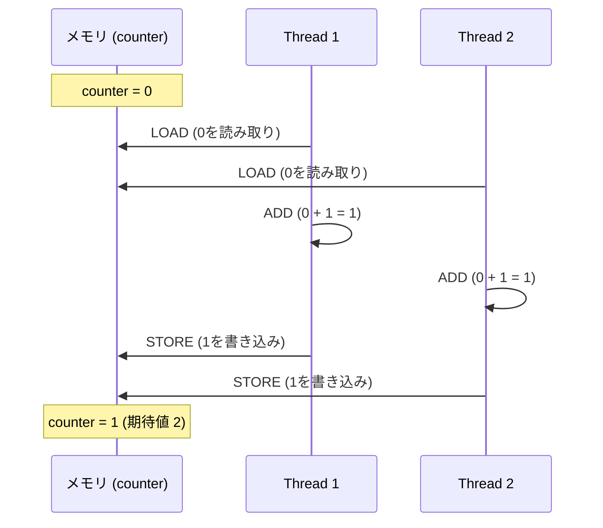

この問題は**Lost Update（更新の消失）**と呼ばれ、並行プログラミングにおける最も基本的なバグの一つである。

### 1.2 アトミック操作の定義

**アトミック操作（Atomic Operation）**とは、他のスレッドから観測したときに「完全に実行された」か「まったく実行されていない」かのいずれかの状態しか見えない操作のことである。中間状態が外部に見えることはない。

語源はギリシア語の「atomos（分割できない）」であり、その名の通り、操作が分割不可能な単位として実行されることを意味する。

アトミック操作の重要な性質は以下の3つである。

1. **不可分性（Indivisibility）**: 操作の実行中に他のスレッドが割り込むことはできない
2. **可視性（Visibility）**: 操作の結果は、完了後に他のすべてのスレッドから即座に（または指定されたメモリオーダリングに従って）観測可能になる
3. **順序性（Ordering）**: メモリオーダリングの指定に従い、他のメモリ操作との順序関係が保証される

### 1.3 アトミック操作の種類

現代のハードウェアとプログラミング言語が提供するアトミック操作は、大きく以下のカテゴリに分類される。

| 操作 | 説明 | 擬似コード |
|------|------|-----------|
| **Atomic Load** | メモリからの読み取り | `r = atomic_load(&x)` |
| **Atomic Store** | メモリへの書き込み | `atomic_store(&x, v)` |
| **Atomic Exchange** | 値の読み取りと書き込みを一つの操作で行う | `old = atomic_swap(&x, new)` |
| **Fetch-and-Add** | 加算して旧値を返す | `old = fetch_add(&x, n)` |
| **Test-and-Set** | 値を1にセットして旧値を返す | `old = test_and_set(&x)` |
| **Compare-and-Swap** | 条件付き書き換え | `ok = CAS(&x, expected, desired)` |

これらの中で最も汎用的で強力なのが**CAS（Compare-and-Swap）**である。CASがあれば、他のアトミック操作をすべてエミュレートできるため、ロックフリーアルゴリズムの基本ビルディングブロックとして広く利用されている。

## 2. CAS（Compare-And-Swap）の原理

### 2.1 CASの意味論

CASは「比較して一致したら交換する」という操作を**アトミックに**行う命令である。擬似コードで表現すると以下のようになる。

```c
// Atomic CAS pseudo-code
// Executes atomically (not interruptible)
bool compare_and_swap(int *addr, int expected, int desired) {
    if (*addr == expected) {
        *addr = desired;
        return true;   // success
    }
    return false;       // failure: *addr was not equal to expected
}
```

この操作の本質は以下の通りである。

1. メモリ位置 `addr` の現在の値を読み取る
2. その値が `expected` と**一致するかどうかを比較**する
3. 一致する場合のみ、`desired` の値に**書き換える**
4. 一致しない場合は何もしない
5. 操作の成否（一致したかどうか）を返す

重要なのは、ステップ1〜5がすべて**アトミックに**（他のスレッドから見て分割不可能な単位として）実行される点である。

### 2.2 CASによるカウンタの実装

先ほどの `counter++` の問題をCASで解決してみよう。

```c
void atomic_increment(int *counter) {
    int old_val, new_val;
    do {
        old_val = atomic_load(counter);  // Step 1: read current value
        new_val = old_val + 1;           // Step 2: compute new value
    } while (!CAS(counter, old_val, new_val));  // Step 3: attempt update
}
```

このパターンは**CASループ（CAS Loop）**または**楽観的更新（Optimistic Update）**と呼ばれる。

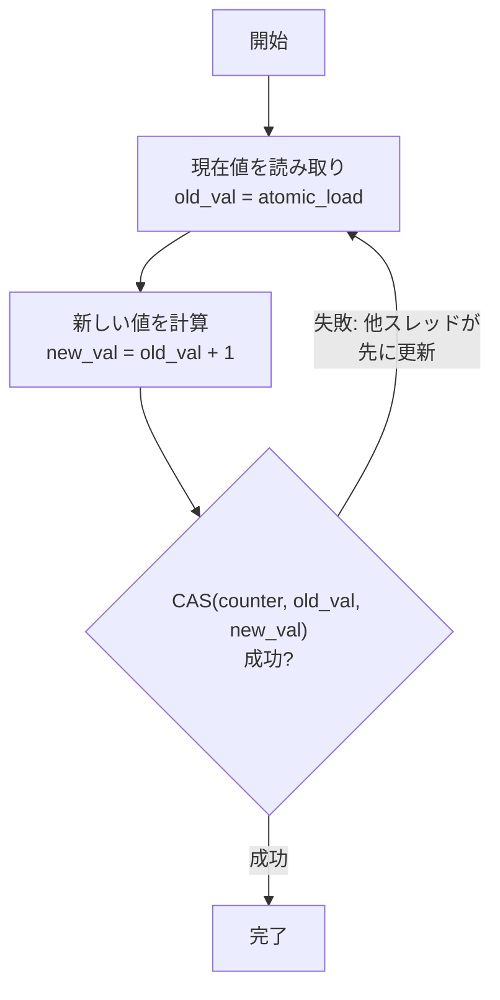

CASが失敗するのは、`atomic_load` で値を読み取った後、CASを実行するまでの間に、他のスレッドが `counter` の値を変更した場合である。この場合、`old_val` はもはや `counter` の現在値と一致しないため、CASは失敗する。失敗時はリトライし、最新の値で再度試みる。

### 2.3 CASの楽観的並行制御としての性格

CASベースのアルゴリズムは、データベースの**楽観的ロック（Optimistic Locking）**と本質的に同じ哲学を持っている。

- **楽観的アプローチ**: 「競合はめったに起きないだろう」と楽観的に仮定し、まずロックなしで処理を進める。処理の最後に競合が発生したかどうかを検証し、競合があればリトライする
- **悲観的アプローチ**: 「競合が起きるかもしれない」と悲観的に仮定し、処理の開始時にロックを取得して他のスレッドを排除する

CASベースの方式は競合が少ない場合に極めて効率的だが、競合が頻繁に発生する場合はリトライが増え、性能が劣化する。これはロックベースの方式と対照的である。

## 3. ハードウェアサポート

### 3.1 CASが実現可能な理由

CASの「比較と交換をアトミックに行う」という動作は、ソフトウェアだけでは実現できない。CPUハードウェアの直接的なサポートが必要である。現代のプロセッサは、CASを実現するために専用の命令を提供している。

大きく分けて2つのアプローチがある。

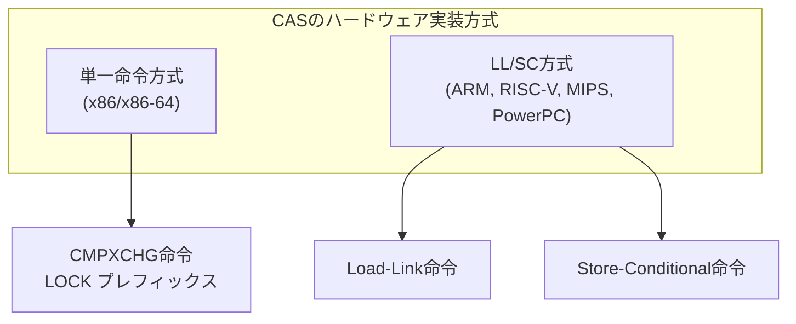

### 3.2 x86/x86-64: CMPXCHG命令

x86アーキテクチャでは、**CMPXCHG（Compare and Exchange）**命令がCASを直接実装している。Intel 80486プロセッサ（1989年）で導入され、現在に至るまで使われている。

```nasm
; x86-64 assembly: atomic CAS on [rdi]
; Compare RAX with [rdi], if equal, store RSI to [rdi]
lock cmpxchg [rdi], rsi
; If equal: ZF=1, [rdi] = RSI
; If not equal: ZF=0, RAX = [rdi] (loaded current value)
```

**`LOCK` プレフィックス**が重要である。`LOCK` なしの `CMPXCHG` はアトミックではない。`LOCK` プレフィックスを付けることで、CPUは以下の動作を保証する。

1. 対象のキャッシュラインに対する排他的アクセスを獲得する
2. 比較と交換を不可分に実行する
3. 他のプロセッサのキャッシュに対してインバリデーション（無効化）を送信する

初期のx86プロセッサでは `LOCK` プレフィックスがバスロック（メモリバス全体のロック）を引き起こし、極めて高コストだった。しかし、Pentium Pro以降のプロセッサでは**キャッシュロック**（対象のキャッシュラインのみをロック）が導入され、大幅に高速化された。

また、x86-64では64ビット幅のCASだけでなく、128ビット幅のダブルワードCASも `CMPXCHG16B` 命令として提供されている。これは後述するABA問題の解決策として重要な役割を果たす。

```nasm
; x86-64: 128-bit CAS (CMPXCHG16B)
; Compare RDX:RAX with [rdi], if equal, store RCX:RBX to [rdi]
lock cmpxchg16b [rdi]
```

### 3.3 ARM: LL/SC（Load-Link / Store-Conditional）

ARMアーキテクチャ（およびRISC-V、MIPS、PowerPC）は、CASを直接提供する代わりに、**LL/SC（Load-Link / Store-Conditional）**という命令ペアを提供する。

- **Load-Link（LL）**: メモリから値を読み込み、そのアドレスを「モニター」に登録する（ARMでは `LDREX` / `LDXR`）
- **Store-Conditional（SC）**: LLで登録されたアドレスに対して、他のプロセッサからの書き込みがなかった場合にのみ値を書き込む。成功したか失敗したかを返す（ARMでは `STREX` / `STXR`）

```
; ARMv8 assembly: CAS using LL/SC
retry:
    LDXR   W0, [X1]       ; Load-Exclusive: read value and mark address
    CMP    W0, W2          ; Compare with expected value
    B.NE   fail            ; If not equal, fail
    STXR   W3, W4, [X1]   ; Store-Exclusive: write new value if no intervening store
    CBNZ   W3, retry       ; If STXR failed (W3 != 0), retry
    RET
fail:
    ; CAS failed: current value in W0
    RET
```

LL/SCの重要な特性は、CMPXCHGとは異なり、対象アドレスへの**いかなる書き込み**も（同じ値の書き込みであっても）SCを失敗させる点である。さらに、コンテキストスイッチや割り込みもSCを失敗させることがある。これはABA問題に対してCMPXCHGよりも本質的に強い保護を提供する（ただし完全ではない）。

ARMv8.1ではCAS命令（`CASAL` 等）が直接追加されたが、内部的にはLL/SCベースの実装であることが多い。

### 3.4 LL/SCとCMPXCHGの比較

| 特性 | CMPXCHG (x86) | LL/SC (ARM) |
|------|---------------|-------------|
| **命令数** | 1命令 | 2命令（ペア） |
| **ABA検出** | 値のみ比較（ABA問題あり） | 書き込みの有無を検出（部分的にABA耐性） |
| **スプリアス失敗** | なし | あり（割り込み等で失敗する場合がある） |
| **LL/SC間の制限** | N/A | メモリアクセスや分岐に制限がある |
| **バス/キャッシュへの影響** | LOCKプレフィックスでキャッシュロック | モニター機構（軽量） |

### 3.5 キャッシュコヒーレンシプロトコルとの関係

アトミック操作のコストは、CPUキャッシュの**コヒーレンシプロトコル**と密接に関係している。最も広く使われているプロトコルは**MESI（Modified, Exclusive, Shared, Invalid）**プロトコルとその派生である。

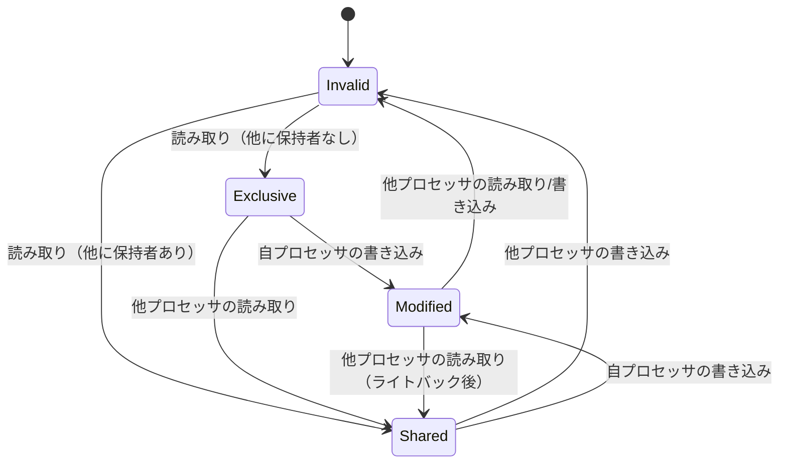

CAS操作を実行するとき、CPUは対象のキャッシュラインを**Modified**または**Exclusive**状態にする必要がある。もし他のプロセッサがそのキャッシュラインを保持していれば、**インバリデーション（無効化）メッセージ**を送信してキャッシュラインの所有権を獲得しなければならない。

このキャッシュラインの「たらい回し」（Cache Line Bouncing）が、高競合時のアトミック操作のコストの大部分を占める。特に、複数のスレッドが同じ変数に対してCASを繰り返すと、キャッシュラインが各コア間を絶えず移動し、著しい性能劣化を引き起こす。

## 4. メモリオーダリング

### 4.1 なぜメモリオーダリングが必要か

現代のCPUとコンパイラは、性能を最大化するために命令の**リオーダリング（並べ替え）**を積極的に行う。具体的には以下の最適化が行われる。

- **コンパイラの最適化**: コンパイラがメモリアクセスの順序を変更する
- **CPUのアウトオブオーダー実行**: CPUが命令を依存関係に基づいて並べ替えて実行する
- **ストアバッファ**: 書き込みがストアバッファに一時的に保持され、他のプロセッサからはまだ見えない

単一スレッドのプログラムでは、リオーダリングは観測可能な動作に影響を与えない（as-if ルール）。しかし、マルチスレッドプログラムでは、他のスレッドがリオーダリングの影響を観測できてしまう。

```c
// Initial state: x = 0, flag = 0

// Thread 1:
x = 42;          // (A)
flag = 1;         // (B)

// Thread 2:
if (flag == 1) {  // (C)
    assert(x == 42);  // (D) -- Can this fail?
}
```

直感的には、Thread 2がflag==1を読み取ったなら、xは必ず42であるはずだ。しかし、メモリオーダリングが適切でなければ以下が起こりうる。

- Thread 1のCPUが (B) を (A) より先に実行する（Store-Store リオーダリング）
- Thread 2のCPUが (D) を (C) より先に実行する（Load-Load リオーダリング）

**メモリオーダリング**は、このようなリオーダリングを制御し、スレッド間の可視性と順序を保証するための仕組みである。

### 4.2 メモリオーダリングのレベル

C++11/C11以降の標準が定義するメモリオーダリングは、以下の階層構造を持つ。弱い順序保証から強い順序保証へと並んでいる。

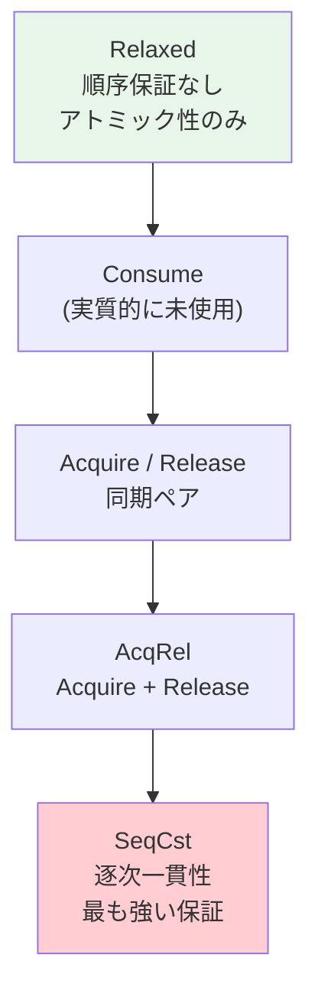

#### Relaxed（`memory_order_relaxed`）

最も弱いオーダリング。アトミック性のみが保証され、他のメモリ操作との順序関係は一切保証されない。

**用途**: 単純なカウンタ（統計情報の収集など）。他の操作との順序が重要でないケース。

```cpp
// Relaxed ordering: only atomicity is guaranteed
std::atomic<int> counter{0};

// Thread 1:
counter.fetch_add(1, std::memory_order_relaxed); // order doesn't matter

// Thread 2:
counter.fetch_add(1, std::memory_order_relaxed); // order doesn't matter

// Final value is guaranteed to be 2, but no ordering with other operations
```

#### Acquire / Release

**Release**は「ここまでの書き込みを他のスレッドに見せる」ことを保証する。具体的には、Release操作より前のすべてのメモリ書き込みが、Release操作の前に完了していることが保証される。

**Acquire**は「ここ以降の読み取りで最新のデータを見る」ことを保証する。具体的には、Acquire操作の後のすべてのメモリ読み取りが、Acquire操作の後に実行されることが保証される。

AcquireとReleaseがペアになることで、スレッド間の**happens-before関係**が成立する。

```cpp
std::atomic<bool> flag{false};
int data = 0;

// Thread 1 (producer):
data = 42;                                        // (A)
flag.store(true, std::memory_order_release);      // (B) Release: A is visible before B

// Thread 2 (consumer):
while (!flag.load(std::memory_order_acquire)) {}  // (C) Acquire: synchronizes with B
assert(data == 42);                                // (D) Guaranteed: A happens-before D
```

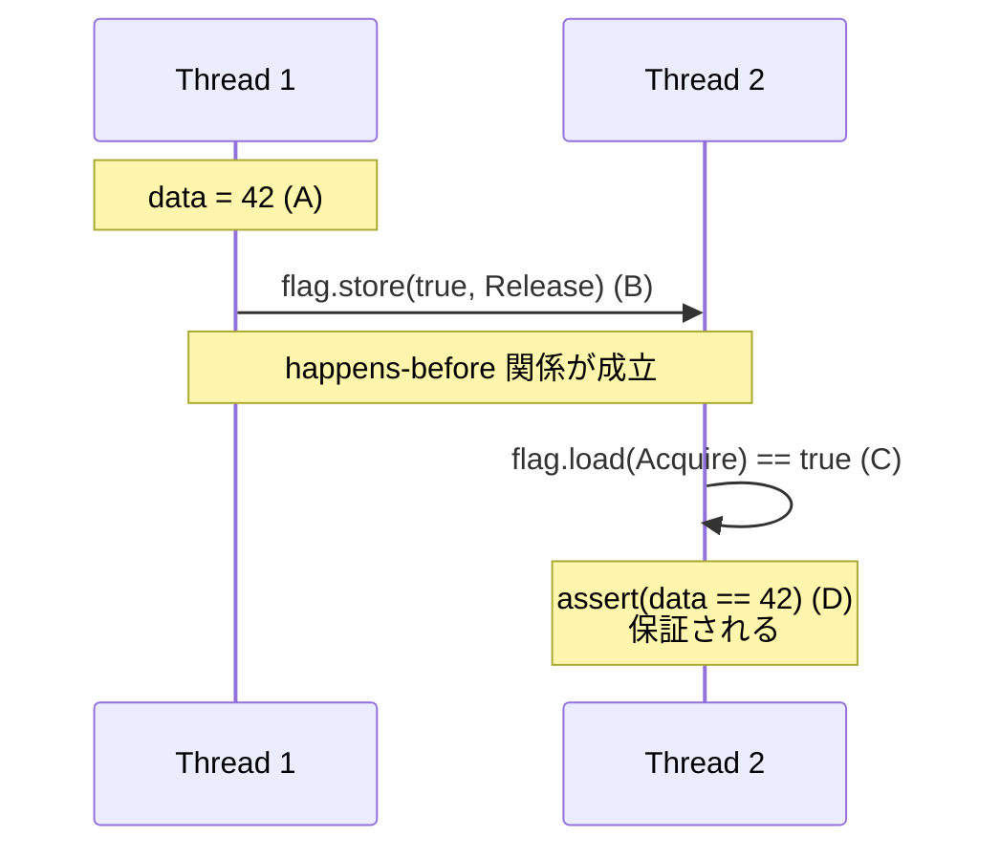

#### SeqCst（Sequential Consistency — 逐次一貫性）

最も強いメモリオーダリング。すべてのスレッドがすべてのSeqCst操作を**同一の全順序（total order）**で観測することを保証する。

```cpp
std::atomic<bool> x{false}, y{false};
int r1 = 0, r2 = 0;

// Thread 1:
x.store(true, std::memory_order_seq_cst);

// Thread 2:
y.store(true, std::memory_order_seq_cst);

// Thread 3:
if (x.load(std::memory_order_seq_cst)) {
    r1 = y.load(std::memory_order_seq_cst);  // r1 can be 0 or 1
}

// Thread 4:
if (y.load(std::memory_order_seq_cst)) {
    r2 = x.load(std::memory_order_seq_cst);  // r2 can be 0 or 1
}

// SeqCst guarantees: r1 == 0 && r2 == 0 is IMPOSSIBLE
// (At least one of x, y must appear to be stored first globally)
```

SeqCstがなければ（Acquire/Releaseのみでは）、Thread 3とThread 4が「x→yの順で書き込まれた」「y→xの順で書き込まれた」と異なる観測をする可能性がある。SeqCstはこれを防ぐ。

### 4.3 各アーキテクチャのメモリモデル

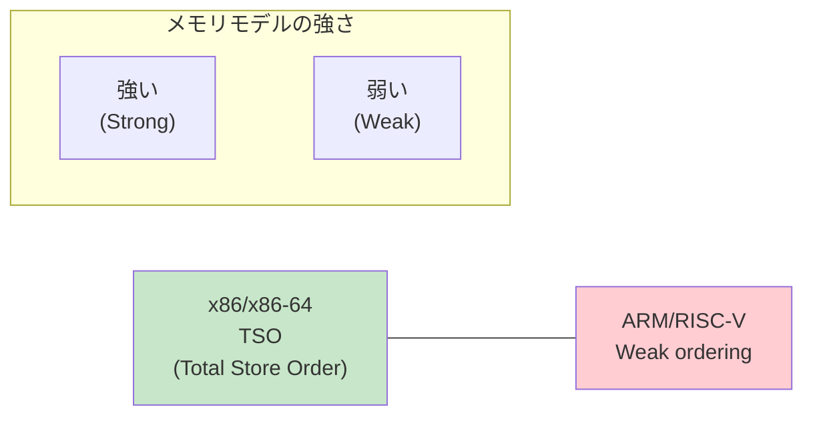

**x86のTSO（Total Store Order）**: x86は比較的強いメモリモデルを持つ。Load-Loadの順序は常に保たれ、Store-Storeの順序も常に保たれる。唯一許されるリオーダリングは**Store-Load**（ストアの後のロードが前に来る）のみである。このため、Acquire/Releaseは追加のフェンス命令なしで実現できる。SeqCstのストアのみ `MFENCE` 命令または `LOCK` プレフィックス付き命令が必要になる。

**ARMの弱いメモリモデル**: ARMはほぼすべてのリオーダリングを許可する。Load-Load、Load-Store、Store-Store、Store-Loadのすべてがリオーダリングされうる。そのため、Acquire/Releaseの実装には明示的なバリア命令（`DMB` など）や、ARMv8.3以降の `LDAR`/`STLR` 命令が必要になる。

この違いは実際の性能に直結する。x86ではRelaxedとAcquire/Releaseの性能差はほぼないが、ARMではAcquire/ReleaseやSeqCstを使うたびにメモリバリアのコストが発生する。

### 4.4 メモリオーダリングの選択指針

| 状況 | 推奨オーダリング | 理由 |
|------|----------------|------|
| 統計カウンタ | Relaxed | 他の操作との順序は不要 |
| フラグによる通知 | Acquire/Release | プロデューサ-コンシューマパターン |
| ロックの実装 | Acquire(lock) / Release(unlock) | クリティカルセクション内の操作を保護 |
| 複数変数の同期 | SeqCst | 全スレッドで一貫した順序が必要 |
| 迷ったら | SeqCst | 最も安全（ただし最もコストが高い） |

## 5. ロックフリーデータ構造の基礎

### 5.1 プログレス保証の階層

並行データ構造は、そのプログレス保証（進行保証）の強さによって分類される。

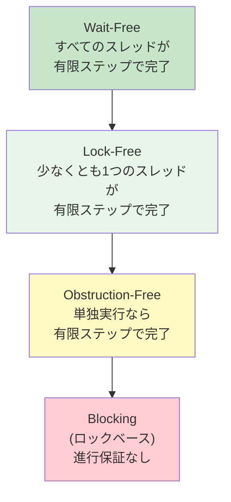

**Blocking（ロックベース）**: ロックを使う方式。ロックを保持するスレッドがスケジューラによってプリエンプトされたり、バグでデッドロックしたりすると、他のすべてのスレッドが無限に待機する可能性がある。

**Obstruction-Free**: 他のスレッドが一時停止していれば（つまり単独で実行すれば）、有限ステップで完了することが保証される。しかし、ライブロックの可能性がある。

**Lock-Free**: 複数のスレッドが同時に実行している場合でも、システム全体として少なくとも1つのスレッドが有限ステップで完了することが保証される。特定のスレッドがスタベーション（飢餓）を起こす可能性はあるが、システム全体のスループットは保証される。

**Wait-Free**: すべてのスレッドが、他のスレッドの動作に関係なく、有限ステップで完了することが保証される。最も強い保証だが、実装が複雑で、多くの場合lock-freeよりも定数倍遅い。

### 5.2 ロックフリースタック（Treiber Stack）

最も古典的なロックフリーデータ構造の一つが、R. Kent Treiber（1986年）が提案した**Treiber Stack**である。

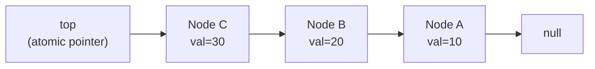

```cpp
template<typename T>
struct Node {
    T data;
    Node* next;
};

template<typename T>
class TreiberStack {
    std::atomic<Node<T>*> top{nullptr};

public:
    void push(T value) {
        Node<T>* new_node = new Node<T>{value, nullptr};
        Node<T>* old_top;
        do {
            old_top = top.load(std::memory_order_relaxed);
            new_node->next = old_top;
        } while (!top.compare_exchange_weak(
            old_top, new_node,
            std::memory_order_release,   // success: release (publish new node)
            std::memory_order_relaxed    // failure: relaxed (just retry)
        ));
    }

    bool pop(T& result) {
        Node<T>* old_top;
        do {
            old_top = top.load(std::memory_order_acquire);
            if (old_top == nullptr) return false;  // stack is empty
        } while (!top.compare_exchange_weak(
            old_top, old_top->next,
            std::memory_order_relaxed,
            std::memory_order_relaxed
        ));
        result = old_top->data;
        // NOTE: memory reclamation of old_top is non-trivial (see ABA section)
        return true;
    }
};
```

**Push操作のフロー**:

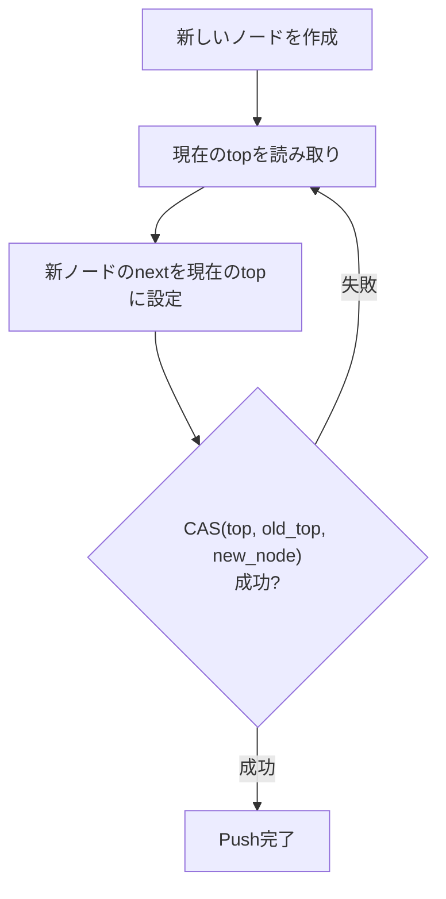

この実装はlock-freeである。CASが失敗するのは他のスレッドがtopを変更した場合であり、それは他のスレッドのpushまたはpopが成功したことを意味する。したがって、システム全体として少なくとも1つのスレッドが常に進行している。

### 5.3 ロックフリーキュー（Michael-Scott Queue）

Michael-Scottキュー（1996年）は、最も広く使われているロックフリーキューの設計である。Java の `ConcurrentLinkedQueue` はこの設計に基づいている。

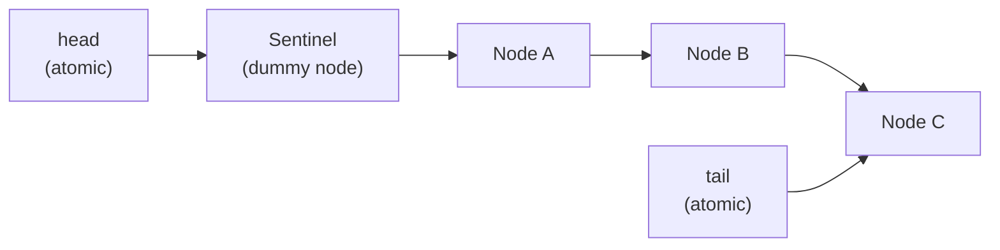

このキューの特徴は、**ダミーノード（Sentinel）**を使用して、headとtailの操作を分離する点にある。Enqueue操作はtailのみを操作し、Dequeue操作はheadのみを操作する。これにより、enqueueとdequeueの競合が最小限に抑えられる。

Enqueue操作の擬似コードを示す。

```
enqueue(value):
    new_node = allocate Node(value, next=null)
    loop:
        tail = atomic_load(Tail)
        next = atomic_load(tail.next)
        if tail == atomic_load(Tail):          // consistency check
            if next == null:
                if CAS(tail.next, null, new_node):  // link new node
                    CAS(Tail, tail, new_node)        // advance tail (best-effort)
                    return
            else:
                CAS(Tail, tail, next)          // help advance tail
```

注目すべきは最後の `CAS(Tail, tail, next)` である。これは、他のスレッドがnew_nodeをリンクしたが、まだTailを更新していない場合に、**他のスレッドの作業を代行する（helping）**パターンである。このhelpingメカニズムがlock-free保証の鍵を握っている。

## 6. ABA問題

### 6.1 ABA問題とは

ABA問題は、CASベースのアルゴリズムにおける最も有名かつ厄介な問題の一つである。

問題の本質は以下の通りである。CASは「値が期待値と一致するか」のみを検査する。しかし、値が一度変更された後、元の値に戻された場合、CASはこの変更を検出できない。値が `A → B → A` と変化した場合、CASは「何も変わっていない」と誤判断する。

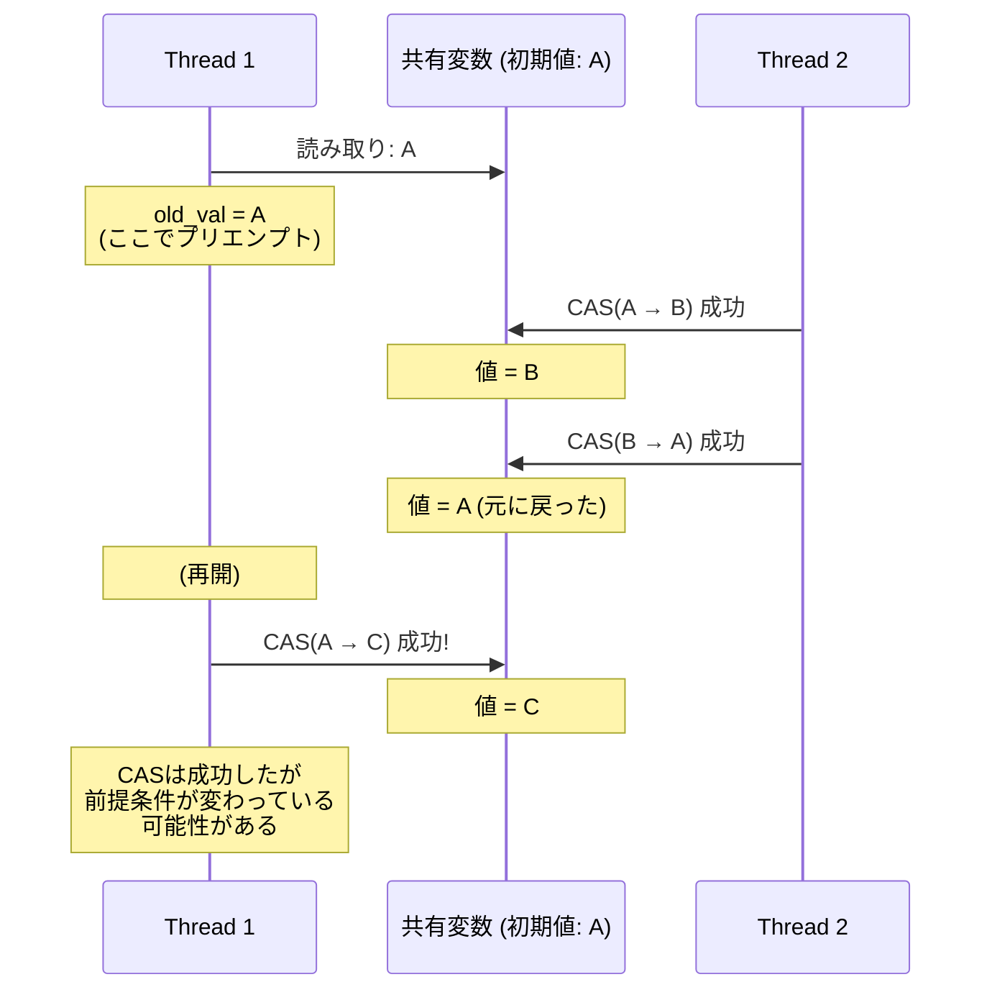

### 6.2 ABA問題が実際に破壊するケース

Treiber Stackのpop操作でABA問題がどのように発生するかを具体的に示す。

初期状態: スタック `top → A → B → C`

```
Thread 1: pop() を開始
  - old_top = A を読み取り
  - old_top->next = B を読み取り
  (ここで Thread 1 がプリエンプトされる)

Thread 2:
  - pop() で A を取り出す    → スタック: top → B → C
  - pop() で B を取り出す    → スタック: top → C
  - push(A) で A を戻す      → スタック: top → A → C
  (B は解放済み)

Thread 1: (再開)
  - CAS(top, A, B) を実行
  - top が A なので CAS 成功!
  - top = B ... しかし B は既に解放されたメモリ!
```

この結果、解放済みメモリへのダングリングポインタが発生し、**未定義動作**を引き起こす。

### 6.3 ABA問題の解決策

#### タグ付きポインタ（Tagged Pointer / Stamped Reference）

最も広く使われる解決策は、ポインタに**バージョン番号（タグ）**を付与する方法である。CASの比較対象を「ポインタ＋バージョン番号」の組にすることで、値が同じでもバージョン番号が異なっていれば変更を検出できる。

```cpp
struct TaggedPtr {
    Node* ptr;
    uint64_t tag;  // monotonically increasing counter
};

// Use 128-bit CAS (CMPXCHG16B on x86-64)
std::atomic<TaggedPtr> top;

void push(Node* new_node) {
    TaggedPtr old_top, new_top;
    do {
        old_top = top.load();
        new_node->next = old_top.ptr;
        new_top = {new_node, old_top.tag + 1};
    } while (!top.compare_exchange_weak(old_top, new_top));
}
```

x86-64では `CMPXCHG16B` を使うことで、ポインタ（64ビット）とタグ（64ビット）を合わせた128ビットのCASが可能である。タグが64ビットなら、ラップアラウンドの可能性は事実上ゼロとなる。

#### ハザードポインタ（Hazard Pointers）

Maged M. Michael（2004年）が提案した**ハザードポインタ**は、ABA問題とメモリ回収を同時に解決する手法である。

基本的なアイデアは以下の通りである。

1. 各スレッドは**ハザードポインタ**と呼ばれるスレッドローカルなポインタの配列を持つ
2. ノードにアクセスする前に、そのノードのアドレスをハザードポインタに登録する
3. ノードを解放しようとするとき、全スレッドのハザードポインタを走査する
4. いずれかのスレッドのハザードポインタに登録されているノードは解放しない

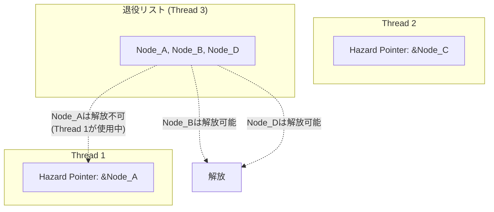

#### エポックベースの回収（Epoch-Based Reclamation — EBR）

Keir Fraser（2004年）が提案した**エポックベース回収**は、ハザードポインタよりも低オーバーヘッドな方式である。Crossbeam（Rust）で広く使われている。

グローバルなエポック（世代番号）を管理し、各スレッドはクリティカルセクションに入る際にローカルエポックをグローバルエポックに同期させる。すべてのスレッドが次のエポックに進んだとき、古いエポックのノードを安全に解放できる。

```
エポック 0: Node_A, Node_B を退役
エポック 1: Node_C を退役
エポック 2: (現在)
→ 全スレッドがエポック 2 に到達 → エポック 0 のノードは安全に解放可能
```

## 7. C++/Rust/Java のアトミックAPI

### 7.1 C++: `<atomic>`

C++11で導入された `<atomic>` ヘッダは、アトミック操作の標準化において画期的な存在である。C++のメモリモデルは、Leslie Lamport の happens-before 関係を形式的に定義し、ハードウェアに依存しないポータブルな並行プログラミングの基盤を提供した。

```cpp
#include <atomic>

// Atomic types
std::atomic<int> counter{0};
std::atomic<bool> flag{false};
std::atomic<void*> ptr{nullptr};

// Basic operations
counter.store(42, std::memory_order_release);
int val = counter.load(std::memory_order_acquire);
int old = counter.exchange(100);
int prev = counter.fetch_add(1, std::memory_order_relaxed);

// CAS
int expected = 42;
bool success = counter.compare_exchange_strong(
    expected,   // in/out: expected value (updated on failure)
    100,        // desired value
    std::memory_order_acq_rel,  // success ordering
    std::memory_order_acquire   // failure ordering
);
// If failed: expected now contains the actual value
```

C++には `compare_exchange_strong` と `compare_exchange_weak` の2つのCAS操作がある。

- **`compare_exchange_strong`**: 値が一致すれば必ず成功する。LL/SCアーキテクチャではループ内でリトライされる
- **`compare_exchange_weak`**: **スプリアス失敗**の可能性がある（値が一致していても失敗することがある）。LL/SCアーキテクチャではSCの失敗をそのまま返すため、strong版よりも効率的。通常はCASループ内で使用する

```cpp
// compare_exchange_weak is preferred in CAS loops
int expected = counter.load();
while (!counter.compare_exchange_weak(expected, expected + 1)) {
    // On failure, 'expected' is automatically updated with current value
    // Spurious failure is handled by the loop
}
```

### 7.2 Rust: `std::sync::atomic` と `crossbeam`

Rustのアトミック操作は、言語の所有権モデルと組み合わさることで、C++よりも安全な並行プログラミングを実現する。

```rust
use std::sync::atomic::{AtomicUsize, AtomicBool, AtomicPtr, Ordering};

let counter = AtomicUsize::new(0);
let flag = AtomicBool::new(false);

// Basic operations
counter.store(42, Ordering::Release);
let val = counter.load(Ordering::Acquire);
let old = counter.swap(100, Ordering::AcqRel);
let prev = counter.fetch_add(1, Ordering::Relaxed);

// CAS
match counter.compare_exchange(
    42,                  // expected
    100,                 // desired
    Ordering::AcqRel,    // success ordering
    Ordering::Acquire,   // failure ordering
) {
    Ok(old) => println!("Success: old value was {}", old),
    Err(actual) => println!("Failed: actual value is {}", actual),
}

// compare_exchange_weak (may fail spuriously)
let mut expected = counter.load(Ordering::Relaxed);
loop {
    match counter.compare_exchange_weak(
        expected, expected + 1,
        Ordering::Release,
        Ordering::Relaxed,
    ) {
        Ok(_) => break,
        Err(actual) => expected = actual,
    }
}
```

Rustの `crossbeam` クレートは、エポックベースのメモリ回収を備えたロックフリーデータ構造を提供する。

```rust
use crossbeam::epoch::{self, Atomic, Owned, Shared};
use std::sync::atomic::Ordering;

struct Stack<T> {
    top: Atomic<Node<T>>,
}

struct Node<T> {
    data: T,
    next: Atomic<Node<T>>,
}

impl<T> Stack<T> {
    fn push(&self, val: T) {
        let new_node = Owned::new(Node {
            data: val,
            next: Atomic::null(),
        });
        let guard = epoch::pin(); // enter epoch-protected critical section
        loop {
            let top = self.top.load(Ordering::Relaxed, &guard);
            new_node.next.store(top, Ordering::Relaxed);
            match self.top.compare_exchange(
                top, new_node,
                Ordering::Release, Ordering::Relaxed, &guard,
            ) {
                Ok(_) => break,
                Err(e) => { /* retry with updated new_node */ }
            }
        }
        // guard dropped here: epoch advances when all guards are dropped
    }
}
```

Rustにおけるアトミック操作の安全性は、以下の仕組みで担保されている。

- `Atomic*` 型は `Sync` トレイトを実装しており、スレッド間での共有が安全である
- 所有権システムにより、非アトミックなデータへの競合アクセスはコンパイル時に検出される
- `crossbeam::epoch` によるメモリ回収は、ガードのライフタイムを通じて安全性を保証する

### 7.3 Java: `java.util.concurrent.atomic`

Javaは `java.util.concurrent.atomic` パッケージでアトミック操作を提供する。JVMが内部的にCAS命令を使用するため、プラットフォームに依存しない。

```java
import java.util.concurrent.atomic.*;

AtomicInteger counter = new AtomicInteger(0);
AtomicBoolean flag = new AtomicBoolean(false);
AtomicReference<Node> top = new AtomicReference<>(null);

// Basic operations
counter.set(42);
int val = counter.get();
int old = counter.getAndSet(100);
int prev = counter.getAndAdd(1);
int newVal = counter.incrementAndGet();

// CAS
boolean success = counter.compareAndSet(42, 100);

// CAS loop pattern
int expected;
do {
    expected = counter.get();
} while (!counter.compareAndSet(expected, expected + 1));
```

Java 9以降では、`VarHandle` APIが導入され、より細かいメモリオーダリングの制御が可能になった。

```java
import java.lang.invoke.MethodHandles;
import java.lang.invoke.VarHandle;

class Counter {
    private volatile int count;
    private static final VarHandle COUNT;

    static {
        try {
            COUNT = MethodHandles.lookup()
                .findVarHandle(Counter.class, "count", int.class);
        } catch (Exception e) { throw new Error(e); }
    }

    void increment() {
        // Opaque: no ordering, but atomicity guaranteed (like Relaxed)
        COUNT.getAndAddRelease(this, 1);
    }

    int get() {
        return (int) COUNT.getAcquire(this);
    }
}
```

JavaのABA問題対策としては `AtomicStampedReference` が標準で提供されている。

```java
AtomicStampedReference<Node> top = new AtomicStampedReference<>(null, 0);

// CAS with stamp (version number)
int[] stampHolder = new int[1];
Node current = top.get(stampHolder);
int currentStamp = stampHolder[0];

boolean success = top.compareAndSet(
    current,              // expected reference
    newNode,              // new reference
    currentStamp,         // expected stamp
    currentStamp + 1      // new stamp
);
```

### 7.4 各言語のアトミックAPI比較

| 特性 | C++ | Rust | Java |
|------|-----|------|------|
| **メモリオーダリング** | 6段階（Relaxed〜SeqCst） | 5段階（Consumeなし） | Java 9+ VarHandleで対応 |
| **CAS** | strong / weak | strong / weak | strong のみ |
| **ABA対策** | ライブラリ依存 | crossbeam (EBR) | AtomicStampedReference |
| **128-bit CAS** | `std::atomic<__int128>` (実装依存) | `AtomicU128` (nightly) | なし |
| **デフォルト** | SeqCst | 明示的指定が必須 | volatile相当（Java 9+で選択可能） |

## 8. スピンロックの実装

### 8.1 TASスピンロック（Test-and-Set Spinlock）

スピンロックは最も単純なロック機構である。ロックが取得できるまでCPUをスピン（ビジーウェイト）させる。

```cpp
class TASSpinLock {
    std::atomic<bool> locked{false};

public:
    void lock() {
        while (locked.exchange(true, std::memory_order_acquire)) {
            // Spin: keep trying until we successfully set locked to true
        }
    }

    void unlock() {
        locked.store(false, std::memory_order_release);
    }
};
```

この実装の問題は、ロック取得を試みるすべてのスレッドが `exchange` 操作を繰り返すことである。`exchange` は書き込みを伴うため、各試行のたびに対象のキャッシュラインの所有権を獲得する必要があり、激しいキャッシュラインバウンシングが発生する。

### 8.2 TTASスピンロック（Test-and-Test-and-Set Spinlock）

TTAS は TAS の改良版である。まず読み取り（テスト）を行い、ロックが解放されているように見えたときにだけ `exchange`（テストアンドセット）を試みる。

```cpp
class TTASSpinLock {
    std::atomic<bool> locked{false};

public:
    void lock() {
        for (;;) {
            // Test: spin on read (shared cache line, no invalidation traffic)
            while (locked.load(std::memory_order_relaxed)) {
                // Optional: yield or pause hint
                #ifdef __x86_64__
                __builtin_ia32_pause(); // PAUSE instruction: reduces power, avoids pipeline flush
                #endif
            }
            // Test-and-Set: try to acquire
            if (!locked.exchange(true, std::memory_order_acquire)) {
                return; // acquired
            }
        }
    }

    void unlock() {
        locked.store(false, std::memory_order_release);
    }
};
```

**`PAUSE` 命令**について：x86のPAUSE命令は、スピンループ内でCPUに「これはスピンウェイトである」ことをヒントとして伝える。これにより、パイプラインの投機実行によるペナルティの回避と、消費電力の削減が期待できる。

### 8.3 CASベースのスピンロック

CASを直接使ったスピンロックも実装できる。TTASと同様のパターンだが、CASを使うことで`expected`に現在値が返ってくるため、ロジックが明確になる。

```cpp
class CASSpinLock {
    std::atomic<bool> locked{false};

public:
    void lock() {
        for (;;) {
            // Wait until lock appears free
            while (locked.load(std::memory_order_relaxed)) {
                #ifdef __x86_64__
                __builtin_ia32_pause();
                #endif
            }
            // Attempt to acquire
            bool expected = false;
            if (locked.compare_exchange_weak(
                    expected, true, std::memory_order_acquire, std::memory_order_relaxed)) {
                return;
            }
        }
    }

    void unlock() {
        locked.store(false, std::memory_order_release);
    }
};
```

### 8.4 チケットスピンロック（Ticket Spinlock）

チケットスピンロックは、**公平性（Fairness）**を保証するスピンロックである。先に到着したスレッドが先にロックを取得する（FIFO順序）。

```cpp
class TicketSpinLock {
    std::atomic<uint32_t> next_ticket{0}; // next ticket number to be issued
    std::atomic<uint32_t> now_serving{0}; // currently serving ticket number

public:
    void lock() {
        uint32_t my_ticket = next_ticket.fetch_add(1, std::memory_order_relaxed);
        while (now_serving.load(std::memory_order_acquire) != my_ticket) {
            #ifdef __x86_64__
            __builtin_ia32_pause();
            #endif
        }
    }

    void unlock() {
        // Increment now_serving to wake up the next waiter
        now_serving.fetch_add(1, std::memory_order_release);
    }
};
```

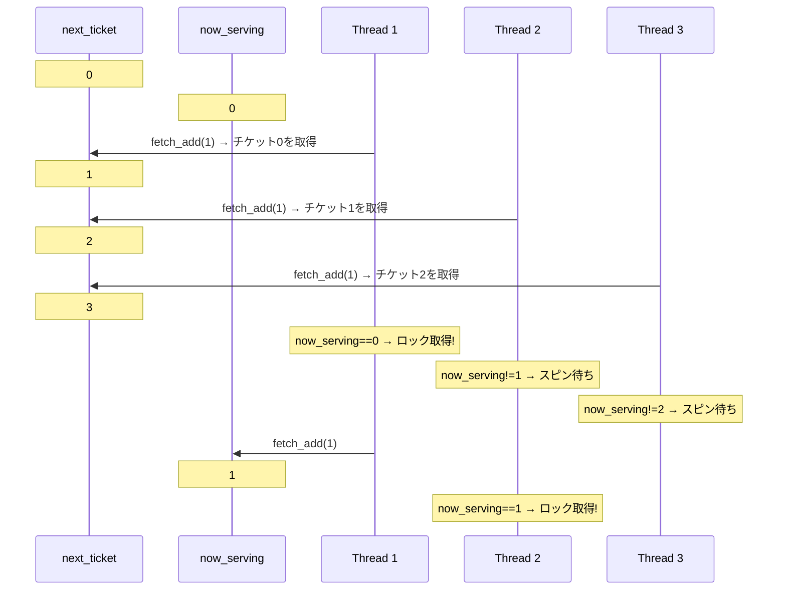

チケットスピンロックは公平だが、すべてのスレッドが同じ `now_serving` 変数をスピンするため、ロック解放時にキャッシュインバリデーションの嵐が発生する。この問題を解決するのが**MCSロック**や**CLHロック**といったキューベースのスピンロックである。

### 8.5 バックオフ戦略

スピンロックの競合時の性能を改善するために、**指数バックオフ（Exponential Backoff）**を導入できる。

```cpp
class BackoffSpinLock {
    std::atomic<bool> locked{false};

    static constexpr int MIN_BACKOFF = 4;
    static constexpr int MAX_BACKOFF = 1024;

public:
    void lock() {
        int backoff = MIN_BACKOFF;
        for (;;) {
            if (!locked.exchange(true, std::memory_order_acquire)) {
                return;
            }
            // Exponential backoff
            for (int i = 0; i < backoff; ++i) {
                #ifdef __x86_64__
                __builtin_ia32_pause();
                #endif
            }
            backoff = std::min(backoff * 2, MAX_BACKOFF);
        }
    }

    void unlock() {
        locked.store(false, std::memory_order_release);
    }
};
```

バックオフにより、高競合時のキャッシュラインバウンシングが緩和され、システム全体のスループットが改善される。ただし、バックオフのパラメータ（最小値・最大値・増加率）はワークロードに依存するため、チューニングが必要である。

## 9. ロックフリー vs ロックベースの性能比較

### 9.1 性能特性の定性的比較

ロックフリーとロックベースの方式は、それぞれ異なる性能特性を持つ。

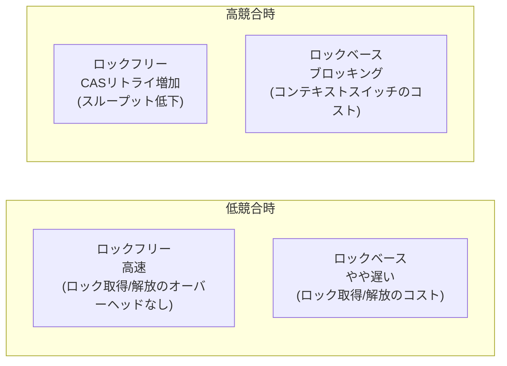

| 特性 | ロックフリー | ロックベース（mutex） |
|------|------------|---------------------|
| **低競合時のスループット** | 高い（ロックのオーバーヘッドなし） | やや低い |
| **高競合時のスループット** | CASリトライにより低下 | ブロッキングにより安定 |
| **レイテンシのばらつき** | 小さい（ブロッキングなし） | 大きい（ロック待ちの可能性） |
| **プログレス保証** | lock-free / wait-free | なし（デッドロック・優先度逆転の可能性） |
| **実装の複雑さ** | 高い | 低い |
| **メモリ使用量** | 多い（バージョン管理、ハザードポインタ等） | 少ない |
| **デバッグの容易さ** | 困難 | 比較的容易 |

### 9.2 競合レベルによる性能変化

ロックフリーとロックベースの性能差は、**競合レベル（Contention Level）**によって大きく変わる。

```
スループット
    ^
    |  ロックフリー
    | ╲
    |  ╲╲___________
    |   ╲            ╲___
    |    ╲               ╲___
    |     ╲                  ╲___
    |      ╲                     ╲
    |       ╲
    |        ╲  ロックベース(mutex)
    |         ╲╲___
    |          ╲   ╲___________
    |                          ╲___
    |                              ╲
    +──────────────────────────────────> 競合レベル
     低                              高
```

**低競合**: ロックフリーが有利。ロックの取得・解放のオーバーヘッドがないため、CASは通常1回で成功する。

**中程度の競合**: ロックフリーが依然として有利なことが多い。CASのリトライが若干発生するが、ロックのブロッキングによるコンテキストスイッチよりも低コストである。

**高競合**: ロックベースが逆転する場合がある。CASの失敗率が高くなると、リトライのためのCPUサイクルが浪費される。一方、ロックベースの方式では、ロック待ちのスレッドがブロックされてCPUを解放するため、有用な仕事にCPUを割り当てられる。

### 9.3 ユースケース別の推奨方針

| ユースケース | 推奨 | 理由 |
|------------|------|------|
| 統計カウンタ | アトミック操作 | `fetch_add` で十分。ロックは過剰 |
| 参照カウント | アトミック操作 | `fetch_add` / `fetch_sub` で十分 |
| フラグ・状態遷移 | アトミック操作 + CAS | 状態が少数の値を取る場合に最適 |
| 並行キュー（低〜中競合） | ロックフリー | Michael-Scottキューなど |
| 並行マップ（高競合） | ロックベース（シャーディング） | `ConcurrentHashMap` のようなセグメントロック |
| 複雑なデータ構造の更新 | ロックベース | ロックフリーの正しい実装は極めて困難 |
| リアルタイムシステム | ロックフリー / Wait-free | プログレス保証が必要 |

### 9.4 ハイブリッドアプローチ

実際のシステムでは、ロックフリーとロックベースを組み合わせた**ハイブリッドアプローチ**が最も実用的である。

**適応的ロック（Adaptive Locking）**: 最初はスピン（ロックフリー的）を試み、一定回数失敗したらブロッキング（ロックベース的）に切り替える。LinuxカーネルのMutexやJavaの `synchronized`（Biased Locking → Thin Lock → Fat Lock）がこの戦略を採用している。

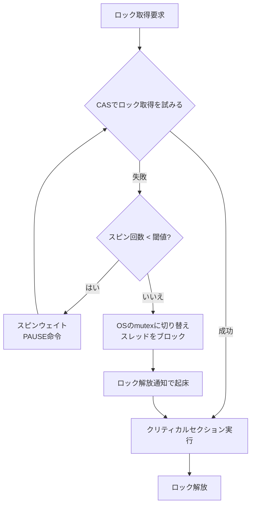

**Javaの `synchronized` の最適化階層**:

| レベル | 状態 | 実装 |
|--------|------|------|
| 1 | Biased Locking | ロックの所有者をオブジェクトヘッダに記録。競合がなければCASすら不要 |
| 2 | Thin Lock | CASベースのスピンロック。短い競合向け |
| 3 | Fat Lock | OSのmutexによるブロッキング。長い競合向け |

## 10. まとめ：実践者への指針

### 10.1 アトミック操作を使う前に考えるべきこと

アトミック操作とロックフリーアルゴリズムは強力なツールだが、万能薬ではない。以下の原則を心がけるべきである。

**1. まずはロックベースの実装を検討する**: ロックベースの実装は理解しやすく、デバッグしやすく、正しさを証明しやすい。ロックフリーの実装が必要になるのは、ロックベースの実装がボトルネックになった場合、またはプログレス保証が必要な場合のみである。

**2. 既存のライブラリを使う**: ロックフリーデータ構造の正しい実装は極めて困難である。C++の `folly::ConcurrentHashMap`、Javaの `java.util.concurrent`、Rustの `crossbeam` のような、十分にテストされたライブラリを使用すべきである。

**3. メモリオーダリングを理解する**: メモリオーダリングの誤りは、最も発見が困難なバグの一つである。迷ったら `SeqCst` を使い、性能が問題になった場合にのみ弱いオーダリングに緩和する。

**4. テストは不十分であることを前提にする**: 並行バグは非決定的であり、テストで再現できないことが多い。ThreadSanitizer（TSan）のようなツールや、形式検証（TLA+、Loom）を活用する。

### 10.2 技術の発展と今後

CASとアトミック操作の分野は、ハードウェアとソフトウェアの両面で進化を続けている。

**ハードウェア側**: Intel TSX（Transactional Synchronization Extensions）のようなハードウェアトランザクショナルメモリ（HTM）は、楽観的なトランザクション実行をハードウェアレベルで提供する試みだった。TSXはMicroarchitectural Data Sampling（MDS）脆弱性の影響で無効化されることが多かったが、概念自体は将来のプロセッサで復活する可能性がある。ARMv9のTME（Transactional Memory Extension）も同様のアプローチを探求している。

**ソフトウェア側**: RCU（Read-Copy-Update）はLinuxカーネルで広く使われている読み取り特化のロックフリー手法であり、読み取りが圧倒的に多いワークロードで極めて高い性能を発揮する。また、persistent memory（Intel Optane等）の登場により、クラッシュ一貫性（Crash Consistency）を保証するアトミック操作の研究も進んでいる。

**形式検証の重要性**: ロックフリーアルゴリズムの正しさを人間が検証することには限界がある。TLA+やPromela/SPINのようなモデル検査ツール、Rustの `loom` クレートのような決定的並行テストフレームワークが、並行プログラムの正しさを保証するための重要なツールとなっている。

CASとアトミック操作は、現代の並行プログラミングにおける最も基本的なビルディングブロックである。その原理を深く理解することで、ロックの仕組みを正しく把握し、性能問題の根本原因を特定し、適切な並行制御戦略を選択できるようになる。
