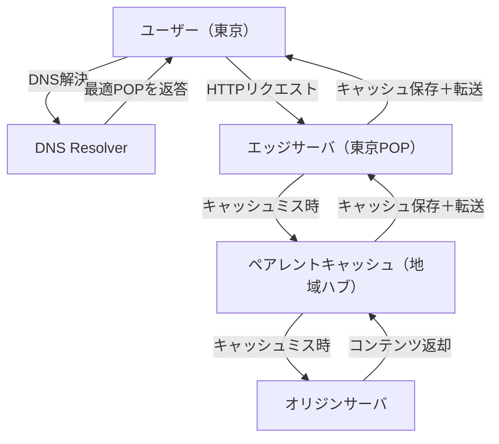
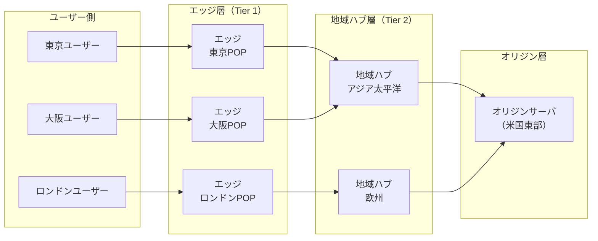
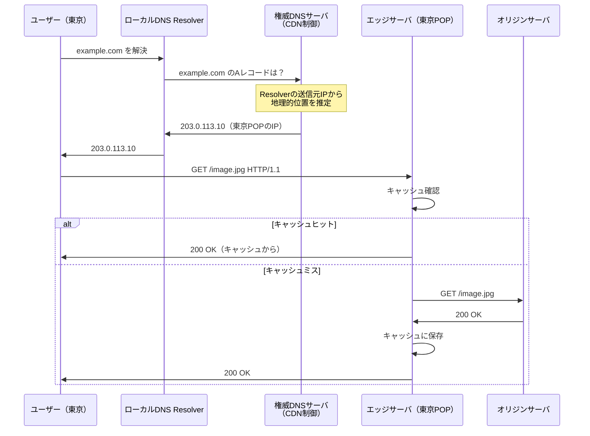
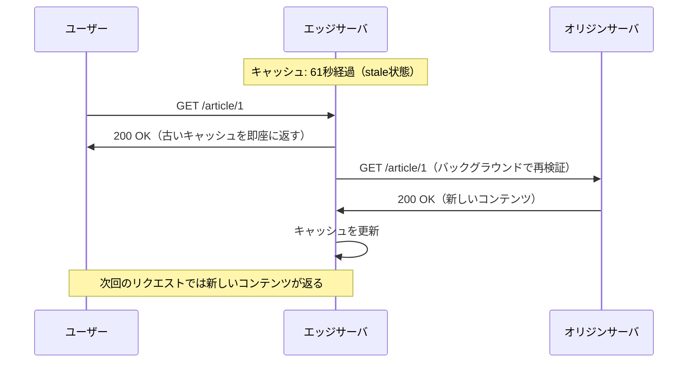
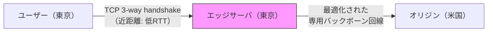
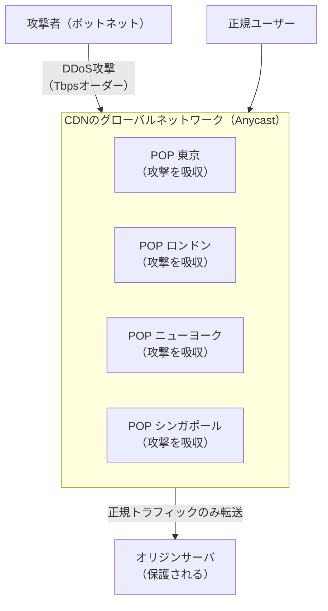
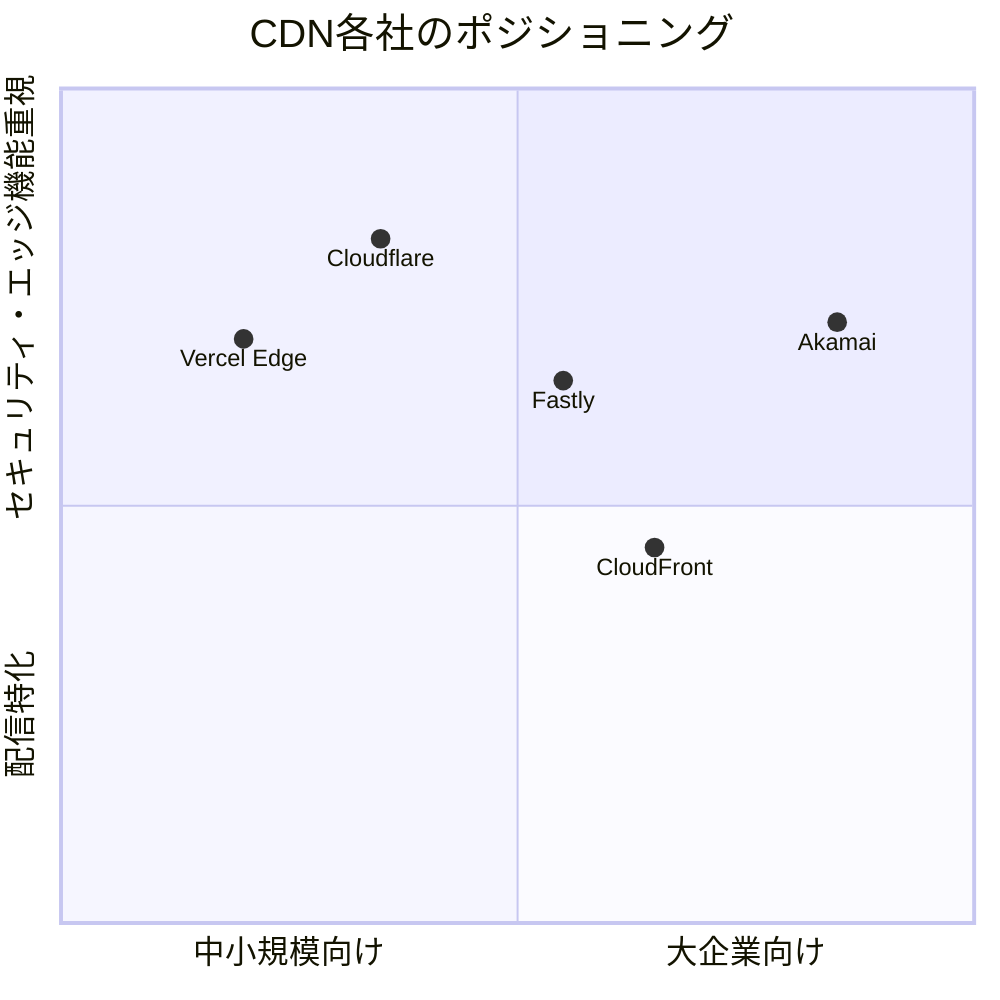
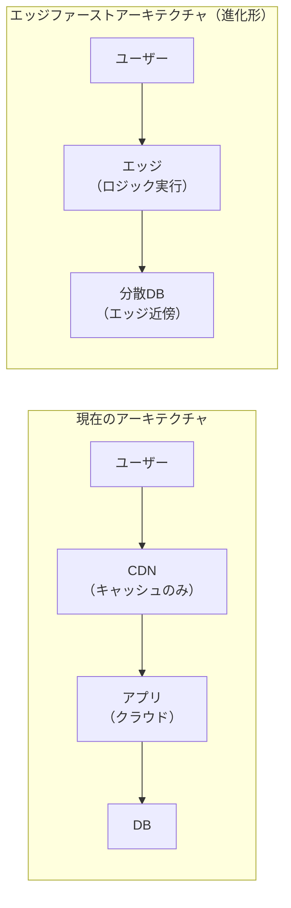

# CDN（Content Delivery Network）

## 1. 歴史的背景：なぜCDNが生まれたのか

### 1.1 インターネット黎明期のコンテンツ配信の課題

1990年代後半、World Wide Webの急速な普及とともに、インターネットは深刻な課題に直面した。ユーザーがWebサイトにアクセスすると、リクエストは地球の裏側にあるオリジンサーバにまで届き、そこから画像や動画、HTMLなどのリソースを取得する必要があった。

この方式には根本的な問題が二つある。一つは**レイテンシ**（遅延）であり、物理的な距離が長いほど光や電気信号の伝搬時間が増大する。もう一つは**集中障害**であり、人気サイトへのトラフィックが急増した際に、オリジンサーバとその周辺のネットワーク帯域が飽和状態に陥ることである。

1998年、MITのコンピューター科学者であるTom LeightonとDanny Lewinがこの問題に着目した。彼らは「ウェブのホットスポット問題」を解決するためのアルゴリズムと分散システムの設計を研究し、翌1999年にAkamaiを共同創業した。AkamaiはCDNの商業的な先駆者として、コンテンツを世界中の分散したサーバネットワークにキャッシュすることで、ユーザーに最も近い場所からコンテンツを配信するという概念を実用化した。

### 1.2 "Slashdot効果"と大規模障害の教訓

2000年前後、Slashdot（テクノロジーニュースサイト）で取り上げられたサイトが、急激なトラフィック増加により数時間以内にダウンする現象が頻発した。これは後に**Slashdot効果**（またはハグ・オブ・デス）と呼ばれる。

同様の事態は繰り返し起きた。NASA の火星探査機の写真公開、人気アーティストの新アルバムリリース、スポーツイベントのライブ配信など、予期せぬ大量アクセスによりサービス停止が相次いだ。こうした障害の経験が、CDNの必要性とその設計思想を洗練させていった。

### 1.3 動画ストリーミング時代の到来

2005年のYouTube登場、2007年のAmazon Prime Video（当時Amazon Unbox）のサービス開始、2008年のNetflixストリーミング開始によって、インターネットのトラフィック構造は根本的に変化した。テキストと画像が主体だった時代から、大容量の動画ストリームが支配的になったのである。

Sandvineの調査によれば、2022年時点でNetflixとYouTubeだけで北米のダウンストリームトラフィックの約30%以上を占めていた。このようなスケールでの動画配信を実現するには、CDNなしでは不可能であった。

現在ではNetflixは独自のOpen Connect CDNを運用し、ISPのネットワーク内にキャッシュサーバを設置することで、より効率的なコンテンツ配信を実現している。

## 2. CDNの基本アーキテクチャ

### 2.1 主要コンポーネント

CDNは複数の論理コンポーネントから構成される。



**オリジンサーバ（Origin Server）**は、コンテンツの「正」の保管場所である。CDNはオリジンサーバからコンテンツを取得し（プル型）、あるいはオリジンサーバがCDNにコンテンツを配信する（プッシュ型）。

**エッジサーバ（Edge Server）**はユーザーに最も近い位置に配置されたキャッシュサーバである。ユーザーのリクエストを受け付け、キャッシュされたコンテンツを直接返す、あるいはオリジンサーバへのリクエストをプロキシする。

**POP（Point of Presence）**は、エッジサーバが設置された物理的なデータセンター拠点のことである。大都市圏、主要なIXP（Internet Exchange Point）の近傍、ISPのネットワーク内など、地理的・ネットワーク的にユーザーに近い場所に設置される。

### 2.2 階層的キャッシュ構造

多くのCDNは二段階から三段階の階層構造を採用している。



**Tier 1（エッジ層）**: ユーザーからの全リクエストを受け付ける最前線。キャッシュヒット率を高めることでオリジンの負荷を最小化する。

**Tier 2（地域ハブ層）**: 複数のエッジからの共通リクエストを集約し、オリジンへのリクエスト数をさらに削減する。このレイヤーは「シールドキャッシュ」や「ミッドTier」とも呼ばれる。

**Tier 3（オリジン層）**: 実際のアプリケーションやデータベースが稼働する。CDNによって保護され、直接アクセスは最小限に抑えられる。

### 2.3 エッジサーバの内部構造

エッジサーバは高スループットを実現するために最適化された構成を持つ。

```
┌─────────────────────────────────────────────────┐
│                  エッジサーバ                      │
│                                                   │
│  ┌───────────────┐    ┌──────────────────────┐   │
│  │  NIC（高速）  │    │    TCP/HTTP処理       │   │
│  │  10-100Gbps  │    │    （カーネルバイパス）│   │
│  └───────┬───────┘    └──────────┬───────────┘   │
│          │                        │               │
│  ┌───────▼────────────────────────▼───────────┐  │
│  │              キャッシュエンジン              │  │
│  │                                             │  │
│  │  ┌────────────┐    ┌────────────────────┐  │  │
│  │  │  メモリ    │    │  SSD/NVMeキャッシュ│  │  │
│  │  │  キャッシュ│    │  （大容量・低遅延） │  │  │
│  │  │  (ホット) │    │  （ウォーム）       │  │  │
│  │  └────────────┘    └────────────────────┘  │  │
│  └─────────────────────────────────────────────┘  │
│                                                   │
│  ┌─────────────────────────────────────────────┐  │
│  │         オリジン接続プール                   │  │
│  │  （持続的接続・HTTP/2・圧縮）               │  │
│  └─────────────────────────────────────────────┘  │
└─────────────────────────────────────────────────┘
```

## 3. コンテンツ配信の仕組み：ルーティングメカニズム

ユーザーのリクエストを最適なエッジサーバに誘導するために、CDNはいくつかのルーティング技術を使い分けている。

### 3.1 DNSベースのルーティング（GeoDNS）

最も広く使われる手法がDNSを利用したルーティングである。



GeoDNSの動作原理は次の通りである。CDNの権威DNSサーバは、DNSクエリを送ってきたリゾルバのIPアドレスをGeoIPデータベースで照合し、地理的に最も近い（あるいはネットワーク的に最も最適な）POPのIPアドレスをレスポンスとして返す。

**短所**：DNSのTTLによるキャッシュが存在するため、即時切り替えができない。また、ユーザーが使っているDNSリゾルバの位置がユーザー自身の位置と異なる場合（例えばパブリックDNSの8.8.8.8など）、正確なルーティングができないことがある。このECS（EDNS Client Subnet）問題への対応として、RFC 7871で定義されたEDNS Client Subnet拡張を利用して、クライアントのサブネット情報をCDNに伝達する手法が採られる。

### 3.2 Anycastルーティング

**Anycast**は、複数の異なるサーバが同一のIPアドレスブロックをアナウンスし、BGP（Border Gateway Protocol）のルーティングによって最もルーティングコストの低いサーバにトラフィックが自然に誘導される仕組みである。

```
                  ┌────────────────────────────────────────┐
                  │         インターネット（BGP）            │
                  └──────┬──────────────────────┬──────────┘
                         │ 203.0.113.0/24        │ 203.0.113.0/24
                         │ アナウンス             │ アナウンス
              ┌──────────▼──────────┐  ┌─────────▼──────────┐
              │   東京POP            │  │   ロンドンPOP        │
              │   IP: 203.0.113.x   │  │   IP: 203.0.113.x  │
              └─────────────────────┘  └────────────────────┘

ユーザー（東京）   → BGPの最短経路 → 東京POPへ自動誘導
ユーザー（ロンドン）→ BGPの最短経路 → ロンドンPOPへ自動誘導
（同一のIPアドレスにアクセスしているにもかかわらず）
```

Anycastの主な利点はDDoS耐性である。攻撃トラフィックが分散されるため、特定のPOPに集中することが難しくなる。CloudflareはAnycastを主要なルーティング戦略として採用しており、世界中の数百のPOPが同一のIPレンジをアナウンスすることで、DDoS攻撃の吸収能力を高めている。

**短所**：UDPには適しているが、TCPセッションが進行中にルート変更が起きると接続が切断される可能性がある。そのため、UDPベースのQuicプロトコルと相性が良い。

### 3.3 HTTP Redirect方式

一部のCDNは、最初のリクエストをオリジンサーバで受け付け、HTTPの302リダイレクトで最適なエッジサーバのURLに誘導する手法を使う。実装が単純だが、最低1回分のRTTが追加されるため、現代のCDNではDNSベースやAnycastと組み合わせる補助的な手段として使われることが多い。

### 3.4 Real User Monitoring（RUM）によるルーティング最適化

先進的なCDNは、実際のユーザーのネットワーク性能データを収集・分析し、動的にルーティング判断を行う。

各ユーザーのブラウザにビーコンスクリプトを配信し、複数のPOPへのレイテンシ計測結果を収集する。このデータをリアルタイムで集計し、特定の地域やISPからどのPOPが実際に最速かを継続的に学習・更新する仕組みである。

## 4. キャッシュ戦略

CDNの効率はキャッシュ戦略に大きく依存する。キャッシュヒット率（Cache Hit Ratio）が高いほど、オリジンサーバへの負荷が低減され、ユーザーへのレスポンスも高速になる。

### 4.1 TTL（Time to Live）とキャッシュ制御

HTTPレスポンスヘッダーによってキャッシュの動作が制御される。

```http
# Static asset with long TTL
Cache-Control: public, max-age=31536000, immutable

# HTML page with short TTL and revalidation
Cache-Control: public, max-age=300, stale-while-revalidate=60

# Private/dynamic content (no caching)
Cache-Control: private, no-store

# CDN-specific header (Surrogate-Control takes precedence for CDN)
Surrogate-Control: max-age=86400
Cache-Control: public, max-age=3600
```

`Cache-Control: max-age` はブラウザとCDNの両方に適用されるが、`Surrogate-Control`（またはCDNによって独自のヘッダー例えばCloudflareの`CDN-Cache-Control`）を使うとCDNのキャッシュ時間をブラウザのキャッシュ時間と独立して設定できる。

**キャッシュの優先度設計**：

| コンテンツ種別 | 推奨TTL | 理由 |
|:---|:---|:---|
| 静的画像（ハッシュ付きファイル名） | 1年（immutable） | ファイル名が変わればキャッシュも無効化される |
| CSS/JS（ハッシュ付き） | 1年（immutable） | 同上 |
| HTML | 数分〜数時間 | コンテンツが更新される可能性がある |
| API レスポンス | 0〜数秒 | データの鮮度要件による |
| 動画セグメント（HLS/DASH） | 数時間〜数日 | 変更されないセグメントは長期キャッシュ可能 |

### 4.2 キャッシュキーの設計

**キャッシュキー**はキャッシュストアへの格納・検索に使われる識別子であり、通常はリクエストURLを基本として構成される。しかし実際の運用では、URLだけでなく様々な要因を考慮する必要がある。

```
キャッシュキーの例（Fastlyの場合）:

基本: https://example.com/api/products?category=books

Varyヘッダーによる拡張:
- Vary: Accept-Encoding → Gzip版とBrotli版を別々にキャッシュ
- Vary: Accept-Language → 言語別にキャッシュ
- Vary: User-Agent      → デバイスタイプ別にキャッシュ（注意が必要）

カスタムキー（VCLやWorkers等で制御）:
- Cookieの特定フィールド（例：ユーザーのサブスクリプションティア）
- リクエストヘッダー（例：X-Device-Type）
- 地域情報
```

`Vary: User-Agent` は一般的に悪手である。User-Agentの文字列は非常に多様であり、同一コンテンツが膨大な数のバリアントとしてキャッシュされることでキャッシュヒット率が著しく低下する。デバイス別配信が必要な場合は、`Vary: User-Agent` の代わりにCDN側でUser-Agentをパースしてデバイスタイプを正規化し、カスタムヘッダー（例：`X-Device: mobile/tablet/desktop`）に変換した上でキャッシュキーに含める方が効率的である。

### 4.3 キャッシュパージ（Purge）

コンテンツの更新があった際には、古いキャッシュを削除（パージ）する必要がある。

**個別URL指定パージ**：特定のURLのキャッシュを即時削除する。最もシンプルだが、多数のURLに関連する更新（例えばCSSファイルの変更）では非効率になることがある。

**タグベースパージ（Surrogate-Key / Cache-Tag）**：Fastly、Cloudflare、Akamaiなどが対応している。レスポンスにタグを付与しておき、タグを指定して一括パージする。

```http
# Response header with cache tags
Surrogate-Key: product-123 category-books author-smith
Cache-Tag: product-123 category-books    # Cloudflare
```

```bash
# Purge by tag (e.g., when product-123 is updated)
curl -X POST "https://api.cloudflare.com/client/v4/zones/{zone_id}/purge_cache" \
  -H "Authorization: Bearer {token}" \
  -d '{"tags": ["product-123"]}'
```

この方式では、商品ID `product-123` に関連するすべてのページ（商品詳細ページ、カテゴリページ、検索結果ページなど）を一度に無効化できる。

**全キャッシュパージ**：すべてのキャッシュを削除する。緊急時以外は避けるべきである。全パージ後はオリジンサーバに大量のリクエストが殺到する「キャッシュスタンピード」が発生する可能性がある。

### 4.4 Stale-While-Revalidate と Stale-If-Error

```http
Cache-Control: max-age=60, stale-while-revalidate=3600, stale-if-error=86400
```

**stale-while-revalidate**：キャッシュが`max-age`を超えて古くなった後も、バックグラウンドでの再検証が完了するまで古いコンテンツを返し続ける。ユーザーはレイテンシなしにレスポンスを受け取り、コンテンツはバックグラウンドで更新される。「古くなるかもしれないが速い」というトレードオフを許容するコンテンツに有効である。

**stale-if-error**：オリジンサーバがエラーを返した場合（5xx）や到達不能な場合、指定秒数の間は古いキャッシュを返す。サービスの可用性向上に貢献する。



### 4.5 条件付きリクエスト（Conditional Requests）

ETgag と Last-Modified ヘッダーを使った条件付きリクエストにより、コンテンツが変更されていない場合は本体を転送せず304 Not Modifiedを返すことで帯域を節約できる。

```http
# First response from origin
HTTP/1.1 200 OK
ETag: "abc123def456"
Last-Modified: Fri, 28 Feb 2026 10:00:00 GMT

# Subsequent request (conditional)
GET /image.jpg HTTP/1.1
If-None-Match: "abc123def456"
If-Modified-Since: Fri, 28 Feb 2026 10:00:00 GMT

# Response when not modified
HTTP/1.1 304 Not Modified
ETag: "abc123def456"
```

## 5. 動的コンテンツの最適化

### 5.1 動的コンテンツの課題

静的コンテンツはキャッシュできるため、CDNの恩恵を受けやすい。しかし、ECサイトのカート情報、ニュースフィード、リアルタイムデータ、認証済みユーザーの個人化コンテンツなど、リクエストごとに異なる動的コンテンツはキャッシュに適さない。

それでもCDNは動的コンテンツの配信においても重要な役割を果たす。

### 5.2 動的サイトアクセラレーション（DSA）

**DSA（Dynamic Site Acceleration）**は、キャッシュではなくネットワーク最適化によって動的コンテンツのレイテンシを削減する技術である。



DSAの主な技術要素：

**TCP接続の最適化**：ユーザーとエッジサーバ間のTCP接続は短距離なので高速に確立できる。エッジからオリジンへはCDNの管理する高品質なバックボーン回線を使い、持続的接続（Keep-Alive）やHTTP/2の多重化を活用する。

**TCP初期輻輳ウィンドウの最適化**：通常のTCPはスロースタートから始まるが、エッジ・オリジン間の既存接続を再利用することでこのオーバーヘッドを回避できる。

**プロトコル最適化**：QUIC/HTTP/3を使うことで、パケットロスが多い環境でも性能を維持できる。

**ルート最適化**：BGPのデフォルトルーティングよりも最適なパスをCDNが選択し、レイテンシを削減する。

### 5.3 ESI（Edge Side Includes）

**ESI（Edge Side Includes）**は、Webページを複数の部品（フラグメント）に分割し、各部品を独立してキャッシュ・組み立てる仕組みである。W3Cによって仕様が策定されたが、標準として広く普及はしていないものの、Akamaiや一部のCDNが独自実装としてサポートしている。

```html
<!-- Edge assembles the page from fragments -->
<html>
<body>
  <!-- This fragment is cached for 24 hours (static navigation) -->
  <esi:include src="/fragments/navigation" ttl="86400"/>

  <!-- This fragment is user-specific (not cached) -->
  <esi:include src="/fragments/user-header" no-store="true"/>

  <!-- Main content cached for 5 minutes -->
  <esi:include src="/fragments/main-content" ttl="300"/>

  <!-- Footer cached for 1 hour -->
  <esi:include src="/fragments/footer" ttl="3600"/>
</body>
</html>
```

## 6. エッジコンピューティング

### 6.1 エッジコンピューティングとは

CDNの進化として特に注目されているのが**エッジコンピューティング**である。従来のCDNがコンテンツのキャッシュと配信を担うだけだったのに対し、エッジコンピューティングではビジネスロジックをエッジサーバ上で実行できる。

これによって次のようなことが可能になる：

- **A/Bテスト**：リクエスト段階でユーザーをグループ分けし、異なるコンテンツを返す
- **パーソナライゼーション**：ユーザーの属性に応じてページを動的に変換する
- **認証・認可**：オリジンに届く前にリクエストの正当性を検証する
- **ボット対策**：疑わしいリクエストをエッジで遮断する
- **画像最適化**：クライアントのデバイスや帯域に合わせて画像を変換する

### 6.2 Cloudflare Workers

Cloudflare Workersは、V8エンジンをベースにしたJavaScriptランタイムをエッジサーバ上で動作させる仕組みである。Node.jsとは異なり、起動コストを最小化するためにV8 Isolateという軽量な実行コンテキストを使う。

```javascript
// Example: A/B testing at the edge
addEventListener('fetch', event => {
  event.respondWith(handleRequest(event.request));
});

async function handleRequest(request) {
  const url = new URL(request.url);

  // Stable bucketing based on user ID cookie
  const userId = getCookie(request, 'user_id');
  const bucket = userId ? parseInt(userId) % 2 : Math.random() < 0.5 ? 0 : 1;

  if (bucket === 1) {
    // Variant B: fetch from different origin path
    url.pathname = '/variant-b' + url.pathname;
  }

  const response = await fetch(url.toString(), request);
  return response;
}

function getCookie(request, name) {
  const cookieHeader = request.headers.get('Cookie');
  if (!cookieHeader) return null;
  const cookies = cookieHeader.split(';').map(c => c.trim());
  for (const cookie of cookies) {
    const [key, value] = cookie.split('=');
    if (key === name) return value;
  }
  return null;
}
```

### 6.3 Fastly Compute

Fastlyは**WASM（WebAssembly）**を使ったエッジコンピューティングプラットフォームを提供している。WASMはJavaScriptに限定されず、Rust、Go、Pythonなど様々な言語からコンパイルして実行できる。

```rust
// Example: Edge-side request validation in Rust (Fastly Compute)
use fastly::http::StatusCode;
use fastly::{Error, Request, Response};

#[fastly::main]
fn main(req: Request) -> Result<Response, Error> {
    // Validate API key at the edge before forwarding to origin
    let api_key = req.get_header_str("X-Api-Key");

    match api_key {
        Some(key) if is_valid_key(key) => {
            // Forward to origin
            let backend_response = req.send("backend")?;
            Ok(backend_response)
        }
        _ => {
            // Reject at edge, never reaches origin
            Ok(Response::from_status(StatusCode::UNAUTHORIZED)
                .with_body("Invalid or missing API key"))
        }
    }
}

fn is_valid_key(key: &str) -> bool {
    // Check against edge KV store or simple validation
    key.starts_with("sk_") && key.len() == 32
}
```

### 6.4 エッジコンピューティングの制約

エッジコンピューティングには固有の制約がある：

**実行時間制限**：Cloudflare Workersは1リクエストあたりCPU時間で最大50ms（有料プランは最大30秒）、Fastly Computeは50msなど、実行時間に厳しい制限がある。

**状態管理の制限**：エッジは複数のPOPにまたがるため、グローバルな状態の一貫性を保つことが難しい。これをKV（Key-Value）ストア、Durable Objects（Cloudflare）、Cache APIなどで補完する。

**冷スタート（Cold Start）**：サーバーレス関数に共通する課題だが、V8 Isolateを使うCloudflare WorkersはNode.jsなどと比べて起動時間が非常に短い（マイクロ秒オーダー）。

## 7. セキュリティ機能

現代のCDNはコンテンツ配信のみならず、セキュリティインフラとしての役割も担う。

### 7.1 DDoS攻撃への対応

CDNはその分散した性質から、本質的にDDoS（Distributed Denial of Service）攻撃への耐性を持つ。Anycastによるトラフィック分散、大容量の帯域（CloudflareはピークでPbps規模の攻撃吸収能力を主張）、そして自動的なトラフィック分析と遮断が組み合わされる。



**レート制限**：特定のIPアドレスやIPレンジからのリクエスト数を制限する。

**チャレンジベースの認証**：疑わしいクライアントに対してJavaScript実行チャレンジやCAPTCHAを提示し、ボットを排除する。

**SYN Flood対策**：SYN Proxyとして動作し、完全なTCP接続確立が確認されるまでオリジンにSYNを転送しない。

### 7.2 WAF（Web Application Firewall）

WAFはHTTPリクエストの内容を検査し、既知の攻撃パターン（SQLインジェクション、XSS、パストラバーサルなど）をブロックする。

CDNに統合されたWAFは以下の利点を持つ：

- オリジンサーバに到達する前にエッジで悪意あるリクエストを遮断
- 世界中のトラフィックから収集した脅威インテリジェンスを活用
- ルールのアップデートをインフラ側で管理（ユーザーが更新不要）

**OWASPコアルールセット（CRS）**はWAFのデファクトスタンダードなルールセットであり、Cloudflare、Akamai、AWSなど主要なCDNプロバイダがサポートしている。

```yaml
# Example: Cloudflare WAF custom rule (Terraform)
resource "cloudflare_ruleset" "custom_waf" {
  zone_id     = var.zone_id
  name        = "Custom WAF rules"
  description = "Block suspicious request patterns"
  kind        = "zone"
  phase       = "http_request_firewall_custom"

  rules {
    action      = "block"
    expression  = "(http.request.uri.path contains \"../\") or (http.request.uri.path contains \"/etc/passwd\")"
    description = "Block path traversal attempts"
    enabled     = true
  }

  rules {
    action      = "challenge"
    expression  = "cf.threat_score >= 30"
    description = "Challenge high threat score requests"
    enabled     = true
  }
}
```

### 7.3 ボット管理

正規のクローラー（Googlebot、BingBot）と悪意あるボット（スクレイパー、認証情報詰め込み攻撃、在庫監視ボット）を区別して制御することがボット管理の課題である。

**フィンガープリントベースの検出**：TLSのクライアントハロー（JA3フィンガープリント）、HTTP/2の設定順序、ブラウザのWebAPI挙動の分析など、通常のブラウザと自動化ツールの違いを多数のシグナルから推定する。

**行動分析**：マウスの動き、クリックパターン、スクロール速度などのユーザー行動を統計的に分析し、人間とボットを識別する。

### 7.4 TLS終端とHTTPS化

CDNはTLS終端（TLS Termination）を担い、エッジサーバでHTTPSを処理する。これによって：

- TLSの処理負荷をオリジンからオフロード
- Let's Encryptとの連携による証明書の自動更新
- TLS 1.3や最新の暗号スイートへの即時対応
- エッジとオリジン間の通信は内部ネットワーク（または再暗号化）で保護

また、HTTP→HTTPSの強制リダイレクト、HSTSヘッダーの付与など、セキュアなデフォルトをオリジン側の変更なしに適用できる。

## 8. 主要CDNプロバイダの比較

### 8.1 各プロバイダの概要

現在の主要なCDNプロバイダを比較する。



#### Amazon CloudFront

AWSのサービスエコシステムへの深い統合が最大の強みである。S3、EC2、ALBなどAWSサービスをオリジンとして簡単に設定でき、IAMによる細かなアクセス制御、AWS WAF、Shield（DDoS保護）との連携が容易である。

**Lambda@Edge**および**CloudFront Functions**によってエッジコンピューティングを実現するが、Lambda@Edgeは他のプロバイダと比べてコールドスタートが遅く、コストも高い傾向がある。CloudFront Functionsは軽量でありコールドスタートが速いが、機能が制限される。

AWSを主要インフラとして使っている組織にとっては自然な選択肢である。

#### Cloudflare

圧倒的なネットワーク規模（300以上の都市にPOP、Anycastによる自動ルーティング）と、DDoS保護・WAFなどのセキュリティ機能が一体化している点が特徴である。無料プランが充実しており、個人開発者から大企業まで幅広く使われている。

**Cloudflare Workers**（JavaScript/WASM）、**Cloudflare Pages**、**Durable Objects**、**R2**（S3互換ストレージ）など、エッジコンピューティングのエコシステムが急速に充実している。

プロバイダとしての独立性から、特定クラウドベンダーへの依存を避けたい組織にも採用されている。

#### Fastly

CDN業界の中でも特に**即時パージ**（数百ミリ秒でグローバルにキャッシュを無効化）と**高いカスタマイズ性**で知られる。

Fastly独自のVCL（Varnish Configuration Language）によって詳細なキャッシュ制御ロジックを記述できる。また、**Fastly Compute**（WASM）によってRustやGoでエッジロジックを実装できる。

GitHub、New York Times、Shopifyなど、高度なカスタマイズ要件を持つ大手テクノロジー企業に採用されている。

#### Akamai

CDNの草分けであり、現在もエンタープライズ市場において圧倒的な実績を持つ。金融機関、政府機関、大手メディアなど、ミッションクリティカルな用途での採用が多い。

世界4,000以上のPOPを持ち（他社は300〜500程度）、特にエンタープライズ向けのSLAや24時間365日のサポート体制が評価される。近年はGuardicore（マイクロセグメンテーション）を買収するなど、ゼロトラストセキュリティへの展開を強化している。

価格は他社と比べて高く、設定の複雑さも相対的に高い。

### 8.2 機能比較表

| 機能 | CloudFront | Cloudflare | Fastly | Akamai |
|:---|:---|:---|:---|:---|
| POP数 | 600以上 | 300以上 | 70以上 | 4000以上 |
| エッジ実行 | Lambda@Edge / CF Functions | Workers（JS/WASM） | Compute（WASM） | EdgeWorkers（JS） |
| 即時パージ | 〜5分 | 〜1秒 | 〜150ms | 〜数秒 |
| DDoS保護 | Shield | 統合 | 基本 | Prolexic（別売） |
| WAF | AWS WAF（別売） | 統合 | 別売 | Kona Site Defender |
| 無料プラン | なし | あり | なし | なし |
| 料金モデル | 転送量従量 | 転送量無制限（プラン制） | 転送量従量 | 企業契約 |

### 8.3 CDN選定の観点

CDN選定において考慮すべき主な観点を整理する。

**ユーザーの地理的分布**：ユーザーが特定地域に集中している場合、その地域にPOPを多く持つプロバイダを選ぶ。グローバルに均等に分布する場合はネットワーク規模が重要になる。

**コンテンツの特性**：静的コンテンツが多い場合はキャッシュの効率性、動的コンテンツが多い場合はDSAやエッジコンピューティングの機能を重視する。

**セキュリティ要件**：DDoS対策のレベル、WAFのルールカスタマイズ性、ボット管理の高度さなど。

**既存インフラとの親和性**：AWSを主要インフラとして使っていればCloudFrontが自然な選択肢になることが多い。

**カスタマイズの必要性**：VCLやエッジスクリプトによる細かな制御が必要な場合はFastlyが有力候補になる。

**コスト**：転送量に敏感な場合はCloudflareの定額モデルが有利なことがある。

## 9. CDNのパフォーマンスチューニング

### 9.1 キャッシュヒット率の改善

キャッシュヒット率（CHR）はCDNの効率を示す最重要指標である。

```
キャッシュヒット率（CHR）= キャッシュから返されたリクエスト数 / 総リクエスト数 × 100(%)
```

CHRを改善するための戦略：

**TTLの最適化**：コンテンツの変更頻度に応じて適切なTTLを設定する。過度に短いTTLは頻繁なオリジンアクセスを引き起こす。

**クエリパラメータの正規化**：`?id=1&sort=asc` と `?sort=asc&id=1` は同一コンテンツだがキャッシュキーが異なる。パラメータをソートして正規化することでヒット率を改善できる。

**不要なキャッシュキーの除外**：UTMパラメータ（`?utm_source=email&utm_campaign=spring`）はコンテンツに影響しないが、そのままキャッシュキーに含まれるとヒット率が低下する。これらのパラメータをキャッシュキーから除外する設定を行う。

**Cookieの制御**：`Set-Cookie`ヘッダーが含まれるレスポンスはキャッシュできない（デフォルト設定では）。静的コンテンツのレスポンスにはCookieを含めないようにする。

### 9.2 接続の最適化

**HTTP/2 サーバープッシュ**（現在は非推奨傾向）：HTMLを返すと同時にCSS/JSをプッシュする技術だが、不要なリソースのプッシュによる帯域浪費や、現代のキャッシュとの相性の悪さから、主要ブラウザがサポートを縮小している。代替として `<link rel="preload">` や 103 Early Hints が推奨される。

**103 Early Hints**：オリジンからの最終レスポンスを待つ間に、エッジサーバが事前にリンクヘッダーを返すことで、ブラウザがサブリソースの先読みを開始できる。

```http
HTTP/1.1 103 Early Hints
Link: </style.css>; rel=preload; as=style
Link: </main.js>; rel=preload; as=script

HTTP/1.1 200 OK
Content-Type: text/html
```

### 9.3 画像最適化

画像はWebページの転送量の多くを占める。CDNレベルでの最適化が有効である。

**フォーマット変換**：クライアントがWebPに対応していればJPEGの代わりにWebPを返す、AVIFに対応していればAVIFを返すなど、最適なフォーマットを自動選択する。

```http
# Client sends Accept header
GET /photo.jpg HTTP/1.1
Accept: image/avif,image/webp,image/jpeg

# CDN delivers optimal format
HTTP/1.1 200 OK
Content-Type: image/avif
Vary: Accept
```

**レスポンシブ画像のリサイズ**：URLパラメータでサイズを指定し、CDNがリアルタイムでリサイズ・最適化する（Cloudflare Images、Fastly Image Optimizer、imgixなど）。

## 10. 将来の展望

### 10.1 エッジとクラウドの融合

従来のクラウドコンピューティングとCDNエッジの境界が曖昧になりつつある。Cloudflare、Fastly、Vercelなどは、エッジ上での本格的なアプリケーション実行環境（エッジネイティブ）を提供しており、「どこでコードを実行するか」の選択肢が増えている。

**エッジ向けフレームワーク**：Next.js（Vercel）、Remix、SvelteKitなどのフレームワークは、Server-Side Rendering（SSR）の一部またはすべてをエッジで実行する「エッジSSR」をサポートしている。これによりデータベースの地理的分散がボトルネックになるケースも増えており、D1（Cloudflare）やTurso（libSQL）などのエッジ向けデータベースも登場している。

### 10.2 QUIC / HTTP/3の普及

HTTP/3はUDP上のQUICプロトコルを使い、TCPに起因するHoL（Head-of-Line）ブロッキングを解消する。CDNはHTTP/3への対応を積極的に進めており、Cloudflare、Fastly、AkamaiはすでにHTTP/3を本番環境でサポートしている。

モバイル環境など、パケットロスが発生しやすいネットワークでQUICの優位性が顕著である。

### 10.3 AI/ML によるトラフィック最適化

機械学習を使ったキャッシュ予測（事前にコンテンツをエッジにプリロード）、異常検知（DDoSの自動検出）、ルーティング最適化（RUM + ML）が進化している。特にLLMの推論をエッジで実行する試みも始まっており（例：Cloudflare Workers AI）、AIと低レイテンシ配信の融合が次の競争軸になりつつある。

### 10.4 Privacy-Preserving CDN

プライバシー規制（GDPR、CCPAなど）の強化とブラウザによるサードパーティCookieの廃止に伴い、CDNにおけるユーザートラッキングの制約が強まっている。これに対応するため、Privacy Sandbox技術（Topics API、Fenced Framesなど）との統合や、CDNレベルでのデータ匿名化が研究・実装されている。

### 10.5 Serverless Edge Architecture

将来的には、アプリケーションロジックの大部分がエッジで実行される「エッジファースト」なアーキテクチャが広まると予想される。



この移行において、データ整合性（結果整合性 vs. 強整合性）のトレードオフ、デバッグ・可観測性の複雑さ、ベンダーロックインのリスクなどが課題となる。

## まとめ

CDNはインターネットの高速化・可用性向上・セキュリティ強化において不可欠なインフラとなった。単なるキャッシュレイヤーとしての役割を超え、次のような多層的な機能を担っている：

1. **パフォーマンス**: 地理的分散によるレイテンシ削減、TCP/HTTP最適化、動的サイトアクセラレーション
2. **可用性**: 冗長性の確保、Stale-While-Revalidateによる障害時の継続サービス
3. **セキュリティ**: DDoS保護、WAF、ボット管理、TLS管理
4. **スケーラビリティ**: トラフィックの急増に対する弾力的な対応

さらに**エッジコンピューティング**の台頭によって、CDNはコンテンツ配信インフラからアプリケーション実行基盤へと進化し続けている。この変化はクラウドアーキテクチャの設計思想そのものに影響を与えており、「中央集権的なクラウド vs. 分散したエッジ」という新しい設計の選択軸が生まれている。

CDNの理解はWebエンジニアにとって、単なるインフラの知識に留まらず、アーキテクチャ設計、セキュリティ対策、コスト最適化など多岐にわたる実践的な価値をもたらす。
