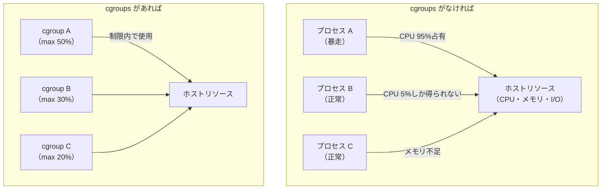
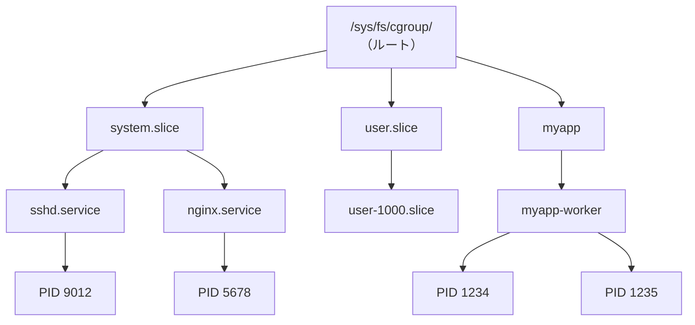
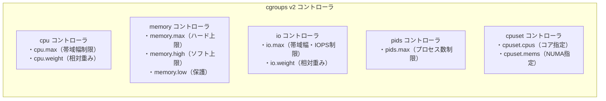
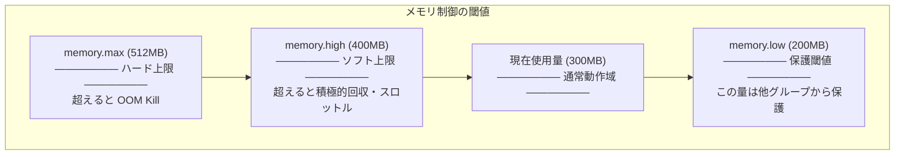
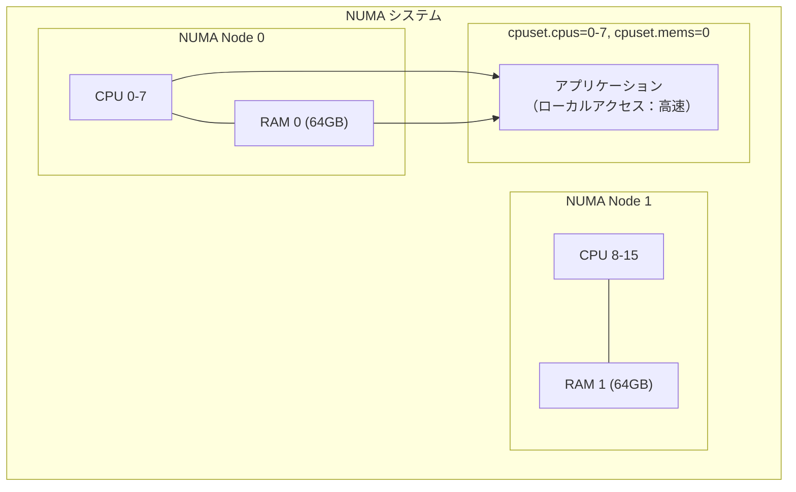
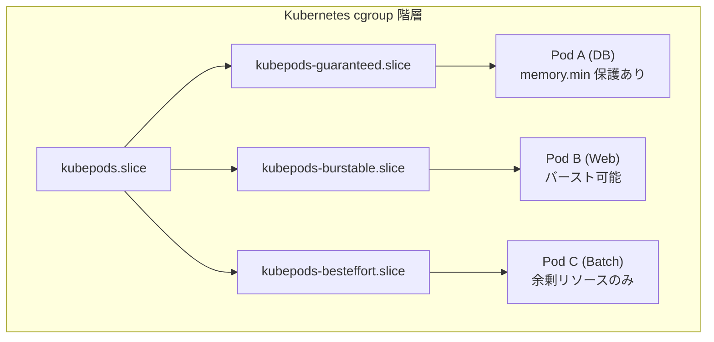
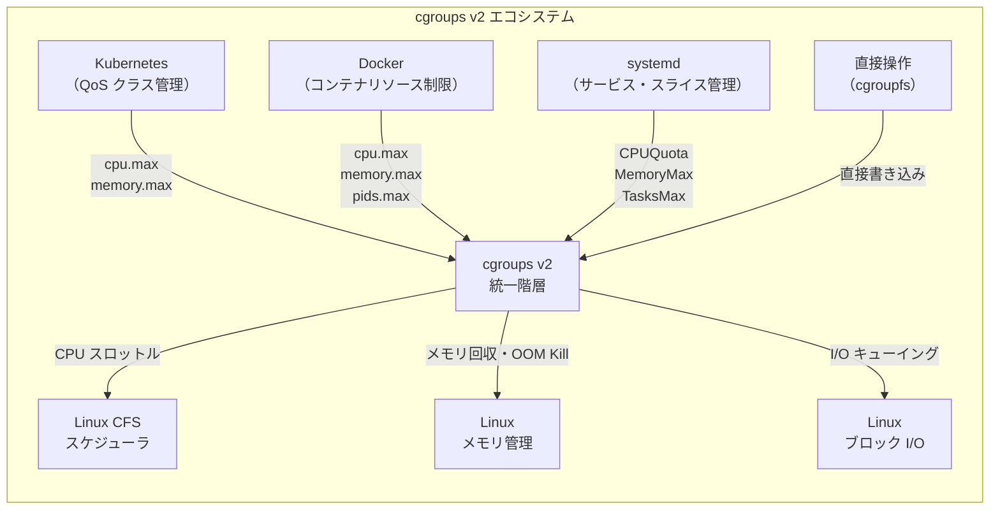

# Linux の cgroups v2 とリソース制御

## 1. はじめに — なぜリソース制御が必要か

現代のサーバーは、複数のプロセスやサービスが同一ホスト上で共存する。データベース、Webサーバー、バッチジョブ、監視エージェントが一台のマシン上で動作するとき、あるプロセスがCPUやメモリを大量に消費すれば、他のプロセスの応答性が著しく低下する。

この問題は**リソース競合（resource contention）**と呼ばれ、マルチテナント環境やコンテナ化された基盤では特に深刻である。単一のLinuxカーネルが提供するリソースを、複数の「論理的な単位」に公平かつ効率的に分配するためのメカニズムが求められた。

**cgroups（Control Groups）** は、Linux カーネルが提供するこの目的のための機構である。プロセスのグループに対してCPU時間、メモリ、I/O帯域幅、ネットワーク帯域などのリソースを制限・計測・優先順位付けする能力を持つ。コンテナ技術（Docker、Kubernetes）の根幹を支えるカーネル機能であり、systemdのサービス管理にも深く組み込まれている。



本記事では、cgroups の歴史から始まり、v2 における統一階層モデルのアーキテクチャ、主要コントローラの詳細、そして Docker・Kubernetes・systemd との実践的な統合まで、体系的に解説する。

## 2. cgroups の歴史

### 2.1 cgroups v1 の誕生

cgroups は Google のエンジニアである Paul Menage と Rohit Seth によって開発された。当初は **Process Containers** という名前で2006年に提案され、2007年に **cgroups** と改名されて Linux カーネル 2.6.24 に取り込まれた（2008年）。

Google 社内では、大規模なサーバーインフラ上でジョブのリソースを管理するために内部的にこの技術を活用しており、それをカーネルにアップストリームする形で公開された。

v1 の設計は、各リソースタイプごとに独立した**サブシステム（コントローラ）**を持つというものであった。

```
/sys/fs/cgroup/
├── cpu/            # CPU スケジューリング制御
├── cpuacct/        # CPU 使用量計測
├── memory/         # メモリ制御
├── blkio/          # ブロック I/O 制御
├── devices/        # デバイスアクセス制御
├── freezer/        # プロセスの一時停止
├── net_cls/        # ネットワークパケット分類
└── pids/           # プロセス数制限
```

各コントローラは独自の階層（ツリー）を持ち、独立してマウントされた。

### 2.2 v1 の問題点

cgroups v1 は長年にわたって広く利用されてきたが、複数の設計上の問題が露呈した。

**複数階層の不整合**: 各コントローラが独立した階層を持つため、同一プロセスが異なるコントローラで異なる位置に属せるという矛盾が生じた。例えば、あるプロセスがメモリ制御の観点では `/sys/fs/cgroup/memory/web/` に属しながら、CPU 制御の観点では `/sys/fs/cgroup/cpu/batch/` に属するという状況が起こりうる。これはリソース管理の意図を把握することを著しく困難にした。

**スレッドのマイグレーション問題**: v1 ではスレッドを個別に異なる cgroup に属させることができた。これは一見柔軟に見えるが、メモリは共有しながら CPU グループだけ異なるという物理的に矛盾した状態を生み出した。

**委任（delegation）の難しさ**: 非特権ユーザーへの安全な権限委譲の仕組みが不十分で、コンテナランタイムや systemd が独自の回避策を実装せざるを得なかった。

**"freezer" と "cpuset" の複雑さ**: freezer（プロセス停止）や cpuset（NUMA ノード割り当て）は独立したコントローラとして存在していたが、他のコントローラとのインタラクションが複雑で予期しない動作を引き起こすことがあった。

**計測と制御の分離**: CPU の計測（cpuacct）と制御（cpu）が別コントローラに分かれていた。これは設計の分離という観点では正しいが、実際の運用では常にセットで使うため不便だった。

### 2.3 cgroups v2 への移行

これらの問題を根本的に解決するために、Red Hat の Tejun Heo を中心に cgroups v2 の設計が行われた。v2 の基本設計は2013年頃から始まり、Linux カーネル 4.5（2016年）で正式に導入された。

v2 の根本的な変更点は**統一階層（unified hierarchy）**の採用である。すべてのコントローラが単一のツリーを共有し、プロセスは必ずその統一ツリーの一箇所にのみ属する。

::: tip v1 と v2 の共存
現在の Linux システムでは、v1 と v2 の cgroup が共存している場合が多い。`/sys/fs/cgroup/` に v2 がマウントされ、`/sys/fs/cgroup/cpuset/` などに v1 が残っているという構成も見られる。`systemd` はデフォルトで v2 を使うように移行が進んでいる。
:::

## 3. cgroups v2 のアーキテクチャ

### 3.1 統一階層モデル

v2 では、すべての cgroup が `/sys/fs/cgroup/` 以下の単一のツリーとして表現される。

```
/sys/fs/cgroup/
├── cgroup.controllers       # 利用可能なコントローラ一覧
├── cgroup.subtree_control   # 子に有効化するコントローラ
├── cgroup.procs             # このグループに属するプロセス一覧
├── cpu.stat                 # CPU 使用統計
├── memory.current           # 現在のメモリ使用量
├── system.slice/            # systemd のシステムスライス
│   ├── cgroup.procs
│   ├── sshd.service/
│   └── nginx.service/
├── user.slice/              # ユーザーセッションスライス
│   └── user-1000.slice/
└── myapp/                   # カスタム cgroup
    ├── cgroup.controllers
    ├── cgroup.procs
    ├── cpu.max
    └── memory.max
```



### 3.2 コントローラの有効化

v2 では、コントローラは明示的に有効化する必要がある。各 cgroup ディレクトリにある `cgroup.subtree_control` ファイルに書き込むことで、子 cgroup にコントローラを有効化できる。

```bash
# Enable cpu and memory controllers for child cgroups
echo "+cpu +memory" > /sys/fs/cgroup/myapp/cgroup.subtree_control

# Verify available controllers
cat /sys/fs/cgroup/myapp/cgroup.controllers
# cpu memory io pids
```

**重要な制約**: v2 では、**プロセスはリーフノード（子を持たない cgroup）にのみ属せる**。内部ノードにプロセスを配置しようとするとエラーになる。これは「内部プロセス制約（no internal process constraint）」と呼ばれる。

この制約により、リソース配分の意図が明確になる。あるノードがリソースを「管理する」役割を持つのか「消費する」役割を持つのかが構造として明示される。

### 3.3 プロセスの割り当て

プロセスを cgroup に移動させるには、`cgroup.procs` に PID を書き込む。

```bash
# Assign process with PID 12345 to myapp cgroup
echo 12345 > /sys/fs/cgroup/myapp/cgroup.procs

# Verify assignment
cat /sys/fs/cgroup/myapp/cgroup.procs
# 12345
```

プロセスを移動させると、そのプロセスの**すべてのスレッド**が一緒に移動する。v2 では、同一プロセスのスレッドを別々の cgroup に分散させることはできない（この問題は後述のスレッド対応モードで部分的に緩和されている）。

### 3.4 委任と非特権ユーザー

v2 では**委任（delegation）**の仕組みが整備された。特権ユーザーが特定のサブツリーの所有権を非特権ユーザーに移譲できる。

```bash
# Grant user 1000 ownership of a subtree
chown -R 1000:1000 /sys/fs/cgroup/user.slice/user-1000.slice/

# Non-privileged user can now create sub-cgroups and manage processes within
mkdir /sys/fs/cgroup/user.slice/user-1000.slice/mycontainer
echo $$ > /sys/fs/cgroup/user.slice/user-1000.slice/mycontainer/cgroup.procs
```

この仕組みにより、rootless コンテナ（非特権ユーザーが起動するコンテナ）の実装が可能になった。

## 4. 主要コントローラの概観

v2 で利用可能な主要コントローラを概観する。

| コントローラ | 目的 | 主要ファイル |
|---|---|---|
| `cpu` | CPU スケジューリング制御 | `cpu.max`, `cpu.weight` |
| `memory` | メモリ使用量制御 | `memory.max`, `memory.high`, `memory.low` |
| `io` | ブロック I/O 制御 | `io.max`, `io.weight` |
| `pids` | プロセス数制限 | `pids.max` |
| `cpuset` | CPU コア・NUMA ノード割り当て | `cpuset.cpus`, `cpuset.mems` |
| `hugetlb` | Huge Pages 制限 | `hugetlb.*.max` |
| `rdma` | RDMA/InfiniBand リソース制御 | `rdma.max` |



## 5. CPU コントローラの詳細

### 5.1 CFS（Completely Fair Scheduler）と cgroups

Linux の CPU スケジューラである **CFS（Completely Fair Scheduler）** は、プロセスに対して公平な CPU 時間を配分するように設計されている。cgroups v2 の CPU コントローラは、この CFS と統合されている。

CPU コントローラには2つの制御モードがある。

1. **重み（Weight）ベース**: 相対的な優先度でCPUを分配する
2. **帯域幅（Bandwidth）制御**: 時間窓内での最大使用量を制限する

### 5.2 cpu.weight — 相対的な重み

`cpu.weight` は 1 から 10000 の範囲で設定する相対的な重みである。デフォルトは 100。

```bash
# Set CPU weight (range: 1-10000, default: 100)
echo 200 > /sys/fs/cgroup/high_priority/cpu.weight
echo 50 > /sys/fs/cgroup/low_priority/cpu.weight

# If both cgroups compete for CPU:
# high_priority gets 200/(200+50) = 80% of available CPU
# low_priority gets 50/(200+50) = 20% of available CPU
```

重みは**競合が発生している場合のみ**適用される。CPUに余裕がある場合は、どちらのグループも必要なだけ CPU を使用できる。

### 5.3 cpu.max — 帯域幅制限

`cpu.max` は `$MAX $PERIOD` の形式で設定する。`$PERIOD` マイクロ秒の時間窓で最大 `$MAX` マイクロ秒の CPU 時間を使用できる。

```bash
# Limit to 50% CPU (50000us out of 100000us period)
echo "50000 100000" > /sys/fs/cgroup/myapp/cpu.max

# Limit to 2 CPU cores (200000us out of 100000us = 2 cores)
echo "200000 100000" > /sys/fs/cgroup/myapp/cpu.max

# Remove limit
echo "max 100000" > /sys/fs/cgroup/myapp/cpu.max
```



```mermaid
gantt
    title cpu.max の動作（50000 / 100000 の設定）
    dateFormat X
    axisFormat %Lms

    section 時間窓 1
    CPU使用可能  :0, 50
    スロットル（停止）  :50, 100

    section 時間窓 2
    CPU使用可能  :100, 150
    スロットル（停止）  :150, 200

    section 時間窓 3
    CPU使用可能  :200, 250
    スロットル（停止）  :250, 300
```

`cpu.max` による制限は**ハード上限**であり、期間内の使用量が上限に達するとプロセスは強制的にスロットル（一時停止）される。これを **CPU バンディング** という。

### 5.4 cpu.stat — CPU 統計情報

```bash
cat /sys/fs/cgroup/myapp/cpu.stat
# usage_usec 1234567      # total CPU time used (microseconds)
# user_usec 987654        # user-space CPU time
# system_usec 246913      # kernel-space CPU time
# nr_periods 1000         # number of throttle periods
# nr_throttled 50         # number of throttled periods
# throttled_usec 25000    # total throttled time (microseconds)
```

`nr_throttled` と `throttled_usec` はパフォーマンス問題の診断に重要である。頻繁にスロットルが発生している場合は、`cpu.max` の設定を見直す必要がある。

### 5.5 cpu.pressure — CPU プレッシャー

後述する PSI（Pressure Stall Information）の CPU 版。

```bash
cat /sys/fs/cgroup/myapp/cpu.pressure
# some avg10=0.00 avg60=0.00 avg300=0.00 total=0
# full avg10=0.00 avg60=0.00 avg300=0.00 total=0
```

## 6. メモリコントローラの詳細

### 6.1 メモリ管理の基礎

Linux のメモリ管理では、プロセスが要求したメモリを物理メモリ（RAM）にマッピングする。物理メモリが不足すると、カーネルの **OOM Killer（Out-of-Memory Killer）** が起動し、メモリ消費の多いプロセスを強制終了させる。

cgroups のメモリコントローラは、この OOM 動作を**グループ単位**で制御し、あるグループのメモリ圧迫が他のグループに影響しないようにする。

### 6.2 memory.max — ハード上限

`memory.max` は cgroup が使用できるメモリの絶対上限（ハード上限）である。

```bash
# Set hard memory limit to 512MB
echo "536870912" > /sys/fs/cgroup/myapp/memory.max
# Or in human-readable form (supported by some tools)
echo "512M" > /sys/fs/cgroup/myapp/memory.max
```

使用量がこの値を超えようとすると、まずカーネルは**メモリ回収**（page reclaim）を試みる。回収できなければ cgroup 内で **OOM Kill** が発生し、メモリ消費の多いプロセスが強制終了される。

### 6.3 memory.high — ソフト上限（スロットル閾値）

`memory.high` は「超えることは許容するが、積極的に回収を始める」閾値である。

```bash
# Set soft limit to 400MB (with hard limit at 512MB)
echo "419430400" > /sys/fs/cgroup/myapp/memory.high
echo "536870912" > /sys/fs/cgroup/myapp/memory.max
```

`memory.high` を超えると：
1. カーネルが積極的にページ回収を開始する
2. メモリ割り当て処理が意図的に遅延させられる（スロットル）
3. プロセスは終了しないが、パフォーマンスが低下する

これにより、アプリケーションに「メモリが逼迫していること」を間接的に伝え、OOM Kill を避けながら自発的な解放を促す。

### 6.4 memory.low — 保護閾値

`memory.low` は「このグループのメモリが他のグループのメモリ回収から保護される」下限である。

```bash
# Protect at least 200MB from being reclaimed
echo "209715200" > /sys/fs/cgroup/myapp/memory.low
```



### 6.5 memory.min — 最低保証

`memory.min` は `memory.low` より強い保護で、「たとえメモリ不足でもこの量は絶対に回収されない」保証である。

```bash
# Guarantee at least 100MB is never reclaimed
echo "104857600" > /sys/fs/cgroup/myapp/memory.min
```

### 6.6 memory.swap.max — スワップ制限

```bash
# Disable swap usage for this cgroup
echo "0" > /sys/fs/cgroup/myapp/memory.swap.max

# Allow up to 256MB of swap
echo "268435456" > /sys/fs/cgroup/myapp/memory.swap.max
```

コンテナ環境では、スワップを無効にしてメモリ上限を明確にする構成が一般的である。

### 6.7 memory.stat — メモリ統計

```bash
cat /sys/fs/cgroup/myapp/memory.stat
# anon 104857600         # anonymous memory (heap, stack)
# file 209715200         # file-backed memory (page cache)
# kernel 8388608         # kernel memory
# pgfault 12345          # minor page faults
# pgmajfault 10          # major page faults (disk I/O required)
# oom_kill 0             # number of OOM kills
```

`oom_kill` が増加しているのはメモリ不足の明確なサインである。`pgmajfault` が多い場合はスワップや I/O の問題を示す。

## 7. I/O コントローラの詳細

### 7.1 BFQ スケジューラとの統合

cgroups v2 の I/O コントローラは、Linux のブロックデバイスに対する読み書き帯域幅と IOPS を制御する。カーネルの **BFQ（Budget Fair Queueing）** スケジューラと連携することで、公平なI/O分配を実現する。

### 7.2 io.max — 帯域幅と IOPS の上限

`io.max` は特定のブロックデバイスに対するハード上限を設定する。

```bash
# Show current io.max settings
cat /sys/fs/cgroup/myapp/io.max
# 8:0 rbps=max wbps=max riops=max wiops=max

# Limit to 10MB/s read, 5MB/s write on device 8:0
# (device number can be found via ls -la /dev/sda)
echo "8:0 rbps=10485760 wbps=5242880" > /sys/fs/cgroup/myapp/io.max

# Limit IOPS (input/output operations per second)
echo "8:0 riops=1000 wiops=500" > /sys/fs/cgroup/myapp/io.max

# Combined limits
echo "8:0 rbps=10485760 wbps=5242880 riops=1000 wiops=500" \
    > /sys/fs/cgroup/myapp/io.max
```

### 7.3 io.weight — 相対的な優先度

```bash
# Set I/O weight (range: 1-10000, default: 100)
echo "default 200" > /sys/fs/cgroup/high_priority/io.weight
echo "default 50" > /sys/fs/cgroup/batch_job/io.weight

# Device-specific weight
echo "8:0 300" > /sys/fs/cgroup/myapp/io.weight
```

`io.weight` は CPU の `cpu.weight` と同様に、競合時の相対的な I/O 帯域を制御する。

### 7.4 io.stat — I/O 統計

```bash
cat /sys/fs/cgroup/myapp/io.stat
# 8:0 rbytes=1073741824 wbytes=536870912 rios=10000 wios=5000 dbytes=0 dios=0
# rbytes: bytes read
# wbytes: bytes written
# rios: read I/O operations
# wios: write I/O operations
```

### 7.5 io.pressure — I/O プレッシャー

```bash
cat /sys/fs/cgroup/myapp/io.pressure
# some avg10=12.34 avg60=8.90 avg300=5.67 total=123456
# full avg10=5.12 avg60=3.45 avg300=2.34 total=56789
```

高い I/O プレッシャーは、ストレージの性能ボトルネックや I/O 制限の過剰な設定を示す。

## 8. pids コントローラ

### 8.1 プロセス数制限の重要性

`pids` コントローラは cgroup 内で作成できるプロセス（スレッドを含む）の最大数を制限する。コンテナ環境では、**フォーク爆弾（fork bomb）**（プロセスが際限なく自分自身を複製する攻撃・バグ）からシステムを守るために不可欠である。

```bash
# Limit to maximum 100 processes in this cgroup
echo 100 > /sys/fs/cgroup/myapp/pids.max

# Check current process count
cat /sys/fs/cgroup/myapp/pids.current
# 23

# Check limit
cat /sys/fs/cgroup/myapp/pids.max
# 100
```

制限に達すると、`fork(2)` や `clone(2)` システムコールが `EAGAIN` エラーで失敗する。

## 9. cpuset コントローラ

### 9.1 CPU アフィニティと NUMA

`cpuset` コントローラは、プロセスが使用できる CPU コアと NUMA（Non-Uniform Memory Access）ノードを制限する。

```bash
# Pin workload to CPU cores 0-3 only
echo "0-3" > /sys/fs/cgroup/myapp/cpuset.cpus

# Pin to NUMA node 0
echo "0" > /sys/fs/cgroup/myapp/cpuset.mems

# Verify effective settings
cat /sys/fs/cgroup/myapp/cpuset.cpus.effective
# 0-3
```

cpuset は **NUMA-aware** なアプリケーション（データベース、高性能計算など）で、メモリアクセスの局所性を最大化するために使用される。



## 10. PSI — Pressure Stall Information

### 10.1 PSI とは

**PSI（Pressure Stall Information）** は、Linux カーネル 4.20（2019年）で導入された、リソース圧迫の状態をリアルタイムに計測する仕組みである。Facebook（現 Meta）の Johannes Weiner が設計・実装した。

従来のリソース監視指標（CPU 使用率、メモリ使用量など）は「リソースがどれだけ使われているか」を示すが、PSI は「タスクがリソース不足で**どれだけ待たされているか**」を計測する。これは実際のパフォーマンス低下をより直接的に表す指標である。

### 10.2 PSI の指標

PSI は3種類のリソースについて計測する。

```bash
# CPU pressure
cat /proc/pressure/cpu
# some avg10=2.34 avg60=1.23 avg300=0.89 total=12345678

# Memory pressure
cat /proc/pressure/memory
# some avg10=0.12 avg60=0.08 avg300=0.05 total=987654
# full avg10=0.01 avg60=0.01 avg300=0.00 total=12345

# I/O pressure
cat /proc/pressure/io
# some avg10=5.67 avg60=4.12 avg300=3.01 total=23456789
# full avg10=2.34 avg60=1.78 avg300=1.23 total=11223344
```

**some**: 少なくとも1つのタスクがリソース待ちだった時間の割合（%）
**full**: すべての実行可能タスクがリソース待ちだった時間の割合（%）

`full` の値が高い場合は特に深刻で、システム全体が実質的にストールしている状態を示す。

### 10.3 cgroups v2 での PSI 活用

cgroups v2 では、各 cgroup ごとに PSI 情報が記録される。

```bash
# PSI for a specific cgroup
cat /sys/fs/cgroup/myapp/memory.pressure
cat /sys/fs/cgroup/myapp/cpu.pressure
cat /sys/fs/cgroup/myapp/io.pressure
```

### 10.4 PSI を使った自動対応

Linux 5.2 からは PSI の閾値を超えた際に通知を受け取ることができる。

```bash
# Monitor memory pressure: notify when 'some' stall exceeds 70ms in 1s window
# Open file descriptor for notification
exec 9<>/sys/fs/cgroup/myapp/memory.pressure

# Write trigger: "some 70000 1000000" means "some stall > 70ms per 1s"
echo "some 70000 1000000" > /sys/fs/cgroup/myapp/memory.pressure

# Application can now poll/select on fd 9 for pressure events
```

これにより、Kubernetes の **out-of-memory eviction** のようなシステムが、OOM Kill が発生する前にポッドを退避させることが可能になる。

## 11. systemd との統合

### 11.1 systemd のリソース管理

systemd は起動以来、cgroups を積極的に活用してきた。v2 への移行とともに、systemd の cgroup 管理は更に強化された。

systemd は以下の3種類の単位で cgroup を管理する。

- **サービス（.service）**: 単一のデーモンプロセス
- **スライス（.slice）**: サービスやスコープをまとめたグループ
- **スコープ（.scope）**: systemd 外部で起動されたプロセスのグループ

```
system.slice ── systemd が管理するシステムサービス全体
├── sshd.service
├── nginx.service
├── postgresql.service
└── docker.service

user.slice ── ユーザーセッション全体
└── user-1000.slice
    └── session-1.scope (PAM セッション)

machine.slice ── 仮想マシン・コンテナ
└── docker-abc123.scope
```

### 11.2 systemd のリソース設定

`systemctl` を使ったリソース設定、またはサービスファイルの `[Service]` セクションで直接設定できる。

```ini
# /etc/systemd/system/myapp.service
[Unit]
Description=My Application

[Service]
ExecStart=/usr/bin/myapp
# CPU limit: 50% of one core
CPUQuota=50%
# CPU weight (relative priority)
CPUWeight=200
# Memory hard limit
MemoryMax=512M
# Memory soft limit
MemoryHigh=400M
# Process count limit
TasksMax=100
# I/O weight
IOWeight=200
# I/O bandwidth limit per device
IOReadBandwidthMax=/dev/sda 10M
IOWriteBandwidthMax=/dev/sda 5M

[Install]
WantedBy=multi-user.target
```

```bash
# Apply resource limits at runtime (without restart)
systemctl set-property myapp.service CPUQuota=30%
systemctl set-property myapp.service MemoryMax=256M

# View current resource settings
systemctl show myapp.service | grep -E "CPU|Memory|IO|Tasks"
```

### 11.3 systemd-run による一時的な制約

```bash
# Run a command with resource constraints in a transient scope
systemd-run --scope \
    --property=CPUQuota=10% \
    --property=MemoryMax=100M \
    --property=TasksMax=20 \
    /usr/bin/batch_job.sh

# Run as a transient service
systemd-run \
    --unit=batch-work.service \
    --property=CPUWeight=50 \
    --property=MemoryHigh=200M \
    /usr/bin/batch_job.sh
```

## 12. コンテナランタイムとの関係

### 12.1 Docker と cgroups

Docker は cgroups v2 に対応しており、コンテナごとに cgroup を作成してリソースを管理する。

```bash
# Run container with resource limits
docker run \
    --cpus="1.5" \           # 1.5 CPU cores (translates to cpu.max)
    --memory="512m" \        # 512MB memory limit
    --memory-reservation="256m" \  # memory.low
    --blkio-weight=200 \     # I/O weight
    --pids-limit=100 \       # pids.max
    nginx:latest

# Inspect cgroup path for running container
CONTAINER_ID=$(docker ps -q --filter name=nginx)
docker inspect $CONTAINER_ID | jq '.[0].HostConfig.CgroupParent'
# ""  (defaults to /sys/fs/cgroup/system.slice/docker-<id>.scope)
```

Docker が作成する cgroup の構造：

```
/sys/fs/cgroup/
└── system.slice/
    └── docker-abc123def456.scope/
        ├── cgroup.procs
        ├── cpu.max          # --cpus から変換
        ├── memory.max       # --memory から変換
        ├── pids.max         # --pids-limit から変換
        └── io.weight        # --blkio-weight から変換
```

### 12.2 Kubernetes と cgroups

Kubernetes はより複雑な cgroup 階層を使用する。kubelet が cgroup の階層を管理し、QoS クラスに応じてリソースを配分する。

```
/sys/fs/cgroup/
├── kubepods.slice/
│   ├── kubepods-guaranteed.slice/    # Guaranteed QoS
│   │   └── kubepods-pod<uid>.slice/
│   │       └── <container-id>.scope/
│   ├── kubepods-burstable.slice/     # Burstable QoS
│   │   └── ...
│   └── kubepods-besteffort.slice/    # BestEffort QoS
│       └── ...
```

**Guaranteed**: requests と limits が等しいコンテナ。最高優先度で OOM Kill から保護される。
**Burstable**: requests < limits のコンテナ。制限内であればバースト可能。
**BestEffort**: requests/limits が未設定のコンテナ。リソース圧迫時に最初に退去させられる。

```yaml
# Kubernetes Pod with resource requests/limits
apiVersion: v1
kind: Pod
metadata:
  name: myapp
spec:
  containers:
  - name: app
    image: myapp:latest
    resources:
      requests:
        cpu: "500m"       # cpu.weight に変換
        memory: "256Mi"   # memory.low に変換
      limits:
        cpu: "1000m"      # cpu.max に変換
        memory: "512Mi"   # memory.max に変換
```

Kubernetes 1.25 以降では **cgroup v2 サポートが安定版**となり、Kubernetes 1.32 では v2 がデフォルトとなった（v1 は非推奨）。



### 12.3 containerd と runc

Kubernetes のコンテナランタイムとして最も広く使われる containerd と runc も、cgroups v2 を完全にサポートしている。

```json
// OCI Runtime Spec (config.json) での cgroup 設定例
{
  "linux": {
    "cgroupsPath": "/kubepods/pod123/container456",
    "resources": {
      "cpu": {
        "shares": 1024,
        "quota": 100000,
        "period": 100000
      },
      "memory": {
        "limit": 536870912,
        "reservation": 268435456
      },
      "pids": {
        "limit": 100
      }
    }
  }
}
```

## 13. 実践的な操作と監視

### 13.1 cgroupfs の直接操作

```bash
# Create a new cgroup
mkdir /sys/fs/cgroup/myapp

# Enable controllers for child cgroups
echo "+cpu +memory +io +pids" > /sys/fs/cgroup/myapp/cgroup.subtree_control

# Create sub-cgroups
mkdir /sys/fs/cgroup/myapp/worker
mkdir /sys/fs/cgroup/myapp/api

# Set limits
echo "50000 100000" > /sys/fs/cgroup/myapp/worker/cpu.max   # 50% CPU
echo "268435456" > /sys/fs/cgroup/myapp/worker/memory.max   # 256MB
echo "50" > /sys/fs/cgroup/myapp/worker/pids.max

# Assign current shell to cgroup
echo $$ > /sys/fs/cgroup/myapp/api/cgroup.procs

# Verify
cat /sys/fs/cgroup/myapp/api/cgroup.procs
```

### 13.2 cgroupsv2 監視ツール

```bash
# systemd-cgtop: cgroup ごとのリソース使用量をリアルタイム表示
systemd-cgtop

# systemctl status でサービスの cgroup を確認
systemctl status nginx.service
# ● nginx.service - A high performance web server
#    Loaded: loaded (/lib/systemd/system/nginx.service)
#    Active: active (running)
#    CGroup: /system.slice/nginx.service
#            └─12345 nginx: master process /usr/sbin/nginx

# journalctl でリソース関連のログを確認
journalctl -u myapp.service | grep -i "oom\|memory\|killed"
```

### 13.3 パフォーマンス問題の診断

cgroup に関連するパフォーマンス問題の典型的な診断フローを示す。

```bash
# 1. Check if CPU throttling is occurring
cat /sys/fs/cgroup/myapp/cpu.stat | grep throttled
# nr_throttled 150     <- if this is increasing, CPU limit is too low
# throttled_usec 1500000

# 2. Check memory pressure
cat /sys/fs/cgroup/myapp/memory.pressure
# some avg10=45.67 avg60=38.12 avg300=22.34 total=...
# high values indicate memory shortage

# 3. Check OOM events
cat /sys/fs/cgroup/myapp/memory.events
# low 0
# high 10         <- memory.high was exceeded 10 times
# max 2           <- memory.max was hit 2 times
# oom 1           <- OOM kill occurred once
# oom_kill 1

# 4. Check I/O pressure
cat /sys/fs/cgroup/myapp/io.pressure
# some avg10=23.45 avg60=15.67 avg300=10.23 total=...
```

::: warning OOM Kill の診断
`memory.events` の `oom_kill` が増えている場合、`dmesg` コマンドでカーネルのOOMログを確認できる。どのプロセスが kill されたか、なぜ kill されたかの詳細が記録されている。

```bash
dmesg | grep -i "oom\|killed process"
```
:::

## 14. cgroups v2 の制限事項と注意点

### 14.1 スレッドモード

先述の「内部プロセス制約」（内部ノードにプロセスを置けない）の例外として、**スレッドモード（threaded mode）**がある。

```bash
# Enable threaded mode for a cgroup
echo "threaded" > /sys/fs/cgroup/myapp/worker/cgroup.type

# In threaded mode, threads (not processes) can be placed in different cgroups
# This is useful for per-thread CPU affinity control
```

スレッドモードでは、同一プロセスの異なるスレッドを別々の cgroup に配置できる。ただし、メモリコントローラはスレッドモードでは使用できない（プロセス単位でしかメモリを管理できないため）。

### 14.2 コントローラの可用性

すべてのコントローラがすべてのシステムで利用可能なわけではない。

```bash
# Check available controllers on the system
cat /sys/fs/cgroup/cgroup.controllers
# cpuset cpu io memory hugetlb pids rdma misc

# Some controllers require specific kernel configs
grep CONFIG_CGROUP /boot/config-$(uname -r) | grep -v "^#"
```

### 14.3 v1 との互換性

完全に v2 のみを使用する「pure v2」モードと、v1 と v2 が混在するモードがある。

```bash
# Check if unified (pure v2) or hybrid mode
mount | grep cgroup
# cgroup2 on /sys/fs/cgroup type cgroup2 (rw,...) <- v2 only
# cgroup on /sys/fs/cgroup/blkio type cgroup (rw,...) <- v1 still mounted
```

カーネルパラメータ `systemd.unified_cgroup_hierarchy=1` を指定することで pure v2 モードに移行できるが、v1 のみをサポートするレガシーコンテナとの互換性が失われる可能性がある。

## 15. まとめ

cgroups v2 は、v1 が抱えていた複数階層の不整合問題を根本から解決し、統一された階層モデルのもとで一貫したリソース管理を提供する。



主要な設計原則をまとめる。

1. **統一階層**: すべてのコントローラが単一のツリーを共有し、プロセスはツリーの一箇所にのみ属する
2. **明示的な有効化**: コントローラは `cgroup.subtree_control` で明示的に有効化する
3. **多層的なメモリ制御**: `memory.min` / `memory.low` / `memory.high` / `memory.max` による細かな制御
4. **PSI による圧迫計測**: 従来の使用量ではなく「待ち時間」でリソース圧迫を計測
5. **安全な委任**: 非特権ユーザーへのサブツリー委譲により rootless コンテナを実現

cgroups v2 はコンテナ技術の成熟とともにそのコアとなっており、Kubernetes や Docker だけでなく、systemd を通じてすべての Linux サーバーに関わる技術である。適切なリソース制限の設定は、サービスの安定稼働と公平なリソース共有に不可欠であり、PSI のような新しい監視指標を活用することで、問題が深刻化する前に予防的な対処が可能になる。

::: details 参考：主要ファイルの一覧

| ファイル | コントローラ | 内容 |
|---|---|---|
| `cgroup.procs` | - | このグループに属するプロセスの PID 一覧 |
| `cgroup.controllers` | - | このグループで使用可能なコントローラ |
| `cgroup.subtree_control` | - | 子グループに有効化するコントローラ |
| `cpu.max` | cpu | CPU帯域幅上限（`$MAX $PERIOD` 形式）|
| `cpu.weight` | cpu | CPU相対重み（1〜10000）|
| `cpu.stat` | cpu | CPU使用統計（スロットル情報含む）|
| `cpu.pressure` | cpu | CPU プレッシャー（PSI）|
| `memory.max` | memory | メモリハード上限 |
| `memory.high` | memory | メモリソフト上限（スロットル閾値）|
| `memory.low` | memory | メモリ保護閾値 |
| `memory.min` | memory | メモリ最低保証 |
| `memory.current` | memory | 現在のメモリ使用量 |
| `memory.stat` | memory | 詳細メモリ統計 |
| `memory.events` | memory | OOM イベントカウンタ |
| `memory.pressure` | memory | メモリ プレッシャー（PSI）|
| `memory.swap.max` | memory | スワップ使用上限 |
| `io.max` | io | I/O 帯域幅・IOPS 上限 |
| `io.weight` | io | I/O 相対重み |
| `io.stat` | io | I/O 使用統計 |
| `io.pressure` | io | I/O プレッシャー（PSI）|
| `pids.max` | pids | 最大プロセス数 |
| `pids.current` | pids | 現在のプロセス数 |
| `cpuset.cpus` | cpuset | 使用可能 CPU コア |
| `cpuset.mems` | cpuset | 使用可能 NUMA ノード |

:::
