# CDC（Change Data Capture）の設計と実装

## 1. CDCとは何か、なぜ必要なのか

### 1.1 データ同期の根本的な難しさ

現代のシステムアーキテクチャでは、データは複数の場所に存在する。PostgreSQL に格納されたユーザー情報を Elasticsearch に同期して全文検索を提供し、Redis にキャッシュして高速なアクセスを実現し、データウェアハウスに投入して分析に活用する。こうした「データの分散」はシステムの柔軟性を高めるが、同時に**データの同期**という本質的な課題をもたらす。

最も単純なアプローチは、アプリケーションがデータベースに書き込む際に、他のシステムへの書き込みも同時に行う「二重書き込み（Dual Write）」である。しかし、Outbox パターンの記事で詳述した通り、この方式はトランザクションの境界を越えた原子性を保証できず、不整合が生じやすい。

**CDC（Change Data Capture）** は、この問題を根本的に異なる角度から解決するアプローチである。アプリケーションが複数のシステムに直接書き込む代わりに、**データベース自体が持つ変更ログ（トランザクションログ）を直接読み取り、変更を他のシステムに伝搬させる**という考え方だ。

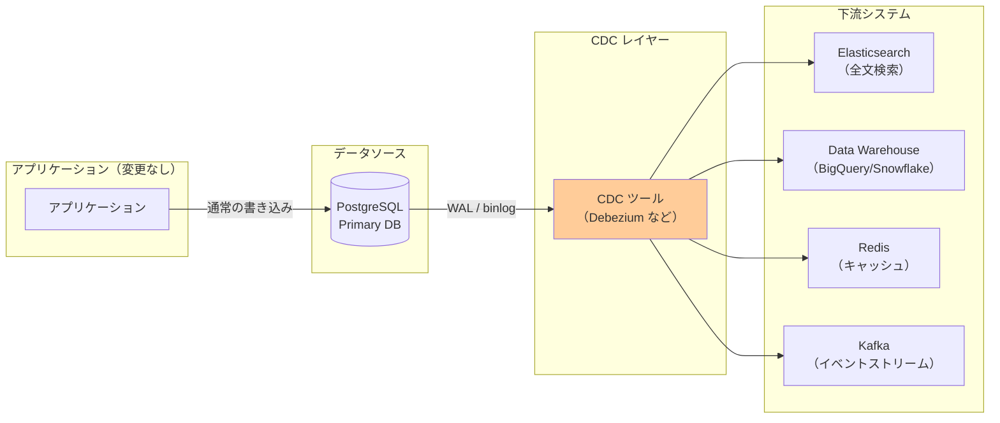

### 1.2 CDCが解決する問題

CDCが解決しようとする問題は以下のように整理できる。

**データ統合の信頼性**: アプリケーションコードの変更なしに、データベースへのすべての変更をキャプチャする。INSERT、UPDATE、DELETE を含むすべての操作が対象となり、アプリケーションが複数のコードパスを持っていても漏れなく追跡できる。

**低レイテンシの同期**: バッチ処理のように数時間後にデータを同期するのではなく、変更が発生してから数百ミリ秒〜数秒以内に下流システムへ伝搬できる。リアルタイム性が求められるユースケース（キャッシュの無効化、検索インデックスの更新）に適している。

**アプリケーションコードの分離**: 下流システムへの同期ロジックをアプリケーションコードから切り離せる。アプリケーションはデータベースへの書き込みのみに集中でき、同期ロジックの追加や変更がアプリケーションの改修を必要としない。

**監査ログとしての活用**: 変更イベントはすべての変更の完全な履歴を形成する。誰が何をいつ変更したかを正確に追跡でき、監査・コンプライアンス要件を満たすために活用できる。

::: tip CDCの語源
Change Data Capture という用語は、データベース業界では 1990 年代から使われている。当時は主にメインフレームのデータベース（IBM DB2 など）からデータウェアハウスへのデータ連携のために使われていた。クラウド時代に入り、マイクロサービスやリアルタイムデータパイプラインの普及とともに、CDCは再び脚光を浴びている。
:::

### 1.3 CDCの適用が適さないケース

CDCは万能ではない。以下のようなケースでは、別のアプローチを検討すべきである。

- **単純なシステム**: 複数のデータストアを同期する必要がない小規模なシステムでは、CDCの複雑性はオーバーエンジニアリングとなる
- **即時整合性が必要な場合**: CDCは非同期であるため、書き込みと同時に下流システムへの反映が必要なユースケースには不向きである
- **高度なトランスフォーメーション**: データの変換ロジックが複雑な場合は、ETL パイプラインの方が適していることがある

## 2. CDCの実装方式

CDCを実現するアプローチには大きく 4 種類ある。それぞれの仕組み、メリット・デメリット、適したユースケースを詳しく見ていく。

### 2.1 タイムスタンプ・ポーリング方式

最も単純な CDC の実装が、**タイムスタンプ・ポーリング（Timestamp-based Polling）** である。テーブルに `updated_at` カラムを追加し、定期的にそのカラムを使って「前回ポーリング以降に変更されたレコード」をクエリする。

```sql
-- Example: query records updated after last poll
SELECT *
FROM orders
WHERE updated_at > '2026-03-02 10:00:00'
ORDER BY updated_at ASC;
```

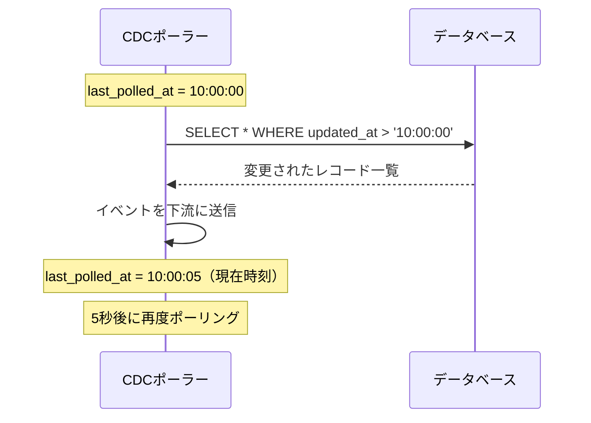

**メリット:**
- 実装が簡単で、特別なデータベース機能が不要
- どのデータベースでも動作する
- 既存のシステムへの導入が容易

**デメリット:**
- **DELETE をキャプチャできない**: レコードが削除されるとクエリ結果に現れない（ソフトデリートで回避可能だが、設計を汚す）
- **レイテンシが高い**: ポーリング間隔分の遅延が常に発生する
- **データベースへの追加負荷**: 定期的なクエリがデータベースに負荷をかける（インデックスが必要）
- **タイムスタンプ精度の問題**: システムクロックのずれやトランザクションの並列実行により、変更を見落とす可能性がある

::: warning タイムスタンプポーリングの落とし穴
複数のサーバーが同時にレコードを更新する場合、タイムスタンプが同一になることがある。`>` ではなく `>=` を使えば見落としが減るが、重複処理が発生する。また、アプリケーションが `updated_at` を正しく設定していない場合は機能しない。
:::

### 2.2 トリガー方式

データベースの**トリガー（Trigger）** を使って、変更が発生するたびに専用の変更ログテーブルに記録する方式である。

```sql
-- Create a change log table
CREATE TABLE change_log (
    id BIGSERIAL PRIMARY KEY,
    table_name VARCHAR(100) NOT NULL,
    operation VARCHAR(10) NOT NULL,  -- INSERT, UPDATE, DELETE
    row_id BIGINT NOT NULL,
    old_data JSONB,
    new_data JSONB,
    captured_at TIMESTAMP DEFAULT NOW()
);

-- Create trigger for the orders table
CREATE OR REPLACE FUNCTION capture_order_changes()
RETURNS TRIGGER AS $$
BEGIN
    IF TG_OP = 'DELETE' THEN
        INSERT INTO change_log(table_name, operation, row_id, old_data)
        VALUES ('orders', 'DELETE', OLD.id, row_to_json(OLD));
        RETURN OLD;
    ELSIF TG_OP = 'UPDATE' THEN
        INSERT INTO change_log(table_name, operation, row_id, old_data, new_data)
        VALUES ('orders', 'UPDATE', NEW.id, row_to_json(OLD), row_to_json(NEW));
        RETURN NEW;
    ELSIF TG_OP = 'INSERT' THEN
        INSERT INTO change_log(table_name, operation, row_id, new_data)
        VALUES ('orders', 'INSERT', NEW.id, NULL, row_to_json(NEW));
        RETURN NEW;
    END IF;
END;
$$ LANGUAGE plpgsql;

CREATE TRIGGER orders_change_capture
AFTER INSERT OR UPDATE OR DELETE ON orders
FOR EACH ROW EXECUTE FUNCTION capture_order_changes();
```

CDCポーラーは `change_log` テーブルをポーリングし、処理済みのレコードを削除または処理済みとしてマークする。

**メリット:**
- DELETE もキャプチャできる
- テーブルのすべての変更を確実に記録できる
- データベースの種類を問わず（トリガー対応DB）利用できる

**デメリット:**
- **書き込みパフォーマンスの低下**: すべての INSERT/UPDATE/DELETE でトリガーが実行され、`change_log` テーブルへの書き込みが発生する（トランザクションコストが約 2 倍になる）
- **管理の複雑性**: テーブルごとにトリガーを管理する必要があり、スキーマ変更時の漏れが生じやすい
- **ストレージコスト**: 変更ログテーブルが肥大化する

### 2.3 WAL/トランザクションログ方式

最も強力かつ本格的な CDC の実装が、**データベースのトランザクションログを直接読み取る**方式である。PostgreSQL では WAL（Write-Ahead Log）、MySQL では binlog と呼ばれる。

データベースはトランザクションを永続化するために、コミット前にすべての変更をトランザクションログに書き込む（これが「Write-Ahead」の意味である）。このログはレプリケーションにも使用されており、CDC ツールはスレーブ（レプリカ）と同様の仕組みでこのログを読み取る。

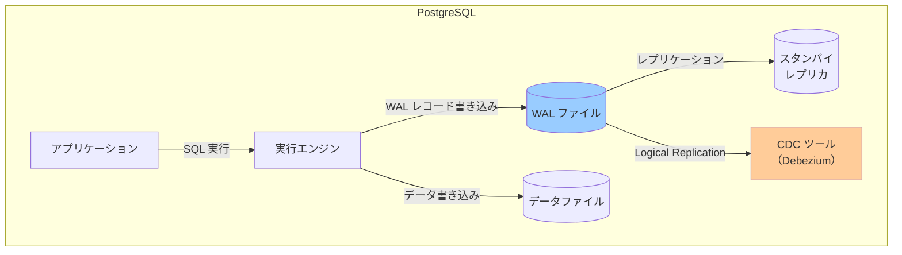

PostgreSQL の場合、論理レプリケーション（Logical Replication）と呼ばれる機能が CDC に使用される。論理レプリケーションは物理的なバイト列ではなく、行レベルの変更イベント（INSERT/UPDATE/DELETE）として変更を提供する。

**メリット:**
- **完全な変更キャプチャ**: DELETE を含むすべての変更を確実に捉える
- **アプリケーションへの影響がない**: スキーマ変更も不要、トリガーも不要
- **低レイテンシ**: コミットされた変更が即座にログに反映される
- **before/after イメージ**: 変更前・変更後の両方のデータを取得できる
- **本番環境への影響が最小**: ログは元々存在するものを読み取るだけ

**デメリット:**
- **データベース固有の設定が必要**: PostgreSQL の `wal_level = logical`、MySQL の `binlog_format = ROW` など
- **WAL の保持設定**: CDC ツールが追いつかない場合、WAL が削除されて変更が失われる可能性がある
- **レプリケーションスロット（PostgreSQL）**: 未消費のスロットが WAL の蓄積と disk 使用量の増大を引き起こす

### 2.4 方式の比較

| 方式 | 実装難易度 | DELETE 検知 | レイテンシ | 本番影響 | 適したケース |
|---|---|---|---|---|---|
| **タイムスタンプポーリング** | 低 | 不可（ソフトデリート不使用時） | 高（ポーリング間隔） | 低〜中 | 小規模、PoC |
| **トリガー** | 中 | 可能 | 中 | 高（書き込みコスト） | トランザクションログアクセス不可時 |
| **WAL/binlog** | 高 | 可能 | 低（ミリ秒単位） | 最小 | 本番環境の本格的な CDC |

現代の CDC ソリューション（Debezium など）のほとんどは WAL/binlog 方式を採用している。残りの解説もこの方式を中心に進める。

## 3. Debeziumの仕組み

**Debezium** は Red Hat が開発し、現在は独立したオープンソースプロジェクトとして広く使われる CDC プラットフォームである。Kafka Connect の Source Connector として動作し、様々なデータベースのトランザクションログを読み取って Kafka トピックへイベントを発行する。

### 3.1 アーキテクチャの全体像

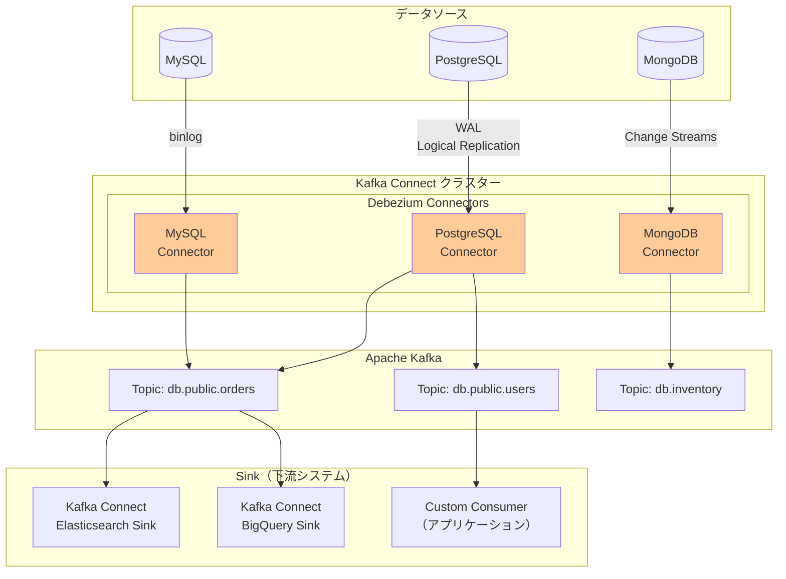

### 3.2 Kafka Connect との統合

Debezium は **Kafka Connect** フレームワーク上で動作する。Kafka Connect は Kafka と外部システムの間のデータ移動を標準化するフレームワークであり、Source Connector（外部 → Kafka）と Sink Connector（Kafka → 外部）の 2 種類がある。

Debezium は Source Connector として機能し、データベースの変更を Kafka トピックに書き込む。この設計の利点は以下の通りである。

- **スケーラビリティ**: Kafka Connect はワーカーを追加するだけでスケールアウトできる
- **障害耐性**: オフセット管理が Kafka によって行われるため、Connector が再起動しても前回の位置から再開できる
- **エコシステム**: 豊富な Sink Connector（Elasticsearch, BigQuery, Snowflake など）と組み合わせられる

Debezium コネクターの設定例（PostgreSQL）:

```json
{
  "name": "postgres-orders-connector",
  "config": {
    "connector.class": "io.debezium.connector.postgresql.PostgresConnector",
    "database.hostname": "postgres",
    "database.port": "5432",
    "database.user": "debezium",
    "database.password": "debezium",
    "database.dbname": "shop",
    "topic.prefix": "db",
    "table.include.list": "public.orders,public.order_items",
    "plugin.name": "pgoutput",
    "slot.name": "debezium_slot",
    "publication.name": "debezium_publication",
    "heartbeat.interval.ms": "10000"
  }
}
```

### 3.3 スナップショット（初期ロード）

CDC コネクターを初めて起動する際、トランザクションログには過去のすべての変更が残っていない（WAL は一定期間後に削除される）。そのため、Debezium は **スナップショット（Snapshot）** という初期ロードのプロセスを経てから、増分変更のキャプチャを開始する。

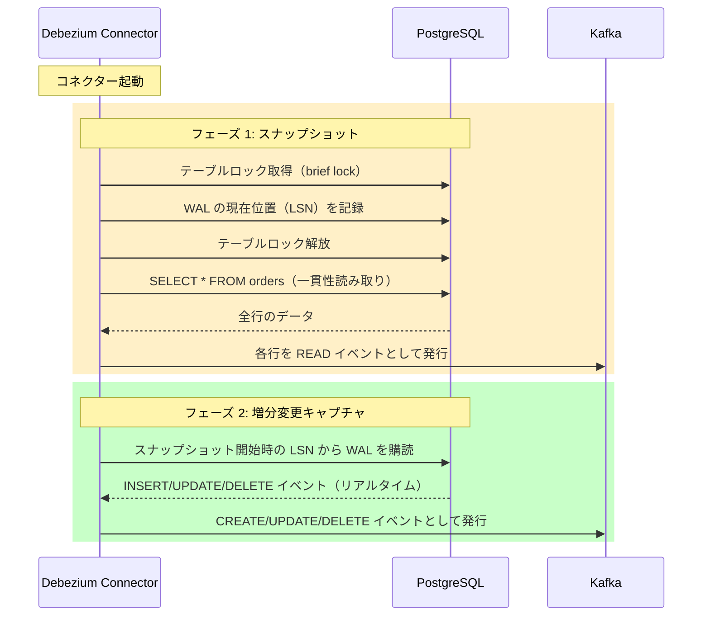

スナップショット中にテーブルへの書き込みが発生しても問題ない。スナップショット開始時の LSN（Log Sequence Number）を記録しておくことで、スナップショット完了後にその LSN 以降の変更を正確に読み取れる。

スナップショットには複数のモードがある:

| モード | 説明 | 適したケース |
|---|---|---|
| `initial` | コネクター初回起動時にスナップショットを実行 | デフォルト設定 |
| `always` | 起動のたびにスナップショットを実行 | 常に最新状態を保証したい場合 |
| `never` | スナップショットをスキップ | WAL の先頭から読み取れる場合 |
| `initial_only` | スナップショットのみ実行し増分は行わない | 一括移行のみ必要な場合 |
| `when_needed` | オフセットが存在しない場合のみ実行 | 再起動時のスナップショット回避 |

### 3.4 オフセット管理と耐障害性

Debezium は処理したトランザクションログの位置（PostgreSQL では LSN、MySQL では binlog ファイル名とポジション）を Kafka に保存する。これにより、コネクターが再起動した場合でも、前回処理した位置から再開できる。

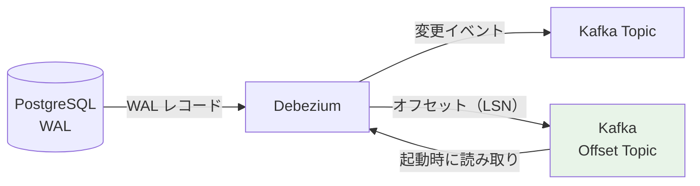

::: warning レプリケーションスロットの管理
PostgreSQL では、Debezium はレプリケーションスロットを作成する。スロットが存在する間、PostgreSQL は CDC ツールが消費するまで WAL を削除できない。コネクターが長期間停止した場合、WAL が蓄積してディスクが枯渇する恐れがある。本番環境では `max_slot_wal_keep_size` を設定し、WAL の過度な蓄積を防ぐことが重要である。
:::

## 4. PostgreSQL と MySQL での CDC 設定

### 4.1 PostgreSQL の Logical Replication

PostgreSQL 9.4 から論理レプリケーション（Logical Replication）が導入され、行レベルの変更イベントを外部から購読できるようになった。

**設定手順:**

```sql
-- 1. postgresql.conf の設定
-- wal_level = logical
-- max_replication_slots = 10  (CDC スロット分)
-- max_wal_senders = 10

-- 2. レプリケーション権限を持つユーザーを作成
CREATE USER debezium WITH
    REPLICATION
    LOGIN
    PASSWORD 'debezium_password';

-- 3. 対象スキーマ・テーブルへのアクセス権限を付与
GRANT USAGE ON SCHEMA public TO debezium;
GRANT SELECT ON ALL TABLES IN SCHEMA public TO debezium;
ALTER DEFAULT PRIVILEGES IN SCHEMA public GRANT SELECT ON TABLES TO debezium;

-- 4. Publication を作成（CDC 対象テーブルを定義）
CREATE PUBLICATION debezium_pub FOR TABLE orders, order_items, users;

-- または全テーブルを対象にする場合:
-- CREATE PUBLICATION debezium_pub FOR ALL TABLES;
```

`wal_level = logical` が重要である。デフォルトの `replica` では物理的なバイト列しか提供されず、論理的な行レベルイベントを取得できない。

**REPLICA IDENTITY の設定:**

PostgreSQL でのアップデートイベントには、変更前後の両方のデータが必要になる場合がある。`REPLICA IDENTITY` を設定することで、UPDATE/DELETE 時に変更前のデータ（before image）を WAL に含められる。

```sql
-- FULL: すべてのカラムを before image に含める
-- （ストレージコスト増、デフォルトは主キーのみ）
ALTER TABLE orders REPLICA IDENTITY FULL;

-- DEFAULT: 主キーカラムのみ（デフォルト設定）
ALTER TABLE orders REPLICA IDENTITY DEFAULT;
```

### 4.2 MySQL の binlog

MySQL の CDC は **binlog（Binary Log）** を使用する。binlog は MySQL のレプリケーションにも使われており、ROW フォーマットを使用することで行レベルの変更イベントが記録される。

```ini
# my.cnf の設定
[mysqld]
server-id = 1              # レプリケーション ID（一意な整数）
log_bin = /var/log/mysql/mysql-bin.log
binlog_format = ROW        # ROW フォーマットが CDC に必要
binlog_row_image = FULL    # before/after の両イメージを記録
expire_logs_days = 7       # binlog の保持期間
```

```sql
-- CDC ユーザーの権限設定
CREATE USER 'debezium'@'%' IDENTIFIED BY 'password';
GRANT SELECT, RELOAD, SHOW DATABASES, REPLICATION SLAVE, REPLICATION CLIENT ON *.* TO 'debezium'@'%';
FLUSH PRIVILEGES;
```

**MySQL 特有の注意点:**

MySQL では、DDL（ALTER TABLE）が binlog に記録されるため、Debezium はスキーマ変更も自動的に検知できる。ただし、MySQL の GTID（Global Transaction Identifier）を有効にするとオフセット管理が安定し、フェイルオーバー時の再起動が容易になる。

```ini
# GTID の有効化（推奨）
gtid_mode = ON
enforce_gtid_consistency = ON
```

## 5. CDCイベントのスキーマとフォーマット

### 5.1 Debezium イベントの構造

Debezium が Kafka トピックに発行するイベントは、統一されたフォーマットを持つ。以下は `orders` テーブルへの INSERT に対するイベント例である。

```json
{
  "schema": {
    "type": "struct",
    "fields": [
      {
        "type": "struct",
        "fields": [
          { "type": "int64", "field": "id" },
          { "type": "string", "field": "customer_id" },
          { "type": "string", "field": "status" },
          { "type": "int64", "field": "total_amount" },
          { "type": "int64", "field": "created_at", "name": "io.debezium.time.MicroTimestamp" }
        ],
        "field": "before"
      },
      {
        "type": "struct",
        "fields": [ /* same as before */ ],
        "field": "after"
      },
      {
        "type": "struct",
        "fields": [
          { "type": "string", "field": "version" },
          { "type": "string", "field": "connector" },
          { "type": "string", "field": "name" },
          { "type": "int64", "field": "ts_ms" },
          { "type": "string", "field": "db" },
          { "type": "string", "field": "table" },
          { "type": "int64", "field": "lsn" }
        ],
        "field": "source"
      },
      { "type": "string", "field": "op" },
      { "type": "int64", "field": "ts_ms" }
    ]
  },
  "payload": {
    "before": null,
    "after": {
      "id": 1001,
      "customer_id": "cust-42",
      "status": "pending",
      "total_amount": 15000,
      "created_at": 1740877200000000
    },
    "source": {
      "version": "2.5.0.Final",
      "connector": "postgresql",
      "name": "db",
      "ts_ms": 1740877200123,
      "db": "shop",
      "schema": "public",
      "table": "orders",
      "lsn": 234567890
    },
    "op": "c",
    "ts_ms": 1740877200456
  }
}
```

**op フィールドの値:**

| 値 | 操作 | 説明 |
|---|---|---|
| `c` | create | INSERT |
| `u` | update | UPDATE |
| `d` | delete | DELETE |
| `r` | read | スナップショット時の読み取り |
| `t` | truncate | TRUNCATE TABLE |

**before/after フィールド:**
- `c`（INSERT）: `before` は null、`after` に新規レコードのデータ
- `u`（UPDATE）: `before` に変更前のデータ、`after` に変更後のデータ
- `d`（DELETE）: `before` に削除前のデータ、`after` は null

### 5.2 Avro と Schema Registry

本番環境では、JSON ではなく **Avro**（または Protobuf）を使ってイベントをシリアライズし、**Confluent Schema Registry** でスキーマを管理するのが一般的である。

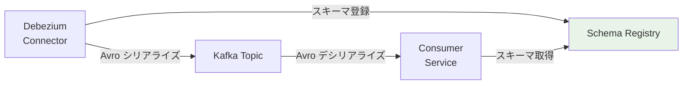

Avro 形式のメリット:
- **サイズが小さい**: JSON と比較してバイナリエンコードのため転送サイズが削減される
- **スキーマ進化**: Schema Registry を使うことで後方互換・前方互換なスキーマ変更が管理できる
- **型安全性**: スキーマに基づいた型チェックが可能

Debezium の Avro 変換設定:

```json
{
  "key.converter": "io.confluent.kafka.serializers.KafkaAvroSerializer",
  "value.converter": "io.confluent.kafka.serializers.KafkaAvroSerializer",
  "key.converter.schema.registry.url": "http://schema-registry:8081",
  "value.converter.schema.registry.url": "http://schema-registry:8081"
}
```

### 5.3 トピック命名規則

Debezium は変更イベントを `{topic.prefix}.{database}.{table}` の形式のトピックに発行する。例えば、`topic.prefix=db`、データベース名 `shop`、テーブル名 `orders` の場合:

```
db.public.orders   (PostgreSQL の場合、スキーマ名も含む)
db.shop.orders     (MySQL の場合)
```

各テーブルの変更は独立したトピックに発行されるため、Consumer は必要なテーブルのトピックのみを購読できる。

## 6. OutboxパターンとCDCの組み合わせ

### 6.1 Outboxパターンのおさらい

Outbox パターンとは、アプリケーションがイベントをメッセージブローカーに直接送信する代わりに、**同一トランザクション内でアウトボックステーブルに書き込み、後でそのテーブルを読み取って非同期にイベントを発行する**パターンである。

```sql
-- Business logic and outbox in a single transaction
BEGIN;

INSERT INTO orders (id, customer_id, status, total_amount)
VALUES (1001, 'cust-42', 'pending', 15000);

INSERT INTO outbox (
    aggregate_type, aggregate_id, event_type, payload
) VALUES (
    'Order', 1001, 'OrderCreated',
    '{"orderId": 1001, "customerId": "cust-42", "status": "pending"}'
);

COMMIT;
```

### 6.2 CDCによるOutboxの実装

Outbox パターンの「アウトボックステーブルをどのように読み取るか」という問題を、CDC が解決する。CDC がアウトボックステーブルの変更を監視し、INSERT を検知したらイベントを Kafka に発行する。

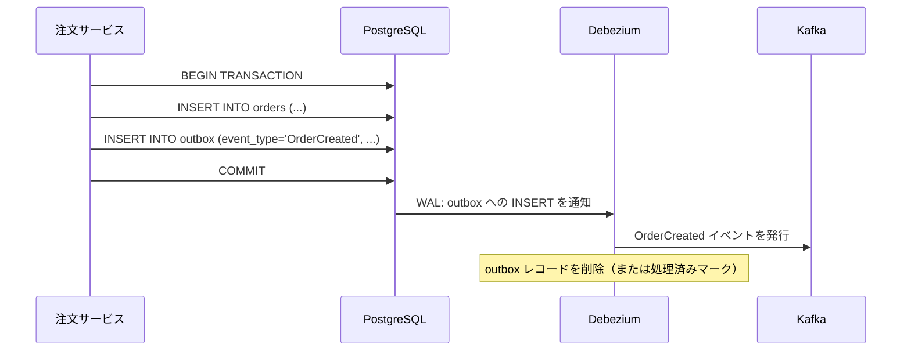

Debezium には **Outbox Event Router** という専用の SMT（Single Message Transform）が用意されており、アウトボックステーブルの構造から適切な Kafka トピックにイベントをルーティングできる。

```json
{
  "transforms": "outbox",
  "transforms.outbox.type": "io.debezium.transforms.outbox.EventRouter",
  "transforms.outbox.table.field.event.id": "id",
  "transforms.outbox.table.field.event.key": "aggregate_id",
  "transforms.outbox.table.field.event.type": "event_type",
  "transforms.outbox.table.field.event.payload": "payload",
  "transforms.outbox.route.by.field": "aggregate_type",
  "transforms.outbox.route.topic.replacement": "outbox.event.${routedByValue}"
}
```

この設定により、`aggregate_type = 'Order'` のレコードは `outbox.event.Order` トピックに発行される。

### 6.3 Outbox + CDC のメリット

- **原子性の保証**: ビジネスロジックとイベント発行が同一トランザクションに含まれる
- **イベントの信頼性**: トランザクションがコミットされれば、CDC がイベントを必ず拾う
- **べき等な処理**: `id` フィールドでイベントの重複を検知できる
- **アウトボックステーブルの自動クリーンアップ**: CDC が読み取った後、自動でレコードを削除できる

::: tip Transactional Outbox の実装選択
アウトボックステーブルの読み取り方法は「ポーリング」と「CDC」の 2 択になる。ポーリングは実装が簡単だが定期的なデータベースクエリが発生する。CDC は設定が複雑だが、ほぼリアルタイムにイベントを発行でき、データベースへの追加負荷もほぼゼロである。本番環境で低レイテンシが求められる場合は CDC が適している。
:::

## 7. CDCの活用シーン

### 7.1 検索インデックスの同期

Elasticsearch や OpenSearch への同期は、CDC の最も一般的な活用例の一つである。データベースに商品情報が追加・更新されるたびに、検索インデックスをリアルタイムに更新できる。

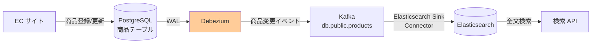

Elasticsearch Sink Connector を使う場合の設定:

```json
{
  "name": "elasticsearch-sink",
  "config": {
    "connector.class": "io.confluent.connect.elasticsearch.ElasticsearchSinkConnector",
    "topics": "db.public.products",
    "connection.url": "http://elasticsearch:9200",
    "type.name": "_doc",
    "transforms": "unwrap",
    "transforms.unwrap.type": "io.debezium.transforms.ExtractNewRecordState",
    "transforms.unwrap.drop.tombstones": "false",
    "transforms.unwrap.delete.handling.mode": "rewrite",
    "behavior.on.null.values": "delete"
  }
}
```

`ExtractNewRecordState` SMT が重要で、Debezium の `before`/`after` 構造から `after` の値のみを抽出し、削除イベントの場合は tombstone メッセージに変換する。

### 7.2 キャッシュの無効化

Redis などのキャッシュと DB の整合性を保つために CDC を使う。Cache-Aside パターンでは、キャッシュのミスが発生したときにデータベースから取得してキャッシュに書き込むが、更新時のキャッシュ削除タイミングが難しい。CDC を使えば、データベースの変更を検知してキャッシュを即座に無効化できる。

```python
# Kafka consumer for cache invalidation
from kafka import KafkaConsumer
import redis
import json

consumer = KafkaConsumer(
    'db.public.users',
    bootstrap_servers=['kafka:9092'],
    group_id='cache-invalidation-service',
    value_deserializer=lambda m: json.loads(m.decode('utf-8'))
)

redis_client = redis.Redis(host='redis', port=6379)

for message in consumer:
    event = message.value
    payload = event.get('payload', {})
    op = payload.get('op')

    if op in ('u', 'd'):  # UPDATE or DELETE
        after = payload.get('after') or payload.get('before')
        if after:
            user_id = after['id']
            cache_key = f"user:{user_id}"
            # Invalidate the cache entry
            redis_client.delete(cache_key)
            print(f"Cache invalidated for user {user_id}")
```

### 7.3 データウェアハウスへの連携

PostgreSQL などの OLTP データベースから BigQuery や Snowflake などの分析データウェアハウスへ、変更データをリアルタイムに連携する用途にも CDC は広く使われる。

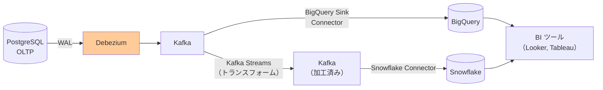

変更イベントをそのままウェアハウスに取り込む「**ランディングテーブル**」方式が一般的で、Fivetran や Airbyte といったマネージドサービスも CDC を活用してリアルタイム同期を実現している。

### 7.4 イベント駆動マイクロサービス

マイクロサービスアーキテクチャにおいて、あるサービスのデータ変更を他のサービスに伝搬するために CDC が活用される。Outbox パターンと組み合わせることで、堅牢なイベント駆動アーキテクチャを実現できる。

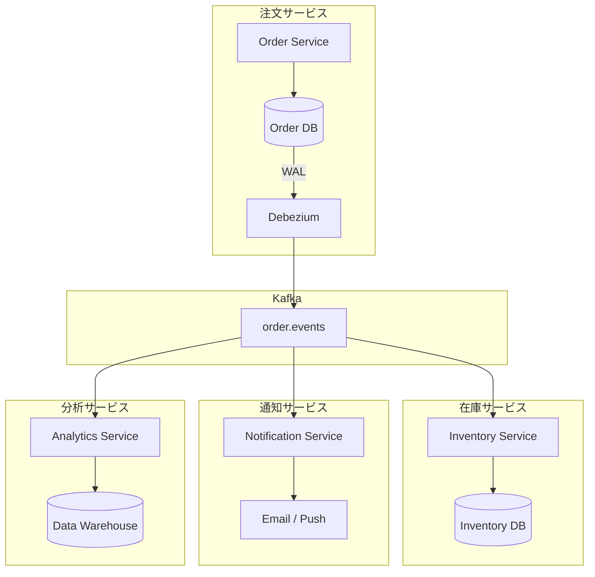

## 8. 運用上の注意点

### 8.1 スキーマ変更への対応

本番システムでは、データベースのスキーマが変更されることは避けられない。CDC を運用する上で、スキーマ変更への対応は最も重要な運用課題の一つである。

**カラム追加（後方互換）:**

Avro Schema Registry を使っている場合、カラムのデフォルト値を設定すれば後方互換なスキーマ変更として登録できる。既存の Consumer は新しいカラムを無視し、新しい Consumer は新しいカラムを読み取る。

```sql
-- Adding a column with a default value (backward compatible)
ALTER TABLE orders ADD COLUMN discount_amount INTEGER DEFAULT 0;
```

**カラム削除（非互換）:**

カラムを削除すると、既存の Consumer がそのカラムを参照している場合に問題が生じる。段階的な移行が必要:

1. まず Consumer 側でカラムを「オプション」として扱うよう変更
2. Consumer のデプロイが完了後、データベースからカラムを削除

**カラム型変更（最も危険）:**

型変更は CDC ストリームの互換性を破壊する可能性が高い。基本的には避けるべきだが、必要な場合は以下の手順を踏む:

1. 新しいカラム（新しい型）を追加
2. アプリケーションが両カラムに書き込むよう変更
3. Consumer を新しいカラムを使うよう移行
4. 古いカラムを削除

::: warning Debezium とスキーマ変更
Debezium は多くのスキーマ変更を自動的に検知して対応するが、テーブルの DROP や破壊的なスキーマ変更が発生すると、コネクターが停止することがある。本番環境では、スキーマ変更前に Debezium の挙動を非本番環境で検証することを強く推奨する。
:::

### 8.2 初期スナップショットの戦略

本番データが大量にある状態での初期スナップショットは、長時間かかる場合がある。その間も本番サービスへの影響を最小化するための戦略が重要である。

**段階的スナップショット（Incremental Snapshot）:**

Debezium 1.6 以降で利用可能な `incremental` スナップショット機能を使うと、テーブルロックなしに大量データを段階的に読み取れる。これは **Watermarking アルゴリズム** を使ってスナップショットと増分変更を整合性を保ちながらマージする。

```sql
-- Trigger incremental snapshot via signaling table
INSERT INTO debezium_signal (id, type, data)
VALUES (
    gen_random_uuid()::text,
    'execute-snapshot',
    '{"data-collections": ["public.large_orders_table"]}'
);
```

**Read Replica からのスナップショット:**

本番の Primary DB ではなく、Read Replica からスナップショットを実行することで、本番への影響を最小化できる。ただし、レプリカのレプリケーション遅延に注意が必要である。

### 8.3 順序保証

CDC イベントの順序保証は、マルチパーティション Kafka トピックでは自動的には保証されない。

**パーティションキーによる順序保証:**

Debezium はデフォルトで主キーをパーティションキーとして使用する。そのため、同一レコードへの変更は必ず同一パーティションに書き込まれ、そのレコードに関するイベントの順序が保証される。

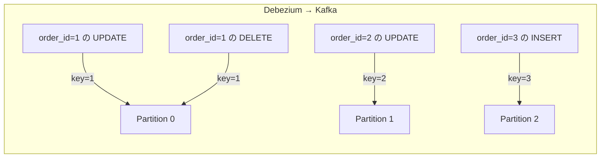

**注意が必要なケース:**

- **テーブル間の順序**: 異なるテーブルのイベントは異なるトピックに発行されるため、テーブル間の順序は保証されない
- **カスケード操作**: 外部キー制約によるカスケード更新・削除は複数のイベントとして発行されるが、それらの順序は保証される
- **Consumer の並列処理**: Consumer が複数スレッドでイベントを並列処理する場合、パーティションをまたいだ処理順序の管理が必要

### 8.4 重複排除（Exactly-Once）

CDC パイプラインでは、**At-least-once（少なくとも 1 回）** のセマンティクスが一般的である。コネクターの再起動やリバランシングにより、同じイベントが複数回発行される可能性がある。

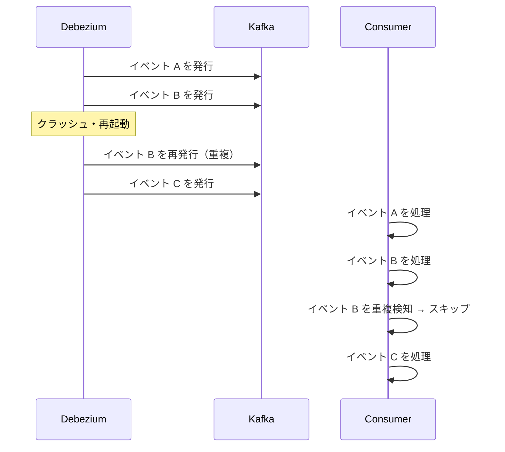

**重複排除の実装:**

```python
# Redis-based deduplication
import redis
import json
from kafka import KafkaConsumer

redis_client = redis.Redis(host='redis', port=6379)
DEDUP_TTL = 3600  # 1 hour dedup window

consumer = KafkaConsumer(
    'db.public.orders',
    bootstrap_servers=['kafka:9092'],
    group_id='order-processor'
)

def is_duplicate(event_id: str) -> bool:
    """Check if event was already processed using Redis SET NX"""
    key = f"cdc:processed:{event_id}"
    # SET if Not eXists — atomic operation
    result = redis_client.set(key, '1', nx=True, ex=DEDUP_TTL)
    return result is None  # Returns None if key already existed

for message in consumer:
    event = message.value
    # Use Debezium's LSN + table as unique event ID
    source = event['payload']['source']
    event_id = f"{source['table']}:{source['lsn']}"

    if is_duplicate(event_id):
        print(f"Skipping duplicate event: {event_id}")
        continue

    process_event(event)
```

**Kafka Transactions を使った Exactly-Once:**

Kafka 0.11 以降では、Kafka Streams や Transactional Producer/Consumer を使って Exactly-Once を実現できる。ただし、外部システム（Elasticsearch や PostgreSQL など）を含む場合、Exactly-Once の保証はその外部システムの冪等性に依存する。

### 8.5 監視と運用

CDC パイプラインの健全性を維持するために、以下のメトリクスを監視すべきである。

| メトリクス | 説明 | アラート条件 |
|---|---|---|
| `debezium_connector_task_status` | コネクタータスクの状態 | FAILED または PAUSED の場合 |
| `kafka_consumer_lag` | Consumer のラグ（遅延） | 一定閾値を超えた場合 |
| `pg_replication_slots_lag_bytes` | レプリケーションスロットの WAL 未消費量 | 大きな値が継続する場合 |
| `debezium_metrics_NumberOfCommittedTransactions` | 処理済みトランザクション数 | 急激な低下 |
| `debezium_metrics_MilliSecondsBehindSource` | ソースに対する遅延 | 閾値を超えた場合 |

```yaml
# Prometheus alerting rule example
groups:
  - name: cdc_alerts
    rules:
      - alert: DebeziumConnectorFailed
        expr: debezium_connector_task_status{status="failed"} == 1
        for: 1m
        labels:
          severity: critical
        annotations:
          summary: "Debezium connector {{ $labels.connector }} has failed"

      - alert: CDCConsumerLagHigh
        expr: kafka_consumer_group_lag{group="cdc-consumer"} > 100000
        for: 5m
        labels:
          severity: warning
        annotations:
          summary: "CDC consumer lag is high: {{ $value }} messages"

      - alert: PostgresReplicationSlotLagHigh
        expr: pg_replication_slots_lag_bytes > 1073741824  # 1GB
        for: 2m
        labels:
          severity: critical
        annotations:
          summary: "PostgreSQL replication slot lag exceeds 1GB"
```

::: danger レプリケーションスロットの WAL 蓄積
PostgreSQL のレプリケーションスロットは、CDC ツールが消費するまで WAL を保持し続ける。コネクターが長時間停止した場合、WAL が無制限に蓄積し、ディスクが枯渇してデータベース全体が停止する恐れがある。本番環境では必ず `pg_replication_slots` ビューを監視し、古い未使用スロットは速やかに削除すること。

```sql
-- Check replication slot status
SELECT slot_name, active, restart_lsn,
       pg_wal_lsn_diff(pg_current_wal_lsn(), restart_lsn) AS lag_bytes
FROM pg_replication_slots;

-- Drop an unused slot
SELECT pg_drop_replication_slot('debezium_slot');
```
:::

## 9. 高度なパターンとトレードオフ

### 9.1 マルチテナント CDC

SaaS システムでは、テナントごとにデータベースを分離しているケースがあり、各テナントの DB を CDC でまとめて監視する必要がある。

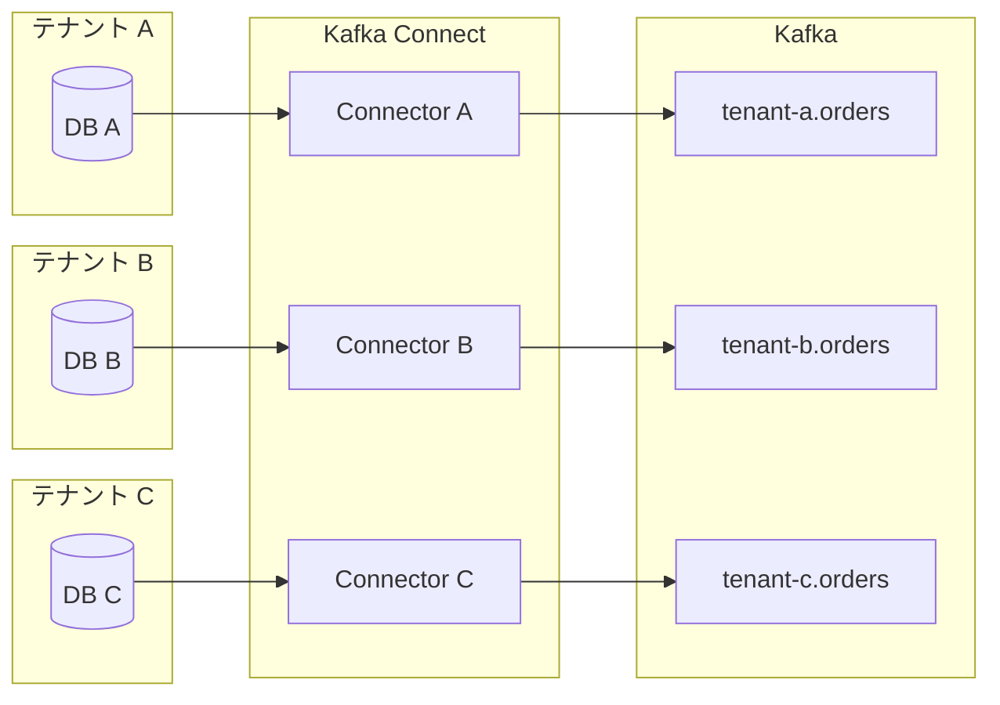

テナント数が多い場合、コネクターの数が増大し管理が複雑になる。この場合、Debezium Server（スタンドアロンモード）を使い、動的にコネクターを追加・削除するオーケストレーションが必要になる。

### 9.2 変換とエンリッチメント

CDC イベントを下流システムに送る前にデータを変換・エンリッチする場合、Kafka Streams や Apache Flink が活用される。

```java
// Kafka Streams: join CDC events with reference data
KStream<String, OrderEvent> orderChanges = builder.stream("db.public.orders");
KTable<String, CustomerInfo> customers = builder.table("db.public.customers");

KStream<String, EnrichedOrder> enriched = orderChanges
    .selectKey((k, v) -> v.getAfter().getCustomerId())
    .join(customers,
        (order, customer) -> EnrichedOrder.builder()
            .orderId(order.getAfter().getId())
            .customerName(customer.getName())
            .customerEmail(customer.getEmail())
            .orderStatus(order.getAfter().getStatus())
            .build(),
        Joined.with(Serdes.String(), orderSerde, customerSerde)
    );

enriched.to("enriched.orders");
```

### 9.3 CDC のコストとスケーリング

CDC を本番環境に導入する際のコスト要因を理解しておく必要がある。

**データベース側のコスト:**
- WAL の生成量が増加する（`REPLICA IDENTITY FULL` を設定した場合は特に）
- レプリケーションスロットが WAL の保持量を増加させる
- CPU 使用率がわずかに増加する（論理デコードのコスト）

**Kafka Connect 側のコスト:**
- コネクタースレッドがメモリを消費する
- スナップショット中は大量のデータが転送され、Kafka のストレージを消費する

**スケーリングの考え方:**
- テーブル数が多い場合は、コネクターを分割して並列化する
- `table.include.list` を適切に設定し、不要なテーブルの変更をキャプチャしない
- Kafka のパーティション数はコネクターのスループット要件に合わせて設定する

## 10. まとめ

CDC は、データベースの変更を信頼性高くキャプチャし、下流システムに伝搬するための強力な技術である。本記事で取り上げた内容を整理する。

**CDC の本質的な価値**: アプリケーションコードに手を加えることなく、データベースへのすべての変更（INSERT/UPDATE/DELETE）をリアルタイムにキャプチャし、複数の下流システムへ伝搬できる。これにより、アプリケーションと同期ロジックの分離、信頼性の高いデータ統合が実現する。

**実装方式の選択**: タイムスタンプポーリング・トリガー・WAL/binlog の 3 方式の中では、本番環境には WAL/binlog 方式が最も適している。レイテンシが低く、アプリケーションへの影響が最小で、DELETE も確実にキャプチャできる。

**Debezium の役割**: Kafka Connect エコシステムの上に構築された Debezium は、PostgreSQL・MySQL・MongoDB など主要なデータベースの CDC を標準化された方法で実現する。スナップショット、オフセット管理、スキーマ変更の追跡など、CDC に必要な機能を包括的に提供する。

**Outbox パターンとの相乗効果**: CDC と Outbox パターンを組み合わせることで、データベース書き込みとイベント発行のアトミック性を保証しながら、低レイテンシで信頼性の高いイベント駆動アーキテクチャを構築できる。

**運用上の課題**: スキーマ変更への対応、初期スナップショットの戦略、順序保証、重複排除、そしてレプリケーションスロットの監視は、CDC を本番環境で安定運用するための重要な考慮事項である。特に PostgreSQL のレプリケーションスロットの WAL 蓄積は、見落とすと深刻な障害につながるため、必ず監視体制を整えること。

CDC は単なるデータ同期の手法ではなく、**データベースをイベントソースとして活用する**という設計パターンの基盤でもある。イベント駆動アーキテクチャ、リアルタイムデータパイプライン、マイクロサービス連携のいずれにおいても、CDC は現代のデータエンジニアリングの重要な柱となっている。
