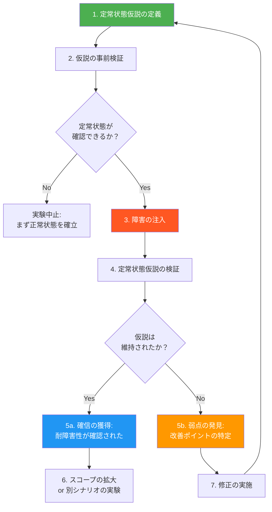
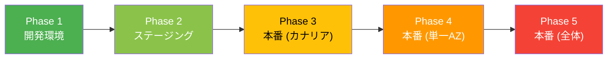
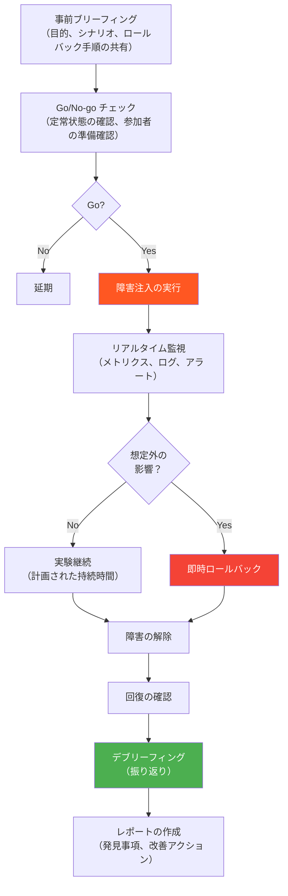
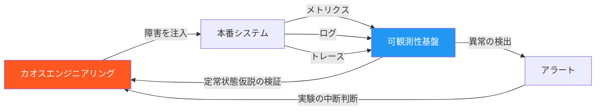
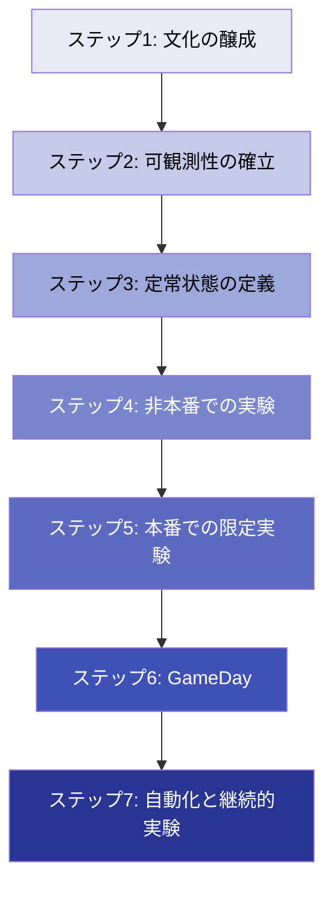

# カオスエンジニアリング

## 1. 起源 — Netflix と Chaos Monkey

### クラウドへの移行が生んだ新たな課題

2008年、Netflixは大規模なデータベース障害を経験し、3日間にわたってDVD出荷が停止した。この障害は、単一障害点（Single Point of Failure）に依存するモノリシックなアーキテクチャの脆弱性を痛感させる出来事であった。これを契機にNetflixは、オンプレミスのデータセンターからAmazon Web Services（AWS）への全面的な移行を決断する。

クラウドへの移行は、スケーラビリティと柔軟性を飛躍的に高めた。しかし同時に、新たな課題が浮上した。クラウド環境では、仮想マシンの突然の停止、ネットワークの一時的な断絶、サービス間通信の遅延など、物理的なインフラでは発生しにくかった障害モードが日常的に起こりうる。数百ものマイクロサービスが相互に依存する分散システムにおいて、「いつ、どこで、どのような障害が起きるか」を予測することは事実上不可能であった。

### Chaos Monkey の誕生

2010年、Netflixのエンジニアリングチームは、この課題に対する画期的なアプローチを生み出した。**Chaos Monkey**である。Chaos Monkeyは、本番環境でランダムにインスタンスを停止させるツールである。営業時間中に意図的にインフラを壊すという発想は、当時の常識からすれば狂気とも思える行為であった。

```
Chaos Monkey の動作原理（概念）:

1. 本番環境のインスタンス一覧を取得
2. ランダムにインスタンスを選択
3. そのインスタンスを強制終了
4. システムが自動回復することを確認
```

Chaos Monkeyの背後にある哲学は明確である。**障害は不可避であるから、障害に耐えられるシステムを構築すべきである。そして、障害耐性が本当に機能するかどうかは、実際に障害を起こしてみなければわからない。**

この哲学は、従来の「障害を防ぐ」というアプローチとは根本的に異なる。障害の発生確率をゼロにすることはできない以上、障害が起きても影響を最小限に抑えるシステムを構築し、その耐性を継続的に検証するというのがカオスエンジニアリングの核心である。

### Simian Army への発展

Chaos Monkeyの成功を受け、Netflixはさらに多様な障害シナリオを模擬するツール群を開発した。これらは総称して **Simian Army** と呼ばれる。

| ツール | 機能 |
|---|---|
| **Chaos Monkey** | ランダムなインスタンスの停止 |
| **Chaos Gorilla** | AWS Availability Zone 全体の停止をシミュレート |
| **Chaos Kong** | AWS Region 全体の停止をシミュレート |
| **Latency Monkey** | サービス間通信に人為的な遅延を挿入 |
| **Conformity Monkey** | ベストプラクティスに従わないインスタンスの検出 |
| **Janitor Monkey** | 未使用リソースのクリーンアップ |

Simian Armyは、「サルがデータセンター内を暴れまわっている」というメタファーに基づいて命名された。この命名自体が、Netflixの文化——障害を恐れるのではなく、障害から学ぶという姿勢——を象徴している。

## 2. Principles of Chaos Engineering

### 規律（discipline）としてのカオスエンジニアリング

カオスエンジニアリングは、単にシステムを壊して楽しむ行為ではない。2014年にNetflixのCasey Rosenthalらによって体系化され、2019年にはO'Reillyから書籍『Chaos Engineering』が出版された。同時に、[principlesofchaos.org](https://principlesofchaos.org/) において、カオスエンジニアリングの原則が明文化された。

公式の定義は以下の通りである。

> Chaos Engineering is the discipline of experimenting on a system in order to build confidence in the system's capability to withstand turbulent conditions in production.

この定義の中で特に重要なキーワードは **discipline（規律）** と **confidence（確信）** である。カオスエンジニアリングは、科学的な実験プロセスに基づく規律ある活動であり、その目的はシステムの耐障害性に対する確信を構築することにある。

### 5つの原則

Principles of Chaos Engineeringでは、以下の5つの原則が提唱されている。

#### 原則1: 定常状態の振る舞いに関する仮説を立てる（Build a Hypothesis around Steady State Behavior）

実験を始める前に、システムの「正常な状態」を定義する必要がある。これを **定常状態仮説（Steady State Hypothesis）** と呼ぶ。定常状態とは、システムの健全性を示すビジネスメトリクスやシステムメトリクスの正常範囲のことである。

定常状態仮説の例:
- スループット: 1秒あたりのリクエスト処理数が1,000～1,200の範囲にある
- レイテンシ: p99レイテンシが200ms以下である
- エラーレート: HTTPステータス5xxの割合が0.1%未満である
- ビジネスメトリクス: 1分あたりの注文成功数が50件以上である

::: tip 重要な洞察
定常状態仮説は、内部実装の詳細（CPU使用率、メモリ消費量など）ではなく、システムの出力——特にビジネス上の意味を持つメトリクス——に基づいて定義すべきである。ユーザーが体感する振る舞いが正常であれば、内部の状態がどうであろうとシステムは「正常に動作している」と見なせる。
:::

#### 原則2: 実世界のイベントを反映する（Vary Real-world Events）

注入する障害は、実際の本番環境で起こりうるイベントに基づくべきである。過去のインシデント報告、システムの依存関係グラフ、クラウドプロバイダの障害履歴などが、実験シナリオの設計に有用である。

代表的な実世界のイベント:
- サーバーのクラッシュ
- ハードディスクの故障
- ネットワークパーティション
- 依存サービスのレスポンス遅延
- DNSの名前解決失敗
- 時刻のズレ（NTP障害）
- 証明書の期限切れ

#### 原則3: 本番環境で実験を行う（Run Experiments in Production）

カオスエンジニアリングの価値は、本番環境と同等の条件下で得られる知見にある。ステージング環境でのテストは有用だが、本番環境のトラフィックパターン、データ量、サービス間依存関係を完全に再現することは困難である。

ただし、これは「何の準備もなくいきなり本番を壊せ」という意味ではない。後述するblast radiusの制御や、即座に中断できる仕組みを整えた上で、段階的に本番環境での実験に移行するのが正しいアプローチである。

#### 原則4: 継続的に実験を自動化する（Automate Experiments to Run Continuously）

手動での一回限りの実験は、その時点でのシステム状態に関する知見しか提供しない。システムは常に変化しているため、カオス実験もCI/CDパイプラインに組み込み、継続的に実行すべきである。

#### 原則5: 影響範囲を最小化する（Minimize Blast Radius）

実験による影響はできる限り小さく抑えるべきである。まず少数のユーザーやサービスに対して実験を行い、問題がなければ段階的にスコープを広げていく。実験の途中で予期しない影響が検出された場合は、即座に実験を中断する仕組みが不可欠である。

## 3. 定常状態仮説（Steady State Hypothesis）

### なぜ定常状態の定義が重要か

カオスエンジニアリングの実験は、科学実験と同じ構造を持つ。科学実験では、まず仮説を立て、実験を行い、結果が仮説を支持するか否かを判定する。カオスエンジニアリングにおける仮説が、定常状態仮説である。

定常状態仮説がなければ、障害注入後に「システムが正常かどうか」を判定できない。CPU使用率が80%に上昇したとして、それが「正常」なのか「異常」なのかは、事前の基準がなければ判断のしようがない。

### 良い定常状態仮説の特性

定常状態仮説は以下の特性を備えるべきである。

**測定可能であること**: 主観的な判断（「システムが遅い気がする」）ではなく、数値として測定できるメトリクスに基づく。

**ビジネスに直結していること**: 可能な限り、ビジネス上の成果を反映するメトリクスを選ぶ。「1分あたりの注文成功数」は「CPU使用率」よりも本質的な指標である。

**自動的に検証可能であること**: 人間が目視で判断するのではなく、プログラマティックに正常/異常を判定できること。

**ベースラインが確立されていること**: 正常時の値の範囲（ベースライン）が事前に把握されていること。

### 定常状態仮説の具体例

以下に、ECサイトにおける定常状態仮説の例を示す。

```yaml
# Steady State Hypothesis definition example
steady_state_hypothesis:
  title: "E-commerce system operates normally"
  probes:
    - name: "Order success rate is above threshold"
      type: "probe"
      provider:
        type: "http"
        url: "https://metrics.example.com/api/v1/query"
        arguments:
          query: "rate(orders_success_total[5m])"
      tolerance:
        type: "range"
        range: [45.0, 100.0]  # 45-100 orders per minute
    - name: "API p99 latency is within bounds"
      type: "probe"
      provider:
        type: "http"
        url: "https://metrics.example.com/api/v1/query"
        arguments:
          query: "histogram_quantile(0.99, rate(http_request_duration_seconds_bucket[5m]))"
      tolerance:
        type: "range"
        range: [0.0, 0.5]  # Under 500ms
    - name: "Error rate is below threshold"
      type: "probe"
      provider:
        type: "http"
        url: "https://metrics.example.com/api/v1/query"
        arguments:
          query: "rate(http_responses_total{status=~'5..'}[5m]) / rate(http_responses_total[5m])"
      tolerance:
        type: "range"
        range: [0.0, 0.001]  # Under 0.1%
```

## 4. 実験の設計手法

### 実験のライフサイクル

カオスエンジニアリングの実験は、明確なフェーズに沿って進行する。



各フェーズの詳細を説明する。

**フェーズ1: 定常状態仮説の定義**
前節で述べた通り、実験の成功/失敗を判定するための基準を明確にする。

**フェーズ2: 仮説の事前検証**
障害を注入する前に、現在のシステムが定常状態にあることを確認する。もし事前検証の段階で仮説が成立しない（つまり、障害を注入しなくてもシステムが異常な状態にある）なら、実験を始めるべきではない。まず正常状態の確立が優先である。

**フェーズ3: 障害の注入**
計画通りの障害を注入する。注入のタイミング、対象、規模は事前に定義しておく。

**フェーズ4: 定常状態仮説の検証**
障害注入後、定常状態仮説が維持されているかを検証する。

**フェーズ5: 結果の評価**
仮説が維持された場合は、その障害シナリオに対する耐性が確認されたことになる。仮説が崩れた場合は、システムの弱点が発見されたことになる。どちらの結果であっても、実験は「成功」である。

### Blast Radius の制御

Blast radius（爆風半径）とは、実験によって影響を受けるシステムの範囲のことである。カオスエンジニアリングでは、blast radiusを段階的に拡大していくことが鉄則である。



blast radiusの制御には以下の手法が用いられる。

**対象の限定**: 特定のインスタンス、特定のAZ、特定のサービスに限定して障害を注入する。全体に影響を与える実験は、十分な確信が得られた後に行う。

**トラフィックの分離**: カナリアリリースと同様に、実験対象のトラフィックを全体のごく一部（例えば1%）に限定する。

**時間の制限**: 障害注入の持続時間を明確に定義する。例えば「5分間のみレイテンシを注入し、その後は自動的に解除する」というように。

**自動ロールバック**: 定常状態仮説の検証結果が閾値を超えた場合、自動的に実験を中断し、障害注入を解除する仕組みを組み込む。

**人的安全装置**: 実験中は常にエンジニアが監視し、いつでも手動で中断できる体制を整える。これは「Big Red Button（緊急停止ボタン）」とも呼ばれる。

::: warning 注意
blast radiusの制御が不十分な状態でのカオス実験は、カオスエンジニアリングではなく、単なる本番障害である。「意図的に壊す」ことと「制御された実験を行う」ことの間には、安全装置の有無という決定的な違いがある。
:::

## 5. 故障注入のカテゴリ

カオスエンジニアリングで注入する障害は、大きく以下のカテゴリに分類される。

### インフラストラクチャ障害

**プロセスの停止・クラッシュ**: 最も基本的な障害注入。特定のプロセスを強制終了し、サービスの自動回復能力を検証する。

```bash
# Kill a specific process
kill -9 <pid>

# Kill all instances of a service
pkill -f "my-service"
```

**ホストの停止**: 仮想マシンやコンテナ全体を停止させる。Chaos Monkeyの原型がこれに当たる。

**ディスク障害**: ディスクの読み書きエラーを模擬する。ジャーナリングやレプリケーションの動作を検証する際に有用。

### ネットワーク障害

ネットワーク障害は、分散システムにおいてもっとも一般的かつ影響の大きい障害カテゴリである。

**レイテンシの注入**: サービス間通信に人為的な遅延を追加する。タイムアウト設定やリトライロジックが適切に機能するかを検証する。

```bash
# Add 200ms latency to traffic on port 8080 using tc
tc qdisc add dev eth0 root netem delay 200ms

# Add latency with jitter (200ms ± 50ms)
tc qdisc add dev eth0 root netem delay 200ms 50ms
```

**パケットロス**: 一定割合のパケットを破棄する。再送処理やデータの整合性保護の動作を検証する。

```bash
# Drop 10% of packets
tc qdisc add dev eth0 root netem loss 10%
```

**ネットワークパーティション**: 特定のサービス間の通信を完全に遮断する。CAP定理のPartition Toleranceが実際に機能するかを検証する際に重要なシナリオである。

**DNS障害**: DNSの名前解決を失敗させるか、誤った結果を返す。多くのサービスがDNSに依存しているため、DNS障害への耐性は見落とされがちだが極めて重要である。

**帯域幅制限**: ネットワークの帯域幅を人為的に制限する。大量のデータ転送を行うバッチ処理やレプリケーションの動作を検証する。

### リソース枯渇

**CPU負荷**: CPUを意図的に高負荷状態にする。オートスケーリングやロードバランシングの動作を検証する。

```bash
# Generate CPU stress using stress-ng
stress-ng --cpu 4 --timeout 60s
```

**メモリ枯渇**: メモリを大量に消費し、OOM（Out of Memory）条件に近い状態を作り出す。OOM Killerの動作やグレースフルデグラデーションの確認に用いる。

```bash
# Generate memory stress
stress-ng --vm 2 --vm-bytes 1G --timeout 60s
```

**ディスク容量の枯渇**: ディスク領域を埋め尽くす。ログの肥大化やテンポラリファイルの管理が適切かを検証する。

**ファイルディスクリプタの枯渇**: ファイルディスクリプタを使い尽くす。コネクションリークの検出やグレースフルなエラーハンドリングの検証に有用。

### 時刻に関する障害

**時刻のジャンプ**: システムクロックを急に進めるか戻す。証明書の検証、キャッシュのTTL、スケジュールされたタスクなど、時刻に依存する処理は多岐にわたる。

**NTPの障害**: NTPサーバーへの接続を遮断し、ノード間の時刻同期が取れない状況を作り出す。分散システムにおけるイベントの順序づけや、lease（リース）ベースの分散ロックの動作に影響を与える。

```bash
# Block NTP traffic
iptables -A OUTPUT -p udp --dport 123 -j DROP
```

**時刻のドリフト**: 時刻を少しずつズラし、ゆっくりとした時刻のズレを再現する。急激な時刻変更よりも検出が困難であり、微妙なバグを引き起こすことがある。

### アプリケーション層の障害

**例外の注入**: 特定のAPIやメソッド呼び出しで意図的に例外を発生させる。エラーハンドリングやフォールバックロジックの検証に用いる。

**レスポンスの改竄**: 依存サービスからのレスポンスを改竄し、不正なデータや想定外のフォーマットを返す。デシリアライゼーションの堅牢性を検証する。

**依存サービスの応答遅延**: 特定の依存サービスのレスポンスを遅延させる。サーキットブレーカーやタイムアウトの動作を確認する。

## 6. ツール群

### Chaos Monkey（Netflix）

Chaos Monkeyは、カオスエンジニアリングの元祖とも言えるツールである。元々はAWS上のインスタンスをランダムに停止させる単純なツールとして開発された。現在はSpinnakerと統合されており、より洗練された実験が可能になっている。

**特徴**:
- AWS EC2インスタンスのランダムな停止
- Spinnaker（CDプラットフォーム）との統合
- 営業時間中にのみ実行（問題が発生しても対応可能な時間帯）
- Go言語で実装されたオープンソースツール

### Litmus（CNCF）

LitmusChaosは、Cloud Native Computing Foundation（CNCF）のインキュベーションプロジェクトであり、Kubernetes環境に特化したカオスエンジニアリングプラットフォームである。

**特徴**:
- Kubernetes ネイティブ（ChaosEngine, ChaosExperiment などのCRD）
- ChaosHub: コミュニティが共有する実験カタログ
- Litmus Workflow: 複数の実験を組み合わせたワークフローの定義
- Prometheus連携による可観測性

```yaml
# Litmus ChaosEngine example
apiVersion: litmuschaos.io/v1alpha1
kind: ChaosEngine
metadata:
  name: nginx-chaos
  namespace: default
spec:
  appinfo:
    appns: default
    applabel: "app=nginx"
    appkind: deployment
  chaosServiceAccount: litmus-admin
  experiments:
    - name: pod-delete
      spec:
        components:
          env:
            - name: TOTAL_CHAOS_DURATION
              value: "30"
            - name: CHAOS_INTERVAL
              value: "10"
            - name: FORCE
              value: "false"
```

### Chaos Mesh（CNCF）

Chaos Meshは、PingCAPが開発したKubernetes向けカオスエンジニアリングプラットフォームで、CNCFのインキュベーションプロジェクトである。

**特徴**:
- 豊富な障害タイプ: Pod障害、ネットワーク障害、I/O障害、時刻障害、ストレステストなど
- Chaos Dashboard: Web UIによる実験管理と可視化
- スケジュール実行とワークフロー
- RBAC（Role-Based Access Control）による権限管理
- 物理マシン向けのChaosd

```yaml
# Chaos Mesh NetworkChaos example
apiVersion: chaos-mesh.org/v1alpha1
kind: NetworkChaos
metadata:
  name: network-delay
spec:
  action: delay
  mode: one
  selector:
    namespaces:
      - default
    labelSelectors:
      app: web
  delay:
    latency: "200ms"
    correlation: "50"
    jitter: "50ms"
  duration: "5m"
  scheduler:
    cron: "@every 1h"
```

### Gremlin

Gremlinは、商用のカオスエンジニアリングプラットフォームである。SaaS型のサービスとして提供され、Netflixのカオスエンジニアリングチームの元メンバーによって設立された企業が開発している。

**特徴**:
- エンタープライズ向けのSaaSプラットフォーム
- Kubernetes、VM、コンテナ、サーバーレスに対応
- 豊富なシナリオライブラリ（State、Resource、Network）
- チーム機能、監査ログ、RBAC
- Statusページとの統合
- Free Tierあり

### Chaos Toolkit

Chaos Toolkitは、Pythonベースのオープンソースフレームワークであり、カオスエンジニアリング実験の定義と実行を宣言的に行える。

**特徴**:
- JSON/YAMLで実験を定義する宣言的アプローチ
- プラグインアーキテクチャ（AWS、Kubernetes、Azure、GCPなど）
- CI/CDパイプラインへの組み込みが容易
- Open Chaos Initiative（旧ChaosIQ）による維持
- 定常状態仮説の明示的な定義をサポート

```json
{
  "title": "Service resilience under pod failure",
  "description": "Verify the service maintains availability when a pod is killed",
  "steady-state-hypothesis": {
    "title": "Service is healthy",
    "probes": [
      {
        "type": "probe",
        "name": "service-is-available",
        "tolerance": 200,
        "provider": {
          "type": "http",
          "url": "http://my-service/health"
        }
      }
    ]
  },
  "method": [
    {
      "type": "action",
      "name": "kill-pod",
      "provider": {
        "type": "python",
        "module": "chaosk8s.pod.actions",
        "func": "terminate_pods",
        "arguments": {
          "label_selector": "app=my-service",
          "ns": "default"
        }
      }
    }
  ],
  "rollbacks": [
    {
      "type": "action",
      "name": "ensure-pod-is-running",
      "provider": {
        "type": "python",
        "module": "chaosk8s.pod.actions",
        "func": "create_pods",
        "arguments": {
          "spec_path": "pod-spec.yaml"
        }
      }
    }
  ]
}
```

### ツールの比較

| 観点 | Chaos Monkey | Litmus | Chaos Mesh | Gremlin | Chaos Toolkit |
|---|---|---|---|---|---|
| ライセンス | Apache 2.0 | Apache 2.0 | Apache 2.0 | 商用 | Apache 2.0 |
| 対象環境 | AWS EC2 | Kubernetes | Kubernetes | マルチ環境 | マルチ環境 |
| 障害タイプ | インスタンス停止 | 多数 | 多数 | 多数 | プラグイン依存 |
| UI | なし | あり | あり | あり | なし |
| CNCF | - | Incubating | Incubating | - | - |
| 学習コスト | 低 | 中 | 中 | 低 | 中 |

## 7. GameDay の実施方法

### GameDay とは何か

GameDayとは、計画的にカオス実験を実施し、チーム全体でシステムの耐障害性を検証するイベントである。Amazonが発祥とされ、Netflixでも「Chaos Engineering GameDay」として実施されている。GameDayは単なる技術的な実験にとどまらず、組織のインシデントレスポンス能力を検証し、改善する機会でもある。

### GameDay の準備

GameDayの成功は準備にかかっている。以下のステップを事前に完了させておく必要がある。

**1. 目的の明確化**

```
目的の例:
- 「決済サービスがダウンした場合、注文システムがグレースフルにデグラデーションするか確認する」
- 「東京リージョンのAZ-aが利用不能になった場合、30秒以内にフェイルオーバーが完了するか確認する」
```

**2. 参加者の選定と役割分担**

| 役割 | 責任 |
|---|---|
| GameDay リーダー | 全体の進行管理、Go/No-go の判断 |
| 実験実施者 | 障害の注入と管理 |
| オブザーバー | メトリクスとログの監視 |
| インシデントコマンダー | 想定外の事態が発生した場合の指揮 |
| コミュニケーター | ステークホルダーへの状況報告 |

**3. ロールバック計画の策定**

実験が予期しない影響を与えた場合に、迅速に元の状態に戻すための手順を事前に策定する。

**4. 通知**

関係するチーム、オンコール担当者、必要に応じてカスタマーサポートチームに事前通知する。GameDayの存在を知らない運用チームが実験を本物のインシデントと誤認するリスクを排除する。

### GameDay の実施フロー



### デブリーフィング（振り返り）

GameDayの最も重要なフェーズはデブリーフィングである。実験終了後、全参加者で以下の点を振り返る。

- **何が起きたか**: 障害注入後のシステムの振る舞いを時系列で整理する
- **何が期待通りだったか**: 正しく機能したフェイルオーバー、リトライ、アラートなどを確認する
- **何が期待と異なったか**: 予想外の振る舞い、検出できなかった障害、想定外の依存関係を特定する
- **何を改善すべきか**: 具体的なアクションアイテムを策定する（担当者、期限を含む）

::: tip 非難のない振り返り（Blameless Postmortem）
デブリーフィングでは、個人の責任を追及するのではなく、システムやプロセスの改善に焦点を当てる。「誰が悪かったか」ではなく「システムのどこに弱点があったか」を議論する。これはSREの文化と共通する重要な原則である。
:::

## 8. 可観測性（Observability）との統合

### カオスエンジニアリングと可観測性の関係

カオスエンジニアリングは、可観測性なしには機能しない。障害を注入しても、その影響を観測できなければ、実験から何も学べない。逆に、可観測性の仕組みがあっても、それが実際の障害時に有用かどうかは、実際に障害を起こしてみなければわからない。つまり、カオスエンジニアリングと可観測性は相互に補完する関係にある。



### 可観測性の3本柱とカオス実験

**メトリクス**: 定常状態仮説の定義と検証に直接使われる。Prometheusなどの時系列データベースに格納されたメトリクスに対して、実験の前後で変化を比較する。

**ログ**: 障害注入後のシステムの詳細な振る舞いを追跡する。エラーログの内容、リトライの回数、フォールバックの発動状況などが、実験後の分析に活用される。

**分散トレース**: マイクロサービスアーキテクチャにおいて、障害がサービス間でどのように伝播するかを可視化する。OpenTelemetryなどの分散トレーシングフレームワークを活用することで、障害の影響範囲を正確に把握できる。

### 可観測性の検証としてのカオスエンジニアリング

カオスエンジニアリングは、システムの耐障害性だけでなく、可観測性そのものも検証する。以下の問いに答える機会となる。

- 障害が発生したとき、アラートは適切なタイミングで発火するか
- アラートの内容は、障害の原因特定に十分な情報を含んでいるか
- ダッシュボードは障害の影響範囲を正しく表示するか
- ログに、デバッグに必要な情報が含まれているか
- 分散トレースで、障害の発生箇所を迅速に特定できるか

これらの問いに「No」が含まれていた場合、それは可観測性の改善ポイントとして記録され、次のカオス実験までに対処すべきアクションアイテムとなる。

## 9. 組織的導入のステップとアンチパターン

### 段階的な導入ステップ

カオスエンジニアリングの導入は、一朝一夕にはいかない。組織の成熟度に応じて、段階的に取り組む必要がある。

**ステップ1: 文化の醸成と教育**

カオスエンジニアリングを始める前に、組織全体が「障害は不可避であり、障害から学ぶことが重要である」という価値観を共有している必要がある。SREの原則やBlameless Postmortemの文化がすでに根付いていれば、導入のハードルは低い。

**ステップ2: 可観測性の確立**

メトリクス、ログ、トレースの基盤が整っていなければ、カオス実験の結果を評価できない。まず可観測性を確立することが先決である。

**ステップ3: 定常状態の定義**

システムの「正常」を数値化する。SLI/SLOが定義されていれば、それが定常状態仮説の基盤となる。

**ステップ4: 非本番環境での実験開始**

最初の実験は、開発環境やステージング環境で行う。ここでツールの使い方、実験のプロセス、ロールバック手順を習得する。

**ステップ5: 本番環境での限定的な実験**

十分な経験を積んだ後、blast radiusを極小に抑えた本番環境での実験を開始する。最初は単純なシナリオ（例: 単一Podの停止）から始める。

**ステップ6: GameDay の実施**

チーム横断的なGameDayを定期的に実施する。月次または四半期ごとが一般的である。

**ステップ7: 自動化と継続的実験**

CI/CDパイプラインにカオス実験を組み込み、継続的に実行する。人間の介入なしに実験が実行され、結果が自動的に評価される状態を目指す。



### アンチパターン

カオスエンジニアリングの導入には、陥りがちなアンチパターンが存在する。

**アンチパターン1: いきなり本番を壊す**

可観測性も定常状態仮説もロールバック計画もない状態で、本番環境に障害を注入するのは、カオスエンジニアリングではなく単なる破壊行為である。段階的な導入が不可欠である。

**アンチパターン2: 実験結果を活用しない**

実験で弱点が発見されても、その修正が行われなければ、実験は時間の無駄である。発見された弱点は、具体的なアクションアイテムとして追跡し、修正後に再検証する必要がある。

**アンチパターン3: 同じ実験の繰り返し**

同じシナリオを繰り返すだけでは、新たな知見は得られない。実験シナリオは継続的に拡充し、より複雑な障害パターン、複合的な障害シナリオへと進化させるべきである。

**アンチパターン4: 個人の英雄的行為に依存する**

特定のエンジニアだけがカオス実験を理解し、実行できる状態は脆弱である。カオスエンジニアリングの知識と実践は、チーム全体で共有されるべきである。

**アンチパターン5: 障害を「起こす」ことが目的化する**

カオスエンジニアリングの目的は「システムの耐障害性に対する確信を構築すること」であり、「障害を起こすこと」ではない。仮説なき障害注入は、学びのない実験である。

**アンチパターン6: マネジメントの支持なしに進める**

本番環境での実験には、組織的な承認が不可欠である。エンジニアの独断で本番に障害を注入することは、組織的なリスク管理の観点から許容されない。マネジメントの理解と支持を得た上で進めるべきである。

## 10. クラウドネイティブなカオスエンジニアリング

### AWS Fault Injection Simulator（FIS）

AWS Fault Injection Simulator（FIS）は、AWSが提供するマネージドのカオスエンジニアリングサービスである。2021年にGA（一般提供）となった。

**主な特徴**:
- AWSサービスとのネイティブな統合（EC2、ECS、EKS、RDS、ElastiCache など）
- IAMによるきめ細かいアクセス制御
- 停止条件（Stop Conditions）による自動ロールバック
- CloudWatch Alarmsとの統合
- 実験テンプレートの共有と再利用

**サポートされるアクション例**:
- EC2インスタンスの停止・再起動
- EC2のCPU/メモリストレス
- ECSタスクの停止
- EKS Podの終了
- RDSフェイルオーバー
- AZ全体の停止シミュレーション
- Systems Manager経由のカスタムアクション

```json
{
  "description": "EC2 instance stop experiment",
  "targets": {
    "myInstances": {
      "resourceType": "aws:ec2:instance",
      "resourceTags": {
        "env": "production",
        "chaos-ready": "true"
      },
      "selectionMode": "COUNT(1)"
    }
  },
  "actions": {
    "stopInstances": {
      "actionId": "aws:ec2:stop-instances",
      "parameters": {
        "startInstancesAfterDuration": "PT5M"
      },
      "targets": {
        "Instances": "myInstances"
      }
    }
  },
  "stopConditions": [
    {
      "source": "aws:cloudwatch:alarm",
      "value": "arn:aws:cloudwatch:ap-northeast-1:123456789012:alarm:high-error-rate"
    }
  ],
  "roleArn": "arn:aws:iam::123456789012:role/FISExperimentRole"
}
```

AWS FISの特に重要な機能は **Stop Conditions（停止条件）** である。CloudWatch Alarmと連動して、実験中にシステムが想定外の状態に陥った場合に自動的に実験を中止する仕組みを提供する。これにより、blast radiusの制御が確実に行える。

### Azure Chaos Studio

Azure Chaos Studioは、Microsoftが提供するカオスエンジニアリングサービスである。

**主な特徴**:
- Azureリソースとのネイティブ統合
- エージェントベース（VM内部の障害）とサービス直接型の障害注入
- 障害ライブラリ（ネットワーク遅延、プロセス停止、DNS障害など）
- Azure Monitorとの統合

### Google Cloud のアプローチ

Google Cloudは、専用のカオスエンジニアリングサービスは提供していないが、GKE（Google Kubernetes Engine）上でLitmusやChaos Meshを運用するためのガイダンスを提供している。Googleは社内で大規模なカオスエンジニアリング（DiRT: Disaster Recovery Testing）を実施しており、その知見はSRE本で共有されている。

### クラウドネイティブなカオス実験の設計

クラウド環境では、以下のようなクラウド固有の障害シナリオを考慮する必要がある。

**AZ障害**: 単一のAvailability Zoneが利用不能になった場合のフェイルオーバー。マルチAZ構成が正しく動作するかを検証する。

**リージョン障害**: リージョン全体が利用不能になった場合の対応。マルチリージョン構成を採用している場合にのみ関連する。

**サービスクォータ**: APIのレートリミットやリソースのクォータに達した場合の振る舞い。グレースフルなデグラデーションが実現できるかを確認する。

**マネージドサービスの障害**: RDS、ElastiCache、S3などのマネージドサービスが応答しない場合、アプリケーションがどう振る舞うか。マネージドサービスは「常に利用可能」という前提を置きがちだが、実際にはダウンタイムが発生する。

## 11. 実践的なアーキテクチャパターン

### サーキットブレーカーとの組み合わせ

カオスエンジニアリングは、サーキットブレーカーパターンの動作を検証する最も効果的な手段である。依存サービスに遅延を注入し、サーキットブレーカーが以下のように正しく動作するかを確認する。

1. 障害検出: 依存サービスの応答遅延が閾値を超えることを検出
2. サーキットオープン: 依存サービスへのリクエストを遮断し、フォールバックを返す
3. 半開状態: 一定時間後にプローブリクエストを送信
4. サーキットクローズ: 依存サービスが回復していればリクエストを再開

### リトライとバックオフの検証

リトライ戦略が適切に設定されているかは、実際にネットワーク障害やサービス障害を注入してみなければわからない。特に注意すべきは以下の点である。

- **リトライストーム**: 障害時に全クライアントが同時にリトライし、依存サービスに負荷が集中する問題。指数バックオフとジッターが適切に設定されているかを確認する
- **冪等性**: リトライによって同じリクエストが複数回処理されても、副作用が重複しないことを確認する
- **タイムアウトの設定**: タイムアウトが長すぎるとリソースを消費し続け、短すぎると正常なリクエストも失敗する。適切な値はカオス実験を通じて検証する

### グレースフルデグラデーション

カオスエンジニアリングの究極的な目標は、障害時にもシステムが部分的な機能を提供し続けることを検証することである。これをグレースフルデグラデーション（Graceful Degradation）と呼ぶ。

例えば、ECサイトにおいて推薦エンジンがダウンした場合:
- **NG**: サイト全体がエラーを返す
- **OK**: 推薦セクションが非表示になり、商品一覧は通常通り表示される

このような振る舞いは、設計時に意図していても、実際の障害時に正しく動作するとは限らない。カオス実験によって、グレースフルデグラデーションが期待通りに機能することを定期的に検証する必要がある。

## 12. セキュリティとガバナンス

### カオスエンジニアリングのセキュリティリスク

カオスエンジニアリングのツールは、本番環境のインフラに対して破壊的な操作を行う権限を持つ。これは、攻撃者にとって魅力的な攻撃ベクトルとなりうる。

**リスクの軽減策**:
- 最小権限の原則: カオスツールに付与する権限は、実験に必要な最小限に限定する
- 監査ログ: すべてのカオス実験の実行を記録し、誰が、いつ、何をしたかを追跡可能にする
- 承認フロー: 本番環境での実験には、少なくとも2名以上の承認を必要とする
- ネットワーク分離: カオスツールの制御プレーンは、適切にネットワーク分離する
- シークレット管理: カオスツールが使用する認証情報は、シークレットマネージャーで管理する

### コンプライアンスとの両立

金融、医療、政府機関など、規制の厳しい業界では、本番環境での意図的な障害注入に対する懸念がある。しかし、規制はシステムの信頼性と回復能力を要求しているのであり、カオスエンジニアリングはそれを検証するための手段である。

- 実験計画の文書化と事前承認
- 実験結果の記録と保管
- 影響範囲の明確な制限
- 顧客データへの影響がないことの保証

これらを整備することで、コンプライアンス要件を満たしつつカオスエンジニアリングを実践できる。

## 13. カオスエンジニアリングの成熟度モデル

組織のカオスエンジニアリングの成熟度は、以下の段階で評価できる。

**レベル0: 未導入**
カオスエンジニアリングの認知がなく、障害は事後的にのみ対応される。

**レベル1: 初期**
手動のGameDayを不定期に実施。非本番環境での実験が中心。

**レベル2: 組織化**
定期的なGameDayの実施。本番環境での限定的な実験。専任のチームまたは担当者が存在。

**レベル3: 自動化**
CI/CDパイプラインにカオス実験が組み込まれている。実験の結果が自動的に評価される。多様な障害シナリオのカタログが整備されている。

**レベル4: 最適化**
カオスエンジニアリングが開発プロセスに完全に統合されている。新しいサービスやアーキテクチャの変更には、対応するカオス実験が自動的に追加される。実験結果がシステム設計にフィードバックされる。

## 14. まとめ — 障害を味方にする

カオスエンジニアリングは、「障害は不可避である」という現実を直視し、それに対する備えを科学的な方法で検証する実践体系である。

その核心は以下の3点に集約される。

1. **障害を防ぐのではなく、障害に備える**: 完璧な障害防止は不可能である。障害が起きても影響を最小限に抑えるシステムを構築することが、真の信頼性向上につながる。

2. **確信は実験によってのみ得られる**: 「たぶん大丈夫だろう」は確信ではない。定常状態仮説を定義し、実際に障害を注入し、仮説が維持されることを確認して初めて、システムの耐障害性に対する確信が得られる。

3. **カオスエンジニアリングは文化である**: ツールの導入だけでは不十分である。障害から学ぶ文化、非難のない振り返り、段階的な改善といった組織的な価値観が、カオスエンジニアリングを持続可能なものにする。

Netflixの事例が示すように、カオスエンジニアリングを実践する組織は、障害の影響を最小限に抑え、迅速に回復し、同じ障害を繰り返さない能力を獲得する。それは、障害を「敵」ではなく「学びの機会」として捉える文化的な変革の結果でもある。

障害は必ず起きる。問題は、それが予期しない形で起きるか、あるいは準備万端の状態で迎えるかである。カオスエンジニアリングは、後者を選択するための体系的なアプローチを提供する。
