# CI/CDパイプライン — 継続的インテグレーションと継続的デリバリー

## 1. 背景と動機 — なぜCI/CDが必要になったのか

### 手動リリースの時代

ソフトウェア開発の黎明期から2000年代初頭にかけて、多くの組織ではソフトウェアのリリースが手作業の連続であった。開発者が書いたコードは手動でビルドされ、手動でテスト環境にデプロイされ、QAチームが手動でテストを実行し、最終的にリリースマネージャーが手動で本番環境にデプロイする。このプロセスには数週間から数ヶ月を要することも珍しくなかった。

この手動リリースプロセスには、以下のような深刻な問題が存在していた。

**統合の地獄（Integration Hell）**: 複数の開発者がそれぞれのブランチで長期間にわたって独立に開発を進め、リリース直前に統合を試みると、大量のコンフリクトや予期しないバグが噴出する。この統合作業自体が数日から数週間を要する一大イベントとなり、開発チームの最大のストレス源であった。

**「自分のマシンでは動く」問題**: 開発者のローカル環境と本番環境の差異により、ローカルでは正常に動作するコードが本番では障害を起こす。環境構成の手動管理は、再現困難なバグの温床であった。

**リリースの恐怖**: リリースが稀なイベントであるがゆえに、1回のリリースに含まれる変更量が膨大になる。変更量が大きいほどリスクは高く、ロールバックも困難になる。チームはリリースを恐れるようになり、それがさらにリリース間隔を広げるという悪循環に陥る。

**フィードバックの遅延**: コードを書いてからそれが実際にユーザーの手に届くまでに数ヶ月かかるため、仮説検証のサイクルが極端に遅い。市場の変化に追随できず、ビジネス価値の毀損につながる。

### Martin Fowlerと継続的インテグレーションの提唱

2006年、Martin Fowlerは「Continuous Integration」と題した論文を発表し、統合の地獄に対する体系的な解決策を提示した。Fowlerの主張の核心は、「統合が苦痛であるなら、もっと頻繁に統合せよ」という逆説的なアプローチであった。1日に何度もコードを統合し、そのたびに自動ビルドと自動テストを実行することで、問題を早期に発見し、修正コストを最小化できるという考え方である。

この考え方は、ThoughtWorksでの実践経験に基づいたものであり、Kent Beckの Extreme Programming（XP）で提唱されたプラクティスを拡張・体系化したものでもあった。

### Jez Humbleと継続的デリバリー

2010年、Jez HumbleとDavid Farleyは著書『Continuous Delivery: Reliable Software Releases through Build, Test, and Deployment Automation』を出版し、CIの考え方をデプロイメントまで拡張した。彼らは、コードの変更がコミットされてから本番環境にデプロイされるまでの全過程を自動化された「パイプライン」として設計すべきだと主張した。

この書籍は、現代のCI/CDの理論的基盤となっており、以降のDevOps運動やSREの発展にも大きな影響を与えている。

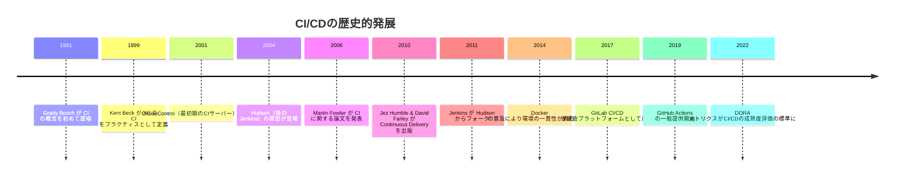

## 2. CI（継続的インテグレーション）の原則

### 定義

継続的インテグレーション（Continuous Integration; CI）とは、開発者が自分のコード変更を共有リポジトリのメインラインに頻繁に（少なくとも1日1回以上）統合し、その都度、自動化されたビルドとテストを実行する開発プラクティスである。

CIの本質は単なるツールの導入ではなく、チームの行動規範の変革にある。CIサーバーを立てただけではCIを実践していることにはならない。重要なのは、以下の原則がチーム全体に浸透していることである。

### CIの基本原則

**1. 単一のソースリポジトリを維持する**

すべてのコード、設定、テスト、マイグレーションスクリプトは単一のバージョン管理システムで管理される。チームメンバー全員が同じリポジトリに対して作業することで、統合の基準が明確になる。

**2. ビルドを自動化する**

ビルドプロセスは完全に自動化され、単一のコマンドで実行可能でなければならない。手動の設定やステップが介在すると、再現性が損なわれ、CIの恩恵が減少する。

**3. テストを自動化する**

自動テストはCIの心臓部である。ビルドが成功しても、テストが通らなければそれは「壊れたビルド」であり、即座に修正する必要がある。

**4. メインラインへの頻繁な統合**

開発者はブランチの寿命を最小化し、少なくとも1日1回はメインラインに統合すべきである。長命ブランチは統合リスクを指数関数的に増大させる。

**5. 壊れたビルドの即時修正**

ビルドが失敗した場合、それはチーム全体の最優先事項である。壊れたビルドを放置したまま新しい変更をコミットしてはならない。

**6. ビルドの高速維持**

CIビルドは高速でなければならない。理想的には10分以内、長くとも30分以内に完了すべきである。ビルドが遅いと、開発者はCIの結果を待たずに次の作業に進んでしまい、フィードバックループが断絶する。

**7. 本番環境のクローンでテストする**

テスト環境は本番環境にできる限り近い構成とすべきである。環境差異によるバグは、CIの信頼性を根底から揺るがす。

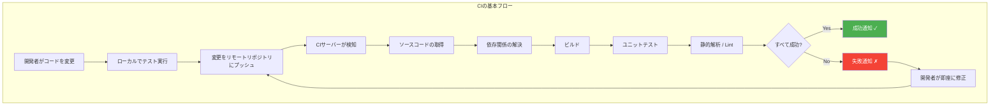

### CIの価値

CIがもたらす最も重要な価値は、**フィードバックの速度**である。変更が問題を引き起こした場合、それがコミットから数分以内に検知される。変更がまだ開発者の記憶に新鮮なうちに問題が報告されるため、修正コストは劇的に低い。

Martin Fowlerが指摘したように、バグの修正コストはその発見が遅れるほど指数関数的に増大する。CIはこの曲線を平坦化する、つまり問題を早期に発見することで修正コストを一定に抑える仕組みである。

## 3. CD — 継続的デリバリー vs 継続的デプロイメント

### 二つのCD

「CD」という略語は、文脈によって二つの異なる概念を指す。この区別は重要である。

**継続的デリバリー（Continuous Delivery）** は、コードの変更がいつでも本番環境にデプロイ可能な状態を維持するプラクティスである。本番へのデプロイ自体は人間の明示的な判断（ボタンの押下）で行われる。

**継続的デプロイメント（Continuous Deployment）** は、継続的デリバリーをさらに推し進め、自動テストをすべてパスした変更を自動的に本番環境にデプロイするプラクティスである。人間の介在なしに、コミットから本番デプロイまでが完全に自動化される。

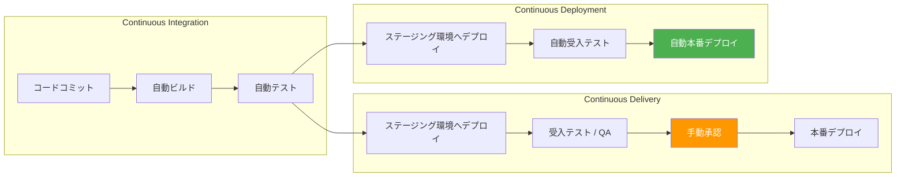

### 継続的デリバリーの核心

Jez Humbleの定義によれば、継続的デリバリーの本質は「ソフトウェアをいつでもリリース可能な状態に保つこと」である。これは単にデプロイメントを自動化することではなく、以下の要件を満たすことを意味する。

1. **すべての変更がリリース候補である**: 各コミットは、自動テストパイプラインを通過すれば即座に本番にデプロイできる品質を持つべきである。
2. **デプロイメントパイプラインによるフィードバック**: コードの変更はパイプラインの各段階で検証され、問題があれば即座にフィードバックされる。
3. **リリースはビジネス判断である**: デプロイの技術的準備は常に整っているため、「いつリリースするか」は純粋にビジネス上の判断となる。

### 継続的デプロイメントの前提条件

継続的デプロイメントを安全に実践するには、以下の条件が整っている必要がある。

- **十分なテスト自動化**: ユニットテスト、インテグレーションテスト、E2Eテスト、パフォーマンステストなどが網羅的に自動化されていること
- **フィーチャーフラグ**: デプロイとリリースを分離する仕組みが整備されていること
- **自動ロールバック**: 問題検知時に即座にロールバックできるメカニズムがあること
- **高度なモニタリング**: デプロイ後の異常を即座に検知できるオブザーバビリティ基盤があること
- **組織文化**: チーム全体が「小さな変更を頻繁にデプロイする」文化を受け入れていること

### 両者の選択

実際のところ、多くの組織は継続的デリバリーを実践しつつ、すべてのサービスで継続的デプロイメントを採用しているわけではない。以下のような観点で使い分けることが多い。

| 観点 | 継続的デリバリー | 継続的デプロイメント |
|---|---|---|
| 本番デプロイの判断 | 人間が行う | 自動 |
| テストの信頼性要件 | 高い | 極めて高い |
| ロールバック戦略 | 必須 | 必須（自動推奨） |
| 適するサービス | 基幹系、金融、医療 | Webアプリ、内部ツール |
| 規制要件 | 対応しやすい | 監査証跡の設計が必要 |

## 4. パイプラインの設計 — Build, Test, Deploy

### デプロイメントパイプラインとは

デプロイメントパイプラインとは、コードの変更がバージョン管理システムにコミットされてから本番環境にデプロイされるまでの全工程を自動化したワークフローである。パイプラインは複数の**ステージ**で構成され、各ステージは前のステージが成功した場合にのみ実行される。

パイプラインの設計原則は以下の通りである。

1. **高速なフィードバック**: 失敗する可能性が高いテスト（ユニットテスト、静的解析）を先に実行し、時間のかかるテスト（E2Eテスト、パフォーマンステスト）を後段に配置する。
2. **一度だけビルド**: ビルド成果物（アーティファクト）は一度だけ生成し、同じアーティファクトをすべての環境で使用する。ステージごとにビルドし直してはならない。
3. **環境差異の最小化**: パイプラインの各環境は本番環境にできる限り近い構成とする。コンテナ技術はこの原則の実現に大きく寄与した。
4. **全工程の可視化**: パイプラインの各ステージの状態がリアルタイムで可視化され、どの変更がどのステージにあるかを誰でも確認できる。

### 典型的なパイプライン構成

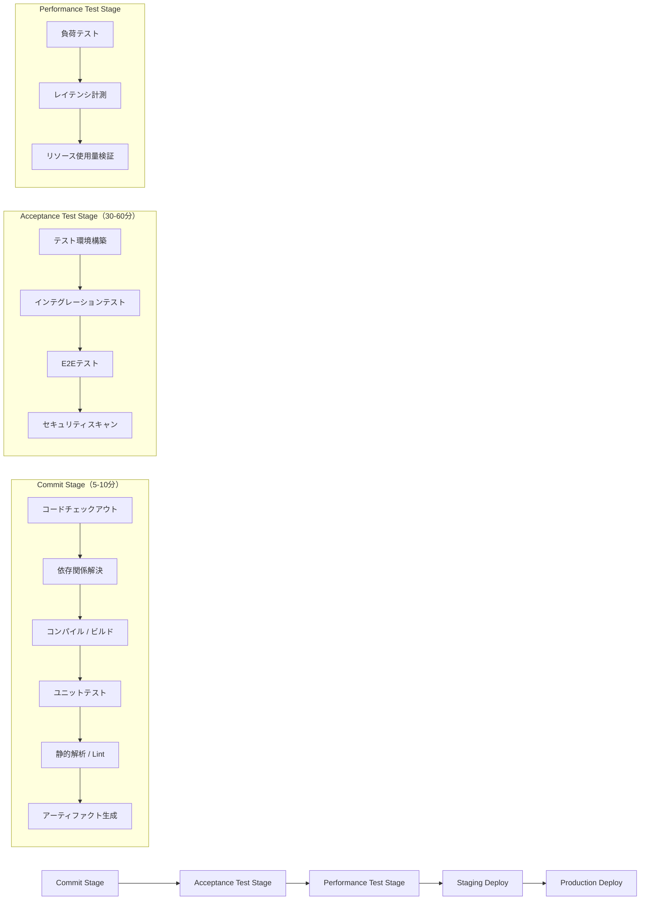

### Commit Stage

Commit Stageはパイプラインの最初のステージであり、最も高速でなければならない。このステージの目標は、明らかに壊れた変更を数分以内に検出し、開発者にフィードバックすることである。

Commit Stageで実行される典型的なタスクは以下の通りである。

```yaml
# Example: GitHub Actions Commit Stage
name: Commit Stage
on: [push, pull_request]

jobs:
  build-and-test:
    runs-on: ubuntu-latest
    steps:
      - uses: actions/checkout@v4

      - name: Setup Node.js
        uses: actions/setup-node@v4
        with:
          node-version: '20'
          cache: 'npm'

      # Install dependencies
      - run: npm ci

      # Compile / Type check
      - run: npm run build

      # Unit tests
      - run: npm run test:unit -- --coverage

      # Linting and formatting
      - run: npm run lint
      - run: npm run format:check

      # Upload build artifact
      - uses: actions/upload-artifact@v4
        with:
          name: build-output
          path: dist/
```

### Acceptance Test Stage

Acceptance Test Stageでは、ビルドされたアーティファクトが実際の動作環境に近い状態でデプロイされ、ビジネス要件を満たしているかが検証される。このステージではインテグレーションテストやE2Eテストが実行される。

### Production Deploy Stage

本番デプロイは、パイプラインの最終ステージである。継続的デリバリーの場合は手動承認ゲートを設け、継続的デプロイメントの場合は前ステージの成功を条件に自動実行される。

## 5. テスト戦略との統合

### テストピラミッド

Mike Cohnが提唱した**テストピラミッド**は、CI/CDパイプラインにおけるテスト戦略の基盤となる考え方である。ピラミッドの各層はテストの種類を表し、下層ほどテスト数が多く、実行速度が速く、メンテナンスコストが低い。

```
            /\
           /  \
          / E2E\           少数・遅い・高コスト
         /テスト \
        /--------\
       /インテグレ\        中程度
      / ーションテスト\
     /--------------\
    / ユニットテスト   \    多数・高速・低コスト
   /------------------\
```

**ユニットテスト**: 個々の関数やクラスを単独でテストする。外部依存はモックやスタブで置き換える。数千〜数万のテストが数秒〜数分で実行されることが理想である。CI パイプラインの Commit Stage で実行する。

**インテグレーションテスト**: 複数のコンポーネントやサービス間の連携をテストする。データベースやメッセージキューなどの実際の外部システム（またはそのテスト用インスタンス）と接続して検証する。Acceptance Test Stage で実行する。

**E2E（End-to-End）テスト**: ユーザーの操作シナリオを再現し、システム全体が正しく動作することを確認する。ブラウザ自動操作（Playwright, Cypressなど）を用いることが多い。実行に時間がかかるため、重要なシナリオに絞って実装する。

### パイプライン内でのテスト配置

テストピラミッドをパイプラインに適用する場合、高速なテストを先に、遅いテストを後に配置することが鍵となる。これにより、問題のある変更を可能な限り早い段階で排除できる。

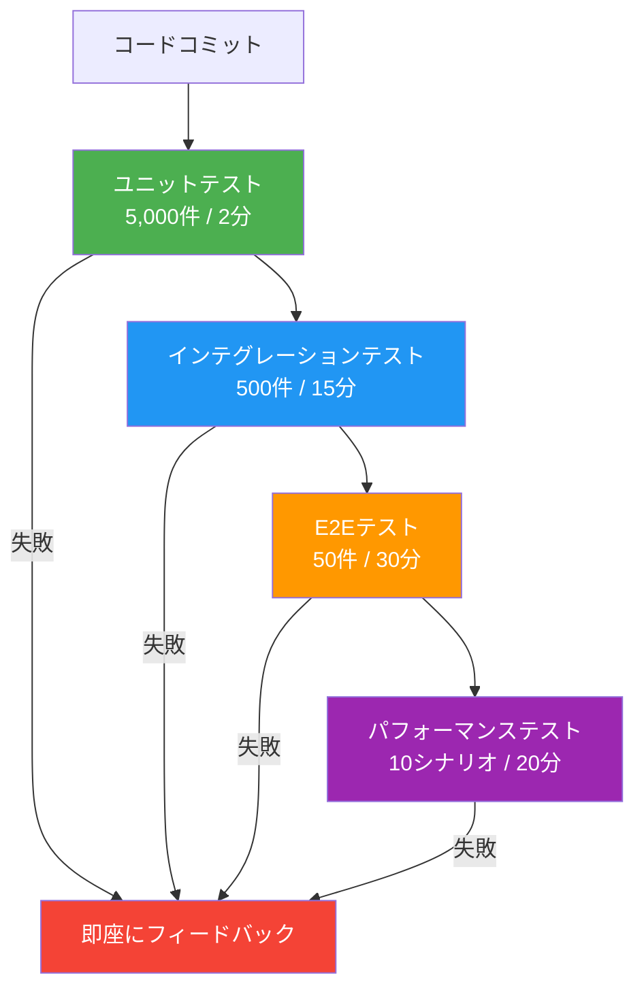

### 並列テスト実行

テストの実行時間を短縮するための最も効果的な手法が**テストの並列化**である。テストスイートを複数のワーカー（マシンまたはコンテナ）に分散させて同時実行する。

```yaml
# Example: Parallel test execution with GitHub Actions matrix
jobs:
  test:
    strategy:
      matrix:
        shard: [1, 2, 3, 4]
    runs-on: ubuntu-latest
    steps:
      - uses: actions/checkout@v4
      - run: npm ci
      # Run only the assigned shard of the test suite
      - run: npm run test -- --shard=${{ matrix.shard }}/4
```

並列テスト実行における注意点は以下の通りである。

- **テスト間の独立性**: 各テストは他のテストの実行結果や副作用に依存してはならない。共有状態（データベースのレコードなど）がある場合はテストごとに初期化する必要がある。
- **シャーディング戦略**: テストを均等に分割するだけでなく、実行時間に基づいてバランシングすることが望ましい。過去の実行時間データを基に動的に分割するツール（例: Jest の `--shard`、CircleCI の `circleci tests split --split-by=timings`）を活用する。
- **テスト結果の集約**: 複数のワーカーで実行されたテスト結果を最終的に集約し、全体の成否を判定する仕組みが必要である。

### Flaky Test（不安定なテスト）への対処

CI/CDパイプラインにおける最大の敵の一つが**Flaky Test**（不安定なテスト）である。Flaky Testとは、コードに変更がないにもかかわらず、成功したり失敗したりするテストのことである。

Flaky Testが蔓延すると、以下の問題が生じる。

- **CI結果への信頼喪失**: 失敗が日常化すると、開発者はCIの結果を無視し始める。本当のバグを見逃すリスクが高まる。
- **再実行の浪費**: 「とりあえず再実行」が常態化し、CIリソースの無駄遣いとデプロイの遅延を招く。

Flaky Testへの対策は以下のようなものがある。

1. **Flaky Testの自動検出と隔離**: テストの成功/失敗履歴を追跡し、不安定なテストを自動的に検出してタグ付けする。
2. **不安定なテストの根本原因の修正**: タイムアウト、非同期処理の競合、テスト間の依存関係など、不安定さの原因を特定して修正する。
3. **検疫（Quarantine）モード**: 不安定なテストを一時的にパイプラインから除外し、バックグラウンドで修正を進める。ただし、これを常態化させてはならない。

## 6. アーティファクト管理とコンテナレジストリ

### ビルドアーティファクトとは

ビルドアーティファクトとは、CIパイプラインのビルドステージで生成される成果物の総称である。コンパイル済みバイナリ、JARファイル、npm パッケージ、Dockerイメージなどが典型的なアーティファクトにあたる。

CI/CDにおけるアーティファクト管理の原則は**「一度だけビルドし、どこでも同じアーティファクトを使う」**ことである。

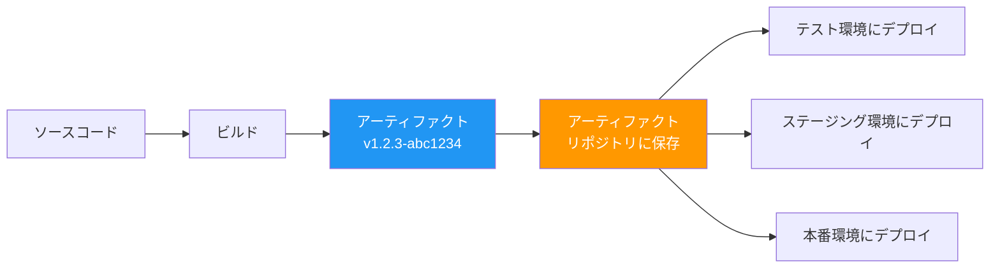

各環境で異なる設定（データベース接続先、APIキーなど）は、アーティファクトに埋め込むのではなく、環境変数やシークレット管理システムから注入する。これにより、同一のアーティファクトがどの環境でも動作することを保証する。

### アーティファクトリポジトリ

アーティファクトリポジトリは、ビルド成果物を保管・管理するための専用ストレージである。代表的なツールを以下に示す。

| リポジトリ | 対応形式 | 特徴 |
|---|---|---|
| JFrog Artifactory | Maven, npm, Docker, PyPI, etc. | ユニバーサルリポジトリ、商用 |
| Sonatype Nexus | Maven, npm, Docker, PyPI, etc. | OSS版あり、オンプレミス向き |
| GitHub Packages | npm, Maven, Docker, NuGet, etc. | GitHub統合、GitHub Actions連携 |
| Amazon ECR | Docker/OCI | AWSネイティブ、IAM統合 |
| Google Artifact Registry | Docker/OCI, Maven, npm, Python | GCPネイティブ、マルチフォーマット |
| Azure Container Registry | Docker/OCI | Azureネイティブ |

### コンテナレジストリとイメージ管理

コンテナベースのCI/CDでは、Dockerイメージが主要なアーティファクト形態となる。コンテナレジストリはDockerイメージを保管し、デプロイ先に配布する役割を担う。

イメージのタグ付け戦略はCI/CDの信頼性に直結する。

```bash
# Anti-pattern: Using 'latest' tag
docker build -t myapp:latest .
# Problem: 'latest' is mutable. Different deploys may use different images.

# Best practice: Immutable tags based on commit SHA or semantic version
docker build -t myapp:abc1234 .
docker build -t myapp:v1.2.3 .

# Combined approach
docker build \
  -t myapp:$(git rev-parse --short HEAD) \
  -t myapp:v1.2.3 \
  -t myapp:latest \
  .
```

`latest` タグのみに依存することは避けるべきである。`latest` はミュータブル（上書き可能）であり、どのバージョンが実際にデプロイされているかの追跡が困難になる。イミュータブルなタグ（コミットSHAやセマンティックバージョン）を主たる識別子として使用する。

### アーティファクトのライフサイクル管理

ビルドアーティファクトは無限に保持できるものではない。ストレージコストの観点から、以下のようなライフサイクルポリシーを設定することが一般的である。

- **開発ビルド**: 2週間で自動削除
- **ステージングビルド**: 1ヶ月で自動削除
- **本番リリース**: 6ヶ月〜1年保持（ロールバック用）
- **セマンティックバージョンのリリース**: 長期保持

## 7. デプロイメント戦略

本番環境へのデプロイは、CI/CDパイプラインの最も重要かつリスクの高いステージである。デプロイメント戦略の選択は、ダウンタイムの許容度、ロールバックの容易さ、リソースコストのバランスに基づいて行う。

### Blue-Green デプロイメント

Blue-Greenデプロイメントは、本番環境を2つ（Blue環境とGreen環境）用意し、一方をアクティブ（ライブ）、他方をスタンバイとして運用する手法である。

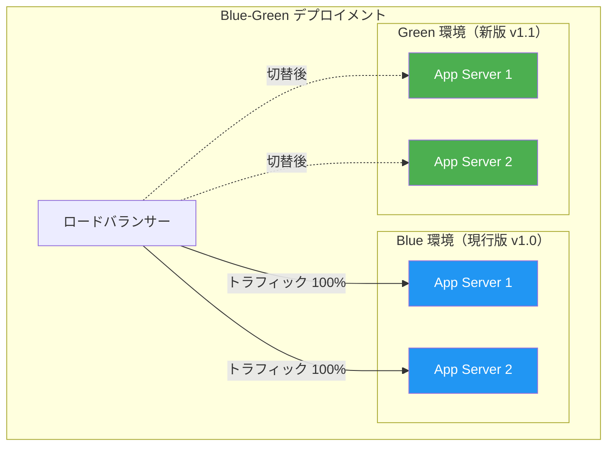

**手順**:
1. Green環境に新バージョンをデプロイする
2. Green環境でスモークテストを実行する
3. ロードバランサーの向き先をBlueからGreenに切り替える
4. 問題があればBlue環境に即座に戻す（ロールバック）
5. 安定を確認したら旧Blue環境を破棄（または次回デプロイ用に再利用）

**利点**:
- ゼロダウンタイムデプロイが可能
- ロールバックが極めて高速（ロードバランサーの切替のみ）
- 新バージョンの検証を本番相当の環境で行える

**欠点**:
- 2倍のインフラリソースが必要（コスト増）
- データベースのスキーマ変更がある場合、両バージョンの互換性管理が複雑
- セッション状態の引き継ぎに注意が必要

### Canary デプロイメント

Canaryデプロイメントは、新バージョンを少数のサーバーまたは少数のユーザーに限定的にデプロイし、問題がないことを確認しながら段階的にトラフィックを増やしていく手法である。名前の由来は、かつて炭鉱でカナリアを有毒ガスの検知に使ったことにちなむ。

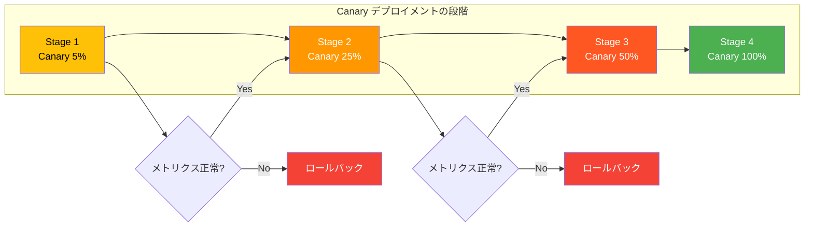

**手順**:
1. 新バージョンを少数のインスタンスにデプロイする（例: 全体の5%）
2. Canaryインスタンスのメトリクス（エラー率、レイテンシ、CPU使用率など）を監視する
3. メトリクスが正常であれば、徐々にトラフィック比率を上げる
4. 異常が検知された場合、Canaryインスタンスを旧バージョンに戻す
5. 最終的に100%のトラフィックが新バージョンに流れるようにする

**利点**:
- 影響範囲を限定しながらリスクを段階的に評価できる
- 本番トラフィックでの実際のパフォーマンスを確認できる
- Blue-Greenに比べて必要なインフラリソースが少ない

**欠点**:
- メトリクス監視の仕組みが必須
- デプロイ完了までに時間がかかる
- トラフィック分散の仕組み（ロードバランサーの重み付けなど）が必要

### Rolling デプロイメント

Rollingデプロイメントは、稼働中のインスタンスを1つずつ（または少数ずつ）新バージョンに置き換えていく手法である。Kubernetesのデフォルトのデプロイ戦略でもある。

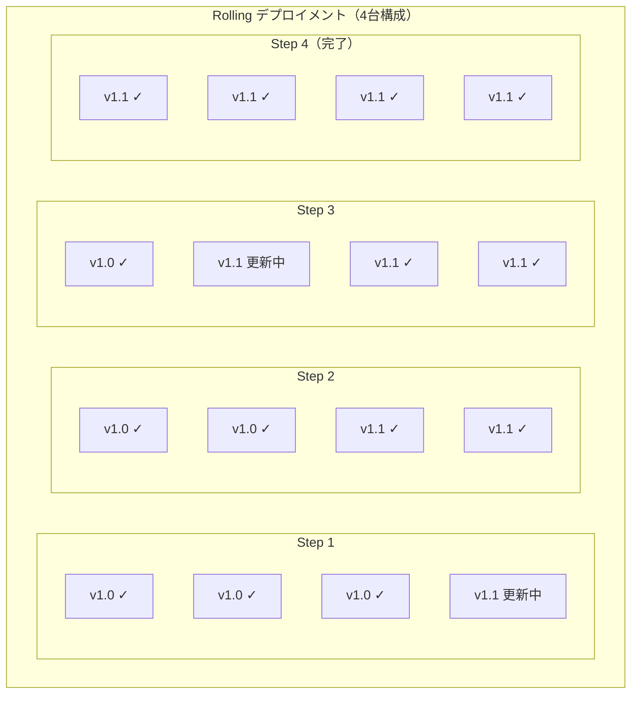

Kubernetesにおける Rolling Update の設定例を示す。

```yaml
# Kubernetes Deployment with Rolling Update strategy
apiVersion: apps/v1
kind: Deployment
metadata:
  name: myapp
spec:
  replicas: 4
  strategy:
    type: RollingUpdate
    rollingUpdate:
      # Maximum number of pods that can be unavailable during update
      maxUnavailable: 1
      # Maximum number of extra pods that can be created during update
      maxSurge: 1
  template:
    spec:
      containers:
        - name: myapp
          image: myapp:v1.1
          readinessProbe:
            httpGet:
              path: /healthz
              port: 8080
            initialDelaySeconds: 5
            periodSeconds: 10
```

**利点**:
- 追加のインフラリソースが少なくて済む
- ゼロダウンタイムでデプロイ可能
- Kubernetesで標準サポートされている

**欠点**:
- デプロイ中に新旧バージョンが混在する（API互換性の考慮が必要）
- ロールバックに時間がかかる（再度ローリングで戻す必要がある）
- デプロイ中のキャパシティが一時的に低下する

### デプロイメント戦略の比較

| 特性 | Blue-Green | Canary | Rolling |
|---|---|---|---|
| ダウンタイム | なし | なし | なし |
| ロールバック速度 | 極めて高速 | 高速 | 低速 |
| 追加リソース | 2倍 | 少量 | 最小 |
| 新旧混在期間 | なし | あり | あり |
| リスク検証 | 切替前に検証 | 段階的に検証 | なし |
| 複雑さ | 中 | 高 | 低 |

## 8. CI/CDツール比較

### GitHub Actions

GitHubに統合されたCI/CDサービスであり、GitHubリポジトリとのシームレスな連携が最大の特徴である。

```yaml
# .github/workflows/ci.yml
name: CI Pipeline
on:
  push:
    branches: [main]
  pull_request:
    branches: [main]

jobs:
  build:
    runs-on: ubuntu-latest
    steps:
      - uses: actions/checkout@v4
      - uses: actions/setup-node@v4
        with:
          node-version: '20'
          cache: 'npm'
      - run: npm ci
      - run: npm run build
      - run: npm test

  deploy:
    needs: build
    if: github.ref == 'refs/heads/main'
    runs-on: ubuntu-latest
    steps:
      - uses: actions/checkout@v4
      - name: Deploy to production
        run: ./scripts/deploy.sh
        env:
          DEPLOY_TOKEN: ${{ secrets.DEPLOY_TOKEN }}
```

**特徴**:
- GitHubとの深い統合（Pull Requestステータスチェック、Dependabotなど）
- YAML定義によるワークフロー記述
- 豊富なMarketplaceアクション
- パブリックリポジトリは無料
- Self-hosted runnerによるオンプレミス実行も可能

### GitLab CI/CD

GitLabに組み込まれたCI/CDプラットフォームであり、ソースコード管理からCI/CD、セキュリティスキャンまでを単一プラットフォームで提供する。

```yaml
# .gitlab-ci.yml
stages:
  - build
  - test
  - deploy

build:
  stage: build
  image: node:20
  script:
    - npm ci
    - npm run build
  artifacts:
    paths:
      - dist/

test:
  stage: test
  image: node:20
  script:
    - npm ci
    - npm test
  coverage: '/Statements\s*:\s*(\d+\.\d+)%/'

deploy_production:
  stage: deploy
  script:
    - ./scripts/deploy.sh
  environment:
    name: production
    url: https://myapp.example.com
  only:
    - main
  when: manual
```

**特徴**:
- Auto DevOps機能による自動パイプライン構成
- コンテナレジストリの内蔵
- 環境管理とデプロイ追跡の統合
- セキュリティスキャン（SAST、DAST、依存関係スキャン）の統合
- Self-managedインスタンスの運用が可能

### Jenkins

OSSのCI/CDサーバーとして最も長い歴史を持つ。高い拡張性と柔軟性が特徴であり、1,800以上のプラグインが利用可能である。

```groovy
// Jenkinsfile (Declarative Pipeline)
pipeline {
    agent any

    stages {
        stage('Build') {
            steps {
                sh 'npm ci'
                sh 'npm run build'
            }
        }

        stage('Test') {
            parallel {
                stage('Unit Tests') {
                    steps {
                        sh 'npm run test:unit'
                    }
                }
                stage('Integration Tests') {
                    steps {
                        sh 'npm run test:integration'
                    }
                }
            }
        }

        stage('Deploy') {
            when {
                branch 'main'
            }
            steps {
                sh './scripts/deploy.sh'
            }
        }
    }

    post {
        failure {
            mail to: 'team@example.com',
                 subject: "Build Failed: ${env.JOB_NAME}",
                 body: "Check: ${env.BUILD_URL}"
        }
    }
}
```

**特徴**:
- 完全なオンプレミス運用が可能
- 膨大なプラグインエコシステム
- Groovy DSLによる柔軟なパイプライン定義
- マスター/エージェントアーキテクチャによるスケーリング
- 運用・管理のオーバーヘッドが大きい

### CircleCI

クラウドネイティブなCI/CDサービスであり、Docker環境での高速なビルドが特徴である。

```yaml
# .circleci/config.yml
version: 2.1

orbs:
  node: circleci/node@5.0

jobs:
  build-and-test:
    docker:
      - image: cimg/node:20.0
    steps:
      - checkout
      - node/install-packages:
          pkg-manager: npm
      - run:
          name: Build
          command: npm run build
      - run:
          name: Test
          command: npm test
      - store_test_results:
          path: test-results

  deploy:
    docker:
      - image: cimg/node:20.0
    steps:
      - checkout
      - run:
          name: Deploy
          command: ./scripts/deploy.sh

workflows:
  build-deploy:
    jobs:
      - build-and-test
      - deploy:
          requires:
            - build-and-test
          filters:
            branches:
              only: main
```

**特徴**:
- Docker Layer Cachingによる高速ビルド
- Orbsによる再利用可能な設定パッケージ
- テスト分割と並列実行のネイティブサポート
- インサイト機能によるパイプライン分析
- クレジットベースの課金モデル

### ツール比較表

| 項目 | GitHub Actions | GitLab CI/CD | Jenkins | CircleCI |
|---|---|---|---|---|
| ホスティング | クラウド + Self-hosted | クラウド + Self-managed | Self-hosted | クラウド + Self-hosted |
| 定義ファイル | YAML | YAML | Groovy (Jenkinsfile) | YAML |
| エコシステム | Marketplace Actions | CI Templates | プラグイン (1,800+) | Orbs |
| セキュリティ統合 | Dependabot, CodeQL | SAST/DAST内蔵 | プラグイン依存 | Orbsで追加 |
| 初期学習コスト | 低い | 低い | 高い | 低い |
| 運用コスト | 低い（クラウド） | 中（Self-managed） | 高い | 低い（クラウド） |
| カスタマイズ性 | 中 | 高 | 極めて高い | 中 |

## 9. セキュリティ統合（DevSecOps）

### Shift Left Security

従来のセキュリティテストはリリース直前の「ゲート」として実施されることが多かった。しかし、この方式ではセキュリティ上の問題の発見が遅れ、修正コストが膨大になる。

**Shift Left**とは、セキュリティテストをパイプラインの可能な限り早い段階に移動させるアプローチである。開発者がコードを書いた直後にセキュリティチェックが実行されることで、問題を早期に発見・修正できる。

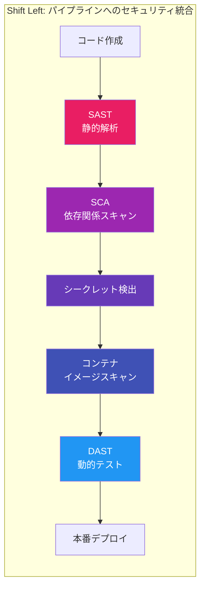

### SAST（Static Application Security Testing）

SASTは、ソースコードやバイナリを実行せずに解析し、セキュリティ上の脆弱性を検出する手法である。SQLインジェクション、XSS、バッファオーバーフローなどの一般的な脆弱性パターンを検出できる。

代表的なツール:
- **SonarQube**: マルチ言語対応の包括的な静的解析プラットフォーム
- **Semgrep**: パターンベースの高速な静的解析ツール、カスタムルールの作成が容易
- **CodeQL** (GitHub): GitHub Advanced Securityの一部として提供されるセマンティックコード解析

```yaml
# Example: Semgrep integration in GitHub Actions
- name: Run Semgrep SAST
  uses: returntocorp/semgrep-action@v1
  with:
    config: >-
      p/owasp-top-ten
      p/cwe-top-25
```

### DAST（Dynamic Application Security Testing）

DASTは、稼働中のアプリケーションに対して攻撃シミュレーションを実行し、脆弱性を検出する手法である。ブラックボックステストの一種であり、アプリケーションの言語やフレームワークに依存しない。

代表的なツール:
- **OWASP ZAP**: OSSの動的セキュリティテストツール
- **Burp Suite**: 商用のWebアプリケーションセキュリティテストスイート

DASTはデプロイ後のステージング環境で実行されることが多い。ただし、実行に時間がかかるため、すべてのコミットに対して実行するのではなく、日次やリリース前のゲートとして設定することが一般的である。

### SCA（Software Composition Analysis）

SCAは、プロジェクトが使用するサードパーティの依存関係（OSSライブラリなど）に含まれる既知の脆弱性を検出する手法である。現代のアプリケーションはその大部分がOSSコンポーネントで構成されているため、SCAは極めて重要である。

代表的なツール:
- **Dependabot** (GitHub): 依存関係の脆弱性を検出し、自動でPull Requestを作成
- **Snyk**: 依存関係、コンテナイメージ、IaCの脆弱性を統合的にスキャン
- **Trivy**: OSSのコンテナイメージ・ファイルシステムスキャナー

```yaml
# Example: Trivy container image scan in CI
- name: Scan container image
  uses: aquasecurity/trivy-action@master
  with:
    image-ref: 'myapp:${{ github.sha }}'
    format: 'sarif'
    output: 'trivy-results.sarif'
    severity: 'CRITICAL,HIGH'
```

### シークレット管理

CI/CDパイプラインでは、データベースの認証情報、APIキー、SSL証明書などのシークレットを扱う必要がある。これらのシークレットがソースコードやCIログに漏洩することは、最も深刻なセキュリティインシデントの一つである。

**シークレット漏洩防止のプラクティス**:

1. **シークレットスキャン**: `git-secrets`、`TruffleHog`、`Gitleaks`などのツールをpre-commitフックやCIパイプラインに統合し、シークレットがコミットされることを防止する。
2. **シークレット管理システムの利用**: HashiCorp Vault、AWS Secrets Manager、Azure Key Vaultなどの専用システムでシークレットを集中管理する。
3. **環境変数の暗号化**: CIサービスが提供するシークレット管理機能（GitHub Actions Secrets、GitLab CI/CD Variables）を使用し、パイプライン定義ファイルにシークレットを直接記述しない。
4. **最小権限の原則**: CIパイプラインに付与する権限は、必要最小限に留める。デプロイに使うサービスアカウントも同様である。

```yaml
# Example: Secret usage in GitHub Actions (secrets are masked in logs)
jobs:
  deploy:
    runs-on: ubuntu-latest
    steps:
      - name: Deploy
        env:
          # Secrets are injected as environment variables
          DATABASE_URL: ${{ secrets.DATABASE_URL }}
          API_KEY: ${{ secrets.API_KEY }}
        run: ./scripts/deploy.sh
```

## 10. モノレポでのCI/CD

### モノレポの課題

モノレポ（Monorepo）とは、複数のプロジェクトやサービスを単一のリポジトリで管理するアプローチである。Google、Meta、Microsoftなどの大企業が採用していることで知られる。

モノレポのCI/CDには、単一プロジェクトリポジトリにはない固有の課題がある。

**ビルド時間の爆発**: リポジトリ全体を毎回ビルドすると、変更のないプロジェクトまでビルドされ、パイプラインの実行時間が膨大になる。

**影響範囲の特定**: あるファイルの変更がどのサービスに影響するかを正確に判定する必要がある。共有ライブラリの変更は、それに依存するすべてのサービスに波及する。

**テストの選択的実行**: 変更されたプロジェクトとその依存先のテストのみを実行し、無関係なテストをスキップする仕組みが必要である。

### 変更検知とターゲットビルド

モノレポのCI/CDでは、変更されたファイルを解析し、影響を受けるプロジェクトのみをビルド・テストする**ターゲットビルド**が鍵となる。

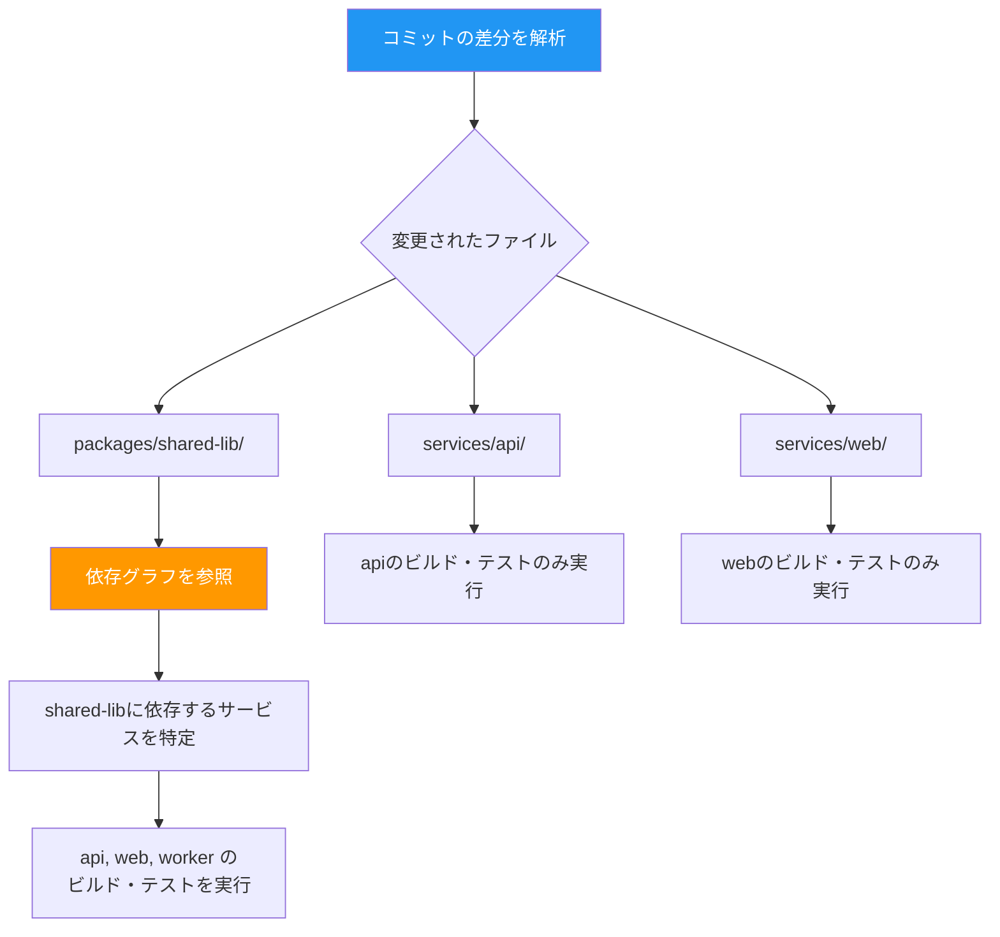

### モノレポ向けビルドツール

モノレポのCI/CDを効率化するためのビルドツールが複数存在する。

**Nx**: JavaScript/TypeScriptエコシステム向けのモノレポ管理ツール。依存グラフの解析、影響を受けるプロジェクトの特定、計算キャッシュ（ローカル・リモート）を提供する。

**Turborepo**: Vercelが開発するモノレポ用ビルドシステム。タスクの並列実行とリモートキャッシュが特徴。設定が少なく導入が容易。

**Bazel**: Googleが開発した大規模ビルドシステム。言語非依存であり、極めて精密な依存グラフ管理と再現性のあるビルドを提供する。大規模なモノレポに適している。

```yaml
# Example: GitHub Actions with Nx affected commands
name: CI
on: push

jobs:
  main:
    runs-on: ubuntu-latest
    steps:
      - uses: actions/checkout@v4
        with:
          fetch-depth: 0  # Full history needed for affected analysis

      - uses: actions/setup-node@v4
        with:
          node-version: '20'
          cache: 'npm'

      - run: npm ci

      # Only build and test affected projects
      - run: npx nx affected -t build --base=origin/main
      - run: npx nx affected -t test --base=origin/main
      - run: npx nx affected -t lint --base=origin/main
```

### リモートキャッシュ

モノレポのCI/CD高速化において、**リモートキャッシュ**は極めて重要な技術である。ビルドやテストの結果をチーム全体で共有可能なキャッシュに保存することで、同一の入力（ソースコード + 依存関係 + 設定）に対する再計算を回避する。

あるブランチでビルドされた結果が、別のブランチのCIやローカルの開発マシンでもキャッシュヒットする。これにより、特に共有ライブラリの再ビルドが不要になり、CIの実行時間が劇的に短縮される。

## 11. メトリクスと改善 — DORA Four Keys

### DORA Four Keys

DevOps Research and Assessment（DORA）チーム（現在はGoogleの一部）は、ソフトウェア開発チームのパフォーマンスを測定するための4つの主要メトリクスを定義した。これらは「DORA Four Keys」として広く知られており、CI/CDパイプラインの成熟度を客観的に評価する基準となっている。

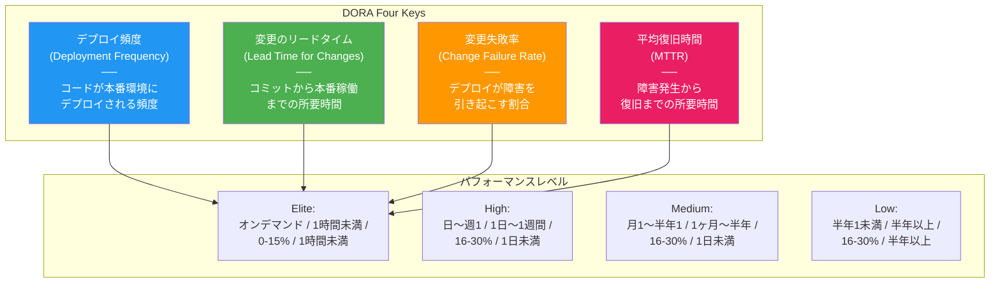

### 各メトリクスの詳細

**1. デプロイ頻度（Deployment Frequency）**

本番環境へのデプロイがどの程度の頻度で行われるかを示す。高頻度のデプロイは、小さな変更を頻繁にリリースしていることを意味し、各リリースのリスクが低いことを示唆する。

- Elite: オンデマンド（1日複数回）
- High: 日に1回〜週に1回
- Medium: 月に1回〜半年に1回
- Low: 半年に1回未満

**2. 変更のリードタイム（Lead Time for Changes）**

コードがコミットされてから本番環境で稼働するまでの所要時間である。このメトリクスはCI/CDパイプラインの効率性を直接反映する。

- Elite: 1時間未満
- High: 1日〜1週間
- Medium: 1ヶ月〜半年
- Low: 半年以上

**3. 変更失敗率（Change Failure Rate）**

デプロイのうち、障害（サービスダウン、ロールバック、ホットフィックスの必要性など）を引き起こした割合である。このメトリクスはCI/CDパイプラインのテスト品質と、デプロイプロセスの信頼性を反映する。

- Elite / High: 0-15%
- Medium: 16-30%
- Low: 16-30%（ただし他のメトリクスが低い）

**4. 平均復旧時間（Mean Time to Recovery: MTTR）**

本番環境で障害が発生してから、サービスが正常に復旧するまでの所要時間である。ロールバックの速度、障害検知の速度、インシデント対応プロセスの成熟度を反映する。

- Elite: 1時間未満
- High: 1日未満
- Medium: 1日〜1週間
- Low: 半年以上

### メトリクスの計測と改善

DORA Four Keysを実際に計測するには、CI/CDパイプラインとデプロイメントシステムからデータを収集する必要がある。

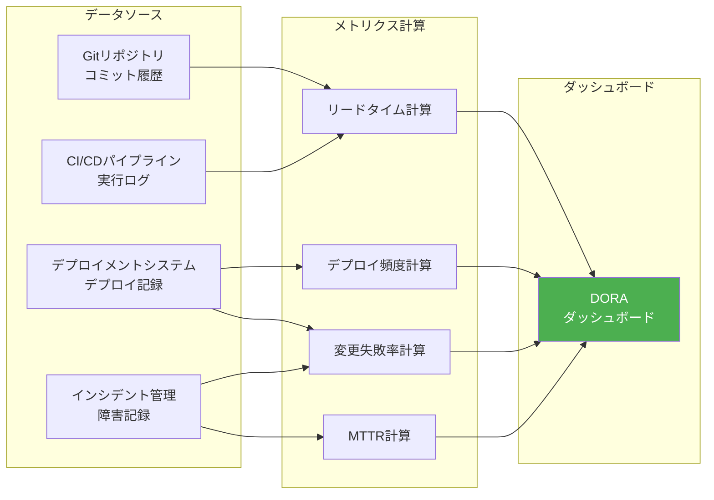

具体的な改善のアプローチを以下に示す。

**リードタイムの短縮**:
- パイプラインの各ステージの実行時間を計測し、ボトルネックを特定する
- テストの並列化とキャッシュの活用
- ビルドの増分化（変更されたモジュールのみビルド）
- 承認プロセスの自動化（自動マージルール、Codeownersなど）

**デプロイ頻度の向上**:
- トランクベース開発の導入（短命ブランチ、頻繁なマージ）
- フィーチャーフラグによるデプロイとリリースの分離
- デプロイの自動化とセルフサービス化

**変更失敗率の低減**:
- テストカバレッジの向上（特にインテグレーションテスト）
- Canaryデプロイメントによる段階的リリース
- コードレビュープロセスの強化

**MTTRの短縮**:
- 自動ロールバック機構の整備
- 包括的なモニタリングとアラート
- インシデント対応の自動化（Runbook Automationなど）
- カオスエンジニアリングによる障害耐性の向上

### パイプラインの成熟度モデル

CI/CDパイプラインの成熟度は段階的に向上させるのが現実的である。以下に、段階的な成熟度モデルを示す。

**Level 0: 手動**
- ビルド、テスト、デプロイはすべて手動
- 再現性がなく、属人的

**Level 1: 基本的なCI**
- 自動ビルドと自動ユニットテスト
- ビルドの成否がチームに通知される
- ブランチマージ時にCIが実行される

**Level 2: 拡張されたCI**
- インテグレーションテスト、静的解析の自動化
- テストカバレッジの追跡
- Pull Requestへのステータスチェック統合

**Level 3: 継続的デリバリー**
- ステージングへの自動デプロイ
- 受入テストの自動化
- 本番デプロイが手動承認で実行可能

**Level 4: 継続的デプロイメント**
- 本番デプロイの完全自動化
- Canaryデプロイメントによる段階的リリース
- 自動ロールバック

**Level 5: 最適化**
- DORA Four Keysの継続的モニタリング
- パイプライン自体の最適化が自動化
- セキュリティスキャンの完全統合
- カオスエンジニアリングとの統合

## 12. まとめ

CI/CDパイプラインは、単なるツールの導入ではなく、ソフトウェア開発チームの文化と実践を根底から変革するプラクティスである。Martin FowlerのContinuous Integration、Jez HumbleのContinuous Deliveryという理論的基盤の上に、コンテナ技術、クラウドインフラ、セキュリティ自動化といった技術の進歩が積み重なり、現在のCI/CDエコシステムが形成されている。

重要なのは、CI/CDは最終目的ではなく、**ソフトウェアをより速く、より安全に、より信頼性高くユーザーに届ける**ための手段であるということである。パイプラインの各要素——ビルドの自動化、テスト戦略、アーティファクト管理、デプロイメント戦略、セキュリティ統合——はすべてこの目的に奉仕している。

DORA Four Keysが示すように、CI/CDの成熟度は組織のソフトウェアデリバリーパフォーマンスと強い相関がある。しかし、メトリクスの改善それ自体を目的化してはならない。重要なのは、チームが安心して頻繁にデプロイでき、問題が起きても迅速に復旧できる、そのような環境を築くことである。

CI/CDの導入は段階的に進めるべきであり、まずは基本的なCIから始めて、テストの自動化を充実させ、デプロイメントの自動化を進め、最終的にはセキュリティ統合やメトリクス駆動の改善サイクルを確立していくのが現実的なアプローチである。
