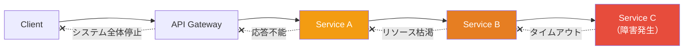
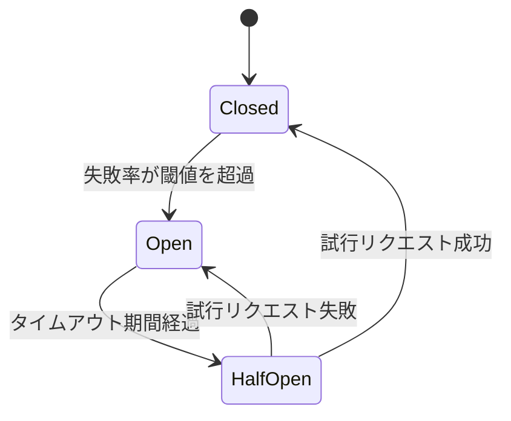
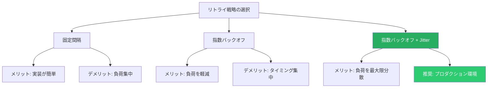
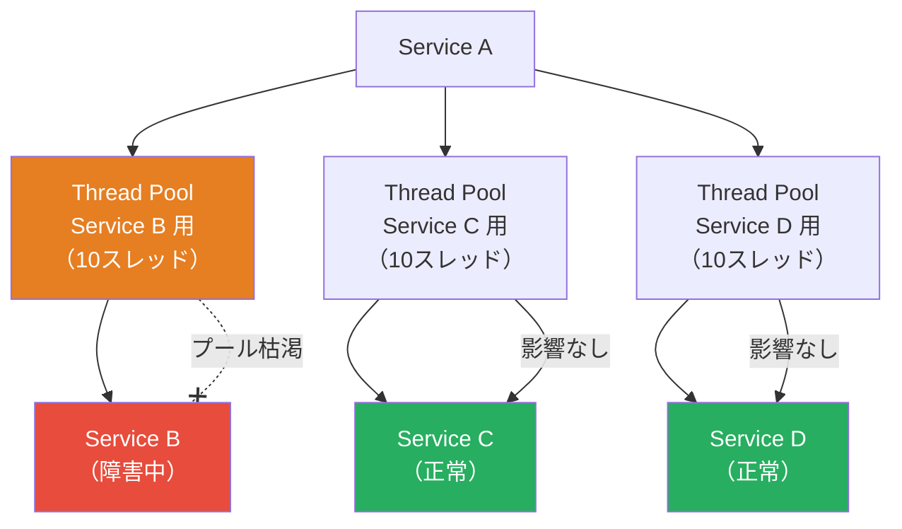
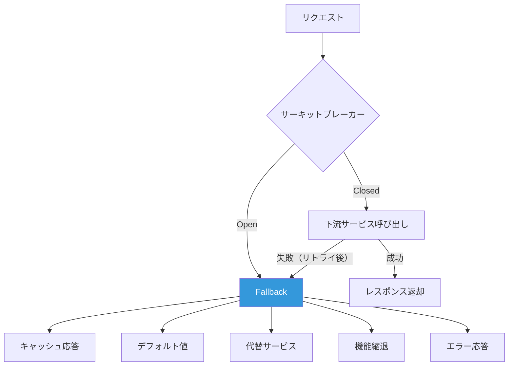
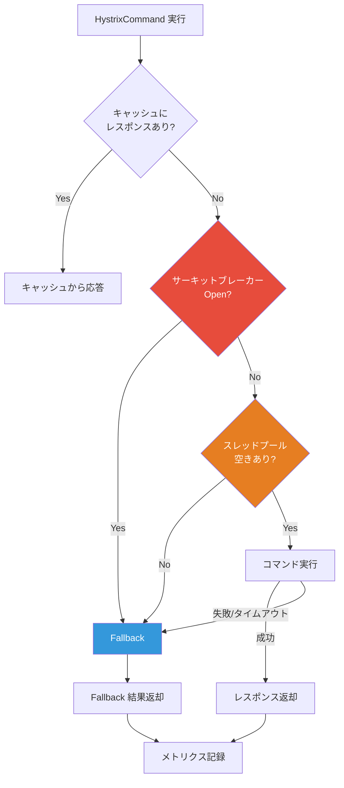
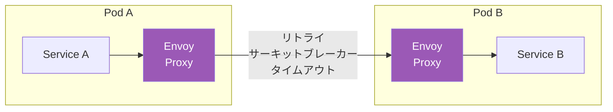

# サーキットブレーカーとリトライ戦略

## 1. はじめに：分散システムにおける障害の連鎖

分散システムは、複数のサービスがネットワークを介して協調動作することで成り立っている。マイクロサービスアーキテクチャの普及により、1つのユーザーリクエストが数十から数百のサービス呼び出しを経由することも珍しくない。この構造は柔軟なスケーリングと独立したデプロイを可能にする一方で、**障害の連鎖（Cascading Failure）** という深刻なリスクを内包している。

あるサービスがレスポンスを返さなくなったとする。そのサービスを呼び出している上流のサービスは、タイムアウトまで待機し続ける。待機中のリクエストはスレッドやコネクションを占有し、リソースが枯渇すると上流サービス自身も応答できなくなる。この障害がさらに上流に伝播し、最終的にはシステム全体が停止する。2012年のAmazon Web Servicesの大規模障害や、2016年のNetflixで発生したインシデントなど、カスケード障害は現実の分散システムにおいて繰り返し発生してきた問題である。



この問題に対する根本的な対策が、本記事で解説する**レジリエンスパターン（Resilience Patterns）** である。サーキットブレーカー、リトライ戦略、バルクヘッド、タイムアウト、フォールバックといったパターンは、障害が発生した際にその影響範囲を局所化し、システム全体の安定性を維持するための設計手法である。

これらのパターンは、Michael Nygardの著書『Release It!』（2007年）で体系的に紹介され、その後Netflixの Hystrix ライブラリによって広く知られるようになった。本記事では、各パターンの原理と設計上の判断基準を詳述し、主要なライブラリやサービスメッシュによる実装を比較する。

## 2. サーキットブレーカーパターン

### 2.1 電気回路のアナロジー

サーキットブレーカーという名称は、電気回路に用いられる遮断器に由来する。家庭の分電盤にある遮断器は、過電流が流れたときに自動的に回路を遮断し、配線の過熱や火災を防ぐ。同様に、ソフトウェアにおけるサーキットブレーカーは、下流サービスへの呼び出しが連続して失敗した場合に、それ以上の呼び出しを遮断する。これにより、障害を起こしているサービスに対する無駄なリクエストを止め、上流サービスのリソースを保護し、下流サービスに回復の猶予を与える。

### 2.2 3つの状態

サーキットブレーカーは以下の3つの状態を持つ有限状態マシン（FSM）としてモデル化される。



**Closed（閉じた状態）**

通常の動作状態である。すべてのリクエストは下流サービスに転送される。サーキットブレーカーはこの間、リクエストの成功・失敗を継続的に監視し、失敗率を計算している。失敗率が事前に定義された閾値を超えると、状態は Open に遷移する。

**Open（開いた状態）**

回路が「切断」された状態である。下流サービスへのリクエストは一切送信されず、即座にエラー（あるいはフォールバック応答）が返される。これにより、障害を起こしているサービスに対する負荷を完全に排除し、上流サービスのリソース（スレッド、コネクション、メモリ）を保護する。Open 状態は一定のタイムアウト期間（sleep window）が経過するまで維持される。

**Half-Open（半開き状態）**

回復の可能性を探る状態である。Open 状態のタイムアウト期間が経過すると、サーキットブレーカーは限定的な数のリクエスト（プローブリクエスト）を下流サービスに送信する。このリクエストが成功すれば、下流サービスが回復したとみなし、状態を Closed に戻す。失敗すれば、まだ回復していないと判断し、再び Open 状態に戻る。

### 2.3 状態遷移の条件設計

サーキットブレーカーの有効性は、状態遷移の条件をどのように設計するかに大きく依存する。ここでは主要なパラメータについて解説する。

#### 失敗率の閾値（Failure Rate Threshold）

Closed から Open への遷移を決定する最も基本的なパラメータである。一般的には 50% から 80% の範囲で設定される。閾値が低すぎると、一時的なネットワークジッタなどで不必要にブレーカーがトリップし（false positive）、閾値が高すぎると、障害の検出が遅れる。

#### スライディングウィンドウ

失敗率を計算するためのウィンドウには、大きく2つの方式がある。

**カウントベースのスライディングウィンドウ（Count-based Sliding Window）**

直近の N 回のリクエスト結果に基づいて失敗率を計算する。例えば、ウィンドウサイズが 100 であれば、直近 100 回のリクエストのうち何回が失敗したかで失敗率を算出する。リクエストのレートに依存しない（低トラフィック時でも N 回蓄積されればトリップする）という性質を持つ。

**時間ベースのスライディングウィンドウ（Time-based Sliding Window）**

直近 T 秒間のリクエスト結果に基づいて失敗率を計算する。例えば、ウィンドウが 60 秒であれば、過去 60 秒間のリクエスト結果を使用する。トラフィックのレートを自然に反映できるが、低トラフィック時に少数の失敗でブレーカーがトリップする可能性がある。このため、**最小リクエスト数（minimum number of calls）** を併用し、一定数のリクエストが蓄積されるまではブレーカーがトリップしないようにすることが推奨される。

#### スロー呼び出し率の閾値（Slow Call Rate Threshold）

失敗（例外やエラーレスポンス）だけでなく、**レスポンスが遅いリクエスト** も障害の兆候として扱う。レスポンスタイムが指定した閾値を超えた呼び出しをスロー呼び出しとみなし、スロー呼び出し率が閾値を超えた場合にもブレーカーをトリップさせる。これにより、サービスが完全に停止する前の「劣化」状態を検出できる。

#### Open 状態の持続時間（Wait Duration in Open State）

Open 状態を維持する時間である。短すぎると頻繁に Half-Open に遷移して不安定になり、長すぎると下流サービスが回復しても利用再開が遅れる。一般的には 30 秒から 60 秒が出発点として推奨されるが、下流サービスの回復特性に応じて調整が必要である。

#### Half-Open 状態の許可リクエスト数

Half-Open 状態で下流サービスに送信するプローブリクエストの数である。1 回だけでは偶発的な成功・失敗に左右されるため、複数回（例えば 3〜10 回）のプローブを送信し、その成功率に基づいて状態遷移を判定する設計が堅牢である。

### 2.4 設計上の考慮事項

**何を「失敗」とみなすか**

HTTP の 5xx エラーは明確な失敗であるが、4xx エラー（クライアント側のエラー）は通常、下流サービスの障害ではないためカウントすべきではない。タイムアウト、コネクション拒否、DNS 解決失敗なども失敗としてカウントする。ビジネスロジック上のエラー（例えば「在庫なし」）は通常カウントしない。この分類の正しさが、サーキットブレーカーの有効性を左右する。

**サーキットブレーカーの粒度**

サーキットブレーカーは、呼び出し先のサービス単位で設定するのが基本であるが、同一サービス内のエンドポイント単位、あるいはインスタンス単位で設定することもある。粒度が粗すぎると、特定のエンドポイントの障害でサービス全体への呼び出しが遮断される。粒度が細かすぎると、管理が煩雑になり、統計的に有意な失敗率を計算するために必要なサンプル数が不足する。

**イベント通知**

サーキットブレーカーの状態遷移は重要な運用イベントであり、モニタリングシステムに通知すべきである。Open への遷移はアラートとして扱い、Closed への復帰も記録する。これにより、システムの健全性を継続的に監視できる。

## 3. リトライ戦略

### 3.1 リトライの基本原理

一時的な障害（transient fault）に対しては、しばらく時間をおいて再試行することで成功する可能性がある。ネットワークの一時的な輻輳、サービスの一時的な過負荷、データベースのデッドロックなどがその典型的な例である。リトライはこうした一時的障害に対する最もシンプルで効果的な対策であるが、**誤った実装は障害を悪化させる**。

リトライの最大の危険性は、**リトライストーム（retry storm）** を引き起こすことである。下流サービスが過負荷で応答できなくなっているときに、上流の全クライアントがリトライを行うと、下流への負荷はさらに増大し、回復がますます遠のく。これを防ぐために、リトライ戦略の設計には細心の注意が必要である。

### 3.2 リトライ間隔の戦略

#### 固定間隔（Fixed Interval）

リトライのたびに一定の間隔（例えば 1 秒）で再試行する。実装は最もシンプルであるが、すべてのクライアントが同じタイミングでリトライするため、下流サービスに周期的な負荷のスパイクを生じさせやすい。

```
Retry 1: wait 1s → request
Retry 2: wait 1s → request
Retry 3: wait 1s → request
```

#### 指数バックオフ（Exponential Backoff）

リトライ回数が増えるごとに待機時間を指数関数的に増大させる。基本的な計算式は以下のとおりである。

$$
\text{wait\_time} = \text{base} \times 2^{n}
$$

ここで $n$ はリトライ回数（0始まり）、$\text{base}$ は初回の待機時間である。例えば base が 1 秒の場合、待機時間は 1s → 2s → 4s → 8s → ... と増加する。上限値（max backoff）を設定し、無制限に増大しないようにする。

```
Retry 1: wait 1s  → request
Retry 2: wait 2s  → request
Retry 3: wait 4s  → request
Retry 4: wait 8s  → request
Retry 5: wait 16s → request (capped at max)
```

指数バックオフは固定間隔よりも下流サービスへの負荷を軽減するが、すべてのクライアントが同じ指数関数に従ってリトライするため、リトライのタイミングが集中する問題（thundering herd）は依然として残る。

#### Jitter（ランダム化）

指数バックオフに**ランダムなゆらぎ**を加えることで、リトライのタイミングを分散させる。AWS が公式ブログで推奨している手法であり、以下のバリエーションがある。

**Full Jitter**

$$
\text{wait\_time} = \text{random}(0, \text{base} \times 2^{n})
$$

待機時間を 0 からバックオフ上限までの一様乱数とする。リトライの分散効果が最も高い。

**Equal Jitter**

$$
\text{wait\_time} = \frac{\text{base} \times 2^{n}}{2} + \text{random}\left(0, \frac{\text{base} \times 2^{n}}{2}\right)
$$

バックオフの半分を固定し、残り半分をランダム化する。最低限の待機時間を保証しつつ、分散も行う。

**Decorrelated Jitter**

$$
\text{wait\_time} = \min(\text{cap}, \text{random}(\text{base}, \text{prev\_wait} \times 3))
$$

前回の待機時間を基準にランダム化する。AWSの分析によると、Full Jitter と同等の分散効果を持つとされる。



### 3.3 リトライの実装上の注意点

**最大リトライ回数**

リトライは無限に続けるべきではない。最大リトライ回数を設定し、それを超えた場合はエラーとして処理するか、フォールバックに移行する。

**冪等性（Idempotency）の確保**

リトライを安全に行うためには、操作が冪等であることが前提となる。GET リクエストは通常冪等であるが、POST や PUT リクエストは冪等性が保証されない場合がある。非冪等な操作をリトライすると、二重処理（例えば二重課金）が発生する危険がある。冪等性キー（idempotency key）をリクエストに付与し、サーバー側で重複検出を行うことが推奨される。

**リトライ可能なエラーの判別**

すべてのエラーがリトライによって回復するわけではない。HTTP 503（Service Unavailable）や 429（Too Many Requests）、あるいはネットワークタイムアウトは一時的障害の可能性が高く、リトライの対象となる。一方、HTTP 400（Bad Request）や 401（Unauthorized）はリトライしても結果は変わらない。リトライ対象のエラーを明確に定義し、それ以外はリトライせずに即座にエラーを返すべきである。

**リトライ予算（Retry Budget）**

Google の SRE プラクティスで提唱された概念であり、リトライを許可する比率を全体のリクエスト量に対する割合で制限する。例えば「リトライはリクエスト総数の 10% 以内」と設定することで、リトライストームの発生を構造的に防止する。

### 3.4 サーキットブレーカーとリトライの組み合わせ

サーキットブレーカーとリトライは相補的なパターンであり、組み合わせて使用することが一般的である。重要なのは、**リトライの外側にサーキットブレーカーを配置する** ことである。

```
Client → CircuitBreaker → Retry → Service
```

この順序により、サーキットブレーカーが Open の場合はリトライ自体が行われず、リトライによる負荷増大を防止できる。逆にリトライの内側にサーキットブレーカーを配置すると、サーキットブレーカーが Open になっても外側のリトライが試行を続けるため、意図した保護効果が得られない。

## 4. Bulkhead パターン（リソース分離）

### 4.1 船舶の隔壁からの着想

Bulkhead（バルクヘッド）という名称は、船舶の**隔壁**に由来する。船体が浸水した場合でも、隔壁で区切られた区画のみが浸水し、他の区画は影響を受けない。この原理をソフトウェアに適用したのが Bulkhead パターンである。

### 4.2 ソフトウェアにおけるリソース分離

分散システムにおいて、あるサービスへの呼び出しが遅延した場合、そのリクエストが占有するスレッドやコネクションが、他のサービスへの呼び出しに使えなくなる。Bulkhead パターンは、呼び出し先ごとにリソースプールを分離し、1つのサービスの障害が他のサービスへのアクセスに影響しないようにする。



#### スレッドプール分離

呼び出し先ごとに専用のスレッドプールを割り当てる方式である。Service B への呼び出しが全スレッドを消費しても、Service C や Service D 用のスレッドプールは影響を受けない。Netflix の Hystrix が採用した方式であり、最も強力な分離を提供する。ただし、スレッドの生成とコンテキストスイッチにオーバーヘッドが伴う。

#### セマフォ分離

同時実行数をセマフォ（カウンティングセマフォ）で制限する方式である。スレッドプール分離に比べてオーバーヘッドが小さいが、タイムアウトによる強制中断ができないため、下流サービスの応答を待ち続ける可能性がある。呼び出しのレイテンシが予測可能な場合に適している。

### 4.3 Bulkhead のサイジング

各プールのサイズ設定は重要な設計判断である。小さすぎるとスループットが制限され、大きすぎると分離の効果が薄れる。リトルの法則（Little's Law）を基にした計算が参考になる。

$$
L = \lambda \times W
$$

ここで $L$ は同時並行リクエスト数、$\lambda$ はリクエスト到着率（RPS）、$W$ は平均処理時間である。例えば、Service B への RPS が 100、平均レスポンスタイムが 200ms であれば、必要な同時並行数は $100 \times 0.2 = 20$ である。これにマージン（例えば 50%）を加えた 30 をプールサイズとする。

## 5. Timeout パターン

### 5.1 タイムアウトの重要性

分散システムにおいて、レスポンスを無期限に待ち続けることは許容されない。タイムアウトは、一定時間内に応答が得られない場合にリクエストを打ち切り、リソースを解放するための基本的なメカニズムである。タイムアウトが設定されていないと、ネットワークの断絶やサービスのハングアップが発生した際に、スレッドやコネクションが永久に占有される。

### 5.2 タイムアウトの種類

**コネクションタイムアウト**

TCP コネクションの確立（3ウェイハンドシェイク）に対するタイムアウトである。通常は短く設定する（1〜5 秒）。コネクションが確立できない場合、サービスが停止しているか、ネットワークに問題がある可能性が高い。

**リクエストタイムアウト（読み取りタイムアウト）**

リクエスト送信後、レスポンスを受信するまでのタイムアウトである。サービスの処理特性に応じて設定する。一般的なAPIであれば 5〜30 秒程度が妥当であるが、バッチ処理やレポート生成のような長時間処理では、より長い値を設定する場合もある。

**エンドツーエンドタイムアウト**

リトライを含めた全体のタイムアウトである。例えば、リクエストタイムアウトが 5 秒で最大 3 回リトライする場合、最悪ケースでは 15 秒以上かかる。エンドツーエンドタイムアウトを設定することで、リトライも含めた全体の処理時間に上限を設ける。

### 5.3 タイムアウトの設定指針

タイムアウト値の設定は、対象サービスの**レスポンスタイム分布**に基づいて行うべきである。p99（99パーセンタイル）のレスポンスタイムを基準とし、それにマージンを加えた値を使用することが推奨される。例えば、p99 が 500ms であれば、タイムアウトを 1〜2 秒に設定する。

::: warning タイムアウトに関する注意
タイムアウトを短く設定しすぎると、正常な処理中のリクエストまで打ち切ってしまう。また、多段の呼び出しがある場合は、上流のタイムアウトが下流のタイムアウトよりも大きくなるようにする必要がある。上流のタイムアウトが下流より短いと、下流で処理が完了してもその結果が使われないという無駄が生じる。
:::

## 6. Fallback 戦略

### 6.1 フォールバックとは

サーキットブレーカーが Open 状態になった場合や、リトライが最大回数に達した場合、あるいはタイムアウトが発生した場合に、代替の応答を返す仕組みがフォールバックである。ユーザー体験の劣化を最小限に抑えることが目的であり、「障害が発生してもシステムが何らかの価値を提供し続ける」という**Graceful Degradation（優雅な機能低下）** の実現手段である。

### 6.2 フォールバックの戦略

**キャッシュからの応答**

直近の正常なレスポンスをキャッシュしておき、障害時にはキャッシュされたデータを返す。レコメンデーションサービスの障害時に、前回のレコメンド結果を表示する、といった使い方が典型的である。データの鮮度は犠牲になるが、何も表示しないよりは遥かに良いユーザー体験を提供できる。

**デフォルト値の返却**

事前に定義されたデフォルト値を返す。設定サービスが応答しない場合にハードコードされたデフォルト設定を使用する、価格サービスが応答しない場合に最終取得価格を返す、といった例がある。

**代替サービスへのルーティング**

プライマリサービスが応答しない場合に、セカンダリサービスに切り替える。例えば、メインの決済プロバイダが障害の際にバックアップのプロバイダを使用する。

**機能の縮退**

一部の機能を無効化し、コア機能のみを提供する。ECサイトにおいて、レコメンデーションサービスが障害を起こした場合に、レコメンド欄を非表示にして商品一覧と決済機能だけを維持する、といった例がある。

**エラーレスポンスの返却**

最もシンプルなフォールバックである。適切なエラーメッセージとともに、ユーザーに障害の発生を通知する。他のフォールバック手段が適切でない場合の最終手段として使用する。



### 6.3 フォールバックの注意点

フォールバック自体が外部サービスに依存する場合（例えば代替サービスへのルーティング）、そのフォールバック先も障害を起こす可能性がある。フォールバックの連鎖は避け、最終的なフォールバックはローカルで完結する処理（キャッシュ、デフォルト値、機能縮退）にすべきである。また、フォールバックが常態化すると、根本的な障害の解決が遅れるリスクがある。フォールバックの発動はアラートとして検知し、迅速に根本原因を調査する体制が必要である。

## 7. Hystrix の設計思想と歴史的意義

### 7.1 Hystrix の誕生

Netflix は 2011 年頃、マイクロサービスアーキテクチャへの移行を加速させていた。数百のマイクロサービスが複雑な依存関係のネットワークを形成する中、あるサービスの障害がシステム全体を不安定にするカスケード障害が頻発した。この問題に対処するために開発されたのが **Hystrix** であり、2012 年にオープンソースとして公開された。

Hystrix の設計は以下の原則に基づいていた。

1. **サードパーティクライアントライブラリからの保護**: 外部サービスやライブラリの障害が、アプリケーション全体に影響しないようにする
2. **レイテンシと障害からの防御**: 高レイテンシや障害を起こしているサービスへの依存を速やかに遮断する
3. **迅速な失敗と回復**: 障害を素早く検出し、フォールバックに切り替え、回復時には自動的に通常運用に戻す
4. **リアルタイムモニタリング**: サーキットブレーカーの状態、リクエストの成功率、レイテンシなどをリアルタイムに可視化する

### 7.2 Hystrix のアーキテクチャ

Hystrix は各コマンドの実行を以下のフローで処理した。



Hystrix の特筆すべき点は、サーキットブレーカー、Bulkhead（スレッドプール分離）、タイムアウト、フォールバック、メトリクス収集を**単一のコマンドパターン**に統合したことである。開発者は `HystrixCommand` を継承したクラスに `run()` と `getFallback()` を実装するだけで、これらすべての保護が自動的に適用された。

### 7.3 Hystrix のメンテナンスモードと後継

2018 年 11 月、Netflix は Hystrix をメンテナンスモードに移行することを発表した。新機能の追加は停止され、バグ修正のみが行われる状態となった。その理由として以下が挙げられた。

- リアクティブプログラミング（RxJava ベース）の採用が進み、非同期処理が標準化された
- Resilience4j など、より軽量で関数型プログラミングに適した代替ライブラリが登場した
- サービスメッシュ（Istio/Envoy）によるインフラストラクチャレベルでの障害処理が普及した

Hystrix の歴史的意義は、レジリエンスパターンを体系化し、実用的なライブラリとして提供したことにある。その設計思想は後継のライブラリやフレームワークに引き継がれている。

## 8. ライブラリの比較：Resilience4j, Polly, go-resiliency

### 8.1 Resilience4j（Java）

Resilience4j は Hystrix の精神的後継として開発された、Java 向けの軽量なレジリエンスライブラリである。Hystrix が RxJava に依存していたのに対し、Resilience4j は **Java 8 の関数インターフェースと CompletableFuture** をベースに設計されている。

**主な特徴**

- **モジュラー設計**: サーキットブレーカー、リトライ、レートリミッター、バルクヘッド、タイムリミッターがそれぞれ独立したモジュールとして提供される
- **デコレーターパターン**: 関数やラムダ式をデコレートする形で適用する
- **スライディングウィンドウ**: カウントベースと時間ベースの両方をサポート
- **メトリクス統合**: Micrometer を通じて Prometheus, Datadog 等と連携

```java
// Create a circuit breaker with custom configuration
CircuitBreakerConfig config = CircuitBreakerConfig.custom()
    .failureRateThreshold(50)                    // trip at 50% failure rate
    .waitDurationInOpenState(Duration.ofSeconds(30))
    .slidingWindowType(SlidingWindowType.COUNT_BASED)
    .slidingWindowSize(100)
    .minimumNumberOfCalls(10)
    .slowCallRateThreshold(80)
    .slowCallDurationThreshold(Duration.ofSeconds(2))
    .permittedNumberOfCallsInHalfOpenState(5)
    .build();

CircuitBreaker circuitBreaker = CircuitBreaker.of("backendService", config);

// Decorate a function with circuit breaker
Supplier<String> decoratedSupplier = CircuitBreaker
    .decorateSupplier(circuitBreaker, () -> backendService.call());

// Execute with fallback
String result = Try.ofSupplier(decoratedSupplier)
    .recover(throwable -> "fallback response")
    .get();
```

### 8.2 Polly（.NET）

Polly は .NET エコシステムにおけるレジリエンスライブラリのデファクトスタンダードである。.NET Foundation プロジェクトとして管理され、Microsoft の公式ドキュメントでも推奨されている。

**主な特徴**

- **ポリシーベースの設計**: 各レジリエンスパターンを「ポリシー」として定義し、組み合わせて使用する
- **PolicyWrap**: 複数のポリシーを順序付けて合成できる
- **Reactive / Proactive ポリシー**: 障害に対する反応型（リトライ、サーキットブレーカー）と、事前防御型（タイムアウト、バルクヘッド）の両方をサポート
- **Polly V8（2023年リリース）**: `ResiliencePipeline` による新しい API を導入し、パフォーマンスとユーザビリティを改善

```csharp
// Define a resilience pipeline with circuit breaker and retry
var pipeline = new ResiliencePipelineBuilder()
    .AddCircuitBreaker(new CircuitBreakerStrategyOptions
    {
        FailureRatio = 0.5,
        SamplingDuration = TimeSpan.FromSeconds(10),
        MinimumThroughput = 10,
        BreakDuration = TimeSpan.FromSeconds(30)
    })
    .AddRetry(new RetryStrategyOptions
    {
        MaxRetryAttempts = 3,
        BackoffType = DelayBackoffType.Exponential,
        UseJitter = true
    })
    .AddTimeout(TimeSpan.FromSeconds(5))
    .Build();

// Execute with the pipeline
var result = await pipeline.ExecuteAsync(
    async ct => await httpClient.GetAsync("/api/data", ct));
```

### 8.3 go-resiliency / sony/gobreaker（Go）

Go エコシステムでは、`sony/gobreaker` と `eapache/go-resiliency` が代表的なライブラリである。Go の設計哲学に沿った、シンプルで組み合わせやすいインターフェースを提供する。

**sony/gobreaker の特徴**

- 3 状態のサーキットブレーカーを忠実に実装
- カスタマイズ可能な `ReadyToTrip` 関数で遷移条件を柔軟に定義
- Two-Step 実行モードで手動制御が可能

```go
// Configure the circuit breaker
cb := gobreaker.NewCircuitBreaker[[]byte](gobreaker.Settings{
    Name:        "backend-service",
    MaxRequests: 3,  // allowed requests in half-open state
    Interval:    60 * time.Second, // cyclic period for clearing counts in closed state
    Timeout:     30 * time.Second, // timeout for open state
    ReadyToTrip: func(counts gobreaker.Counts) bool {
        // Trip when failure ratio exceeds 60%
        failureRatio := float64(counts.TotalFailures) / float64(counts.Requests)
        return counts.Requests >= 10 && failureRatio >= 0.6
    },
    OnStateChange: func(name string, from, to gobreaker.State) {
        log.Printf("circuit breaker %s: %s -> %s", name, from, to)
    },
})

// Execute with circuit breaker
body, err := cb.Execute(func() ([]byte, error) {
    resp, err := http.Get("https://api.example.com/data")
    if err != nil {
        return nil, err
    }
    defer resp.Body.Close()
    return io.ReadAll(resp.Body)
})
```

### 8.4 ライブラリ比較表

| 特性 | Resilience4j | Polly (V8) | sony/gobreaker |
|------|-------------|------------|----------------|
| **言語** | Java | .NET | Go |
| **サーキットブレーカー** | カウント/時間ベース | サンプリング期間ベース | カウントベース |
| **リトライ** | 指数バックオフ + Jitter | 指数バックオフ + Jitter | 別ライブラリ |
| **バルクヘッド** | セマフォ | 同時実行制限 | 別ライブラリ |
| **タイムアウト** | 専用モジュール | 専用ポリシー | context.WithTimeout |
| **フォールバック** | デコレーター | ポリシー | 手動実装 |
| **メトリクス** | Micrometer連携 | テレメトリ連携 | コールバック |
| **合成（組み合わせ）** | デコレーターチェーン | ResiliencePipeline | 手動合成 |

## 9. サービスメッシュによる実装：Istio / Envoy

### 9.1 アプリケーションレベル vs インフラストラクチャレベル

これまで解説してきたレジリエンスパターンは、アプリケーションコード内にライブラリとして組み込む方式であった。しかし、マイクロサービスが多言語で実装されている環境では、各言語ごとにライブラリを選定・実装・保守する必要がある。サービスメッシュは、この問題をインフラストラクチャレベルで解決する。

### 9.2 サイドカープロキシモデル

Istio / Envoy のサービスメッシュでは、各サービスのポッドに**サイドカープロキシ**（Envoy）がデプロイされ、すべてのインバウンド・アウトバウンドのトラフィックがこのプロキシを経由する。レジリエンスパターンはプロキシ上で実装されるため、アプリケーションコードを変更することなく、サーキットブレーカー、リトライ、タイムアウトなどを適用できる。



### 9.3 Istio のリトライ設定

Istio では、VirtualService リソースを用いてリトライポリシーを宣言的に設定する。

```yaml
apiVersion: networking.istio.io/v1beta1
kind: VirtualService
metadata:
  name: backend-service
spec:
  hosts:
    - backend-service
  http:
    - route:
        - destination:
            host: backend-service
      retries:
        attempts: 3
        perTryTimeout: 2s
        retryOn: "5xx,reset,connect-failure,retriable-4xx"
      timeout: 10s
```

`retryOn` フィールドで、リトライ対象のエラー条件を細かく指定できる。Envoy がサポートするリトライ条件には、`5xx`（サーバーエラー）、`reset`（コネクションリセット）、`connect-failure`（接続失敗）、`retriable-4xx`（リトライ可能な 4xx エラー）などがある。

### 9.4 Envoy のサーキットブレーカー（Outlier Detection）

Envoy のサーキットブレーカーは **Outlier Detection（外れ値検出）** として実装されている。これは個々のホスト（エンドポイント）レベルで障害を検出し、異常なホストをロードバランシングプールから一時的に除外する方式である。

```yaml
apiVersion: networking.istio.io/v1beta1
kind: DestinationRule
metadata:
  name: backend-service
spec:
  host: backend-service
  trafficPolicy:
    connectionPool:
      tcp:
        maxConnections: 100
      http:
        h2UpgradePolicy: DEFAULT
        http1MaxPendingRequests: 100
        http2MaxRequests: 1000
        maxRequestsPerConnection: 10
    outlierDetection:
      consecutive5xxErrors: 5
      interval: 10s
      baseEjectionTime: 30s
      maxEjectionPercent: 50
```

`connectionPool` はバルクヘッドに相当し、コネクション数と同時リクエスト数を制限する。`outlierDetection` はサーキットブレーカーに相当し、連続 5xx エラーが閾値を超えたホストをプールから除外する。

### 9.5 アプリケーションレベルとの使い分け

サービスメッシュによるレジリエンスは、アプリケーションコードを変更せずに適用できる点で優れているが、以下の限界がある。

- **ビジネスロジックに基づくフォールバック**: キャッシュからの代替応答や機能縮退は、アプリケーションレベルでしか実装できない
- **細粒度の制御**: エンドポイント単位やパラメータ単位の制御は、サービスメッシュだけでは難しい場合がある
- **非 HTTP プロトコル**: gRPC は Envoy がネイティブサポートしているが、独自プロトコルやメッセージキューとの通信には対応しない

実践的には、サービスメッシュで基本的なリトライ・タイムアウト・サーキットブレーカーを設定し、ビジネスロジックに密結合したフォールバックやカスタムリトライ条件はアプリケーションレベルで実装する、という**二層の防御**が推奨される。

## 10. レジリエンスパターンの統合設計

### 10.1 パターンの組み合わせ

レジリエンスパターンは単独で使用するよりも、複数を組み合わせて使用することで効果を発揮する。以下は推奨される構成である。


この構成では、外側からの適用順序と各パターンの役割は以下のとおりである。

1. **Timeout（最外層）**: リクエスト全体の処理時間に上限を設定する
2. **Circuit Breaker**: 障害が連続している場合にリクエストを即座に遮断する
3. **Bulkhead**: リソースの分離により、1つの障害が他に影響しないようにする
4. **Retry + Jitter（最内層）**: 一時的な障害に対してリトライを行う
5. **Fallback**: 上記すべてが失敗した場合の代替応答を提供する

### 10.2 設計原則のまとめ

**Fail Fast 原則**

障害を可能な限り早く検出し、即座にフォールバックに切り替える。長時間待機してから失敗するのは最悪のパターンである。

**リソースの保護**

スレッド、コネクション、メモリなどの有限リソースを、障害を起こしているサービスから保護する。Bulkhead とタイムアウトが主要な手段である。

**自動回復**

障害が解消した後は、人手を介さずに自動的に通常の動作に復帰する。サーキットブレーカーの Half-Open 状態がこれを実現する。

**可観測性**

すべてのレジリエンスパターンの状態と発動回数をメトリクスとして公開し、ダッシュボードとアラートで監視する。問題の検出と根本原因の分析に不可欠である。

**段階的な劣化**

システムは「全機能」か「完全停止」かの二択ではなく、障害の程度に応じて段階的に機能を縮小しながら、コア機能を維持すべきである。

## 11. 実践的な考慮事項

### 11.1 テストの戦略

レジリエンスパターンは障害時にのみ発動するため、通常のテストでは検証が困難である。以下のテスト手法を組み合わせて、パターンが正しく機能することを確認する。

- **ユニットテスト**: サーキットブレーカーの状態遷移、リトライのバックオフ計算をテストする
- **統合テスト**: 障害をシミュレートし（例えば WireMock で遅延やエラーを注入）、フォールバックが正しく動作することを確認する
- **カオスエンジニアリング**: 本番環境に近い環境で、実際のサービスに障害を注入し（Netflix の Chaos Monkey、AWS Fault Injection Simulator、Litmus Chaos）、システム全体のレジリエンスを検証する

### 11.2 設定値のチューニング

レジリエンスパターンのパラメータは、一度設定して終わりではない。トラフィックパターン、サービスの特性、インフラストラクチャの変化に応じて継続的にチューニングする必要がある。

- **メトリクスに基づく調整**: サーキットブレーカーのトリップ頻度、リトライの成功率、タイムアウトの発生率を定期的にレビューする
- **負荷テスト**: 平常時と高負荷時の両方でパラメータの妥当性を確認する
- **段階的なロールアウト**: パラメータの変更はカナリアリリースと同様に、段階的に適用する

### 11.3 分散トレーシングとの統合

サーキットブレーカーやリトライの動作を理解するためには、分散トレーシング（OpenTelemetry）との統合が重要である。リトライされたリクエスト、サーキットブレーカーによって遮断されたリクエスト、フォールバックが発動したリクエストをトレースに含めることで、障害発生時のリクエストフローを正確に把握できる。

### 11.4 アンチパターン

**リトライの無限ループ**

サーキットブレーカーなしでリトライだけを実装すると、永続的な障害に対してリトライが延々と繰り返される。リトライの最大回数の設定と、サーキットブレーカーとの組み合わせが必須である。

**同期的なリトライによるスレッド枯渇**

同期的にリトライを待機すると、その間スレッドが占有される。非同期リトライ（async/await やリアクティブストリーム）を使用することで、スレッドリソースの消費を抑制できる。

**過度なフォールバックの連鎖**

フォールバック先がさらにフォールバック先を持ち、連鎖が深くなると、障害発生時の動作が予測困難になる。フォールバックは1段階、最大でも2段階に留める。

**レジリエンスパターンの盲目的な適用**

すべてのサービス呼び出しにレジリエンスパターンを適用する必要はない。障害が許容されるバックグラウンド処理、あるいは呼び出し先が自社で完全に管理しているローカルサービスなど、パターンの適用が過剰な場合もある。コストと効果を見極めた上で適用する。

## 12. まとめ

分散システムにおいてサービス間の障害は避けられない事実であり、問題は「障害が発生するかどうか」ではなく「障害が発生したときにどう振る舞うか」である。

サーキットブレーカーは、障害を検出して呼び出しを遮断し、障害の連鎖を防止する。リトライ戦略は、一時的な障害からの自動回復を実現する。Bulkhead はリソースを分離し、障害の影響範囲を局所化する。タイムアウトはリソースの際限ない消費を防ぎ、フォールバックはユーザー体験の劣化を最小化する。

これらのパターンは、個別に使用するよりも組み合わせて使用することで真価を発揮する。アプリケーションレベルのライブラリ（Resilience4j, Polly, gobreaker）とインフラストラクチャレベルのサービスメッシュ（Istio/Envoy）を組み合わせた二層防御が、現代の分散システムにおけるベストプラクティスである。

Hystrix がレジリエンスパターンを体系化して以降、これらの概念は分散システム設計の基本的な語彙として定着した。現代のエンジニアにとって、これらのパターンの原理と適用方法を理解することは、信頼性の高い分散システムを構築する上で必須の素養である。重要なのは、パターンを機械的に適用するのではなく、システムの特性・障害の性質・ビジネス要件を理解した上で、適切なパラメータと組み合わせを選択することである。
