# クリーンアーキテクチャ

## 歴史的背景 — なぜ Clean Architecture が生まれたか

ソフトウェア開発の歴史において、アプリケーションの構造をどのように設計するかは常に中心的な課題であった。1960年代の構造化プログラミングから始まり、1990年代のオブジェクト指向設計を経て、2000年代以降にはアーキテクチャレベルでの設計パターンが多数提唱されてきた。Clean Architecture は、こうした長年にわたるアーキテクチャ設計の知見を統合し、体系化したものである。

### 先行するアーキテクチャパターン

Clean Architecture を理解するには、それに先行するいくつかの重要なアーキテクチャパターンを知る必要がある。

**Hexagonal Architecture（六角形アーキテクチャ、2005年）**

Alistair Cockburn が提唱した Hexagonal Architecture（別名 Ports and Adapters）は、アプリケーションのコアロジックを外部の技術的関心事から分離するという思想を明確に打ち出した最初のアーキテクチャの一つである。このアーキテクチャでは、アプリケーションの中心にビジネスロジックが存在し、外部とのやり取りはすべて「ポート」と「アダプター」を介して行われる。データベースであれ、Webフレームワークであれ、メッセージキューであれ、すべてが交換可能な外部要素として扱われる。

**Onion Architecture（玉ねぎアーキテクチャ、2008年）**

Jeffrey Palermo が提唱した Onion Architecture は、Hexagonal Architecture の思想をさらに発展させ、依存関係の方向を明確にした同心円構造を導入した。中心に Domain Model を配置し、その周囲に Domain Services、Application Services、そして最外周にインフラストラクチャという層構造を持つ。依存関係は常に外側から内側へと向かい、内側の層は外側の層を知らない。

**その他の影響**

- **BCE（Boundary-Control-Entity）**: Ivar Jacobson が1992年に『Object-Oriented Software Engineering』で提唱したパターンで、ユースケース駆動の設計思想を体系化した。
- **DCI（Data-Context-Interaction）**: Trygve Reenskaug と James Coplien が提唱した、データとその振る舞いを分離するパターン。

### Robert C. Martin と Clean Architecture

Robert C. Martin（通称 Uncle Bob）は、2012年にブログ記事「The Clean Architecture」を発表し、2017年に書籍『Clean Architecture: A Craftsman's Guide to Software Structure and Design』を出版した。Martin は、上記の先行するアーキテクチャパターンがすべて共通の本質を持っていることに着目した。

::: tip 共通の本質
すべてのアーキテクチャに共通する目標は「関心の分離」であり、それを実現する手段は「ソフトウェアを層に分割し、依存関係の方向を制御する」ことである。
:::

Martin は、これらのパターンの共通する核心的な原則を抽出し、Clean Architecture として再定式化した。それは単なる新しいアーキテクチャパターンの提案ではなく、既存の優れた知見を統合した「メタアーキテクチャ」としての側面を持っている。

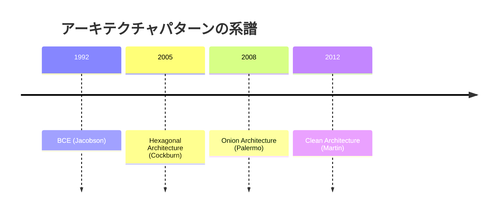

### なぜ生まれたのか

Clean Architecture が登場した背景には、実際のソフトウェア開発現場で繰り返し見られた問題がある。

1. **フレームワーク依存**: アプリケーションのビジネスロジックが特定のフレームワークに深く結合し、フレームワークの変更やバージョンアップが困難になる
2. **データベース依存**: ビジネスルールがSQLクエリやORMの詳細に埋め込まれ、データベースの変更が事実上不可能になる
3. **UIへの依存**: ビジネスロジックがプレゼンテーション層に漏出し、UIの変更がビジネスルールに影響を与える
4. **テスト困難**: 外部システムとの結合が強すぎて、単体テストの実行にデータベースやWebサーバーが必要になる

Clean Architecture は、これらの問題に対する体系的な解決策を提供する。その核心は、**ビジネスルールをソフトウェアの中心に据え、技術的な詳細をすべて外周に追いやる**という設計原則である。

## アーキテクチャの全体像 — 同心円モデル

Clean Architecture の最も象徴的な表現は、同心円構造のダイアグラムである。この図は、ソフトウェアを4つの主要な層に分割し、それぞれの責務と依存関係の方向を明確にする。

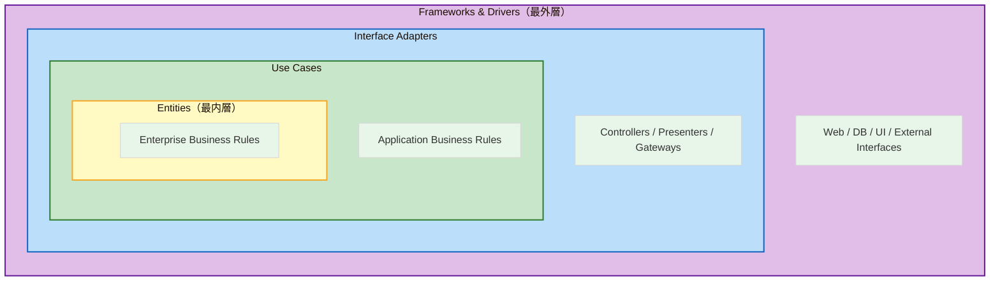

### 4つの層の概要

| 層 | 別名 | 主な責務 |
|---|---|---|
| **Entities** | Enterprise Business Rules | ビジネスの核心ルール。組織全体で共有される |
| **Use Cases** | Application Business Rules | アプリケーション固有のビジネスルール |
| **Interface Adapters** | Controllers, Presenters, Gateways | データ変換。内側と外側のフォーマットの橋渡し |
| **Frameworks & Drivers** | Web, DB, Devices | 技術的な詳細。フレームワークやライブラリ |

この構造の根底にある思想は単純明快である。**内側に行くほどポリシー（方針）のレベルが高く、外側に行くほどメカニズム（手段）のレベルが低い**。ビジネスルールは最も変わりにくい安定した要素であり、フレームワークやデータベースは技術の進歩によって変更される可能性が高い要素である。この安定度の違いに基づいて層を分離することで、変更の影響範囲を制御するのである。

## 依存性の規則（Dependency Rule）

Clean Architecture において最も重要な原則は **Dependency Rule（依存性の規則）** である。この規則は単純だが絶対的なルールとして定義される。

> **ソースコードの依存関係は、常に内側に向かわなければならない。内側の層は、外側の層について何も知ってはならない。**

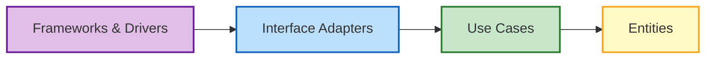

### 具体的に何が「依存」か

ここでいう「依存」とは、ソースコードレベルでの依存を意味する。具体的には以下のような関係を指す。

- `import` / `require` / `use` 文でのモジュール参照
- クラスの継承やインターフェースの実装
- 関数の呼び出し
- 型の参照
- 変数の型宣言

例えば、Use Case 層のコードが `import express from 'express'` のようにフレームワークを直接参照していれば、Dependency Rule に違反している。同様に、Entity が特定のデータベースの型を参照していれば、それも違反である。

### データの流れと依存の方向

ここで混乱しやすいのが、**データの流れ**と**依存の方向**は必ずしも一致しないという点である。

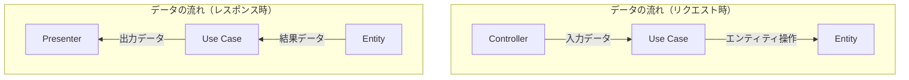

ユーザーからのリクエストは外側から内側へ流れるが、レスポンスは内側から外側へ流れる。データは両方向に流れるのに、依存関係は常に内向きでなければならない。この矛盾を解決するのが、次に説明する「依存性逆転の原則」である。

::: warning Dependency Rule の違反パターン
以下のようなコードは Dependency Rule に違反している。

- Entity 内での `@Entity()` （ORM固有のデコレータ）の使用
- Use Case 内での HTTP ステータスコードの参照
- Use Case 内での SQL クエリの直接記述
- Entity 内での JSON シリアライズの実装
:::

## 各層の詳細と責務

### Entities（Enterprise Business Rules）

Entities 層は、同心円モデルの最も内側に位置する層であり、**ビジネスの核心的なルール**をカプセル化する。ここでいう「エンティティ」とは、単なるデータ構造ではなく、**ビジネスに固有のルールを内包するオブジェクト**を指す。

Entities 層の特徴は以下のとおりである。

- 特定のアプリケーションに依存しない、組織全体で共有可能なビジネスルール
- 外部のいかなるものにも依存しない
- 最も変更されにくい層
- ビジネスの本質を表現する

::: details Entities 層の具体例
例えば、銀行システムにおける「利息計算のルール」は Entity に属する。このルールは、Webアプリケーションであろうとバッチ処理であろうと、どのアプリケーションでも同一である。一方、「振込手数料の免除条件」のようなアプリケーション固有のルールは Use Case 層に属する。
:::

```typescript
// Entity example: Loan
class Loan {
  private principal: number;
  private rate: number;
  private term: number;

  constructor(principal: number, rate: number, term: number) {
    // Business rule: validate loan parameters
    if (principal <= 0) throw new Error("Principal must be positive");
    if (rate < 0 || rate > 1) throw new Error("Rate must be between 0 and 1");
    if (term <= 0) throw new Error("Term must be positive");

    this.principal = principal;
    this.rate = rate;
    this.term = term;
  }

  // Core business rule: calculate monthly payment
  calculateMonthlyPayment(): number {
    const monthlyRate = this.rate / 12;
    const n = this.term * 12;
    return (
      (this.principal * monthlyRate * Math.pow(1 + monthlyRate, n)) /
      (Math.pow(1 + monthlyRate, n) - 1)
    );
  }

  // Core business rule: determine if loan is high risk
  isHighRisk(): boolean {
    return this.principal > 1_000_000 && this.rate > 0.08;
  }
}
```

このコードには、フレームワーク固有のアノテーション、データベースへの参照、HTTP関連の概念など、外部世界への依存が一切ない。純粋なビジネスルールのみが実装されている。

### Use Cases（Application Business Rules）

Use Cases 層は、**アプリケーション固有のビジネスルール**を実装する層である。この層は、Entity を操作してアプリケーションの目的を達成するための「シナリオ」を記述する。

Use Cases 層の責務は以下のとおりである。

- アプリケーション固有のビジネスルールの実装
- Entity の操作と協調
- 入出力データの定義（DTO: Data Transfer Object）
- ビジネスフロー（シナリオ）の制御

```typescript
// Use Case: Apply for a loan
// Input/Output boundaries
interface ApplyForLoanInput {
  applicantId: string;
  amount: number;
  rate: number;
  termYears: number;
}

interface ApplyForLoanOutput {
  loanId: string;
  monthlyPayment: number;
  approved: boolean;
  reason?: string;
}

// Port: repository interface defined in use case layer
interface LoanRepository {
  save(loan: Loan): Promise<string>;
  findByApplicantId(applicantId: string): Promise<Loan[]>;
}

// Port: credit check service interface
interface CreditCheckService {
  checkCredit(applicantId: string): Promise<{ score: number }>;
}

class ApplyForLoanUseCase {
  constructor(
    private loanRepository: LoanRepository,
    private creditCheckService: CreditCheckService
  ) {}

  async execute(input: ApplyForLoanInput): Promise<ApplyForLoanOutput> {
    // Application-specific business rule: credit check
    const credit = await this.creditCheckService.checkCredit(input.applicantId);

    // Application-specific rule: existing loan limit
    const existingLoans = await this.loanRepository.findByApplicantId(
      input.applicantId
    );
    if (existingLoans.length >= 3) {
      return {
        loanId: "",
        monthlyPayment: 0,
        approved: false,
        reason: "Maximum number of active loans reached",
      };
    }

    // Create entity (uses enterprise business rules)
    const loan = new Loan(input.amount, input.rate, input.termYears);

    // Application-specific rule: approval criteria
    const approved = credit.score >= 650 && !loan.isHighRisk();

    if (!approved) {
      return {
        loanId: "",
        monthlyPayment: loan.calculateMonthlyPayment(),
        approved: false,
        reason: "Credit score or risk level does not meet criteria",
      };
    }

    const loanId = await this.loanRepository.save(loan);

    return {
      loanId,
      monthlyPayment: loan.calculateMonthlyPayment(),
      approved: true,
    };
  }
}
```

ここで重要なのは、`LoanRepository` と `CreditCheckService` が **インターフェース** として定義されている点である。Use Case は具体的なデータベースやHTTPクライアントの実装を知らない。知っているのはインターフェースの契約だけである。この仕組みが Dependency Rule を守る鍵となる。

### Interface Adapters（Controllers, Presenters, Gateways）

Interface Adapters 層は、**外部世界と Use Case 層の間でデータのフォーマット変換を行う**層である。この層には Controller、Presenter、Gateway といった要素が含まれる。

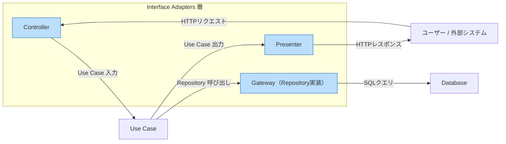

各要素の役割は以下のとおりである。

- **Controller**: 外部からの入力（HTTPリクエスト、CLIコマンドなど）を受け取り、Use Case が理解できるフォーマットに変換して Use Case を呼び出す
- **Presenter**: Use Case の出力を受け取り、外部への応答フォーマット（JSON、HTML など）に変換する
- **Gateway（Repository 実装）**: Use Case 層で定義されたインターフェース（ポート）の具体的な実装を提供する。データベースアクセス、外部API呼び出しなどの技術的詳細を含む

```typescript
// Controller: converts HTTP request to use case input
class LoanController {
  constructor(private applyForLoanUseCase: ApplyForLoanUseCase) {}

  async handleApplyForLoan(req: Request, res: Response): Promise<void> {
    // Convert HTTP request to use case input
    const input: ApplyForLoanInput = {
      applicantId: req.body.applicantId,
      amount: Number(req.body.amount),
      rate: Number(req.body.rate),
      termYears: Number(req.body.termYears),
    };

    const output = await this.applyForLoanUseCase.execute(input);

    // Convert use case output to HTTP response
    if (output.approved) {
      res.status(201).json({
        loanId: output.loanId,
        monthlyPayment: output.monthlyPayment,
        status: "approved",
      });
    } else {
      res.status(200).json({
        status: "rejected",
        reason: output.reason,
      });
    }
  }
}
```

```typescript
// Gateway: implements repository interface with actual DB access
class PostgresLoanRepository implements LoanRepository {
  constructor(private db: Pool) {}

  async save(loan: Loan): Promise<string> {
    const result = await this.db.query(
      "INSERT INTO loans (principal, rate, term) VALUES ($1, $2, $3) RETURNING id",
      [loan.getPrincipal(), loan.getRate(), loan.getTerm()]
    );
    return result.rows[0].id;
  }

  async findByApplicantId(applicantId: string): Promise<Loan[]> {
    const result = await this.db.query(
      "SELECT principal, rate, term FROM loans WHERE applicant_id = $1",
      [applicantId]
    );
    return result.rows.map(
      (row) => new Loan(row.principal, row.rate, row.term)
    );
  }
}
```

Controller がHTTPの世界の概念（`req`, `res`, ステータスコード）を扱い、Gateway がデータベースの世界の概念（SQL、コネクションプール）を扱っている。Use Case 層はこれらの技術的詳細を一切知らない。

### Frameworks & Drivers（最外層）

最外層は、具体的なフレームワーク、ドライバー、ツールによって構成される。ここには以下のような要素が含まれる。

- Webフレームワーク（Express, Spring Boot, Django など）
- データベースドライバー（pg, mysql2 など）
- UIフレームワーク（React, Vue.js など）
- 外部サービスのSDK
- OSやハードウェアとのインターフェース

この層のコードは最小限であるべきである。理想的には、フレームワークの設定と、Inner Circle への橋渡しとなる「グルーコード」のみを記述する。

```typescript
// Composition Root: wiring everything together
import express from "express";
import { Pool } from "pg";

// Frameworks & Drivers: configuration and wiring
const app = express();
const pool = new Pool({ connectionString: process.env.DATABASE_URL });

// Instantiate outer layers
const loanRepository = new PostgresLoanRepository(pool);
const creditCheckService = new HttpCreditCheckService(
  process.env.CREDIT_API_URL!
);

// Instantiate use cases with dependencies injected
const applyForLoanUseCase = new ApplyForLoanUseCase(
  loanRepository,
  creditCheckService
);

// Instantiate controllers
const loanController = new LoanController(applyForLoanUseCase);

// Route configuration (framework-specific)
app.post("/api/loans", (req, res) =>
  loanController.handleApplyForLoan(req, res)
);

app.listen(3000);
```

このファイルは「Composition Root」と呼ばれ、すべてのオブジェクトの生成と依存関係の結合を行う唯一の場所である。ここでのみ、具体的な実装クラスが直接参照される。

## 依存性逆転の原則（DIP）との関係

Clean Architecture を成立させる技術的な鍵は、SOLID原則の一つである **依存性逆転の原則（Dependency Inversion Principle: DIP）** である。

### DIP とは何か

DIP は以下の2つの規則からなる。

1. **上位モジュールは下位モジュールに依存すべきではない。両者とも抽象に依存すべきである。**
2. **抽象は詳細に依存すべきではない。詳細が抽象に依存すべきである。**

Clean Architecture における「内側の層は外側の層を知らない」という Dependency Rule は、DIP を適用することで実現される。

### なぜ DIP が必要なのか

先ほどの Use Case の例で、`LoanRepository` インターフェースの存在意義を考えてみよう。

Use Case は Loan データを永続化する必要がある。素朴に考えれば、Use Case が直接 PostgreSQL のクライアントを呼び出せばよい。しかし、そうすると Use Case がデータベースに依存することになり、Dependency Rule に違反する。

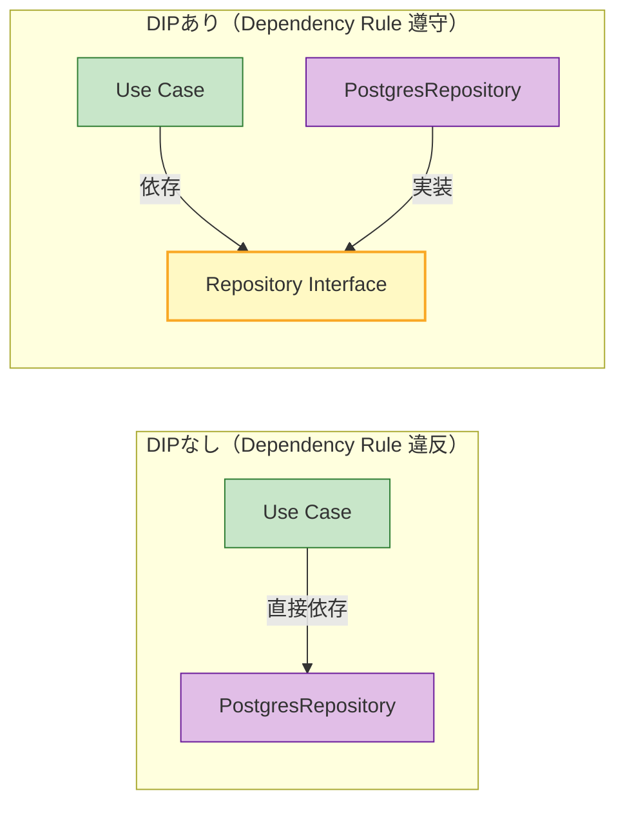

DIP を適用すると、Use Case 層にインターフェース（抽象）を定義し、外側の層でそのインターフェースを実装する。これにより、ソースコードの依存方向が逆転する。

- **データの流れ**: Use Case → Repository 実装 → データベース（外向き）
- **依存の方向**: Repository 実装 → Repository インターフェース ← Use Case（内向き）

この逆転こそが「依存性逆転」の名の由来であり、Clean Architecture の Dependency Rule を技術的に実現するメカニズムである。

### 制御の流れと依存の方向

以下の図は、リクエスト処理における制御の流れと依存の方向を示している。

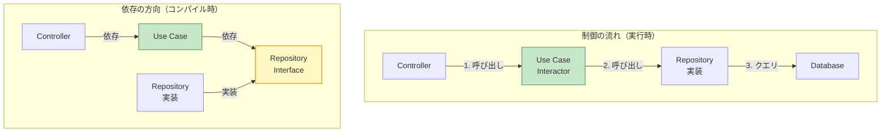

制御の流れ（ランタイム）では、Controller が Use Case を呼び出し、Use Case が Repository の実装を（インターフェースを通じて）呼び出す。しかし、依存の方向（コンパイル時）では、Repository 実装が Repository インターフェースに依存しており、Use Case はインターフェースにのみ依存する。これにより、内側の層が外側の層を知ることなく、外側の機能を利用できるのである。

## 境界を越えるデータ

層の境界を越えてデータをやり取りする際には、注意が必要である。Dependency Rule に従い、内側の層に適したデータ構造のみを使用しなければならない。

### Input / Output Data

Use Case 層では、入力データと出力データを明示的に定義する。これらは通常、単純なデータ構造（DTO）として表現される。

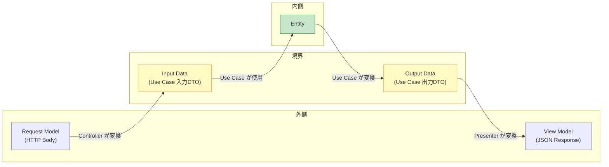

::: warning 境界を越えるデータに関する注意
Entity そのものを Use Case の外に漏出させてはならない。Entity は内側の層のものであり、外側の層に直接渡すと、外側の層が Entity の構造に依存してしまう。Use Case は Entity から必要な情報だけを Output Data に詰め替えて返すべきである。

ただし、この原則を厳密に適用すると、変換処理のコードが膨大になるという現実的な課題がある。後述の「現実的な適用指針」で、この点に対するプラグマティックなアプローチを議論する。
:::

## 実装例 — 全体構造

ここまでの各層を統合し、典型的なディレクトリ構成とともに全体像を示す。

### ディレクトリ構成

```
src/
├── entities/               # Entities layer
│   ├── loan.ts
│   └── applicant.ts
├── use-cases/              # Use Cases layer
│   ├── apply-for-loan.ts
│   ├── get-loan-status.ts
│   └── ports/              # Interfaces (ports)
│       ├── loan-repository.ts
│       └── credit-check-service.ts
├── adapters/               # Interface Adapters layer
│   ├── controllers/
│   │   └── loan-controller.ts
│   ├── presenters/
│   │   └── loan-presenter.ts
│   └── gateways/
│       ├── postgres-loan-repository.ts
│       └── http-credit-check-service.ts
└── frameworks/             # Frameworks & Drivers layer
    ├── web/
    │   └── express-app.ts
    ├── db/
    │   └── postgres-connection.ts
    └── config/
        └── environment.ts
```

### 依存関係の可視化

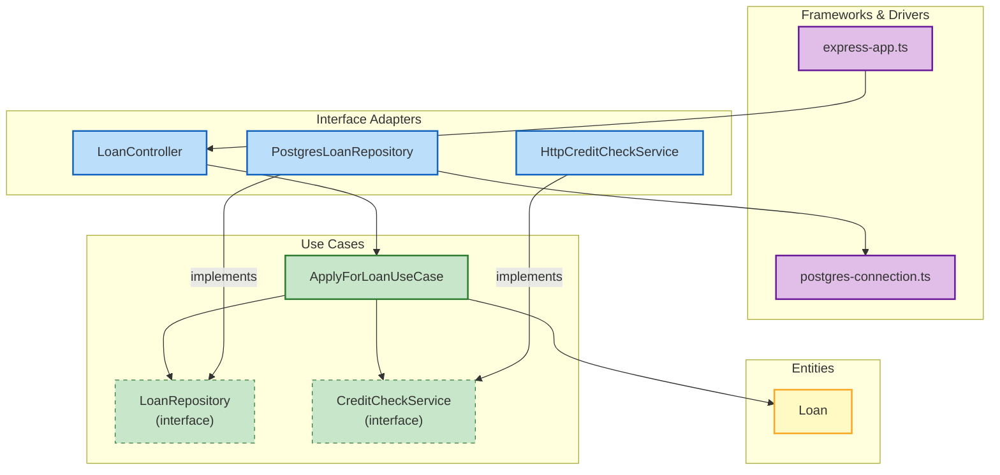

この図で、依存の矢印がすべて内側に向かっていることに注目してほしい。`PostgresLoanRepository` は `LoanRepository` インターフェースに依存（実装）しており、その矢印は外側から内側へ向かっている。これが DIP による依存性の逆転である。

## テスト容易性

Clean Architecture の最も実践的な利点の一つが、**テストの容易さ**である。各層が明確に分離されているため、外部依存をモック（模擬）に置き換えてテストできる。

### Use Case のテスト

```typescript
// Unit test for ApplyForLoanUseCase
describe("ApplyForLoanUseCase", () => {
  // Create mock implementations
  const mockLoanRepository: LoanRepository = {
    save: async () => "loan-123",
    findByApplicantId: async () => [],
  };

  const mockCreditCheckService: CreditCheckService = {
    checkCredit: async () => ({ score: 750 }),
  };

  it("should approve a loan for a qualified applicant", async () => {
    const useCase = new ApplyForLoanUseCase(
      mockLoanRepository,
      mockCreditCheckService
    );

    const result = await useCase.execute({
      applicantId: "applicant-1",
      amount: 100000,
      rate: 0.05,
      termYears: 30,
    });

    expect(result.approved).toBe(true);
    expect(result.loanId).toBe("loan-123");
    expect(result.monthlyPayment).toBeGreaterThan(0);
  });

  it("should reject when max loans reached", async () => {
    const repoWithExistingLoans: LoanRepository = {
      save: async () => "loan-456",
      findByApplicantId: async () => [
        new Loan(10000, 0.05, 10),
        new Loan(20000, 0.04, 15),
        new Loan(30000, 0.06, 20),
      ],
    };

    const useCase = new ApplyForLoanUseCase(
      repoWithExistingLoans,
      mockCreditCheckService
    );

    const result = await useCase.execute({
      applicantId: "applicant-2",
      amount: 50000,
      rate: 0.05,
      termYears: 10,
    });

    expect(result.approved).toBe(false);
    expect(result.reason).toContain("Maximum number");
  });
});
```

このテストでは、データベースもHTTPサーバーも不要である。Use Case が依存するインターフェースのモック実装を渡すだけで、ビジネスロジックを完全にテストできる。テストの実行は高速で、外部環境に依存しないため、CIパイプラインでも安定して動作する。

::: tip テストピラミッドと Clean Architecture
Clean Architecture は、テストピラミッドの構築を自然に支援する。

- **Entity のテスト**: 純粋な単体テスト。外部依存なし
- **Use Case のテスト**: モックを使った単体テスト。ビジネスロジックを検証
- **Adapter のテスト**: 統合テスト。データベースやAPIの接続を検証
- **Framework のテスト**: E2Eテスト。システム全体の動作を検証

内側の層ほどテストが容易で高速であり、テストの大半を Entity と Use Case のテストで構成できる。
:::

## メリット・デメリット・現実的な適用指針

### メリット

**1. フレームワーク非依存性**

ビジネスロジックがフレームワークに依存しないため、フレームワークの変更やバージョンアップの影響がInterface Adapters層とFrameworks & Drivers層に限定される。例えば、Express から Fastify への移行、あるいは REST API から GraphQL への変更が、Use Case 層に一切影響しない。

**2. テスト容易性**

上述のとおり、各層を独立してテストできる。特に、ビジネスロジックのテストにデータベースやWebサーバーが不要であるため、テストの実行が高速で安定する。

**3. データベース非依存性**

データベースの変更（PostgreSQL から MySQL、あるいは RDB から NoSQL への移行）が、Gateway の実装の差し替えで対応できる。ビジネスロジックは一切変更する必要がない。

**4. UI非依存性**

Web UI をモバイルアプリに置き換えたり、API エンドポイントを追加したりする際に、Use Case 層以下を再利用できる。

**5. ビジネスルールの明確な所在**

ビジネスルールが Entity と Use Case に集約されるため、ビジネスロジックの所在が明確になる。新しいメンバーがプロジェクトに参加した際にも、ビジネスルールがどこに書かれているかが一目瞭然である。

### デメリット

**1. コード量の増加**

層の分離とインターフェースの定義により、素朴な実装に比べてコード量が大幅に増加する。小規模なアプリケーションでは、アーキテクチャのオーバーヘッドがビジネスロジックのコード量を上回ることがある。

**2. 学習コスト**

Dependency Rule、DIP、各層の責務など、理解すべき概念が多い。チームメンバー全員がこれらの概念を正しく理解していないと、アーキテクチャが崩壊する。

**3. 過度な抽象化のリスク**

「将来の変更に備える」という名目で、実際には必要のない抽象化を導入してしまうリスクがある。YAGNI（You Ain't Gonna Need It）の原則との間でバランスを取る必要がある。

**4. データ変換の冗長性**

各層の境界でデータを変換するためのマッピングコードが必要になる。Entity → Use Case Output → View Model のような変換チェーンが、単純なCRUD操作に対して過剰に感じられることがある。

**5. チーム合意の難しさ**

「この処理はどの層に属するか」という判断が、チーム内で一致しないことがある。特に Entity と Use Case の境界、Interface Adapters と Frameworks & Drivers の境界は曖昧になりがちである。

::: danger 失敗パターン：過剰適用
Clean Architecture のすべてのルールを小規模な CRUD アプリケーションに厳密に適用すると、以下のような問題が生じる。

- 単純な「一覧取得」のために、Entity → Use Case Output → Presenter → View Model という不必要な変換チェーンが生まれる
- 各エンティティに対して Repository Interface + 実装クラスが必要になり、ファイル数が爆発する
- 「アーキテクチャを守ること」自体が目的化し、ビジネス価値の創出が遅れる

アーキテクチャは目的ではなく手段である。プロジェクトの規模と複雑さに応じて、適用度合いを調整すべきである。
:::

### 現実的な適用指針

Clean Architecture を実際のプロジェクトに適用する際のプラグマティックなガイドラインを示す。

**1. プロジェクト規模による適用度合い**

| 規模 | 推奨アプローチ |
|---|---|
| プロトタイプ / MVP | 層の分離は最小限。ビジネスロジックの集約のみ意識する |
| 中規模（数万行） | Use Case 層と Entity 層の分離を重視。Gateway パターンを適用 |
| 大規模（数十万行以上） | 完全な Clean Architecture の適用を検討。モジュール境界も明確に |

**2. 段階的導入**

最初から完全な Clean Architecture を適用する必要はない。以下のような段階的アプローチが有効である。

1. **まず、ビジネスロジックをフレームワークから分離する**（最も効果が高い）
2. 次に、データアクセスを Repository パターンで抽象化する
3. 必要に応じて、入出力の境界を明確にする
4. 最後に、すべての境界を厳密に定義する

**3. 「重要な境界」を見極める**

すべての境界を同じ厳密さで定義する必要はない。特に重要な境界は以下のとおりである。

- ビジネスロジックとフレームワーク（最重要）
- ビジネスロジックとデータアクセス（重要）
- アプリケーションのコアと外部サービス（重要）

一方、以下の境界は、厳密さを緩めても問題ないことが多い。

- Presenter と Controller の分離（同一クラスに統合しても問題ないことが多い）
- Entity を Use Case Output に変換する厳密なマッピング（単純なケースでは Entity の直接参照を許容する）

## 類似アーキテクチャとの比較

Clean Architecture は単独で存在するものではなく、類似のアーキテクチャパターンと共通する思想を持っている。以下では、主要なアーキテクチャとの比較を行う。

### Hexagonal Architecture（Ports and Adapters）との比較

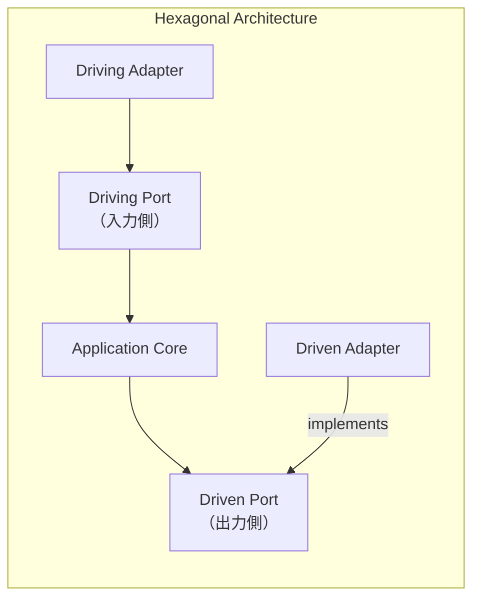

| 観点 | Clean Architecture | Hexagonal Architecture |
|---|---|---|
| 層の数 | 4層（明示的） | 明示的な層数の規定なし |
| 中心概念 | Dependency Rule | Ports and Adapters |
| Entity / Use Case の区別 | 明確に分離 | Application Core として統合 |
| 実践的な差異 | ほぼ同等 | ほぼ同等 |

実質的に、Clean Architecture は Hexagonal Architecture の思想を含み、さらに内側を Entity と Use Case に分離したものと言える。

### Onion Architecture との比較

| 観点 | Clean Architecture | Onion Architecture |
|---|---|---|
| 層構造 | Entities, Use Cases, Interface Adapters, Frameworks | Domain Model, Domain Services, Application Services, Infrastructure |
| 依存方向 | 内向き（同一） | 内向き（同一） |
| 中心の概念 | Entity（Business Rules） | Domain Model |
| 違い | Use Case を明確に定義 | Domain Services と Application Services を区別 |

Onion Architecture とは非常に高い類似性があり、名前の違い以上の本質的な差異は少ない。Clean Architecture は、Robert C. Martin 独自の用語体系で再定式化したものと見ることができる。

### 三層アーキテクチャとの比較

伝統的な三層アーキテクチャ（Presentation → Business Logic → Data Access）と Clean Architecture の根本的な違いは、**依存の方向**にある。

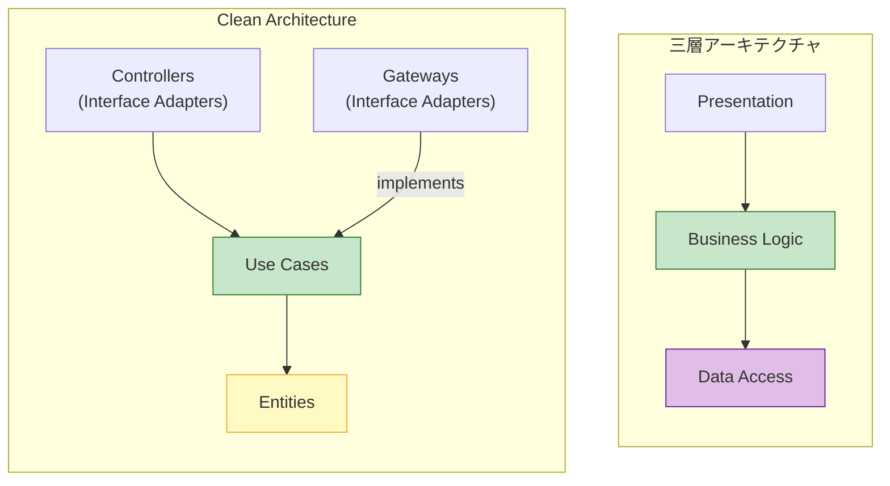

三層アーキテクチャでは、Business Logic 層が Data Access 層に依存する。つまり、ビジネスロジックがデータアクセスの詳細を知っている。Clean Architecture では、この依存が逆転しており、データアクセスの実装が Use Case 層で定義されたインターフェースに依存する。

この違いは一見些細に思えるが、テスト容易性、変更の影響範囲、そしてビジネスロジックの独立性において大きな違いを生む。

### DDD（Domain-Driven Design）との関係

Clean Architecture と DDD は競合するものではなく、相互に補完的な関係にある。

- **DDD** は、ソフトウェアの「何をモデル化するか」（ドメインモデル、境界づけられたコンテキスト、ユビキタス言語など）に焦点を当てる
- **Clean Architecture** は、ソフトウェアの「どう構造化するか」（層の分離、依存の方向）に焦点を当てる

実際のプロジェクトでは、DDD のドメインモデリング手法と Clean Architecture の構造的ルールを組み合わせて使うことが一般的である。Clean Architecture の Entity 層に DDD の Entity、Value Object、Aggregate を配置し、Use Case 層に Application Service を配置する、という対応関係になる。

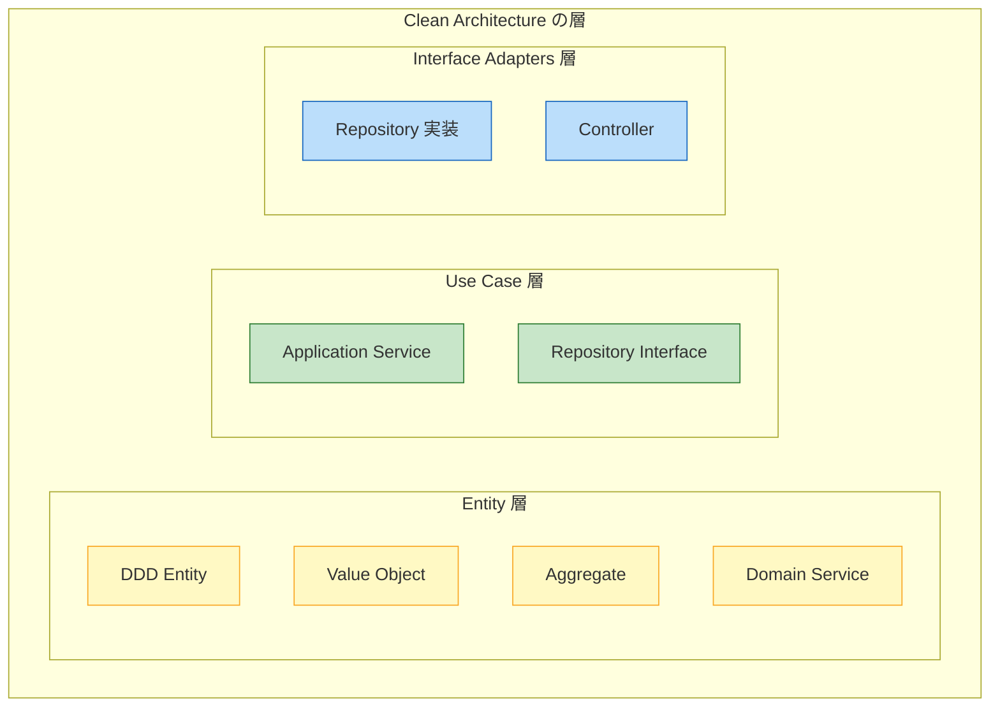

## 実世界での採用と評価

### 採用されている領域

Clean Architecture は、以下のような領域で特に効果を発揮する。

- **長期間メンテナンスされるシステム**: ビジネスロジックの安定性が重要な基幹システム
- **複数のインターフェースを持つシステム**: Web API、バッチ処理、CLI など、複数のエントリーポイントがあるシステム
- **チーム規模が大きいプロジェクト**: 層の境界が明確なため、チーム間の責務分担が容易
- **テスト駆動開発（TDD）を重視するプロジェクト**: テスト容易性が自然に確保される

### 採用に慎重であるべき領域

一方、以下のような場合には、Clean Architecture の完全な適用は過剰になりがちである。

- **プロトタイプや短期プロジェクト**: アーキテクチャの初期コストが回収できない
- **CRUD中心のアプリケーション**: ビジネスロジックが薄い場合、アーキテクチャのオーバーヘッドが目立つ
- **小規模チーム（1〜2人）**: アーキテクチャの恩恵よりも、コミュニケーションコストの低さが勝る
- **パフォーマンスが最優先のシステム**: 抽象化のレイヤーがパフォーマンスのボトルネックになる可能性

### 現場で見られる誤解と問題

Clean Architecture を採用するプロジェクトで頻繁に見られる問題がある。

**1. 「層を分けること」自体が目的化する**

Clean Architecture の目的は「ビジネスルールを保護すること」であって、「層を分けること」ではない。形式的に層を分けても、各層の責務が曖昧であれば意味がない。

**2. 全てのエンティティに Repository を作る**

単純な値オブジェクトや設定値まで Repository パターンで抽象化する必要はない。抽象化のコストに見合うかどうかを判断すべきである。

**3. Controller と Presenter の過度な分離**

Martin の原著では Controller と Presenter を分離しているが、多くのWebフレームワークでは Controller がリクエストの受信とレスポンスの送信を一手に担う。無理に分離するよりも、Controller 内でデータ変換のロジックを明確に分けるだけで十分なことが多い。

**4. Entity の貧血化**

Entity がビジネスルールを持たず、単なるデータコンテナ（getter/setter の集合体）になっているケース。これは「Anemic Domain Model（貧血ドメインモデル）」と呼ばれるアンチパターンであり、Clean Architecture の意図に反する。Entity はビジネスルールをカプセル化すべきである。

## まとめ

Clean Architecture は、Robert C. Martin が Hexagonal Architecture、Onion Architecture、BCE などの先行するアーキテクチャパターンの共通原則を抽出し、体系化したアーキテクチャ設計の指針である。

その核心は、以下の3点に集約される。

1. **ビジネスルールを中心に据える**: ソフトウェアの最も重要な部分であるビジネスルールを、技術的な詳細から分離して保護する
2. **Dependency Rule を遵守する**: ソースコードの依存関係は常に内側（高レベルのポリシー）に向かわせ、DIP を活用して依存の方向を制御する
3. **交換可能性を確保する**: フレームワーク、データベース、UI などの技術的詳細を交換可能にし、ビジネスロジックに影響を与えずに変更できるようにする

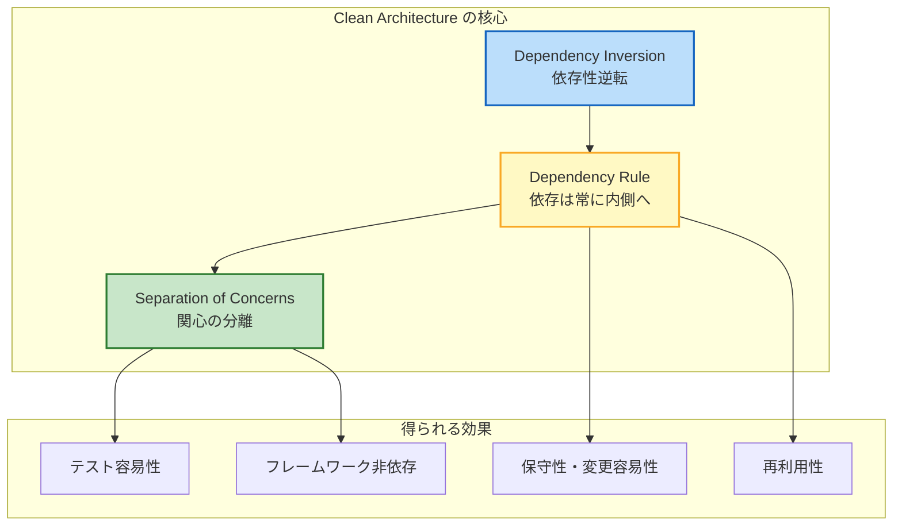

ただし、Clean Architecture は万能薬ではない。プロジェクトの規模、チームの成熟度、ビジネスロジックの複雑さ、そして開発速度の要求を総合的に判断し、適用度合いを調整することが重要である。アーキテクチャは目的ではなく手段であり、その価値はビジネスルールの保護と変更容易性の確保にある。

最も重要なのは、Clean Architecture の「精神」を理解することである。それは「ビジネスルールを技術的な詳細から守る」という一点に尽きる。具体的な層の数や名前にこだわるよりも、この原則を自分のプロジェクトのコンテキストに合わせて適切に実践することが、Clean Architecture の正しい活用法である。
