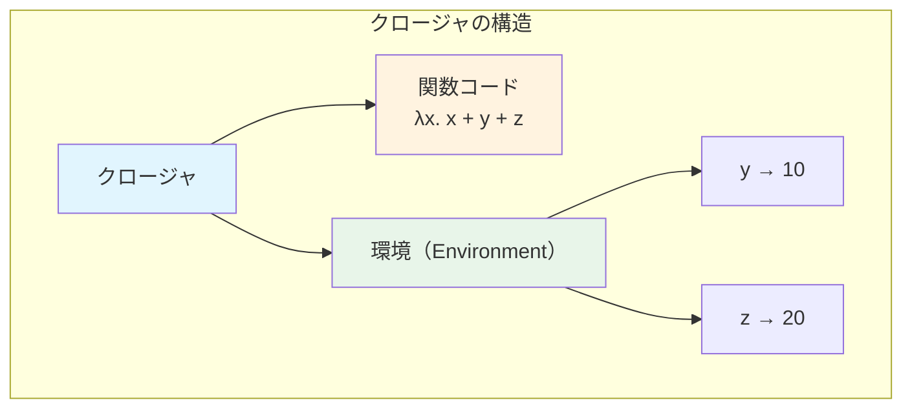
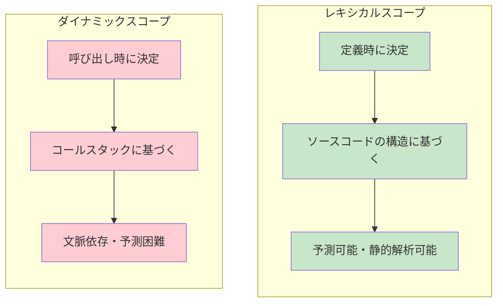
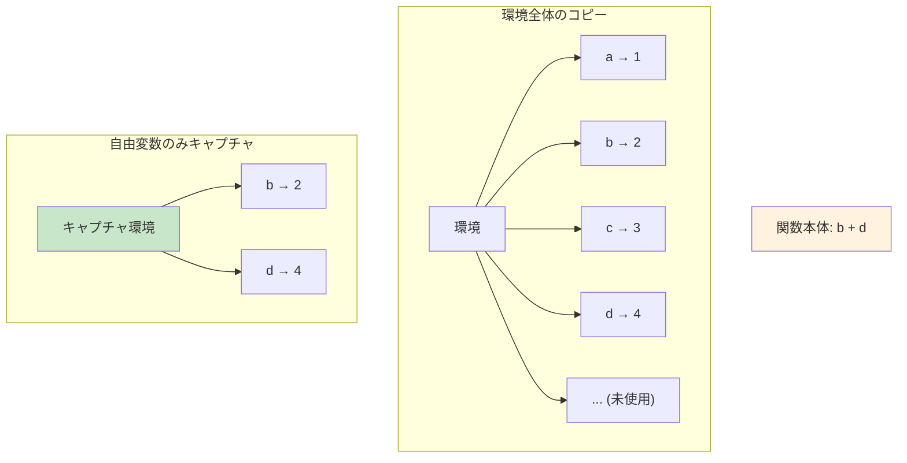
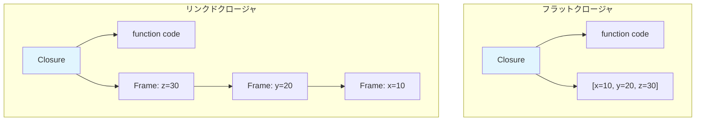
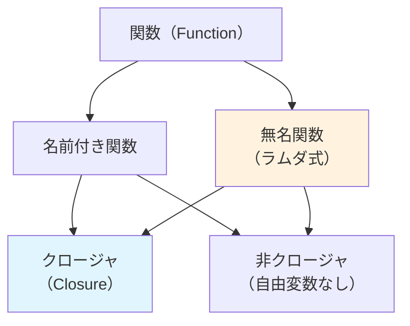
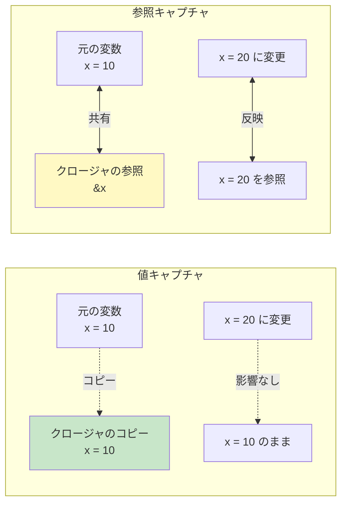
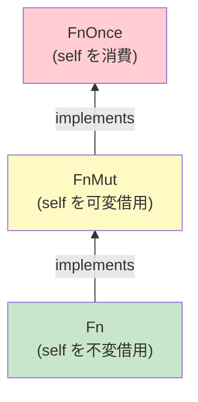
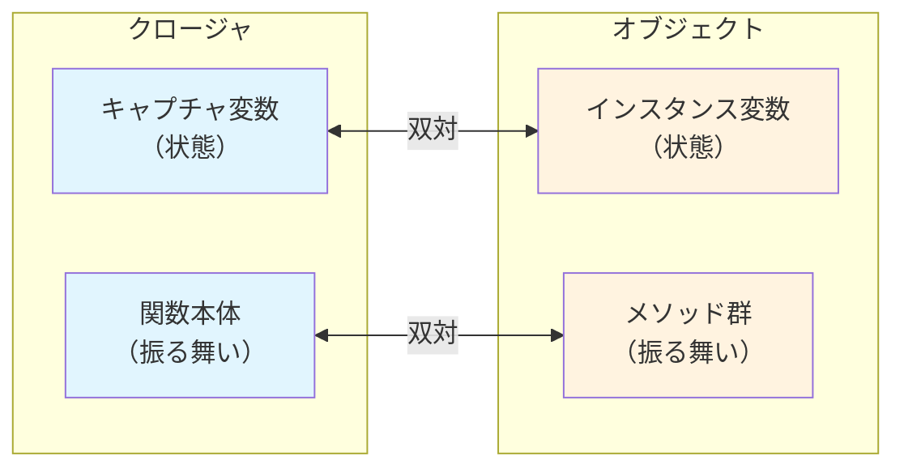

# クロージャとファーストクラス関数 — 環境を閉じ込める計算の仕組み

## 1. 背景と動機 — なぜクロージャが必要なのか

プログラミングにおいて、**関数**は最も基本的な抽象化の手段である。入力を受け取り、何らかの計算を行い、結果を返す——この単純な仕組みが、ソフトウェアの複雑さを管理する上で欠かせない役割を果たしてきた。

しかし、関数がその**定義された環境**にある変数にアクセスしたいとき、何が起きるだろうか。関数が定義されたスコープを離れて別の場所で実行されたとき、その変数はまだ利用可能だろうか。この問いに対する答えが**クロージャ（closure）**である。

### 1.1 ファーストクラス関数の誕生

1960年代、Christopher Strachey は関数を**ファーストクラスの値（first-class value）**として扱うという概念を提唱した。ファーストクラスの値とは、以下のすべての操作が可能な値のことである。

1. **変数に代入**できる
2. **関数の引数**として渡せる
3. **関数の戻り値**として返せる
4. **データ構造**に格納できる

整数や文字列がこれらの操作を自然にサポートするように、関数にも同じ地位を与えるというのが「ファーストクラス関数」の考え方である。

```javascript
// Functions as first-class values in JavaScript
const double = (x) => x * 2;       // assign to a variable
const apply = (f, x) => f(x);      // pass as an argument
const makeAdder = (n) => (x) => x + n;  // return as a value
const funcs = [double, Math.sqrt];  // store in a data structure
```

### 1.2 問題の顕在化

ファーストクラス関数を導入すると、すぐに厄介な問題が生じる。関数が他の関数の内部で定義され、外側の関数のローカル変数を参照しているとき、内側の関数が外側の関数のスコープの外へ持ち出されたらどうなるのか。

```javascript
function makeCounter() {
  let count = 0;  // local variable of makeCounter
  return function() {
    count += 1;   // references 'count' from the enclosing scope
    return count;
  };
}

const counter = makeCounter();
// makeCounter has returned, its stack frame is gone
// but counter() still needs access to 'count'
console.log(counter()); // 1
console.log(counter()); // 2
console.log(counter()); // 3
```

`makeCounter` が返った時点で、通常であればローカル変数 `count` はスタックフレームとともに破棄される。しかし、返された無名関数は `count` を参照し続けている。この矛盾を解決するために、関数はその**環境（environment）**を「閉じ込めて（close over）」持ち運ぶ必要がある。これがクロージャの本質である。

### 1.3 歴史的経緯

クロージャの概念は、1964年に Peter J. Landin が論文 *"The Mechanical Evaluation of Expressions"* で導入した。Landin は SECD マシン（Stack, Environment, Control, Dump）と呼ばれる抽象機械を設計し、その中でラムダ式とその定義時の環境のペアを **closure** と名付けた。

その後、1975年に Scheme が登場し、クロージャをプログラミング言語の実用的な機能として初めて広く利用可能にした。Guy Steele と Gerald Jay Sussman による *Lambda Papers*（1975-1980）は、クロージャがプログラミング言語の設計においていかに強力で汎用的な道具であるかを示した。

::: tip クロージャの本質
クロージャとは、**関数とその定義時の環境（レキシカル環境）のペア**である。関数が自由変数を含むとき、その変数の束縛を環境から取得することで、関数が定義されたスコープの外でも正しく動作することを保証する。
:::

## 2. 定義と基本概念

### 2.1 形式的定義

クロージャを厳密に定義するために、いくつかの前提概念を導入する。

**自由変数（free variable）**：関数の本体に出現するが、その関数のパラメータとしては束縛されていない変数を**自由変数**と呼ぶ。

$$
\text{FV}(\lambda x.\, M) = \text{FV}(M) \setminus \{x\}
$$

たとえば、$\lambda x.\, x + y$ において、$x$ は束縛変数であり、$y$ は自由変数である。

**環境（environment）**：変数名からその値への写像。形式的には $\text{Env} : \text{Variable} \to \text{Value}$ である。

**クロージャ（closure）**：関数（ラムダ式）$\lambda x.\, M$ と環境 $\rho$ のペア $\langle \lambda x.\, M,\, \rho \rangle$ であり、$\rho$ は $M$ 中の自由変数に対する束縛を含む。



### 2.2 束縛変数と自由変数

プログラムの中の変数は、スコープとの関係により2種類に分類される。

**束縛変数（bound variable）**：関数のパラメータとして宣言され、関数のスコープ内で束縛されている変数。

**自由変数（free variable）**：関数の本体内で使用されているが、その関数自身のパラメータではない変数。外側のスコープから取得される必要がある。

```python
def outer():
    x = 10        # bound in outer
    y = 20        # bound in outer
    def inner(z): # z is bound in inner
        return x + y + z  # x, y are free variables in inner
    return inner
```

この例では、`inner` 関数にとって `z` は束縛変数であり、`x` と `y` は自由変数である。クロージャは、これらの自由変数の値を環境として保持する。

### 2.3 閉じた式と開いた式

自由変数を含まない式を**閉じた式（closed expression）**、含む式を**開いた式（open expression）**と呼ぶ。

| 式 | 自由変数 | 分類 |
|---|---|---|
| $\lambda x.\, x$ | なし | 閉じた式 |
| $\lambda x.\, x + y$ | $\{y\}$ | 開いた式 |
| $\lambda x.\, \lambda y.\, x + y$ | なし | 閉じた式 |
| $\lambda f.\, f(x)$ | $\{x\}$ | 開いた式 |

クロージャは、開いた式を環境と組み合わせることで「閉じる」操作——すなわち、すべての自由変数に具体的な値を与える操作——を実現する。**closure** という名前は、まさにこの「閉じる」操作に由来する。

## 3. レキシカルスコープとダイナミックスコープ

クロージャの振る舞いを理解する上で避けて通れないのが、**スコーピング規則（scoping rule）**の選択である。

### 3.1 レキシカルスコープ（静的スコープ）

**レキシカルスコープ（lexical scope）**とは、変数の参照先がプログラムのテキスト上の構造——すなわちソースコードの字句的（lexical）な配置——によって決定される方式である。関数内の自由変数は、その関数が**定義された場所**の環境から値を取得する。

```javascript
const x = "global";

function outer() {
  const x = "outer";
  function inner() {
    console.log(x); // lexical scope: refers to "outer"
  }
  return inner;
}

function other() {
  const x = "other";
  const fn = outer();
  fn(); // prints "outer", not "other"
}

other();
```

レキシカルスコープでは、`inner` が参照する `x` は、`inner` が**定義された場所**（`outer` の内部）の `x` であり、`inner` が**呼び出された場所**（`other` の内部）の `x` ではない。

### 3.2 ダイナミックスコープ（動的スコープ）

**ダイナミックスコープ（dynamic scope）**では、自由変数の値は関数が**呼び出された時点**のコールスタックをさかのぼって決定される。

```lisp
;; Emacs Lisp uses dynamic scope by default
(setq x "global")

(defun inner ()
  (message x))

(defun caller-a ()
  (let ((x "from caller-a"))
    (inner)))  ; prints "from caller-a"

(defun caller-b ()
  (let ((x "from caller-b"))
    (inner)))  ; prints "from caller-b"
```

ダイナミックスコープでは、同じ関数 `inner` でも、呼び出し元によって `x` の値が変わる。

### 3.3 なぜレキシカルスコープが主流になったか

現代のほぼすべてのプログラミング言語がレキシカルスコープを採用している。その理由は明確である。

1. **予測可能性**：関数の振る舞いがソースコードから静的に推論できる。コードを読むだけで変数の参照先が分かる
2. **モジュール性**：関数の動作が呼び出し元の文脈に依存しないため、コンポーネントの独立性が保たれる
3. **最適化の容易さ**：コンパイラが静的に変数の参照先を解析できるため、効率的なコード生成が可能になる
4. **クロージャとの親和性**：レキシカルスコープとクロージャは不可分の関係にある。クロージャが環境をキャプチャするとは、レキシカル環境をキャプチャするということに他ならない



::: warning ダイナミックスコープの現在
ダイナミックスコープは完全に廃れたわけではない。Emacs Lisp はデフォルトでダイナミックスコープを使い、Common Lisp の `special` 変数や Perl の `local` もダイナミックスコープの機構である。ただし、これらはあくまで特殊な用途に限られ、言語の主要なスコープ規則としてダイナミックスコープを採用する現代の汎用言語はほぼ存在しない。
:::

## 4. クロージャの実装 — 環境のキャプチャ

クロージャを実際にプログラミング言語のランタイムで実装するには、関数が自由変数を参照するための**環境**をどのように表現し保持するかが中核的な問題となる。

### 4.1 ナイーブな実装：環境全体のコピー

最も単純なアプローチは、クロージャが作成される時点でのレキシカル環境全体をコピーして保持する方法である。

```
Closure = (function_code, copy_of_entire_environment)
```

この方法は正しく動作するが、環境に多数の変数が含まれる場合にメモリの無駄が大きい。クロージャが実際に参照する自由変数はごく一部であることが多い。

### 4.2 実用的な実装：自由変数のみのキャプチャ

コンパイラは静的解析によって、クロージャが参照する自由変数の集合を特定できる。クロージャの作成時には、必要な変数の束縛のみを含む小さな環境を構築すればよい。



多くの言語処理系では、この最適化が標準的に行われている。V8（JavaScript）や CPython は、クロージャの生成時に自由変数への参照のみをキャプチャする。

### 4.3 フラットクロージャとリンクドクロージャ

クロージャの環境表現には大きく2つのアプローチがある。

**フラットクロージャ（flat closure）**：自由変数の値を直接コピーして、フラットな配列やレコードとして保持する。アクセスは高速だが、ネストの深いクロージャではコピーのオーバーヘッドが大きくなる可能性がある。

**リンクドクロージャ（linked closure）**：環境をリンクリスト（環境チェーン）として表現し、各スコープの環境フレームへのポインタを保持する。メモリ共有が可能だが、変数アクセス時にチェーンをたどる間接参照が必要になる。



### 4.4 アップバリュー（upvalue）— Lua の実装

Lua のクロージャ実装は、**アップバリュー（upvalue）**という独自の機構で知られている。これはフラットクロージャとリンクドクロージャの利点を組み合わせたアプローチである。

Lua では、外側のスコープの変数がまだスタック上に存在する間は、スタック上のスロットを直接指すポインタを通じてアクセスする。外側の関数が返って変数がスタックから除去されるタイミングで、その値をヒープ上のアップバリューオブジェクトにコピー（**close** する）する。

```
// Pseudo-code illustrating Lua's upvalue mechanism
struct UpValue {
    Value* location;  // initially points to stack slot
    Value  closed;    // value copied here when the stack frame is popped
};

// When the enclosing function returns:
upvalue->closed = *upvalue->location;
upvalue->location = &upvalue->closed;
```

この方式の利点は、変数がまだスタック上にある間は間接参照1回でアクセスでき、コピーは実際に必要になった時点まで遅延される点にある。

### 4.5 ヒープ割り当てとエスケープ解析

クロージャが外側の関数のスコープの外に持ち出される（**エスケープ**する）場合、キャプチャされた変数はスタックではなくヒープに配置しなければならない。しかし、すべてのクロージャがエスケープするわけではない。

**エスケープ解析（escape analysis）**を行うことで、コンパイラはクロージャがエスケープするかどうかを判定し、エスケープしない場合にはスタック割り当てのまま効率的に処理できる。

```javascript
function process(items) {
  // This closure does NOT escape — it is used locally within .map()
  const doubled = items.map(x => x * 2);

  // This closure DOES escape — it is returned from the function
  let sum = 0;
  const accumulator = (x) => { sum += x; return sum; };
  return accumulator;
}
```

V8 や HotSpot（Java）などの高性能な処理系は、エスケープ解析を活用してクロージャのメモリ割り当てを最適化している。

## 5. 各言語での実装の違い

クロージャの概念は共通でも、各プログラミング言語はそれぞれの設計哲学に基づいて異なる実装を提供している。ここでは主要な5つの言語を比較する。

### 5.1 JavaScript — 参照キャプチャのプロトタイプ

JavaScript はクロージャを最も自然にサポートする言語の一つである。すべての関数はクロージャであり、レキシカル環境への**参照**をキャプチャする。

```javascript
function createMultiplier(factor) {
  // 'factor' is captured by reference
  return function(x) {
    return x * factor;
  };
}

const double = createMultiplier(2);
const triple = createMultiplier(3);
console.log(double(5));  // 10
console.log(triple(5));  // 15
```

JavaScript のクロージャの特徴は、変数そのもの（参照）をキャプチャする点にある。これにより、キャプチャされた変数の変更が即座にクロージャに反映される。

```javascript
function makeActions() {
  const actions = [];
  for (var i = 0; i < 3; i++) {
    actions.push(function() { return i; });
  }
  return actions;
}

const actions = makeActions();
console.log(actions[0]()); // 3 (not 0!)
console.log(actions[1]()); // 3 (not 1!)
console.log(actions[2]()); // 3 (not 2!)
```

この古典的な落とし穴は、`var` がブロックスコープを持たないことと、クロージャが値ではなく参照をキャプチャすることの組み合わせによって生じる。`let` を使えばブロックスコープが導入されるため、各イテレーションで新しい変数が束縛される。

```javascript
function makeActionsFixed() {
  const actions = [];
  for (let i = 0; i < 3; i++) {
    // 'let' creates a new binding for each iteration
    actions.push(function() { return i; });
  }
  return actions;
}

const fixedActions = makeActionsFixed();
console.log(fixedActions[0]()); // 0
console.log(fixedActions[1]()); // 1
console.log(fixedActions[2]()); // 2
```

### 5.2 Python — 参照キャプチャと制約

Python もレキシカルスコープに基づくクロージャをサポートするが、重要な制約がある。クロージャ内から外側のスコープの変数に**代入**するには、`nonlocal` 宣言が必要である。

```python
def make_counter():
    count = 0
    def increment():
        nonlocal count  # required to modify the captured variable
        count += 1
        return count
    return increment

counter = make_counter()
print(counter())  # 1
print(counter())  # 2
```

`nonlocal` がなければ、`count += 1` は `count` をローカル変数として扱おうとし、`UnboundLocalError` が発生する。この設計は、Python の「明示的は暗黙的に勝る（Explicit is better than implicit）」という哲学に基づいている。

Python のクロージャにおけるもう一つの特徴は、`lambda` 式が単一の式しか含められないという制約である。これは複雑なクロージャの記述を `def` 文に委ねることを意味する。

```python
# Python's lambda is limited to a single expression
square = lambda x: x ** 2

# For anything more complex, use def
def make_formatter(prefix, suffix):
    def format(text):
        cleaned = text.strip()
        return f"{prefix}{cleaned}{suffix}"
    return format
```

### 5.3 Rust — 所有権とキャプチャモード

Rust のクロージャは、言語の所有権システムと深く統合されており、他の言語とは根本的に異なるアプローチを取る。Rust のクロージャは、自由変数を3つの方法のいずれかでキャプチャする。

1. **不変借用（immutable borrow, `&T`）**：変数を読み取るだけの場合
2. **可変借用（mutable borrow, `&mut T`）**：変数を変更する場合
3. **所有権の移動（move, `T`）**：変数の所有権をクロージャに移す場合

```rust
fn main() {
    let name = String::from("Rust");
    let greeting = || println!("Hello, {}!", name);  // immutable borrow
    greeting();
    println!("{}", name); // 'name' is still usable

    let mut count = 0;
    let mut increment = || { count += 1; count };     // mutable borrow
    println!("{}", increment()); // 1
    println!("{}", increment()); // 2

    let data = vec![1, 2, 3];
    let consumer = move || println!("{:?}", data);     // ownership moved
    consumer();
    // println!("{:?}", data); // ERROR: 'data' has been moved
}
```

Rust のコンパイラは、クロージャの本体を解析して、各自由変数に対して最も制約の少ないキャプチャモードを自動的に選択する。`move` キーワードを明示的に指定すると、すべての自由変数が所有権の移動によってキャプチャされる。

この設計により、Rust のクロージャは**ゼロコスト抽象化**を実現している。キャプチャされた変数はクロージャの構造体のフィールドとしてインライン化され、ヒープ割り当ては不要である。

### 5.4 Go — 参照キャプチャと goroutine

Go のクロージャは、外側のスコープの変数への**参照**をキャプチャする。Go の設計は JavaScript に近いが、goroutine との組み合わせで特有の注意点がある。

```go
package main

import "fmt"

func makeAccumulator(initial int) func(int) int {
    sum := initial
    return func(n int) int {
        sum += n // captures 'sum' by reference
        return sum
    }
}

func main() {
    acc := makeAccumulator(0)
    fmt.Println(acc(10)) // 10
    fmt.Println(acc(20)) // 30
    fmt.Println(acc(30)) // 60
}
```

goroutine でクロージャを使用する際のよくある落とし穴は以下の通りである。

```go
package main

import (
    "fmt"
    "sync"
)

func main() {
    var wg sync.WaitGroup
    // BUG: all goroutines capture the same 'i' variable
    for i := 0; i < 5; i++ {
        wg.Add(1)
        go func() {
            defer wg.Done()
            fmt.Println(i) // likely prints "5" five times
        }()
    }
    wg.Wait()

    fmt.Println("---")

    // FIX: pass 'i' as a parameter to create a new binding
    for i := 0; i < 5; i++ {
        wg.Add(1)
        go func(n int) {
            defer wg.Done()
            fmt.Println(n) // prints 0 through 4 (in some order)
        }(i)
    }
    wg.Wait()
}
```

> [!NOTE]
> Go 1.22 以降では、`for` ループ変数のスコープが変更され、各イテレーションで新しい変数が束縛されるようになった。これにより、上記のバグは新しいバージョンの Go では自然に解消される。

### 5.5 Swift — 値キャプチャと参照型

Swift のクロージャは、変数を**値のコピー**としてキャプチャする。ただし、変数が参照型（クラスのインスタンス）である場合は、参照そのものがコピーされるため、実質的に参照キャプチャとなる。

```swift
func makeCounter() -> () -> Int {
    var count = 0
    return {
        count += 1  // captures 'count' — a copy of the variable
        return count
    }
}

let counter = makeCounter()
print(counter()) // 1
print(counter()) // 2
```

Swift の特徴的な機能として**キャプチャリスト（capture list）**がある。キャプチャリストを使うことで、キャプチャの方法を明示的に制御できる。

```swift
class ViewModel {
    var title = "Hello"

    func setupCallback() -> () -> String {
        // Capture list: [weak self] creates a weak reference
        return { [weak self] in
            guard let self = self else { return "deallocated" }
            return self.title
        }
    }
}
```

`[weak self]` や `[unowned self]` を用いることで、循環参照（retain cycle）を防止できる。これは ARC（Automatic Reference Counting）ベースのメモリ管理を持つ Swift にとって重要な機構である。

### 5.6 各言語の比較表

| 特性 | JavaScript | Python | Rust | Go | Swift |
|---|---|---|---|---|---|
| キャプチャ方式 | 参照 | 参照 | 借用/移動 | 参照 | コピー（変数） |
| 変更可能性 | 自由 | `nonlocal` が必要 | 型システムで制御 | 自由 | 自由 |
| メモリ管理 | GC | GC | 所有権 | GC | ARC |
| 型表現 | なし（動的型） | なし（動的型） | `Fn`/`FnMut`/`FnOnce` | なし（構造的型） | `@escaping` 等 |
| ゼロコスト | いいえ | いいえ | はい | いいえ | 部分的 |

## 6. クロージャとラムダ式の関係

クロージャとラムダ式（lambda expression / anonymous function）は密接に関連しているが、同一の概念ではない。この2つの関係を明確にする。

### 6.1 ラムダ式とは

ラムダ式とは、**名前を持たない関数リテラル**のことである。理論的にはラムダ計算に起源を持ち、$\lambda x.\, M$ という記法で関数を表現する。プログラミング言語では、ラムダ式は無名関数を定義するための構文として提供される。

```javascript
// Lambda expressions in various languages

// JavaScript
const add = (a, b) => a + b;

// Python
add = lambda a, b: a + b

// Rust
let add = |a, b| a + b;

// Go (anonymous function)
add := func(a, b int) int { return a + b }
```

### 6.2 ラムダ式がクロージャになるとき

ラムダ式は、それ自体は単なる構文的な機能——名前のない関数を定義するための書き方——に過ぎない。しかし、ラムダ式が自由変数を含むとき、その自由変数の束縛を環境から取得する必要が生じ、結果としてクロージャが生成される。

```javascript
// A lambda without free variables — a plain function, not really a closure
const square = (x) => x * x;

// A lambda with a free variable — this is a closure
function makeScaler(factor) {
  return (x) => x * factor;  // 'factor' is a free variable
}
```

逆に、名前を持つ通常の関数であっても、自由変数をキャプチャすればクロージャとなる。

```javascript
function outer() {
  const threshold = 100;
  // Named function that is still a closure
  function isAboveThreshold(value) {
    return value > threshold;  // captures 'threshold'
  }
  return isAboveThreshold;
}
```

### 6.3 概念の整理



整理すると以下のようになる。

- **ラムダ式**：名前を持たない関数を定義する構文
- **クロージャ**：自由変数をレキシカル環境から取得して保持する関数（名前の有無は問わない）
- ラムダ式は**クロージャの一般的な生成手段**であるが、クロージャはラムダ式なしでも生成できるし、ラムダ式がクロージャにならないこともある

::: tip 実用上の区別
多くのプログラミング言語のドキュメントやコミュニティでは、「ラムダ」と「クロージャ」を互換的に使うことがある。これは実用上問題ないことが多いが、理論的には異なる概念であることを認識しておくと、言語間の違いを理解する際に役立つ。
:::

## 7. クロージャのメモリ管理

クロージャは環境をキャプチャするため、通常の関数とは異なるメモリ管理上の考慮が必要になる。

### 7.1 値キャプチャ vs 参照キャプチャ

クロージャが自由変数をキャプチャする方法は、大きく2つに分けられる。

**値キャプチャ（capture by value）**：クロージャ生成時に変数の現在の値をコピーする。クロージャは独立した値のコピーを持つため、元の変数が変更されてもクロージャ内の値は影響を受けない。

**参照キャプチャ（capture by reference）**：変数そのもの（のアドレスや参照）をキャプチャする。クロージャと元のスコープは同じ変数を共有するため、一方での変更は他方にも反映される。



### 7.2 C++ のキャプチャモード

C++11 で導入されたラムダ式は、キャプチャモードを最も細かく制御できる言語の一つである。

```cpp
#include <iostream>
#include <functional>

int main() {
    int x = 10;
    int y = 20;

    // Capture x by value, y by reference
    auto fn = [x, &y]() {
        // x is a copy, y is a reference
        std::cout << x << ", " << y << std::endl;
    };

    x = 100;
    y = 200;
    fn(); // prints "10, 200" — x was copied, y reflects the change

    // Capture all by value
    auto by_val = [=]() { std::cout << x << std::endl; };

    // Capture all by reference
    auto by_ref = [&]() { std::cout << x << std::endl; };

    return 0;
}
```

C++ のキャプチャ構文は `[=]`（全値キャプチャ）、`[&]`（全参照キャプチャ）、`[x, &y]`（個別指定）のように、変数ごとにキャプチャモードを指定できる。

### 7.3 GC ベースの言語におけるクロージャ

JavaScript、Python、Go などのガベージコレクション（GC）を持つ言語では、クロージャのメモリ管理は比較的単純である。クロージャがキャプチャした変数は、クロージャ自体が到達可能である限りGCによって回収されない。

```javascript
function createLargeClosures() {
  const largeData = new Array(1000000).fill(0); // 1M elements

  // This closure keeps largeData alive
  return function() {
    return largeData.length;
  };
}

const fn = createLargeClosures();
// largeData cannot be GC'd because fn holds a reference to it
// When fn is no longer referenced, largeData becomes eligible for GC
```

この挙動は便利であると同時に、**メモリリーク**の原因にもなり得る。意図せず大きなデータ構造をキャプチャしたクロージャが長期間保持されると、メモリ消費が予想以上に膨らむ可能性がある。

### 7.4 ARC と循環参照

Swift のようにARC（Automatic Reference Counting）でメモリを管理する言語では、クロージャが循環参照を生み出すリスクがある。

```swift
class EventHandler {
    var name: String
    var callback: (() -> Void)?

    init(name: String) {
        self.name = name
    }

    func setup() {
        // RETAIN CYCLE: self -> callback -> self
        callback = {
            print("Event from \(self.name)")
        }
    }

    func setupFixed() {
        // FIXED: [weak self] breaks the cycle
        callback = { [weak self] in
            guard let self = self else { return }
            print("Event from \(self.name)")
        }
    }

    deinit {
        print("\(name) deallocated")
    }
}
```

`self` がクロージャを保持し、クロージャが `self` をキャプチャすると、双方の参照カウントが0にならず、メモリリークが発生する。Swift のキャプチャリスト（`[weak self]`）は、この問題に対する言語レベルの解決策である。

### 7.5 Rust の所有権モデルによる安全性

Rust は所有権と借用のシステムにより、クロージャに関するメモリ安全性を**コンパイル時**に保証する。

```rust
fn dangling_reference() {
    let closure;
    {
        let data = vec![1, 2, 3];
        // ERROR: `data` does not live long enough
        // closure = || println!("{:?}", data);

        // WORKS: move ownership into the closure
        closure = move || println!("{:?}", data);
    }
    closure(); // data is owned by the closure, no dangling reference
}
```

Rust のコンパイラは、クロージャがキャプチャした参照のライフタイムを追跡し、ダングリング参照（dangling reference）が発生し得るコードをコンパイルエラーとして拒否する。これにより、実行時のメモリ安全性が静的に保証される。

## 8. クロージャと型システム — Rust の Fn トレイト

Rust はクロージャに対して精緻な型システムを提供しており、クロージャのキャプチャ方式と使用パターンを型レベルで区別する。これはクロージャと型理論の関係を理解する上で極めて示唆的な設計である。

### 8.1 三つの Fn トレイト

Rust は、クロージャを3つのトレイト（trait）によって分類する。

| トレイト | シグネチャ | キャプチャ | 呼び出し回数 |
|---|---|---|---|
| `Fn` | `fn(&self, args) -> R` | 不変借用 `&T` | 何度でも |
| `FnMut` | `fn(&mut self, args) -> R` | 可変借用 `&mut T` | 何度でも |
| `FnOnce` | `fn(self, args) -> R` | 所有権移動 `T` | 1回のみ |

これら3つのトレイトはサブトレイト関係にある。



`Fn` を実装するクロージャは必ず `FnMut` と `FnOnce` も実装し、`FnMut` を実装するクロージャは必ず `FnOnce` も実装する。

### 8.2 具体例

```rust
fn apply_fn<F: Fn(i32) -> i32>(f: &F, x: i32) -> i32 {
    f(x)
}

fn apply_fn_mut<F: FnMut(i32) -> i32>(f: &mut F, x: i32) -> i32 {
    f(x)
}

fn apply_fn_once<F: FnOnce(i32) -> i32>(f: F, x: i32) -> i32 {
    f(x)
}

fn main() {
    let offset = 10;

    // Fn: only reads captured variable
    let add_offset = |x| x + offset;
    println!("{}", apply_fn(&add_offset, 5));  // 15
    println!("{}", apply_fn(&add_offset, 5));  // can call multiple times

    // FnMut: mutates captured variable
    let mut total = 0;
    let mut accumulate = |x| { total += x; total };
    println!("{}", apply_fn_mut(&mut accumulate, 10)); // 10
    println!("{}", apply_fn_mut(&mut accumulate, 20)); // 30

    // FnOnce: consumes captured variable
    let data = String::from("hello");
    let consume = move |x: i32| {
        drop(data);  // data is moved into the closure and consumed
        x * 2
    };
    println!("{}", apply_fn_once(consume, 5)); // 10
    // apply_fn_once(consume, 5); // ERROR: closure already consumed
}
```

### 8.3 型システムの恩恵

Rust の Fn トレイトシステムがもたらす恩恵は大きい。

1. **API の表現力**：関数のシグネチャがクロージャの要件を正確に伝える。`Fn` を要求するAPIは、渡されたクロージャを何度でも呼び出すことを意味し、`FnOnce` を要求するAPIは、クロージャを1回しか呼び出さないことを保証する

2. **コンパイル時の安全性**：クロージャの使用パターンがコンパイル時に検証されるため、ランタイムエラーを防止できる

3. **ゼロコスト抽象化**：各クロージャは固有の匿名型を持ち、コンパイラはジェネリクスの単相化（monomorphization）を通じて、クロージャの呼び出しをインライン化できる

```rust
// The compiler generates specialized code for each concrete closure type
fn map_vec<F: Fn(i32) -> i32>(v: &[i32], f: F) -> Vec<i32> {
    v.iter().map(|&x| f(x)).collect()
}

fn main() {
    let a = map_vec(&[1, 2, 3], |x| x * 2);      // monomorphized version 1
    let b = map_vec(&[1, 2, 3], |x| x + 10);      // monomorphized version 2
    // Each call gets its own specialized, inlined implementation
}
```

### 8.4 動的ディスパッチとトレイトオブジェクト

ジェネリクスによる静的ディスパッチに加え、Rust はトレイトオブジェクトを使った動的ディスパッチもサポートする。

```rust
fn get_operations() -> Vec<Box<dyn Fn(i32) -> i32>> {
    vec![
        Box::new(|x| x + 1),
        Box::new(|x| x * 2),
        Box::new(|x| x * x),
    ]
}

fn main() {
    let ops = get_operations();
    for op in &ops {
        println!("{}", op(5)); // 6, 10, 25
    }
}
```

`Box<dyn Fn(i32) -> i32>` は、`Fn(i32) -> i32` を実装する任意のクロージャをヒープ上に配置し、仮想テーブル（vtable）を通じて動的にディスパッチする。これにより、異なる型のクロージャを同一のコレクションに格納できるが、インライン化の機会は失われる。

## 9. クロージャの応用パターン

クロージャは関数型プログラミングの多くのパターンの基盤となっている。ここでは、実用上重要な4つのパターンを紹介する。

### 9.1 カリー化（Currying）

**カリー化**とは、複数の引数を取る関数を、1つの引数を取る関数の連鎖に変換する技法である。名前は論理学者 Haskell Curry に由来する（ただし、最初に考案したのは Moses Schonfinkel である）。

$$
f(x, y) \Rightarrow f'(x)(y)
$$

```javascript
// A curried function in JavaScript
function curry(fn) {
  return function curried(...args) {
    if (args.length >= fn.length) {
      return fn(...args);
    }
    return function(...moreArgs) {
      return curried(...args, ...moreArgs);
    };
  };
}

const add = (a, b, c) => a + b + c;
const curriedAdd = curry(add);

console.log(curriedAdd(1)(2)(3));    // 6
console.log(curriedAdd(1, 2)(3));    // 6
console.log(curriedAdd(1)(2, 3));    // 6
```

カリー化の核心はクロージャにある。`curriedAdd(1)` は引数 `1` を環境にキャプチャした新しい関数を返し、`curriedAdd(1)(2)` はさらに `2` もキャプチャする。すべての引数が揃った時点で元の関数が実行される。

Haskell ではすべての関数がカリー化されている。`f a b` は `(f a) b` と同じであり、`f a` は部分適用された関数である。

### 9.2 部分適用（Partial Application）

**部分適用**は、関数の引数の一部を固定して新しい関数を生成する技法である。カリー化と似ているが、より一般的な概念である。

```python
from functools import partial

def power(base, exponent):
    return base ** exponent

# Partial application: fix 'exponent' to 2
square = partial(power, exponent=2)
cube = partial(power, exponent=3)

print(square(5))  # 25
print(cube(5))    # 125
```

クロージャを使った手動の部分適用は以下のようになる。

```javascript
// Manual partial application using closures
function partial(fn, ...fixedArgs) {
  return function(...remainingArgs) {
    return fn(...fixedArgs, ...remainingArgs);
  };
}

function log(level, category, message) {
  console.log(`[${level}] [${category}] ${message}`);
}

const errorLog = partial(log, "ERROR");
const dbErrorLog = partial(log, "ERROR", "DATABASE");

errorLog("AUTH", "Invalid token");         // [ERROR] [AUTH] Invalid token
dbErrorLog("Connection timeout");          // [ERROR] [DATABASE] Connection timeout
```

部分適用は、API の設計において特に有用である。汎用的な関数から特定の用途に特化した関数を生成できるため、コードの再利用性と可読性が向上する。

### 9.3 デコレータ（Decorator）

デコレータは、既存の関数をラップして振る舞いを拡張するパターンである。Python では言語レベルの構文（`@decorator`）が提供されているが、その核心はクロージャである。

```python
import time
import functools

def timer(func):
    @functools.wraps(func)
    def wrapper(*args, **kwargs):
        start = time.perf_counter()
        result = func(*args, **kwargs)  # 'func' is a free variable
        elapsed = time.perf_counter() - start
        print(f"{func.__name__} took {elapsed:.4f}s")
        return result
    return wrapper

def retry(max_attempts=3):
    def decorator(func):
        @functools.wraps(func)
        def wrapper(*args, **kwargs):
            for attempt in range(max_attempts):  # captures 'max_attempts'
                try:
                    return func(*args, **kwargs)  # captures 'func'
                except Exception as e:
                    if attempt == max_attempts - 1:
                        raise
                    print(f"Attempt {attempt + 1} failed: {e}")
        return wrapper
    return decorator

@timer
@retry(max_attempts=3)
def fetch_data(url):
    # ... network operation
    pass
```

デコレータは二重のクロージャを形成する。外側のクロージャが設定パラメータ（`max_attempts`）をキャプチャし、内側のクロージャが元の関数（`func`）をキャプチャする。

### 9.4 コールバックとイベントハンドラ

非同期プログラミングやイベント駆動プログラミングにおいて、クロージャはコールバック関数の定義に広く使われる。クロージャにより、コールバックが登録時の文脈情報を保持できる。

```javascript
class EventEmitter {
  constructor() {
    this.listeners = new Map();
  }
  on(event, callback) {
    if (!this.listeners.has(event)) {
      this.listeners.set(event, []);
    }
    this.listeners.get(event).push(callback);
  }
  emit(event, ...args) {
    const callbacks = this.listeners.get(event) || [];
    callbacks.forEach(cb => cb(...args));
  }
}

function setupUserTracking(emitter, userId) {
  let eventCount = 0;

  // Each closure captures 'userId' and 'eventCount'
  emitter.on("click", (element) => {
    eventCount++;
    console.log(`User ${userId} clicked ${element} (event #${eventCount})`);
  });

  emitter.on("scroll", (position) => {
    eventCount++;
    console.log(`User ${userId} scrolled to ${position} (event #${eventCount})`);
  });
}
```

この例では、各コールバックが `userId` と `eventCount` をキャプチャしており、イベントが発生するたびにキャプチャされた変数にアクセスする。`eventCount` は参照キャプチャされているため、複数のコールバック間で状態が共有される。

### 9.5 遅延評価とサンク

クロージャは**遅延評価（lazy evaluation）**の実装にも使われる。計算をクロージャに包み込み（これを **thunk** と呼ぶ）、値が必要になった時点で初めて実行する。

```javascript
// A thunk: a closure that defers computation
function lazy(computation) {
  let computed = false;
  let value;
  return function() {
    if (!computed) {
      value = computation();
      computed = true;
    }
    return value;
  };
}

const expensiveResult = lazy(() => {
  console.log("Computing...");
  return fibonacci(40);  // only computed when first accessed
});

// Nothing happens yet
console.log("Before access");
// Now the computation runs
console.log(expensiveResult()); // "Computing..." then the result
// Cached result returned
console.log(expensiveResult()); // just the result, no recomputation
```

このパターンは、関数型言語の遅延評価の基盤であり、Haskell のすべての値は内部的にこの種のサンクとして表現される。

## 10. クロージャとオブジェクト指向の双対性

クロージャとオブジェクトの間には深い双対関係がある。この関係は、プログラミング言語の設計思想を理解する上で重要な洞察を提供する。

### 10.1 クロージャはメソッド1つのオブジェクト

クロージャは、キャプチャした変数を**状態**として持ち、関数本体を**振る舞い**として持つ。これはまさに、メソッドを1つだけ持つオブジェクトに等しい。

```javascript
// Closure as a single-method object
function makeCounter() {
  let count = 0;  // state (like an instance variable)
  return function() {  // behavior (like a method)
    count += 1;
    return count;
  };
}

// Object equivalent
class Counter {
  constructor() {
    this.count = 0;  // instance variable
  }
  increment() {  // method
    this.count += 1;
    return this.count;
  }
}
```

### 10.2 オブジェクトはクロージャの集合

逆に、オブジェクトは共通の状態を共有する複数のクロージャの集合として表現できる。

```javascript
// Object as a collection of closures sharing state
function makePoint(x, y) {
  return {
    getX: () => x,
    getY: () => y,
    distanceTo: (other) => {
      const dx = x - other.getX();
      const dy = y - other.getY();
      return Math.sqrt(dx * dx + dy * dy);
    },
    toString: () => `(${x}, ${y})`
  };
}

const p1 = makePoint(3, 4);
const p2 = makePoint(0, 0);
console.log(p1.distanceTo(p2)); // 5
```

この双対性は Norman Adams と Jonathan Rees が1988年に述べた有名な格言に集約される。

> *"Objects are a poor man's closures."*
> *"Closures are a poor man's objects."*

つまり、クロージャを持たない言語ではオブジェクトでクロージャを模倣でき、オブジェクトを持たない言語ではクロージャでオブジェクトを模倣できる。両者は表現力において等価なのである。



## 11. 高度なトピック

### 11.1 クロージャ変換（Closure Conversion）

コンパイラがクロージャを実装する際に行う重要な変換の一つが**クロージャ変換（closure conversion）**である。これは、自由変数を含む関数を、自由変数を含まない（閉じた）関数に変換する処理である。

```
// Before closure conversion
let y = 10
let f = fun x -> x + y

// After closure conversion
type closure_f = { code: (env, int) -> int; env: { y: int } }
let f_code = fun (env, x) -> x + env.y
let f = { code: f_code; env: { y = 10 } }
```

クロージャ変換後の関数は、環境を明示的な引数として受け取る通常の関数となる。これにより、クロージャを直接サポートしない低レベルの実行基盤（C言語、機械語）上でクロージャの意味論を実現できる。

### 11.2 デファンクショナリゼーション（Defunctionalization）

John Reynolds が1972年に導入した**デファンクショナリゼーション（defunctionalization）**は、高階関数をファーストオーダーの関数に変換する技法である。すべてのクロージャをデータ型（タグ付きユニオン）として表現し、適用操作を `apply` 関数に集約する。

```
// Before defunctionalization
let adder = fun n -> fun x -> x + n
let doubler = fun x -> x * 2

let apply_and_print f v = print (f v)

// After defunctionalization
type lam = Adder of int | Doubler
let apply (l, v) = match l with
  | Adder n -> v + n
  | Doubler -> v * 2

let apply_and_print l v = print (apply (l, v))
```

デファンクショナリゼーションは、全プログラム解析を必要とする全体的な変換であり、主にコンパイラの中間段階で使われる。MLton（Standard ML のコンパイラ）はデファンクショナリゼーションを活用して高品質なコードを生成することで知られている。

### 11.3 クロージャとコンティニュエーション

クロージャと**コンティニュエーション（continuation）**には密接な関係がある。コンティニュエーションとは「残りの計算」を表すオブジェクトであり、多くの場合クロージャとして実装される。

```javascript
// Continuation-passing style (CPS) using closures
function fibCPS(n, cont) {
  if (n <= 1) {
    return cont(n);
  }
  return fibCPS(n - 1, (a) => {
    return fibCPS(n - 2, (b) => {
      return cont(a + b);
    });
  });
}

fibCPS(10, (result) => {
  console.log(result); // 55
});
```

CPS変換では、すべての関数呼び出しの結果は「次に何をするか」を表すクロージャ（コンティニュエーション）に渡される。この変換はコンパイラの中間表現としても利用され、Andrew Appel の名著 *Compiling with Continuations* はこのアプローチを詳述している。

## 12. 実世界での設計判断とトレードオフ

### 12.1 パフォーマンスへの影響

クロージャの使用にはパフォーマンス上のコストが伴う場合がある。

**ヒープ割り当て**：エスケープするクロージャは環境をヒープに配置する必要があり、GCの負荷が増加する。

**間接参照**：キャプチャされた変数へのアクセスは、ローカル変数へのアクセスよりも間接参照を含むため、わずかに遅い。

**インライン化の阻害**：動的ディスパッチされるクロージャは、コンパイラによるインライン化が困難である。

ただし、現代の最適化コンパイラ（V8の TurboFan、Rust の LLVM バックエンドなど）はこれらのオーバーヘッドの多くを軽減できる。Rust のクロージャは型レベルで区別されるため、ジェネリクスを通じて完全なインライン化が可能であり、通常の関数呼び出しと同等のパフォーマンスを達成する。

### 12.2 デバッグの難しさ

クロージャはデバッグを困難にする場合がある。

1. **匿名性**：無名関数はスタックトレースに名前が表示されないため、エラーの追跡が難しくなる
2. **環境の不可視性**：キャプチャされた変数の値をデバッガで確認するのが困難な場合がある
3. **非局所的な状態変更**：参照キャプチャにより、クロージャが外部の状態を変更すると、予期しない副作用の原因となる

```javascript
// Hard-to-debug closure chain
const pipeline = compose(
  filter(x => x > threshold),     // what is 'threshold'?
  map(x => x * factor),           // what is 'factor'?
  reduce((acc, x) => acc + x, 0)
);
```

### 12.3 言語設計者の選択

各言語のクロージャ設計は、その言語の根本的な設計思想を反映している。

- **JavaScript**：すべてが参照キャプチャ。シンプルさと柔軟性を優先し、暗黙的なクロージャ生成を許容する
- **Python**：参照キャプチャだが `nonlocal` を明示的に要求する。「明示的は暗黙的に勝る」の原則
- **Rust**：所有権システムと統合し、キャプチャモードを型レベルで区別する。安全性とゼロコスト抽象化を両立
- **Swift**：ARC との統合を前提に、キャプチャリストで循環参照を防止する機構を提供
- **Go**：参照キャプチャのシンプルな設計だが、goroutine との組み合わせで注意が必要

## 13. まとめ — クロージャの意義

クロージャは、1960年代に Landin によって導入されて以来、プログラミング言語の設計と実践において中心的な役割を果たしてきた。その本質は**関数とレキシカル環境のペア**という単純な構造にあるが、そこから生まれる表現力は計り知れない。

クロージャが重要である理由を振り返ると、以下のようにまとめられる。

1. **抽象化の力**：関数をファーストクラスの値として扱い、高階関数、カリー化、部分適用などの強力な抽象化パターンを実現する
2. **状態のカプセル化**：クロージャはオブジェクトの代替として、状態を安全にカプセル化する手段を提供する
3. **非同期プログラミング**：コールバック、Promise、async/await の基盤としてクロージャが機能する
4. **言語設計の試金石**：クロージャのサポート方法は、その言語のメモリ管理モデル、型システム、設計哲学を端的に表す

同時に、クロージャの使用には注意も必要である。意図しないメモリリーク、循環参照、デバッグの困難さ、パフォーマンスへの影響など、トレードオフを理解した上で適切に活用することが求められる。

現代のプログラミング言語は、それぞれの設計哲学に基づいてクロージャの実装に独自のアプローチを取っている。Rust の所有権ベースのキャプチャモード、Swift のキャプチャリスト、Go の goroutine との統合——これらはいずれも、クロージャという古典的な概念を現代的な要求に適応させた結果である。クロージャの基本原理を理解することは、これらの言語固有の設計判断を深く理解するための鍵となる。
