# クラウドIAMの設計原則 — ポリシー、ロール、最小権限によるアクセス制御

## 1. 歴史的背景：クラウド以前のアクセス制御

### 1.1 UNIXパーミッションモデルの誕生

コンピュータにおけるアクセス制御の歴史は、1970年代のUNIXにまで遡る。UNIXは**DAC（Discretionary Access Control：任意アクセス制御）**の概念を実装し、ファイルシステム上のリソースに対してオーナー（owner）、グループ（group）、その他（others）の3区分に対して読み取り（r）、書き込み（w）、実行（x）の権限を付与するモデルを確立した。

```bash
# UNIX permission example
-rwxr-xr-- 1 alice developers 4096 Jan 15 10:00 deploy.sh
# owner(alice): rwx, group(developers): r-x, others: r--
```

このモデルは単一のマシン上での権限管理としては優れていたが、大規模な組織では以下の限界が明らかになった：

- **スケーラビリティの欠如**：ユーザーが増えるたびに個々のファイルやディレクトリに対して権限を設定する必要がある
- **粒度の粗さ**：読み取り・書き込み・実行という3種類の操作しか区別できない
- **マシン単位の管理**：複数のサーバーにまたがる統一的な権限管理ができない

### 1.2 LDAP/Active Directory による集中管理

1990年代に入り、企業のIT環境が複数のサーバーとネットワークリソースに拡大すると、**ディレクトリサービス**による集中的なID管理の必要性が高まった。

**LDAP（Lightweight Directory Access Protocol）** は、ツリー構造のディレクトリに対してユーザー情報、グループ、アクセス権限を格納する標準プロトコルとして1993年に登場した。Microsoftは1999年にWindows 2000と共に**Active Directory（AD）**をリリースし、LDAP、Kerberos認証、グループポリシーを統合したディレクトリサービスを提供した。

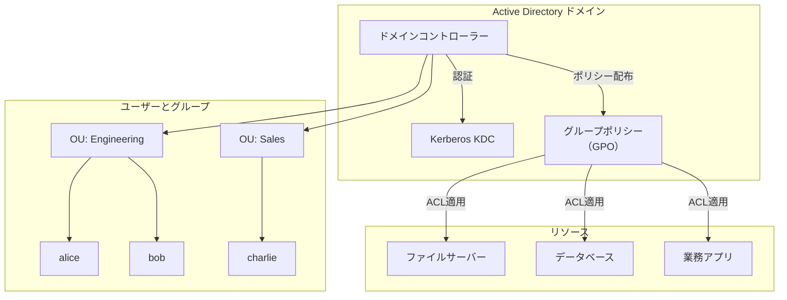

Active Directory は企業内のアクセス制御を大幅に改善したが、以下の前提に依存していた：

- **ネットワーク境界の存在**：社内ネットワーク内のリソースを管理することが前提
- **静的なリソース**：サーバーやファイル共有は固定的であり、動的に作成・削除されることは想定外
- **オンプレミス中心**：ディレクトリサービス自体も社内で運用する

### 1.3 RBAC の形式化

2000年代初頭、NISTは**RBAC（Role-Based Access Control：ロールベースアクセス制御）**の標準モデル（NIST RBAC Model）を策定した。RBACの核心は、ユーザーに直接権限を付与するのではなく、「ロール」という抽象レイヤーを介して権限を割り当てることである。

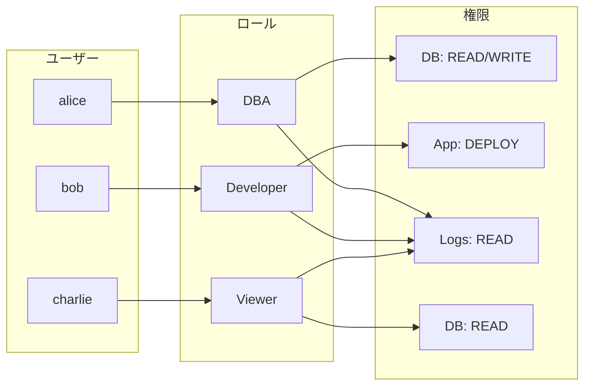

RBACは管理の効率性と監査可能性を大幅に向上させたが、クラウド環境では新たな課題が浮上する。

### 1.4 クラウドにおけるIAMの必要性

クラウドコンピューティングの登場により、アクセス制御のパラダイムは根本的に変化した。従来のオンプレミス環境との対比で考えると、変化の本質が明確になる。

| 観点 | オンプレミス | クラウド |
|------|------------|---------|
| リソースのライフサイクル | 月〜年単位で固定的 | 分〜時間単位で動的に生成・破棄 |
| 管理境界 | 物理ネットワーク境界が明確 | APIがアクセスの入口、境界は論理的 |
| 操作の種類 | 限定的（ファイル操作、DB操作等） | 数千種類のAPIアクション |
| アクセス主体 | 人間ユーザーが中心 | サービス間通信が大半を占める |
| スケール | 数百〜数千ユーザー | 数千アカウント、数百万リソース |
| 認証情報 | ドメイン認証、静的パスワード | 一時的な認証トークン、フェデレーション |

クラウドにおけるIAM（Identity and Access Management）は、これらの変化に対応するために設計された。具体的には、以下の要件を満たす必要がある：

1. **APIファーストのアクセス制御**：すべての操作がAPIコールであるクラウド環境では、APIレベルでの細粒度な権限制御が必須
2. **動的なリソースへの対応**：Auto Scalingで生成されるインスタンスやLambda関数など、動的に生まれるリソースに対して事前にポリシーを定義できる仕組み
3. **サービス間認証**：人間のユーザーだけでなく、アプリケーションやサービスが他のサービスにアクセスする際の認証・認可
4. **マルチテナント環境での分離**：異なるテナント（アカウント）間の完全な分離と、必要に応じたクロスアカウントアクセス
5. **監査と可視性**：誰が・いつ・何に対して・どのような操作を行ったかを完全に記録し追跡可能にする

## 2. アーキテクチャ：主要クラウドプロバイダーのIAM設計

### 2.1 AWS IAM の設計

AWS IAMは2011年にリリースされ、クラウドIAMのデファクトスタンダードとなった。その設計は以下の主要コンポーネントで構成される。

#### エンティティの構造

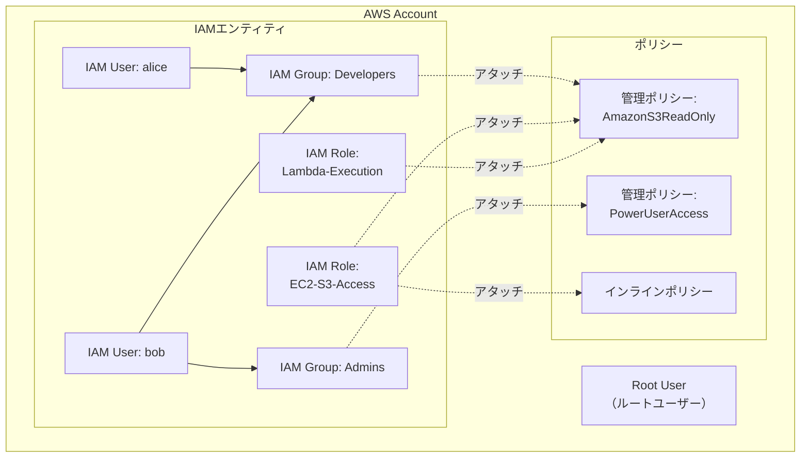

**IAM User**は、AWSアカウント内の永続的なアイデンティティである。ユーザーにはアクセスキー（プログラムアクセス用）やパスワード（コンソールアクセス用）を発行できる。ただし、現代のベストプラクティスでは、人間のユーザーにはIAM Userの代わりにIAM Identity Center（旧AWS SSO）を通じたフェデレーションアクセスが推奨される。

**IAM Group**は、ユーザーの論理的なグループである。グループにポリシーをアタッチすることで、所属するすべてのユーザーにその権限が付与される。これはRBACの「ロール」に相当するが、AWS IAMにおけるRoleとは異なる概念であることに注意が必要である。

**IAM Role**は、AWS IAMの設計上もっとも重要なコンポーネントである。Roleはユーザーではなく、「信頼されたエンティティ」が一時的に引き受ける（assume）ことができる権限のセットである。信頼されたエンティティには、AWSサービス（EC2、Lambda等）、別のAWSアカウントのユーザー、外部のIDプロバイダー（OIDC、SAML）などが含まれる。

::: tip IAM UserとIAM Roleの本質的な違い
IAM Userは「誰であるか」を表す永続的なアイデンティティであり、長期的な認証情報（アクセスキー、パスワード）を持つ。一方、IAM Roleは「何ができるか」を表す権限の集合であり、一時的な認証情報（STS Token）を通じて利用される。現代のAWS設計では、可能な限りIAM Roleを使用し、長期的な認証情報の発行を避けることが推奨される。
:::

#### AWS IAMポリシーの構造

AWS IAMポリシーはJSON形式で記述され、以下の要素で構成される。

```json
{
  "Version": "2012-10-17",
  "Statement": [
    {
      "Sid": "AllowS3BucketListing",
      "Effect": "Allow",
      "Action": [
        "s3:ListBucket"
      ],
      "Resource": "arn:aws:s3:::my-app-bucket",
      "Condition": {
        "StringLike": {
          "s3:prefix": ["home/${aws:username}/*"]
        }
      }
    },
    {
      "Sid": "AllowS3ObjectOperations",
      "Effect": "Allow",
      "Action": [
        "s3:GetObject",
        "s3:PutObject",
        "s3:DeleteObject"
      ],
      "Resource": "arn:aws:s3:::my-app-bucket/home/${aws:username}/*"
    }
  ]
}
```

各要素の意味は次の通りである：

- **Version**：ポリシー言語のバージョン。現在は `"2012-10-17"` が最新
- **Statement**：1つ以上の権限ステートメントの配列
- **Sid**（Statement ID）：ステートメントの識別子（オプション）
- **Effect**：`Allow` または `Deny`。権限を許可するか拒否するかを指定
- **Action**：許可または拒否するAPIアクション（例：`s3:GetObject`）
- **Resource**：対象となるAWSリソースのARN（Amazon Resource Name）
- **Condition**：ポリシーが適用される条件（オプション）

### 2.2 GCP IAM の設計

Google Cloud Platform（GCP）のIAMは、AWSとは異なるアーキテクチャ上の選択を行っている。もっとも顕著な違いは**リソース階層**を中心とした設計である。

#### リソース階層とポリシー継承

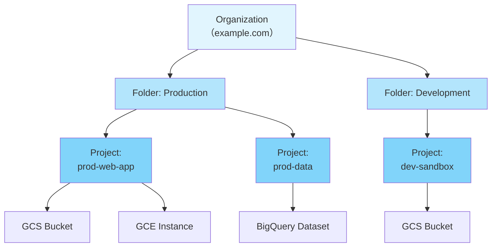

GCP IAMの特徴は、ポリシーがリソース階層を通じて**継承**される点にある。Organization レベルで付与されたロールは、配下のすべてのFolder、Project、個別リソースに対して有効になる。この継承はadditive（加算的）であり、上位で付与された権限を下位で取り消すことはできない。

> [!WARNING]
> GCP IAMでは、上位の階層で付与された権限を下位レベルで取り消すことは**できない**。これはAWSの「明示的Deny」とは対照的である。GCPで権限を制限するには、IAM Deny Policy（2022年にGA）や組織ポリシー（Organization Policy）を使用する必要がある。

#### バインディングモデル

GCP IAMのポリシーは**バインディング**という概念で構成される。バインディングは「誰が」「どのロールを」「どのリソースに対して」持つかを定義する。

```json
{
  "bindings": [
    {
      "role": "roles/storage.objectViewer",
      "members": [
        "user:alice@example.com",
        "serviceAccount:my-app@my-project.iam.gserviceaccount.com",
        "group:developers@example.com"
      ],
      "condition": {
        "title": "expires_after_2026_06",
        "expression": "request.time < timestamp('2026-06-01T00:00:00Z')"
      }
    }
  ]
}
```

GCPのロールには3種類ある：

1. **基本ロール（Basic Roles）**：`Owner`、`Editor`、`Viewer` の3種類。非常に粗い粒度であり、本番環境での使用は推奨されない
2. **定義済みロール（Predefined Roles）**：Googleが定義した細粒度のロール（例：`roles/storage.objectViewer`）
3. **カスタムロール（Custom Roles）**：組織が独自に定義するロール。必要な権限のみを含めることで最小権限を実現する

### 2.3 Azure（Microsoft Entra ID）の設計

MicrosoftのクラウドIAMは、オンプレミスのActive Directoryの資産を活かしつつ、クラウドネイティブな機能を提供する点が特徴的である。2023年に Azure Active Directory は **Microsoft Entra ID** にリブランドされた。

Azure のIAMアーキテクチャでは、以下のコンポーネントが連携する：

- **Microsoft Entra ID（旧 Azure AD）**：クラウドベースのIDプロバイダー。認証、シングルサインオン（SSO）、多要素認証（MFA）を提供
- **Azure RBAC**：Azureリソースに対するアクセス制御。スコープ（管理グループ、サブスクリプション、リソースグループ、リソース）に対してロールの割り当てを行う
- **マネージドID（Managed Identity）**：Azureリソースに自動的に付与されるIDで、AWSのIAM Roleに相当する。認証情報の管理が不要

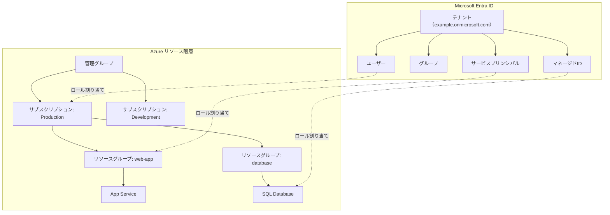

Azure RBACのロール割り当て（Role Assignment）は、**セキュリティプリンシパル**（ユーザー、グループ、サービスプリンシパル、マネージドID）に対して、**ロール定義**（権限の集合）を、**スコープ**（適用範囲）で関連付ける3要素で構成される。

### 2.4 ポリシー評価ロジック：明示的Deny > Allow

クラウドIAMにおいて、アクセス要求がどのように評価されるかは極めて重要な設計判断である。AWS IAMのポリシー評価ロジックを例に、その仕組みを詳しく見ていく。

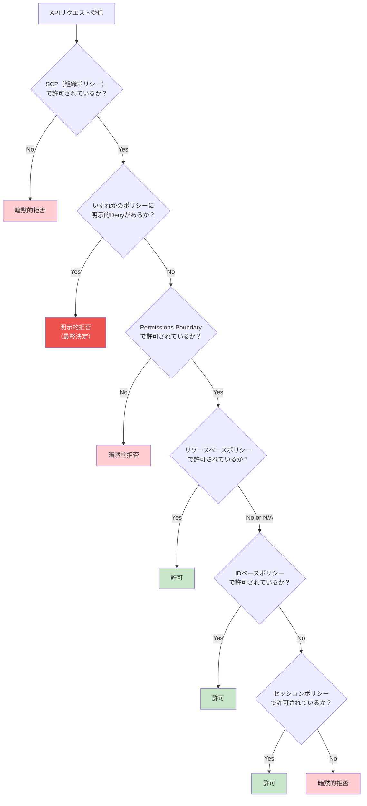

この評価ロジックにおける重要な原則は以下の通りである：

1. **デフォルト拒否（Default Deny）**：明示的にAllowされていないアクションは、すべて暗黙的に拒否される
2. **明示的Denyの優先**：どのポリシーに記述されていても、明示的なDenyはAllowよりも常に優先される
3. **評価の順序**：SCP → 明示的Deny → Permissions Boundary → リソースベースポリシー → IDベースポリシー → セッションポリシーの順序で評価される
4. **複数ポリシーの集約**：アイデンティティに複数のポリシーがアタッチされている場合、それらは論理ORで結合される（いずれかのポリシーでAllowされていれば許可）

::: danger 明示的Denyは絶対
明示的なDenyステートメントは、他のどのポリシーのAllowよりも優先される。これは意図しないアクセスを防ぐための安全弁であり、「このアクションだけは絶対に許可しない」というガードレールとして機能する。例えば、ルートユーザー以外がS3バケットの削除を行うことを完全に禁止する、といったポリシーが可能である。
:::

### 2.5 主要クラウドプロバイダーの設計比較

3大クラウドプロバイダーのIAM設計を比較すると、それぞれの設計思想の違いが見えてくる。

| 観点 | AWS IAM | GCP IAM | Azure RBAC |
|------|---------|---------|------------|
| ポリシーモデル | リソースベース + IDベース | バインディングベース | ロール割り当てベース |
| ポリシーの記述 | JSON（Action/Resource/Condition） | バインディング + IAM Conditions | JSON（Actions/DataActions） |
| 継承モデル | アカウント内でポリシーをアタッチ | リソース階層で自動継承 | スコープ階層で継承 |
| 明示的Deny | あり（最優先） | IAM Deny Policy（後発） | あり（NotActions/Deny Assignment） |
| サービスアカウント | IAM Role（EC2, Lambda等） | Service Account（独立エンティティ） | Managed Identity |
| クロスアカウント | AssumeRole + Trust Policy | プロジェクト横断のIAM Binding | テナント間のサービスプリンシパル |
| 組織レベル制御 | SCP（Service Control Policy） | Organization Policy | Azure Policy + Management Group |

## 3. 実装手法

### 3.1 IAMポリシーの書き方：JSON構造と条件キー

IAMポリシーの設計は、クラウドセキュリティの基盤である。ここでは、実務で頻出するポリシーパターンとその書き方を詳しく解説する。

#### 条件キー（Condition）の活用

条件キーは、ポリシーの適用範囲を細かく制御するための強力な機能である。IPアドレス制限、時間制限、リクエスト属性による制限など、多様な条件を組み合わせることができる。

```json
{
  "Version": "2012-10-17",
  "Statement": [
    {
      "Sid": "DenyAccessFromOutsideCorporateNetwork",
      "Effect": "Deny",
      "Action": "*",
      "Resource": "*",
      "Condition": {
        "NotIpAddress": {
          "aws:SourceIp": [
            "203.0.113.0/24",
            "198.51.100.0/24"
          ]
        },
        "Bool": {
          "aws:ViaAWSService": "false"
        }
      }
    }
  ]
}
```

> [!NOTE]
> `aws:ViaAWSService` 条件キーを `false` で評価しているのは、AWSサービスが内部的に発行するリクエスト（例：CloudFormation がEC2インスタンスを作成する際のAPI呼び出し）がIPアドレス制限に引っかかることを防ぐためである。

#### タグベースのアクセス制御（ABAC）

AWS IAMでは、タグを使った**ABAC（Attribute-Based Access Control：属性ベースアクセス制御）**が可能である。これにより、リソースの属性に基づいた動的なアクセス制御を実現できる。

```json
{
  "Version": "2012-10-17",
  "Statement": [
    {
      "Sid": "AllowAccessToOwnProjectResources",
      "Effect": "Allow",
      "Action": [
        "ec2:StartInstances",
        "ec2:StopInstances",
        "ec2:TerminateInstances"
      ],
      "Resource": "*",
      "Condition": {
        "StringEquals": {
          "aws:ResourceTag/Project": "${aws:PrincipalTag/Project}",
          "aws:ResourceTag/Environment": "development"
        }
      }
    }
  ]
}
```

このポリシーは、「ユーザー自身のProjectタグと同じProjectタグを持ち、かつEnvironmentタグがdevelopmentであるEC2インスタンスに対してのみ、起動・停止・終了を許可する」という意味である。ABACの利点は、新しいリソースやユーザーが追加されるたびにポリシーを更新する必要がないことであり、大規模環境でのスケーラビリティに優れている。

### 3.2 AssumeRole とクロスアカウントアクセス

AWSのAssumeRoleは、IAM設計の中核を成す仕組みである。あるプリンシパル（ユーザー、サービス、別アカウントのロール）が、別のIAM Roleを一時的に引き受けることで、そのRoleに付与された権限を取得する。

#### AssumeRole の仕組み

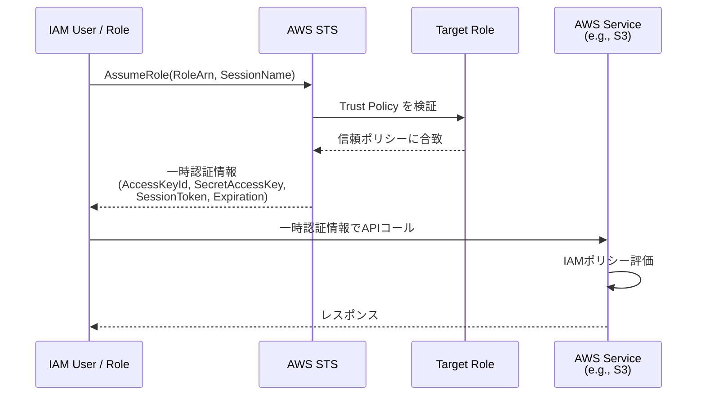

AssumeRoleが成立するには、2つのポリシーが必要である：

1. **信頼ポリシー（Trust Policy）**：引き受けられるRole側に設定する。「誰がこのRoleを引き受けられるか」を定義する
2. **権限ポリシー（Permissions Policy）**：引き受けられるRole側に設定する。「このRoleで何ができるか」を定義する

加えて、引き受ける側のプリンシパルにも `sts:AssumeRole` アクションの権限が必要である。

#### クロスアカウントアクセスの設定例

本番環境アカウント（Account B）のS3バケットに、開発アカウント（Account A）のユーザーがアクセスする場合を考える。

**Account B（本番環境）側のRoleの信頼ポリシー：**

```json
{
  "Version": "2012-10-17",
  "Statement": [
    {
      "Sid": "AllowCrossAccountAssume",
      "Effect": "Allow",
      "Principal": {
        "AWS": "arn:aws:iam::111111111111:role/DevOpsRole"
      },
      "Action": "sts:AssumeRole",
      "Condition": {
        "Bool": {
          "aws:MultiFactorAuthPresent": "true"
        },
        "NumericLessThan": {
          "aws:MultiFactorAuthAge": "3600"
        }
      }
    }
  ]
}
```

**Account B（本番環境）側のRoleの権限ポリシー：**

```json
{
  "Version": "2012-10-17",
  "Statement": [
    {
      "Sid": "AllowS3ReadAccess",
      "Effect": "Allow",
      "Action": [
        "s3:GetObject",
        "s3:ListBucket"
      ],
      "Resource": [
        "arn:aws:s3:::prod-data-bucket",
        "arn:aws:s3:::prod-data-bucket/*"
      ]
    }
  ]
}
```

この例では、MFAが認証されてから3600秒（1時間）以内でなければAssumeRoleが許可されないという条件が含まれており、クロスアカウントアクセスのセキュリティを強化している。

### 3.3 サービスアカウントとワークロードID

クラウド環境では、人間のユーザーによるアクセスよりも、サービス間通信のほうがはるかに多い。各クラウドプロバイダーは、サービスやワークロードに対してIDを割り当てる仕組みを提供している。

#### AWS：EC2インスタンスプロファイルとIAM Role

EC2インスタンスにIAM Roleを関連付けることで、インスタンス上で動作するアプリケーションは一時的な認証情報を**インスタンスメタデータサービス（IMDS）**から取得できる。

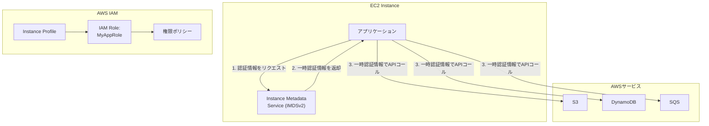

::: warning IMDSv2 の使用を強制する
IMDSv1はHTTP GETリクエストのみで認証情報を取得できるため、SSRF（Server-Side Request Forgery）攻撃に対して脆弱である。2019年のCapital One事件では、WAFの設定ミスを利用したSSRF攻撃でIMDSv1から認証情報が窃取された。IMDSv2ではPUTリクエストによるトークン取得が必須となり、SSRF攻撃のリスクを大幅に低減する。本番環境ではIMDSv2の使用を強制すべきである。
:::

#### GCP：サービスアカウント

GCPのサービスアカウントは、ワークロードに対するIDとして独立したエンティティである。サービスアカウントは以下の2つの方法で利用される：

1. **アタッチ型**：GCEインスタンスやCloud Functionsにサービスアカウントを関連付ける。ワークロードは自動的にそのサービスアカウントの認証情報を取得する
2. **インパーソネーション型**：あるプリンシパルが別のサービスアカウントの権限を一時的に借りる（AWSのAssumeRoleに相当）

```json
{
  "bindings": [
    {
      "role": "roles/iam.serviceAccountUser",
      "members": [
        "user:admin@example.com"
      ]
    },
    {
      "role": "roles/iam.serviceAccountTokenCreator",
      "members": [
        "serviceAccount:ci-pipeline@my-project.iam.gserviceaccount.com"
      ]
    }
  ]
}
```

#### Azure：マネージドID

AzureのマネージドID（Managed Identity）は、認証情報の管理を完全にAzureプラットフォームに委任する仕組みである。**システム割り当てマネージドID**はリソースのライフサイクルに紐づき、リソースの削除とともに自動的に削除される。**ユーザー割り当てマネージドID**は独立したリソースとして管理され、複数のリソースで共有できる。

### 3.4 OIDC Federation（GitHub Actions 等）

従来、CI/CDパイプラインからクラウドリソースにアクセスするためには、長期的なアクセスキーをシークレットとして保存する必要があった。しかし、この方法はキーのローテーション管理が煩雑であり、漏洩リスクも存在する。

**OIDC Federation**（OpenID Connect Federation）は、外部のIDプロバイダーが発行するOIDCトークンをクラウドプロバイダーの一時的な認証情報と交換する仕組みであり、長期的な認証情報を排除する。

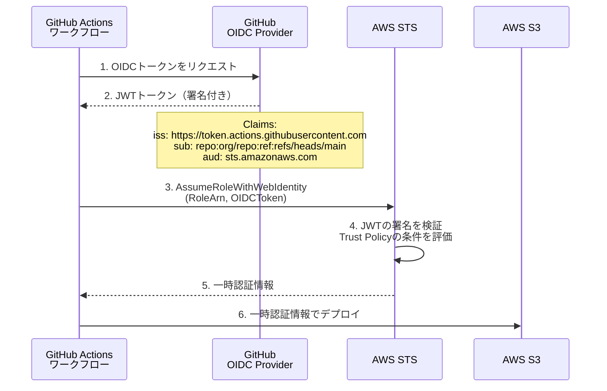

AWS側のIAM Roleの信頼ポリシーは以下のように設定する：

```json
{
  "Version": "2012-10-17",
  "Statement": [
    {
      "Effect": "Allow",
      "Principal": {
        "Federated": "arn:aws:iam::123456789012:oidc-provider/token.actions.githubusercontent.com"
      },
      "Action": "sts:AssumeRoleWithWebIdentity",
      "Condition": {
        "StringEquals": {
          "token.actions.githubusercontent.com:aud": "sts.amazonaws.com"
        },
        "StringLike": {
          "token.actions.githubusercontent.com:sub": "repo:my-org/my-repo:ref:refs/heads/main"
        }
      }
    }
  ]
}
```

::: tip OIDC Federationの利点
1. **認証情報の排除**：長期的なアクセスキーが不要になる
2. **細粒度の制御**：リポジトリ名、ブランチ名、環境名などの条件で制限可能
3. **監査性の向上**：CloudTrailで「どのリポジトリのどのワークフローが操作を行ったか」を追跡できる
4. **ローテーション不要**：一時的な認証情報は自動的に有効期限が切れる
:::

### 3.5 IAM Access Analyzer

IAMポリシーの設計は複雑であり、意図しない過剰な権限が付与されるリスクが常に存在する。AWSの**IAM Access Analyzer**は、このリスクを軽減するための分析ツールである。

IAM Access Analyzerには2つの主要機能がある：

**外部アクセスの検出**：S3バケット、SQSキュー、IAM Role、Lambda関数、KMSキーなどのリソースポリシーを分析し、アカウント外部からのアクセスを許可している設定を検出する。

**ポリシー検証**：IAMポリシーのJSON構文をチェックし、セキュリティ上の警告やベストプラクティスとの乖離を報告する。

さらに、**未使用のアクセスの検出**が可能であり、過去のCloudTrailログに基づいて実際に使用されたアクションのみを含むポリシーの生成を支援する。これにより、最小権限の原則を実践的に適用できる。

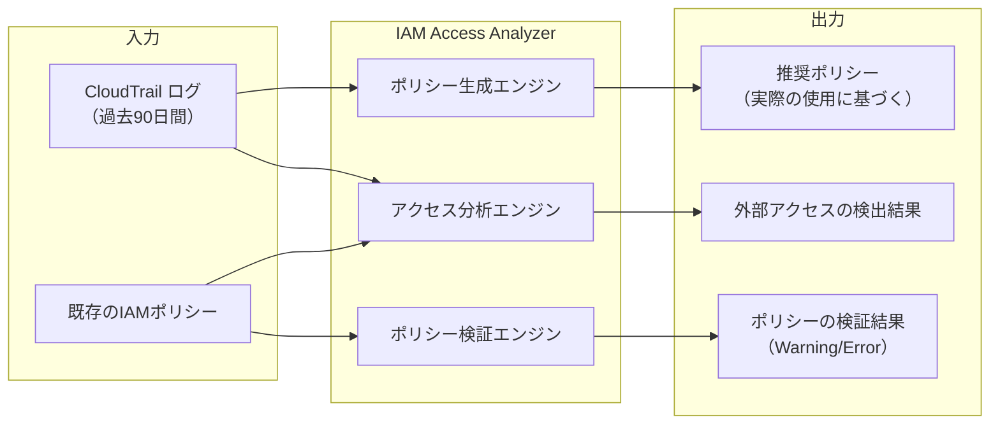

GCPにおいても、**IAM Recommender**が同様の機能を提供しており、過去90日間のアクティビティに基づいて未使用の権限を検出し、より制限的なロールへの変更を推奨する。

## 4. 運用の実際

### 4.1 最小権限の実践

最小権限の原則（Principle of Least Privilege）は、「エンティティには、そのタスクの遂行に必要な最小限の権限のみを付与する」というセキュリティの基本原則である。しかし、この原則を実際の運用で徹底することは容易ではない。

#### Permissions Boundary

AWSの**Permissions Boundary（権限境界）**は、IAMエンティティが持つことができる権限の**上限**を定義するメカニズムである。管理者はPermissions Boundaryを設定することで、IAMユーザーやロールが自身にアタッチできるポリシーの効果範囲を制限できる。

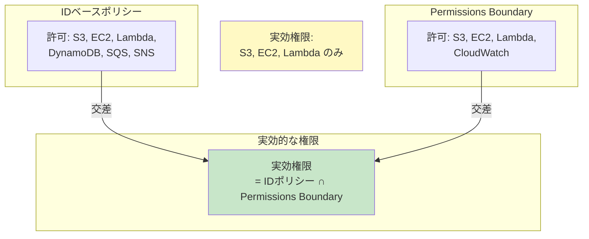

Permissions Boundaryの典型的なユースケースは、**委任管理**である。たとえば、開発チームのリーダーにIAMユーザーやロールの作成を許可しつつ、そのリーダーが作成するエンティティが持てる権限を制限する：

```json
{
  "Version": "2012-10-17",
  "Statement": [
    {
      "Sid": "AllowCreateRoleWithBoundary",
      "Effect": "Allow",
      "Action": [
        "iam:CreateRole",
        "iam:AttachRolePolicy",
        "iam:PutRolePolicy"
      ],
      "Resource": "arn:aws:iam::123456789012:role/dev-*",
      "Condition": {
        "StringEquals": {
          "iam:PermissionsBoundary": "arn:aws:iam::123456789012:policy/DeveloperBoundary"
        }
      }
    }
  ]
}
```

このポリシーは、「`dev-` で始まる名前のロールの作成を許可するが、その際に必ず `DeveloperBoundary` をPermissions Boundaryとして設定しなければならない」という条件を課している。

#### SCP（Service Control Policy）

**SCP（サービスコントロールポリシー）**は、AWS Organizationsの機能であり、組織全体または特定のOU（Organizational Unit）に対してアクセス制御のガードレールを設定する。SCPはアカウント内のすべてのプリンシパル（ルートユーザーを含む）に適用される。

::: details SCP の具体例：リージョン制限

以下のSCPは、東京リージョン（ap-northeast-1）以外でのすべてのAWSサービスの使用を禁止する。ただし、グローバルサービス（IAM、STS、CloudFront等）は除外する。

```json
{
  "Version": "2012-10-17",
  "Statement": [
    {
      "Sid": "DenyAllOutsideAllowedRegions",
      "Effect": "Deny",
      "NotAction": [
        "iam:*",
        "sts:*",
        "cloudfront:*",
        "route53:*",
        "support:*",
        "organizations:*",
        "budgets:*"
      ],
      "Resource": "*",
      "Condition": {
        "StringNotEquals": {
          "aws:RequestedRegion": [
            "ap-northeast-1"
          ]
        }
      }
    }
  ]
}
```
:::

SCPは権限を付与するものではなく、権限の上限を定義するものである。SCPでAllowされていないアクションは、アカウント内のどのIAMポリシーでAllowされていても実行できない。

### 4.2 ロール設計パターン

大規模な組織におけるIAMロールの設計には、いくつかの確立されたパターンがある。

#### パターン1：職能別ロール（Functional Roles）

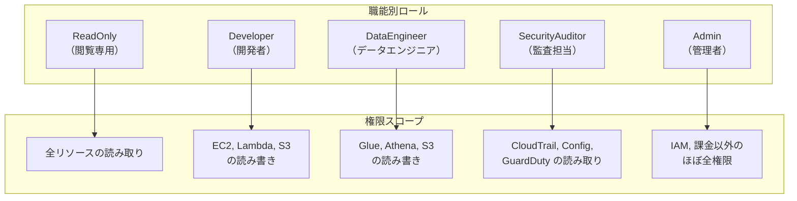

#### パターン2：環境別ロール（Environment-scoped Roles）

同じ職能であっても、環境（開発、ステージング、本番）ごとに異なるロールを作成する。

```
DevAccount-Developer     → 開発環境: 広範な権限
StagingAccount-Developer → ステージング環境: 中程度の権限
ProdAccount-Developer    → 本番環境: 読み取り+限定的なデプロイ権限のみ
```

#### パターン3：ブレークグラス（Break Glass）ロール

緊急時にのみ使用される、通常より広い権限を持つロール。使用時にはアラートが発報され、事後に監査が行われる。

```json
{
  "Version": "2012-10-17",
  "Statement": [
    {
      "Sid": "EmergencyAccess",
      "Effect": "Allow",
      "Action": "*",
      "Resource": "*",
      "Condition": {
        "Bool": {
          "aws:MultiFactorAuthPresent": "true"
        },
        "NumericLessThan": {
          "aws:MultiFactorAuthAge": "900"
        }
      }
    }
  ]
}
```

> [!CAUTION]
> ブレークグラスロールの使用は厳密に監視されるべきである。CloudTrailと連携したアラートを設定し、使用が検出されたら即座にセキュリティチームに通知する仕組みが必須である。また、セッション期間は可能な限り短く設定する。

### 4.3 セキュリティ監査

IAMの運用においては、権限の付与だけでなく、その使用状況の継続的な監査が不可欠である。

#### CloudTrail

AWS CloudTrailは、AWSアカウント内のすべてのAPIコールを記録するサービスである。IAMの監査において、以下の情報を追跡できる：

- **誰が**：呼び出し元のプリンシパル（IAM User、Role、Federated User）
- **いつ**：API呼び出しのタイムスタンプ
- **何を**：呼び出されたAPIアクション
- **どのリソースに対して**：操作の対象となったリソース
- **どこから**：ソースIPアドレス、ユーザーエージェント
- **結果**：成功または失敗（AccessDeniedを含む）

```json
{
  "eventVersion": "1.09",
  "userIdentity": {
    "type": "AssumedRole",
    "principalId": "AROA3XXXXXXXXXXX:session-name",
    "arn": "arn:aws:sts::123456789012:assumed-role/DevOpsRole/session-name",
    "accountId": "123456789012",
    "sessionContext": {
      "sessionIssuer": {
        "type": "Role",
        "arn": "arn:aws:iam::123456789012:role/DevOpsRole"
      }
    }
  },
  "eventTime": "2026-03-01T10:30:00Z",
  "eventSource": "s3.amazonaws.com",
  "eventName": "PutObject",
  "awsRegion": "ap-northeast-1",
  "sourceIPAddress": "203.0.113.50",
  "resources": [
    {
      "ARN": "arn:aws:s3:::prod-data-bucket/config/app.json"
    }
  ]
}
```

#### IAM Access Advisor

IAM Access Advisorは、IAMエンティティが各AWSサービスに**最後にアクセスした日時**を表示する。この情報を活用することで、長期間使用されていない権限を特定し、削除できる。

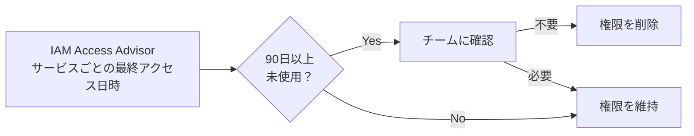

::: tip 権限の棚卸しプロセス
最小権限を維持するためには、定期的な権限の棚卸しが重要である。推奨されるプロセスは以下の通りである：
1. IAM Access AdvisorとAccess Analyzerを使って未使用の権限を特定する
2. 該当チームに確認し、不要な権限を特定する
3. まずDenyポリシーで該当権限を一定期間ブロックし、影響がないことを確認する
4. 問題がなければ、該当権限をポリシーから完全に削除する
5. この一連のプロセスを四半期ごとに実施する
:::

#### GCPにおける監査

GCPでは、**Cloud Audit Logs**が同等の機能を提供する。監査ログは以下の4種類に分類される：

1. **管理アクティビティログ**：リソースの作成・変更・削除（常に有効、無料）
2. **データアクセスログ**：リソースのデータの読み取り・書き込み（明示的に有効化が必要）
3. **システムイベントログ**：Googleが実行するシステムイベント
4. **ポリシー拒否ログ**：IAMポリシーによってアクセスが拒否されたイベント

### 4.4 一時認証情報の徹底

クラウドIAMのセキュリティにおいて、**長期的な認証情報の排除**はもっとも重要な実践事項の一つである。

長期的な認証情報（IAMアクセスキー、サービスアカウントキー）は以下のリスクを持つ：

- **漏洩リスク**：ソースコードへの誤コミット、ログへの混入、開発者のローカルマシンからの窃取
- **管理コスト**：定期的なローテーション、失効した認証情報の無効化、使用状況の追跡
- **過剰な有効期間**：一度発行されると明示的に無効化するまで有効であり、攻撃者に長期間利用される可能性がある

一時認証情報を徹底するための実装パターンを以下にまとめる。

| シナリオ | 推奨する認証方法 | 避けるべき方法 |
|---------|----------------|--------------|
| EC2上のアプリケーション | IAM Role + インスタンスプロファイル | IAMアクセスキーの環境変数設定 |
| Lambda関数 | 実行ロール（Execution Role） | 環境変数にアクセスキーを保存 |
| CI/CDパイプライン | OIDC Federation | シークレットにアクセスキーを保存 |
| 開発者のローカル環境 | IAM Identity Center + SSO | 長期アクセスキー（~/.aws/credentials） |
| クロスアカウントアクセス | AssumeRole | 共有IAMユーザー |
| EKS Pod | IRSA（IAM Roles for Service Accounts） | Node Role に広い権限を付与 |

::: details EKS における IRSA（IAM Roles for Service Accounts）

EKS（Elastic Kubernetes Service）では、Pod単位でIAM Roleを関連付けるIRSA（IAM Roles for Service Accounts）が利用可能である。IRSAはOIDC Federationを活用し、KubernetesのService Accountトークンを一時的なAWS認証情報と交換する。

後継のEKS Pod Identityも登場しており、より簡潔な設定で同様の機能を提供する。

```yaml
# Kubernetes ServiceAccount with IAM Role annotation
apiVersion: v1
kind: ServiceAccount
metadata:
  name: my-app
  namespace: default
  annotations:
    # associate IAM role with this service account
    eks.amazonaws.com/role-arn: arn:aws:iam::123456789012:role/MyAppRole
```

これにより、当該Service Accountを使用するPodは自動的にMyAppRoleの一時認証情報を取得する。Node全体に広い権限を持つIAM Roleを割り当てる方法と比較して、Pod単位の最小権限が実現できる。
:::

## 5. 将来展望

### 5.1 AWS Verified Access

AWS Verified Access（2023年GA）は、VPNを使用せずに企業アプリケーションへのセキュアなアクセスを提供するサービスである。従来はVPNで社内ネットワークに接続してからアプリケーションにアクセスする必要があったが、Verified Accessはゼロトラストの原則に基づき、ユーザーのアイデンティティとデバイスのセキュリティ状態を検証したうえで、個別のアプリケーションへのアクセスを許可する。

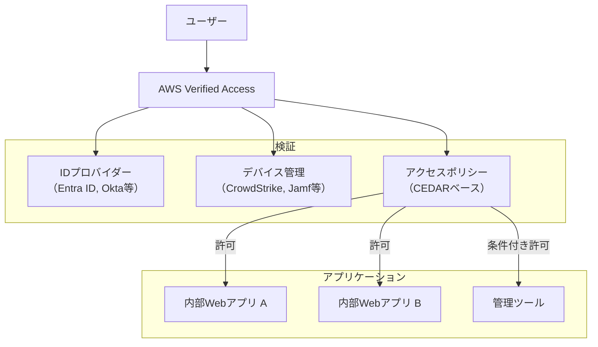

Verified Accessにおいて注目すべきは、アクセスポリシーの記述に**CEDAR言語**が採用されている点である。

### 5.2 CEDAR 言語

**CEDAR**（Cedar Evaluation, Decision, and Authorization Runtime）は、Amazonが開発したオープンソースのポリシー記述言語・評価エンジンである。AWS Verified AccessおよびAmazon Verified Permissionsで採用されており、従来のIAMポリシーJSON形式よりも表現力が高く、読みやすい構文を持つ。

```
// CEDAR policy: allow developers to access dev environment
permit (
    principal in Group::"Developers",
    action in [Action::"ViewApp", Action::"DeployApp"],
    resource in Environment::"Development"
);

// CEDAR policy: deny access from unmanaged devices
forbid (
    principal,
    action,
    resource
) when {
    !(context.device.managed == true)
};

// CEDAR policy: time-based access restriction
permit (
    principal in Group::"OnCallEngineers",
    action == Action::"SSHAccess",
    resource in ResourceGroup::"ProductionServers"
) when {
    context.time.hour >= 0 &&
    context.time.hour <= 23 &&
    context.incident.active == true
};
```

CEDARの設計上の特徴は以下の通りである：

1. **形式的に検証可能**：CEDARのポリシー言語は形式化されており、自動推論ツールによって「あるポリシーセットが特定の条件下でアクセスを許可するか」を静的に検証できる
2. **高速な評価**：ポリシーの評価が一定時間内に完了することが保証されている（チューリング完全ではない）
3. **分析ツールの提供**：ポリシーの衝突検出や影響範囲分析が可能
4. **アプリケーション組込み可能**：ライブラリとして提供されており、アプリケーション内の認可ロジックに組み込める

> [!NOTE]
> CEDARは**Amazon Verified Permissions**というサービスを通じて、アプリケーション内の認可（Authorization）にも利用可能である。これにより、クラウドインフラのIAMとアプリケーションレベルの認可を統一的なポリシー言語で管理できる可能性が開かれている。

### 5.3 ポリシーアズコード（Policy as Code）

IAMポリシーの管理は、Infrastructure as Code（IaC）の一部としてコード化されるべきである。ポリシーアズコードには、以下の利点がある：

1. **バージョン管理**：ポリシーの変更履歴をGitで追跡できる
2. **レビュープロセス**：ポリシーの変更にコードレビューを適用できる
3. **自動テスト**：ポリシーの変更がセキュリティ要件を満たすことを自動検証できる
4. **環境間の一貫性**：開発・ステージング・本番で同一のポリシー定義を適用できる

**Open Policy Agent（OPA）**は、ポリシーアズコードの代表的なツールである。Regoという宣言的言語でポリシーを記述し、さまざまな場面で評価を行う。

```
# Rego policy: deny IAM policies with wildcard actions
package aws.iam

# deny policies that grant wildcard actions
deny[msg] {
    input.resource.type == "aws_iam_policy"
    policy := json.unmarshal(input.resource.values.policy)
    statement := policy.Statement[_]
    statement.Effect == "Allow"
    statement.Action == "*"
    msg := sprintf("IAM policy '%s' grants wildcard actions", [input.resource.name])
}

# deny policies without conditions on sensitive actions
deny[msg] {
    input.resource.type == "aws_iam_policy"
    policy := json.unmarshal(input.resource.values.policy)
    statement := policy.Statement[_]
    statement.Effect == "Allow"
    sensitive_action(statement.Action[_])
    not statement.Condition
    msg := sprintf("IAM policy '%s' grants sensitive action without conditions", [input.resource.name])
}

sensitive_action(action) {
    startswith(action, "iam:")
}

sensitive_action(action) {
    startswith(action, "sts:")
}
```

Terraformとの統合では、**Sentinel**（HashiCorp製）や**OPA/Conftest**を使ったポリシーチェックがCI/CDパイプラインに組み込まれる。

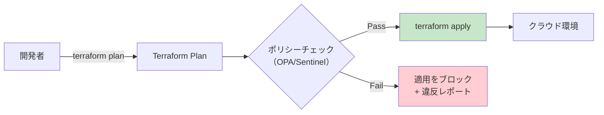

### 5.4 ゼロトラストとの統合

クラウドIAMはゼロトラストアーキテクチャの中核コンポーネントとして進化を続けている。従来のIAMは「認証されたユーザーに対して権限を付与する」という静的なモデルであったが、ゼロトラストの原則に基づく次世代IAMは以下のような特性を持つ。

**継続的な検証（Continuous Verification）**：一度の認証で信頼を確立するのではなく、セッション中も継続的にリスクを評価し、リスクレベルに応じてアクセスを動的に調整する。

**コンテキストアウェアなアクセス制御**：ユーザーのアイデンティティだけでなく、デバイスの状態、ネットワークの場所、アクセス時間、行動パターンなどのコンテキスト情報を総合的に評価してアクセス判断を行う。

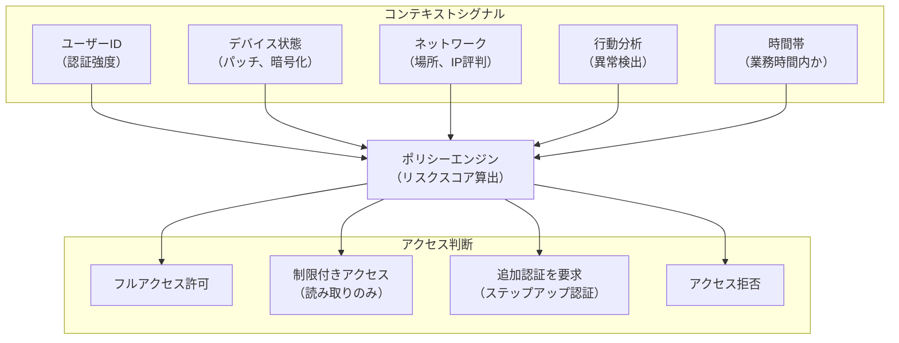

**JIT（Just-In-Time）アクセス**の高度化も進んでいる。必要な時にだけ権限を申請し、承認を経て一時的に付与される仕組みは、最小権限の原則を時間軸にも拡張するものである。AWSのIAM Identity CenterやGCPのPrivileged Access Manager（PAM）がこの方向性を実装している。

### 5.5 今後の課題と方向性

クラウドIAMは今後も以下の方向で進化が予想される：

**マルチクラウドIAMの統合**：多くの組織が複数のクラウドプロバイダーを利用している現在、IAMの統一的な管理は大きな課題である。SPIFFE/SPIRE（Secure Production Identity Framework for Everyone）は、クラウドプロバイダーに依存しないワークロードIDの標準化を目指している。

**AIを活用したポリシー推奨**：CloudTrailなどの監査ログを大規模言語モデルで分析し、最適なポリシーを自動生成する試みが始まっている。しかし、セキュリティポリシーの自動生成は、その正確性の検証が極めて重要であり、人間によるレビューが不可欠である。

**ポリシーの形式的検証**：CEDAR言語に見られるように、ポリシーの形式的検証（「あるポリシーセットが意図したアクセスパターンのみを許可し、意図しないアクセスを確実に拒否するか」の数学的証明）への関心が高まっている。AWS IAM Access Analyzerの内部ではZelkova（自動推論エンジン）が使われており、ポリシーの分析に自動推論技術が実用化されている。

## まとめ

クラウドIAMは、単なるアクセス制御の仕組みを超えて、クラウドセキュリティの基盤そのものである。本記事で解説した設計原則を要約すると、以下の点に集約される：

1. **デフォルト拒否と明示的許可**：すべてのアクセスはデフォルトで拒否され、明示的に許可されたアクションのみが実行可能である
2. **ロールベースの一時的なアクセス**：長期的な認証情報を排除し、ロールとSTSによる一時認証情報を使用する
3. **最小権限の継続的な実践**：初期設定だけでなく、IAM Access AdvisorやAccess Analyzerを活用した定期的な権限の棚卸しが不可欠
4. **ガードレールの多層防御**：SCP、Permissions Boundary、リソースポリシーの組み合わせにより、個々の設定ミスが致命的な影響を与えないようにする
5. **監査と可視性**：CloudTrailによる全APIコールの記録と、異常検知の自動化

クラウドIAMの設計は、「正しく設定すれば安全」という静的なものではなく、組織の変化、サービスの拡張、脅威の進化に合わせて継続的に進化させていくべき動的なプロセスである。CEDAR言語やポリシーアズコードの発展は、このプロセスをより体系的かつ検証可能にする方向に進んでおり、今後のクラウドセキュリティの中核を担い続けるだろう。
