# クラウドネットワーク設計（VPC, サブネット, Security Group, PrivateLink）

## 1. 歴史的背景 — 物理ネットワークから仮想ネットワークへ

### 1.1 EC2-Classicの時代

Amazon Web Services（AWS）が2006年にEC2を一般公開した当初、すべてのインスタンスは一つの巨大なフラットネットワーク上に配置されていた。これは**EC2-Classic**と呼ばれるネットワークモデルである。

EC2-Classicでは、すべてのユーザーのインスタンスが同一のアドレス空間を共有し、セキュリティグループというファイアウォール機能はあったものの、ネットワーク的な分離は限定的であった。ユーザーが自分のIPアドレス範囲を定義したり、サブネットを構成したりすることはできなかった。これは従来のデータセンターにおける「共有ネットワーク」に似た構成であり、以下の問題を抱えていた。

- **IPアドレスの衝突リスク**：AWSがグローバルに割り当てるため、ユーザーが制御できない
- **ネットワーク分離の欠如**：マルチテナント環境でのセキュリティ境界が不明確
- **オンプレミスとの接続困難**：ユーザー固有のIPアドレス体系を持てないため、既存の社内ネットワークとの統合が難しい
- **複雑な構成の制限**：ルーティングやサブネット構成を自由に設計できない

### 1.2 VPCの登場とSDNの採用

2009年、AWSはこれらの問題を解決するために**Virtual Private Cloud（VPC）**を導入した。VPCは、ユーザーごとに論理的に隔離された仮想ネットワークを提供する。ユーザーは自分のIPアドレス範囲を定義し、サブネットを構成し、ルーティングテーブルやゲートウェイを自由に設計できるようになった。

VPCの技術的基盤には**SDN（Software-Defined Networking）**がある。SDNは、ネットワークの制御プレーン（ルーティング判断、ポリシー適用）とデータプレーン（パケット転送）を分離するアーキテクチャ概念である。物理ネットワーク機器のファームウェアにルーティングロジックを書き込むのではなく、ソフトウェアでネットワーク全体を制御する。

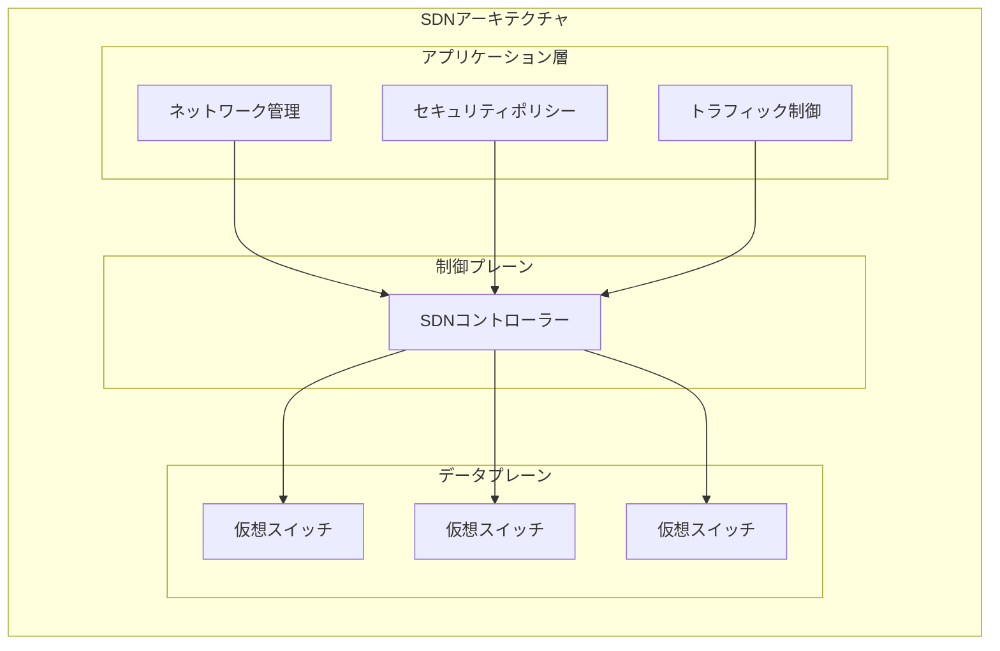

AWSの内部では、VPCの実装に**カプセル化技術**が使われている。各インスタンスのパケットは、VPC固有の識別子とともに外側のヘッダーで包まれ（VXLAN、GREなどの技術に類似）、物理ネットワーク上を転送される。これにより、同じ物理ホスト上で異なるVPCのインスタンスが共存しても、互いのトラフィックは完全に隔離される。

2013年12月にはEC2-Classicの新規作成が停止され、すべての新しいAWSアカウントはVPCのみの環境（**デフォルトVPC**）となった。これはクラウドネットワーキングにおけるパラダイムシフトの完了を象徴する出来事であった。

### 1.3 他クラウドプロバイダーの追随

VPCの概念はAWS固有のものではなく、すべての主要クラウドプロバイダーが同様の仕組みを提供している。

| プロバイダー | 仮想ネットワーク名称 | 導入時期 |
|---|---|---|
| AWS | VPC (Virtual Private Cloud) | 2009年 |
| Google Cloud | VPC Network | 2012年（GCEと同時） |
| Microsoft Azure | VNet (Virtual Network) | 2014年（Azure Resource Manager） |
| Oracle Cloud | VCN (Virtual Cloud Network) | 2016年 |

各プロバイダーの実装には差異があるが（例：Google CloudのVPCはグローバルリソースであり、AWSのVPCはリージョンスコープ）、根本的な設計思想は共通している。本記事では主にAWSのVPCを軸に解説するが、概念は他のクラウドにも応用可能である。

## 2. アーキテクチャ — VPCの構成要素

### 2.1 CIDRとアドレス設計

VPCを作成する際、最初に決定するのが**CIDRブロック**（Classless Inter-Domain Routing）である。CIDRはIPアドレスの範囲を表記する方法で、`10.0.0.0/16` のように記述する。

::: tip CIDRの読み方
`10.0.0.0/16` は「10.0.0.0 から始まる、上位16ビットがネットワーク部」を意味する。残り16ビットがホスト部となるため、65,536個（2^16）のIPアドレスを利用できる。ただし、AWSでは各サブネットで5つのアドレスが予約されるため、実際に利用可能な数はやや少なくなる。
:::

VPCのCIDRブロックは、RFC 1918で定義されたプライベートIPアドレス範囲から選択するのが一般的である。

| 範囲 | CIDR | アドレス数 |
|---|---|---|
| 10.0.0.0 - 10.255.255.255 | 10.0.0.0/8 | 約1,677万 |
| 172.16.0.0 - 172.31.255.255 | 172.16.0.0/12 | 約104万 |
| 192.168.0.0 - 192.168.255.255 | 192.168.0.0/16 | 約6.5万 |

> [!WARNING]
> CIDRブロックの選定は後から変更が困難なため、慎重に行う必要がある。VPC Peeringやオンプレミス接続を想定する場合、接続先とCIDRが重複すると通信できない。将来の拡張も考慮し、十分な余裕を持ったアドレス空間を確保すべきである。

実務における推奨事項は以下の通りである。

- **大規模な組織**：`10.0.0.0/8` の範囲から、VPCごとに `/16` を割り当てるIPAM（IP Address Management）を設計する
- **VPCあたりの推奨サイズ**：`/16` （65,536アドレス）が一般的な開始点。小規模環境では `/20`（4,096アドレス）でも十分
- **CIDR重複の回避**：すべてのVPCとオンプレミスネットワークを含むIPアドレス台帳を管理する

### 2.2 サブネットとAvailability Zone

VPCの中は**サブネット**によってさらに分割される。各サブネットはVPCのCIDR範囲内のサブセットを使用し、必ず一つの**Availability Zone（AZ）**に紐づく。

AZは、物理的に独立したデータセンター群を指す概念であり、同一リージョン内でも電力系統、冷却設備、ネットワーク接続が独立している。AZ間は低遅延の専用光ファイバーで接続されており、通常1ミリ秒以下のレイテンシで通信できる。

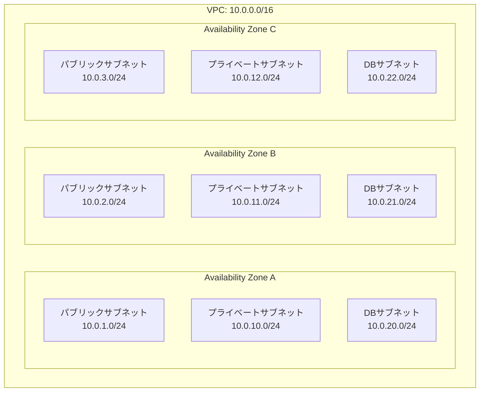

**サブネットの種類**は、そこに関連付けられるルートテーブルの内容によって決まる。

- **パブリックサブネット**：Internet Gatewayへのルートを持つサブネット。ここに配置されたリソースは（Elastic IPやパブリックIPがあれば）インターネットと直接通信できる
- **プライベートサブネット**：Internet Gatewayへの直接ルートを持たないサブネット。インターネットへの通信が必要な場合はNAT Gatewayを経由する
- **隔離サブネット（Isolated Subnet）**：NAT Gatewayへのルートすら持たない完全に隔離されたサブネット。データベースなどの機密リソースを配置する

::: details サブネットで予約されるIPアドレス
AWSの各サブネットでは、以下の5つのIPアドレスが自動的に予約され、ユーザーは使用できない。例えば `10.0.1.0/24` の場合：

- `10.0.1.0` — ネットワークアドレス
- `10.0.1.1` — VPCルーター用（AWSが管理）
- `10.0.1.2` — DNS サーバー用（VPC CIDR + 2）
- `10.0.1.3` — AWSが将来の利用のために予約
- `10.0.1.255` — ブロードキャストアドレス（VPCではブロードキャストは未サポートだが予約）

したがって、`/24`サブネットでは256 - 5 = **251個**のIPアドレスが実際に利用可能である。
:::

### 2.3 ルートテーブル

**ルートテーブル**は、サブネット内のトラフィックがどこに転送されるかを定義するルーティング規則の集合である。各サブネットは必ず一つのルートテーブルに関連付けられる。

VPC内のローカルルート（例：`10.0.0.0/16 → local`）はすべてのルートテーブルに暗黙的に含まれ、削除できない。これにより、VPC内の任意のサブネット間の通信はデフォルトで可能である。

パブリックサブネットのルートテーブル例を以下に示す。

| 送信先 | ターゲット | 説明 |
|---|---|---|
| 10.0.0.0/16 | local | VPC内部のルーティング |
| 0.0.0.0/0 | igw-xxxxxxxx | インターネット向けのデフォルトルート |

プライベートサブネットのルートテーブル例を以下に示す。

| 送信先 | ターゲット | 説明 |
|---|---|---|
| 10.0.0.0/16 | local | VPC内部のルーティング |
| 0.0.0.0/0 | nat-xxxxxxxx | NAT Gateway経由のインターネットアクセス |

### 2.4 Internet GatewayとNAT Gateway

**Internet Gateway（IGW）**は、VPCとインターネットの間のゲートウェイである。IGW自体は水平スケールし、高可用性が確保されたマネージドコンポーネントであり、帯域幅の制約はない。

パブリックサブネット内のインスタンスがインターネットと通信するには、以下の条件をすべて満たす必要がある。

1. サブネットのルートテーブルにIGWへのルートがある
2. インスタンスにパブリックIPまたはElastic IPが割り当てられている
3. Security GroupとNACLで該当の通信が許可されている

一方、**NAT Gateway**は、プライベートサブネット内のリソースがインターネットに対してアウトバウンド通信を行うための仕組みである。外部からプライベートサブネットへの直接アクセスは許可されない。NAT Gatewayはパブリックサブネット内に配置され、Elastic IPが割り当てられる。

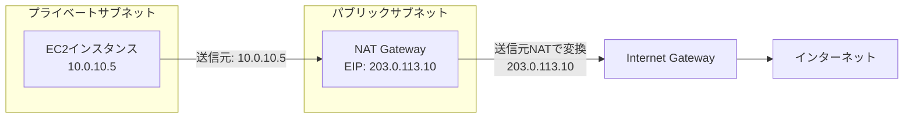

> [!CAUTION]
> NAT Gatewayはデータ処理量に応じた課金が発生する。1GBあたり約0.045 USDのデータ処理料金に加え、時間料金（約0.045 USD/h）がかかる。大量のデータ転送（例：コンテナイメージのプル、ソフトウェアアップデート）がある環境では、月額コストが数百〜数千ドルに達することがある。コスト最適化のために、VPCエンドポイント（後述）の活用やNATインスタンスの検討が重要である。

### 2.5 Security GroupとNetwork ACL

VPCにおけるトラフィック制御は、**Security Group**と**Network ACL（NACL）**の二つの仕組みで行われる。この二つは動作原理が根本的に異なる。

#### Security Group — ステートフルファイアウォール

Security Groupは**インスタンスレベル**（正確にはENI: Elastic Network Interface単位）で適用されるステートフルファイアウォールである。

**ステートフル**とは、接続の状態を追跡することを意味する。インバウンドルールで許可されたトラフィックに対する応答は、アウトバウンドルールに関係なく自動的に許可される。逆も同様である。

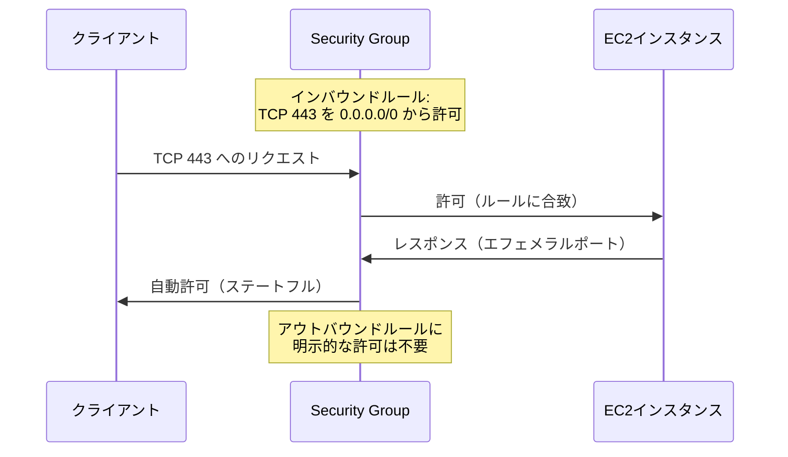

Security Groupの特徴は以下の通りである。

- **許可ルールのみ**：拒否ルールは定義できない。ルールに合致しないトラフィックは暗黙的に拒否される
- **ステートフル**：接続追跡により、応答トラフィックは自動許可
- **ENI単位**：一つのインスタンスに複数のSecurity Groupを適用できる（ルールはOR結合）
- **参照可能**：他のSecurity GroupのIDをソース/デスティネーションとして指定できる

::: tip Security Groupの参照機能
Security Groupの最も強力な機能の一つが、IPアドレスではなく他のSecurity GroupのIDを参照できることである。例えば、アプリケーション層のSecurity Group（sg-app）を許可するルールをDB層のSecurity Group（sg-db）に設定すれば、sg-appが割り当てられたすべてのインスタンスからのDB接続が自動的に許可される。インスタンスの追加・削除時にIPアドレスベースのルール変更が不要になる。
:::

#### Network ACL — ステートレスファイアウォール

Network ACLは**サブネットレベル**で適用されるステートレスファイアウォールである。

**ステートレス**とは、各パケットを独立して評価することを意味する。インバウンドで許可されたトラフィックであっても、アウトバウンドのルールで応答パケットが許可されていなければ通信は成立しない。

| 特性 | Security Group | Network ACL |
|---|---|---|
| 適用レベル | ENI（インスタンス） | サブネット |
| ステート管理 | ステートフル | ステートレス |
| ルール種別 | 許可のみ | 許可と拒否 |
| ルール評価 | すべてのルールを評価 | 番号順に評価（最初の合致で決定） |
| デフォルト動作 | すべて拒否 | すべて許可（デフォルトNACL） |

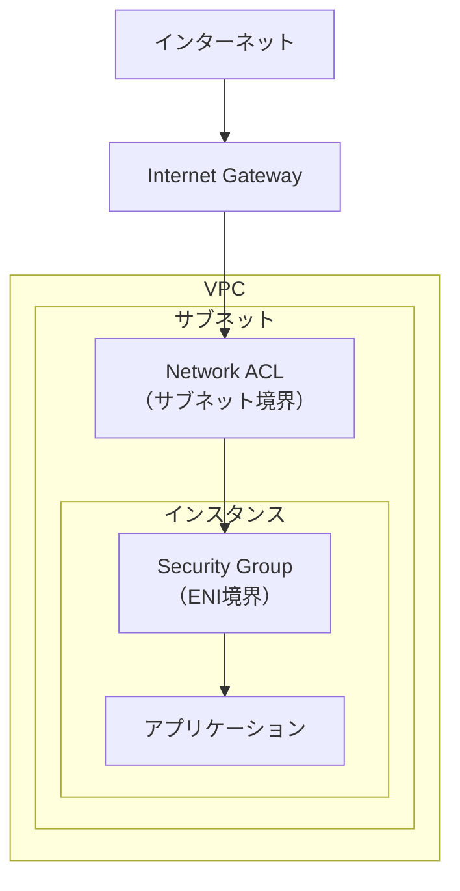

実務では、Security Groupを主要なアクセス制御の手段として使用し、NACLは追加の防御層（Defense in Depth）として利用するのが一般的である。NACLは特定のIPアドレスからの通信を明示的にブロックする場合などに有用である。

> [!NOTE]
> NACLはステートレスであるため、アウトバウンドルールでエフェメラルポート（1024-65535）を許可する必要がある。これを忘れると、サーバーからの応答パケットがブロックされ、通信が成立しない。初心者が陥りやすい落とし穴の一つである。

## 3. 実装手法 — VPC間接続とハイブリッドネットワーク

### 3.1 VPC Peering

**VPC Peering**は、二つのVPC間をプライベートに接続する最もシンプルな方法である。ピアリング接続を確立すると、両VPC内のリソースがプライベートIPアドレスを使って直接通信できる。

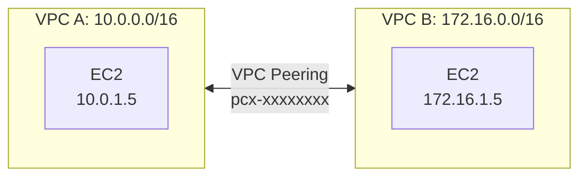

VPC Peeringの特徴は以下の通りである。

- **1対1の接続**：各ピアリングは2つのVPC間の接続であり、推移的ルーティング（transitive routing）はサポートされない。VPC AとVPC Bがピアリングし、VPC BとVPC Cがピアリングしていても、VPC AからVPC Cへの通信はBを経由できない
- **リージョン間対応**：異なるリージョン間でもピアリング可能（Inter-Region VPC Peering）
- **アカウント間対応**：異なるAWSアカウント間でもピアリング可能
- **帯域幅制限なし**：同一AZ内のピアリングは追加料金なし

::: warning VPC Peeringの制約
VPC Peeringは小規模な構成（2〜3個のVPC接続）には適しているが、VPC数が増えるとフルメッシュの接続が必要になり、管理が複雑化する。N個のVPCを相互接続するには N×(N-1)/2 本のピアリング接続が必要であり、10個のVPCでは45本、20個では190本になる。このような場合にはTransit Gatewayの利用を検討すべきである。
:::

### 3.2 Transit Gateway

**Transit Gateway（TGW）**は、複数のVPCとオンプレミスネットワークをハブ＆スポーク型で接続する中央ルーターである。2018年のre:Inventで発表された。

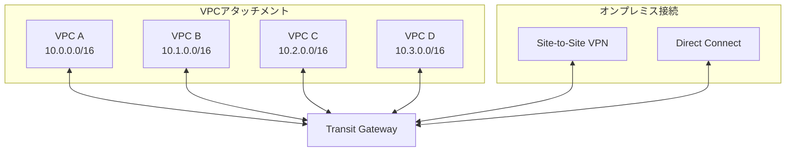

Transit Gatewayの主要な機能は以下の通りである。

- **ルートテーブルによるセグメンテーション**：TGWは複数のルートテーブルを持つことができ、ルートテーブルの関連付けにより、どのVPC間の通信を許可するかを制御できる
- **マルチキャスト対応**：IGMPマルチキャストをサポート
- **リージョン間ピアリング**：異なるリージョンのTGW間をピアリングすることで、グローバルなネットワークを構築可能
- **帯域幅**：最大50 Gbps（同一AZ内のアタッチメント間）

Transit Gatewayのルートテーブルを使ったネットワーク分離の例を示す。

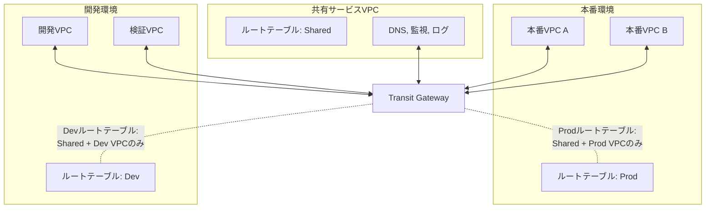

この構成により、本番環境と開発環境は共有サービスVPCとは通信できるが、互いには通信できないという分離を実現できる。

### 3.3 PrivateLinkとVPCエンドポイント

**AWS PrivateLink**は、VPC内のリソースがAWSサービスやサードパーティサービスに対して、インターネットを経由せずにプライベートに接続する仕組みである。

VPCエンドポイントには二つの種類がある。

#### Gatewayエンドポイント

S3とDynamDBのみに対応する無料のエンドポイントである。ルートテーブルにプレフィクスリストが追加され、対象サービスへのトラフィックがVPC内部のゲートウェイを経由するようになる。

#### Interfaceエンドポイント（PrivateLink）

サブネット内にENI（Elastic Network Interface）を作成し、そのENIのプライベートIPアドレスを通じてサービスにアクセスする。DNS設定（Private DNS）を有効にすれば、通常のサービスエンドポイント（例：`ec2.ap-northeast-1.amazonaws.com`）へのDNS解決が自動的にプライベートIPを返すようになる。

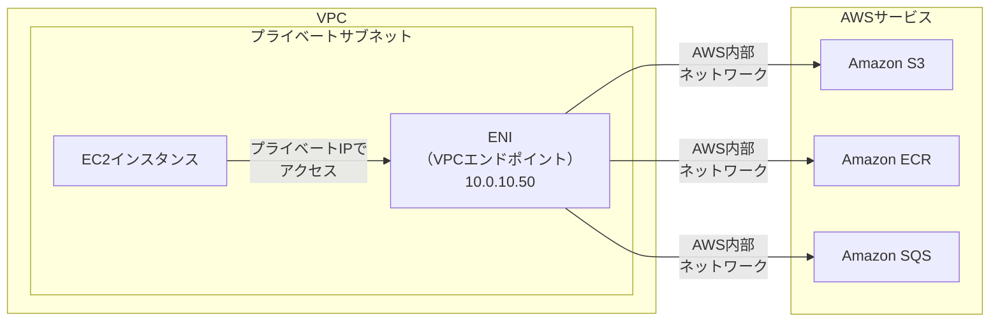

PrivateLinkは以下のユースケースで特に有用である。

- **NAT Gatewayコストの削減**：AWSサービスへのトラフィックがNATを経由しなくなる。特にECRからのコンテナイメージプルは大量のデータ転送を伴うため、VPCエンドポイントの利用で大幅なコスト削減が可能
- **セキュリティ要件**：インターネットに出ないため、データが常にAWSのバックボーンネットワーク内にとどまる
- **サービス公開**：自社サービスをPrivateLinkとして他のアカウント/VPCに公開できる（Network Load Balancerの背後に配置）

::: tip PrivateLinkによるサービスメッシュ
PrivateLinkの「エンドポイントサービス」機能を使えば、自社のマイクロサービスを他のVPCやアカウントにプライベートに公開できる。サービス提供側はNetwork Load Balancer（NLB）の背後にサービスを配置し、消費側はInterface VPCエンドポイントを作成して接続する。この仕組みにより、VPC PeeringやTransit Gatewayを使わずに、特定のサービスのみを選択的に公開できる。CIDRの重複も問題にならない。
:::

### 3.4 VPN接続

**Site-to-Site VPN**は、オンプレミスネットワークとVPCをIPsecトンネルで接続する方法である。インターネット上に暗号化されたトンネルを構築するため、Direct Connectと比較して導入が容易でコストも低い。

AWS側には**Virtual Private Gateway（VGW）**または前述のTransit Gatewayを配置し、オンプレミス側には**カスタマーゲートウェイ（CGW）**を設定する。冗長性のために、AWS側は常に二つのトンネルを提供する。

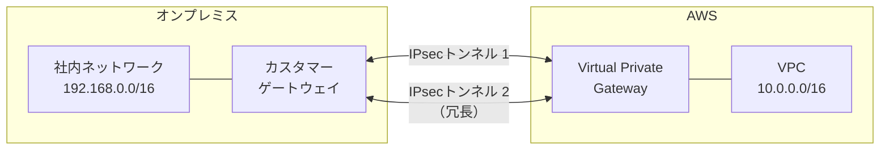

VPNの帯域幅はトンネルあたり最大1.25 Gbps（IKEv2使用時）に制限される。これを超える帯域が必要な場合や、安定したレイテンシが求められる場合は、Direct Connectを検討する。

### 3.5 Direct Connect

**AWS Direct Connect**は、オンプレミスのデータセンターとAWSを専用線で接続するサービスである。インターネットを経由しないため、安定した帯域幅と低レイテンシを提供する。

| 接続タイプ | 帯域幅 | 用途 |
|---|---|---|
| 専用接続（Dedicated） | 1 Gbps / 10 Gbps / 100 Gbps | 大規模なデータ転送 |
| ホスト型接続（Hosted） | 50 Mbps 〜 10 Gbps | 中小規模の接続 |

Direct Connectの接続は**Direct Connect Location**（通常はキャリアのコロケーション施設）で確立される。この物理接続の上に**仮想インターフェース（VIF）**を作成する。

- **Private VIF**：VPCへのプライベート接続
- **Public VIF**：AWSパブリックサービスへの接続（S3のパブリックエンドポイント等）
- **Transit VIF**：Transit Gatewayへの接続

> [!WARNING]
> Direct Connectは物理的な回線を伴うため、プロビジョニングに数週間〜数ヶ月かかる場合がある。冗長構成（2本以上の物理接続）を検討すること。また、Direct Connect単体では暗号化されないため、機密性が必要な場合はDirect Connect上にIPsec VPNを構築する（Direct Connect + VPN）構成を検討する。

### 3.6 DNS統合 — Route 53 Private Hosted Zone

**Route 53 Private Hosted Zone**は、VPC内部でのみ解決可能なDNSゾーンである。VPCに提供されるDNSリゾルバ（VPCの CIDR + 2 のアドレス、例：10.0.0.2）がPrivate Hosted Zoneのレコードを解決する。

Private Hosted Zoneは複数のVPCに関連付けることができ、VPC間で共通のDNS名前空間を提供できる。

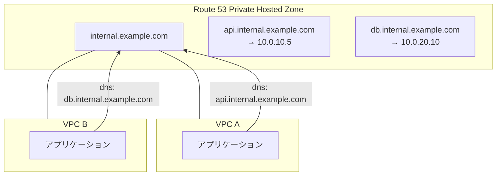

**Route 53 Resolver**を使えば、オンプレミスDNSとの統合も可能である。

- **インバウンドエンドポイント**：オンプレミスのDNSリゾルバがAWSのPrivate Hosted Zoneのレコードを解決するために使用
- **アウトバウンドエンドポイント**：VPC内のリソースがオンプレミスのDNSサーバーにクエリを転送するために使用

これにより、ハイブリッド環境において統一されたDNS名前解決が実現できる。

## 4. 運用の実際

### 4.1 マルチAZ設計

本番環境では、単一のAZ障害に耐えられる**マルチAZ設計**が必須である。すべての重要なコンポーネントを複数のAZにまたがって配置する。

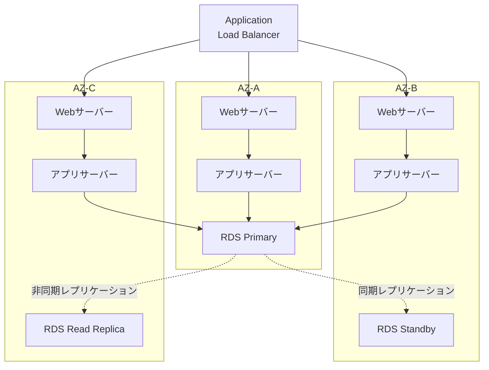

マルチAZ設計における注意点を以下に示す。

- **NAT Gatewayの配置**：AZごとにNAT Gatewayを配置する。単一AZにNAT Gatewayを集約すると、そのAZの障害で全AZのインターネット向けアウトバウンド通信が停止する
- **クロスAZ通信のコスト**：AZをまたぐデータ転送には料金が発生する（約0.01 USD/GB、双方向で課金）。マイクロサービスアーキテクチャで大量のAZ間通信がある場合、このコストは無視できない
- **サブネット設計の対称性**：各AZに同じ構成のサブネット群を配置し、Auto Scalingグループが均等に分散するようにする

### 4.2 ネットワーク分離のベストプラクティス

セキュリティと運用管理の観点から、ネットワークの適切な分離は極めて重要である。

#### アカウントレベルの分離

AWS Organizationsを使ったマルチアカウント戦略が、最も強力な分離手段である。

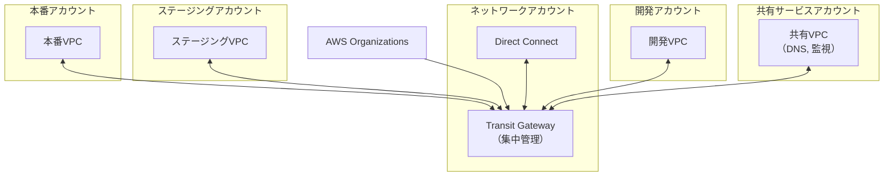

#### Security Group設計パターン

ティア（層）ベースのSecurity Group設計が推奨される。

```
sg-alb:       インバウンド 443/tcp from 0.0.0.0/0
sg-web:       インバウンド 8080/tcp from sg-alb
sg-app:       インバウンド 8080/tcp from sg-web
sg-db:        インバウンド 5432/tcp from sg-app
sg-bastion:   インバウンド 22/tcp from 社内CIDR
sg-management: インバウンド 22/tcp from sg-bastion
```

この設計では、各層のSecurity Groupが前段のSecurity GroupのIDを参照している。IPアドレスではなくSecurity Groupの参照を使うことで、スケーリングやインスタンスの入れ替えに対して自動的にルールが追従する。

### 4.3 トラフィック可視化と監視

#### VPC Flow Logs

**VPC Flow Logs**は、VPC内のネットワークインターフェースを通過するIPトラフィックの情報をキャプチャする機能である。Flow Logsは以下の三つのレベルで有効化できる。

- **VPCレベル**：VPC内のすべてのENIのトラフィックをキャプチャ
- **サブネットレベル**：特定のサブネット内のENIのトラフィックをキャプチャ
- **ENIレベル**：特定のENIのトラフィックのみキャプチャ

Flow Logのレコード例を以下に示す。

```
2 123456789012 eni-abc123de 10.0.1.5 10.0.2.10 49152 443 6 20 4000 1620140661 1620140721 ACCEPT OK
```

各フィールドの意味は以下の通りである。

| フィールド | 値 | 説明 |
|---|---|---|
| version | 2 | Flow Logバージョン |
| account-id | 123456789012 | AWSアカウントID |
| interface-id | eni-abc123de | ENI識別子 |
| srcaddr | 10.0.1.5 | 送信元IPアドレス |
| dstaddr | 10.0.2.10 | 宛先IPアドレス |
| srcport | 49152 | 送信元ポート |
| dstport | 443 | 宛先ポート |
| protocol | 6 | プロトコル番号（6 = TCP） |
| packets | 20 | パケット数 |
| bytes | 4000 | バイト数 |
| start | 1620140661 | キャプチャ開始時刻（UNIX） |
| end | 1620140721 | キャプチャ終了時刻（UNIX） |
| action | ACCEPT | アクション（ACCEPT/REJECT） |
| log-status | OK | ログステータス |

Flow Logsの送信先としては、CloudWatch Logs、S3、Kinesis Data Firehoseが選択できる。大規模環境ではS3に集約し、Amazon Athenaでクエリする構成が一般的である。

::: details Flow Logsで取得できないトラフィック
以下のトラフィックはVPC Flow Logsでキャプチャされない。

- AWSのDNSサーバー（VPC + 2のアドレス）へのDNSトラフィック（ただし自前のDNSサーバーへのトラフィックはキャプチャされる）
- Windowsライセンスアクティベーション用のトラフィック
- インスタンスメタデータサービス（169.254.169.254）へのトラフィック
- DHCP トラフィック
- VPCルーター（各サブネットの .1 アドレス）へのトラフィック
:::

#### Traffic Mirroring

**VPC Traffic Mirroring**は、ENIを通過するネットワークトラフィックの実際のパケットをコピーし、分析ツールに転送する機能である。Flow Logsがメタデータ（誰が、いつ、どこに）のみを記録するのに対し、Traffic Mirroringはパケットの中身を含む完全なコピーを提供する。

これは、IDS/IPS（侵入検知・防止システム）、フォレンジック分析、DLP（データ損失防止）などの高度なセキュリティ要件に使用される。

### 4.4 コスト最適化

クラウドネットワーキングのコストは見落とされがちだが、大規模環境では月額の大きな割合を占めることがある。

#### 主要なコスト要因

| 項目 | 料金（US East 1 基準、概算） | 注意事項 |
|---|---|---|
| NAT Gateway 時間料金 | ~0.045 USD/h | 約32 USD/月 × AZ数 |
| NAT Gateway データ処理 | ~0.045 USD/GB | 大量データ転送時に急増 |
| クロスAZデータ転送 | ~0.01 USD/GB（各方向） | マイクロサービスで注意 |
| VPCエンドポイント（Interface） | ~0.01 USD/h + データ処理 | サービスごとに必要 |
| Transit Gateway アタッチメント | ~0.05 USD/h | VPCごとに発生 |
| Transit Gateway データ処理 | ~0.02 USD/GB | すべてのトラフィックに課金 |
| Direct Connect ポート時間料金 | 0.03〜0.30 USD/h | 帯域幅による |

#### コスト最適化の手法

**1. VPCエンドポイントの活用**

S3やECRへのトラフィックが多い場合、VPCエンドポイント（Gateway型は無料、Interface型は有料だがNATより安価な場合が多い）を利用することで、NAT Gatewayのデータ処理料金を削減できる。

**2. クロスAZトラフィックの最小化**

- **AZアフィニティ**：同じAZ内のインスタンス間通信を優先するようロードバランサーを設定する
- **gRPCのクライアントサイドバランシング**：接続先を同一AZのインスタンスに優先的に振り分ける
- **キャッシュの活用**：AZをまたぐDBアクセスを減らすためにローカルキャッシュを配置する

**3. NAT Gatewayの最適化**

- S3やDynamoDBにはGatewayエンドポイント（無料）を使用する
- ECR、CloudWatch Logs、SQS等の高トラフィックサービスにはInterfaceエンドポイントを検討する
- ソフトウェアアップデートのリポジトリをS3にミラーリングする

> [!TIP]
> AWS Cost Explorerでデータ転送コストを「使用タイプ」でフィルタリングし、`NatGateway-Bytes`、`DataTransfer-Regional-Bytes` などの使用タイプを確認することで、ネットワークコストの内訳を把握できる。

### 4.5 Infrastructure as Code（IaC）によるネットワーク管理

VPCの設計と運用において、IaCの活用は事実上の必須事項である。手動でのコンソール操作は再現性がなく、監査証跡も残らない。

代表的なIaCツールとその特性は以下の通りである。

| ツール | 特徴 | VPCネットワーク管理での適性 |
|---|---|---|
| AWS CloudFormation | AWSネイティブ、スタック管理 | AWSのみの環境に適する |
| Terraform | マルチクラウド対応、宣言的 | 複数クラウドのネットワーク統合管理に最適 |
| AWS CDK | プログラミング言語で記述 | 複雑なネットワーク構成のロジック表現に強い |
| Pulumi | プログラミング言語 + マルチクラウド | CDKのマルチクラウド版 |

Terraformを使ったVPC定義の例を以下に示す。

```hcl
# VPC definition
resource "aws_vpc" "main" {
  cidr_block           = "10.0.0.0/16"
  enable_dns_support   = true
  enable_dns_hostnames = true

  tags = {
    Name        = "production-vpc"
    Environment = "production"
  }
}

# Public subnet in AZ-A
resource "aws_subnet" "public_a" {
  vpc_id                  = aws_vpc.main.id
  cidr_block              = "10.0.1.0/24"
  availability_zone       = "ap-northeast-1a"
  map_public_ip_on_launch = true

  tags = {
    Name = "public-subnet-a"
    Tier = "public"
  }
}

# Private subnet in AZ-A
resource "aws_subnet" "private_a" {
  vpc_id            = aws_vpc.main.id
  cidr_block        = "10.0.10.0/24"
  availability_zone = "ap-northeast-1a"

  tags = {
    Name = "private-subnet-a"
    Tier = "private"
  }
}

# Internet Gateway
resource "aws_internet_gateway" "main" {
  vpc_id = aws_vpc.main.id
}

# NAT Gateway with Elastic IP
resource "aws_eip" "nat_a" {
  domain = "vpc"
}

resource "aws_nat_gateway" "a" {
  allocation_id = aws_eip.nat_a.id
  subnet_id     = aws_subnet.public_a.id
}

# Security Group for web tier
resource "aws_security_group" "web" {
  name_prefix = "web-"
  vpc_id      = aws_vpc.main.id

  ingress {
    from_port       = 8080
    to_port         = 8080
    protocol        = "tcp"
    security_groups = [aws_security_group.alb.id]
  }

  egress {
    from_port   = 0
    to_port     = 0
    protocol    = "-1"
    cidr_blocks = ["0.0.0.0/0"]
  }
}
```

## 5. 設計パターンの実例

### 5.1 典型的なWebアプリケーションのVPC設計

三層構成（Web/App/DB）のWebアプリケーションにおける標準的なVPC設計を以下に示す。

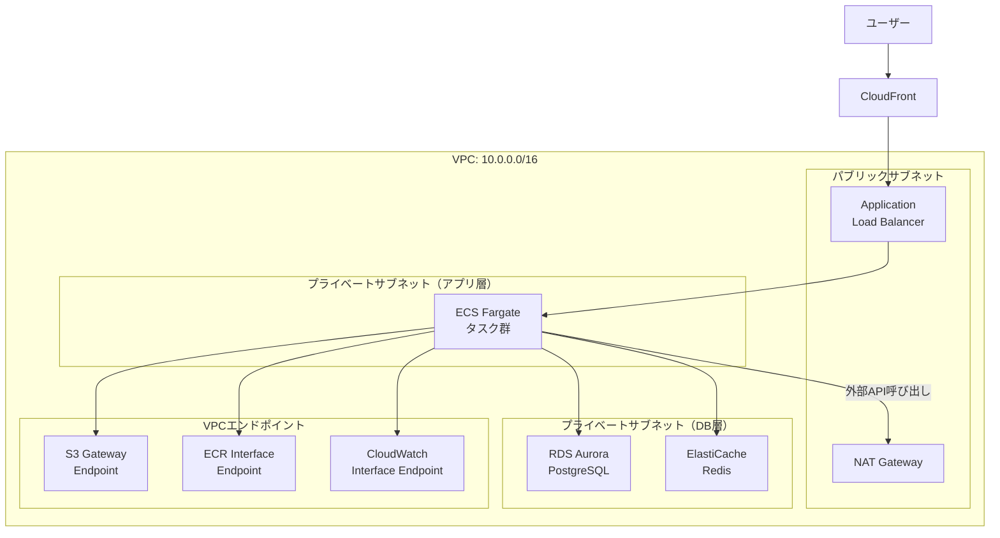

この設計のポイントは以下の通りである。

- **ALBのみパブリックサブネット**に配置し、アプリケーションとDBはプライベートサブネットに隔離
- **VPCエンドポイント**でAWSサービスへの通信をプライベートに保ち、NATコストを削減
- **NAT Gateway**は外部APIの呼び出しなど、真にインターネットアクセスが必要な通信にのみ使用
- **Security Group**の参照機能を使い、ALB → ECS → RDS の通信のみを許可

### 5.2 マルチアカウント・ハブスポーク構成

エンタープライズ環境では、以下のようなハブスポーク構成が一般的である。

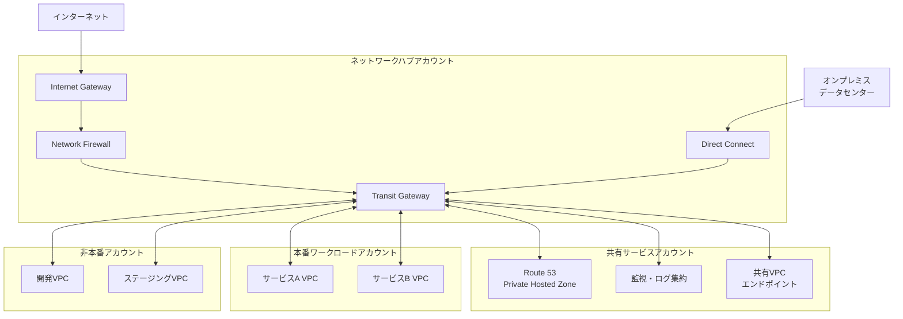

この構成では、すべてのインターネット向けトラフィックがネットワークハブアカウントのNetwork Firewallを通過する。これにより、ファイアウォールルールの集中管理、トラフィックの検査、ログの一元化が可能になる。

## 6. 将来展望

### 6.1 IPv6移行

AWSのVPCは2016年からIPv6をサポートしており、デュアルスタック構成が可能である。IPv6アドレスはすべてグローバルユニキャストアドレスであり、NATの概念が不要になる。

IPv6移行の主な推進要因は以下の通りである。

- **IPv4アドレスの枯渇と料金**：2024年2月以降、AWSはすべてのパブリックIPv4アドレスに対して時間料金（0.005 USD/h、約3.6 USD/月）を課金するようになった。大量のパブリックIPを使用する環境では、IPv6移行によるコスト削減効果が大きい
- **IoTとモバイル**：膨大な数のデバイスがネットワークに接続される環境では、IPv4アドレスでは不足する
- **エンドツーエンドの接続性**：NATを排除することで、ネットワーク構成が簡素化される

ただし、IPv6移行にはいくつかの課題もある。

- すべてのAWSサービスがIPv6に対応しているわけではない
- オンプレミス機器やレガシーアプリケーションのIPv6対応
- Security GroupやNACLのルールをIPv6に対応させる必要がある
- IPv6環境ではNATがないため、**Egress-Only Internet Gateway**を使ってアウトバウンドのみの通信を実現する

### 6.2 AWS Cloud WAN

**AWS Cloud WAN**（2022年GA）は、グローバルなWAN（Wide Area Network）をAWSのマネージドサービスとして構築する仕組みである。Transit Gatewayのグローバル版とも言える。

Cloud WANの特徴は以下の通りである。

- **グローバルネットワークの一元管理**：世界中のリージョンにまたがるネットワークをダッシュボードで管理
- **ネットワークポリシー**：JSON/YAMLベースのポリシーでセグメンテーションやルーティングを宣言的に定義
- **自動プロビジョニング**：ポリシーに基づいてTransit Gatewayやピアリングが自動構築される

Cloud WANは、複数リージョンで事業を展開するグローバル企業にとって、ネットワーク管理の複雑さを大幅に軽減する可能性を持っている。

### 6.3 ゼロトラストネットワーキングとの融合

従来のVPCベースのネットワークセキュリティは、「ネットワーク境界による信頼」というモデルに基づいている。しかし、ゼロトラストアーキテクチャの普及により、ネットワークの場所に依存しないセキュリティモデルへの移行が進んでいる。

クラウドネットワークにおけるゼロトラストの実装は以下の方向に進化している。

- **AWS Verified Access**：VPNなしでアプリケーションへのゼロトラストアクセスを提供する。ユーザーのIDと端末のセキュリティ状態を評価してアクセスを制御する
- **マイクロセグメンテーション**：Security Groupをより細粒度に適用し、ワークロード間の通信を最小権限に制限する
- **サービスメッシュとの統合**：Istio、AWS App MeshなどのサービスメッシュがmTLS（相互TLS）を提供し、サービス間の通信を暗号化・認証する。ネットワーク層のセキュリティに加えて、アプリケーション層での認証が加わる
- **BeyondCorp型アーキテクチャ**：Googleが先駆けた、VPNレスの企業ネットワークモデル。アクセスプロキシがすべてのリクエストを検証する

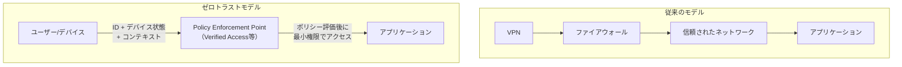

ゼロトラストが完全にVPCベースのネットワークセキュリティを置き換えるわけではない。むしろ、VPCのネットワーク分離は基盤として残りつつ、その上にアイデンティティベースのアクセス制御が重ねられる**多層防御（Defense in Depth）**の形が現実的な方向性である。

### 6.4 eBPFとクラウドネットワーキングの将来

**eBPF（extended Berkeley Packet Filter）**は、Linuxカーネル内でプログラムを安全に実行する技術であり、クラウドネットワーキングの将来に大きな影響を与えている。

CiliumなどのeBPFベースのネットワークツールは、従来のiptablesベースのネットワーク制御を置き換え、以下の利点を提供する。

- **高性能なパケット処理**：カーネル空間での処理により、ユーザー空間との切り替えオーバーヘッドを排除
- **プログラマブルなネットワークポリシー**：Kubernetesのネットワークポリシーをカーネルレベルで効率的に適用
- **可観測性の向上**：パケットレベルのトレーシングをカーネル内で低オーバーヘッドで実現

AWSもeBPF技術を活用しており、EKS（Elastic Kubernetes Service）でCiliumをネットワークプラグインとして公式サポートしている。

## 7. まとめ

クラウドネットワーク設計は、単純なVPC作成からグローバル規模のネットワークアーキテクチャまで、幅広い技術領域を包含する。本記事で取り上げた主要な概念を以下に整理する。

| 領域 | 主要技術 | 核心的な考慮点 |
|---|---|---|
| VPC基礎 | CIDR, サブネット, AZ | アドレス設計の将来性、マルチAZ冗長性 |
| アクセス制御 | Security Group, NACL | ステートフル vs ステートレスの使い分け |
| 接続性 | VPC Peering, TGW, PrivateLink | スケーラビリティとコストのバランス |
| ハイブリッド | VPN, Direct Connect | 帯域幅要件とプロビジョニング期間 |
| 可観測性 | Flow Logs, Traffic Mirroring | セキュリティ要件に応じた選択 |
| コスト | NAT, クロスAZ, データ転送 | VPCエンドポイントによる最適化 |
| 将来技術 | IPv6, Cloud WAN, ゼロトラスト | 段階的な移行戦略 |

クラウドネットワークの設計において最も重要な原則は、**最小権限の原則**をネットワーク層にも適用することである。必要な通信のみを許可し、不要な経路を排除する。Security Groupの参照機能を活用し、IPアドレスではなく論理的な役割に基づいてアクセス制御を行う。

技術は急速に進化しているが、IPアドレッシング、ルーティング、ファイアウォールという基礎概念は変わらない。これらの基盤をしっかりと理解した上で、クラウド固有の機能（VPCエンドポイント、Transit Gateway、PrivateLink等）を適切に組み合わせることが、堅牢でスケーラブルなクラウドネットワークの構築につながる。
