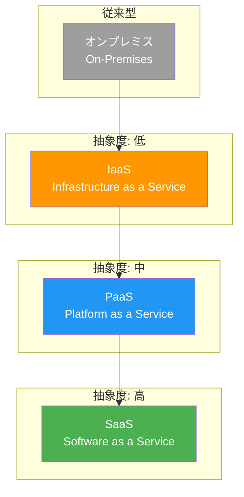
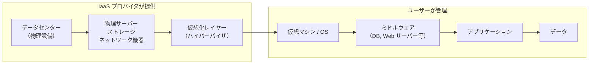
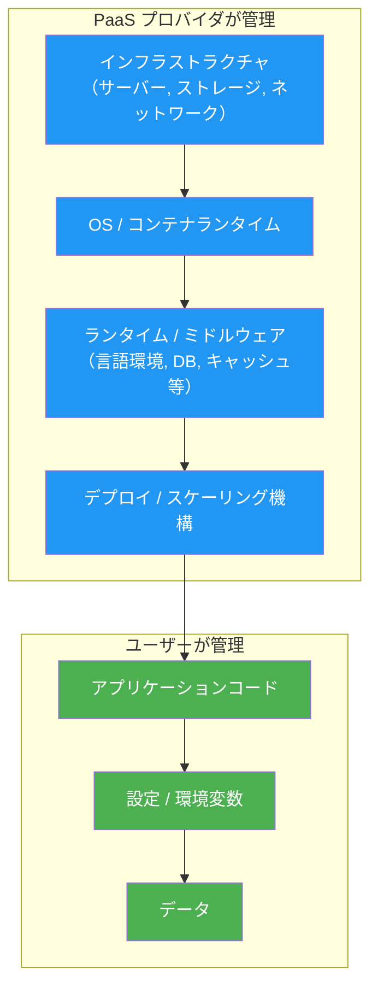
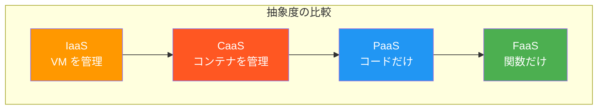
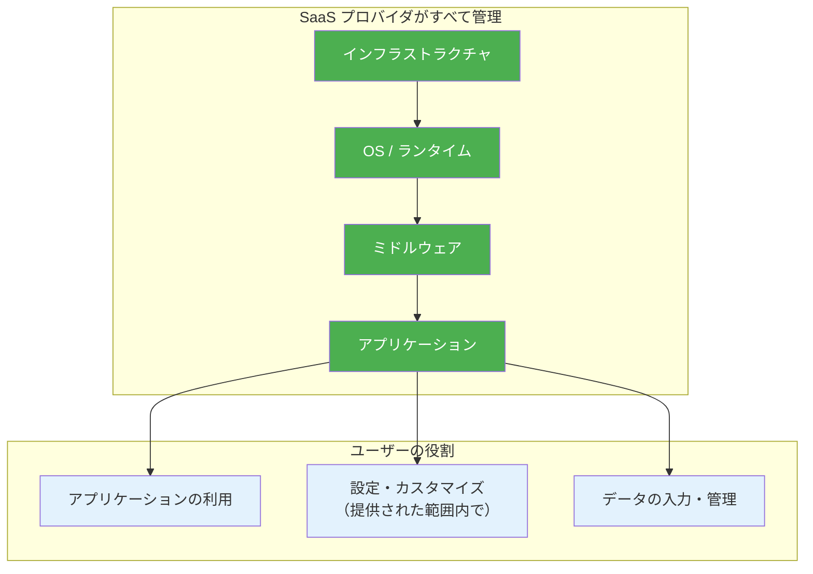
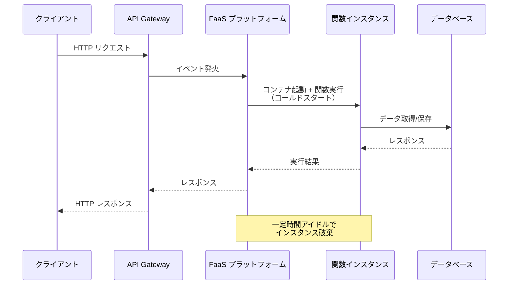
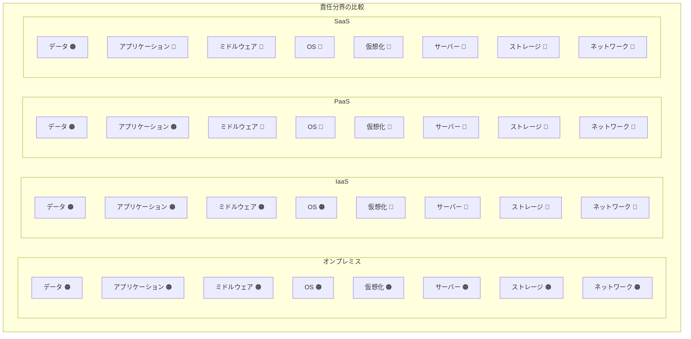
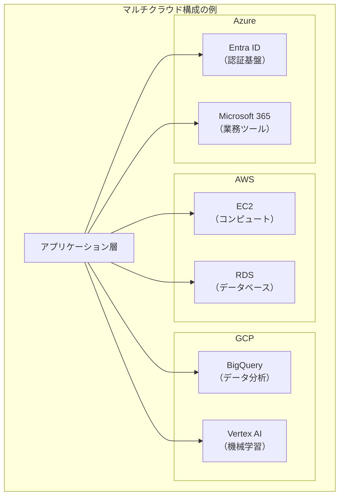
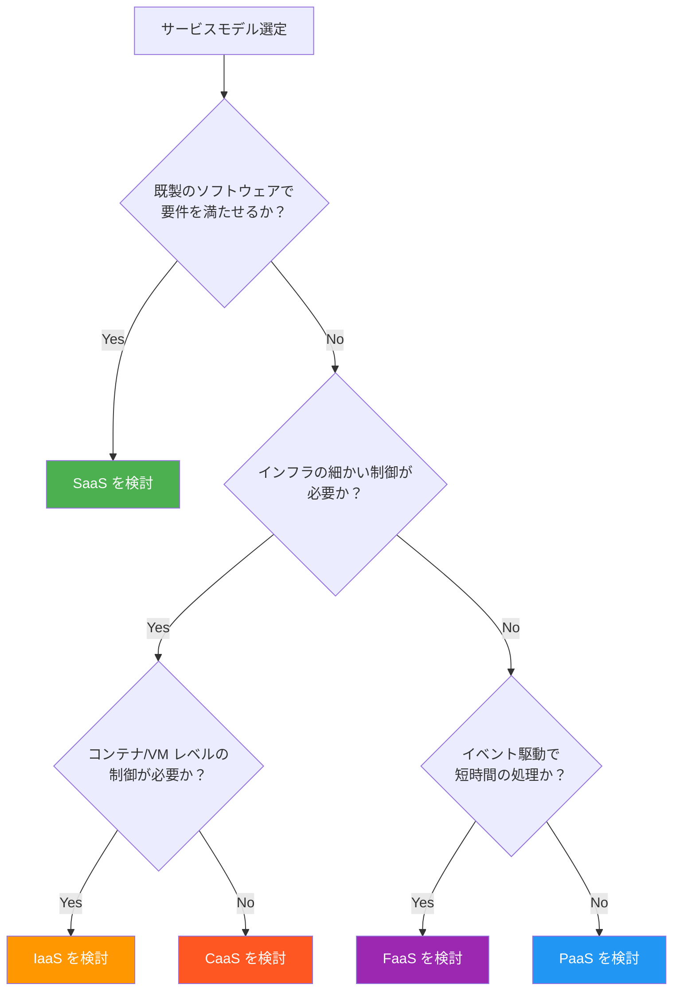
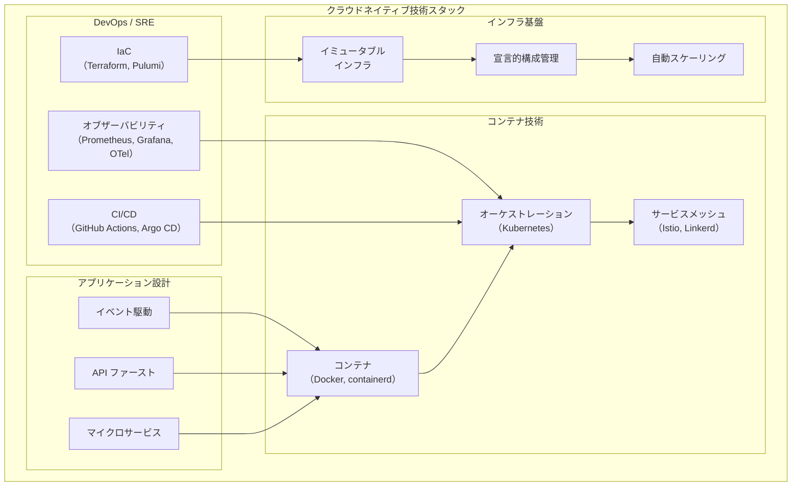

# IaaS, PaaS, SaaS — クラウドサービスモデル

## 1. クラウドコンピューティングとは何か

### NIST による定義

クラウドコンピューティングの最も広く引用される定義は、米国国立標準技術研究所（NIST: National Institute of Standards and Technology）が 2011 年に公開した SP 800-145 に記載されている。NIST はクラウドコンピューティングを次のように定義している。

> 共有の構成可能なコンピューティングリソース（ネットワーク、サーバー、ストレージ、アプリケーション、サービスなど）のプールに、ユビキタスで、便利で、オンデマンドのネットワークアクセスを可能にするモデルであり、最小限の管理労力またはサービスプロバイダとのやりとりで、迅速にプロビジョニングおよびリリースできるもの。

この定義には **5 つの基本特性**、**3 つのサービスモデル**、**4 つのデプロイメントモデル** が含まれている。

### 5 つの基本特性

| 特性 | 説明 |
|------|------|
| **オンデマンドセルフサービス** | 人的介在なしに、必要な時にリソースを自動的にプロビジョニングできる |
| **幅広いネットワークアクセス** | 標準的なメカニズム（HTTP/HTTPS など）を通じて多様なクライアントからアクセス可能 |
| **リソースプーリング** | プロバイダのリソースがマルチテナントモデルでプールされ、動的に割り当てられる |
| **迅速な弾力性** | 需要に応じてリソースを迅速にスケールアウト・スケールインできる |
| **計測可能なサービス** | リソース使用量が自動的に制御・最適化され、従量課金の基礎となる |

### 3 つのサービスモデル

NIST が定義する 3 つのサービスモデルが、本記事の主題である **IaaS**、**PaaS**、**SaaS** である。これらは「どこまでをプロバイダが管理し、どこからをユーザーが管理するか」という責任の分界点によって分類される。

### 4 つのデプロイメントモデル

| モデル | 説明 |
|--------|------|
| **パブリッククラウド** | 一般に公開されたクラウドインフラストラクチャ（AWS、Azure、GCP など） |
| **プライベートクラウド** | 単一の組織が専有的に使用するクラウドインフラストラクチャ |
| **コミュニティクラウド** | 共通の関心を持つ複数の組織が共有するクラウドインフラストラクチャ |
| **ハイブリッドクラウド** | 上記の 2 つ以上を組み合わせた構成 |

### クラウド以前の世界

クラウドコンピューティングが登場する以前、企業が IT システムを運用するためには自前でデータセンターを構築・運用する必要があった。サーバーの物理的な調達には数週間から数か月を要し、ピーク負荷に備えて余剰リソースを常時確保しておく必要があった。この「所有」モデルから「利用」モデルへの転換が、クラウドコンピューティングの本質的な革新である。

2006 年に Amazon Web Services（AWS）が Elastic Compute Cloud（EC2）と Simple Storage Service（S3）を一般公開したことが、商用クラウドコンピューティングの実質的な始まりとされている。その後、Microsoft Azure（2010 年）、Google Cloud Platform（2011 年）が相次いでサービスを開始し、クラウド市場は急速に拡大した。

---

## 2. IaaS（Infrastructure as a Service）

### IaaS とは何か

IaaS は、コンピューティング、ストレージ、ネットワークといった **インフラストラクチャレイヤーのリソース** をサービスとして提供するモデルである。ユーザーは仮想マシン（VM）やブロックストレージ、仮想ネットワークなどを API やコンソールを通じて自由にプロビジョニングし、その上に OS、ミドルウェア、アプリケーションを自ら構築・管理する。

物理的なサーバーを購入する代わりに、必要なスペックの仮想マシンを数分で起動でき、不要になれば即座に破棄できる。従来のデータセンター運用における「調達のリードタイム」と「余剰リソースの無駄」という 2 つの課題を同時に解決する。

### IaaS の特徴

**柔軟性の高さ** が IaaS の最大の特徴である。ユーザーは OS の種類やバージョン、ミドルウェアの構成、ネットワークトポロジなど、あらゆるレイヤーを自由に制御できる。この自由度は、既存のオンプレミス環境をクラウドに移行する「リフト＆シフト」戦略において特に有用である。

一方で、自由度が高い分だけ **運用責任も大きい**。OS のパッチ適用、セキュリティ設定、バックアップ、モニタリングなど、インフラの上位レイヤーはすべてユーザーの責任となる。

### IaaS の主要コンポーネント

| コンポーネント | 具体例 |
|----------------|--------|
| **コンピュート** | 仮想マシン、ベアメタルサーバー、コンテナホスト |
| **ストレージ** | ブロックストレージ、オブジェクトストレージ、ファイルストレージ |
| **ネットワーク** | 仮想ネットワーク（VPC）、ロードバランサー、DNS、CDN |
| **セキュリティ** | ファイアウォール、セキュリティグループ、DDoS 防御 |

### 代表的な IaaS サービス

| プロバイダ | コンピュート | ストレージ | ネットワーク |
|------------|-------------|------------|-------------|
| **AWS** | EC2 | EBS, S3 | VPC, ELB |
| **Azure** | Virtual Machines | Managed Disks, Blob Storage | Virtual Network, Load Balancer |
| **GCP** | Compute Engine | Persistent Disk, Cloud Storage | VPC, Cloud Load Balancing |

### IaaS の典型的なユースケース

- **既存システムのクラウド移行（リフト＆シフト）**: オンプレミスの構成をほぼそのままクラウドに持ち込む
- **開発・テスト環境の迅速な構築**: 必要な時だけ環境を作り、テスト完了後に破棄する
- **ハイパフォーマンスコンピューティング（HPC）**: GPU インスタンスを大量に起動して計算処理を行い、完了後に解放する
- **災害復旧（DR）サイトの構築**: 平時は最小構成で維持し、障害発生時にスケールアウトする

### IaaS のメリットとデメリット

::: tip メリット
- OS やミドルウェアを自由に選択・構成できる
- オンプレミスの知識やスキルをそのまま活用できる
- 従量課金により初期投資を大幅に削減できる
- 数分でリソースをプロビジョニングできる
:::

::: warning デメリット
- OS パッチ適用やセキュリティ管理の運用負荷が大きい
- インフラの設計・構築に専門知識が必要
- 適切なサイジングを怠るとコストが肥大化する
- マネージドサービスに比べて運用の自動化に手間がかかる
:::

---

## 3. PaaS（Platform as a Service）

### PaaS とは何か

PaaS は、アプリケーションの **実行環境（プラットフォーム）** をサービスとして提供するモデルである。ユーザーはインフラの構築や管理を意識することなく、アプリケーションのコードをデプロイするだけでサービスを公開できる。OS、ランタイム、ミドルウェアの管理はプロバイダが担当する。

IaaS が「仮想的な土地と建材を提供する」のに対し、PaaS は「建物まで用意された状態で部屋の内装だけを行う」ようなモデルといえる。

### PaaS の特徴

PaaS の核心は **開発者体験の向上** にある。インフラの管理から解放されることで、開発者はビジネスロジックの実装に集中できる。デプロイ、スケーリング、ロードバランシングといった運用タスクはプラットフォームが自動的に処理する。

一方で、PaaS には **プラットフォームの制約** が伴う。使用可能なプログラミング言語やフレームワーク、ライブラリが限定される場合があり、プラットフォーム固有の作法に従う必要がある。この制約は「ベンダーロックイン」のリスクとも関連する。

### PaaS のアーキテクチャ

### 代表的な PaaS サービス

| サービス | 提供元 | 特徴 |
|----------|--------|------|
| **Heroku** | Salesforce | Git push でデプロイ可能な先駆的 PaaS。多言語対応 |
| **Google App Engine** | Google | Google のインフラ上で動作。自動スケーリングに優れる |
| **AWS Elastic Beanstalk** | Amazon | AWS 上の各種サービスを抽象化した PaaS レイヤー |
| **Azure App Service** | Microsoft | .NET、Java、Node.js など多言語対応の Web アプリプラットフォーム |
| **Cloud Foundry** | OSS (VMware) | オープンソースの PaaS フレームワーク。プライベートクラウドでも利用可能 |
| **Railway / Render / Fly.io** | 各社 | 開発者フレンドリーなモダン PaaS |

### PaaS とコンテナベースプラットフォーム

近年、従来型の PaaS と IaaS の間に位置する **Container as a Service（CaaS）** が台頭している。AWS ECS/EKS、Google Kubernetes Engine（GKE）、Azure Kubernetes Service（AKS）などがこれに該当する。ユーザーはコンテナイメージを用意するだけでデプロイでき、オーケストレーションはプラットフォームが担う。

### PaaS の典型的なユースケース

- **Web アプリケーションの迅速な開発・公開**: MVP（Minimum Viable Product）のリリースに最適
- **API バックエンドの構築**: REST API や GraphQL サーバーを手軽にデプロイ
- **マイクロサービスのデプロイ**: サービスごとに独立してデプロイ・スケーリング
- **CI/CD パイプラインとの統合**: Git push をトリガーにした自動デプロイ

### PaaS のメリットとデメリット

::: tip メリット
- インフラ管理が不要で、開発に集中できる
- デプロイが簡単（`git push` やコマンド一発）
- 自動スケーリングにより負荷変動に柔軟に対応
- 開発から本番まで一貫した環境を提供
:::

::: warning デメリット
- プラットフォームの制約に縛られる可能性がある
- ベンダーロックインのリスク
- 高度なカスタマイズが困難な場合がある
- 大規模になるとコストが IaaS より高くなるケースがある
:::

---

## 4. SaaS（Software as a Service）

### SaaS とは何か

SaaS は、**完成したソフトウェア** をインターネット経由でサービスとして提供するモデルである。ユーザーは Web ブラウザやモバイルアプリを通じてソフトウェアにアクセスするだけで、インストール、アップデート、インフラの管理は一切不要である。

SaaS は 3 つのサービスモデルの中で最も抽象度が高く、ユーザーから見えるのは「アプリケーションの画面と機能」だけである。その裏側で動作するインフラ、OS、ミドルウェア、アプリケーションロジックのすべてがプロバイダによって管理される。

### SaaS の特徴

SaaS の本質は **ソフトウェアの「所有」から「利用」への転換** にある。従来、企業向けソフトウェアはライセンスを購入し、自社サーバーにインストールして運用する形態（オンプレミス型）が主流だった。SaaS はこのモデルを根本から覆し、サブスクリプション型の利用料を払うだけでソフトウェアを利用できるようにした。

マルチテナントアーキテクチャにより、1 つのアプリケーションインスタンスが多数の顧客（テナント）にサービスを提供する。これによりプロバイダは規模の経済を活かしてコストを抑え、ユーザーは初期投資なしに高機能なソフトウェアを利用できる。

### SaaS のアーキテクチャ

### 代表的な SaaS サービス

| カテゴリ | サービス例 | 説明 |
|----------|-----------|------|
| **メール・コラボレーション** | Gmail, Microsoft 365 | メール、カレンダー、ドキュメント共有 |
| **CRM** | Salesforce, HubSpot | 顧客関係管理 |
| **コミュニケーション** | Slack, Zoom, Microsoft Teams | チャット、ビデオ会議 |
| **プロジェクト管理** | Jira, Asana, Trello | タスク管理、プロジェクト追跡 |
| **ERP** | SAP S/4HANA Cloud, Oracle Cloud | 統合基幹業務システム |
| **デザイン** | Figma, Canva | UI デザイン、グラフィックデザイン |
| **開発ツール** | GitHub, GitLab | ソースコード管理、CI/CD |

### SaaS の典型的なユースケース

SaaS は事実上あらゆるビジネスシーンで利用されている。特に以下のケースで威力を発揮する。

- **少人数チームでの迅速な業務開始**: IT 部門がなくても高機能なツールを即座に導入可能
- **グローバルチームでのコラボレーション**: インターネット接続さえあればどこからでもアクセス可能
- **ソフトウェアの最新版を常に利用**: 自動アップデートにより常に最新機能とセキュリティパッチが適用される
- **スモールスタートからのスケールアップ**: ユーザー数に応じた従量課金で、組織の成長に合わせてスケール

### SaaS のメリットとデメリット

::: tip メリット
- インストールや運用が不要で、即座に利用開始できる
- 初期費用がほぼゼロ（サブスクリプション課金）
- 自動アップデートにより常に最新版を利用可能
- デバイスや場所を問わずアクセス可能
:::

::: warning デメリット
- カスタマイズの自由度が限定的
- データの保管場所やプライバシーに関する懸念
- インターネット接続が必須
- 長期間利用するとオンプレミスより総コストが高くなる可能性がある
- サービス終了時のデータ移行リスク
:::

---

## 5. FaaS / サーバーレスコンピューティング

### サーバーレスとは何か

サーバーレスコンピューティングは、PaaS をさらに抽象化したモデルである。「サーバーレス」という名前だが実際にはサーバーは存在する。ユーザーがサーバーの存在を一切意識する必要がないという意味で「サーバーレス」と呼ばれる。

サーバーレスの中核となるのが **FaaS（Function as a Service）** である。FaaS では、ユーザーは個々の **関数** を単位としてコードをデプロイする。関数はイベント（HTTP リクエスト、メッセージキューのメッセージ、ファイルアップロードなど）によってトリガーされ、実行が完了すると自動的にリソースが解放される。

### FaaS の動作モデル

### 代表的な FaaS サービス

| サービス | プロバイダ | 特徴 |
|----------|-----------|------|
| **AWS Lambda** | Amazon | FaaS の先駆者（2014 年）。最も成熟したエコシステム |
| **Azure Functions** | Microsoft | Azure サービスとの深い統合 |
| **Google Cloud Functions** | Google | シンプルな関数実行。Cloud Run はコンテナベースの代替 |
| **Cloudflare Workers** | Cloudflare | エッジで動作。V8 Isolate ベースで高速起動 |

### サーバーレスの広がり：BaaS

FaaS に加えて、サーバーレスのエコシステムには **BaaS（Backend as a Service）** も含まれる。BaaS は、データベース、認証、ファイルストレージなどのバックエンド機能をマネージドサービスとして提供する。

| カテゴリ | サービス例 |
|----------|-----------|
| データベース | DynamoDB, Firestore, PlanetScale |
| 認証 | Auth0, Firebase Authentication, Cognito |
| ストレージ | S3, Cloud Storage |
| メッセージング | SQS, SNS, Pub/Sub |

### コールドスタート問題

FaaS の最大の技術的課題が **コールドスタート** である。関数インスタンスが存在しない状態からリクエストを受けた場合、ランタイムの初期化やコードのロードに時間がかかる。この遅延は数百ミリ秒から数秒に及ぶことがあり、低レイテンシが求められるアプリケーションでは問題となる。

各プロバイダはこの問題に対して様々な対策を講じている。AWS Lambda の Provisioned Concurrency、Cloudflare Workers の V8 Isolate ベースの軽量起動、Google Cloud Run の最小インスタンス数設定などがその例である。

### サーバーレスのメリットとデメリット

::: tip メリット
- 完全な従量課金（実行時間のみ課金、アイドル時はゼロ）
- インフラ管理が完全に不要
- 自動スケーリング（ゼロから数千インスタンスまで）
- イベント駆動アーキテクチャとの親和性が高い
:::

::: warning デメリット
- コールドスタートによるレイテンシ
- 実行時間の制限（AWS Lambda は最大 15 分）
- ステートレスな設計が必須
- デバッグやテストが複雑
- ベンダーロックインが強い
:::

---

## 6. 責任共有モデル

### 責任共有モデルとは

クラウドサービスを利用する上で最も重要な概念の 1 つが **責任共有モデル（Shared Responsibility Model）** である。これは、セキュリティと運用の責任をプロバイダとユーザーの間でどのように分担するかを定義するフレームワークである。

AWS はこれを「**クラウドのセキュリティ**（Security of the Cloud）はAWSの責任、**クラウド内のセキュリティ**（Security in the Cloud）は顧客の責任」と表現している。

### サービスモデル別の責任分界

> 🟠 = ユーザーの責任、🔵 = プロバイダの責任

以下の表は、各サービスモデルにおける責任分担をより詳細に示したものである。

| レイヤー | オンプレミス | IaaS | PaaS | SaaS |
|----------|:-----------:|:----:|:----:|:----:|
| データ | ユーザー | ユーザー | ユーザー | ユーザー |
| アプリケーション | ユーザー | ユーザー | ユーザー | プロバイダ |
| ランタイム | ユーザー | ユーザー | プロバイダ | プロバイダ |
| ミドルウェア | ユーザー | ユーザー | プロバイダ | プロバイダ |
| OS | ユーザー | ユーザー | プロバイダ | プロバイダ |
| 仮想化 | ユーザー | プロバイダ | プロバイダ | プロバイダ |
| サーバー | ユーザー | プロバイダ | プロバイダ | プロバイダ |
| ストレージ | ユーザー | プロバイダ | プロバイダ | プロバイダ |
| ネットワーク | ユーザー | プロバイダ | プロバイダ | プロバイダ |

### 責任共有モデルの重要な注意点

**データはどのモデルでもユーザーの責任** である。SaaS を利用している場合でも、データのバックアップ、アクセス制御、コンプライアンスの確保はユーザーが担う。クラウドプロバイダがデータの可用性を保証しても、データの正確性や適切な管理はユーザーの責任範囲にある。

また、**IAM（Identity and Access Management）** はすべてのサービスモデルにおいてユーザーの責任である。誰がどのリソースにアクセスできるかを適切に管理することは、クラウドセキュリティの基盤となる。

---

## 7. マルチクラウドとハイブリッドクラウド

### マルチクラウド

マルチクラウドとは、複数のクラウドプロバイダのサービスを組み合わせて利用する戦略である。例えば、コンピュートは AWS、AI/ML は GCP、業務アプリケーションは Azure という具合に、各プロバイダの強みを活かして最適な組み合わせを構築する。

#### マルチクラウドのメリット

- **ベンダーロックインの回避**: 特定のプロバイダへの依存度を下げる
- **ベストオブブリード**: 各プロバイダの最も優れたサービスを選択できる
- **可用性の向上**: 1 つのプロバイダで障害が発生しても、他のプロバイダで業務を継続できる
- **コスト最適化**: プロバイダ間の価格競争を活用できる

#### マルチクラウドの課題

- **運用の複雑化**: 複数のプロバイダの管理コンソール、API、課金体系を理解する必要がある
- **ネットワーク設計の複雑さ**: プロバイダ間の接続、レイテンシ、データ転送コストの考慮が必要
- **スキルセットの分散**: チームが複数プロバイダの専門知識を持つ必要がある
- **セキュリティポリシーの統一**: 異なるプロバイダ間で一貫したセキュリティ基準を維持する困難さ

### ハイブリッドクラウド

ハイブリッドクラウドは、オンプレミス環境とパブリッククラウドを組み合わせた構成である。データの所在地規制、低レイテンシ要件、既存投資の活用などの理由により、すべてをパブリッククラウドに移行できない場合に採用される。

#### ハイブリッドクラウドの典型的なパターン

| パターン | 説明 |
|----------|------|
| **クラウドバースティング** | 通常はオンプレミスで処理し、負荷がピークに達したときにクラウドにオーバーフローさせる |
| **データレジデンシー対応** | 規制により特定地域に保管が必要なデータはオンプレミスに、それ以外はクラウドに配置 |
| **段階的マイグレーション** | 既存システムを段階的にクラウドに移行する過渡期の構成 |
| **エッジ + クラウド** | エッジ拠点で低レイテンシ処理を行い、集約・分析はクラウドで実行 |

#### ハイブリッドクラウドを支える技術

ハイブリッドクラウドの実現には、オンプレミスとクラウドを統一的に管理するための技術基盤が必要となる。

- **Kubernetes**: コンテナオーケストレーションにより、オンプレミスとクラウドで一貫したワークロード管理を実現
- **AWS Outposts / Azure Stack / Google Anthos**: 各プロバイダが提供するハイブリッドクラウドソリューション
- **VPN / 専用線接続**: AWS Direct Connect、Azure ExpressRoute、Google Cloud Interconnect によるセキュアな接続
- **Terraform / Pulumi**: Infrastructure as Code によるマルチ環境の統一管理

---

## 8. クラウドサービスモデルの選定基準

### 選定のフレームワーク

適切なクラウドサービスモデルを選定するには、複数の軸で要件を評価する必要がある。以下のフレームワークは、組織がサービスモデルを選定する際の指針となる。

### 選定時に考慮すべき要素

#### 1. チームのスキルセット

チームにインフラの専門家がいるかどうかは、サービスモデルの選定に大きく影響する。インフラエンジニアが充実している組織では IaaS の自由度を活かせるが、少人数の開発チームでは PaaS や SaaS を選択して運用負荷を最小化する方が合理的である。

#### 2. カスタマイズの必要性

既製の SaaS で業務要件の 80% を満たせるなら、残りの 20% のためにフルスクラッチ開発するのは非効率である。逆に、独自のビジネスロジックが競争優位の源泉であるなら、PaaS や IaaS 上でカスタムアプリケーションを構築する必要がある。

#### 3. コンプライアンス要件

金融、医療、公共などの規制産業では、データの保管場所、暗号化要件、監査ログの保持期間などに厳格な規制がある。これらの要件を満たせるサービスモデルとプロバイダを選択する必要がある。

#### 4. コスト構造

| 観点 | IaaS | PaaS | SaaS |
|------|------|------|------|
| 初期費用 | 低 | 低 | 低 |
| 運用人件費 | 高 | 中 | 低 |
| インフラ費用 | 従量制（最適化可能） | 従量制 | サブスクリプション |
| スケール時のコスト | 制御可能 | 自動的に増加 | ユーザー数に比例 |
| 総所有コスト（TCO） | 最適化次第で最安 | 中程度 | 小規模なら最安 |

#### 5. スケーラビリティ要件

トラフィックの変動パターンによって最適なモデルは異なる。予測可能で安定した負荷であれば IaaS でリソースを事前確保するのが効率的だが、バースト的な負荷や予測困難なトラフィックパターンには FaaS や PaaS の自動スケーリングが適している。

#### 6. 移行の容易さ

将来的にプロバイダやサービスモデルを変更する可能性がある場合は、ポータビリティを考慮した設計が重要である。コンテナ化、標準的な API の使用、Infrastructure as Code の採用などが、移行の容易さを高める。

---

## 9. クラウドネイティブの潮流

### クラウドネイティブとは

クラウドネイティブとは、クラウドの特性を最大限に活用するようにアプリケーションを設計・構築・運用するアプローチである。Cloud Native Computing Foundation（CNCF）はクラウドネイティブ技術を次のように定義している。

> クラウドネイティブ技術は、パブリッククラウド、プライベートクラウド、ハイブリッドクラウドなどの近代的でダイナミックな環境において、スケーラブルなアプリケーションの構築と実行を可能にする。コンテナ、サービスメッシュ、マイクロサービス、イミュータブルインフラストラクチャ、宣言型 API がこのアプローチの代表例である。

### クラウドネイティブの主要技術

### The Twelve-Factor App

クラウドネイティブなアプリケーション設計の指針として広く知られるのが **The Twelve-Factor App** である。2011 年に Heroku のエンジニアが提唱したこの方法論は、SaaS アプリケーションの開発における 12 のベストプラクティスを定義している。

| Factor | 名称 | 概要 |
|--------|------|------|
| I | コードベース | バージョン管理される 1 つのコードベースから複数のデプロイを行う |
| II | 依存関係 | 依存関係を明示的に宣言し分離する |
| III | 設定 | 設定を環境変数に格納する |
| IV | バックサービス | バックエンドサービスをアタッチされたリソースとして扱う |
| V | ビルド、リリース、実行 | ビルドステージとランステージを厳密に分離する |
| VI | プロセス | アプリケーションを 1 つまたは複数のステートレスなプロセスとして実行する |
| VII | ポートバインディング | ポートバインディングを通じてサービスを公開する |
| VIII | 並行性 | プロセスモデルによってスケールアウトする |
| IX | 廃棄容易性 | 高速な起動とグレースフルシャットダウンで堅牢性を最大化する |
| X | 開発/本番一致 | 開発、ステージング、本番をできるだけ一致させる |
| XI | ログ | ログをイベントストリームとして扱う |
| XII | 管理プロセス | 管理タスクをワンオフプロセスとして実行する |

### Kubernetes とクラウドネイティブ

Kubernetes（k8s）は、クラウドネイティブのエコシステムにおける中心的な存在である。コンテナ化されたアプリケーションのデプロイ、スケーリング、管理を自動化するオーケストレーションプラットフォームとして、事実上の業界標準となっている。

Kubernetes の重要な特徴は **ポータビリティ** である。Kubernetes クラスタはオンプレミス、AWS、Azure、GCP のいずれでも動作するため、特定のクラウドプロバイダへのロックインを軽減できる。ただし実際には、永続ストレージ、ロードバランサー、IAM などクラウド固有のサービスとの統合が必要なため、完全な移植性を実現するには追加の抽象化レイヤーが必要となる。

### サーバーレスとクラウドネイティブの融合

クラウドネイティブの流れは、コンテナベースのアプローチとサーバーレスのアプローチが融合する方向に進んでいる。Knative（Kubernetes 上でサーバーレスワークロードを実行するフレームワーク）や、AWS App Runner、Google Cloud Run のようなコンテナベースのサーバーレスプラットフォームがその代表例である。

これらのプラットフォームは、コンテナの移植性とサーバーレスの運用容易性を両立させ、「コンテナイメージをデプロイするだけで自動スケーリングされるサーバーレス環境」を実現する。

### FinOps：クラウドコストの最適化

クラウドの従量課金モデルは、適切に管理しなければコストの肥大化を招く。FinOps（Financial Operations）は、クラウドのビジネス価値を最大化するための運用プラクティスである。エンジニアリング、財務、ビジネスの各チームが協力して、クラウドコストの可視化、最適化、予測を行う。

FinOps の主要な実践には以下が含まれる。

- **タグ付けと帰属**: すべてのリソースにコスト帰属のためのタグを付与
- **リザーブドインスタンス / Savings Plans の活用**: 長期利用が見込まれるリソースの割引購入
- **スポットインスタンスの活用**: 中断耐性のあるワークロードにスポット（プリエンプティブル）インスタンスを使用
- **自動シャットダウン**: 開発・テスト環境の非稼働時間帯での自動停止
- **ライトサイジング**: 実際の使用率に基づいたインスタンスサイズの最適化

---

## まとめ

クラウドサービスモデルの選択は、技術的な判断であると同時にビジネス上の判断でもある。IaaS は最大限の制御と柔軟性を提供するが運用負荷が高く、SaaS は即座に利用可能だがカスタマイズの自由度は限られる。PaaS と FaaS はその中間に位置し、開発者の生産性とインフラ管理のバランスを取る。

重要なのは、これらのモデルは相互排他的ではないということだ。現代のクラウドアーキテクチャでは、1 つのシステム内で複数のサービスモデルを組み合わせるのが一般的である。コアの業務ロジックは PaaS 上のカスタムアプリケーションで実装し、メール送信は SaaS の API を利用し、重い計算処理は IaaS の GPU インスタンスで実行し、イベント処理は FaaS で処理する、といった具合である。

クラウドネイティブの潮流は、サービスモデルの境界をさらに曖昧にしつつある。コンテナ技術と Kubernetes の普及により、IaaS と PaaS の境界は薄れ、サーバーレスの進化により PaaS と FaaS の境界も曖昧になっている。組織に求められるのは、特定のサービスモデルに固執するのではなく、ワークロードの特性に応じて最適なモデルを柔軟に使い分ける能力である。
