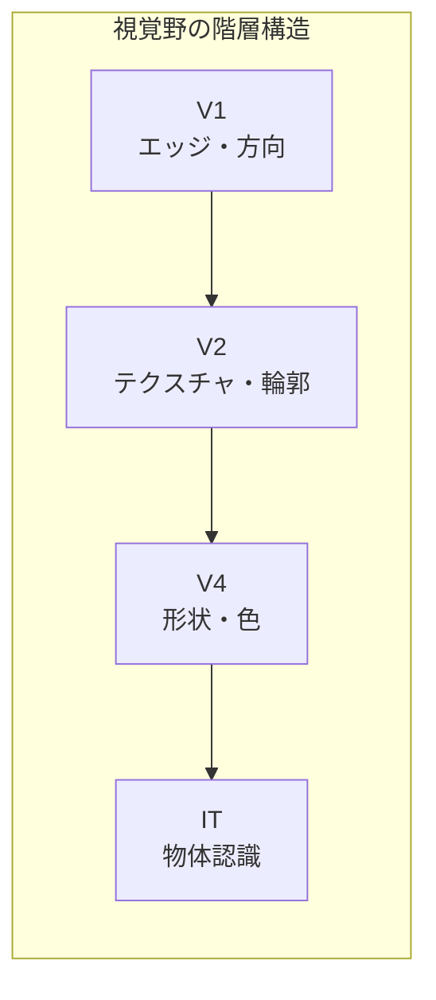
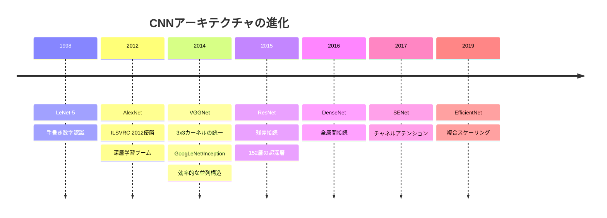
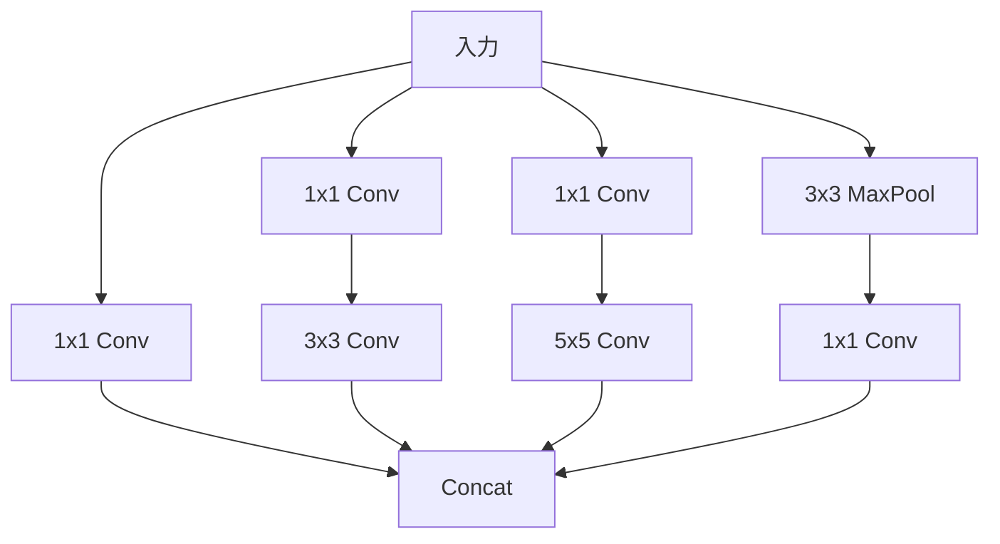
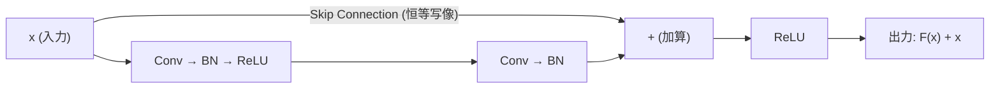
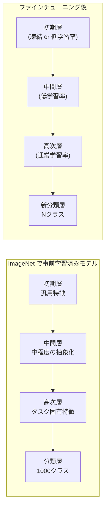

# CNN（畳み込みニューラルネットワーク）— 画像認識の基盤技術

## 1. 背景と動機：全結合層の限界と視覚野からの着想

### 全結合層（Fully Connected Layer）の限界

ニューラルネットワークの最も基本的な構成要素である全結合層（Dense Layer）は、入力層のすべてのニューロンが出力層のすべてのニューロンと結合する構造を持つ。画像分類のような問題にこの全結合層のみを用いると、本質的な限界に直面する。

**パラメータ数の爆発**

画像は典型的には3次元のテンソル（幅 $\times$ 高さ $\times$ チャネル数）として表現される。たとえば $224 \times 224$ のRGBカラー画像は $224 \times 224 \times 3 = 150{,}528$ 次元の入力となる。これを1,000次元の隠れ層に全結合すると、その層だけで約1.5億個の重みパラメータが必要になる。このパラメータ数の爆発は、計算コストの増大と、学習データが限られた場合の深刻な過学習を引き起こす。

```
Fully Connected Layer for Image:

Input: 224 x 224 x 3 = 150,528 neurons
Hidden: 1,000 neurons
Parameters: 150,528 x 1,000 = ~150M weights

  [pixel_1]---+---[h_1]
  [pixel_2]---+---[h_2]
     ...      X    ...     Every input connected to every output
  [pixel_N]---+---[h_M]
```

**空間的構造の無視**

全結合層は入力を1次元のベクトルに平坦化（flatten）するため、画像が本来持つ空間的な構造 --- 隣接するピクセル間の局所的な相関や、物体の形状・テクスチャといった局所パターン --- を完全に無視する。画像の左上隅のピクセルと右下隅のピクセルが等しく結合されるため、「近くのピクセルほど関連性が高い」という画像の本質的な性質を活用できない。

**平行移動不変性の欠如**

画像中の物体は任意の位置に出現しうる。全結合層はピクセル位置ごとに独立した重みを学習するため、左上に写った猫と右下に写った猫を認識するには、それぞれの位置に対応する重みを個別に学習する必要がある。これは極めて非効率であり、汎化能力を大きく制限する。

### 視覚野からの着想

CNNの設計思想は、哺乳類の視覚野（Visual Cortex）の神経科学的知見に深く根ざしている。

1962年、David Hubel と Torsten Wiesel は、猫の一次視覚野（V1）のニューロンの応答特性を電気生理学的に記録する実験を行った。この研究から、以下の重要な発見が得られた。

- **単純型細胞**（Simple Cell）：視野の特定の小さな領域（受容野, Receptive Field）において、特定の方向のエッジや線分に選択的に反応する。すなわち、各ニューロンは画像全体ではなく**局所的なパターン**にのみ反応する
- **複雑型細胞**（Complex Cell）：単純型細胞と同様に特定の方向に反応するが、受容野内での**位置のずれに対してロバスト**である。すなわち、ある程度の平行移動不変性を持つ
- **階層的処理**：視覚情報は V1 → V2 → V4 → IT（下側頭葉）と段階的に処理され、低次の領域では単純なエッジや線分が、高次の領域ではより複雑な形状や物体全体が表現される



この発見は、生物の視覚システムが「局所受容野」「特徴の階層的抽出」「位置不変性」という3つの原理に基づいていることを示唆しており、CNNの設計に直接的な影響を与えた。

### Neocognitron と LeNet

1980年、福島邦彦は Hubel-Wiesel の知見を計算モデルに翻訳した **Neocognitron** を発表した。Neocognitron は、S層（単純型細胞に対応する特徴抽出層）とC層（複雑型細胞に対応するプーリング層）を交互に積み重ねる階層構造を持ち、手書き数字の認識に成功した。これはCNNの概念的な原型であるが、当時は誤差逆伝播法（Backpropagation）による学習ではなく、競合学習に基づいていた。

1989年、Yann LeCun らは Neocognitron の構造的アイデアと誤差逆伝播法を組み合わせた **LeNet** を提案し、手書き数字の認識に応用した。これが現代的な意味での最初のCNNである。LeNet は畳み込み層とプーリング層を交互に配置し、最後に全結合層で分類を行うアーキテクチャを確立した。1998年に発表された **LeNet-5** は、米国の郵便番号認識システムに実用化され、CNNの有効性を実証した。

## 2. 畳み込み演算の数学的定義

### 連続信号における畳み込み

数学における畳み込み（Convolution）は、2つの関数 $f$ と $g$ から第3の関数を生成する演算であり、以下のように定義される。

$$(f * g)(t) = \int_{-\infty}^{\infty} f(\tau) \, g(t - \tau) \, d\tau$$

直感的には、一方の関数を反転させてスライドさせながら、もう一方の関数との重なりの面積を計算する操作である。信号処理においては、$f$ が入力信号、$g$ がフィルタ（インパルス応答）に対応する。

### 離散2次元畳み込み

画像処理の文脈では、2次元の離散畳み込みが中核となる。入力画像 $I$ とカーネル（フィルタ）$K$ の畳み込みは以下のように定義される。

$$(I * K)(i, j) = \sum_m \sum_n I(i - m, \, j - n) \cdot K(m, n)$$

ここで $(i, j)$ は出力の空間位置、$(m, n)$ はカーネル内の位置を表す。

::: tip 畳み込みと相互相関の違い
厳密な数学的畳み込みではカーネルを上下左右に反転（フリップ）させてからスライドさせる。しかし、深層学習の実装ではカーネルの重みは学習によって決定されるため、反転の有無は本質的に問題にならない。そのため実際のCNNフレームワーク（PyTorch, TensorFlowなど）では、**相互相関**（Cross-correlation）を計算している。

$$(I \star K)(i, j) = \sum_m \sum_n I(i + m, \, j + n) \cdot K(m, n)$$

この相互相関を慣習的に「畳み込み」と呼んでいる。
:::

### CNNにおける畳み込みの定式化

実際のCNNでは、入力は多チャネル（例：RGB画像は3チャネル）のテンソルである。入力テンソル $X \in \mathbb{R}^{C_{\text{in}} \times H \times W}$（$C_{\text{in}}$ は入力チャネル数、$H$ は高さ、$W$ は幅）に対して、フィルタ $K \in \mathbb{R}^{C_{\text{in}} \times k_h \times k_w}$（$k_h, k_w$ はカーネルサイズ）を適用し、1枚の特徴マップを生成する。

$$Y(i, j) = \sum_{c=0}^{C_{\text{in}}-1} \sum_{m=0}^{k_h-1} \sum_{n=0}^{k_w-1} X(c, \, i+m, \, j+n) \cdot K(c, m, n) + b$$

$b$ はバイアス項である。$C_{\text{out}}$ 個のフィルタを用意すれば、$C_{\text{out}}$ 枚の特徴マップが出力され、結果として出力テンソルは $Y \in \mathbb{R}^{C_{\text{out}} \times H' \times W'}$ となる。

## 3. カーネル/フィルタとパラメータ共有

### カーネルとは何か

カーネル（Kernel）、あるいはフィルタ（Filter）は、CNNの学習可能なパラメータの中核をなす小さな行列である。典型的なサイズは $3 \times 3$ や $5 \times 5$ であり、入力画像の上を「スライド」しながら、各位置で要素ごとの積の和（内積）を計算する。

```
Input (5x5)          Kernel (3x3)        Output (3x3)
+---+---+---+---+---+   +---+---+---+
| 1 | 0 | 1 | 0 | 1 |   | 1 | 0 | 1 |
+---+---+---+---+---+   +---+---+---+
| 0 | 1 | 0 | 1 | 0 |   | 0 | 1 | 0 |   Slide kernel across input,
+---+---+---+---+---+   +---+---+---+   compute dot product at each position
| 1 | 0 | 1 | 0 | 1 |   | 1 | 0 | 1 |
+---+---+---+---+---+   +---+---+---+       +---+---+---+
| 0 | 1 | 0 | 1 | 0 |                       | 4 | 2 | 4 |
+---+---+---+---+---+                       +---+---+---+
| 1 | 0 | 1 | 0 | 1 |                       | 2 | 4 | 2 |
+---+---+---+---+---+                       +---+---+---+
                                             | 4 | 2 | 4 |
                                             +---+---+---+
```

画像処理の古典的なフィルタとの対比で理解すると直感的である。たとえば、Sobelフィルタは水平方向・垂直方向のエッジを検出する手作りのカーネルである。

$$K_x = \begin{bmatrix} -1 & 0 & 1 \\ -2 & 0 & 2 \\ -1 & 0 & 1 \end{bmatrix}, \quad K_y = \begin{bmatrix} -1 & -2 & -1 \\ 0 & 0 & 0 \\ 1 & 2 & 1 \end{bmatrix}$$

CNNでは、これらのカーネルの値を手動で設計するのではなく、**学習によって自動的に獲得**する。学習された初期層のカーネルは、Gabor フィルタに類似したエッジ検出器や、特定の色パターンに反応するフィルタになることが実験的に確認されている。

### パラメータ共有の原理

パラメータ共有（Parameter Sharing / Weight Sharing）は、CNNの最も重要な設計原理のひとつである。ひとつのカーネルが画像全体をスライドする際、**すべての位置で同じ重みパラメータを使用**する。

この設計には2つの根本的な利点がある。

**1. パラメータ数の劇的な削減**

$224 \times 224 \times 3$ の入力に対して $3 \times 3$ カーネルを64個使う畳み込み層のパラメータ数は以下である。

$$\underbrace{3 \times 3 \times 3}_{\text{kernel size} \times C_{\text{in}}} \times \underbrace{64}_{C_{\text{out}}} + \underbrace{64}_{\text{biases}} = 1{,}792$$

全結合層の約1.5億パラメータと比較すると、5桁以上の削減である。

**2. 平行移動等変性（Translation Equivariance）**

同じカーネルが画像全体で共有されるため、入力画像中の物体が平行移動しても、出力特徴マップでは対応する位置の値が同じように平行移動する。数学的には、平行移動演算子 $T_{\Delta}$ に対して以下が成り立つ。

$$\text{Conv}(T_{\Delta}(X)) = T_{\Delta}(\text{Conv}(X))$$

これは「入力が $\Delta$ だけシフトすれば出力も $\Delta$ だけシフトする」ことを意味し、物体の位置に依存しない特徴抽出を可能にする。

::: warning 等変性と不変性の区別
畳み込み層がもたらすのは平行移動**等変性**（Equivariance）であり、平行移動**不変性**（Invariance）ではない。不変性（入力がシフトしても出力が変化しない）は、後述するプーリング層や大域的平均プーリング（Global Average Pooling）によって徐々に獲得される。
:::

## 4. ストライド、パディング、受容野

### ストライド（Stride）

ストライドは、カーネルをスライドさせる際の移動幅を決定するハイパーパラメータである。ストライド $s = 1$ ではカーネルは1ピクセルずつ移動し、$s = 2$ では2ピクセルずつ移動する。

入力サイズ $H$、カーネルサイズ $k$、ストライド $s$ のとき、出力サイズは以下のようになる（パディングなしの場合）。

$$H_{\text{out}} = \left\lfloor \frac{H - k}{s} \right\rfloor + 1$$

ストライドを $s > 1$ に設定すると、出力の空間解像度が低下し、ダウンサンプリングの効果が得られる。これは計算量の削減と受容野の拡大に寄与する。近年のアーキテクチャでは、プーリング層の代わりにストライド2の畳み込み（Strided Convolution）を用いてダウンサンプリングを行う設計が主流になりつつある。

```
Stride = 1:                     Stride = 2:
Input (5x5), Kernel (3x3)      Input (5x5), Kernel (3x3)
Output: (5-3)/1 + 1 = 3x3      Output: (5-3)/2 + 1 = 2x2

[K][K][K][ ][ ]  -> pos(0,0)   [K][K][K][ ][ ]  -> pos(0,0)
[ ][K][K][K][ ]  -> pos(0,1)   [ ][ ][K][K][K]  -> pos(0,1)
[ ][ ][K][K][K]  -> pos(0,2)
```

### パディング（Padding）

パディングは、畳み込み演算の前に入力テンソルの周囲にピクセルを追加する操作である。主な目的は以下の2つである。

**1. 出力サイズの制御**

パディングなしの畳み込みでは、出力サイズが入力より小さくなる。多くの層を重ねると特徴マップがどんどん縮小してしまう。パディングサイズ $p$ を適切に設定することで、出力サイズを制御できる。

$$H_{\text{out}} = \left\lfloor \frac{H + 2p - k}{s} \right\rfloor + 1$$

$k = 3, s = 1$ の場合、$p = 1$ と設定すれば $H_{\text{out}} = H$ となり、入力と同じ空間サイズを維持できる。これを **same パディング**と呼ぶ。

**2. 境界情報の保持**

パディングなしでは、画像の端にあるピクセルはカーネルの中心位置となる機会が少なく、特徴抽出において不利になる。パディングによってこの偏りを緩和できる。

最も一般的なパディング方法は **ゼロパディング**（0で埋める）であるが、反射パディング（境界値をミラーリング）や循環パディングなども用いられる。

### 受容野（Receptive Field）

受容野とは、ネットワークのある層の1つのニューロンの出力に影響を与える、入力画像上の空間領域のことである。生物の視覚野における受容野の概念に直接対応する。

単一の畳み込み層（$3 \times 3$ カーネル）の受容野は $3 \times 3$ である。しかし、層を積み重ねることで受容野は拡大する。

```
Layer 1 (3x3 kernel): Receptive field = 3x3
Layer 2 (3x3 kernel): Receptive field = 5x5
Layer 3 (3x3 kernel): Receptive field = 7x7

Input image:
+---+---+---+---+---+---+---+
|   |   |   |   |   |   |   |
+---+---+---+---+---+---+---+    Layer 3: one neuron "sees"
|   | * | * | * | * | * |   |    a 7x7 region of the input
+---+---+---+---+---+---+---+
|   | * | * | * | * | * |   |         Layer 2: 5x5
+---+---+---+---+---+---+---+
|   | * | * |[O]| * | * |   |              Layer 1: 3x3
+---+---+---+---+---+---+---+
|   | * | * | * | * | * |   |    [O] = output neuron
+---+---+---+---+---+---+---+    *  = receptive field
|   | * | * | * | * | * |   |
+---+---+---+---+---+---+---+
|   |   |   |   |   |   |   |
+---+---+---+---+---+---+---+
```

ストライド $s$、カーネルサイズ $k$ の場合、$L$ 層積み重ねた後の受容野 $R_L$ は再帰的に以下のように計算できる。

$$R_L = R_{L-1} + (k_L - 1) \times \prod_{i=1}^{L-1} s_i$$

ここで $R_0 = 1$（入力ピクセル1つ）である。

受容野の設計は、CNNアーキテクチャの設計において極めて重要である。受容野が小さすぎると大きな物体を認識できず、大きすぎると計算コストが増大する。$3 \times 3$ カーネルを複数層積み重ねることで、$5 \times 5$ や $7 \times 7$ の大きなカーネル1層と同等の受容野を、より少ないパラメータと非線形性の増加によって実現できる。この知見は VGGNet の設計哲学の基盤となった。

## 5. プーリング層（Pooling Layer）

プーリング層は、特徴マップの空間的な次元を縮小し、計算量を削減するとともに、特徴表現にある程度の平行移動不変性を付与する役割を持つ。

### Max Pooling

Max Pooling は、各プーリングウィンドウ内の最大値を選択する操作である。最も広く用いられるプーリング手法であり、典型的には $2 \times 2$ のウィンドウとストライド2で適用される。

$$Y(i, j) = \max_{0 \le m < k, \, 0 \le n < k} X(i \cdot s + m, \, j \cdot s + n)$$

```
Input (4x4):              Max Pool (2x2, stride=2):
+---+---+---+---+         +---+---+
| 1 | 3 | 2 | 4 |         | 5 | 4 |
+---+---+---+---+         +---+---+
| 5 | 2 | 1 | 3 |  --->   | 7 | 6 |
+---+---+---+---+         +---+---+
| 4 | 7 | 3 | 1 |
+---+---+---+---+         Output (2x2)
| 2 | 1 | 6 | 5 |
+---+---+---+---+
```

Max Pooling の直感的な意味は、「ある特徴が存在するかどうか」を検出することにある。ウィンドウ内のどの位置に特徴が存在しても最大値が選択されるため、微小な位置のずれに対してロバストになる。

### Average Pooling

Average Pooling は、各ウィンドウ内の平均値を計算する。

$$Y(i, j) = \frac{1}{k^2} \sum_{m=0}^{k-1} \sum_{n=0}^{k-1} X(i \cdot s + m, \, j \cdot s + n)$$

Max Pooling と比較すると、すべてのアクティベーションの情報を保持するため、特徴マップ全体の統計量を要約する場面に適している。

近年のアーキテクチャでは、最終層の前に **Global Average Pooling**（GAP）を配置する設計が一般的である。これは特徴マップ全体の空間次元にわたって平均を取り、各チャネルをスカラー値に圧縮する操作である。

$$\text{GAP}(c) = \frac{1}{H \times W} \sum_{i=0}^{H-1} \sum_{j=0}^{W-1} X(c, i, j)$$

GAP は全結合層のパラメータ数を大幅に削減し、過学習を抑制する効果がある。この手法は Network in Network（NIN, 2013）で提案され、GoogLeNet 以降の多くのアーキテクチャで採用されている。

### プーリング層の役割と議論

プーリング層の役割は以下のように整理できる。

1. **空間的ダウンサンプリング**: 特徴マップのサイズを縮小し、後続の層の計算量を削減する
2. **平行移動不変性の付与**: 特徴の正確な位置情報を一部捨てることで、位置のずれに対するロバスト性を獲得する
3. **受容野の拡大**: ダウンサンプリング後の畳み込み層は、元の入力に対してより広い受容野を持つことになる

ただし、近年ではプーリング層を排除し、ストライド2の畳み込みで代替するアーキテクチャも増えている。Springenberg ら（2015）の研究「Striving for Simplicity: The All Convolutional Net」では、Max Pooling をストライド付き畳み込みに置き換えても精度が低下しないことが示された。ResNet や最新のアーキテクチャの多くは、この知見を取り入れている。

## 6. 代表的なアーキテクチャの進化

CNN の発展は、ImageNet Large Scale Visual Recognition Challenge（ILSVRC）というベンチマークによって加速された。2010年に始まったこのコンペティションは、120万枚の画像を1,000カテゴリに分類するタスクであり、アーキテクチャの進化を追う上で重要なマイルストーンとなっている。



### LeNet-5（1998）

Yann LeCun らが開発した LeNet-5 は、現代的CNNの原型である。$32 \times 32$ のグレースケール画像を入力とし、手書き数字（0-9）を分類する。

```
LeNet-5 Architecture:

Input     Conv1     Pool1    Conv2     Pool2    FC1    FC2    Output
32x32x1 -> 28x28x6 -> 14x14x6 -> 10x10x16 -> 5x5x16 -> 120 -> 84 -> 10
         5x5 kern  2x2 avg   5x5 kern   2x2 avg
```

アーキテクチャの要点は以下の通りである。

- 2つの畳み込み層（$5 \times 5$ カーネル）と2つのプーリング層（Average Pooling）
- 3つの全結合層（120 → 84 → 10ニューロン）
- 活性化関数にはシグモイドまたは tanh を使用
- 約60,000パラメータ

LeNet-5 は概念的には成功したが、当時の計算能力とデータ量の制約から、自然画像のような複雑な問題への適用は困難であった。

### AlexNet（2012）

Alex Krizhevsky, Ilya Sutskever, Geoffrey Hinton が開発した AlexNet は、ILSVRC 2012で Top-5 エラー率を前年の 25.8% から 16.4% に劇的に削減し、深層学習の実用性を世界に示した。この結果は、コンピュータビジョンの歴史における転換点であり、「深層学習革命」の起点とされる。

AlexNet の革新は以下の点にある。

- **ReLU 活性化関数**: シグモイドや tanh に代えて $\text{ReLU}(x) = \max(0, x)$ を採用し、勾配消失問題を緩和するとともに学習の高速化を実現した
- **GPU を用いた学習**: 2枚の NVIDIA GTX 580 GPU で並列学習を行い、大規模モデルの学習を実用的な時間で完了させた
- **Dropout**: 学習時にニューロンをランダムに無効化する正則化手法を導入し、過学習を抑制した
- **データ拡張**（Data Augmentation）: 画像の反転、クロッピング、色彩変換などにより学習データを疑似的に増加させた

```
AlexNet Architecture:

Input: 227x227x3
  |
Conv1: 96 filters, 11x11, stride 4 -> 55x55x96
  |-> ReLU -> Local Response Norm -> Max Pool 3x3, stride 2
  |
Conv2: 256 filters, 5x5, pad 2 -> 27x27x256
  |-> ReLU -> Local Response Norm -> Max Pool 3x3, stride 2
  |
Conv3: 384 filters, 3x3, pad 1 -> 13x13x384
  |-> ReLU
  |
Conv4: 384 filters, 3x3, pad 1 -> 13x13x384
  |-> ReLU
  |
Conv5: 256 filters, 3x3, pad 1 -> 13x13x256
  |-> ReLU -> Max Pool 3x3, stride 2
  |
FC6: 4096 -> ReLU -> Dropout
  |
FC7: 4096 -> ReLU -> Dropout
  |
FC8: 1000 (softmax)

Total parameters: ~60M
```

### VGGNet（2014）

Oxford大学の Karen Simonyan と Andrew Zisserman が提案した VGGNet は、「**小さいカーネルを深く積む**」という設計哲学を体系的に実証した。

VGGNet の核心的な洞察は以下である。$5 \times 5$ カーネル1層の受容野は $5 \times 5$ だが、$3 \times 3$ カーネル2層でも同じ $5 \times 5$ の受容野を得られる。しかし、パラメータ数は以下のように異なる。

- $5 \times 5$ カーネル1層: $25C^2$ パラメータ（$C$ はチャネル数）
- $3 \times 3$ カーネル2層: $2 \times 9C^2 = 18C^2$ パラメータ

3層の $3 \times 3$ カーネルは $7 \times 7$ と等価な受容野を持つが、パラメータ数は $27C^2$ 対 $49C^2$ とさらに差が開く。加えて、層の間にReLUが挿入されるため、非線形性が増加し、より複雑な特徴の表現が可能になる。

VGG-16（16層）は約1.38億パラメータを持ち、ILSVRC 2014で2位（分類タスク）となった。

### GoogLeNet / Inception（2014）

Google の Christian Szegedy らが提案した GoogLeNet は、ILSVRC 2014で1位を獲得した。その中核は **Inception モジュール**と呼ばれる並列構造である。



Inception モジュールの設計思想は、「異なるスケールの特徴を同時に抽出する」ことである。$1 \times 1$、$3 \times 3$、$5 \times 5$ の畳み込みと Max Pooling を並列に実行し、その結果をチャネル方向に連結する。

**$1 \times 1$ 畳み込み**は、空間的には何もしないが、チャネル方向の線形結合を行う。これにより以下の2つの効果がある。

1. **次元削減**: $3 \times 3$ や $5 \times 5$ 畳み込みの前に $1 \times 1$ 畳み込みを挟むことで、入力チャネル数を削減し、計算量を大幅に抑制する（ボトルネック構造）
2. **チャネル間の情報統合**: 異なるチャネルの特徴を線形結合し、新たな特徴表現を生成する

GoogLeNet は22層でありながらパラメータ数は約500万と、VGG-16の約 $\frac{1}{27}$ である。この効率性は、Inception モジュールの巧みな設計によるものである。

### ResNet（2015）

Kaiming He らが提案した **ResNet**（Residual Network）は、ILSVRC 2015で Top-5 エラー率 3.57% を達成し、初めて人間の認識精度（約5%）を超えた。ResNet はCNNの歴史における最も重要なブレークスルーのひとつであり、その核心は**残差接続**（Residual Connection / Skip Connection）にある。詳細は次節で述べる。

## 7. 残差接続（Skip Connection）の理論

### 深層ネットワークの劣化問題

直感的には、ネットワークの深さを増すほど表現力は増大し、精度は向上するはずである。しかし実際には、ある深さを超えると**学習誤差そのものが増大**する現象が観測された。これは過学習ではない --- 学習データに対する精度が悪化するのである。

```
Error vs. Depth (plain networks):

Error |
      |  *.
      |    *..
      |       *..           * 20-layer (lower error)
      |          *****
      |                     . 56-layer (HIGHER error!)
      |               .....
      +--------------------->
                   Depth

Problem: Deeper plain network has HIGHER training error
```

この**劣化問題**（Degradation Problem）の原因は、最適化の困難さにある。深層ネットワークでは、勾配が多数の層を通過するうちに消失または爆発し、効果的な学習が困難になる。理論的には、浅いネットワークの解に加えて残りの層を恒等写像にすれば、深いネットワークは少なくとも浅いネットワークと同等の性能を持つはずである。しかし、実際の最適化ではこの恒等写像を学習することが困難なのである。

### 残差学習の定式化

ResNet はこの問題を、**残差写像**（Residual Mapping）の導入によって解決した。目標とする写像を $H(\boldsymbol{x})$ とする。通常のネットワークは $H(\boldsymbol{x})$ を直接学習しようとするが、ResNet では $H(\boldsymbol{x})$ を以下のように分解する。

$$H(\boldsymbol{x}) = F(\boldsymbol{x}) + \boldsymbol{x}$$

ここで $F(\boldsymbol{x}) = H(\boldsymbol{x}) - \boldsymbol{x}$ は**残差**（Residual）である。ネットワークが学習すべきは $H(\boldsymbol{x})$ 全体ではなく、入力からのずれ $F(\boldsymbol{x})$ のみとなる。



この設計が機能する直感的な理由は以下の通りである。

- もしある層が不要であれば、$F(\boldsymbol{x}) = 0$ を学習すればよい。これはゼロ写像であり、恒等写像 $H(\boldsymbol{x}) = \boldsymbol{x}$ を直接学習するより遥かに容易である
- 勾配の逆伝播において、Skip Connection は勾配が層をバイパスする経路を提供する。これにより勾配消失が緩和される

### 勾配の流れとアンサンブル解釈

残差接続の効果は、勾配の流れの観点からも理解できる。損失 $L$ に対する入力 $\boldsymbol{x}$ の勾配を連鎖律で展開すると以下のようになる。

$$\frac{\partial L}{\partial \boldsymbol{x}} = \frac{\partial L}{\partial H(\boldsymbol{x})} \cdot \frac{\partial H(\boldsymbol{x})}{\partial \boldsymbol{x}} = \frac{\partial L}{\partial H(\boldsymbol{x})} \cdot \left(1 + \frac{\partial F(\boldsymbol{x})}{\partial \boldsymbol{x}}\right)$$

加法的な $1$ の項があるため、$\frac{\partial F(\boldsymbol{x})}{\partial \boldsymbol{x}}$ が小さくても勾配が完全に消失することはない。これが深層ネットワークの学習を可能にする鍵である。

また、Veit ら（2016）は、ResNet を指数的に多くの浅いネットワークの**暗黙的なアンサンブル**として解釈できることを示した。$n$ 個の残差ブロックを持つネットワークは、Skip Connection の組み合わせにより $2^n$ 通りの異なる経路を内包しており、これらの経路が暗黙的にアンサンブルとして機能する。

### ResNet の深さとバリエーション

ResNet は、18層から152層までのバリエーションが提案された。深い構成（50層以上）では、計算効率のために**ボトルネック構造**が採用される。

```
Basic Block (ResNet-18/34):       Bottleneck Block (ResNet-50/101/152):

x --+-> 3x3 Conv, BN, ReLU       x --+-> 1x1 Conv, BN, ReLU (reduce channels)
    |   3x3 Conv, BN                  |   3x3 Conv, BN, ReLU
    +-> Add -> ReLU                   |   1x1 Conv, BN       (restore channels)
                                      +-> Add -> ReLU
```

ボトルネック構造では、$1 \times 1$ 畳み込みでチャネル数を一旦削減し、$3 \times 3$ 畳み込みを行った後、$1 \times 1$ 畳み込みで元のチャネル数に復元する。これにより、$3 \times 3$ 畳み込みの計算量を大幅に削減できる。

## 8. 転移学習とファインチューニング

### 転移学習の動機

大規模なCNNの学習には、膨大な計算資源とデータが必要である。ResNet-50 を ImageNet で学習するには、数十GPU時間を要する。しかし実際のアプリケーションでは、ドメイン固有のデータ（医療画像、衛星画像、製造業の検査画像など）は限られていることが多い。

転移学習（Transfer Learning）は、あるタスク（ソースタスク）で学習した知識を、別のタスク（ターゲットタスク）に活用する手法である。CNNにおいてこれが有効なのは、以下の理由による。

- CNNの初期層は、エッジ、テクスチャ、色彩パターンなど、ドメインに依存しない**汎用的な視覚特徴**を学習する
- 中間層は、より複雑なパターン（テクスチャの組み合わせ、部分的な形状）を抽出する
- 最終層に近い高次の層のみが、タスク固有の特徴を表現する



### ファインチューニングの戦略

ファインチューニング（Fine-tuning）は、事前学習済みモデルの重みを初期値として、ターゲットタスクのデータで追加学習を行う手法である。以下のような戦略が一般的である。

**1. Feature Extraction（特徴抽出器として利用）**

事前学習済みモデルの畳み込み層を凍結（重みを固定）し、最終層の分類器（全結合層）のみを新しいタスクに合わせて学習する。ターゲットデータが少ない場合に有効である。

**2. Full Fine-tuning（全層のファインチューニング）**

すべての層の重みを更新可能にし、ターゲットデータで学習する。ただし、初期層には小さな学習率を、最終層には大きな学習率を設定する **Discriminative Learning Rate**（差別的学習率）を用いることが多い。

**3. Gradual Unfreezing（段階的な凍結解除）**

最初は分類層のみを学習し、段階的に下位の層の凍結を解除していく。Jeremy Howard らが fast.ai ライブラリで推奨した手法であり、学習の安定性が高い。

```python
import torch
import torchvision.models as models

# Load pretrained ResNet-50
model = models.resnet50(weights=models.ResNet50_Weights.IMAGENET1K_V2)

# Strategy 1: Feature extraction (freeze all layers)
for param in model.parameters():
    param.requires_grad = False

# Replace final classification layer
num_classes = 10  # target task classes
model.fc = torch.nn.Linear(model.fc.in_features, num_classes)

# Strategy 2: Discriminative learning rates
optimizer = torch.optim.Adam([
    {"params": model.layer1.parameters(), "lr": 1e-5},  # low LR for early layers
    {"params": model.layer2.parameters(), "lr": 1e-5},
    {"params": model.layer3.parameters(), "lr": 1e-4},
    {"params": model.layer4.parameters(), "lr": 1e-4},
    {"params": model.fc.parameters(), "lr": 1e-3},       # high LR for classifier
])
```

転移学習の成功は、CNNが学習する特徴表現の**汎用性**を裏付けるものであり、深層学習の実用化において最も重要な技術のひとつである。

## 9. CNNの可視化と解釈

CNNは強力な分類器であるが、その内部で何が起きているかを理解することは、モデルの信頼性向上やデバッグにとって極めて重要である。

### 特徴マップ（Feature Map）の可視化

各畳み込み層の出力である特徴マップを直接可視化することで、各層がどのような特徴を検出しているかを観察できる。

Zeiler と Fergus（2014）の研究は、Deconvolutional Network（DeconvNet）を用いて各層の特徴を入力画像空間に逆射影する手法を提案し、CNNの階層的な特徴学習を視覚的に示した。

```
Layer 1: Edge detectors, color blobs
         +---+  +---+  +---+
         |/  |  |-- |  |  \|
         +---+  +---+  +---+

Layer 2: Corners, textures, simple patterns
         +---+  +---+  +---+
         |/\ |  |###|  |ooo|
         +---+  +---+  +---+

Layer 3: Parts of objects (eyes, wheels, windows)
         +------+  +------+  +------+
         | (o)(o)|  | [][] |  | @  @ |
         +------+  +------+  +------+

Layer 4-5: Entire objects, scene layouts
         +----------+  +----------+
         |  face     |  |  car     |
         |  (._.)    |  |  [=][=]  |
         +----------+  +----------+
```

この階層的な特徴抽出は、Hubel-Wiesel が発見した視覚野の階層構造と驚くほど類似しており、CNNが生物の視覚システムの計算原理を模倣していることを示唆している。

### Grad-CAM（Gradient-weighted Class Activation Mapping）

Selvaraju ら（2017）が提案した **Grad-CAM** は、CNNの判断根拠を可視化する代表的な手法である。特定のクラスの予測に対して、最終畳み込み層の各チャネルがどの程度寄与しているかを勾配情報から計算し、入力画像上にヒートマップとして重畳する。

具体的には、クラス $c$ のスコア $y^c$ に対する最終畳み込み層の特徴マップ $A^k$（$k$ はチャネルインデックス）の勾配を用いて、各チャネルの重要度 $\alpha_k^c$ を計算する。

$$\alpha_k^c = \frac{1}{Z} \sum_i \sum_j \frac{\partial y^c}{\partial A^k_{ij}}$$

ここで $Z$ は特徴マップの空間的な要素数である。この重要度で特徴マップの加重和を取り、ReLU を適用してヒートマップを得る。

$$L_{\text{Grad-CAM}}^c = \text{ReLU}\left(\sum_k \alpha_k^c A^k\right)$$

ReLU を適用するのは、クラス $c$ の予測に**正の影響**を与える領域のみに関心があるためである。

```
Input Image        Grad-CAM Heatmap       Overlay

+------------+     +------------+     +------------+
|            |     |     @@@@   |     |     ####   |
|    /\_/\   |     |   @@@@@@@ |     |   /####\   |
|   ( o.o )  | --> |  @@@@@@@@@ | --> |  (####)   |
|    > ^ <   |     |   @@@@@@@ |     |   >####<   |
|            |     |     @@    |     |            |
+------------+     +------------+     +------------+
                   (red = high       Model is looking
                    importance)       at the cat's face
```

Grad-CAM は以下のような用途で広く活用されている。

- **モデルのデバッグ**: モデルが正しい領域に注目しているかの確認
- **バイアスの検出**: モデルが背景やアーティファクトなど、意図しない特徴に依存していないかの検証
- **医療画像での説明可能性**: 診断支援AIがどの領域に基づいて判断したかの可視化

### その他の可視化手法

Grad-CAM 以外にも、多様な可視化・解釈手法が研究されている。

- **Saliency Map**: 入力ピクセルに対する出力の勾配を可視化する
- **Occlusion Sensitivity**: 入力画像の一部を遮蔽し、予測の変化を観察する
- **Deep Dream / Feature Visualization**: 特定のニューロンの活性化を最大化するように入力画像を最適化し、各ニューロンが「何を見ているか」を可視化する
- **LIME（Local Interpretable Model-agnostic Explanations）**: モデルの局所的な振る舞いを解釈可能な近似モデルで説明する

## 10. CNN beyond 画像：多様なデータへの応用

CNNの設計原理 --- 局所受容野、パラメータ共有、階層的特徴抽出 --- は画像に限定されるものではない。空間的あるいは時間的な局所構造を持つあらゆるデータに適用可能である。

### 1D CNN：テキストと音声

テキストデータでは、各単語（またはトークン）が埋め込みベクトル（Embedding）として表現され、文は単語ベクトルの系列となる。1D 畳み込みをこの系列に適用することで、連続する単語のパターン（n-gram に類似した局所パターン）を検出できる。

$$Y(i) = \sum_{c=0}^{C_{\text{in}}-1} \sum_{m=0}^{k-1} X(c, \, i+m) \cdot K(c, m) + b$$

Yoon Kim（2014）の「Convolutional Neural Networks for Sentence Classification」は、異なるサイズ（3, 4, 5）の1D カーネルを並列に適用し、文の分類タスクで当時の最先端に匹敵する精度を達成した。

```
Text Classification with 1D CNN:

"The  movie  was  really  great"
 [v1]  [v2]  [v3]  [v4]   [v5]     <- word embeddings (d-dim)
  |     |     |     |      |
  +--3-gram--+
        +--3-gram--+
              +--3-gram--+
  +---4-gram----+
        +---4-gram----+
  +----5-gram------+
  |     |     |     |      |
  Max Pooling over sequence
  |
  Fully Connected -> Classification
```

音声処理では、メル周波数スペクトログラム（Mel Spectrogram）を2D画像として扱い、通常の2D CNNを適用するアプローチが一般的である。また、生の波形データに1D CNNを直接適用する WaveNet（DeepMind, 2016）のようなアプローチも存在する。

### 3D CNN：動画と医療画像

動画データはフレームの時間的系列であり、3次元の空間-時間構造を持つ。3D CNN は、空間的な幅・高さに加えて時間軸方向にもカーネルをスライドさせることで、動きのパターン（動作認識）を捉える。

$$Y(t, i, j) = \sum_c \sum_{\tau} \sum_m \sum_n X(c, \, t+\tau, \, i+m, \, j+n) \cdot K(c, \tau, m, n) + b$$

代表的なモデルとして、C3D（Tran ら, 2015）や I3D（Carreira と Zisserman, 2017）がある。

医療画像の分野では、CT スキャンや MRI が本質的に3Dボリュームデータであるため、3D CNN が自然に適合する。肺結節の検出や脳腫瘍のセグメンテーションなどに応用されている。

### グラフ畳み込みネットワーク（GCN）

ユークリッド空間上の規則的なグリッド（画像）だけでなく、分子構造やソーシャルネットワークのような不規則なグラフ構造に対しても畳み込みの概念を拡張する **Graph Convolutional Network**（GCN）が研究されている。これはスペクトルグラフ理論に基づき、グラフ上の畳み込みをグラフラプラシアンの固有分解を通じて定義する。

### 点群データへの応用

自動運転車のLiDAR（Light Detection and Ranging）センサが生成する点群データ（Point Cloud）に対しては、PointNet（Qi ら, 2017）のように点の順序不変性を保証する特殊なアーキテクチャや、SparseConvNet のようにスパースな3D畳み込みを用いるアプローチが開発されている。

## 11. Vision Transformer との比較

2020年、Dosovitskiy らが「An Image is Worth 16x16 Words: Transformers for Image Recognition at Scale」で提案した **Vision Transformer（ViT）** は、画像認識の分野に大きな変革をもたらした。ViT は画像を固定サイズのパッチに分割し、各パッチを「トークン」としてTransformerに入力するアーキテクチャである。

```
CNN vs Vision Transformer:

CNN:                              ViT:
+--------+                        +--------+
| Image  |                        | Image  |
+--------+                        +--------+
    |                                  |
 Conv layers                    Split into patches
 (local features,                16x16 = 196 patches
  hierarchical)                        |
    |                            Linear embedding
 Pooling                               |
    |                            + Position embedding
 FC Layer                               |
    |                            Transformer Encoder
 Prediction                      (self-attention x L)
                                       |
                                   MLP Head
                                       |
                                  Prediction
```

### 帰納バイアスの違い

CNN と Vision Transformer の最も本質的な違いは、**帰納バイアス**（Inductive Bias）にある。

| 特性 | CNN | Vision Transformer |
|------|-----|-------------------|
| **局所性** | カーネルの局所受容野により、近接するピクセル間の関係を優先的に捉える | Self-Attention により全パッチ間の関係を等しく計算する |
| **平行移動等変性** | パラメータ共有により構造的に保証 | 位置埋め込みから学習する必要がある |
| **階層的処理** | 層を重ねるにつれ受容野が段階的に拡大 | すべての層で大域的な注意が可能 |
| **データ効率** | 強い帰納バイアスにより少量のデータでも学習可能 | 帰納バイアスが弱いため、大量のデータが必要 |

### スケーリング特性

ViT の重要な特性は、データ量とモデルサイズに対する**スケーリング特性**が優れていることである。Google の研究では、JFT-300M（3億枚の画像）のような超大規模データセットで学習した場合、ViT は CNN を上回る精度を達成した。一方で、ImageNet（約120万枚）のみで学習した場合は、同等サイズの CNN（ResNet）に劣る結果となった。

これは、CNN の局所性と平行移動等変性という帰納バイアスが、データが限られた場合の「正則化」として機能しているためと解釈できる。ViT はこれらの帰納バイアスを持たないため、それらをデータから学習する必要があり、より多くのデータを必要とする。

### ハイブリッドアーキテクチャと収束

CNN と Transformer の対立は、現在ではハイブリッドアプローチに収束しつつある。

- **ConvNeXt**（Liu ら, 2022）: Transformer の設計要素（大きなカーネル、Layer Normalization、GELUなど）を純粋なCNNに取り入れ、ViT に匹敵する精度を達成した。これは「Transformer の成功は Attention 機構そのものによるものではなく、学習の安定化やスケーリングに関する設計上の知見によるものではないか」という問題提起を含んでいる
- **CoAtNet**, **MaxViT**: 初期層にCNNの局所処理を、後段にTransformerの大域的注意を組み合わせるハイブリッド構造
- **Swin Transformer**: ウィンドウベースの Self-Attention を採用し、CNNの階層的処理に類似した構造を実現

### 現在の位置づけ

2026年現在、画像認識タスクにおいて「CNN か Transformer か」という二者択一は意味をなさなくなりつつある。以下のような使い分けが見られる。

- **エッジデバイス・リアルタイム推論**: MobileNet, EfficientNet などの軽量CNNが依然として主流である。計算効率とメモリ使用量でCNNは優位性を持つ
- **大規模事前学習**: ViT やハイブリッドモデルが主流である。大量のデータから学習する場合、Transformer のスケーリング特性が活きる
- **医療画像・産業検査**: ドメインデータが限られるため、CNNベースの転移学習が依然として有効なことが多い
- **研究の最前線**: 画像生成（Diffusion Models）や自己教師あり学習において、U-Net のようなCNNベースの構造が依然として重要な役割を果たしている

CNNは、その簡潔な設計原理と計算効率の高さから、画像認識の基盤技術としての地位を維持し続けている。Transformer の登場によって相対化されたものの、局所性と階層性という帰納バイアスの有効性は不変であり、むしろ Transformer 研究がCNNの設計原理を再発見する流れも生まれている。

## まとめ

本記事では、CNNの理論的基盤から最新の動向までを包括的に概観した。

1. **動機**: 全結合層の限界を克服するために、生物の視覚野に着想を得た局所受容野とパラメータ共有の仕組みが導入された
2. **数学的基盤**: 畳み込み演算（実装上は相互相関）が特徴抽出の中核を担い、カーネルの重みが学習によって獲得される
3. **設計原理**: ストライド、パディング、受容野の概念がネットワーク設計の自由度を与え、プーリング層が空間的要約と不変性を提供する
4. **アーキテクチャの進化**: LeNet から AlexNet, VGG, GoogLeNet, ResNet へと、深層化・効率化・残差学習の知見が蓄積された
5. **実用技術**: 転移学習とファインチューニングが限られたデータでのCNN応用を可能にし、Grad-CAM などの可視化技術が解釈可能性を高めた
6. **応用の広がり**: 1D CNN, 3D CNN, グラフ畳み込みなど、画像以外のデータ構造への拡張が進んでいる
7. **Transformer との関係**: Vision Transformer の登場により帰納バイアスの重要性が再認識され、ハイブリッドアーキテクチャへの収束が進んでいる

CNNは「局所的なパターンの検出とその階層的な組み合わせによって複雑な概念を表現する」という、シンプルかつ強力な原理に基づいている。この原理は、データの局所構造が重要な意味を持つあらゆる問題領域において、今後も有効であり続けるだろう。
