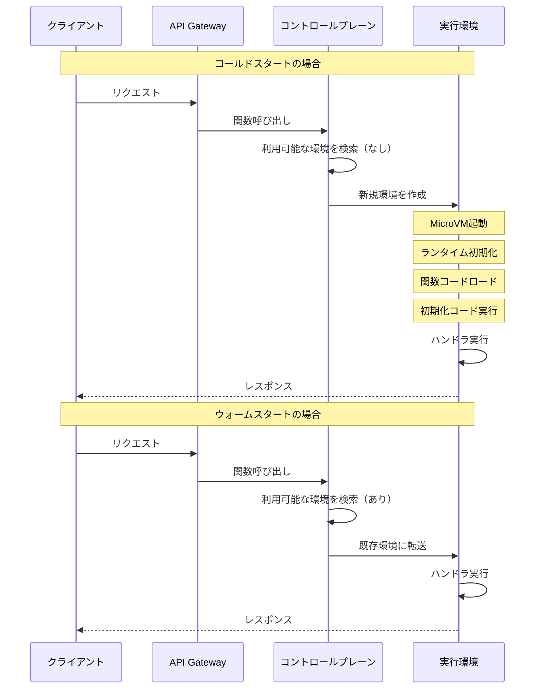
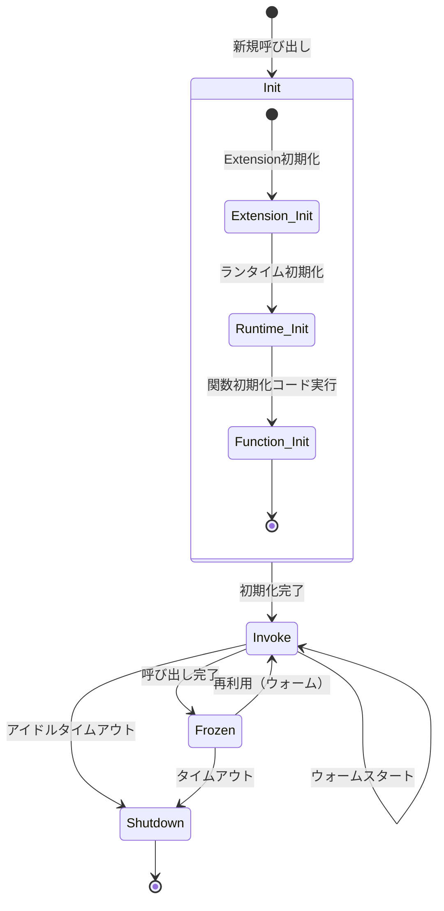
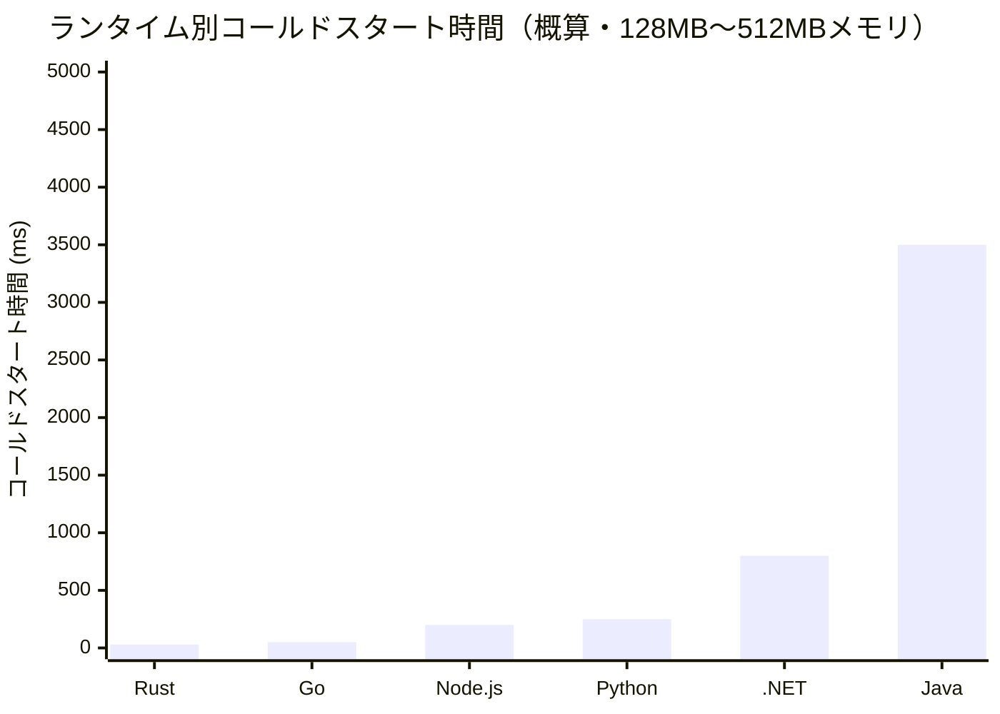
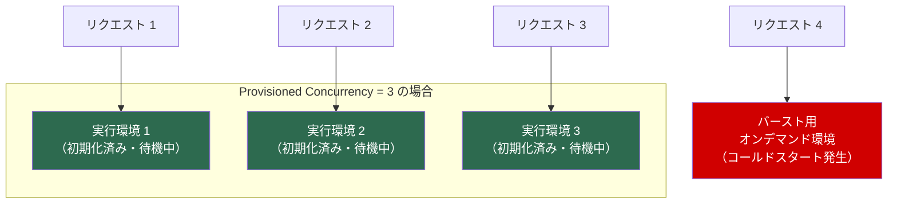
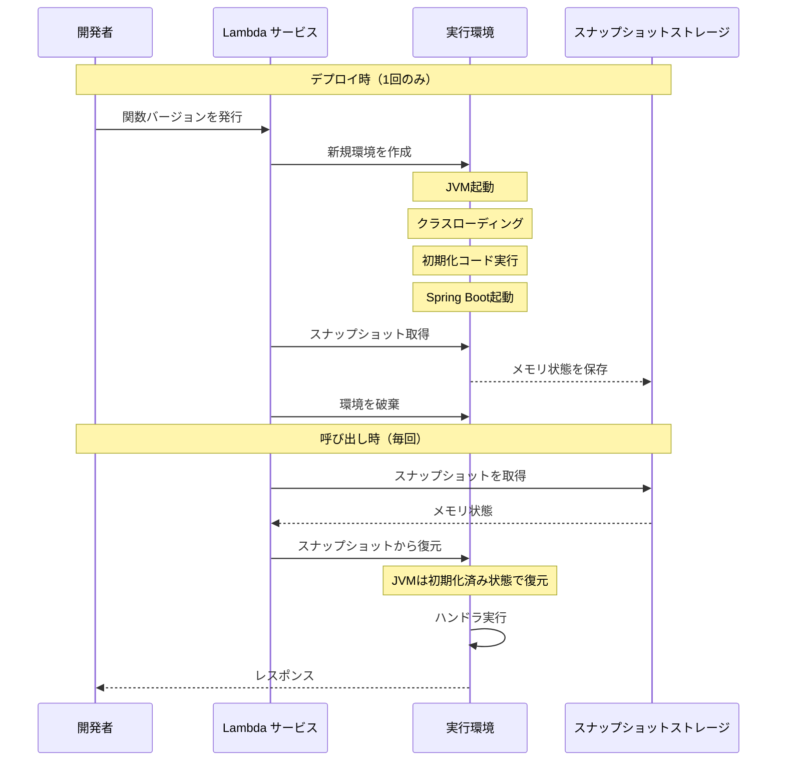
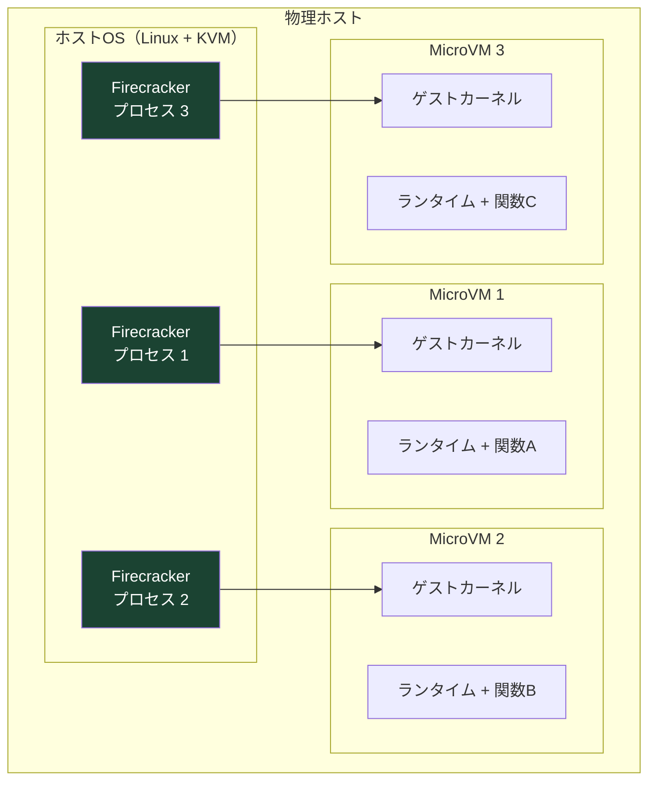
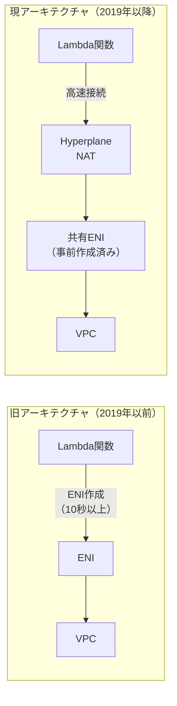
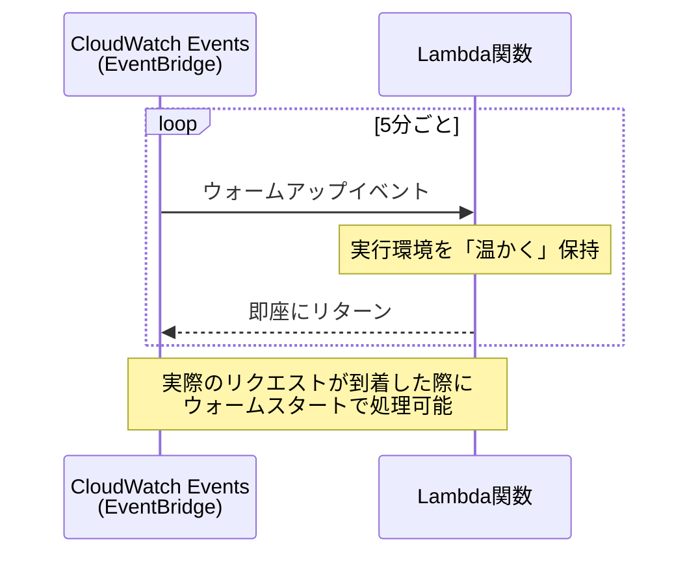
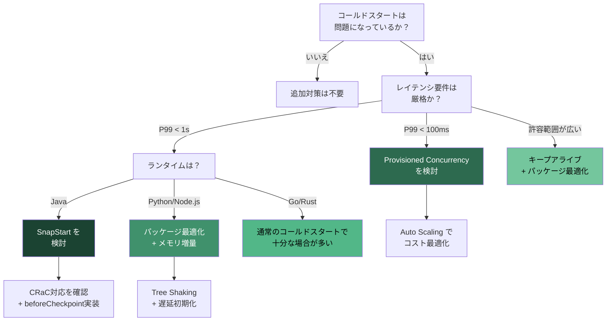

# コールドスタート問題と最適化

## 1. コールドスタートとは

### 1.1 サーバーレスの約束と現実

サーバーレスコンピューティングは「インフラ管理から開発者を完全に解放する」というビジョンを掲げて登場した。AWS Lambda（2014年）、Google Cloud Functions（2016年）、Azure Functions（2016年）といったサービスは、コードをアップロードするだけでイベント駆動型の処理を実行できる環境を提供し、スケーリングやパッチ適用、サーバーのプロビジョニングをすべてプラットフォームに委ねることを可能にした。

しかし、このモデルには本質的なトレードオフが存在する。サーバーレスプラットフォームはリクエストがないときにリソースを解放するため、新たなリクエストが到着した際に実行環境をゼロから構築する必要がある。この初期化にかかる遅延が**コールドスタート**である。

### 1.2 コールドスタートの定義

コールドスタートとは、サーバーレス関数の実行環境が存在しない状態で呼び出しが発生した際に、実行環境の作成・初期化が完了するまでの追加レイテンシを指す。通常のリクエスト処理時間（関数のビジネスロジック実行時間）に加えて、環境の準備にかかる時間がオーバーヘッドとして加算される。

対義語として**ウォームスタート**がある。これは既存の実行環境が再利用可能な状態で待機しており、新たなリクエストをほぼ即座に処理できるケースである。



### 1.3 なぜコールドスタートが問題になるのか

コールドスタートが特に問題となるシナリオは以下の通りである。

**レイテンシに敏感なAPI**：ユーザー向けのAPIエンドポイントでは、数百ミリ秒から数秒の追加レイテンシがユーザー体験を大きく損なう。P99レイテンシが跳ね上がることで、SLA違反に発展するケースもある。

**リアルタイム処理**：IoTデバイスからのストリーミングデータ処理やリアルタイムの不正検知など、低レイテンシが要件となるワークロードでは、コールドスタートは許容できない。

**チェーン呼び出し**：マイクロサービスアーキテクチャにおいて、複数のLambda関数が連鎖的に呼び出されるパターンでは、各段階でコールドスタートが発生する可能性があり、エンドツーエンドのレイテンシが累積的に悪化する。

**バースト的なトラフィック**：突発的なトラフィック増加時には、多数の新規実行環境を同時に立ち上げる必要があるため、コールドスタートの影響が顕著になる。

::: tip コールドスタートの発生頻度
実運用環境においてコールドスタートが発生する割合は、ワークロードの特性に大きく依存する。AWSの公開資料によると、典型的なワークロードではリクエスト全体の1%未満がコールドスタートの影響を受けるとされている。しかし、低頻度に呼び出される関数や、急激なトラフィックスパイクが発生するシステムでは、この割合が大幅に増加する。
:::

## 2. Lambda / Cloud Functions のライフサイクル

### 2.1 実行環境のライフサイクル

サーバーレス関数の実行環境は、明確なライフサイクルを持つ。AWS Lambdaを例にとると、以下のフェーズで構成される。



**Init（初期化）フェーズ**：実行環境が新たに作成されるフェーズである。このフェーズは3つのサブフェーズで構成される。

1. **Extension Init**：Lambda Extensionが登録・初期化される。モニタリングやセキュリティツールのエージェントがここで起動する。
2. **Runtime Init**：選択されたランタイム（Python、Node.js、Javaなど）が起動し、関数コードをロードする。
3. **Function Init**：ハンドラ関数の外側に記述された初期化コード（グローバルスコープのコード）が実行される。データベース接続の確立やSDKクライアントの生成など、一度だけ行えばよい処理をここで行う。

**Invoke（呼び出し）フェーズ**：実際のリクエスト処理が行われるフェーズである。ハンドラ関数が呼び出され、ビジネスロジックが実行される。

**Frozen（凍結）フェーズ**：呼び出し完了後、実行環境は即座に破棄されるのではなく、一定期間「凍結」状態で保持される。この間に新たなリクエストが到着すれば、環境を「解凍」してウォームスタートで処理できる。

**Shutdown（終了）フェーズ**：凍結状態のまま一定時間が経過すると、プラットフォームは実行環境を破棄する。このタイムアウト値はプラットフォームが動的に管理しており、利用者が直接制御することはできない。一般的には5分から数十分程度とされるが、負荷状況によって変動する。

### 2.2 Google Cloud Functions のライフサイクル

Google Cloud Functions（第2世代はCloud Run関数として統合）も基本的には同様のライフサイクルを持つが、いくつかの違いがある。

Cloud Run関数はコンテナベースの実行モデルを採用しており、関数コードはコンテナイメージとしてビルドされる。初期化時にはコンテナの起動とアプリケーションサーバーの立ち上げが行われ、その後リクエストを受け付ける。Cloud Runの「最小インスタンス数」設定により、常時ウォーム状態を維持するインスタンスの数を明示的に指定できる。

### 2.3 Azure Functions のライフサイクル

Azure Functionsでは、Consumptionプランを使用する場合にコールドスタートが発生する。Premium プラン（Elastic Premium）では、事前にウォームアップされたインスタンスが常時待機するため、コールドスタートを回避できる。Azure FunctionsのConsumptionプランにおけるコールドスタートは、特に.NETランタイムで数秒に達することがある。

## 3. コールドスタートの構成要素

コールドスタートの所要時間は単一の処理ではなく、複数の段階の合計である。各段階を理解することが、最適化の出発点となる。

### 3.1 構成要素の分解

```mermaid
gantt
    title コールドスタートのタイムライン（概念図）
    dateFormat X
    axisFormat %s

    section インフラ層
    MicroVM/コンテナ起動           :a1, 0, 100
    ネットワーク設定               :a2, after a1, 20

    section ランタイム層
    ランタイム起動                 :b1, after a2, 80
    ライブラリ/依存関係ロード       :b2, after b1, 150

    section アプリケーション層
    初期化コード実行               :c1, after b2, 100
    DB接続/SDKセットアップ          :c2, after c1, 50

    section 処理
    ハンドラ実行                   :d1, after c2, 30
```



#### 3.1.1 実行環境の作成（インフラ層）

最も基盤的な層であり、関数を実行するためのサンドボックス環境を用意する処理である。AWS Lambdaの場合、これはFirecracker MicroVMの起動を意味する。この層はプラットフォーム側が最適化を担うため、利用者が直接介入できる余地は少ない。

所要時間はプラットフォームと構成により異なるが、一般的に数十ミリ秒から100ミリ秒程度である。

#### 3.1.2 ランタイムの初期化（ランタイム層）

選択したプログラミング言語のランタイムを起動する処理である。インタプリタやJVMの起動、標準ライブラリのロードなどが含まれる。ランタイムごとの差が大きく、コールドスタート時間に最も影響する要素の一つである。

#### 3.1.3 デプロイメントパッケージの展開

関数のコードと依存ライブラリをダウンロードし、実行環境にロードする処理である。パッケージサイズが大きいほど、この処理に時間がかかる。コンテナイメージを使用する場合は、イメージのプルとレイヤーの展開も含まれる。

#### 3.1.4 関数初期化コードの実行（アプリケーション層）

ハンドラ関数の外側に記述されたコード（グローバル変数の初期化、データベース接続プールの作成、設定ファイルの読み込みなど）が実行される。この部分は開発者が完全に制御でき、最適化の効果が最も大きい領域である。

### 3.2 各構成要素の相対的な影響度

構成要素ごとの影響度は、ランタイムやアプリケーションの複雑さによって大きく変動する。以下に典型的な傾向を示す。

| 構成要素 | 軽量関数（Python/Node.js） | 重量級関数（Java/Spring Boot） |
|---|---|---|
| インフラ層 | 約30〜80ms | 約30〜80ms |
| ランタイム起動 | 約10〜50ms | 約200〜500ms |
| 依存関係ロード | 約20〜100ms | 約500〜2000ms |
| 初期化コード | 約10〜200ms | 約500〜3000ms |
| **合計** | **約70〜430ms** | **約1230〜5580ms** |

::: warning 数値は目安
上記の数値はワークロードやリージョン、メモリ割り当てなどの条件により大きく変動する。特にJavaランタイムでSpring Bootのような重厚なフレームワークを使用した場合、初期化に10秒以上かかるケースも報告されている。
:::

## 4. ランタイム別の比較

### 4.1 ランタイムごとの特性

コールドスタート性能は、使用するプログラミング言語のランタイム特性に大きく左右される。以下では主要なランタイムの特性を比較する。

#### Python

Pythonはインタプリタ型言語であり、ランタイムの起動が比較的高速である。AWS Lambdaにおいて最も利用されているランタイムの一つであり、コールドスタート時間は一般的に100〜300ms程度に収まる。

**利点**：
- ランタイム起動が高速
- 標準ライブラリが豊富で外部依存が少なくて済む場合がある
- パッケージサイズを小さく保ちやすい

**注意点**：
- NumPy、Pandas、scikit-learnなどの科学計算ライブラリを含めると、パッケージサイズが急増しコールドスタートが悪化する
- Lambda Layersを活用して共通ライブラリを分離することが推奨される

#### Node.js

Node.jsはV8エンジンの高速な起動特性を活かし、Pythonと並んでコールドスタートが短いランタイムである。非同期I/Oモデルとの親和性が高く、API Gatewayと組み合わせたWebバックエンドで広く使われる。

**利点**：
- V8エンジンの起動が高速
- npmエコシステムの豊富なライブラリ
- JSON処理のネイティブサポート

**注意点**：
- `node_modules`の肥大化がパッケージサイズを増加させやすい
- バンドラー（esbuild、webpack）を使ってTree Shakingを行い、不要なコードを除去することが重要

#### Java

Javaは JVM（Java Virtual Machine）の起動にオーバーヘッドがあるため、コールドスタートが最も遅いランタイムの一つである。特にSpring BootなどのDIコンテナを使用するフレームワークでは、クラスロードやアノテーション処理に数秒を要する。

**利点**：
- JITコンパイラによる長期的な実行性能の高さ
- エンタープライズ環境での豊富な実績
- 型安全性と堅牢なエコシステム

**注意点**：
- コールドスタートが3〜10秒以上になることがある
- JVMのウォームアップが十分でない短時間の実行では、JITの恩恵を受けにくい
- GraalVM Native Imageによる事前コンパイルが代替手段として注目されている

#### Go

Goはコンパイル言語であり、静的リンクされたシングルバイナリとして実行される。ランタイムが軽量で、VMやインタプリタを必要としないため、コールドスタートが極めて短い。

**利点**：
- コールドスタートが最短クラス（数十ms）
- バイナリサイズが比較的小さい
- 並行処理のネイティブサポート

**注意点**：
- AWS Lambdaでは`provided.al2023`カスタムランタイムとして動作する
- エコシステムはPythonやNode.jsと比較すると限定的

#### Rust

Rustもコンパイル言語であり、Goと同等以上に高速なコールドスタートを実現する。メモリ安全性をコンパイル時に保証するため、実行時のオーバーヘッドが極めて小さい。

**利点**：
- コールドスタートが最短クラス
- 実行時パフォーマンスが極めて高い
- メモリ使用量が少ない

**注意点**：
- 学習曲線が急峻
- AWS Lambda向けの`lambda_runtime`クレートを使用する

### 4.2 ランタイム別コールドスタート比較



::: details 測定条件についての補足
上記のグラフはあくまで目安であり、実際のコールドスタート時間は以下の要因によって大きく変動する。

- メモリ割り当て量（CPU性能に比例）
- パッケージサイズと依存関係の数
- 使用するフレームワーク（Spring Boot vs. Micronaut、Express vs. 素のhttp moduleなど）
- VPCアタッチの有無
- リージョンと時間帯による負荷状況
:::

### 4.3 メモリ割り当てとCPU性能の関係

AWS Lambdaでは、メモリ割り当てを増やすとCPU性能も比例して向上する。これはコールドスタート時間の短縮に直結する。128MBの割り当てでは仮想CPUの一部しか使えないが、1,769MBで1 vCPU相当、10,240MBで6 vCPU相当の性能が得られる。

メモリを増やすことで初期化処理が高速化し、コールドスタート時間が短縮される。特にJavaのような計算負荷の高い初期化を持つランタイムでは、メモリ割り当ての増加による効果が顕著である。ただし、メモリを増やせばコストも増加するため、AWS Lambda Power Tuningのようなツールを使ってコストとパフォーマンスの最適なバランスを見つけることが推奨される。

## 5. Provisioned Concurrency

### 5.1 概要

Provisioned Concurrency（プロビジョンド同時実行数）は、AWS Lambdaが2019年に導入した機能であり、コールドスタートを完全に排除するための最も直接的なアプローチである。指定した数の実行環境を事前に初期化し、常時ウォーム状態で待機させることで、すべてのリクエストをウォームスタートで処理できる。

### 5.2 動作メカニズム



Provisioned Concurrencyを設定すると、指定した数の実行環境がデプロイ時（または設定変更時）に事前に作成・初期化される。これらの環境は呼び出しの有無にかかわらず維持されるため、アイドル時間のコストが発生する。

重要なのは、Provisioned Concurrencyの数を超えるリクエストが同時に到着した場合、超過分は通常のオンデマンド環境で処理されるため、コールドスタートが発生しうるという点である。したがって、適切な数値の設定にはトラフィックパターンの分析が不可欠である。

### 5.3 Application Auto Scaling との統合

Provisioned Concurrencyの固定値設定だけでは、時間帯によるトラフィック変動に対応できない。AWS Application Auto Scalingと統合することで、スケジュールベースまたはメトリクスベースの自動スケーリングが可能になる。

```python
import boto3

# Configure Auto Scaling for Provisioned Concurrency
client = boto3.client('application-autoscaling')

# Register the Lambda function as a scalable target
client.register_scalable_target(
    ServiceNamespace='lambda',
    ResourceId='function:my-function:prod',
    ScalableDimension='lambda:function:ProvisionedConcurrency',
    MinCapacity=5,   # minimum warm instances
    MaxCapacity=100,  # maximum warm instances
)

# Set up target tracking scaling policy
client.put_scaling_policy(
    PolicyName='LambdaProvisionedConcurrencyUtilization',
    ServiceNamespace='lambda',
    ResourceId='function:my-function:prod',
    ScalableDimension='lambda:function:ProvisionedConcurrency',
    PolicyType='TargetTrackingScaling',
    TargetTrackingScalingPolicyConfiguration={
        'TargetValue': 0.7,  # scale when 70% of provisioned capacity is in use
        'PredefinedMetricSpecification': {
            'PredefinedMetricType': 'LambdaProvisionedConcurrencyUtilization'
        },
    },
)
```

### 5.4 コスト構造

Provisioned Concurrencyにはオンデマンド実行とは異なるコスト構造がある。

| 課金要素 | オンデマンド | Provisioned Concurrency |
|---|---|---|
| リクエスト課金 | $0.20 / 100万リクエスト | $0.20 / 100万リクエスト |
| コンピュート課金 | $0.0000166667 / GB-秒 | $0.0000097222 / GB-秒（実行時） |
| プロビジョニング課金 | なし | $0.0000041667 / GB-秒（待機時） |

プロビジョニング課金は、実行環境がアイドル状態で待機している間も発生する。したがって、利用率が低い場合はオンデマンドよりもコストが高くなる。一方、高い利用率が維持される場合は、コンピュート単価が低いため、オンデマンドよりもコスト効率が良くなりうる。

::: warning Provisioned Concurrency の注意点
- プロビジョニングされた環境の初期化には数分かかることがある
- Lambda関数のバージョンまたはエイリアスに対してのみ設定可能（$LATEST は不可）
- アカウントレベルの同時実行数制限の範囲内で設定する必要がある
:::

## 6. SnapStart（Java）

### 6.1 Java コールドスタートの根本問題

前述のとおり、JavaランタイムはJVMの起動、クラスローディング、JITコンパイラのウォームアップ、DIコンテナの初期化など、多くの処理がコールドスタートに寄与する。特にSpring BootやQuarkus、Micronautなどのフレームワークを使用する場合、初期化だけで数秒から10秒以上を要することがある。

この問題に対し、AWSは2022年のre:Inventで**Lambda SnapStart**を発表した。

### 6.2 SnapStart の動作原理

SnapStartは、CRaCプロジェクト（Coordinated Restore at Checkpoint）の技術を基盤としている。CRaCはOpenJDKのプロジェクトであり、実行中のJVMプロセスのスナップショットを取得し、そこから復元する機能を提供する。これは、LinuxカーネルのCRIU（Checkpoint/Restore In Userspace）に類似した概念である。



SnapStartの流れは以下の通りである。

1. **パブリッシュ時**：Lambda関数の新しいバージョンを発行すると、Lambdaサービスが実行環境を起動し、すべての初期化コードを実行する。初期化が完了した時点で、JVMプロセスのメモリ状態（ヒープ、スタック、JITコンパイル済みコード）のスナップショットを取得し、暗号化して保存する。
2. **呼び出し時**：リクエストが到着すると、スナップショットから実行環境を復元する。JVMは初期化済みの状態で起動するため、従来のコールドスタートで最も時間を要していた初期化フェーズがスキップされる。

### 6.3 SnapStart の効果と制約

SnapStartにより、Javaランタイムのコールドスタートは典型的に**10倍程度の高速化**が実現される。数秒かかっていた初期化が数百ミリ秒に短縮され、Python や Node.js に匹敵するコールドスタート性能が得られる場合がある。

しかし、SnapStartには以下の制約がある。

**一意性の問題**：スナップショットは複数の実行環境で共有されるため、乱数生成器の状態やUUIDの生成に注意が必要である。スナップショット復元後に乱数シードが同一になると、セキュリティ上の脆弱性につながる。AWS SDKやjava.security.SecureRandomはSnapStart対応済みだが、独自の乱数生成を行っている場合は`afterRestore`フックで再初期化する必要がある。

**ネットワーク接続の再確立**：スナップショット取得時に確立されたTCPコネクション（データベース接続など）は、復元時には無効になっている。`afterRestore`フックでコネクションを再確立するか、接続プーリングライブラリのリトライ機能に依存する必要がある。

**対応リージョンとランタイム**：SnapStartは2026年時点ではJavaランタイム（Java 11、17、21）でのみ利用可能であり、利用可能なリージョンも限定されている。

```java
import org.crac.Context;
import org.crac.Core;
import org.crac.Resource;

public class MyHandler implements Resource {
    private DatabaseConnection dbConnection;

    public MyHandler() {
        // Register for CRaC lifecycle events
        Core.getGlobalContext().register(this);

        // Initialize during snapshot creation
        this.dbConnection = createDatabaseConnection();
    }

    @Override
    public void beforeCheckpoint(Context<? extends Resource> context) {
        // Called before snapshot is taken
        dbConnection.close();
    }

    @Override
    public void afterRestore(Context<? extends Resource> context) {
        // Called after snapshot is restored
        this.dbConnection = createDatabaseConnection();
        // Re-seed random number generators if needed
    }
}
```

## 7. Firecracker MicroVM

### 7.1 仮想化とサーバーレスの関係

サーバーレスプラットフォームにとって、マルチテナント環境でのセキュリティ隔離は最も重要な要件の一つである。異なる顧客の関数が同一の物理ホスト上で実行される以上、強力な隔離メカニズムが不可欠である。

従来のアプローチは2つに大別される。

1. **コンテナベースの隔離**：Linux namespaceとcgroupsによる隔離。軽量で起動が高速だが、カーネルを共有するため、カーネルの脆弱性が隔離の破綻につながるリスクがある。
2. **VM（仮想マシン）ベースの隔離**：ハイパーバイザによるハードウェアレベルの隔離。セキュリティは強固だが、起動に時間がかかり、リソースのオーバーヘッドも大きい。

AWSはこのジレンマを解決するために、**Firecracker**を開発した。

### 7.2 Firecracker の設計思想

Firecracker は2018年にAWSがオープンソースとして公開したVirtual Machine Monitor（VMM）である。KVM（Kernel-based Virtual Machine）上で動作し、MicroVMと呼ばれる軽量な仮想マシンを起動する。



Firecracker の設計における主要な原則は以下の通りである。

**最小限のデバイスモデル**：QEMUのような汎用VMMが数百のデバイスをエミュレートするのに対し、Firecrackerはネットワーク（virtio-net）、ブロックストレージ（virtio-block）、シリアルコンソール、不完全なi8042コントローラ、そしてclock関連のデバイスのみを実装している。この最小主義により、攻撃面（attack surface）を大幅に削減し、起動時間を短縮している。

**Rustによる実装**：Firecrackerは全体がRustで記述されている。メモリ安全性をコンパイル時に保証するRustの特性は、セキュリティクリティカルなVMMの実装において大きな利点となる。

**高速起動**：Firecrackerは125ms未満でMicroVMを起動できるとされている。これにより、VMレベルの隔離を実現しつつ、コンテナに匹敵する起動速度を達成している。

**低メモリオーバーヘッド**：各MicroVMのメモリオーバーヘッドは約5MBであり、1台の物理ホスト上で数千のMicroVMを同時に実行できる。

### 7.3 Firecracker のセキュリティモデル

Firecrackerのセキュリティモデルは多層防御（Defense in Depth）の考え方に基づいている。

1. **KVMによるハードウェア隔離**：Intel VT-xまたはAMD-Vによる仮想化支援機能を活用し、ゲストOSとホストOSを完全に分離する。
2. **Jailer**：Firecrackerプロセス自体をcgroup、namespace、seccompフィルタで制限するコンポーネント。Firecrackerプロセスが侵害された場合の影響を最小化する。
3. **最小デバイスモデル**：エミュレートするデバイスの数を最小限に抑えることで、攻撃面を削減する。

### 7.4 コールドスタートへの影響

Firecrackerの導入前、AWS Lambdaは各顧客のワークロードを専用のEC2インスタンス上のコンテナで実行していた。この方式ではリソースの利用効率が低く、新しいインスタンスを立ち上げるコストも高かった。

Firecrackerにより、1つの物理ホスト上で異なる顧客の関数を安全に混在実行できるようになった。これはリソース利用効率の向上をもたらすとともに、事前にMicroVMプールを用意しておくことで、コールドスタート時のインフラ層の初期化を高速化することを可能にした。

## 8. 最小化テクニック

コールドスタートを完全に排除することが難しい、あるいはProvisioned Concurrencyのコストが見合わない場合、コールドスタートの時間を最小限に抑えるための実践的なテクニックがある。

### 8.1 デプロイメントパッケージの最適化

パッケージサイズの縮小はコールドスタート短縮の最も基本的かつ効果的なアプローチである。

**不要な依存関係の除去**：開発時のみ必要なツール（テストフレームワーク、リンターなど）をプロダクションパッケージに含めない。Node.jsでは`devDependencies`を分離し、Pythonでは本番用の`requirements.txt`を別途管理する。

**Tree Shaking**：JavaScript/TypeScriptではesbuild、webpack、Rollupなどのバンドラーを使い、実際に使用されているコードのみをバンドルに含める。

```javascript
// esbuild configuration for Lambda
// esbuild.config.js
import * as esbuild from 'esbuild';

await esbuild.build({
  entryPoints: ['src/handler.ts'],
  bundle: true,
  minify: true,
  sourcemap: false,
  target: 'node20',
  platform: 'node',
  outfile: 'dist/handler.js',
  external: ['@aws-sdk/*'], // AWS SDK v3 is available in Lambda runtime
  treeShaking: true,
});
```

**ネイティブバイナリの最適化**：Go やRust では、バイナリサイズを削減するためにリンカフラグやコンパイルオプションを調整する。

```bash
# Go: reduce binary size
CGO_ENABLED=0 GOOS=linux GOARCH=arm64 go build \
  -ldflags="-s -w" \
  -tags lambda.norpc \
  -o bootstrap main.go

# Further compression with UPX (use with caution)
upx --best bootstrap
```

**コンテナイメージの最適化**：Lambda のコンテナイメージサポートを使用する場合、マルチステージビルドで不要なレイヤーを排除し、軽量ベースイメージを使用する。

### 8.2 遅延初期化（Lazy Initialization）

すべてのリソースを関数の初期化フェーズでロードするのではなく、実際に必要になった時点で初期化するアプローチである。

```python
import boto3
from functools import lru_cache

# Lazy initialization with caching
@lru_cache(maxsize=1)
def get_dynamodb_table():
    """Initialize DynamoDB resource only when first needed."""
    dynamodb = boto3.resource('dynamodb')
    return dynamodb.Table('my-table')

@lru_cache(maxsize=1)
def get_s3_client():
    """Initialize S3 client only when first needed."""
    return boto3.client('s3')

def handler(event, context):
    # DynamoDB table is initialized only on first access
    if event.get('source') == 'dynamodb':
        table = get_dynamodb_table()
        return table.get_item(Key={'id': event['id']})

    # S3 client is initialized only if this branch is reached
    if event.get('source') == 's3':
        s3 = get_s3_client()
        return s3.get_object(Bucket='my-bucket', Key=event['key'])
```

ただし、遅延初期化はコールドスタートの時間を最初のリクエストから分散させるだけであり、初期化自体のコストを削減するわけではない。初回のリクエストで必要なリソースが初期化されるため、最初のリクエストのレイテンシはやや増加する可能性がある点に注意が必要である。

### 8.3 軽量フレームワークの選択

特にJavaエコシステムにおいて、フレームワークの選択がコールドスタートに与える影響は劇的である。

| フレームワーク | 概要 | 典型的なコールドスタート |
|---|---|---|
| Spring Boot | フルスタック DIコンテナ | 5〜10秒以上 |
| Micronaut | AOTコンパイル対応DI | 1〜3秒 |
| Quarkus | GraalVM Native Image対応 | 0.5〜2秒 |
| 素のJava（フレームワークなし） | 手動DI | 0.5〜1.5秒 |

MicronautやQuarkusは、リフレクションベースのDI（Dependency Injection）をコンパイル時のコード生成に置き換えることで、起動時間を大幅に短縮している。

### 8.4 AWS SDK の最適化

AWS SDK v3（JavaScript）およびAWS SDK v2の後継は、サービスごとのモジュール分割設計を採用している。必要なサービスクライアントのみをインポートすることで、不要なコードのロードを回避できる。

```typescript
// Bad: importing entire SDK (loads all service clients)
// import AWS from 'aws-sdk';

// Good: import only what you need (AWS SDK v3)
import { DynamoDBClient } from '@aws-sdk/client-dynamodb';
import { DynamoDBDocumentClient, GetCommand } from '@aws-sdk/lib-dynamodb';

// Initialize outside handler for reuse across warm invocations
const client = new DynamoDBClient({});
const docClient = DynamoDBDocumentClient.from(client);

export const handler = async (event: any) => {
  const result = await docClient.send(
    new GetCommand({
      TableName: 'my-table',
      Key: { id: event.id },
    })
  );
  return result.Item;
};
```

### 8.5 ARM（Graviton）アーキテクチャの活用

AWS LambdaはARM64アーキテクチャ（Graviton2プロセッサ）での実行をサポートしている。Gravitonベースの実行環境は、x86_64と比較して最大34%のコスト削減と同等以上のパフォーマンスを提供するとされている。コールドスタートについても、一部のワークロードではARM環境の方が短縮されるケースが報告されている。

### 8.6 VPCアタッチの影響

かつてAWS Lambda関数をVPCにアタッチすると、ENI（Elastic Network Interface）の作成と接続にかかるオーバーヘッドにより、コールドスタートが10秒以上増加することがあった。2019年のアーキテクチャ改善（VPC Networking improvements）により、この問題は大幅に改善された。

現在のアーキテクチャでは、AWS HyperplaneというNATサービスを活用し、ENIをLambda関数のライフサイクルではなくVPCサブネットのライフサイクルに紐づけることで、関数起動時のENI作成を不要にした。これにより、VPCアタッチによるコールドスタートへの追加オーバーヘッドは実質的に無視できるレベルにまで低減された。



## 9. ウォームプールとキープアライブ

### 9.1 ウォームプールの概念

ウォームプールとは、初期化済みの実行環境を事前にプールしておき、リクエスト到着時に即座に割り当てる仕組みである。Provisioned Concurrencyが関数レベルで個別に設定するのに対し、ウォームプールはプラットフォームレベルでリソースを管理するという違いがある。

AWSのLambdaサービス内部では、呼び出し完了後の実行環境を一定期間プール内に保持し、同じ関数への次の呼び出しで再利用するウォームプール機構が動作している。この保持期間はプラットフォームが自動的に管理しており、ユーザーが直接制御することはできない。

### 9.2 キープアライブ戦略

Provisioned Concurrencyを使用しない環境で、コールドスタートの発生頻度を減らすための一般的なテクニックとして、定期的なキープアライブ呼び出しがある。



CloudWatch Events（Amazon EventBridge）で定期的にLambda関数を呼び出すことで、実行環境がアイドルタイムアウトで破棄されるのを防ぐ。この方法は以下のように実装される。

```python
import json

def handler(event, context):
    # Check if this is a keep-alive invocation
    if event.get('source') == 'aws.events' or event.get('warming', False):
        return {
            'statusCode': 200,
            'body': json.dumps({'message': 'warm'})
        }

    # Actual business logic
    return process_request(event)
```

### 9.3 キープアライブの限界と注意点

キープアライブ戦略にはいくつかの重要な限界がある。

**同時実行数との対応**：定期的なキープアライブ呼び出しは1つの実行環境しか維持できない。同時に複数のリクエストが到着する場合、2つ目以降のリクエストではコールドスタートが発生する。この問題に対処するために並列でキープアライブ呼び出しを行うアプローチもあるが、管理の複雑さとコストが増加する。

**プラットフォーム依存**：実行環境の保持期間はプラットフォームが動的に管理しており、公式にはいかなる保証もされていない。キープアライブ呼び出しを行っていても、プラットフォームの判断で環境が回収される可能性がある。

**コスト**：キープアライブ呼び出しによるリクエスト課金とコンピュート課金が発生する。ただし、呼び出し自体は即座に完了するため、コストは微小である。

**推奨**: Provisioned Concurrencyが利用可能であれば、キープアライブよりもProvisioned Concurrencyの使用が推奨される。キープアライブはProvisioned Concurrencyが利用できない環境やコスト制約がある場合のフォールバック手段として位置づけられる。

### 9.4 Google Cloud Run の最小インスタンス数

Google Cloud Run（Cloud Functions 第2世代を含む）では、`min-instances`（最小インスタンス数）の設定により、ウォーム状態で待機するインスタンスの数を指定できる。これはAWSのProvisioned Concurrencyに相当する機能である。

```yaml
# Cloud Run service configuration
apiVersion: serving.knative.dev/v1
kind: Service
metadata:
  name: my-service
spec:
  template:
    metadata:
      annotations:
        # Keep at least 2 instances warm at all times
        autoscaling.knative.dev/minScale: "2"
        autoscaling.knative.dev/maxScale: "100"
    spec:
      containers:
        - image: gcr.io/my-project/my-service
          resources:
            limits:
              cpu: "1"
              memory: 512Mi
```

### 9.5 Azure Functions Premium Plan

Azure Functionsでは、Premium Plan（Elastic Premium）を使用することで、常時ウォーム状態のインスタンスを維持できる。Premium Planでは「常にレディ」なインスタンス数を設定でき、コールドスタートを実質的に排除できる。さらに、VNETの統合やより大きなインスタンスサイズの利用が可能になる。

## 10. 総合的な最適化戦略

### 10.1 意思決定フレームワーク

コールドスタート最適化の手法は多岐にわたるが、すべてを適用する必要はない。ワークロードの特性に応じて、適切な手法を選択することが重要である。



### 10.2 最適化チェックリスト

以下のチェックリストは、コールドスタート最適化を体系的に進めるための指針である。

**パッケージレベル**：
- 不要な依存関係を除去したか
- バンドラー/Tree Shaking を適用したか
- コンテナイメージを使用している場合、マルチステージビルドを行っているか
- AWS SDKのモジュール分割インポートを使用しているか

**ランタイムレベル**：
- ワークロードに適したランタイムを選択したか
- Javaの場合、SnapStartや軽量フレームワークを検討したか
- メモリ割り当てを最適化したか（AWS Lambda Power Tuning）
- ARM（Graviton）アーキテクチャを検討したか

**アーキテクチャレベル**：
- Provisioned Concurrencyの必要性を評価したか
- Auto Scalingと組み合わせてコスト最適化したか
- 関数の責務は適切に分割されているか（モノリシックな巨大関数は避ける）
- VPCアタッチが不要な関数をVPC外に配置しているか

### 10.3 モニタリングと継続的改善

コールドスタートの最適化は一度行えば終わりではなく、継続的なモニタリングと改善のサイクルが必要である。

AWS Lambdaでは、CloudWatch Logsの`REPORT`行に`Init Duration`フィールドが含まれる（コールドスタートが発生した場合のみ）。このメトリクスを定期的に監視し、コールドスタートの発生頻度と所要時間を把握することが重要である。

```
REPORT RequestId: xxx Duration: 45.23 ms
Billed Duration: 46 ms Memory Size: 256 MB Max Memory Used: 89 MB
Init Duration: 347.42 ms
```

`Init Duration`が記録されている呼び出しがコールドスタートである。この値が意図せず増加傾向にある場合、依存関係の追加やコードの変更がコールドスタートを悪化させている可能性がある。

AWS X-Rayを有効にすることで、コールドスタートの各フェーズ（Initialization、Invocation）の内訳を可視化でき、ボトルネックの特定が容易になる。

### 10.4 今後の展望

サーバーレスプラットフォームにおけるコールドスタート問題は、各クラウドプロバイダが積極的に取り組んでいる領域である。

**スナップショット技術の汎用化**：SnapStartがJava以外のランタイムにも拡張される可能性がある。CRACの基盤となるCRIU技術はLinuxカーネルの機能であり、原理的にはあらゆるプロセスに適用可能である。

**WebAssembly（Wasm）ランタイム**：WebAssemblyのサーバーサイド実行は、コールドスタートの根本的な解決策として注目されている。Wasmモジュールの起動はミリ秒単位であり、JVMやNode.jsのランタイム起動のオーバーヘッドが存在しない。Fermyon Spinなどのプラットフォームはこのアプローチを実現している。

**エッジコンピューティングとの融合**：Cloudflare WorkersやDeno Deployなどのエッジランタイムは、V8 Isolateベースの軽量実行モデルにより、コールドスタートをほぼゼロに近づけている。プロセスレベルの隔離ではなくV8 Isolateレベルの隔離を採用することで、起動オーバーヘッドを最小化している。ただし、VMレベルの隔離と比較するとセキュリティモデルのトレードオフが存在する。

**ハードウェアレベルの最適化**：AWSのNitro SystemやGoogleのTitanチップなど、クラウドプロバイダ独自のハードウェアが仮想化のオーバーヘッドを削減し続けている。将来的にはハードウェアアクセラレーションにより、VMの起動時間がさらに短縮される可能性がある。

## まとめ

コールドスタートはサーバーレスアーキテクチャの本質的なトレードオフであり、「インフラを管理しない」という利点と引き換えに受け入れるべきレイテンシのオーバーヘッドである。しかし、その影響は適切な対策により大幅に軽減できる。

最も重要なのは、**コールドスタートが実際にビジネス要件にとって問題であるかを正しく評価する**ことである。多くのワークロードではコールドスタートの影響は許容範囲内であり、過剰な最適化は不要なコストと複雑性をもたらす。問題が確認された場合には、パッケージの最適化という低コストな手法から着手し、必要に応じてProvisioned ConcurrencyやSnapStartなどのプラットフォーム機能を段階的に導入するのが合理的なアプローチである。
