# カラムナストア（列指向DB）— 分析ワークロードのためのストレージ設計

## 1. はじめに：なぜ列指向が必要なのか

リレーショナルデータベースの歴史において、ストレージの物理レイアウトは長らく「行指向（row-oriented）」が標準であった。MySQL、PostgreSQL、Oracle、SQL Serverといった主要なOLTP（Online Transaction Processing）データベースは、1行のデータをディスク上に連続して格納する。これはINSERT、UPDATE、DELETEといったトランザクション操作において、1行全体を一度に読み書きする必要があるため、合理的な設計である。

しかし、データ分析の世界では事情がまったく異なる。典型的な分析クエリは以下のような形をとる。

```sql
-- Find the total sales amount per region for orders in 2025
SELECT region, SUM(amount)
FROM orders
WHERE order_date >= '2025-01-01' AND order_date < '2026-01-01'
GROUP BY region;
```

このクエリが参照する列は `region`、`amount`、`order_date` の3列だけである。しかし `orders` テーブルには `order_id`、`customer_id`、`product_id`、`quantity`、`shipping_address`、`status`、`created_at`、`updated_at` など数十の列が存在するかもしれない。行指向ストレージでは、必要な3列を読むためにテーブル全体のバイト列をディスクから読み込まなければならない。

ここにカラムナストア（列指向ストレージ）の本質的な動機がある。**列単位でデータを格納することで、クエリに必要な列だけを読み取り、不要なI/Oを排除する**。この考え方は単純であるが、その効果は劇的である。

### 1.1 I/O効率の定量的な差

具体例で考えてみよう。100万行、50列のテーブルがあり、各列の平均サイズが8バイトだとする。

| レイアウト | 読み取り対象 | I/Oデータ量 |
|---|---|---|
| 行指向 | 全50列 x 100万行 | 50 x 8 x 1,000,000 = 400 MB |
| 列指向 | 3列 x 100万行 | 3 x 8 x 1,000,000 = 24 MB |

列指向では読み取りデータ量が約 $\frac{3}{50} = 6\%$ に削減される。実際には列指向ストレージの圧縮効率の高さにより、この差はさらに拡大する。同じ列のデータは同じ型を持ち、値の分布にも偏りがあるため、圧縮アルゴリズムが極めて効果的に機能する。

```
行指向:    [id=1, name="Alice", age=30, region="JP", ...]
           [id=2, name="Bob",   age=25, region="US", ...]
           [id=3, name="Carol", age=35, region="JP", ...]
              → Each row stored contiguously on disk

列指向:    id:     [1, 2, 3, ...]
           name:   ["Alice", "Bob", "Carol", ...]
           age:    [30, 25, 35, ...]
           region: ["JP", "US", "JP", ...]
              → Each column stored contiguously on disk
```

## 2. 歴史的背景

### 2.1 初期の研究

列指向ストレージの概念は、多くの人が考えるよりも古い歴史を持つ。1970年代、まだリレーショナルモデルが確立されつつある時代に、すでにこのアイデアは議論されていた。

- **1970年代**: 統計データベースの文脈で、列単位のストレージが研究された。転置ファイル（transposed file）と呼ばれる形式がその原型である。
- **1985年**: Copeland と Khoshafianが「分解ストレージモデル（Decomposition Storage Model, DSM）」を提案した。これは各列を独立したリレーションとして格納する方式であり、カラムナストアの理論的基盤となった。
- **2005年**: MIT の Stonebraker、Abadi らによる **C-Store** が発表された。これは学術的に初めて本格的な列指向データベースの設計を体系化したものであり、後に商用データベース **Vertica** の基盤となった。
- **2005年**: Sybase IQ（現 SAP IQ）が列指向ストレージを商用製品として提供し、データウェアハウス市場で注目を集めた。

### 2.2 現代のカラムナストア

2010年代以降、分析ワークロードの爆発的な増加に伴い、カラムナストアは急速に普及した。

| 製品/プロジェクト | 種別 | 特徴 |
|---|---|---|
| Apache Parquet | ファイルフォーマット | Hadoopエコシステムの標準的な列指向フォーマット |
| Apache ORC | ファイルフォーマット | Hive向けに最適化された列指向フォーマット |
| ClickHouse | データベース | Yandex発の超高速分析DB |
| Apache Druid | データベース | リアルタイム分析に特化 |
| Amazon Redshift | クラウドDWH | PostgreSQLベースの列指向DWH |
| Google BigQuery | クラウドDWH | サーバーレスのカラムナDWH（Dremel/Capacitor） |
| Snowflake | クラウドDWH | ストレージとコンピュートの分離アーキテクチャ |
| DuckDB | 組み込みDB | インプロセスの列指向OLAP DB |
| Apache Arrow | インメモリフォーマット | 列指向のインメモリデータフォーマット |

この一覧からもわかるように、現代のデータ分析基盤はカラムナストアを中心に構築されている。

## 3. 物理ストレージレイアウト

### 3.1 行指向（N-ary Storage Model, NSM）

従来の行指向ストレージでは、1つのタプル（行）のすべての属性値がディスクページ上に連続して配置される。

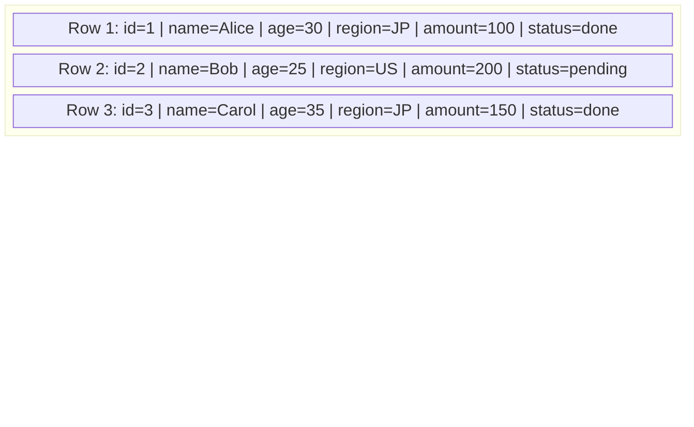

この方式の利点は以下の通りである。

- **ポイントクエリが高速**: 主キーで1行を取得する場合、1回のI/Oで行全体が得られる
- **書き込みが高速**: INSERT/UPDATEで1行全体を1箇所に書き込める
- **行ロックが容易**: トランザクション制御において行単位のロックが自然に実現できる

### 3.2 列指向（Decomposition Storage Model, DSM）

列指向ストレージでは、同じ列の値がディスク上に連続して配置される。

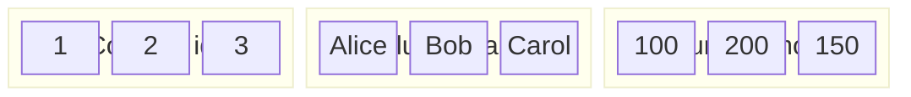

各列は独立したファイルまたはファイル内のセグメントとして格納される。分析クエリで `amount` 列だけが必要な場合、`id` や `name` の列データをまったく読み込まずに済む。

### 3.3 PAX（Partition Attributes Across）

行指向と列指向の中間的なアプローチとして、PAX（Partition Attributes Across）がある。PAXでは、ディスクページ内部で列指向のレイアウトを採用しつつ、ページ間では行指向のように関連データをまとめる。

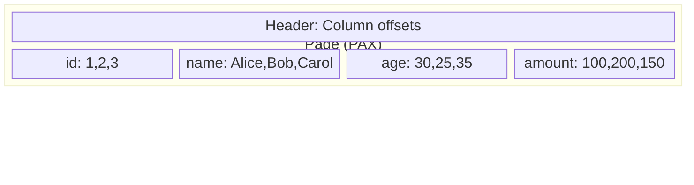

PAXの利点は、同一ページ内で列指向のスキャン効率を得つつ、行の再構築（タプルの復元）コストを抑えられる点にある。これはキャッシュ効率の面でも優れている。

## 4. データ圧縮技術

カラムナストアの最も強力な武器の1つがデータ圧縮である。同じ列のデータは同一のデータ型を持ち、値のドメイン（取りうる範囲）が限定されていることが多い。このため、汎用的な圧縮アルゴリズムよりもはるかに高い圧縮率を達成できる。

### 4.1 Run-Length Encoding（RLE）

連続して同じ値が繰り返される場合に有効な圧縮方式である。列がソートされているとき、特に効果を発揮する。

```
元データ:     [JP, JP, JP, JP, US, US, US, EU, EU]
RLE圧縮後:    [(JP, 4), (US, 3), (EU, 2)]
```

圧縮率は値の分布に依存するが、カーディナリティ（値の種類数）が低い列では劇的な圧縮が実現する。`status` 列（"active", "inactive", "pending"の3種類）や `country_code` 列（200種類程度）などが典型例である。

### 4.2 辞書圧縮（Dictionary Encoding）

列の値を整数IDに置き換える方式である。文字列列に特に有効で、元の文字列は辞書テーブルに格納される。

```
辞書:        {0: "Tokyo", 1: "New York", 2: "London", 3: "Paris"}
元データ:     ["Tokyo", "New York", "Tokyo", "London", "Paris", "Tokyo"]
圧縮後:      [0, 1, 0, 2, 3, 0]
```

辞書圧縮のメリットは圧縮率だけではない。

- **等値比較の高速化**: 文字列比較の代わりに整数比較で済む
- **GROUP BYの高速化**: 辞書IDでグループ化し、最後に辞書を参照して復元すればよい
- **JOINの高速化**: 辞書ID同士の比較は整数比較となる

### 4.3 ビットパッキング（Bit-Packing）

値の範囲が限定されている場合、必要最小限のビット数で値を表現する方式である。

例えば、`age` 列の値が0〜127の範囲であれば、7ビットで表現できる。通常の32ビット整数の代わりに7ビットで格納すれば、約 $\frac{7}{32} \approx 22\%$ のサイズに圧縮される。

```
通常の32ビット整数:  00000000 00000000 00000000 00011110  (= 30)
7ビットパッキング:   0011110                               (= 30)
```

### 4.4 差分符号化（Delta Encoding）

時系列データやソート済みの列に有効な方式で、隣接する値の差分のみを格納する。

```
元データ:     [1000, 1002, 1005, 1007, 1010]
差分:        [1000, 2, 3, 2, 3]
```

差分値は元の値より小さくなるため、さらにビットパッキングと組み合わせることで高い圧縮率を達成できる。タイムスタンプ列やID列のように単調増加する列に特に効果的である。

### 4.5 圧縮技術の組み合わせ

実際のカラムナストアでは、これらの技術を組み合わせて使用する。以下は典型的な圧縮パイプラインの例である。

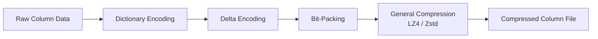

Apache Parquetを例にとると、辞書圧縮、RLE、ビットパッキングを列レベルで適用した後、さらにページレベルでSnappyやZstdなどの汎用圧縮を適用するという2段階の圧縮を行う。

::: tip 圧縮と計算の関係
カラムナストアにおける圧縮は、単にストレージ容量を削減するだけでなく、I/O帯域幅の効率を高め、結果としてクエリ性能を向上させる。圧縮されたデータをメモリに読み込み、CPU上で展開する方が、非圧縮データをディスクから読み取るよりも高速であるケースが多い。現代のCPUの演算速度がI/O帯域幅を大幅に上回っているためである。
:::

## 5. クエリ実行モデル

カラムナストアのクエリ実行エンジンは、行指向データベースとは根本的に異なるアプローチを採用する。

### 5.1 Volcano Model（行指向の伝統的モデル）

従来の行指向データベースでは、Volcano Model（またはIterator Model）と呼ばれる実行モデルが標準である。各演算子が `next()` メソッドを持ち、1行ずつデータを処理する。

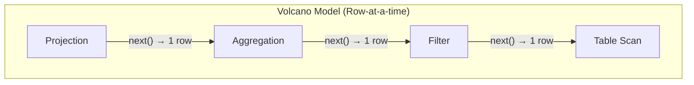

この方式は汎用性が高いが、1行ごとに仮想関数呼び出しが発生するため、現代のCPUにおいてはオーバーヘッドが大きい。特に分析クエリのように数百万行を処理する場合、関数呼び出しのコストが支配的になる。

### 5.2 Vectorized Execution（ベクトル化実行）

カラムナストアで広く採用されているのが、ベクトル化実行モデルである。MonetDB/X100（後のVectorWise）の研究に起源を持ち、1行ずつではなく、**列のベクトル（通常1024〜4096個の値のバッチ）**を単位として処理する。

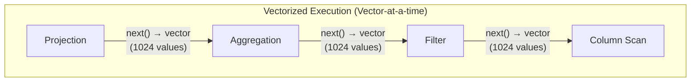

ベクトル化実行の利点は以下の通りである。

1. **仮想関数呼び出しのオーバーヘッド削減**: 1回の `next()` 呼び出しで1024行分の結果を返すため、関数呼び出し回数が $\frac{1}{1024}$ に減る
2. **CPUキャッシュの有効活用**: 列ベクトルはL1/L2キャッシュに収まるサイズに設計されており、キャッシュミスが最小化される
3. **SIMD命令の活用**: 列ベクトルに対する演算（比較、加算など）はSIMD（Single Instruction, Multiple Data）命令で並列実行できる
4. **分岐予測の改善**: タイトなループ内で同じ操作を繰り返すため、CPUの分岐予測器が効果的に機能する

::: details ベクトル化フィルタの擬似コード
```python
def vectorized_filter(column_vector, predicate_value):
    """
    Apply a filter predicate to a column vector using SIMD-friendly loop.
    Returns a selection vector (array of qualifying row indices).
    """
    selection = []
    for i in range(len(column_vector)):
        if column_vector[i] >= predicate_value:
            selection.append(i)
    return selection

def vectorized_sum(column_vector, selection):
    """
    Compute SUM over selected rows using a tight loop.
    """
    total = 0
    for idx in selection:
        total += column_vector[idx]
    return total
```
:::

### 5.3 Compiled Execution（コンパイル実行）

もう1つの先進的なアプローチが、コンパイル実行（code generation / query compilation）である。HyPer データベースの研究に端を発し、クエリプランをネイティブコードにJITコンパイルして実行する方式である。

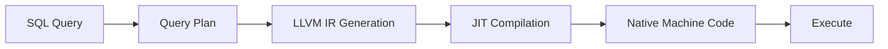

ベクトル化実行が「データの単位を大きくする」アプローチであるのに対し、コンパイル実行は「解釈（interpretation）のオーバーヘッドをゼロにする」アプローチである。Apache Spark（Tungsten）、ClickHouse、DuckDBなどが部分的にこの技術を採用している。

> [!NOTE]
> DuckDBはベクトル化実行とコンパイル実行のハイブリッドアプローチを採用している。ベクトル化による実装の簡潔さと、コンパイルによる性能最適化を両立させている。

## 6. レイトマテリアライゼーション

カラムナストアの重要な実行戦略として、**レイトマテリアライゼーション（Late Materialization）**がある。これは列指向の利点を最大化するための技法である。

### 6.1 アーリーマテリアライゼーション vs レイトマテリアライゼーション

以下のクエリを考える。

```sql
-- Find the names of customers in JP region with amount > 1000
SELECT name
FROM orders
WHERE region = 'JP' AND amount > 1000;
```

**アーリーマテリアライゼーション**では、スキャンの初期段階で行を再構築してから処理する。

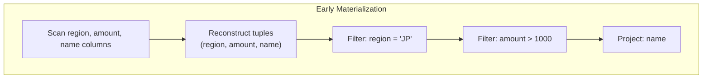

**レイトマテリアライゼーション**では、各列を独立にフィルタし、最後に必要な列だけを結合する。

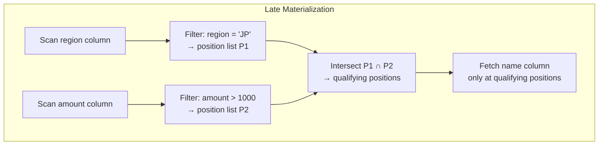

レイトマテリアライゼーションの利点は以下の通りである。

1. **不要な列の読み取りを完全に回避**: `name` 列は最終的に残った行についてのみ読み取る
2. **圧縮データ上での直接演算**: 辞書圧縮された列に対して、辞書IDのまま比較演算を実行できる
3. **ベクトル化との親和性**: 列単位の処理はSIMD命令との相性が良い
4. **キャッシュ効率の最大化**: 一度に処理するデータが列1つ分のみであるため、CPUキャッシュに収まりやすい

::: warning トレードオフ
レイトマテリアライゼーションは常に最適とは限らない。選択率（selectivity）が高い場合（フィルタ後に残る行が多い場合）、位置リストの管理コストが行の再構築コストを上回ることがある。多くのカラムナストアは、クエリオプティマイザが選択率を推定し、アーリーとレイトを適応的に切り替える。
:::

## 7. ゾーンマップとスキッピング

カラムナストアは大量のデータを高速にスキャンするが、そもそもスキャンすべきデータを事前に絞り込めればさらに高速になる。ゾーンマップ（Zone Map）はこのための仕組みである。

### 7.1 ゾーンマップの構造

列データを一定サイズのブロック（ゾーン）に分割し、各ゾーンのメタデータ（最小値、最大値、NULL数など）を保持する。

```
Column: amount (1,000,000 rows, divided into zones of 10,000 rows each)

Zone 0: min=10,   max=500   (rows 0-9,999)
Zone 1: min=200,  max=1500  (rows 10,000-19,999)
Zone 2: min=50,   max=300   (rows 20,000-29,999)
Zone 3: min=800,  max=5000  (rows 30,000-39,999)
...
```

クエリ `WHERE amount > 2000` を実行する場合、Zone 0（max=500）やZone 2（max=300）は最大値が2000以下であるため、読み取る必要がないことが事前にわかる。これを**データスキッピング（data skipping）**と呼ぶ。

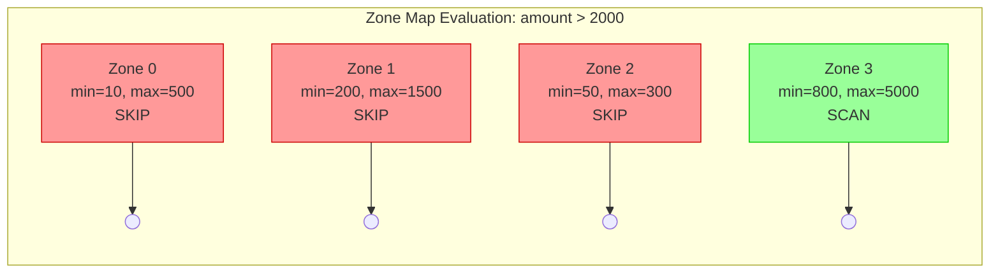

### 7.2 ソート順序とクラスタリング

ゾーンマップの効果はデータのソート順序に大きく依存する。データがランダムに配置されている場合、各ゾーンのmin-max範囲が広くなり、スキッピングの効果が薄れる。逆に、フィルタ対象の列でデータがソートされていれば、ゾーンマップによるスキッピングは極めて効果的に機能する。

このため、多くのカラムナストアではテーブルの**クラスタリングキー（sort key / cluster key）**を指定でき、データ挿入時にこのキーでソートされた状態を維持する。

```sql
-- Redshift: define a sort key for the table
CREATE TABLE orders (
    order_id BIGINT,
    order_date DATE,
    region VARCHAR(10),
    amount DECIMAL(10,2)
)
SORTKEY (order_date);
```

## 8. 列指向ファイルフォーマット

### 8.1 Apache Parquet

Apache Parquetは、Hadoopエコシステムにおける事実上の標準的な列指向ファイルフォーマットである。Twitter（現X）とClouderaが共同で開発し、Google Dremelの論文に影響を受けた設計となっている。

#### ファイル構造

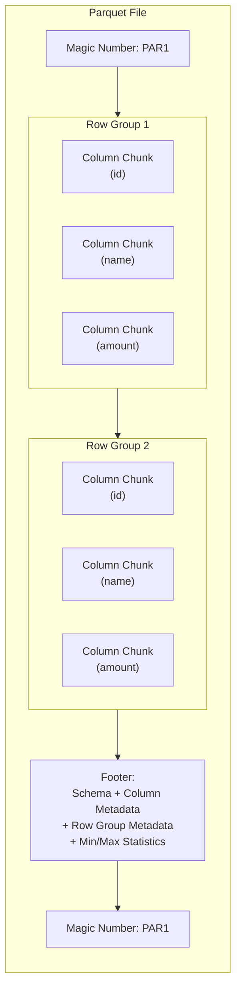

Parquetのファイル構造の要点は以下の通りである。

- **Row Group**: 行の水平方向の分割単位。通常128MBまたは1GB程度のサイズに設定される。Row Group内では各列がColumn Chunkとして格納される。
- **Column Chunk**: 1つのRow Group内の1つの列のデータ。連続するデータページで構成される。
- **Page**: Column Chunk内のデータの最小読み取り単位。通常1MB程度。各ページは独立に圧縮・エンコードされる。
- **Footer**: スキーマ情報、各Column Chunkのオフセット、各Row Groupの統計情報（min/max/null count）などのメタデータ。ファイル末尾に格納される。

::: tip なぜFooterがファイル末尾にあるのか
Parquetのフッターがファイル末尾に配置される理由は、ファイルの書き込み効率にある。列データを先頭から順次書き込み、すべてのデータを書き終えた後にメタデータをフッターとして追記する。読み取り時は、まずファイル末尾からフッターを読み込み、必要な列のオフセット情報を取得してから、該当する列データだけをシークして読み取る。
:::

#### ネストしたデータの表現

Parquetは、Google Dremelの論文で提案された**Definition Level**と**Repetition Level**を用いて、ネストした構造（JSON的なデータ）を効率的に列指向で格納する。

例えば、以下のようなネストした構造を考える。

```json
{
  "name": "Alice",
  "addresses": [
    {"city": "Tokyo", "zip": "100-0001"},
    {"city": "Osaka", "zip": "530-0001"}
  ]
}
```

この場合、`addresses.city` 列は以下のように表現される。

| 値 | Repetition Level | Definition Level |
|---|---|---|
| "Tokyo" | 0 | 2 |
| "Osaka" | 1 | 2 |

- **Repetition Level**: 繰り返し構造のどのレベルで値が繰り返されたかを示す。0はレコードの先頭、1はaddresses配列内の繰り返しを表す。
- **Definition Level**: ネストのどのレベルまで値が定義されているかを示す。NULLの場合にどのレベルがNULLであるかを区別できる。

### 8.2 Apache ORC

Apache ORC（Optimized Row Columnar）はApache Hive向けに開発された列指向フォーマットである。Parquetと同様の設計思想を持つが、以下の点で異なる特徴を持つ。

- **ストライプ構造**: ParquetのRow Groupに相当する単位がストライプと呼ばれ、通常250MB程度に設定される
- **インデックス情報**: ストライプ内の各列に対して、10,000行ごとのmin/maxインデックスとBloom Filterを保持する
- **ACIDトランザクション**: Hive 3.x以降、ORCファイル上でACIDトランザクション（INSERT、UPDATE、DELETE）をサポートする
- **型安全**: Parquetと比較して型システムがより厳密に定義されている

### 8.3 Apache Arrow

Apache Arrowは、ディスク上のフォーマットではなく、**インメモリの列指向データフォーマット**である。異なるシステム間でデータをコピーなし（ゼロコピー）で共有することを目的として設計された。

```
従来: System A (独自形式) → Serialize → Deserialize → System B (独自形式)
Arrow: System A (Arrow形式) → Zero-copy share → System B (Arrow形式)
```

ArrowはPandas、Spark、DuckDB、DataFusion、Polarsなど多くのデータ処理系で共通のインメモリフォーマットとして採用されており、システム間のデータ交換のオーバーヘッドを大幅に削減している。

## 9. 行指向と列指向のハイブリッドアーキテクチャ

### 9.1 HTAP（Hybrid Transactional/Analytical Processing）

現実の多くのシステムでは、OLTPとOLAPの両方のワークロードが共存する。従来は、OLTPデータベースからETL（Extract, Transform, Load）プロセスを経てOLAPデータウェアハウスにデータを移送するのが一般的であった。

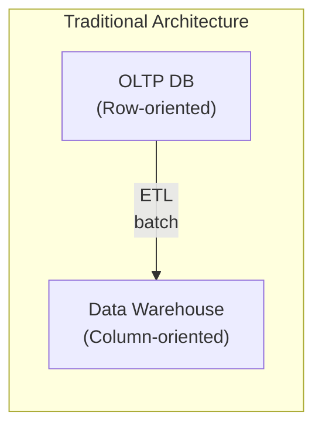

しかし、ETLにはデータの鮮度の問題（バッチ処理の遅延）やシステム運用の複雑性がある。HTAPはこれを解消するアプローチであり、単一のシステムでトランザクション処理と分析処理の両方を効率的に実行する。

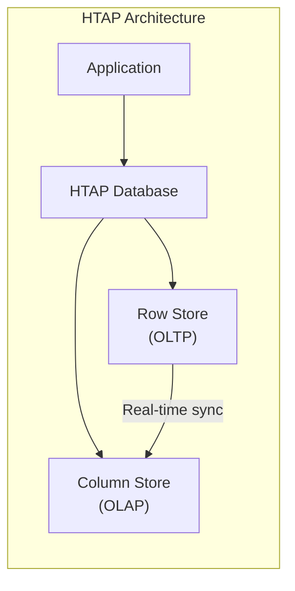

代表的なHTAPの実装例を以下に示す。

| 製品 | アプローチ |
|---|---|
| TiDB + TiFlash | 行指向のTiKVと列指向のTiFlashをRaftで同期 |
| SAP HANA | 行ストアと列ストアをインメモリで統合 |
| SQL Server | Columnstore Indexにより行指向テーブルに列指向インデックスを追加 |
| AlloyDB (Google) | PostgreSQL互換エンジンに列指向のアナリティクスアクセラレータを統合 |

### 9.2 Delta Store パターン

多くのカラムナストアでは、書き込みパフォーマンスの問題を解決するために**Delta Store**（差分ストア）パターンを採用する。

列指向ストレージへの個別の行挿入は非効率である。1行を挿入するためにすべての列ファイルを更新する必要があるためである。Delta Storeは以下のように動作する。

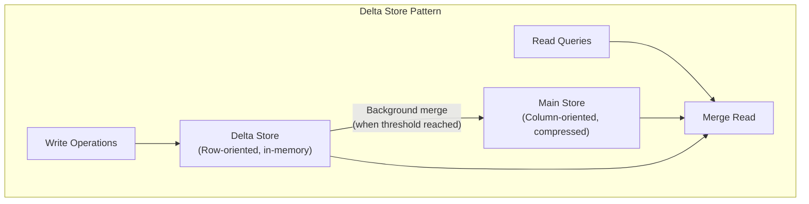

1. **書き込み**: 新しいデータは行指向のインメモリバッファ（Delta Store）に追記される
2. **バックグラウンドマージ**: Delta Storeが一定サイズに達すると、列指向に変換・圧縮され、Main Storeにマージされる
3. **読み取り**: Main StoreとDelta Storeの両方を参照し、結果をマージして返す

C-Store / Vertica の Write Store / Read Store、SAP HANAの Delta Store、ClickHouseの MergeTree エンジンなど、多くのカラムナストアがこのパターンのバリエーションを採用している。

## 10. 分散カラムナストア

大規模なデータ分析では、単一ノードの処理能力を超えるデータ量を扱う必要がある。分散カラムナストアは、データを複数ノードに分散しつつ、列指向の利点を維持する。

### 10.1 MPP（Massively Parallel Processing）アーキテクチャ

多くの分散カラムナストアは、MPPアーキテクチャを採用している。

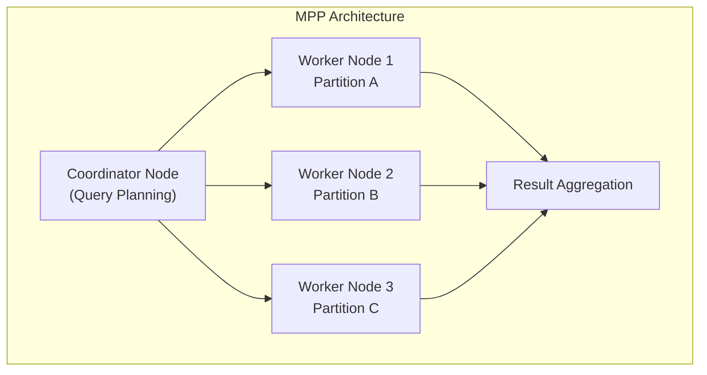

コーディネータノードがクエリプランを作成し、各ワーカーノードが自身が保持するパーティションに対して並列にスキャン・フィルタ・集約を実行する。各ワーカーの部分結果がコーディネータに返され、最終的な集約が行われる。

### 10.2 ストレージとコンピュートの分離

現代のクラウドネイティブなカラムナストアでは、ストレージ層とコンピュート層を分離するアーキテクチャが主流となっている。

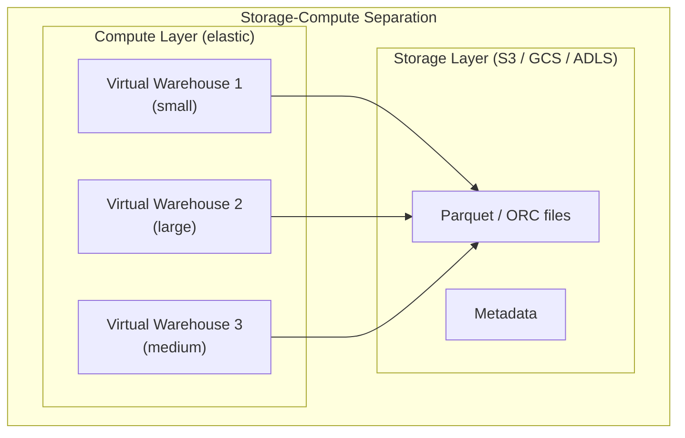

このアーキテクチャの利点は以下の通りである。

- **独立したスケーリング**: コンピュートリソースとストレージを独立に拡張・縮小できる
- **コスト効率**: 使用していないコンピュートリソースを解放でき、ストレージは安価なオブジェクトストレージを利用する
- **ワークロード分離**: 異なるチームが異なるコンピュートクラスタを使用でき、リソースの競合を回避できる
- **データ共有**: 同一のデータに対して複数のコンピュートクラスタから同時にアクセスできる

Snowflake、BigQuery、Amazon Redshift Serverless、Databricks（Delta Lake + Photon）などがこのアーキテクチャを採用している。

## 11. 性能特性の比較

### 11.1 ワークロード別の適性

行指向と列指向の性能特性を、ワークロードの種類ごとに整理する。

| 操作 | 行指向 | 列指向 | 理由 |
|---|---|---|---|
| ポイントクエリ（主キー検索） | 優 | 劣 | 行指向は1回のI/Oで行全体を取得。列指向は複数列を個別に読む必要がある |
| 範囲スキャン（少数列） | 劣 | 優 | 列指向は必要な列だけ読む。行指向は全列を含むページを読む |
| 集約クエリ（SUM, AVG等） | 劣 | 優 | 列指向は対象列のみスキャン。圧縮データ上での演算も可能 |
| INSERT（1行） | 優 | 劣 | 行指向は1箇所に書く。列指向は全列ファイルを更新する必要がある |
| バルクロード | 同等 | 優 | 列指向はソート・圧縮によりI/Oが大幅に削減される |
| UPDATE（1行） | 優 | 劣 | 行指向は1ページを更新。列指向は全列を更新する必要がある |
| 多列のSELECT * | 優 | 劣 | 行指向は1回のI/Oで行全体を取得。列指向は全列を個別に読み結合する |
| ad-hoc分析 | 劣 | 優 | 列指向はインデックスなしでも列スキャンが高速 |

### 11.2 圧縮率の比較

一般的な分析データにおける圧縮率の実測値を示す。

| データ特性 | 行指向の圧縮率 | 列指向の圧縮率 |
|---|---|---|
| 均一なデータ型 | 2〜3x | 5〜10x |
| 低カーディナリティ文字列 | 2〜4x | 10〜50x |
| ソート済みタイムスタンプ | 2〜3x | 20〜100x |
| ランダムな浮動小数点数 | 1.5〜2x | 2〜4x |

列指向は同一型のデータが連続するため、型特化のエンコーディングと汎用圧縮の組み合わせにより、行指向を大幅に上回る圧縮率を達成する。特に低カーディナリティの列やソート済みの列では、その差は顕著である。

### 11.3 Star Schema Benchmark

分析ワークロードの代表的なベンチマークであるStar Schema Benchmark（SSB）の結果は、カラムナストアの優位性を明確に示している。SSBは典型的なスタースキーマ（ファクトテーブル + ディメンションテーブル）に対して、さまざまな集約クエリを実行するベンチマークである。

一般に、列指向データベースはSSBにおいて行指向データベースの10倍から100倍の速度を達成する。この差は以下の要因の累積効果によるものである。

$$
\text{Speed-up} = \underbrace{\frac{\text{全列数}}{\text{参照列数}}}_{\text{I/O削減}} \times \underbrace{\frac{1}{\text{圧縮率}}}_{\text{圧縮効果}} \times \underbrace{k_{\text{vectorize}}}_{\text{ベクトル化効果}} \times \underbrace{k_{\text{skip}}}_{\text{スキッピング効果}}
$$

ここで $k_{\text{vectorize}}$ はベクトル化実行による高速化係数（典型的に2〜5倍）、$k_{\text{skip}}$ はゾーンマップによるデータスキッピングの効果である。

## 12. 実装例：主要なカラムナストアの設計

### 12.1 ClickHouse

ClickHouseはYandex（現ClickHouse Inc.）が開発した、列指向分析データベースである。その特徴は以下の通りである。

- **MergeTree エンジン**: ClickHouseの中核となるストレージエンジン。LSM-Treeに似たマージベースの設計で、バックグラウンドでパーツをマージしながら列指向データを効率的に管理する
- **主キーによるスパースインデックス**: B-Treeのような密なインデックスではなく、8192行ごとの粒度でスパースインデックスを構築する
- **ベクトル化実行**: ClickHouseは全面的にベクトル化実行を採用し、SIMD命令を積極的に活用する
- **SQLインターフェース**: 標準的なSQL構文をサポートし、既存のBIツールとの統合が容易

::: code-group
```sql [テーブル作成]
-- ClickHouse: Create a MergeTree table
CREATE TABLE events (
    event_date Date,
    event_type String,
    user_id UInt64,
    value Float64
) ENGINE = MergeTree()
ORDER BY (event_date, event_type);
```
```sql [分析クエリ]
-- Aggregate query leveraging columnar storage
SELECT
    event_type,
    count() AS event_count,
    avg(value) AS avg_value
FROM events
WHERE event_date >= '2025-01-01'
GROUP BY event_type
ORDER BY event_count DESC;
```
:::

### 12.2 DuckDB

DuckDBは「分析のためのSQLite」を標榜する、インプロセスの列指向OLAPデータベースである。

- **インプロセス実行**: サーバープロセスなしで、アプリケーション内に直接組み込める
- **Parquet直接クエリ**: 外部のParquetファイルに対して直接SQLクエリを実行できる
- **ベクトル化実行エンジン**: MonetDB/X100の研究成果を活かしたベクトル化エンジンを搭載
- **Morsel-Driven Parallelism**: タスクをmorsel（小さなデータチャンク）単位に分割し、複数コアに動的に割り当てる並列実行モデル

```python
import duckdb

# Query Parquet files directly without loading into a database
result = duckdb.sql("""
    SELECT region, SUM(amount) as total
    FROM 'orders/*.parquet'
    WHERE order_date >= '2025-01-01'
    GROUP BY region
    ORDER BY total DESC
""")
print(result.fetchdf())
```

### 12.3 Google BigQuery（Dremel/Capacitor）

BigQueryの内部アーキテクチャは、Dremel（クエリエンジン）とCapacitor（列指向ストレージ）の組み合わせで構成される。

- **Capacitor**: Google内部の列指向ファイルフォーマット。Parquetに影響を与えた設計で、エンコーディングと圧縮の自動選択機能を持つ
- **Dremelエンジン**: ツリー構造の分散クエリ実行エンジン。ルートサーバー → 中間サーバー → リーフサーバーの階層で処理を分散し、数千ノードで並列実行する
- **Jupiter ネットワーク**: Google データセンター内の超高速ネットワーク（1 Pbpsクラス）により、ストレージとコンピュートの分離を実現しつつ低レイテンシを維持する

## 13. 今後の展望

### 13.1 Lakehouse アーキテクチャ

データレイクとデータウェアハウスの統合を目指す「Lakehouse」アーキテクチャが台頭している。Delta Lake、Apache Iceberg、Apache Hudiといったテーブルフォーマットが、オブジェクトストレージ上のParquet/ORCファイルにACIDトランザクション、スキーマ進化、タイムトラベルなどの機能を追加する。

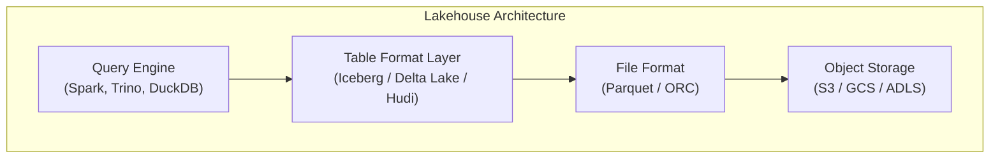

Lakehouseアーキテクチャにより、カラムナストアの利点（高速な分析クエリ、圧縮効率）を享受しつつ、OLTPに近い操作（UPDATE、DELETE、MERGE）やトランザクション整合性を実現できるようになりつつある。

### 13.2 ハードウェアの進化と最適化

現代のハードウェアの進化は、カラムナストアの設計に新たな可能性をもたらしている。

- **NVMe SSD**: 高速なランダム読み取り（数十マイクロ秒）により、列指向のランダムアクセスのペナルティが軽減される
- **大容量メモリ**: テラバイト級のDRAMを搭載可能なサーバーにより、列データ全体をメモリに載せるインメモリカラムナストアが実用化されている
- **SIMD拡張命令**: AVX-512やARM SVEなどの広幅SIMD命令により、ベクトル化実行のスループットがさらに向上する
- **GPU/FPGA**: GPUのSIMT（Single Instruction, Multiple Thread）アーキテクチャは列指向データの並列処理と親和性が高く、RAPIDS cuDFなどがこのアプローチを採用している

### 13.3 コンポーザブルデータスタック

Apache Arrowを中心としたエコシステムの成熟により、「モジュラーなデータベース」の概念が現実味を帯びてきている。ストレージフォーマット（Parquet）、インメモリフォーマット（Arrow）、クエリエンジン（DataFusion）、実行ランタイム（Velox）を組み合わせて、用途に応じたデータ処理パイプラインを構築できるようになりつつある。

## 14. まとめ

カラムナストア（列指向DB）は、データ分析ワークロードに対して行指向ストレージよりも桁違いに高い性能を発揮するストレージ設計である。その利点は以下の3つの柱に集約される。

1. **I/O効率**: 必要な列だけを読み取ることで、ディスクI/Oを最小化する
2. **圧縮効率**: 同一型・同一分布のデータが連続することで、極めて高い圧縮率を達成する
3. **CPU効率**: ベクトル化実行やSIMD命令により、現代のCPUの性能を最大限に引き出す

一方で、列指向ストレージはOLTPワークロード（ポイントクエリ、1行単位のINSERT/UPDATE）には不向きである。このトレードオフを理解し、ワークロードの特性に応じて適切なストレージ設計を選択することが、データベースエンジニアにとって重要なスキルである。

現代のデータ処理基盤は、Parquet、Arrow、Icebergなどのオープンフォーマットと、ClickHouse、DuckDB、BigQueryなどの高性能クエリエンジンの組み合わせにより、ペタバイト級のデータに対しても秒単位の応答を実現している。カラムナストアの理解は、現代のデータエンジニアリングを支える必須の知識である。
