# デッドロック, ライブロック, 優先度逆転

## はじめに — 並行処理に潜む危険性

並行プログラミングは現代のソフトウェア開発において不可欠な技術である。マルチコアプロセッサの普及、クラウドネイティブなアーキテクチャの台頭、そしてリアルタイム処理への需要の高まりにより、複数のスレッドやプロセスが同時に動作するシステムを正しく設計・実装することの重要性は増す一方だ。

しかし、並行処理には逐次的なプログラミングでは起こり得ない独特の危険性（hazard）がある。複数の実行主体がリソースを共有し、互いにやり取りを行う中で、プログラマーの意図に反してシステムが停止したり、進行しなくなったりする現象が発生する。本記事では、並行処理における三大危険性である**デッドロック（Deadlock）**、**ライブロック（Livelock）**、**優先度逆転（Priority Inversion）**について、その原理、検出方法、防止策を体系的に解説する。

これらの問題はすべて「進行性（progress）の欠如」という共通のテーマを持つ。通常、並行システムには以下のような進行性の保証が求められる。

| 進行性の種類 | 意味 |
|---|---|
| **Deadlock-freedom** | システム全体として少なくとも1つのスレッドが進行する |
| **Starvation-freedom** | すべてのスレッドがいつか必ず進行する |
| **Lock-freedom** | 少なくとも1つのスレッドが有限ステップで操作を完了する |
| **Wait-freedom** | すべてのスレッドが有限ステップで操作を完了する |

デッドロック、ライブロック、優先度逆転はいずれも、これらの進行性保証を侵害する現象である。

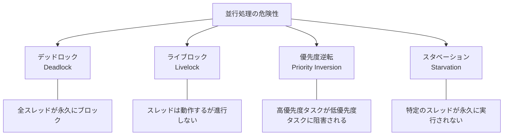

## デッドロック（Deadlock）

### 定義と基本概念

デッドロックとは、2つ以上のプロセス（またはスレッド）が、互いに相手が保持しているリソースの解放を待ち続け、いずれも処理を進行できなくなる状態を指す。いったんデッドロックに陥ると、外部からの介入（プロセスの強制終了、リソースの剥奪など）なしには回復できない。

最もシンプルなデッドロックの例を考えてみよう。

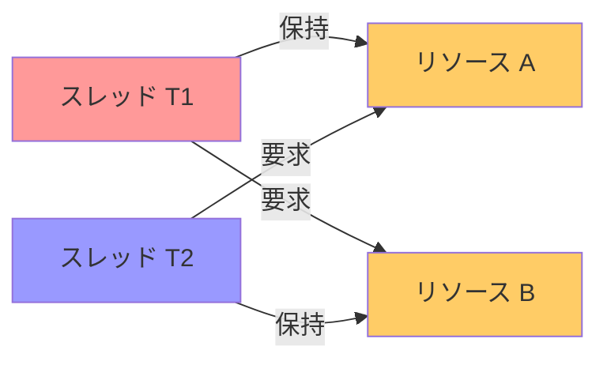

スレッド T1 はリソース A を保持しながらリソース B を要求し、スレッド T2 はリソース B を保持しながらリソース A を要求している。どちらのスレッドも相手が保持するリソースを待ち続けるため、永久に進行できない。

### Coffman の4条件

1971年に Edward Coffman らが示した有名な定理によれば、デッドロックが発生するには以下の4つの条件が**同時に**成立する必要がある。逆に言えば、いずれか1つでも成立しないように設計すれば、デッドロックは発生しない。

#### 1. 相互排他（Mutual Exclusion）

リソースが排他的にしか利用できない。つまり、あるリソースを1つのスレッドが使用しているとき、他のスレッドはそのリソースにアクセスできない。

#### 2. 保持と待ち（Hold and Wait）

スレッドが少なくとも1つのリソースを保持したまま、さらに別のリソースの取得を待っている。

#### 3. 横取り不可（No Preemption）

リソースはそれを保持しているスレッドが自発的に解放する以外の方法では取り上げられない。OS やランタイムが強制的にリソースを剥奪することはない。

#### 4. 循環待ち（Circular Wait）

スレッドの集合 {T0, T1, ..., Tn} が存在し、T0 が T1 の保持するリソースを待ち、T1 が T2 の保持するリソースを待ち、...、Tn が T0 の保持するリソースを待つ、という循環的な依存関係が成立している。

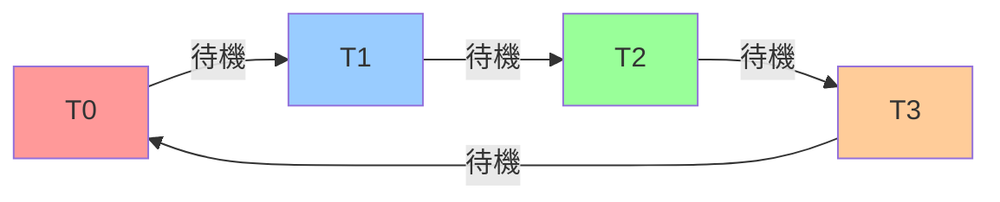

### コード例：デッドロックの発生

以下は、典型的なデッドロックが発生するコード例である。

```python
import threading
import time

lock_a = threading.Lock()
lock_b = threading.Lock()

def worker_1():
    # Acquire lock A first, then lock B
    with lock_a:
        print("Worker 1: acquired lock A")
        time.sleep(0.1)  # simulate some work
        with lock_b:
            print("Worker 1: acquired lock B")

def worker_2():
    # Acquire lock B first, then lock A (opposite order!)
    with lock_b:
        print("Worker 2: acquired lock B")
        time.sleep(0.1)  # simulate some work
        with lock_a:
            print("Worker 2: acquired lock A")

t1 = threading.Thread(target=worker_1)
t2 = threading.Thread(target=worker_2)
t1.start()
t2.start()
t1.join()  # will hang forever
t2.join()  # will hang forever
```

このコードでは、`worker_1` が lock_a -> lock_b の順でロックを取得し、`worker_2` が lock_b -> lock_a の逆順でロックを取得する。タイミングによっては、互いに相手のロック解放を待つデッドロックが発生する。

### リソース割り当てグラフ（Resource Allocation Graph）

デッドロックの検出にはリソース割り当てグラフ（RAG: Resource Allocation Graph）が用いられる。これは、プロセスとリソースをノードとし、割り当て関係と要求関係をエッジとする有向グラフである。

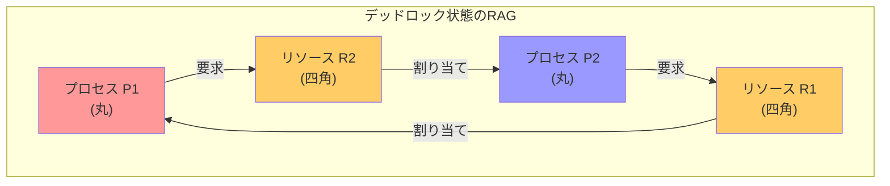

リソース割り当てグラフにおいて、各リソースのインスタンスが1つである場合、**グラフにサイクルが存在することがデッドロックの必要十分条件**となる。リソースのインスタンスが複数ある場合、サイクルの存在は必要条件ではあるが十分条件ではない。

### デッドロックの対処戦略

デッドロックへの対処には、大きく分けて4つのアプローチがある。

#### 1. デッドロック防止（Prevention）

Coffman の4条件のいずれかを構造的に成立しないようにすることで、デッドロックの発生自体を不可能にする。

**循環待ちの防止 — ロック順序付け**

最も実用的な防止策は、すべてのロックに全順序を定義し、その順序に従ってのみロックを取得するルールを強制することだ。

```python
import threading

lock_a = threading.Lock()
lock_b = threading.Lock()

def worker_1():
    # Always acquire locks in order: A before B
    with lock_a:
        print("Worker 1: acquired lock A")
        with lock_b:
            print("Worker 1: acquired lock B")

def worker_2():
    # Same order: A before B (prevents circular wait)
    with lock_a:
        print("Worker 2: acquired lock A")
        with lock_b:
            print("Worker 2: acquired lock B")
```

ロックのアドレスや ID に基づいて順序を定義するパターンもよく使われる。

```c
void acquire_two_locks(pthread_mutex_t *m1, pthread_mutex_t *m2) {
    // Order locks by memory address to prevent deadlock
    if (m1 < m2) {
        pthread_mutex_lock(m1);
        pthread_mutex_lock(m2);
    } else {
        pthread_mutex_lock(m2);
        pthread_mutex_lock(m1);
    }
}
```

**保持と待ちの防止**

すべてのリソースを一度に取得するか、リソースを保持していない状態でのみ新たなリソースを要求するようにする。

```python
import threading

# Acquire all locks atomically
global_lock = threading.Lock()
lock_a = threading.Lock()
lock_b = threading.Lock()

def acquire_all():
    # Use a meta-lock to ensure atomic acquisition
    with global_lock:
        lock_a.acquire()
        lock_b.acquire()

def release_all():
    lock_b.release()
    lock_a.release()
```

この方法はリソースの利用効率が低下し、並行性も損なわれるため、実際にはあまり用いられない。

**横取り不可の打破 — trylock**

`trylock`（非ブロッキングなロック取得）を使用し、取得に失敗した場合は保持しているロックをすべて解放してリトライする方法がある。

```python
import threading
import time
import random

lock_a = threading.Lock()
lock_b = threading.Lock()

def worker_with_backoff():
    while True:
        lock_a.acquire()
        if lock_b.acquire(blocking=False):
            # Successfully acquired both locks
            try:
                print("Acquired both locks, doing work...")
            finally:
                lock_b.release()
                lock_a.release()
            break
        else:
            # Failed to acquire lock_b, release lock_a and retry
            lock_a.release()
            time.sleep(random.uniform(0.001, 0.01))  # backoff
```

> [!WARNING]
> trylock + リトライのパターンは、デッドロックは防止できるが、ライブロックのリスクを生む。後述のライブロックの節で詳しく扱う。

#### 2. デッドロック回避（Avoidance）

リソースの割り当て要求があるたびに、その要求を受け入れた場合にデッドロックが発生する可能性があるかどうかを動的に判定し、危険な場合は要求を遅延させる手法である。

**銀行家のアルゴリズム（Banker's Algorithm）**

Dijkstra が提案した銀行家のアルゴリズムは、デッドロック回避の古典的な手法である。各プロセスが必要とするリソースの最大量を事前に宣言し、現在の割り当て状態が「安全状態（safe state）」にあるかどうかを判定する。

安全状態とは、すべてのプロセスが順番に実行を完了できるような実行順序（安全列: safe sequence）が存在する状態のことである。

```
安全状態の判定アルゴリズム:

1. Work = Available（現在利用可能なリソース）
2. Finish[i] = false  （すべてのプロセスについて）

3. 以下を繰り返す:
   Need[i] <= Work かつ Finish[i] == false であるプロセス i を見つける
   見つかった場合:
     Work = Work + Allocation[i]
     Finish[i] = true
   見つからない場合:
     ループを終了

4. すべての Finish[i] == true なら安全状態
```

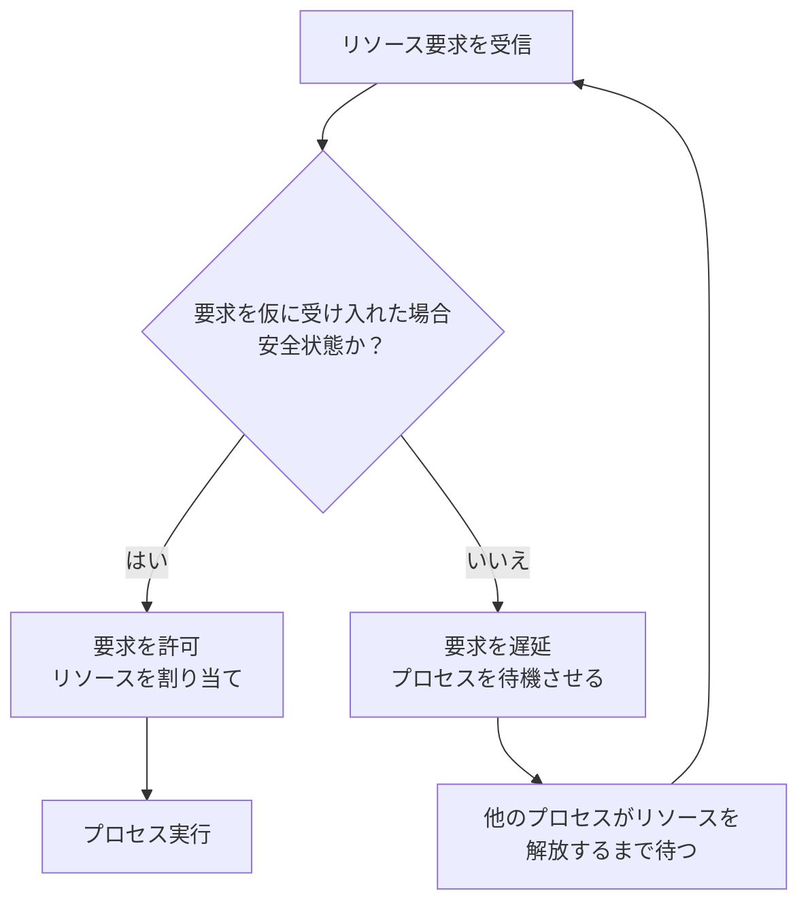

銀行家のアルゴリズムは理論的には正確だが、以下の制約があるため、汎用 OS で直接使われることは少ない。

- 各プロセスが使用するリソースの最大量を事前に知る必要がある
- プロセス数が固定であるという仮定が必要
- 判定のたびに O(m * n^2) の計算コスト（m: リソース種別数、n: プロセス数）がかかる

#### 3. デッドロック検出と回復（Detection and Recovery）

デッドロックの発生を許容しつつ、定期的にデッドロックを検出し、発生時に回復処理を行う方式である。

**Wait-for グラフによる検出**

リソース割り当てグラフを簡略化した Wait-for グラフ（待機グラフ）を使用する。Wait-for グラフはプロセスのみをノードとし、「プロセス Pi がプロセス Pj の保持するリソースを待っている」場合に Pi -> Pj のエッジを張る。

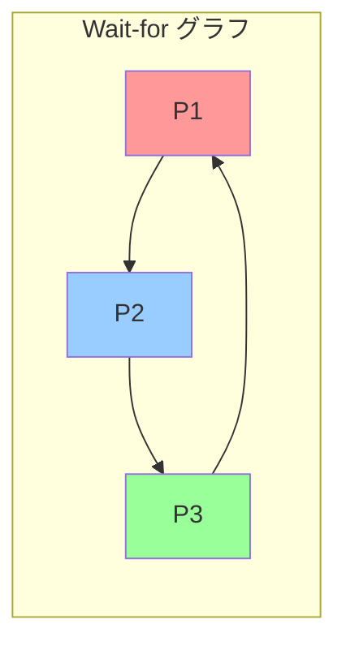

このグラフにサイクルが存在すれば、デッドロックが発生している。サイクルの検出にはDFS（深さ優先探索）を使用し、O(V + E) の時間計算量で実行できる。

**回復手法**

デッドロックを検出した後の回復方法として、以下が挙げられる。

1. **プロセスの強制終了**: デッドロックに関与するプロセスを1つずつ（または全部）強制終了する。どのプロセスを終了させるかは、優先度、実行時間、使用リソース量などを基準に選択する。
2. **リソースの横取り（Preemption）**: デッドロックに関与するプロセスからリソースを強制的に剥奪し、他のプロセスに割り当てる。この場合、リソースを剥奪されたプロセスは以前の状態にロールバックする必要がある。
3. **チェックポイント/リスタート**: 定期的にチェックポイントを保存しておき、デッドロック検出時にいずれかのプロセスを以前のチェックポイントまでロールバックする。

#### 4. デッドロック無視（Ostrich Algorithm）

デッドロックが発生する確率が極めて低い場合、デッドロックへの対策を一切講じず、発生した場合はシステムの再起動などで対処する手法。「問題が起きないふりをする」ことからダチョウアルゴリズム（Ostrich Algorithm）とも呼ばれる。

一見無責任に思えるが、多くの汎用 OS（Linux や Windows を含む）はこのアプローチを採用している。これは、デッドロック防止や回避のコストが、デッドロックが実際に発生した場合の損害よりも大きいという実用的な判断に基づいている。

### データベースにおけるデッドロック

リレーショナルデータベースは、デッドロック検出と回復の仕組みを標準的に備えている。

```sql
-- Transaction 1
BEGIN;
UPDATE accounts SET balance = balance - 100 WHERE id = 1;  -- locks row 1
UPDATE accounts SET balance = balance + 100 WHERE id = 2;  -- waits for row 2

-- Transaction 2 (concurrent)
BEGIN;
UPDATE accounts SET balance = balance - 50 WHERE id = 2;   -- locks row 2
UPDATE accounts SET balance = balance + 50 WHERE id = 1;   -- waits for row 1
-- DEADLOCK!
```

PostgreSQL や MySQL/InnoDB では、デッドロック検出器がバックグラウンドで動作し、Wait-for グラフのサイクルを検出すると、関与するトランザクションの1つを自動的にロールバック（victim 選択）する。

```
ERROR 1213 (40001): Deadlock found when trying to get lock;
try restarting transaction
```

データベースのデッドロック検出は、InnoDB の場合はデッドロックを即時検出する。PostgreSQL の場合は `deadlock_timeout`（デフォルト1秒）の経過後に検出プロセスが起動する。

## ライブロック（Livelock）

### 定義と基本概念

ライブロックとは、2つ以上のスレッドが互いに譲り合い続け、どのスレッドも実際には進行しない状態を指す。デッドロックとは異なり、各スレッドはブロックされておらず**能動的に動作している**が、有用な仕事を何も成し遂げることなく状態を変え続ける。

ライブロックは、人間の行動で例えると「廊下で向かい合った二人が、互いに道を譲ろうとして同じ方向に動き続ける」状況に似ている。

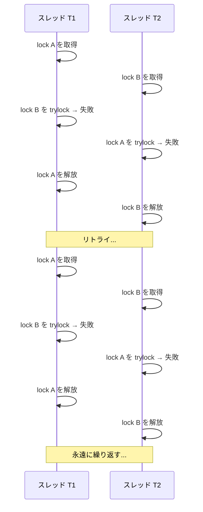

### デッドロックとの違い

| 特性 | デッドロック | ライブロック |
|---|---|---|
| スレッドの状態 | ブロック（待機状態） | アクティブ（実行中） |
| CPU使用率 | 低い（スレッドがスリープ） | 高い（スレッドが能動的に動作） |
| 外部からの検出 | Wait-forグラフで比較的容易 | 検出が困難 |
| 発生パターン | ロックの取得順序の不一致 | trylock + リトライ、ポーリング |

### ライブロックの具体例

#### trylock パターンでの発生

前述のデッドロック防止策としての trylock パターンが、皮肉にもライブロックを引き起こすことがある。

```python
import threading

lock_a = threading.Lock()
lock_b = threading.Lock()

def worker_1():
    while True:
        lock_a.acquire()
        if not lock_b.acquire(blocking=False):
            lock_a.release()
            # No backoff - immediately retry
            continue
        try:
            print("Worker 1: doing work")
        finally:
            lock_b.release()
            lock_a.release()
        break

def worker_2():
    while True:
        lock_b.acquire()
        if not lock_a.acquire(blocking=False):
            lock_b.release()
            # No backoff - immediately retry
            continue
        try:
            print("Worker 2: doing work")
        finally:
            lock_a.release()
            lock_b.release()
        break
```

この例では、両方のワーカーが同じタイミングでロックを取得・解放し続けるため、永久に進行しない可能性がある。

#### メッセージパッシングでの発生

ライブロックはロックだけでなく、メッセージパッシングシステムでも発生しうる。例えば、2つのプロセスが互いにメッセージを送り合い、受信したメッセージに対して常に「再送要求」で応答するような場合だ。

#### ルーティングプロトコルでの発生

ネットワークルーティングにおいても、パケットが2つのルーターの間で永久にバウンスし続けるライブロックが起こり得る。これは、ルーティングテーブルの不整合が原因で発生する。IP パケットの TTL（Time to Live）フィールドは、この種のライブロックを防ぐための仕組みでもある。

### ライブロックの対策

#### 1. ランダムバックオフ（Exponential Backoff）

最も効果的な対策は、リトライ時にランダムな待機時間を挟むことだ。Ethernet の CSMA/CD プロトコルで用いられる**指数バックオフ（exponential backoff）**が代表的な手法である。

```python
import threading
import time
import random

lock_a = threading.Lock()
lock_b = threading.Lock()

def worker_with_exponential_backoff(name):
    max_retries = 10
    for attempt in range(max_retries):
        lock_a.acquire()
        if lock_b.acquire(blocking=False):
            try:
                print(f"{name}: acquired both locks, doing work")
            finally:
                lock_b.release()
                lock_a.release()
            return
        else:
            lock_a.release()
            # Exponential backoff with jitter
            wait_time = (2 ** attempt) * 0.001 + random.uniform(0, 0.001)
            time.sleep(wait_time)
    raise RuntimeError(f"{name}: failed to acquire locks after {max_retries} retries")
```

ここで重要なのは**ジッター（jitter）**、つまりランダムな揺らぎを加えることだ。固定の待機時間だけでは、2つのスレッドが再び同じタイミングで動作を再開してしまう可能性がある。

#### 2. 優先度ベースの解決

競合するスレッドに優先度を与え、優先度の高いスレッドが先にリソースを取得する権利を持つようにする。これにより、少なくとも一方は確実に進行する。

#### 3. タイムアウトの設定

リトライ回数や経過時間に上限を設け、上限に達した場合はエラーとして処理する。無限にリトライし続けることを防止する基本的な安全策である。

#### 4. 設計レベルでの回避

最も根本的な対策は、ライブロックが発生し得る設計パターンそのものを回避することだ。例えば、ロック順序の統一によりデッドロックを防止すれば、trylock + リトライパターン自体が不要になり、ライブロックのリスクも消える。

## 優先度逆転（Priority Inversion）

### 定義と基本概念

優先度逆転とは、高優先度のタスクが、低優先度のタスクが保持するリソースを待つことにより、実質的に低優先度のタスクよりも遅く実行される現象を指す。さらに問題なのは、中優先度のタスクが低優先度のタスクのCPU時間を奪うことで、結果として高優先度のタスクが**無期限に**ブロックされうることだ。

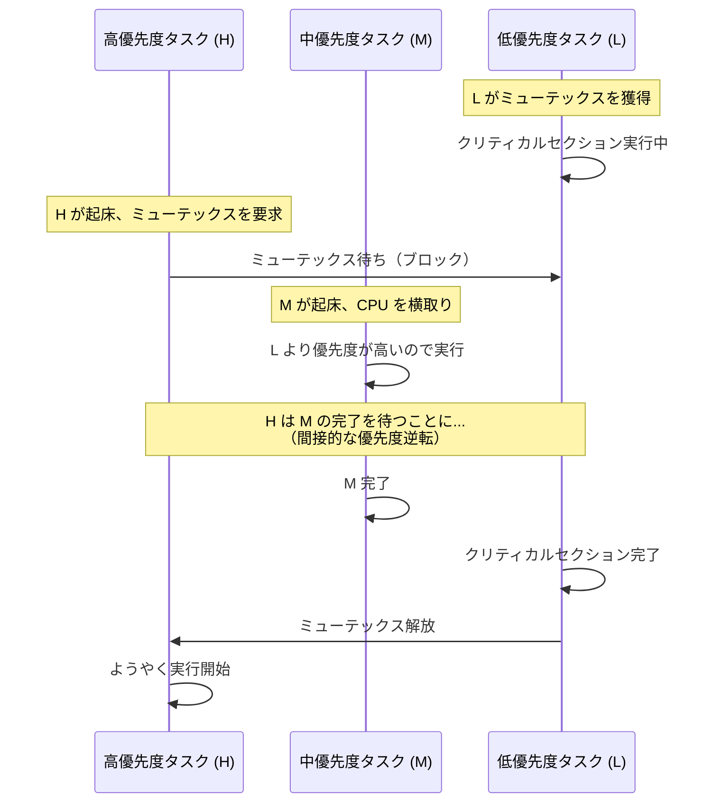

この図の核心は、中優先度タスク M が低優先度タスク L を横取り（preempt）できるという点にある。L はミューテックスを保持したまま実行を中断されるため、H は M が完了して L が再開し、ミューテックスを解放するまで待たなければならない。中優先度のタスクがいくつも存在すれば、H の待ち時間は理論上無限に延びる可能性がある。これを**非有界優先度逆転（unbounded priority inversion）**と呼ぶ。

### Mars Pathfinder 事件 — 実世界の優先度逆転

1997年、NASA の Mars Pathfinder 探査機は、火星着陸後にシステムのリセットを繰り返すという深刻な障害に見舞われた。この問題の原因は、まさに優先度逆転であった。

Pathfinder のソフトウェアには、VxWorks リアルタイム OS 上で動作する複数のタスクがあった。

| タスク | 優先度 | 役割 |
|---|---|---|
| バス管理タスク | 高 | 共有メモリバス上のデータ転送を管理 |
| 通信タスク | 中 | 地球との通信処理 |
| 気象データ収集タスク | 低 | 気象データの収集・保存 |

事象の流れは以下の通りであった。

1. 低優先度の気象データ収集タスクが、共有メモリバスのミューテックスを取得
2. 高優先度のバス管理タスクが起床し、同じミューテックスを要求するが、低優先度タスクが保持しているためブロック
3. 中優先度の通信タスクが起床し、低優先度タスクを横取りして実行
4. バス管理タスクが規定時間内にミューテックスを取得できず、ウォッチドッグタイマーがタイムアウトを検出
5. システムが異常と判断してリセットを実行

この問題は地上から VxWorks の優先度継承（Priority Inheritance）機能を有効にするパッチをアップロードすることで解決された。ソフトウェアの不具合を約7800万km離れた火星上でリモート修正した、エンジニアリング史に残る出来事である。

> [!TIP]
> Mars Pathfinder の事例は、リアルタイムシステムにおける優先度逆転の危険性を劇的に示した教訓として、多くのOS・組込みシステムの教科書で取り上げられている。開発段階でのテストでも問題は発生していたが、頻度が低かったためリリース前に見逃された。

### 優先度逆転の解決プロトコル

#### 1. 優先度継承プロトコル（Priority Inheritance Protocol: PIP）

最も基本的な解決策。低優先度タスクがミューテックスを保持しており、かつ高優先度タスクがそのミューテックスを待っている場合、低優先度タスクの優先度を一時的に高優先度タスクと同じ水準に引き上げる。

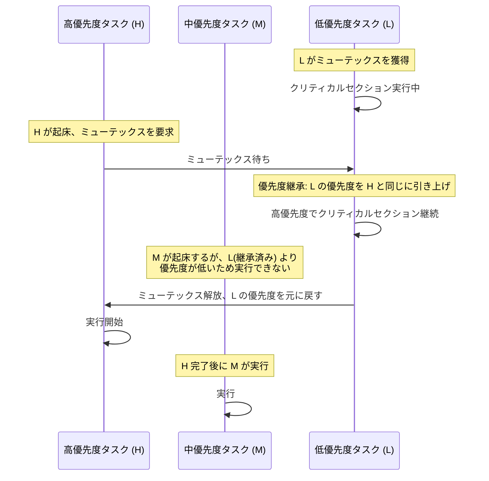

PIP の疑似コードを示す。

```c
void mutex_lock(mutex_t *m) {
    task_t *current = get_current_task();

    if (m->owner != NULL) {
        // Boost the owner's priority if necessary
        if (current->priority > m->owner->priority) {
            m->owner->effective_priority = current->priority;
            // Re-insert owner into scheduler's ready queue
            reschedule(m->owner);
        }
        // Block current task
        enqueue(&m->wait_queue, current);
        block(current);
    } else {
        m->owner = current;
    }
}

void mutex_unlock(mutex_t *m) {
    task_t *current = get_current_task();

    // Restore original priority
    current->effective_priority = current->base_priority;
    m->owner = NULL;

    // Wake up highest-priority waiter
    if (!is_empty(&m->wait_queue)) {
        task_t *next = dequeue_highest_priority(&m->wait_queue);
        m->owner = next;
        wakeup(next);
    }

    reschedule(current);
}
```

PIP の特徴と制限事項を以下にまとめる。

- **利点**: 実装が比較的シンプル。既存のミューテックス実装に追加しやすい
- **制限**: 連鎖的なブロッキング（chained blocking）が発生しうる。タスク T が複数のリソースを順番にロックする場合、そのたびに優先度逆転と優先度継承が繰り返され、最悪ケースのブロッキング時間が長くなる
- **制限**: デッドロックの防止にはならない。PIP はあくまで優先度逆転の軽減策であり、ロック順序の不整合によるデッドロックは別途対処が必要

#### 2. 優先度上限プロトコル（Priority Ceiling Protocol: PCP）

PIP の制限を克服するために提案されたプロトコル。各ミューテックスに「優先度上限（priority ceiling）」を設定する。これは、そのミューテックスを使用する可能性のあるすべてのタスクの中で最も高い優先度に等しい値である。

タスクがミューテックスを取得する際、タスクの優先度がそのミューテックスの優先度上限まで即座に引き上げられる。

```
ミューテックス M の優先度上限 = max{priority(T) | T は M を使用するタスク}
```

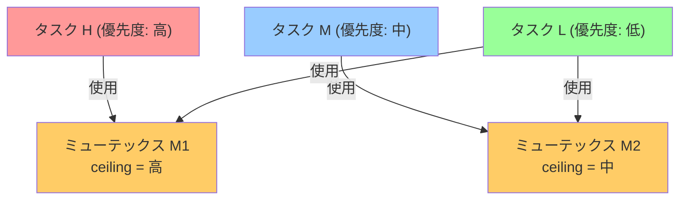

PCP の重要な特性は以下の通りである。

- **デッドロック防止**: PCP のルールに従えば、デッドロックは構造的に発生しない
- **ブロッキング時間の上界**: 各タスクのブロッキング時間は最大でも1つのクリティカルセクションの実行時間に制限される
- **予測可能性**: リアルタイムシステムの解析に適している

> [!NOTE]
> Linux カーネルの `RT_MUTEX`（リアルタイムミューテックス）は優先度継承をサポートしている。POSIX の `pthread_mutexattr_setprotocol()` を使用して、`PTHREAD_PRIO_INHERIT`（優先度継承）または `PTHREAD_PRIO_PROTECT`（優先度上限）を指定できる。

#### 3. 即時優先度上限プロトコル（Immediate Priority Ceiling Protocol: IPCP）

PCP の変種で、ミューテックスを取得した時点で即座にタスクの優先度をそのミューテックスの上限まで引き上げる。タスクがミューテックスを解放すると、優先度は元に戻される。

PCP よりも実装がシンプルで、多くの RTOS（リアルタイム OS）で採用されている。ただし、ミューテックスを使用するタスクの優先度が実際にはそのミューテックスの上限未満であっても、一律に引き上げられるため、不必要に他のタスクの実行を妨げる場合がある。

### Linux における優先度逆転対策

Linux カーネルでは、以下の仕組みが優先度逆転に対応している。

| 機構 | 説明 |
|---|---|
| `rt_mutex` | 優先度継承をサポートするミューテックス。リアルタイムタスク向け |
| `PREEMPT_RT` パッチ | Linux をフルプリエンプティブなリアルタイム OS に変換するパッチセット。スピンロックをミューテックスに置き換え、優先度継承を広く適用 |
| `PI futex` | ユーザー空間の futex に優先度継承を適用する仕組み。`PTHREAD_PRIO_INHERIT` を指定した pthread_mutex で利用される |

## 実践的な対策とデバッグ手法

### デッドロックの検出ツール

#### ThreadSanitizer（TSan）

Clang/GCC に搭載された動的解析ツールで、データ競合に加えてデッドロック（ロック順序の不整合）も検出できる。

```c
// Compile with: clang -fsanitize=thread -g example.c
#include <pthread.h>

pthread_mutex_t mu1 = PTHREAD_MUTEX_INITIALIZER;
pthread_mutex_t mu2 = PTHREAD_MUTEX_INITIALIZER;

void *thread1(void *arg) {
    pthread_mutex_lock(&mu1);
    pthread_mutex_lock(&mu2);  // order: mu1 -> mu2
    pthread_mutex_unlock(&mu2);
    pthread_mutex_unlock(&mu1);
    return NULL;
}

void *thread2(void *arg) {
    pthread_mutex_lock(&mu2);
    pthread_mutex_lock(&mu1);  // order: mu2 -> mu1 (inconsistent!)
    pthread_mutex_unlock(&mu1);
    pthread_mutex_unlock(&mu2);
    return NULL;
}
```

TSan は実行時にロックの取得順序を記録し、矛盾する順序を検出すると警告を出力する。

```
WARNING: ThreadSanitizer: lock-order-inversion (potential deadlock)
  Cycle in lock order graph: M1 (0x...) => M2 (0x...) => M1
```

#### Valgrind Helgrind

Valgrind のスレッドエラー検出ツール。ロック順序の不整合を静的に検出する。

```bash
valgrind --tool=helgrind ./my_program
```

#### Java の jstack / jcmd

Java アプリケーションでは、`jstack` コマンドでスレッドダンプを取得し、デッドロックを検出できる。

```bash
jstack <pid>
```

JVM はデッドロック検出機能を内蔵しており、`jstack` の出力にはデッドロックが発生しているスレッドとそのスタックトレースが含まれる。

```
Found one Java-level deadlock:
=============================
"Thread-1":
  waiting to lock monitor 0x... (object 0x..., a java.lang.Object),
  which is held by "Thread-0"
"Thread-0":
  waiting to lock monitor 0x... (object 0x..., a java.lang.Object),
  which is held by "Thread-1"
```

### ライブロックの検出

ライブロックはデッドロックと異なり、スレッドがブロックされていないため、従来のデッドロック検出ツールでは発見が困難である。以下の手法が有効だ。

1. **CPU 使用率の監視**: ライブロック状態では、スレッドが能動的に動作しているため CPU 使用率が高くなるが、スループットはゼロに近い。CPU 使用率が高いにもかかわらず処理が進行していない場合、ライブロックを疑うべきである
2. **進行度メトリクスの追加**: 各スレッドが「有用な仕事を何件完了したか」を記録するカウンタを設け、カウンタが一定時間進行しない場合にアラートを出す
3. **ロギングとトレーシング**: リトライ回数やバックオフの頻度をログに記録し、異常なパターンを検出する

### 設計レベルでのベストプラクティス

並行処理の危険性を回避するための設計原則をまとめる。

#### 1. ロックの粒度を適切に選ぶ

ロックの粒度が粗すぎると並行性が失われ、細かすぎるとデッドロックのリスクが高まる。

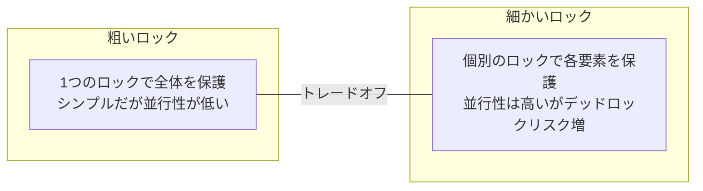

#### 2. ロック順序を統一する

複数のロックを取得する必要がある場合、システム全体で一貫した順序を定義し、それを厳守する。

```rust
// In Rust, lock ordering can be enforced by design
struct TransferContext {
    // Always lock accounts in order of account_id
    from_account: Account,
    to_account: Account,
}

impl TransferContext {
    fn execute(&self) {
        let (first, second) = if self.from_account.id < self.to_account.id {
            (&self.from_account, &self.to_account)
        } else {
            (&self.to_account, &self.from_account)
        };

        let _lock1 = first.mutex.lock().unwrap();
        let _lock2 = second.mutex.lock().unwrap();
        // perform transfer
    }
}
```

#### 3. ロック保持時間を最小化する

クリティカルセクション内では、必要最小限の操作のみを行う。I/O 操作やネットワーク通信をロック保持中に行うことは極力避ける。

```go
// Bad: I/O under lock
func badExample(mu *sync.Mutex, db *sql.DB) {
    mu.Lock()
    defer mu.Unlock()
    // Network I/O while holding the lock — BAD
    rows, _ := db.Query("SELECT * FROM users")
    _ = rows
}

// Good: minimize lock scope
func goodExample(mu *sync.Mutex, db *sql.DB) {
    // Read data without holding the lock
    rows, _ := db.Query("SELECT * FROM users")

    mu.Lock()
    defer mu.Unlock()
    // Only hold the lock for the critical section
    _ = rows
}
```

#### 4. ロックフリーのデータ構造を検討する

可能であれば、ロックを使わないアルゴリズムやデータ構造を検討する。CAS（Compare-And-Swap）操作を基盤としたロックフリー・キューやロックフリー・スタックは、デッドロックやライブロックが構造的に発生しない。ただし、正確な実装は非常に難しく、ABA 問題やメモリ管理の課題がある。

#### 5. タイムアウトを必ず設定する

ロックの取得に無期限に待つのではなく、タイムアウトを設定する。タイムアウトが発生した場合は、保持しているロックを解放してリトライするか、エラーとして上位に報告する。

```java
import java.util.concurrent.locks.ReentrantLock;
import java.util.concurrent.TimeUnit;

ReentrantLock lock = new ReentrantLock();

public void criticalSection() throws InterruptedException {
    // Try to acquire the lock with a 5-second timeout
    if (lock.tryLock(5, TimeUnit.SECONDS)) {
        try {
            // critical section
        } finally {
            lock.unlock();
        }
    } else {
        // Handle timeout: log, retry, or propagate error
        throw new RuntimeException("Failed to acquire lock within timeout");
    }
}
```

#### 6. 階層的ロック設計

システムのコンポーネントを階層構造として整理し、ロックの取得は必ず上位から下位の方向でのみ行うルールを設ける。

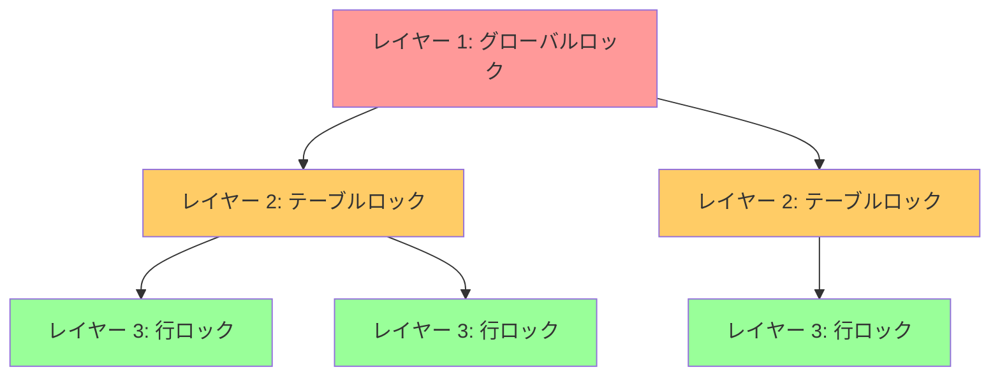

この階層に沿ってロックを取得する限り、循環待ちは発生しない。データベースのロック管理（テーブルロック -> ページロック -> 行ロック）はこの原則に基づいている。

### 三つの危険性の比較表

最後に、本記事で扱った三つの並行処理の危険性を比較する。

| 特性 | デッドロック | ライブロック | 優先度逆転 |
|---|---|---|---|
| **定義** | スレッドが互いのリソース解放を待ち、永久に停止 | スレッドが能動的に動くが有用な進行がない | 高優先度タスクが低優先度タスクに阻害される |
| **スレッド状態** | ブロック | アクティブ | 高優先度タスクがブロック |
| **CPU使用率** | 低い | 高い | 状況依存 |
| **検出の容易さ** | 比較的容易（Wait-forグラフ） | 困難 | 中程度 |
| **根本原因** | 循環的なリソース依存 | 対称的なリトライパターン | 優先度とリソースロックの矛盾 |
| **主な対策** | ロック順序の統一 | ランダムバックオフ | 優先度継承/上限プロトコル |
| **発生環境** | あらゆる並行システム | リトライベースのシステム | リアルタイムシステム |

## まとめ

並行処理の三大危険性であるデッドロック、ライブロック、優先度逆転は、いずれも「システムが期待通りに進行しない」という問題を引き起こす。

**デッドロック**は最も古典的かつよく理解された問題であり、Coffman の4条件という明確な理論的枠組みがある。ロック順序の統一という実践的な防止策が広く普及しており、データベースシステムでは検出・回復の仕組みが標準装備されている。

**ライブロック**はデッドロックよりも検出が困難で、皮肉にもデッドロック防止策（trylock + リトライ）が原因で発生することがある。ランダムバックオフによる対称性の破壊が最も効果的な対策であり、この原理はネットワークプロトコル（Ethernet CSMA/CD）から並行プログラミングまで幅広く応用されている。

**優先度逆転**はリアルタイムシステム特有の問題であり、Mars Pathfinder 事件という劇的な実例で世界的に認知された。優先度継承プロトコルと優先度上限プロトコルが標準的な解決策であり、現代の RTOS やLinux の RT_MUTEX に実装されている。

これらの問題に対する最善のアプローチは、設計段階で危険性を認識し、構造的に防止することである。ロック順序の統一、ロック保持時間の最小化、タイムアウトの設定、そして適切なデバッグツール（ThreadSanitizer、Helgrind など）の活用が、堅牢な並行システムを構築するための基盤となる。
